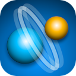
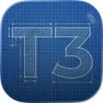

# AI

| [Back to Home](index.md) | [Back to Applications](apps.md)
| --- | --- |

#### Here are listed **88** programs for this category.

  <label for="app-search-input" style="font-weight: bold;">Search applications:</label>
  <input type="search" id="app-search-input" placeholder="Type a name or keyword..." autocomplete="off"
    style="width: 100%; max-width: 480px; padding: 0.5em 0.75em; margin-top: 0.25em; font-size: 1em; border: 1px solid #999; border-radius: 4px; box-sizing: border-box;">
  

#### *Categories*

  <a class="cat-pill" href="appimages.html">AppImages</a>
  •
  <a class="cat-pill cat-pill--all" href="ai.html">ai</a>
  •
  <a class="cat-pill" href="am-utils.html">am-utils</a>
  •
  <a class="cat-pill" href="appimage-on-the-fly.html">appimage-on-the-fly</a>
  •
  <a class="cat-pill" href="android.html">android</a>
  •
  <a class="cat-pill" href="audio.html">audio</a>
  •
  <a class="cat-pill" href="comic.html">comic</a>
  •
  <a class="cat-pill" href="command-line.html">command-line</a>
  •
  <a class="cat-pill" href="communication.html">communication</a>
  •
  <a class="cat-pill" href="disk.html">disk</a>
  •
  <a class="cat-pill" href="education.html">education</a>
  •
  <a class="cat-pill" href="file-manager.html">file-manager</a>
  •
  <a class="cat-pill" href="finance.html">finance</a>
  •
  <a class="cat-pill" href="game.html">game</a>
  •
  <a class="cat-pill" href="gnome.html">gnome</a>
  •
  <a class="cat-pill" href="graphic.html">graphic</a>
  •
  <a class="cat-pill" href="internet.html">internet</a>
  •
  <a class="cat-pill" href="kde.html">kde</a>
  •
  <a class="cat-pill" href="metapackages.html">metapackages</a>
  •
  <a class="cat-pill" href="office.html">office</a>
  •
  <a class="cat-pill" href="password.html">password</a>
  •
  <a class="cat-pill" href="portable.html">Portable</a>
  •
  <a class="cat-pill" href="portable-cli.html">portable-cli</a>
  •
  <a class="cat-pill" href="portable-desktop.html">portable-desktop</a>
  •
  <a class="cat-pill" href="steam.html">steam</a>
  •
  <a class="cat-pill" href="system-monitor.html">system-monitor</a>
  •
  <a class="cat-pill" href="video.html">video</a>
  •
  <a class="cat-pill" href="web-app.html">web-app</a>
  •
  <a class="cat-pill" href="web-browser.html">web-browser</a>
  •
  <a class="cat-pill" href="wine.html">wine</a>

-----------------

***NOTE, Installer scripts (blob/raw) are provided for reading only: do not run them manually! Use "[AM](https://github.com/ivan-hc/AM)" or "[AppMan](https://github.com/ivan-hc/AppMan)" instead.***

-----------------

| ICON | PACKAGE NAME | DESCRIPTION | INSTALLER |
| --- | --- | --- | --- |
|  | [***5ire***](apps/5ire.md) | *5ire is a cross-platform desktop AI assistant, MCP client. It compatible with major service providers, supports local knowledge base and tools via model context protocol servers.*..[ *read more* ](apps/5ire.md)*!* | [*blob*](https://github.com/ivan-hc/AM/blob/main/programs/x86_64/5ire) **/** [*raw*](https://raw.githubusercontent.com/ivan-hc/AM/main/programs/x86_64/5ire) |
|  | [***aichat***](apps/aichat.md) | *AIO AI CLI tool integrating 20+ AI platforms, including OpenAI.*..[ *read more* ](apps/aichat.md)*!* | [*blob*](https://github.com/ivan-hc/AM/blob/main/programs/x86_64/aichat) **/** [*raw*](https://raw.githubusercontent.com/ivan-hc/AM/main/programs/x86_64/aichat) |
|  | [***alma***](apps/alma.md) | *Elegant AI Provider Orchestration. A beautiful desktop application that unifies your AI experience. Seamlessly switch between OpenAI, Anthropic, Google Gemini, and custom providers.*..[ *read more* ](apps/alma.md)*!* | [*blob*](https://github.com/ivan-hc/AM/blob/main/programs/x86_64/alma) **/** [*raw*](https://raw.githubusercontent.com/ivan-hc/AM/main/programs/x86_64/alma) |
|  | [***amfora***](apps/amfora.md) | *A fancy terminal browser for the Gemini protocol.*..[ *read more* ](apps/amfora.md)*!* | [*blob*](https://github.com/ivan-hc/AM/blob/main/programs/x86_64/amfora) **/** [*raw*](https://raw.githubusercontent.com/ivan-hc/AM/main/programs/x86_64/amfora) |
|  | [***any-code***](apps/any-code.md) | *Claude Code CLI, OpenAI Codex, and Google Gemini CLI.*..[ *read more* ](apps/any-code.md)*!* | [*blob*](https://github.com/ivan-hc/AM/blob/main/programs/x86_64/any-code) **/** [*raw*](https://raw.githubusercontent.com/ivan-hc/AM/main/programs/x86_64/any-code) |
|  | [***anything-llm***](apps/anything-llm.md) | *AI business intelligence tool. Any LLM, any document.*..[ *read more* ](apps/anything-llm.md)*!* | [*blob*](https://github.com/ivan-hc/AM/blob/main/programs/x86_64/anything-llm) **/** [*raw*](https://raw.githubusercontent.com/ivan-hc/AM/main/programs/x86_64/anything-llm) |
|  | [***apiflow***](apps/apiflow.md) | *A modern API workspace that works both online and offlinecombining API documentation, testing, mock, and AI-powered automation in one lightweight tool.*..[ *read more* ](apps/apiflow.md)*!* | [*blob*](https://github.com/ivan-hc/AM/blob/main/programs/x86_64/apiflow) **/** [*raw*](https://raw.githubusercontent.com/ivan-hc/AM/main/programs/x86_64/apiflow) |
|  | [***appflowy***](apps/appflowy.md) | *Bring projects, wikis, and teams together with AI. AppFlowy is the AI collaborative workspace where you achieve more without losing control of your data. The leading open source Notion alternative.*..[ *read more* ](apps/appflowy.md)*!* | [*blob*](https://github.com/ivan-hc/AM/blob/main/programs/x86_64/appflowy) **/** [*raw*](https://raw.githubusercontent.com/ivan-hc/AM/main/programs/x86_64/appflowy) |
|  | [***auto-claude***](apps/auto-claude.md) | *Autonomous multi-session AI coding framework that plans, builds, and validates software for you.*..[ *read more* ](apps/auto-claude.md)*!* | [*blob*](https://github.com/ivan-hc/AM/blob/main/programs/x86_64/auto-claude) **/** [*raw*](https://raw.githubusercontent.com/ivan-hc/AM/main/programs/x86_64/auto-claude) |
|  | [***bearly***](apps/bearly.md) | *The world's best AI at your fingertips.*..[ *read more* ](apps/bearly.md)*!* | [*blob*](https://github.com/ivan-hc/AM/blob/main/programs/x86_64/bearly) **/** [*raw*](https://raw.githubusercontent.com/ivan-hc/AM/main/programs/x86_64/bearly) |
|  | [***bezique***](apps/bezique.md) | *Plays bezique game against the AI.*..[ *read more* ](apps/bezique.md)*!* | [*blob*](https://github.com/ivan-hc/AM/blob/main/programs/x86_64/bezique) **/** [*raw*](https://raw.githubusercontent.com/ivan-hc/AM/main/programs/x86_64/bezique) |
|  | [***binglite***](apps/binglite.md) | *A lightweight new Bing (AI chat) desktop application based on Tauri.*..[ *read more* ](apps/binglite.md)*!* | [*blob*](https://github.com/ivan-hc/AM/blob/main/programs/x86_64/binglite) **/** [*raw*](https://raw.githubusercontent.com/ivan-hc/AM/main/programs/x86_64/binglite) |
|  | [***bottlebats***](apps/bottlebats.md) | *Client for the 2018 edition of the BottleBats AI competition.*..[ *read more* ](apps/bottlebats.md)*!* | [*blob*](https://github.com/ivan-hc/AM/blob/main/programs/x86_64/bottlebats) **/** [*raw*](https://raw.githubusercontent.com/ivan-hc/AM/main/programs/x86_64/bottlebats) |
|  | [***chat-gpt***](apps/chat-gpt.md) | *Unofficial. ChatGPT Desktop Application.*..[ *read more* ](apps/chat-gpt.md)*!* | [*blob*](https://github.com/ivan-hc/AM/blob/main/programs/x86_64/chat-gpt) **/** [*raw*](https://raw.githubusercontent.com/ivan-hc/AM/main/programs/x86_64/chat-gpt) |
|  | [***chatall***](apps/chatall.md) | *Concurrently chat with ChatGPT, Bing Chat, bard, Alpaca and more.*..[ *read more* ](apps/chatall.md)*!* | [*blob*](https://github.com/ivan-hc/AM/blob/main/programs/x86_64/chatall) **/** [*raw*](https://raw.githubusercontent.com/ivan-hc/AM/main/programs/x86_64/chatall) |
|  | [***chatbox***](apps/chatbox.md) | *Chatbox is a desktop app for GPT-4 / GPT-3.5, OpenAI API.*..[ *read more* ](apps/chatbox.md)*!* | [*blob*](https://github.com/ivan-hc/AM/blob/main/programs/x86_64/chatbox) **/** [*raw*](https://raw.githubusercontent.com/ivan-hc/AM/main/programs/x86_64/chatbox) |
|  | [***chatgpt-next-web***](apps/chatgpt-next-web.md) | *A cross-platform ChatGPT/Gemini UI.*..[ *read more* ](apps/chatgpt-next-web.md)*!* | [*blob*](https://github.com/ivan-hc/AM/blob/main/programs/x86_64/chatgpt-next-web) **/** [*raw*](https://raw.githubusercontent.com/ivan-hc/AM/main/programs/x86_64/chatgpt-next-web) |
|  | [***chatpad-ai***](apps/chatpad-ai.md) | *Not just another ChatGPT user-interface.*..[ *read more* ](apps/chatpad-ai.md)*!* | [*blob*](https://github.com/ivan-hc/AM/blob/main/programs/x86_64/chatpad-ai) **/** [*raw*](https://raw.githubusercontent.com/ivan-hc/AM/main/programs/x86_64/chatpad-ai) |
|  | [***chemcanvas***](apps/chemcanvas.md) | *A very intuitive 2D chemical drawing tool.*..[ *read more* ](apps/chemcanvas.md)*!* | [*blob*](https://github.com/ivan-hc/AM/blob/main/programs/x86_64/chemcanvas) **/** [*raw*](https://raw.githubusercontent.com/ivan-hc/AM/main/programs/x86_64/chemcanvas) |
|  | [***cherry-studio***](apps/cherry-studio.md) | *Agentic AI desktop with autonomous coding, intelligent automation, and unified access to frontier LLMs.*..[ *read more* ](apps/cherry-studio.md)*!* | [*blob*](https://github.com/ivan-hc/AM/blob/main/programs/x86_64/cherry-studio) **/** [*raw*](https://raw.githubusercontent.com/ivan-hc/AM/main/programs/x86_64/cherry-studio) |
|  | [***clagrange***](apps/clagrange.md) | *Lagrange is a cross-platform client for browsing Geminispace (CLI Version).*..[ *read more* ](apps/clagrange.md)*!* | [*blob*](https://github.com/ivan-hc/AM/blob/main/programs/x86_64/clagrange) **/** [*raw*](https://raw.githubusercontent.com/ivan-hc/AM/main/programs/x86_64/clagrange) |
|  | [***claude-desktop***](apps/claude-desktop.md) | *Unofficial, Claude is a next generation AI assistant built by Anthropic and trained to be safe, accurate, and secure to help you do your best work.*..[ *read more* ](apps/claude-desktop.md)*!* | [*blob*](https://github.com/ivan-hc/AM/blob/main/programs/x86_64/claude-desktop) **/** [*raw*](https://raw.githubusercontent.com/ivan-hc/AM/main/programs/x86_64/claude-desktop) |
|  | [***cmux***](apps/cmux.md) | *Cmux/ManaflowX is an X feed for coding agents that lets you run + compare Claude Code, Codex CLI, Amp, Gemini CLI, Cursor CLI, Opencode, and other coding agent CLIs in parallel across multiple tasks.*..[ *read more* ](apps/cmux.md)*!* | [*blob*](https://github.com/ivan-hc/AM/blob/main/programs/x86_64/cmux) **/** [*raw*](https://raw.githubusercontent.com/ivan-hc/AM/main/programs/x86_64/cmux) |
|  | [***cursor***](apps/cursor.md) | *Built to make you extraordinarily productive, Cursor is the best way to code with AI.*..[ *read more* ](apps/cursor.md)*!* | [*blob*](https://github.com/ivan-hc/AM/blob/main/programs/x86_64/cursor) **/** [*raw*](https://raw.githubusercontent.com/ivan-hc/AM/main/programs/x86_64/cursor) |
|  | [***cursor-cli***](apps/cursor-cli.md) | *Unofficial, AI-assisted development CLI tool.*..[ *read more* ](apps/cursor-cli.md)*!* | [*blob*](https://github.com/ivan-hc/AM/blob/main/programs/x86_64/cursor-cli) **/** [*raw*](https://raw.githubusercontent.com/ivan-hc/AM/main/programs/x86_64/cursor-cli) |
|  | [***drawpile***](apps/drawpile.md) | *Drawing program to sketch on the same canvas simultaneously.*..[ *read more* ](apps/drawpile.md)*!* | [*blob*](https://github.com/ivan-hc/AM/blob/main/programs/x86_64/drawpile) **/** [*raw*](https://raw.githubusercontent.com/ivan-hc/AM/main/programs/x86_64/drawpile) |
|  | [***firefly-desktop***](apps/firefly-desktop.md) | *The official IOTA and Shimmer wallet.*..[ *read more* ](apps/firefly-desktop.md)*!* | [*blob*](https://github.com/ivan-hc/AM/blob/main/programs/x86_64/firefly-desktop) **/** [*raw*](https://raw.githubusercontent.com/ivan-hc/AM/main/programs/x86_64/firefly-desktop) |
|  | [***folo***](apps/folo.md) | *Folo is the AI Reader.*..[ *read more* ](apps/folo.md)*!* | [*blob*](https://github.com/ivan-hc/AM/blob/main/programs/x86_64/folo) **/** [*raw*](https://raw.githubusercontent.com/ivan-hc/AM/main/programs/x86_64/folo) |
|  | [***gemalaya***](apps/gemalaya.md) | *A keyboard-driven Gemini browser written in QML.*..[ *read more* ](apps/gemalaya.md)*!* | [*blob*](https://github.com/ivan-hc/AM/blob/main/programs/x86_64/gemalaya) **/** [*raw*](https://raw.githubusercontent.com/ivan-hc/AM/main/programs/x86_64/gemalaya) |
|  | [***gemget***](apps/gemget.md) | *Command line downloader for the Gemini protocol.*..[ *read more* ](apps/gemget.md)*!* | [*blob*](https://github.com/ivan-hc/AM/blob/main/programs/x86_64/gemget) **/** [*raw*](https://raw.githubusercontent.com/ivan-hc/AM/main/programs/x86_64/gemget) |
|  | [***gextractwinicons***](apps/gextractwinicons.md) | *Extract cursors, icons and images from MS Windows files.*..[ *read more* ](apps/gextractwinicons.md)*!* | [*blob*](https://github.com/ivan-hc/AM/blob/main/programs/x86_64/gextractwinicons) **/** [*raw*](https://raw.githubusercontent.com/ivan-hc/AM/main/programs/x86_64/gextractwinicons) |
|  | [***go-pd-gui***](apps/go-pd-gui.md) | *DRAINY is a free easy to use cross plattform upload tool for pixeldrain.com.*..[ *read more* ](apps/go-pd-gui.md)*!* | [*blob*](https://github.com/ivan-hc/AM/blob/main/programs/x86_64/go-pd-gui) **/** [*raw*](https://raw.githubusercontent.com/ivan-hc/AM/main/programs/x86_64/go-pd-gui) |
|  | [***godmode***](apps/godmode.md) | *AI Chat Browser fast, full webapp access to ChatGPT/Claude/Bard/Bing/Llama2.*..[ *read more* ](apps/godmode.md)*!* | [*blob*](https://github.com/ivan-hc/AM/blob/main/programs/x86_64/godmode) **/** [*raw*](https://raw.githubusercontent.com/ivan-hc/AM/main/programs/x86_64/godmode) |
|  | [***hugin***](apps/hugin.md) | *Stitch photographs together.*..[ *read more* ](apps/hugin.md)*!* | [*blob*](https://github.com/ivan-hc/AM/blob/main/programs/x86_64/hugin) **/** [*raw*](https://raw.githubusercontent.com/ivan-hc/AM/main/programs/x86_64/hugin) |
|  | [***inkscape***](apps/inkscape.md) | *Unofficial. Vector-based drawing program and graphics editor for both artistic and technical illustrations. It can import and export various file formats, including SVG, AI, EPS, PDF, AutoCAD, PS and PNG.*..[ *read more* ](apps/inkscape.md)*!* | [*blob*](https://github.com/ivan-hc/AM/blob/main/programs/x86_64/inkscape) **/** [*raw*](https://raw.githubusercontent.com/ivan-hc/AM/main/programs/x86_64/inkscape) |
|  | [***jan***](apps/jan.md) | *FOSS Alternative to ChatGPT that runs 100% offline on your computer.*..[ *read more* ](apps/jan.md)*!* | [*blob*](https://github.com/ivan-hc/AM/blob/main/programs/x86_64/jan) **/** [*raw*](https://raw.githubusercontent.com/ivan-hc/AM/main/programs/x86_64/jan) |
|  | [***kftray***](apps/kftray.md) | *Kubectl port-forward manager and reverse tunnel (ngrok-like) for exposing local services publicly, with TLS termination, HTTP traffic inspection, UDP forwarding, multi-hop proxy routing through k8s clusters, stateful config via filesystem or git.*..[ *read more* ](apps/kftray.md)*!* | [*blob*](https://github.com/ivan-hc/AM/blob/main/programs/x86_64/kftray) **/** [*raw*](https://raw.githubusercontent.com/ivan-hc/AM/main/programs/x86_64/kftray) |
|  | [***kinopio***](apps/kinopio.md) | *Thinking canvas for new ideas and hard problems.*..[ *read more* ](apps/kinopio.md)*!* | [*blob*](https://github.com/ivan-hc/AM/blob/main/programs/x86_64/kinopio) **/** [*raw*](https://raw.githubusercontent.com/ivan-hc/AM/main/programs/x86_64/kinopio) |
|  | [***koboldcpp***](apps/koboldcpp.md) | *Simple 1-file way to run GGML and GGUF models with KoboldAI's UI.*..[ *read more* ](apps/koboldcpp.md)*!* | [*blob*](https://github.com/ivan-hc/AM/blob/main/programs/x86_64/koboldcpp) **/** [*raw*](https://raw.githubusercontent.com/ivan-hc/AM/main/programs/x86_64/koboldcpp) |
|  | [***lagrange***](apps/lagrange.md) | *Lagrange is a cross-platform client for browsing Geminispace (GUI Version).*..[ *read more* ](apps/lagrange.md)*!* | [*blob*](https://github.com/ivan-hc/AM/blob/main/programs/x86_64/lagrange) **/** [*raw*](https://raw.githubusercontent.com/ivan-hc/AM/main/programs/x86_64/lagrange) |
|  | [***lazpaint***](apps/lazpaint.md) | *Cross-platform image editor with raster and vector layers similar to Paint.Net written in Lazarus (Free Pascal).*..[ *read more* ](apps/lazpaint.md)*!* | [*blob*](https://github.com/ivan-hc/AM/blob/main/programs/x86_64/lazpaint) **/** [*raw*](https://raw.githubusercontent.com/ivan-hc/AM/main/programs/x86_64/lazpaint) |
|  | [***lexido***](apps/lexido.md) | *A terminal assistant, powered by Generative AI.*..[ *read more* ](apps/lexido.md)*!* | [*blob*](https://github.com/ivan-hc/AM/blob/main/programs/x86_64/lexido) **/** [*raw*](https://raw.githubusercontent.com/ivan-hc/AM/main/programs/x86_64/lexido) |
|  | [***lmstudio***](apps/lmstudio.md) | *Experimenting with local and open-source Large Language Models.*..[ *read more* ](apps/lmstudio.md)*!* | [*blob*](https://github.com/ivan-hc/AM/blob/main/programs/x86_64/lmstudio) **/** [*raw*](https://raw.githubusercontent.com/ivan-hc/AM/main/programs/x86_64/lmstudio) |
|  | [***lobe-chat***](apps/lobe-chat.md) | *LobeHub - an open-source, modern design AI Agent Workspace. Supports multiple AI providers, Knowledge Base (file upload / RAG ), one click install MCP Marketplace and Artifacts / Thinking. One-click FREE deployment of your private AI Agent application.*..[ *read more* ](apps/lobe-chat.md)*!* | [*blob*](https://github.com/ivan-hc/AM/blob/main/programs/x86_64/lobe-chat) **/** [*raw*](https://raw.githubusercontent.com/ivan-hc/AM/main/programs/x86_64/lobe-chat) |
|  | [***lorien***](apps/lorien.md) | *Infinite canvas drawing/whiteboarding app.*..[ *read more* ](apps/lorien.md)*!* | [*blob*](https://github.com/ivan-hc/AM/blob/main/programs/x86_64/lorien) **/** [*raw*](https://raw.githubusercontent.com/ivan-hc/AM/main/programs/x86_64/lorien) |
|  | [***mapic***](apps/mapic.md) | *MaPic is a Image Viewer with AI Metadata Reader.*..[ *read more* ](apps/mapic.md)*!* | [*blob*](https://github.com/ivan-hc/AM/blob/main/programs/x86_64/mapic) **/** [*raw*](https://raw.githubusercontent.com/ivan-hc/AM/main/programs/x86_64/mapic) |
|  | [***moonplayer***](apps/moonplayer.md) | *AIO video player to play Youtube, Bilibili... and local videos.*..[ *read more* ](apps/moonplayer.md)*!* | [*blob*](https://github.com/ivan-hc/AM/blob/main/programs/x86_64/moonplayer) **/** [*raw*](https://raw.githubusercontent.com/ivan-hc/AM/main/programs/x86_64/moonplayer) |
|  | [***mrrss***](apps/mrrss.md) | *A modern, cross-platform, and free AI RSS reader.*..[ *read more* ](apps/mrrss.md)*!* | [*blob*](https://github.com/ivan-hc/AM/blob/main/programs/x86_64/mrrss) **/** [*raw*](https://raw.githubusercontent.com/ivan-hc/AM/main/programs/x86_64/mrrss) |
|  | [***neko***](apps/neko.md) | *Neko is a cross-platform cursor-chasing cat.*..[ *read more* ](apps/neko.md)*!* | [*blob*](https://github.com/ivan-hc/AM/blob/main/programs/x86_64/neko) **/** [*raw*](https://raw.githubusercontent.com/ivan-hc/AM/main/programs/x86_64/neko) |
|  | [***noi***](apps/noi.md) | *🚀 an AI-enhanced, customizable browser designed to streamline your digital experience.*..[ *read more* ](apps/noi.md)*!* | [*blob*](https://github.com/ivan-hc/AM/blob/main/programs/x86_64/noi) **/** [*raw*](https://raw.githubusercontent.com/ivan-hc/AM/main/programs/x86_64/noi) |
|  | [***nuclia***](apps/nuclia.md) | *A low-code API to build an AI multi-language semantic search engine.*..[ *read more* ](apps/nuclia.md)*!* | [*blob*](https://github.com/ivan-hc/AM/blob/main/programs/x86_64/nuclia) **/** [*raw*](https://raw.githubusercontent.com/ivan-hc/AM/main/programs/x86_64/nuclia) |
|  | [***nuclino***](apps/nuclino.md) | *Bring knowledge, docs, and projects together in one place.*..[ *read more* ](apps/nuclino.md)*!* | [*blob*](https://github.com/ivan-hc/AM/blob/main/programs/x86_64/nuclino) **/** [*raw*](https://raw.githubusercontent.com/ivan-hc/AM/main/programs/x86_64/nuclino) |
|  | [***nychess***](apps/nychess.md) | *A python Chess Engine and AI.*..[ *read more* ](apps/nychess.md)*!* | [*blob*](https://github.com/ivan-hc/AM/blob/main/programs/x86_64/nychess) **/** [*raw*](https://raw.githubusercontent.com/ivan-hc/AM/main/programs/x86_64/nychess) |
|  | [***ollama***](apps/ollama.md) | *Get up and running with Llama 3, Mistral, Gemma, and other LLMs.*..[ *read more* ](apps/ollama.md)*!* | [*blob*](https://github.com/ivan-hc/AM/blob/main/programs/x86_64/ollama) **/** [*raw*](https://raw.githubusercontent.com/ivan-hc/AM/main/programs/x86_64/ollama) |
|  | [***omniroute***](apps/omniroute.md) | *an OpenAI-compatible endpoint with smart routing, load balancing, retries, and fallbacks. Add policies, rate limits, caching, and observability for reliable, cost-aware inference.*..[ *read more* ](apps/omniroute.md)*!* | [*blob*](https://github.com/ivan-hc/AM/blob/main/programs/x86_64/omniroute) **/** [*raw*](https://raw.githubusercontent.com/ivan-hc/AM/main/programs/x86_64/omniroute) |
|  | [***one-gpt***](apps/one-gpt.md) | *Aggregate ChatGPT official version, Wenxin Yiyan, Poe, chatchat.*..[ *read more* ](apps/one-gpt.md)*!* | [*blob*](https://github.com/ivan-hc/AM/blob/main/programs/x86_64/one-gpt) **/** [*raw*](https://raw.githubusercontent.com/ivan-hc/AM/main/programs/x86_64/one-gpt) |
|  | [***open-ai-translator***](apps/open-ai-translator.md) | *Browser extension for translation based on ChatGPT API.*..[ *read more* ](apps/open-ai-translator.md)*!* | [*blob*](https://github.com/ivan-hc/AM/blob/main/programs/x86_64/open-ai-translator) **/** [*raw*](https://raw.githubusercontent.com/ivan-hc/AM/main/programs/x86_64/open-ai-translator) |
|  | [***open-pencil***](apps/open-pencil.md) | *AI-native design editor. Open-source Figma alternative.*..[ *read more* ](apps/open-pencil.md)*!* | [*blob*](https://github.com/ivan-hc/AM/blob/main/programs/x86_64/open-pencil) **/** [*raw*](https://raw.githubusercontent.com/ivan-hc/AM/main/programs/x86_64/open-pencil) |
|  | [***open-webui***](apps/open-webui.md) | *Your AI, right on your desktop. Open WebUI as a native app. Run models locally or connect to any server. No Docker, no terminal, no setup. Download, launch, chat.*..[ *read more* ](apps/open-webui.md)*!* | [*blob*](https://github.com/ivan-hc/AM/blob/main/programs/x86_64/open-webui) **/** [*raw*](https://raw.githubusercontent.com/ivan-hc/AM/main/programs/x86_64/open-webui) |
|  | [***paper-design***](apps/paper-design.md) | *Paper is a modern and powerful design tool that helps you create, share, and ship your best work. Design incredible, the connected canvas for teams shipping with agents.*..[ *read more* ](apps/paper-design.md)*!* | [*blob*](https://github.com/ivan-hc/AM/blob/main/programs/x86_64/paper-design) **/** [*raw*](https://raw.githubusercontent.com/ivan-hc/AM/main/programs/x86_64/paper-design) |
|  | [***perplexity-ai-app***](apps/perplexity-ai-app.md) | *Perplexity AI Desktop app eases the process to access Perplexity AI.*..[ *read more* ](apps/perplexity-ai-app.md)*!* | [*blob*](https://github.com/ivan-hc/AM/blob/main/programs/x86_64/perplexity-ai-app) **/** [*raw*](https://raw.githubusercontent.com/ivan-hc/AM/main/programs/x86_64/perplexity-ai-app) |
|  | [***pinokio***](apps/pinokio.md) | *AI Browser.*..[ *read more* ](apps/pinokio.md)*!* | [*blob*](https://github.com/ivan-hc/AM/blob/main/programs/x86_64/pinokio) **/** [*raw*](https://raw.githubusercontent.com/ivan-hc/AM/main/programs/x86_64/pinokio) |
|  | [***pointless***](apps/pointless.md) | *An endless drawing canvas desktop app made with Tauri (Rust) and React.*..[ *read more* ](apps/pointless.md)*!* | [*blob*](https://github.com/ivan-hc/AM/blob/main/programs/x86_64/pointless) **/** [*raw*](https://raw.githubusercontent.com/ivan-hc/AM/main/programs/x86_64/pointless) |
|  | [***pulseview***](apps/pulseview.md) | *PulseView (sometimes abbreviated as "PV") is a Qt based logic analyzer, oscilloscope and MSO GUI for sigrok.*..[ *read more* ](apps/pulseview.md)*!* | [*blob*](https://github.com/ivan-hc/AM/blob/main/programs/x86_64/pulseview) **/** [*raw*](https://raw.githubusercontent.com/ivan-hc/AM/main/programs/x86_64/pulseview) |
|  | [***reor***](apps/reor.md) | *AI note-taking app that runs models locally.*..[ *read more* ](apps/reor.md)*!* | [*blob*](https://github.com/ivan-hc/AM/blob/main/programs/x86_64/reor) **/** [*raw*](https://raw.githubusercontent.com/ivan-hc/AM/main/programs/x86_64/reor) |
|  | [***seafile***](apps/seafile.md) | *Seafile GUI version. Beyond just syncing and sharing files, it lets you add custom file properties and organize your files in different views. With AI-powered automation for generating properties, Seafile offers a smarter, more efficient way to manage your files.*..[ *read more* ](apps/seafile.md)*!* | [*blob*](https://github.com/ivan-hc/AM/blob/main/programs/x86_64/seafile) **/** [*raw*](https://raw.githubusercontent.com/ivan-hc/AM/main/programs/x86_64/seafile) |
|  | [***seafile-cli***](apps/seafile-cli.md) | *Seafile CLI version. Beyond just syncing and sharing files, it lets you add custom file properties and organize your files in different views. With AI-powered automation for generating properties, Seafile offers a smarter, more efficient way to manage your files.*..[ *read more* ](apps/seafile-cli.md)*!* | [*blob*](https://github.com/ivan-hc/AM/blob/main/programs/x86_64/seafile-cli) **/** [*raw*](https://raw.githubusercontent.com/ivan-hc/AM/main/programs/x86_64/seafile-cli) |
|  | [***smuview***](apps/smuview.md) | *A Qt based source measure unit GUI for sigrok.*..[ *read more* ](apps/smuview.md)*!* | [*blob*](https://github.com/ivan-hc/AM/blob/main/programs/x86_64/smuview) **/** [*raw*](https://raw.githubusercontent.com/ivan-hc/AM/main/programs/x86_64/smuview) |
|  | [***snake-js***](apps/snake-js.md) | *Canvas/JavaScript based Snake Game with support for controllers.*..[ *read more* ](apps/snake-js.md)*!* | [*blob*](https://github.com/ivan-hc/AM/blob/main/programs/x86_64/snake-js) **/** [*raw*](https://raw.githubusercontent.com/ivan-hc/AM/main/programs/x86_64/snake-js) |
|  | [***snapclear***](apps/snapclear.md) | *Remove Image Background with AI for Free Offline.*..[ *read more* ](apps/snapclear.md)*!* | [*blob*](https://github.com/ivan-hc/AM/blob/main/programs/x86_64/snapclear) **/** [*raw*](https://raw.githubusercontent.com/ivan-hc/AM/main/programs/x86_64/snapclear) |
|  | [***speak-to-ai***](apps/speak-to-ai.md) | *Speak to AI - native Linux voice-to-text app.*..[ *read more* ](apps/speak-to-ai.md)*!* | [*blob*](https://github.com/ivan-hc/AM/blob/main/programs/x86_64/speak-to-ai) **/** [*raw*](https://raw.githubusercontent.com/ivan-hc/AM/main/programs/x86_64/speak-to-ai) |
|  | [***t3code***](apps/t3code.md) | *T3 Code is a minimal web GUI for coding agents (currently Codex and Claude, more coming soon).*..[ *read more* ](apps/t3code.md)*!* | [*blob*](https://github.com/ivan-hc/AM/blob/main/programs/x86_64/t3code) **/** [*raw*](https://raw.githubusercontent.com/ivan-hc/AM/main/programs/x86_64/t3code) |
|  | [***tgpt***](apps/tgpt.md) | *AI Chatbots in terminal without needing API keys.*..[ *read more* ](apps/tgpt.md)*!* | [*blob*](https://github.com/ivan-hc/AM/blob/main/programs/x86_64/tgpt) **/** [*raw*](https://raw.githubusercontent.com/ivan-hc/AM/main/programs/x86_64/tgpt) |
|  | [***transformer***](apps/transformer.md) | *A command-line utility for splitting large files into chunks/pieces and merging them back together.*..[ *read more* ](apps/transformer.md)*!* | [*blob*](https://github.com/ivan-hc/AM/blob/main/programs/x86_64/transformer) **/** [*raw*](https://raw.githubusercontent.com/ivan-hc/AM/main/programs/x86_64/transformer) |
|  | [***upscayl***](apps/upscayl.md) | *Free and Open Source AI Image Upscaler.*..[ *read more* ](apps/upscayl.md)*!* | [*blob*](https://github.com/ivan-hc/AM/blob/main/programs/x86_64/upscayl) **/** [*raw*](https://raw.githubusercontent.com/ivan-hc/AM/main/programs/x86_64/upscayl) |
|  | [***warp-terminal***](apps/warp-terminal.md) | *Terminal reimagined with AI and collaborative tools.*..[ *read more* ](apps/warp-terminal.md)*!* | [*blob*](https://github.com/ivan-hc/AM/blob/main/programs/x86_64/warp-terminal) **/** [*raw*](https://raw.githubusercontent.com/ivan-hc/AM/main/programs/x86_64/warp-terminal) |

---

You can improve these pages via a [pull request](https://github.com/Portable-Linux-Apps/Portable-Linux-Apps.github.io/pulls) to this site's [GitHub repository](https://github.com/Portable-Linux-Apps/Portable-Linux-Apps.github.io), or report any problems related to the installation scripts in the '[issue](https://github.com/ivan-hc/AM/issues)' section of the main database, at [https://github.com/ivan-hc/AM](https://github.com/ivan-hc/AM).

***PORTABLE-LINUX-APPS.github.io is my gift to the Linux community and was made with love for GNU/Linux and the Open Source philosophy.***

---

| [Back to Home](index.md) | [Back to Applications](apps.md)
| --- | --- |

--------

# Contacts
- **Ivan-HC** *on* [**GitHub**](https://github.com/ivan-hc)
- **AM-Ivan** *on* [**Reddit**](https://www.reddit.com/u/am-ivan)

###### *You can support me and my work on [**ko-fi.com**](https://ko-fi.com/IvanAlexHC) and [**PayPal.me**](https://paypal.me/IvanAlexHC). Thank you!*

--------

*© 2020-present Ivan Alessandro Sala aka 'Ivan-HC'* - I'm here just for fun!

