# APPLICATIONS

| [Home](https://portable-linux-apps.github.io/) |
| --- |

#### Here are listed all **2238** unique applications, AppImage packages and command line utilities managed by [AM](https://github.com/ivan-hc/AM) 	and [AppMan](https://github.com/ivan-hc/AppMan) for the x86_64 architecture, plus **79** more entries and items to help you install apps more easily.

*Use your browser's built-in search tool to easily navigate to this page or use the tags below.*

#### *Categories*

***[AppImages](https://portable-linux-apps.github.io/appimages.html)*** 	- ***[Android](https://portable-linux-apps.github.io/android.html)*** 	- ***[Audio](https://portable-linux-apps.github.io/audio.html)*** 	- ***[Command-line](https://portable-linux-apps.github.io/command-line.html)*** 	- ***[Communication](https://portable-linux-apps.github.io/communication.html)*** 	- ***[Education](https://portable-linux-apps.github.io/education.html)*** 	- ***[Game](https://portable-linux-apps.github.io/game.html)*** 	- ***[Graphic](https://portable-linux-apps.github.io/graphic.html)*** 	- ***[Internet](https://portable-linux-apps.github.io/internet.html)*** 	- ***[Office](https://portable-linux-apps.github.io/office.html)*** 	- ***[Video](https://portable-linux-apps.github.io/video.html)*** 	- ***[Web-App](https://portable-linux-apps.github.io/web-app.html)*** 	- ***[Web-Browser](https://portable-linux-apps.github.io/web-browser.html)*** 	

-----------------

| ICON | PACKAGE NAME | DESCRIPTION | INSTALLER |
| --- | --- | --- | --- |
|  | [***0ad-latest***](apps/0ad-latest.md) | *Unofficial. Real Time Strategy game of ancient warfare, development branch.*..[ *read more* ](apps/0ad-latest.md)*!* | [*blob*](https://github.com/ivan-hc/AM/blob/main/programs/x86_64/0ad-latest) **/** [*raw*](https://raw.githubusercontent.com/ivan-hc/AM/main/programs/x86_64/0ad-latest) |
|  | [***0ad***](apps/0ad.md) | *Unofficial. FOSS historical Real Time Strategy, RTS game of ancient warfare.*..[ *read more* ](apps/0ad.md)*!* | [*blob*](https://github.com/ivan-hc/AM/blob/main/programs/x86_64/0ad) **/** [*raw*](https://raw.githubusercontent.com/ivan-hc/AM/main/programs/x86_64/0ad) |
|  | [***3d-puzzles***](apps/3d-puzzles.md) | *3D-Puzzles are Rubik, Dogic and Dogic12.*..[ *read more* ](apps/3d-puzzles.md)*!* | [*blob*](https://github.com/ivan-hc/AM/blob/main/programs/x86_64/3d-puzzles) **/** [*raw*](https://raw.githubusercontent.com/ivan-hc/AM/main/programs/x86_64/3d-puzzles) |
|  | [***432hz-player***](apps/432hz-player.md) | *Because most music is recorded in 440hz, Audio Player.*..[ *read more* ](apps/432hz-player.md)*!* | [*blob*](https://github.com/ivan-hc/AM/blob/main/programs/x86_64/432hz-player) **/** [*raw*](https://raw.githubusercontent.com/ivan-hc/AM/main/programs/x86_64/432hz-player) |
|  | [***7zip***](apps/7zip.md) | *7-Zip is a file archiver with a high compression ratio.*..[ *read more* ](apps/7zip.md)*!* | [*blob*](https://github.com/ivan-hc/AM/blob/main/programs/x86_64/7zip) **/** [*raw*](https://raw.githubusercontent.com/ivan-hc/AM/main/programs/x86_64/7zip) |
| 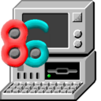 | [***86box***](apps/86box.md) | *Emulator of x86-based machines based on PCem.*..[ *read more* ](apps/86box.md)*!* | [*blob*](https://github.com/ivan-hc/AM/blob/main/programs/x86_64/86box) **/** [*raw*](https://raw.githubusercontent.com/ivan-hc/AM/main/programs/x86_64/86box) |
|  | [***9launcher***](apps/9launcher.md) | *An actively maintained and cross platform remake of Touhou Relauncher.*..[ *read more* ](apps/9launcher.md)*!* | [*blob*](https://github.com/ivan-hc/AM/blob/main/programs/x86_64/9launcher) **/** [*raw*](https://raw.githubusercontent.com/ivan-hc/AM/main/programs/x86_64/9launcher) |
|  | [***aaaaxy***](apps/aaaaxy.md) | *A nonlinear puzzle platformer, game.*..[ *read more* ](apps/aaaaxy.md)*!* | [*blob*](https://github.com/ivan-hc/AM/blob/main/programs/x86_64/aaaaxy) **/** [*raw*](https://raw.githubusercontent.com/ivan-hc/AM/main/programs/x86_64/aaaaxy) |
|  | [***abiword***](apps/abiword.md) | *Unofficial. A light and free word processing software.*..[ *read more* ](apps/abiword.md)*!* | [*blob*](https://github.com/ivan-hc/AM/blob/main/programs/x86_64/abiword) **/** [*raw*](https://raw.githubusercontent.com/ivan-hc/AM/main/programs/x86_64/abiword) |
|  | [***accessimap-lecteur-der***](apps/accessimap-lecteur-der.md) | *Accessimap Lecteur DER.*..[ *read more* ](apps/accessimap-lecteur-der.md)*!* | [*blob*](https://github.com/ivan-hc/AM/blob/main/programs/x86_64/accessimap-lecteur-der) **/** [*raw*](https://raw.githubusercontent.com/ivan-hc/AM/main/programs/x86_64/accessimap-lecteur-der) |
| 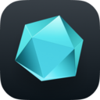 | [***acreom***](apps/acreom.md) | *Acreom desktop app releases.*..[ *read more* ](apps/acreom.md)*!* | [*blob*](https://github.com/ivan-hc/AM/blob/main/programs/x86_64/acreom) **/** [*raw*](https://raw.githubusercontent.com/ivan-hc/AM/main/programs/x86_64/acreom) |
|  | [***actual***](apps/actual.md) | *A super fast privacy-focused app for managing your finances.*..[ *read more* ](apps/actual.md)*!* | [*blob*](https://github.com/ivan-hc/AM/blob/main/programs/x86_64/actual) **/** [*raw*](https://raw.githubusercontent.com/ivan-hc/AM/main/programs/x86_64/actual) |
|  | [***adb***](apps/adb.md) | *Android Debug Bridge, a command line utility to handle Android devices. This script installs the full "platform-tools" suite.*..[ *read more* ](apps/adb.md)*!* | [*blob*](https://github.com/ivan-hc/AM/blob/main/programs/x86_64/adb) **/** [*raw*](https://raw.githubusercontent.com/ivan-hc/AM/main/programs/x86_64/adb) |
|  | [***admin-tools***](apps/admin-tools.md) | *Administrative tools.*..[ *read more* ](apps/admin-tools.md)*!* | [*blob*](https://github.com/ivan-hc/AM/blob/main/programs/x86_64/admin-tools) **/** [*raw*](https://raw.githubusercontent.com/ivan-hc/AM/main/programs/x86_64/admin-tools) |
|  | [***advanced-passgen***](apps/advanced-passgen.md) | *Advanced Password Generator.*..[ *read more* ](apps/advanced-passgen.md)*!* | [*blob*](https://github.com/ivan-hc/AM/blob/main/programs/x86_64/advanced-passgen) **/** [*raw*](https://raw.githubusercontent.com/ivan-hc/AM/main/programs/x86_64/advanced-passgen) |
|  | [***advanced-rest-client***](apps/advanced-rest-client.md) | *Advanced REST Client and API console, by Mulesoft.*..[ *read more* ](apps/advanced-rest-client.md)*!* | [*blob*](https://github.com/ivan-hc/AM/blob/main/programs/x86_64/advanced-rest-client) **/** [*raw*](https://raw.githubusercontent.com/ivan-hc/AM/main/programs/x86_64/advanced-rest-client) |
|  | [***affine-beta***](apps/affine-beta.md) | *Next-gen knowledge base that brings planning, sorting and creating.*..[ *read more* ](apps/affine-beta.md)*!* | [*blob*](https://github.com/ivan-hc/AM/blob/main/programs/x86_64/affine-beta) **/** [*raw*](https://raw.githubusercontent.com/ivan-hc/AM/main/programs/x86_64/affine-beta) |
| 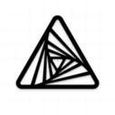 | [***affine-canary***](apps/affine-canary.md) | *Next-gen knowledge base that brings planning/sorting/creating.*..[ *read more* ](apps/affine-canary.md)*!* | [*blob*](https://github.com/ivan-hc/AM/blob/main/programs/x86_64/affine-canary) **/** [*raw*](https://raw.githubusercontent.com/ivan-hc/AM/main/programs/x86_64/affine-canary) |
|  | [***affine***](apps/affine.md) | *Next-gen knowledge base that brings planning, sorting and creating.*..[ *read more* ](apps/affine.md)*!* | [*blob*](https://github.com/ivan-hc/AM/blob/main/programs/x86_64/affine) **/** [*raw*](https://raw.githubusercontent.com/ivan-hc/AM/main/programs/x86_64/affine) |
|  | [***agregore***](apps/agregore.md) | *A minimal browser for the distributed web, Desktop version.*..[ *read more* ](apps/agregore.md)*!* | [*blob*](https://github.com/ivan-hc/AM/blob/main/programs/x86_64/agregore) **/** [*raw*](https://raw.githubusercontent.com/ivan-hc/AM/main/programs/x86_64/agregore) |
|  | [***ai-bot-workspace***](apps/ai-bot-workspace.md) | *Electron app including testing workspaces.*..[ *read more* ](apps/ai-bot-workspace.md)*!* | [*blob*](https://github.com/ivan-hc/AM/blob/main/programs/x86_64/ai-bot-workspace) **/** [*raw*](https://raw.githubusercontent.com/ivan-hc/AM/main/programs/x86_64/ai-bot-workspace) |
|  | [***aichat***](apps/aichat.md) | *AIO AI CLI tool integrating 20+ AI platforms, including OpenAI.*..[ *read more* ](apps/aichat.md)*!* | [*blob*](https://github.com/ivan-hc/AM/blob/main/programs/x86_64/aichat) **/** [*raw*](https://raw.githubusercontent.com/ivan-hc/AM/main/programs/x86_64/aichat) |
|  | [***aillio-ts***](apps/aillio-ts.md) | *The desktop application for Aillio Bullet R1.*..[ *read more* ](apps/aillio-ts.md)*!* | [*blob*](https://github.com/ivan-hc/AM/blob/main/programs/x86_64/aillio-ts) **/** [*raw*](https://raw.githubusercontent.com/ivan-hc/AM/main/programs/x86_64/aillio-ts) |
|  | [***aiming-pro***](apps/aiming-pro.md) | *Aim trainer to practice, train and improve their FPS aim skills.*..[ *read more* ](apps/aiming-pro.md)*!* | [*blob*](https://github.com/ivan-hc/AM/blob/main/programs/x86_64/aiming-pro) **/** [*raw*](https://raw.githubusercontent.com/ivan-hc/AM/main/programs/x86_64/aiming-pro) |
|  | [***air-controller-desktop***](apps/air-controller-desktop.md) | *Android phone assistant,powered by Flutter.*..[ *read more* ](apps/air-controller-desktop.md)*!* | [*blob*](https://github.com/ivan-hc/AM/blob/main/programs/x86_64/air-controller-desktop) **/** [*raw*](https://raw.githubusercontent.com/ivan-hc/AM/main/programs/x86_64/air-controller-desktop) |
|  | [***airspaces***](apps/airspaces.md) | *An online map for your X-Plane flight sessions.*..[ *read more* ](apps/airspaces.md)*!* | [*blob*](https://github.com/ivan-hc/AM/blob/main/programs/x86_64/airspaces) **/** [*raw*](https://raw.githubusercontent.com/ivan-hc/AM/main/programs/x86_64/airspaces) |
| 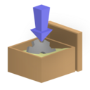 | [***aisap***](apps/aisap.md) | *Tool to make sandboxing AppImages easy through bwrap/bubblewrap.*..[ *read more* ](apps/aisap.md)*!* | [*blob*](https://github.com/ivan-hc/AM/blob/main/programs/x86_64/aisap) **/** [*raw*](https://raw.githubusercontent.com/ivan-hc/AM/main/programs/x86_64/aisap) |
|  | [***aisleriot***](apps/aisleriot.md) | *Unofficial. A card game featuring over 80 different solitaire-type card games.*..[ *read more* ](apps/aisleriot.md)*!* | [*blob*](https://github.com/ivan-hc/AM/blob/main/programs/x86_64/aisleriot) **/** [*raw*](https://raw.githubusercontent.com/ivan-hc/AM/main/programs/x86_64/aisleriot) |
|  | [***akasha***](apps/akasha.md) | *AKASHA community client.*..[ *read more* ](apps/akasha.md)*!* | [*blob*](https://github.com/ivan-hc/AM/blob/main/programs/x86_64/akasha) **/** [*raw*](https://raw.githubusercontent.com/ivan-hc/AM/main/programs/x86_64/akasha) |
|  | [***akuse***](apps/akuse.md) | *Simple and easy to use anime streaming desktop app without ads.*..[ *read more* ](apps/akuse.md)*!* | [*blob*](https://github.com/ivan-hc/AM/blob/main/programs/x86_64/akuse) **/** [*raw*](https://raw.githubusercontent.com/ivan-hc/AM/main/programs/x86_64/akuse) |
|  | [***alduin***](apps/alduin.md) | *An Atom and RSS feed aggregator.*..[ *read more* ](apps/alduin.md)*!* | [*blob*](https://github.com/ivan-hc/AM/blob/main/programs/x86_64/alduin) **/** [*raw*](https://raw.githubusercontent.com/ivan-hc/AM/main/programs/x86_64/alduin) |
|  | [***alephium-wallet***](apps/alephium-wallet.md) | *The official Alephium wallet for desktop.*..[ *read more* ](apps/alephium-wallet.md)*!* | [*blob*](https://github.com/ivan-hc/AM/blob/main/programs/x86_64/alephium-wallet) **/** [*raw*](https://raw.githubusercontent.com/ivan-hc/AM/main/programs/x86_64/alephium-wallet) |
|  | [***alexandria***](apps/alexandria.md) | *eBook reader built with Tauri, Epub.js, and Typescript.*..[ *read more* ](apps/alexandria.md)*!* | [*blob*](https://github.com/ivan-hc/AM/blob/main/programs/x86_64/alexandria) **/** [*raw*](https://raw.githubusercontent.com/ivan-hc/AM/main/programs/x86_64/alexandria) |
|  | [***allusion***](apps/allusion.md) | *A desktop application for managing your visual library.*..[ *read more* ](apps/allusion.md)*!* | [*blob*](https://github.com/ivan-hc/AM/blob/main/programs/x86_64/allusion) **/** [*raw*](https://raw.githubusercontent.com/ivan-hc/AM/main/programs/x86_64/allusion) |
|  | [***alpine-flatimage***](apps/alpine-flatimage.md) | *A hybrid of Flatpak sandboxing with AppImage portability.*..[ *read more* ](apps/alpine-flatimage.md)*!* | [*blob*](https://github.com/ivan-hc/AM/blob/main/programs/x86_64/alpine-flatimage) **/** [*raw*](https://raw.githubusercontent.com/ivan-hc/AM/main/programs/x86_64/alpine-flatimage) |
|  | [***altair***](apps/altair.md) | *The best graphQL client you will ever need.*..[ *read more* ](apps/altair.md)*!* | [*blob*](https://github.com/ivan-hc/AM/blob/main/programs/x86_64/altair) **/** [*raw*](https://raw.githubusercontent.com/ivan-hc/AM/main/programs/x86_64/altair) |
|  | [***altitude***](apps/altitude.md) | *The Altitude wallet by Linda Project Inc.*..[ *read more* ](apps/altitude.md)*!* | [*blob*](https://github.com/ivan-hc/AM/blob/main/programs/x86_64/altitude) **/** [*raw*](https://raw.githubusercontent.com/ivan-hc/AM/main/programs/x86_64/altitude) |
|  | [***altus***](apps/altus.md) | *Client for WhatsApp Web with themes & multiple account support.*..[ *read more* ](apps/altus.md)*!* | [*blob*](https://github.com/ivan-hc/AM/blob/main/programs/x86_64/altus) **/** [*raw*](https://raw.githubusercontent.com/ivan-hc/AM/main/programs/x86_64/altus) |
|  | [***alvr***](apps/alvr.md) | *Stream VR games from your PC to your headset via Wi-Fi.*..[ *read more* ](apps/alvr.md)*!* | [*blob*](https://github.com/ivan-hc/AM/blob/main/programs/x86_64/alvr) **/** [*raw*](https://raw.githubusercontent.com/ivan-hc/AM/main/programs/x86_64/alvr) |
|  | [***amazingmarvin***](apps/amazingmarvin.md) | *Incorporates principles from behavioral psychology.*..[ *read more* ](apps/amazingmarvin.md)*!* | [*blob*](https://github.com/ivan-hc/AM/blob/main/programs/x86_64/amazingmarvin) **/** [*raw*](https://raw.githubusercontent.com/ivan-hc/AM/main/programs/x86_64/amazingmarvin) |
| 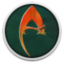 | [***ambermoon.net***](apps/ambermoon.net.md) | *Ambermoon rewrite in C#.*..[ *read more* ](apps/ambermoon.net.md)*!* | [*blob*](https://github.com/ivan-hc/AM/blob/main/programs/x86_64/ambermoon.net) **/** [*raw*](https://raw.githubusercontent.com/ivan-hc/AM/main/programs/x86_64/ambermoon.net) |
| 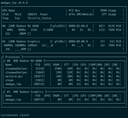 | [***amdgpu_top***](apps/amdgpu_top.md) | *Tool to display AMDGPU usage.*..[ *read more* ](apps/amdgpu_top.md)*!* | [*blob*](https://github.com/ivan-hc/AM/blob/main/programs/x86_64/amdgpu_top) **/** [*raw*](https://raw.githubusercontent.com/ivan-hc/AM/main/programs/x86_64/amdgpu_top) |
|  | [***amusiz***](apps/amusiz.md) | *Unofficial and unpretentious Amazon Music client.*..[ *read more* ](apps/amusiz.md)*!* | [*blob*](https://github.com/ivan-hc/AM/blob/main/programs/x86_64/amusiz) **/** [*raw*](https://raw.githubusercontent.com/ivan-hc/AM/main/programs/x86_64/amusiz) |
|  | [***anavis***](apps/anavis.md) | *Tool to visualize musical form.*..[ *read more* ](apps/anavis.md)*!* | [*blob*](https://github.com/ivan-hc/AM/blob/main/programs/x86_64/anavis) **/** [*raw*](https://raw.githubusercontent.com/ivan-hc/AM/main/programs/x86_64/anavis) |
|  | [***anchor***](apps/anchor.md) | *An EOSIO Light Wallet with simple and advanced tools.*..[ *read more* ](apps/anchor.md)*!* | [*blob*](https://github.com/ivan-hc/AM/blob/main/programs/x86_64/anchor) **/** [*raw*](https://raw.githubusercontent.com/ivan-hc/AM/main/programs/x86_64/anchor) |
|  | [***android-knot***](apps/android-knot.md) | *An Android gadget integrating Todo, Notes, Reader and more.*..[ *read more* ](apps/android-knot.md)*!* | [*blob*](https://github.com/ivan-hc/AM/blob/main/programs/x86_64/android-knot) **/** [*raw*](https://raw.githubusercontent.com/ivan-hc/AM/main/programs/x86_64/android-knot) |
|  | [***android-messages-desktop***](apps/android-messages-desktop.md) | *Messages for web, as a desktop app.*..[ *read more* ](apps/android-messages-desktop.md)*!* | [*blob*](https://github.com/ivan-hc/AM/blob/main/programs/x86_64/android-messages-desktop) **/** [*raw*](https://raw.githubusercontent.com/ivan-hc/AM/main/programs/x86_64/android-messages-desktop) |
|  | [***android-studio-latest***](apps/android-studio-latest.md) | *Unofficial. Android Studio as AppImages, release.*..[ *read more* ](apps/android-studio-latest.md)*!* | [*blob*](https://github.com/ivan-hc/AM/blob/main/programs/x86_64/android-studio-latest) **/** [*raw*](https://raw.githubusercontent.com/ivan-hc/AM/main/programs/x86_64/android-studio-latest) |
|  | [***android-studio***](apps/android-studio.md) | *Unofficial. Android Studio as AppImages, stable.*..[ *read more* ](apps/android-studio.md)*!* | [*blob*](https://github.com/ivan-hc/AM/blob/main/programs/x86_64/android-studio) **/** [*raw*](https://raw.githubusercontent.com/ivan-hc/AM/main/programs/x86_64/android-studio) |
|  | [***android-tools***](apps/android-tools.md) | *Unofficial AppImage for the Android Platform tools, adb, fastboot, etc.*..[ *read more* ](apps/android-tools.md)*!* | [*blob*](https://github.com/ivan-hc/AM/blob/main/programs/x86_64/android-tools) **/** [*raw*](https://raw.githubusercontent.com/ivan-hc/AM/main/programs/x86_64/android-tools) |
|  | [***animashooter-junior***](apps/animashooter-junior.md) | *User-friendly Stop-Motion Animation Software, FREE.*..[ *read more* ](apps/animashooter-junior.md)*!* | [*blob*](https://github.com/ivan-hc/AM/blob/main/programs/x86_64/animashooter-junior) **/** [*raw*](https://raw.githubusercontent.com/ivan-hc/AM/main/programs/x86_64/animashooter-junior) |
|  | [***animashooter-pioneer***](apps/animashooter-pioneer.md) | *User-friendly Stop-Motion Animation Software, PRO.*..[ *read more* ](apps/animashooter-pioneer.md)*!* | [*blob*](https://github.com/ivan-hc/AM/blob/main/programs/x86_64/animashooter-pioneer) **/** [*raw*](https://raw.githubusercontent.com/ivan-hc/AM/main/programs/x86_64/animashooter-pioneer) |
|  | [***animos***](apps/animos.md) | *Anime-streaming desktop application without any ads.*..[ *read more* ](apps/animos.md)*!* | [*blob*](https://github.com/ivan-hc/AM/blob/main/programs/x86_64/animos) **/** [*raw*](https://raw.githubusercontent.com/ivan-hc/AM/main/programs/x86_64/animos) |
|  | [***aniship***](apps/aniship.md) | *Allows for easy viewing of anime on PCs and laptops.*..[ *read more* ](apps/aniship.md)*!* | [*blob*](https://github.com/ivan-hc/AM/blob/main/programs/x86_64/aniship) **/** [*raw*](https://raw.githubusercontent.com/ivan-hc/AM/main/programs/x86_64/aniship) |
|  | [***ankama-launcher***](apps/ankama-launcher.md) | *Ankama is an entertainment and digital creation group.*..[ *read more* ](apps/ankama-launcher.md)*!* | [*blob*](https://github.com/ivan-hc/AM/blob/main/programs/x86_64/ankama-launcher) **/** [*raw*](https://raw.githubusercontent.com/ivan-hc/AM/main/programs/x86_64/ankama-launcher) |
|  | [***anki***](apps/anki.md) | *Anki's shared backend and web components, and the Qt frontend.*..[ *read more* ](apps/anki.md)*!* | [*blob*](https://github.com/ivan-hc/AM/blob/main/programs/x86_64/anki) **/** [*raw*](https://raw.githubusercontent.com/ivan-hc/AM/main/programs/x86_64/anki) |
|  | [***anklang***](apps/anklang.md) | *MIDI and Audio Synthesizer and Composer.*..[ *read more* ](apps/anklang.md)*!* | [*blob*](https://github.com/ivan-hc/AM/blob/main/programs/x86_64/anklang) **/** [*raw*](https://raw.githubusercontent.com/ivan-hc/AM/main/programs/x86_64/anklang) |
|  | [***another-redis-desktop-manager***](apps/another-redis-desktop-manager.md) | *Faster and better redis desktop manager.*..[ *read more* ](apps/another-redis-desktop-manager.md)*!* | [*blob*](https://github.com/ivan-hc/AM/blob/main/programs/x86_64/another-redis-desktop-manager) **/** [*raw*](https://raw.githubusercontent.com/ivan-hc/AM/main/programs/x86_64/another-redis-desktop-manager) |
|  | [***antares***](apps/antares.md) | *An useful SQL client based on Electron.js and Vue.js.*..[ *read more* ](apps/antares.md)*!* | [*blob*](https://github.com/ivan-hc/AM/blob/main/programs/x86_64/antares) **/** [*raw*](https://raw.githubusercontent.com/ivan-hc/AM/main/programs/x86_64/antares) |
|  | [***ant-downloader***](apps/ant-downloader.md) | *BitTorrent Client developed by golang, angular, electron.*..[ *read more* ](apps/ant-downloader.md)*!* | [*blob*](https://github.com/ivan-hc/AM/blob/main/programs/x86_64/ant-downloader) **/** [*raw*](https://raw.githubusercontent.com/ivan-hc/AM/main/programs/x86_64/ant-downloader) |
|  | [***antidot***](apps/antidot.md) | *Cleans up your $HOME from those pesky dotfiles.*..[ *read more* ](apps/antidot.md)*!* | [*blob*](https://github.com/ivan-hc/AM/blob/main/programs/x86_64/antidot) **/** [*raw*](https://raw.githubusercontent.com/ivan-hc/AM/main/programs/x86_64/antidot) |
|  | [***antimicrox***](apps/antimicrox.md) | *Use a gamepad to control a variety of programs.*..[ *read more* ](apps/antimicrox.md)*!* | [*blob*](https://github.com/ivan-hc/AM/blob/main/programs/x86_64/antimicrox) **/** [*raw*](https://raw.githubusercontent.com/ivan-hc/AM/main/programs/x86_64/antimicrox) |
|  | [***anydesk***](apps/anydesk.md) | *Unofficial. Remote desktop application distributed.*..[ *read more* ](apps/anydesk.md)*!* | [*blob*](https://github.com/ivan-hc/AM/blob/main/programs/x86_64/anydesk) **/** [*raw*](https://raw.githubusercontent.com/ivan-hc/AM/main/programs/x86_64/anydesk) |
|  | [***anything-llm***](apps/anything-llm.md) | *AI business intelligence tool. Any LLM, any document.*..[ *read more* ](apps/anything-llm.md)*!* | [*blob*](https://github.com/ivan-hc/AM/blob/main/programs/x86_64/anything-llm) **/** [*raw*](https://raw.githubusercontent.com/ivan-hc/AM/main/programs/x86_64/anything-llm) |
|  | [***anytype***](apps/anytype.md) | *The everything app for those who celebrate trust & autonomy.*..[ *read more* ](apps/anytype.md)*!* | [*blob*](https://github.com/ivan-hc/AM/blob/main/programs/x86_64/anytype) **/** [*raw*](https://raw.githubusercontent.com/ivan-hc/AM/main/programs/x86_64/anytype) |
|  | [***anzeigenchef***](apps/anzeigenchef.md) | *AdsChef manages your classified ads.*..[ *read more* ](apps/anzeigenchef.md)*!* | [*blob*](https://github.com/ivan-hc/AM/blob/main/programs/x86_64/anzeigenchef) **/** [*raw*](https://raw.githubusercontent.com/ivan-hc/AM/main/programs/x86_64/anzeigenchef) |
|  | [***aphelion-wallet***](apps/aphelion-wallet.md) | *Aphelion desktop wallet application built with Electron.*..[ *read more* ](apps/aphelion-wallet.md)*!* | [*blob*](https://github.com/ivan-hc/AM/blob/main/programs/x86_64/aphelion-wallet) **/** [*raw*](https://raw.githubusercontent.com/ivan-hc/AM/main/programs/x86_64/aphelion-wallet) |
| 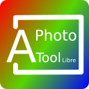 | [***aphototoollibre***](apps/aphototoollibre.md) | *Photo editing app for GNU/Linux.*..[ *read more* ](apps/aphototoollibre.md)*!* | [*blob*](https://github.com/ivan-hc/AM/blob/main/programs/x86_64/aphototoollibre) **/** [*raw*](https://raw.githubusercontent.com/ivan-hc/AM/main/programs/x86_64/aphototoollibre) |
|  | [***apifox***](apps/apifox.md) | *API manager, in chinese. 文档、API 调试、API Mock、API 自动化测试*..[ *read more* ](apps/apifox.md)*!* | [*blob*](https://github.com/ivan-hc/AM/blob/main/programs/x86_64/apifox) **/** [*raw*](https://raw.githubusercontent.com/ivan-hc/AM/main/programs/x86_64/apifox) |
|  | [***apk-editor-studio***](apps/apk-editor-studio.md) | *Easy to use APK, Android reverse-engineering tool.*..[ *read more* ](apps/apk-editor-studio.md)*!* | [*blob*](https://github.com/ivan-hc/AM/blob/main/programs/x86_64/apk-editor-studio) **/** [*raw*](https://raw.githubusercontent.com/ivan-hc/AM/main/programs/x86_64/apk-editor-studio) |
|  | [***apla***](apps/apla.md) | *Project was bootstrapped with Create React App.*..[ *read more* ](apps/apla.md)*!* | [*blob*](https://github.com/ivan-hc/AM/blob/main/programs/x86_64/apla) **/** [*raw*](https://raw.githubusercontent.com/ivan-hc/AM/main/programs/x86_64/apla) |
|  | [***appflowy***](apps/appflowy.md) | *Bring projects, wikis, and teams together with AI. Alternative to Notion.*..[ *read more* ](apps/appflowy.md)*!* | [*blob*](https://github.com/ivan-hc/AM/blob/main/programs/x86_64/appflowy) **/** [*raw*](https://raw.githubusercontent.com/ivan-hc/AM/main/programs/x86_64/appflowy) |
|  | [***apphub***](apps/apphub.md) | *App that simplifies installation/management of .appImage packages.*..[ *read more* ](apps/apphub.md)*!* | [*blob*](https://github.com/ivan-hc/AM/blob/main/programs/x86_64/apphub) **/** [*raw*](https://raw.githubusercontent.com/ivan-hc/AM/main/programs/x86_64/apphub) |
|  | [***appimage-builder***](apps/appimage-builder.md) | *GNU/Linux packaging solution using the AppImage format.*..[ *read more* ](apps/appimage-builder.md)*!* | [*blob*](https://github.com/ivan-hc/AM/blob/main/programs/x86_64/appimage-builder) **/** [*raw*](https://raw.githubusercontent.com/ivan-hc/AM/main/programs/x86_64/appimage-builder) |
|  | [***appimagecraft***](apps/appimagecraft.md) | *Powerful build script generator with a focus on AppImages.*..[ *read more* ](apps/appimagecraft.md)*!* | [*blob*](https://github.com/ivan-hc/AM/blob/main/programs/x86_64/appimagecraft) **/** [*raw*](https://raw.githubusercontent.com/ivan-hc/AM/main/programs/x86_64/appimagecraft) |
|  | [***appimagehelper***](apps/appimagehelper.md) | *Create and organize shortcuts for AppImages.*..[ *read more* ](apps/appimagehelper.md)*!* | [*blob*](https://github.com/ivan-hc/AM/blob/main/programs/x86_64/appimagehelper) **/** [*raw*](https://raw.githubusercontent.com/ivan-hc/AM/main/programs/x86_64/appimagehelper) |
|  | [***appimagelauncher***](apps/appimagelauncher.md) | *CLI helper for running and integrating AppImages.*..[ *read more* ](apps/appimagelauncher.md)*!* | [*blob*](https://github.com/ivan-hc/AM/blob/main/programs/x86_64/appimagelauncher) **/** [*raw*](https://raw.githubusercontent.com/ivan-hc/AM/main/programs/x86_64/appimagelauncher) |
|  | [***appimagelint***](apps/appimagelint.md) | *Check AppImages for compatibility, best practices etc.*..[ *read more* ](apps/appimagelint.md)*!* | [*blob*](https://github.com/ivan-hc/AM/blob/main/programs/x86_64/appimagelint) **/** [*raw*](https://raw.githubusercontent.com/ivan-hc/AM/main/programs/x86_64/appimagelint) |
|  | [***appimagen***](apps/appimagen.md) | *A script that generates a custom AppImage from a PPA.*..[ *read more* ](apps/appimagen.md)*!* | [*blob*](https://github.com/ivan-hc/AM/blob/main/programs/x86_64/appimagen) **/** [*raw*](https://raw.githubusercontent.com/ivan-hc/AM/main/programs/x86_64/appimagen) |
|  | [***appimagepool***](apps/appimagepool.md) | *A simple, modern AppImageHub Client, powered by flutter.*..[ *read more* ](apps/appimagepool.md)*!* | [*blob*](https://github.com/ivan-hc/AM/blob/main/programs/x86_64/appimagepool) **/** [*raw*](https://raw.githubusercontent.com/ivan-hc/AM/main/programs/x86_64/appimagepool) |
|  | [***appimagetool***](apps/appimagetool.md) | *Tool to generate an AppImage from an existing AppDir.*..[ *read more* ](apps/appimagetool.md)*!* | [*blob*](https://github.com/ivan-hc/AM/blob/main/programs/x86_64/appimagetool) **/** [*raw*](https://raw.githubusercontent.com/ivan-hc/AM/main/programs/x86_64/appimagetool) |
|  | [***appimageupdatetool***](apps/appimageupdatetool.md) | *Tool to update an AppImage using embedded information.*..[ *read more* ](apps/appimageupdatetool.md)*!* | [*blob*](https://github.com/ivan-hc/AM/blob/main/programs/x86_64/appimageupdatetool) **/** [*raw*](https://raw.githubusercontent.com/ivan-hc/AM/main/programs/x86_64/appimageupdatetool) |
|  | [***appimageupdate***](apps/appimageupdate.md) | *Tool to update an AppImage using embedded information.*..[ *read more* ](apps/appimageupdate.md)*!* | [*blob*](https://github.com/ivan-hc/AM/blob/main/programs/x86_64/appimageupdate) **/** [*raw*](https://raw.githubusercontent.com/ivan-hc/AM/main/programs/x86_64/appimageupdate) |
|  | [***appium-desktop***](apps/appium-desktop.md) | *Graphical interface for the Appium server.*..[ *read more* ](apps/appium-desktop.md)*!* | [*blob*](https://github.com/ivan-hc/AM/blob/main/programs/x86_64/appium-desktop) **/** [*raw*](https://raw.githubusercontent.com/ivan-hc/AM/main/programs/x86_64/appium-desktop) |
|  | [***app-outlet***](apps/app-outlet.md) | *A Universal linux app store for Flatpak/Snap/AppImage.*..[ *read more* ](apps/app-outlet.md)*!* | [*blob*](https://github.com/ivan-hc/AM/blob/main/programs/x86_64/app-outlet) **/** [*raw*](https://raw.githubusercontent.com/ivan-hc/AM/main/programs/x86_64/app-outlet) |
|  | [***aptakube***](apps/aptakube.md) | *A modern and lightweight Kubernetes desktop client.*..[ *read more* ](apps/aptakube.md)*!* | [*blob*](https://github.com/ivan-hc/AM/blob/main/programs/x86_64/aptakube) **/** [*raw*](https://raw.githubusercontent.com/ivan-hc/AM/main/programs/x86_64/aptakube) |
|  | [***apx-gcs***](apps/apx-gcs.md) | *APX Ground Control.*..[ *read more* ](apps/apx-gcs.md)*!* | [*blob*](https://github.com/ivan-hc/AM/blob/main/programs/x86_64/apx-gcs) **/** [*raw*](https://raw.githubusercontent.com/ivan-hc/AM/main/programs/x86_64/apx-gcs) |
|  | [***aranym***](apps/aranym.md) | *Virtual Machine for Atari 32-bit applications.*..[ *read more* ](apps/aranym.md)*!* | [*blob*](https://github.com/ivan-hc/AM/blob/main/programs/x86_64/aranym) **/** [*raw*](https://raw.githubusercontent.com/ivan-hc/AM/main/programs/x86_64/aranym) |
|  | [***arcade-manager***](apps/arcade-manager.md) | *Manage your rom collection, Games/Retropie & Recalbox.*..[ *read more* ](apps/arcade-manager.md)*!* | [*blob*](https://github.com/ivan-hc/AM/blob/main/programs/x86_64/arcade-manager) **/** [*raw*](https://raw.githubusercontent.com/ivan-hc/AM/main/programs/x86_64/arcade-manager) |
|  | [***arch-deployer***](apps/arch-deployer.md) | *Script to convert Arch Linux packages to AppDir/AppImage.*..[ *read more* ](apps/arch-deployer.md)*!* | [*blob*](https://github.com/ivan-hc/AM/blob/main/programs/x86_64/arch-deployer) **/** [*raw*](https://raw.githubusercontent.com/ivan-hc/AM/main/programs/x86_64/arch-deployer) |
|  | [***arch-flatimage***](apps/arch-flatimage.md) | *A hybrid of Flatpak sandboxing with AppImage portability.*..[ *read more* ](apps/arch-flatimage.md)*!* | [*blob*](https://github.com/ivan-hc/AM/blob/main/programs/x86_64/arch-flatimage) **/** [*raw*](https://raw.githubusercontent.com/ivan-hc/AM/main/programs/x86_64/arch-flatimage) |
|  | [***archimage-cli***](apps/archimage-cli.md) | *Build AppImage packages using JuNest, Arch Linux.*..[ *read more* ](apps/archimage-cli.md)*!* | [*blob*](https://github.com/ivan-hc/AM/blob/main/programs/x86_64/archimage-cli) **/** [*raw*](https://raw.githubusercontent.com/ivan-hc/AM/main/programs/x86_64/archimage-cli) |
| 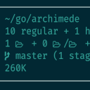 | [***archimede***](apps/archimede.md) | *Unobtrusive directory information fetcher.*..[ *read more* ](apps/archimede.md)*!* | [*blob*](https://github.com/ivan-hc/AM/blob/main/programs/x86_64/archimede) **/** [*raw*](https://raw.githubusercontent.com/ivan-hc/AM/main/programs/x86_64/archimede) |
|  | [***archipelago***](apps/archipelago.md) | *Archipelago Multi-Game Randomizer and Server.*..[ *read more* ](apps/archipelago.md)*!* | [*blob*](https://github.com/ivan-hc/AM/blob/main/programs/x86_64/archipelago) **/** [*raw*](https://raw.githubusercontent.com/ivan-hc/AM/main/programs/x86_64/archipelago) |
|  | [***archipel***](apps/archipel.md) | *Decentralized archiving and media library system.*..[ *read more* ](apps/archipel.md)*!* | [*blob*](https://github.com/ivan-hc/AM/blob/main/programs/x86_64/archipel) **/** [*raw*](https://raw.githubusercontent.com/ivan-hc/AM/main/programs/x86_64/archipel) |
| 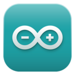 | [***arduino-ide***](apps/arduino-ide.md) | *Open-source electronics platform.*..[ *read more* ](apps/arduino-ide.md)*!* | [*blob*](https://github.com/ivan-hc/AM/blob/main/programs/x86_64/arduino-ide) **/** [*raw*](https://raw.githubusercontent.com/ivan-hc/AM/main/programs/x86_64/arduino-ide) |
|  | [***arena-tracker***](apps/arena-tracker.md) | *Deck Tracker for Hearthstone game with arena in focus.*..[ *read more* ](apps/arena-tracker.md)*!* | [*blob*](https://github.com/ivan-hc/AM/blob/main/programs/x86_64/arena-tracker) **/** [*raw*](https://raw.githubusercontent.com/ivan-hc/AM/main/programs/x86_64/arena-tracker) |
|  | [***arkaway***](apps/arkaway.md) | *Another Arkanoid clone and make with Pyxel.*..[ *read more* ](apps/arkaway.md)*!* | [*blob*](https://github.com/ivan-hc/AM/blob/main/programs/x86_64/arkaway) **/** [*raw*](https://raw.githubusercontent.com/ivan-hc/AM/main/programs/x86_64/arkaway) |
|  | [***ark.desktop.wallet***](apps/ark.desktop.wallet.md) | *Ark Ecosystem Desktop Wallet.*..[ *read more* ](apps/ark.desktop.wallet.md)*!* | [*blob*](https://github.com/ivan-hc/AM/blob/main/programs/x86_64/ark.desktop.wallet) **/** [*raw*](https://raw.githubusercontent.com/ivan-hc/AM/main/programs/x86_64/ark.desktop.wallet) |
|  | [***ark***](apps/ark.md) | *Unofficial. Archiving tool for .zip/.tar/.rar and more. This script installs the full "kdeutils" suite.*..[ *read more* ](apps/ark.md)*!* | [*blob*](https://github.com/ivan-hc/AM/blob/main/programs/x86_64/ark) **/** [*raw*](https://raw.githubusercontent.com/ivan-hc/AM/main/programs/x86_64/ark) |
|  | [***arma3-unix-launcher***](apps/arma3-unix-launcher.md) | *ArmA 3 Unix Launcher, game.*..[ *read more* ](apps/arma3-unix-launcher.md)*!* | [*blob*](https://github.com/ivan-hc/AM/blob/main/programs/x86_64/arma3-unix-launcher) **/** [*raw*](https://raw.githubusercontent.com/ivan-hc/AM/main/programs/x86_64/arma3-unix-launcher) |
| 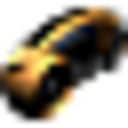 | [***armagetronad***](apps/armagetronad.md) | *Multiplayer game in 3d that emulates the movie "Tron".*..[ *read more* ](apps/armagetronad.md)*!* | [*blob*](https://github.com/ivan-hc/AM/blob/main/programs/x86_64/armagetronad) **/** [*raw*](https://raw.githubusercontent.com/ivan-hc/AM/main/programs/x86_64/armagetronad) |
|  | [***armcord***](apps/armcord.md) | *Custom client designed to enhance your Discord experience.*..[ *read more* ](apps/armcord.md)*!* | [*blob*](https://github.com/ivan-hc/AM/blob/main/programs/x86_64/armcord) **/** [*raw*](https://raw.githubusercontent.com/ivan-hc/AM/main/programs/x86_64/armcord) |
| 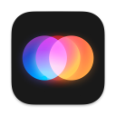 | [***around***](apps/around.md) | *Video calls designed for energy, ideas and action.*..[ *read more* ](apps/around.md)*!* | [*blob*](https://github.com/ivan-hc/AM/blob/main/programs/x86_64/around) **/** [*raw*](https://raw.githubusercontent.com/ivan-hc/AM/main/programs/x86_64/around) |
| 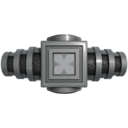 | [***artifact***](apps/artifact.md) | *Win 40 levels of mayhem without getting destroyed, game.*..[ *read more* ](apps/artifact.md)*!* | [*blob*](https://github.com/ivan-hc/AM/blob/main/programs/x86_64/artifact) **/** [*raw*](https://raw.githubusercontent.com/ivan-hc/AM/main/programs/x86_64/artifact) |
|  | [***artisan***](apps/artisan.md) | *Visualizes the coffee roasting process.*..[ *read more* ](apps/artisan.md)*!* | [*blob*](https://github.com/ivan-hc/AM/blob/main/programs/x86_64/artisan) **/** [*raw*](https://raw.githubusercontent.com/ivan-hc/AM/main/programs/x86_64/artisan) |
|  | [***artix***](apps/artix.md) | *One app. All your favorite Artix games.*..[ *read more* ](apps/artix.md)*!* | [*blob*](https://github.com/ivan-hc/AM/blob/main/programs/x86_64/artix) **/** [*raw*](https://raw.githubusercontent.com/ivan-hc/AM/main/programs/x86_64/artix) |
|  | [***asarui***](apps/asarui.md) | *UI for Asar.*..[ *read more* ](apps/asarui.md)*!* | [*blob*](https://github.com/ivan-hc/AM/blob/main/programs/x86_64/asarui) **/** [*raw*](https://raw.githubusercontent.com/ivan-hc/AM/main/programs/x86_64/asarui) |
|  | [***asgardex***](apps/asgardex.md) | *Thorchain wallet desktop app.*..[ *read more* ](apps/asgardex.md)*!* | [*blob*](https://github.com/ivan-hc/AM/blob/main/programs/x86_64/asgardex) **/** [*raw*](https://raw.githubusercontent.com/ivan-hc/AM/main/programs/x86_64/asgardex) |
|  | [***astroffers***](apps/astroffers.md) | *Take offers to watch at given nights by the NGC2000 catalog.*..[ *read more* ](apps/astroffers.md)*!* | [*blob*](https://github.com/ivan-hc/AM/blob/main/programs/x86_64/astroffers) **/** [*raw*](https://raw.githubusercontent.com/ivan-hc/AM/main/programs/x86_64/astroffers) |
| 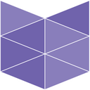 | [***astrofox***](apps/astrofox.md) | *Audio reactive motion graphics program.*..[ *read more* ](apps/astrofox.md)*!* | [*blob*](https://github.com/ivan-hc/AM/blob/main/programs/x86_64/astrofox) **/** [*raw*](https://raw.githubusercontent.com/ivan-hc/AM/main/programs/x86_64/astrofox) |
| 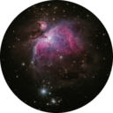 | [***astroshutter***](apps/astroshutter.md) | *Ui to control your camera for astrophotography.*..[ *read more* ](apps/astroshutter.md)*!* | [*blob*](https://github.com/ivan-hc/AM/blob/main/programs/x86_64/astroshutter) **/** [*raw*](https://raw.githubusercontent.com/ivan-hc/AM/main/programs/x86_64/astroshutter) |
|  | [***asunder***](apps/asunder.md) | *Unofficial. Audio CD ripper and encoder, WAV, MP3, OGG, FLAC, Opus, AAC....*..[ *read more* ](apps/asunder.md)*!* | [*blob*](https://github.com/ivan-hc/AM/blob/main/programs/x86_64/asunder) **/** [*raw*](https://raw.githubusercontent.com/ivan-hc/AM/main/programs/x86_64/asunder) |
|  | [***atomicwallet***](apps/atomicwallet.md) | *Atomic vue-electron.*..[ *read more* ](apps/atomicwallet.md)*!* | [*blob*](https://github.com/ivan-hc/AM/blob/main/programs/x86_64/atomicwallet) **/** [*raw*](https://raw.githubusercontent.com/ivan-hc/AM/main/programs/x86_64/atomicwallet) |
|  | [***atuin***](apps/atuin.md) | *Magical shell history.*..[ *read more* ](apps/atuin.md)*!* | [*blob*](https://github.com/ivan-hc/AM/blob/main/programs/x86_64/atuin) **/** [*raw*](https://raw.githubusercontent.com/ivan-hc/AM/main/programs/x86_64/atuin) |
|  | [***audacious***](apps/audacious.md) | *Unofficial. An open source audio and music player, descendant of XMMS.*..[ *read more* ](apps/audacious.md)*!* | [*blob*](https://github.com/ivan-hc/AM/blob/main/programs/x86_64/audacious) **/** [*raw*](https://raw.githubusercontent.com/ivan-hc/AM/main/programs/x86_64/audacious) |
|  | [***audacity***](apps/audacity.md) | *Multiplatform Audio Editor.*..[ *read more* ](apps/audacity.md)*!* | [*blob*](https://github.com/ivan-hc/AM/blob/main/programs/x86_64/audacity) **/** [*raw*](https://raw.githubusercontent.com/ivan-hc/AM/main/programs/x86_64/audacity) |
|  | [***audapolis***](apps/audapolis.md) | *An editor for spoken-word audio with automatic transcription.*..[ *read more* ](apps/audapolis.md)*!* | [*blob*](https://github.com/ivan-hc/AM/blob/main/programs/x86_64/audapolis) **/** [*raw*](https://raw.githubusercontent.com/ivan-hc/AM/main/programs/x86_64/audapolis) |
|  | [***audiomoth***](apps/audiomoth.md) | *Configuration app for the AudioMoth acoustic monitoring device.*..[ *read more* ](apps/audiomoth.md)*!* | [*blob*](https://github.com/ivan-hc/AM/blob/main/programs/x86_64/audiomoth) **/** [*raw*](https://raw.githubusercontent.com/ivan-hc/AM/main/programs/x86_64/audiomoth) |
|  | [***augur***](apps/augur.md) | *Augur Desktop Application.*..[ *read more* ](apps/augur.md)*!* | [*blob*](https://github.com/ivan-hc/AM/blob/main/programs/x86_64/augur) **/** [*raw*](https://raw.githubusercontent.com/ivan-hc/AM/main/programs/x86_64/augur) |
|  | [***auryo***](apps/auryo.md) | *An audio/music desktop client for SoundCloud.*..[ *read more* ](apps/auryo.md)*!* | [*blob*](https://github.com/ivan-hc/AM/blob/main/programs/x86_64/auryo) **/** [*raw*](https://raw.githubusercontent.com/ivan-hc/AM/main/programs/x86_64/auryo) |
|  | [***authme***](apps/authme.md) | *Simple cross-platform two-factor authenticator app for desktop.*..[ *read more* ](apps/authme.md)*!* | [*blob*](https://github.com/ivan-hc/AM/blob/main/programs/x86_64/authme) **/** [*raw*](https://raw.githubusercontent.com/ivan-hc/AM/main/programs/x86_64/authme) |
|  | [***authy***](apps/authy.md) | *Unofficial, Protect all your accounts with 2FA.*..[ *read more* ](apps/authy.md)*!* | [*blob*](https://github.com/ivan-hc/AM/blob/main/programs/x86_64/authy) **/** [*raw*](https://raw.githubusercontent.com/ivan-hc/AM/main/programs/x86_64/authy) |
|  | [***autoedit2***](apps/autoedit2.md) | *autoEdit2 Desktop Client for Linux.*..[ *read more* ](apps/autoedit2.md)*!* | [*blob*](https://github.com/ivan-hc/AM/blob/main/programs/x86_64/autoedit2) **/** [*raw*](https://raw.githubusercontent.com/ivan-hc/AM/main/programs/x86_64/autoedit2) |
|  | [***avantgarde***](apps/avantgarde.md) | *Avalonia XAML Preview.*..[ *read more* ](apps/avantgarde.md)*!* | [*blob*](https://github.com/ivan-hc/AM/blob/main/programs/x86_64/avantgarde) **/** [*raw*](https://raw.githubusercontent.com/ivan-hc/AM/main/programs/x86_64/avantgarde) |
|  | [***avidemux***](apps/avidemux.md) | *Multiplatform Video Editor.*..[ *read more* ](apps/avidemux.md)*!* | [*blob*](https://github.com/ivan-hc/AM/blob/main/programs/x86_64/avidemux) **/** [*raw*](https://raw.githubusercontent.com/ivan-hc/AM/main/programs/x86_64/avidemux) |
|  | [***avidemux-nightly***](apps/avidemux-nightly.md) | *Multiplatform Video Editor, nightly build.*..[ *read more* ](apps/avidemux-nightly.md)*!* | [*blob*](https://github.com/ivan-hc/AM/blob/main/programs/x86_64/avidemux-nightly) **/** [*raw*](https://raw.githubusercontent.com/ivan-hc/AM/main/programs/x86_64/avidemux-nightly) |
|  | [***avocado***](apps/avocado.md) | *PlayStation 1 emulator, games.*..[ *read more* ](apps/avocado.md)*!* | [*blob*](https://github.com/ivan-hc/AM/blob/main/programs/x86_64/avocado) **/** [*raw*](https://raw.githubusercontent.com/ivan-hc/AM/main/programs/x86_64/avocado) |
|  | [***avogadro2***](apps/avogadro2.md) | *Molecular editor for computational chemistry, bioinformatics.*..[ *read more* ](apps/avogadro2.md)*!* | [*blob*](https://github.com/ivan-hc/AM/blob/main/programs/x86_64/avogadro2) **/** [*raw*](https://raw.githubusercontent.com/ivan-hc/AM/main/programs/x86_64/avogadro2) |
|  | [***awakened-poe-trade***](apps/awakened-poe-trade.md) | *Path of Exile trading app for price checking.*..[ *read more* ](apps/awakened-poe-trade.md)*!* | [*blob*](https://github.com/ivan-hc/AM/blob/main/programs/x86_64/awakened-poe-trade) **/** [*raw*](https://raw.githubusercontent.com/ivan-hc/AM/main/programs/x86_64/awakened-poe-trade) |
|  | [***axe-electrum***](apps/axe-electrum.md) | *Axe Electrum Wallet.*..[ *read more* ](apps/axe-electrum.md)*!* | [*blob*](https://github.com/ivan-hc/AM/blob/main/programs/x86_64/axe-electrum) **/** [*raw*](https://raw.githubusercontent.com/ivan-hc/AM/main/programs/x86_64/axe-electrum) |
|  | [***axolotl***](apps/axolotl.md) | *A Signal compatible cross plattform client written in Go and Vuejs.*..[ *read more* ](apps/axolotl.md)*!* | [*blob*](https://github.com/ivan-hc/AM/blob/main/programs/x86_64/axolotl) **/** [*raw*](https://raw.githubusercontent.com/ivan-hc/AM/main/programs/x86_64/axolotl) |
|  | [***badlion***](apps/badlion.md) | *Most Complete All-In-One Mod Library for Minecraft with 100+ Mods.*..[ *read more* ](apps/badlion.md)*!* | [*blob*](https://github.com/ivan-hc/AM/blob/main/programs/x86_64/badlion) **/** [*raw*](https://raw.githubusercontent.com/ivan-hc/AM/main/programs/x86_64/badlion) |
|  | [***baijimangaviewer***](apps/baijimangaviewer.md) | *Manga viewer that uses Material Design.*..[ *read more* ](apps/baijimangaviewer.md)*!* | [*blob*](https://github.com/ivan-hc/AM/blob/main/programs/x86_64/baijimangaviewer) **/** [*raw*](https://raw.githubusercontent.com/ivan-hc/AM/main/programs/x86_64/baijimangaviewer) |
|  | [***bambustudio***](apps/bambustudio.md) | *PC Software for BambuLab's 3D printers.*..[ *read more* ](apps/bambustudio.md)*!* | [*blob*](https://github.com/ivan-hc/AM/blob/main/programs/x86_64/bambustudio) **/** [*raw*](https://raw.githubusercontent.com/ivan-hc/AM/main/programs/x86_64/bambustudio) |
| 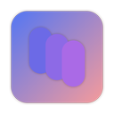 | [***banban***](apps/banban.md) | *A productivity app inspired by GitHub Projects Kanban.*..[ *read more* ](apps/banban.md)*!* | [*blob*](https://github.com/ivan-hc/AM/blob/main/programs/x86_64/banban) **/** [*raw*](https://raw.githubusercontent.com/ivan-hc/AM/main/programs/x86_64/banban) |
|  | [***baobab-gtk3***](apps/baobab-gtk3.md) | *Unofficial. Disk Usage Analyser, version 3.38, for all GNOME4+ haters.*..[ *read more* ](apps/baobab-gtk3.md)*!* | [*blob*](https://github.com/ivan-hc/AM/blob/main/programs/x86_64/baobab-gtk3) **/** [*raw*](https://raw.githubusercontent.com/ivan-hc/AM/main/programs/x86_64/baobab-gtk3) |
|  | [***barnacal***](apps/barnacal.md) | *A simple menu bar app for viewing a calendar*..[ *read more* ](apps/barnacal.md)*!* | [*blob*](https://github.com/ivan-hc/AM/blob/main/programs/x86_64/barnacal) **/** [*raw*](https://raw.githubusercontent.com/ivan-hc/AM/main/programs/x86_64/barnacal) |
|  | [***bastyon***](apps/bastyon.md) | *Decentralized social network based on the blockchain.*..[ *read more* ](apps/bastyon.md)*!* | [*blob*](https://github.com/ivan-hc/AM/blob/main/programs/x86_64/bastyon) **/** [*raw*](https://raw.githubusercontent.com/ivan-hc/AM/main/programs/x86_64/bastyon) |
| 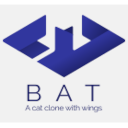 | [***bat***](apps/bat.md) | *A "cat" clone with wings.*..[ *read more* ](apps/bat.md)*!* | [*blob*](https://github.com/ivan-hc/AM/blob/main/programs/x86_64/bat) **/** [*raw*](https://raw.githubusercontent.com/ivan-hc/AM/main/programs/x86_64/bat) |
|  | [***batch-explorer***](apps/batch-explorer.md) | *A client tool to create/debug/monitor Azure Batch Apps.*..[ *read more* ](apps/batch-explorer.md)*!* | [*blob*](https://github.com/ivan-hc/AM/blob/main/programs/x86_64/batch-explorer) **/** [*raw*](https://raw.githubusercontent.com/ivan-hc/AM/main/programs/x86_64/batch-explorer) |
| 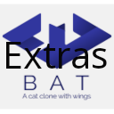 | [***bat-extras***](apps/bat-extras.md) | *Bash scripts that integrate bat with various command line tools.*..[ *read more* ](apps/bat-extras.md)*!* | [*blob*](https://github.com/ivan-hc/AM/blob/main/programs/x86_64/bat-extras) **/** [*raw*](https://raw.githubusercontent.com/ivan-hc/AM/main/programs/x86_64/bat-extras) |
|  | [***bauh***](apps/bauh.md) | *GUI for managing AppImage, Arch/AUR, DEBs, Flatpak, Snap and webapps.*..[ *read more* ](apps/bauh.md)*!* | [*blob*](https://github.com/ivan-hc/AM/blob/main/programs/x86_64/bauh) **/** [*raw*](https://raw.githubusercontent.com/ivan-hc/AM/main/programs/x86_64/bauh) |
|  | [***bazecor***](apps/bazecor.md) | *Graphical configurator for Dygma Raise.*..[ *read more* ](apps/bazecor.md)*!* | [*blob*](https://github.com/ivan-hc/AM/blob/main/programs/x86_64/bazecor) **/** [*raw*](https://raw.githubusercontent.com/ivan-hc/AM/main/programs/x86_64/bazecor) |
|  | [***bbg***](apps/bbg.md) | *A static blog generator based on Electron Technology.*..[ *read more* ](apps/bbg.md)*!* | [*blob*](https://github.com/ivan-hc/AM/blob/main/programs/x86_64/bbg) **/** [*raw*](https://raw.githubusercontent.com/ivan-hc/AM/main/programs/x86_64/bbg) |
|  | [***bdash***](apps/bdash.md) | *A simple business intelligence application.*..[ *read more* ](apps/bdash.md)*!* | [*blob*](https://github.com/ivan-hc/AM/blob/main/programs/x86_64/bdash) **/** [*raw*](https://raw.githubusercontent.com/ivan-hc/AM/main/programs/x86_64/bdash) |
|  | [***beam-wallet***](apps/beam-wallet.md) | *Beam Desktop Wallet.*..[ *read more* ](apps/beam-wallet.md)*!* | [*blob*](https://github.com/ivan-hc/AM/blob/main/programs/x86_64/beam-wallet) **/** [*raw*](https://raw.githubusercontent.com/ivan-hc/AM/main/programs/x86_64/beam-wallet) |
|  | [***bearly***](apps/bearly.md) | *The world's best AI at your fingertips.*..[ *read more* ](apps/bearly.md)*!* | [*blob*](https://github.com/ivan-hc/AM/blob/main/programs/x86_64/bearly) **/** [*raw*](https://raw.githubusercontent.com/ivan-hc/AM/main/programs/x86_64/bearly) |
|  | [***beatconnect-client***](apps/beatconnect-client.md) | *Beatconnect power for osu irc.*..[ *read more* ](apps/beatconnect-client.md)*!* | [*blob*](https://github.com/ivan-hc/AM/blob/main/programs/x86_64/beatconnect-client) **/** [*raw*](https://raw.githubusercontent.com/ivan-hc/AM/main/programs/x86_64/beatconnect-client) |
|  | [***beekeeper-studio***](apps/beekeeper-studio.md) | *SQL query editor and database UI.*..[ *read more* ](apps/beekeeper-studio.md)*!* | [*blob*](https://github.com/ivan-hc/AM/blob/main/programs/x86_64/beekeeper-studio) **/** [*raw*](https://raw.githubusercontent.com/ivan-hc/AM/main/programs/x86_64/beekeeper-studio) |
|  | [***beeper***](apps/beeper.md) | *All your chats in one app.*..[ *read more* ](apps/beeper.md)*!* | [*blob*](https://github.com/ivan-hc/AM/blob/main/programs/x86_64/beeper) **/** [*raw*](https://raw.githubusercontent.com/ivan-hc/AM/main/programs/x86_64/beeper) |
| 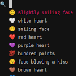 | [***bemoji***](apps/bemoji.md) | *Emoji picker for bemenu/wofi/rofi/dmenu, remembers your favorites.*..[ *read more* ](apps/bemoji.md)*!* | [*blob*](https://github.com/ivan-hc/AM/blob/main/programs/x86_64/bemoji) **/** [*raw*](https://raw.githubusercontent.com/ivan-hc/AM/main/programs/x86_64/bemoji) |
|  | [***bench-cli***](apps/bench-cli.md) | *CLI tool to benchmark commands, written in `Fortran`.*..[ *read more* ](apps/bench-cli.md)*!* | [*blob*](https://github.com/ivan-hc/AM/blob/main/programs/x86_64/bench-cli) **/** [*raw*](https://raw.githubusercontent.com/ivan-hc/AM/main/programs/x86_64/bench-cli) |
|  | [***bettercrewlink***](apps/bettercrewlink.md) | *Free, open, Among Us proximity voice chat.*..[ *read more* ](apps/bettercrewlink.md)*!* | [*blob*](https://github.com/ivan-hc/AM/blob/main/programs/x86_64/bettercrewlink) **/** [*raw*](https://raw.githubusercontent.com/ivan-hc/AM/main/programs/x86_64/bettercrewlink) |
|  | [***better-kirka-client***](apps/better-kirka-client.md) | *A electron js based client for the game kirka.io.*..[ *read more* ](apps/better-kirka-client.md)*!* | [*blob*](https://github.com/ivan-hc/AM/blob/main/programs/x86_64/better-kirka-client) **/** [*raw*](https://raw.githubusercontent.com/ivan-hc/AM/main/programs/x86_64/better-kirka-client) |
|  | [***better-osu-skills***](apps/better-osu-skills.md) | *Gets results from the osu! Using your own IRC credentials.*..[ *read more* ](apps/better-osu-skills.md)*!* | [*blob*](https://github.com/ivan-hc/AM/blob/main/programs/x86_64/better-osu-skills) **/** [*raw*](https://raw.githubusercontent.com/ivan-hc/AM/main/programs/x86_64/better-osu-skills) |
|  | [***bettersis***](apps/bettersis.md) | *Modern shell for SIS.*..[ *read more* ](apps/bettersis.md)*!* | [*blob*](https://github.com/ivan-hc/AM/blob/main/programs/x86_64/bettersis) **/** [*raw*](https://raw.githubusercontent.com/ivan-hc/AM/main/programs/x86_64/bettersis) |
| 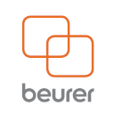 | [***beurerscalemanager***](apps/beurerscalemanager.md) | *AppImage packaging project for BeurerScaleManager.*..[ *read more* ](apps/beurerscalemanager.md)*!* | [*blob*](https://github.com/ivan-hc/AM/blob/main/programs/x86_64/beurerscalemanager) **/** [*raw*](https://raw.githubusercontent.com/ivan-hc/AM/main/programs/x86_64/beurerscalemanager) |
|  | [***beyond-all-reason***](apps/beyond-all-reason.md) | *3D Real-Time Strategy Total Annihilation Inspired, game.*..[ *read more* ](apps/beyond-all-reason.md)*!* | [*blob*](https://github.com/ivan-hc/AM/blob/main/programs/x86_64/beyond-all-reason) **/** [*raw*](https://raw.githubusercontent.com/ivan-hc/AM/main/programs/x86_64/beyond-all-reason) |
|  | [***bezique***](apps/bezique.md) | *Plays bezique game against the AI.*..[ *read more* ](apps/bezique.md)*!* | [*blob*](https://github.com/ivan-hc/AM/blob/main/programs/x86_64/bezique) **/** [*raw*](https://raw.githubusercontent.com/ivan-hc/AM/main/programs/x86_64/bezique) |
|  | [***bforartists***](apps/bforartists.md) | *3D modeling, animation, rendering and post-production.*..[ *read more* ](apps/bforartists.md)*!* | [*blob*](https://github.com/ivan-hc/AM/blob/main/programs/x86_64/bforartists) **/** [*raw*](https://raw.githubusercontent.com/ivan-hc/AM/main/programs/x86_64/bforartists) |
| 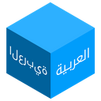 | [***bidirectional***](apps/bidirectional.md) | *Write Arabic text on apps that don't support the bidirectional text.*..[ *read more* ](apps/bidirectional.md)*!* | [*blob*](https://github.com/ivan-hc/AM/blob/main/programs/x86_64/bidirectional) **/** [*raw*](https://raw.githubusercontent.com/ivan-hc/AM/main/programs/x86_64/bidirectional) |
|  | [***bilibili***](apps/bilibili.md) | *Bilibili official desktop client.*..[ *read more* ](apps/bilibili.md)*!* | [*blob*](https://github.com/ivan-hc/AM/blob/main/programs/x86_64/bilibili) **/** [*raw*](https://raw.githubusercontent.com/ivan-hc/AM/main/programs/x86_64/bilibili) |
|  | [***bilibilivideodownload***](apps/bilibilivideodownload.md) | *Bilibili video downloader.*..[ *read more* ](apps/bilibilivideodownload.md)*!* | [*blob*](https://github.com/ivan-hc/AM/blob/main/programs/x86_64/bilibilivideodownload) **/** [*raw*](https://raw.githubusercontent.com/ivan-hc/AM/main/programs/x86_64/bilibilivideodownload) |
|  | [***biliup-app***](apps/biliup-app.md) | *Bilibili uploader.*..[ *read more* ](apps/biliup-app.md)*!* | [*blob*](https://github.com/ivan-hc/AM/blob/main/programs/x86_64/biliup-app) **/** [*raw*](https://raw.githubusercontent.com/ivan-hc/AM/main/programs/x86_64/biliup-app) |
|  | [***billard-gl***](apps/billard-gl.md) | *Unofficial. 3D billiards game, play a game of 8-ball or 9-ball.*..[ *read more* ](apps/billard-gl.md)*!* | [*blob*](https://github.com/ivan-hc/AM/blob/main/programs/x86_64/billard-gl) **/** [*raw*](https://raw.githubusercontent.com/ivan-hc/AM/main/programs/x86_64/billard-gl) |
|  | [***billyfrontier***](apps/billyfrontier.md) | *Pangea Software’s Billy Frontier for modern systems.*..[ *read more* ](apps/billyfrontier.md)*!* | [*blob*](https://github.com/ivan-hc/AM/blob/main/programs/x86_64/billyfrontier) **/** [*raw*](https://raw.githubusercontent.com/ivan-hc/AM/main/programs/x86_64/billyfrontier) |
| 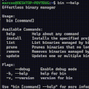 | [***bin***](apps/bin.md) | *Effortless binary manager.*..[ *read more* ](apps/bin.md)*!* | [*blob*](https://github.com/ivan-hc/AM/blob/main/programs/x86_64/bin) **/** [*raw*](https://raw.githubusercontent.com/ivan-hc/AM/main/programs/x86_64/bin) |
|  | [***bingada***](apps/bingada.md) | *Bingo application in GTKAda.*..[ *read more* ](apps/bingada.md)*!* | [*blob*](https://github.com/ivan-hc/AM/blob/main/programs/x86_64/bingada) **/** [*raw*](https://raw.githubusercontent.com/ivan-hc/AM/main/programs/x86_64/bingada) |
|  | [***binglite***](apps/binglite.md) | *A lightweight new Bing (AI chat) desktop application based on Tauri.*..[ *read more* ](apps/binglite.md)*!* | [*blob*](https://github.com/ivan-hc/AM/blob/main/programs/x86_64/binglite) **/** [*raw*](https://raw.githubusercontent.com/ivan-hc/AM/main/programs/x86_64/binglite) |
|  | [***bioanimation***](apps/bioanimation.md) | *CCNY Electrochemical Gradient Simulator.*..[ *read more* ](apps/bioanimation.md)*!* | [*blob*](https://github.com/ivan-hc/AM/blob/main/programs/x86_64/bioanimation) **/** [*raw*](https://raw.githubusercontent.com/ivan-hc/AM/main/programs/x86_64/bioanimation) |
| 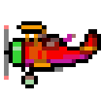 | [***biplanes-revival***](apps/biplanes-revival.md) | *An old cellphone arcade recreated for PC.*..[ *read more* ](apps/biplanes-revival.md)*!* | [*blob*](https://github.com/ivan-hc/AM/blob/main/programs/x86_64/biplanes-revival) **/** [*raw*](https://raw.githubusercontent.com/ivan-hc/AM/main/programs/x86_64/biplanes-revival) |
|  | [***birds-kitchen***](apps/birds-kitchen.md) | *Recipe manager.*..[ *read more* ](apps/birds-kitchen.md)*!* | [*blob*](https://github.com/ivan-hc/AM/blob/main/programs/x86_64/birds-kitchen) **/** [*raw*](https://raw.githubusercontent.com/ivan-hc/AM/main/programs/x86_64/birds-kitchen) |
|  | [***bitbox-wallet***](apps/bitbox-wallet.md) | *Cryptocurrency hardware wallet desktop app.*..[ *read more* ](apps/bitbox-wallet.md)*!* | [*blob*](https://github.com/ivan-hc/AM/blob/main/programs/x86_64/bitbox-wallet) **/** [*raw*](https://raw.githubusercontent.com/ivan-hc/AM/main/programs/x86_64/bitbox-wallet) |
|  | [***bitfighter***](apps/bitfighter.md) | *A 2-D multi-player space combat game.*..[ *read more* ](apps/bitfighter.md)*!* | [*blob*](https://github.com/ivan-hc/AM/blob/main/programs/x86_64/bitfighter) **/** [*raw*](https://raw.githubusercontent.com/ivan-hc/AM/main/programs/x86_64/bitfighter) |
|  | [***bitshares***](apps/bitshares.md) | *Advanced wallet interface for the BitShares financial blockchain.*..[ *read more* ](apps/bitshares.md)*!* | [*blob*](https://github.com/ivan-hc/AM/blob/main/programs/x86_64/bitshares) **/** [*raw*](https://raw.githubusercontent.com/ivan-hc/AM/main/programs/x86_64/bitshares) |
|  | [***bitwarden***](apps/bitwarden.md) | *Password manager for individuals, teams and business.*..[ *read more* ](apps/bitwarden.md)*!* | [*blob*](https://github.com/ivan-hc/AM/blob/main/programs/x86_64/bitwarden) **/** [*raw*](https://raw.githubusercontent.com/ivan-hc/AM/main/programs/x86_64/bitwarden) |
|  | [***biying***](apps/biying.md) | *Biying Wallpaper for Linux.*..[ *read more* ](apps/biying.md)*!* | [*blob*](https://github.com/ivan-hc/AM/blob/main/programs/x86_64/biying) **/** [*raw*](https://raw.githubusercontent.com/ivan-hc/AM/main/programs/x86_64/biying) |
|  | [***bk***](apps/bk.md) | *Terminal Epub reader.*..[ *read more* ](apps/bk.md)*!* | [*blob*](https://github.com/ivan-hc/AM/blob/main/programs/x86_64/bk) **/** [*raw*](https://raw.githubusercontent.com/ivan-hc/AM/main/programs/x86_64/bk) |
|  | [***black-chocobo***](apps/black-chocobo.md) | *FF7 Save Game Editor.*..[ *read more* ](apps/black-chocobo.md)*!* | [*blob*](https://github.com/ivan-hc/AM/blob/main/programs/x86_64/black-chocobo) **/** [*raw*](https://raw.githubusercontent.com/ivan-hc/AM/main/programs/x86_64/black-chocobo) |
|  | [***blacknut***](apps/blacknut.md) | *Cloud gaming client.*..[ *read more* ](apps/blacknut.md)*!* | [*blob*](https://github.com/ivan-hc/AM/blob/main/programs/x86_64/blacknut) **/** [*raw*](https://raw.githubusercontent.com/ivan-hc/AM/main/programs/x86_64/blacknut) |
|  | [***blank***](apps/blank.md) | *Blank is a minimalist, opinionated markdown editor made for writing.*..[ *read more* ](apps/blank.md)*!* | [*blob*](https://github.com/ivan-hc/AM/blob/main/programs/x86_64/blank) **/** [*raw*](https://raw.githubusercontent.com/ivan-hc/AM/main/programs/x86_64/blank) |
|  | [***blastem***](apps/blastem.md) | *Clone of Mercurial Repo.*..[ *read more* ](apps/blastem.md)*!* | [*blob*](https://github.com/ivan-hc/AM/blob/main/programs/x86_64/blastem) **/** [*raw*](https://raw.githubusercontent.com/ivan-hc/AM/main/programs/x86_64/blastem) |
|  | [***blender-alpha***](apps/blender-alpha.md) | *Very fast and versatile 3D modeller/renderer, Alpha.*..[ *read more* ](apps/blender-alpha.md)*!* | [*blob*](https://github.com/ivan-hc/AM/blob/main/programs/x86_64/blender-alpha) **/** [*raw*](https://raw.githubusercontent.com/ivan-hc/AM/main/programs/x86_64/blender-alpha) |
|  | [***blender-beta***](apps/blender-beta.md) | *Very fast and versatile 3D modeller/renderer, Beta.*..[ *read more* ](apps/blender-beta.md)*!* | [*blob*](https://github.com/ivan-hc/AM/blob/main/programs/x86_64/blender-beta) **/** [*raw*](https://raw.githubusercontent.com/ivan-hc/AM/main/programs/x86_64/blender-beta) |
|  | [***blender-rc***](apps/blender-rc.md) | *Very fast and versatile 3D modeller/renderer, Release Candidate.*..[ *read more* ](apps/blender-rc.md)*!* | [*blob*](https://github.com/ivan-hc/AM/blob/main/programs/x86_64/blender-rc) **/** [*raw*](https://raw.githubusercontent.com/ivan-hc/AM/main/programs/x86_64/blender-rc) |
|  | [***blender***](apps/blender.md) | *Very fast and versatile 3D modeller/renderer, Stable.*..[ *read more* ](apps/blender.md)*!* | [*blob*](https://github.com/ivan-hc/AM/blob/main/programs/x86_64/blender) **/** [*raw*](https://raw.githubusercontent.com/ivan-hc/AM/main/programs/x86_64/blender) |
|  | [***blensor***](apps/blensor.md) | *3D modeling, animation, rendering and post-production.*..[ *read more* ](apps/blensor.md)*!* | [*blob*](https://github.com/ivan-hc/AM/blob/main/programs/x86_64/blensor) **/** [*raw*](https://raw.githubusercontent.com/ivan-hc/AM/main/programs/x86_64/blensor) |
|  | [***blink***](apps/blink.md) | *GUI of live indexed grep search for source code.*..[ *read more* ](apps/blink.md)*!* | [*blob*](https://github.com/ivan-hc/AM/blob/main/programs/x86_64/blink) **/** [*raw*](https://raw.githubusercontent.com/ivan-hc/AM/main/programs/x86_64/blink) |
|  | [***blizzard-4***](apps/blizzard-4.md) | *Emulator & toolchain for the Blizzard 4 16-bit computer.*..[ *read more* ](apps/blizzard-4.md)*!* | [*blob*](https://github.com/ivan-hc/AM/blob/main/programs/x86_64/blizzard-4) **/** [*raw*](https://raw.githubusercontent.com/ivan-hc/AM/main/programs/x86_64/blizzard-4) |
|  | [***blobdrop***](apps/blobdrop.md) | *Drag and drop files directly out of the terminal.*..[ *read more* ](apps/blobdrop.md)*!* | [*blob*](https://github.com/ivan-hc/AM/blob/main/programs/x86_64/blobdrop) **/** [*raw*](https://raw.githubusercontent.com/ivan-hc/AM/main/programs/x86_64/blobdrop) |
|  | [***blockbench***](apps/blockbench.md) | *Editor for boxy models and pixel art textures like Minecraft.*..[ *read more* ](apps/blockbench.md)*!* | [*blob*](https://github.com/ivan-hc/AM/blob/main/programs/x86_64/blockbench) **/** [*raw*](https://raw.githubusercontent.com/ivan-hc/AM/main/programs/x86_64/blockbench) |
|  | [***block-dx***](apps/block-dx.md) | *Exchange dApp built on top of the Blocknet Protocol.*..[ *read more* ](apps/block-dx.md)*!* | [*blob*](https://github.com/ivan-hc/AM/blob/main/programs/x86_64/block-dx) **/** [*raw*](https://raw.githubusercontent.com/ivan-hc/AM/main/programs/x86_64/block-dx) |
|  | [***blockstream-green***](apps/blockstream-green.md) | *Bitcoin wallet compatible with Blockstream Jade.*..[ *read more* ](apps/blockstream-green.md)*!* | [*blob*](https://github.com/ivan-hc/AM/blob/main/programs/x86_64/blockstream-green) **/** [*raw*](https://raw.githubusercontent.com/ivan-hc/AM/main/programs/x86_64/blockstream-green) |
|  | [***bloks***](apps/bloks.md) | *An electron-vue project.*..[ *read more* ](apps/bloks.md)*!* | [*blob*](https://github.com/ivan-hc/AM/blob/main/programs/x86_64/bloks) **/** [*raw*](https://raw.githubusercontent.com/ivan-hc/AM/main/programs/x86_64/bloks) |
|  | [***bloomrpc***](apps/bloomrpc.md) | *GRPC GUI client.*..[ *read more* ](apps/bloomrpc.md)*!* | [*blob*](https://github.com/ivan-hc/AM/blob/main/programs/x86_64/bloomrpc) **/** [*raw*](https://raw.githubusercontent.com/ivan-hc/AM/main/programs/x86_64/bloomrpc) |
|  | [***blowfish***](apps/blowfish.md) | *Display your total Ocean Token balances.*..[ *read more* ](apps/blowfish.md)*!* | [*blob*](https://github.com/ivan-hc/AM/blob/main/programs/x86_64/blowfish) **/** [*raw*](https://raw.githubusercontent.com/ivan-hc/AM/main/programs/x86_64/blowfish) |
|  | [***blueglow***](apps/blueglow.md) | *A simple system tray application to watch github notifications.*..[ *read more* ](apps/blueglow.md)*!* | [*blob*](https://github.com/ivan-hc/AM/blob/main/programs/x86_64/blueglow) **/** [*raw*](https://raw.githubusercontent.com/ivan-hc/AM/main/programs/x86_64/blueglow) |
| 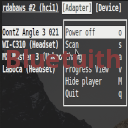 | [***bluetuith***](apps/bluetuith.md) | *A TUI bluetooth manager for Linux.*..[ *read more* ](apps/bluetuith.md)*!* | [*blob*](https://github.com/ivan-hc/AM/blob/main/programs/x86_64/bluetuith) **/** [*raw*](https://raw.githubusercontent.com/ivan-hc/AM/main/programs/x86_64/bluetuith) |
|  | [***boardgamestar***](apps/boardgamestar.md) | *A platform for playing digital boardgames.*..[ *read more* ](apps/boardgamestar.md)*!* | [*blob*](https://github.com/ivan-hc/AM/blob/main/programs/x86_64/boardgamestar) **/** [*raw*](https://raw.githubusercontent.com/ivan-hc/AM/main/programs/x86_64/boardgamestar) |
|  | [***bodacious***](apps/bodacious.md) | *A bodacious music player.*..[ *read more* ](apps/bodacious.md)*!* | [*blob*](https://github.com/ivan-hc/AM/blob/main/programs/x86_64/bodacious) **/** [*raw*](https://raw.githubusercontent.com/ivan-hc/AM/main/programs/x86_64/bodacious) |
|  | [***bodhi***](apps/bodhi.md) | *Bodhi Prediction Market app.*..[ *read more* ](apps/bodhi.md)*!* | [*blob*](https://github.com/ivan-hc/AM/blob/main/programs/x86_64/bodhi) **/** [*raw*](https://raw.githubusercontent.com/ivan-hc/AM/main/programs/x86_64/bodhi) |
|  | [***boilr***](apps/boilr.md) | *Synchronize games from other platforms into your Steam library.*..[ *read more* ](apps/boilr.md)*!* | [*blob*](https://github.com/ivan-hc/AM/blob/main/programs/x86_64/boilr) **/** [*raw*](https://raw.githubusercontent.com/ivan-hc/AM/main/programs/x86_64/boilr) |
|  | [***bomber***](apps/bomber.md) | *Unofficial. Arcade spaceship game. This script installs the full "kdegames" suite.*..[ *read more* ](apps/bomber.md)*!* | [*blob*](https://github.com/ivan-hc/AM/blob/main/programs/x86_64/bomber) **/** [*raw*](https://raw.githubusercontent.com/ivan-hc/AM/main/programs/x86_64/bomber) |
|  | [***bonsai-maui***](apps/bonsai-maui.md) | *Manage Git repositories from a GUI.*..[ *read more* ](apps/bonsai-maui.md)*!* | [*blob*](https://github.com/ivan-hc/AM/blob/main/programs/x86_64/bonsai-maui) **/** [*raw*](https://raw.githubusercontent.com/ivan-hc/AM/main/programs/x86_64/bonsai-maui) |
|  | [***book-manager***](apps/book-manager.md) | *Simple desktop app to manage personal library.*..[ *read more* ](apps/book-manager.md)*!* | [*blob*](https://github.com/ivan-hc/AM/blob/main/programs/x86_64/book-manager) **/** [*raw*](https://raw.githubusercontent.com/ivan-hc/AM/main/programs/x86_64/book-manager) |
|  | [***bookmarks-manager***](apps/bookmarks-manager.md) | *Edit bookmarks, check url.*..[ *read more* ](apps/bookmarks-manager.md)*!* | [*blob*](https://github.com/ivan-hc/AM/blob/main/programs/x86_64/bookmarks-manager) **/** [*raw*](https://raw.githubusercontent.com/ivan-hc/AM/main/programs/x86_64/bookmarks-manager) |
| 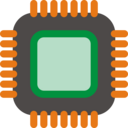 | [***boostchanger***](apps/boostchanger.md) | *Control CPU turbo boost and the settings of the cpu speed.*..[ *read more* ](apps/boostchanger.md)*!* | [*blob*](https://github.com/ivan-hc/AM/blob/main/programs/x86_64/boostchanger) **/** [*raw*](https://raw.githubusercontent.com/ivan-hc/AM/main/programs/x86_64/boostchanger) |
|  | [***boost-note***](apps/boost-note.md) | *Document driven project management tool to speedup remote DevOps.*..[ *read more* ](apps/boost-note.md)*!* | [*blob*](https://github.com/ivan-hc/AM/blob/main/programs/x86_64/boost-note) **/** [*raw*](https://raw.githubusercontent.com/ivan-hc/AM/main/programs/x86_64/boost-note) |
|  | [***botclient***](apps/botclient.md) | *A discord botclient built with Electron and React.*..[ *read more* ](apps/botclient.md)*!* | [*blob*](https://github.com/ivan-hc/AM/blob/main/programs/x86_64/botclient) **/** [*raw*](https://raw.githubusercontent.com/ivan-hc/AM/main/programs/x86_64/botclient) |
|  | [***botframework-emulator***](apps/botframework-emulator.md) | *Test and debug chat bots built with Bot Framework SDK.*..[ *read more* ](apps/botframework-emulator.md)*!* | [*blob*](https://github.com/ivan-hc/AM/blob/main/programs/x86_64/botframework-emulator) **/** [*raw*](https://raw.githubusercontent.com/ivan-hc/AM/main/programs/x86_64/botframework-emulator) |
|  | [***botim***](apps/botim.md) | *Free, Secure, Reliable Messages and Calls.*..[ *read more* ](apps/botim.md)*!* | [*blob*](https://github.com/ivan-hc/AM/blob/main/programs/x86_64/botim) **/** [*raw*](https://raw.githubusercontent.com/ivan-hc/AM/main/programs/x86_64/botim) |
|  | [***bottlebats***](apps/bottlebats.md) | *Client for the 2018 edition of the BottleBats AI competition.*..[ *read more* ](apps/bottlebats.md)*!* | [*blob*](https://github.com/ivan-hc/AM/blob/main/programs/x86_64/bottlebats) **/** [*raw*](https://raw.githubusercontent.com/ivan-hc/AM/main/programs/x86_64/bottlebats) |
|  | [***bottlenose***](apps/bottlenose.md) | *Bottlenose is a front-end for video game emulators.*..[ *read more* ](apps/bottlenose.md)*!* | [*blob*](https://github.com/ivan-hc/AM/blob/main/programs/x86_64/bottlenose) **/** [*raw*](https://raw.githubusercontent.com/ivan-hc/AM/main/programs/x86_64/bottlenose) |
|  | [***bottles***](apps/bottles.md) | *Unofficial. Manage wine prefixes and run Windows software & games in a new way.*..[ *read more* ](apps/bottles.md)*!* | [*blob*](https://github.com/ivan-hc/AM/blob/main/programs/x86_64/bottles) **/** [*raw*](https://raw.githubusercontent.com/ivan-hc/AM/main/programs/x86_64/bottles) |
|  | [***bottom***](apps/bottom.md) | *Yet another cross-platform graphical process/system monitor.*..[ *read more* ](apps/bottom.md)*!* | [*blob*](https://github.com/ivan-hc/AM/blob/main/programs/x86_64/bottom) **/** [*raw*](https://raw.githubusercontent.com/ivan-hc/AM/main/programs/x86_64/bottom) |
|  | [***bovo***](apps/bovo.md) | *Unofficial. Five in a row game from. This script installs the full "kdegames" suite.*..[ *read more* ](apps/bovo.md)*!* | [*blob*](https://github.com/ivan-hc/AM/blob/main/programs/x86_64/bovo) **/** [*raw*](https://raw.githubusercontent.com/ivan-hc/AM/main/programs/x86_64/bovo) |
|  | [***brackets***](apps/brackets.md) | *Brackets-Electron.*..[ *read more* ](apps/brackets.md)*!* | [*blob*](https://github.com/ivan-hc/AM/blob/main/programs/x86_64/brackets) **/** [*raw*](https://raw.githubusercontent.com/ivan-hc/AM/main/programs/x86_64/brackets) |
|  | [***brainverse***](apps/brainverse.md) | *Electronic Lab Notebook for Reproducible Neuro Imaging Research.*..[ *read more* ](apps/brainverse.md)*!* | [*blob*](https://github.com/ivan-hc/AM/blob/main/programs/x86_64/brainverse) **/** [*raw*](https://raw.githubusercontent.com/ivan-hc/AM/main/programs/x86_64/brainverse) |
|  | [***brainwaves***](apps/brainwaves.md) | *EEG Desktop Application.*..[ *read more* ](apps/brainwaves.md)*!* | [*blob*](https://github.com/ivan-hc/AM/blob/main/programs/x86_64/brainwaves) **/** [*raw*](https://raw.githubusercontent.com/ivan-hc/AM/main/programs/x86_64/brainwaves) |
|  | [***brave-appimage***](apps/brave-appimage.md) | *Unofficial, a privacy oriented Web Browser based on Chromium, this is the "stable" release.*..[ *read more* ](apps/brave-appimage.md)*!* | [*blob*](https://github.com/ivan-hc/AM/blob/main/programs/x86_64/brave-appimage) **/** [*raw*](https://raw.githubusercontent.com/ivan-hc/AM/main/programs/x86_64/brave-appimage) |
|  | [***brave***](apps/brave.md) | *A privacy oriented Web Browser based on Chromium, this is the official "stable" release.*..[ *read more* ](apps/brave.md)*!* | [*blob*](https://github.com/ivan-hc/AM/blob/main/programs/x86_64/brave) **/** [*raw*](https://raw.githubusercontent.com/ivan-hc/AM/main/programs/x86_64/brave) |
|  | [***brave-beta-appimage***](apps/brave-beta-appimage.md) | *Unofficial, a privacy oriented Web Browser based on Chromium, this is the "beta" release.*..[ *read more* ](apps/brave-beta-appimage.md)*!* | [*blob*](https://github.com/ivan-hc/AM/blob/main/programs/x86_64/brave-beta-appimage) **/** [*raw*](https://raw.githubusercontent.com/ivan-hc/AM/main/programs/x86_64/brave-beta-appimage) |
|  | [***brave-beta***](apps/brave-beta.md) | *A privacy oriented Web Browser based on Chromium, this is the official "beta" release.*..[ *read more* ](apps/brave-beta.md)*!* | [*blob*](https://github.com/ivan-hc/AM/blob/main/programs/x86_64/brave-beta) **/** [*raw*](https://raw.githubusercontent.com/ivan-hc/AM/main/programs/x86_64/brave-beta) |
|  | [***brave-nightly-appimage***](apps/brave-nightly-appimage.md) | *Unofficial, a privacy oriented Web Browser based on Chromium, this is the "nightly" release.*..[ *read more* ](apps/brave-nightly-appimage.md)*!* | [*blob*](https://github.com/ivan-hc/AM/blob/main/programs/x86_64/brave-nightly-appimage) **/** [*raw*](https://raw.githubusercontent.com/ivan-hc/AM/main/programs/x86_64/brave-nightly-appimage) |
|  | [***brave-nightly***](apps/brave-nightly.md) | *A privacy oriented Web Browser based on Chromium, this is the official "nightly" release.*..[ *read more* ](apps/brave-nightly.md)*!* | [*blob*](https://github.com/ivan-hc/AM/blob/main/programs/x86_64/brave-nightly) **/** [*raw*](https://raw.githubusercontent.com/ivan-hc/AM/main/programs/x86_64/brave-nightly) |
|  | [***bread***](apps/bread.md) | *Install, update and remove AppImage from GitHub using your CLI.*..[ *read more* ](apps/bread.md)*!* | [*blob*](https://github.com/ivan-hc/AM/blob/main/programs/x86_64/bread) **/** [*raw*](https://raw.githubusercontent.com/ivan-hc/AM/main/programs/x86_64/bread) |
|  | [***breaktimer***](apps/breaktimer.md) | *Save yourself from RSI and eye-strain.*..[ *read more* ](apps/breaktimer.md)*!* | [*blob*](https://github.com/ivan-hc/AM/blob/main/programs/x86_64/breaktimer) **/** [*raw*](https://raw.githubusercontent.com/ivan-hc/AM/main/programs/x86_64/breaktimer) |
| 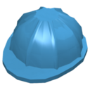 | [***brickstore***](apps/brickstore.md) | *An offline BrickLink inventory management tool.*..[ *read more* ](apps/brickstore.md)*!* | [*blob*](https://github.com/ivan-hc/AM/blob/main/programs/x86_64/brickstore) **/** [*raw*](https://raw.githubusercontent.com/ivan-hc/AM/main/programs/x86_64/brickstore) |
|  | [***bridge***](apps/bridge.md) | *The perfect Bridge between Megascans and your favorite tools.*..[ *read more* ](apps/bridge.md)*!* | [*blob*](https://github.com/ivan-hc/AM/blob/main/programs/x86_64/bridge) **/** [*raw*](https://raw.githubusercontent.com/ivan-hc/AM/main/programs/x86_64/bridge) |
|  | [***brs-emu-app***](apps/brs-emu-app.md) | *BrightScript Emulator, runs on browsers and Electron apps.*..[ *read more* ](apps/brs-emu-app.md)*!* | [*blob*](https://github.com/ivan-hc/AM/blob/main/programs/x86_64/brs-emu-app) **/** [*raw*](https://raw.githubusercontent.com/ivan-hc/AM/main/programs/x86_64/brs-emu-app) |
|  | [***bruno***](apps/bruno.md) | *An Opensource API Collection Collaboration Suite.*..[ *read more* ](apps/bruno.md)*!* | [*blob*](https://github.com/ivan-hc/AM/blob/main/programs/x86_64/bruno) **/** [*raw*](https://raw.githubusercontent.com/ivan-hc/AM/main/programs/x86_64/bruno) |
|  | [***bscanfftwebcam***](apps/bscanfftwebcam.md) | *FDOCT tool.*..[ *read more* ](apps/bscanfftwebcam.md)*!* | [*blob*](https://github.com/ivan-hc/AM/blob/main/programs/x86_64/bscanfftwebcam) **/** [*raw*](https://raw.githubusercontent.com/ivan-hc/AM/main/programs/x86_64/bscanfftwebcam) |
|  | [***btop***](apps/btop.md) | *A command line utility to monitor system resources, like Htop.*..[ *read more* ](apps/btop.md)*!* | [*blob*](https://github.com/ivan-hc/AM/blob/main/programs/x86_64/btop) **/** [*raw*](https://raw.githubusercontent.com/ivan-hc/AM/main/programs/x86_64/btop) |
|  | [***bts-ce-lite***](apps/bts-ce-lite.md) | *Telecommunication network management application.*..[ *read more* ](apps/bts-ce-lite.md)*!* | [*blob*](https://github.com/ivan-hc/AM/blob/main/programs/x86_64/bts-ce-lite) **/** [*raw*](https://raw.githubusercontent.com/ivan-hc/AM/main/programs/x86_64/bts-ce-lite) |
|  | [***buche***](apps/buche.md) | *A logger of sorts.*..[ *read more* ](apps/buche.md)*!* | [*blob*](https://github.com/ivan-hc/AM/blob/main/programs/x86_64/buche) **/** [*raw*](https://raw.githubusercontent.com/ivan-hc/AM/main/programs/x86_64/buche) |
|  | [***buckets***](apps/buckets.md) | *Budgeting fast, simple and private.*..[ *read more* ](apps/buckets.md)*!* | [*blob*](https://github.com/ivan-hc/AM/blob/main/programs/x86_64/buckets) **/** [*raw*](https://raw.githubusercontent.com/ivan-hc/AM/main/programs/x86_64/buckets) |
|  | [***bugdom2***](apps/bugdom2.md) | *Pangea Software’s Bugdom 2 for modern systems.*..[ *read more* ](apps/bugdom2.md)*!* | [*blob*](https://github.com/ivan-hc/AM/blob/main/programs/x86_64/bugdom2) **/** [*raw*](https://raw.githubusercontent.com/ivan-hc/AM/main/programs/x86_64/bugdom2) |
|  | [***bugdom***](apps/bugdom.md) | *Pangea Software's Bugdom game.*..[ *read more* ](apps/bugdom.md)*!* | [*blob*](https://github.com/ivan-hc/AM/blob/main/programs/x86_64/bugdom) **/** [*raw*](https://raw.githubusercontent.com/ivan-hc/AM/main/programs/x86_64/bugdom) |
|  | [***buho-maui***](apps/buho-maui.md) | *Easy-to-use note-taking application with “tags” support.*..[ *read more* ](apps/buho-maui.md)*!* | [*blob*](https://github.com/ivan-hc/AM/blob/main/programs/x86_64/buho-maui) **/** [*raw*](https://raw.githubusercontent.com/ivan-hc/AM/main/programs/x86_64/buho-maui) |
|  | [***bulkreviewer***](apps/bulkreviewer.md) | *Identify, review, and remove private information.*..[ *read more* ](apps/bulkreviewer.md)*!* | [*blob*](https://github.com/ivan-hc/AM/blob/main/programs/x86_64/bulkreviewer) **/** [*raw*](https://raw.githubusercontent.com/ivan-hc/AM/main/programs/x86_64/bulkreviewer) |
|  | [***bulkurlopener***](apps/bulkurlopener.md) | *Desktop version of the Bulk URL Opener extension.*..[ *read more* ](apps/bulkurlopener.md)*!* | [*blob*](https://github.com/ivan-hc/AM/blob/main/programs/x86_64/bulkurlopener) **/** [*raw*](https://raw.githubusercontent.com/ivan-hc/AM/main/programs/x86_64/bulkurlopener) |
| 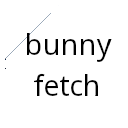 | [***bunnyfetch***](apps/bunnyfetch.md) | *A small and fast tool for getting info about your system.*..[ *read more* ](apps/bunnyfetch.md)*!* | [*blob*](https://github.com/ivan-hc/AM/blob/main/programs/x86_64/bunnyfetch) **/** [*raw*](https://raw.githubusercontent.com/ivan-hc/AM/main/programs/x86_64/bunnyfetch) |
|  | [***bunqdesktop***](apps/bunqdesktop.md) | *A desktop implementation for the bunq API.*..[ *read more* ](apps/bunqdesktop.md)*!* | [*blob*](https://github.com/ivan-hc/AM/blob/main/programs/x86_64/bunqdesktop) **/** [*raw*](https://raw.githubusercontent.com/ivan-hc/AM/main/programs/x86_64/bunqdesktop) |
|  | [***burning-series***](apps/burning-series.md) | *Watch any series from Burning Series, Unofficial client.*..[ *read more* ](apps/burning-series.md)*!* | [*blob*](https://github.com/ivan-hc/AM/blob/main/programs/x86_64/burning-series) **/** [*raw*](https://raw.githubusercontent.com/ivan-hc/AM/main/programs/x86_64/burning-series) |
|  | [***buttercup***](apps/buttercup.md) | *Free and Open Source password vault.*..[ *read more* ](apps/buttercup.md)*!* | [*blob*](https://github.com/ivan-hc/AM/blob/main/programs/x86_64/buttercup) **/** [*raw*](https://raw.githubusercontent.com/ivan-hc/AM/main/programs/x86_64/buttercup) |
|  | [***bypass-cors***](apps/bypass-cors.md) | *Unlock browser’s full potential!*..[ *read more* ](apps/bypass-cors.md)*!* | [*blob*](https://github.com/ivan-hc/AM/blob/main/programs/x86_64/bypass-cors) **/** [*raw*](https://raw.githubusercontent.com/ivan-hc/AM/main/programs/x86_64/bypass-cors) |
| 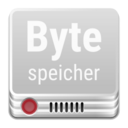 | [***bytespeichertrayicon***](apps/bytespeichertrayicon.md) | *Bytespeicher Status App.*..[ *read more* ](apps/bytespeichertrayicon.md)*!* | [*blob*](https://github.com/ivan-hc/AM/blob/main/programs/x86_64/bytespeichertrayicon) **/** [*raw*](https://raw.githubusercontent.com/ivan-hc/AM/main/programs/x86_64/bytespeichertrayicon) |
|  | [***cabal-desktop***](apps/cabal-desktop.md) | *Cabal p2p offline-first desktop application.*..[ *read more* ](apps/cabal-desktop.md)*!* | [*blob*](https://github.com/ivan-hc/AM/blob/main/programs/x86_64/cabal-desktop) **/** [*raw*](https://raw.githubusercontent.com/ivan-hc/AM/main/programs/x86_64/cabal-desktop) |
|  | [***cacher***](apps/cacher.md) | *Cacher is a code snippet library for professional developers.*..[ *read more* ](apps/cacher.md)*!* | [*blob*](https://github.com/ivan-hc/AM/blob/main/programs/x86_64/cacher) **/** [*raw*](https://raw.githubusercontent.com/ivan-hc/AM/main/programs/x86_64/cacher) |
|  | [***cadmus***](apps/cadmus.md) | *Pulse Audio real-time noise suppression plugin.*..[ *read more* ](apps/cadmus.md)*!* | [*blob*](https://github.com/ivan-hc/AM/blob/main/programs/x86_64/cadmus) **/** [*raw*](https://raw.githubusercontent.com/ivan-hc/AM/main/programs/x86_64/cadmus) |
|  | [***caesium***](apps/caesium.md) | *Image compression software that helps you store, send and share digital pictures, supporting JPG, PNG, WebP and TIFF formats.*..[ *read more* ](apps/caesium.md)*!* | [*blob*](https://github.com/ivan-hc/AM/blob/main/programs/x86_64/caesium) **/** [*raw*](https://raw.githubusercontent.com/ivan-hc/AM/main/programs/x86_64/caesium) |
|  | [***calculist***](apps/calculist.md) | *Desktop version of Calculist.io.*..[ *read more* ](apps/calculist.md)*!* | [*blob*](https://github.com/ivan-hc/AM/blob/main/programs/x86_64/calculist) **/** [*raw*](https://raw.githubusercontent.com/ivan-hc/AM/main/programs/x86_64/calculist) |
|  | [***calibre***](apps/calibre.md) | *Unofficial. The one stop solution to all your e-book needs*..[ *read more* ](apps/calibre.md)*!* | [*blob*](https://github.com/ivan-hc/AM/blob/main/programs/x86_64/calibre) **/** [*raw*](https://raw.githubusercontent.com/ivan-hc/AM/main/programs/x86_64/calibre) |
|  | [***calm-circles***](apps/calm-circles.md) | *Calm down and draw something, in Lisp.*..[ *read more* ](apps/calm-circles.md)*!* | [*blob*](https://github.com/ivan-hc/AM/blob/main/programs/x86_64/calm-circles) **/** [*raw*](https://raw.githubusercontent.com/ivan-hc/AM/main/programs/x86_64/calm-circles) |
| 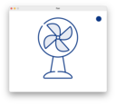 | [***calm-fan***](apps/calm-fan.md) | *Calm down and draw something, in Lisp.*..[ *read more* ](apps/calm-fan.md)*!* | [*blob*](https://github.com/ivan-hc/AM/blob/main/programs/x86_64/calm-fan) **/** [*raw*](https://raw.githubusercontent.com/ivan-hc/AM/main/programs/x86_64/calm-fan) |
| 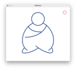 | [***calm-meditator***](apps/calm-meditator.md) | *Calm down and draw something, in Lisp.*..[ *read more* ](apps/calm-meditator.md)*!* | [*blob*](https://github.com/ivan-hc/AM/blob/main/programs/x86_64/calm-meditator) **/** [*raw*](https://raw.githubusercontent.com/ivan-hc/AM/main/programs/x86_64/calm-meditator) |
|  | [***calm-mondrian***](apps/calm-mondrian.md) | *Calm down and draw something, in Lisp.*..[ *read more* ](apps/calm-mondrian.md)*!* | [*blob*](https://github.com/ivan-hc/AM/blob/main/programs/x86_64/calm-mondrian) **/** [*raw*](https://raw.githubusercontent.com/ivan-hc/AM/main/programs/x86_64/calm-mondrian) |
|  | [***candycrisis***](apps/candycrisis.md) | *Candy Crisis source port for modern operating systems.*..[ *read more* ](apps/candycrisis.md)*!* | [*blob*](https://github.com/ivan-hc/AM/blob/main/programs/x86_64/candycrisis) **/** [*raw*](https://raw.githubusercontent.com/ivan-hc/AM/main/programs/x86_64/candycrisis) |
|  | [***capbattleship***](apps/capbattleship.md) | *Battleship game with a pirate theme.*..[ *read more* ](apps/capbattleship.md)*!* | [*blob*](https://github.com/ivan-hc/AM/blob/main/programs/x86_64/capbattleship) **/** [*raw*](https://raw.githubusercontent.com/ivan-hc/AM/main/programs/x86_64/capbattleship) |
|  | [***caprine***](apps/caprine.md) | *Unofficial, elegant privacy focused Facebook Messenger app.*..[ *read more* ](apps/caprine.md)*!* | [*blob*](https://github.com/ivan-hc/AM/blob/main/programs/x86_64/caprine) **/** [*raw*](https://raw.githubusercontent.com/ivan-hc/AM/main/programs/x86_64/caprine) |
|  | [***cardo***](apps/cardo.md) | *Podcast client.*..[ *read more* ](apps/cardo.md)*!* | [*blob*](https://github.com/ivan-hc/AM/blob/main/programs/x86_64/cardo) **/** [*raw*](https://raw.githubusercontent.com/ivan-hc/AM/main/programs/x86_64/cardo) |
|  | [***cargo***](apps/cargo.md) | *Converts your crate into an AppImage.*..[ *read more* ](apps/cargo.md)*!* | [*blob*](https://github.com/ivan-hc/AM/blob/main/programs/x86_64/cargo) **/** [*raw*](https://raw.githubusercontent.com/ivan-hc/AM/main/programs/x86_64/cargo) |
|  | [***carnet***](apps/carnet.md) | *A complete and rich note taking app with sync capabilities.*..[ *read more* ](apps/carnet.md)*!* | [*blob*](https://github.com/ivan-hc/AM/blob/main/programs/x86_64/carnet) **/** [*raw*](https://raw.githubusercontent.com/ivan-hc/AM/main/programs/x86_64/carnet) |
|  | [***carpenters***](apps/carpenters.md) | *Digital preservation ingest utility.*..[ *read more* ](apps/carpenters.md)*!* | [*blob*](https://github.com/ivan-hc/AM/blob/main/programs/x86_64/carpenters) **/** [*raw*](https://raw.githubusercontent.com/ivan-hc/AM/main/programs/x86_64/carpenters) |
|  | [***carta***](apps/carta.md) | *Cube Analysis and Rendering Tool for Astronomy.*..[ *read more* ](apps/carta.md)*!* | [*blob*](https://github.com/ivan-hc/AM/blob/main/programs/x86_64/carta) **/** [*raw*](https://raw.githubusercontent.com/ivan-hc/AM/main/programs/x86_64/carta) |
|  | [***casm***](apps/casm.md) | *Corinthian Abstract State Machine, CASM.*..[ *read more* ](apps/casm.md)*!* | [*blob*](https://github.com/ivan-hc/AM/blob/main/programs/x86_64/casm) **/** [*raw*](https://raw.githubusercontent.com/ivan-hc/AM/main/programs/x86_64/casm) |
|  | [***casterr***](apps/casterr.md) | *Screen recorder, easing recording and clipping in-game.*..[ *read more* ](apps/casterr.md)*!* | [*blob*](https://github.com/ivan-hc/AM/blob/main/programs/x86_64/casterr) **/** [*raw*](https://raw.githubusercontent.com/ivan-hc/AM/main/programs/x86_64/casterr) |
|  | [***castersoundboard***](apps/castersoundboard.md) | *Soundboard for hot-keying and playing back sounds.*..[ *read more* ](apps/castersoundboard.md)*!* | [*blob*](https://github.com/ivan-hc/AM/blob/main/programs/x86_64/castersoundboard) **/** [*raw*](https://raw.githubusercontent.com/ivan-hc/AM/main/programs/x86_64/castersoundboard) |
|  | [***catalyst***](apps/catalyst.md) | *Catalyst web browser.*..[ *read more* ](apps/catalyst.md)*!* | [*blob*](https://github.com/ivan-hc/AM/blob/main/programs/x86_64/catalyst) **/** [*raw*](https://raw.githubusercontent.com/ivan-hc/AM/main/programs/x86_64/catalyst) |
|  | [***catapult***](apps/catapult.md) | *A cross-platform launcher for Cataclysm DDA and BN.*..[ *read more* ](apps/catapult.md)*!* | [*blob*](https://github.com/ivan-hc/AM/blob/main/programs/x86_64/catapult) **/** [*raw*](https://raw.githubusercontent.com/ivan-hc/AM/main/programs/x86_64/catapult) |
|  | [***catcher***](apps/catcher.md) | *Peer-testing of software projects.*..[ *read more* ](apps/catcher.md)*!* | [*blob*](https://github.com/ivan-hc/AM/blob/main/programs/x86_64/catcher) **/** [*raw*](https://raw.githubusercontent.com/ivan-hc/AM/main/programs/x86_64/catcher) |
|  | [***cate-desktop***](apps/cate-desktop.md) | *GUI for the ESA CCI Toolbox, Cate.*..[ *read more* ](apps/cate-desktop.md)*!* | [*blob*](https://github.com/ivan-hc/AM/blob/main/programs/x86_64/cate-desktop) **/** [*raw*](https://raw.githubusercontent.com/ivan-hc/AM/main/programs/x86_64/cate-desktop) |
|  | [***cavoke***](apps/cavoke.md) | *Platform to create/host multiplayer turn-based board games.*..[ *read more* ](apps/cavoke.md)*!* | [*blob*](https://github.com/ivan-hc/AM/blob/main/programs/x86_64/cavoke) **/** [*raw*](https://raw.githubusercontent.com/ivan-hc/AM/main/programs/x86_64/cavoke) |
|  | [***cbetar2***](apps/cbetar2.md) | *ePub viewer supporting fetching and displaying HTML as ePub.*..[ *read more* ](apps/cbetar2.md)*!* | [*blob*](https://github.com/ivan-hc/AM/blob/main/programs/x86_64/cbetar2) **/** [*raw*](https://raw.githubusercontent.com/ivan-hc/AM/main/programs/x86_64/cbetar2) |
|  | [***celeste64***](apps/celeste64.md) | *A game made by the Celeste developers.*..[ *read more* ](apps/celeste64.md)*!* | [*blob*](https://github.com/ivan-hc/AM/blob/main/programs/x86_64/celeste64) **/** [*raw*](https://raw.githubusercontent.com/ivan-hc/AM/main/programs/x86_64/celeste64) |
|  | [***celestia-dev***](apps/celestia-dev.md) | *Real time 3D space simulator, developer edition.*..[ *read more* ](apps/celestia-dev.md)*!* | [*blob*](https://github.com/ivan-hc/AM/blob/main/programs/x86_64/celestia-dev) **/** [*raw*](https://raw.githubusercontent.com/ivan-hc/AM/main/programs/x86_64/celestia-dev) |
|  | [***celestia-enanched***](apps/celestia-enanched.md) | *Unofficial. Real-time 3D space simulator with extra detailed maps.*..[ *read more* ](apps/celestia-enanched.md)*!* | [*blob*](https://github.com/ivan-hc/AM/blob/main/programs/x86_64/celestia-enanched) **/** [*raw*](https://raw.githubusercontent.com/ivan-hc/AM/main/programs/x86_64/celestia-enanched) |
|  | [***celestia***](apps/celestia.md) | *Real time 3D space simulator.*..[ *read more* ](apps/celestia.md)*!* | [*blob*](https://github.com/ivan-hc/AM/blob/main/programs/x86_64/celestia) **/** [*raw*](https://raw.githubusercontent.com/ivan-hc/AM/main/programs/x86_64/celestia) |
|  | [***celoterminal-bin***](apps/celoterminal-bin.md) | *Celo Terminal, AppImage version.*..[ *read more* ](apps/celoterminal-bin.md)*!* | [*blob*](https://github.com/ivan-hc/AM/blob/main/programs/x86_64/celoterminal-bin) **/** [*raw*](https://raw.githubusercontent.com/ivan-hc/AM/main/programs/x86_64/celoterminal-bin) |
|  | [***cemu***](apps/cemu.md) | *A Nintendo Wii U emulator that is able to run most Wii U games.*..[ *read more* ](apps/cemu.md)*!* | [*blob*](https://github.com/ivan-hc/AM/blob/main/programs/x86_64/cemu) **/** [*raw*](https://raw.githubusercontent.com/ivan-hc/AM/main/programs/x86_64/cemu) |
|  | [***cerebral-debugger***](apps/cerebral-debugger.md) | *Cerebral Debugger.*..[ *read more* ](apps/cerebral-debugger.md)*!* | [*blob*](https://github.com/ivan-hc/AM/blob/main/programs/x86_64/cerebral-debugger) **/** [*raw*](https://raw.githubusercontent.com/ivan-hc/AM/main/programs/x86_64/cerebral-debugger) |
|  | [***cerebro***](apps/cerebro.md) | *Open-source productivity booster with a brain.*..[ *read more* ](apps/cerebro.md)*!* | [*blob*](https://github.com/ivan-hc/AM/blob/main/programs/x86_64/cerebro) **/** [*raw*](https://raw.githubusercontent.com/ivan-hc/AM/main/programs/x86_64/cerebro) |
|  | [***chain-desktop-wallet***](apps/chain-desktop-wallet.md) | *Crypto.com DeFi Desktop Wallet.*..[ *read more* ](apps/chain-desktop-wallet.md)*!* | [*blob*](https://github.com/ivan-hc/AM/blob/main/programs/x86_64/chain-desktop-wallet) **/** [*raw*](https://raw.githubusercontent.com/ivan-hc/AM/main/programs/x86_64/chain-desktop-wallet) |
|  | [***chainx-signer***](apps/chainx-signer.md) | *Manage ChainX account, sign and sign transactions.*..[ *read more* ](apps/chainx-signer.md)*!* | [*blob*](https://github.com/ivan-hc/AM/blob/main/programs/x86_64/chainx-signer) **/** [*raw*](https://raw.githubusercontent.com/ivan-hc/AM/main/programs/x86_64/chainx-signer) |
|  | [***chatall***](apps/chatall.md) | *Concurrently chat with ChatGPT, Bing Chat, bard, Alpaca and more.*..[ *read more* ](apps/chatall.md)*!* | [*blob*](https://github.com/ivan-hc/AM/blob/main/programs/x86_64/chatall) **/** [*raw*](https://raw.githubusercontent.com/ivan-hc/AM/main/programs/x86_64/chatall) |
|  | [***chatbox***](apps/chatbox.md) | *Chatbox is a desktop app for GPT-4 / GPT-3.5, OpenAI API.*..[ *read more* ](apps/chatbox.md)*!* | [*blob*](https://github.com/ivan-hc/AM/blob/main/programs/x86_64/chatbox) **/** [*raw*](https://raw.githubusercontent.com/ivan-hc/AM/main/programs/x86_64/chatbox) |
|  | [***chatgpt-next-web***](apps/chatgpt-next-web.md) | *A cross-platform ChatGPT/Gemini UI.*..[ *read more* ](apps/chatgpt-next-web.md)*!* | [*blob*](https://github.com/ivan-hc/AM/blob/main/programs/x86_64/chatgpt-next-web) **/** [*raw*](https://raw.githubusercontent.com/ivan-hc/AM/main/programs/x86_64/chatgpt-next-web) |
| 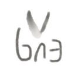 | [***chat-gpt***](apps/chat-gpt.md) | *Unofficial. ChatGPT Desktop Application, Mac, Windows and Linux.*..[ *read more* ](apps/chat-gpt.md)*!* | [*blob*](https://github.com/ivan-hc/AM/blob/main/programs/x86_64/chat-gpt) **/** [*raw*](https://raw.githubusercontent.com/ivan-hc/AM/main/programs/x86_64/chat-gpt) |
|  | [***chatpad-ai***](apps/chatpad-ai.md) | *Not just another ChatGPT user-interface.*..[ *read more* ](apps/chatpad-ai.md)*!* | [*blob*](https://github.com/ivan-hc/AM/blob/main/programs/x86_64/chatpad-ai) **/** [*raw*](https://raw.githubusercontent.com/ivan-hc/AM/main/programs/x86_64/chatpad-ai) |
|  | [***chatterino2-nightly***](apps/chatterino2-nightly.md) | *Second installment of the Twitch chat client.*..[ *read more* ](apps/chatterino2-nightly.md)*!* | [*blob*](https://github.com/ivan-hc/AM/blob/main/programs/x86_64/chatterino2-nightly) **/** [*raw*](https://raw.githubusercontent.com/ivan-hc/AM/main/programs/x86_64/chatterino2-nightly) |
|  | [***chatterino2***](apps/chatterino2.md) | *Second installment of the Twitch chat client.*..[ *read more* ](apps/chatterino2.md)*!* | [*blob*](https://github.com/ivan-hc/AM/blob/main/programs/x86_64/chatterino2) **/** [*raw*](https://raw.githubusercontent.com/ivan-hc/AM/main/programs/x86_64/chatterino2) |
|  | [***cheat***](apps/cheat.md) | *Create and view interactive cheatsheets on the command-line.*..[ *read more* ](apps/cheat.md)*!* | [*blob*](https://github.com/ivan-hc/AM/blob/main/programs/x86_64/cheat) **/** [*raw*](https://raw.githubusercontent.com/ivan-hc/AM/main/programs/x86_64/cheat) |
|  | [***chemcanvas***](apps/chemcanvas.md) | *A very intuitive 2D chemical drawing tool.*..[ *read more* ](apps/chemcanvas.md)*!* | [*blob*](https://github.com/ivan-hc/AM/blob/main/programs/x86_64/chemcanvas) **/** [*raw*](https://raw.githubusercontent.com/ivan-hc/AM/main/programs/x86_64/chemcanvas) |
|  | [***cherrytree***](apps/cherrytree.md) | *A hierarchical note taking application.*..[ *read more* ](apps/cherrytree.md)*!* | [*blob*](https://github.com/ivan-hc/AM/blob/main/programs/x86_64/cherrytree) **/** [*raw*](https://raw.githubusercontent.com/ivan-hc/AM/main/programs/x86_64/cherrytree) |
|  | [***chiaki***](apps/chiaki.md) | *PlayStation 4 Remote Play Client.*..[ *read more* ](apps/chiaki.md)*!* | [*blob*](https://github.com/ivan-hc/AM/blob/main/programs/x86_64/chiaki) **/** [*raw*](https://raw.githubusercontent.com/ivan-hc/AM/main/programs/x86_64/chiaki) |
|  | [***chimeradesk-kvm***](apps/chimeradesk-kvm.md) | *Simple, fast and flexible DIY Remote Desktop software.*..[ *read more* ](apps/chimeradesk-kvm.md)*!* | [*blob*](https://github.com/ivan-hc/AM/blob/main/programs/x86_64/chimeradesk-kvm) **/** [*raw*](https://raw.githubusercontent.com/ivan-hc/AM/main/programs/x86_64/chimeradesk-kvm) |
|  | [***chimeradesk***](apps/chimeradesk.md) | *Simple, fast and flexible DIY Remote Desktop software.*..[ *read more* ](apps/chimeradesk.md)*!* | [*blob*](https://github.com/ivan-hc/AM/blob/main/programs/x86_64/chimeradesk) **/** [*raw*](https://raw.githubusercontent.com/ivan-hc/AM/main/programs/x86_64/chimeradesk) |
|  | [***chrolog***](apps/chrolog.md) | *A automated time tracking tool.*..[ *read more* ](apps/chrolog.md)*!* | [*blob*](https://github.com/ivan-hc/AM/blob/main/programs/x86_64/chrolog) **/** [*raw*](https://raw.githubusercontent.com/ivan-hc/AM/main/programs/x86_64/chrolog) |
|  | [***chromium-beta***](apps/chromium-beta.md) | *Unofficial. FOSS Web Browser, base of Google Chrome, beta edition.*..[ *read more* ](apps/chromium-beta.md)*!* | [*blob*](https://github.com/ivan-hc/AM/blob/main/programs/x86_64/chromium-beta) **/** [*raw*](https://raw.githubusercontent.com/ivan-hc/AM/main/programs/x86_64/chromium-beta) |
|  | [***chromium-bsu***](apps/chromium-bsu.md) | *Unofficial. Fast paced arcade style scrolling space shooter, game.*..[ *read more* ](apps/chromium-bsu.md)*!* | [*blob*](https://github.com/ivan-hc/AM/blob/main/programs/x86_64/chromium-bsu) **/** [*raw*](https://raw.githubusercontent.com/ivan-hc/AM/main/programs/x86_64/chromium-bsu) |
|  | [***chromium-edge***](apps/chromium-edge.md) | *Unofficial. FOSS Web Browser, base of Google Chrome, edge edition.*..[ *read more* ](apps/chromium-edge.md)*!* | [*blob*](https://github.com/ivan-hc/AM/blob/main/programs/x86_64/chromium-edge) **/** [*raw*](https://raw.githubusercontent.com/ivan-hc/AM/main/programs/x86_64/chromium-edge) |
|  | [***chromium-latest***](apps/chromium-latest.md) | *FOSS Web Browser, base of Google Chrome, official unstable build.*..[ *read more* ](apps/chromium-latest.md)*!* | [*blob*](https://github.com/ivan-hc/AM/blob/main/programs/x86_64/chromium-latest) **/** [*raw*](https://raw.githubusercontent.com/ivan-hc/AM/main/programs/x86_64/chromium-latest) |
|  | [***chromium-rc***](apps/chromium-rc.md) | *Unofficial. FOSS Web Browser, base of Google Chrome, release candidate.*..[ *read more* ](apps/chromium-rc.md)*!* | [*blob*](https://github.com/ivan-hc/AM/blob/main/programs/x86_64/chromium-rc) **/** [*raw*](https://raw.githubusercontent.com/ivan-hc/AM/main/programs/x86_64/chromium-rc) |
|  | [***chromium***](apps/chromium.md) | *Unofficial. FOSS Web Browser, base of Google Chrome, Edge and Brave, stable.*..[ *read more* ](apps/chromium.md)*!* | [*blob*](https://github.com/ivan-hc/AM/blob/main/programs/x86_64/chromium) **/** [*raw*](https://raw.githubusercontent.com/ivan-hc/AM/main/programs/x86_64/chromium) |
|  | [***chrysalis-bin***](apps/chrysalis-bin.md) | *Graphical configurator for Kaleidoscope-powered keyboards.*..[ *read more* ](apps/chrysalis-bin.md)*!* | [*blob*](https://github.com/ivan-hc/AM/blob/main/programs/x86_64/chrysalis-bin) **/** [*raw*](https://raw.githubusercontent.com/ivan-hc/AM/main/programs/x86_64/chrysalis-bin) |
| 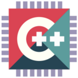 | [***ciaa-suite***](apps/ciaa-suite.md) | *Makefile based IDE for embedded systems.*..[ *read more* ](apps/ciaa-suite.md)*!* | [*blob*](https://github.com/ivan-hc/AM/blob/main/programs/x86_64/ciaa-suite) **/** [*raw*](https://raw.githubusercontent.com/ivan-hc/AM/main/programs/x86_64/ciaa-suite) |
| 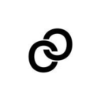 | [***cider***](apps/cider.md) | *A new cross-platform Apple Music experience with performance in mind.*..[ *read more* ](apps/cider.md)*!* | [*blob*](https://github.com/ivan-hc/AM/blob/main/programs/x86_64/cider) **/** [*raw*](https://raw.githubusercontent.com/ivan-hc/AM/main/programs/x86_64/cider) |
|  | [***cinelerra-gg***](apps/cinelerra-gg.md) | *Professional video editing and compositing environment.*..[ *read more* ](apps/cinelerra-gg.md)*!* | [*blob*](https://github.com/ivan-hc/AM/blob/main/programs/x86_64/cinelerra-gg) **/** [*raw*](https://raw.githubusercontent.com/ivan-hc/AM/main/programs/x86_64/cinelerra-gg) |
|  | [***cinny***](apps/cinny.md) | *Yet another matrix client for desktop.*..[ *read more* ](apps/cinny.md)*!* | [*blob*](https://github.com/ivan-hc/AM/blob/main/programs/x86_64/cinny) **/** [*raw*](https://raw.githubusercontent.com/ivan-hc/AM/main/programs/x86_64/cinny) |
|  | [***circle-z***](apps/circle-z.md) | *A chat client for online math courses.*..[ *read more* ](apps/circle-z.md)*!* | [*blob*](https://github.com/ivan-hc/AM/blob/main/programs/x86_64/circle-z) **/** [*raw*](https://raw.githubusercontent.com/ivan-hc/AM/main/programs/x86_64/circle-z) |
|  | [***circuitblocks***](apps/circuitblocks.md) | *Helps newbies get into embedded programming.*..[ *read more* ](apps/circuitblocks.md)*!* | [*blob*](https://github.com/ivan-hc/AM/blob/main/programs/x86_64/circuitblocks) **/** [*raw*](https://raw.githubusercontent.com/ivan-hc/AM/main/programs/x86_64/circuitblocks) |
|  | [***city-hub***](apps/city-hub.md) | *Hub into everything on City Chain/Smart City Platform.*..[ *read more* ](apps/city-hub.md)*!* | [*blob*](https://github.com/ivan-hc/AM/blob/main/programs/x86_64/city-hub) **/** [*raw*](https://raw.githubusercontent.com/ivan-hc/AM/main/programs/x86_64/city-hub) |
|  | [***clash-verge***](apps/clash-verge.md) | *A multiplatform Clash GUI based on tauri.*..[ *read more* ](apps/clash-verge.md)*!* | [*blob*](https://github.com/ivan-hc/AM/blob/main/programs/x86_64/clash-verge) **/** [*raw*](https://raw.githubusercontent.com/ivan-hc/AM/main/programs/x86_64/clash-verge) |
|  | [***classicimageviewer***](apps/classicimageviewer.md) | *A simple image viewer with some editing features.*..[ *read more* ](apps/classicimageviewer.md)*!* | [*blob*](https://github.com/ivan-hc/AM/blob/main/programs/x86_64/classicimageviewer) **/** [*raw*](https://raw.githubusercontent.com/ivan-hc/AM/main/programs/x86_64/classicimageviewer) |
|  | [***cleepdesktop***](apps/cleepdesktop.md) | *Desktop application to manage your Cleep devices.*..[ *read more* ](apps/cleepdesktop.md)*!* | [*blob*](https://github.com/ivan-hc/AM/blob/main/programs/x86_64/cleepdesktop) **/** [*raw*](https://raw.githubusercontent.com/ivan-hc/AM/main/programs/x86_64/cleepdesktop) |
|  | [***clementineremote***](apps/clementineremote.md) | *Remote for Clementine Music Player.*..[ *read more* ](apps/clementineremote.md)*!* | [*blob*](https://github.com/ivan-hc/AM/blob/main/programs/x86_64/clementineremote) **/** [*raw*](https://raw.githubusercontent.com/ivan-hc/AM/main/programs/x86_64/clementineremote) |
|  | [***cliniface***](apps/cliniface.md) | *3D Facial Image Visualisation and Analysis.*..[ *read more* ](apps/cliniface.md)*!* | [*blob*](https://github.com/ivan-hc/AM/blob/main/programs/x86_64/cliniface) **/** [*raw*](https://raw.githubusercontent.com/ivan-hc/AM/main/programs/x86_64/cliniface) |
|  | [***clipgrab***](apps/clipgrab.md) | *Download and Convert Online Videos.*..[ *read more* ](apps/clipgrab.md)*!* | [*blob*](https://github.com/ivan-hc/AM/blob/main/programs/x86_64/clipgrab) **/** [*raw*](https://raw.githubusercontent.com/ivan-hc/AM/main/programs/x86_64/clipgrab) |
|  | [***clip-maui***](apps/clip-maui.md) | *Official movie player of Maui using MPV as backend.*..[ *read more* ](apps/clip-maui.md)*!* | [*blob*](https://github.com/ivan-hc/AM/blob/main/programs/x86_64/clip-maui) **/** [*raw*](https://raw.githubusercontent.com/ivan-hc/AM/main/programs/x86_64/clip-maui) |
|  | [***clippy***](apps/clippy.md) | *Clipboard History.*..[ *read more* ](apps/clippy.md)*!* | [*blob*](https://github.com/ivan-hc/AM/blob/main/programs/x86_64/clippy) **/** [*raw*](https://raw.githubusercontent.com/ivan-hc/AM/main/programs/x86_64/clippy) |
|  | [***clipr***](apps/clipr.md) | *The clipboard that syncs.*..[ *read more* ](apps/clipr.md)*!* | [*blob*](https://github.com/ivan-hc/AM/blob/main/programs/x86_64/clipr) **/** [*raw*](https://raw.githubusercontent.com/ivan-hc/AM/main/programs/x86_64/clipr) |
| 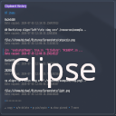 | [***clipse***](apps/clipse.md) | *Configurable TUI clipboard manager for Unix.*..[ *read more* ](apps/clipse.md)*!* | [*blob*](https://github.com/ivan-hc/AM/blob/main/programs/x86_64/clipse) **/** [*raw*](https://raw.githubusercontent.com/ivan-hc/AM/main/programs/x86_64/clipse) |
|  | [***cloud-browser***](apps/cloud-browser.md) | *Access to files located in various cloud services.*..[ *read more* ](apps/cloud-browser.md)*!* | [*blob*](https://github.com/ivan-hc/AM/blob/main/programs/x86_64/cloud-browser) **/** [*raw*](https://raw.githubusercontent.com/ivan-hc/AM/main/programs/x86_64/cloud-browser) |
|  | [***clownmaped***](apps/clownmaped.md) | *Sonic the Hedgehog sprite editor, clone of Xenowhirl's SonMapEd.*..[ *read more* ](apps/clownmaped.md)*!* | [*blob*](https://github.com/ivan-hc/AM/blob/main/programs/x86_64/clownmaped) **/** [*raw*](https://raw.githubusercontent.com/ivan-hc/AM/main/programs/x86_64/clownmaped) |
|  | [***clownmdemu***](apps/clownmdemu.md) | *Reference standalone frontend for clownmdemu.*..[ *read more* ](apps/clownmdemu.md)*!* | [*blob*](https://github.com/ivan-hc/AM/blob/main/programs/x86_64/clownmdemu) **/** [*raw*](https://raw.githubusercontent.com/ivan-hc/AM/main/programs/x86_64/clownmdemu) |
| 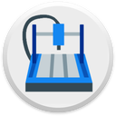 | [***cncjs***](apps/cncjs.md) | *CNC Milling Controller.*..[ *read more* ](apps/cncjs.md)*!* | [*blob*](https://github.com/ivan-hc/AM/blob/main/programs/x86_64/cncjs) **/** [*raw*](https://raw.githubusercontent.com/ivan-hc/AM/main/programs/x86_64/cncjs) |
|  | [***cncra2yr***](apps/cncra2yr.md) | *C&C Red Alert 2, a real-time strategy game by Westwood Pacific.*..[ *read more* ](apps/cncra2yr.md)*!* | [*blob*](https://github.com/ivan-hc/AM/blob/main/programs/x86_64/cncra2yr) **/** [*raw*](https://raw.githubusercontent.com/ivan-hc/AM/main/programs/x86_64/cncra2yr) |
|  | [***coal-launcher***](apps/coal-launcher.md) | *A client to view and play games from the AB Coal website.*..[ *read more* ](apps/coal-launcher.md)*!* | [*blob*](https://github.com/ivan-hc/AM/blob/main/programs/x86_64/coal-launcher) **/** [*raw*](https://raw.githubusercontent.com/ivan-hc/AM/main/programs/x86_64/coal-launcher) |
|  | [***cocomusic***](apps/cocomusic.md) | *A simple music player built by electron and vue.*..[ *read more* ](apps/cocomusic.md)*!* | [*blob*](https://github.com/ivan-hc/AM/blob/main/programs/x86_64/cocomusic) **/** [*raw*](https://raw.githubusercontent.com/ivan-hc/AM/main/programs/x86_64/cocomusic) |
|  | [***code-notes***](apps/code-notes.md) | *A simple code snippet amp built with Electron.*..[ *read more* ](apps/code-notes.md)*!* | [*blob*](https://github.com/ivan-hc/AM/blob/main/programs/x86_64/code-notes) **/** [*raw*](https://raw.githubusercontent.com/ivan-hc/AM/main/programs/x86_64/code-notes) |
|  | [***code-oss***](apps/code-oss.md) | *Visual Studio Code OSS Edition.*..[ *read more* ](apps/code-oss.md)*!* | [*blob*](https://github.com/ivan-hc/AM/blob/main/programs/x86_64/code-oss) **/** [*raw*](https://raw.githubusercontent.com/ivan-hc/AM/main/programs/x86_64/code-oss) |
|  | [***code-radio***](apps/code-radio.md) | *A command line music radio client for coderadio.freecodecamp.org, written in Rust.*..[ *read more* ](apps/code-radio.md)*!* | [*blob*](https://github.com/ivan-hc/AM/blob/main/programs/x86_64/code-radio) **/** [*raw*](https://raw.githubusercontent.com/ivan-hc/AM/main/programs/x86_64/code-radio) |
|  | [***code***](apps/code.md) | *Visual Studio, VSCode, Original Editor to build/debug web/cloud apps.*..[ *read more* ](apps/code.md)*!* | [*blob*](https://github.com/ivan-hc/AM/blob/main/programs/x86_64/code) **/** [*raw*](https://raw.githubusercontent.com/ivan-hc/AM/main/programs/x86_64/code) |
|  | [***coinstac***](apps/coinstac.md) | *Collaborative Informatics and Neuroimaging Suite Toolkit.*..[ *read more* ](apps/coinstac.md)*!* | [*blob*](https://github.com/ivan-hc/AM/blob/main/programs/x86_64/coinstac) **/** [*raw*](https://raw.githubusercontent.com/ivan-hc/AM/main/programs/x86_64/coinstac) |
|  | [***colobot***](apps/colobot.md) | *Colonize with bots, game.*..[ *read more* ](apps/colobot.md)*!* | [*blob*](https://github.com/ivan-hc/AM/blob/main/programs/x86_64/colobot) **/** [*raw*](https://raw.githubusercontent.com/ivan-hc/AM/main/programs/x86_64/colobot) |
|  | [***colon***](apps/colon.md) | *A flexible text editor.*..[ *read more* ](apps/colon.md)*!* | [*blob*](https://github.com/ivan-hc/AM/blob/main/programs/x86_64/colon) **/** [*raw*](https://raw.githubusercontent.com/ivan-hc/AM/main/programs/x86_64/colon) |
|  | [***colorgenerator***](apps/colorgenerator.md) | *Generates color palettes similar to ColorBrewer.*..[ *read more* ](apps/colorgenerator.md)*!* | [*blob*](https://github.com/ivan-hc/AM/blob/main/programs/x86_64/colorgenerator) **/** [*raw*](https://raw.githubusercontent.com/ivan-hc/AM/main/programs/x86_64/colorgenerator) |
|  | [***colorpicker***](apps/colorpicker.md) | *Electron app that can show colors with hex/rgb.*..[ *read more* ](apps/colorpicker.md)*!* | [*blob*](https://github.com/ivan-hc/AM/blob/main/programs/x86_64/colorpicker) **/** [*raw*](https://raw.githubusercontent.com/ivan-hc/AM/main/programs/x86_64/colorpicker) |
| 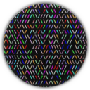 | [***colorstatic-bash***](apps/colorstatic-bash.md) | *CLI to generate a random colorful "Static"/"Matrix".*..[ *read more* ](apps/colorstatic-bash.md)*!* | [*blob*](https://github.com/ivan-hc/AM/blob/main/programs/x86_64/colorstatic-bash) **/** [*raw*](https://raw.githubusercontent.com/ivan-hc/AM/main/programs/x86_64/colorstatic-bash) |
|  | [***comic-book-reader***](apps/comic-book-reader.md) | *Reader and converter for cbz, cbr, epub and pdf files.*..[ *read more* ](apps/comic-book-reader.md)*!* | [*blob*](https://github.com/ivan-hc/AM/blob/main/programs/x86_64/comic-book-reader) **/** [*raw*](https://raw.githubusercontent.com/ivan-hc/AM/main/programs/x86_64/comic-book-reader) |
|  | [***comic-reader***](apps/comic-reader.md) | *Electron based comic reader.*..[ *read more* ](apps/comic-reader.md)*!* | [*blob*](https://github.com/ivan-hc/AM/blob/main/programs/x86_64/comic-reader) **/** [*raw*](https://raw.githubusercontent.com/ivan-hc/AM/main/programs/x86_64/comic-reader) |
|  | [***comictagger***](apps/comictagger.md) | *A multi-platform app for writing metadata to digital comics.*..[ *read more* ](apps/comictagger.md)*!* | [*blob*](https://github.com/ivan-hc/AM/blob/main/programs/x86_64/comictagger) **/** [*raw*](https://raw.githubusercontent.com/ivan-hc/AM/main/programs/x86_64/comictagger) |
|  | [***communicator-maui***](apps/communicator-maui.md) | *Create and organize contacts, phone, email, name, etc..*..[ *read more* ](apps/communicator-maui.md)*!* | [*blob*](https://github.com/ivan-hc/AM/blob/main/programs/x86_64/communicator-maui) **/** [*raw*](https://raw.githubusercontent.com/ivan-hc/AM/main/programs/x86_64/communicator-maui) |
|  | [***compass***](apps/compass.md) | *Air Traffic Surveillance DataBase.*..[ *read more* ](apps/compass.md)*!* | [*blob*](https://github.com/ivan-hc/AM/blob/main/programs/x86_64/compass) **/** [*raw*](https://raw.githubusercontent.com/ivan-hc/AM/main/programs/x86_64/compass) |
|  | [***concordium-desktop-wallet***](apps/concordium-desktop-wallet.md) | *The official Concordium Dektop Wallet.*..[ *read more* ](apps/concordium-desktop-wallet.md)*!* | [*blob*](https://github.com/ivan-hc/AM/blob/main/programs/x86_64/concordium-desktop-wallet) **/** [*raw*](https://raw.githubusercontent.com/ivan-hc/AM/main/programs/x86_64/concordium-desktop-wallet) |
|  | [***conduction***](apps/conduction.md) | *Tasks? Done. That was quick.*..[ *read more* ](apps/conduction.md)*!* | [*blob*](https://github.com/ivan-hc/AM/blob/main/programs/x86_64/conduction) **/** [*raw*](https://raw.githubusercontent.com/ivan-hc/AM/main/programs/x86_64/conduction) |
|  | [***conky***](apps/conky.md) | *Light-weight system monitor for X.*..[ *read more* ](apps/conky.md)*!* | [*blob*](https://github.com/ivan-hc/AM/blob/main/programs/x86_64/conky) **/** [*raw*](https://raw.githubusercontent.com/ivan-hc/AM/main/programs/x86_64/conky) |
|  | [***consoleworkbench***](apps/consoleworkbench.md) | *Console workbench.*..[ *read more* ](apps/consoleworkbench.md)*!* | [*blob*](https://github.com/ivan-hc/AM/blob/main/programs/x86_64/consoleworkbench) **/** [*raw*](https://raw.githubusercontent.com/ivan-hc/AM/main/programs/x86_64/consoleworkbench) |
|  | [***contour***](apps/contour.md) | *Modern C++ Terminal Emulator.*..[ *read more* ](apps/contour.md)*!* | [*blob*](https://github.com/ivan-hc/AM/blob/main/programs/x86_64/contour) **/** [*raw*](https://raw.githubusercontent.com/ivan-hc/AM/main/programs/x86_64/contour) |
|  | [***conty***](apps/conty.md) | *Easy to use unprivileged and portable Arch Linux container.*..[ *read more* ](apps/conty.md)*!* | [*blob*](https://github.com/ivan-hc/AM/blob/main/programs/x86_64/conty) **/** [*raw*](https://raw.githubusercontent.com/ivan-hc/AM/main/programs/x86_64/conty) |
|  | [***conty-lite***](apps/conty-lite.md) | *Easy to use unprivileged and portable Arch Linux container.*..[ *read more* ](apps/conty-lite.md)*!* | [*blob*](https://github.com/ivan-hc/AM/blob/main/programs/x86_64/conty-lite) **/** [*raw*](https://raw.githubusercontent.com/ivan-hc/AM/main/programs/x86_64/conty-lite) |
|  | [***conty-wine***](apps/conty-wine.md) | *Easy to use unprivileged and portable Arch Linux container.*..[ *read more* ](apps/conty-wine.md)*!* | [*blob*](https://github.com/ivan-hc/AM/blob/main/programs/x86_64/conty-wine) **/** [*raw*](https://raw.githubusercontent.com/ivan-hc/AM/main/programs/x86_64/conty-wine) |
|  | [***converseen***](apps/converseen.md) | *A batch image converter and resizer.*..[ *read more* ](apps/converseen.md)*!* | [*blob*](https://github.com/ivan-hc/AM/blob/main/programs/x86_64/converseen) **/** [*raw*](https://raw.githubusercontent.com/ivan-hc/AM/main/programs/x86_64/converseen) |
|  | [***converter432hz***](apps/converter432hz.md) | *Converts and re-encodes music to 432hz.*..[ *read more* ](apps/converter432hz.md)*!* | [*blob*](https://github.com/ivan-hc/AM/blob/main/programs/x86_64/converter432hz) **/** [*raw*](https://raw.githubusercontent.com/ivan-hc/AM/main/programs/x86_64/converter432hz) |
|  | [***coolercontrol***](apps/coolercontrol.md) | *A program to monitor and control your cooling devices.*..[ *read more* ](apps/coolercontrol.md)*!* | [*blob*](https://github.com/ivan-hc/AM/blob/main/programs/x86_64/coolercontrol) **/** [*raw*](https://raw.githubusercontent.com/ivan-hc/AM/main/programs/x86_64/coolercontrol) |
|  | [***coolercontrold***](apps/coolercontrold.md) | *Daemon for coolercontrol, to monitor your cooling devices.*..[ *read more* ](apps/coolercontrold.md)*!* | [*blob*](https://github.com/ivan-hc/AM/blob/main/programs/x86_64/coolercontrold) **/** [*raw*](https://raw.githubusercontent.com/ivan-hc/AM/main/programs/x86_64/coolercontrold) |
| 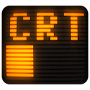 | [***cool-retro-term***](apps/cool-retro-term.md) | *Use the command line the old way.*..[ *read more* ](apps/cool-retro-term.md)*!* | [*blob*](https://github.com/ivan-hc/AM/blob/main/programs/x86_64/cool-retro-term) **/** [*raw*](https://raw.githubusercontent.com/ivan-hc/AM/main/programs/x86_64/cool-retro-term) |
|  | [***copytranslator***](apps/copytranslator.md) | *Foreign language reading and translation assistant.*..[ *read more* ](apps/copytranslator.md)*!* | [*blob*](https://github.com/ivan-hc/AM/blob/main/programs/x86_64/copytranslator) **/** [*raw*](https://raw.githubusercontent.com/ivan-hc/AM/main/programs/x86_64/copytranslator) |
|  | [***cordlauncher***](apps/cordlauncher.md) | *Cord launcher based on Electron and Wep Application.*..[ *read more* ](apps/cordlauncher.md)*!* | [*blob*](https://github.com/ivan-hc/AM/blob/main/programs/x86_64/cordlauncher) **/** [*raw*](https://raw.githubusercontent.com/ivan-hc/AM/main/programs/x86_64/cordlauncher) |
|  | [***coreaction***](apps/coreaction.md) | *A side bar for showing widgets for CuboCore Application Suite.*..[ *read more* ](apps/coreaction.md)*!* | [*blob*](https://github.com/ivan-hc/AM/blob/main/programs/x86_64/coreaction) **/** [*raw*](https://raw.githubusercontent.com/ivan-hc/AM/main/programs/x86_64/coreaction) |
|  | [***corearchiver***](apps/corearchiver.md) | *Archive manager for CuboCore Application Suite.*..[ *read more* ](apps/corearchiver.md)*!* | [*blob*](https://github.com/ivan-hc/AM/blob/main/programs/x86_64/corearchiver) **/** [*raw*](https://raw.githubusercontent.com/ivan-hc/AM/main/programs/x86_64/corearchiver) |
| 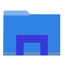 | [***corefm***](apps/corefm.md) | *A lightweight file-manager for C Suite.*..[ *read more* ](apps/corefm.md)*!* | [*blob*](https://github.com/ivan-hc/AM/blob/main/programs/x86_64/corefm) **/** [*raw*](https://raw.githubusercontent.com/ivan-hc/AM/main/programs/x86_64/corefm) |
|  | [***coregarage***](apps/coregarage.md) | *A setting manager for CuboCore Application Suite.*..[ *read more* ](apps/coregarage.md)*!* | [*blob*](https://github.com/ivan-hc/AM/blob/main/programs/x86_64/coregarage) **/** [*raw*](https://raw.githubusercontent.com/ivan-hc/AM/main/programs/x86_64/coregarage) |
|  | [***corehunt***](apps/corehunt.md) | *A file search utility for CuboCore Application Suite.*..[ *read more* ](apps/corehunt.md)*!* | [*blob*](https://github.com/ivan-hc/AM/blob/main/programs/x86_64/corehunt) **/** [*raw*](https://raw.githubusercontent.com/ivan-hc/AM/main/programs/x86_64/corehunt) |
|  | [***coreimage***](apps/coreimage.md) | *An image viewer for CuboCore Application Suite.*..[ *read more* ](apps/coreimage.md)*!* | [*blob*](https://github.com/ivan-hc/AM/blob/main/programs/x86_64/coreimage) **/** [*raw*](https://raw.githubusercontent.com/ivan-hc/AM/main/programs/x86_64/coreimage) |
|  | [***coreinfo***](apps/coreinfo.md) | *A file information viewer for CuboCore Application Suite.*..[ *read more* ](apps/coreinfo.md)*!* | [*blob*](https://github.com/ivan-hc/AM/blob/main/programs/x86_64/coreinfo) **/** [*raw*](https://raw.githubusercontent.com/ivan-hc/AM/main/programs/x86_64/coreinfo) |
|  | [***corekeyboard***](apps/corekeyboard.md) | *A x11 based virtual keyboard for C Suite.*..[ *read more* ](apps/corekeyboard.md)*!* | [*blob*](https://github.com/ivan-hc/AM/blob/main/programs/x86_64/corekeyboard) **/** [*raw*](https://raw.githubusercontent.com/ivan-hc/AM/main/programs/x86_64/corekeyboard) |
|  | [***corepad***](apps/corepad.md) | *A document editor for CuboCore Application Suite.*..[ *read more* ](apps/corepad.md)*!* | [*blob*](https://github.com/ivan-hc/AM/blob/main/programs/x86_64/corepad) **/** [*raw*](https://raw.githubusercontent.com/ivan-hc/AM/main/programs/x86_64/corepad) |
|  | [***corepaint***](apps/corepaint.md) | *A paint app for CuboCore Application Suite.*..[ *read more* ](apps/corepaint.md)*!* | [*blob*](https://github.com/ivan-hc/AM/blob/main/programs/x86_64/corepaint) **/** [*raw*](https://raw.githubusercontent.com/ivan-hc/AM/main/programs/x86_64/corepaint) |
|  | [***corepins***](apps/corepins.md) | *A bookmarking app for CuboCore Application Suite.*..[ *read more* ](apps/corepins.md)*!* | [*blob*](https://github.com/ivan-hc/AM/blob/main/programs/x86_64/corepins) **/** [*raw*](https://raw.githubusercontent.com/ivan-hc/AM/main/programs/x86_64/corepins) |
|  | [***corerenamer***](apps/corerenamer.md) | *A batch file renamer for CuboCore Application Suite.*..[ *read more* ](apps/corerenamer.md)*!* | [*blob*](https://github.com/ivan-hc/AM/blob/main/programs/x86_64/corerenamer) **/** [*raw*](https://raw.githubusercontent.com/ivan-hc/AM/main/programs/x86_64/corerenamer) |
|  | [***coreshot***](apps/coreshot.md) | *A screen capture utility for CuboCore Application Suite.*..[ *read more* ](apps/coreshot.md)*!* | [*blob*](https://github.com/ivan-hc/AM/blob/main/programs/x86_64/coreshot) **/** [*raw*](https://raw.githubusercontent.com/ivan-hc/AM/main/programs/x86_64/coreshot) |
|  | [***corestats***](apps/corestats.md) | *A system resource viewer from the CoreApps family.*..[ *read more* ](apps/corestats.md)*!* | [*blob*](https://github.com/ivan-hc/AM/blob/main/programs/x86_64/corestats) **/** [*raw*](https://raw.githubusercontent.com/ivan-hc/AM/main/programs/x86_64/corestats) |
|  | [***corestuff***](apps/corestuff.md) | *An activity viewer for CuboCore Application Suite.*..[ *read more* ](apps/corestuff.md)*!* | [*blob*](https://github.com/ivan-hc/AM/blob/main/programs/x86_64/corestuff) **/** [*raw*](https://raw.githubusercontent.com/ivan-hc/AM/main/programs/x86_64/corestuff) |
|  | [***coreterminal***](apps/coreterminal.md) | *A terminal emulator for C Suite.*..[ *read more* ](apps/coreterminal.md)*!* | [*blob*](https://github.com/ivan-hc/AM/blob/main/programs/x86_64/coreterminal) **/** [*raw*](https://raw.githubusercontent.com/ivan-hc/AM/main/programs/x86_64/coreterminal) |
|  | [***coretime***](apps/coretime.md) | *A time related task manager for CuboCore Application Suite.*..[ *read more* ](apps/coretime.md)*!* | [*blob*](https://github.com/ivan-hc/AM/blob/main/programs/x86_64/coretime) **/** [*raw*](https://raw.githubusercontent.com/ivan-hc/AM/main/programs/x86_64/coretime) |
|  | [***coreuniverse***](apps/coreuniverse.md) | *Shows releated information of apps from CuboCore App Suite.*..[ *read more* ](apps/coreuniverse.md)*!* | [*blob*](https://github.com/ivan-hc/AM/blob/main/programs/x86_64/coreuniverse) **/** [*raw*](https://raw.githubusercontent.com/ivan-hc/AM/main/programs/x86_64/coreuniverse) |
|  | [***cosmic-comics***](apps/cosmic-comics.md) | *Web Server based Comics / Manga Collectionner & viewer.*..[ *read more* ](apps/cosmic-comics.md)*!* | [*blob*](https://github.com/ivan-hc/AM/blob/main/programs/x86_64/cosmic-comics) **/** [*raw*](https://raw.githubusercontent.com/ivan-hc/AM/main/programs/x86_64/cosmic-comics) |
|  | [***cosmonium***](apps/cosmonium.md) | *3D astronomy and space exploration program.*..[ *read more* ](apps/cosmonium.md)*!* | [*blob*](https://github.com/ivan-hc/AM/blob/main/programs/x86_64/cosmonium) **/** [*raw*](https://raw.githubusercontent.com/ivan-hc/AM/main/programs/x86_64/cosmonium) |
|  | [***cozydrive***](apps/cozydrive.md) | *File Synchronisation for Cozy, cloud.*..[ *read more* ](apps/cozydrive.md)*!* | [*blob*](https://github.com/ivan-hc/AM/blob/main/programs/x86_64/cozydrive) **/** [*raw*](https://raw.githubusercontent.com/ivan-hc/AM/main/programs/x86_64/cozydrive) |
|  | [***cpeditor***](apps/cpeditor.md) | *Code editor specially designed for competitive programming.*..[ *read more* ](apps/cpeditor.md)*!* | [*blob*](https://github.com/ivan-hc/AM/blob/main/programs/x86_64/cpeditor) **/** [*raw*](https://raw.githubusercontent.com/ivan-hc/AM/main/programs/x86_64/cpeditor) |
|  | [***cpod***](apps/cpod.md) | *A simple, beautiful podcast app.*..[ *read more* ](apps/cpod.md)*!* | [*blob*](https://github.com/ivan-hc/AM/blob/main/programs/x86_64/cpod) **/** [*raw*](https://raw.githubusercontent.com/ivan-hc/AM/main/programs/x86_64/cpod) |
| 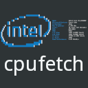 | [***cpufetch***](apps/cpufetch.md) | *Simple yet fancy CPU architecture fetching tool.*..[ *read more* ](apps/cpufetch.md)*!* | [*blob*](https://github.com/ivan-hc/AM/blob/main/programs/x86_64/cpufetch) **/** [*raw*](https://raw.githubusercontent.com/ivan-hc/AM/main/programs/x86_64/cpufetch) |
| 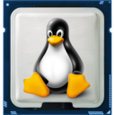 | [***cpu-x***](apps/cpu-x.md) | *Software that gathers information on CPU, motherboard and more.*..[ *read more* ](apps/cpu-x.md)*!* | [*blob*](https://github.com/ivan-hc/AM/blob/main/programs/x86_64/cpu-x) **/** [*raw*](https://raw.githubusercontent.com/ivan-hc/AM/main/programs/x86_64/cpu-x) |
| 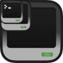 | [***craftos-pc***](apps/craftos-pc.md) | *Advanced ComputerCraft emulator written in C++.*..[ *read more* ](apps/craftos-pc.md)*!* | [*blob*](https://github.com/ivan-hc/AM/blob/main/programs/x86_64/craftos-pc) **/** [*raw*](https://raw.githubusercontent.com/ivan-hc/AM/main/programs/x86_64/craftos-pc) |
|  | [***crankshaft***](apps/crankshaft.md) | *A sensible krunker client written in typescript.*..[ *read more* ](apps/crankshaft.md)*!* | [*blob*](https://github.com/ivan-hc/AM/blob/main/programs/x86_64/crankshaft) **/** [*raw*](https://raw.githubusercontent.com/ivan-hc/AM/main/programs/x86_64/crankshaft) |
|  | [***creality-print***](apps/creality-print.md) | *Creality Print is a slicer dedicated to FDM printers.*..[ *read more* ](apps/creality-print.md)*!* | [*blob*](https://github.com/ivan-hc/AM/blob/main/programs/x86_64/creality-print) **/** [*raw*](https://raw.githubusercontent.com/ivan-hc/AM/main/programs/x86_64/creality-print) |
|  | [***crg-data-tool***](apps/crg-data-tool.md) | *A tool for working with Games Data files from CRG.*..[ *read more* ](apps/crg-data-tool.md)*!* | [*blob*](https://github.com/ivan-hc/AM/blob/main/programs/x86_64/crg-data-tool) **/** [*raw*](https://raw.githubusercontent.com/ivan-hc/AM/main/programs/x86_64/crg-data-tool) |
| 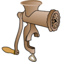 | [***cric***](apps/cric.md) | *Custom Runtime Image Creator.*..[ *read more* ](apps/cric.md)*!* | [*blob*](https://github.com/ivan-hc/AM/blob/main/programs/x86_64/cric) **/** [*raw*](https://raw.githubusercontent.com/ivan-hc/AM/main/programs/x86_64/cric) |
| 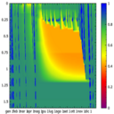 | [***criteria1d***](apps/criteria1d.md) | *A one-dimensional agro-hydrological model.*..[ *read more* ](apps/criteria1d.md)*!* | [*blob*](https://github.com/ivan-hc/AM/blob/main/programs/x86_64/criteria1d) **/** [*raw*](https://raw.githubusercontent.com/ivan-hc/AM/main/programs/x86_64/criteria1d) |
|  | [***criteria1d-pro***](apps/criteria1d-pro.md) | *A one-dimensional agro-hydrological model, PRO.*..[ *read more* ](apps/criteria1d-pro.md)*!* | [*blob*](https://github.com/ivan-hc/AM/blob/main/programs/x86_64/criteria1d-pro) **/** [*raw*](https://raw.githubusercontent.com/ivan-hc/AM/main/programs/x86_64/criteria1d-pro) |
|  | [***criteria-geo***](apps/criteria-geo.md) | *A one-dimensional agro-hydrological model, GIS interface.*..[ *read more* ](apps/criteria-geo.md)*!* | [*blob*](https://github.com/ivan-hc/AM/blob/main/programs/x86_64/criteria-geo) **/** [*raw*](https://raw.githubusercontent.com/ivan-hc/AM/main/programs/x86_64/criteria-geo) |
|  | [***cro-chain-desktop-bin***](apps/cro-chain-desktop-bin.md) | *Crypto.com DeFi Desktop Wallet, AppImage version.*..[ *read more* ](apps/cro-chain-desktop-bin.md)*!* | [*blob*](https://github.com/ivan-hc/AM/blob/main/programs/x86_64/cro-chain-desktop-bin) **/** [*raw*](https://raw.githubusercontent.com/ivan-hc/AM/main/programs/x86_64/cro-chain-desktop-bin) |
|  | [***cromagrally***](apps/cromagrally.md) | *The wildest racing game since man invented the wheel!*..[ *read more* ](apps/cromagrally.md)*!* | [*blob*](https://github.com/ivan-hc/AM/blob/main/programs/x86_64/cromagrally) **/** [*raw*](https://raw.githubusercontent.com/ivan-hc/AM/main/programs/x86_64/cromagrally) |
|  | [***cromberg***](apps/cromberg.md) | *Personal accounting system.*..[ *read more* ](apps/cromberg.md)*!* | [*blob*](https://github.com/ivan-hc/AM/blob/main/programs/x86_64/cromberg) **/** [*raw*](https://raw.githubusercontent.com/ivan-hc/AM/main/programs/x86_64/cromberg) |
|  | [***crosscode-map-editor***](apps/crosscode-map-editor.md) | *Map Editor for CrossCode.*..[ *read more* ](apps/crosscode-map-editor.md)*!* | [*blob*](https://github.com/ivan-hc/AM/blob/main/programs/x86_64/crosscode-map-editor) **/** [*raw*](https://raw.githubusercontent.com/ivan-hc/AM/main/programs/x86_64/crosscode-map-editor) |
|  | [***crossmobile***](apps/crossmobile.md) | *Create native iOS/Android/Windows apps in Java.*..[ *read more* ](apps/crossmobile.md)*!* | [*blob*](https://github.com/ivan-hc/AM/blob/main/programs/x86_64/crossmobile) **/** [*raw*](https://raw.githubusercontent.com/ivan-hc/AM/main/programs/x86_64/crossmobile) |
|  | [***crow-translate***](apps/crow-translate.md) | *Translate and speak text using Google, Yandex, Bing and more.*..[ *read more* ](apps/crow-translate.md)*!* | [*blob*](https://github.com/ivan-hc/AM/blob/main/programs/x86_64/crow-translate) **/** [*raw*](https://raw.githubusercontent.com/ivan-hc/AM/main/programs/x86_64/crow-translate) |
|  | [***cryplicity***](apps/cryplicity.md) | *Electron application boilerplate.*..[ *read more* ](apps/cryplicity.md)*!* | [*blob*](https://github.com/ivan-hc/AM/blob/main/programs/x86_64/cryplicity) **/** [*raw*](https://raw.githubusercontent.com/ivan-hc/AM/main/programs/x86_64/cryplicity) |
|  | [***crypter***](apps/crypter.md) | *An innovative, convenient and secure crypto app.*..[ *read more* ](apps/crypter.md)*!* | [*blob*](https://github.com/ivan-hc/AM/blob/main/programs/x86_64/crypter) **/** [*raw*](https://raw.githubusercontent.com/ivan-hc/AM/main/programs/x86_64/crypter) |
|  | [***cryptocam-companion***](apps/cryptocam-companion.md) | *GUI to decrypt videos taken by Cryptocam.*..[ *read more* ](apps/cryptocam-companion.md)*!* | [*blob*](https://github.com/ivan-hc/AM/blob/main/programs/x86_64/cryptocam-companion) **/** [*raw*](https://raw.githubusercontent.com/ivan-hc/AM/main/programs/x86_64/cryptocam-companion) |
|  | [***cryptomator***](apps/cryptomator.md) | *Cloud Storage Encryption Utility.*..[ *read more* ](apps/cryptomator.md)*!* | [*blob*](https://github.com/ivan-hc/AM/blob/main/programs/x86_64/cryptomator) **/** [*raw*](https://raw.githubusercontent.com/ivan-hc/AM/main/programs/x86_64/cryptomator) |
|  | [***cryptr***](apps/cryptr.md) | *A GUI for Vault.*..[ *read more* ](apps/cryptr.md)*!* | [*blob*](https://github.com/ivan-hc/AM/blob/main/programs/x86_64/cryptr) **/** [*raw*](https://raw.githubusercontent.com/ivan-hc/AM/main/programs/x86_64/cryptr) |
|  | [***cscrypto***](apps/cscrypto.md) | *A crypto app.*..[ *read more* ](apps/cscrypto.md)*!* | [*blob*](https://github.com/ivan-hc/AM/blob/main/programs/x86_64/cscrypto) **/** [*raw*](https://raw.githubusercontent.com/ivan-hc/AM/main/programs/x86_64/cscrypto) |
|  | [***ctool***](apps/ctool.md) | *Common Tools for Program Development.*..[ *read more* ](apps/ctool.md)*!* | [*blob*](https://github.com/ivan-hc/AM/blob/main/programs/x86_64/ctool) **/** [*raw*](https://raw.githubusercontent.com/ivan-hc/AM/main/programs/x86_64/ctool) |
|  | [***ctop***](apps/ctop.md) | *Top-like interface for container metrics.*..[ *read more* ](apps/ctop.md)*!* | [*blob*](https://github.com/ivan-hc/AM/blob/main/programs/x86_64/ctop) **/** [*raw*](https://raw.githubusercontent.com/ivan-hc/AM/main/programs/x86_64/ctop) |
| 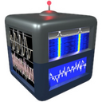 | [***cubicsdr***](apps/cubicsdr.md) | *Software-Defined Radio Application.*..[ *read more* ](apps/cubicsdr.md)*!* | [*blob*](https://github.com/ivan-hc/AM/blob/main/programs/x86_64/cubicsdr) **/** [*raw*](https://raw.githubusercontent.com/ivan-hc/AM/main/programs/x86_64/cubicsdr) |
|  | [***cura***](apps/cura.md) | *An open source slicing application for 3D printers.*..[ *read more* ](apps/cura.md)*!* | [*blob*](https://github.com/ivan-hc/AM/blob/main/programs/x86_64/cura) **/** [*raw*](https://raw.githubusercontent.com/ivan-hc/AM/main/programs/x86_64/cura) |
|  | [***cura-beta***](apps/cura-beta.md) | *An open source slicing application for 3D printers, beta.*..[ *read more* ](apps/cura-beta.md)*!* | [*blob*](https://github.com/ivan-hc/AM/blob/main/programs/x86_64/cura-beta) **/** [*raw*](https://raw.githubusercontent.com/ivan-hc/AM/main/programs/x86_64/cura-beta) |
|  | [***curlie***](apps/curlie.md) | *The power of curl, the ease of use of httpie.*..[ *read more* ](apps/curlie.md)*!* | [*blob*](https://github.com/ivan-hc/AM/blob/main/programs/x86_64/curlie) **/** [*raw*](https://raw.githubusercontent.com/ivan-hc/AM/main/programs/x86_64/curlie) |
|  | [***cursor***](apps/cursor.md) | *Write, edit, and chat about your code with GPT-4.*..[ *read more* ](apps/cursor.md)*!* | [*blob*](https://github.com/ivan-hc/AM/blob/main/programs/x86_64/cursor) **/** [*raw*](https://raw.githubusercontent.com/ivan-hc/AM/main/programs/x86_64/cursor) |
|  | [***customrpc***](apps/customrpc.md) | *An electron-vue project.*..[ *read more* ](apps/customrpc.md)*!* | [*blob*](https://github.com/ivan-hc/AM/blob/main/programs/x86_64/customrpc) **/** [*raw*](https://raw.githubusercontent.com/ivan-hc/AM/main/programs/x86_64/customrpc) |
|  | [***cutechess***](apps/cutechess.md) | *Cute Chess is a GUI, a CLI and a library for playing chess.*..[ *read more* ](apps/cutechess.md)*!* | [*blob*](https://github.com/ivan-hc/AM/blob/main/programs/x86_64/cutechess) **/** [*raw*](https://raw.githubusercontent.com/ivan-hc/AM/main/programs/x86_64/cutechess) |
|  | [***cutepeaks***](apps/cutepeaks.md) | *A simple sanger trace file viewer.*..[ *read more* ](apps/cutepeaks.md)*!* | [*blob*](https://github.com/ivan-hc/AM/blob/main/programs/x86_64/cutepeaks) **/** [*raw*](https://raw.githubusercontent.com/ivan-hc/AM/main/programs/x86_64/cutepeaks) |
|  | [***cutevariant***](apps/cutevariant.md) | *A genetics variant filtering tools*..[ *read more* ](apps/cutevariant.md)*!* | [*blob*](https://github.com/ivan-hc/AM/blob/main/programs/x86_64/cutevariant) **/** [*raw*](https://raw.githubusercontent.com/ivan-hc/AM/main/programs/x86_64/cutevariant) |
|  | [***cutter***](apps/cutter.md) | *Free and Open Source Reverse Engineering Platform.*..[ *read more* ](apps/cutter.md)*!* | [*blob*](https://github.com/ivan-hc/AM/blob/main/programs/x86_64/cutter) **/** [*raw*](https://raw.githubusercontent.com/ivan-hc/AM/main/programs/x86_64/cutter) |
|  | [***czkawka***](apps/czkawka.md) | *App to find duplicates, empty folders, similar images etc.*..[ *read more* ](apps/czkawka.md)*!* | [*blob*](https://github.com/ivan-hc/AM/blob/main/programs/x86_64/czkawka) **/** [*raw*](https://raw.githubusercontent.com/ivan-hc/AM/main/programs/x86_64/czkawka) |
|  | [***dana***](apps/dana.md) | *A desktop client for the Dana learning box.*..[ *read more* ](apps/dana.md)*!* | [*blob*](https://github.com/ivan-hc/AM/blob/main/programs/x86_64/dana) **/** [*raw*](https://raw.githubusercontent.com/ivan-hc/AM/main/programs/x86_64/dana) |
| 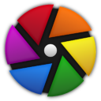 | [***darktable-nightly***](apps/darktable-nightly.md) | *Photography workflow app and raw developer, nightly.*..[ *read more* ](apps/darktable-nightly.md)*!* | [*blob*](https://github.com/ivan-hc/AM/blob/main/programs/x86_64/darktable-nightly) **/** [*raw*](https://raw.githubusercontent.com/ivan-hc/AM/main/programs/x86_64/darktable-nightly) |
|  | [***darktable***](apps/darktable.md) | *Photography workflow app and raw developer.*..[ *read more* ](apps/darktable.md)*!* | [*blob*](https://github.com/ivan-hc/AM/blob/main/programs/x86_64/darktable) **/** [*raw*](https://raw.githubusercontent.com/ivan-hc/AM/main/programs/x86_64/darktable) |
|  | [***dashy-app***](apps/dashy-app.md) | *Dashboard creation application.*..[ *read more* ](apps/dashy-app.md)*!* | [*blob*](https://github.com/ivan-hc/AM/blob/main/programs/x86_64/dashy-app) **/** [*raw*](https://raw.githubusercontent.com/ivan-hc/AM/main/programs/x86_64/dashy-app) |
|  | [***database-dossier***](apps/database-dossier.md) | *A User Interface for your databases.*..[ *read more* ](apps/database-dossier.md)*!* | [*blob*](https://github.com/ivan-hc/AM/blob/main/programs/x86_64/database-dossier) **/** [*raw*](https://raw.githubusercontent.com/ivan-hc/AM/main/programs/x86_64/database-dossier) |
|  | [***dataset-annotator***](apps/dataset-annotator.md) | *An annotation tool for a dataset.*..[ *read more* ](apps/dataset-annotator.md)*!* | [*blob*](https://github.com/ivan-hc/AM/blob/main/programs/x86_64/dataset-annotator) **/** [*raw*](https://raw.githubusercontent.com/ivan-hc/AM/main/programs/x86_64/dataset-annotator) |
|  | [***datcord***](apps/datcord.md) | *Discord client.*..[ *read more* ](apps/datcord.md)*!* | [*blob*](https://github.com/ivan-hc/AM/blob/main/programs/x86_64/datcord) **/** [*raw*](https://raw.githubusercontent.com/ivan-hc/AM/main/programs/x86_64/datcord) |
|  | [***dawnlightsearch***](apps/dawnlightsearch.md) | *A Linux version of Everything Search Engine.*..[ *read more* ](apps/dawnlightsearch.md)*!* | [*blob*](https://github.com/ivan-hc/AM/blob/main/programs/x86_64/dawnlightsearch) **/** [*raw*](https://raw.githubusercontent.com/ivan-hc/AM/main/programs/x86_64/dawnlightsearch) |
|  | [***dbeaver-ce***](apps/dbeaver-ce.md) | *Unofficial, DBeaver Community is a free cross-platform database tool for developers, database administrators, analysts, and everyone working with data.*..[ *read more* ](apps/dbeaver-ce.md)*!* | [*blob*](https://github.com/ivan-hc/AM/blob/main/programs/x86_64/dbeaver-ce) **/** [*raw*](https://raw.githubusercontent.com/ivan-hc/AM/main/programs/x86_64/dbeaver-ce) |
|  | [***dbee***](apps/dbee.md) | *Fast & Minimalistic Database Browser.*..[ *read more* ](apps/dbee.md)*!* | [*blob*](https://github.com/ivan-hc/AM/blob/main/programs/x86_64/dbee) **/** [*raw*](https://raw.githubusercontent.com/ivan-hc/AM/main/programs/x86_64/dbee) |
| 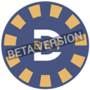 | [***dbet-wallet***](apps/dbet-wallet.md) | *DBET Wallet.*..[ *read more* ](apps/dbet-wallet.md)*!* | [*blob*](https://github.com/ivan-hc/AM/blob/main/programs/x86_64/dbet-wallet) **/** [*raw*](https://raw.githubusercontent.com/ivan-hc/AM/main/programs/x86_64/dbet-wallet) |
|  | [***dbgate***](apps/dbgate.md) | *Opensource database administration tool*..[ *read more* ](apps/dbgate.md)*!* | [*blob*](https://github.com/ivan-hc/AM/blob/main/programs/x86_64/dbgate) **/** [*raw*](https://raw.githubusercontent.com/ivan-hc/AM/main/programs/x86_64/dbgate) |
|  | [***deadbeef***](apps/deadbeef.md) | *A modular cross-platform audio player.*..[ *read more* ](apps/deadbeef.md)*!* | [*blob*](https://github.com/ivan-hc/AM/blob/main/programs/x86_64/deadbeef) **/** [*raw*](https://raw.githubusercontent.com/ivan-hc/AM/main/programs/x86_64/deadbeef) |
|  | [***deadbeef-appimage***](apps/deadbeef-appimage.md) | *Unofficial AppImage of the DeaDBeeF music player. Stable build.*..[ *read more* ](apps/deadbeef-appimage.md)*!* | [*blob*](https://github.com/ivan-hc/AM/blob/main/programs/x86_64/deadbeef-appimage) **/** [*raw*](https://raw.githubusercontent.com/ivan-hc/AM/main/programs/x86_64/deadbeef-appimage) |
|  | [***deadbeef-nightly***](apps/deadbeef-nightly.md) | *A modular cross-platform audio player. Nightly build.*..[ *read more* ](apps/deadbeef-nightly.md)*!* | [*blob*](https://github.com/ivan-hc/AM/blob/main/programs/x86_64/deadbeef-nightly) **/** [*raw*](https://raw.githubusercontent.com/ivan-hc/AM/main/programs/x86_64/deadbeef-nightly) |
|  | [***deadbeef-nightly-appimage***](apps/deadbeef-nightly-appimage.md) | *Unofficial AppImage of the DeaDBeeF music player. Nightly build.*..[ *read more* ](apps/deadbeef-nightly-appimage.md)*!* | [*blob*](https://github.com/ivan-hc/AM/blob/main/programs/x86_64/deadbeef-nightly-appimage) **/** [*raw*](https://raw.githubusercontent.com/ivan-hc/AM/main/programs/x86_64/deadbeef-nightly-appimage) |
|  | [***deadgame-2048***](apps/deadgame-2048.md) | *GUI tool available for ALL platforms.*..[ *read more* ](apps/deadgame-2048.md)*!* | [*blob*](https://github.com/ivan-hc/AM/blob/main/programs/x86_64/deadgame-2048) **/** [*raw*](https://raw.githubusercontent.com/ivan-hc/AM/main/programs/x86_64/deadgame-2048) |
|  | [***deb2appimage***](apps/deb2appimage.md) | *Build AppImages from deb packages on any distro.*..[ *read more* ](apps/deb2appimage.md)*!* | [*blob*](https://github.com/ivan-hc/AM/blob/main/programs/x86_64/deb2appimage) **/** [*raw*](https://raw.githubusercontent.com/ivan-hc/AM/main/programs/x86_64/deb2appimage) |
|  | [***debian-testing-avidemux***](apps/debian-testing-avidemux.md) | *Unofficial, Avidemux built from deb-multimedia.*..[ *read more* ](apps/debian-testing-avidemux.md)*!* | [*blob*](https://github.com/ivan-hc/AM/blob/main/programs/x86_64/debian-testing-avidemux) **/** [*raw*](https://raw.githubusercontent.com/ivan-hc/AM/main/programs/x86_64/debian-testing-avidemux) |
|  | [***deckboard***](apps/deckboard.md) | *Control your PC with your phone in easy way possible.*..[ *read more* ](apps/deckboard.md)*!* | [*blob*](https://github.com/ivan-hc/AM/blob/main/programs/x86_64/deckboard) **/** [*raw*](https://raw.githubusercontent.com/ivan-hc/AM/main/programs/x86_64/deckboard) |
| 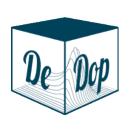 | [***dedop-studio***](apps/dedop-studio.md) | *DeDop Studio*..[ *read more* ](apps/dedop-studio.md)*!* | [*blob*](https://github.com/ivan-hc/AM/blob/main/programs/x86_64/dedop-studio) **/** [*raw*](https://raw.githubusercontent.com/ivan-hc/AM/main/programs/x86_64/dedop-studio) |
|  | [***deepl-linux-electron***](apps/deepl-linux-electron.md) | *DeepL Integration. Select & translate text in any app.*..[ *read more* ](apps/deepl-linux-electron.md)*!* | [*blob*](https://github.com/ivan-hc/AM/blob/main/programs/x86_64/deepl-linux-electron) **/** [*raw*](https://raw.githubusercontent.com/ivan-hc/AM/main/programs/x86_64/deepl-linux-electron) |
|  | [***deeplx***](apps/deeplx.md) | *DeepL Free API, No TOKEN required.*..[ *read more* ](apps/deeplx.md)*!* | [*blob*](https://github.com/ivan-hc/AM/blob/main/programs/x86_64/deeplx) **/** [*raw*](https://raw.githubusercontent.com/ivan-hc/AM/main/programs/x86_64/deeplx) |
|  | [***deepnotes***](apps/deepnotes.md) | *End-to-end encrypted visual note-taking tool.*..[ *read more* ](apps/deepnotes.md)*!* | [*blob*](https://github.com/ivan-hc/AM/blob/main/programs/x86_64/deepnotes) **/** [*raw*](https://raw.githubusercontent.com/ivan-hc/AM/main/programs/x86_64/deepnotes) |
|  | [***deeptags***](apps/deeptags.md) | *Markdown notes manager with support for nested tags.*..[ *read more* ](apps/deeptags.md)*!* | [*blob*](https://github.com/ivan-hc/AM/blob/main/programs/x86_64/deeptags) **/** [*raw*](https://raw.githubusercontent.com/ivan-hc/AM/main/programs/x86_64/deeptags) |
| 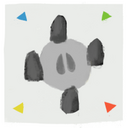 | [***deerportal***](apps/deerportal.md) | *Full of the diamonds board game.*..[ *read more* ](apps/deerportal.md)*!* | [*blob*](https://github.com/ivan-hc/AM/blob/main/programs/x86_64/deerportal) **/** [*raw*](https://raw.githubusercontent.com/ivan-hc/AM/main/programs/x86_64/deerportal) |
|  | [***deezer***](apps/deezer.md) | *A linux port of Deezer, allows downloading your songs, music.*..[ *read more* ](apps/deezer.md)*!* | [*blob*](https://github.com/ivan-hc/AM/blob/main/programs/x86_64/deezer) **/** [*raw*](https://raw.githubusercontent.com/ivan-hc/AM/main/programs/x86_64/deezer) |
|  | [***defichain-app***](apps/defichain-app.md) | *DefiChain Wallet AppImage.*..[ *read more* ](apps/defichain-app.md)*!* | [*blob*](https://github.com/ivan-hc/AM/blob/main/programs/x86_64/defichain-app) **/** [*raw*](https://raw.githubusercontent.com/ivan-hc/AM/main/programs/x86_64/defichain-app) |
|  | [***delir***](apps/delir.md) | *Web Technology driven VFX Application.*..[ *read more* ](apps/delir.md)*!* | [*blob*](https://github.com/ivan-hc/AM/blob/main/programs/x86_64/delir) **/** [*raw*](https://raw.githubusercontent.com/ivan-hc/AM/main/programs/x86_64/delir) |
|  | [***deltachat-desktop***](apps/deltachat-desktop.md) | *Desktop Application for delta.chat.*..[ *read more* ](apps/deltachat-desktop.md)*!* | [*blob*](https://github.com/ivan-hc/AM/blob/main/programs/x86_64/deltachat-desktop) **/** [*raw*](https://raw.githubusercontent.com/ivan-hc/AM/main/programs/x86_64/deltachat-desktop) |
|  | [***demonizer***](apps/demonizer.md) | *Demonic corruption fantasy shmup.*..[ *read more* ](apps/demonizer.md)*!* | [*blob*](https://github.com/ivan-hc/AM/blob/main/programs/x86_64/demonizer) **/** [*raw*](https://raw.githubusercontent.com/ivan-hc/AM/main/programs/x86_64/demonizer) |
| 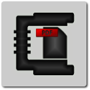 | [***densify***](apps/densify.md) | *A GTK+ GUI Application written in Python that simplifies compressing PDF files with Ghostscript.*..[ *read more* ](apps/densify.md)*!* | [*blob*](https://github.com/ivan-hc/AM/blob/main/programs/x86_64/densify) **/** [*raw*](https://raw.githubusercontent.com/ivan-hc/AM/main/programs/x86_64/densify) |
|  | [***deployer***](apps/deployer.md) | *Deploy your applications through Jenkins.*..[ *read more* ](apps/deployer.md)*!* | [*blob*](https://github.com/ivan-hc/AM/blob/main/programs/x86_64/deployer) **/** [*raw*](https://raw.githubusercontent.com/ivan-hc/AM/main/programs/x86_64/deployer) |
|  | [***deskreen***](apps/deskreen.md) | *Turns any device with a web browser into a secondary screen.*..[ *read more* ](apps/deskreen.md)*!* | [*blob*](https://github.com/ivan-hc/AM/blob/main/programs/x86_64/deskreen) **/** [*raw*](https://raw.githubusercontent.com/ivan-hc/AM/main/programs/x86_64/deskreen) |
|  | [***destiny***](apps/destiny.md) | *Cross-platform Magic Wormhole graphical client.*..[ *read more* ](apps/destiny.md)*!* | [*blob*](https://github.com/ivan-hc/AM/blob/main/programs/x86_64/destiny) **/** [*raw*](https://raw.githubusercontent.com/ivan-hc/AM/main/programs/x86_64/destiny) |
| 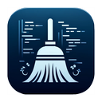 | [***devclean***](apps/devclean.md) | *A CLI and Desktop GUI app to clean dev dependencies (node_modules, cache) and more.*..[ *read more* ](apps/devclean.md)*!* | [*blob*](https://github.com/ivan-hc/AM/blob/main/programs/x86_64/devclean) **/** [*raw*](https://raw.githubusercontent.com/ivan-hc/AM/main/programs/x86_64/devclean) |
|  | [***devdocs-desktop***](apps/devdocs-desktop.md) | *Desktop client for devdocs.io.*..[ *read more* ](apps/devdocs-desktop.md)*!* | [*blob*](https://github.com/ivan-hc/AM/blob/main/programs/x86_64/devdocs-desktop) **/** [*raw*](https://raw.githubusercontent.com/ivan-hc/AM/main/programs/x86_64/devdocs-desktop) |
|  | [***devhub***](apps/devhub.md) | *TweetDeck for GitHub*..[ *read more* ](apps/devhub.md)*!* | [*blob*](https://github.com/ivan-hc/AM/blob/main/programs/x86_64/devhub) **/** [*raw*](https://raw.githubusercontent.com/ivan-hc/AM/main/programs/x86_64/devhub) |
|  | [***devilutionx***](apps/devilutionx.md) | *Diablo build for modern operating systems.*..[ *read more* ](apps/devilutionx.md)*!* | [*blob*](https://github.com/ivan-hc/AM/blob/main/programs/x86_64/devilutionx) **/** [*raw*](https://raw.githubusercontent.com/ivan-hc/AM/main/programs/x86_64/devilutionx) |
|  | [***devsidecar***](apps/devsidecar.md) | *Dev sidecar/github/git/stackoverflow acceleration, in chinese.*..[ *read more* ](apps/devsidecar.md)*!* | [*blob*](https://github.com/ivan-hc/AM/blob/main/programs/x86_64/devsidecar) **/** [*raw*](https://raw.githubusercontent.com/ivan-hc/AM/main/programs/x86_64/devsidecar) |
|  | [***devtools-x***](apps/devtools-x.md) | *Collection of offline first developer utilities available as desktop application.*..[ *read more* ](apps/devtools-x.md)*!* | [*blob*](https://github.com/ivan-hc/AM/blob/main/programs/x86_64/devtools-x) **/** [*raw*](https://raw.githubusercontent.com/ivan-hc/AM/main/programs/x86_64/devtools-x) |
| 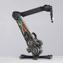 | [***dexter-dev-env***](apps/dexter-dev-env.md) | *Dexter Development Environment.*..[ *read more* ](apps/dexter-dev-env.md)*!* | [*blob*](https://github.com/ivan-hc/AM/blob/main/programs/x86_64/dexter-dev-env) **/** [*raw*](https://raw.githubusercontent.com/ivan-hc/AM/main/programs/x86_64/dexter-dev-env) |
|  | [***dezor***](apps/dezor.md) | *The web browser including VPN and Adblocker.*..[ *read more* ](apps/dezor.md)*!* | [*blob*](https://github.com/ivan-hc/AM/blob/main/programs/x86_64/dezor) **/** [*raw*](https://raw.githubusercontent.com/ivan-hc/AM/main/programs/x86_64/dezor) |
|  | [***dfdemo***](apps/dfdemo.md) | *A thin Tcl/Tk GUI around the df POSIX command.*..[ *read more* ](apps/dfdemo.md)*!* | [*blob*](https://github.com/ivan-hc/AM/blob/main/programs/x86_64/dfdemo) **/** [*raw*](https://raw.githubusercontent.com/ivan-hc/AM/main/programs/x86_64/dfdemo) |
|  | [***dfilemanager***](apps/dfilemanager.md) | *File manager written in Qt and C++.*..[ *read more* ](apps/dfilemanager.md)*!* | [*blob*](https://github.com/ivan-hc/AM/blob/main/programs/x86_64/dfilemanager) **/** [*raw*](https://raw.githubusercontent.com/ivan-hc/AM/main/programs/x86_64/dfilemanager) |
|  | [***dicomautomaton***](apps/dicomautomaton.md) | *Tools for working with medical physics data.*..[ *read more* ](apps/dicomautomaton.md)*!* | [*blob*](https://github.com/ivan-hc/AM/blob/main/programs/x86_64/dicomautomaton) **/** [*raw*](https://raw.githubusercontent.com/ivan-hc/AM/main/programs/x86_64/dicomautomaton) |
|  | [***die-engine***](apps/die-engine.md) | *Detect It Easy, a program for determining types of files.*..[ *read more* ](apps/die-engine.md)*!* | [*blob*](https://github.com/ivan-hc/AM/blob/main/programs/x86_64/die-engine) **/** [*raw*](https://raw.githubusercontent.com/ivan-hc/AM/main/programs/x86_64/die-engine) |
|  | [***diffuse***](apps/diffuse.md) | *Music player, connects to your cloud/distributed storage.*..[ *read more* ](apps/diffuse.md)*!* | [*blob*](https://github.com/ivan-hc/AM/blob/main/programs/x86_64/diffuse) **/** [*raw*](https://raw.githubusercontent.com/ivan-hc/AM/main/programs/x86_64/diffuse) |
|  | [***digikam***](apps/digikam.md) | *Professional and advanced digital photo management application.*..[ *read more* ](apps/digikam.md)*!* | [*blob*](https://github.com/ivan-hc/AM/blob/main/programs/x86_64/digikam) **/** [*raw*](https://raw.githubusercontent.com/ivan-hc/AM/main/programs/x86_64/digikam) |
|  | [***dingtalk***](apps/dingtalk.md) | *DingTalk desktop version based on electron.*..[ *read more* ](apps/dingtalk.md)*!* | [*blob*](https://github.com/ivan-hc/AM/blob/main/programs/x86_64/dingtalk) **/** [*raw*](https://raw.githubusercontent.com/ivan-hc/AM/main/programs/x86_64/dingtalk) |
|  | [***disass***](apps/disass.md) | *A simple disassembly tool.*..[ *read more* ](apps/disass.md)*!* | [*blob*](https://github.com/ivan-hc/AM/blob/main/programs/x86_64/disass) **/** [*raw*](https://raw.githubusercontent.com/ivan-hc/AM/main/programs/x86_64/disass) |
|  | [***discord-qt***](apps/discord-qt.md) | *Unofficial. Discord client powered by Node.JS and Qt Widgets.*..[ *read more* ](apps/discord-qt.md)*!* | [*blob*](https://github.com/ivan-hc/AM/blob/main/programs/x86_64/discord-qt) **/** [*raw*](https://raw.githubusercontent.com/ivan-hc/AM/main/programs/x86_64/discord-qt) |
|  | [***discord***](apps/discord.md) | *Unofficial. All-in-one voice and text chat for gamers.*..[ *read more* ](apps/discord.md)*!* | [*blob*](https://github.com/ivan-hc/AM/blob/main/programs/x86_64/discord) **/** [*raw*](https://raw.githubusercontent.com/ivan-hc/AM/main/programs/x86_64/discord) |
|  | [***dissent***](apps/dissent.md) | *Tiny native Discord app.*..[ *read more* ](apps/dissent.md)*!* | [*blob*](https://github.com/ivan-hc/AM/blob/main/programs/x86_64/dissent) **/** [*raw*](https://raw.githubusercontent.com/ivan-hc/AM/main/programs/x86_64/dissent) |
|  | [***dockstation***](apps/dockstation.md) | *Developing with Docker has never been so easy and convenient.*..[ *read more* ](apps/dockstation.md)*!* | [*blob*](https://github.com/ivan-hc/AM/blob/main/programs/x86_64/dockstation) **/** [*raw*](https://raw.githubusercontent.com/ivan-hc/AM/main/programs/x86_64/dockstation) |
|  | [***doggo***](apps/doggo.md) | *Command-line DNS Client for Humans. Written in Golang*..[ *read more* ](apps/doggo.md)*!* | [*blob*](https://github.com/ivan-hc/AM/blob/main/programs/x86_64/doggo) **/** [*raw*](https://raw.githubusercontent.com/ivan-hc/AM/main/programs/x86_64/doggo) |
|  | [***dokidokimodmanager***](apps/dokidokimodmanager.md) | *Mod Manager for Doki Doki Literature Club!*..[ *read more* ](apps/dokidokimodmanager.md)*!* | [*blob*](https://github.com/ivan-hc/AM/blob/main/programs/x86_64/dokidokimodmanager) **/** [*raw*](https://raw.githubusercontent.com/ivan-hc/AM/main/programs/x86_64/dokidokimodmanager) |
|  | [***dolphin-emu***](apps/dolphin-emu.md) | *Unofficial, GameCube/Nintento Wii emulator with improvements.*..[ *read more* ](apps/dolphin-emu.md)*!* | [*blob*](https://github.com/ivan-hc/AM/blob/main/programs/x86_64/dolphin-emu) **/** [*raw*](https://raw.githubusercontent.com/ivan-hc/AM/main/programs/x86_64/dolphin-emu) |
|  | [***dooit***](apps/dooit.md) | *An awesome TUI todo manager.*..[ *read more* ](apps/dooit.md)*!* | [*blob*](https://github.com/ivan-hc/AM/blob/main/programs/x86_64/dooit) **/** [*raw*](https://raw.githubusercontent.com/ivan-hc/AM/main/programs/x86_64/dooit) |
|  | [***dopamine-preview***](apps/dopamine-preview.md) | *The audio player that keeps it simple.*..[ *read more* ](apps/dopamine-preview.md)*!* | [*blob*](https://github.com/ivan-hc/AM/blob/main/programs/x86_64/dopamine-preview) **/** [*raw*](https://raw.githubusercontent.com/ivan-hc/AM/main/programs/x86_64/dopamine-preview) |
|  | [***dosemu***](apps/dosemu.md) | *Run DOS programs under linux.*..[ *read more* ](apps/dosemu.md)*!* | [*blob*](https://github.com/ivan-hc/AM/blob/main/programs/x86_64/dosemu) **/** [*raw*](https://raw.githubusercontent.com/ivan-hc/AM/main/programs/x86_64/dosemu) |
|  | [***doublecmd-gtk***](apps/doublecmd-gtk.md) | *Two-panel file manager, also known as Double Commander.*..[ *read more* ](apps/doublecmd-gtk.md)*!* | [*blob*](https://github.com/ivan-hc/AM/blob/main/programs/x86_64/doublecmd-gtk) **/** [*raw*](https://raw.githubusercontent.com/ivan-hc/AM/main/programs/x86_64/doublecmd-gtk) |
|  | [***doublecmd-qt***](apps/doublecmd-qt.md) | *Two-panel file manager, also known as Double Commander.*..[ *read more* ](apps/doublecmd-qt.md)*!* | [*blob*](https://github.com/ivan-hc/AM/blob/main/programs/x86_64/doublecmd-qt) **/** [*raw*](https://raw.githubusercontent.com/ivan-hc/AM/main/programs/x86_64/doublecmd-qt) |
|  | [***downline***](apps/downline.md) | *A cross-platform video and audio downloader.*..[ *read more* ](apps/downline.md)*!* | [*blob*](https://github.com/ivan-hc/AM/blob/main/programs/x86_64/downline) **/** [*raw*](https://raw.githubusercontent.com/ivan-hc/AM/main/programs/x86_64/downline) |
|  | [***dra***](apps/dra.md) | *A command line tool to download release assets from GitHub.*..[ *read more* ](apps/dra.md)*!* | [*blob*](https://github.com/ivan-hc/AM/blob/main/programs/x86_64/dra) **/** [*raw*](https://raw.githubusercontent.com/ivan-hc/AM/main/programs/x86_64/dra) |
|  | [***dragdrop***](apps/dragdrop.md) | *Small drag-and-drop file source for the command line.*..[ *read more* ](apps/dragdrop.md)*!* | [*blob*](https://github.com/ivan-hc/AM/blob/main/programs/x86_64/dragdrop) **/** [*raw*](https://raw.githubusercontent.com/ivan-hc/AM/main/programs/x86_64/dragdrop) |
|  | [***dragoman***](apps/dragoman.md) | *GUI for polyglot.*..[ *read more* ](apps/dragoman.md)*!* | [*blob*](https://github.com/ivan-hc/AM/blob/main/programs/x86_64/dragoman) **/** [*raw*](https://raw.githubusercontent.com/ivan-hc/AM/main/programs/x86_64/dragoman) |
|  | [***dragula***](apps/dragula.md) | *Free Stock Images on Steroids.*..[ *read more* ](apps/dragula.md)*!* | [*blob*](https://github.com/ivan-hc/AM/blob/main/programs/x86_64/dragula) **/** [*raw*](https://raw.githubusercontent.com/ivan-hc/AM/main/programs/x86_64/dragula) |
|  | [***draw.io***](apps/draw.io.md) | *draw.io desktop.*..[ *read more* ](apps/draw.io.md)*!* | [*blob*](https://github.com/ivan-hc/AM/blob/main/programs/x86_64/draw.io) **/** [*raw*](https://raw.githubusercontent.com/ivan-hc/AM/main/programs/x86_64/draw.io) |
|  | [***drawpile***](apps/drawpile.md) | *Drawing program to sketch on the same canvas simultaneously.*..[ *read more* ](apps/drawpile.md)*!* | [*blob*](https://github.com/ivan-hc/AM/blob/main/programs/x86_64/drawpile) **/** [*raw*](https://raw.githubusercontent.com/ivan-hc/AM/main/programs/x86_64/drawpile) |
|  | [***drill***](apps/drill.md) | *Search files without indexing, but clever crawling.*..[ *read more* ](apps/drill.md)*!* | [*blob*](https://github.com/ivan-hc/AM/blob/main/programs/x86_64/drill) **/** [*raw*](https://raw.githubusercontent.com/ivan-hc/AM/main/programs/x86_64/drill) |
|  | [***droidcam***](apps/droidcam.md) | *A DroidCam AppImage for the Steam Deck/SteamOS 3.0.*..[ *read more* ](apps/droidcam.md)*!* | [*blob*](https://github.com/ivan-hc/AM/blob/main/programs/x86_64/droidcam) **/** [*raw*](https://raw.githubusercontent.com/ivan-hc/AM/main/programs/x86_64/droidcam) |
|  | [***dropbox***](apps/dropbox.md) | *A free cloud service, Unofficial AppImage.*..[ *read more* ](apps/dropbox.md)*!* | [*blob*](https://github.com/ivan-hc/AM/blob/main/programs/x86_64/dropbox) **/** [*raw*](https://raw.githubusercontent.com/ivan-hc/AM/main/programs/x86_64/dropbox) |
|  | [***droppoint***](apps/droppoint.md) | *Drag content without having to open side-by-side windows.*..[ *read more* ](apps/droppoint.md)*!* | [*blob*](https://github.com/ivan-hc/AM/blob/main/programs/x86_64/droppoint) **/** [*raw*](https://raw.githubusercontent.com/ivan-hc/AM/main/programs/x86_64/droppoint) |
|  | [***dtmate***](apps/dtmate.md) | *CLI to compute difference between date, time or duration.*..[ *read more* ](apps/dtmate.md)*!* | [*blob*](https://github.com/ivan-hc/AM/blob/main/programs/x86_64/dtmate) **/** [*raw*](https://raw.githubusercontent.com/ivan-hc/AM/main/programs/x86_64/dtmate) |
|  | [***dua***](apps/dua.md) | *View disk space usage and delete unwanted data, fast.*..[ *read more* ](apps/dua.md)*!* | [*blob*](https://github.com/ivan-hc/AM/blob/main/programs/x86_64/dua) **/** [*raw*](https://raw.githubusercontent.com/ivan-hc/AM/main/programs/x86_64/dua) |
|  | [***duckling***](apps/duckling.md) | *A fast viewer for CSV/Parquet files and databases such as DuckDB, SQLite, PostgreSQL, MySQL, Clickhouse, etc.*..[ *read more* ](apps/duckling.md)*!* | [*blob*](https://github.com/ivan-hc/AM/blob/main/programs/x86_64/duckling) **/** [*raw*](https://raw.githubusercontent.com/ivan-hc/AM/main/programs/x86_64/duckling) |
|  | [***duckstation***](apps/duckstation.md) | *PlayStation 1, aka PSX games Emulator.*..[ *read more* ](apps/duckstation.md)*!* | [*blob*](https://github.com/ivan-hc/AM/blob/main/programs/x86_64/duckstation) **/** [*raw*](https://raw.githubusercontent.com/ivan-hc/AM/main/programs/x86_64/duckstation) |
|  | [***duelyst***](apps/duelyst.md) | *A digital collectible card game and turn-based strategy hybrid.*..[ *read more* ](apps/duelyst.md)*!* | [*blob*](https://github.com/ivan-hc/AM/blob/main/programs/x86_64/duelyst) **/** [*raw*](https://raw.githubusercontent.com/ivan-hc/AM/main/programs/x86_64/duelyst) |
|  | [***duf***](apps/duf.md) | *Disk Usage/Free Utility, a better 'df' alternative.*..[ *read more* ](apps/duf.md)*!* | [*blob*](https://github.com/ivan-hc/AM/blob/main/programs/x86_64/duf) **/** [*raw*](https://raw.githubusercontent.com/ivan-hc/AM/main/programs/x86_64/duf) |
|  | [***dukto***](apps/dukto.md) | *Easy and multi-platform file transfer tool.*..[ *read more* ](apps/dukto.md)*!* | [*blob*](https://github.com/ivan-hc/AM/blob/main/programs/x86_64/dukto) **/** [*raw*](https://raw.githubusercontent.com/ivan-hc/AM/main/programs/x86_64/dukto) |
|  | [***dunst***](apps/dunst.md) | *Lightweight and customizable notification daemon.*..[ *read more* ](apps/dunst.md)*!* | [*blob*](https://github.com/ivan-hc/AM/blob/main/programs/x86_64/dunst) **/** [*raw*](https://raw.githubusercontent.com/ivan-hc/AM/main/programs/x86_64/dunst) |
|  | [***duskplayer***](apps/duskplayer.md) | *A minimal music player built on electron.*..[ *read more* ](apps/duskplayer.md)*!* | [*blob*](https://github.com/ivan-hc/AM/blob/main/programs/x86_64/duskplayer) **/** [*raw*](https://raw.githubusercontent.com/ivan-hc/AM/main/programs/x86_64/duskplayer) |
|  | [***dust3d***](apps/dust3d.md) | *3D modeling software for games, 3D printing, and so on.*..[ *read more* ](apps/dust3d.md)*!* | [*blob*](https://github.com/ivan-hc/AM/blob/main/programs/x86_64/dust3d) **/** [*raw*](https://raw.githubusercontent.com/ivan-hc/AM/main/programs/x86_64/dust3d) |
|  | [***dust***](apps/dust.md) | *A more intuitive version of du in rust.*..[ *read more* ](apps/dust.md)*!* | [*blob*](https://github.com/ivan-hc/AM/blob/main/programs/x86_64/dust) **/** [*raw*](https://raw.githubusercontent.com/ivan-hc/AM/main/programs/x86_64/dust) |
|  | [***dvdisaster***](apps/dvdisaster.md) | *Additional error protection for CD/DVD media.*..[ *read more* ](apps/dvdisaster.md)*!* | [*blob*](https://github.com/ivan-hc/AM/blob/main/programs/x86_64/dvdisaster) **/** [*raw*](https://raw.githubusercontent.com/ivan-hc/AM/main/programs/x86_64/dvdisaster) |
|  | [***dwarf-fortress***](apps/dwarf-fortress.md) | *The AppImage of lnp-forge built LinuxDwarfPack.*..[ *read more* ](apps/dwarf-fortress.md)*!* | [*blob*](https://github.com/ivan-hc/AM/blob/main/programs/x86_64/dwarf-fortress) **/** [*raw*](https://raw.githubusercontent.com/ivan-hc/AM/main/programs/x86_64/dwarf-fortress) |
|  | [***dwyco-phoo***](apps/dwyco-phoo.md) | *Dwyco Phoo Chat and Video Calling.*..[ *read more* ](apps/dwyco-phoo.md)*!* | [*blob*](https://github.com/ivan-hc/AM/blob/main/programs/x86_64/dwyco-phoo) **/** [*raw*](https://raw.githubusercontent.com/ivan-hc/AM/main/programs/x86_64/dwyco-phoo) |
|  | [***e2-sat-editor***](apps/e2-sat-editor.md) | *Satellite channel lists editor with tabbed nav.*..[ *read more* ](apps/e2-sat-editor.md)*!* | [*blob*](https://github.com/ivan-hc/AM/blob/main/programs/x86_64/e2-sat-editor) **/** [*raw*](https://raw.githubusercontent.com/ivan-hc/AM/main/programs/x86_64/e2-sat-editor) |
|  | [***eaglemode***](apps/eaglemode.md) | *Zoomable user interface with plugin applications.*..[ *read more* ](apps/eaglemode.md)*!* | [*blob*](https://github.com/ivan-hc/AM/blob/main/programs/x86_64/eaglemode) **/** [*raw*](https://raw.githubusercontent.com/ivan-hc/AM/main/programs/x86_64/eaglemode) |
|  | [***easymercurial***](apps/easymercurial.md) | *A simple UI for the Mercurial version-control system.*..[ *read more* ](apps/easymercurial.md)*!* | [*blob*](https://github.com/ivan-hc/AM/blob/main/programs/x86_64/easymercurial) **/** [*raw*](https://raw.githubusercontent.com/ivan-hc/AM/main/programs/x86_64/easymercurial) |
|  | [***ecency-surfer***](apps/ecency-surfer.md) | *Rewarding communities built, owned and operated by its users.*..[ *read more* ](apps/ecency-surfer.md)*!* | [*blob*](https://github.com/ivan-hc/AM/blob/main/programs/x86_64/ecency-surfer) **/** [*raw*](https://raw.githubusercontent.com/ivan-hc/AM/main/programs/x86_64/ecency-surfer) |
|  | [***ecode***](apps/ecode.md) | *Lightweight code editor designed for modern hardware.*..[ *read more* ](apps/ecode.md)*!* | [*blob*](https://github.com/ivan-hc/AM/blob/main/programs/x86_64/ecode) **/** [*raw*](https://raw.githubusercontent.com/ivan-hc/AM/main/programs/x86_64/ecode) |
|  | [***edex-ui***](apps/edex-ui.md) | *A cross-platform, customizable science fiction terminal emulator.*..[ *read more* ](apps/edex-ui.md)*!* | [*blob*](https://github.com/ivan-hc/AM/blob/main/programs/x86_64/edex-ui) **/** [*raw*](https://raw.githubusercontent.com/ivan-hc/AM/main/programs/x86_64/edex-ui) |
|  | [***eget***](apps/eget.md) | *Easily install prebuilt binaries from GitHub.*..[ *read more* ](apps/eget.md)*!* | [*blob*](https://github.com/ivan-hc/AM/blob/main/programs/x86_64/eget) **/** [*raw*](https://raw.githubusercontent.com/ivan-hc/AM/main/programs/x86_64/eget) |
|  | [***ehdev-shell***](apps/ehdev-shell.md) | *An electron based developing tool for feds.*..[ *read more* ](apps/ehdev-shell.md)*!* | [*blob*](https://github.com/ivan-hc/AM/blob/main/programs/x86_64/ehdev-shell) **/** [*raw*](https://raw.githubusercontent.com/ivan-hc/AM/main/programs/x86_64/ehdev-shell) |
|  | [***eka2l1***](apps/eka2l1.md) | *A Symbian OS/N-Gage emulator*..[ *read more* ](apps/eka2l1.md)*!* | [*blob*](https://github.com/ivan-hc/AM/blob/main/programs/x86_64/eka2l1) **/** [*raw*](https://raw.githubusercontent.com/ivan-hc/AM/main/programs/x86_64/eka2l1) |
|  | [***eksplode.re***](apps/eksplode.re.md) | *Bomberman game made with Godot under BSD3.*..[ *read more* ](apps/eksplode.re.md)*!* | [*blob*](https://github.com/ivan-hc/AM/blob/main/programs/x86_64/eksplode.re) **/** [*raw*](https://raw.githubusercontent.com/ivan-hc/AM/main/programs/x86_64/eksplode.re) |
|  | [***elapp***](apps/elapp.md) | *Elapp let's you send files to mobile and desktop devices near you.*..[ *read more* ](apps/elapp.md)*!* | [*blob*](https://github.com/ivan-hc/AM/blob/main/programs/x86_64/elapp) **/** [*raw*](https://raw.githubusercontent.com/ivan-hc/AM/main/programs/x86_64/elapp) |
|  | [***elcalc***](apps/elcalc.md) | *Cross-Platform calculator built with Electron.*..[ *read more* ](apps/elcalc.md)*!* | [*blob*](https://github.com/ivan-hc/AM/blob/main/programs/x86_64/elcalc) **/** [*raw*](https://raw.githubusercontent.com/ivan-hc/AM/main/programs/x86_64/elcalc) |
|  | [***eldumper***](apps/eldumper.md) | *A GB Cartridge Dumper.*..[ *read more* ](apps/eldumper.md)*!* | [*blob*](https://github.com/ivan-hc/AM/blob/main/programs/x86_64/eldumper) **/** [*raw*](https://raw.githubusercontent.com/ivan-hc/AM/main/programs/x86_64/eldumper) |
|  | [***electorrent***](apps/electorrent.md) | *A remote control Torrent client.*..[ *read more* ](apps/electorrent.md)*!* | [*blob*](https://github.com/ivan-hc/AM/blob/main/programs/x86_64/electorrent) **/** [*raw*](https://raw.githubusercontent.com/ivan-hc/AM/main/programs/x86_64/electorrent) |
|  | [***electrocrud***](apps/electrocrud.md) | *No coding is required.*..[ *read more* ](apps/electrocrud.md)*!* | [*blob*](https://github.com/ivan-hc/AM/blob/main/programs/x86_64/electrocrud) **/** [*raw*](https://raw.githubusercontent.com/ivan-hc/AM/main/programs/x86_64/electrocrud) |
|  | [***electron-app-store***](apps/electron-app-store.md) | *Simple App Store for Apps Built with Electron.*..[ *read more* ](apps/electron-app-store.md)*!* | [*blob*](https://github.com/ivan-hc/AM/blob/main/programs/x86_64/electron-app-store) **/** [*raw*](https://raw.githubusercontent.com/ivan-hc/AM/main/programs/x86_64/electron-app-store) |
|  | [***electron-cash***](apps/electron-cash.md) | *Lightweight Bitcoin Cash Client.*..[ *read more* ](apps/electron-cash.md)*!* | [*blob*](https://github.com/ivan-hc/AM/blob/main/programs/x86_64/electron-cash) **/** [*raw*](https://raw.githubusercontent.com/ivan-hc/AM/main/programs/x86_64/electron-cash) |
|  | [***electron-mail***](apps/electron-mail.md) | *Unofficial ProtonMail Desktop App.*..[ *read more* ](apps/electron-mail.md)*!* | [*blob*](https://github.com/ivan-hc/AM/blob/main/programs/x86_64/electron-mail) **/** [*raw*](https://raw.githubusercontent.com/ivan-hc/AM/main/programs/x86_64/electron-mail) |
|  | [***electron-react-boilerplate***](apps/electron-react-boilerplate.md) | *A Foundation for Scalable Cross-Platform Apps.*..[ *read more* ](apps/electron-react-boilerplate.md)*!* | [*blob*](https://github.com/ivan-hc/AM/blob/main/programs/x86_64/electron-react-boilerplate) **/** [*raw*](https://raw.githubusercontent.com/ivan-hc/AM/main/programs/x86_64/electron-react-boilerplate) |
|  | [***electronreact***](apps/electronreact.md) | *Desktop application using Electron and React.*..[ *read more* ](apps/electronreact.md)*!* | [*blob*](https://github.com/ivan-hc/AM/blob/main/programs/x86_64/electronreact) **/** [*raw*](https://raw.githubusercontent.com/ivan-hc/AM/main/programs/x86_64/electronreact) |
|  | [***electron-ssr***](apps/electron-ssr.md) | *Install electron-ssr from appimage.*..[ *read more* ](apps/electron-ssr.md)*!* | [*blob*](https://github.com/ivan-hc/AM/blob/main/programs/x86_64/electron-ssr) **/** [*raw*](https://raw.githubusercontent.com/ivan-hc/AM/main/programs/x86_64/electron-ssr) |
|  | [***electron-utils***](apps/electron-utils.md) | *Electron Utils for every day usage as a dev.*..[ *read more* ](apps/electron-utils.md)*!* | [*blob*](https://github.com/ivan-hc/AM/blob/main/programs/x86_64/electron-utils) **/** [*raw*](https://raw.githubusercontent.com/ivan-hc/AM/main/programs/x86_64/electron-utils) |
|  | [***electron-wechat***](apps/electron-wechat.md) | *Wechat desktop application.*..[ *read more* ](apps/electron-wechat.md)*!* | [*blob*](https://github.com/ivan-hc/AM/blob/main/programs/x86_64/electron-wechat) **/** [*raw*](https://raw.githubusercontent.com/ivan-hc/AM/main/programs/x86_64/electron-wechat) |
|  | [***electronwmd***](apps/electronwmd.md) | *Upload music to NetMD MiniDisc devices.*..[ *read more* ](apps/electronwmd.md)*!* | [*blob*](https://github.com/ivan-hc/AM/blob/main/programs/x86_64/electronwmd) **/** [*raw*](https://raw.githubusercontent.com/ivan-hc/AM/main/programs/x86_64/electronwmd) |
|  | [***electron-xiami***](apps/electron-xiami.md) | *Xiami Electron desktop application.*..[ *read more* ](apps/electron-xiami.md)*!* | [*blob*](https://github.com/ivan-hc/AM/blob/main/programs/x86_64/electron-xiami) **/** [*raw*](https://raw.githubusercontent.com/ivan-hc/AM/main/programs/x86_64/electron-xiami) |
|  | [***electrumfair***](apps/electrumfair.md) | *Lightweight FairCoin Client.*..[ *read more* ](apps/electrumfair.md)*!* | [*blob*](https://github.com/ivan-hc/AM/blob/main/programs/x86_64/electrumfair) **/** [*raw*](https://raw.githubusercontent.com/ivan-hc/AM/main/programs/x86_64/electrumfair) |
|  | [***electrum***](apps/electrum.md) | *Lightweight Bitcoin Client.*..[ *read more* ](apps/electrum.md)*!* | [*blob*](https://github.com/ivan-hc/AM/blob/main/programs/x86_64/electrum) **/** [*raw*](https://raw.githubusercontent.com/ivan-hc/AM/main/programs/x86_64/electrum) |
|  | [***electrum-nmc***](apps/electrum-nmc.md) | *Lightweight Namecoin Client.*..[ *read more* ](apps/electrum-nmc.md)*!* | [*blob*](https://github.com/ivan-hc/AM/blob/main/programs/x86_64/electrum-nmc) **/** [*raw*](https://raw.githubusercontent.com/ivan-hc/AM/main/programs/x86_64/electrum-nmc) |
|  | [***electrum-ravencoin***](apps/electrum-ravencoin.md) | *Forked from the Electrum Bitcoin base client.*..[ *read more* ](apps/electrum-ravencoin.md)*!* | [*blob*](https://github.com/ivan-hc/AM/blob/main/programs/x86_64/electrum-ravencoin) **/** [*raw*](https://raw.githubusercontent.com/ivan-hc/AM/main/programs/x86_64/electrum-ravencoin) |
|  | [***element***](apps/element.md) | *A feature-rich client for Matrix.org.*..[ *read more* ](apps/element.md)*!* | [*blob*](https://github.com/ivan-hc/AM/blob/main/programs/x86_64/element) **/** [*raw*](https://raw.githubusercontent.com/ivan-hc/AM/main/programs/x86_64/element) |
|  | [***elementary-code***](apps/elementary-code.md) | *AppImage version of Elementary OS "Code" by Maksym Titenko.*..[ *read more* ](apps/elementary-code.md)*!* | [*blob*](https://github.com/ivan-hc/AM/blob/main/programs/x86_64/elementary-code) **/** [*raw*](https://raw.githubusercontent.com/ivan-hc/AM/main/programs/x86_64/elementary-code) |
|  | [***elements***](apps/elements.md) | *App which displays the periodic table, Education, Science.*..[ *read more* ](apps/elements.md)*!* | [*blob*](https://github.com/ivan-hc/AM/blob/main/programs/x86_64/elements) **/** [*raw*](https://raw.githubusercontent.com/ivan-hc/AM/main/programs/x86_64/elements) |
|  | [***elk***](apps/elk.md) | *Native version of Elk, a nimble Mastodon web.*..[ *read more* ](apps/elk.md)*!* | [*blob*](https://github.com/ivan-hc/AM/blob/main/programs/x86_64/elk) **/** [*raw*](https://raw.githubusercontent.com/ivan-hc/AM/main/programs/x86_64/elk) |
|  | [***ellas-war***](apps/ellas-war.md) | *Explore Ancient Greece on Ellas-War.*..[ *read more* ](apps/ellas-war.md)*!* | [*blob*](https://github.com/ivan-hc/AM/blob/main/programs/x86_64/ellas-war) **/** [*raw*](https://raw.githubusercontent.com/ivan-hc/AM/main/programs/x86_64/ellas-war) |
|  | [***elphyre-walletshell***](apps/elphyre-walletshell.md) | *Elphyrecoin GUI Wallet.*..[ *read more* ](apps/elphyre-walletshell.md)*!* | [*blob*](https://github.com/ivan-hc/AM/blob/main/programs/x86_64/elphyre-walletshell) **/** [*raw*](https://raw.githubusercontent.com/ivan-hc/AM/main/programs/x86_64/elphyre-walletshell) |
|  | [***elzabrowser***](apps/elzabrowser.md) | *Elza incognito web browser.*..[ *read more* ](apps/elzabrowser.md)*!* | [*blob*](https://github.com/ivan-hc/AM/blob/main/programs/x86_64/elzabrowser) **/** [*raw*](https://raw.githubusercontent.com/ivan-hc/AM/main/programs/x86_64/elzabrowser) |
|  | [***emacs-nox-daily***](apps/emacs-nox-daily.md) | *Unofficial. FOSS text editor for complete programming language.*..[ *read more* ](apps/emacs-nox-daily.md)*!* | [*blob*](https://github.com/ivan-hc/AM/blob/main/programs/x86_64/emacs-nox-daily) **/** [*raw*](https://raw.githubusercontent.com/ivan-hc/AM/main/programs/x86_64/emacs-nox-daily) |
|  | [***emacs-nox***](apps/emacs-nox.md) | *Unofficial. FOSS text editor for complete programming language.*..[ *read more* ](apps/emacs-nox.md)*!* | [*blob*](https://github.com/ivan-hc/AM/blob/main/programs/x86_64/emacs-nox) **/** [*raw*](https://raw.githubusercontent.com/ivan-hc/AM/main/programs/x86_64/emacs-nox) |
|  | [***emacs-pgtk-daily***](apps/emacs-pgtk-daily.md) | *Unofficial. FOSS text editor for complete programming language.*..[ *read more* ](apps/emacs-pgtk-daily.md)*!* | [*blob*](https://github.com/ivan-hc/AM/blob/main/programs/x86_64/emacs-pgtk-daily) **/** [*raw*](https://raw.githubusercontent.com/ivan-hc/AM/main/programs/x86_64/emacs-pgtk-daily) |
|  | [***emacs-pgtk***](apps/emacs-pgtk.md) | *Unofficial. FOSS text editor for complete programming language.*..[ *read more* ](apps/emacs-pgtk.md)*!* | [*blob*](https://github.com/ivan-hc/AM/blob/main/programs/x86_64/emacs-pgtk) **/** [*raw*](https://raw.githubusercontent.com/ivan-hc/AM/main/programs/x86_64/emacs-pgtk) |
|  | [***emacs***](apps/emacs.md) | *Unofficial. FOSS text editor for complete programming language.*..[ *read more* ](apps/emacs.md)*!* | [*blob*](https://github.com/ivan-hc/AM/blob/main/programs/x86_64/emacs) **/** [*raw*](https://raw.githubusercontent.com/ivan-hc/AM/main/programs/x86_64/emacs) |
|  | [***emacs-x11-daily***](apps/emacs-x11-daily.md) | *Unofficial. FOSS text editor for complete programming language.*..[ *read more* ](apps/emacs-x11-daily.md)*!* | [*blob*](https://github.com/ivan-hc/AM/blob/main/programs/x86_64/emacs-x11-daily) **/** [*raw*](https://raw.githubusercontent.com/ivan-hc/AM/main/programs/x86_64/emacs-x11-daily) |
|  | [***emacs-x11***](apps/emacs-x11.md) | *Unofficial. FOSS text editor for complete programming language.*..[ *read more* ](apps/emacs-x11.md)*!* | [*blob*](https://github.com/ivan-hc/AM/blob/main/programs/x86_64/emacs-x11) **/** [*raw*](https://raw.githubusercontent.com/ivan-hc/AM/main/programs/x86_64/emacs-x11) |
|  | [***embedded-ide***](apps/embedded-ide.md) | *Makefile based IDE for embedded systems.*..[ *read more* ](apps/embedded-ide.md)*!* | [*blob*](https://github.com/ivan-hc/AM/blob/main/programs/x86_64/embedded-ide) **/** [*raw*](https://raw.githubusercontent.com/ivan-hc/AM/main/programs/x86_64/embedded-ide) |
|  | [***ember***](apps/ember.md) | *Client for the WorldForge virtual world system, game.*..[ *read more* ](apps/ember.md)*!* | [*blob*](https://github.com/ivan-hc/AM/blob/main/programs/x86_64/ember) **/** [*raw*](https://raw.githubusercontent.com/ivan-hc/AM/main/programs/x86_64/ember) |
|  | [***emoji-keyboard***](apps/emoji-keyboard.md) | *Virtual keyboard-like emoji palette for Linux.*..[ *read more* ](apps/emoji-keyboard.md)*!* | [*blob*](https://github.com/ivan-hc/AM/blob/main/programs/x86_64/emoji-keyboard) **/** [*raw*](https://raw.githubusercontent.com/ivan-hc/AM/main/programs/x86_64/emoji-keyboard) |
|  | [***emudeck***](apps/emudeck.md) | *EmuDeck Desktop Electron Wrapper.*..[ *read more* ](apps/emudeck.md)*!* | [*blob*](https://github.com/ivan-hc/AM/blob/main/programs/x86_64/emudeck) **/** [*raw*](https://raw.githubusercontent.com/ivan-hc/AM/main/programs/x86_64/emudeck) |
|  | [***en-croissant***](apps/en-croissant.md) | *The Ultimate Chess Toolkit.*..[ *read more* ](apps/en-croissant.md)*!* | [*blob*](https://github.com/ivan-hc/AM/blob/main/programs/x86_64/en-croissant) **/** [*raw*](https://raw.githubusercontent.com/ivan-hc/AM/main/programs/x86_64/en-croissant) |
|  | [***encryptpad***](apps/encryptpad.md) | *Secure text editor and binary encryptor with passwords.*..[ *read more* ](apps/encryptpad.md)*!* | [*blob*](https://github.com/ivan-hc/AM/blob/main/programs/x86_64/encryptpad) **/** [*raw*](https://raw.githubusercontent.com/ivan-hc/AM/main/programs/x86_64/encryptpad) |
|  | [***endless-sky***](apps/endless-sky.md) | *Space exploration and combat game.*..[ *read more* ](apps/endless-sky.md)*!* | [*blob*](https://github.com/ivan-hc/AM/blob/main/programs/x86_64/endless-sky) **/** [*raw*](https://raw.githubusercontent.com/ivan-hc/AM/main/programs/x86_64/endless-sky) |
|  | [***enoseannotator***](apps/enoseannotator.md) | *View, annotate and store measurements of the eNose sensor.*..[ *read more* ](apps/enoseannotator.md)*!* | [*blob*](https://github.com/ivan-hc/AM/blob/main/programs/x86_64/enoseannotator) **/** [*raw*](https://raw.githubusercontent.com/ivan-hc/AM/main/programs/x86_64/enoseannotator) |
|  | [***ente-auth***](apps/ente-auth.md) | *Fully open source, End to End Encrypted alternative to Google Photos and Apple Photos.*..[ *read more* ](apps/ente-auth.md)*!* | [*blob*](https://github.com/ivan-hc/AM/blob/main/programs/x86_64/ente-auth) **/** [*raw*](https://raw.githubusercontent.com/ivan-hc/AM/main/programs/x86_64/ente-auth) |
|  | [***ente-photos***](apps/ente-photos.md) | *Binary releases of the Ente Photos desktop app.*..[ *read more* ](apps/ente-photos.md)*!* | [*blob*](https://github.com/ivan-hc/AM/blob/main/programs/x86_64/ente-photos) **/** [*raw*](https://raw.githubusercontent.com/ivan-hc/AM/main/programs/x86_64/ente-photos) |
|  | [***enve***](apps/enve.md) | *Create 2D Animations.*..[ *read more* ](apps/enve.md)*!* | [*blob*](https://github.com/ivan-hc/AM/blob/main/programs/x86_64/enve) **/** [*raw*](https://raw.githubusercontent.com/ivan-hc/AM/main/programs/x86_64/enve) |
|  | [***envkey***](apps/envkey.md) | *EnvKey’s cross-platform native app.*..[ *read more* ](apps/envkey.md)*!* | [*blob*](https://github.com/ivan-hc/AM/blob/main/programs/x86_64/envkey) **/** [*raw*](https://raw.githubusercontent.com/ivan-hc/AM/main/programs/x86_64/envkey) |
|  | [***eosvc***](apps/eosvc.md) | *Application for management of self-employeed people.*..[ *read more* ](apps/eosvc.md)*!* | [*blob*](https://github.com/ivan-hc/AM/blob/main/programs/x86_64/eosvc) **/** [*raw*](https://raw.githubusercontent.com/ivan-hc/AM/main/programs/x86_64/eosvc) |
|  | [***eplee***](apps/eplee.md) | *Sweet, simple epub reader.*..[ *read more* ](apps/eplee.md)*!* | [*blob*](https://github.com/ivan-hc/AM/blob/main/programs/x86_64/eplee) **/** [*raw*](https://raw.githubusercontent.com/ivan-hc/AM/main/programs/x86_64/eplee) |
|  | [***eqonomize***](apps/eqonomize.md) | *Manage your personal finances.*..[ *read more* ](apps/eqonomize.md)*!* | [*blob*](https://github.com/ivan-hc/AM/blob/main/programs/x86_64/eqonomize) **/** [*raw*](https://raw.githubusercontent.com/ivan-hc/AM/main/programs/x86_64/eqonomize) |
|  | [***era***](apps/era.md) | *ERA is your note-taking tool.*..[ *read more* ](apps/era.md)*!* | [*blob*](https://github.com/ivan-hc/AM/blob/main/programs/x86_64/era) **/** [*raw*](https://raw.githubusercontent.com/ivan-hc/AM/main/programs/x86_64/era) |
|  | [***erdesigner***](apps/erdesigner.md) | *ER Diagram tool available for ALL platforms.*..[ *read more* ](apps/erdesigner.md)*!* | [*blob*](https://github.com/ivan-hc/AM/blob/main/programs/x86_64/erdesigner) **/** [*raw*](https://raw.githubusercontent.com/ivan-hc/AM/main/programs/x86_64/erdesigner) |
|  | [***erscaffold***](apps/erscaffold.md) | *A code generator for websites.*..[ *read more* ](apps/erscaffold.md)*!* | [*blob*](https://github.com/ivan-hc/AM/blob/main/programs/x86_64/erscaffold) **/** [*raw*](https://raw.githubusercontent.com/ivan-hc/AM/main/programs/x86_64/erscaffold) |
|  | [***escrcpy***](apps/escrcpy.md) | *Graphical Scrcpy to display and control Android, devices powered by Electron.*..[ *read more* ](apps/escrcpy.md)*!* | [*blob*](https://github.com/ivan-hc/AM/blob/main/programs/x86_64/escrcpy) **/** [*raw*](https://raw.githubusercontent.com/ivan-hc/AM/main/programs/x86_64/escrcpy) |
|  | [***es-de***](apps/es-de.md) | *EmulationStation Desktop Edition.*..[ *read more* ](apps/es-de.md)*!* | [*blob*](https://github.com/ivan-hc/AM/blob/main/programs/x86_64/es-de) **/** [*raw*](https://raw.githubusercontent.com/ivan-hc/AM/main/programs/x86_64/es-de) |
|  | [***esearch***](apps/esearch.md) | *Screenshot OCR search translate search for picture paste...*..[ *read more* ](apps/esearch.md)*!* | [*blob*](https://github.com/ivan-hc/AM/blob/main/programs/x86_64/esearch) **/** [*raw*](https://raw.githubusercontent.com/ivan-hc/AM/main/programs/x86_64/esearch) |
|  | [***espanso***](apps/espanso.md) | *Cross-platform Text Expander written in Rust.*..[ *read more* ](apps/espanso.md)*!* | [*blob*](https://github.com/ivan-hc/AM/blob/main/programs/x86_64/espanso) **/** [*raw*](https://raw.githubusercontent.com/ivan-hc/AM/main/programs/x86_64/espanso) |
|  | [***espi***](apps/espi.md) | *Software recreation of the SP-1200 drum machine.*..[ *read more* ](apps/espi.md)*!* | [*blob*](https://github.com/ivan-hc/AM/blob/main/programs/x86_64/espi) **/** [*raw*](https://raw.githubusercontent.com/ivan-hc/AM/main/programs/x86_64/espi) |
|  | [***etcher***](apps/etcher.md) | *Flash OS images to SD cards and USB drives, Balena Etcher.*..[ *read more* ](apps/etcher.md)*!* | [*blob*](https://github.com/ivan-hc/AM/blob/main/programs/x86_64/etcher) **/** [*raw*](https://raw.githubusercontent.com/ivan-hc/AM/main/programs/x86_64/etcher) |
|  | [***etcher-latest***](apps/etcher-latest.md) | *Flash OS images to SD cards and USB drives, Balena Etcher.*..[ *read more* ](apps/etcher-latest.md)*!* | [*blob*](https://github.com/ivan-hc/AM/blob/main/programs/x86_64/etcher-latest) **/** [*raw*](https://raw.githubusercontent.com/ivan-hc/AM/main/programs/x86_64/etcher-latest) |
|  | [***eternal-lands***](apps/eternal-lands.md) | *3D fantasy multiplayer online role playing game.*..[ *read more* ](apps/eternal-lands.md)*!* | [*blob*](https://github.com/ivan-hc/AM/blob/main/programs/x86_64/eternal-lands) **/** [*raw*](https://raw.githubusercontent.com/ivan-hc/AM/main/programs/x86_64/eternal-lands) |
|  | [***eternalmodmanager***](apps/eternalmodmanager.md) | *A cross platform mod manager for DOOM Eternal.*..[ *read more* ](apps/eternalmodmanager.md)*!* | [*blob*](https://github.com/ivan-hc/AM/blob/main/programs/x86_64/eternalmodmanager) **/** [*raw*](https://raw.githubusercontent.com/ivan-hc/AM/main/programs/x86_64/eternalmodmanager) |
|  | [***etherealengine-cc***](apps/etherealengine-cc.md) | *App for managing Ethereal Engine cluster.*..[ *read more* ](apps/etherealengine-cc.md)*!* | [*blob*](https://github.com/ivan-hc/AM/blob/main/programs/x86_64/etherealengine-cc) **/** [*raw*](https://raw.githubusercontent.com/ivan-hc/AM/main/programs/x86_64/etherealengine-cc) |
|  | [***etichetta***](apps/etichetta.md) | *A YOLO annotator, for human beings.*..[ *read more* ](apps/etichetta.md)*!* | [*blob*](https://github.com/ivan-hc/AM/blob/main/programs/x86_64/etichetta) **/** [*raw*](https://raw.githubusercontent.com/ivan-hc/AM/main/programs/x86_64/etichetta) |
|  | [***eudic***](apps/eudic.md) | *Chinese app to learn english, listen statistics/note synch....*..[ *read more* ](apps/eudic.md)*!* | [*blob*](https://github.com/ivan-hc/AM/blob/main/programs/x86_64/eudic) **/** [*raw*](https://raw.githubusercontent.com/ivan-hc/AM/main/programs/x86_64/eudic) |
|  | [***evalit***](apps/evalit.md) | *A notepad calculator application with JavaScript configuration.*..[ *read more* ](apps/evalit.md)*!* | [*blob*](https://github.com/ivan-hc/AM/blob/main/programs/x86_64/evalit) **/** [*raw*](https://raw.githubusercontent.com/ivan-hc/AM/main/programs/x86_64/evalit) |
|  | [***everinst***](apps/everinst.md) | *An installer for the Everest mod loader.*..[ *read more* ](apps/everinst.md)*!* | [*blob*](https://github.com/ivan-hc/AM/blob/main/programs/x86_64/everinst) **/** [*raw*](https://raw.githubusercontent.com/ivan-hc/AM/main/programs/x86_64/everinst) |
|  | [***evince***](apps/evince.md) | *Unofficial. Document viewer for popular document formats.*..[ *read more* ](apps/evince.md)*!* | [*blob*](https://github.com/ivan-hc/AM/blob/main/programs/x86_64/evince) **/** [*raw*](https://raw.githubusercontent.com/ivan-hc/AM/main/programs/x86_64/evince) |
|  | [***evoplex***](apps/evoplex.md) | *Agent-based modeling.*..[ *read more* ](apps/evoplex.md)*!* | [*blob*](https://github.com/ivan-hc/AM/blob/main/programs/x86_64/evoplex) **/** [*raw*](https://raw.githubusercontent.com/ivan-hc/AM/main/programs/x86_64/evoplex) |
|  | [***excel-parser-processor***](apps/excel-parser-processor.md) | *Generates an array of items from the rows.*..[ *read more* ](apps/excel-parser-processor.md)*!* | [*blob*](https://github.com/ivan-hc/AM/blob/main/programs/x86_64/excel-parser-processor) **/** [*raw*](https://raw.githubusercontent.com/ivan-hc/AM/main/programs/x86_64/excel-parser-processor) |
|  | [***exe***](apps/exe.md) | *A Elearning XHTML/HTML5 editor.*..[ *read more* ](apps/exe.md)*!* | [*blob*](https://github.com/ivan-hc/AM/blob/main/programs/x86_64/exe) **/** [*raw*](https://raw.githubusercontent.com/ivan-hc/AM/main/programs/x86_64/exe) |
|  | [***exeqt***](apps/exeqt.md) | *Cross platform tray manager.*..[ *read more* ](apps/exeqt.md)*!* | [*blob*](https://github.com/ivan-hc/AM/blob/main/programs/x86_64/exeqt) **/** [*raw*](https://raw.githubusercontent.com/ivan-hc/AM/main/programs/x86_64/exeqt) |
|  | [***exifcleaner***](apps/exifcleaner.md) | *Clean exif metadata from images, videos, and PDFs.*..[ *read more* ](apps/exifcleaner.md)*!* | [*blob*](https://github.com/ivan-hc/AM/blob/main/programs/x86_64/exifcleaner) **/** [*raw*](https://raw.githubusercontent.com/ivan-hc/AM/main/programs/x86_64/exifcleaner) |
|  | [***eximchain-wallet***](apps/eximchain-wallet.md) | *Eximchain Wallet web and electron app.*..[ *read more* ](apps/eximchain-wallet.md)*!* | [*blob*](https://github.com/ivan-hc/AM/blob/main/programs/x86_64/eximchain-wallet) **/** [*raw*](https://raw.githubusercontent.com/ivan-hc/AM/main/programs/x86_64/eximchain-wallet) |
|  | [***exodus***](apps/exodus.md) | *Send, receive & exchange cryptocurrency. Bitcoin wallet.*..[ *read more* ](apps/exodus.md)*!* | [*blob*](https://github.com/ivan-hc/AM/blob/main/programs/x86_64/exodus) **/** [*raw*](https://raw.githubusercontent.com/ivan-hc/AM/main/programs/x86_64/exodus) |
|  | [***explorook***](apps/explorook.md) | *Rookout’s site addon to support local files and folders.*..[ *read more* ](apps/explorook.md)*!* | [*blob*](https://github.com/ivan-hc/AM/blob/main/programs/x86_64/explorook) **/** [*raw*](https://raw.githubusercontent.com/ivan-hc/AM/main/programs/x86_64/explorook) |
|  | [***exportoo***](apps/exportoo.md) | *Read and search your exports.*..[ *read more* ](apps/exportoo.md)*!* | [*blob*](https://github.com/ivan-hc/AM/blob/main/programs/x86_64/exportoo) **/** [*raw*](https://raw.githubusercontent.com/ivan-hc/AM/main/programs/x86_64/exportoo) |
|  | [***exsplode.re***](apps/exsplode.re.md) | *A Bomberman game made with Godot under BSD3.*..[ *read more* ](apps/exsplode.re.md)*!* | [*blob*](https://github.com/ivan-hc/AM/blob/main/programs/x86_64/exsplode.re) **/** [*raw*](https://raw.githubusercontent.com/ivan-hc/AM/main/programs/x86_64/exsplode.re) |
|  | [***extraterm***](apps/extraterm.md) | *The swiss army chainsaw of terminal emulators.*..[ *read more* ](apps/extraterm.md)*!* | [*blob*](https://github.com/ivan-hc/AM/blob/main/programs/x86_64/extraterm) **/** [*raw*](https://raw.githubusercontent.com/ivan-hc/AM/main/programs/x86_64/extraterm) |
|  | [***extrema***](apps/extrema.md) | *Data visualisation and analysis.*..[ *read more* ](apps/extrema.md)*!* | [*blob*](https://github.com/ivan-hc/AM/blob/main/programs/x86_64/extrema) **/** [*raw*](https://raw.githubusercontent.com/ivan-hc/AM/main/programs/x86_64/extrema) |
|  | [***extremetuxracer***](apps/extremetuxracer.md) | *Unofficial. 3D racing game with Tux, the Linux penguin.*..[ *read more* ](apps/extremetuxracer.md)*!* | [*blob*](https://github.com/ivan-hc/AM/blob/main/programs/x86_64/extremetuxracer) **/** [*raw*](https://raw.githubusercontent.com/ivan-hc/AM/main/programs/x86_64/extremetuxracer) |
|  | [***eyestalker***](apps/eyestalker.md) | *Video-based eye tracking using recursive estimation of pupil.*..[ *read more* ](apps/eyestalker.md)*!* | [*blob*](https://github.com/ivan-hc/AM/blob/main/programs/x86_64/eyestalker) **/** [*raw*](https://raw.githubusercontent.com/ivan-hc/AM/main/programs/x86_64/eyestalker) |
|  | [***eza***](apps/eza.md) | *A modern, maintained replacement for ls.*..[ *read more* ](apps/eza.md)*!* | [*blob*](https://github.com/ivan-hc/AM/blob/main/programs/x86_64/eza) **/** [*raw*](https://raw.githubusercontent.com/ivan-hc/AM/main/programs/x86_64/eza) |
|  | [***ezup***](apps/ezup.md) | *Easy File Upload to Cloud Storage.*..[ *read more* ](apps/ezup.md)*!* | [*blob*](https://github.com/ivan-hc/AM/blob/main/programs/x86_64/ezup) **/** [*raw*](https://raw.githubusercontent.com/ivan-hc/AM/main/programs/x86_64/ezup) |
|  | [***f1mv-lights-integration***](apps/f1mv-lights-integration.md) | *Connect your smart home lights to MultiViewer.*..[ *read more* ](apps/f1mv-lights-integration.md)*!* | [*blob*](https://github.com/ivan-hc/AM/blob/main/programs/x86_64/f1mv-lights-integration) **/** [*raw*](https://raw.githubusercontent.com/ivan-hc/AM/main/programs/x86_64/f1mv-lights-integration) |
|  | [***fairshare***](apps/fairshare.md) | *Simplifying the curation and sharing of biomedical research.*..[ *read more* ](apps/fairshare.md)*!* | [*blob*](https://github.com/ivan-hc/AM/blob/main/programs/x86_64/fairshare) **/** [*raw*](https://raw.githubusercontent.com/ivan-hc/AM/main/programs/x86_64/fairshare) |
|  | [***fantasia-archive***](apps/fantasia-archive.md) | *A database manager for world building.*..[ *read more* ](apps/fantasia-archive.md)*!* | [*blob*](https://github.com/ivan-hc/AM/blob/main/programs/x86_64/fantasia-archive) **/** [*raw*](https://raw.githubusercontent.com/ivan-hc/AM/main/programs/x86_64/fantasia-archive) |
|  | [***farmhand***](apps/farmhand.md) | *A resource management game that puts a farm in your hand.*..[ *read more* ](apps/farmhand.md)*!* | [*blob*](https://github.com/ivan-hc/AM/blob/main/programs/x86_64/farmhand) **/** [*raw*](https://raw.githubusercontent.com/ivan-hc/AM/main/programs/x86_64/farmhand) |
|  | [***fastboot***](apps/fastboot.md) | *Tool to flash Android devices. This script installs the full "platform-tools" suite.*..[ *read more* ](apps/fastboot.md)*!* | [*blob*](https://github.com/ivan-hc/AM/blob/main/programs/x86_64/fastboot) **/** [*raw*](https://raw.githubusercontent.com/ivan-hc/AM/main/programs/x86_64/fastboot) |
|  | [***fastcompmgr***](apps/fastcompmgr.md) | *A fast compositor for X11.*..[ *read more* ](apps/fastcompmgr.md)*!* | [*blob*](https://github.com/ivan-hc/AM/blob/main/programs/x86_64/fastcompmgr) **/** [*raw*](https://raw.githubusercontent.com/ivan-hc/AM/main/programs/x86_64/fastcompmgr) |
|  | [***fastfetch***](apps/fastfetch.md) | *Like neofetch, but much faster because written mostly in C.*..[ *read more* ](apps/fastfetch.md)*!* | [*blob*](https://github.com/ivan-hc/AM/blob/main/programs/x86_64/fastfetch) **/** [*raw*](https://raw.githubusercontent.com/ivan-hc/AM/main/programs/x86_64/fastfetch) |
|  | [***fastqt***](apps/fastqt.md) | *Control tool for high throughput genomics sequence data.*..[ *read more* ](apps/fastqt.md)*!* | [*blob*](https://github.com/ivan-hc/AM/blob/main/programs/x86_64/fastqt) **/** [*raw*](https://raw.githubusercontent.com/ivan-hc/AM/main/programs/x86_64/fastqt) |
|  | [***fasttrack***](apps/fasttrack.md) | *Fast tracking of multiple objects.*..[ *read more* ](apps/fasttrack.md)*!* | [*blob*](https://github.com/ivan-hc/AM/blob/main/programs/x86_64/fasttrack) **/** [*raw*](https://raw.githubusercontent.com/ivan-hc/AM/main/programs/x86_64/fasttrack) |
|  | [***fat-wallet***](apps/fat-wallet.md) | *Wallet for FAT tokens.*..[ *read more* ](apps/fat-wallet.md)*!* | [*blob*](https://github.com/ivan-hc/AM/blob/main/programs/x86_64/fat-wallet) **/** [*raw*](https://raw.githubusercontent.com/ivan-hc/AM/main/programs/x86_64/fat-wallet) |
|  | [***fchat-rising***](apps/fchat-rising.md) | *A customized version of mainline F-Chat 3.0 client.*..[ *read more* ](apps/fchat-rising.md)*!* | [*blob*](https://github.com/ivan-hc/AM/blob/main/programs/x86_64/fchat-rising) **/** [*raw*](https://raw.githubusercontent.com/ivan-hc/AM/main/programs/x86_64/fchat-rising) |
|  | [***fchat***](apps/fchat.md) | *The F-Chat 3.0 client.*..[ *read more* ](apps/fchat.md)*!* | [*blob*](https://github.com/ivan-hc/AM/blob/main/programs/x86_64/fchat) **/** [*raw*](https://raw.githubusercontent.com/ivan-hc/AM/main/programs/x86_64/fchat) |
|  | [***f-crm***](apps/f-crm.md) | *Customer Relations Management for Freelancers.*..[ *read more* ](apps/f-crm.md)*!* | [*blob*](https://github.com/ivan-hc/AM/blob/main/programs/x86_64/f-crm) **/** [*raw*](https://raw.githubusercontent.com/ivan-hc/AM/main/programs/x86_64/f-crm) |
|  | [***fd***](apps/fd.md) | *A simple, fast and user-friendly alternative to 'find'.*..[ *read more* ](apps/fd.md)*!* | [*blob*](https://github.com/ivan-hc/AM/blob/main/programs/x86_64/fd) **/** [*raw*](https://raw.githubusercontent.com/ivan-hc/AM/main/programs/x86_64/fd) |
|  | [***fdc3-sail***](apps/fdc3-sail.md) | *Open implementation of the FDC3 standard using Electron.*..[ *read more* ](apps/fdc3-sail.md)*!* | [*blob*](https://github.com/ivan-hc/AM/blob/main/programs/x86_64/fdc3-sail) **/** [*raw*](https://raw.githubusercontent.com/ivan-hc/AM/main/programs/x86_64/fdc3-sail) |
|  | [***feather-wallet***](apps/feather-wallet.md) | *Monero wallet for Linux, Tails, Windows and macOS.*..[ *read more* ](apps/feather-wallet.md)*!* | [*blob*](https://github.com/ivan-hc/AM/blob/main/programs/x86_64/feather-wallet) **/** [*raw*](https://raw.githubusercontent.com/ivan-hc/AM/main/programs/x86_64/feather-wallet) |
|  | [***feebas***](apps/feebas.md) | *Screenshot comparison tool for identifying visual regressions.*..[ *read more* ](apps/feebas.md)*!* | [*blob*](https://github.com/ivan-hc/AM/blob/main/programs/x86_64/feebas) **/** [*raw*](https://raw.githubusercontent.com/ivan-hc/AM/main/programs/x86_64/feebas) |
|  | [***feedseries***](apps/feedseries.md) | *Follow your series enthusiast news, in french.*..[ *read more* ](apps/feedseries.md)*!* | [*blob*](https://github.com/ivan-hc/AM/blob/main/programs/x86_64/feedseries) **/** [*raw*](https://raw.githubusercontent.com/ivan-hc/AM/main/programs/x86_64/feedseries) |
|  | [***feidao***](apps/feidao.md) | *Feidao Online Course Design Platform, chinese.*..[ *read more* ](apps/feidao.md)*!* | [*blob*](https://github.com/ivan-hc/AM/blob/main/programs/x86_64/feidao) **/** [*raw*](https://raw.githubusercontent.com/ivan-hc/AM/main/programs/x86_64/feidao) |
|  | [***feishin***](apps/feishin.md) | *Sonixd Rewrite, a desktop music player.*..[ *read more* ](apps/feishin.md)*!* | [*blob*](https://github.com/ivan-hc/AM/blob/main/programs/x86_64/feishin) **/** [*raw*](https://raw.githubusercontent.com/ivan-hc/AM/main/programs/x86_64/feishin) |
|  | [***ferdium***](apps/ferdium.md) | *All your services in one place, built by the community.*..[ *read more* ](apps/ferdium.md)*!* | [*blob*](https://github.com/ivan-hc/AM/blob/main/programs/x86_64/ferdium) **/** [*raw*](https://raw.githubusercontent.com/ivan-hc/AM/main/programs/x86_64/ferdium) |
|  | [***fetchit***](apps/fetchit.md) | *A system fetch tool for Linux, written in Rust.*..[ *read more* ](apps/fetchit.md)*!* | [*blob*](https://github.com/ivan-hc/AM/blob/main/programs/x86_64/fetchit) **/** [*raw*](https://raw.githubusercontent.com/ivan-hc/AM/main/programs/x86_64/fetchit) |
|  | [***fflogs-uploader***](apps/fflogs-uploader.md) | *FFLogs Uploader appimage.*..[ *read more* ](apps/fflogs-uploader.md)*!* | [*blob*](https://github.com/ivan-hc/AM/blob/main/programs/x86_64/fflogs-uploader) **/** [*raw*](https://raw.githubusercontent.com/ivan-hc/AM/main/programs/x86_64/fflogs-uploader) |
|  | [***ff-password-exporter***](apps/ff-password-exporter.md) | *Export your saved passwords from Firefox.*..[ *read more* ](apps/ff-password-exporter.md)*!* | [*blob*](https://github.com/ivan-hc/AM/blob/main/programs/x86_64/ff-password-exporter) **/** [*raw*](https://raw.githubusercontent.com/ivan-hc/AM/main/programs/x86_64/ff-password-exporter) |
|  | [***ffsend***](apps/ffsend.md) | *Easily and securely share files from the command line. A fully featured Firefox Send client.*..[ *read more* ](apps/ffsend.md)*!* | [*blob*](https://github.com/ivan-hc/AM/blob/main/programs/x86_64/ffsend) **/** [*raw*](https://raw.githubusercontent.com/ivan-hc/AM/main/programs/x86_64/ffsend) |
|  | [***ffvim***](apps/ffvim.md) | *FIVIM is an editor for encrypted notes and files.*..[ *read more* ](apps/ffvim.md)*!* | [*blob*](https://github.com/ivan-hc/AM/blob/main/programs/x86_64/ffvim) **/** [*raw*](https://raw.githubusercontent.com/ivan-hc/AM/main/programs/x86_64/ffvim) |
|  | [***ffwa-facebook***](apps/ffwa-facebook.md) | *WebApp & Firefox Profile for Facebook.*..[ *read more* ](apps/ffwa-facebook.md)*!* | [*blob*](https://github.com/ivan-hc/AM/blob/main/programs/x86_64/ffwa-facebook) **/** [*raw*](https://raw.githubusercontent.com/ivan-hc/AM/main/programs/x86_64/ffwa-facebook) |
|  | [***ffwa-github***](apps/ffwa-github.md) | *WebApp & Firefox Profile for GitHub.*..[ *read more* ](apps/ffwa-github.md)*!* | [*blob*](https://github.com/ivan-hc/AM/blob/main/programs/x86_64/ffwa-github) **/** [*raw*](https://raw.githubusercontent.com/ivan-hc/AM/main/programs/x86_64/ffwa-github) |
|  | [***ffwa-gmail***](apps/ffwa-gmail.md) | *WebApp & Firefox Profile for Gmail.*..[ *read more* ](apps/ffwa-gmail.md)*!* | [*blob*](https://github.com/ivan-hc/AM/blob/main/programs/x86_64/ffwa-gmail) **/** [*raw*](https://raw.githubusercontent.com/ivan-hc/AM/main/programs/x86_64/ffwa-gmail) |
|  | [***ffwa-netflix***](apps/ffwa-netflix.md) | *WebApp & Firefox Profile for Netflix.*..[ *read more* ](apps/ffwa-netflix.md)*!* | [*blob*](https://github.com/ivan-hc/AM/blob/main/programs/x86_64/ffwa-netflix) **/** [*raw*](https://raw.githubusercontent.com/ivan-hc/AM/main/programs/x86_64/ffwa-netflix) |
|  | [***ffwa-reddit***](apps/ffwa-reddit.md) | *WebApp & Firefox Profile for Reddit.*..[ *read more* ](apps/ffwa-reddit.md)*!* | [*blob*](https://github.com/ivan-hc/AM/blob/main/programs/x86_64/ffwa-reddit) **/** [*raw*](https://raw.githubusercontent.com/ivan-hc/AM/main/programs/x86_64/ffwa-reddit) |
|  | [***ffwa-twitter***](apps/ffwa-twitter.md) | *WebApp & Firefox Profile for Twitter.*..[ *read more* ](apps/ffwa-twitter.md)*!* | [*blob*](https://github.com/ivan-hc/AM/blob/main/programs/x86_64/ffwa-twitter) **/** [*raw*](https://raw.githubusercontent.com/ivan-hc/AM/main/programs/x86_64/ffwa-twitter) |
|  | [***ffwa-whatsapp***](apps/ffwa-whatsapp.md) | *WebApp & Firefox Profile for WhatsApp.*..[ *read more* ](apps/ffwa-whatsapp.md)*!* | [*blob*](https://github.com/ivan-hc/AM/blob/main/programs/x86_64/ffwa-whatsapp) **/** [*raw*](https://raw.githubusercontent.com/ivan-hc/AM/main/programs/x86_64/ffwa-whatsapp) |
|  | [***ffwa-wikipedia***](apps/ffwa-wikipedia.md) | *WebApp & Firefox Profile for Wikipedia.*..[ *read more* ](apps/ffwa-wikipedia.md)*!* | [*blob*](https://github.com/ivan-hc/AM/blob/main/programs/x86_64/ffwa-wikipedia) **/** [*raw*](https://raw.githubusercontent.com/ivan-hc/AM/main/programs/x86_64/ffwa-wikipedia) |
|  | [***ffwa-youtube***](apps/ffwa-youtube.md) | *WebApp & Firefox Profile for YouTube.*..[ *read more* ](apps/ffwa-youtube.md)*!* | [*blob*](https://github.com/ivan-hc/AM/blob/main/programs/x86_64/ffwa-youtube) **/** [*raw*](https://raw.githubusercontent.com/ivan-hc/AM/main/programs/x86_64/ffwa-youtube) |
|  | [***ficus***](apps/ficus.md) | *A software for editing and managing markdown documents.*..[ *read more* ](apps/ficus.md)*!* | [*blob*](https://github.com/ivan-hc/AM/blob/main/programs/x86_64/ficus) **/** [*raw*](https://raw.githubusercontent.com/ivan-hc/AM/main/programs/x86_64/ficus) |
|  | [***fidias-database-migration-app***](apps/fidias-database-migration-app.md) | *Migrate SQL-based databases.*..[ *read more* ](apps/fidias-database-migration-app.md)*!* | [*blob*](https://github.com/ivan-hc/AM/blob/main/programs/x86_64/fidias-database-migration-app) **/** [*raw*](https://raw.githubusercontent.com/ivan-hc/AM/main/programs/x86_64/fidias-database-migration-app) |
|  | [***fiery-maui***](apps/fiery-maui.md) | *Web browser with integrated ad-blocker and split views.*..[ *read more* ](apps/fiery-maui.md)*!* | [*blob*](https://github.com/ivan-hc/AM/blob/main/programs/x86_64/fiery-maui) **/** [*raw*](https://raw.githubusercontent.com/ivan-hc/AM/main/programs/x86_64/fiery-maui) |
|  | [***fifo***](apps/fifo.md) | *A modern web browser, built on top of modern web technologies.*..[ *read more* ](apps/fifo.md)*!* | [*blob*](https://github.com/ivan-hc/AM/blob/main/programs/x86_64/fifo) **/** [*raw*](https://raw.githubusercontent.com/ivan-hc/AM/main/programs/x86_64/fifo) |
|  | [***figma-linux***](apps/figma-linux.md) | *First interface design tool based in the browser, graphics.*..[ *read more* ](apps/figma-linux.md)*!* | [*blob*](https://github.com/ivan-hc/AM/blob/main/programs/x86_64/figma-linux) **/** [*raw*](https://raw.githubusercontent.com/ivan-hc/AM/main/programs/x86_64/figma-linux) |
|  | [***file-converter***](apps/file-converter.md) | *Convert between various file formats.*..[ *read more* ](apps/file-converter.md)*!* | [*blob*](https://github.com/ivan-hc/AM/blob/main/programs/x86_64/file-converter) **/** [*raw*](https://raw.githubusercontent.com/ivan-hc/AM/main/programs/x86_64/file-converter) |
|  | [***filelight***](apps/filelight.md) | *Unofficial. View disk usage information. This script installs the full "kdeutils" suite.*..[ *read more* ](apps/filelight.md)*!* | [*blob*](https://github.com/ivan-hc/AM/blob/main/programs/x86_64/filelight) **/** [*raw*](https://raw.githubusercontent.com/ivan-hc/AM/main/programs/x86_64/filelight) |
|  | [***filen***](apps/filen.md) | *Desktop client for Filen.io, end-to-end encrypted cloud storage.*..[ *read more* ](apps/filen.md)*!* | [*blob*](https://github.com/ivan-hc/AM/blob/main/programs/x86_64/filen) **/** [*raw*](https://raw.githubusercontent.com/ivan-hc/AM/main/programs/x86_64/filen) |
|  | [***file-to-c***](apps/file-to-c.md) | *Tool for generating a C header from a spir-v binary file.*..[ *read more* ](apps/file-to-c.md)*!* | [*blob*](https://github.com/ivan-hc/AM/blob/main/programs/x86_64/file-to-c) **/** [*raw*](https://raw.githubusercontent.com/ivan-hc/AM/main/programs/x86_64/file-to-c) |
|  | [***filezilla***](apps/filezilla.md) | *The free FTP solution with support for FTP over TLS and SFTP.*..[ *read more* ](apps/filezilla.md)*!* | [*blob*](https://github.com/ivan-hc/AM/blob/main/programs/x86_64/filezilla) **/** [*raw*](https://raw.githubusercontent.com/ivan-hc/AM/main/programs/x86_64/filezilla) |
|  | [***filmulator-gui***](apps/filmulator-gui.md) | *Simplified raw editing with the power of film, graphics.*..[ *read more* ](apps/filmulator-gui.md)*!* | [*blob*](https://github.com/ivan-hc/AM/blob/main/programs/x86_64/filmulator-gui) **/** [*raw*](https://raw.githubusercontent.com/ivan-hc/AM/main/programs/x86_64/filmulator-gui) |
|  | [***fingrom***](apps/fingrom.md) | *Financial accounting application*..[ *read more* ](apps/fingrom.md)*!* | [*blob*](https://github.com/ivan-hc/AM/blob/main/programs/x86_64/fingrom) **/** [*raw*](https://raw.githubusercontent.com/ivan-hc/AM/main/programs/x86_64/fingrom) |
|  | [***firedragon***](apps/firedragon.md) | *Unofficial, Web Browser fork of Librewolf, from Garuda Linux.*..[ *read more* ](apps/firedragon.md)*!* | [*blob*](https://github.com/ivan-hc/AM/blob/main/programs/x86_64/firedragon) **/** [*raw*](https://raw.githubusercontent.com/ivan-hc/AM/main/programs/x86_64/firedragon) |
|  | [***firefly-desktop***](apps/firefly-desktop.md) | *The official IOTA and Shimmer wallet.*..[ *read more* ](apps/firefly-desktop.md)*!* | [*blob*](https://github.com/ivan-hc/AM/blob/main/programs/x86_64/firefly-desktop) **/** [*raw*](https://raw.githubusercontent.com/ivan-hc/AM/main/programs/x86_64/firefly-desktop) |
|  | [***firefox-appimage***](apps/firefox-appimage.md) | *Unofficial, AppImage of the Web Browser, Stable.*..[ *read more* ](apps/firefox-appimage.md)*!* | [*blob*](https://github.com/ivan-hc/AM/blob/main/programs/x86_64/firefox-appimage) **/** [*raw*](https://raw.githubusercontent.com/ivan-hc/AM/main/programs/x86_64/firefox-appimage) |
|  | [***firefox-beta-appimage***](apps/firefox-beta-appimage.md) | *Unofficial, AppImage of the Web Browser, Beta.*..[ *read more* ](apps/firefox-beta-appimage.md)*!* | [*blob*](https://github.com/ivan-hc/AM/blob/main/programs/x86_64/firefox-beta-appimage) **/** [*raw*](https://raw.githubusercontent.com/ivan-hc/AM/main/programs/x86_64/firefox-beta-appimage) |
|  | [***firefox-beta***](apps/firefox-beta.md) | *Fast, powerful and extensible Web Browser, Beta Edition.*..[ *read more* ](apps/firefox-beta.md)*!* | [*blob*](https://github.com/ivan-hc/AM/blob/main/programs/x86_64/firefox-beta) **/** [*raw*](https://raw.githubusercontent.com/ivan-hc/AM/main/programs/x86_64/firefox-beta) |
|  | [***firefox-devedition-appimage***](apps/firefox-devedition-appimage.md) | *Unofficial AppImage of the Web Browser, Dev.*..[ *read more* ](apps/firefox-devedition-appimage.md)*!* | [*blob*](https://github.com/ivan-hc/AM/blob/main/programs/x86_64/firefox-devedition-appimage) **/** [*raw*](https://raw.githubusercontent.com/ivan-hc/AM/main/programs/x86_64/firefox-devedition-appimage) |
|  | [***firefox-dev***](apps/firefox-dev.md) | *Fast, powerful and extensible Web Browser, Developer Edition.*..[ *read more* ](apps/firefox-dev.md)*!* | [*blob*](https://github.com/ivan-hc/AM/blob/main/programs/x86_64/firefox-dev) **/** [*raw*](https://raw.githubusercontent.com/ivan-hc/AM/main/programs/x86_64/firefox-dev) |
|  | [***firefox-esr-appimage***](apps/firefox-esr-appimage.md) | *Unofficial AppImage of the Web Browser, ESR.*..[ *read more* ](apps/firefox-esr-appimage.md)*!* | [*blob*](https://github.com/ivan-hc/AM/blob/main/programs/x86_64/firefox-esr-appimage) **/** [*raw*](https://raw.githubusercontent.com/ivan-hc/AM/main/programs/x86_64/firefox-esr-appimage) |
|  | [***firefox-esr***](apps/firefox-esr.md) | *Fast, powerful and extensible Web Browser, ESR Edition.*..[ *read more* ](apps/firefox-esr.md)*!* | [*blob*](https://github.com/ivan-hc/AM/blob/main/programs/x86_64/firefox-esr) **/** [*raw*](https://raw.githubusercontent.com/ivan-hc/AM/main/programs/x86_64/firefox-esr) |
|  | [***firefox***](apps/firefox.md) | *Fast, powerful and extensible Web Browser, Stable.*..[ *read more* ](apps/firefox.md)*!* | [*blob*](https://github.com/ivan-hc/AM/blob/main/programs/x86_64/firefox) **/** [*raw*](https://raw.githubusercontent.com/ivan-hc/AM/main/programs/x86_64/firefox) |
|  | [***firefox-nightly-appimage***](apps/firefox-nightly-appimage.md) | *Unofficial AppImage of the Web Browser, Nightly.*..[ *read more* ](apps/firefox-nightly-appimage.md)*!* | [*blob*](https://github.com/ivan-hc/AM/blob/main/programs/x86_64/firefox-nightly-appimage) **/** [*raw*](https://raw.githubusercontent.com/ivan-hc/AM/main/programs/x86_64/firefox-nightly-appimage) |
|  | [***firefox-nightly***](apps/firefox-nightly.md) | *Fast, powerful and extensible Web Browser, Nightly Edition.*..[ *read more* ](apps/firefox-nightly.md)*!* | [*blob*](https://github.com/ivan-hc/AM/blob/main/programs/x86_64/firefox-nightly) **/** [*raw*](https://raw.githubusercontent.com/ivan-hc/AM/main/programs/x86_64/firefox-nightly) |
|  | [***firetail***](apps/firetail.md) | *An open source music player.*..[ *read more* ](apps/firetail.md)*!* | [*blob*](https://github.com/ivan-hc/AM/blob/main/programs/x86_64/firetail) **/** [*raw*](https://raw.githubusercontent.com/ivan-hc/AM/main/programs/x86_64/firetail) |
|  | [***firetv-toolkit***](apps/firetv-toolkit.md) | *Android-Toolkit, a GUI for adb, modify android devices.*..[ *read more* ](apps/firetv-toolkit.md)*!* | [*blob*](https://github.com/ivan-hc/AM/blob/main/programs/x86_64/firetv-toolkit) **/** [*raw*](https://raw.githubusercontent.com/ivan-hc/AM/main/programs/x86_64/firetv-toolkit) |
|  | [***fishing-funds***](apps/fishing-funds.md) | *Fund, big market, stock, virtual currency status, in chinese.*..[ *read more* ](apps/fishing-funds.md)*!* | [*blob*](https://github.com/ivan-hc/AM/blob/main/programs/x86_64/fishing-funds) **/** [*raw*](https://raw.githubusercontent.com/ivan-hc/AM/main/programs/x86_64/fishing-funds) |
|  | [***fish***](apps/fish.md) | *Unofficial, AppImage for `fish` shell.*..[ *read more* ](apps/fish.md)*!* | [*blob*](https://github.com/ivan-hc/AM/blob/main/programs/x86_64/fish) **/** [*raw*](https://raw.githubusercontent.com/ivan-hc/AM/main/programs/x86_64/fish) |
|  | [***fixit***](apps/fixit.md) | *A utility to fix mistakes in your commands.*..[ *read more* ](apps/fixit.md)*!* | [*blob*](https://github.com/ivan-hc/AM/blob/main/programs/x86_64/fixit) **/** [*raw*](https://raw.githubusercontent.com/ivan-hc/AM/main/programs/x86_64/fixit) |
|  | [***flacon***](apps/flacon.md) | *Audio File Encoder. Extracts audio tracks from audio CDs.*..[ *read more* ](apps/flacon.md)*!* | [*blob*](https://github.com/ivan-hc/AM/blob/main/programs/x86_64/flacon) **/** [*raw*](https://raw.githubusercontent.com/ivan-hc/AM/main/programs/x86_64/flacon) |
|  | [***flameshot***](apps/flameshot.md) | *Tool to take screenshots with many built-in features, graphics.*..[ *read more* ](apps/flameshot.md)*!* | [*blob*](https://github.com/ivan-hc/AM/blob/main/programs/x86_64/flameshot) **/** [*raw*](https://raw.githubusercontent.com/ivan-hc/AM/main/programs/x86_64/flameshot) |
|  | [***flare***](apps/flare.md) | *Fantasy action RPG game using the FLARE engine.*..[ *read more* ](apps/flare.md)*!* | [*blob*](https://github.com/ivan-hc/AM/blob/main/programs/x86_64/flare) **/** [*raw*](https://raw.githubusercontent.com/ivan-hc/AM/main/programs/x86_64/flare) |
|  | [***flawesome***](apps/flawesome.md) | *Flawesome is a modern productivity tool.*..[ *read more* ](apps/flawesome.md)*!* | [*blob*](https://github.com/ivan-hc/AM/blob/main/programs/x86_64/flawesome) **/** [*raw*](https://raw.githubusercontent.com/ivan-hc/AM/main/programs/x86_64/flawesome) |
|  | [***flb***](apps/flb.md) | *A beautiful Feature Rich Music Player and Downloader,cross platform.*..[ *read more* ](apps/flb.md)*!* | [*blob*](https://github.com/ivan-hc/AM/blob/main/programs/x86_64/flb) **/** [*raw*](https://raw.githubusercontent.com/ivan-hc/AM/main/programs/x86_64/flb) |
|  | [***flightgear-airports***](apps/flightgear-airports.md) | *A software to design Flightgear groundnets.*..[ *read more* ](apps/flightgear-airports.md)*!* | [*blob*](https://github.com/ivan-hc/AM/blob/main/programs/x86_64/flightgear-airports) **/** [*raw*](https://raw.githubusercontent.com/ivan-hc/AM/main/programs/x86_64/flightgear-airports) |
|  | [***flightgear***](apps/flightgear.md) | *Free, open source flight simulator developed since 1997.*..[ *read more* ](apps/flightgear.md)*!* | [*blob*](https://github.com/ivan-hc/AM/blob/main/programs/x86_64/flightgear) **/** [*raw*](https://raw.githubusercontent.com/ivan-hc/AM/main/programs/x86_64/flightgear) |
|  | [***flippy-qualitative-testbench***](apps/flippy-qualitative-testbench.md) | *Music sheet reader.*..[ *read more* ](apps/flippy-qualitative-testbench.md)*!* | [*blob*](https://github.com/ivan-hc/AM/blob/main/programs/x86_64/flippy-qualitative-testbench) **/** [*raw*](https://raw.githubusercontent.com/ivan-hc/AM/main/programs/x86_64/flippy-qualitative-testbench) |
|  | [***floorp***](apps/floorp.md) | *Floorp Web Browser, the most Advanced and Fastest Firefox derivative.*..[ *read more* ](apps/floorp.md)*!* | [*blob*](https://github.com/ivan-hc/AM/blob/main/programs/x86_64/floorp) **/** [*raw*](https://raw.githubusercontent.com/ivan-hc/AM/main/programs/x86_64/floorp) |
|  | [***fluent-reader***](apps/fluent-reader.md) | *Modern desktop RSS reader.*..[ *read more* ](apps/fluent-reader.md)*!* | [*blob*](https://github.com/ivan-hc/AM/blob/main/programs/x86_64/fluent-reader) **/** [*raw*](https://raw.githubusercontent.com/ivan-hc/AM/main/programs/x86_64/fluent-reader) |
|  | [***flycast***](apps/flycast.md) | *A Sega Dreamcast, Naomi, Naomi 2 and Atomiswave emulator.*..[ *read more* ](apps/flycast.md)*!* | [*blob*](https://github.com/ivan-hc/AM/blob/main/programs/x86_64/flycast) **/** [*raw*](https://raw.githubusercontent.com/ivan-hc/AM/main/programs/x86_64/flycast) |
|  | [***flyctl***](apps/flyctl.md) | *Command line tools for fly.io services.*..[ *read more* ](apps/flyctl.md)*!* | [*blob*](https://github.com/ivan-hc/AM/blob/main/programs/x86_64/flyctl) **/** [*raw*](https://raw.githubusercontent.com/ivan-hc/AM/main/programs/x86_64/flyctl) |
|  | [***flyingcarpet***](apps/flyingcarpet.md) | *Cross-platform AirDrop. File transfer between Android, iOS, Linux, macOS, and Windows over ad hoc WiFi. No network infrastructure required, just two devices with WiFi chips in close range.*..[ *read more* ](apps/flyingcarpet.md)*!* | [*blob*](https://github.com/ivan-hc/AM/blob/main/programs/x86_64/flyingcarpet) **/** [*raw*](https://raw.githubusercontent.com/ivan-hc/AM/main/programs/x86_64/flyingcarpet) |
|  | [***fmradio***](apps/fmradio.md) | *Cross platform FM Radio App for RTL2832U dongles.*..[ *read more* ](apps/fmradio.md)*!* | [*blob*](https://github.com/ivan-hc/AM/blob/main/programs/x86_64/fmradio) **/** [*raw*](https://raw.githubusercontent.com/ivan-hc/AM/main/programs/x86_64/fmradio) |
|  | [***fms-file-explorer***](apps/fms-file-explorer.md) | *Access and exploration of data produced.*..[ *read more* ](apps/fms-file-explorer.md)*!* | [*blob*](https://github.com/ivan-hc/AM/blob/main/programs/x86_64/fms-file-explorer) **/** [*raw*](https://raw.githubusercontent.com/ivan-hc/AM/main/programs/x86_64/fms-file-explorer) |
|  | [***focalizzare***](apps/focalizzare.md) | *A Timer for Pomodoro Technique.*..[ *read more* ](apps/focalizzare.md)*!* | [*blob*](https://github.com/ivan-hc/AM/blob/main/programs/x86_64/focalizzare) **/** [*raw*](https://raw.githubusercontent.com/ivan-hc/AM/main/programs/x86_64/focalizzare) |
|  | [***focusatwill***](apps/focusatwill.md) | *Combines neuroscience and music to boost productivity.*..[ *read more* ](apps/focusatwill.md)*!* | [*blob*](https://github.com/ivan-hc/AM/blob/main/programs/x86_64/focusatwill) **/** [*raw*](https://raw.githubusercontent.com/ivan-hc/AM/main/programs/x86_64/focusatwill) |
|  | [***focuswriter***](apps/focuswriter.md) | *Simple fullscreen word processor.*..[ *read more* ](apps/focuswriter.md)*!* | [*blob*](https://github.com/ivan-hc/AM/blob/main/programs/x86_64/focuswriter) **/** [*raw*](https://raw.githubusercontent.com/ivan-hc/AM/main/programs/x86_64/focuswriter) |
|  | [***fontbase***](apps/fontbase.md) | *A lightning fast, beautiful and free font manager for designers.*..[ *read more* ](apps/fontbase.md)*!* | [*blob*](https://github.com/ivan-hc/AM/blob/main/programs/x86_64/fontbase) **/** [*raw*](https://raw.githubusercontent.com/ivan-hc/AM/main/programs/x86_64/fontbase) |
|  | [***fontforge***](apps/fontforge.md) | *Free, libre font editor for Windows, Mac OS X and GNU+Linux.*..[ *read more* ](apps/fontforge.md)*!* | [*blob*](https://github.com/ivan-hc/AM/blob/main/programs/x86_64/fontforge) **/** [*raw*](https://raw.githubusercontent.com/ivan-hc/AM/main/programs/x86_64/fontforge) |
|  | [***fontlet***](apps/fontlet.md) | *A package manager for fonts.*..[ *read more* ](apps/fontlet.md)*!* | [*blob*](https://github.com/ivan-hc/AM/blob/main/programs/x86_64/fontlet) **/** [*raw*](https://raw.githubusercontent.com/ivan-hc/AM/main/programs/x86_64/fontlet) |
|  | [***foobar2000***](apps/foobar2000.md) | *Unofficial, An advanced freeware audio player for Windows, includes WINE.*..[ *read more* ](apps/foobar2000.md)*!* | [*blob*](https://github.com/ivan-hc/AM/blob/main/programs/x86_64/foobar2000) **/** [*raw*](https://raw.githubusercontent.com/ivan-hc/AM/main/programs/x86_64/foobar2000) |
|  | [***forkgram***](apps/forkgram.md) | *Fork of Telegram Desktop messaging app.*..[ *read more* ](apps/forkgram.md)*!* | [*blob*](https://github.com/ivan-hc/AM/blob/main/programs/x86_64/forkgram) **/** [*raw*](https://raw.githubusercontent.com/ivan-hc/AM/main/programs/x86_64/forkgram) |
|  | [***four***](apps/four.md) | *Electron App to access All4/Channel4, UK.*..[ *read more* ](apps/four.md)*!* | [*blob*](https://github.com/ivan-hc/AM/blob/main/programs/x86_64/four) **/** [*raw*](https://raw.githubusercontent.com/ivan-hc/AM/main/programs/x86_64/four) |
|  | [***foxfolio***](apps/foxfolio.md) | *Cryptocurrency portfolio management application.*..[ *read more* ](apps/foxfolio.md)*!* | [*blob*](https://github.com/ivan-hc/AM/blob/main/programs/x86_64/foxfolio) **/** [*raw*](https://raw.githubusercontent.com/ivan-hc/AM/main/programs/x86_64/foxfolio) |
|  | [***fpm***](apps/fpm.md) | *Faster Project Plus on Linux.*..[ *read more* ](apps/fpm.md)*!* | [*blob*](https://github.com/ivan-hc/AM/blob/main/programs/x86_64/fpm) **/** [*raw*](https://raw.githubusercontent.com/ivan-hc/AM/main/programs/x86_64/fpm) |
|  | [***fractale***](apps/fractale.md) | *2D modeling of the Von Koch fractal.*..[ *read more* ](apps/fractale.md)*!* | [*blob*](https://github.com/ivan-hc/AM/blob/main/programs/x86_64/fractale) **/** [*raw*](https://raw.githubusercontent.com/ivan-hc/AM/main/programs/x86_64/fractale) |
|  | [***fraidycat***](apps/fraidycat.md) | *Follow blogs, wikis, YouTube, Twitter, Reddit, Instagram and more.*..[ *read more* ](apps/fraidycat.md)*!* | [*blob*](https://github.com/ivan-hc/AM/blob/main/programs/x86_64/fraidycat) **/** [*raw*](https://raw.githubusercontent.com/ivan-hc/AM/main/programs/x86_64/fraidycat) |
|  | [***fraktal***](apps/fraktal.md) | *Podcast Manager in Electron.*..[ *read more* ](apps/fraktal.md)*!* | [*blob*](https://github.com/ivan-hc/AM/blob/main/programs/x86_64/fraktal) **/** [*raw*](https://raw.githubusercontent.com/ivan-hc/AM/main/programs/x86_64/fraktal) |
|  | [***frame-eth-dev***](apps/frame-eth-dev.md) | *A privacy focused Ethereum wallet.*..[ *read more* ](apps/frame-eth-dev.md)*!* | [*blob*](https://github.com/ivan-hc/AM/blob/main/programs/x86_64/frame-eth-dev) **/** [*raw*](https://raw.githubusercontent.com/ivan-hc/AM/main/programs/x86_64/frame-eth-dev) |
|  | [***francetv***](apps/francetv.md) | *The france.tv site in an application.*..[ *read more* ](apps/francetv.md)*!* | [*blob*](https://github.com/ivan-hc/AM/blob/main/programs/x86_64/francetv) **/** [*raw*](https://raw.githubusercontent.com/ivan-hc/AM/main/programs/x86_64/francetv) |
|  | [***francis***](apps/francis.md) | *Pomodoro technique, get more productive. This script installs the full "kdeutils" suite.*..[ *read more* ](apps/francis.md)*!* | [*blob*](https://github.com/ivan-hc/AM/blob/main/programs/x86_64/francis) **/** [*raw*](https://raw.githubusercontent.com/ivan-hc/AM/main/programs/x86_64/francis) |
|  | [***franz***](apps/franz.md) | *Messaging app for WhatsApp, Slack, Telegram, HipChat and much more.*..[ *read more* ](apps/franz.md)*!* | [*blob*](https://github.com/ivan-hc/AM/blob/main/programs/x86_64/franz) **/** [*raw*](https://raw.githubusercontent.com/ivan-hc/AM/main/programs/x86_64/franz) |
|  | [***frappebooks***](apps/frappebooks.md) | *Book-keeping software for small-businesses and freelancers.*..[ *read more* ](apps/frappebooks.md)*!* | [*blob*](https://github.com/ivan-hc/AM/blob/main/programs/x86_64/frappebooks) **/** [*raw*](https://raw.githubusercontent.com/ivan-hc/AM/main/programs/x86_64/frappebooks) |
|  | [***freac***](apps/freac.md) | *fre:ac, free audio converter and CD ripper for various encoders.*..[ *read more* ](apps/freac.md)*!* | [*blob*](https://github.com/ivan-hc/AM/blob/main/programs/x86_64/freac) **/** [*raw*](https://raw.githubusercontent.com/ivan-hc/AM/main/programs/x86_64/freac) |
|  | [***freecad-assembly3***](apps/freecad-assembly3.md) | *Assembly3 workbench for FreeCAD.*..[ *read more* ](apps/freecad-assembly3.md)*!* | [*blob*](https://github.com/ivan-hc/AM/blob/main/programs/x86_64/freecad-assembly3) **/** [*raw*](https://raw.githubusercontent.com/ivan-hc/AM/main/programs/x86_64/freecad-assembly3) |
|  | [***freecad***](apps/freecad.md) | *Free and open source AutoCAD alternative.*..[ *read more* ](apps/freecad.md)*!* | [*blob*](https://github.com/ivan-hc/AM/blob/main/programs/x86_64/freecad) **/** [*raw*](https://raw.githubusercontent.com/ivan-hc/AM/main/programs/x86_64/freecad) |
|  | [***freefilesync***](apps/freefilesync.md) | *folder comparison and synchronization software.*..[ *read more* ](apps/freefilesync.md)*!* | [*blob*](https://github.com/ivan-hc/AM/blob/main/programs/x86_64/freefilesync) **/** [*raw*](https://raw.githubusercontent.com/ivan-hc/AM/main/programs/x86_64/freefilesync) |
|  | [***freeman***](apps/freeman.md) | *A free, extensible, cross-platform file manager for power users.*..[ *read more* ](apps/freeman.md)*!* | [*blob*](https://github.com/ivan-hc/AM/blob/main/programs/x86_64/freeman) **/** [*raw*](https://raw.githubusercontent.com/ivan-hc/AM/main/programs/x86_64/freeman) |
|  | [***freeshow***](apps/freeshow.md) | *User-friendly presenter software.*..[ *read more* ](apps/freeshow.md)*!* | [*blob*](https://github.com/ivan-hc/AM/blob/main/programs/x86_64/freeshow) **/** [*raw*](https://raw.githubusercontent.com/ivan-hc/AM/main/programs/x86_64/freeshow) |
|  | [***freetexturepacker***](apps/freetexturepacker.md) | *Creates sprite sheets for you game or site, graphics.*..[ *read more* ](apps/freetexturepacker.md)*!* | [*blob*](https://github.com/ivan-hc/AM/blob/main/programs/x86_64/freetexturepacker) **/** [*raw*](https://raw.githubusercontent.com/ivan-hc/AM/main/programs/x86_64/freetexturepacker) |
|  | [***freetube***](apps/freetube.md) | *An Open Source YouTube app for privacy.*..[ *read more* ](apps/freetube.md)*!* | [*blob*](https://github.com/ivan-hc/AM/blob/main/programs/x86_64/freetube) **/** [*raw*](https://raw.githubusercontent.com/ivan-hc/AM/main/programs/x86_64/freetube) |
|  | [***freeze***](apps/freeze.md) | *Generate images of code and terminal output.*..[ *read more* ](apps/freeze.md)*!* | [*blob*](https://github.com/ivan-hc/AM/blob/main/programs/x86_64/freeze) **/** [*raw*](https://raw.githubusercontent.com/ivan-hc/AM/main/programs/x86_64/freeze) |
|  | [***freezer***](apps/freezer.md) | *An unofficial client for Deezer.*..[ *read more* ](apps/freezer.md)*!* | [*blob*](https://github.com/ivan-hc/AM/blob/main/programs/x86_64/freezer) **/** [*raw*](https://raw.githubusercontent.com/ivan-hc/AM/main/programs/x86_64/freezer) |
|  | [***freshfetch***](apps/freshfetch.md) | *An alternative to Neofetch in Rust with a focus on customization.*..[ *read more* ](apps/freshfetch.md)*!* | [*blob*](https://github.com/ivan-hc/AM/blob/main/programs/x86_64/freshfetch) **/** [*raw*](https://raw.githubusercontent.com/ivan-hc/AM/main/programs/x86_64/freshfetch) |
|  | [***friction***](apps/friction.md) | *Flexible, user expandable 2D animation software.*..[ *read more* ](apps/friction.md)*!* | [*blob*](https://github.com/ivan-hc/AM/blob/main/programs/x86_64/friction) **/** [*raw*](https://raw.githubusercontent.com/ivan-hc/AM/main/programs/x86_64/friction) |
|  | [***friture***](apps/friture.md) | *Real-time audio visualizations, spectrum, spectrogram, etc..*..[ *read more* ](apps/friture.md)*!* | [*blob*](https://github.com/ivan-hc/AM/blob/main/programs/x86_64/friture) **/** [*raw*](https://raw.githubusercontent.com/ivan-hc/AM/main/programs/x86_64/friture) |
|  | [***fromscratch***](apps/fromscratch.md) | *Simple autosaving scratchpad.*..[ *read more* ](apps/fromscratch.md)*!* | [*blob*](https://github.com/ivan-hc/AM/blob/main/programs/x86_64/fromscratch) **/** [*raw*](https://raw.githubusercontent.com/ivan-hc/AM/main/programs/x86_64/fromscratch) |
|  | [***fspy***](apps/fspy.md) | *An open source, cross platform app for still image camera matching.*..[ *read more* ](apps/fspy.md)*!* | [*blob*](https://github.com/ivan-hc/AM/blob/main/programs/x86_64/fspy) **/** [*raw*](https://raw.githubusercontent.com/ivan-hc/AM/main/programs/x86_64/fspy) |
|  | [***fukayo***](apps/fukayo.md) | *Manga reader.*..[ *read more* ](apps/fukayo.md)*!* | [*blob*](https://github.com/ivan-hc/AM/blob/main/programs/x86_64/fukayo) **/** [*raw*](https://raw.githubusercontent.com/ivan-hc/AM/main/programs/x86_64/fukayo) |
|  | [***fx***](apps/fx.md) | *Terminal JSON viewer & processor.*..[ *read more* ](apps/fx.md)*!* | [*blob*](https://github.com/ivan-hc/AM/blob/main/programs/x86_64/fx) **/** [*raw*](https://raw.githubusercontent.com/ivan-hc/AM/main/programs/x86_64/fx) |
|  | [***fzf***](apps/fzf.md) | *A command-line fuzzy finder.*..[ *read more* ](apps/fzf.md)*!* | [*blob*](https://github.com/ivan-hc/AM/blob/main/programs/x86_64/fzf) **/** [*raw*](https://raw.githubusercontent.com/ivan-hc/AM/main/programs/x86_64/fzf) |
|  | [***gaiasky***](apps/gaiasky.md) | *Gaia Sky, a real-time 3D space simulator & astronomy visualisation.*..[ *read more* ](apps/gaiasky.md)*!* | [*blob*](https://github.com/ivan-hc/AM/blob/main/programs/x86_64/gaiasky) **/** [*raw*](https://raw.githubusercontent.com/ivan-hc/AM/main/programs/x86_64/gaiasky) |
|  | [***galacteek***](apps/galacteek.md) | *IPFS Multi-platform browser for the distributed web.*..[ *read more* ](apps/galacteek.md)*!* | [*blob*](https://github.com/ivan-hc/AM/blob/main/programs/x86_64/galacteek) **/** [*raw*](https://raw.githubusercontent.com/ivan-hc/AM/main/programs/x86_64/galacteek) |
|  | [***gallery-dl***](apps/gallery-dl.md) | *Command-line program to download image galleries and collections.*..[ *read more* ](apps/gallery-dl.md)*!* | [*blob*](https://github.com/ivan-hc/AM/blob/main/programs/x86_64/gallery-dl) **/** [*raw*](https://raw.githubusercontent.com/ivan-hc/AM/main/programs/x86_64/gallery-dl) |
|  | [***gamehub***](apps/gamehub.md) | *Unified library for all your games from different platforms.*..[ *read more* ](apps/gamehub.md)*!* | [*blob*](https://github.com/ivan-hc/AM/blob/main/programs/x86_64/gamehub) **/** [*raw*](https://raw.githubusercontent.com/ivan-hc/AM/main/programs/x86_64/gamehub) |
|  | [***gameimage***](apps/gameimage.md) | *Pack a runner/emulator/game and it's configs in a single AppImage.*..[ *read more* ](apps/gameimage.md)*!* | [*blob*](https://github.com/ivan-hc/AM/blob/main/programs/x86_64/gameimage) **/** [*raw*](https://raw.githubusercontent.com/ivan-hc/AM/main/programs/x86_64/gameimage) |
|  | [***gams-studio***](apps/gams-studio.md) | *Development environment of General Algebraic Modeling System.*..[ *read more* ](apps/gams-studio.md)*!* | [*blob*](https://github.com/ivan-hc/AM/blob/main/programs/x86_64/gams-studio) **/** [*raw*](https://raw.githubusercontent.com/ivan-hc/AM/main/programs/x86_64/gams-studio) |
|  | [***ganache***](apps/ganache.md) | *Personal Blockchain for Ethereum, latest AppImage for Linux.*..[ *read more* ](apps/ganache.md)*!* | [*blob*](https://github.com/ivan-hc/AM/blob/main/programs/x86_64/ganache) **/** [*raw*](https://raw.githubusercontent.com/ivan-hc/AM/main/programs/x86_64/ganache) |
|  | [***gaphor***](apps/gaphor.md) | *A UML and SysML modeling application written in Python.*..[ *read more* ](apps/gaphor.md)*!* | [*blob*](https://github.com/ivan-hc/AM/blob/main/programs/x86_64/gaphor) **/** [*raw*](https://raw.githubusercontent.com/ivan-hc/AM/main/programs/x86_64/gaphor) |
|  | [***gargoyle-bin***](apps/gargoyle-bin.md) | *Interactive Fiction multi-int. for all major IF formats.*..[ *read more* ](apps/gargoyle-bin.md)*!* | [*blob*](https://github.com/ivan-hc/AM/blob/main/programs/x86_64/gargoyle-bin) **/** [*raw*](https://raw.githubusercontent.com/ivan-hc/AM/main/programs/x86_64/gargoyle-bin) |
|  | [***gaucho***](apps/gaucho.md) | *Minimalist task launcher*..[ *read more* ](apps/gaucho.md)*!* | [*blob*](https://github.com/ivan-hc/AM/blob/main/programs/x86_64/gaucho) **/** [*raw*](https://raw.githubusercontent.com/ivan-hc/AM/main/programs/x86_64/gaucho) |
|  | [***gdesktopsuite***](apps/gdesktopsuite.md) | *Google Suite as a desktop app, made possible with Electron.*..[ *read more* ](apps/gdesktopsuite.md)*!* | [*blob*](https://github.com/ivan-hc/AM/blob/main/programs/x86_64/gdesktopsuite) **/** [*raw*](https://raw.githubusercontent.com/ivan-hc/AM/main/programs/x86_64/gdesktopsuite) |
|  | [***gdevelop***](apps/gdevelop.md) | *Cross-platform game engine designed to be used by everyone.*..[ *read more* ](apps/gdevelop.md)*!* | [*blob*](https://github.com/ivan-hc/AM/blob/main/programs/x86_64/gdevelop) **/** [*raw*](https://raw.githubusercontent.com/ivan-hc/AM/main/programs/x86_64/gdevelop) |
|  | [***gdlauncher***](apps/gdlauncher.md) | *Simple, yet powerful Minecraft custom launcher.*..[ *read more* ](apps/gdlauncher.md)*!* | [*blob*](https://github.com/ivan-hc/AM/blob/main/programs/x86_64/gdlauncher) **/** [*raw*](https://raw.githubusercontent.com/ivan-hc/AM/main/programs/x86_64/gdlauncher) |
|  | [***gdm-settings***](apps/gdm-settings.md) | *A settings app for GNOME's Login Manager, GDM.*..[ *read more* ](apps/gdm-settings.md)*!* | [*blob*](https://github.com/ivan-hc/AM/blob/main/programs/x86_64/gdm-settings) **/** [*raw*](https://raw.githubusercontent.com/ivan-hc/AM/main/programs/x86_64/gdm-settings) |
|  | [***geany***](apps/geany.md) | *Unofficial, a fast and lightweight IDE.*..[ *read more* ](apps/geany.md)*!* | [*blob*](https://github.com/ivan-hc/AM/blob/main/programs/x86_64/geany) **/** [*raw*](https://raw.githubusercontent.com/ivan-hc/AM/main/programs/x86_64/geany) |
|  | [***gedit***](apps/gedit.md) | *Unofficial. The popular GNOME text editor Gedit.*..[ *read more* ](apps/gedit.md)*!* | [*blob*](https://github.com/ivan-hc/AM/blob/main/programs/x86_64/gedit) **/** [*raw*](https://raw.githubusercontent.com/ivan-hc/AM/main/programs/x86_64/gedit) |
|  | [***geforcenow-electron***](apps/geforcenow-electron.md) | *Desktop client for Nvidia GeForce NOW game streaming.*..[ *read more* ](apps/geforcenow-electron.md)*!* | [*blob*](https://github.com/ivan-hc/AM/blob/main/programs/x86_64/geforcenow-electron) **/** [*raw*](https://raw.githubusercontent.com/ivan-hc/AM/main/programs/x86_64/geforcenow-electron) |
|  | [***gemalaya***](apps/gemalaya.md) | *A keyboard-driven Gemini browser written in QML.*..[ *read more* ](apps/gemalaya.md)*!* | [*blob*](https://github.com/ivan-hc/AM/blob/main/programs/x86_64/gemalaya) **/** [*raw*](https://raw.githubusercontent.com/ivan-hc/AM/main/programs/x86_64/gemalaya) |
|  | [***genact***](apps/genact.md) | *A nonsense activity generator.*..[ *read more* ](apps/genact.md)*!* | [*blob*](https://github.com/ivan-hc/AM/blob/main/programs/x86_64/genact) **/** [*raw*](https://raw.githubusercontent.com/ivan-hc/AM/main/programs/x86_64/genact) |
|  | [***genesis***](apps/genesis.md) | *Open source blockchain platform.*..[ *read more* ](apps/genesis.md)*!* | [*blob*](https://github.com/ivan-hc/AM/blob/main/programs/x86_64/genesis) **/** [*raw*](https://raw.githubusercontent.com/ivan-hc/AM/main/programs/x86_64/genesis) |
|  | [***geofs***](apps/geofs.md) | *GeoFS flight sim as a desktop application.*..[ *read more* ](apps/geofs.md)*!* | [*blob*](https://github.com/ivan-hc/AM/blob/main/programs/x86_64/geofs) **/** [*raw*](https://raw.githubusercontent.com/ivan-hc/AM/main/programs/x86_64/geofs) |
|  | [***geometrize***](apps/geometrize.md) | *Images to shapes converter, graphics.*..[ *read more* ](apps/geometrize.md)*!* | [*blob*](https://github.com/ivan-hc/AM/blob/main/programs/x86_64/geometrize) **/** [*raw*](https://raw.githubusercontent.com/ivan-hc/AM/main/programs/x86_64/geometrize) |
|  | [***gerbv***](apps/gerbv.md) | *Gerber file viewer for PCB design.*..[ *read more* ](apps/gerbv.md)*!* | [*blob*](https://github.com/ivan-hc/AM/blob/main/programs/x86_64/gerbv) **/** [*raw*](https://raw.githubusercontent.com/ivan-hc/AM/main/programs/x86_64/gerbv) |
|  | [***getthermal***](apps/getthermal.md) | *Cross-platform Thermal Camera Viewer.*..[ *read more* ](apps/getthermal.md)*!* | [*blob*](https://github.com/ivan-hc/AM/blob/main/programs/x86_64/getthermal) **/** [*raw*](https://raw.githubusercontent.com/ivan-hc/AM/main/programs/x86_64/getthermal) |
|  | [***gextractwinicons***](apps/gextractwinicons.md) | *Extract cursors, icons and images from MS Windows files.*..[ *read more* ](apps/gextractwinicons.md)*!* | [*blob*](https://github.com/ivan-hc/AM/blob/main/programs/x86_64/gextractwinicons) **/** [*raw*](https://raw.githubusercontent.com/ivan-hc/AM/main/programs/x86_64/gextractwinicons) |
|  | [***gh-eco***](apps/gh-eco.md) | *gh cli extension to explore the ecosystem.*..[ *read more* ](apps/gh-eco.md)*!* | [*blob*](https://github.com/ivan-hc/AM/blob/main/programs/x86_64/gh-eco) **/** [*raw*](https://raw.githubusercontent.com/ivan-hc/AM/main/programs/x86_64/gh-eco) |
|  | [***gh***](apps/gh.md) | *GitHub’s official command line tool.*..[ *read more* ](apps/gh.md)*!* | [*blob*](https://github.com/ivan-hc/AM/blob/main/programs/x86_64/gh) **/** [*raw*](https://raw.githubusercontent.com/ivan-hc/AM/main/programs/x86_64/gh) |
|  | [***giada***](apps/giada.md) | *Hardcore audio music production tool and drum machine for DJs.*..[ *read more* ](apps/giada.md)*!* | [*blob*](https://github.com/ivan-hc/AM/blob/main/programs/x86_64/giada) **/** [*raw*](https://raw.githubusercontent.com/ivan-hc/AM/main/programs/x86_64/giada) |
|  | [***gibs***](apps/gibs.md) | *Generally In-source Build System, build C++ projects without a project.*..[ *read more* ](apps/gibs.md)*!* | [*blob*](https://github.com/ivan-hc/AM/blob/main/programs/x86_64/gibs) **/** [*raw*](https://raw.githubusercontent.com/ivan-hc/AM/main/programs/x86_64/gibs) |
|  | [***gifcurry***](apps/gifcurry.md) | *The open-source, Haskell-built video editor for GIF makers.*..[ *read more* ](apps/gifcurry.md)*!* | [*blob*](https://github.com/ivan-hc/AM/blob/main/programs/x86_64/gifcurry) **/** [*raw*](https://raw.githubusercontent.com/ivan-hc/AM/main/programs/x86_64/gifcurry) |
|  | [***gimp-dev***](apps/gimp-dev.md) | *Unofficial, Cross-platform image and photo editor, Developer Edition.*..[ *read more* ](apps/gimp-dev.md)*!* | [*blob*](https://github.com/ivan-hc/AM/blob/main/programs/x86_64/gimp-dev) **/** [*raw*](https://raw.githubusercontent.com/ivan-hc/AM/main/programs/x86_64/gimp-dev) |
|  | [***gimp-git***](apps/gimp-git.md) | *Unofficial, Cross-platform image and photo editor, built from GIT.*..[ *read more* ](apps/gimp-git.md)*!* | [*blob*](https://github.com/ivan-hc/AM/blob/main/programs/x86_64/gimp-git) **/** [*raw*](https://raw.githubusercontent.com/ivan-hc/AM/main/programs/x86_64/gimp-git) |
|  | [***gimp-hybrid***](apps/gimp-hybrid.md) | *Unofficial, GIMP including third-party plugins and python2 support.*..[ *read more* ](apps/gimp-hybrid.md)*!* | [*blob*](https://github.com/ivan-hc/AM/blob/main/programs/x86_64/gimp-hybrid) **/** [*raw*](https://raw.githubusercontent.com/ivan-hc/AM/main/programs/x86_64/gimp-hybrid) |
|  | [***gimp***](apps/gimp.md) | *Unofficial, GNU Image Manipulation Program, cross-platform image and photo editor.*..[ *read more* ](apps/gimp.md)*!* | [*blob*](https://github.com/ivan-hc/AM/blob/main/programs/x86_64/gimp) **/** [*raw*](https://raw.githubusercontent.com/ivan-hc/AM/main/programs/x86_64/gimp) |
|  | [***gingko***](apps/gingko.md) | *Gingko client rewritten in Elm.*..[ *read more* ](apps/gingko.md)*!* | [*blob*](https://github.com/ivan-hc/AM/blob/main/programs/x86_64/gingko) **/** [*raw*](https://raw.githubusercontent.com/ivan-hc/AM/main/programs/x86_64/gingko) |
|  | [***git-good***](apps/git-good.md) | *Just a simple git client using electron and nodegit.*..[ *read more* ](apps/git-good.md)*!* | [*blob*](https://github.com/ivan-hc/AM/blob/main/programs/x86_64/git-good) **/** [*raw*](https://raw.githubusercontent.com/ivan-hc/AM/main/programs/x86_64/git-good) |
|  | [***githoard***](apps/githoard.md) | *Hoard git repositories with ease.*..[ *read more* ](apps/githoard.md)*!* | [*blob*](https://github.com/ivan-hc/AM/blob/main/programs/x86_64/githoard) **/** [*raw*](https://raw.githubusercontent.com/ivan-hc/AM/main/programs/x86_64/githoard) |
|  | [***github-desktop***](apps/github-desktop.md) | *Electron-based GitHub app.*..[ *read more* ](apps/github-desktop.md)*!* | [*blob*](https://github.com/ivan-hc/AM/blob/main/programs/x86_64/github-desktop) **/** [*raw*](https://raw.githubusercontent.com/ivan-hc/AM/main/programs/x86_64/github-desktop) |
|  | [***gitify***](apps/gitify.md) | *GitHub notifications on your menu bar.*..[ *read more* ](apps/gitify.md)*!* | [*blob*](https://github.com/ivan-hc/AM/blob/main/programs/x86_64/gitify) **/** [*raw*](https://raw.githubusercontent.com/ivan-hc/AM/main/programs/x86_64/gitify) |
|  | [***gitjournal***](apps/gitjournal.md) | *Mobile first Note Taking integrated with Git.*..[ *read more* ](apps/gitjournal.md)*!* | [*blob*](https://github.com/ivan-hc/AM/blob/main/programs/x86_64/gitjournal) **/** [*raw*](https://raw.githubusercontent.com/ivan-hc/AM/main/programs/x86_64/gitjournal) |
|  | [***gitkraken***](apps/gitkraken.md) | *GitKraken Client including an intuitive GUI & powerful CLI.*..[ *read more* ](apps/gitkraken.md)*!* | [*blob*](https://github.com/ivan-hc/AM/blob/main/programs/x86_64/gitkraken) **/** [*raw*](https://raw.githubusercontent.com/ivan-hc/AM/main/programs/x86_64/gitkraken) |
|  | [***gitlight***](apps/gitlight.md) | *GitHub & GitLab notifications on your desktop.*..[ *read more* ](apps/gitlight.md)*!* | [*blob*](https://github.com/ivan-hc/AM/blob/main/programs/x86_64/gitlight) **/** [*raw*](https://raw.githubusercontent.com/ivan-hc/AM/main/programs/x86_64/gitlight) |
|  | [***gitnote***](apps/gitnote.md) | *A modern note taking app based on GIT.*..[ *read more* ](apps/gitnote.md)*!* | [*blob*](https://github.com/ivan-hc/AM/blob/main/programs/x86_64/gitnote) **/** [*raw*](https://raw.githubusercontent.com/ivan-hc/AM/main/programs/x86_64/gitnote) |
|  | [***gitqlient***](apps/gitqlient.md) | *Multi-platform Git client written with Qt.*..[ *read more* ](apps/gitqlient.md)*!* | [*blob*](https://github.com/ivan-hc/AM/blob/main/programs/x86_64/gitqlient) **/** [*raw*](https://raw.githubusercontent.com/ivan-hc/AM/main/programs/x86_64/gitqlient) |
|  | [***glabels***](apps/glabels.md) | *Create labels, business cards and media covers.*..[ *read more* ](apps/glabels.md)*!* | [*blob*](https://github.com/ivan-hc/AM/blob/main/programs/x86_64/glabels) **/** [*raw*](https://raw.githubusercontent.com/ivan-hc/AM/main/programs/x86_64/glabels) |
|  | [***glaxnimate***](apps/glaxnimate.md) | *A simple and fast vector graphics animation program.*..[ *read more* ](apps/glaxnimate.md)*!* | [*blob*](https://github.com/ivan-hc/AM/blob/main/programs/x86_64/glaxnimate) **/** [*raw*](https://raw.githubusercontent.com/ivan-hc/AM/main/programs/x86_64/glaxnimate) |
|  | [***glow***](apps/glow.md) | *Render markdown on the CLI, with pizzazz!*..[ *read more* ](apps/glow.md)*!* | [*blob*](https://github.com/ivan-hc/AM/blob/main/programs/x86_64/glow) **/** [*raw*](https://raw.githubusercontent.com/ivan-hc/AM/main/programs/x86_64/glow) |
|  | [***gltf-insight***](apps/gltf-insight.md) | *C++11 based glTF 2.0 data insight tool.*..[ *read more* ](apps/gltf-insight.md)*!* | [*blob*](https://github.com/ivan-hc/AM/blob/main/programs/x86_64/gltf-insight) **/** [*raw*](https://raw.githubusercontent.com/ivan-hc/AM/main/programs/x86_64/gltf-insight) |
|  | [***glulxe***](apps/glulxe.md) | *AppImage of the glulxe interactive fiction interpreter.*..[ *read more* ](apps/glulxe.md)*!* | [*blob*](https://github.com/ivan-hc/AM/blob/main/programs/x86_64/glulxe) **/** [*raw*](https://raw.githubusercontent.com/ivan-hc/AM/main/programs/x86_64/glulxe) |
|  | [***gl-warp2mp4***](apps/gl-warp2mp4.md) | *Utility to pre-warp a movie similar to TGAWarp.*..[ *read more* ](apps/gl-warp2mp4.md)*!* | [*blob*](https://github.com/ivan-hc/AM/blob/main/programs/x86_64/gl-warp2mp4) **/** [*raw*](https://raw.githubusercontent.com/ivan-hc/AM/main/programs/x86_64/gl-warp2mp4) |
|  | [***glyphr-studio-desktop***](apps/glyphr-studio-desktop.md) | *Professional font design programs.*..[ *read more* ](apps/glyphr-studio-desktop.md)*!* | [*blob*](https://github.com/ivan-hc/AM/blob/main/programs/x86_64/glyphr-studio-desktop) **/** [*raw*](https://raw.githubusercontent.com/ivan-hc/AM/main/programs/x86_64/glyphr-studio-desktop) |
|  | [***gmail-desktop***](apps/gmail-desktop.md) | *Unofficial. Nifty Gmail desktop app for macOS, Linux & Windows.*..[ *read more* ](apps/gmail-desktop.md)*!* | [*blob*](https://github.com/ivan-hc/AM/blob/main/programs/x86_64/gmail-desktop) **/** [*raw*](https://raw.githubusercontent.com/ivan-hc/AM/main/programs/x86_64/gmail-desktop) |
|  | [***gmappimager***](apps/gmappimager.md) | *Graphically Converts GameMaker Studio 2 Linux Games to AppImage.*..[ *read more* ](apps/gmappimager.md)*!* | [*blob*](https://github.com/ivan-hc/AM/blob/main/programs/x86_64/gmappimager) **/** [*raw*](https://raw.githubusercontent.com/ivan-hc/AM/main/programs/x86_64/gmappimager) |
|  | [***gm-companion***](apps/gm-companion.md) | *A tool for rpg gamemasters.*..[ *read more* ](apps/gm-companion.md)*!* | [*blob*](https://github.com/ivan-hc/AM/blob/main/programs/x86_64/gm-companion) **/** [*raw*](https://raw.githubusercontent.com/ivan-hc/AM/main/programs/x86_64/gm-companion) |
|  | [***gnome-boxes***](apps/gnome-boxes.md) | *Unofficial, A simple GNOME application to access virtual machines.*..[ *read more* ](apps/gnome-boxes.md)*!* | [*blob*](https://github.com/ivan-hc/AM/blob/main/programs/x86_64/gnome-boxes) **/** [*raw*](https://raw.githubusercontent.com/ivan-hc/AM/main/programs/x86_64/gnome-boxes) |
|  | [***gnome-calculator***](apps/gnome-calculator.md) | *Unofficial, Perform arithmetic, scientific or financial calculations.*..[ *read more* ](apps/gnome-calculator.md)*!* | [*blob*](https://github.com/ivan-hc/AM/blob/main/programs/x86_64/gnome-calculator) **/** [*raw*](https://raw.githubusercontent.com/ivan-hc/AM/main/programs/x86_64/gnome-calculator) |
|  | [***gnome-system-monitor3***](apps/gnome-system-monitor3.md) | *Unofficial, Version 3.38.0, for all those who hate GNOME4+ UIs.*..[ *read more* ](apps/gnome-system-monitor3.md)*!* | [*blob*](https://github.com/ivan-hc/AM/blob/main/programs/x86_64/gnome-system-monitor3) **/** [*raw*](https://raw.githubusercontent.com/ivan-hc/AM/main/programs/x86_64/gnome-system-monitor3) |
|  | [***gnome-tweaks***](apps/gnome-tweaks.md) | *Unofficial, Experimental AppImage port of advanced GNOME 3 settings GUI.*..[ *read more* ](apps/gnome-tweaks.md)*!* | [*blob*](https://github.com/ivan-hc/AM/blob/main/programs/x86_64/gnome-tweaks) **/** [*raw*](https://raw.githubusercontent.com/ivan-hc/AM/main/programs/x86_64/gnome-tweaks) |
|  | [***gnumeric***](apps/gnumeric.md) | *Unofficial. An open-source spreadsheet program.*..[ *read more* ](apps/gnumeric.md)*!* | [*blob*](https://github.com/ivan-hc/AM/blob/main/programs/x86_64/gnumeric) **/** [*raw*](https://raw.githubusercontent.com/ivan-hc/AM/main/programs/x86_64/gnumeric) |
|  | [***godot***](apps/godot.md) | *Multi-platform 2D and 3D game engine with a feature-rich editor.*..[ *read more* ](apps/godot.md)*!* | [*blob*](https://github.com/ivan-hc/AM/blob/main/programs/x86_64/godot) **/** [*raw*](https://raw.githubusercontent.com/ivan-hc/AM/main/programs/x86_64/godot) |
|  | [***gojq***](apps/gojq.md) | *Pure Go implementation of jq.*..[ *read more* ](apps/gojq.md)*!* | [*blob*](https://github.com/ivan-hc/AM/blob/main/programs/x86_64/gojq) **/** [*raw*](https://raw.githubusercontent.com/ivan-hc/AM/main/programs/x86_64/gojq) |
|  | [***goland***](apps/goland.md) | *Capable and Ergonomic Go IDE.*..[ *read more* ](apps/goland.md)*!* | [*blob*](https://github.com/ivan-hc/AM/blob/main/programs/x86_64/goland) **/** [*raw*](https://raw.githubusercontent.com/ivan-hc/AM/main/programs/x86_64/goland) |
|  | [***goldencheetah***](apps/goldencheetah.md) | *Cycling Power Analysis Software.*..[ *read more* ](apps/goldencheetah.md)*!* | [*blob*](https://github.com/ivan-hc/AM/blob/main/programs/x86_64/goldencheetah) **/** [*raw*](https://raw.githubusercontent.com/ivan-hc/AM/main/programs/x86_64/goldencheetah) |
|  | [***goldendict***](apps/goldendict.md) | *A feature-rich dictionary lookup program.*..[ *read more* ](apps/goldendict.md)*!* | [*blob*](https://github.com/ivan-hc/AM/blob/main/programs/x86_64/goldendict) **/** [*raw*](https://raw.githubusercontent.com/ivan-hc/AM/main/programs/x86_64/goldendict) |
|  | [***gooboxfileshare***](apps/gooboxfileshare.md) | *Goobox File Share App.*..[ *read more* ](apps/gooboxfileshare.md)*!* | [*blob*](https://github.com/ivan-hc/AM/blob/main/programs/x86_64/gooboxfileshare) **/** [*raw*](https://raw.githubusercontent.com/ivan-hc/AM/main/programs/x86_64/gooboxfileshare) |
|  | [***goofcord***](apps/goofcord.md) | *Take control of your Discord experience with GoofCord.*..[ *read more* ](apps/goofcord.md)*!* | [*blob*](https://github.com/ivan-hc/AM/blob/main/programs/x86_64/goofcord) **/** [*raw*](https://raw.githubusercontent.com/ivan-hc/AM/main/programs/x86_64/goofcord) |
|  | [***google-chrome-beta***](apps/google-chrome-beta.md) | *Unofficial, Web Browser, Beta version.*..[ *read more* ](apps/google-chrome-beta.md)*!* | [*blob*](https://github.com/ivan-hc/AM/blob/main/programs/x86_64/google-chrome-beta) **/** [*raw*](https://raw.githubusercontent.com/ivan-hc/AM/main/programs/x86_64/google-chrome-beta) |
|  | [***google-chrome-dev***](apps/google-chrome-dev.md) | *Unofficial, Web Browser, Unstable version.*..[ *read more* ](apps/google-chrome-dev.md)*!* | [*blob*](https://github.com/ivan-hc/AM/blob/main/programs/x86_64/google-chrome-dev) **/** [*raw*](https://raw.githubusercontent.com/ivan-hc/AM/main/programs/x86_64/google-chrome-dev) |
|  | [***google-chrome***](apps/google-chrome.md) | *Unofficial, Web Browser, Stable version.*..[ *read more* ](apps/google-chrome.md)*!* | [*blob*](https://github.com/ivan-hc/AM/blob/main/programs/x86_64/google-chrome) **/** [*raw*](https://raw.githubusercontent.com/ivan-hc/AM/main/programs/x86_64/google-chrome) |
|  | [***google-docs***](apps/google-docs.md) | *Unofficial, Google Docs Desktop App made with electron.*..[ *read more* ](apps/google-docs.md)*!* | [*blob*](https://github.com/ivan-hc/AM/blob/main/programs/x86_64/google-docs) **/** [*raw*](https://raw.githubusercontent.com/ivan-hc/AM/main/programs/x86_64/google-docs) |
|  | [***google-tasks-desktop***](apps/google-tasks-desktop.md) | *Unofficial Google Tasks Desktop Client.*..[ *read more* ](apps/google-tasks-desktop.md)*!* | [*blob*](https://github.com/ivan-hc/AM/blob/main/programs/x86_64/google-tasks-desktop) **/** [*raw*](https://raw.githubusercontent.com/ivan-hc/AM/main/programs/x86_64/google-tasks-desktop) |
|  | [***google-task-tauri***](apps/google-task-tauri.md) | *An Unofficial Desktop Client for Google Tasks.*..[ *read more* ](apps/google-task-tauri.md)*!* | [*blob*](https://github.com/ivan-hc/AM/blob/main/programs/x86_64/google-task-tauri) **/** [*raw*](https://raw.githubusercontent.com/ivan-hc/AM/main/programs/x86_64/google-task-tauri) |
|  | [***gopeed***](apps/gopeed.md) | *A modern download manager that supports all platforms.*..[ *read more* ](apps/gopeed.md)*!* | [*blob*](https://github.com/ivan-hc/AM/blob/main/programs/x86_64/gopeed) **/** [*raw*](https://raw.githubusercontent.com/ivan-hc/AM/main/programs/x86_64/gopeed) |
|  | [***gospel***](apps/gospel.md) | *Poppler based fast pdf viewer written in PyQt5.*..[ *read more* ](apps/gospel.md)*!* | [*blob*](https://github.com/ivan-hc/AM/blob/main/programs/x86_64/gospel) **/** [*raw*](https://raw.githubusercontent.com/ivan-hc/AM/main/programs/x86_64/gospel) |
|  | [***goto***](apps/goto.md) | *A simple terminal SSH manager that lists favorite SSH servers.*..[ *read more* ](apps/goto.md)*!* | [*blob*](https://github.com/ivan-hc/AM/blob/main/programs/x86_64/goto) **/** [*raw*](https://raw.githubusercontent.com/ivan-hc/AM/main/programs/x86_64/goto) |
|  | [***gpgfrontend***](apps/gpgfrontend.md) | *A Cross-Platform OpenPGP Frontend Software.*..[ *read more* ](apps/gpgfrontend.md)*!* | [*blob*](https://github.com/ivan-hc/AM/blob/main/programs/x86_64/gpgfrontend) **/** [*raw*](https://raw.githubusercontent.com/ivan-hc/AM/main/programs/x86_64/gpgfrontend) |
|  | [***gping***](apps/gping.md) | *Ping, but with a graph.*..[ *read more* ](apps/gping.md)*!* | [*blob*](https://github.com/ivan-hc/AM/blob/main/programs/x86_64/gping) **/** [*raw*](https://raw.githubusercontent.com/ivan-hc/AM/main/programs/x86_64/gping) |
|  | [***gpredict***](apps/gpredict.md) | *A satellite tracking application.*..[ *read more* ](apps/gpredict.md)*!* | [*blob*](https://github.com/ivan-hc/AM/blob/main/programs/x86_64/gpredict) **/** [*raw*](https://raw.githubusercontent.com/ivan-hc/AM/main/programs/x86_64/gpredict) |
|  | [***gpt-anywhere***](apps/gpt-anywhere.md) | *Use GPT anywhere with just one shortcut.*..[ *read more* ](apps/gpt-anywhere.md)*!* | [*blob*](https://github.com/ivan-hc/AM/blob/main/programs/x86_64/gpt-anywhere) **/** [*raw*](https://raw.githubusercontent.com/ivan-hc/AM/main/programs/x86_64/gpt-anywhere) |
|  | [***gptfusion***](apps/gptfusion.md) | *GPT Aggregation Ed., in chinese, supports POE, and more.*..[ *read more* ](apps/gptfusion.md)*!* | [*blob*](https://github.com/ivan-hc/AM/blob/main/programs/x86_64/gptfusion) **/** [*raw*](https://raw.githubusercontent.com/ivan-hc/AM/main/programs/x86_64/gptfusion) |
|  | [***gpupad***](apps/gpupad.md) | *A flexible GLSL shader editor and IDE.*..[ *read more* ](apps/gpupad.md)*!* | [*blob*](https://github.com/ivan-hc/AM/blob/main/programs/x86_64/gpupad) **/** [*raw*](https://raw.githubusercontent.com/ivan-hc/AM/main/programs/x86_64/gpupad) |
|  | [***gqrx***](apps/gqrx.md) | *Software defined radio receiver, SDR.*..[ *read more* ](apps/gqrx.md)*!* | [*blob*](https://github.com/ivan-hc/AM/blob/main/programs/x86_64/gqrx) **/** [*raw*](https://raw.githubusercontent.com/ivan-hc/AM/main/programs/x86_64/gqrx) |
|  | [***gradestats***](apps/gradestats.md) | *Import xls spredsheets, store/analyze student grade.*..[ *read more* ](apps/gradestats.md)*!* | [*blob*](https://github.com/ivan-hc/AM/blob/main/programs/x86_64/gradestats) **/** [*raw*](https://raw.githubusercontent.com/ivan-hc/AM/main/programs/x86_64/gradestats) |
|  | [***granatier***](apps/granatier.md) | *Bomberman clone. This script installs the full "kdegames" suite.*..[ *read more* ](apps/granatier.md)*!* | [*blob*](https://github.com/ivan-hc/AM/blob/main/programs/x86_64/granatier) **/** [*raw*](https://raw.githubusercontent.com/ivan-hc/AM/main/programs/x86_64/granatier) |
|  | [***graphql-playground***](apps/graphql-playground.md) | *GraphQL IDE for better development workflows.*..[ *read more* ](apps/graphql-playground.md)*!* | [*blob*](https://github.com/ivan-hc/AM/blob/main/programs/x86_64/graphql-playground) **/** [*raw*](https://raw.githubusercontent.com/ivan-hc/AM/main/programs/x86_64/graphql-playground) |
|  | [***graviton***](apps/graviton.md) | *A simple code editor.*..[ *read more* ](apps/graviton.md)*!* | [*blob*](https://github.com/ivan-hc/AM/blob/main/programs/x86_64/graviton) **/** [*raw*](https://raw.githubusercontent.com/ivan-hc/AM/main/programs/x86_64/graviton) |
|  | [***greenlight***](apps/greenlight.md) | *Client for xCloud and Xbox home streaming made in Typescript.*..[ *read more* ](apps/greenlight.md)*!* | [*blob*](https://github.com/ivan-hc/AM/blob/main/programs/x86_64/greenlight) **/** [*raw*](https://raw.githubusercontent.com/ivan-hc/AM/main/programs/x86_64/greenlight) |
|  | [***gridcoin-research***](apps/gridcoin-research.md) | *POS-based cryptocurrency.*..[ *read more* ](apps/gridcoin-research.md)*!* | [*blob*](https://github.com/ivan-hc/AM/blob/main/programs/x86_64/gridcoin-research) **/** [*raw*](https://raw.githubusercontent.com/ivan-hc/AM/main/programs/x86_64/gridcoin-research) |
|  | [***gridea***](apps/gridea.md) | *A static blog writing client, 一个静态博客写作客户端.*..[ *read more* ](apps/gridea.md)*!* | [*blob*](https://github.com/ivan-hc/AM/blob/main/programs/x86_64/gridea) **/** [*raw*](https://raw.githubusercontent.com/ivan-hc/AM/main/programs/x86_64/gridea) |
|  | [***gridplayer***](apps/gridplayer.md) | *Play videos side-by-side.*..[ *read more* ](apps/gridplayer.md)*!* | [*blob*](https://github.com/ivan-hc/AM/blob/main/programs/x86_64/gridplayer) **/** [*raw*](https://raw.githubusercontent.com/ivan-hc/AM/main/programs/x86_64/gridplayer) |
|  | [***gridsync***](apps/gridsync.md) | *Synchronize local directories with Tahoe-LAFS storage grids.*..[ *read more* ](apps/gridsync.md)*!* | [*blob*](https://github.com/ivan-hc/AM/blob/main/programs/x86_64/gridsync) **/** [*raw*](https://raw.githubusercontent.com/ivan-hc/AM/main/programs/x86_64/gridsync) |
|  | [***grinplusplus***](apps/grinplusplus.md) | *A C++ Grin Node & Wallet.*..[ *read more* ](apps/grinplusplus.md)*!* | [*blob*](https://github.com/ivan-hc/AM/blob/main/programs/x86_64/grinplusplus) **/** [*raw*](https://raw.githubusercontent.com/ivan-hc/AM/main/programs/x86_64/grinplusplus) |
|  | [***grist-desktop***](apps/grist-desktop.md) | *Desktop Grist, packaged with Electron.*..[ *read more* ](apps/grist-desktop.md)*!* | [*blob*](https://github.com/ivan-hc/AM/blob/main/programs/x86_64/grist-desktop) **/** [*raw*](https://raw.githubusercontent.com/ivan-hc/AM/main/programs/x86_64/grist-desktop) |
|  | [***gron.awk***](apps/gron.awk.md) | *True JSON parser in pure Awk. fast with Gawk/Mawk/GoAWK.*..[ *read more* ](apps/gron.awk.md)*!* | [*blob*](https://github.com/ivan-hc/AM/blob/main/programs/x86_64/gron.awk) **/** [*raw*](https://raw.githubusercontent.com/ivan-hc/AM/main/programs/x86_64/gron.awk) |
|  | [***gron***](apps/gron.md) | *Make JSON greppable! Transform JSON into discrete assignments to grep.*..[ *read more* ](apps/gron.md)*!* | [*blob*](https://github.com/ivan-hc/AM/blob/main/programs/x86_64/gron) **/** [*raw*](https://raw.githubusercontent.com/ivan-hc/AM/main/programs/x86_64/gron) |
|  | [***groot***](apps/groot.md) | *Graphical Editor to create BehaviorTrees.*..[ *read more* ](apps/groot.md)*!* | [*blob*](https://github.com/ivan-hc/AM/blob/main/programs/x86_64/groot) **/** [*raw*](https://raw.githubusercontent.com/ivan-hc/AM/main/programs/x86_64/groot) |
|  | [***grx***](apps/grx.md) | *Fastest Web Gerber Renderer.*..[ *read more* ](apps/grx.md)*!* | [*blob*](https://github.com/ivan-hc/AM/blob/main/programs/x86_64/grx) **/** [*raw*](https://raw.githubusercontent.com/ivan-hc/AM/main/programs/x86_64/grx) |
|  | [***gsequencer***](apps/gsequencer.md) | *Tree based audio processing engine.*..[ *read more* ](apps/gsequencer.md)*!* | [*blob*](https://github.com/ivan-hc/AM/blob/main/programs/x86_64/gsequencer) **/** [*raw*](https://raw.githubusercontent.com/ivan-hc/AM/main/programs/x86_64/gsequencer) |
|  | [***gsubs***](apps/gsubs.md) | *Finds you the perfect subtitle match.*..[ *read more* ](apps/gsubs.md)*!* | [*blob*](https://github.com/ivan-hc/AM/blob/main/programs/x86_64/gsubs) **/** [*raw*](https://raw.githubusercontent.com/ivan-hc/AM/main/programs/x86_64/gsubs) |
|  | [***guarda***](apps/guarda.md) | *A secure, easy-to-use cryptocurrency wallet.*..[ *read more* ](apps/guarda.md)*!* | [*blob*](https://github.com/ivan-hc/AM/blob/main/programs/x86_64/guarda) **/** [*raw*](https://raw.githubusercontent.com/ivan-hc/AM/main/programs/x86_64/guarda) |
|  | [***guglielmo***](apps/guglielmo.md) | *A FM, DAB/DAB+ decoder using Qt and C++.*..[ *read more* ](apps/guglielmo.md)*!* | [*blob*](https://github.com/ivan-hc/AM/blob/main/programs/x86_64/guglielmo) **/** [*raw*](https://raw.githubusercontent.com/ivan-hc/AM/main/programs/x86_64/guglielmo) |
|  | [***guiscrcpy***](apps/guiscrcpy.md) | *GUI integration for android screen mirroring system.*..[ *read more* ](apps/guiscrcpy.md)*!* | [*blob*](https://github.com/ivan-hc/AM/blob/main/programs/x86_64/guiscrcpy) **/** [*raw*](https://raw.githubusercontent.com/ivan-hc/AM/main/programs/x86_64/guiscrcpy) |
|  | [***guitar***](apps/guitar.md) | *Graphical git client.*..[ *read more* ](apps/guitar.md)*!* | [*blob*](https://github.com/ivan-hc/AM/blob/main/programs/x86_64/guitar) **/** [*raw*](https://raw.githubusercontent.com/ivan-hc/AM/main/programs/x86_64/guitar) |
|  | [***gum***](apps/gum.md) | *A tool for glamorous shell scripts.*..[ *read more* ](apps/gum.md)*!* | [*blob*](https://github.com/ivan-hc/AM/blob/main/programs/x86_64/gum) **/** [*raw*](https://raw.githubusercontent.com/ivan-hc/AM/main/programs/x86_64/gum) |
|  | [***gvim***](apps/gvim.md) | *Edit text files.*..[ *read more* ](apps/gvim.md)*!* | [*blob*](https://github.com/ivan-hc/AM/blob/main/programs/x86_64/gvim) **/** [*raw*](https://raw.githubusercontent.com/ivan-hc/AM/main/programs/x86_64/gvim) |
|  | [***gxc-smart-contract-ide***](apps/gxc-smart-contract-ide.md) | *Gxchain smart contract IDE alpha.*..[ *read more* ](apps/gxc-smart-contract-ide.md)*!* | [*blob*](https://github.com/ivan-hc/AM/blob/main/programs/x86_64/gxc-smart-contract-ide) **/** [*raw*](https://raw.githubusercontent.com/ivan-hc/AM/main/programs/x86_64/gxc-smart-contract-ide) |
|  | [***gyroflow***](apps/gyroflow.md) | *Video stabilization using gyroscope data.*..[ *read more* ](apps/gyroflow.md)*!* | [*blob*](https://github.com/ivan-hc/AM/blob/main/programs/x86_64/gyroflow) **/** [*raw*](https://raw.githubusercontent.com/ivan-hc/AM/main/programs/x86_64/gyroflow) |
|  | [***hades-emu***](apps/hades-emu.md) | *A Nintendo Game Boy Advance Emulator.*..[ *read more* ](apps/hades-emu.md)*!* | [*blob*](https://github.com/ivan-hc/AM/blob/main/programs/x86_64/hades-emu) **/** [*raw*](https://raw.githubusercontent.com/ivan-hc/AM/main/programs/x86_64/hades-emu) |
|  | [***hamsket***](apps/hamsket.md) | *Free and Open Source messaging and emailing app.*..[ *read more* ](apps/hamsket.md)*!* | [*blob*](https://github.com/ivan-hc/AM/blob/main/programs/x86_64/hamsket) **/** [*raw*](https://raw.githubusercontent.com/ivan-hc/AM/main/programs/x86_64/hamsket) |
|  | [***handbrake***](apps/handbrake.md) | *Unofficial, An open-source multiplatform video transcoder.*..[ *read more* ](apps/handbrake.md)*!* | [*blob*](https://github.com/ivan-hc/AM/blob/main/programs/x86_64/handbrake) **/** [*raw*](https://raw.githubusercontent.com/ivan-hc/AM/main/programs/x86_64/handbrake) |
|  | [***handlr***](apps/handlr.md) | *fork of the original handlr, with support for regular expressions.*..[ *read more* ](apps/handlr.md)*!* | [*blob*](https://github.com/ivan-hc/AM/blob/main/programs/x86_64/handlr) **/** [*raw*](https://raw.githubusercontent.com/ivan-hc/AM/main/programs/x86_64/handlr) |
|  | [***hapee***](apps/hapee.md) | *Best cross-platform downloader ever.*..[ *read more* ](apps/hapee.md)*!* | [*blob*](https://github.com/ivan-hc/AM/blob/main/programs/x86_64/hapee) **/** [*raw*](https://raw.githubusercontent.com/ivan-hc/AM/main/programs/x86_64/hapee) |
|  | [***hastyheroes***](apps/hastyheroes.md) | *An endless 2D jumping game.*..[ *read more* ](apps/hastyheroes.md)*!* | [*blob*](https://github.com/ivan-hc/AM/blob/main/programs/x86_64/hastyheroes) **/** [*raw*](https://raw.githubusercontent.com/ivan-hc/AM/main/programs/x86_64/hastyheroes) |
|  | [***hdrmerge***](apps/hdrmerge.md) | *Merge several raw images into a single DNG raw image.*..[ *read more* ](apps/hdrmerge.md)*!* | [*blob*](https://github.com/ivan-hc/AM/blob/main/programs/x86_64/hdrmerge) **/** [*raw*](https://raw.githubusercontent.com/ivan-hc/AM/main/programs/x86_64/hdrmerge) |
|  | [***heat1d***](apps/heat1d.md) | *UI for testing the soilFluxex3D library, CRITERIA1D.*..[ *read more* ](apps/heat1d.md)*!* | [*blob*](https://github.com/ivan-hc/AM/blob/main/programs/x86_64/heat1d) **/** [*raw*](https://raw.githubusercontent.com/ivan-hc/AM/main/programs/x86_64/heat1d) |
|  | [***heimer***](apps/heimer.md) | *Simple cross-platform mind map, diagram, and note-taking tool.*..[ *read more* ](apps/heimer.md)*!* | [*blob*](https://github.com/ivan-hc/AM/blob/main/programs/x86_64/heimer) **/** [*raw*](https://raw.githubusercontent.com/ivan-hc/AM/main/programs/x86_64/heimer) |
|  | [***helio***](apps/helio.md) | *One music sequencer for all major platforms, desktop and mobile.*..[ *read more* ](apps/helio.md)*!* | [*blob*](https://github.com/ivan-hc/AM/blob/main/programs/x86_64/helio) **/** [*raw*](https://raw.githubusercontent.com/ivan-hc/AM/main/programs/x86_64/helio) |
|  | [***helioslauncher***](apps/helioslauncher.md) | *Custom launcher for modded minecraft written in Electron.*..[ *read more* ](apps/helioslauncher.md)*!* | [*blob*](https://github.com/ivan-hc/AM/blob/main/programs/x86_64/helioslauncher) **/** [*raw*](https://raw.githubusercontent.com/ivan-hc/AM/main/programs/x86_64/helioslauncher) |
|  | [***helix***](apps/helix.md) | *A post-modern modal text editor.*..[ *read more* ](apps/helix.md)*!* | [*blob*](https://github.com/ivan-hc/AM/blob/main/programs/x86_64/helix) **/** [*raw*](https://raw.githubusercontent.com/ivan-hc/AM/main/programs/x86_64/helix) |
|  | [***henson***](apps/henson.md) | *A puppet manager for NationStates.*..[ *read more* ](apps/henson.md)*!* | [*blob*](https://github.com/ivan-hc/AM/blob/main/programs/x86_64/henson) **/** [*raw*](https://raw.githubusercontent.com/ivan-hc/AM/main/programs/x86_64/henson) |
|  | [***hermesmessenger***](apps/hermesmessenger.md) | *Desktop client version for Hermes Messenger.*..[ *read more* ](apps/hermesmessenger.md)*!* | [*blob*](https://github.com/ivan-hc/AM/blob/main/programs/x86_64/hermesmessenger) **/** [*raw*](https://raw.githubusercontent.com/ivan-hc/AM/main/programs/x86_64/hermesmessenger) |
|  | [***hero-display***](apps/hero-display.md) | *App for display on HERO robot.*..[ *read more* ](apps/hero-display.md)*!* | [*blob*](https://github.com/ivan-hc/AM/blob/main/programs/x86_64/hero-display) **/** [*raw*](https://raw.githubusercontent.com/ivan-hc/AM/main/programs/x86_64/hero-display) |
|  | [***heroic-games-launcher***](apps/heroic-games-launcher.md) | *A Native GOG and Epic Games Launcher for Linux.*..[ *read more* ](apps/heroic-games-launcher.md)*!* | [*blob*](https://github.com/ivan-hc/AM/blob/main/programs/x86_64/heroic-games-launcher) **/** [*raw*](https://raw.githubusercontent.com/ivan-hc/AM/main/programs/x86_64/heroic-games-launcher) |
|  | [***hexinator***](apps/hexinator.md) | *Hex editor for reverse engineering & binary file analysis.*..[ *read more* ](apps/hexinator.md)*!* | [*blob*](https://github.com/ivan-hc/AM/blob/main/programs/x86_64/hexinator) **/** [*raw*](https://raw.githubusercontent.com/ivan-hc/AM/main/programs/x86_64/hexinator) |
|  | [***hexoclient***](apps/hexoclient.md) | *A cross-platform hexo client, build on electron.*..[ *read more* ](apps/hexoclient.md)*!* | [*blob*](https://github.com/ivan-hc/AM/blob/main/programs/x86_64/hexoclient) **/** [*raw*](https://raw.githubusercontent.com/ivan-hc/AM/main/programs/x86_64/hexoclient) |
|  | [***hexoeditor***](apps/hexoeditor.md) | *Markdown editor for Hexo built with Electron.*..[ *read more* ](apps/hexoeditor.md)*!* | [*blob*](https://github.com/ivan-hc/AM/blob/main/programs/x86_64/hexoeditor) **/** [*raw*](https://raw.githubusercontent.com/ivan-hc/AM/main/programs/x86_64/hexoeditor) |
|  | [***heynote***](apps/heynote.md) | *A dedicated scratchpad for developers.*..[ *read more* ](apps/heynote.md)*!* | [*blob*](https://github.com/ivan-hc/AM/blob/main/programs/x86_64/heynote) **/** [*raw*](https://raw.githubusercontent.com/ivan-hc/AM/main/programs/x86_64/heynote) |
|  | [***hiddify-next***](apps/hiddify-next.md) | *Auto-proxy client, supporting Sing-box, X-ray, TUIC, Hysteria.*..[ *read more* ](apps/hiddify-next.md)*!* | [*blob*](https://github.com/ivan-hc/AM/blob/main/programs/x86_64/hiddify-next) **/** [*raw*](https://raw.githubusercontent.com/ivan-hc/AM/main/programs/x86_64/hiddify-next) |
|  | [***hidpi-fixer***](apps/hidpi-fixer.md) | *Fractional scaling configuration on X11 desktops.*..[ *read more* ](apps/hidpi-fixer.md)*!* | [*blob*](https://github.com/ivan-hc/AM/blob/main/programs/x86_64/hidpi-fixer) **/** [*raw*](https://raw.githubusercontent.com/ivan-hc/AM/main/programs/x86_64/hidpi-fixer) |
|  | [***hoptodesk***](apps/hoptodesk.md) | *Allows users to share their screens and remotely control access.*..[ *read more* ](apps/hoptodesk.md)*!* | [*blob*](https://github.com/ivan-hc/AM/blob/main/programs/x86_64/hoptodesk) **/** [*raw*](https://raw.githubusercontent.com/ivan-hc/AM/main/programs/x86_64/hoptodesk) |
|  | [***hotspot***](apps/hotspot.md) | *The Linux perf GUI for performance analysis.*..[ *read more* ](apps/hotspot.md)*!* | [*blob*](https://github.com/ivan-hc/AM/blob/main/programs/x86_64/hotspot) **/** [*raw*](https://raw.githubusercontent.com/ivan-hc/AM/main/programs/x86_64/hotspot) |
|  | [***houdoku***](apps/houdoku.md) | *Manga reader and library manager for the desktop.*..[ *read more* ](apps/houdoku.md)*!* | [*blob*](https://github.com/ivan-hc/AM/blob/main/programs/x86_64/houdoku) **/** [*raw*](https://raw.githubusercontent.com/ivan-hc/AM/main/programs/x86_64/houdoku) |
|  | [***hpack***](apps/hpack.md) | *A fine tool to convert any data into C header.*..[ *read more* ](apps/hpack.md)*!* | [*blob*](https://github.com/ivan-hc/AM/blob/main/programs/x86_64/hpack) **/** [*raw*](https://raw.githubusercontent.com/ivan-hc/AM/main/programs/x86_64/hpack) |
|  | [***hsinstall***](apps/hsinstall.md) | *Pack a haskell project into a deployable directory structure.*..[ *read more* ](apps/hsinstall.md)*!* | [*blob*](https://github.com/ivan-hc/AM/blob/main/programs/x86_64/hsinstall) **/** [*raw*](https://raw.githubusercontent.com/ivan-hc/AM/main/programs/x86_64/hsinstall) |
|  | [***htmldoc***](apps/htmldoc.md) | *HTML & Markdown Conversion Software to output PostScript and PDF.*..[ *read more* ](apps/htmldoc.md)*!* | [*blob*](https://github.com/ivan-hc/AM/blob/main/programs/x86_64/htmldoc) **/** [*raw*](https://raw.githubusercontent.com/ivan-hc/AM/main/programs/x86_64/htmldoc) |
|  | [***htop***](apps/htop.md) | *Unofficial, CLI utility to monitor system resources.*..[ *read more* ](apps/htop.md)*!* | [*blob*](https://github.com/ivan-hc/AM/blob/main/programs/x86_64/htop) **/** [*raw*](https://raw.githubusercontent.com/ivan-hc/AM/main/programs/x86_64/htop) |
|  | [***httpie-desktop***](apps/httpie-desktop.md) | *HTTPie for Desktop.*..[ *read more* ](apps/httpie-desktop.md)*!* | [*blob*](https://github.com/ivan-hc/AM/blob/main/programs/x86_64/httpie-desktop) **/** [*raw*](https://raw.githubusercontent.com/ivan-hc/AM/main/programs/x86_64/httpie-desktop) |
|  | [***hugin***](apps/hugin.md) | *Stitch photographs together.*..[ *read more* ](apps/hugin.md)*!* | [*blob*](https://github.com/ivan-hc/AM/blob/main/programs/x86_64/hugin) **/** [*raw*](https://raw.githubusercontent.com/ivan-hc/AM/main/programs/x86_64/hugin) |
|  | [***hugor***](apps/hugor.md) | *A cross-platform, multimedia interpreter for Hugo adventure games.*..[ *read more* ](apps/hugor.md)*!* | [*blob*](https://github.com/ivan-hc/AM/blob/main/programs/x86_64/hugor) **/** [*raw*](https://raw.githubusercontent.com/ivan-hc/AM/main/programs/x86_64/hugor) |
|  | [***humanlog***](apps/humanlog.md) | *Logs for humans to read.*..[ *read more* ](apps/humanlog.md)*!* | [*blob*](https://github.com/ivan-hc/AM/blob/main/programs/x86_64/humanlog) **/** [*raw*](https://raw.githubusercontent.com/ivan-hc/AM/main/programs/x86_64/humanlog) |
|  | [***huwinterpreter***](apps/huwinterpreter.md) | *HuwCode interpreter.*..[ *read more* ](apps/huwinterpreter.md)*!* | [*blob*](https://github.com/ivan-hc/AM/blob/main/programs/x86_64/huwinterpreter) **/** [*raw*](https://raw.githubusercontent.com/ivan-hc/AM/main/programs/x86_64/huwinterpreter) |
|  | [***hw-probe***](apps/hw-probe.md) | *Probe for hardware and upload result to the Linux hdw database.*..[ *read more* ](apps/hw-probe.md)*!* | [*blob*](https://github.com/ivan-hc/AM/blob/main/programs/x86_64/hw-probe) **/** [*raw*](https://raw.githubusercontent.com/ivan-hc/AM/main/programs/x86_64/hw-probe) |
|  | [***hydra***](apps/hydra.md) | *Game launcher with its own embedded bittorrent client.*..[ *read more* ](apps/hydra.md)*!* | [*blob*](https://github.com/ivan-hc/AM/blob/main/programs/x86_64/hydra) **/** [*raw*](https://raw.githubusercontent.com/ivan-hc/AM/main/programs/x86_64/hydra) |
|  | [***hydrogen-music***](apps/hydrogen-music.md) | *The advanced drum machine for Linux, macOS, and Windows.*..[ *read more* ](apps/hydrogen-music.md)*!* | [*blob*](https://github.com/ivan-hc/AM/blob/main/programs/x86_64/hydrogen-music) **/** [*raw*](https://raw.githubusercontent.com/ivan-hc/AM/main/programs/x86_64/hydrogen-music) |
|  | [***hyper***](apps/hyper.md) | *A terminal built on web technologies.*..[ *read more* ](apps/hyper.md)*!* | [*blob*](https://github.com/ivan-hc/AM/blob/main/programs/x86_64/hyper) **/** [*raw*](https://raw.githubusercontent.com/ivan-hc/AM/main/programs/x86_64/hyper) |
|  | [***hyperdex***](apps/hyperdex.md) | *BarterDEX desktop app.*..[ *read more* ](apps/hyperdex.md)*!* | [*blob*](https://github.com/ivan-hc/AM/blob/main/programs/x86_64/hyperdex) **/** [*raw*](https://raw.githubusercontent.com/ivan-hc/AM/main/programs/x86_64/hyperdex) |
|  | [***hyperfine***](apps/hyperfine.md) | *A command-line benchmarking tool.*..[ *read more* ](apps/hyperfine.md)*!* | [*blob*](https://github.com/ivan-hc/AM/blob/main/programs/x86_64/hyperfine) **/** [*raw*](https://raw.githubusercontent.com/ivan-hc/AM/main/programs/x86_64/hyperfine) |
|  | [***hyperionide***](apps/hyperionide.md) | *Hyperion IDE for JIRA.*..[ *read more* ](apps/hyperionide.md)*!* | [*blob*](https://github.com/ivan-hc/AM/blob/main/programs/x86_64/hyperionide) **/** [*raw*](https://raw.githubusercontent.com/ivan-hc/AM/main/programs/x86_64/hyperionide) |
|  | [***hyperkeys***](apps/hyperkeys.md) | *Unleash you keyboard shorcuts.*..[ *read more* ](apps/hyperkeys.md)*!* | [*blob*](https://github.com/ivan-hc/AM/blob/main/programs/x86_64/hyperkeys) **/** [*raw*](https://raw.githubusercontent.com/ivan-hc/AM/main/programs/x86_64/hyperkeys) |
|  | [***hypersomnia***](apps/hypersomnia.md) | *Hardcore arena mixing eSports with pixely nostalgia.*..[ *read more* ](apps/hypersomnia.md)*!* | [*blob*](https://github.com/ivan-hc/AM/blob/main/programs/x86_64/hypersomnia) **/** [*raw*](https://raw.githubusercontent.com/ivan-hc/AM/main/programs/x86_64/hypersomnia) |
|  | [***hyperspace***](apps/hyperspace.md) | *A fluffy client for Mastodon in React.*..[ *read more* ](apps/hyperspace.md)*!* | [*blob*](https://github.com/ivan-hc/AM/blob/main/programs/x86_64/hyperspace) **/** [*raw*](https://raw.githubusercontent.com/ivan-hc/AM/main/programs/x86_64/hyperspace) |
|  | [***i3-auto-layout***](apps/i3-auto-layout.md) | *Automatic, optimal tiling for i3wm. Fork of dead version.*..[ *read more* ](apps/i3-auto-layout.md)*!* | [*blob*](https://github.com/ivan-hc/AM/blob/main/programs/x86_64/i3-auto-layout) **/** [*raw*](https://raw.githubusercontent.com/ivan-hc/AM/main/programs/x86_64/i3-auto-layout) |
|  | [***i3lock-color***](apps/i3lock-color.md) | *The world's most popular non-default computer lockscreen.*..[ *read more* ](apps/i3lock-color.md)*!* | [*blob*](https://github.com/ivan-hc/AM/blob/main/programs/x86_64/i3lock-color) **/** [*raw*](https://raw.githubusercontent.com/ivan-hc/AM/main/programs/x86_64/i3lock-color) |
|  | [***i3***](apps/i3.md) | *Unofficial, A tiling window manager for X11.*..[ *read more* ](apps/i3.md)*!* | [*blob*](https://github.com/ivan-hc/AM/blob/main/programs/x86_64/i3) **/** [*raw*](https://raw.githubusercontent.com/ivan-hc/AM/main/programs/x86_64/i3) |
|  | [***iagoncloudapp***](apps/iagoncloudapp.md) | *Iagon Cloud Application.*..[ *read more* ](apps/iagoncloudapp.md)*!* | [*blob*](https://github.com/ivan-hc/AM/blob/main/programs/x86_64/iagoncloudapp) **/** [*raw*](https://raw.githubusercontent.com/ivan-hc/AM/main/programs/x86_64/iagoncloudapp) |
|  | [***ibus-rime***](apps/ibus-rime.md) | *Zhongzhou Yun input method, ibus-rime in AppImage format.*..[ *read more* ](apps/ibus-rime.md)*!* | [*blob*](https://github.com/ivan-hc/AM/blob/main/programs/x86_64/ibus-rime) **/** [*raw*](https://raw.githubusercontent.com/ivan-hc/AM/main/programs/x86_64/ibus-rime) |
|  | [***icalingua++***](apps/icalingua++.md) | *A client for QQ and more.*..[ *read more* ](apps/icalingua++.md)*!* | [*blob*](https://github.com/ivan-hc/AM/blob/main/programs/x86_64/icalingua++) **/** [*raw*](https://raw.githubusercontent.com/ivan-hc/AM/main/programs/x86_64/icalingua++) |
|  | [***icedrive***](apps/icedrive.md) | *The next generation of cloud storage.*..[ *read more* ](apps/icedrive.md)*!* | [*blob*](https://github.com/ivan-hc/AM/blob/main/programs/x86_64/icedrive) **/** [*raw*](https://raw.githubusercontent.com/ivan-hc/AM/main/programs/x86_64/icedrive) |
|  | [***icestudio***](apps/icestudio.md) | *A real gamechanger in the world of Open Source FPGAs.*..[ *read more* ](apps/icestudio.md)*!* | [*blob*](https://github.com/ivan-hc/AM/blob/main/programs/x86_64/icestudio) **/** [*raw*](https://raw.githubusercontent.com/ivan-hc/AM/main/programs/x86_64/icestudio) |
|  | [***ideamaker***](apps/ideamaker.md) | *3D slicing software, automatically generates support structure.*..[ *read more* ](apps/ideamaker.md)*!* | [*blob*](https://github.com/ivan-hc/AM/blob/main/programs/x86_64/ideamaker) **/** [*raw*](https://raw.githubusercontent.com/ivan-hc/AM/main/programs/x86_64/ideamaker) |
|  | [***ideamerit***](apps/ideamerit.md) | *Diagramming tool. Software for drawing Objectives and Key Results.*..[ *read more* ](apps/ideamerit.md)*!* | [*blob*](https://github.com/ivan-hc/AM/blob/main/programs/x86_64/ideamerit) **/** [*raw*](https://raw.githubusercontent.com/ivan-hc/AM/main/programs/x86_64/ideamerit) |
|  | [***igdm***](apps/igdm.md) | *Desktop application for Instagram DMs.*..[ *read more* ](apps/igdm.md)*!* | [*blob*](https://github.com/ivan-hc/AM/blob/main/programs/x86_64/igdm) **/** [*raw*](https://raw.githubusercontent.com/ivan-hc/AM/main/programs/x86_64/igdm) |
|  | [***iheartradio-webapp***](apps/iheartradio-webapp.md) | *Election WebApp for iHeartRadio.*..[ *read more* ](apps/iheartradio-webapp.md)*!* | [*blob*](https://github.com/ivan-hc/AM/blob/main/programs/x86_64/iheartradio-webapp) **/** [*raw*](https://raw.githubusercontent.com/ivan-hc/AM/main/programs/x86_64/iheartradio-webapp) |
|  | [***imagemagick-clang***](apps/imagemagick-clang.md) | *CLI to create, edit, compose, or convert digital images.*..[ *read more* ](apps/imagemagick-clang.md)*!* | [*blob*](https://github.com/ivan-hc/AM/blob/main/programs/x86_64/imagemagick-clang) **/** [*raw*](https://raw.githubusercontent.com/ivan-hc/AM/main/programs/x86_64/imagemagick-clang) |
|  | [***imagemagick-gcc***](apps/imagemagick-gcc.md) | *CLI to create, edit, compose, or convert digital images.*..[ *read more* ](apps/imagemagick-gcc.md)*!* | [*blob*](https://github.com/ivan-hc/AM/blob/main/programs/x86_64/imagemagick-gcc) **/** [*raw*](https://raw.githubusercontent.com/ivan-hc/AM/main/programs/x86_64/imagemagick-gcc) |
|  | [***imagemosaicwall***](apps/imagemosaicwall.md) | *Create an image based on a bunch of other images.*..[ *read more* ](apps/imagemosaicwall.md)*!* | [*blob*](https://github.com/ivan-hc/AM/blob/main/programs/x86_64/imagemosaicwall) **/** [*raw*](https://raw.githubusercontent.com/ivan-hc/AM/main/programs/x86_64/imagemosaicwall) |
|  | [***imageplay***](apps/imageplay.md) | *A rapid prototyping app for image processing.*..[ *read more* ](apps/imageplay.md)*!* | [*blob*](https://github.com/ivan-hc/AM/blob/main/programs/x86_64/imageplay) **/** [*raw*](https://raw.githubusercontent.com/ivan-hc/AM/main/programs/x86_64/imageplay) |
|  | [***imagine***](apps/imagine.md) | *PNG/JPEG optimization.*..[ *read more* ](apps/imagine.md)*!* | [*blob*](https://github.com/ivan-hc/AM/blob/main/programs/x86_64/imagine) **/** [*raw*](https://raw.githubusercontent.com/ivan-hc/AM/main/programs/x86_64/imagine) |
|  | [***imapsyncclient***](apps/imapsyncclient.md) | *An electron-vue project.*..[ *read more* ](apps/imapsyncclient.md)*!* | [*blob*](https://github.com/ivan-hc/AM/blob/main/programs/x86_64/imapsyncclient) **/** [*raw*](https://raw.githubusercontent.com/ivan-hc/AM/main/programs/x86_64/imapsyncclient) |
|  | [***imgbrd-grabber***](apps/imgbrd-grabber.md) | *Very customizable imageboard/booru downloader.*..[ *read more* ](apps/imgbrd-grabber.md)*!* | [*blob*](https://github.com/ivan-hc/AM/blob/main/programs/x86_64/imgbrd-grabber) **/** [*raw*](https://raw.githubusercontent.com/ivan-hc/AM/main/programs/x86_64/imgbrd-grabber) |
|  | [***imhex***](apps/imhex.md) | *A Hex Editor for Reverse Engineers and Programmers.*..[ *read more* ](apps/imhex.md)*!* | [*blob*](https://github.com/ivan-hc/AM/blob/main/programs/x86_64/imhex) **/** [*raw*](https://raw.githubusercontent.com/ivan-hc/AM/main/programs/x86_64/imhex) |
|  | [***impact***](apps/impact.md) | *Music Management and Playback.*..[ *read more* ](apps/impact.md)*!* | [*blob*](https://github.com/ivan-hc/AM/blob/main/programs/x86_64/impact) **/** [*raw*](https://raw.githubusercontent.com/ivan-hc/AM/main/programs/x86_64/impact) |
|  | [***impposter***](apps/impposter.md) | *Post to my own development blog.*..[ *read more* ](apps/impposter.md)*!* | [*blob*](https://github.com/ivan-hc/AM/blob/main/programs/x86_64/impposter) **/** [*raw*](https://raw.githubusercontent.com/ivan-hc/AM/main/programs/x86_64/impposter) |
|  | [***inboxer***](apps/inboxer.md) | *Simple client for Google Inbox.*..[ *read more* ](apps/inboxer.md)*!* | [*blob*](https://github.com/ivan-hc/AM/blob/main/programs/x86_64/inboxer) **/** [*raw*](https://raw.githubusercontent.com/ivan-hc/AM/main/programs/x86_64/inboxer) |
|  | [***index-maui***](apps/index-maui.md) | *Browse your system files and preview your multimedia.*..[ *read more* ](apps/index-maui.md)*!* | [*blob*](https://github.com/ivan-hc/AM/blob/main/programs/x86_64/index-maui) **/** [*raw*](https://raw.githubusercontent.com/ivan-hc/AM/main/programs/x86_64/index-maui) |
|  | [***infection-monkey***](apps/infection-monkey.md) | *An automated penetration test tool, security.*..[ *read more* ](apps/infection-monkey.md)*!* | [*blob*](https://github.com/ivan-hc/AM/blob/main/programs/x86_64/infection-monkey) **/** [*raw*](https://raw.githubusercontent.com/ivan-hc/AM/main/programs/x86_64/infection-monkey) |
|  | [***infinitex***](apps/infinitex.md) | *Editor for academics with cryptography.*..[ *read more* ](apps/infinitex.md)*!* | [*blob*](https://github.com/ivan-hc/AM/blob/main/programs/x86_64/infinitex) **/** [*raw*](https://raw.githubusercontent.com/ivan-hc/AM/main/programs/x86_64/infinitex) |
|  | [***infra-app***](apps/infra-app.md) | *Infra App for Linux.*..[ *read more* ](apps/infra-app.md)*!* | [*blob*](https://github.com/ivan-hc/AM/blob/main/programs/x86_64/infra-app) **/** [*raw*](https://raw.githubusercontent.com/ivan-hc/AM/main/programs/x86_64/infra-app) |
|  | [***inkscape-next***](apps/inkscape-next.md) | *Vector-based drawing program, SVG, PDF, AutoCAD..., Unstable.*..[ *read more* ](apps/inkscape-next.md)*!* | [*blob*](https://github.com/ivan-hc/AM/blob/main/programs/x86_64/inkscape-next) **/** [*raw*](https://raw.githubusercontent.com/ivan-hc/AM/main/programs/x86_64/inkscape-next) |
|  | [***inkscape***](apps/inkscape.md) | *Vector-based drawing program, SVG, PDF, AutoCAD..., Stable.*..[ *read more* ](apps/inkscape.md)*!* | [*blob*](https://github.com/ivan-hc/AM/blob/main/programs/x86_64/inkscape) **/** [*raw*](https://raw.githubusercontent.com/ivan-hc/AM/main/programs/x86_64/inkscape) |
|  | [***insight***](apps/insight.md) | *The GUI front-end of GDB with Tcl/Tk.*..[ *read more* ](apps/insight.md)*!* | [*blob*](https://github.com/ivan-hc/AM/blob/main/programs/x86_64/insight) **/** [*raw*](https://raw.githubusercontent.com/ivan-hc/AM/main/programs/x86_64/insight) |
|  | [***insomnia***](apps/insomnia.md) | *API client for GraphQL, REST, WebSockets and gRPC.*..[ *read more* ](apps/insomnia.md)*!* | [*blob*](https://github.com/ivan-hc/AM/blob/main/programs/x86_64/insomnia) **/** [*raw*](https://raw.githubusercontent.com/ivan-hc/AM/main/programs/x86_64/insomnia) |
|  | [***insomnium***](apps/insomnium.md) | *A local API testing tool privacy-focused, fork of Kong/insomnia.*..[ *read more* ](apps/insomnium.md)*!* | [*blob*](https://github.com/ivan-hc/AM/blob/main/programs/x86_64/insomnium) **/** [*raw*](https://raw.githubusercontent.com/ivan-hc/AM/main/programs/x86_64/insomnium) |
|  | [***instead***](apps/instead.md) | *Simple Text Adventures Interpreter.*..[ *read more* ](apps/instead.md)*!* | [*blob*](https://github.com/ivan-hc/AM/blob/main/programs/x86_64/instead) **/** [*raw*](https://raw.githubusercontent.com/ivan-hc/AM/main/programs/x86_64/instead) |
|  | [***internxt-drive***](apps/internxt-drive.md) | *Electron React Boilerplate uses Electron and React.*..[ *read more* ](apps/internxt-drive.md)*!* | [*blob*](https://github.com/ivan-hc/AM/blob/main/programs/x86_64/internxt-drive) **/** [*raw*](https://raw.githubusercontent.com/ivan-hc/AM/main/programs/x86_64/internxt-drive) |
|  | [***intiface***](apps/intiface.md) | *Desktop Intiface Application.*..[ *read more* ](apps/intiface.md)*!* | [*blob*](https://github.com/ivan-hc/AM/blob/main/programs/x86_64/intiface) **/** [*raw*](https://raw.githubusercontent.com/ivan-hc/AM/main/programs/x86_64/intiface) |
|  | [***invoice-generator***](apps/invoice-generator.md) | *Invoice Generator in Electron.*..[ *read more* ](apps/invoice-generator.md)*!* | [*blob*](https://github.com/ivan-hc/AM/blob/main/programs/x86_64/invoice-generator) **/** [*raw*](https://raw.githubusercontent.com/ivan-hc/AM/main/programs/x86_64/invoice-generator) |
|  | [***iota1k***](apps/iota1k.md) | *IOTA based messenging app.*..[ *read more* ](apps/iota1k.md)*!* | [*blob*](https://github.com/ivan-hc/AM/blob/main/programs/x86_64/iota1k) **/** [*raw*](https://raw.githubusercontent.com/ivan-hc/AM/main/programs/x86_64/iota1k) |
|  | [***ipfs-desktop***](apps/ipfs-desktop.md) | *An unobtrusive and user-friendly app for IPFS on Linux.*..[ *read more* ](apps/ipfs-desktop.md)*!* | [*blob*](https://github.com/ivan-hc/AM/blob/main/programs/x86_64/ipfs-desktop) **/** [*raw*](https://raw.githubusercontent.com/ivan-hc/AM/main/programs/x86_64/ipfs-desktop) |
|  | [***iptvnator***](apps/iptvnator.md) | *IPTV player application.*..[ *read more* ](apps/iptvnator.md)*!* | [*blob*](https://github.com/ivan-hc/AM/blob/main/programs/x86_64/iptvnator) **/** [*raw*](https://raw.githubusercontent.com/ivan-hc/AM/main/programs/x86_64/iptvnator) |
|  | [***ipuissance-4d***](apps/ipuissance-4d.md) | *Connect Four video game with a 3-Dimentional rendering.*..[ *read more* ](apps/ipuissance-4d.md)*!* | [*blob*](https://github.com/ivan-hc/AM/blob/main/programs/x86_64/ipuissance-4d) **/** [*raw*](https://raw.githubusercontent.com/ivan-hc/AM/main/programs/x86_64/ipuissance-4d) |
|  | [***iqpuzzle***](apps/iqpuzzle.md) | *A diverting I.Q. challenging pentomino puzzle.*..[ *read more* ](apps/iqpuzzle.md)*!* | [*blob*](https://github.com/ivan-hc/AM/blob/main/programs/x86_64/iqpuzzle) **/** [*raw*](https://raw.githubusercontent.com/ivan-hc/AM/main/programs/x86_64/iqpuzzle) |
|  | [***irccloud-desktop***](apps/irccloud-desktop.md) | *IRCCloud Desktop Client.*..[ *read more* ](apps/irccloud-desktop.md)*!* | [*blob*](https://github.com/ivan-hc/AM/blob/main/programs/x86_64/irccloud-desktop) **/** [*raw*](https://raw.githubusercontent.com/ivan-hc/AM/main/programs/x86_64/irccloud-desktop) |
|  | [***irscrutinizer***](apps/irscrutinizer.md) | *Capture/generate/analyze/import/export infrared signals.*..[ *read more* ](apps/irscrutinizer.md)*!* | [*blob*](https://github.com/ivan-hc/AM/blob/main/programs/x86_64/irscrutinizer) **/** [*raw*](https://raw.githubusercontent.com/ivan-hc/AM/main/programs/x86_64/irscrutinizer) |
|  | [***isle-editor***](apps/isle-editor.md) | *Editor for Integrated Statistics Learning Environment lessons.*..[ *read more* ](apps/isle-editor.md)*!* | [*blob*](https://github.com/ivan-hc/AM/blob/main/programs/x86_64/isle-editor) **/** [*raw*](https://raw.githubusercontent.com/ivan-hc/AM/main/programs/x86_64/isle-editor) |
|  | [***isoimagewriter***](apps/isoimagewriter.md) | *Write an ISO Image to a USB Disk. This script installs the full "kdeutils" suite.*..[ *read more* ](apps/isoimagewriter.md)*!* | [*blob*](https://github.com/ivan-hc/AM/blob/main/programs/x86_64/isoimagewriter) **/** [*raw*](https://raw.githubusercontent.com/ivan-hc/AM/main/programs/x86_64/isoimagewriter) |
|  | [***isolate***](apps/isolate.md) | *Lightweight image browser.*..[ *read more* ](apps/isolate.md)*!* | [*blob*](https://github.com/ivan-hc/AM/blob/main/programs/x86_64/isolate) **/** [*raw*](https://raw.githubusercontent.com/ivan-hc/AM/main/programs/x86_64/isolate) |
|  | [***itusb1-manager***](apps/itusb1-manager.md) | *Control the ITUSB1 USB Test Switch.*..[ *read more* ](apps/itusb1-manager.md)*!* | [*blob*](https://github.com/ivan-hc/AM/blob/main/programs/x86_64/itusb1-manager) **/** [*raw*](https://raw.githubusercontent.com/ivan-hc/AM/main/programs/x86_64/itusb1-manager) |
|  | [***jag***](apps/jag.md) | *Program for telemetry veiwing.*..[ *read more* ](apps/jag.md)*!* | [*blob*](https://github.com/ivan-hc/AM/blob/main/programs/x86_64/jag) **/** [*raw*](https://raw.githubusercontent.com/ivan-hc/AM/main/programs/x86_64/jag) |
|  | [***james***](apps/james.md) | *HTTP/HTTPS proxy built in Electron and React.*..[ *read more* ](apps/james.md)*!* | [*blob*](https://github.com/ivan-hc/AM/blob/main/programs/x86_64/james) **/** [*raw*](https://raw.githubusercontent.com/ivan-hc/AM/main/programs/x86_64/james) |
|  | [***jan***](apps/jan.md) | *FOSS Alternative to ChatGPT that runs 100% offline on your computer.*..[ *read more* ](apps/jan.md)*!* | [*blob*](https://github.com/ivan-hc/AM/blob/main/programs/x86_64/jan) **/** [*raw*](https://raw.githubusercontent.com/ivan-hc/AM/main/programs/x86_64/jan) |
|  | [***jazz2***](apps/jazz2.md) | *Open-source reimplementation of Jazz Jackrabbit 2.*..[ *read more* ](apps/jazz2.md)*!* | [*blob*](https://github.com/ivan-hc/AM/blob/main/programs/x86_64/jazz2) **/** [*raw*](https://raw.githubusercontent.com/ivan-hc/AM/main/programs/x86_64/jazz2) |
|  | [***jdappstreamedit***](apps/jdappstreamedit.md) | *A graphical Program to create and edit AppStream files.*..[ *read more* ](apps/jdappstreamedit.md)*!* | [*blob*](https://github.com/ivan-hc/AM/blob/main/programs/x86_64/jdappstreamedit) **/** [*raw*](https://raw.githubusercontent.com/ivan-hc/AM/main/programs/x86_64/jdappstreamedit) |
|  | [***jddesktopentryedit***](apps/jddesktopentryedit.md) | *A graphical Program to create and edit Desktop Entries.*..[ *read more* ](apps/jddesktopentryedit.md)*!* | [*blob*](https://github.com/ivan-hc/AM/blob/main/programs/x86_64/jddesktopentryedit) **/** [*raw*](https://raw.githubusercontent.com/ivan-hc/AM/main/programs/x86_64/jddesktopentryedit) |
|  | [***jdminecraftlauncher***](apps/jdminecraftlauncher.md) | *Unofficial classic styled Minecraft Launcher.*..[ *read more* ](apps/jdminecraftlauncher.md)*!* | [*blob*](https://github.com/ivan-hc/AM/blob/main/programs/x86_64/jdminecraftlauncher) **/** [*raw*](https://raw.githubusercontent.com/ivan-hc/AM/main/programs/x86_64/jdminecraftlauncher) |
|  | [***jdmrpackinstaller***](apps/jdmrpackinstaller.md) | *Install Modrinth modpacks.*..[ *read more* ](apps/jdmrpackinstaller.md)*!* | [*blob*](https://github.com/ivan-hc/AM/blob/main/programs/x86_64/jdmrpackinstaller) **/** [*raw*](https://raw.githubusercontent.com/ivan-hc/AM/main/programs/x86_64/jdmrpackinstaller) |
|  | [***jdnbtexplorer***](apps/jdnbtexplorer.md) | *A Editor for Minecraft NBT files.*..[ *read more* ](apps/jdnbtexplorer.md)*!* | [*blob*](https://github.com/ivan-hc/AM/blob/main/programs/x86_64/jdnbtexplorer) **/** [*raw*](https://raw.githubusercontent.com/ivan-hc/AM/main/programs/x86_64/jdnbtexplorer) |
|  | [***jdreplace***](apps/jdreplace.md) | *With jdReplace you can replace a text in all files of a directory.*..[ *read more* ](apps/jdreplace.md)*!* | [*blob*](https://github.com/ivan-hc/AM/blob/main/programs/x86_64/jdreplace) **/** [*raw*](https://raw.githubusercontent.com/ivan-hc/AM/main/programs/x86_64/jdreplace) |
|  | [***jdtextedit***](apps/jdtextedit.md) | *jdTextEdit is a powerful texteditor with a lot of features.*..[ *read more* ](apps/jdtextedit.md)*!* | [*blob*](https://github.com/ivan-hc/AM/blob/main/programs/x86_64/jdtextedit) **/** [*raw*](https://raw.githubusercontent.com/ivan-hc/AM/main/programs/x86_64/jdtextedit) |
|  | [***jellyamp***](apps/jellyamp.md) | *A client for listening to music from a Jellyfin server.*..[ *read more* ](apps/jellyamp.md)*!* | [*blob*](https://github.com/ivan-hc/AM/blob/main/programs/x86_64/jellyamp) **/** [*raw*](https://raw.githubusercontent.com/ivan-hc/AM/main/programs/x86_64/jellyamp) |
|  | [***jellyfin***](apps/jellyfin.md) | *Media player. Stream to any device from your own server.*..[ *read more* ](apps/jellyfin.md)*!* | [*blob*](https://github.com/ivan-hc/AM/blob/main/programs/x86_64/jellyfin) **/** [*raw*](https://raw.githubusercontent.com/ivan-hc/AM/main/programs/x86_64/jellyfin) |
|  | [***jetbrains-toolbox***](apps/jetbrains-toolbox.md) | *Essential tools for software developers and teams.*..[ *read more* ](apps/jetbrains-toolbox.md)*!* | [*blob*](https://github.com/ivan-hc/AM/blob/main/programs/x86_64/jetbrains-toolbox) **/** [*raw*](https://raw.githubusercontent.com/ivan-hc/AM/main/programs/x86_64/jetbrains-toolbox) |
|  | [***jexiftoolgui***](apps/jexiftoolgui.md) | *Java/Swing graphical frontend for ExifTool.*..[ *read more* ](apps/jexiftoolgui.md)*!* | [*blob*](https://github.com/ivan-hc/AM/blob/main/programs/x86_64/jexiftoolgui) **/** [*raw*](https://raw.githubusercontent.com/ivan-hc/AM/main/programs/x86_64/jexiftoolgui) |
|  | [***jfcord***](apps/jfcord.md) | *An Jellyfin rich presence client for Discord.*..[ *read more* ](apps/jfcord.md)*!* | [*blob*](https://github.com/ivan-hc/AM/blob/main/programs/x86_64/jfcord) **/** [*raw*](https://raw.githubusercontent.com/ivan-hc/AM/main/programs/x86_64/jfcord) |
|  | [***jgrasp***](apps/jgrasp.md) | *An IDE with Visualizations for Improving Software Comprehensibility.*..[ *read more* ](apps/jgrasp.md)*!* | [*blob*](https://github.com/ivan-hc/AM/blob/main/programs/x86_64/jgrasp) **/** [*raw*](https://raw.githubusercontent.com/ivan-hc/AM/main/programs/x86_64/jgrasp) |
|  | [***jimud***](apps/jimud.md) | *MUD client for ShadowMUD.com, based on webclient.*..[ *read more* ](apps/jimud.md)*!* | [*blob*](https://github.com/ivan-hc/AM/blob/main/programs/x86_64/jimud) **/** [*raw*](https://raw.githubusercontent.com/ivan-hc/AM/main/programs/x86_64/jimud) |
|  | [***jira-timer***](apps/jira-timer.md) | *Menubar app for JIRA time logging.*..[ *read more* ](apps/jira-timer.md)*!* | [*blob*](https://github.com/ivan-hc/AM/blob/main/programs/x86_64/jira-timer) **/** [*raw*](https://raw.githubusercontent.com/ivan-hc/AM/main/programs/x86_64/jira-timer) |
|  | [***jitsi-meet***](apps/jitsi-meet.md) | *Jitsi Meet Desktop App.*..[ *read more* ](apps/jitsi-meet.md)*!* | [*blob*](https://github.com/ivan-hc/AM/blob/main/programs/x86_64/jitsi-meet) **/** [*raw*](https://raw.githubusercontent.com/ivan-hc/AM/main/programs/x86_64/jitsi-meet) |
|  | [***jklubtv***](apps/jklubtv.md) | *Chess Round Robin Tournament Manager.*..[ *read more* ](apps/jklubtv.md)*!* | [*blob*](https://github.com/ivan-hc/AM/blob/main/programs/x86_64/jklubtv) **/** [*raw*](https://raw.githubusercontent.com/ivan-hc/AM/main/programs/x86_64/jklubtv) |
|  | [***jless***](apps/jless.md) | *CLI JSON viewer designed for reading, exploring, and searching.*..[ *read more* ](apps/jless.md)*!* | [*blob*](https://github.com/ivan-hc/AM/blob/main/programs/x86_64/jless) **/** [*raw*](https://raw.githubusercontent.com/ivan-hc/AM/main/programs/x86_64/jless) |
|  | [***jmbde***](apps/jmbde.md) | *Application to collect data in a company.*..[ *read more* ](apps/jmbde.md)*!* | [*blob*](https://github.com/ivan-hc/AM/blob/main/programs/x86_64/jmbde) **/** [*raw*](https://raw.githubusercontent.com/ivan-hc/AM/main/programs/x86_64/jmbde) |
|  | [***jnv***](apps/jnv.md) | *Interactive JSON filter using jq.*..[ *read more* ](apps/jnv.md)*!* | [*blob*](https://github.com/ivan-hc/AM/blob/main/programs/x86_64/jnv) **/** [*raw*](https://raw.githubusercontent.com/ivan-hc/AM/main/programs/x86_64/jnv) |
|  | [***joaldesktop***](apps/joaldesktop.md) | *Electron application boilerplate.*..[ *read more* ](apps/joaldesktop.md)*!* | [*blob*](https://github.com/ivan-hc/AM/blob/main/programs/x86_64/joaldesktop) **/** [*raw*](https://raw.githubusercontent.com/ivan-hc/AM/main/programs/x86_64/joaldesktop) |
|  | [***join-desktop***](apps/join-desktop.md) | *A companion app for the Join website.*..[ *read more* ](apps/join-desktop.md)*!* | [*blob*](https://github.com/ivan-hc/AM/blob/main/programs/x86_64/join-desktop) **/** [*raw*](https://raw.githubusercontent.com/ivan-hc/AM/main/programs/x86_64/join-desktop) |
|  | [***joplin-beta***](apps/joplin-beta.md) | *A cross-platform note taking and to-do app.*..[ *read more* ](apps/joplin-beta.md)*!* | [*blob*](https://github.com/ivan-hc/AM/blob/main/programs/x86_64/joplin-beta) **/** [*raw*](https://raw.githubusercontent.com/ivan-hc/AM/main/programs/x86_64/joplin-beta) |
|  | [***joplin***](apps/joplin.md) | *Note and to-do application with synchronization capabilities.*..[ *read more* ](apps/joplin.md)*!* | [*blob*](https://github.com/ivan-hc/AM/blob/main/programs/x86_64/joplin) **/** [*raw*](https://raw.githubusercontent.com/ivan-hc/AM/main/programs/x86_64/joplin) |
|  | [***journalv***](apps/journalv.md) | *Journaling app for your days and dreams.*..[ *read more* ](apps/journalv.md)*!* | [*blob*](https://github.com/ivan-hc/AM/blob/main/programs/x86_64/journalv) **/** [*raw*](https://raw.githubusercontent.com/ivan-hc/AM/main/programs/x86_64/journalv) |
|  | [***joy2droidx***](apps/joy2droidx.md) | *Turn Android phones into virtual Xbox 360 controller.*..[ *read more* ](apps/joy2droidx.md)*!* | [*blob*](https://github.com/ivan-hc/AM/blob/main/programs/x86_64/joy2droidx) **/** [*raw*](https://raw.githubusercontent.com/ivan-hc/AM/main/programs/x86_64/joy2droidx) |
|  | [***jpg-glitch-electron***](apps/jpg-glitch-electron.md) | *Desktop app for glitching images.*..[ *read more* ](apps/jpg-glitch-electron.md)*!* | [*blob*](https://github.com/ivan-hc/AM/blob/main/programs/x86_64/jpg-glitch-electron) **/** [*raw*](https://raw.githubusercontent.com/ivan-hc/AM/main/programs/x86_64/jpg-glitch-electron) |
|  | [***jq***](apps/jq.md) | *Command-line JSON processor.*..[ *read more* ](apps/jq.md)*!* | [*blob*](https://github.com/ivan-hc/AM/blob/main/programs/x86_64/jq) **/** [*raw*](https://raw.githubusercontent.com/ivan-hc/AM/main/programs/x86_64/jq) |
|  | [***jqp***](apps/jqp.md) | *A TUI playground to experiment with jq.*..[ *read more* ](apps/jqp.md)*!* | [*blob*](https://github.com/ivan-hc/AM/blob/main/programs/x86_64/jqp) **/** [*raw*](https://raw.githubusercontent.com/ivan-hc/AM/main/programs/x86_64/jqp) |
|  | [***jreleaser***](apps/jreleaser.md) | *The quick way to release your project.*..[ *read more* ](apps/jreleaser.md)*!* | [*blob*](https://github.com/ivan-hc/AM/blob/main/programs/x86_64/jreleaser) **/** [*raw*](https://raw.githubusercontent.com/ivan-hc/AM/main/programs/x86_64/jreleaser) |
|  | [***jrom-manager***](apps/jrom-manager.md) | *A Rom Manager entirely written in Java and released under GPL-2.*..[ *read more* ](apps/jrom-manager.md)*!* | [*blob*](https://github.com/ivan-hc/AM/blob/main/programs/x86_64/jrom-manager) **/** [*raw*](https://raw.githubusercontent.com/ivan-hc/AM/main/programs/x86_64/jrom-manager) |
|  | [***jscad-desktop***](apps/jscad-desktop.md) | *Jscad desktop application.*..[ *read more* ](apps/jscad-desktop.md)*!* | [*blob*](https://github.com/ivan-hc/AM/blob/main/programs/x86_64/jscad-desktop) **/** [*raw*](https://raw.githubusercontent.com/ivan-hc/AM/main/programs/x86_64/jscad-desktop) |
|  | [***js-design***](apps/js-design.md) | *A professional UI design software tailored for Chinese designers.*..[ *read more* ](apps/js-design.md)*!* | [*blob*](https://github.com/ivan-hc/AM/blob/main/programs/x86_64/js-design) **/** [*raw*](https://raw.githubusercontent.com/ivan-hc/AM/main/programs/x86_64/js-design) |
|  | [***juggernaut***](apps/juggernaut.md) | *Decentralized messaging and payments.*..[ *read more* ](apps/juggernaut.md)*!* | [*blob*](https://github.com/ivan-hc/AM/blob/main/programs/x86_64/juggernaut) **/** [*raw*](https://raw.githubusercontent.com/ivan-hc/AM/main/programs/x86_64/juggernaut) |
|  | [***julius***](apps/julius.md) | *An open source re-implementation of the Caesar III game.*..[ *read more* ](apps/julius.md)*!* | [*blob*](https://github.com/ivan-hc/AM/blob/main/programs/x86_64/julius) **/** [*raw*](https://raw.githubusercontent.com/ivan-hc/AM/main/programs/x86_64/julius) |
|  | [***jumpfm***](apps/jumpfm.md) | *A file manager that lets you jump.*..[ *read more* ](apps/jumpfm.md)*!* | [*blob*](https://github.com/ivan-hc/AM/blob/main/programs/x86_64/jumpfm) **/** [*raw*](https://raw.githubusercontent.com/ivan-hc/AM/main/programs/x86_64/jumpfm) |
|  | [***junest***](apps/junest.md) | *Arch Linux based distro that runs rootless on any other Linux distro.*..[ *read more* ](apps/junest.md)*!* | [*blob*](https://github.com/ivan-hc/AM/blob/main/programs/x86_64/junest) **/** [*raw*](https://raw.githubusercontent.com/ivan-hc/AM/main/programs/x86_64/junest) |
|  | [***kade***](apps/kade.md) | *A desktop application for Q Methodology.*..[ *read more* ](apps/kade.md)*!* | [*blob*](https://github.com/ivan-hc/AM/blob/main/programs/x86_64/kade) **/** [*raw*](https://raw.githubusercontent.com/ivan-hc/AM/main/programs/x86_64/kade) |
|  | [***kadium***](apps/kadium.md) | *App for staying ontop of YouTube channels' uploads.*..[ *read more* ](apps/kadium.md)*!* | [*blob*](https://github.com/ivan-hc/AM/blob/main/programs/x86_64/kadium) **/** [*raw*](https://raw.githubusercontent.com/ivan-hc/AM/main/programs/x86_64/kadium) |
|  | [***kage***](apps/kage.md) | *GUI for Metasploit Meterpreter and Session Handler.*..[ *read more* ](apps/kage.md)*!* | [*blob*](https://github.com/ivan-hc/AM/blob/main/programs/x86_64/kage) **/** [*raw*](https://raw.githubusercontent.com/ivan-hc/AM/main/programs/x86_64/kage) |
|  | [***kaidan***](apps/kaidan.md) | *A QtQuick Jabber client.*..[ *read more* ](apps/kaidan.md)*!* | [*blob*](https://github.com/ivan-hc/AM/blob/main/programs/x86_64/kaidan) **/** [*raw*](https://raw.githubusercontent.com/ivan-hc/AM/main/programs/x86_64/kaidan) |
|  | [***kajongg***](apps/kajongg.md) | *Unofficial, An ancient Chinese board game for 4 players. This script installs the full "kdegames" suite.*..[ *read more* ](apps/kajongg.md)*!* | [*blob*](https://github.com/ivan-hc/AM/blob/main/programs/x86_64/kajongg) **/** [*raw*](https://raw.githubusercontent.com/ivan-hc/AM/main/programs/x86_64/kajongg) |
|  | [***kalba***](apps/kalba.md) | *Sentence mining tool.*..[ *read more* ](apps/kalba.md)*!* | [*blob*](https://github.com/ivan-hc/AM/blob/main/programs/x86_64/kalba) **/** [*raw*](https://raw.githubusercontent.com/ivan-hc/AM/main/programs/x86_64/kalba) |
|  | [***kalc***](apps/kalc.md) | *Complex numbers, 2d/3d graphing, arbitrary precision cli calculator.*..[ *read more* ](apps/kalc.md)*!* | [*blob*](https://github.com/ivan-hc/AM/blob/main/programs/x86_64/kalc) **/** [*raw*](https://raw.githubusercontent.com/ivan-hc/AM/main/programs/x86_64/kalc) |
|  | [***kalker***](apps/kalker.md) | *Scientific calculator with math syntax for user-defined variables.*..[ *read more* ](apps/kalker.md)*!* | [*blob*](https://github.com/ivan-hc/AM/blob/main/programs/x86_64/kalker) **/** [*raw*](https://raw.githubusercontent.com/ivan-hc/AM/main/programs/x86_64/kalker) |
|  | [***kalm***](apps/kalm.md) | *Unofficial, Teach you different breathing techniques. This script installs the full "kdeutils" suite.*..[ *read more* ](apps/kalm.md)*!* | [*blob*](https://github.com/ivan-hc/AM/blob/main/programs/x86_64/kalm) **/** [*raw*](https://raw.githubusercontent.com/ivan-hc/AM/main/programs/x86_64/kalm) |
|  | [***kando***](apps/kando.md) | *The Cross-Platform Pie Menu.*..[ *read more* ](apps/kando.md)*!* | [*blob*](https://github.com/ivan-hc/AM/blob/main/programs/x86_64/kando) **/** [*raw*](https://raw.githubusercontent.com/ivan-hc/AM/main/programs/x86_64/kando) |
|  | [***kanon***](apps/kanon.md) | *Maturita GPJP designed for use with kanon web app.*..[ *read more* ](apps/kanon.md)*!* | [*blob*](https://github.com/ivan-hc/AM/blob/main/programs/x86_64/kanon) **/** [*raw*](https://raw.githubusercontent.com/ivan-hc/AM/main/programs/x86_64/kanon) |
|  | [***kanri***](apps/kanri.md) | *Modern offline Kanban board app for Windows, MacOS and Linux. Built with simplicity and user experience in mind.*..[ *read more* ](apps/kanri.md)*!* | [*blob*](https://github.com/ivan-hc/AM/blob/main/programs/x86_64/kanri) **/** [*raw*](https://raw.githubusercontent.com/ivan-hc/AM/main/programs/x86_64/kanri) |
|  | [***kapman***](apps/kapman.md) | *Pac-Man clone. This script installs the full "kdegames" suite.*..[ *read more* ](apps/kapman.md)*!* | [*blob*](https://github.com/ivan-hc/AM/blob/main/programs/x86_64/kapman) **/** [*raw*](https://raw.githubusercontent.com/ivan-hc/AM/main/programs/x86_64/kapman) |
|  | [***kate***](apps/kate.md) | *Unofficial, A multi-document editor part of KDE. This script installs the full "kdeutils" suite.*..[ *read more* ](apps/kate.md)*!* | [*blob*](https://github.com/ivan-hc/AM/blob/main/programs/x86_64/kate) **/** [*raw*](https://raw.githubusercontent.com/ivan-hc/AM/main/programs/x86_64/kate) |
|  | [***katomic***](apps/katomic.md) | *Edu. game based around molecular geometry. This script installs the full "kdegames" suite.*..[ *read more* ](apps/katomic.md)*!* | [*blob*](https://github.com/ivan-hc/AM/blob/main/programs/x86_64/katomic) **/** [*raw*](https://raw.githubusercontent.com/ivan-hc/AM/main/programs/x86_64/katomic) |
|  | [***kawanime***](apps/kawanime.md) | *Desktop app for anime fans.*..[ *read more* ](apps/kawanime.md)*!* | [*blob*](https://github.com/ivan-hc/AM/blob/main/programs/x86_64/kawanime) **/** [*raw*](https://raw.githubusercontent.com/ivan-hc/AM/main/programs/x86_64/kawanime) |
|  | [***kbackup***](apps/kbackup.md) | *Back up your data. This script installs the full "kdeutils" suite.*..[ *read more* ](apps/kbackup.md)*!* | [*blob*](https://github.com/ivan-hc/AM/blob/main/programs/x86_64/kbackup) **/** [*raw*](https://raw.githubusercontent.com/ivan-hc/AM/main/programs/x86_64/kbackup) |
|  | [***kblackbox***](apps/kblackbox.md) | *Unofficial, A game of hide and seek. This script installs the full "kdegames" suite.*..[ *read more* ](apps/kblackbox.md)*!* | [*blob*](https://github.com/ivan-hc/AM/blob/main/programs/x86_64/kblackbox) **/** [*raw*](https://raw.githubusercontent.com/ivan-hc/AM/main/programs/x86_64/kblackbox) |
|  | [***kblocks***](apps/kblocks.md) | *Unofficial, Classic Tetris / falling blocks game. This script installs the full "kdegames" suite.*..[ *read more* ](apps/kblocks.md)*!* | [*blob*](https://github.com/ivan-hc/AM/blob/main/programs/x86_64/kblocks) **/** [*raw*](https://raw.githubusercontent.com/ivan-hc/AM/main/programs/x86_64/kblocks) |
|  | [***kbounce***](apps/kbounce.md) | *Unofficial, Fill the field game. This script installs the full "kdegames" suite.*..[ *read more* ](apps/kbounce.md)*!* | [*blob*](https://github.com/ivan-hc/AM/blob/main/programs/x86_64/kbounce) **/** [*raw*](https://raw.githubusercontent.com/ivan-hc/AM/main/programs/x86_64/kbounce) |
|  | [***kbreakout***](apps/kbreakout.md) | *Unofficial, Destroy bricks without losing the ball. This script installs the full "kdegames" suite.*..[ *read more* ](apps/kbreakout.md)*!* | [*blob*](https://github.com/ivan-hc/AM/blob/main/programs/x86_64/kbreakout) **/** [*raw*](https://raw.githubusercontent.com/ivan-hc/AM/main/programs/x86_64/kbreakout) |
|  | [***kcalc***](apps/kcalc.md) | *Unofficial, Scientific Calculator. This script installs the full "kdeutils" suite.*..[ *read more* ](apps/kcalc.md)*!* | [*blob*](https://github.com/ivan-hc/AM/blob/main/programs/x86_64/kcalc) **/** [*raw*](https://raw.githubusercontent.com/ivan-hc/AM/main/programs/x86_64/kcalc) |
|  | [***kcharselect***](apps/kcharselect.md) | *Unofficial, Character Selector. This script installs the full "kdeutils" suite.*..[ *read more* ](apps/kcharselect.md)*!* | [*blob*](https://github.com/ivan-hc/AM/blob/main/programs/x86_64/kcharselect) **/** [*raw*](https://raw.githubusercontent.com/ivan-hc/AM/main/programs/x86_64/kcharselect) |
|  | [***kclock***](apps/kclock.md) | *Unofficial, A universal clock application. This script installs the full "kdeutils" suite.*..[ *read more* ](apps/kclock.md)*!* | [*blob*](https://github.com/ivan-hc/AM/blob/main/programs/x86_64/kclock) **/** [*raw*](https://raw.githubusercontent.com/ivan-hc/AM/main/programs/x86_64/kclock) |
|  | [***kcov***](apps/kcov.md) | *Unofficial, An AppImage of Kcov code coverage tool.*..[ *read more* ](apps/kcov.md)*!* | [*blob*](https://github.com/ivan-hc/AM/blob/main/programs/x86_64/kcov) **/** [*raw*](https://raw.githubusercontent.com/ivan-hc/AM/main/programs/x86_64/kcov) |
|  | [***kdebugsettings***](apps/kdebugsettings.md) | *Unofficial, Edits displayed QLoggingCategory. This script installs the full "kdeutils" suite.*..[ *read more* ](apps/kdebugsettings.md)*!* | [*blob*](https://github.com/ivan-hc/AM/blob/main/programs/x86_64/kdebugsettings) **/** [*raw*](https://raw.githubusercontent.com/ivan-hc/AM/main/programs/x86_64/kdebugsettings) |
|  | [***kdegames***](apps/kdegames.md) | *Unofficial, Full & updatable KDE Games suite from Debian Stable, metapackage.*..[ *read more* ](apps/kdegames.md)*!* | [*blob*](https://github.com/ivan-hc/AM/blob/main/programs/x86_64/kdegames) **/** [*raw*](https://raw.githubusercontent.com/ivan-hc/AM/main/programs/x86_64/kdegames) |
|  | [***kdenlive***](apps/kdenlive.md) | *A powerful Video Editor provided by KDE.*..[ *read more* ](apps/kdenlive.md)*!* | [*blob*](https://github.com/ivan-hc/AM/blob/main/programs/x86_64/kdenlive) **/** [*raw*](https://raw.githubusercontent.com/ivan-hc/AM/main/programs/x86_64/kdenlive) |
|  | [***kdeutils***](apps/kdeutils.md) | *Unofficial, Full & updatable KDE Utils suite from Debian Stable, metapackage.*..[ *read more* ](apps/kdeutils.md)*!* | [*blob*](https://github.com/ivan-hc/AM/blob/main/programs/x86_64/kdeutils) **/** [*raw*](https://raw.githubusercontent.com/ivan-hc/AM/main/programs/x86_64/kdeutils) |
|  | [***kdf***](apps/kdf.md) | *Unofficial, view Disk Usage. This script installs the full "kdeutils" suite.*..[ *read more* ](apps/kdf.md)*!* | [*blob*](https://github.com/ivan-hc/AM/blob/main/programs/x86_64/kdf) **/** [*raw*](https://raw.githubusercontent.com/ivan-hc/AM/main/programs/x86_64/kdf) |
|  | [***kdialog***](apps/kdialog.md) | *Unofficial, a dialog utility. This script installs the full "kdeutils" suite.*..[ *read more* ](apps/kdialog.md)*!* | [*blob*](https://github.com/ivan-hc/AM/blob/main/programs/x86_64/kdialog) **/** [*raw*](https://raw.githubusercontent.com/ivan-hc/AM/main/programs/x86_64/kdialog) |
|  | [***kdiamond***](apps/kdiamond.md) | *Unofficial, Diamond game. This script installs the full "kdegames" suite.*..[ *read more* ](apps/kdiamond.md)*!* | [*blob*](https://github.com/ivan-hc/AM/blob/main/programs/x86_64/kdiamond) **/** [*raw*](https://raw.githubusercontent.com/ivan-hc/AM/main/programs/x86_64/kdiamond) |
|  | [***kdiskmark***](apps/kdiskmark.md) | *A simple open-source disk benchmark tool for Linux distros.*..[ *read more* ](apps/kdiskmark.md)*!* | [*blob*](https://github.com/ivan-hc/AM/blob/main/programs/x86_64/kdiskmark) **/** [*raw*](https://raw.githubusercontent.com/ivan-hc/AM/main/programs/x86_64/kdiskmark) |
|  | [***keditbookmarks***](apps/keditbookmarks.md) | *Unofficial, Bookmarks editor. This script installs the full "kdeutils" suite.*..[ *read more* ](apps/keditbookmarks.md)*!* | [*blob*](https://github.com/ivan-hc/AM/blob/main/programs/x86_64/keditbookmarks) **/** [*raw*](https://raw.githubusercontent.com/ivan-hc/AM/main/programs/x86_64/keditbookmarks) |
|  | [***keepassxc***](apps/keepassxc.md) | *Port of the Windows application “Keepass Password Safe”.*..[ *read more* ](apps/keepassxc.md)*!* | [*blob*](https://github.com/ivan-hc/AM/blob/main/programs/x86_64/keepassxc) **/** [*raw*](https://raw.githubusercontent.com/ivan-hc/AM/main/programs/x86_64/keepassxc) |
|  | [***keeweb***](apps/keeweb.md) | *Free cross-platform password manager compatible with KeePass.*..[ *read more* ](apps/keeweb.md)*!* | [*blob*](https://github.com/ivan-hc/AM/blob/main/programs/x86_64/keeweb) **/** [*raw*](https://raw.githubusercontent.com/ivan-hc/AM/main/programs/x86_64/keeweb) |
|  | [***keibo-moneytracker-x86-64***](apps/keibo-moneytracker-x86-64.md) | *Track your income and expenses easily.*..[ *read more* ](apps/keibo-moneytracker-x86-64.md)*!* | [*blob*](https://github.com/ivan-hc/AM/blob/main/programs/x86_64/keibo-moneytracker-x86-64) **/** [*raw*](https://raw.githubusercontent.com/ivan-hc/AM/main/programs/x86_64/keibo-moneytracker-x86-64) |
|  | [***kettleclient***](apps/kettleclient.md) | *Client for Kettle REST service.*..[ *read more* ](apps/kettleclient.md)*!* | [*blob*](https://github.com/ivan-hc/AM/blob/main/programs/x86_64/kettleclient) **/** [*raw*](https://raw.githubusercontent.com/ivan-hc/AM/main/programs/x86_64/kettleclient) |
|  | [***kevedit***](apps/kevedit.md) | *ZZT Editor.*..[ *read more* ](apps/kevedit.md)*!* | [*blob*](https://github.com/ivan-hc/AM/blob/main/programs/x86_64/kevedit) **/** [*raw*](https://raw.githubusercontent.com/ivan-hc/AM/main/programs/x86_64/kevedit) |
|  | [***keyboardclient***](apps/keyboardclient.md) | *Keyboard Settings Client.*..[ *read more* ](apps/keyboardclient.md)*!* | [*blob*](https://github.com/ivan-hc/AM/blob/main/programs/x86_64/keyboardclient) **/** [*raw*](https://raw.githubusercontent.com/ivan-hc/AM/main/programs/x86_64/keyboardclient) |
|  | [***keymanager***](apps/keymanager.md) | *One-stop certificate app and certificate key management.*..[ *read more* ](apps/keymanager.md)*!* | [*blob*](https://github.com/ivan-hc/AM/blob/main/programs/x86_64/keymanager) **/** [*raw*](https://raw.githubusercontent.com/ivan-hc/AM/main/programs/x86_64/keymanager) |
|  | [***keyrier-json***](apps/keyrier-json.md) | *A CLI/library/webapp to perfom SQL queries on JSON & CSV.*..[ *read more* ](apps/keyrier-json.md)*!* | [*blob*](https://github.com/ivan-hc/AM/blob/main/programs/x86_64/keyrier-json) **/** [*raw*](https://raw.githubusercontent.com/ivan-hc/AM/main/programs/x86_64/keyrier-json) |
|  | [***keys***](apps/keys.md) | *Key management, signing and encryption.*..[ *read more* ](apps/keys.md)*!* | [*blob*](https://github.com/ivan-hc/AM/blob/main/programs/x86_64/keys) **/** [*raw*](https://raw.githubusercontent.com/ivan-hc/AM/main/programs/x86_64/keys) |
|  | [***keysmith***](apps/keysmith.md) | *Generates tokens for your two-factor logins. This script installs the full "kdeutils" suite.*..[ *read more* ](apps/keysmith.md)*!* | [*blob*](https://github.com/ivan-hc/AM/blob/main/programs/x86_64/keysmith) **/** [*raw*](https://raw.githubusercontent.com/ivan-hc/AM/main/programs/x86_64/keysmith) |
|  | [***kfind***](apps/kfind.md) | *A search tool. This script installs the full "kdeutils" suite.*..[ *read more* ](apps/kfind.md)*!* | [*blob*](https://github.com/ivan-hc/AM/blob/main/programs/x86_64/kfind) **/** [*raw*](https://raw.githubusercontent.com/ivan-hc/AM/main/programs/x86_64/kfind) |
|  | [***kfourinline***](apps/kfourinline.md) | *Unofficial, 4 in row game. This script installs the full "kdegames" suite.*..[ *read more* ](apps/kfourinline.md)*!* | [*blob*](https://github.com/ivan-hc/AM/blob/main/programs/x86_64/kfourinline) **/** [*raw*](https://raw.githubusercontent.com/ivan-hc/AM/main/programs/x86_64/kfourinline) |
|  | [***kgoldrunner***](apps/kgoldrunner.md) | *Unofficial, A game with a runner and gold. This script installs the full "kdegames" suite.*..[ *read more* ](apps/kgoldrunner.md)*!* | [*blob*](https://github.com/ivan-hc/AM/blob/main/programs/x86_64/kgoldrunner) **/** [*raw*](https://raw.githubusercontent.com/ivan-hc/AM/main/programs/x86_64/kgoldrunner) |
|  | [***kgpg***](apps/kgpg.md) | *A GnuPG frontend. This script installs the full "kdeutils" suite.*..[ *read more* ](apps/kgpg.md)*!* | [*blob*](https://github.com/ivan-hc/AM/blob/main/programs/x86_64/kgpg) **/** [*raw*](https://raw.githubusercontent.com/ivan-hc/AM/main/programs/x86_64/kgpg) |
|  | [***kicad***](apps/kicad.md) | *Electronic Design Automation suite.*..[ *read more* ](apps/kicad.md)*!* | [*blob*](https://github.com/ivan-hc/AM/blob/main/programs/x86_64/kicad) **/** [*raw*](https://raw.githubusercontent.com/ivan-hc/AM/main/programs/x86_64/kicad) |
|  | [***kigo***](apps/kigo.md) | *Unofficial, Go strategic board game for two players. This script installs the full "kdegames" suite.*..[ *read more* ](apps/kigo.md)*!* | [*blob*](https://github.com/ivan-hc/AM/blob/main/programs/x86_64/kigo) **/** [*raw*](https://raw.githubusercontent.com/ivan-hc/AM/main/programs/x86_64/kigo) |
|  | [***kiibohd-configurator***](apps/kiibohd-configurator.md) | *Configuration utility for Input Club keyboards.*..[ *read more* ](apps/kiibohd-configurator.md)*!* | [*blob*](https://github.com/ivan-hc/AM/blob/main/programs/x86_64/kiibohd-configurator) **/** [*raw*](https://raw.githubusercontent.com/ivan-hc/AM/main/programs/x86_64/kiibohd-configurator) |
|  | [***kiku***](apps/kiku.md) | *Play music from youtube on desktop. Supports local api, invidious and piped as source.*..[ *read more* ](apps/kiku.md)*!* | [*blob*](https://github.com/ivan-hc/AM/blob/main/programs/x86_64/kiku) **/** [*raw*](https://raw.githubusercontent.com/ivan-hc/AM/main/programs/x86_64/kiku) |
|  | [***killbots***](apps/killbots.md) | *Unofficial, Port of the classic console game Robots. This script installs the full "kdegames" suite.*..[ *read more* ](apps/killbots.md)*!* | [*blob*](https://github.com/ivan-hc/AM/blob/main/programs/x86_64/killbots) **/** [*raw*](https://raw.githubusercontent.com/ivan-hc/AM/main/programs/x86_64/killbots) |
|  | [***kimitzu-client***](apps/kimitzu-client.md) | *Kimitzu Client.*..[ *read more* ](apps/kimitzu-client.md)*!* | [*blob*](https://github.com/ivan-hc/AM/blob/main/programs/x86_64/kimitzu-client) **/** [*raw*](https://raw.githubusercontent.com/ivan-hc/AM/main/programs/x86_64/kimitzu-client) |
|  | [***kinopio***](apps/kinopio.md) | *Thinking canvas for new ideas and hard problems.*..[ *read more* ](apps/kinopio.md)*!* | [*blob*](https://github.com/ivan-hc/AM/blob/main/programs/x86_64/kinopio) **/** [*raw*](https://raw.githubusercontent.com/ivan-hc/AM/main/programs/x86_64/kinopio) |
|  | [***kiriki***](apps/kiriki.md) | *A dice game. This script installs the full "kdegames" suite.*..[ *read more* ](apps/kiriki.md)*!* | [*blob*](https://github.com/ivan-hc/AM/blob/main/programs/x86_64/kiriki) **/** [*raw*](https://raw.githubusercontent.com/ivan-hc/AM/main/programs/x86_64/kiriki) |
|  | [***kitupiikki***](apps/kitupiikki.md) | *Bookkeeping software for small organizations.*..[ *read more* ](apps/kitupiikki.md)*!* | [*blob*](https://github.com/ivan-hc/AM/blob/main/programs/x86_64/kitupiikki) **/** [*raw*](https://raw.githubusercontent.com/ivan-hc/AM/main/programs/x86_64/kitupiikki) |
|  | [***kjumpingcube***](apps/kjumpingcube.md) | *A game of dices on a board. This script installs the full "kdegames" suite.*..[ *read more* ](apps/kjumpingcube.md)*!* | [*blob*](https://github.com/ivan-hc/AM/blob/main/programs/x86_64/kjumpingcube) **/** [*raw*](https://raw.githubusercontent.com/ivan-hc/AM/main/programs/x86_64/kjumpingcube) |
|  | [***klickety***](apps/klickety.md) | *Color matching like SameGame. This script installs the full "kdegames" suite.*..[ *read more* ](apps/klickety.md)*!* | [*blob*](https://github.com/ivan-hc/AM/blob/main/programs/x86_64/klickety) **/** [*raw*](https://raw.githubusercontent.com/ivan-hc/AM/main/programs/x86_64/klickety) |
|  | [***klines***](apps/klines.md) | *Inspired by well known game of Color Lines. This script installs the full "kdegames" suite.*..[ *read more* ](apps/klines.md)*!* | [*blob*](https://github.com/ivan-hc/AM/blob/main/programs/x86_64/klines) **/** [*raw*](https://raw.githubusercontent.com/ivan-hc/AM/main/programs/x86_64/klines) |
|  | [***klogg***](apps/klogg.md) | *A smart interactive log explorer.*..[ *read more* ](apps/klogg.md)*!* | [*blob*](https://github.com/ivan-hc/AM/blob/main/programs/x86_64/klogg) **/** [*raw*](https://raw.githubusercontent.com/ivan-hc/AM/main/programs/x86_64/klogg) |
|  | [***kmahjongg***](apps/kmahjongg.md) | *Unofficial, Mahjongg game. This script installs the full "kdegames" suite.*..[ *read more* ](apps/kmahjongg.md)*!* | [*blob*](https://github.com/ivan-hc/AM/blob/main/programs/x86_64/kmahjongg) **/** [*raw*](https://raw.githubusercontent.com/ivan-hc/AM/main/programs/x86_64/kmahjongg) |
|  | [***kmines***](apps/kmines.md) | *Unofficial, Classic mine game. This script installs the full "kdegames" suite.*..[ *read more* ](apps/kmines.md)*!* | [*blob*](https://github.com/ivan-hc/AM/blob/main/programs/x86_64/kmines) **/** [*raw*](https://raw.githubusercontent.com/ivan-hc/AM/main/programs/x86_64/kmines) |
|  | [***kmon***](apps/kmon.md) | *Linux Kernel Manager and Activity Monitor.*..[ *read more* ](apps/kmon.md)*!* | [*blob*](https://github.com/ivan-hc/AM/blob/main/programs/x86_64/kmon) **/** [*raw*](https://raw.githubusercontent.com/ivan-hc/AM/main/programs/x86_64/kmon) |
|  | [***knavalbattle***](apps/knavalbattle.md) | *Unofficial, Battle Ship game. This script installs the full "kdegames" suite.*..[ *read more* ](apps/knavalbattle.md)*!* | [*blob*](https://github.com/ivan-hc/AM/blob/main/programs/x86_64/knavalbattle) **/** [*raw*](https://raw.githubusercontent.com/ivan-hc/AM/main/programs/x86_64/knavalbattle) |
|  | [***knetwalk***](apps/knetwalk.md) | *Unofficial, Net constructing game. This script installs the full "kdegames" suite.*..[ *read more* ](apps/knetwalk.md)*!* | [*blob*](https://github.com/ivan-hc/AM/blob/main/programs/x86_64/knetwalk) **/** [*raw*](https://raw.githubusercontent.com/ivan-hc/AM/main/programs/x86_64/knetwalk) |
|  | [***knights***](apps/knights.md) | *Unofficial, Chess interface for the KDE Platform. This script installs the full "kdegames" suite.*..[ *read more* ](apps/knights.md)*!* | [*blob*](https://github.com/ivan-hc/AM/blob/main/programs/x86_64/knights) **/** [*raw*](https://raw.githubusercontent.com/ivan-hc/AM/main/programs/x86_64/knights) |
|  | [***knowledge***](apps/knowledge.md) | *Save/search/access/explore all your favorite websites and files.*..[ *read more* ](apps/knowledge.md)*!* | [*blob*](https://github.com/ivan-hc/AM/blob/main/programs/x86_64/knowledge) **/** [*raw*](https://raw.githubusercontent.com/ivan-hc/AM/main/programs/x86_64/knowledge) |
|  | [***knowte***](apps/knowte.md) | *Note taking.*..[ *read more* ](apps/knowte.md)*!* | [*blob*](https://github.com/ivan-hc/AM/blob/main/programs/x86_64/knowte) **/** [*raw*](https://raw.githubusercontent.com/ivan-hc/AM/main/programs/x86_64/knowte) |
|  | [***koboldcpp***](apps/koboldcpp.md) | *Simple 1-file way to run GGML and GGUF models with KoboldAI's UI.*..[ *read more* ](apps/koboldcpp.md)*!* | [*blob*](https://github.com/ivan-hc/AM/blob/main/programs/x86_64/koboldcpp) **/** [*raw*](https://raw.githubusercontent.com/ivan-hc/AM/main/programs/x86_64/koboldcpp) |
|  | [***koishi-desktop***](apps/koishi-desktop.md) | *Launch Koishi from your desktop.*..[ *read more* ](apps/koishi-desktop.md)*!* | [*blob*](https://github.com/ivan-hc/AM/blob/main/programs/x86_64/koishi-desktop) **/** [*raw*](https://raw.githubusercontent.com/ivan-hc/AM/main/programs/x86_64/koishi-desktop) |
|  | [***kolf***](apps/kolf.md) | *Unofficial, Mini Golf game. This script installs the full "kdegames" suite.*..[ *read more* ](apps/kolf.md)*!* | [*blob*](https://github.com/ivan-hc/AM/blob/main/programs/x86_64/kolf) **/** [*raw*](https://raw.githubusercontent.com/ivan-hc/AM/main/programs/x86_64/kolf) |
|  | [***kollision***](apps/kollision.md) | *Unofficial, Dodge red balls in the field. This script installs the full "kdegames" suite.*..[ *read more* ](apps/kollision.md)*!* | [*blob*](https://github.com/ivan-hc/AM/blob/main/programs/x86_64/kollision) **/** [*raw*](https://raw.githubusercontent.com/ivan-hc/AM/main/programs/x86_64/kollision) |
|  | [***kondo***](apps/kondo.md) | *Cleans dependencies and build artifacts from your projects.*..[ *read more* ](apps/kondo.md)*!* | [*blob*](https://github.com/ivan-hc/AM/blob/main/programs/x86_64/kondo) **/** [*raw*](https://raw.githubusercontent.com/ivan-hc/AM/main/programs/x86_64/kondo) |
|  | [***kongress***](apps/kongress.md) | *Unofficial, A companion application for conferences. This script installs the full "kdeutils" suite.*..[ *read more* ](apps/kongress.md)*!* | [*blob*](https://github.com/ivan-hc/AM/blob/main/programs/x86_64/kongress) **/** [*raw*](https://raw.githubusercontent.com/ivan-hc/AM/main/programs/x86_64/kongress) |
|  | [***konquest***](apps/konquest.md) | *Game of planets. This script installs the full "kdegames" suite.*..[ *read more* ](apps/konquest.md)*!* | [*blob*](https://github.com/ivan-hc/AM/blob/main/programs/x86_64/konquest) **/** [*raw*](https://raw.githubusercontent.com/ivan-hc/AM/main/programs/x86_64/konquest) |
|  | [***koodo-reader***](apps/koodo-reader.md) | *Modern ebook manager and reader with sync & backup capacities.*..[ *read more* ](apps/koodo-reader.md)*!* | [*blob*](https://github.com/ivan-hc/AM/blob/main/programs/x86_64/koodo-reader) **/** [*raw*](https://raw.githubusercontent.com/ivan-hc/AM/main/programs/x86_64/koodo-reader) |
|  | [***kopia***](apps/kopia.md) | *Cross-platform backup tool for Windows, macOS & Linux.*..[ *read more* ](apps/kopia.md)*!* | [*blob*](https://github.com/ivan-hc/AM/blob/main/programs/x86_64/kopia) **/** [*raw*](https://raw.githubusercontent.com/ivan-hc/AM/main/programs/x86_64/kopia) |
|  | [***koreader***](apps/koreader.md) | *A document viewer.*..[ *read more* ](apps/koreader.md)*!* | [*blob*](https://github.com/ivan-hc/AM/blob/main/programs/x86_64/koreader) **/** [*raw*](https://raw.githubusercontent.com/ivan-hc/AM/main/programs/x86_64/koreader) |
|  | [***kpat***](apps/kpat.md) | *Unofficial, Klondike, Spider, Free Cell and other Solitaire. This script installs the full "kdegames" suite.*..[ *read more* ](apps/kpat.md)*!* | [*blob*](https://github.com/ivan-hc/AM/blob/main/programs/x86_64/kpat) **/** [*raw*](https://raw.githubusercontent.com/ivan-hc/AM/main/programs/x86_64/kpat) |
|  | [***krecorder***](apps/krecorder.md) | *Unofficial, An audio recording application. This script installs the full "kdeutils" suite.*..[ *read more* ](apps/krecorder.md)*!* | [*blob*](https://github.com/ivan-hc/AM/blob/main/programs/x86_64/krecorder) **/** [*raw*](https://raw.githubusercontent.com/ivan-hc/AM/main/programs/x86_64/krecorder) |
|  | [***kreversi***](apps/kreversi.md) | *Reversi game. This script installs the full "kdegames" suite.*..[ *read more* ](apps/kreversi.md)*!* | [*blob*](https://github.com/ivan-hc/AM/blob/main/programs/x86_64/kreversi) **/** [*raw*](https://raw.githubusercontent.com/ivan-hc/AM/main/programs/x86_64/kreversi) |
|  | [***krita***](apps/krita.md) | *A professional FREE and open source painting program, graphics.*..[ *read more* ](apps/krita.md)*!* | [*blob*](https://github.com/ivan-hc/AM/blob/main/programs/x86_64/krita) **/** [*raw*](https://raw.githubusercontent.com/ivan-hc/AM/main/programs/x86_64/krita) |
|  | [***krita-devel***](apps/krita-devel.md) | *A professional FREE open source painting program, dev-edition.*..[ *read more* ](apps/krita-devel.md)*!* | [*blob*](https://github.com/ivan-hc/AM/blob/main/programs/x86_64/krita-devel) **/** [*raw*](https://raw.githubusercontent.com/ivan-hc/AM/main/programs/x86_64/krita-devel) |
|  | [***krunker***](apps/krunker.md) | *Krunker (.io) is a fast-paced first-person shooter game with pixel graphics.*..[ *read more* ](apps/krunker.md)*!* | [*blob*](https://github.com/ivan-hc/AM/blob/main/programs/x86_64/krunker) **/** [*raw*](https://raw.githubusercontent.com/ivan-hc/AM/main/programs/x86_64/krunker) |
|  | [***kshisen***](apps/kshisen.md) | *A game similar to Mahjongg. This script installs the full "kdegames" suite.*..[ *read more* ](apps/kshisen.md)*!* | [*blob*](https://github.com/ivan-hc/AM/blob/main/programs/x86_64/kshisen) **/** [*raw*](https://raw.githubusercontent.com/ivan-hc/AM/main/programs/x86_64/kshisen) |
|  | [***ksirk***](apps/ksirk.md) | *A strategy board game. This script installs the full "kdegames" suite.*..[ *read more* ](apps/ksirk.md)*!* | [*blob*](https://github.com/ivan-hc/AM/blob/main/programs/x86_64/ksirk) **/** [*raw*](https://raw.githubusercontent.com/ivan-hc/AM/main/programs/x86_64/ksirk) |
|  | [***ksnakeduel***](apps/ksnakeduel.md) | *A snake race game. This script installs the full "kdegames" suite.*..[ *read more* ](apps/ksnakeduel.md)*!* | [*blob*](https://github.com/ivan-hc/AM/blob/main/programs/x86_64/ksnakeduel) **/** [*raw*](https://raw.githubusercontent.com/ivan-hc/AM/main/programs/x86_64/ksnakeduel) |
|  | [***ksnip***](apps/ksnip.md) | *Screenshot tool inspired by Windows Snipping Tool and made with Qt.*..[ *read more* ](apps/ksnip.md)*!* | [*blob*](https://github.com/ivan-hc/AM/blob/main/programs/x86_64/ksnip) **/** [*raw*](https://raw.githubusercontent.com/ivan-hc/AM/main/programs/x86_64/ksnip) |
|  | [***kspaceduel***](apps/kspaceduel.md) | *Unofficial, Battleship with satellites in the space. This script installs the full "kdegames" suite.*..[ *read more* ](apps/kspaceduel.md)*!* | [*blob*](https://github.com/ivan-hc/AM/blob/main/programs/x86_64/kspaceduel) **/** [*raw*](https://raw.githubusercontent.com/ivan-hc/AM/main/programs/x86_64/kspaceduel) |
|  | [***ksquares***](apps/ksquares.md) | *Unofficial, Win with most number of completed squares. This script installs the full "kdegames" suite.*..[ *read more* ](apps/ksquares.md)*!* | [*blob*](https://github.com/ivan-hc/AM/blob/main/programs/x86_64/ksquares) **/** [*raw*](https://raw.githubusercontent.com/ivan-hc/AM/main/programs/x86_64/ksquares) |
|  | [***ksudoku***](apps/ksudoku.md) | *Unofficial, Sudoku game. This script installs the full "kdegames" suite.*..[ *read more* ](apps/ksudoku.md)*!* | [*blob*](https://github.com/ivan-hc/AM/blob/main/programs/x86_64/ksudoku) **/** [*raw*](https://raw.githubusercontent.com/ivan-hc/AM/main/programs/x86_64/ksudoku) |
|  | [***kteatime***](apps/kteatime.md) | *Unofficial, A handy timer for steeping tea. This script installs the full "kdeutils" suite.*..[ *read more* ](apps/kteatime.md)*!* | [*blob*](https://github.com/ivan-hc/AM/blob/main/programs/x86_64/kteatime) **/** [*raw*](https://raw.githubusercontent.com/ivan-hc/AM/main/programs/x86_64/kteatime) |
|  | [***ktimer***](apps/ktimer.md) | *Unofficial, Countdown Launcher. This script installs the full "kdeutils" suite.*..[ *read more* ](apps/ktimer.md)*!* | [*blob*](https://github.com/ivan-hc/AM/blob/main/programs/x86_64/ktimer) **/** [*raw*](https://raw.githubusercontent.com/ivan-hc/AM/main/programs/x86_64/ktimer) |
|  | [***ktrip***](apps/ktrip.md) | *Unofficial, KTrip helps you navigate in public transport. This script installs the full "kdeutils" suite.*..[ *read more* ](apps/ktrip.md)*!* | [*blob*](https://github.com/ivan-hc/AM/blob/main/programs/x86_64/ktrip) **/** [*raw*](https://raw.githubusercontent.com/ivan-hc/AM/main/programs/x86_64/ktrip) |
|  | [***ktuberling***](apps/ktuberling.md) | *Unofficial, Simple Mr. Potato game for children. This script installs the full "kdegames" suite.*..[ *read more* ](apps/ktuberling.md)*!* | [*blob*](https://github.com/ivan-hc/AM/blob/main/programs/x86_64/ktuberling) **/** [*raw*](https://raw.githubusercontent.com/ivan-hc/AM/main/programs/x86_64/ktuberling) |
|  | [***kubeman***](apps/kubeman.md) | *The Hero that Kubernetes deserves.*..[ *read more* ](apps/kubeman.md)*!* | [*blob*](https://github.com/ivan-hc/AM/blob/main/programs/x86_64/kubeman) **/** [*raw*](https://raw.githubusercontent.com/ivan-hc/AM/main/programs/x86_64/kubeman) |
|  | [***kubenav***](apps/kubenav.md) | *The navigator for your Kubernetes clusters right in your pocket.*..[ *read more* ](apps/kubenav.md)*!* | [*blob*](https://github.com/ivan-hc/AM/blob/main/programs/x86_64/kubenav) **/** [*raw*](https://raw.githubusercontent.com/ivan-hc/AM/main/programs/x86_64/kubenav) |
|  | [***kubrick***](apps/kubrick.md) | *Unofficial, A logic game based on Rubik's Cube. This script installs the full "kdegames" suite.*..[ *read more* ](apps/kubrick.md)*!* | [*blob*](https://github.com/ivan-hc/AM/blob/main/programs/x86_64/kubrick) **/** [*raw*](https://raw.githubusercontent.com/ivan-hc/AM/main/programs/x86_64/kubrick) |
|  | [***kuro***](apps/kuro.md) | *An elegant Microsoft ToDo desktop client for Linux, a fork of Ao.*..[ *read more* ](apps/kuro.md)*!* | [*blob*](https://github.com/ivan-hc/AM/blob/main/programs/x86_64/kuro) **/** [*raw*](https://raw.githubusercontent.com/ivan-hc/AM/main/programs/x86_64/kuro) |
|  | [***kwave***](apps/kwave.md) | *A sound & audio editor designed for the KDE Desktop Environment.*..[ *read more* ](apps/kwave.md)*!* | [*blob*](https://github.com/ivan-hc/AM/blob/main/programs/x86_64/kwave) **/** [*raw*](https://raw.githubusercontent.com/ivan-hc/AM/main/programs/x86_64/kwave) |
|  | [***kweather***](apps/kweather.md) | *A convergent weather application. This script installs the full "kdeutils" suite.*..[ *read more* ](apps/kweather.md)*!* | [*blob*](https://github.com/ivan-hc/AM/blob/main/programs/x86_64/kweather) **/** [*raw*](https://raw.githubusercontent.com/ivan-hc/AM/main/programs/x86_64/kweather) |
|  | [***kwrite***](apps/kwrite.md) | *Unofficial, KWrite is a text editor by KDE. This script installs the full "kdeutils" suite.*..[ *read more* ](apps/kwrite.md)*!* | [*blob*](https://github.com/ivan-hc/AM/blob/main/programs/x86_64/kwrite) **/** [*raw*](https://raw.githubusercontent.com/ivan-hc/AM/main/programs/x86_64/kwrite) |
|  | [***lagrange***](apps/lagrange.md) | *A Beautiful Gemini Client.*..[ *read more* ](apps/lagrange.md)*!* | [*blob*](https://github.com/ivan-hc/AM/blob/main/programs/x86_64/lagrange) **/** [*raw*](https://raw.githubusercontent.com/ivan-hc/AM/main/programs/x86_64/lagrange) |
|  | [***laidout***](apps/laidout.md) | *Laidout, desktop publishing software*..[ *read more* ](apps/laidout.md)*!* | [*blob*](https://github.com/ivan-hc/AM/blob/main/programs/x86_64/laidout) **/** [*raw*](https://raw.githubusercontent.com/ivan-hc/AM/main/programs/x86_64/laidout) |
|  | [***laigter***](apps/laigter.md) | *Tool to generate normal/specular/occlussion/parallax 2D maps.*..[ *read more* ](apps/laigter.md)*!* | [*blob*](https://github.com/ivan-hc/AM/blob/main/programs/x86_64/laigter) **/** [*raw*](https://raw.githubusercontent.com/ivan-hc/AM/main/programs/x86_64/laigter) |
|  | [***lambda-lantern***](apps/lambda-lantern.md) | *A 3D game about functional programming patterns.*..[ *read more* ](apps/lambda-lantern.md)*!* | [*blob*](https://github.com/ivan-hc/AM/blob/main/programs/x86_64/lambda-lantern) **/** [*raw*](https://raw.githubusercontent.com/ivan-hc/AM/main/programs/x86_64/lambda-lantern) |
|  | [***landrop***](apps/landrop.md) | *Drop any files to any devices on your LAN.*..[ *read more* ](apps/landrop.md)*!* | [*blob*](https://github.com/ivan-hc/AM/blob/main/programs/x86_64/landrop) **/** [*raw*](https://raw.githubusercontent.com/ivan-hc/AM/main/programs/x86_64/landrop) |
|  | [***langly***](apps/langly.md) | *Manage Laravel json language files.*..[ *read more* ](apps/langly.md)*!* | [*blob*](https://github.com/ivan-hc/AM/blob/main/programs/x86_64/langly) **/** [*raw*](https://raw.githubusercontent.com/ivan-hc/AM/main/programs/x86_64/langly) |
|  | [***lan-mouse***](apps/lan-mouse.md) | *Mouse & keyboard sharing via LAN.*..[ *read more* ](apps/lan-mouse.md)*!* | [*blob*](https://github.com/ivan-hc/AM/blob/main/programs/x86_64/lan-mouse) **/** [*raw*](https://raw.githubusercontent.com/ivan-hc/AM/main/programs/x86_64/lan-mouse) |
|  | [***lanshare***](apps/lanshare.md) | *LAN file transfer app for any kind and size of files and folders.*..[ *read more* ](apps/lanshare.md)*!* | [*blob*](https://github.com/ivan-hc/AM/blob/main/programs/x86_64/lanshare) **/** [*raw*](https://raw.githubusercontent.com/ivan-hc/AM/main/programs/x86_64/lanshare) |
|  | [***lapce***](apps/lapce.md) | *Lightning-fast and Powerful Code Editor written in Rust.*..[ *read more* ](apps/lapce.md)*!* | [*blob*](https://github.com/ivan-hc/AM/blob/main/programs/x86_64/lapce) **/** [*raw*](https://raw.githubusercontent.com/ivan-hc/AM/main/programs/x86_64/lapce) |
|  | [***laravel-kit***](apps/laravel-kit.md) | *Easy Laravel application management.*..[ *read more* ](apps/laravel-kit.md)*!* | [*blob*](https://github.com/ivan-hc/AM/blob/main/programs/x86_64/laravel-kit) **/** [*raw*](https://raw.githubusercontent.com/ivan-hc/AM/main/programs/x86_64/laravel-kit) |
|  | [***launcher***](apps/launcher.md) | *Generic application's launcher.*..[ *read more* ](apps/launcher.md)*!* | [*blob*](https://github.com/ivan-hc/AM/blob/main/programs/x86_64/launcher) **/** [*raw*](https://raw.githubusercontent.com/ivan-hc/AM/main/programs/x86_64/launcher) |
|  | [***lbry-desktop***](apps/lbry-desktop.md) | *A browser and wallet for LBRY.*..[ *read more* ](apps/lbry-desktop.md)*!* | [*blob*](https://github.com/ivan-hc/AM/blob/main/programs/x86_64/lbry-desktop) **/** [*raw*](https://raw.githubusercontent.com/ivan-hc/AM/main/programs/x86_64/lbry-desktop) |
|  | [***lcedit***](apps/lcedit.md) | *Editor, unknown.*..[ *read more* ](apps/lcedit.md)*!* | [*blob*](https://github.com/ivan-hc/AM/blob/main/programs/x86_64/lcedit) **/** [*raw*](https://raw.githubusercontent.com/ivan-hc/AM/main/programs/x86_64/lcedit) |
|  | [***ldtk***](apps/ldtk.md) | *Modern and efficient 2D level editor.*..[ *read more* ](apps/ldtk.md)*!* | [*blob*](https://github.com/ivan-hc/AM/blob/main/programs/x86_64/ldtk) **/** [*raw*](https://raw.githubusercontent.com/ivan-hc/AM/main/programs/x86_64/ldtk) |
|  | [***ldview***](apps/ldview.md) | *LDraw Model Viewer.*..[ *read more* ](apps/ldview.md)*!* | [*blob*](https://github.com/ivan-hc/AM/blob/main/programs/x86_64/ldview) **/** [*raw*](https://raw.githubusercontent.com/ivan-hc/AM/main/programs/x86_64/ldview) |
|  | [***leapp***](apps/leapp.md) | *The DevTool to access your cloud.*..[ *read more* ](apps/leapp.md)*!* | [*blob*](https://github.com/ivan-hc/AM/blob/main/programs/x86_64/leapp) **/** [*raw*](https://raw.githubusercontent.com/ivan-hc/AM/main/programs/x86_64/leapp) |
|  | [***led.custom.palette***](apps/led.custom.palette.md) | *Design the lights on your Model01 with an ease.*..[ *read more* ](apps/led.custom.palette.md)*!* | [*blob*](https://github.com/ivan-hc/AM/blob/main/programs/x86_64/led.custom.palette) **/** [*raw*](https://raw.githubusercontent.com/ivan-hc/AM/main/programs/x86_64/led.custom.palette) |
|  | [***ledger-live-desktop***](apps/ledger-live-desktop.md) | *Wallet desktop app for multiple cryptocurrencies.*..[ *read more* ](apps/ledger-live-desktop.md)*!* | [*blob*](https://github.com/ivan-hc/AM/blob/main/programs/x86_64/ledger-live-desktop) **/** [*raw*](https://raw.githubusercontent.com/ivan-hc/AM/main/programs/x86_64/ledger-live-desktop) |
|  | [***left***](apps/left.md) | *Distractionless Writing Tool.*..[ *read more* ](apps/left.md)*!* | [*blob*](https://github.com/ivan-hc/AM/blob/main/programs/x86_64/left) **/** [*raw*](https://raw.githubusercontent.com/ivan-hc/AM/main/programs/x86_64/left) |
|  | [***legendary-kingdoms***](apps/legendary-kingdoms.md) | *Implementation of Legendary Kingdoms Gamebooks in C++.*..[ *read more* ](apps/legendary-kingdoms.md)*!* | [*blob*](https://github.com/ivan-hc/AM/blob/main/programs/x86_64/legendary-kingdoms) **/** [*raw*](https://raw.githubusercontent.com/ivan-hc/AM/main/programs/x86_64/legendary-kingdoms) |
|  | [***lemon***](apps/lemon.md) | *A tiny judging environment for OI contest based on Project_LemonPlus.*..[ *read more* ](apps/lemon.md)*!* | [*blob*](https://github.com/ivan-hc/AM/blob/main/programs/x86_64/lemon) **/** [*raw*](https://raw.githubusercontent.com/ivan-hc/AM/main/programs/x86_64/lemon) |
|  | [***lens***](apps/lens.md) | *App you need to take control of your Kubernetes clusters.*..[ *read more* ](apps/lens.md)*!* | [*blob*](https://github.com/ivan-hc/AM/blob/main/programs/x86_64/lens) **/** [*raw*](https://raw.githubusercontent.com/ivan-hc/AM/main/programs/x86_64/lens) |
|  | [***leocad***](apps/leocad.md) | *Create virtual LEGO models.*..[ *read more* ](apps/leocad.md)*!* | [*blob*](https://github.com/ivan-hc/AM/blob/main/programs/x86_64/leocad) **/** [*raw*](https://raw.githubusercontent.com/ivan-hc/AM/main/programs/x86_64/leocad) |
|  | [***leonflix***](apps/leonflix.md) | *Multi-platform desktop application for watching movies & TV shows.*..[ *read more* ](apps/leonflix.md)*!* | [*blob*](https://github.com/ivan-hc/AM/blob/main/programs/x86_64/leonflix) **/** [*raw*](https://raw.githubusercontent.com/ivan-hc/AM/main/programs/x86_64/leonflix) |
|  | [***lepton***](apps/lepton.md) | *Democratizing Code Snippets Management, macOS/Win/Linux.*..[ *read more* ](apps/lepton.md)*!* | [*blob*](https://github.com/ivan-hc/AM/blob/main/programs/x86_64/lepton) **/** [*raw*](https://raw.githubusercontent.com/ivan-hc/AM/main/programs/x86_64/lepton) |
|  | [***lescovex***](apps/lescovex.md) | *Lescovex decentralized exchange, wallet and contract issuer.*..[ *read more* ](apps/lescovex.md)*!* | [*blob*](https://github.com/ivan-hc/AM/blob/main/programs/x86_64/lescovex) **/** [*raw*](https://raw.githubusercontent.com/ivan-hc/AM/main/programs/x86_64/lescovex) |
|  | [***levior***](apps/levior.md) | *Converts web pages on-the-fly to the gemtext format.*..[ *read more* ](apps/levior.md)*!* | [*blob*](https://github.com/ivan-hc/AM/blob/main/programs/x86_64/levior) **/** [*raw*](https://raw.githubusercontent.com/ivan-hc/AM/main/programs/x86_64/levior) |
|  | [***lexido***](apps/lexido.md) | *A terminal assistant, powered by Generative AI.*..[ *read more* ](apps/lexido.md)*!* | [*blob*](https://github.com/ivan-hc/AM/blob/main/programs/x86_64/lexido) **/** [*raw*](https://raw.githubusercontent.com/ivan-hc/AM/main/programs/x86_64/lexido) |
|  | [***lf***](apps/lf.md) | *lf, as in "list files" is a terminal file manager written in Go.*..[ *read more* ](apps/lf.md)*!* | [*blob*](https://github.com/ivan-hc/AM/blob/main/programs/x86_64/lf) **/** [*raw*](https://raw.githubusercontent.com/ivan-hc/AM/main/programs/x86_64/lf) |
|  | [***libassist***](apps/libassist.md) | *Library Assistant.*..[ *read more* ](apps/libassist.md)*!* | [*blob*](https://github.com/ivan-hc/AM/blob/main/programs/x86_64/libassist) **/** [*raw*](https://raw.githubusercontent.com/ivan-hc/AM/main/programs/x86_64/libassist) |
|  | [***libertem***](apps/libertem.md) | *Pixelated scanning transmission electron microscopy.*..[ *read more* ](apps/libertem.md)*!* | [*blob*](https://github.com/ivan-hc/AM/blob/main/programs/x86_64/libertem) **/** [*raw*](https://raw.githubusercontent.com/ivan-hc/AM/main/programs/x86_64/libertem) |
|  | [***librecad***](apps/librecad.md) | *2D CAD program written in C++11 using the Qt framework.*..[ *read more* ](apps/librecad.md)*!* | [*blob*](https://github.com/ivan-hc/AM/blob/main/programs/x86_64/librecad) **/** [*raw*](https://raw.githubusercontent.com/ivan-hc/AM/main/programs/x86_64/librecad) |
|  | [***libreoffice***](apps/libreoffice.md) | *Free and powerful office suite, and a successor to OpenOffice.*..[ *read more* ](apps/libreoffice.md)*!* | [*blob*](https://github.com/ivan-hc/AM/blob/main/programs/x86_64/libreoffice) **/** [*raw*](https://raw.githubusercontent.com/ivan-hc/AM/main/programs/x86_64/libreoffice) |
|  | [***librepcb***](apps/librepcb.md) | *Design Schematics and PCBs.*..[ *read more* ](apps/librepcb.md)*!* | [*blob*](https://github.com/ivan-hc/AM/blob/main/programs/x86_64/librepcb) **/** [*raw*](https://raw.githubusercontent.com/ivan-hc/AM/main/programs/x86_64/librepcb) |
|  | [***libresprite***](apps/libresprite.md) | *Animated sprite editor & pixel art tool.*..[ *read more* ](apps/libresprite.md)*!* | [*blob*](https://github.com/ivan-hc/AM/blob/main/programs/x86_64/libresprite) **/** [*raw*](https://raw.githubusercontent.com/ivan-hc/AM/main/programs/x86_64/libresprite) |
|  | [***librewolf***](apps/librewolf.md) | *Firefox-based Web Browser focused on privacy, security, freedom.*..[ *read more* ](apps/librewolf.md)*!* | [*blob*](https://github.com/ivan-hc/AM/blob/main/programs/x86_64/librewolf) **/** [*raw*](https://raw.githubusercontent.com/ivan-hc/AM/main/programs/x86_64/librewolf) |
|  | [***lightning***](apps/lightning.md) | *Lightning Wallet Application.*..[ *read more* ](apps/lightning.md)*!* | [*blob*](https://github.com/ivan-hc/AM/blob/main/programs/x86_64/lightning) **/** [*raw*](https://raw.githubusercontent.com/ivan-hc/AM/main/programs/x86_64/lightning) |
|  | [***lightning-peach-wallet***](apps/lightning-peach-wallet.md) | *Wallet for lightning network*..[ *read more* ](apps/lightning-peach-wallet.md)*!* | [*blob*](https://github.com/ivan-hc/AM/blob/main/programs/x86_64/lightning-peach-wallet) **/** [*raw*](https://raw.githubusercontent.com/ivan-hc/AM/main/programs/x86_64/lightning-peach-wallet) |
|  | [***liground***](apps/liground.md) | *A mordern Chess Variant Analysis GUI, game.*..[ *read more* ](apps/liground.md)*!* | [*blob*](https://github.com/ivan-hc/AM/blob/main/programs/x86_64/liground) **/** [*raw*](https://raw.githubusercontent.com/ivan-hc/AM/main/programs/x86_64/liground) |
|  | [***liketaskmanager***](apps/liketaskmanager.md) | *Process/performances monitor, CPU, RAM, Disks and Network.*..[ *read more* ](apps/liketaskmanager.md)*!* | [*blob*](https://github.com/ivan-hc/AM/blob/main/programs/x86_64/liketaskmanager) **/** [*raw*](https://raw.githubusercontent.com/ivan-hc/AM/main/programs/x86_64/liketaskmanager) |
|  | [***lime3ds***](apps/lime3ds.md) | *Nintendo 3DS emulator, continuation of citra.*..[ *read more* ](apps/lime3ds.md)*!* | [*blob*](https://github.com/ivan-hc/AM/blob/main/programs/x86_64/lime3ds) **/** [*raw*](https://raw.githubusercontent.com/ivan-hc/AM/main/programs/x86_64/lime3ds) |
|  | [***linedancer***](apps/linedancer.md) | *Arcade game and entry for Ludum Dare 35.*..[ *read more* ](apps/linedancer.md)*!* | [*blob*](https://github.com/ivan-hc/AM/blob/main/programs/x86_64/linedancer) **/** [*raw*](https://raw.githubusercontent.com/ivan-hc/AM/main/programs/x86_64/linedancer) |
|  | [***linked***](apps/linked.md) | *Daily journaling without distraction.*..[ *read more* ](apps/linked.md)*!* | [*blob*](https://github.com/ivan-hc/AM/blob/main/programs/x86_64/linked) **/** [*raw*](https://raw.githubusercontent.com/ivan-hc/AM/main/programs/x86_64/linked) |
|  | [***linphone***](apps/linphone.md) | *A libre SIP client.*..[ *read more* ](apps/linphone.md)*!* | [*blob*](https://github.com/ivan-hc/AM/blob/main/programs/x86_64/linphone) **/** [*raw*](https://raw.githubusercontent.com/ivan-hc/AM/main/programs/x86_64/linphone) |
|  | [***linuxdeployqt***](apps/linuxdeployqt.md) | *Convert a linux program to an AppDir or an AppImage.*..[ *read more* ](apps/linuxdeployqt.md)*!* | [*blob*](https://github.com/ivan-hc/AM/blob/main/programs/x86_64/linuxdeployqt) **/** [*raw*](https://raw.githubusercontent.com/ivan-hc/AM/main/programs/x86_64/linuxdeployqt) |
|  | [***linux-intel-undervolt-gui***](apps/linux-intel-undervolt-gui.md) | *Undervolting GUI for Intel Linux Systems.*..[ *read more* ](apps/linux-intel-undervolt-gui.md)*!* | [*blob*](https://github.com/ivan-hc/AM/blob/main/programs/x86_64/linux-intel-undervolt-gui) **/** [*raw*](https://raw.githubusercontent.com/ivan-hc/AM/main/programs/x86_64/linux-intel-undervolt-gui) |
|  | [***linuxqq***](apps/linuxqq.md) | *New Linux QQ based on Electron.*..[ *read more* ](apps/linuxqq.md)*!* | [*blob*](https://github.com/ivan-hc/AM/blob/main/programs/x86_64/linuxqq) **/** [*raw*](https://raw.githubusercontent.com/ivan-hc/AM/main/programs/x86_64/linuxqq) |
|  | [***linwood-butterfly***](apps/linwood-butterfly.md) | *Powerful, minimalistic, cross-platform, note-taking app.*..[ *read more* ](apps/linwood-butterfly.md)*!* | [*blob*](https://github.com/ivan-hc/AM/blob/main/programs/x86_64/linwood-butterfly) **/** [*raw*](https://raw.githubusercontent.com/ivan-hc/AM/main/programs/x86_64/linwood-butterfly) |
|  | [***lisk-desktop***](apps/lisk-desktop.md) | *Lisk graphical user interface for desktop.*..[ *read more* ](apps/lisk-desktop.md)*!* | [*blob*](https://github.com/ivan-hc/AM/blob/main/programs/x86_64/lisk-desktop) **/** [*raw*](https://raw.githubusercontent.com/ivan-hc/AM/main/programs/x86_64/lisk-desktop) |
|  | [***listen1-desktop***](apps/listen1-desktop.md) | *One for all free music in China.*..[ *read more* ](apps/listen1-desktop.md)*!* | [*blob*](https://github.com/ivan-hc/AM/blob/main/programs/x86_64/listen1-desktop) **/** [*raw*](https://raw.githubusercontent.com/ivan-hc/AM/main/programs/x86_64/listen1-desktop) |
|  | [***listen.moe***](apps/listen.moe.md) | *Official LISTEN.moe Desktop Client.*..[ *read more* ](apps/listen.moe.md)*!* | [*blob*](https://github.com/ivan-hc/AM/blob/main/programs/x86_64/listen.moe) **/** [*raw*](https://raw.githubusercontent.com/ivan-hc/AM/main/programs/x86_64/listen.moe) |
|  | [***liteide***](apps/liteide.md) | *LiteIDE is a simple, open source, cross-platform Go IDE.*..[ *read more* ](apps/liteide.md)*!* | [*blob*](https://github.com/ivan-hc/AM/blob/main/programs/x86_64/liteide) **/** [*raw*](https://raw.githubusercontent.com/ivan-hc/AM/main/programs/x86_64/liteide) |
|  | [***lite-xl***](apps/lite-xl.md) | *A lightweight text editor written in Lua.*..[ *read more* ](apps/lite-xl.md)*!* | [*blob*](https://github.com/ivan-hc/AM/blob/main/programs/x86_64/lite-xl) **/** [*raw*](https://raw.githubusercontent.com/ivan-hc/AM/main/programs/x86_64/lite-xl) |
|  | [***liveme-pro-tools***](apps/liveme-pro-tools.md) | *Browse, search and manage accounts, replays and more.*..[ *read more* ](apps/liveme-pro-tools.md)*!* | [*blob*](https://github.com/ivan-hc/AM/blob/main/programs/x86_64/liveme-pro-tools) **/** [*raw*](https://raw.githubusercontent.com/ivan-hc/AM/main/programs/x86_64/liveme-pro-tools) |
|  | [***lmms***](apps/lmms.md) | *FL Studio® alternative that allows you to produce music with the PC.*..[ *read more* ](apps/lmms.md)*!* | [*blob*](https://github.com/ivan-hc/AM/blob/main/programs/x86_64/lmms) **/** [*raw*](https://raw.githubusercontent.com/ivan-hc/AM/main/programs/x86_64/lmms) |
|  | [***lmstudio***](apps/lmstudio.md) | *Experimenting with local and open-source Large Language Models.*..[ *read more* ](apps/lmstudio.md)*!* | [*blob*](https://github.com/ivan-hc/AM/blob/main/programs/x86_64/lmstudio) **/** [*raw*](https://raw.githubusercontent.com/ivan-hc/AM/main/programs/x86_64/lmstudio) |
|  | [***local-browser***](apps/local-browser.md) | *Share your localhost in a unique way.*..[ *read more* ](apps/local-browser.md)*!* | [*blob*](https://github.com/ivan-hc/AM/blob/main/programs/x86_64/local-browser) **/** [*raw*](https://raw.githubusercontent.com/ivan-hc/AM/main/programs/x86_64/local-browser) |
|  | [***localsend***](apps/localsend.md) | *An open source cross-platform alternative to AirDrop*..[ *read more* ](apps/localsend.md)*!* | [*blob*](https://github.com/ivan-hc/AM/blob/main/programs/x86_64/localsend) **/** [*raw*](https://raw.githubusercontent.com/ivan-hc/AM/main/programs/x86_64/localsend) |
|  | [***lofi***](apps/lofi.md) | *A mini Spotify player with WebGL visualizations.*..[ *read more* ](apps/lofi.md)*!* | [*blob*](https://github.com/ivan-hc/AM/blob/main/programs/x86_64/lofi) **/** [*raw*](https://raw.githubusercontent.com/ivan-hc/AM/main/programs/x86_64/lofi) |
|  | [***loginized***](apps/loginized.md) | *Loginized Gnome GDM Login Theme Manager.*..[ *read more* ](apps/loginized.md)*!* | [*blob*](https://github.com/ivan-hc/AM/blob/main/programs/x86_64/loginized) **/** [*raw*](https://raw.githubusercontent.com/ivan-hc/AM/main/programs/x86_64/loginized) |
|  | [***logseq***](apps/logseq.md) | *A privacy-first platform for knowledge management and collaboration.*..[ *read more* ](apps/logseq.md)*!* | [*blob*](https://github.com/ivan-hc/AM/blob/main/programs/x86_64/logseq) **/** [*raw*](https://raw.githubusercontent.com/ivan-hc/AM/main/programs/x86_64/logseq) |
|  | [***looofix***](apps/looofix.md) | *Minimalist Desktop Lofi Player To Relax and Enjoy.*..[ *read more* ](apps/looofix.md)*!* | [*blob*](https://github.com/ivan-hc/AM/blob/main/programs/x86_64/looofix) **/** [*raw*](https://raw.githubusercontent.com/ivan-hc/AM/main/programs/x86_64/looofix) |
|  | [***loopauditioneer***](apps/loopauditioneer.md) | *Software for loop and cue handling in .wav files.*..[ *read more* ](apps/loopauditioneer.md)*!* | [*blob*](https://github.com/ivan-hc/AM/blob/main/programs/x86_64/loopauditioneer) **/** [*raw*](https://raw.githubusercontent.com/ivan-hc/AM/main/programs/x86_64/loopauditioneer) |
|  | [***lore-forge***](apps/lore-forge.md) | *The app for writers & worldbuilders.*..[ *read more* ](apps/lore-forge.md)*!* | [*blob*](https://github.com/ivan-hc/AM/blob/main/programs/x86_64/lore-forge) **/** [*raw*](https://raw.githubusercontent.com/ivan-hc/AM/main/programs/x86_64/lore-forge) |
|  | [***losslesscut***](apps/losslesscut.md) | *The swiss army knife of lossless video/audio editing.*..[ *read more* ](apps/losslesscut.md)*!* | [*blob*](https://github.com/ivan-hc/AM/blob/main/programs/x86_64/losslesscut) **/** [*raw*](https://raw.githubusercontent.com/ivan-hc/AM/main/programs/x86_64/losslesscut) |
|  | [***lovelive***](apps/lovelive.md) | *A LoveLiver Music Player.*..[ *read more* ](apps/lovelive.md)*!* | [*blob*](https://github.com/ivan-hc/AM/blob/main/programs/x86_64/lovelive) **/** [*raw*](https://raw.githubusercontent.com/ivan-hc/AM/main/programs/x86_64/lovelive) |
|  | [***love***](apps/love.md) | *The unquestionably awesome 2D game engine.*..[ *read more* ](apps/love.md)*!* | [*blob*](https://github.com/ivan-hc/AM/blob/main/programs/x86_64/love) **/** [*raw*](https://raw.githubusercontent.com/ivan-hc/AM/main/programs/x86_64/love) |
|  | [***lpub3d***](apps/lpub3d.md) | *An LDraw Building Instruction Editor.*..[ *read more* ](apps/lpub3d.md)*!* | [*blob*](https://github.com/ivan-hc/AM/blob/main/programs/x86_64/lpub3d) **/** [*raw*](https://raw.githubusercontent.com/ivan-hc/AM/main/programs/x86_64/lpub3d) |
|  | [***lsd***](apps/lsd.md) | *The next gen ls command.*..[ *read more* ](apps/lsd.md)*!* | [*blob*](https://github.com/ivan-hc/AM/blob/main/programs/x86_64/lsd) **/** [*raw*](https://raw.githubusercontent.com/ivan-hc/AM/main/programs/x86_64/lsd) |
|  | [***lskat***](apps/lskat.md) | *Unofficial, Fun and engaging card game for two players. This script installs the full "kdegames" suite.*..[ *read more* ](apps/lskat.md)*!* | [*blob*](https://github.com/ivan-hc/AM/blob/main/programs/x86_64/lskat) **/** [*raw*](https://raw.githubusercontent.com/ivan-hc/AM/main/programs/x86_64/lskat) |
|  | [***lumi***](apps/lumi.md) | *A tool to create and display interactive content with H5P.*..[ *read more* ](apps/lumi.md)*!* | [*blob*](https://github.com/ivan-hc/AM/blob/main/programs/x86_64/lumi) **/** [*raw*](https://raw.githubusercontent.com/ivan-hc/AM/main/programs/x86_64/lumi) |
|  | [***luminance-hdr***](apps/luminance-hdr.md) | *Create and tonemap HDR images.*..[ *read more* ](apps/luminance-hdr.md)*!* | [*blob*](https://github.com/ivan-hc/AM/blob/main/programs/x86_64/luminance-hdr) **/** [*raw*](https://raw.githubusercontent.com/ivan-hc/AM/main/programs/x86_64/luminance-hdr) |
|  | [***luna***](apps/luna.md) | *Manage npm dependencies through a modern UI.*..[ *read more* ](apps/luna.md)*!* | [*blob*](https://github.com/ivan-hc/AM/blob/main/programs/x86_64/luna) **/** [*raw*](https://raw.githubusercontent.com/ivan-hc/AM/main/programs/x86_64/luna) |
|  | [***lunar-client***](apps/lunar-client.md) | *Free Minecraft Client, a modpack for all versions of Minecraft.*..[ *read more* ](apps/lunar-client.md)*!* | [*blob*](https://github.com/ivan-hc/AM/blob/main/programs/x86_64/lunar-client) **/** [*raw*](https://raw.githubusercontent.com/ivan-hc/AM/main/programs/x86_64/lunar-client) |
|  | [***lunatask***](apps/lunatask.md) | *All-in-one encrypted to-do list, notebook, habit and mood tracker.*..[ *read more* ](apps/lunatask.md)*!* | [*blob*](https://github.com/ivan-hc/AM/blob/main/programs/x86_64/lunatask) **/** [*raw*](https://raw.githubusercontent.com/ivan-hc/AM/main/programs/x86_64/lunatask) |
|  | [***lunyr***](apps/lunyr.md) | *Ethereum-based Encyclopedia.*..[ *read more* ](apps/lunyr.md)*!* | [*blob*](https://github.com/ivan-hc/AM/blob/main/programs/x86_64/lunyr) **/** [*raw*](https://raw.githubusercontent.com/ivan-hc/AM/main/programs/x86_64/lunyr) |
|  | [***lux***](apps/lux.md) | *A free open source image and panorama viewer.*..[ *read more* ](apps/lux.md)*!* | [*blob*](https://github.com/ivan-hc/AM/blob/main/programs/x86_64/lux) **/** [*raw*](https://raw.githubusercontent.com/ivan-hc/AM/main/programs/x86_64/lux) |
|  | [***lx-music-desktop***](apps/lx-music-desktop.md) | *一个基于electron的音乐软件.*..[ *read more* ](apps/lx-music-desktop.md)*!* | [*blob*](https://github.com/ivan-hc/AM/blob/main/programs/x86_64/lx-music-desktop) **/** [*raw*](https://raw.githubusercontent.com/ivan-hc/AM/main/programs/x86_64/lx-music-desktop) |
|  | [***lxtask***](apps/lxtask.md) | *A lightweight and desktop-independent task manager.*..[ *read more* ](apps/lxtask.md)*!* | [*blob*](https://github.com/ivan-hc/AM/blob/main/programs/x86_64/lxtask) **/** [*raw*](https://raw.githubusercontent.com/ivan-hc/AM/main/programs/x86_64/lxtask) |
|  | [***lyricistant***](apps/lyricistant.md) | *A helpful writing assistant for lyricists.*..[ *read more* ](apps/lyricistant.md)*!* | [*blob*](https://github.com/ivan-hc/AM/blob/main/programs/x86_64/lyricistant) **/** [*raw*](https://raw.githubusercontent.com/ivan-hc/AM/main/programs/x86_64/lyricistant) |
|  | [***macchina***](apps/macchina.md) | *A system information frontend with an emphasis on performance.*..[ *read more* ](apps/macchina.md)*!* | [*blob*](https://github.com/ivan-hc/AM/blob/main/programs/x86_64/macchina) **/** [*raw*](https://raw.githubusercontent.com/ivan-hc/AM/main/programs/x86_64/macchina) |
|  | [***magento2-upgrade-gui***](apps/magento2-upgrade-gui.md) | *Magento 2 Upgrade GUI.*..[ *read more* ](apps/magento2-upgrade-gui.md)*!* | [*blob*](https://github.com/ivan-hc/AM/blob/main/programs/x86_64/magento2-upgrade-gui) **/** [*raw*](https://raw.githubusercontent.com/ivan-hc/AM/main/programs/x86_64/magento2-upgrade-gui) |
|  | [***magicfountain***](apps/magicfountain.md) | *A novel and screenwriting program.*..[ *read more* ](apps/magicfountain.md)*!* | [*blob*](https://github.com/ivan-hc/AM/blob/main/programs/x86_64/magicfountain) **/** [*raw*](https://raw.githubusercontent.com/ivan-hc/AM/main/programs/x86_64/magicfountain) |
|  | [***makagiga***](apps/makagiga.md) | *To-do manager, notepad, RSS reader and much more.*..[ *read more* ](apps/makagiga.md)*!* | [*blob*](https://github.com/ivan-hc/AM/blob/main/programs/x86_64/makagiga) **/** [*raw*](https://raw.githubusercontent.com/ivan-hc/AM/main/programs/x86_64/makagiga) |
|  | [***makoureactor***](apps/makoureactor.md) | *Can edit field from Final Fantasy VII, PS & PC.*..[ *read more* ](apps/makoureactor.md)*!* | [*blob*](https://github.com/ivan-hc/AM/blob/main/programs/x86_64/makoureactor) **/** [*raw*](https://raw.githubusercontent.com/ivan-hc/AM/main/programs/x86_64/makoureactor) |
|  | [***malice***](apps/malice.md) | *GUI Programming Tool for iCE40.*..[ *read more* ](apps/malice.md)*!* | [*blob*](https://github.com/ivan-hc/AM/blob/main/programs/x86_64/malice) **/** [*raw*](https://raw.githubusercontent.com/ivan-hc/AM/main/programs/x86_64/malice) |
|  | [***manager-io***](apps/manager-io.md) | *Free Accounting Software for Linux, Server.*..[ *read more* ](apps/manager-io.md)*!* | [*blob*](https://github.com/ivan-hc/AM/blob/main/programs/x86_64/manager-io) **/** [*raw*](https://raw.githubusercontent.com/ivan-hc/AM/main/programs/x86_64/manager-io) |
|  | [***mandelbulber2***](apps/mandelbulber2.md) | *Explore trigonometric, hyper-complex and other 3D fractals.*..[ *read more* ](apps/mandelbulber2.md)*!* | [*blob*](https://github.com/ivan-hc/AM/blob/main/programs/x86_64/mandelbulber2) **/** [*raw*](https://raw.githubusercontent.com/ivan-hc/AM/main/programs/x86_64/mandelbulber2) |
|  | [***mangal***](apps/mangal.md) | *Most advanced, yet simple CLI manga downloader in the universe!*..[ *read more* ](apps/mangal.md)*!* | [*blob*](https://github.com/ivan-hc/AM/blob/main/programs/x86_64/mangal) **/** [*raw*](https://raw.githubusercontent.com/ivan-hc/AM/main/programs/x86_64/mangal) |
|  | [***manga-tui***](apps/manga-tui.md) | *Terminal-based manga reader and downloader with image support.*..[ *read more* ](apps/manga-tui.md)*!* | [*blob*](https://github.com/ivan-hc/AM/blob/main/programs/x86_64/manga-tui) **/** [*raw*](https://raw.githubusercontent.com/ivan-hc/AM/main/programs/x86_64/manga-tui) |
|  | [***mangayomi***](apps/mangayomi.md) | *Application for reading manga and watching anime.*..[ *read more* ](apps/mangayomi.md)*!* | [*blob*](https://github.com/ivan-hc/AM/blob/main/programs/x86_64/mangayomi) **/** [*raw*](https://raw.githubusercontent.com/ivan-hc/AM/main/programs/x86_64/mangayomi) |
|  | [***mangbandclient***](apps/mangbandclient.md) | *A free online multi-player realtime roguelike game.*..[ *read more* ](apps/mangbandclient.md)*!* | [*blob*](https://github.com/ivan-hc/AM/blob/main/programs/x86_64/mangbandclient) **/** [*raw*](https://raw.githubusercontent.com/ivan-hc/AM/main/programs/x86_64/mangbandclient) |
|  | [***manta***](apps/manta.md) | *Flexible invoicing app with beautiful & customizable templates.*..[ *read more* ](apps/manta.md)*!* | [*blob*](https://github.com/ivan-hc/AM/blob/main/programs/x86_64/manta) **/** [*raw*](https://raw.githubusercontent.com/ivan-hc/AM/main/programs/x86_64/manta) |
|  | [***mapeo***](apps/mapeo.md) | *Local-first mapping and monitoring in remote environments.*..[ *read more* ](apps/mapeo.md)*!* | [*blob*](https://github.com/ivan-hc/AM/blob/main/programs/x86_64/mapeo) **/** [*raw*](https://raw.githubusercontent.com/ivan-hc/AM/main/programs/x86_64/mapeo) |
|  | [***mapollage***](apps/mapollage.md) | *Photo kml generator for Google Earth.*..[ *read more* ](apps/mapollage.md)*!* | [*blob*](https://github.com/ivan-hc/AM/blob/main/programs/x86_64/mapollage) **/** [*raw*](https://raw.githubusercontent.com/ivan-hc/AM/main/programs/x86_64/mapollage) |
|  | [***mapton***](apps/mapton.md) | *Some kind of map application.*..[ *read more* ](apps/mapton.md)*!* | [*blob*](https://github.com/ivan-hc/AM/blob/main/programs/x86_64/mapton) **/** [*raw*](https://raw.githubusercontent.com/ivan-hc/AM/main/programs/x86_64/mapton) |
|  | [***markflowy***](apps/markflowy.md) | *Modern markdown editor application, Build fast and efficient workflows.*..[ *read more* ](apps/markflowy.md)*!* | [*blob*](https://github.com/ivan-hc/AM/blob/main/programs/x86_64/markflowy) **/** [*raw*](https://raw.githubusercontent.com/ivan-hc/AM/main/programs/x86_64/markflowy) |
|  | [***markman***](apps/markman.md) | *A markdown editor.*..[ *read more* ](apps/markman.md)*!* | [*blob*](https://github.com/ivan-hc/AM/blob/main/programs/x86_64/markman) **/** [*raw*](https://raw.githubusercontent.com/ivan-hc/AM/main/programs/x86_64/markman) |
|  | [***mark-mind***](apps/mark-mind.md) | *Multiplatform mind map and outliner editor with markdown support.*..[ *read more* ](apps/mark-mind.md)*!* | [*blob*](https://github.com/ivan-hc/AM/blob/main/programs/x86_64/mark-mind) **/** [*raw*](https://raw.githubusercontent.com/ivan-hc/AM/main/programs/x86_64/mark-mind) |
|  | [***marktext***](apps/marktext.md) | *A simple and elegant markdown editor multiplatform.*..[ *read more* ](apps/marktext.md)*!* | [*blob*](https://github.com/ivan-hc/AM/blob/main/programs/x86_64/marktext) **/** [*raw*](https://raw.githubusercontent.com/ivan-hc/AM/main/programs/x86_64/marktext) |
|  | [***marlin-conf***](apps/marlin-conf.md) | *Configuration tool for Marlin project.*..[ *read more* ](apps/marlin-conf.md)*!* | [*blob*](https://github.com/ivan-hc/AM/blob/main/programs/x86_64/marlin-conf) **/** [*raw*](https://raw.githubusercontent.com/ivan-hc/AM/main/programs/x86_64/marlin-conf) |
|  | [***martian***](apps/martian.md) | *Websocket testing tool.*..[ *read more* ](apps/martian.md)*!* | [*blob*](https://github.com/ivan-hc/AM/blob/main/programs/x86_64/martian) **/** [*raw*](https://raw.githubusercontent.com/ivan-hc/AM/main/programs/x86_64/martian) |
|  | [***marvin***](apps/marvin.md) | *Open Source record and playback test automation for the web.*..[ *read more* ](apps/marvin.md)*!* | [*blob*](https://github.com/ivan-hc/AM/blob/main/programs/x86_64/marvin) **/** [*raw*](https://raw.githubusercontent.com/ivan-hc/AM/main/programs/x86_64/marvin) |
|  | [***mastervyrn***](apps/mastervyrn.md) | *MasterVyrn is a clean dedicated GBF loader.*..[ *read more* ](apps/mastervyrn.md)*!* | [*blob*](https://github.com/ivan-hc/AM/blob/main/programs/x86_64/mastervyrn) **/** [*raw*](https://raw.githubusercontent.com/ivan-hc/AM/main/programs/x86_64/mastervyrn) |
|  | [***mate-system-monitor***](apps/mate-system-monitor.md) | *Unofficial, Process viewer and system resource monitor, from MATE.*..[ *read more* ](apps/mate-system-monitor.md)*!* | [*blob*](https://github.com/ivan-hc/AM/blob/main/programs/x86_64/mate-system-monitor) **/** [*raw*](https://raw.githubusercontent.com/ivan-hc/AM/main/programs/x86_64/mate-system-monitor) |
|  | [***mattermost-desktop***](apps/mattermost-desktop.md) | *Secure collaboration across entire software development.*..[ *read more* ](apps/mattermost-desktop.md)*!* | [*blob*](https://github.com/ivan-hc/AM/blob/main/programs/x86_64/mattermost-desktop) **/** [*raw*](https://raw.githubusercontent.com/ivan-hc/AM/main/programs/x86_64/mattermost-desktop) |
|  | [***mayo***](apps/mayo.md) | *3D CAD viewer and converter based on Qt + OpenCascade.*..[ *read more* ](apps/mayo.md)*!* | [*blob*](https://github.com/ivan-hc/AM/blob/main/programs/x86_64/mayo) **/** [*raw*](https://raw.githubusercontent.com/ivan-hc/AM/main/programs/x86_64/mayo) |
|  | [***mazesolver***](apps/mazesolver.md) | *A tool which shows how different algorithms solves mazes.*..[ *read more* ](apps/mazesolver.md)*!* | [*blob*](https://github.com/ivan-hc/AM/blob/main/programs/x86_64/mazesolver) **/** [*raw*](https://raw.githubusercontent.com/ivan-hc/AM/main/programs/x86_64/mazesolver) |
|  | [***mbcord***](apps/mbcord.md) | *An Emby/Jellyfin rich presence client for Discord.*..[ *read more* ](apps/mbcord.md)*!* | [*blob*](https://github.com/ivan-hc/AM/blob/main/programs/x86_64/mbcord) **/** [*raw*](https://raw.githubusercontent.com/ivan-hc/AM/main/programs/x86_64/mbcord) |
|  | [***mcpelauncher***](apps/mcpelauncher.md) | *The main repo for the Linux Bedrock edition Minecraft launcher.*..[ *read more* ](apps/mcpelauncher.md)*!* | [*blob*](https://github.com/ivan-hc/AM/blob/main/programs/x86_64/mcpelauncher) **/** [*raw*](https://raw.githubusercontent.com/ivan-hc/AM/main/programs/x86_64/mcpelauncher) |
|  | [***mcpodcast***](apps/mcpodcast.md) | *Electron app for tasks around Podcast mp3 files.*..[ *read more* ](apps/mcpodcast.md)*!* | [*blob*](https://github.com/ivan-hc/AM/blob/main/programs/x86_64/mcpodcast) **/** [*raw*](https://raw.githubusercontent.com/ivan-hc/AM/main/programs/x86_64/mcpodcast) |
|  | [***m***](apps/m.md) | *Data oriented programming language for game developers.*..[ *read more* ](apps/m.md)*!* | [*blob*](https://github.com/ivan-hc/AM/blob/main/programs/x86_64/m) **/** [*raw*](https://raw.githubusercontent.com/ivan-hc/AM/main/programs/x86_64/m) |
|  | [***mdcat***](apps/mdcat.md) | *Command line, "cat" for markdown.*..[ *read more* ](apps/mdcat.md)*!* | [*blob*](https://github.com/ivan-hc/AM/blob/main/programs/x86_64/mdcat) **/** [*raw*](https://raw.githubusercontent.com/ivan-hc/AM/main/programs/x86_64/mdcat) |
|  | [***mdl***](apps/mdl.md) | *MDL wallet.*..[ *read more* ](apps/mdl.md)*!* | [*blob*](https://github.com/ivan-hc/AM/blob/main/programs/x86_64/mdl) **/** [*raw*](https://raw.githubusercontent.com/ivan-hc/AM/main/programs/x86_64/mdl) |
|  | [***mdsilo-app***](apps/mdsilo-app.md) | *Lightweight Knowledge Base and Feed Reader.*..[ *read more* ](apps/mdsilo-app.md)*!* | [*blob*](https://github.com/ivan-hc/AM/blob/main/programs/x86_64/mdsilo-app) **/** [*raw*](https://raw.githubusercontent.com/ivan-hc/AM/main/programs/x86_64/mdsilo-app) |
|  | [***mdview***](apps/mdview.md) | *Application that renders and displays Markdown files.*..[ *read more* ](apps/mdview.md)*!* | [*blob*](https://github.com/ivan-hc/AM/blob/main/programs/x86_64/mdview) **/** [*raw*](https://raw.githubusercontent.com/ivan-hc/AM/main/programs/x86_64/mdview) |
|  | [***mdx***](apps/mdx.md) | *CLI program for downloading manga from the MangaDex website.*..[ *read more* ](apps/mdx.md)*!* | [*blob*](https://github.com/ivan-hc/AM/blob/main/programs/x86_64/mdx) **/** [*raw*](https://raw.githubusercontent.com/ivan-hc/AM/main/programs/x86_64/mdx) |
|  | [***measur***](apps/measur.md) | *Energy efficiency calculation app for use with industrial equipment.*..[ *read more* ](apps/measur.md)*!* | [*blob*](https://github.com/ivan-hc/AM/blob/main/programs/x86_64/measur) **/** [*raw*](https://raw.githubusercontent.com/ivan-hc/AM/main/programs/x86_64/measur) |
|  | [***mechvibes***](apps/mechvibes.md) | *Play mechanical keyboard sounds as you type.*..[ *read more* ](apps/mechvibes.md)*!* | [*blob*](https://github.com/ivan-hc/AM/blob/main/programs/x86_64/mechvibes) **/** [*raw*](https://raw.githubusercontent.com/ivan-hc/AM/main/programs/x86_64/mechvibes) |
|  | [***mediachips***](apps/mediachips.md) | *Manage your videos, add any metadata to them and play them.*..[ *read more* ](apps/mediachips.md)*!* | [*blob*](https://github.com/ivan-hc/AM/blob/main/programs/x86_64/mediachips) **/** [*raw*](https://raw.githubusercontent.com/ivan-hc/AM/main/programs/x86_64/mediachips) |
|  | [***media-downloader***](apps/media-downloader.md) | *Cross-platform audio/video downloader.*..[ *read more* ](apps/media-downloader.md)*!* | [*blob*](https://github.com/ivan-hc/AM/blob/main/programs/x86_64/media-downloader) **/** [*raw*](https://raw.githubusercontent.com/ivan-hc/AM/main/programs/x86_64/media-downloader) |
|  | [***media-dupes***](apps/media-dupes.md) | *Content duplicator for common media services like YouTube.*..[ *read more* ](apps/media-dupes.md)*!* | [*blob*](https://github.com/ivan-hc/AM/blob/main/programs/x86_64/media-dupes) **/** [*raw*](https://raw.githubusercontent.com/ivan-hc/AM/main/programs/x86_64/media-dupes) |
|  | [***mediaelch***](apps/mediaelch.md) | *Media Manager for Kodi.*..[ *read more* ](apps/mediaelch.md)*!* | [*blob*](https://github.com/ivan-hc/AM/blob/main/programs/x86_64/mediaelch) **/** [*raw*](https://raw.githubusercontent.com/ivan-hc/AM/main/programs/x86_64/mediaelch) |
|  | [***mediainfo***](apps/mediainfo.md) | *Supplies technical & tag information about a video or audio file.*..[ *read more* ](apps/mediainfo.md)*!* | [*blob*](https://github.com/ivan-hc/AM/blob/main/programs/x86_64/mediainfo) **/** [*raw*](https://raw.githubusercontent.com/ivan-hc/AM/main/programs/x86_64/mediainfo) |
|  | [***median-xl***](apps/median-xl.md) | *Launcher for Median XL mod, Diablo II overhaul.*..[ *read more* ](apps/median-xl.md)*!* | [*blob*](https://github.com/ivan-hc/AM/blob/main/programs/x86_64/median-xl) **/** [*raw*](https://raw.githubusercontent.com/ivan-hc/AM/main/programs/x86_64/median-xl) |
|  | [***mediathekview***](apps/mediathekview.md) | *Searches the online media libraries of various broadcasters.*..[ *read more* ](apps/mediathekview.md)*!* | [*blob*](https://github.com/ivan-hc/AM/blob/main/programs/x86_64/mediathekview) **/** [*raw*](https://raw.githubusercontent.com/ivan-hc/AM/main/programs/x86_64/mediathekview) |
|  | [***mellowplayer***](apps/mellowplayer.md) | *Cloud music integration for your desktop.*..[ *read more* ](apps/mellowplayer.md)*!* | [*blob*](https://github.com/ivan-hc/AM/blob/main/programs/x86_64/mellowplayer) **/** [*raw*](https://raw.githubusercontent.com/ivan-hc/AM/main/programs/x86_64/mellowplayer) |
|  | [***melodie***](apps/melodie.md) | *Simple-as-pie music player.*..[ *read more* ](apps/melodie.md)*!* | [*blob*](https://github.com/ivan-hc/AM/blob/main/programs/x86_64/melodie) **/** [*raw*](https://raw.githubusercontent.com/ivan-hc/AM/main/programs/x86_64/melodie) |
|  | [***melonds***](apps/melonds.md) | *DS emulator, sorta.*..[ *read more* ](apps/melonds.md)*!* | [*blob*](https://github.com/ivan-hc/AM/blob/main/programs/x86_64/melonds) **/** [*raw*](https://raw.githubusercontent.com/ivan-hc/AM/main/programs/x86_64/melonds) |
|  | [***memento***](apps/memento.md) | *A video player for studying Japanese.*..[ *read more* ](apps/memento.md)*!* | [*blob*](https://github.com/ivan-hc/AM/blob/main/programs/x86_64/memento) **/** [*raw*](https://raw.githubusercontent.com/ivan-hc/AM/main/programs/x86_64/memento) |
|  | [***memocast***](apps/memocast.md) | *Yet another elegant Wiz Note Client.*..[ *read more* ](apps/memocast.md)*!* | [*blob*](https://github.com/ivan-hc/AM/blob/main/programs/x86_64/memocast) **/** [*raw*](https://raw.githubusercontent.com/ivan-hc/AM/main/programs/x86_64/memocast) |
|  | [***mendeley***](apps/mendeley.md) | *Search over 100 million cross-publisher articles and counting.*..[ *read more* ](apps/mendeley.md)*!* | [*blob*](https://github.com/ivan-hc/AM/blob/main/programs/x86_64/mendeley) **/** [*raw*](https://raw.githubusercontent.com/ivan-hc/AM/main/programs/x86_64/mendeley) |
|  | [***menyoki***](apps/menyoki.md) | *Screen{shot,cast} and perform ImageOps on the command line.*..[ *read more* ](apps/menyoki.md)*!* | [*blob*](https://github.com/ivan-hc/AM/blob/main/programs/x86_64/menyoki) **/** [*raw*](https://raw.githubusercontent.com/ivan-hc/AM/main/programs/x86_64/menyoki) |
|  | [***meow-sql***](apps/meow-sql.md) | *An attempt to port HeidiSQL to C++/Qt for Linux/Windows.*..[ *read more* ](apps/meow-sql.md)*!* | [*blob*](https://github.com/ivan-hc/AM/blob/main/programs/x86_64/meow-sql) **/** [*raw*](https://raw.githubusercontent.com/ivan-hc/AM/main/programs/x86_64/meow-sql) |
|  | [***mercury-avx2***](apps/mercury-avx2.md) | *Firefox fork, with compiler optim. and patches from Librewolf.*..[ *read more* ](apps/mercury-avx2.md)*!* | [*blob*](https://github.com/ivan-hc/AM/blob/main/programs/x86_64/mercury-avx2) **/** [*raw*](https://raw.githubusercontent.com/ivan-hc/AM/main/programs/x86_64/mercury-avx2) |
|  | [***mercury***](apps/mercury.md) | *Firefox fork with compiler optimizations and patches from Librewolf.*..[ *read more* ](apps/mercury.md)*!* | [*blob*](https://github.com/ivan-hc/AM/blob/main/programs/x86_64/mercury) **/** [*raw*](https://raw.githubusercontent.com/ivan-hc/AM/main/programs/x86_64/mercury) |
|  | [***mercury-sse3***](apps/mercury-sse3.md) | *Firefox fork with compiler optim. and patches from Librewolf.*..[ *read more* ](apps/mercury-sse3.md)*!* | [*blob*](https://github.com/ivan-hc/AM/blob/main/programs/x86_64/mercury-sse3) **/** [*raw*](https://raw.githubusercontent.com/ivan-hc/AM/main/programs/x86_64/mercury-sse3) |
|  | [***mercury-sse4***](apps/mercury-sse4.md) | *Firefox fork with compiler optim. and patches from Librewolf.*..[ *read more* ](apps/mercury-sse4.md)*!* | [*blob*](https://github.com/ivan-hc/AM/blob/main/programs/x86_64/mercury-sse4) **/** [*raw*](https://raw.githubusercontent.com/ivan-hc/AM/main/programs/x86_64/mercury-sse4) |
|  | [***meshlab***](apps/meshlab.md) | *Processor and editor of large 3D triangular meshes.*..[ *read more* ](apps/meshlab.md)*!* | [*blob*](https://github.com/ivan-hc/AM/blob/main/programs/x86_64/meshlab) **/** [*raw*](https://raw.githubusercontent.com/ivan-hc/AM/main/programs/x86_64/meshlab) |
|  | [***meshmill***](apps/meshmill.md) | *The world's greatest open source 3D CAM software, maybe one day.*..[ *read more* ](apps/meshmill.md)*!* | [*blob*](https://github.com/ivan-hc/AM/blob/main/programs/x86_64/meshmill) **/** [*raw*](https://raw.githubusercontent.com/ivan-hc/AM/main/programs/x86_64/meshmill) |
|  | [***meta-grabber***](apps/meta-grabber.md) | *A tool to grab metadata for tv shows and rename files on PC.*..[ *read more* ](apps/meta-grabber.md)*!* | [*blob*](https://github.com/ivan-hc/AM/blob/main/programs/x86_64/meta-grabber) **/** [*raw*](https://raw.githubusercontent.com/ivan-hc/AM/main/programs/x86_64/meta-grabber) |
|  | [***mgba***](apps/mgba.md) | *Game Boy Advance Emulator.*..[ *read more* ](apps/mgba.md)*!* | [*blob*](https://github.com/ivan-hc/AM/blob/main/programs/x86_64/mgba) **/** [*raw*](https://raw.githubusercontent.com/ivan-hc/AM/main/programs/x86_64/mgba) |
|  | [***micropad***](apps/micropad.md) | *µPad is an open digital note taking app.*..[ *read more* ](apps/micropad.md)*!* | [*blob*](https://github.com/ivan-hc/AM/blob/main/programs/x86_64/micropad) **/** [*raw*](https://raw.githubusercontent.com/ivan-hc/AM/main/programs/x86_64/micropad) |
|  | [***microsoft-edge-beta***](apps/microsoft-edge-beta.md) | *Web Browser provided by Microsoft, Beta Edition.*..[ *read more* ](apps/microsoft-edge-beta.md)*!* | [*blob*](https://github.com/ivan-hc/AM/blob/main/programs/x86_64/microsoft-edge-beta) **/** [*raw*](https://raw.githubusercontent.com/ivan-hc/AM/main/programs/x86_64/microsoft-edge-beta) |
|  | [***microsoft-edge-dev***](apps/microsoft-edge-dev.md) | *Web Browser provided by Microsoft, Developer Edition.*..[ *read more* ](apps/microsoft-edge-dev.md)*!* | [*blob*](https://github.com/ivan-hc/AM/blob/main/programs/x86_64/microsoft-edge-dev) **/** [*raw*](https://raw.githubusercontent.com/ivan-hc/AM/main/programs/x86_64/microsoft-edge-dev) |
|  | [***microsoft-edge***](apps/microsoft-edge.md) | *Web Browser provided by Microsoft, Stable Edition.*..[ *read more* ](apps/microsoft-edge.md)*!* | [*blob*](https://github.com/ivan-hc/AM/blob/main/programs/x86_64/microsoft-edge) **/** [*raw*](https://raw.githubusercontent.com/ivan-hc/AM/main/programs/x86_64/microsoft-edge) |
|  | [***miesimulatorgui***](apps/miesimulatorgui.md) | *MieSimulatorGUI by Virtual Photonics.*..[ *read more* ](apps/miesimulatorgui.md)*!* | [*blob*](https://github.com/ivan-hc/AM/blob/main/programs/x86_64/miesimulatorgui) **/** [*raw*](https://raw.githubusercontent.com/ivan-hc/AM/main/programs/x86_64/miesimulatorgui) |
|  | [***mightymike***](apps/mightymike.md) | *Pangea Software's Mighty Mike, Power Pete for modern systems.*..[ *read more* ](apps/mightymike.md)*!* | [*blob*](https://github.com/ivan-hc/AM/blob/main/programs/x86_64/mightymike) **/** [*raw*](https://raw.githubusercontent.com/ivan-hc/AM/main/programs/x86_64/mightymike) |
|  | [***milkytracker***](apps/milkytracker.md) | *An FT2 compatible music tracker.*..[ *read more* ](apps/milkytracker.md)*!* | [*blob*](https://github.com/ivan-hc/AM/blob/main/programs/x86_64/milkytracker) **/** [*raw*](https://raw.githubusercontent.com/ivan-hc/AM/main/programs/x86_64/milkytracker) |
|  | [***mindmapp***](apps/mindmapp.md) | *Electron application to draw mind maps.*..[ *read more* ](apps/mindmapp.md)*!* | [*blob*](https://github.com/ivan-hc/AM/blob/main/programs/x86_64/mindmapp) **/** [*raw*](https://raw.githubusercontent.com/ivan-hc/AM/main/programs/x86_64/mindmapp) |
|  | [***mine-craft.io***](apps/mine-craft.io.md) | *Minecraft and even more!*..[ *read more* ](apps/mine-craft.io.md)*!* | [*blob*](https://github.com/ivan-hc/AM/blob/main/programs/x86_64/mine-craft.io) **/** [*raw*](https://raw.githubusercontent.com/ivan-hc/AM/main/programs/x86_64/mine-craft.io) |
|  | [***minecraft-launcher***](apps/minecraft-launcher.md) | *Game downloader and launcher for Minecraft.*..[ *read more* ](apps/minecraft-launcher.md)*!* | [*blob*](https://github.com/ivan-hc/AM/blob/main/programs/x86_64/minecraft-launcher) **/** [*raw*](https://raw.githubusercontent.com/ivan-hc/AM/main/programs/x86_64/minecraft-launcher) |
|  | [***minetest***](apps/minetest.md) | *Multiplayer infinite-world block sandbox.*..[ *read more* ](apps/minetest.md)*!* | [*blob*](https://github.com/ivan-hc/AM/blob/main/programs/x86_64/minetest) **/** [*raw*](https://raw.githubusercontent.com/ivan-hc/AM/main/programs/x86_64/minetest) |
|  | [***minetime***](apps/minetime.md) | *Smart scheduling assistant.*..[ *read more* ](apps/minetime.md)*!* | [*blob*](https://github.com/ivan-hc/AM/blob/main/programs/x86_64/minetime) **/** [*raw*](https://raw.githubusercontent.com/ivan-hc/AM/main/programs/x86_64/minetime) |
|  | [***mini-diary***](apps/mini-diary.md) | *Simple and secure journal app.*..[ *read more* ](apps/mini-diary.md)*!* | [*blob*](https://github.com/ivan-hc/AM/blob/main/programs/x86_64/mini-diary) **/** [*raw*](https://raw.githubusercontent.com/ivan-hc/AM/main/programs/x86_64/mini-diary) |
|  | [***minififa***](apps/minififa.md) | *OpenGL-powered third-person football, soccer game.*..[ *read more* ](apps/minififa.md)*!* | [*blob*](https://github.com/ivan-hc/AM/blob/main/programs/x86_64/minififa) **/** [*raw*](https://raw.githubusercontent.com/ivan-hc/AM/main/programs/x86_64/minififa) |
|  | [***minimal-podcasts-player***](apps/minimal-podcasts-player.md) | *Subscribe, listen and download your podcasts.*..[ *read more* ](apps/minimal-podcasts-player.md)*!* | [*blob*](https://github.com/ivan-hc/AM/blob/main/programs/x86_64/minimal-podcasts-player) **/** [*raw*](https://raw.githubusercontent.com/ivan-hc/AM/main/programs/x86_64/minimal-podcasts-player) |
|  | [***minions***](apps/minions.md) | *A productive tool inspired by LaunchBar in macOS.*..[ *read more* ](apps/minions.md)*!* | [*blob*](https://github.com/ivan-hc/AM/blob/main/programs/x86_64/minions) **/** [*raw*](https://raw.githubusercontent.com/ivan-hc/AM/main/programs/x86_64/minions) |
|  | [***mini-qml***](apps/mini-qml.md) | *Minimal Qt deployment for Linux, Windows, macOS and WebAssembly.*..[ *read more* ](apps/mini-qml.md)*!* | [*blob*](https://github.com/ivan-hc/AM/blob/main/programs/x86_64/mini-qml) **/** [*raw*](https://raw.githubusercontent.com/ivan-hc/AM/main/programs/x86_64/mini-qml) |
|  | [***minizinc-ide***](apps/minizinc-ide.md) | *A free and open-source constraint modeling language.*..[ *read more* ](apps/minizinc-ide.md)*!* | [*blob*](https://github.com/ivan-hc/AM/blob/main/programs/x86_64/minizinc-ide) **/** [*raw*](https://raw.githubusercontent.com/ivan-hc/AM/main/programs/x86_64/minizinc-ide) |
|  | [***mira-backup***](apps/mira-backup.md) | *Mira Auto Database Backup app.*..[ *read more* ](apps/mira-backup.md)*!* | [*blob*](https://github.com/ivan-hc/AM/blob/main/programs/x86_64/mira-backup) **/** [*raw*](https://raw.githubusercontent.com/ivan-hc/AM/main/programs/x86_64/mira-backup) |
|  | [***mirage***](apps/mirage.md) | *Matrix chat client for encrypted and decentralized communication.*..[ *read more* ](apps/mirage.md)*!* | [*blob*](https://github.com/ivan-hc/AM/blob/main/programs/x86_64/mirage) **/** [*raw*](https://raw.githubusercontent.com/ivan-hc/AM/main/programs/x86_64/mirage) |
|  | [***miru***](apps/miru.md) | *Bittorrent streaming software for cats. Stream anime torrents.*..[ *read more* ](apps/miru.md)*!* | [*blob*](https://github.com/ivan-hc/AM/blob/main/programs/x86_64/miru) **/** [*raw*](https://raw.githubusercontent.com/ivan-hc/AM/main/programs/x86_64/miru) |
|  | [***mission-center***](apps/mission-center.md) | *Monitor your CPU, Memory, Disk, Network and GPU usage.*..[ *read more* ](apps/mission-center.md)*!* | [*blob*](https://github.com/ivan-hc/AM/blob/main/programs/x86_64/mission-center) **/** [*raw*](https://raw.githubusercontent.com/ivan-hc/AM/main/programs/x86_64/mission-center) |
|  | [***miteiru***](apps/miteiru.md) | *An open source Electron video player to learn Japanese.*..[ *read more* ](apps/miteiru.md)*!* | [*blob*](https://github.com/ivan-hc/AM/blob/main/programs/x86_64/miteiru) **/** [*raw*](https://raw.githubusercontent.com/ivan-hc/AM/main/programs/x86_64/miteiru) |
|  | [***mjml-app***](apps/mjml-app.md) | *The desktop app for MJML.*..[ *read more* ](apps/mjml-app.md)*!* | [*blob*](https://github.com/ivan-hc/AM/blob/main/programs/x86_64/mjml-app) **/** [*raw*](https://raw.githubusercontent.com/ivan-hc/AM/main/programs/x86_64/mjml-app) |
|  | [***mki3dgame***](apps/mki3dgame.md) | *A game of searching, in 3D stages.*..[ *read more* ](apps/mki3dgame.md)*!* | [*blob*](https://github.com/ivan-hc/AM/blob/main/programs/x86_64/mki3dgame) **/** [*raw*](https://raw.githubusercontent.com/ivan-hc/AM/main/programs/x86_64/mki3dgame) |
|  | [***mk***](apps/mk.md) | *Interactive Task Runner for Makefile.*..[ *read more* ](apps/mk.md)*!* | [*blob*](https://github.com/ivan-hc/AM/blob/main/programs/x86_64/mk) **/** [*raw*](https://raw.githubusercontent.com/ivan-hc/AM/main/programs/x86_64/mk) |
|  | [***mkvtoolnix***](apps/mkvtoolnix.md) | *Matroska files creator and tools.*..[ *read more* ](apps/mkvtoolnix.md)*!* | [*blob*](https://github.com/ivan-hc/AM/blob/main/programs/x86_64/mkvtoolnix) **/** [*raw*](https://raw.githubusercontent.com/ivan-hc/AM/main/programs/x86_64/mkvtoolnix) |
|  | [***mlv-app***](apps/mlv-app.md) | *All in one MLV processing app, audio/video.*..[ *read more* ](apps/mlv-app.md)*!* | [*blob*](https://github.com/ivan-hc/AM/blob/main/programs/x86_64/mlv-app) **/** [*raw*](https://raw.githubusercontent.com/ivan-hc/AM/main/programs/x86_64/mlv-app) |
|  | [***mmapper***](apps/mmapper.md) | *Graphical MUD client for the game MUME.*..[ *read more* ](apps/mmapper.md)*!* | [*blob*](https://github.com/ivan-hc/AM/blob/main/programs/x86_64/mmapper) **/** [*raw*](https://raw.githubusercontent.com/ivan-hc/AM/main/programs/x86_64/mmapper) |
|  | [***mmseqs2-search***](apps/mmseqs2-search.md) | *MMseqs2 app to run on your workstation or servers.*..[ *read more* ](apps/mmseqs2-search.md)*!* | [*blob*](https://github.com/ivan-hc/AM/blob/main/programs/x86_64/mmseqs2-search) **/** [*raw*](https://raw.githubusercontent.com/ivan-hc/AM/main/programs/x86_64/mmseqs2-search) |
|  | [***moarperf***](apps/moarperf.md) | *Front-end for MoarVM's / Rakudo's profilers.*..[ *read more* ](apps/moarperf.md)*!* | [*blob*](https://github.com/ivan-hc/AM/blob/main/programs/x86_64/moarperf) **/** [*raw*](https://raw.githubusercontent.com/ivan-hc/AM/main/programs/x86_64/moarperf) |
|  | [***mob***](apps/mob.md) | *A handsome Himalayan desktop client.*..[ *read more* ](apps/mob.md)*!* | [*blob*](https://github.com/ivan-hc/AM/blob/main/programs/x86_64/mob) **/** [*raw*](https://raw.githubusercontent.com/ivan-hc/AM/main/programs/x86_64/mob) |
|  | [***mochi***](apps/mochi.md) | *A simple markdown-powered SRS app.*..[ *read more* ](apps/mochi.md)*!* | [*blob*](https://github.com/ivan-hc/AM/blob/main/programs/x86_64/mochi) **/** [*raw*](https://raw.githubusercontent.com/ivan-hc/AM/main/programs/x86_64/mochi) |
|  | [***mockman***](apps/mockman.md) | *Manage and start the mock servers on your local platform easily.*..[ *read more* ](apps/mockman.md)*!* | [*blob*](https://github.com/ivan-hc/AM/blob/main/programs/x86_64/mockman) **/** [*raw*](https://raw.githubusercontent.com/ivan-hc/AM/main/programs/x86_64/mockman) |
|  | [***mockoon***](apps/mockoon.md) | *Mock servers in seconds.*..[ *read more* ](apps/mockoon.md)*!* | [*blob*](https://github.com/ivan-hc/AM/blob/main/programs/x86_64/mockoon) **/** [*raw*](https://raw.githubusercontent.com/ivan-hc/AM/main/programs/x86_64/mockoon) |
|  | [***moderndeck***](apps/moderndeck.md) | *A beautiful, powerful Twitter client for desktop.*..[ *read more* ](apps/moderndeck.md)*!* | [*blob*](https://github.com/ivan-hc/AM/blob/main/programs/x86_64/moderndeck) **/** [*raw*](https://raw.githubusercontent.com/ivan-hc/AM/main/programs/x86_64/moderndeck) |
|  | [***modrinth***](apps/modrinth.md) | *Open source launcher that allows you to play your favorite mods.*..[ *read more* ](apps/modrinth.md)*!* | [*blob*](https://github.com/ivan-hc/AM/blob/main/programs/x86_64/modrinth) **/** [*raw*](https://raw.githubusercontent.com/ivan-hc/AM/main/programs/x86_64/modrinth) |
|  | [***modv***](apps/modv.md) | *Modular audio visualisation powered by JavaScript.*..[ *read more* ](apps/modv.md)*!* | [*blob*](https://github.com/ivan-hc/AM/blob/main/programs/x86_64/modv) **/** [*raw*](https://raw.githubusercontent.com/ivan-hc/AM/main/programs/x86_64/modv) |
|  | [***monit***](apps/monit.md) | *Desktop widgets displaying various information, in chinese.*..[ *read more* ](apps/monit.md)*!* | [*blob*](https://github.com/ivan-hc/AM/blob/main/programs/x86_64/monit) **/** [*raw*](https://raw.githubusercontent.com/ivan-hc/AM/main/programs/x86_64/monit) |
|  | [***moniteur-admin***](apps/moniteur-admin.md) | *The admin panel for the lightweight info screen solution.*..[ *read more* ](apps/moniteur-admin.md)*!* | [*blob*](https://github.com/ivan-hc/AM/blob/main/programs/x86_64/moniteur-admin) **/** [*raw*](https://raw.githubusercontent.com/ivan-hc/AM/main/programs/x86_64/moniteur-admin) |
|  | [***monokle***](apps/monokle.md) | *Lets you create, analyze, and deploy YAML manifests.*..[ *read more* ](apps/monokle.md)*!* | [*blob*](https://github.com/ivan-hc/AM/blob/main/programs/x86_64/monokle) **/** [*raw*](https://raw.githubusercontent.com/ivan-hc/AM/main/programs/x86_64/monokle) |
|  | [***monoline***](apps/monoline.md) | *Your personal micro journal.*..[ *read more* ](apps/monoline.md)*!* | [*blob*](https://github.com/ivan-hc/AM/blob/main/programs/x86_64/monoline) **/** [*raw*](https://raw.githubusercontent.com/ivan-hc/AM/main/programs/x86_64/monoline) |
|  | [***mood-fi***](apps/mood-fi.md) | *App with 30+ lo-fi live streams between 8 different lo-fi types.*..[ *read more* ](apps/mood-fi.md)*!* | [*blob*](https://github.com/ivan-hc/AM/blob/main/programs/x86_64/mood-fi) **/** [*raw*](https://raw.githubusercontent.com/ivan-hc/AM/main/programs/x86_64/mood-fi) |
|  | [***moolticute***](apps/moolticute.md) | *Mooltipass crossplatform daemon/tools.*..[ *read more* ](apps/moolticute.md)*!* | [*blob*](https://github.com/ivan-hc/AM/blob/main/programs/x86_64/moolticute) **/** [*raw*](https://raw.githubusercontent.com/ivan-hc/AM/main/programs/x86_64/moolticute) |
|  | [***moonfm***](apps/moonfm.md) | *A modern, fully featured audio podcast player.*..[ *read more* ](apps/moonfm.md)*!* | [*blob*](https://github.com/ivan-hc/AM/blob/main/programs/x86_64/moonfm) **/** [*raw*](https://raw.githubusercontent.com/ivan-hc/AM/main/programs/x86_64/moonfm) |
|  | [***moonlight***](apps/moonlight.md) | *Stream games from your NVIDIA GameStream-enabled PC.*..[ *read more* ](apps/moonlight.md)*!* | [*blob*](https://github.com/ivan-hc/AM/blob/main/programs/x86_64/moonlight) **/** [*raw*](https://raw.githubusercontent.com/ivan-hc/AM/main/programs/x86_64/moonlight) |
|  | [***moonplayer***](apps/moonplayer.md) | *AIO video player to play Youtube, Bilibili... and local videos.*..[ *read more* ](apps/moonplayer.md)*!* | [*blob*](https://github.com/ivan-hc/AM/blob/main/programs/x86_64/moonplayer) **/** [*raw*](https://raw.githubusercontent.com/ivan-hc/AM/main/programs/x86_64/moonplayer) |
|  | [***moose***](apps/moose.md) | *An application to stream, cast and download torrents.*..[ *read more* ](apps/moose.md)*!* | [*blob*](https://github.com/ivan-hc/AM/blob/main/programs/x86_64/moose) **/** [*raw*](https://raw.githubusercontent.com/ivan-hc/AM/main/programs/x86_64/moose) |
|  | [***moosync***](apps/moosync.md) | *Music player capable of playing local audio or from Youtube/Spotify.*..[ *read more* ](apps/moosync.md)*!* | [*blob*](https://github.com/ivan-hc/AM/blob/main/programs/x86_64/moosync) **/** [*raw*](https://raw.githubusercontent.com/ivan-hc/AM/main/programs/x86_64/moosync) |
|  | [***motrix***](apps/motrix.md) | *A full-featured download manager.*..[ *read more* ](apps/motrix.md)*!* | [*blob*](https://github.com/ivan-hc/AM/blob/main/programs/x86_64/motrix) **/** [*raw*](https://raw.githubusercontent.com/ivan-hc/AM/main/programs/x86_64/motrix) |
|  | [***movie-monad***](apps/movie-monad.md) | *Free and simple to use video player made with Haskell.*..[ *read more* ](apps/movie-monad.md)*!* | [*blob*](https://github.com/ivan-hc/AM/blob/main/programs/x86_64/movie-monad) **/** [*raw*](https://raw.githubusercontent.com/ivan-hc/AM/main/programs/x86_64/movie-monad) |
|  | [***moyu***](apps/moyu.md) | *An online collaborative api interface management tool.*..[ *read more* ](apps/moyu.md)*!* | [*blob*](https://github.com/ivan-hc/AM/blob/main/programs/x86_64/moyu) **/** [*raw*](https://raw.githubusercontent.com/ivan-hc/AM/main/programs/x86_64/moyu) |
|  | [***mozaic***](apps/mozaic.md) | *Massive Online Zeus Artificial Intelligence Competition platform.*..[ *read more* ](apps/mozaic.md)*!* | [*blob*](https://github.com/ivan-hc/AM/blob/main/programs/x86_64/mozaic) **/** [*raw*](https://raw.githubusercontent.com/ivan-hc/AM/main/programs/x86_64/mozaic) |
|  | [***mp3-tagger***](apps/mp3-tagger.md) | *An Electron app to edit metadata of mp3 files.*..[ *read more* ](apps/mp3-tagger.md)*!* | [*blob*](https://github.com/ivan-hc/AM/blob/main/programs/x86_64/mp3-tagger) **/** [*raw*](https://raw.githubusercontent.com/ivan-hc/AM/main/programs/x86_64/mp3-tagger) |
|  | [***mp4grep***](apps/mp4grep.md) | *CLI for transcribing and searching audio/video files.*..[ *read more* ](apps/mp4grep.md)*!* | [*blob*](https://github.com/ivan-hc/AM/blob/main/programs/x86_64/mp4grep) **/** [*raw*](https://raw.githubusercontent.com/ivan-hc/AM/main/programs/x86_64/mp4grep) |
|  | [***mpv***](apps/mpv.md) | *Unofficial, A free, open source, and cross-platform media player, Multiple-choices.*..[ *read more* ](apps/mpv.md)*!* | [*blob*](https://github.com/ivan-hc/AM/blob/main/programs/x86_64/mpv) **/** [*raw*](https://raw.githubusercontent.com/ivan-hc/AM/main/programs/x86_64/mpv) |
|  | [***mqttcute***](apps/mqttcute.md) | *An advanced desktop MQTT client for binary protocol development.*..[ *read more* ](apps/mqttcute.md)*!* | [*blob*](https://github.com/ivan-hc/AM/blob/main/programs/x86_64/mqttcute) **/** [*raw*](https://raw.githubusercontent.com/ivan-hc/AM/main/programs/x86_64/mqttcute) |
|  | [***mqtt-explorer***](apps/mqtt-explorer.md) | *Explore your message queues.*..[ *read more* ](apps/mqtt-explorer.md)*!* | [*blob*](https://github.com/ivan-hc/AM/blob/main/programs/x86_64/mqtt-explorer) **/** [*raw*](https://raw.githubusercontent.com/ivan-hc/AM/main/programs/x86_64/mqtt-explorer) |
|  | [***mqttx***](apps/mqttx.md) | *MQTT 5.0 Desktop, CLI, and WebSocket client tools.*..[ *read more* ](apps/mqttx.md)*!* | [*blob*](https://github.com/ivan-hc/AM/blob/main/programs/x86_64/mqttx) **/** [*raw*](https://raw.githubusercontent.com/ivan-hc/AM/main/programs/x86_64/mqttx) |
|  | [***mr.dclutterer***](apps/mr.dclutterer.md) | *Minimal App To Aggregate And Rename Files In Bulk.*..[ *read more* ](apps/mr.dclutterer.md)*!* | [*blob*](https://github.com/ivan-hc/AM/blob/main/programs/x86_64/mr.dclutterer) **/** [*raw*](https://raw.githubusercontent.com/ivan-hc/AM/main/programs/x86_64/mr.dclutterer) |
|  | [***ms-365-electron***](apps/ms-365-electron.md) | *Unofficial Microsoft 365 Desktop Wrapper made with Electron.*..[ *read more* ](apps/ms-365-electron.md)*!* | [*blob*](https://github.com/ivan-hc/AM/blob/main/programs/x86_64/ms-365-electron) **/** [*raw*](https://raw.githubusercontent.com/ivan-hc/AM/main/programs/x86_64/ms-365-electron) |
|  | [***mtcelledit***](apps/mtcelledit.md) | *Lightweight spreadsheet program.*..[ *read more* ](apps/mtcelledit.md)*!* | [*blob*](https://github.com/ivan-hc/AM/blob/main/programs/x86_64/mtcelledit) **/** [*raw*](https://raw.githubusercontent.com/ivan-hc/AM/main/programs/x86_64/mtcelledit) |
|  | [***mudita-center***](apps/mudita-center.md) | *Mudita Center Electron App.*..[ *read more* ](apps/mudita-center.md)*!* | [*blob*](https://github.com/ivan-hc/AM/blob/main/programs/x86_64/mudita-center) **/** [*raw*](https://raw.githubusercontent.com/ivan-hc/AM/main/programs/x86_64/mudita-center) |
|  | [***mudlet***](apps/mudlet.md) | *Play immersive, multiplayer, pure-text games on Mudlet.*..[ *read more* ](apps/mudlet.md)*!* | [*blob*](https://github.com/ivan-hc/AM/blob/main/programs/x86_64/mudlet) **/** [*raw*](https://raw.githubusercontent.com/ivan-hc/AM/main/programs/x86_64/mudlet) |
|  | [***muffon***](apps/muffon.md) | *Music streaming browser,retrieves audio, video and metadata.*..[ *read more* ](apps/muffon.md)*!* | [*blob*](https://github.com/ivan-hc/AM/blob/main/programs/x86_64/muffon) **/** [*raw*](https://raw.githubusercontent.com/ivan-hc/AM/main/programs/x86_64/muffon) |
|  | [***mullvad-browser***](apps/mullvad-browser.md) | *A Tor-based Web Browser.*..[ *read more* ](apps/mullvad-browser.md)*!* | [*blob*](https://github.com/ivan-hc/AM/blob/main/programs/x86_64/mullvad-browser) **/** [*raw*](https://raw.githubusercontent.com/ivan-hc/AM/main/programs/x86_64/mullvad-browser) |
|  | [***multimc***](apps/multimc.md) | *A Minecraft launcher.*..[ *read more* ](apps/multimc.md)*!* | [*blob*](https://github.com/ivan-hc/AM/blob/main/programs/x86_64/multimc) **/** [*raw*](https://raw.githubusercontent.com/ivan-hc/AM/main/programs/x86_64/multimc) |
|  | [***munt***](apps/munt.md) | *The payment system of the future.*..[ *read more* ](apps/munt.md)*!* | [*blob*](https://github.com/ivan-hc/AM/blob/main/programs/x86_64/munt) **/** [*raw*](https://raw.githubusercontent.com/ivan-hc/AM/main/programs/x86_64/munt) |
|  | [***mupdf***](apps/mupdf.md) | *Lightweight PDF, XPS, and E-book viewer.*..[ *read more* ](apps/mupdf.md)*!* | [*blob*](https://github.com/ivan-hc/AM/blob/main/programs/x86_64/mupdf) **/** [*raw*](https://raw.githubusercontent.com/ivan-hc/AM/main/programs/x86_64/mupdf) |
|  | [***muse***](apps/muse.md) | *A digital audio workstation with support for both Audio and MIDI.*..[ *read more* ](apps/muse.md)*!* | [*blob*](https://github.com/ivan-hc/AM/blob/main/programs/x86_64/muse) **/** [*raw*](https://raw.githubusercontent.com/ivan-hc/AM/main/programs/x86_64/muse) |
|  | [***museeks***](apps/museeks.md) | *A simple, clean and cross-platform music player.*..[ *read more* ](apps/museeks.md)*!* | [*blob*](https://github.com/ivan-hc/AM/blob/main/programs/x86_64/museeks) **/** [*raw*](https://raw.githubusercontent.com/ivan-hc/AM/main/programs/x86_64/museeks) |
|  | [***musescore***](apps/musescore.md) | *An open source and free music notation software.*..[ *read more* ](apps/musescore.md)*!* | [*blob*](https://github.com/ivan-hc/AM/blob/main/programs/x86_64/musescore) **/** [*raw*](https://raw.githubusercontent.com/ivan-hc/AM/main/programs/x86_64/musescore) |
|  | [***musicalypse***](apps/musicalypse.md) | *Audio/Music player and server built with Web technologies.*..[ *read more* ](apps/musicalypse.md)*!* | [*blob*](https://github.com/ivan-hc/AM/blob/main/programs/x86_64/musicalypse) **/** [*raw*](https://raw.githubusercontent.com/ivan-hc/AM/main/programs/x86_64/musicalypse) |
|  | [***music-assistant-companion***](apps/music-assistant-companion.md) | *The desktop companion app for Music Assistant.*..[ *read more* ](apps/music-assistant-companion.md)*!* | [*blob*](https://github.com/ivan-hc/AM/blob/main/programs/x86_64/music-assistant-companion) **/** [*raw*](https://raw.githubusercontent.com/ivan-hc/AM/main/programs/x86_64/music-assistant-companion) |
|  | [***music-blocks***](apps/music-blocks.md) | *.Exploring Math, Music, and Programming.*..[ *read more* ](apps/music-blocks.md)*!* | [*blob*](https://github.com/ivan-hc/AM/blob/main/programs/x86_64/music-blocks) **/** [*raw*](https://raw.githubusercontent.com/ivan-hc/AM/main/programs/x86_64/music-blocks) |
|  | [***music-kitten***](apps/music-kitten.md) | *Use your own soundtrack in Counter-Strike.*..[ *read more* ](apps/music-kitten.md)*!* | [*blob*](https://github.com/ivan-hc/AM/blob/main/programs/x86_64/music-kitten) **/** [*raw*](https://raw.githubusercontent.com/ivan-hc/AM/main/programs/x86_64/music-kitten) |
|  | [***music-player***](apps/music-player.md) | *Desktop Electron app for playing and downloading music.*..[ *read more* ](apps/music-player.md)*!* | [*blob*](https://github.com/ivan-hc/AM/blob/main/programs/x86_64/music-player) **/** [*raw*](https://raw.githubusercontent.com/ivan-hc/AM/main/programs/x86_64/music-player) |
|  | [***music-quiz***](apps/music-quiz.md) | *Jepardy like game, guess as many songs as possible.*..[ *read more* ](apps/music-quiz.md)*!* | [*blob*](https://github.com/ivan-hc/AM/blob/main/programs/x86_64/music-quiz) **/** [*raw*](https://raw.githubusercontent.com/ivan-hc/AM/main/programs/x86_64/music-quiz) |
|  | [***mutool***](apps/mutool.md) | *All purpose tool for dealing with PDF files.*..[ *read more* ](apps/mutool.md)*!* | [*blob*](https://github.com/ivan-hc/AM/blob/main/programs/x86_64/mutool) **/** [*raw*](https://raw.githubusercontent.com/ivan-hc/AM/main/programs/x86_64/mutool) |
|  | [***muwire***](apps/muwire.md) | *A file sharing client for I2P.*..[ *read more* ](apps/muwire.md)*!* | [*blob*](https://github.com/ivan-hc/AM/blob/main/programs/x86_64/muwire) **/** [*raw*](https://raw.githubusercontent.com/ivan-hc/AM/main/programs/x86_64/muwire) |
|  | [***mybelka***](apps/mybelka.md) | *Accounting system written in C++ with QTCore.*..[ *read more* ](apps/mybelka.md)*!* | [*blob*](https://github.com/ivan-hc/AM/blob/main/programs/x86_64/mybelka) **/** [*raw*](https://raw.githubusercontent.com/ivan-hc/AM/main/programs/x86_64/mybelka) |
|  | [***my-budget***](apps/my-budget.md) | *Offline cross-platform budgeting solution built with Electron.*..[ *read more* ](apps/my-budget.md)*!* | [*blob*](https://github.com/ivan-hc/AM/blob/main/programs/x86_64/my-budget) **/** [*raw*](https://raw.githubusercontent.com/ivan-hc/AM/main/programs/x86_64/my-budget) |
|  | [***mycroft-ai***](apps/mycroft-ai.md) | *Qt5 Frontend for Mycroft Ai*..[ *read more* ](apps/mycroft-ai.md)*!* | [*blob*](https://github.com/ivan-hc/AM/blob/main/programs/x86_64/mycroft-ai) **/** [*raw*](https://raw.githubusercontent.com/ivan-hc/AM/main/programs/x86_64/mycroft-ai) |
|  | [***mycrypto***](apps/mycrypto.md) | *MyCrypto web and electron app.*..[ *read more* ](apps/mycrypto.md)*!* | [*blob*](https://github.com/ivan-hc/AM/blob/main/programs/x86_64/mycrypto) **/** [*raw*](https://raw.githubusercontent.com/ivan-hc/AM/main/programs/x86_64/mycrypto) |
|  | [***my-jira***](apps/my-jira.md) | *A lite jira desktop.*..[ *read more* ](apps/my-jira.md)*!* | [*blob*](https://github.com/ivan-hc/AM/blob/main/programs/x86_64/my-jira) **/** [*raw*](https://raw.githubusercontent.com/ivan-hc/AM/main/programs/x86_64/my-jira) |
|  | [***mypaint***](apps/mypaint.md) | *Simple drawing and painting program, graphics.*..[ *read more* ](apps/mypaint.md)*!* | [*blob*](https://github.com/ivan-hc/AM/blob/main/programs/x86_64/mypaint) **/** [*raw*](https://raw.githubusercontent.com/ivan-hc/AM/main/programs/x86_64/mypaint) |
|  | [***mystiq***](apps/mystiq.md) | *Qt5/C++ FFmpeg Media Converter.*..[ *read more* ](apps/mystiq.md)*!* | [*blob*](https://github.com/ivan-hc/AM/blob/main/programs/x86_64/mystiq) **/** [*raw*](https://raw.githubusercontent.com/ivan-hc/AM/main/programs/x86_64/mystiq) |
|  | [***mytonwallet***](apps/mytonwallet.md) | *Feature-rich web wallet and browser extension for TON Network.*..[ *read more* ](apps/mytonwallet.md)*!* | [*blob*](https://github.com/ivan-hc/AM/blob/main/programs/x86_64/mytonwallet) **/** [*raw*](https://raw.githubusercontent.com/ivan-hc/AM/main/programs/x86_64/mytonwallet) |
|  | [***n3h***](apps/n3h.md) | *Nodejs implementation of holochain networking / p2p backend process.*..[ *read more* ](apps/n3h.md)*!* | [*blob*](https://github.com/ivan-hc/AM/blob/main/programs/x86_64/n3h) **/** [*raw*](https://raw.githubusercontent.com/ivan-hc/AM/main/programs/x86_64/n3h) |
|  | [***naev***](apps/naev.md) | *A 2d action/rpg space game that combines elements from the action.*..[ *read more* ](apps/naev.md)*!* | [*blob*](https://github.com/ivan-hc/AM/blob/main/programs/x86_64/naev) **/** [*raw*](https://raw.githubusercontent.com/ivan-hc/AM/main/programs/x86_64/naev) |
|  | [***nanosaur2***](apps/nanosaur2.md) | *Pangea Software’s Nanosaur II for modern systems.*..[ *read more* ](apps/nanosaur2.md)*!* | [*blob*](https://github.com/ivan-hc/AM/blob/main/programs/x86_64/nanosaur2) **/** [*raw*](https://raw.githubusercontent.com/ivan-hc/AM/main/programs/x86_64/nanosaur2) |
|  | [***nanosaur***](apps/nanosaur.md) | *Pangea Software’s game, adventure of a cybernetic dinosaur.*..[ *read more* ](apps/nanosaur.md)*!* | [*blob*](https://github.com/ivan-hc/AM/blob/main/programs/x86_64/nanosaur) **/** [*raw*](https://raw.githubusercontent.com/ivan-hc/AM/main/programs/x86_64/nanosaur) |
|  | [***nanovault***](apps/nanovault.md) | *Wallet for interacting with Nano.*..[ *read more* ](apps/nanovault.md)*!* | [*blob*](https://github.com/ivan-hc/AM/blob/main/programs/x86_64/nanovault) **/** [*raw*](https://raw.githubusercontent.com/ivan-hc/AM/main/programs/x86_64/nanovault) |
|  | [***nap***](apps/nap.md) | *Code spippets in your terminal.*..[ *read more* ](apps/nap.md)*!* | [*blob*](https://github.com/ivan-hc/AM/blob/main/programs/x86_64/nap) **/** [*raw*](https://raw.githubusercontent.com/ivan-hc/AM/main/programs/x86_64/nap) |
|  | [***naruto-arena***](apps/naruto-arena.md) | *Naruto-based online multiplayer strategy game.*..[ *read more* ](apps/naruto-arena.md)*!* | [*blob*](https://github.com/ivan-hc/AM/blob/main/programs/x86_64/naruto-arena) **/** [*raw*](https://raw.githubusercontent.com/ivan-hc/AM/main/programs/x86_64/naruto-arena) |
|  | [***nault-bin***](apps/nault-bin.md) | *Official Nault AppImage client.*..[ *read more* ](apps/nault-bin.md)*!* | [*blob*](https://github.com/ivan-hc/AM/blob/main/programs/x86_64/nault-bin) **/** [*raw*](https://raw.githubusercontent.com/ivan-hc/AM/main/programs/x86_64/nault-bin) |
|  | [***ncsa-mosaic***](apps/ncsa-mosaic.md) | *One of the first graphical web browsers.*..[ *read more* ](apps/ncsa-mosaic.md)*!* | [*blob*](https://github.com/ivan-hc/AM/blob/main/programs/x86_64/ncsa-mosaic) **/** [*raw*](https://raw.githubusercontent.com/ivan-hc/AM/main/programs/x86_64/ncsa-mosaic) |
|  | [***neanes***](apps/neanes.md) | *A scorewriter for notating Byzantine chant in Byzantine notation.*..[ *read more* ](apps/neanes.md)*!* | [*blob*](https://github.com/ivan-hc/AM/blob/main/programs/x86_64/neanes) **/** [*raw*](https://raw.githubusercontent.com/ivan-hc/AM/main/programs/x86_64/neanes) |
|  | [***neon***](apps/neon.md) | *Light wallet for NEO blockchain.*..[ *read more* ](apps/neon.md)*!* | [*blob*](https://github.com/ivan-hc/AM/blob/main/programs/x86_64/neon) **/** [*raw*](https://raw.githubusercontent.com/ivan-hc/AM/main/programs/x86_64/neon) |
|  | [***neovide***](apps/neovide.md) | *No Nonsense Neovim Client in Rust*..[ *read more* ](apps/neovide.md)*!* | [*blob*](https://github.com/ivan-hc/AM/blob/main/programs/x86_64/neovide) **/** [*raw*](https://raw.githubusercontent.com/ivan-hc/AM/main/programs/x86_64/neovide) |
|  | [***nepaliunicode***](apps/nepaliunicode.md) | *An Unicode Converter app for Windows, OS X and Linux.*..[ *read more* ](apps/nepaliunicode.md)*!* | [*blob*](https://github.com/ivan-hc/AM/blob/main/programs/x86_64/nepaliunicode) **/** [*raw*](https://raw.githubusercontent.com/ivan-hc/AM/main/programs/x86_64/nepaliunicode) |
|  | [***nerdfetch***](apps/nerdfetch.md) | *A POSIX *nix fetch script using Nerdfonts.*..[ *read more* ](apps/nerdfetch.md)*!* | [*blob*](https://github.com/ivan-hc/AM/blob/main/programs/x86_64/nerdfetch) **/** [*raw*](https://raw.githubusercontent.com/ivan-hc/AM/main/programs/x86_64/nerdfetch) |
|  | [***nest-desktop***](apps/nest-desktop.md) | *A web-based GUI application for NEST Simulator.*..[ *read more* ](apps/nest-desktop.md)*!* | [*blob*](https://github.com/ivan-hc/AM/blob/main/programs/x86_64/nest-desktop) **/** [*raw*](https://raw.githubusercontent.com/ivan-hc/AM/main/programs/x86_64/nest-desktop) |
|  | [***netbeans***](apps/netbeans.md) | *Apache NetBeans installers.*..[ *read more* ](apps/netbeans.md)*!* | [*blob*](https://github.com/ivan-hc/AM/blob/main/programs/x86_64/netbeans) **/** [*raw*](https://raw.githubusercontent.com/ivan-hc/AM/main/programs/x86_64/netbeans) |
|  | [***netpad***](apps/netpad.md) | *A cross-platform C# editor and playground.*..[ *read more* ](apps/netpad.md)*!* | [*blob*](https://github.com/ivan-hc/AM/blob/main/programs/x86_64/netpad) **/** [*raw*](https://raw.githubusercontent.com/ivan-hc/AM/main/programs/x86_64/netpad) |
|  | [***netpanzer***](apps/netpanzer.md) | *Online multiplayer tactical warfare game for fast action combat.*..[ *read more* ](apps/netpanzer.md)*!* | [*blob*](https://github.com/ivan-hc/AM/blob/main/programs/x86_64/netpanzer) **/** [*raw*](https://raw.githubusercontent.com/ivan-hc/AM/main/programs/x86_64/netpanzer) |
|  | [***newlogic***](apps/newlogic.md) | *A circuit builder.*..[ *read more* ](apps/newlogic.md)*!* | [*blob*](https://github.com/ivan-hc/AM/blob/main/programs/x86_64/newlogic) **/** [*raw*](https://raw.githubusercontent.com/ivan-hc/AM/main/programs/x86_64/newlogic) |
|  | [***newton-adventure***](apps/newton-adventure.md) | *A 2D game with a twist, player can rotate gravity at 360°.*..[ *read more* ](apps/newton-adventure.md)*!* | [*blob*](https://github.com/ivan-hc/AM/blob/main/programs/x86_64/newton-adventure) **/** [*raw*](https://raw.githubusercontent.com/ivan-hc/AM/main/programs/x86_64/newton-adventure) |
|  | [***nextcloud***](apps/nextcloud.md) | *Client-server software for creating & using file hosting services.*..[ *read more* ](apps/nextcloud.md)*!* | [*blob*](https://github.com/ivan-hc/AM/blob/main/programs/x86_64/nextcloud) **/** [*raw*](https://raw.githubusercontent.com/ivan-hc/AM/main/programs/x86_64/nextcloud) |
|  | [***nextplayer***](apps/nextplayer.md) | *A blue-ray player, originally named TheNewPlayerFree.*..[ *read more* ](apps/nextplayer.md)*!* | [*blob*](https://github.com/ivan-hc/AM/blob/main/programs/x86_64/nextplayer) **/** [*raw*](https://raw.githubusercontent.com/ivan-hc/AM/main/programs/x86_64/nextplayer) |
|  | [***nexus-mods***](apps/nexus-mods.md) | *A mod installer, creator and manager for all your popular games.*..[ *read more* ](apps/nexus-mods.md)*!* | [*blob*](https://github.com/ivan-hc/AM/blob/main/programs/x86_64/nexus-mods) **/** [*raw*](https://raw.githubusercontent.com/ivan-hc/AM/main/programs/x86_64/nexus-mods) |
|  | [***nexus-wallet***](apps/nexus-wallet.md) | *Official interface layers of the Nexus Software Stack.*..[ *read more* ](apps/nexus-wallet.md)*!* | [*blob*](https://github.com/ivan-hc/AM/blob/main/programs/x86_64/nexus-wallet) **/** [*raw*](https://raw.githubusercontent.com/ivan-hc/AM/main/programs/x86_64/nexus-wallet) |
|  | [***nfctools***](apps/nfctools.md) | *A library which allows userspace application access to NFC devices.*..[ *read more* ](apps/nfctools.md)*!* | [*blob*](https://github.com/ivan-hc/AM/blob/main/programs/x86_64/nfctools) **/** [*raw*](https://raw.githubusercontent.com/ivan-hc/AM/main/programs/x86_64/nfctools) |
|  | [***ngpost***](apps/ngpost.md) | *Usenet poster for binaries developped in C++/QT.*..[ *read more* ](apps/ngpost.md)*!* | [*blob*](https://github.com/ivan-hc/AM/blob/main/programs/x86_64/ngpost) **/** [*raw*](https://raw.githubusercontent.com/ivan-hc/AM/main/programs/x86_64/ngpost) |
|  | [***ngrev***](apps/ngrev.md) | *Reverse Engineering for Angular.*..[ *read more* ](apps/ngrev.md)*!* | [*blob*](https://github.com/ivan-hc/AM/blob/main/programs/x86_64/ngrev) **/** [*raw*](https://raw.githubusercontent.com/ivan-hc/AM/main/programs/x86_64/ngrev) |
|  | [***nheko***](apps/nheko.md) | *Desktop client for Matrix.*..[ *read more* ](apps/nheko.md)*!* | [*blob*](https://github.com/ivan-hc/AM/blob/main/programs/x86_64/nheko) **/** [*raw*](https://raw.githubusercontent.com/ivan-hc/AM/main/programs/x86_64/nheko) |
|  | [***niffler***](apps/niffler.md) | *A grin gui wallet.*..[ *read more* ](apps/niffler.md)*!* | [*blob*](https://github.com/ivan-hc/AM/blob/main/programs/x86_64/niffler) **/** [*raw*](https://raw.githubusercontent.com/ivan-hc/AM/main/programs/x86_64/niffler) |
|  | [***nightpdf***](apps/nightpdf.md) | *Dark Mode PDF Reader built using Electron and PDF.js.*..[ *read more* ](apps/nightpdf.md)*!* | [*blob*](https://github.com/ivan-hc/AM/blob/main/programs/x86_64/nightpdf) **/** [*raw*](https://raw.githubusercontent.com/ivan-hc/AM/main/programs/x86_64/nightpdf) |
|  | [***nightwave-plaza-electron***](apps/nightwave-plaza-electron.md) | *https://plaza.one/ radio station desktop app.*..[ *read more* ](apps/nightwave-plaza-electron.md)*!* | [*blob*](https://github.com/ivan-hc/AM/blob/main/programs/x86_64/nightwave-plaza-electron) **/** [*raw*](https://raw.githubusercontent.com/ivan-hc/AM/main/programs/x86_64/nightwave-plaza-electron) |
|  | [***nimbus-weather***](apps/nimbus-weather.md) | *A beautiful weather app built using the Dark Sky API.*..[ *read more* ](apps/nimbus-weather.md)*!* | [*blob*](https://github.com/ivan-hc/AM/blob/main/programs/x86_64/nimbus-weather) **/** [*raw*](https://raw.githubusercontent.com/ivan-hc/AM/main/programs/x86_64/nimbus-weather) |
|  | [***nitch***](apps/nitch.md) | *Incredibly fast system fetch written in nim.*..[ *read more* ](apps/nitch.md)*!* | [*blob*](https://github.com/ivan-hc/AM/blob/main/programs/x86_64/nitch) **/** [*raw*](https://raw.githubusercontent.com/ivan-hc/AM/main/programs/x86_64/nitch) |
|  | [***nitrokey***](apps/nitrokey.md) | *Manage your Nitrokey devices.*..[ *read more* ](apps/nitrokey.md)*!* | [*blob*](https://github.com/ivan-hc/AM/blob/main/programs/x86_64/nitrokey) **/** [*raw*](https://raw.githubusercontent.com/ivan-hc/AM/main/programs/x86_64/nitrokey) |
|  | [***nixnote***](apps/nixnote.md) | *Use with Evernote to remember everything.*..[ *read more* ](apps/nixnote.md)*!* | [*blob*](https://github.com/ivan-hc/AM/blob/main/programs/x86_64/nixnote) **/** [*raw*](https://raw.githubusercontent.com/ivan-hc/AM/main/programs/x86_64/nixnote) |
|  | [***nmeasimulator***](apps/nmeasimulator.md) | *NMEA sentence generator utility to broadcast via TCP.*..[ *read more* ](apps/nmeasimulator.md)*!* | [*blob*](https://github.com/ivan-hc/AM/blob/main/programs/x86_64/nmeasimulator) **/** [*raw*](https://raw.githubusercontent.com/ivan-hc/AM/main/programs/x86_64/nmeasimulator) |
|  | [***nnn***](apps/nnn.md) | *n³ The unorthodox terminal file manager*..[ *read more* ](apps/nnn.md)*!* | [*blob*](https://github.com/ivan-hc/AM/blob/main/programs/x86_64/nnn) **/** [*raw*](https://raw.githubusercontent.com/ivan-hc/AM/main/programs/x86_64/nnn) |
|  | [***nodeflow***](apps/nodeflow.md) | *An Editor for creating simple or complex OCR workflows.*..[ *read more* ](apps/nodeflow.md)*!* | [*blob*](https://github.com/ivan-hc/AM/blob/main/programs/x86_64/nodeflow) **/** [*raw*](https://raw.githubusercontent.com/ivan-hc/AM/main/programs/x86_64/nodeflow) |
|  | [***node***](apps/node.md) | *This is the official suite of Node.js tools, also known as "NodeJS", a JavaScript runtime built on Chrome's V8 JavaScript engine.*..[ *read more* ](apps/node.md)*!* | [*blob*](https://github.com/ivan-hc/AM/blob/main/programs/x86_64/node) **/** [*raw*](https://raw.githubusercontent.com/ivan-hc/AM/main/programs/x86_64/node) |
|  | [***no-fwl***](apps/no-fwl.md) | *NoFWL Desktop Application.*..[ *read more* ](apps/no-fwl.md)*!* | [*blob*](https://github.com/ivan-hc/AM/blob/main/programs/x86_64/no-fwl) **/** [*raw*](https://raw.githubusercontent.com/ivan-hc/AM/main/programs/x86_64/no-fwl) |
|  | [***nootka***](apps/nootka.md) | *Application for learning musical score notation.*..[ *read more* ](apps/nootka.md)*!* | [*blob*](https://github.com/ivan-hc/AM/blob/main/programs/x86_64/nootka) **/** [*raw*](https://raw.githubusercontent.com/ivan-hc/AM/main/programs/x86_64/nootka) |
|  | [***nora***](apps/nora.md) | *An elegant music player built using Electron and React.*..[ *read more* ](apps/nora.md)*!* | [*blob*](https://github.com/ivan-hc/AM/blob/main/programs/x86_64/nora) **/** [*raw*](https://raw.githubusercontent.com/ivan-hc/AM/main/programs/x86_64/nora) |
|  | [***nordvpn-appimage***](apps/nordvpn-appimage.md) | *Unofficial. A nicer way to connect to NordVPN, in electron.*..[ *read more* ](apps/nordvpn-appimage.md)*!* | [*blob*](https://github.com/ivan-hc/AM/blob/main/programs/x86_64/nordvpn-appimage) **/** [*raw*](https://raw.githubusercontent.com/ivan-hc/AM/main/programs/x86_64/nordvpn-appimage) |
|  | [***normcap***](apps/normcap.md) | *OCR powered screen-capture tool to capture info instead of images.*..[ *read more* ](apps/normcap.md)*!* | [*blob*](https://github.com/ivan-hc/AM/blob/main/programs/x86_64/normcap) **/** [*raw*](https://raw.githubusercontent.com/ivan-hc/AM/main/programs/x86_64/normcap) |
|  | [***nosqlbooster***](apps/nosqlbooster.md) | *Essential admin GUI for mongodb.*..[ *read more* ](apps/nosqlbooster.md)*!* | [*blob*](https://github.com/ivan-hc/AM/blob/main/programs/x86_64/nosqlbooster) **/** [*raw*](https://raw.githubusercontent.com/ivan-hc/AM/main/programs/x86_64/nosqlbooster) |
|  | [***nostlan***](apps/nostlan.md) | *A multiplatform game launcher for video game emulators.*..[ *read more* ](apps/nostlan.md)*!* | [*blob*](https://github.com/ivan-hc/AM/blob/main/programs/x86_64/nostlan) **/** [*raw*](https://raw.githubusercontent.com/ivan-hc/AM/main/programs/x86_64/nostlan) |
|  | [***notable***](apps/notable.md) | *The Markdown-based note-taking app that doesn't suck.*..[ *read more* ](apps/notable.md)*!* | [*blob*](https://github.com/ivan-hc/AM/blob/main/programs/x86_64/notable) **/** [*raw*](https://raw.githubusercontent.com/ivan-hc/AM/main/programs/x86_64/notable) |
|  | [***nota-maui***](apps/nota-maui.md) | *Text editor with tab support, syntax highlight and more.*..[ *read more* ](apps/nota-maui.md)*!* | [*blob*](https://github.com/ivan-hc/AM/blob/main/programs/x86_64/nota-maui) **/** [*raw*](https://raw.githubusercontent.com/ivan-hc/AM/main/programs/x86_64/nota-maui) |
|  | [***notedown***](apps/notedown.md) | *Note taking with react + rust. For windows, mac and linux.*..[ *read more* ](apps/notedown.md)*!* | [*blob*](https://github.com/ivan-hc/AM/blob/main/programs/x86_64/notedown) **/** [*raw*](https://raw.githubusercontent.com/ivan-hc/AM/main/programs/x86_64/notedown) |
|  | [***notekit***](apps/notekit.md) | *A GTK3 hierarchical markdown notetaking app with tablet support.*..[ *read more* ](apps/notekit.md)*!* | [*blob*](https://github.com/ivan-hc/AM/blob/main/programs/x86_64/notekit) **/** [*raw*](https://raw.githubusercontent.com/ivan-hc/AM/main/programs/x86_64/notekit) |
|  | [***notemaster***](apps/notemaster.md) | *Note-taking app to help boost productivity.*..[ *read more* ](apps/notemaster.md)*!* | [*blob*](https://github.com/ivan-hc/AM/blob/main/programs/x86_64/notemaster) **/** [*raw*](https://raw.githubusercontent.com/ivan-hc/AM/main/programs/x86_64/notemaster) |
|  | [***notepadnext***](apps/notepadnext.md) | *A cross-platform, reimplementation of Notepad++.*..[ *read more* ](apps/notepadnext.md)*!* | [*blob*](https://github.com/ivan-hc/AM/blob/main/programs/x86_64/notepadnext) **/** [*raw*](https://raw.githubusercontent.com/ivan-hc/AM/main/programs/x86_64/notepadnext) |
|  | [***notepadqq***](apps/notepadqq.md) | *Edit source code files.*..[ *read more* ](apps/notepadqq.md)*!* | [*blob*](https://github.com/ivan-hc/AM/blob/main/programs/x86_64/notepadqq) **/** [*raw*](https://raw.githubusercontent.com/ivan-hc/AM/main/programs/x86_64/notepadqq) |
|  | [***notepad++***](apps/notepad++.md) | *Unofficial Appimage of Notepad++, with WINE prefix.*..[ *read more* ](apps/notepad++.md)*!* | [*blob*](https://github.com/ivan-hc/AM/blob/main/programs/x86_64/notepad++) **/** [*raw*](https://raw.githubusercontent.com/ivan-hc/AM/main/programs/x86_64/notepad++) |
|  | [***noter***](apps/noter.md) | *Simple serial terminal application.*..[ *read more* ](apps/noter.md)*!* | [*blob*](https://github.com/ivan-hc/AM/blob/main/programs/x86_64/noter) **/** [*raw*](https://raw.githubusercontent.com/ivan-hc/AM/main/programs/x86_64/noter) |
|  | [***noteshrink-qt***](apps/noteshrink-qt.md) | *GUI for noteshrink.py with preview and pre-processing opt.*..[ *read more* ](apps/noteshrink-qt.md)*!* | [*blob*](https://github.com/ivan-hc/AM/blob/main/programs/x86_64/noteshrink-qt) **/** [*raw*](https://raw.githubusercontent.com/ivan-hc/AM/main/programs/x86_64/noteshrink-qt) |
|  | [***notesnook***](apps/notesnook.md) | *Private note-taking app that encrypts everything on client side.*..[ *read more* ](apps/notesnook.md)*!* | [*blob*](https://github.com/ivan-hc/AM/blob/main/programs/x86_64/notesnook) **/** [*raw*](https://raw.githubusercontent.com/ivan-hc/AM/main/programs/x86_64/notesnook) |
|  | [***notes***](apps/notes.md) | *Note-taking application, write down your thoughts.*..[ *read more* ](apps/notes.md)*!* | [*blob*](https://github.com/ivan-hc/AM/blob/main/programs/x86_64/notes) **/** [*raw*](https://raw.githubusercontent.com/ivan-hc/AM/main/programs/x86_64/notes) |
|  | [***novelwriter***](apps/novelwriter.md) | *Plain text editor designed for writing novels, supports a minimal markdown-like syntax for formatting text.*..[ *read more* ](apps/novelwriter.md)*!* | [*blob*](https://github.com/ivan-hc/AM/blob/main/programs/x86_64/novelwriter) **/** [*raw*](https://raw.githubusercontent.com/ivan-hc/AM/main/programs/x86_64/novelwriter) |
|  | [***npm***](apps/npm.md) | *Package manager for Node.js. This script installs the full "node" suite.*..[ *read more* ](apps/npm.md)*!* | [*blob*](https://github.com/ivan-hc/AM/blob/main/programs/x86_64/npm) **/** [*raw*](https://raw.githubusercontent.com/ivan-hc/AM/main/programs/x86_64/npm) |
|  | [***nrf-connect***](apps/nrf-connect.md) | *Framework for desktop apps for development kits.*..[ *read more* ](apps/nrf-connect.md)*!* | [*blob*](https://github.com/ivan-hc/AM/blob/main/programs/x86_64/nrf-connect) **/** [*raw*](https://raw.githubusercontent.com/ivan-hc/AM/main/programs/x86_64/nrf-connect) |
|  | [***nteract***](apps/nteract.md) | *An open-source organization.*..[ *read more* ](apps/nteract.md)*!* | [*blob*](https://github.com/ivan-hc/AM/blob/main/programs/x86_64/nteract) **/** [*raw*](https://raw.githubusercontent.com/ivan-hc/AM/main/programs/x86_64/nteract) |
|  | [***nuclear***](apps/nuclear.md) | *Streaming music player that finds free music for you.*..[ *read more* ](apps/nuclear.md)*!* | [*blob*](https://github.com/ivan-hc/AM/blob/main/programs/x86_64/nuclear) **/** [*raw*](https://raw.githubusercontent.com/ivan-hc/AM/main/programs/x86_64/nuclear) |
|  | [***nuclia***](apps/nuclia.md) | *A low-code API to build an AI multi-language semantic search engine.*..[ *read more* ](apps/nuclia.md)*!* | [*blob*](https://github.com/ivan-hc/AM/blob/main/programs/x86_64/nuclia) **/** [*raw*](https://raw.githubusercontent.com/ivan-hc/AM/main/programs/x86_64/nuclia) |
|  | [***nuclino***](apps/nuclino.md) | *Bring knowledge, docs, and projects together in one place.*..[ *read more* ](apps/nuclino.md)*!* | [*blob*](https://github.com/ivan-hc/AM/blob/main/programs/x86_64/nuclino) **/** [*raw*](https://raw.githubusercontent.com/ivan-hc/AM/main/programs/x86_64/nuclino) |
|  | [***numara***](apps/numara.md) | *Simple notepad calculator built on Electron.*..[ *read more* ](apps/numara.md)*!* | [*blob*](https://github.com/ivan-hc/AM/blob/main/programs/x86_64/numara) **/** [*raw*](https://raw.githubusercontent.com/ivan-hc/AM/main/programs/x86_64/numara) |
|  | [***nuxeo-drive***](apps/nuxeo-drive.md) | *Desktop synchronization client for the Nuxeo platform.*..[ *read more* ](apps/nuxeo-drive.md)*!* | [*blob*](https://github.com/ivan-hc/AM/blob/main/programs/x86_64/nuxeo-drive) **/** [*raw*](https://raw.githubusercontent.com/ivan-hc/AM/main/programs/x86_64/nuxeo-drive) |
|  | [***nvim***](apps/nvim.md) | *NeoVim, Vim fork focused on extensibility and usability.*..[ *read more* ](apps/nvim.md)*!* | [*blob*](https://github.com/ivan-hc/AM/blob/main/programs/x86_64/nvim) **/** [*raw*](https://raw.githubusercontent.com/ivan-hc/AM/main/programs/x86_64/nvim) |
|  | [***nvim-nightly***](apps/nvim-nightly.md) | *NeoVim, Vim fork, the most recent development build.*..[ *read more* ](apps/nvim-nightly.md)*!* | [*blob*](https://github.com/ivan-hc/AM/blob/main/programs/x86_64/nvim-nightly) **/** [*raw*](https://raw.githubusercontent.com/ivan-hc/AM/main/programs/x86_64/nvim-nightly) |
|  | [***nvtop***](apps/nvtop.md) | *GPUs process monitoring for AMD, Intel and NVIDIA.*..[ *read more* ](apps/nvtop.md)*!* | [*blob*](https://github.com/ivan-hc/AM/blob/main/programs/x86_64/nvtop) **/** [*raw*](https://raw.githubusercontent.com/ivan-hc/AM/main/programs/x86_64/nvtop) |
|  | [***nxshell***](apps/nxshell.md) | *An easy to use new terminal.*..[ *read more* ](apps/nxshell.md)*!* | [*blob*](https://github.com/ivan-hc/AM/blob/main/programs/x86_64/nxshell) **/** [*raw*](https://raw.githubusercontent.com/ivan-hc/AM/main/programs/x86_64/nxshell) |
|  | [***nx-software-center***](apps/nx-software-center.md) | *A GUI to install and manage AppImages, Nitrux OS.*..[ *read more* ](apps/nx-software-center.md)*!* | [*blob*](https://github.com/ivan-hc/AM/blob/main/programs/x86_64/nx-software-center) **/** [*raw*](https://raw.githubusercontent.com/ivan-hc/AM/main/programs/x86_64/nx-software-center) |
|  | [***nyaa***](apps/nyaa.md) | *A nyaa.si tui tool for browsing and downloading torrents.*..[ *read more* ](apps/nyaa.md)*!* | [*blob*](https://github.com/ivan-hc/AM/blob/main/programs/x86_64/nyaa) **/** [*raw*](https://raw.githubusercontent.com/ivan-hc/AM/main/programs/x86_64/nyaa) |
|  | [***nychess***](apps/nychess.md) | *A python Chess Engine and AI.*..[ *read more* ](apps/nychess.md)*!* | [*blob*](https://github.com/ivan-hc/AM/blob/main/programs/x86_64/nychess) **/** [*raw*](https://raw.githubusercontent.com/ivan-hc/AM/main/programs/x86_64/nychess) |
|  | [***nym-wallet***](apps/nym-wallet.md) | *Use the Nym network and take advantage of it.*..[ *read more* ](apps/nym-wallet.md)*!* | [*blob*](https://github.com/ivan-hc/AM/blob/main/programs/x86_64/nym-wallet) **/** [*raw*](https://raw.githubusercontent.com/ivan-hc/AM/main/programs/x86_64/nym-wallet) |
|  | [***nyrna***](apps/nyrna.md) | *Suspend games and applications.*..[ *read more* ](apps/nyrna.md)*!* | [*blob*](https://github.com/ivan-hc/AM/blob/main/programs/x86_64/nyrna) **/** [*raw*](https://raw.githubusercontent.com/ivan-hc/AM/main/programs/x86_64/nyrna) |
|  | [***obliqoro***](apps/obliqoro.md) | * A cross-platform tauri gui where Oblique Strategies meets Pomodoro.*..[ *read more* ](apps/obliqoro.md)*!* | [*blob*](https://github.com/ivan-hc/AM/blob/main/programs/x86_64/obliqoro) **/** [*raw*](https://raw.githubusercontent.com/ivan-hc/AM/main/programs/x86_64/obliqoro) |
|  | [***obsidian***](apps/obsidian.md) | *A powerful knowledge base, plain text Markdown files.*..[ *read more* ](apps/obsidian.md)*!* | [*blob*](https://github.com/ivan-hc/AM/blob/main/programs/x86_64/obsidian) **/** [*raw*](https://raw.githubusercontent.com/ivan-hc/AM/main/programs/x86_64/obsidian) |
|  | [***obs-studio***](apps/obs-studio.md) | *Unofficial. Software for video recording and live streaming.*..[ *read more* ](apps/obs-studio.md)*!* | [*blob*](https://github.com/ivan-hc/AM/blob/main/programs/x86_64/obs-studio) **/** [*raw*](https://raw.githubusercontent.com/ivan-hc/AM/main/programs/x86_64/obs-studio) |
|  | [***ocat***](apps/ocat.md) | *OpenCore Auxiliary Tools, editing config.plist files for Acidanthera.*..[ *read more* ](apps/ocat.md)*!* | [*blob*](https://github.com/ivan-hc/AM/blob/main/programs/x86_64/ocat) **/** [*raw*](https://raw.githubusercontent.com/ivan-hc/AM/main/programs/x86_64/ocat) |
|  | [***ocenaudio***](apps/ocenaudio.md) | *Unofficial. Multiplatform Audio Editor.*..[ *read more* ](apps/ocenaudio.md)*!* | [*blob*](https://github.com/ivan-hc/AM/blob/main/programs/x86_64/ocenaudio) **/** [*raw*](https://raw.githubusercontent.com/ivan-hc/AM/main/programs/x86_64/ocenaudio) |
|  | [***ocvvid2fulldome***](apps/ocvvid2fulldome.md) | *Take flat videos, distort them to fit fulldome.*..[ *read more* ](apps/ocvvid2fulldome.md)*!* | [*blob*](https://github.com/ivan-hc/AM/blob/main/programs/x86_64/ocvvid2fulldome) **/** [*raw*](https://raw.githubusercontent.com/ivan-hc/AM/main/programs/x86_64/ocvvid2fulldome) |
|  | [***ocvwarp***](apps/ocvwarp.md) | *Warping images and videos for planetarium fulldome display.*..[ *read more* ](apps/ocvwarp.md)*!* | [*blob*](https://github.com/ivan-hc/AM/blob/main/programs/x86_64/ocvwarp) **/** [*raw*](https://raw.githubusercontent.com/ivan-hc/AM/main/programs/x86_64/ocvwarp) |
|  | [***odicto***](apps/odicto.md) | *An offline English dictionary app for desktop.*..[ *read more* ](apps/odicto.md)*!* | [*blob*](https://github.com/ivan-hc/AM/blob/main/programs/x86_64/odicto) **/** [*raw*](https://raw.githubusercontent.com/ivan-hc/AM/main/programs/x86_64/odicto) |
|  | [***oh-mymd***](apps/oh-mymd.md) | *A markdown editor,support cloud sync.*..[ *read more* ](apps/oh-mymd.md)*!* | [*blob*](https://github.com/ivan-hc/AM/blob/main/programs/x86_64/oh-mymd) **/** [*raw*](https://raw.githubusercontent.com/ivan-hc/AM/main/programs/x86_64/oh-mymd) |
|  | [***olive***](apps/olive.md) | *Free open-source non-linear video editor, nightly build.*..[ *read more* ](apps/olive.md)*!* | [*blob*](https://github.com/ivan-hc/AM/blob/main/programs/x86_64/olive) **/** [*raw*](https://raw.githubusercontent.com/ivan-hc/AM/main/programs/x86_64/olive) |
|  | [***olive-legacy***](apps/olive-legacy.md) | *Free non-linear video editor, version 0.1.*..[ *read more* ](apps/olive-legacy.md)*!* | [*blob*](https://github.com/ivan-hc/AM/blob/main/programs/x86_64/olive-legacy) **/** [*raw*](https://raw.githubusercontent.com/ivan-hc/AM/main/programs/x86_64/olive-legacy) |
|  | [***ollama***](apps/ollama.md) | *Get up and running with Llama 3, Mistral, Gemma, and other LLMs.*..[ *read more* ](apps/ollama.md)*!* | [*blob*](https://github.com/ivan-hc/AM/blob/main/programs/x86_64/ollama) **/** [*raw*](https://raw.githubusercontent.com/ivan-hc/AM/main/programs/x86_64/ollama) |
|  | [***omekasy***](apps/omekasy.md) | *Command line application that converts alphanumeric characters to various styles 𝚍𝚎𝚏𝚒𝚗𝚎𝚍 𝚒𝚗 𝚄𝚗𝚒𝚌𝚘𝚍𝚎.*..[ *read more* ](apps/omekasy.md)*!* | [*blob*](https://github.com/ivan-hc/AM/blob/main/programs/x86_64/omekasy) **/** [*raw*](https://raw.githubusercontent.com/ivan-hc/AM/main/programs/x86_64/omekasy) |
|  | [***ommpfritt***](apps/ommpfritt.md) | *Semantic, procedural, non-destructive vector modelling.*..[ *read more* ](apps/ommpfritt.md)*!* | [*blob*](https://github.com/ivan-hc/AM/blob/main/programs/x86_64/ommpfritt) **/** [*raw*](https://raw.githubusercontent.com/ivan-hc/AM/main/programs/x86_64/ommpfritt) |
|  | [***omnispeak***](apps/omnispeak.md) | *Re-implementation of "Commander Keen in Goodbye Galaxy".*..[ *read more* ](apps/omnispeak.md)*!* | [*blob*](https://github.com/ivan-hc/AM/blob/main/programs/x86_64/omnispeak) **/** [*raw*](https://raw.githubusercontent.com/ivan-hc/AM/main/programs/x86_64/omnispeak) |
|  | [***onedrive-gui***](apps/onedrive-gui.md) | *Microsoft OneDrive Client GUI.*..[ *read more* ](apps/onedrive-gui.md)*!* | [*blob*](https://github.com/ivan-hc/AM/blob/main/programs/x86_64/onedrive-gui) **/** [*raw*](https://raw.githubusercontent.com/ivan-hc/AM/main/programs/x86_64/onedrive-gui) |
|  | [***onefetch***](apps/onefetch.md) | *Command-line Git information tool.*..[ *read more* ](apps/onefetch.md)*!* | [*blob*](https://github.com/ivan-hc/AM/blob/main/programs/x86_64/onefetch) **/** [*raw*](https://raw.githubusercontent.com/ivan-hc/AM/main/programs/x86_64/onefetch) |
|  | [***one-gpt***](apps/one-gpt.md) | *Aggregate ChatGPT official version, Wenxin Yiyan, Poe, chatchat.*..[ *read more* ](apps/one-gpt.md)*!* | [*blob*](https://github.com/ivan-hc/AM/blob/main/programs/x86_64/one-gpt) **/** [*raw*](https://raw.githubusercontent.com/ivan-hc/AM/main/programs/x86_64/one-gpt) |
|  | [***onekey-wallet***](apps/onekey-wallet.md) | *Open source crypto wallet.*..[ *read more* ](apps/onekey-wallet.md)*!* | [*blob*](https://github.com/ivan-hc/AM/blob/main/programs/x86_64/onekey-wallet) **/** [*raw*](https://raw.githubusercontent.com/ivan-hc/AM/main/programs/x86_64/onekey-wallet) |
|  | [***onenote***](apps/onenote.md) | *P3X Onenote Linux.*..[ *read more* ](apps/onenote.md)*!* | [*blob*](https://github.com/ivan-hc/AM/blob/main/programs/x86_64/onenote) **/** [*raw*](https://raw.githubusercontent.com/ivan-hc/AM/main/programs/x86_64/onenote) |
|  | [***onlyoffice***](apps/onlyoffice.md) | *Office Suite with full support for MS Windows formats and cloud.*..[ *read more* ](apps/onlyoffice.md)*!* | [*blob*](https://github.com/ivan-hc/AM/blob/main/programs/x86_64/onlyoffice) **/** [*raw*](https://raw.githubusercontent.com/ivan-hc/AM/main/programs/x86_64/onlyoffice) |
|  | [***onnx2bnn***](apps/onnx2bnn.md) | *Binary neural networks inference framework for mobile platform.*..[ *read more* ](apps/onnx2bnn.md)*!* | [*blob*](https://github.com/ivan-hc/AM/blob/main/programs/x86_64/onnx2bnn) **/** [*raw*](https://raw.githubusercontent.com/ivan-hc/AM/main/programs/x86_64/onnx2bnn) |
|  | [***onnx2daq***](apps/onnx2daq.md) | *Wrapper of NNAPI, "DNNLibrary" is for "daquexian's NNAPI libs.*..[ *read more* ](apps/onnx2daq.md)*!* | [*blob*](https://github.com/ivan-hc/AM/blob/main/programs/x86_64/onnx2daq) **/** [*raw*](https://raw.githubusercontent.com/ivan-hc/AM/main/programs/x86_64/onnx2daq) |
|  | [***onshape***](apps/onshape.md) | *Onshape desktop app, web application shell.*..[ *read more* ](apps/onshape.md)*!* | [*blob*](https://github.com/ivan-hc/AM/blob/main/programs/x86_64/onshape) **/** [*raw*](https://raw.githubusercontent.com/ivan-hc/AM/main/programs/x86_64/onshape) |
|  | [***onyx***](apps/onyx.md) | *Decentralized messaging application based on PSS.*..[ *read more* ](apps/onyx.md)*!* | [*blob*](https://github.com/ivan-hc/AM/blob/main/programs/x86_64/onyx) **/** [*raw*](https://raw.githubusercontent.com/ivan-hc/AM/main/programs/x86_64/onyx) |
|  | [***opal***](apps/opal.md) | *Plays relaxing music in the background.*..[ *read more* ](apps/opal.md)*!* | [*blob*](https://github.com/ivan-hc/AM/blob/main/programs/x86_64/opal) **/** [*raw*](https://raw.githubusercontent.com/ivan-hc/AM/main/programs/x86_64/opal) |
|  | [***open-ai-translator***](apps/open-ai-translator.md) | *Browser extension for translation based on ChatGPT API.*..[ *read more* ](apps/open-ai-translator.md)*!* | [*blob*](https://github.com/ivan-hc/AM/blob/main/programs/x86_64/open-ai-translator) **/** [*raw*](https://raw.githubusercontent.com/ivan-hc/AM/main/programs/x86_64/open-ai-translator) |
|  | [***openapi-tui***](apps/openapi-tui.md) | *Terminal UI to list, browse and run APIs defined with openapi.*..[ *read more* ](apps/openapi-tui.md)*!* | [*blob*](https://github.com/ivan-hc/AM/blob/main/programs/x86_64/openapi-tui) **/** [*raw*](https://raw.githubusercontent.com/ivan-hc/AM/main/programs/x86_64/openapi-tui) |
|  | [***openarena***](apps/openarena.md) | *Violent & sexy, multiplayer first person shooter game, ioquake3.*..[ *read more* ](apps/openarena.md)*!* | [*blob*](https://github.com/ivan-hc/AM/blob/main/programs/x86_64/openarena) **/** [*raw*](https://raw.githubusercontent.com/ivan-hc/AM/main/programs/x86_64/openarena) |
|  | [***openaudible***](apps/openaudible.md) | *Download and manage your Audible audiobooks.*..[ *read more* ](apps/openaudible.md)*!* | [*blob*](https://github.com/ivan-hc/AM/blob/main/programs/x86_64/openaudible) **/** [*raw*](https://raw.githubusercontent.com/ivan-hc/AM/main/programs/x86_64/openaudible) |
|  | [***openblok***](apps/openblok.md) | *A customizable falling block puzzle game like tetris.*..[ *read more* ](apps/openblok.md)*!* | [*blob*](https://github.com/ivan-hc/AM/blob/main/programs/x86_64/openblok) **/** [*raw*](https://raw.githubusercontent.com/ivan-hc/AM/main/programs/x86_64/openblok) |
|  | [***openbor***](apps/openbor.md) | *Ultimate 2D side scrolling engine for beat em ups, shooters...*..[ *read more* ](apps/openbor.md)*!* | [*blob*](https://github.com/ivan-hc/AM/blob/main/programs/x86_64/openbor) **/** [*raw*](https://raw.githubusercontent.com/ivan-hc/AM/main/programs/x86_64/openbor) |
|  | [***opencomic***](apps/opencomic.md) | *Comic and Manga reader, written with Node.js and using Electron.*..[ *read more* ](apps/opencomic.md)*!* | [*blob*](https://github.com/ivan-hc/AM/blob/main/programs/x86_64/opencomic) **/** [*raw*](https://raw.githubusercontent.com/ivan-hc/AM/main/programs/x86_64/opencomic) |
|  | [***openhv***](apps/openhv.md) | *A mod for OpenRA based on the Hard Vacuum, game.*..[ *read more* ](apps/openhv.md)*!* | [*blob*](https://github.com/ivan-hc/AM/blob/main/programs/x86_64/openhv) **/** [*raw*](https://raw.githubusercontent.com/ivan-hc/AM/main/programs/x86_64/openhv) |
|  | [***openlens***](apps/openlens.md) | *OpenLens Binary Build Repository.*..[ *read more* ](apps/openlens.md)*!* | [*blob*](https://github.com/ivan-hc/AM/blob/main/programs/x86_64/openlens) **/** [*raw*](https://raw.githubusercontent.com/ivan-hc/AM/main/programs/x86_64/openlens) |
|  | [***open-markup-editor***](apps/open-markup-editor.md) | *Pluggable markup editor.*..[ *read more* ](apps/open-markup-editor.md)*!* | [*blob*](https://github.com/ivan-hc/AM/blob/main/programs/x86_64/open-markup-editor) **/** [*raw*](https://raw.githubusercontent.com/ivan-hc/AM/main/programs/x86_64/open-markup-editor) |
|  | [***openop2***](apps/openop2.md) | *Re-implementation of the game Outpost 2, using the OpenRA engine.*..[ *read more* ](apps/openop2.md)*!* | [*blob*](https://github.com/ivan-hc/AM/blob/main/programs/x86_64/openop2) **/** [*raw*](https://raw.githubusercontent.com/ivan-hc/AM/main/programs/x86_64/openop2) |
|  | [***openosrs-launcher***](apps/openosrs-launcher.md) | *Open-source client for Old School RuneScape.*..[ *read more* ](apps/openosrs-launcher.md)*!* | [*blob*](https://github.com/ivan-hc/AM/blob/main/programs/x86_64/openosrs-launcher) **/** [*raw*](https://raw.githubusercontent.com/ivan-hc/AM/main/programs/x86_64/openosrs-launcher) |
|  | [***openpilot-workbench***](apps/openpilot-workbench.md) | *Fix problems with EON/Openpilot.*..[ *read more* ](apps/openpilot-workbench.md)*!* | [*blob*](https://github.com/ivan-hc/AM/blob/main/programs/x86_64/openpilot-workbench) **/** [*raw*](https://raw.githubusercontent.com/ivan-hc/AM/main/programs/x86_64/openpilot-workbench) |
|  | [***openra-dune***](apps/openra-dune.md) | *Real-time strategy game engine, MOD Dune 2000.*..[ *read more* ](apps/openra-dune.md)*!* | [*blob*](https://github.com/ivan-hc/AM/blob/main/programs/x86_64/openra-dune) **/** [*raw*](https://raw.githubusercontent.com/ivan-hc/AM/main/programs/x86_64/openra-dune) |
|  | [***openramodsdk***](apps/openramodsdk.md) | *Dev Kit for building your own games using the OpenRA engine.*..[ *read more* ](apps/openramodsdk.md)*!* | [*blob*](https://github.com/ivan-hc/AM/blob/main/programs/x86_64/openramodsdk) **/** [*raw*](https://raw.githubusercontent.com/ivan-hc/AM/main/programs/x86_64/openramodsdk) |
|  | [***openra-red-alert***](apps/openra-red-alert.md) | *Real-time strategy game engine, MOD Red Alert.*..[ *read more* ](apps/openra-red-alert.md)*!* | [*blob*](https://github.com/ivan-hc/AM/blob/main/programs/x86_64/openra-red-alert) **/** [*raw*](https://raw.githubusercontent.com/ivan-hc/AM/main/programs/x86_64/openra-red-alert) |
|  | [***openra-tiberian-dawn***](apps/openra-tiberian-dawn.md) | *Real-time strategy game engine penGL, MOD TD.*..[ *read more* ](apps/openra-tiberian-dawn.md)*!* | [*blob*](https://github.com/ivan-hc/AM/blob/main/programs/x86_64/openra-tiberian-dawn) **/** [*raw*](https://raw.githubusercontent.com/ivan-hc/AM/main/programs/x86_64/openra-tiberian-dawn) |
|  | [***openrct2***](apps/openrct2.md) | *Re-implementation of RollerCoaster Tycoon 2 (RCT2), expanding the game with new features.*..[ *read more* ](apps/openrct2.md)*!* | [*blob*](https://github.com/ivan-hc/AM/blob/main/programs/x86_64/openrct2) **/** [*raw*](https://raw.githubusercontent.com/ivan-hc/AM/main/programs/x86_64/openrct2) |
|  | [***openrgb***](apps/openrgb.md) | *RGB lighting control that doesn't depend on manufacturer software.*..[ *read more* ](apps/openrgb.md)*!* | [*blob*](https://github.com/ivan-hc/AM/blob/main/programs/x86_64/openrgb) **/** [*raw*](https://raw.githubusercontent.com/ivan-hc/AM/main/programs/x86_64/openrgb) |
|  | [***openscad***](apps/openscad.md) | *The Programmers Solid 3D CAD Modeller.*..[ *read more* ](apps/openscad.md)*!* | [*blob*](https://github.com/ivan-hc/AM/blob/main/programs/x86_64/openscad) **/** [*raw*](https://raw.githubusercontent.com/ivan-hc/AM/main/programs/x86_64/openscad) |
|  | [***openshot***](apps/openshot.md) | *A powerful Video Editor.*..[ *read more* ](apps/openshot.md)*!* | [*blob*](https://github.com/ivan-hc/AM/blob/main/programs/x86_64/openshot) **/** [*raw*](https://raw.githubusercontent.com/ivan-hc/AM/main/programs/x86_64/openshot) |
|  | [***openstream-music***](apps/openstream-music.md) | *The OpenStream Music source.*..[ *read more* ](apps/openstream-music.md)*!* | [*blob*](https://github.com/ivan-hc/AM/blob/main/programs/x86_64/openstream-music) **/** [*raw*](https://raw.githubusercontent.com/ivan-hc/AM/main/programs/x86_64/openstream-music) |
|  | [***opentodolist***](apps/opentodolist.md) | *A note and task managing application.*..[ *read more* ](apps/opentodolist.md)*!* | [*blob*](https://github.com/ivan-hc/AM/blob/main/programs/x86_64/opentodolist) **/** [*raw*](https://raw.githubusercontent.com/ivan-hc/AM/main/programs/x86_64/opentodolist) |
|  | [***opentrons***](apps/opentrons.md) | *Opentrons desktop application.*..[ *read more* ](apps/opentrons.md)*!* | [*blob*](https://github.com/ivan-hc/AM/blob/main/programs/x86_64/opentrons) **/** [*raw*](https://raw.githubusercontent.com/ivan-hc/AM/main/programs/x86_64/opentrons) |
|  | [***open-video-downloader***](apps/open-video-downloader.md) | *A cross-platform GUI for youtube-dl made in Electron.*..[ *read more* ](apps/open-video-downloader.md)*!* | [*blob*](https://github.com/ivan-hc/AM/blob/main/programs/x86_64/open-video-downloader) **/** [*raw*](https://raw.githubusercontent.com/ivan-hc/AM/main/programs/x86_64/open-video-downloader) |
|  | [***openxcom***](apps/openxcom.md) | *An open-source clone of the original UFO Enemy Unknown.*..[ *read more* ](apps/openxcom.md)*!* | [*blob*](https://github.com/ivan-hc/AM/blob/main/programs/x86_64/openxcom) **/** [*raw*](https://raw.githubusercontent.com/ivan-hc/AM/main/programs/x86_64/openxcom) |
|  | [***opera-beta***](apps/opera-beta.md) | *Unofficial. Fast and secure web browser, Beta version.*..[ *read more* ](apps/opera-beta.md)*!* | [*blob*](https://github.com/ivan-hc/AM/blob/main/programs/x86_64/opera-beta) **/** [*raw*](https://raw.githubusercontent.com/ivan-hc/AM/main/programs/x86_64/opera-beta) |
|  | [***opera-dev***](apps/opera-dev.md) | *Unofficial. Fast and secure web browser, Developer version.*..[ *read more* ](apps/opera-dev.md)*!* | [*blob*](https://github.com/ivan-hc/AM/blob/main/programs/x86_64/opera-dev) **/** [*raw*](https://raw.githubusercontent.com/ivan-hc/AM/main/programs/x86_64/opera-dev) |
|  | [***opera***](apps/opera.md) | *Unofficial. Fast and secure web browser, Stable version.*..[ *read more* ](apps/opera.md)*!* | [*blob*](https://github.com/ivan-hc/AM/blob/main/programs/x86_64/opera) **/** [*raw*](https://raw.githubusercontent.com/ivan-hc/AM/main/programs/x86_64/opera) |
|  | [***orange***](apps/orange.md) | *Cross-platform local file search engine.*..[ *read more* ](apps/orange.md)*!* | [*blob*](https://github.com/ivan-hc/AM/blob/main/programs/x86_64/orange) **/** [*raw*](https://raw.githubusercontent.com/ivan-hc/AM/main/programs/x86_64/orange) |
|  | [***orcaslicer-any***](apps/orcaslicer-any.md) | *G-code generator for 3D printers, the most recent release.*..[ *read more* ](apps/orcaslicer-any.md)*!* | [*blob*](https://github.com/ivan-hc/AM/blob/main/programs/x86_64/orcaslicer-any) **/** [*raw*](https://raw.githubusercontent.com/ivan-hc/AM/main/programs/x86_64/orcaslicer-any) |
|  | [***orcaslicer-beta***](apps/orcaslicer-beta.md) | *G-code generator for 3D printers, Beta release.*..[ *read more* ](apps/orcaslicer-beta.md)*!* | [*blob*](https://github.com/ivan-hc/AM/blob/main/programs/x86_64/orcaslicer-beta) **/** [*raw*](https://raw.githubusercontent.com/ivan-hc/AM/main/programs/x86_64/orcaslicer-beta) |
|  | [***orcaslicer***](apps/orcaslicer.md) | *G-code generator for 3D printers, Stable release.*..[ *read more* ](apps/orcaslicer.md)*!* | [*blob*](https://github.com/ivan-hc/AM/blob/main/programs/x86_64/orcaslicer) **/** [*raw*](https://raw.githubusercontent.com/ivan-hc/AM/main/programs/x86_64/orcaslicer) |
|  | [***orcaslicer-rc***](apps/orcaslicer-rc.md) | *G-code generator for 3D printers, Release Candidate.*..[ *read more* ](apps/orcaslicer-rc.md)*!* | [*blob*](https://github.com/ivan-hc/AM/blob/main/programs/x86_64/orcaslicer-rc) **/** [*raw*](https://raw.githubusercontent.com/ivan-hc/AM/main/programs/x86_64/orcaslicer-rc) |
|  | [***osrs-tools***](apps/osrs-tools.md) | *Several tools for OSRS.*..[ *read more* ](apps/osrs-tools.md)*!* | [*blob*](https://github.com/ivan-hc/AM/blob/main/programs/x86_64/osrs-tools) **/** [*raw*](https://raw.githubusercontent.com/ivan-hc/AM/main/programs/x86_64/osrs-tools) |
|  | [***ossia-score***](apps/ossia-score.md) | *Sequencer for audio-visual artists for interactive shows.*..[ *read more* ](apps/ossia-score.md)*!* | [*blob*](https://github.com/ivan-hc/AM/blob/main/programs/x86_64/ossia-score) **/** [*raw*](https://raw.githubusercontent.com/ivan-hc/AM/main/programs/x86_64/ossia-score) |
|  | [***ostara***](apps/ostara.md) | *To monitor and interact with Spring Boot Applications via Actuator.*..[ *read more* ](apps/ostara.md)*!* | [*blob*](https://github.com/ivan-hc/AM/blob/main/programs/x86_64/ostara) **/** [*raw*](https://raw.githubusercontent.com/ivan-hc/AM/main/programs/x86_64/ostara) |
|  | [***osu***](apps/osu.md) | *A free-to-win rhythm game. Rhythm is just a click away!*..[ *read more* ](apps/osu.md)*!* | [*blob*](https://github.com/ivan-hc/AM/blob/main/programs/x86_64/osu) **/** [*raw*](https://raw.githubusercontent.com/ivan-hc/AM/main/programs/x86_64/osu) |
|  | [***ottomatic***](apps/ottomatic.md) | *Pangea Software’s Otto Matic, a game of robots.*..[ *read more* ](apps/ottomatic.md)*!* | [*blob*](https://github.com/ivan-hc/AM/blob/main/programs/x86_64/ottomatic) **/** [*raw*](https://raw.githubusercontent.com/ivan-hc/AM/main/programs/x86_64/ottomatic) |
|  | [***outer-wilds-mod-manager***](apps/outer-wilds-mod-manager.md) | *The mod manager for the Outer Wilds Mod Loader*..[ *read more* ](apps/outer-wilds-mod-manager.md)*!* | [*blob*](https://github.com/ivan-hc/AM/blob/main/programs/x86_64/outer-wilds-mod-manager) **/** [*raw*](https://raw.githubusercontent.com/ivan-hc/AM/main/programs/x86_64/outer-wilds-mod-manager) |
|  | [***outline-client***](apps/outline-client.md) | *Lean on the Cordova and Electron frameworks.*..[ *read more* ](apps/outline-client.md)*!* | [*blob*](https://github.com/ivan-hc/AM/blob/main/programs/x86_64/outline-client) **/** [*raw*](https://raw.githubusercontent.com/ivan-hc/AM/main/programs/x86_64/outline-client) |
|  | [***outline-client-wayland***](apps/outline-client-wayland.md) | *Lean on the Cordova and Electron frameworks.*..[ *read more* ](apps/outline-client-wayland.md)*!* | [*blob*](https://github.com/ivan-hc/AM/blob/main/programs/x86_64/outline-client-wayland) **/** [*raw*](https://raw.githubusercontent.com/ivan-hc/AM/main/programs/x86_64/outline-client-wayland) |
|  | [***outline-manager***](apps/outline-manager.md) | *Create and manage access to Outline servers.*..[ *read more* ](apps/outline-manager.md)*!* | [*blob*](https://github.com/ivan-hc/AM/blob/main/programs/x86_64/outline-manager) **/** [*raw*](https://raw.githubusercontent.com/ivan-hc/AM/main/programs/x86_64/outline-manager) |
|  | [***overte***](apps/overte.md) | *Overte open source virtual worlds platform.*..[ *read more* ](apps/overte.md)*!* | [*blob*](https://github.com/ivan-hc/AM/blob/main/programs/x86_64/overte) **/** [*raw*](https://raw.githubusercontent.com/ivan-hc/AM/main/programs/x86_64/overte) |
|  | [***ovideo***](apps/ovideo.md) | *Video Editor.*..[ *read more* ](apps/ovideo.md)*!* | [*blob*](https://github.com/ivan-hc/AM/blob/main/programs/x86_64/ovideo) **/** [*raw*](https://raw.githubusercontent.com/ivan-hc/AM/main/programs/x86_64/ovideo) |
|  | [***owallet***](apps/owallet.md) | *A comprehensive Ontology desktop wallet.*..[ *read more* ](apps/owallet.md)*!* | [*blob*](https://github.com/ivan-hc/AM/blob/main/programs/x86_64/owallet) **/** [*raw*](https://raw.githubusercontent.com/ivan-hc/AM/main/programs/x86_64/owallet) |
|  | [***ow-mod-man***](apps/ow-mod-man.md) | *The mod manager for the Outer Wilds Mod Loader.*..[ *read more* ](apps/ow-mod-man.md)*!* | [*blob*](https://github.com/ivan-hc/AM/blob/main/programs/x86_64/ow-mod-man) **/** [*raw*](https://raw.githubusercontent.com/ivan-hc/AM/main/programs/x86_64/ow-mod-man) |
|  | [***owncloud***](apps/owncloud.md) | *The most essential productivity tool since email.*..[ *read more* ](apps/owncloud.md)*!* | [*blob*](https://github.com/ivan-hc/AM/blob/main/programs/x86_64/owncloud) **/** [*raw*](https://raw.githubusercontent.com/ivan-hc/AM/main/programs/x86_64/owncloud) |
|  | [***oxen-gui-wallet***](apps/oxen-gui-wallet.md) | *Oxen electron GUI wallet.*..[ *read more* ](apps/oxen-gui-wallet.md)*!* | [*blob*](https://github.com/ivan-hc/AM/blob/main/programs/x86_64/oxen-gui-wallet) **/** [*raw*](https://raw.githubusercontent.com/ivan-hc/AM/main/programs/x86_64/oxen-gui-wallet) |
|  | [***p2p-chat***](apps/p2p-chat.md) | *P2P LAN chatting and file sharing tool.*..[ *read more* ](apps/p2p-chat.md)*!* | [*blob*](https://github.com/ivan-hc/AM/blob/main/programs/x86_64/p2p-chat) **/** [*raw*](https://raw.githubusercontent.com/ivan-hc/AM/main/programs/x86_64/p2p-chat) |
|  | [***p2pderivatives***](apps/p2pderivatives.md) | *Enables users to enter into Discreet Log Contracts.*..[ *read more* ](apps/p2pderivatives.md)*!* | [*blob*](https://github.com/ivan-hc/AM/blob/main/programs/x86_64/p2pderivatives) **/** [*raw*](https://raw.githubusercontent.com/ivan-hc/AM/main/programs/x86_64/p2pderivatives) |
|  | [***p3x-redis-ui***](apps/p3x-redis-ui.md) | *A very functional handy database GUI and works in your pocket.*..[ *read more* ](apps/p3x-redis-ui.md)*!* | [*blob*](https://github.com/ivan-hc/AM/blob/main/programs/x86_64/p3x-redis-ui) **/** [*raw*](https://raw.githubusercontent.com/ivan-hc/AM/main/programs/x86_64/p3x-redis-ui) |
|  | [***packetsender***](apps/packetsender.md) | *Network utility for sending/receiving TCP/UDP/SSL/HTTP.*..[ *read more* ](apps/packetsender.md)*!* | [*blob*](https://github.com/ivan-hc/AM/blob/main/programs/x86_64/packetsender) **/** [*raw*](https://raw.githubusercontent.com/ivan-hc/AM/main/programs/x86_64/packetsender) |
|  | [***packsquash***](apps/packsquash.md) | *A Minecraft Java Edition resource and data pack optimizer.*..[ *read more* ](apps/packsquash.md)*!* | [*blob*](https://github.com/ivan-hc/AM/blob/main/programs/x86_64/packsquash) **/** [*raw*](https://raw.githubusercontent.com/ivan-hc/AM/main/programs/x86_64/packsquash) |
|  | [***padloc***](apps/padloc.md) | *Electron Wrapper for Padloc app.*..[ *read more* ](apps/padloc.md)*!* | [*blob*](https://github.com/ivan-hc/AM/blob/main/programs/x86_64/padloc) **/** [*raw*](https://raw.githubusercontent.com/ivan-hc/AM/main/programs/x86_64/padloc) |
|  | [***painel-web***](apps/painel-web.md) | *Novo SGA panel.*..[ *read more* ](apps/painel-web.md)*!* | [*blob*](https://github.com/ivan-hc/AM/blob/main/programs/x86_64/painel-web) **/** [*raw*](https://raw.githubusercontent.com/ivan-hc/AM/main/programs/x86_64/painel-web) |
|  | [***palapeli***](apps/palapeli.md) | *Jigsaw puzzle game. This script installs the full "kdegames" suite.*..[ *read more* ](apps/palapeli.md)*!* | [*blob*](https://github.com/ivan-hc/AM/blob/main/programs/x86_64/palapeli) **/** [*raw*](https://raw.githubusercontent.com/ivan-hc/AM/main/programs/x86_64/palapeli) |
|  | [***palemoon***](apps/palemoon.md) | *Web browser, a Firefox fork with a classic UI and modern APIs.*..[ *read more* ](apps/palemoon.md)*!* | [*blob*](https://github.com/ivan-hc/AM/blob/main/programs/x86_64/palemoon) **/** [*raw*](https://raw.githubusercontent.com/ivan-hc/AM/main/programs/x86_64/palemoon) |
|  | [***paletti***](apps/paletti.md) | *Reduces an image into fewer colors to simplify, color palettes.*..[ *read more* ](apps/paletti.md)*!* | [*blob*](https://github.com/ivan-hc/AM/blob/main/programs/x86_64/paletti) **/** [*raw*](https://raw.githubusercontent.com/ivan-hc/AM/main/programs/x86_64/paletti) |
|  | [***panini***](apps/panini.md) | *Perspective views from panoramic images.*..[ *read more* ](apps/panini.md)*!* | [*blob*](https://github.com/ivan-hc/AM/blob/main/programs/x86_64/panini) **/** [*raw*](https://raw.githubusercontent.com/ivan-hc/AM/main/programs/x86_64/panini) |
|  | [***panwriter***](apps/panwriter.md) | *Markdown editor with pandoc integration.*..[ *read more* ](apps/panwriter.md)*!* | [*blob*](https://github.com/ivan-hc/AM/blob/main/programs/x86_64/panwriter) **/** [*raw*](https://raw.githubusercontent.com/ivan-hc/AM/main/programs/x86_64/panwriter) |
|  | [***paper***](apps/paper.md) | *A CLI Tool to set a random wallpaper from Unsplash.com.*..[ *read more* ](apps/paper.md)*!* | [*blob*](https://github.com/ivan-hc/AM/blob/main/programs/x86_64/paper) **/** [*raw*](https://raw.githubusercontent.com/ivan-hc/AM/main/programs/x86_64/paper) |
|  | [***papercraft***](apps/papercraft.md) | *A tool to unwrap 3D models.*..[ *read more* ](apps/papercraft.md)*!* | [*blob*](https://github.com/ivan-hc/AM/blob/main/programs/x86_64/papercraft) **/** [*raw*](https://raw.githubusercontent.com/ivan-hc/AM/main/programs/x86_64/papercraft) |
|  | [***parallelcoin***](apps/parallelcoin.md) | *Parallelcoin qt wallet appimage binary.*..[ *read more* ](apps/parallelcoin.md)*!* | [*blob*](https://github.com/ivan-hc/AM/blob/main/programs/x86_64/parallelcoin) **/** [*raw*](https://raw.githubusercontent.com/ivan-hc/AM/main/programs/x86_64/parallelcoin) |
|  | [***parchment***](apps/parchment.md) | *A minimal minimal text editor written using web technologies.*..[ *read more* ](apps/parchment.md)*!* | [*blob*](https://github.com/ivan-hc/AM/blob/main/programs/x86_64/parchment) **/** [*raw*](https://raw.githubusercontent.com/ivan-hc/AM/main/programs/x86_64/parchment) |
|  | [***parity-fether***](apps/parity-fether.md) | *Fether Wallet.*..[ *read more* ](apps/parity-fether.md)*!* | [*blob*](https://github.com/ivan-hc/AM/blob/main/programs/x86_64/parity-fether) **/** [*raw*](https://raw.githubusercontent.com/ivan-hc/AM/main/programs/x86_64/parity-fether) |
|  | [***parsec-linux***](apps/parsec-linux.md) | *Parsec game streaming client.*..[ *read more* ](apps/parsec-linux.md)*!* | [*blob*](https://github.com/ivan-hc/AM/blob/main/programs/x86_64/parsec-linux) **/** [*raw*](https://raw.githubusercontent.com/ivan-hc/AM/main/programs/x86_64/parsec-linux) |
|  | [***parsec***](apps/parsec.md) | *Open source Dropbox-like file sharing with full client encryption.*..[ *read more* ](apps/parsec.md)*!* | [*blob*](https://github.com/ivan-hc/AM/blob/main/programs/x86_64/parsec) **/** [*raw*](https://raw.githubusercontent.com/ivan-hc/AM/main/programs/x86_64/parsec) |
|  | [***passky***](apps/passky.md) | *Simple and secure password manager.*..[ *read more* ](apps/passky.md)*!* | [*blob*](https://github.com/ivan-hc/AM/blob/main/programs/x86_64/passky) **/** [*raw*](https://raw.githubusercontent.com/ivan-hc/AM/main/programs/x86_64/passky) |
|  | [***patchbay***](apps/patchbay.md) | *An alt. Secure Scuttlebutt client compatible with Patchwork.*..[ *read more* ](apps/patchbay.md)*!* | [*blob*](https://github.com/ivan-hc/AM/blob/main/programs/x86_64/patchbay) **/** [*raw*](https://raw.githubusercontent.com/ivan-hc/AM/main/programs/x86_64/patchbay) |
|  | [***patchelf***](apps/patchelf.md) | *Utility to modify the dynamic linker and RPATH of ELF executables.*..[ *read more* ](apps/patchelf.md)*!* | [*blob*](https://github.com/ivan-hc/AM/blob/main/programs/x86_64/patchelf) **/** [*raw*](https://raw.githubusercontent.com/ivan-hc/AM/main/programs/x86_64/patchelf) |
|  | [***patchwork***](apps/patchwork.md) | *Messaging and sharing app built on top of Secure Scuttlebutt.*..[ *read more* ](apps/patchwork.md)*!* | [*blob*](https://github.com/ivan-hc/AM/blob/main/programs/x86_64/patchwork) **/** [*raw*](https://raw.githubusercontent.com/ivan-hc/AM/main/programs/x86_64/patchwork) |
|  | [***pathephone***](apps/pathephone.md) | *Distributed audio player.*..[ *read more* ](apps/pathephone.md)*!* | [*blob*](https://github.com/ivan-hc/AM/blob/main/programs/x86_64/pathephone) **/** [*raw*](https://raw.githubusercontent.com/ivan-hc/AM/main/programs/x86_64/pathephone) |
|  | [***patternpaint***](apps/patternpaint.md) | *Making beautiful light shows is as easy as drawing a picture.*..[ *read more* ](apps/patternpaint.md)*!* | [*blob*](https://github.com/ivan-hc/AM/blob/main/programs/x86_64/patternpaint) **/** [*raw*](https://raw.githubusercontent.com/ivan-hc/AM/main/programs/x86_64/patternpaint) |
|  | [***pavo***](apps/pavo.md) | *A mini desktop wallpaper application.*..[ *read more* ](apps/pavo.md)*!* | [*blob*](https://github.com/ivan-hc/AM/blob/main/programs/x86_64/pavo) **/** [*raw*](https://raw.githubusercontent.com/ivan-hc/AM/main/programs/x86_64/pavo) |
|  | [***pavucontrol-qt***](apps/pavucontrol-qt.md) | *Qt port of pavucontrol Pulseaudio mixer, unofficial AppImage.*..[ *read more* ](apps/pavucontrol-qt.md)*!* | [*blob*](https://github.com/ivan-hc/AM/blob/main/programs/x86_64/pavucontrol-qt) **/** [*raw*](https://raw.githubusercontent.com/ivan-hc/AM/main/programs/x86_64/pavucontrol-qt) |
|  | [***pb-for-desktop***](apps/pb-for-desktop.md) | *Pushbullet Desktop app.*..[ *read more* ](apps/pb-for-desktop.md)*!* | [*blob*](https://github.com/ivan-hc/AM/blob/main/programs/x86_64/pb-for-desktop) **/** [*raw*](https://raw.githubusercontent.com/ivan-hc/AM/main/programs/x86_64/pb-for-desktop) |
|  | [***pboy***](apps/pboy.md) | *A small .pdf management tool with a command-line UI.*..[ *read more* ](apps/pboy.md)*!* | [*blob*](https://github.com/ivan-hc/AM/blob/main/programs/x86_64/pboy) **/** [*raw*](https://raw.githubusercontent.com/ivan-hc/AM/main/programs/x86_64/pboy) |
|  | [***pcloud***](apps/pcloud.md) | *Europe's most secure cloud storage trusted by 20 million people.*..[ *read more* ](apps/pcloud.md)*!* | [*blob*](https://github.com/ivan-hc/AM/blob/main/programs/x86_64/pcloud) **/** [*raw*](https://raw.githubusercontent.com/ivan-hc/AM/main/programs/x86_64/pcloud) |
|  | [***pcsx2***](apps/pcsx2.md) | *The Playstation 2 Emulator.*..[ *read more* ](apps/pcsx2.md)*!* | [*blob*](https://github.com/ivan-hc/AM/blob/main/programs/x86_64/pcsx2) **/** [*raw*](https://raw.githubusercontent.com/ivan-hc/AM/main/programs/x86_64/pcsx2) |
|  | [***pcsx-redux***](apps/pcsx-redux.md) | *The PCSX-Redux project is a collection of tools, research, hardware design, and libraries aiming at development and reverse engineering on the PlayStation 1. The core product itself, PCSX-Redux, is yet another fork of the Playstation emulator, PCSX.*..[ *read more* ](apps/pcsx-redux.md)*!* | [*blob*](https://github.com/ivan-hc/AM/blob/main/programs/x86_64/pcsx-redux) **/** [*raw*](https://raw.githubusercontent.com/ivan-hc/AM/main/programs/x86_64/pcsx-redux) |
|  | [***pdf2htmlex***](apps/pdf2htmlex.md) | *Convert PDF to HTML without losing text or format.*..[ *read more* ](apps/pdf2htmlex.md)*!* | [*blob*](https://github.com/ivan-hc/AM/blob/main/programs/x86_64/pdf2htmlex) **/** [*raw*](https://raw.githubusercontent.com/ivan-hc/AM/main/programs/x86_64/pdf2htmlex) |
|  | [***pdf4qt***](apps/pdf4qt.md) | *Open source PDF editor.*..[ *read more* ](apps/pdf4qt.md)*!* | [*blob*](https://github.com/ivan-hc/AM/blob/main/programs/x86_64/pdf4qt) **/** [*raw*](https://raw.githubusercontent.com/ivan-hc/AM/main/programs/x86_64/pdf4qt) |
|  | [***pdfcompress***](apps/pdfcompress.md) | *A utility to compress PDF documentas based on Ghostscript and YAD.*..[ *read more* ](apps/pdfcompress.md)*!* | [*blob*](https://github.com/ivan-hc/AM/blob/main/programs/x86_64/pdfcompress) **/** [*raw*](https://raw.githubusercontent.com/ivan-hc/AM/main/programs/x86_64/pdfcompress) |
|  | [***pdfcrackgui***](apps/pdfcrackgui.md) | *GUI overlay for the popular and highly regarded pdfcrack.*..[ *read more* ](apps/pdfcrackgui.md)*!* | [*blob*](https://github.com/ivan-hc/AM/blob/main/programs/x86_64/pdfcrackgui) **/** [*raw*](https://raw.githubusercontent.com/ivan-hc/AM/main/programs/x86_64/pdfcrackgui) |
|  | [***pdfquirk***](apps/pdfquirk.md) | *Creating PDFs from images or scanner made easy.*..[ *read more* ](apps/pdfquirk.md)*!* | [*blob*](https://github.com/ivan-hc/AM/blob/main/programs/x86_64/pdfquirk) **/** [*raw*](https://raw.githubusercontent.com/ivan-hc/AM/main/programs/x86_64/pdfquirk) |
|  | [***pdf-sync***](apps/pdf-sync.md) | *PDF Reader in JavaScript with Sync.*..[ *read more* ](apps/pdf-sync.md)*!* | [*blob*](https://github.com/ivan-hc/AM/blob/main/programs/x86_64/pdf-sync) **/** [*raw*](https://raw.githubusercontent.com/ivan-hc/AM/main/programs/x86_64/pdf-sync) |
|  | [***pdmaner***](apps/pdmaner.md) | *A relational database modeling tool.*..[ *read more* ](apps/pdmaner.md)*!* | [*blob*](https://github.com/ivan-hc/AM/blob/main/programs/x86_64/pdmaner) **/** [*raw*](https://raw.githubusercontent.com/ivan-hc/AM/main/programs/x86_64/pdmaner) |
|  | [***peazip***](apps/peazip.md) | *Unofficial. PeaZip Appimage for linux 64bits.*..[ *read more* ](apps/peazip.md)*!* | [*blob*](https://github.com/ivan-hc/AM/blob/main/programs/x86_64/peazip) **/** [*raw*](https://raw.githubusercontent.com/ivan-hc/AM/main/programs/x86_64/peazip) |
|  | [***pelusica***](apps/pelusica.md) | *Action game, control the blue dot with your keyboard/create music.*..[ *read more* ](apps/pelusica.md)*!* | [*blob*](https://github.com/ivan-hc/AM/blob/main/programs/x86_64/pelusica) **/** [*raw*](https://raw.githubusercontent.com/ivan-hc/AM/main/programs/x86_64/pelusica) |
|  | [***pencil***](apps/pencil.md) | *Pencil2D is an easy, intuitive tool to make 2D hand-drawn animations.*..[ *read more* ](apps/pencil.md)*!* | [*blob*](https://github.com/ivan-hc/AM/blob/main/programs/x86_64/pencil) **/** [*raw*](https://raw.githubusercontent.com/ivan-hc/AM/main/programs/x86_64/pencil) |
|  | [***pennywise***](apps/pennywise.md) | *Open any website or media in a floating window.*..[ *read more* ](apps/pennywise.md)*!* | [*blob*](https://github.com/ivan-hc/AM/blob/main/programs/x86_64/pennywise) **/** [*raw*](https://raw.githubusercontent.com/ivan-hc/AM/main/programs/x86_64/pennywise) |
|  | [***perl-executing-browser***](apps/perl-executing-browser.md) | *HTML5 user interface for Perl 5 desktop apps.*..[ *read more* ](apps/perl-executing-browser.md)*!* | [*blob*](https://github.com/ivan-hc/AM/blob/main/programs/x86_64/perl-executing-browser) **/** [*raw*](https://raw.githubusercontent.com/ivan-hc/AM/main/programs/x86_64/perl-executing-browser) |
|  | [***peruse***](apps/peruse.md) | *A reader application for comic books.*..[ *read more* ](apps/peruse.md)*!* | [*blob*](https://github.com/ivan-hc/AM/blob/main/programs/x86_64/peruse) **/** [*raw*](https://raw.githubusercontent.com/ivan-hc/AM/main/programs/x86_64/peruse) |
|  | [***pet***](apps/pet.md) | *Simple command-line snippet manager.*..[ *read more* ](apps/pet.md)*!* | [*blob*](https://github.com/ivan-hc/AM/blob/main/programs/x86_64/pet) **/** [*raw*](https://raw.githubusercontent.com/ivan-hc/AM/main/programs/x86_64/pet) |
|  | [***pext***](apps/pext.md) | *Python-based extendable tool.*..[ *read more* ](apps/pext.md)*!* | [*blob*](https://github.com/ivan-hc/AM/blob/main/programs/x86_64/pext) **/** [*raw*](https://raw.githubusercontent.com/ivan-hc/AM/main/programs/x86_64/pext) |
|  | [***pfetch-rs***](apps/pfetch-rs.md) | *A rewrite of the pfetch system information tool in Rust.*..[ *read more* ](apps/pfetch-rs.md)*!* | [*blob*](https://github.com/ivan-hc/AM/blob/main/programs/x86_64/pfetch-rs) **/** [*raw*](https://raw.githubusercontent.com/ivan-hc/AM/main/programs/x86_64/pfetch-rs) |
|  | [***phinch***](apps/phinch.md) | *Phinch is a framework for visualizing biological data.*..[ *read more* ](apps/phinch.md)*!* | [*blob*](https://github.com/ivan-hc/AM/blob/main/programs/x86_64/phinch) **/** [*raw*](https://raw.githubusercontent.com/ivan-hc/AM/main/programs/x86_64/phinch) |
|  | [***photoflare***](apps/photoflare.md) | *A simple but featureful image editor.*..[ *read more* ](apps/photoflare.md)*!* | [*blob*](https://github.com/ivan-hc/AM/blob/main/programs/x86_64/photoflare) **/** [*raw*](https://raw.githubusercontent.com/ivan-hc/AM/main/programs/x86_64/photoflare) |
|  | [***photoflow***](apps/photoflow.md) | *Edit images from digital cameras.*..[ *read more* ](apps/photoflow.md)*!* | [*blob*](https://github.com/ivan-hc/AM/blob/main/programs/x86_64/photoflow) **/** [*raw*](https://raw.githubusercontent.com/ivan-hc/AM/main/programs/x86_64/photoflow) |
|  | [***photogimp***](apps/photogimp.md) | *A patched version of GIMP for Adobe Photoshop users.*..[ *read more* ](apps/photogimp.md)*!* | [*blob*](https://github.com/ivan-hc/AM/blob/main/programs/x86_64/photogimp) **/** [*raw*](https://raw.githubusercontent.com/ivan-hc/AM/main/programs/x86_64/photogimp) |
|  | [***photoname***](apps/photoname.md) | *Rename photo image files based on EXIF shoot date.*..[ *read more* ](apps/photoname.md)*!* | [*blob*](https://github.com/ivan-hc/AM/blob/main/programs/x86_64/photoname) **/** [*raw*](https://raw.githubusercontent.com/ivan-hc/AM/main/programs/x86_64/photoname) |
|  | [***photon***](apps/photon.md) | *Cross-platform file-transfer application built using flutter. It uses http to transfer files between devices.*..[ *read more* ](apps/photon.md)*!* | [*blob*](https://github.com/ivan-hc/AM/blob/main/programs/x86_64/photon) **/** [*raw*](https://raw.githubusercontent.com/ivan-hc/AM/main/programs/x86_64/photon) |
|  | [***photopea***](apps/photopea.md) | *Advanced Photo Editor for professional use.*..[ *read more* ](apps/photopea.md)*!* | [*blob*](https://github.com/ivan-hc/AM/blob/main/programs/x86_64/photopea) **/** [*raw*](https://raw.githubusercontent.com/ivan-hc/AM/main/programs/x86_64/photopea) |
|  | [***photoqt***](apps/photoqt.md) | *View and manage images.*..[ *read more* ](apps/photoqt.md)*!* | [*blob*](https://github.com/ivan-hc/AM/blob/main/programs/x86_64/photoqt) **/** [*raw*](https://raw.githubusercontent.com/ivan-hc/AM/main/programs/x86_64/photoqt) |
|  | [***photoquick***](apps/photoquick.md) | *Light-weight image viewer, resize, collage, filters....*..[ *read more* ](apps/photoquick.md)*!* | [*blob*](https://github.com/ivan-hc/AM/blob/main/programs/x86_64/photoquick) **/** [*raw*](https://raw.githubusercontent.com/ivan-hc/AM/main/programs/x86_64/photoquick) |
|  | [***phototeleport***](apps/phototeleport.md) | *Upload your photos to multiple services at once.*..[ *read more* ](apps/phototeleport.md)*!* | [*blob*](https://github.com/ivan-hc/AM/blob/main/programs/x86_64/phototeleport) **/** [*raw*](https://raw.githubusercontent.com/ivan-hc/AM/main/programs/x86_64/phototeleport) |
|  | [***phreshplayer***](apps/phreshplayer.md) | *Electron based media player app.*..[ *read more* ](apps/phreshplayer.md)*!* | [*blob*](https://github.com/ivan-hc/AM/blob/main/programs/x86_64/phreshplayer) **/** [*raw*](https://raw.githubusercontent.com/ivan-hc/AM/main/programs/x86_64/phreshplayer) |
|  | [***pia***](apps/pia.md) | *Version Portable Outil PIA.*..[ *read more* ](apps/pia.md)*!* | [*blob*](https://github.com/ivan-hc/AM/blob/main/programs/x86_64/pia) **/** [*raw*](https://raw.githubusercontent.com/ivan-hc/AM/main/programs/x86_64/pia) |
|  | [***picacg-qt***](apps/picacg-qt.md) | *PicACG Comic PC Client For Linux.*..[ *read more* ](apps/picacg-qt.md)*!* | [*blob*](https://github.com/ivan-hc/AM/blob/main/programs/x86_64/picacg-qt) **/** [*raw*](https://raw.githubusercontent.com/ivan-hc/AM/main/programs/x86_64/picacg-qt) |
|  | [***picgo***](apps/picgo.md) | *Easy to upload your pic & copy to write.*..[ *read more* ](apps/picgo.md)*!* | [*blob*](https://github.com/ivan-hc/AM/blob/main/programs/x86_64/picgo) **/** [*raw*](https://raw.githubusercontent.com/ivan-hc/AM/main/programs/x86_64/picgo) |
|  | [***piclist***](apps/piclist.md) | *Cloud storage platform management & file upload tool based on PicGo.*..[ *read more* ](apps/piclist.md)*!* | [*blob*](https://github.com/ivan-hc/AM/blob/main/programs/x86_64/piclist) **/** [*raw*](https://raw.githubusercontent.com/ivan-hc/AM/main/programs/x86_64/piclist) |
|  | [***picmi***](apps/picmi.md) | *Single player logic-based puzzle game. This script installs the full "kdegames" suite.*..[ *read more* ](apps/picmi.md)*!* | [*blob*](https://github.com/ivan-hc/AM/blob/main/programs/x86_64/picmi) **/** [*raw*](https://raw.githubusercontent.com/ivan-hc/AM/main/programs/x86_64/picmi) |
|  | [***picocrypt***](apps/picocrypt.md) | *A very small, very simple, yet very secure encryption tool.*..[ *read more* ](apps/picocrypt.md)*!* | [*blob*](https://github.com/ivan-hc/AM/blob/main/programs/x86_64/picocrypt) **/** [*raw*](https://raw.githubusercontent.com/ivan-hc/AM/main/programs/x86_64/picocrypt) |
|  | [***picturama***](apps/picturama.md) | *Digital image organizer powered by the web.*..[ *read more* ](apps/picturama.md)*!* | [*blob*](https://github.com/ivan-hc/AM/blob/main/programs/x86_64/picturama) **/** [*raw*](https://raw.githubusercontent.com/ivan-hc/AM/main/programs/x86_64/picturama) |
|  | [***pigs-n-cows***](apps/pigs-n-cows.md) | *A relaxing game for children and adults alike.*..[ *read more* ](apps/pigs-n-cows.md)*!* | [*blob*](https://github.com/ivan-hc/AM/blob/main/programs/x86_64/pigs-n-cows) **/** [*raw*](https://raw.githubusercontent.com/ivan-hc/AM/main/programs/x86_64/pigs-n-cows) |
|  | [***pile***](apps/pile.md) | *App to organize your piled work at one place.*..[ *read more* ](apps/pile.md)*!* | [*blob*](https://github.com/ivan-hc/AM/blob/main/programs/x86_64/pile) **/** [*raw*](https://raw.githubusercontent.com/ivan-hc/AM/main/programs/x86_64/pile) |
|  | [***pingendo***](apps/pingendo.md) | *???*..[ *read more* ](apps/pingendo.md)*!* | [*blob*](https://github.com/ivan-hc/AM/blob/main/programs/x86_64/pingendo) **/** [*raw*](https://raw.githubusercontent.com/ivan-hc/AM/main/programs/x86_64/pingendo) |
|  | [***pingnoo***](apps/pingnoo.md) | *An open source network ping analyser.*..[ *read more* ](apps/pingnoo.md)*!* | [*blob*](https://github.com/ivan-hc/AM/blob/main/programs/x86_64/pingnoo) **/** [*raw*](https://raw.githubusercontent.com/ivan-hc/AM/main/programs/x86_64/pingnoo) |
|  | [***pingviewer***](apps/pingviewer.md) | *Ping viewer interface.*..[ *read more* ](apps/pingviewer.md)*!* | [*blob*](https://github.com/ivan-hc/AM/blob/main/programs/x86_64/pingviewer) **/** [*raw*](https://raw.githubusercontent.com/ivan-hc/AM/main/programs/x86_64/pingviewer) |
|  | [***pinokio***](apps/pinokio.md) | *AI Browser.*..[ *read more* ](apps/pinokio.md)*!* | [*blob*](https://github.com/ivan-hc/AM/blob/main/programs/x86_64/pinokio) **/** [*raw*](https://raw.githubusercontent.com/ivan-hc/AM/main/programs/x86_64/pinokio) |
|  | [***pixelhopper***](apps/pixelhopper.md) | *Animated GIF player for Linux (X11).*..[ *read more* ](apps/pixelhopper.md)*!* | [*blob*](https://github.com/ivan-hc/AM/blob/main/programs/x86_64/pixelhopper) **/** [*raw*](https://raw.githubusercontent.com/ivan-hc/AM/main/programs/x86_64/pixelhopper) |
|  | [***pixelorama***](apps/pixelorama.md) | *A powerful and accessible open-source pixel art multitool. Whether you want to create sprites, tiles, animations, or just express yourself in the language of pixel art.*..[ *read more* ](apps/pixelorama.md)*!* | [*blob*](https://github.com/ivan-hc/AM/blob/main/programs/x86_64/pixelorama) **/** [*raw*](https://raw.githubusercontent.com/ivan-hc/AM/main/programs/x86_64/pixelorama) |
|  | [***pix-maui***](apps/pix-maui.md) | *Image gallery and viewer with basic editing features.*..[ *read more* ](apps/pix-maui.md)*!* | [*blob*](https://github.com/ivan-hc/AM/blob/main/programs/x86_64/pix-maui) **/** [*raw*](https://raw.githubusercontent.com/ivan-hc/AM/main/programs/x86_64/pix-maui) |
|  | [***pixsrt***](apps/pixsrt.md) | *Pixel sorter.*..[ *read more* ](apps/pixsrt.md)*!* | [*blob*](https://github.com/ivan-hc/AM/blob/main/programs/x86_64/pixsrt) **/** [*raw*](https://raw.githubusercontent.com/ivan-hc/AM/main/programs/x86_64/pixsrt) |
|  | [***pkg2appimage***](apps/pkg2appimage.md) | *Utility to convert .yml recipes to AppDir, see appimagetool.*..[ *read more* ](apps/pkg2appimage.md)*!* | [*blob*](https://github.com/ivan-hc/AM/blob/main/programs/x86_64/pkg2appimage) **/** [*raw*](https://raw.githubusercontent.com/ivan-hc/AM/main/programs/x86_64/pkg2appimage) |
|  | [***plagpatrol***](apps/plagpatrol.md) | *Detecting documents tampered to bypass plagiarism detectors.*..[ *read more* ](apps/plagpatrol.md)*!* | [*blob*](https://github.com/ivan-hc/AM/blob/main/programs/x86_64/plagpatrol) **/** [*raw*](https://raw.githubusercontent.com/ivan-hc/AM/main/programs/x86_64/plagpatrol) |
|  | [***planes***](apps/planes.md) | *Variant of battleships game.*..[ *read more* ](apps/planes.md)*!* | [*blob*](https://github.com/ivan-hc/AM/blob/main/programs/x86_64/planes) **/** [*raw*](https://raw.githubusercontent.com/ivan-hc/AM/main/programs/x86_64/planes) |
|  | [***planet-blupi***](apps/planet-blupi.md) | *A delirious spell-binding game.*..[ *read more* ](apps/planet-blupi.md)*!* | [*blob*](https://github.com/ivan-hc/AM/blob/main/programs/x86_64/planet-blupi) **/** [*raw*](https://raw.githubusercontent.com/ivan-hc/AM/main/programs/x86_64/planet-blupi) |
|  | [***platform-tools***](apps/platform-tools.md) | *Official Suite of command line utilities to manage Android devices.*..[ *read more* ](apps/platform-tools.md)*!* | [*blob*](https://github.com/ivan-hc/AM/blob/main/programs/x86_64/platform-tools) **/** [*raw*](https://raw.githubusercontent.com/ivan-hc/AM/main/programs/x86_64/platform-tools) |
|  | [***platinum-md***](apps/platinum-md.md) | *Graphical MiniDisc NetMD conversion and upload.*..[ *read more* ](apps/platinum-md.md)*!* | [*blob*](https://github.com/ivan-hc/AM/blob/main/programs/x86_64/platinum-md) **/** [*raw*](https://raw.githubusercontent.com/ivan-hc/AM/main/programs/x86_64/platinum-md) |
|  | [***play-2048***](apps/play-2048.md) | *Another implementation of the 2048 game.*..[ *read more* ](apps/play-2048.md)*!* | [*blob*](https://github.com/ivan-hc/AM/blob/main/programs/x86_64/play-2048) **/** [*raw*](https://raw.githubusercontent.com/ivan-hc/AM/main/programs/x86_64/play-2048) |
|  | [***playback***](apps/playback.md) | *Play and manage your cartridges and replay your childhood games.*..[ *read more* ](apps/playback.md)*!* | [*blob*](https://github.com/ivan-hc/AM/blob/main/programs/x86_64/playback) **/** [*raw*](https://raw.githubusercontent.com/ivan-hc/AM/main/programs/x86_64/playback) |
|  | [***playbox***](apps/playbox.md) | *An audio playback system for the live production industry.*..[ *read more* ](apps/playbox.md)*!* | [*blob*](https://github.com/ivan-hc/AM/blob/main/programs/x86_64/playbox) **/** [*raw*](https://raw.githubusercontent.com/ivan-hc/AM/main/programs/x86_64/playbox) |
|  | [***playerctl***](apps/playerctl.md) | *Unofficial, MPRIS media player command-line controller.*..[ *read more* ](apps/playerctl.md)*!* | [*blob*](https://github.com/ivan-hc/AM/blob/main/programs/x86_64/playerctl) **/** [*raw*](https://raw.githubusercontent.com/ivan-hc/AM/main/programs/x86_64/playerctl) |
|  | [***playme***](apps/playme.md) | *Elegant YouTube Music desktop app.*..[ *read more* ](apps/playme.md)*!* | [*blob*](https://github.com/ivan-hc/AM/blob/main/programs/x86_64/playme) **/** [*raw*](https://raw.githubusercontent.com/ivan-hc/AM/main/programs/x86_64/playme) |
|  | [***play***](apps/play.md) | *PlayStation 2 emulator on your computer or mobile device.*..[ *read more* ](apps/play.md)*!* | [*blob*](https://github.com/ivan-hc/AM/blob/main/programs/x86_64/play) **/** [*raw*](https://raw.githubusercontent.com/ivan-hc/AM/main/programs/x86_64/play) |
|  | [***playyourdamnturn***](apps/playyourdamnturn.md) | *Desktop Client to assist with playing your damn turns.*..[ *read more* ](apps/playyourdamnturn.md)*!* | [*blob*](https://github.com/ivan-hc/AM/blob/main/programs/x86_64/playyourdamnturn) **/** [*raw*](https://raw.githubusercontent.com/ivan-hc/AM/main/programs/x86_64/playyourdamnturn) |
|  | [***plexamp***](apps/plexamp.md) | *The best little audio player on the planet.*..[ *read more* ](apps/plexamp.md)*!* | [*blob*](https://github.com/ivan-hc/AM/blob/main/programs/x86_64/plexamp) **/** [*raw*](https://raw.githubusercontent.com/ivan-hc/AM/main/programs/x86_64/plexamp) |
|  | [***plex***](apps/plex.md) | *The ultimate home theater experience.*..[ *read more* ](apps/plex.md)*!* | [*blob*](https://github.com/ivan-hc/AM/blob/main/programs/x86_64/plex) **/** [*raw*](https://raw.githubusercontent.com/ivan-hc/AM/main/programs/x86_64/plex) |
|  | [***plotjuggler***](apps/plotjuggler.md) | *The Time Series Visualization Tool that you deserve.*..[ *read more* ](apps/plotjuggler.md)*!* | [*blob*](https://github.com/ivan-hc/AM/blob/main/programs/x86_64/plotjuggler) **/** [*raw*](https://raw.githubusercontent.com/ivan-hc/AM/main/programs/x86_64/plotjuggler) |
|  | [***plotly-orca***](apps/plotly-orca.md) | *CLI generating static images of interactive charts.*..[ *read more* ](apps/plotly-orca.md)*!* | [*blob*](https://github.com/ivan-hc/AM/blob/main/programs/x86_64/plotly-orca) **/** [*raw*](https://raw.githubusercontent.com/ivan-hc/AM/main/programs/x86_64/plotly-orca) |
|  | [***plover***](apps/plover.md) | *Stenographic input and translation.*..[ *read more* ](apps/plover.md)*!* | [*blob*](https://github.com/ivan-hc/AM/blob/main/programs/x86_64/plover) **/** [*raw*](https://raw.githubusercontent.com/ivan-hc/AM/main/programs/x86_64/plover) |
|  | [***plume***](apps/plume.md) | *A note-taking app written in Qt C++ and QML.*..[ *read more* ](apps/plume.md)*!* | [*blob*](https://github.com/ivan-hc/AM/blob/main/programs/x86_64/plume) **/** [*raw*](https://raw.githubusercontent.com/ivan-hc/AM/main/programs/x86_64/plume) |
|  | [***pnpm***](apps/pnpm.md) | *A single file, powered by AppImage.*..[ *read more* ](apps/pnpm.md)*!* | [*blob*](https://github.com/ivan-hc/AM/blob/main/programs/x86_64/pnpm) **/** [*raw*](https://raw.githubusercontent.com/ivan-hc/AM/main/programs/x86_64/pnpm) |
|  | [***pocket-browser***](apps/pocket-browser.md) | *A FOSS browser made for privacy and going towards security.*..[ *read more* ](apps/pocket-browser.md)*!* | [*blob*](https://github.com/ivan-hc/AM/blob/main/programs/x86_64/pocket-browser) **/** [*raw*](https://raw.githubusercontent.com/ivan-hc/AM/main/programs/x86_64/pocket-browser) |
|  | [***pocketcasts-electron***](apps/pocketcasts-electron.md) | *Pocket Casts wrapper with mapped media keys.*..[ *read more* ](apps/pocketcasts-electron.md)*!* | [*blob*](https://github.com/ivan-hc/AM/blob/main/programs/x86_64/pocketcasts-electron) **/** [*raw*](https://raw.githubusercontent.com/ivan-hc/AM/main/programs/x86_64/pocketcasts-electron) |
|  | [***poddr***](apps/poddr.md) | *Podcast client that uses iTunes RSS feeds and Search API.*..[ *read more* ](apps/poddr.md)*!* | [*blob*](https://github.com/ivan-hc/AM/blob/main/programs/x86_64/poddr) **/** [*raw*](https://raw.githubusercontent.com/ivan-hc/AM/main/programs/x86_64/poddr) |
|  | [***podium***](apps/podium.md) | *A Markdown-based native presentation tool.*..[ *read more* ](apps/podium.md)*!* | [*blob*](https://github.com/ivan-hc/AM/blob/main/programs/x86_64/podium) **/** [*raw*](https://raw.githubusercontent.com/ivan-hc/AM/main/programs/x86_64/podium) |
|  | [***podman-appimage***](apps/podman-appimage.md) | *AppImage of podman.*..[ *read more* ](apps/podman-appimage.md)*!* | [*blob*](https://github.com/ivan-hc/AM/blob/main/programs/x86_64/podman-appimage) **/** [*raw*](https://raw.githubusercontent.com/ivan-hc/AM/main/programs/x86_64/podman-appimage) |
|  | [***podman-desktop-companion***](apps/podman-desktop-companion.md) | *Podman command line interface.*..[ *read more* ](apps/podman-desktop-companion.md)*!* | [*blob*](https://github.com/ivan-hc/AM/blob/main/programs/x86_64/podman-desktop-companion) **/** [*raw*](https://raw.githubusercontent.com/ivan-hc/AM/main/programs/x86_64/podman-desktop-companion) |
|  | [***podman***](apps/podman.md) | *Free & open source tool to manage containers, pods, and images.*..[ *read more* ](apps/podman.md)*!* | [*blob*](https://github.com/ivan-hc/AM/blob/main/programs/x86_64/podman) **/** [*raw*](https://raw.githubusercontent.com/ivan-hc/AM/main/programs/x86_64/podman) |
|  | [***poe-ladder***](apps/poe-ladder.md) | *Path of Exile ladder viewer.*..[ *read more* ](apps/poe-ladder.md)*!* | [*blob*](https://github.com/ivan-hc/AM/blob/main/programs/x86_64/poe-ladder) **/** [*raw*](https://raw.githubusercontent.com/ivan-hc/AM/main/programs/x86_64/poe-ladder) |
|  | [***pointless***](apps/pointless.md) | *An endless drawing canvas desktop app made with Tauri (Rust) and React.*..[ *read more* ](apps/pointless.md)*!* | [*blob*](https://github.com/ivan-hc/AM/blob/main/programs/x86_64/pointless) **/** [*raw*](https://raw.githubusercontent.com/ivan-hc/AM/main/programs/x86_64/pointless) |
|  | [***poi***](apps/poi.md) | *Scalable KanColle browser and tool.*..[ *read more* ](apps/poi.md)*!* | [*blob*](https://github.com/ivan-hc/AM/blob/main/programs/x86_64/poi) **/** [*raw*](https://raw.githubusercontent.com/ivan-hc/AM/main/programs/x86_64/poi) |
|  | [***pokete***](apps/pokete.md) | *A terminal based Pokemon like game.*..[ *read more* ](apps/pokete.md)*!* | [*blob*](https://github.com/ivan-hc/AM/blob/main/programs/x86_64/pokete) **/** [*raw*](https://raw.githubusercontent.com/ivan-hc/AM/main/programs/x86_64/pokete) |
|  | [***polar-bookshelf***](apps/polar-bookshelf.md) | *Personal knowledge repository for PDF and web content.*..[ *read more* ](apps/polar-bookshelf.md)*!* | [*blob*](https://github.com/ivan-hc/AM/blob/main/programs/x86_64/polar-bookshelf) **/** [*raw*](https://raw.githubusercontent.com/ivan-hc/AM/main/programs/x86_64/polar-bookshelf) |
|  | [***polar***](apps/polar.md) | *One-click Bitcoin Lightning networks for local app development.*..[ *read more* ](apps/polar.md)*!* | [*blob*](https://github.com/ivan-hc/AM/blob/main/programs/x86_64/polar) **/** [*raw*](https://raw.githubusercontent.com/ivan-hc/AM/main/programs/x86_64/polar) |
|  | [***polkakey***](apps/polkakey.md) | *A secure way to generate Polkadot/Kusama/Edgeware address.*..[ *read more* ](apps/polkakey.md)*!* | [*blob*](https://github.com/ivan-hc/AM/blob/main/programs/x86_64/polkakey) **/** [*raw*](https://raw.githubusercontent.com/ivan-hc/AM/main/programs/x86_64/polkakey) |
|  | [***polybar***](apps/polybar.md) | *Unofficial AppImage of polybar. A fast easy-to-use status bar.*..[ *read more* ](apps/polybar.md)*!* | [*blob*](https://github.com/ivan-hc/AM/blob/main/programs/x86_64/polybar) **/** [*raw*](https://raw.githubusercontent.com/ivan-hc/AM/main/programs/x86_64/polybar) |
|  | [***polypane***](apps/polypane.md) | *Browser for web developers.*..[ *read more* ](apps/polypane.md)*!* | [*blob*](https://github.com/ivan-hc/AM/blob/main/programs/x86_64/polypane) **/** [*raw*](https://raw.githubusercontent.com/ivan-hc/AM/main/programs/x86_64/polypane) |
|  | [***pomotroid***](apps/pomotroid.md) | *Simple and visually-pleasing Pomodoro timer.*..[ *read more* ](apps/pomotroid.md)*!* | [*blob*](https://github.com/ivan-hc/AM/blob/main/programs/x86_64/pomotroid) **/** [*raw*](https://raw.githubusercontent.com/ivan-hc/AM/main/programs/x86_64/pomotroid) |
|  | [***popcorn***](apps/popcorn.md) | *BitTorrent client with integrated media player.*..[ *read more* ](apps/popcorn.md)*!* | [*blob*](https://github.com/ivan-hc/AM/blob/main/programs/x86_64/popcorn) **/** [*raw*](https://raw.githubusercontent.com/ivan-hc/AM/main/programs/x86_64/popcorn) |
|  | [***pop***](apps/pop.md) | *Send emails from your terminal.*..[ *read more* ](apps/pop.md)*!* | [*blob*](https://github.com/ivan-hc/AM/blob/main/programs/x86_64/pop) **/** [*raw*](https://raw.githubusercontent.com/ivan-hc/AM/main/programs/x86_64/pop) |
|  | [***popsicle***](apps/popsicle.md) | *Multiple USB File Flasher.*..[ *read more* ](apps/popsicle.md)*!* | [*blob*](https://github.com/ivan-hc/AM/blob/main/programs/x86_64/popsicle) **/** [*raw*](https://raw.githubusercontent.com/ivan-hc/AM/main/programs/x86_64/popsicle) |
|  | [***positron***](apps/positron.md) | *Manage your movie and show watchlist.*..[ *read more* ](apps/positron.md)*!* | [*blob*](https://github.com/ivan-hc/AM/blob/main/programs/x86_64/positron) **/** [*raw*](https://raw.githubusercontent.com/ivan-hc/AM/main/programs/x86_64/positron) |
|  | [***postcat***](apps/postcat.md) | *An extensible API tool.*..[ *read more* ](apps/postcat.md)*!* | [*blob*](https://github.com/ivan-hc/AM/blob/main/programs/x86_64/postcat) **/** [*raw*](https://raw.githubusercontent.com/ivan-hc/AM/main/programs/x86_64/postcat) |
|  | [***postman***](apps/postman.md) | *API platform for building and using APIs, AppImage.*..[ *read more* ](apps/postman.md)*!* | [*blob*](https://github.com/ivan-hc/AM/blob/main/programs/x86_64/postman) **/** [*raw*](https://raw.githubusercontent.com/ivan-hc/AM/main/programs/x86_64/postman) |
|  | [***postybirb***](apps/postybirb.md) | *Multimedia crossposter for multimedia websites.*..[ *read more* ](apps/postybirb.md)*!* | [*blob*](https://github.com/ivan-hc/AM/blob/main/programs/x86_64/postybirb) **/** [*raw*](https://raw.githubusercontent.com/ivan-hc/AM/main/programs/x86_64/postybirb) |
|  | [***postybirb-plus***](apps/postybirb-plus.md) | *Helps artists post art to multiple websites more quickly.*..[ *read more* ](apps/postybirb-plus.md)*!* | [*blob*](https://github.com/ivan-hc/AM/blob/main/programs/x86_64/postybirb-plus) **/** [*raw*](https://raw.githubusercontent.com/ivan-hc/AM/main/programs/x86_64/postybirb-plus) |
|  | [***potatopresenter***](apps/potatopresenter.md) | *Create presentation slides and exported as PDF.*..[ *read more* ](apps/potatopresenter.md)*!* | [*blob*](https://github.com/ivan-hc/AM/blob/main/programs/x86_64/potatopresenter) **/** [*raw*](https://raw.githubusercontent.com/ivan-hc/AM/main/programs/x86_64/potatopresenter) |
|  | [***pot-desktop***](apps/pot-desktop.md) | *A cross-platform software for text translation and recognition.*..[ *read more* ](apps/pot-desktop.md)*!* | [*blob*](https://github.com/ivan-hc/AM/blob/main/programs/x86_64/pot-desktop) **/** [*raw*](https://raw.githubusercontent.com/ivan-hc/AM/main/programs/x86_64/pot-desktop) |
|  | [***powder-toy***](apps/powder-toy.md) | *AppImage build of The Powder Toy built from source.*..[ *read more* ](apps/powder-toy.md)*!* | [*blob*](https://github.com/ivan-hc/AM/blob/main/programs/x86_64/powder-toy) **/** [*raw*](https://raw.githubusercontent.com/ivan-hc/AM/main/programs/x86_64/powder-toy) |
|  | [***powerliminals-player***](apps/powerliminals-player.md) | *Powerliminal audios in the background, Audio player.*..[ *read more* ](apps/powerliminals-player.md)*!* | [*blob*](https://github.com/ivan-hc/AM/blob/main/programs/x86_64/powerliminals-player) **/** [*raw*](https://raw.githubusercontent.com/ivan-hc/AM/main/programs/x86_64/powerliminals-player) |
|  | [***powershell***](apps/powershell.md) | *Microsoft PowerShell.*..[ *read more* ](apps/powershell.md)*!* | [*blob*](https://github.com/ivan-hc/AM/blob/main/programs/x86_64/powershell) **/** [*raw*](https://raw.githubusercontent.com/ivan-hc/AM/main/programs/x86_64/powershell) |
|  | [***ppet3***](apps/ppet3.md) | *Put a cute girl on your desk for more fun.*..[ *read more* ](apps/ppet3.md)*!* | [*blob*](https://github.com/ivan-hc/AM/blob/main/programs/x86_64/ppet3) **/** [*raw*](https://raw.githubusercontent.com/ivan-hc/AM/main/programs/x86_64/ppet3) |
|  | [***ppsspp***](apps/ppsspp.md) | *Unofficial, PSP emulator written in C++.*..[ *read more* ](apps/ppsspp.md)*!* | [*blob*](https://github.com/ivan-hc/AM/blob/main/programs/x86_64/ppsspp) **/** [*raw*](https://raw.githubusercontent.com/ivan-hc/AM/main/programs/x86_64/ppsspp) |
|  | [***pragtical***](apps/pragtical.md) | *The practical and pragmatic code editor.*..[ *read more* ](apps/pragtical.md)*!* | [*blob*](https://github.com/ivan-hc/AM/blob/main/programs/x86_64/pragtical) **/** [*raw*](https://raw.githubusercontent.com/ivan-hc/AM/main/programs/x86_64/pragtical) |
|  | [***pretty-handy-privacy***](apps/pretty-handy-privacy.md) | *User interface for basic encryption tasks.*..[ *read more* ](apps/pretty-handy-privacy.md)*!* | [*blob*](https://github.com/ivan-hc/AM/blob/main/programs/x86_64/pretty-handy-privacy) **/** [*raw*](https://raw.githubusercontent.com/ivan-hc/AM/main/programs/x86_64/pretty-handy-privacy) |
|  | [***primate***](apps/primate.md) | *A modern dashboard for Kong Gateway admins.*..[ *read more* ](apps/primate.md)*!* | [*blob*](https://github.com/ivan-hc/AM/blob/main/programs/x86_64/primate) **/** [*raw*](https://raw.githubusercontent.com/ivan-hc/AM/main/programs/x86_64/primate) |
|  | [***prime-world-editor***](apps/prime-world-editor.md) | *Edit world assets from games by Retro Studios.*..[ *read more* ](apps/prime-world-editor.md)*!* | [*blob*](https://github.com/ivan-hc/AM/blob/main/programs/x86_64/prime-world-editor) **/** [*raw*](https://raw.githubusercontent.com/ivan-hc/AM/main/programs/x86_64/prime-world-editor) |
|  | [***principia***](apps/principia.md) | *Open source physics-based sandbox game.*..[ *read more* ](apps/principia.md)*!* | [*blob*](https://github.com/ivan-hc/AM/blob/main/programs/x86_64/principia) **/** [*raw*](https://raw.githubusercontent.com/ivan-hc/AM/main/programs/x86_64/principia) |
|  | [***printerclient***](apps/printerclient.md) | *A printer client.*..[ *read more* ](apps/printerclient.md)*!* | [*blob*](https://github.com/ivan-hc/AM/blob/main/programs/x86_64/printerclient) **/** [*raw*](https://raw.githubusercontent.com/ivan-hc/AM/main/programs/x86_64/printerclient) |
|  | [***prisma-studio***](apps/prisma-studio.md) | *The easiest way to explore and manipulate your data.*..[ *read more* ](apps/prisma-studio.md)*!* | [*blob*](https://github.com/ivan-hc/AM/blob/main/programs/x86_64/prisma-studio) **/** [*raw*](https://raw.githubusercontent.com/ivan-hc/AM/main/programs/x86_64/prisma-studio) |
|  | [***prismlauncher***](apps/prismlauncher.md) | *Launcher for Minecraft, manage multiple installations.*..[ *read more* ](apps/prismlauncher.md)*!* | [*blob*](https://github.com/ivan-hc/AM/blob/main/programs/x86_64/prismlauncher) **/** [*raw*](https://raw.githubusercontent.com/ivan-hc/AM/main/programs/x86_64/prismlauncher) |
|  | [***privacy.sexy***](apps/privacy.sexy.md) | *Tool to enforce privacy & security best-practices.*..[ *read more* ](apps/privacy.sexy.md)*!* | [*blob*](https://github.com/ivan-hc/AM/blob/main/programs/x86_64/privacy.sexy) **/** [*raw*](https://raw.githubusercontent.com/ivan-hc/AM/main/programs/x86_64/privacy.sexy) |
|  | [***privaxy***](apps/privaxy.md) | *The next generation tracker and ads/advertisement blocker.*..[ *read more* ](apps/privaxy.md)*!* | [*blob*](https://github.com/ivan-hc/AM/blob/main/programs/x86_64/privaxy) **/** [*raw*](https://raw.githubusercontent.com/ivan-hc/AM/main/programs/x86_64/privaxy) |
|  | [***procdepmonitor***](apps/procdepmonitor.md) | *Obtaining information about loaded process dependencies.*..[ *read more* ](apps/procdepmonitor.md)*!* | [*blob*](https://github.com/ivan-hc/AM/blob/main/programs/x86_64/procdepmonitor) **/** [*raw*](https://raw.githubusercontent.com/ivan-hc/AM/main/programs/x86_64/procdepmonitor) |
|  | [***procs***](apps/procs.md) | *A modern replacement for ps written in Rust.*..[ *read more* ](apps/procs.md)*!* | [*blob*](https://github.com/ivan-hc/AM/blob/main/programs/x86_64/procs) **/** [*raw*](https://raw.githubusercontent.com/ivan-hc/AM/main/programs/x86_64/procs) |
|  | [***procspin***](apps/procspin.md) | *CLI to create a process/progress animation with text.*..[ *read more* ](apps/procspin.md)*!* | [*blob*](https://github.com/ivan-hc/AM/blob/main/programs/x86_64/procspin) **/** [*raw*](https://raw.githubusercontent.com/ivan-hc/AM/main/programs/x86_64/procspin) |
|  | [***procyon***](apps/procyon.md) | *Note Keeper.*..[ *read more* ](apps/procyon.md)*!* | [*blob*](https://github.com/ivan-hc/AM/blob/main/programs/x86_64/procyon) **/** [*raw*](https://raw.githubusercontent.com/ivan-hc/AM/main/programs/x86_64/procyon) |
|  | [***promethium***](apps/promethium.md) | *Extensible and innovative web browser with built-in AdBlock.*..[ *read more* ](apps/promethium.md)*!* | [*blob*](https://github.com/ivan-hc/AM/blob/main/programs/x86_64/promethium) **/** [*raw*](https://raw.githubusercontent.com/ivan-hc/AM/main/programs/x86_64/promethium) |
|  | [***proofkeeper***](apps/proofkeeper.md) | *Desktop tool to automate proof management.*..[ *read more* ](apps/proofkeeper.md)*!* | [*blob*](https://github.com/ivan-hc/AM/blob/main/programs/x86_64/proofkeeper) **/** [*raw*](https://raw.githubusercontent.com/ivan-hc/AM/main/programs/x86_64/proofkeeper) |
|  | [***prospect-mail***](apps/prospect-mail.md) | *An Outlook mail desktop client powered by Electron.*..[ *read more* ](apps/prospect-mail.md)*!* | [*blob*](https://github.com/ivan-hc/AM/blob/main/programs/x86_64/prospect-mail) **/** [*raw*](https://raw.githubusercontent.com/ivan-hc/AM/main/programs/x86_64/prospect-mail) |
|  | [***protoman***](apps/protoman.md) | *A Postman-like API client for protobuf-based messages.*..[ *read more* ](apps/protoman.md)*!* | [*blob*](https://github.com/ivan-hc/AM/blob/main/programs/x86_64/protoman) **/** [*raw*](https://raw.githubusercontent.com/ivan-hc/AM/main/programs/x86_64/protoman) |
|  | [***protonmail-desktop***](apps/protonmail-desktop.md) | *Unofficial Electron wrapper for ProtonMail.*..[ *read more* ](apps/protonmail-desktop.md)*!* | [*blob*](https://github.com/ivan-hc/AM/blob/main/programs/x86_64/protonmail-desktop) **/** [*raw*](https://raw.githubusercontent.com/ivan-hc/AM/main/programs/x86_64/protonmail-desktop) |
|  | [***protonup-qt***](apps/protonup-qt.md) | *Manage Proton-GE/Luxtorpeda for Steam/Wine-GE for Lutris.*..[ *read more* ](apps/protonup-qt.md)*!* | [*blob*](https://github.com/ivan-hc/AM/blob/main/programs/x86_64/protonup-qt) **/** [*raw*](https://raw.githubusercontent.com/ivan-hc/AM/main/programs/x86_64/protonup-qt) |
|  | [***proxyman***](apps/proxyman.md) | *Modern and Delightful HTTP Debugging Proxy.*..[ *read more* ](apps/proxyman.md)*!* | [*blob*](https://github.com/ivan-hc/AM/blob/main/programs/x86_64/proxyman) **/** [*raw*](https://raw.githubusercontent.com/ivan-hc/AM/main/programs/x86_64/proxyman) |
|  | [***prusa-slicer***](apps/prusa-slicer.md) | *Prusa3d/PrusaSlicer, G-code generator for 3D printers.*..[ *read more* ](apps/prusa-slicer.md)*!* | [*blob*](https://github.com/ivan-hc/AM/blob/main/programs/x86_64/prusa-slicer) **/** [*raw*](https://raw.githubusercontent.com/ivan-hc/AM/main/programs/x86_64/prusa-slicer) |
|  | [***psi+***](apps/psi+.md) | *Communicate over the XMPP network.*..[ *read more* ](apps/psi+.md)*!* | [*blob*](https://github.com/ivan-hc/AM/blob/main/programs/x86_64/psi+) **/** [*raw*](https://raw.githubusercontent.com/ivan-hc/AM/main/programs/x86_64/psi+) |
|  | [***pstube***](apps/pstube.md) | *Watch and download videos without ads.*..[ *read more* ](apps/pstube.md)*!* | [*blob*](https://github.com/ivan-hc/AM/blob/main/programs/x86_64/pstube) **/** [*raw*](https://raw.githubusercontent.com/ivan-hc/AM/main/programs/x86_64/pstube) |
|  | [***psydoom***](apps/psydoom.md) | *A backport of PSX Doom to PC.*..[ *read more* ](apps/psydoom.md)*!* | [*blob*](https://github.com/ivan-hc/AM/blob/main/programs/x86_64/psydoom) **/** [*raw*](https://raw.githubusercontent.com/ivan-hc/AM/main/programs/x86_64/psydoom) |
|  | [***publii***](apps/publii.md) | *A desktop-based CMS that makes creating static websites fast.*..[ *read more* ](apps/publii.md)*!* | [*blob*](https://github.com/ivan-hc/AM/blob/main/programs/x86_64/publii) **/** [*raw*](https://raw.githubusercontent.com/ivan-hc/AM/main/programs/x86_64/publii) |
|  | [***pullp***](apps/pullp.md) | *Pull request monitoring app for Github.*..[ *read more* ](apps/pullp.md)*!* | [*blob*](https://github.com/ivan-hc/AM/blob/main/programs/x86_64/pullp) **/** [*raw*](https://raw.githubusercontent.com/ivan-hc/AM/main/programs/x86_64/pullp) |
|  | [***pulsar***](apps/pulsar.md) | *A Community-led Hyper-Hackable Text Editor.*..[ *read more* ](apps/pulsar.md)*!* | [*blob*](https://github.com/ivan-hc/AM/blob/main/programs/x86_64/pulsar) **/** [*raw*](https://raw.githubusercontent.com/ivan-hc/AM/main/programs/x86_64/pulsar) |
|  | [***pulse***](apps/pulse.md) | *Pulse desktop client.*..[ *read more* ](apps/pulse.md)*!* | [*blob*](https://github.com/ivan-hc/AM/blob/main/programs/x86_64/pulse) **/** [*raw*](https://raw.githubusercontent.com/ivan-hc/AM/main/programs/x86_64/pulse) |
|  | [***puppetry***](apps/puppetry.md) | *Solution for non-developers on top of Puppeteer and Jest.*..[ *read more* ](apps/puppetry.md)*!* | [*blob*](https://github.com/ivan-hc/AM/blob/main/programs/x86_64/puppetry) **/** [*raw*](https://raw.githubusercontent.com/ivan-hc/AM/main/programs/x86_64/puppetry) |
|  | [***puush-qt***](apps/puush-qt.md) | *A GUI frontend for puush on Linux.*..[ *read more* ](apps/puush-qt.md)*!* | [*blob*](https://github.com/ivan-hc/AM/blob/main/programs/x86_64/puush-qt) **/** [*raw*](https://raw.githubusercontent.com/ivan-hc/AM/main/programs/x86_64/puush-qt) |
|  | [***pyappimage***](apps/pyappimage.md) | *Simple appimage builder for Python applications.*..[ *read more* ](apps/pyappimage.md)*!* | [*blob*](https://github.com/ivan-hc/AM/blob/main/programs/x86_64/pyappimage) **/** [*raw*](https://raw.githubusercontent.com/ivan-hc/AM/main/programs/x86_64/pyappimage) |
|  | [***pyfa***](apps/pyfa.md) | *EVE Online Fitting Assistant.*..[ *read more* ](apps/pyfa.md)*!* | [*blob*](https://github.com/ivan-hc/AM/blob/main/programs/x86_64/pyfa) **/** [*raw*](https://raw.githubusercontent.com/ivan-hc/AM/main/programs/x86_64/pyfa) |
|  | [***python2.7***](apps/python2.7.md) | *Unofficial. Interactive high-level object-oriented language, version 2.7.*..[ *read more* ](apps/python2.7.md)*!* | [*blob*](https://github.com/ivan-hc/AM/blob/main/programs/x86_64/python2.7) **/** [*raw*](https://raw.githubusercontent.com/ivan-hc/AM/main/programs/x86_64/python2.7) |
|  | [***python3.10***](apps/python3.10.md) | *Unofficial. Interactive high-level object-oriented language, version 3.10.*..[ *read more* ](apps/python3.10.md)*!* | [*blob*](https://github.com/ivan-hc/AM/blob/main/programs/x86_64/python3.10) **/** [*raw*](https://raw.githubusercontent.com/ivan-hc/AM/main/programs/x86_64/python3.10) |
|  | [***python3.11***](apps/python3.11.md) | *Unofficial. Interactive high-level object-oriented language, version 3.11.*..[ *read more* ](apps/python3.11.md)*!* | [*blob*](https://github.com/ivan-hc/AM/blob/main/programs/x86_64/python3.11) **/** [*raw*](https://raw.githubusercontent.com/ivan-hc/AM/main/programs/x86_64/python3.11) |
|  | [***python3.12***](apps/python3.12.md) | *Unofficial. Interactive high-level object-oriented language, version 3.12.*..[ *read more* ](apps/python3.12.md)*!* | [*blob*](https://github.com/ivan-hc/AM/blob/main/programs/x86_64/python3.12) **/** [*raw*](https://raw.githubusercontent.com/ivan-hc/AM/main/programs/x86_64/python3.12) |
|  | [***python3.5***](apps/python3.5.md) | *Unofficial. Interactive high-level object-oriented language, version 3.5.*..[ *read more* ](apps/python3.5.md)*!* | [*blob*](https://github.com/ivan-hc/AM/blob/main/programs/x86_64/python3.5) **/** [*raw*](https://raw.githubusercontent.com/ivan-hc/AM/main/programs/x86_64/python3.5) |
|  | [***python3.6***](apps/python3.6.md) | *Unofficial. Interactive high-level object-oriented language, version 3.6.*..[ *read more* ](apps/python3.6.md)*!* | [*blob*](https://github.com/ivan-hc/AM/blob/main/programs/x86_64/python3.6) **/** [*raw*](https://raw.githubusercontent.com/ivan-hc/AM/main/programs/x86_64/python3.6) |
|  | [***python3.7***](apps/python3.7.md) | *Unofficial. Interactive high-level object-oriented language, version 3.7.*..[ *read more* ](apps/python3.7.md)*!* | [*blob*](https://github.com/ivan-hc/AM/blob/main/programs/x86_64/python3.7) **/** [*raw*](https://raw.githubusercontent.com/ivan-hc/AM/main/programs/x86_64/python3.7) |
|  | [***python3.8***](apps/python3.8.md) | *Unofficial. Interactive high-level object-oriented language, version 3.8.*..[ *read more* ](apps/python3.8.md)*!* | [*blob*](https://github.com/ivan-hc/AM/blob/main/programs/x86_64/python3.8) **/** [*raw*](https://raw.githubusercontent.com/ivan-hc/AM/main/programs/x86_64/python3.8) |
|  | [***python3.9***](apps/python3.9.md) | *Unofficial. Interactive high-level object-oriented language, version 3.9.*..[ *read more* ](apps/python3.9.md)*!* | [*blob*](https://github.com/ivan-hc/AM/blob/main/programs/x86_64/python3.9) **/** [*raw*](https://raw.githubusercontent.com/ivan-hc/AM/main/programs/x86_64/python3.9) |
|  | [***qaterialgallery***](apps/qaterialgallery.md) | *Demonstrate Qaterial library.*..[ *read more* ](apps/qaterialgallery.md)*!* | [*blob*](https://github.com/ivan-hc/AM/blob/main/programs/x86_64/qaterialgallery) **/** [*raw*](https://raw.githubusercontent.com/ivan-hc/AM/main/programs/x86_64/qaterialgallery) |
|  | [***qaterialhotreload***](apps/qaterialhotreload.md) | *Qml HotReload software.*..[ *read more* ](apps/qaterialhotreload.md)*!* | [*blob*](https://github.com/ivan-hc/AM/blob/main/programs/x86_64/qaterialhotreload) **/** [*raw*](https://raw.githubusercontent.com/ivan-hc/AM/main/programs/x86_64/qaterialhotreload) |
|  | [***qawl***](apps/qawl.md) | *Read the Holy Qur’ān whenever, wherever, however you like.*..[ *read more* ](apps/qawl.md)*!* | [*blob*](https://github.com/ivan-hc/AM/blob/main/programs/x86_64/qawl) **/** [*raw*](https://raw.githubusercontent.com/ivan-hc/AM/main/programs/x86_64/qawl) |
|  | [***qbittorrent***](apps/qbittorrent.md) | *A powerful QT-based Bittorrent Client, official AppImage.*..[ *read more* ](apps/qbittorrent.md)*!* | [*blob*](https://github.com/ivan-hc/AM/blob/main/programs/x86_64/qbittorrent) **/** [*raw*](https://raw.githubusercontent.com/ivan-hc/AM/main/programs/x86_64/qbittorrent) |
|  | [***qbittorrent-enhanced***](apps/qbittorrent-enhanced.md) | *Unofficial qBittorrent Enhanced, based on qBittorrent.*..[ *read more* ](apps/qbittorrent-enhanced.md)*!* | [*blob*](https://github.com/ivan-hc/AM/blob/main/programs/x86_64/qbittorrent-enhanced) **/** [*raw*](https://raw.githubusercontent.com/ivan-hc/AM/main/programs/x86_64/qbittorrent-enhanced) |
|  | [***qbittorrent-lite***](apps/qbittorrent-lite.md) | *Unofficial. Bittorrent Client.*..[ *read more* ](apps/qbittorrent-lite.md)*!* | [*blob*](https://github.com/ivan-hc/AM/blob/main/programs/x86_64/qbittorrent-lite) **/** [*raw*](https://raw.githubusercontent.com/ivan-hc/AM/main/programs/x86_64/qbittorrent-lite) |
|  | [***qctools***](apps/qctools.md) | *Quality Control Tools for Video Preservation.*..[ *read more* ](apps/qctools.md)*!* | [*blob*](https://github.com/ivan-hc/AM/blob/main/programs/x86_64/qctools) **/** [*raw*](https://raw.githubusercontent.com/ivan-hc/AM/main/programs/x86_64/qctools) |
|  | [***qdriverstation***](apps/qdriverstation.md) | *Cross-platform clone of the FRC Driver Station.*..[ *read more* ](apps/qdriverstation.md)*!* | [*blob*](https://github.com/ivan-hc/AM/blob/main/programs/x86_64/qdriverstation) **/** [*raw*](https://raw.githubusercontent.com/ivan-hc/AM/main/programs/x86_64/qdriverstation) |
|  | [***qelectrotech***](apps/qelectrotech.md) | *Edit electrical diagrams.*..[ *read more* ](apps/qelectrotech.md)*!* | [*blob*](https://github.com/ivan-hc/AM/blob/main/programs/x86_64/qelectrotech) **/** [*raw*](https://raw.githubusercontent.com/ivan-hc/AM/main/programs/x86_64/qelectrotech) |
|  | [***qemu-appimage***](apps/qemu-appimage.md) | *Unofficial. Prove of the concept to run a virtual machine from Appimage.*..[ *read more* ](apps/qemu-appimage.md)*!* | [*blob*](https://github.com/ivan-hc/AM/blob/main/programs/x86_64/qemu-appimage) **/** [*raw*](https://raw.githubusercontent.com/ivan-hc/AM/main/programs/x86_64/qemu-appimage) |
|  | [***qemu-ppc***](apps/qemu-ppc.md) | *Run PowerPC operating systems on 64-bit Intel Linux hosts.*..[ *read more* ](apps/qemu-ppc.md)*!* | [*blob*](https://github.com/ivan-hc/AM/blob/main/programs/x86_64/qemu-ppc) **/** [*raw*](https://raw.githubusercontent.com/ivan-hc/AM/main/programs/x86_64/qemu-ppc) |
|  | [***qflipper***](apps/qflipper.md) | *Flipper Zero multitool for pentesters and geeks in a toy-like body.*..[ *read more* ](apps/qflipper.md)*!* | [*blob*](https://github.com/ivan-hc/AM/blob/main/programs/x86_64/qflipper) **/** [*raw*](https://raw.githubusercontent.com/ivan-hc/AM/main/programs/x86_64/qflipper) |
|  | [***qfsm***](apps/qfsm.md) | *Qt Finite State Machine Designer.*..[ *read more* ](apps/qfsm.md)*!* | [*blob*](https://github.com/ivan-hc/AM/blob/main/programs/x86_64/qfsm) **/** [*raw*](https://raw.githubusercontent.com/ivan-hc/AM/main/programs/x86_64/qfsm) |
|  | [***qgroundcontrol***](apps/qgroundcontrol.md) | *Ground control for unmanned vehicles.*..[ *read more* ](apps/qgroundcontrol.md)*!* | [*blob*](https://github.com/ivan-hc/AM/blob/main/programs/x86_64/qgroundcontrol) **/** [*raw*](https://raw.githubusercontent.com/ivan-hc/AM/main/programs/x86_64/qgroundcontrol) |
|  | [***qikqr***](apps/qikqr.md) | *Minimal desktop app to create QR codes.*..[ *read more* ](apps/qikqr.md)*!* | [*blob*](https://github.com/ivan-hc/AM/blob/main/programs/x86_64/qikqr) **/** [*raw*](https://raw.githubusercontent.com/ivan-hc/AM/main/programs/x86_64/qikqr) |
|  | [***qmasterpassword***](apps/qmasterpassword.md) | *A password manager based on Qt.*..[ *read more* ](apps/qmasterpassword.md)*!* | [*blob*](https://github.com/ivan-hc/AM/blob/main/programs/x86_64/qmasterpassword) **/** [*raw*](https://raw.githubusercontent.com/ivan-hc/AM/main/programs/x86_64/qmasterpassword) |
|  | [***qmediathekview***](apps/qmediathekview.md) | *An alternative front-end to the MediathekView database.*..[ *read more* ](apps/qmediathekview.md)*!* | [*blob*](https://github.com/ivan-hc/AM/blob/main/programs/x86_64/qmediathekview) **/** [*raw*](https://raw.githubusercontent.com/ivan-hc/AM/main/programs/x86_64/qmediathekview) |
|  | [***qmidictl***](apps/qmidictl.md) | *MIDI Remote Controller via UDP/IP Multicast.*..[ *read more* ](apps/qmidictl.md)*!* | [*blob*](https://github.com/ivan-hc/AM/blob/main/programs/x86_64/qmidictl) **/** [*raw*](https://raw.githubusercontent.com/ivan-hc/AM/main/programs/x86_64/qmidictl) |
|  | [***qmidinet***](apps/qmidinet.md) | *MIDI Network Gateway via UDP/IP Multicast.*..[ *read more* ](apps/qmidinet.md)*!* | [*blob*](https://github.com/ivan-hc/AM/blob/main/programs/x86_64/qmidinet) **/** [*raw*](https://raw.githubusercontent.com/ivan-hc/AM/main/programs/x86_64/qmidinet) |
|  | [***qmplay2***](apps/qmplay2.md) | *Video and audio player whit support of most formats and codecs.*..[ *read more* ](apps/qmplay2.md)*!* | [*blob*](https://github.com/ivan-hc/AM/blob/main/programs/x86_64/qmplay2) **/** [*raw*](https://raw.githubusercontent.com/ivan-hc/AM/main/programs/x86_64/qmplay2) |
|  | [***qnapi***](apps/qnapi.md) | *Qt-based, multi-engine, multi-platform subtitle downloader.*..[ *read more* ](apps/qnapi.md)*!* | [*blob*](https://github.com/ivan-hc/AM/blob/main/programs/x86_64/qnapi) **/** [*raw*](https://raw.githubusercontent.com/ivan-hc/AM/main/programs/x86_64/qnapi) |
|  | [***qortal-ui***](apps/qortal-ui.md) | *Decentralize the world, data storage, communications.*..[ *read more* ](apps/qortal-ui.md)*!* | [*blob*](https://github.com/ivan-hc/AM/blob/main/programs/x86_64/qortal-ui) **/** [*raw*](https://raw.githubusercontent.com/ivan-hc/AM/main/programs/x86_64/qortal-ui) |
|  | [***qownnotes***](apps/qownnotes.md) | *Plain text notepad and todo list manager.*..[ *read more* ](apps/qownnotes.md)*!* | [*blob*](https://github.com/ivan-hc/AM/blob/main/programs/x86_64/qownnotes) **/** [*raw*](https://raw.githubusercontent.com/ivan-hc/AM/main/programs/x86_64/qownnotes) |
|  | [***qpdf***](apps/qpdf.md) | *CLI tool to perform content-preserving transformations on PDF files.*..[ *read more* ](apps/qpdf.md)*!* | [*blob*](https://github.com/ivan-hc/AM/blob/main/programs/x86_64/qpdf) **/** [*raw*](https://raw.githubusercontent.com/ivan-hc/AM/main/programs/x86_64/qpdf) |
|  | [***qppcad***](apps/qppcad.md) | *Molecule and crystal editor written in c++*..[ *read more* ](apps/qppcad.md)*!* | [*blob*](https://github.com/ivan-hc/AM/blob/main/programs/x86_64/qppcad) **/** [*raw*](https://raw.githubusercontent.com/ivan-hc/AM/main/programs/x86_64/qppcad) |
|  | [***qprompt***](apps/qprompt.md) | *Personal teleprompter software for all video creators.*..[ *read more* ](apps/qprompt.md)*!* | [*blob*](https://github.com/ivan-hc/AM/blob/main/programs/x86_64/qprompt) **/** [*raw*](https://raw.githubusercontent.com/ivan-hc/AM/main/programs/x86_64/qprompt) |
|  | [***qqmusic***](apps/qqmusic.md) | *A music player from Tencent.*..[ *read more* ](apps/qqmusic.md)*!* | [*blob*](https://github.com/ivan-hc/AM/blob/main/programs/x86_64/qqmusic) **/** [*raw*](https://raw.githubusercontent.com/ivan-hc/AM/main/programs/x86_64/qqmusic) |
|  | [***qrab***](apps/qrab.md) | *Grabs text of QR code from a screen and copies it to clipboard.*..[ *read more* ](apps/qrab.md)*!* | [*blob*](https://github.com/ivan-hc/AM/blob/main/programs/x86_64/qrab) **/** [*raw*](https://raw.githubusercontent.com/ivan-hc/AM/main/programs/x86_64/qrab) |
|  | [***qradiolink***](apps/qradiolink.md) | *Multimode SDR transceiver for GNU radio.*..[ *read more* ](apps/qradiolink.md)*!* | [*blob*](https://github.com/ivan-hc/AM/blob/main/programs/x86_64/qradiolink) **/** [*raw*](https://raw.githubusercontent.com/ivan-hc/AM/main/programs/x86_64/qradiolink) |
|  | [***qr-code-generator***](apps/qr-code-generator.md) | *Create custom QR Codes, resize, save them as PNG image.*..[ *read more* ](apps/qr-code-generator.md)*!* | [*blob*](https://github.com/ivan-hc/AM/blob/main/programs/x86_64/qr-code-generator) **/** [*raw*](https://raw.githubusercontent.com/ivan-hc/AM/main/programs/x86_64/qr-code-generator) |
|  | [***qrop***](apps/qrop.md) | *Crop planning and recordkeeping software.*..[ *read more* ](apps/qrop.md)*!* | [*blob*](https://github.com/ivan-hc/AM/blob/main/programs/x86_64/qrop) **/** [*raw*](https://raw.githubusercontent.com/ivan-hc/AM/main/programs/x86_64/qrop) |
|  | [***qrscan***](apps/qrscan.md) | *Scan a QR code in the terminal using the system camera or an image.*..[ *read more* ](apps/qrscan.md)*!* | [*blob*](https://github.com/ivan-hc/AM/blob/main/programs/x86_64/qrscan) **/** [*raw*](https://raw.githubusercontent.com/ivan-hc/AM/main/programs/x86_64/qrscan) |
|  | [***qsdrswr***](apps/qsdrswr.md) | *Qt SWR analyser using an SDR and soapy_power.*..[ *read more* ](apps/qsdrswr.md)*!* | [*blob*](https://github.com/ivan-hc/AM/blob/main/programs/x86_64/qsdrswr) **/** [*raw*](https://raw.githubusercontent.com/ivan-hc/AM/main/programs/x86_64/qsdrswr) |
|  | [***qtads***](apps/qtads.md) | *A cross-platform, multimedia interpreter for TADS adventure games.*..[ *read more* ](apps/qtads.md)*!* | [*blob*](https://github.com/ivan-hc/AM/blob/main/programs/x86_64/qtads) **/** [*raw*](https://raw.githubusercontent.com/ivan-hc/AM/main/programs/x86_64/qtads) |
|  | [***qtalarm***](apps/qtalarm.md) | *Alarm clock for Computers.*..[ *read more* ](apps/qtalarm.md)*!* | [*blob*](https://github.com/ivan-hc/AM/blob/main/programs/x86_64/qtalarm) **/** [*raw*](https://raw.githubusercontent.com/ivan-hc/AM/main/programs/x86_64/qtalarm) |
|  | [***qtchan***](apps/qtchan.md) | *4chan browser in qt5.*..[ *read more* ](apps/qtchan.md)*!* | [*blob*](https://github.com/ivan-hc/AM/blob/main/programs/x86_64/qtchan) **/** [*raw*](https://raw.githubusercontent.com/ivan-hc/AM/main/programs/x86_64/qtchan) |
|  | [***qt-dab***](apps/qt-dab.md) | *Listening to terrestrial Digital Audio Broadcasting.*..[ *read more* ](apps/qt-dab.md)*!* | [*blob*](https://github.com/ivan-hc/AM/blob/main/programs/x86_64/qt-dab) **/** [*raw*](https://raw.githubusercontent.com/ivan-hc/AM/main/programs/x86_64/qt-dab) |
|  | [***qtjsondiff***](apps/qtjsondiff.md) | *Json difference checker widget and viewer.*..[ *read more* ](apps/qtjsondiff.md)*!* | [*blob*](https://github.com/ivan-hc/AM/blob/main/programs/x86_64/qtjsondiff) **/** [*raw*](https://raw.githubusercontent.com/ivan-hc/AM/main/programs/x86_64/qtjsondiff) |
|  | [***qtmips***](apps/qtmips.md) | *Qt Mips emulator.*..[ *read more* ](apps/qtmips.md)*!* | [*blob*](https://github.com/ivan-hc/AM/blob/main/programs/x86_64/qtmips) **/** [*raw*](https://raw.githubusercontent.com/ivan-hc/AM/main/programs/x86_64/qtmips) |
|  | [***qtox***](apps/qtox.md) | *Qt 5 based Tox instant messenger for secure communication.*..[ *read more* ](apps/qtox.md)*!* | [*blob*](https://github.com/ivan-hc/AM/blob/main/programs/x86_64/qtox) **/** [*raw*](https://raw.githubusercontent.com/ivan-hc/AM/main/programs/x86_64/qtox) |
|  | [***qtractor***](apps/qtractor.md) | *An Audio/MIDI multi-track sequencer.*..[ *read more* ](apps/qtractor.md)*!* | [*blob*](https://github.com/ivan-hc/AM/blob/main/programs/x86_64/qtractor) **/** [*raw*](https://raw.githubusercontent.com/ivan-hc/AM/main/programs/x86_64/qtractor) |
|  | [***qt-raster-lines***](apps/qt-raster-lines.md) | *Lines between points using rasterization, DDA, Bresenham.*..[ *read more* ](apps/qt-raster-lines.md)*!* | [*blob*](https://github.com/ivan-hc/AM/blob/main/programs/x86_64/qt-raster-lines) **/** [*raw*](https://raw.githubusercontent.com/ivan-hc/AM/main/programs/x86_64/qt-raster-lines) |
|  | [***qtrfpowermeter***](apps/qtrfpowermeter.md) | *Improve usage of chinese RF power meter RF8000.*..[ *read more* ](apps/qtrfpowermeter.md)*!* | [*blob*](https://github.com/ivan-hc/AM/blob/main/programs/x86_64/qtrfpowermeter) **/** [*raw*](https://raw.githubusercontent.com/ivan-hc/AM/main/programs/x86_64/qtrfpowermeter) |
|  | [***quamodbusclient***](apps/quamodbusclient.md) | *Modbus to OPC UA Gateway*..[ *read more* ](apps/quamodbusclient.md)*!* | [*blob*](https://github.com/ivan-hc/AM/blob/main/programs/x86_64/quamodbusclient) **/** [*raw*](https://raw.githubusercontent.com/ivan-hc/AM/main/programs/x86_64/quamodbusclient) |
|  | [***quark-player***](apps/quark-player.md) | *An Electron based Web Video Services Player.*..[ *read more* ](apps/quark-player.md)*!* | [*blob*](https://github.com/ivan-hc/AM/blob/main/programs/x86_64/quark-player) **/** [*raw*](https://raw.githubusercontent.com/ivan-hc/AM/main/programs/x86_64/quark-player) |
|  | [***quark***](apps/quark.md) | *Sketchbook for rapid prototyping and development of your projects.*..[ *read more* ](apps/quark.md)*!* | [*blob*](https://github.com/ivan-hc/AM/blob/main/programs/x86_64/quark) **/** [*raw*](https://raw.githubusercontent.com/ivan-hc/AM/main/programs/x86_64/quark) |
|  | [***quarto-cli***](apps/quarto-cli.md) | *Scientific and technical publishing system built on Pandoc.*..[ *read more* ](apps/quarto-cli.md)*!* | [*blob*](https://github.com/ivan-hc/AM/blob/main/programs/x86_64/quarto-cli) **/** [*raw*](https://raw.githubusercontent.com/ivan-hc/AM/main/programs/x86_64/quarto-cli) |
|  | [***quaternion***](apps/quaternion.md) | *A Qt5-based IM client for Matrix.*..[ *read more* ](apps/quaternion.md)*!* | [*blob*](https://github.com/ivan-hc/AM/blob/main/programs/x86_64/quaternion) **/** [*raw*](https://raw.githubusercontent.com/ivan-hc/AM/main/programs/x86_64/quaternion) |
|  | [***quba***](apps/quba.md) | *A viewer for electronic invoices.*..[ *read more* ](apps/quba.md)*!* | [*blob*](https://github.com/ivan-hc/AM/blob/main/programs/x86_64/quba) **/** [*raw*](https://raw.githubusercontent.com/ivan-hc/AM/main/programs/x86_64/quba) |
|  | [***qucs-s***](apps/qucs-s.md) | *An Universal GUI for Circuit Simulators.*..[ *read more* ](apps/qucs-s.md)*!* | [*blob*](https://github.com/ivan-hc/AM/blob/main/programs/x86_64/qucs-s) **/** [*raw*](https://raw.githubusercontent.com/ivan-hc/AM/main/programs/x86_64/qucs-s) |
|  | [***quentier***](apps/quentier.md) | *Note taking app integrated with Evernote.*..[ *read more* ](apps/quentier.md)*!* | [*blob*](https://github.com/ivan-hc/AM/blob/main/programs/x86_64/quentier) **/** [*raw*](https://raw.githubusercontent.com/ivan-hc/AM/main/programs/x86_64/quentier) |
|  | [***quick-clone***](apps/quick-clone.md) | *Search through gitlab and clone git-repositories.*..[ *read more* ](apps/quick-clone.md)*!* | [*blob*](https://github.com/ivan-hc/AM/blob/main/programs/x86_64/quick-clone) **/** [*raw*](https://raw.githubusercontent.com/ivan-hc/AM/main/programs/x86_64/quick-clone) |
|  | [***quickredis***](apps/quickredis.md) | *A free Redis Desktop manager.*..[ *read more* ](apps/quickredis.md)*!* | [*blob*](https://github.com/ivan-hc/AM/blob/main/programs/x86_64/quickredis) **/** [*raw*](https://raw.githubusercontent.com/ivan-hc/AM/main/programs/x86_64/quickredis) |
|  | [***quicktwitch***](apps/quicktwitch.md) | *Electron React Redux Boilerplate.*..[ *read more* ](apps/quicktwitch.md)*!* | [*blob*](https://github.com/ivan-hc/AM/blob/main/programs/x86_64/quicktwitch) **/** [*raw*](https://raw.githubusercontent.com/ivan-hc/AM/main/programs/x86_64/quicktwitch) |
|  | [***quickviewer***](apps/quickviewer.md) | *A image viewer application for folders/archives.*..[ *read more* ](apps/quickviewer.md)*!* | [*blob*](https://github.com/ivan-hc/AM/blob/main/programs/x86_64/quickviewer) **/** [*raw*](https://raw.githubusercontent.com/ivan-hc/AM/main/programs/x86_64/quickviewer) |
|  | [***quokkagit***](apps/quokkagit.md) | *A small, TortoiseGit inspired git log viewer for linux.*..[ *read more* ](apps/quokkagit.md)*!* | [*blob*](https://github.com/ivan-hc/AM/blob/main/programs/x86_64/quokkagit) **/** [*raw*](https://raw.githubusercontent.com/ivan-hc/AM/main/programs/x86_64/quokkagit) |
|  | [***quran-companion***](apps/quran-companion.md) | *Free and open-source desktop Quran reader and player.*..[ *read more* ](apps/quran-companion.md)*!* | [*blob*](https://github.com/ivan-hc/AM/blob/main/programs/x86_64/quran-companion) **/** [*raw*](https://raw.githubusercontent.com/ivan-hc/AM/main/programs/x86_64/quran-companion) |
|  | [***qv2ray***](apps/qv2ray.md) | *Cross-platform v2ray GUI Client in Qt.*..[ *read more* ](apps/qv2ray.md)*!* | [*blob*](https://github.com/ivan-hc/AM/blob/main/programs/x86_64/qv2ray) **/** [*raw*](https://raw.githubusercontent.com/ivan-hc/AM/main/programs/x86_64/qv2ray) |
|  | [***qview***](apps/qview.md) | *Practical and minimal image viewer.*..[ *read more* ](apps/qview.md)*!* | [*blob*](https://github.com/ivan-hc/AM/blob/main/programs/x86_64/qview) **/** [*raw*](https://raw.githubusercontent.com/ivan-hc/AM/main/programs/x86_64/qview) |
|  | [***qxgedit***](apps/qxgedit.md) | *QXGEdit is a Qt GUI XG editor application.*..[ *read more* ](apps/qxgedit.md)*!* | [*blob*](https://github.com/ivan-hc/AM/blob/main/programs/x86_64/qxgedit) **/** [*raw*](https://raw.githubusercontent.com/ivan-hc/AM/main/programs/x86_64/qxgedit) |
|  | [***r2modman***](apps/r2modman.md) | *Mod manager for several Unity games using Thunderstore.*..[ *read more* ](apps/r2modman.md)*!* | [*blob*](https://github.com/ivan-hc/AM/blob/main/programs/x86_64/r2modman) **/** [*raw*](https://raw.githubusercontent.com/ivan-hc/AM/main/programs/x86_64/r2modman) |
|  | [***r3play***](apps/r3play.md) | *High-value third-party Netease cloud player, chinese.*..[ *read more* ](apps/r3play.md)*!* | [*blob*](https://github.com/ivan-hc/AM/blob/main/programs/x86_64/r3play) **/** [*raw*](https://raw.githubusercontent.com/ivan-hc/AM/main/programs/x86_64/r3play) |
|  | [***rabix-composer***](apps/rabix-composer.md) | *A desktop IDE for working with Common Workflow Language.*..[ *read more* ](apps/rabix-composer.md)*!* | [*blob*](https://github.com/ivan-hc/AM/blob/main/programs/x86_64/rabix-composer) **/** [*raw*](https://raw.githubusercontent.com/ivan-hc/AM/main/programs/x86_64/rabix-composer) |
|  | [***radioit***](apps/radioit.md) | *Automation software for Radios.*..[ *read more* ](apps/radioit.md)*!* | [*blob*](https://github.com/ivan-hc/AM/blob/main/programs/x86_64/radioit) **/** [*raw*](https://raw.githubusercontent.com/ivan-hc/AM/main/programs/x86_64/radioit) |
|  | [***radix-wallet***](apps/radix-wallet.md) | *Radix DLT desktop wallet.*..[ *read more* ](apps/radix-wallet.md)*!* | [*blob*](https://github.com/ivan-hc/AM/blob/main/programs/x86_64/radix-wallet) **/** [*raw*](https://raw.githubusercontent.com/ivan-hc/AM/main/programs/x86_64/radix-wallet) |
|  | [***rainbow-board***](apps/rainbow-board.md) | *22nd Century Whiteboard App for Linux, Windows and Mac.*..[ *read more* ](apps/rainbow-board.md)*!* | [*blob*](https://github.com/ivan-hc/AM/blob/main/programs/x86_64/rainbow-board) **/** [*raw*](https://raw.githubusercontent.com/ivan-hc/AM/main/programs/x86_64/rainbow-board) |
|  | [***rambox***](apps/rambox.md) | *Free and Open Source messaging and emailing app.*..[ *read more* ](apps/rambox.md)*!* | [*blob*](https://github.com/ivan-hc/AM/blob/main/programs/x86_64/rambox) **/** [*raw*](https://raw.githubusercontent.com/ivan-hc/AM/main/programs/x86_64/rambox) |
|  | [***rare***](apps/rare.md) | *GUI for legendary. An Epic Games Launcher open source alternative.*..[ *read more* ](apps/rare.md)*!* | [*blob*](https://github.com/ivan-hc/AM/blob/main/programs/x86_64/rare) **/** [*raw*](https://raw.githubusercontent.com/ivan-hc/AM/main/programs/x86_64/rare) |
|  | [***raspirus***](apps/raspirus.md) | *A user and resources-friendly signatures-based malware scanner.*..[ *read more* ](apps/raspirus.md)*!* | [*blob*](https://github.com/ivan-hc/AM/blob/main/programs/x86_64/raspirus) **/** [*raw*](https://raw.githubusercontent.com/ivan-hc/AM/main/programs/x86_64/raspirus) |
|  | [***rasterdraw***](apps/rasterdraw.md) | *Simple shape drawn using rasterisation.*..[ *read more* ](apps/rasterdraw.md)*!* | [*blob*](https://github.com/ivan-hc/AM/blob/main/programs/x86_64/rasterdraw) **/** [*raw*](https://raw.githubusercontent.com/ivan-hc/AM/main/programs/x86_64/rasterdraw) |
|  | [***rasterview***](apps/rasterview.md) | *Raster Viewer for CUPS-Raster, Apple-Raster and PWG-Raster.*..[ *read more* ](apps/rasterview.md)*!* | [*blob*](https://github.com/ivan-hc/AM/blob/main/programs/x86_64/rasterview) **/** [*raw*](https://raw.githubusercontent.com/ivan-hc/AM/main/programs/x86_64/rasterview) |
|  | [***rats-search***](apps/rats-search.md) | *P2P BitTorrent search engine.*..[ *read more* ](apps/rats-search.md)*!* | [*blob*](https://github.com/ivan-hc/AM/blob/main/programs/x86_64/rats-search) **/** [*raw*](https://raw.githubusercontent.com/ivan-hc/AM/main/programs/x86_64/rats-search) |
|  | [***raven-reader***](apps/raven-reader.md) | *Simple Desktop RSS Reader made using VueJS.*..[ *read more* ](apps/raven-reader.md)*!* | [*blob*](https://github.com/ivan-hc/AM/blob/main/programs/x86_64/raven-reader) **/** [*raw*](https://raw.githubusercontent.com/ivan-hc/AM/main/programs/x86_64/raven-reader) |
|  | [***rawtherapee***](apps/rawtherapee.md) | *An advanced raw photo development program.*..[ *read more* ](apps/rawtherapee.md)*!* | [*blob*](https://github.com/ivan-hc/AM/blob/main/programs/x86_64/rawtherapee) **/** [*raw*](https://raw.githubusercontent.com/ivan-hc/AM/main/programs/x86_64/rawtherapee) |
|  | [***rbdl-toolkit***](apps/rbdl-toolkit.md) | *Application for visualizing and working with rbdl models.*..[ *read more* ](apps/rbdl-toolkit.md)*!* | [*blob*](https://github.com/ivan-hc/AM/blob/main/programs/x86_64/rbdl-toolkit) **/** [*raw*](https://raw.githubusercontent.com/ivan-hc/AM/main/programs/x86_64/rbdl-toolkit) |
|  | [***rbdoom-3***](apps/rbdoom-3.md) | *Doom 3 BFG Edition source port with updated DX12/Vulkan renderer.*..[ *read more* ](apps/rbdoom-3.md)*!* | [*blob*](https://github.com/ivan-hc/AM/blob/main/programs/x86_64/rbdoom-3) **/** [*raw*](https://raw.githubusercontent.com/ivan-hc/AM/main/programs/x86_64/rbdoom-3) |
|  | [***rclone-browser***](apps/rclone-browser.md) | *Simple cross platform GUI for rclone.*..[ *read more* ](apps/rclone-browser.md)*!* | [*blob*](https://github.com/ivan-hc/AM/blob/main/programs/x86_64/rclone-browser) **/** [*raw*](https://raw.githubusercontent.com/ivan-hc/AM/main/programs/x86_64/rclone-browser) |
|  | [***reactotron***](apps/reactotron.md) | *Reactotron desktop mode engage.*..[ *read more* ](apps/reactotron.md)*!* | [*blob*](https://github.com/ivan-hc/AM/blob/main/programs/x86_64/reactotron) **/** [*raw*](https://raw.githubusercontent.com/ivan-hc/AM/main/programs/x86_64/reactotron) |
|  | [***realm-studio***](apps/realm-studio.md) | *A tool for everything Realm.*..[ *read more* ](apps/realm-studio.md)*!* | [*blob*](https://github.com/ivan-hc/AM/blob/main/programs/x86_64/realm-studio) **/** [*raw*](https://raw.githubusercontent.com/ivan-hc/AM/main/programs/x86_64/realm-studio) |
|  | [***real-video-enhancer***](apps/real-video-enhancer.md) | *Interpolate and Upscale easily.*..[ *read more* ](apps/real-video-enhancer.md)*!* | [*blob*](https://github.com/ivan-hc/AM/blob/main/programs/x86_64/real-video-enhancer) **/** [*raw*](https://raw.githubusercontent.com/ivan-hc/AM/main/programs/x86_64/real-video-enhancer) |
|  | [***recoll***](apps/recoll.md) | *Full-text search for your desktop.*..[ *read more* ](apps/recoll.md)*!* | [*blob*](https://github.com/ivan-hc/AM/blob/main/programs/x86_64/recoll) **/** [*raw*](https://raw.githubusercontent.com/ivan-hc/AM/main/programs/x86_64/recoll) |
|  | [***record-compare***](apps/record-compare.md) | *Record Compare.*..[ *read more* ](apps/record-compare.md)*!* | [*blob*](https://github.com/ivan-hc/AM/blob/main/programs/x86_64/record-compare) **/** [*raw*](https://raw.githubusercontent.com/ivan-hc/AM/main/programs/x86_64/record-compare) |
|  | [***recordscript***](apps/recordscript.md) | *Cross-platform screen recorder, transcript, subtitle.*..[ *read more* ](apps/recordscript.md)*!* | [*blob*](https://github.com/ivan-hc/AM/blob/main/programs/x86_64/recordscript) **/** [*raw*](https://raw.githubusercontent.com/ivan-hc/AM/main/programs/x86_64/recordscript) |
|  | [***redeclipse***](apps/redeclipse.md) | *A great first person 3D arena shooter with online support, game.*..[ *read more* ](apps/redeclipse.md)*!* | [*blob*](https://github.com/ivan-hc/AM/blob/main/programs/x86_64/redeclipse) **/** [*raw*](https://raw.githubusercontent.com/ivan-hc/AM/main/programs/x86_64/redeclipse) |
|  | [***redis-gui***](apps/redis-gui.md) | *Modern graphical user interface to peek into redis DB.*..[ *read more* ](apps/redis-gui.md)*!* | [*blob*](https://github.com/ivan-hc/AM/blob/main/programs/x86_64/redis-gui) **/** [*raw*](https://raw.githubusercontent.com/ivan-hc/AM/main/programs/x86_64/redis-gui) |
|  | [***redis-viewer***](apps/redis-viewer.md) | *A Redis visualization client tool.*..[ *read more* ](apps/redis-viewer.md)*!* | [*blob*](https://github.com/ivan-hc/AM/blob/main/programs/x86_64/redis-viewer) **/** [*raw*](https://raw.githubusercontent.com/ivan-hc/AM/main/programs/x86_64/redis-viewer) |
|  | [***redminetimetracker***](apps/redminetimetracker.md) | *Time Tracking tool for Redmine.*..[ *read more* ](apps/redminetimetracker.md)*!* | [*blob*](https://github.com/ivan-hc/AM/blob/main/programs/x86_64/redminetimetracker) **/** [*raw*](https://raw.githubusercontent.com/ivan-hc/AM/main/programs/x86_64/redminetimetracker) |
|  | [***reliefvalve***](apps/reliefvalve.md) | *Helps manage the Steam client application.*..[ *read more* ](apps/reliefvalve.md)*!* | [*blob*](https://github.com/ivan-hc/AM/blob/main/programs/x86_64/reliefvalve) **/** [*raw*](https://raw.githubusercontent.com/ivan-hc/AM/main/programs/x86_64/reliefvalve) |
|  | [***remind-me-again***](apps/remind-me-again.md) | *Toggleable cron reminders app.*..[ *read more* ](apps/remind-me-again.md)*!* | [*blob*](https://github.com/ivan-hc/AM/blob/main/programs/x86_64/remind-me-again) **/** [*raw*](https://raw.githubusercontent.com/ivan-hc/AM/main/programs/x86_64/remind-me-again) |
|  | [***remnote***](apps/remnote.md) | *Build your Knowledge Base anywhere and without distractions.*..[ *read more* ](apps/remnote.md)*!* | [*blob*](https://github.com/ivan-hc/AM/blob/main/programs/x86_64/remnote) **/** [*raw*](https://raw.githubusercontent.com/ivan-hc/AM/main/programs/x86_64/remnote) |
|  | [***rendertune***](apps/rendertune.md) | *Electron app that uses ffmpeg to combine audio.+image files into video files.*..[ *read more* ](apps/rendertune.md)*!* | [*blob*](https://github.com/ivan-hc/AM/blob/main/programs/x86_64/rendertune) **/** [*raw*](https://raw.githubusercontent.com/ivan-hc/AM/main/programs/x86_64/rendertune) |
|  | [***reor***](apps/reor.md) | *AI note-taking app that runs models locally.*..[ *read more* ](apps/reor.md)*!* | [*blob*](https://github.com/ivan-hc/AM/blob/main/programs/x86_64/reor) **/** [*raw*](https://raw.githubusercontent.com/ivan-hc/AM/main/programs/x86_64/reor) |
|  | [***repath-studio***](apps/repath-studio.md) | *A cross-platform vector graphics editor.*..[ *read more* ](apps/repath-studio.md)*!* | [*blob*](https://github.com/ivan-hc/AM/blob/main/programs/x86_64/repath-studio) **/** [*raw*](https://raw.githubusercontent.com/ivan-hc/AM/main/programs/x86_64/repath-studio) |
|  | [***responsively***](apps/responsively.md) | *A browser for developing responsive web apps.*..[ *read more* ](apps/responsively.md)*!* | [*blob*](https://github.com/ivan-hc/AM/blob/main/programs/x86_64/responsively) **/** [*raw*](https://raw.githubusercontent.com/ivan-hc/AM/main/programs/x86_64/responsively) |
|  | [***retroarch***](apps/retroarch.md) | *Frontend for emulators, game engines and media players.*..[ *read more* ](apps/retroarch.md)*!* | [*blob*](https://github.com/ivan-hc/AM/blob/main/programs/x86_64/retroarch) **/** [*raw*](https://raw.githubusercontent.com/ivan-hc/AM/main/programs/x86_64/retroarch) |
|  | [***retroshare***](apps/retroshare.md) | *Securely share files with your friends.*..[ *read more* ](apps/retroshare.md)*!* | [*blob*](https://github.com/ivan-hc/AM/blob/main/programs/x86_64/retroshare) **/** [*raw*](https://raw.githubusercontent.com/ivan-hc/AM/main/programs/x86_64/retroshare) |
|  | [***revealed***](apps/revealed.md) | *A platform and store for apps, games, and more.*..[ *read more* ](apps/revealed.md)*!* | [*blob*](https://github.com/ivan-hc/AM/blob/main/programs/x86_64/revealed) **/** [*raw*](https://raw.githubusercontent.com/ivan-hc/AM/main/programs/x86_64/revealed) |
|  | [***revolt***](apps/revolt.md) | *Revolt Desktop App.*..[ *read more* ](apps/revolt.md)*!* | [*blob*](https://github.com/ivan-hc/AM/blob/main/programs/x86_64/revolt) **/** [*raw*](https://raw.githubusercontent.com/ivan-hc/AM/main/programs/x86_64/revolt) |
|  | [***rhb***](apps/rhb.md) | *Rapid HTML Builder/Prototyper.*..[ *read more* ](apps/rhb.md)*!* | [*blob*](https://github.com/ivan-hc/AM/blob/main/programs/x86_64/rhb) **/** [*raw*](https://raw.githubusercontent.com/ivan-hc/AM/main/programs/x86_64/rhb) |
|  | [***rhythmbox***](apps/rhythmbox.md) | *The popular Audio Player Rhythmbox.*..[ *read more* ](apps/rhythmbox.md)*!* | [*blob*](https://github.com/ivan-hc/AM/blob/main/programs/x86_64/rhythmbox) **/** [*raw*](https://raw.githubusercontent.com/ivan-hc/AM/main/programs/x86_64/rhythmbox) |
|  | [***ricochet***](apps/ricochet.md) | *Anonymous peer-to-peer instant messaging.*..[ *read more* ](apps/ricochet.md)*!* | [*blob*](https://github.com/ivan-hc/AM/blob/main/programs/x86_64/ricochet) **/** [*raw*](https://raw.githubusercontent.com/ivan-hc/AM/main/programs/x86_64/ricochet) |
|  | [***ricochlime***](apps/ricochlime.md) | *Satisfying slime shooter.*..[ *read more* ](apps/ricochlime.md)*!* | [*blob*](https://github.com/ivan-hc/AM/blob/main/programs/x86_64/ricochlime) **/** [*raw*](https://raw.githubusercontent.com/ivan-hc/AM/main/programs/x86_64/ricochlime) |
|  | [***ridereceipts***](apps/ridereceipts.md) | *Automation app to download and organize your tax invoices.*..[ *read more* ](apps/ridereceipts.md)*!* | [*blob*](https://github.com/ivan-hc/AM/blob/main/programs/x86_64/ridereceipts) **/** [*raw*](https://raw.githubusercontent.com/ivan-hc/AM/main/programs/x86_64/ridereceipts) |
|  | [***rimage***](apps/rimage.md) | *This is CLI tool inspired by squoosh.*..[ *read more* ](apps/rimage.md)*!* | [*blob*](https://github.com/ivan-hc/AM/blob/main/programs/x86_64/rimage) **/** [*raw*](https://raw.githubusercontent.com/ivan-hc/AM/main/programs/x86_64/rimage) |
|  | [***ripcord***](apps/ripcord.md) | *Chat client for group-centric services like Slack and Discord.*..[ *read more* ](apps/ripcord.md)*!* | [*blob*](https://github.com/ivan-hc/AM/blob/main/programs/x86_64/ripcord) **/** [*raw*](https://raw.githubusercontent.com/ivan-hc/AM/main/programs/x86_64/ripcord) |
|  | [***ripes***](apps/ripes.md) | *Graphical processor simulator and assembly editor for the RISC-V ISA.*..[ *read more* ](apps/ripes.md)*!* | [*blob*](https://github.com/ivan-hc/AM/blob/main/programs/x86_64/ripes) **/** [*raw*](https://raw.githubusercontent.com/ivan-hc/AM/main/programs/x86_64/ripes) |
|  | [***ripgrep-all***](apps/ripgrep-all.md) | *A ripgrep version to also search in documents and archives.*..[ *read more* ](apps/ripgrep-all.md)*!* | [*blob*](https://github.com/ivan-hc/AM/blob/main/programs/x86_64/ripgrep-all) **/** [*raw*](https://raw.githubusercontent.com/ivan-hc/AM/main/programs/x86_64/ripgrep-all) |
|  | [***ripgrep***](apps/ripgrep.md) | *Search directories for regex pattern while respecting gitignore.*..[ *read more* ](apps/ripgrep.md)*!* | [*blob*](https://github.com/ivan-hc/AM/blob/main/programs/x86_64/ripgrep) **/** [*raw*](https://raw.githubusercontent.com/ivan-hc/AM/main/programs/x86_64/ripgrep) |
|  | [***rmg***](apps/rmg.md) | *Rosalie's Mupen GUI.*..[ *read more* ](apps/rmg.md)*!* | [*blob*](https://github.com/ivan-hc/AM/blob/main/programs/x86_64/rmg) **/** [*raw*](https://raw.githubusercontent.com/ivan-hc/AM/main/programs/x86_64/rmg) |
|  | [***rmw***](apps/rmw.md) | *A safe-remove utility for the command line.*..[ *read more* ](apps/rmw.md)*!* | [*blob*](https://github.com/ivan-hc/AM/blob/main/programs/x86_64/rmw) **/** [*raw*](https://raw.githubusercontent.com/ivan-hc/AM/main/programs/x86_64/rmw) |
|  | [***roborock-control-center***](apps/roborock-control-center.md) | *Control Your Xiaomi Vacuum.*..[ *read more* ](apps/roborock-control-center.md)*!* | [*blob*](https://github.com/ivan-hc/AM/blob/main/programs/x86_64/roborock-control-center) **/** [*raw*](https://raw.githubusercontent.com/ivan-hc/AM/main/programs/x86_64/roborock-control-center) |
|  | [***rofi***](apps/rofi.md) | *Unofficial, A window switcher, runs dialogs, dmenu like, etc.*..[ *read more* ](apps/rofi.md)*!* | [*blob*](https://github.com/ivan-hc/AM/blob/main/programs/x86_64/rofi) **/** [*raw*](https://raw.githubusercontent.com/ivan-hc/AM/main/programs/x86_64/rofi) |
|  | [***roloviewer***](apps/roloviewer.md) | *Image slideshow viewer.*..[ *read more* ](apps/roloviewer.md)*!* | [*blob*](https://github.com/ivan-hc/AM/blob/main/programs/x86_64/roloviewer) **/** [*raw*](https://raw.githubusercontent.com/ivan-hc/AM/main/programs/x86_64/roloviewer) |
|  | [***rotki***](apps/rotki.md) | *A portfolio tracking, asset analytics and tax reporting app.*..[ *read more* ](apps/rotki.md)*!* | [*blob*](https://github.com/ivan-hc/AM/blob/main/programs/x86_64/rotki) **/** [*raw*](https://raw.githubusercontent.com/ivan-hc/AM/main/programs/x86_64/rotki) |
|  | [***rpan-studio***](apps/rpan-studio.md) | *OBS Studio with RPAN integration.*..[ *read more* ](apps/rpan-studio.md)*!* | [*blob*](https://github.com/ivan-hc/AM/blob/main/programs/x86_64/rpan-studio) **/** [*raw*](https://raw.githubusercontent.com/ivan-hc/AM/main/programs/x86_64/rpan-studio) |
|  | [***rpcs3***](apps/rpcs3.md) | *An open-source PlayStation 3 emulator/debugger written in C++.*..[ *read more* ](apps/rpcs3.md)*!* | [*blob*](https://github.com/ivan-hc/AM/blob/main/programs/x86_64/rpcs3) **/** [*raw*](https://raw.githubusercontent.com/ivan-hc/AM/main/programs/x86_64/rpcs3) |
|  | [***rquickshare***](apps/rquickshare.md) | *Rust implementation of NearbyShare/QuickShare from Android.*..[ *read more* ](apps/rquickshare.md)*!* | [*blob*](https://github.com/ivan-hc/AM/blob/main/programs/x86_64/rquickshare) **/** [*raw*](https://raw.githubusercontent.com/ivan-hc/AM/main/programs/x86_64/rquickshare) |
|  | [***rssguard***](apps/rssguard.md) | *Feed reader which supports RSS/ATOM/JSON, no-webengine version.*..[ *read more* ](apps/rssguard.md)*!* | [*blob*](https://github.com/ivan-hc/AM/blob/main/programs/x86_64/rssguard) **/** [*raw*](https://raw.githubusercontent.com/ivan-hc/AM/main/programs/x86_64/rssguard) |
|  | [***rstudio***](apps/rstudio.md) | *RStudio is an integrated development environment, IDE for R.*..[ *read more* ](apps/rstudio.md)*!* | [*blob*](https://github.com/ivan-hc/AM/blob/main/programs/x86_64/rstudio) **/** [*raw*](https://raw.githubusercontent.com/ivan-hc/AM/main/programs/x86_64/rstudio) |
|  | [***rtneuron***](apps/rtneuron.md) | *Framework for geometrically detailed neuron simulations.*..[ *read more* ](apps/rtneuron.md)*!* | [*blob*](https://github.com/ivan-hc/AM/blob/main/programs/x86_64/rtneuron) **/** [*raw*](https://raw.githubusercontent.com/ivan-hc/AM/main/programs/x86_64/rtneuron) |
|  | [***ruffle***](apps/ruffle.md) | *A Flash Player emulator written in Rust.*..[ *read more* ](apps/ruffle.md)*!* | [*blob*](https://github.com/ivan-hc/AM/blob/main/programs/x86_64/ruffle) **/** [*raw*](https://raw.githubusercontent.com/ivan-hc/AM/main/programs/x86_64/ruffle) |
|  | [***runanode***](apps/runanode.md) | *Lets run a node.*..[ *read more* ](apps/runanode.md)*!* | [*blob*](https://github.com/ivan-hc/AM/blob/main/programs/x86_64/runanode) **/** [*raw*](https://raw.githubusercontent.com/ivan-hc/AM/main/programs/x86_64/runanode) |
|  | [***runelite***](apps/runelite.md) | *Open source Old School RuneScape client.*..[ *read more* ](apps/runelite.md)*!* | [*blob*](https://github.com/ivan-hc/AM/blob/main/programs/x86_64/runelite) **/** [*raw*](https://raw.githubusercontent.com/ivan-hc/AM/main/programs/x86_64/runelite) |
|  | [***runjs***](apps/runjs.md) | *JavaScript playground. Write code with Node.js & browser APIs access.*..[ *read more* ](apps/runjs.md)*!* | [*blob*](https://github.com/ivan-hc/AM/blob/main/programs/x86_64/runjs) **/** [*raw*](https://raw.githubusercontent.com/ivan-hc/AM/main/programs/x86_64/runjs) |
|  | [***running-dinner-tool***](apps/running-dinner-tool.md) | *Running Dinner Tool.*..[ *read more* ](apps/running-dinner-tool.md)*!* | [*blob*](https://github.com/ivan-hc/AM/blob/main/programs/x86_64/running-dinner-tool) **/** [*raw*](https://raw.githubusercontent.com/ivan-hc/AM/main/programs/x86_64/running-dinner-tool) |
|  | [***rustdesk***](apps/rustdesk.md) | *Virtual/remote desktop infrastructure, like TeamViewer/Citrix.*..[ *read more* ](apps/rustdesk.md)*!* | [*blob*](https://github.com/ivan-hc/AM/blob/main/programs/x86_64/rustdesk) **/** [*raw*](https://raw.githubusercontent.com/ivan-hc/AM/main/programs/x86_64/rustdesk) |
|  | [***rustdict***](apps/rustdict.md) | *A dictionary CLI tool in Rust inspired by BetaPictoris's dict.*..[ *read more* ](apps/rustdict.md)*!* | [*blob*](https://github.com/ivan-hc/AM/blob/main/programs/x86_64/rustdict) **/** [*raw*](https://raw.githubusercontent.com/ivan-hc/AM/main/programs/x86_64/rustdict) |
|  | [***rx-bin***](apps/rx-bin.md) | *A modern and extensible pixel editor implemented in Rust.*..[ *read more* ](apps/rx-bin.md)*!* | [*blob*](https://github.com/ivan-hc/AM/blob/main/programs/x86_64/rx-bin) **/** [*raw*](https://raw.githubusercontent.com/ivan-hc/AM/main/programs/x86_64/rx-bin) |
|  | [***ryowallet***](apps/ryowallet.md) | *Modern GUI interface for Ryo Currency.*..[ *read more* ](apps/ryowallet.md)*!* | [*blob*](https://github.com/ivan-hc/AM/blob/main/programs/x86_64/ryowallet) **/** [*raw*](https://raw.githubusercontent.com/ivan-hc/AM/main/programs/x86_64/ryowallet) |
|  | [***ryujinx***](apps/ryujinx.md) | *An open-source Nintendo Switch emulator created by gdkchan.*..[ *read more* ](apps/ryujinx.md)*!* | [*blob*](https://github.com/ivan-hc/AM/blob/main/programs/x86_64/ryujinx) **/** [*raw*](https://raw.githubusercontent.com/ivan-hc/AM/main/programs/x86_64/ryujinx) |
|  | [***ryujinx-appimage***](apps/ryujinx-appimage.md) | *Unofficial AppImage of the Ryujinx Nintendo Switch emulator.*..[ *read more* ](apps/ryujinx-appimage.md)*!* | [*blob*](https://github.com/ivan-hc/AM/blob/main/programs/x86_64/ryujinx-appimage) **/** [*raw*](https://raw.githubusercontent.com/ivan-hc/AM/main/programs/x86_64/ryujinx-appimage) |
|  | [***sabaki***](apps/sabaki.md) | *Modern, elegant, cross-platform Go/Baduk/Weiqi game board.*..[ *read more* ](apps/sabaki.md)*!* | [*blob*](https://github.com/ivan-hc/AM/blob/main/programs/x86_64/sabaki) **/** [*raw*](https://raw.githubusercontent.com/ivan-hc/AM/main/programs/x86_64/sabaki) |
|  | [***saber***](apps/saber.md) | *A work-in-progress cross-platform libre handwritten notes app.*..[ *read more* ](apps/saber.md)*!* | [*blob*](https://github.com/ivan-hc/AM/blob/main/programs/x86_64/saber) **/** [*raw*](https://raw.githubusercontent.com/ivan-hc/AM/main/programs/x86_64/saber) |
|  | [***safe-multisig***](apps/safe-multisig.md) | *Allowing crypto users manage funds in a safer way.*..[ *read more* ](apps/safe-multisig.md)*!* | [*blob*](https://github.com/ivan-hc/AM/blob/main/programs/x86_64/safe-multisig) **/** [*raw*](https://raw.githubusercontent.com/ivan-hc/AM/main/programs/x86_64/safe-multisig) |
|  | [***saphyr***](apps/saphyr.md) | *A C++ like compiler.*..[ *read more* ](apps/saphyr.md)*!* | [*blob*](https://github.com/ivan-hc/AM/blob/main/programs/x86_64/saphyr) **/** [*raw*](https://raw.githubusercontent.com/ivan-hc/AM/main/programs/x86_64/saphyr) |
|  | [***satisfactory***](apps/satisfactory.md) | *Satisfactory Mod Manager.*..[ *read more* ](apps/satisfactory.md)*!* | [*blob*](https://github.com/ivan-hc/AM/blob/main/programs/x86_64/satisfactory) **/** [*raw*](https://raw.githubusercontent.com/ivan-hc/AM/main/programs/x86_64/satisfactory) |
|  | [***saucedacity***](apps/saucedacity.md) | *Audio editor based on Audacity focusing on general improvements.*..[ *read more* ](apps/saucedacity.md)*!* | [*blob*](https://github.com/ivan-hc/AM/blob/main/programs/x86_64/saucedacity) **/** [*raw*](https://raw.githubusercontent.com/ivan-hc/AM/main/programs/x86_64/saucedacity) |
|  | [***savvycan***](apps/savvycan.md) | *Facilitates reverse engineering of canbus captures.*..[ *read more* ](apps/savvycan.md)*!* | [*blob*](https://github.com/ivan-hc/AM/blob/main/programs/x86_64/savvycan) **/** [*raw*](https://raw.githubusercontent.com/ivan-hc/AM/main/programs/x86_64/savvycan) |
|  | [***sayonara***](apps/sayonara.md) | *Music player and music library admininstration.*..[ *read more* ](apps/sayonara.md)*!* | [*blob*](https://github.com/ivan-hc/AM/blob/main/programs/x86_64/sayonara) **/** [*raw*](https://raw.githubusercontent.com/ivan-hc/AM/main/programs/x86_64/sayonara) |
|  | [***sbe***](apps/sbe.md) | *An unofficial Scrapbox desktop app.*..[ *read more* ](apps/sbe.md)*!* | [*blob*](https://github.com/ivan-hc/AM/blob/main/programs/x86_64/sbe) **/** [*raw*](https://raw.githubusercontent.com/ivan-hc/AM/main/programs/x86_64/sbe) |
|  | [***sblauncher***](apps/sblauncher.md) | *Minecraft Launcher.*..[ *read more* ](apps/sblauncher.md)*!* | [*blob*](https://github.com/ivan-hc/AM/blob/main/programs/x86_64/sblauncher) **/** [*raw*](https://raw.githubusercontent.com/ivan-hc/AM/main/programs/x86_64/sblauncher) |
|  | [***scatter***](apps/scatter.md) | *Scatter desktop signature server.*..[ *read more* ](apps/scatter.md)*!* | [*blob*](https://github.com/ivan-hc/AM/blob/main/programs/x86_64/scatter) **/** [*raw*](https://raw.githubusercontent.com/ivan-hc/AM/main/programs/x86_64/scatter) |
|  | [***scavengers***](apps/scavengers.md) | *Unity Roguelike tutorial, game.*..[ *read more* ](apps/scavengers.md)*!* | [*blob*](https://github.com/ivan-hc/AM/blob/main/programs/x86_64/scavengers) **/** [*raw*](https://raw.githubusercontent.com/ivan-hc/AM/main/programs/x86_64/scavengers) |
|  | [***sc-controller***](apps/sc-controller.md) | *User-mode driver and GTK3 based GUI for Steam Controller.*..[ *read more* ](apps/sc-controller.md)*!* | [*blob*](https://github.com/ivan-hc/AM/blob/main/programs/x86_64/sc-controller) **/** [*raw*](https://raw.githubusercontent.com/ivan-hc/AM/main/programs/x86_64/sc-controller) |
|  | [***schildichat***](apps/schildichat.md) | *A Matrix Client.*..[ *read more* ](apps/schildichat.md)*!* | [*blob*](https://github.com/ivan-hc/AM/blob/main/programs/x86_64/schildichat) **/** [*raw*](https://raw.githubusercontent.com/ivan-hc/AM/main/programs/x86_64/schildichat) |
|  | [***school-sections***](apps/school-sections.md) | *This project was generated with Angular CLI v1.7.4.*..[ *read more* ](apps/school-sections.md)*!* | [*blob*](https://github.com/ivan-hc/AM/blob/main/programs/x86_64/school-sections) **/** [*raw*](https://raw.githubusercontent.com/ivan-hc/AM/main/programs/x86_64/school-sections) |
|  | [***sciencefair***](apps/sciencefair.md) | *Desktop science reading app for Linux.*..[ *read more* ](apps/sciencefair.md)*!* | [*blob*](https://github.com/ivan-hc/AM/blob/main/programs/x86_64/sciencefair) **/** [*raw*](https://raw.githubusercontent.com/ivan-hc/AM/main/programs/x86_64/sciencefair) |
|  | [***scilab***](apps/scilab.md) | *Scientific software package for numerical computations.*..[ *read more* ](apps/scilab.md)*!* | [*blob*](https://github.com/ivan-hc/AM/blob/main/programs/x86_64/scilab) **/** [*raw*](https://raw.githubusercontent.com/ivan-hc/AM/main/programs/x86_64/scilab) |
|  | [***scraper***](apps/scraper.md) | *Simple desktop scraper app.*..[ *read more* ](apps/scraper.md)*!* | [*blob*](https://github.com/ivan-hc/AM/blob/main/programs/x86_64/scraper) **/** [*raw*](https://raw.githubusercontent.com/ivan-hc/AM/main/programs/x86_64/scraper) |
|  | [***scratux***](apps/scratux.md) | *Linux client for scratch programming.*..[ *read more* ](apps/scratux.md)*!* | [*blob*](https://github.com/ivan-hc/AM/blob/main/programs/x86_64/scratux) **/** [*raw*](https://raw.githubusercontent.com/ivan-hc/AM/main/programs/x86_64/scratux) |
|  | [***scrcpy***](apps/scrcpy.md) | *Display and control your Android device.*..[ *read more* ](apps/scrcpy.md)*!* | [*blob*](https://github.com/ivan-hc/AM/blob/main/programs/x86_64/scrcpy) **/** [*raw*](https://raw.githubusercontent.com/ivan-hc/AM/main/programs/x86_64/scrcpy) |
|  | [***screencloud***](apps/screencloud.md) | *Capture and share screenshots easily.*..[ *read more* ](apps/screencloud.md)*!* | [*blob*](https://github.com/ivan-hc/AM/blob/main/programs/x86_64/screencloud) **/** [*raw*](https://raw.githubusercontent.com/ivan-hc/AM/main/programs/x86_64/screencloud) |
|  | [***scribus***](apps/scribus.md) | *Powerful desktop publishing software.*..[ *read more* ](apps/scribus.md)*!* | [*blob*](https://github.com/ivan-hc/AM/blob/main/programs/x86_64/scribus) **/** [*raw*](https://raw.githubusercontent.com/ivan-hc/AM/main/programs/x86_64/scribus) |
|  | [***scrite***](apps/scrite.md) | *Multilingual Screenplay Writing App from TERIFLIX.*..[ *read more* ](apps/scrite.md)*!* | [*blob*](https://github.com/ivan-hc/AM/blob/main/programs/x86_64/scrite) **/** [*raw*](https://raw.githubusercontent.com/ivan-hc/AM/main/programs/x86_64/scrite) |
|  | [***scrum-retroboard***](apps/scrum-retroboard.md) | *Electron application based on React.*..[ *read more* ](apps/scrum-retroboard.md)*!* | [*blob*](https://github.com/ivan-hc/AM/blob/main/programs/x86_64/scrum-retroboard) **/** [*raw*](https://raw.githubusercontent.com/ivan-hc/AM/main/programs/x86_64/scrum-retroboard) |
|  | [***scytale***](apps/scytale.md) | *Scytale Desktop Client for Linux.*..[ *read more* ](apps/scytale.md)*!* | [*blob*](https://github.com/ivan-hc/AM/blob/main/programs/x86_64/scytale) **/** [*raw*](https://raw.githubusercontent.com/ivan-hc/AM/main/programs/x86_64/scytale) |
|  | [***sd***](apps/sd.md) | *Intuitive find & replace CLI, sed alternative.*..[ *read more* ](apps/sd.md)*!* | [*blob*](https://github.com/ivan-hc/AM/blob/main/programs/x86_64/sd) **/** [*raw*](https://raw.githubusercontent.com/ivan-hc/AM/main/programs/x86_64/sd) |
|  | [***secops***](apps/secops.md) | *A Linux Desktop Application for managing security.*..[ *read more* ](apps/secops.md)*!* | [*blob*](https://github.com/ivan-hc/AM/blob/main/programs/x86_64/secops) **/** [*raw*](https://raw.githubusercontent.com/ivan-hc/AM/main/programs/x86_64/secops) |
|  | [***seismic***](apps/seismic.md) | *A taskbar app for displaying USGS magnitude 2.5+ earthquakes from the past day.*..[ *read more* ](apps/seismic.md)*!* | [*blob*](https://github.com/ivan-hc/AM/blob/main/programs/x86_64/seismic) **/** [*raw*](https://raw.githubusercontent.com/ivan-hc/AM/main/programs/x86_64/seismic) |
|  | [***selenium-ide***](apps/selenium-ide.md) | *Open Source record and playback test automation for the web.*..[ *read more* ](apps/selenium-ide.md)*!* | [*blob*](https://github.com/ivan-hc/AM/blob/main/programs/x86_64/selenium-ide) **/** [*raw*](https://raw.githubusercontent.com/ivan-hc/AM/main/programs/x86_64/selenium-ide) |
|  | [***sengi***](apps/sengi.md) | *A multi-account desktop client for Mastodon and Pleroma.*..[ *read more* ](apps/sengi.md)*!* | [*blob*](https://github.com/ivan-hc/AM/blob/main/programs/x86_64/sengi) **/** [*raw*](https://raw.githubusercontent.com/ivan-hc/AM/main/programs/x86_64/sengi) |
|  | [***senpa-io-client***](apps/senpa-io-client.md) | *Official Client for Senpa.io*..[ *read more* ](apps/senpa-io-client.md)*!* | [*blob*](https://github.com/ivan-hc/AM/blob/main/programs/x86_64/senpa-io-client) **/** [*raw*](https://raw.githubusercontent.com/ivan-hc/AM/main/programs/x86_64/senpa-io-client) |
|  | [***sentinel***](apps/sentinel.md) | *An open-source decentralized VPN network application.*..[ *read more* ](apps/sentinel.md)*!* | [*blob*](https://github.com/ivan-hc/AM/blob/main/programs/x86_64/sentinel) **/** [*raw*](https://raw.githubusercontent.com/ivan-hc/AM/main/programs/x86_64/sentinel) |
|  | [***serialplot***](apps/serialplot.md) | *Small and simple software for plotting data from serial port.*..[ *read more* ](apps/serialplot.md)*!* | [*blob*](https://github.com/ivan-hc/AM/blob/main/programs/x86_64/serialplot) **/** [*raw*](https://raw.githubusercontent.com/ivan-hc/AM/main/programs/x86_64/serialplot) |
|  | [***serial-studio***](apps/serial-studio.md) | *Multi-purpose serial data view program.*..[ *read more* ](apps/serial-studio.md)*!* | [*blob*](https://github.com/ivan-hc/AM/blob/main/programs/x86_64/serial-studio) **/** [*raw*](https://raw.githubusercontent.com/ivan-hc/AM/main/programs/x86_64/serial-studio) |
|  | [***serioussamtfe***](apps/serioussamtfe.md) | *Game engine for Serious Sam Classic, TFE.*..[ *read more* ](apps/serioussamtfe.md)*!* | [*blob*](https://github.com/ivan-hc/AM/blob/main/programs/x86_64/serioussamtfe) **/** [*raw*](https://raw.githubusercontent.com/ivan-hc/AM/main/programs/x86_64/serioussamtfe) |
|  | [***serioussamtfe-vk***](apps/serioussamtfe-vk.md) | *Game engine for Serious Sam Classic, Vulkan support, TFE.*..[ *read more* ](apps/serioussamtfe-vk.md)*!* | [*blob*](https://github.com/ivan-hc/AM/blob/main/programs/x86_64/serioussamtfe-vk) **/** [*raw*](https://raw.githubusercontent.com/ivan-hc/AM/main/programs/x86_64/serioussamtfe-vk) |
|  | [***serioussamtse***](apps/serioussamtse.md) | *Game engine for Serious Sam Classic, TSE.*..[ *read more* ](apps/serioussamtse.md)*!* | [*blob*](https://github.com/ivan-hc/AM/blob/main/programs/x86_64/serioussamtse) **/** [*raw*](https://raw.githubusercontent.com/ivan-hc/AM/main/programs/x86_64/serioussamtse) |
|  | [***serioussamtse-vk***](apps/serioussamtse-vk.md) | *Game engine for Serious Sam Classic, Vulkan support, TSE.*..[ *read more* ](apps/serioussamtse-vk.md)*!* | [*blob*](https://github.com/ivan-hc/AM/blob/main/programs/x86_64/serioussamtse-vk) **/** [*raw*](https://raw.githubusercontent.com/ivan-hc/AM/main/programs/x86_64/serioussamtse-vk) |
|  | [***ser-player***](apps/ser-player.md) | *Video player for SER files used for astronomy-imaging.*..[ *read more* ](apps/ser-player.md)*!* | [*blob*](https://github.com/ivan-hc/AM/blob/main/programs/x86_64/ser-player) **/** [*raw*](https://raw.githubusercontent.com/ivan-hc/AM/main/programs/x86_64/ser-player) |
|  | [***session-desktop***](apps/session-desktop.md) | *Onion routing based messenger.*..[ *read more* ](apps/session-desktop.md)*!* | [*blob*](https://github.com/ivan-hc/AM/blob/main/programs/x86_64/session-desktop) **/** [*raw*](https://raw.githubusercontent.com/ivan-hc/AM/main/programs/x86_64/session-desktop) |
|  | [***sfbrename***](apps/sfbrename.md) | *Bulk file renamer.*..[ *read more* ](apps/sfbrename.md)*!* | [*blob*](https://github.com/ivan-hc/AM/blob/main/programs/x86_64/sfbrename) **/** [*raw*](https://raw.githubusercontent.com/ivan-hc/AM/main/programs/x86_64/sfbrename) |
|  | [***sfrt-attendance***](apps/sfrt-attendance.md) | *The attendance tracking program for robotics.*..[ *read more* ](apps/sfrt-attendance.md)*!* | [*blob*](https://github.com/ivan-hc/AM/blob/main/programs/x86_64/sfrt-attendance) **/** [*raw*](https://raw.githubusercontent.com/ivan-hc/AM/main/programs/x86_64/sfrt-attendance) |
|  | [***sf-tube***](apps/sf-tube.md) | *Watch and download videos without ads.*..[ *read more* ](apps/sf-tube.md)*!* | [*blob*](https://github.com/ivan-hc/AM/blob/main/programs/x86_64/sf-tube) **/** [*raw*](https://raw.githubusercontent.com/ivan-hc/AM/main/programs/x86_64/sf-tube) |
|  | [***shadowsocks***](apps/shadowsocks.md) | *Shadowsocks GUI client.*..[ *read more* ](apps/shadowsocks.md)*!* | [*blob*](https://github.com/ivan-hc/AM/blob/main/programs/x86_64/shadowsocks) **/** [*raw*](https://raw.githubusercontent.com/ivan-hc/AM/main/programs/x86_64/shadowsocks) |
|  | [***shadow-tech***](apps/shadow-tech.md) | *Shadow.tech, cloud computing service.*..[ *read more* ](apps/shadow-tech.md)*!* | [*blob*](https://github.com/ivan-hc/AM/blob/main/programs/x86_64/shadow-tech) **/** [*raw*](https://raw.githubusercontent.com/ivan-hc/AM/main/programs/x86_64/shadow-tech) |
|  | [***shannon-calculator***](apps/shannon-calculator.md) | *Self-information content of a message text.*..[ *read more* ](apps/shannon-calculator.md)*!* | [*blob*](https://github.com/ivan-hc/AM/blob/main/programs/x86_64/shannon-calculator) **/** [*raw*](https://raw.githubusercontent.com/ivan-hc/AM/main/programs/x86_64/shannon-calculator) |
|  | [***sharemyhost***](apps/sharemyhost.md) | *One click to share your files in your local network.*..[ *read more* ](apps/sharemyhost.md)*!* | [*blob*](https://github.com/ivan-hc/AM/blob/main/programs/x86_64/sharemyhost) **/** [*raw*](https://raw.githubusercontent.com/ivan-hc/AM/main/programs/x86_64/sharemyhost) |
|  | [***sharp-tune***](apps/sharp-tune.md) | *Music player build upon the node using the electron.*..[ *read more* ](apps/sharp-tune.md)*!* | [*blob*](https://github.com/ivan-hc/AM/blob/main/programs/x86_64/sharp-tune) **/** [*raw*](https://raw.githubusercontent.com/ivan-hc/AM/main/programs/x86_64/sharp-tune) |
|  | [***sheikah***](apps/sheikah.md) | *A Witnet compatible desktop wallet.*..[ *read more* ](apps/sheikah.md)*!* | [*blob*](https://github.com/ivan-hc/AM/blob/main/programs/x86_64/sheikah) **/** [*raw*](https://raw.githubusercontent.com/ivan-hc/AM/main/programs/x86_64/sheikah) |
|  | [***shelf-maui***](apps/shelf-maui.md) | *Document viewer for various document formats.*..[ *read more* ](apps/shelf-maui.md)*!* | [*blob*](https://github.com/ivan-hc/AM/blob/main/programs/x86_64/shelf-maui) **/** [*raw*](https://raw.githubusercontent.com/ivan-hc/AM/main/programs/x86_64/shelf-maui) |
|  | [***shellcheck***](apps/shellcheck.md) | *ShellCheck, a static analysis tool for shell scripts.*..[ *read more* ](apps/shellcheck.md)*!* | [*blob*](https://github.com/ivan-hc/AM/blob/main/programs/x86_64/shellcheck) **/** [*raw*](https://raw.githubusercontent.com/ivan-hc/AM/main/programs/x86_64/shellcheck) |
|  | [***shellharden***](apps/shellharden.md) | *The corrective bash syntax highlighter.*..[ *read more* ](apps/shellharden.md)*!* | [*blob*](https://github.com/ivan-hc/AM/blob/main/programs/x86_64/shellharden) **/** [*raw*](https://raw.githubusercontent.com/ivan-hc/AM/main/programs/x86_64/shellharden) |
|  | [***shipwright***](apps/shipwright.md) | *Ship of Harkinian.*..[ *read more* ](apps/shipwright.md)*!* | [*blob*](https://github.com/ivan-hc/AM/blob/main/programs/x86_64/shipwright) **/** [*raw*](https://raw.githubusercontent.com/ivan-hc/AM/main/programs/x86_64/shipwright) |
|  | [***shotcut***](apps/shotcut.md) | *A powerful Video Editor.*..[ *read more* ](apps/shotcut.md)*!* | [*blob*](https://github.com/ivan-hc/AM/blob/main/programs/x86_64/shotcut) **/** [*raw*](https://raw.githubusercontent.com/ivan-hc/AM/main/programs/x86_64/shotcut) |
|  | [***shradiko***](apps/shradiko.md) | *Make Portable AppImages from Distro Packages.*..[ *read more* ](apps/shradiko.md)*!* | [*blob*](https://github.com/ivan-hc/AM/blob/main/programs/x86_64/shradiko) **/** [*raw*](https://raw.githubusercontent.com/ivan-hc/AM/main/programs/x86_64/shradiko) |
|  | [***shutter***](apps/shutter.md) | *Professional converter & compression tool designed by video editors.*..[ *read more* ](apps/shutter.md)*!* | [*blob*](https://github.com/ivan-hc/AM/blob/main/programs/x86_64/shutter) **/** [*raw*](https://raw.githubusercontent.com/ivan-hc/AM/main/programs/x86_64/shutter) |
|  | [***shuttle***](apps/shuttle.md) | *The fastest access to your favorite applications.*..[ *read more* ](apps/shuttle.md)*!* | [*blob*](https://github.com/ivan-hc/AM/blob/main/programs/x86_64/shuttle) **/** [*raw*](https://raw.githubusercontent.com/ivan-hc/AM/main/programs/x86_64/shuttle) |
|  | [***sideka***](apps/sideka.md) | *Platform Tata Kelola Desa*..[ *read more* ](apps/sideka.md)*!* | [*blob*](https://github.com/ivan-hc/AM/blob/main/programs/x86_64/sideka) **/** [*raw*](https://raw.githubusercontent.com/ivan-hc/AM/main/programs/x86_64/sideka) |
|  | [***sideload***](apps/sideload.md) | *Utility, from elementaryOS 6 to install Flatpak apps from Flathub.*..[ *read more* ](apps/sideload.md)*!* | [*blob*](https://github.com/ivan-hc/AM/blob/main/programs/x86_64/sideload) **/** [*raw*](https://raw.githubusercontent.com/ivan-hc/AM/main/programs/x86_64/sideload) |
|  | [***sigdigger***](apps/sigdigger.md) | *Signal analyzer, using Suscan core and Sigutils DSP library.*..[ *read more* ](apps/sigdigger.md)*!* | [*blob*](https://github.com/ivan-hc/AM/blob/main/programs/x86_64/sigdigger) **/** [*raw*](https://raw.githubusercontent.com/ivan-hc/AM/main/programs/x86_64/sigdigger) |
|  | [***sigma-file-manager***](apps/sigma-file-manager.md) | *A free, open-source, modern file manager.*..[ *read more* ](apps/sigma-file-manager.md)*!* | [*blob*](https://github.com/ivan-hc/AM/blob/main/programs/x86_64/sigma-file-manager) **/** [*raw*](https://raw.githubusercontent.com/ivan-hc/AM/main/programs/x86_64/sigma-file-manager) |
|  | [***sigmaspectra***](apps/sigmaspectra.md) | *Semi-automated selection and scaling of time series.*..[ *read more* ](apps/sigmaspectra.md)*!* | [*blob*](https://github.com/ivan-hc/AM/blob/main/programs/x86_64/sigmaspectra) **/** [*raw*](https://raw.githubusercontent.com/ivan-hc/AM/main/programs/x86_64/sigmaspectra) |
|  | [***sigrok-cli***](apps/sigrok-cli.md) | *Control your logic analyzer, oscilloscope, or MSO.*..[ *read more* ](apps/sigrok-cli.md)*!* | [*blob*](https://github.com/ivan-hc/AM/blob/main/programs/x86_64/sigrok-cli) **/** [*raw*](https://raw.githubusercontent.com/ivan-hc/AM/main/programs/x86_64/sigrok-cli) |
|  | [***silex-desktop***](apps/silex-desktop.md) | *This is the official Silex desktop version.*..[ *read more* ](apps/silex-desktop.md)*!* | [*blob*](https://github.com/ivan-hc/AM/blob/main/programs/x86_64/silex-desktop) **/** [*raw*](https://raw.githubusercontent.com/ivan-hc/AM/main/programs/x86_64/silex-desktop) |
|  | [***siliconsneaker***](apps/siliconsneaker.md) | *View runs from your Garmin brand watch*..[ *read more* ](apps/siliconsneaker.md)*!* | [*blob*](https://github.com/ivan-hc/AM/blob/main/programs/x86_64/siliconsneaker) **/** [*raw*](https://raw.githubusercontent.com/ivan-hc/AM/main/programs/x86_64/siliconsneaker) |
|  | [***silverkey***](apps/silverkey.md) | *The best Qt Application Ever.*..[ *read more* ](apps/silverkey.md)*!* | [*blob*](https://github.com/ivan-hc/AM/blob/main/programs/x86_64/silverkey) **/** [*raw*](https://raw.githubusercontent.com/ivan-hc/AM/main/programs/x86_64/silverkey) |
|  | [***simdock***](apps/simdock.md) | *Small dock with pseudo-transparency and good window handling.*..[ *read more* ](apps/simdock.md)*!* | [*blob*](https://github.com/ivan-hc/AM/blob/main/programs/x86_64/simdock) **/** [*raw*](https://raw.githubusercontent.com/ivan-hc/AM/main/programs/x86_64/simdock) |
|  | [***simdsp***](apps/simdsp.md) | *DSP Simulator.*..[ *read more* ](apps/simdsp.md)*!* | [*blob*](https://github.com/ivan-hc/AM/blob/main/programs/x86_64/simdsp) **/** [*raw*](https://raw.githubusercontent.com/ivan-hc/AM/main/programs/x86_64/simdsp) |
|  | [***simplechroot***](apps/simplechroot.md) | *Simple command line chroot with ease.*..[ *read more* ](apps/simplechroot.md)*!* | [*blob*](https://github.com/ivan-hc/AM/blob/main/programs/x86_64/simplechroot) **/** [*raw*](https://raw.githubusercontent.com/ivan-hc/AM/main/programs/x86_64/simplechroot) |
|  | [***simpleinstabot***](apps/simpleinstabot.md) | *Simple Instagram bot.*..[ *read more* ](apps/simpleinstabot.md)*!* | [*blob*](https://github.com/ivan-hc/AM/blob/main/programs/x86_64/simpleinstabot) **/** [*raw*](https://raw.githubusercontent.com/ivan-hc/AM/main/programs/x86_64/simpleinstabot) |
|  | [***simplenote-electron***](apps/simplenote-electron.md) | *Simplenote for Web, Windows, and Linux.*..[ *read more* ](apps/simplenote-electron.md)*!* | [*blob*](https://github.com/ivan-hc/AM/blob/main/programs/x86_64/simplenote-electron) **/** [*raw*](https://raw.githubusercontent.com/ivan-hc/AM/main/programs/x86_64/simplenote-electron) |
|  | [***simpleos***](apps/simpleos.md) | *EOS Blockchain Interface & Wallet.*..[ *read more* ](apps/simpleos.md)*!* | [*blob*](https://github.com/ivan-hc/AM/blob/main/programs/x86_64/simpleos) **/** [*raw*](https://raw.githubusercontent.com/ivan-hc/AM/main/programs/x86_64/simpleos) |
|  | [***simple-s3-uploader***](apps/simple-s3-uploader.md) | *Easily uploading files and sharing links via AWS S3.*..[ *read more* ](apps/simple-s3-uploader.md)*!* | [*blob*](https://github.com/ivan-hc/AM/blob/main/programs/x86_64/simple-s3-uploader) **/** [*raw*](https://raw.githubusercontent.com/ivan-hc/AM/main/programs/x86_64/simple-s3-uploader) |
|  | [***simplescreenrecorder***](apps/simplescreenrecorder.md) | *Unofficial. Feature-rich screen recorder supporting X11 & OpenGL.*..[ *read more* ](apps/simplescreenrecorder.md)*!* | [*blob*](https://github.com/ivan-hc/AM/blob/main/programs/x86_64/simplescreenrecorder) **/** [*raw*](https://raw.githubusercontent.com/ivan-hc/AM/main/programs/x86_64/simplescreenrecorder) |
|  | [***simple-timer***](apps/simple-timer.md) | *A really simple timer with a customizable logo and heading.*..[ *read more* ](apps/simple-timer.md)*!* | [*blob*](https://github.com/ivan-hc/AM/blob/main/programs/x86_64/simple-timer) **/** [*raw*](https://raw.githubusercontent.com/ivan-hc/AM/main/programs/x86_64/simple-timer) |
|  | [***simplex-chat***](apps/simplex-chat.md) | *First messaging platform operating without user identifiers.*..[ *read more* ](apps/simplex-chat.md)*!* | [*blob*](https://github.com/ivan-hc/AM/blob/main/programs/x86_64/simplex-chat) **/** [*raw*](https://raw.githubusercontent.com/ivan-hc/AM/main/programs/x86_64/simplex-chat) |
|  | [***simtoolkitpro***](apps/simtoolkitpro.md) | *The all-in-one flight simulation EFB.*..[ *read more* ](apps/simtoolkitpro.md)*!* | [*blob*](https://github.com/ivan-hc/AM/blob/main/programs/x86_64/simtoolkitpro) **/** [*raw*](https://raw.githubusercontent.com/ivan-hc/AM/main/programs/x86_64/simtoolkitpro) |
|  | [***singlebox***](apps/singlebox.md) | *AppView template for WebCatalog.*..[ *read more* ](apps/singlebox.md)*!* | [*blob*](https://github.com/ivan-hc/AM/blob/main/programs/x86_64/singlebox) **/** [*raw*](https://raw.githubusercontent.com/ivan-hc/AM/main/programs/x86_64/singlebox) |
|  | [***sioyek***](apps/sioyek.md) | *PDF viewer designed for reading research papers and technical books.*..[ *read more* ](apps/sioyek.md)*!* | [*blob*](https://github.com/ivan-hc/AM/blob/main/programs/x86_64/sioyek) **/** [*raw*](https://raw.githubusercontent.com/ivan-hc/AM/main/programs/x86_64/sioyek) |
|  | [***sipgate-softphone***](apps/sipgate-softphone.md) | *The sipgate softphone is developed directly by sipgate.*..[ *read more* ](apps/sipgate-softphone.md)*!* | [*blob*](https://github.com/ivan-hc/AM/blob/main/programs/x86_64/sipgate-softphone) **/** [*raw*](https://raw.githubusercontent.com/ivan-hc/AM/main/programs/x86_64/sipgate-softphone) |
|  | [***siril***](apps/siril.md) | *Astronomical image pre-processing program.*..[ *read more* ](apps/siril.md)*!* | [*blob*](https://github.com/ivan-hc/AM/blob/main/programs/x86_64/siril) **/** [*raw*](https://raw.githubusercontent.com/ivan-hc/AM/main/programs/x86_64/siril) |
|  | [***siyuan***](apps/siyuan.md) | *A local-first personal knowledge management system.*..[ *read more* ](apps/siyuan.md)*!* | [*blob*](https://github.com/ivan-hc/AM/blob/main/programs/x86_64/siyuan) **/** [*raw*](https://raw.githubusercontent.com/ivan-hc/AM/main/programs/x86_64/siyuan) |
|  | [***skanpage***](apps/skanpage.md) | *A simple scanning application. This script installs the full "kdeutils" suite.*..[ *read more* ](apps/skanpage.md)*!* | [*blob*](https://github.com/ivan-hc/AM/blob/main/programs/x86_64/skanpage) **/** [*raw*](https://raw.githubusercontent.com/ivan-hc/AM/main/programs/x86_64/skanpage) |
|  | [***skrifa***](apps/skrifa.md) | *A simple word processor built with web technologies.*..[ *read more* ](apps/skrifa.md)*!* | [*blob*](https://github.com/ivan-hc/AM/blob/main/programs/x86_64/skrifa) **/** [*raw*](https://raw.githubusercontent.com/ivan-hc/AM/main/programs/x86_64/skrifa) |
|  | [***skrooge***](apps/skrooge.md) | *A personal finances manager, powered by KDE.*..[ *read more* ](apps/skrooge.md)*!* | [*blob*](https://github.com/ivan-hc/AM/blob/main/programs/x86_64/skrooge) **/** [*raw*](https://raw.githubusercontent.com/ivan-hc/AM/main/programs/x86_64/skrooge) |
|  | [***skyemu***](apps/skyemu.md) | *Game Boy Advance, Game Boy, Game Boy Color, and DS Emulator.*..[ *read more* ](apps/skyemu.md)*!* | [*blob*](https://github.com/ivan-hc/AM/blob/main/programs/x86_64/skyemu) **/** [*raw*](https://raw.githubusercontent.com/ivan-hc/AM/main/programs/x86_64/skyemu) |
|  | [***skype***](apps/skype.md) | *Unofficial. VoIP-based videoconferencing, voice calls and instant messaging app.*..[ *read more* ](apps/skype.md)*!* | [*blob*](https://github.com/ivan-hc/AM/blob/main/programs/x86_64/skype) **/** [*raw*](https://raw.githubusercontent.com/ivan-hc/AM/main/programs/x86_64/skype) |
|  | [***slackbackup***](apps/slackbackup.md) | *An app to archive Slack messages.*..[ *read more* ](apps/slackbackup.md)*!* | [*blob*](https://github.com/ivan-hc/AM/blob/main/programs/x86_64/slackbackup) **/** [*raw*](https://raw.githubusercontent.com/ivan-hc/AM/main/programs/x86_64/slackbackup) |
|  | [***slacktronic***](apps/slacktronic.md) | *Connect your Slack workspace to Arduino.*..[ *read more* ](apps/slacktronic.md)*!* | [*blob*](https://github.com/ivan-hc/AM/blob/main/programs/x86_64/slacktronic) **/** [*raw*](https://raw.githubusercontent.com/ivan-hc/AM/main/programs/x86_64/slacktronic) |
|  | [***slang-ed***](apps/slang-ed.md) | *An Electron/Ionic app to edit i18n language translations files.*..[ *read more* ](apps/slang-ed.md)*!* | [*blob*](https://github.com/ivan-hc/AM/blob/main/programs/x86_64/slang-ed) **/** [*raw*](https://raw.githubusercontent.com/ivan-hc/AM/main/programs/x86_64/slang-ed) |
|  | [***sleek***](apps/sleek.md) | *Multiplatform todo.txt manager.*..[ *read more* ](apps/sleek.md)*!* | [*blob*](https://github.com/ivan-hc/AM/blob/main/programs/x86_64/sleek) **/** [*raw*](https://raw.githubusercontent.com/ivan-hc/AM/main/programs/x86_64/sleek) |
|  | [***slic3r***](apps/slic3r.md) | *Open Source toolpath generator for 3D printers.*..[ *read more* ](apps/slic3r.md)*!* | [*blob*](https://github.com/ivan-hc/AM/blob/main/programs/x86_64/slic3r) **/** [*raw*](https://raw.githubusercontent.com/ivan-hc/AM/main/programs/x86_64/slic3r) |
|  | [***slippi***](apps/slippi.md) | *Slippi Launcher program for browsing and playing replays.*..[ *read more* ](apps/slippi.md)*!* | [*blob*](https://github.com/ivan-hc/AM/blob/main/programs/x86_64/slippi) **/** [*raw*](https://raw.githubusercontent.com/ivan-hc/AM/main/programs/x86_64/slippi) |
|  | [***smallbasic***](apps/smallbasic.md) | *A fast and easy to learn BASIC language interpreter.*..[ *read more* ](apps/smallbasic.md)*!* | [*blob*](https://github.com/ivan-hc/AM/blob/main/programs/x86_64/smallbasic) **/** [*raw*](https://raw.githubusercontent.com/ivan-hc/AM/main/programs/x86_64/smallbasic) |
|  | [***smartgit***](apps/smartgit.md) | *A Git-Client.*..[ *read more* ](apps/smartgit.md)*!* | [*blob*](https://github.com/ivan-hc/AM/blob/main/programs/x86_64/smartgit) **/** [*raw*](https://raw.githubusercontent.com/ivan-hc/AM/main/programs/x86_64/smartgit) |
|  | [***smartservogui***](apps/smartservogui.md) | *Scan for servo devices easily view.*..[ *read more* ](apps/smartservogui.md)*!* | [*blob*](https://github.com/ivan-hc/AM/blob/main/programs/x86_64/smartservogui) **/** [*raw*](https://raw.githubusercontent.com/ivan-hc/AM/main/programs/x86_64/smartservogui) |
|  | [***smassh***](apps/smassh.md) | *Smassh your Keyboard, TUI Edition.*..[ *read more* ](apps/smassh.md)*!* | [*blob*](https://github.com/ivan-hc/AM/blob/main/programs/x86_64/smassh) **/** [*raw*](https://raw.githubusercontent.com/ivan-hc/AM/main/programs/x86_64/smassh) |
|  | [***smath-studio***](apps/smath-studio.md) | *Tiny, but powerful mathematical program with WYSIWYG editor.*..[ *read more* ](apps/smath-studio.md)*!* | [*blob*](https://github.com/ivan-hc/AM/blob/main/programs/x86_64/smath-studio) **/** [*raw*](https://raw.githubusercontent.com/ivan-hc/AM/main/programs/x86_64/smath-studio) |
|  | [***smf-dsp***](apps/smf-dsp.md) | *Standard MIDI file player.*..[ *read more* ](apps/smf-dsp.md)*!* | [*blob*](https://github.com/ivan-hc/AM/blob/main/programs/x86_64/smf-dsp) **/** [*raw*](https://raw.githubusercontent.com/ivan-hc/AM/main/programs/x86_64/smf-dsp) |
|  | [***smplayer***](apps/smplayer.md) | *Media Player with built-in codecs for all audio and video formats.*..[ *read more* ](apps/smplayer.md)*!* | [*blob*](https://github.com/ivan-hc/AM/blob/main/programs/x86_64/smplayer) **/** [*raw*](https://raw.githubusercontent.com/ivan-hc/AM/main/programs/x86_64/smplayer) |
|  | [***smuview***](apps/smuview.md) | *A Qt based source measure unit GUI for sigrok.*..[ *read more* ](apps/smuview.md)*!* | [*blob*](https://github.com/ivan-hc/AM/blob/main/programs/x86_64/smuview) **/** [*raw*](https://raw.githubusercontent.com/ivan-hc/AM/main/programs/x86_64/smuview) |
|  | [***snake-js***](apps/snake-js.md) | *Canvas/JavaScript based Snake Game with support for controllers.*..[ *read more* ](apps/snake-js.md)*!* | [*blob*](https://github.com/ivan-hc/AM/blob/main/programs/x86_64/snake-js) **/** [*raw*](https://raw.githubusercontent.com/ivan-hc/AM/main/programs/x86_64/snake-js) |
|  | [***snapshot-slider***](apps/snapshot-slider.md) | *Present/print/email Snapshots of modern mathematics.*..[ *read more* ](apps/snapshot-slider.md)*!* | [*blob*](https://github.com/ivan-hc/AM/blob/main/programs/x86_64/snapshot-slider) **/** [*raw*](https://raw.githubusercontent.com/ivan-hc/AM/main/programs/x86_64/snapshot-slider) |
|  | [***snes9x***](apps/snes9x.md) | *Snes9x - Portable Super Nintendo Entertainment System TM emulator.*..[ *read more* ](apps/snes9x.md)*!* | [*blob*](https://github.com/ivan-hc/AM/blob/main/programs/x86_64/snes9x) **/** [*raw*](https://raw.githubusercontent.com/ivan-hc/AM/main/programs/x86_64/snes9x) |
|  | [***snippetstore***](apps/snippetstore.md) | *A snippet management app for developers.*..[ *read more* ](apps/snippetstore.md)*!* | [*blob*](https://github.com/ivan-hc/AM/blob/main/programs/x86_64/snippetstore) **/** [*raw*](https://raw.githubusercontent.com/ivan-hc/AM/main/programs/x86_64/snippetstore) |
|  | [***snomcontrol***](apps/snomcontrol.md) | *An application to control snom D3xx phones from the desktop.*..[ *read more* ](apps/snomcontrol.md)*!* | [*blob*](https://github.com/ivan-hc/AM/blob/main/programs/x86_64/snomcontrol) **/** [*raw*](https://raw.githubusercontent.com/ivan-hc/AM/main/programs/x86_64/snomcontrol) |
|  | [***snowball***](apps/snowball.md) | *Find and filter literature, fast.*..[ *read more* ](apps/snowball.md)*!* | [*blob*](https://github.com/ivan-hc/AM/blob/main/programs/x86_64/snowball) **/** [*raw*](https://raw.githubusercontent.com/ivan-hc/AM/main/programs/x86_64/snowball) |
|  | [***soapy-sdr***](apps/soapy-sdr.md) | *I/Q recorder and processor using SoapySDR as backend.*..[ *read more* ](apps/soapy-sdr.md)*!* | [*blob*](https://github.com/ivan-hc/AM/blob/main/programs/x86_64/soapy-sdr) **/** [*raw*](https://raw.githubusercontent.com/ivan-hc/AM/main/programs/x86_64/soapy-sdr) |
|  | [***socnetv***](apps/socnetv.md) | *Social Network Analysis and Visualization software.*..[ *read more* ](apps/socnetv.md)*!* | [*blob*](https://github.com/ivan-hc/AM/blob/main/programs/x86_64/socnetv) **/** [*raw*](https://raw.githubusercontent.com/ivan-hc/AM/main/programs/x86_64/socnetv) |
|  | [***soft-serve***](apps/soft-serve.md) | *The mighty, self-hostable Git server for the command line.*..[ *read more* ](apps/soft-serve.md)*!* | [*blob*](https://github.com/ivan-hc/AM/blob/main/programs/x86_64/soft-serve) **/** [*raw*](https://raw.githubusercontent.com/ivan-hc/AM/main/programs/x86_64/soft-serve) |
|  | [***software-challenge-gui***](apps/software-challenge-gui.md) | *GUI für die Software-Challenge.*..[ *read more* ](apps/software-challenge-gui.md)*!* | [*blob*](https://github.com/ivan-hc/AM/blob/main/programs/x86_64/software-challenge-gui) **/** [*raw*](https://raw.githubusercontent.com/ivan-hc/AM/main/programs/x86_64/software-challenge-gui) |
|  | [***soil-editor***](apps/soil-editor.md) | *A tool to edit the soil properties, CRITERIA1D.*..[ *read more* ](apps/soil-editor.md)*!* | [*blob*](https://github.com/ivan-hc/AM/blob/main/programs/x86_64/soil-editor) **/** [*raw*](https://raw.githubusercontent.com/ivan-hc/AM/main/programs/x86_64/soil-editor) |
|  | [***solars***](apps/solars.md) | *Visualize the planets of our solar system.*..[ *read more* ](apps/solars.md)*!* | [*blob*](https://github.com/ivan-hc/AM/blob/main/programs/x86_64/solars) **/** [*raw*](https://raw.githubusercontent.com/ivan-hc/AM/main/programs/x86_64/solars) |
|  | [***solarwallet***](apps/solarwallet.md) | *Stellar wallet. Secure and user-friendly.*..[ *read more* ](apps/solarwallet.md)*!* | [*blob*](https://github.com/ivan-hc/AM/blob/main/programs/x86_64/solarwallet) **/** [*raw*](https://raw.githubusercontent.com/ivan-hc/AM/main/programs/x86_64/solarwallet) |
|  | [***soniclineup***](apps/soniclineup.md) | *Comparative visualisation of multiple audio files.*..[ *read more* ](apps/soniclineup.md)*!* | [*blob*](https://github.com/ivan-hc/AM/blob/main/programs/x86_64/soniclineup) **/** [*raw*](https://raw.githubusercontent.com/ivan-hc/AM/main/programs/x86_64/soniclineup) |
|  | [***sonicvisualiser***](apps/sonicvisualiser.md) | *Viewing and analysing the contents of music audio files.*..[ *read more* ](apps/sonicvisualiser.md)*!* | [*blob*](https://github.com/ivan-hc/AM/blob/main/programs/x86_64/sonicvisualiser) **/** [*raw*](https://raw.githubusercontent.com/ivan-hc/AM/main/programs/x86_64/sonicvisualiser) |
|  | [***sonixd***](apps/sonixd.md) | *A full-featured Subsonic/Jellyfin compatible desktop music player.*..[ *read more* ](apps/sonixd.md)*!* | [*blob*](https://github.com/ivan-hc/AM/blob/main/programs/x86_64/sonixd) **/** [*raw*](https://raw.githubusercontent.com/ivan-hc/AM/main/programs/x86_64/sonixd) |
|  | [***sortty***](apps/sortty.md) | *sortty - sorting algorithms in the terminal.*..[ *read more* ](apps/sortty.md)*!* | [*blob*](https://github.com/ivan-hc/AM/blob/main/programs/x86_64/sortty) **/** [*raw*](https://raw.githubusercontent.com/ivan-hc/AM/main/programs/x86_64/sortty) |
|  | [***soul-arena***](apps/soul-arena.md) | *Bleach-based online multiplayer strategy game.*..[ *read more* ](apps/soul-arena.md)*!* | [*blob*](https://github.com/ivan-hc/AM/blob/main/programs/x86_64/soul-arena) **/** [*raw*](https://raw.githubusercontent.com/ivan-hc/AM/main/programs/x86_64/soul-arena) |
|  | [***soundcloud-rpc***](apps/soundcloud-rpc.md) | *A SoundCloud client with Discord Rich Presence and AdBlock.*..[ *read more* ](apps/soundcloud-rpc.md)*!* | [*blob*](https://github.com/ivan-hc/AM/blob/main/programs/x86_64/soundcloud-rpc) **/** [*raw*](https://raw.githubusercontent.com/ivan-hc/AM/main/programs/x86_64/soundcloud-rpc) |
|  | [***sourcetrail***](apps/sourcetrail.md) | *Source explorer to get you productive on unfamiliar source code.*..[ *read more* ](apps/sourcetrail.md)*!* | [*blob*](https://github.com/ivan-hc/AM/blob/main/programs/x86_64/sourcetrail) **/** [*raw*](https://raw.githubusercontent.com/ivan-hc/AM/main/programs/x86_64/sourcetrail) |
|  | [***sozi***](apps/sozi.md) | *A "zooming" presentation editor.*..[ *read more* ](apps/sozi.md)*!* | [*blob*](https://github.com/ivan-hc/AM/blob/main/programs/x86_64/sozi) **/** [*raw*](https://raw.githubusercontent.com/ivan-hc/AM/main/programs/x86_64/sozi) |
|  | [***spacebar-debug***](apps/spacebar-debug.md) | *Extendable discord-compatible native Spacebar client, debug.*..[ *read more* ](apps/spacebar-debug.md)*!* | [*blob*](https://github.com/ivan-hc/AM/blob/main/programs/x86_64/spacebar-debug) **/** [*raw*](https://raw.githubusercontent.com/ivan-hc/AM/main/programs/x86_64/spacebar-debug) |
|  | [***spacebar***](apps/spacebar.md) | *Themeable and extendable discord-compatible native Spacebar client.*..[ *read more* ](apps/spacebar.md)*!* | [*blob*](https://github.com/ivan-hc/AM/blob/main/programs/x86_64/spacebar) **/** [*raw*](https://raw.githubusercontent.com/ivan-hc/AM/main/programs/x86_64/spacebar) |
|  | [***spacecadet***](apps/spacecadet.md) | *Unofficial. Reverse engineered port of 3D Pinball for Windows XP Space Cadet.*..[ *read more* ](apps/spacecadet.md)*!* | [*blob*](https://github.com/ivan-hc/AM/blob/main/programs/x86_64/spacecadet) **/** [*raw*](https://raw.githubusercontent.com/ivan-hc/AM/main/programs/x86_64/spacecadet) |
|  | [***spacemesh***](apps/spacemesh.md) | *Spacemesh App, Smesher + Wallet.*..[ *read more* ](apps/spacemesh.md)*!* | [*blob*](https://github.com/ivan-hc/AM/blob/main/programs/x86_64/spacemesh) **/** [*raw*](https://raw.githubusercontent.com/ivan-hc/AM/main/programs/x86_64/spacemesh) |
|  | [***spacewars***](apps/spacewars.md) | *A re-imagining of the classic game Spacewar using Amethyst engine.*..[ *read more* ](apps/spacewars.md)*!* | [*blob*](https://github.com/ivan-hc/AM/blob/main/programs/x86_64/spacewars) **/** [*raw*](https://raw.githubusercontent.com/ivan-hc/AM/main/programs/x86_64/spacewars) |
|  | [***spark.payments***](apps/spark.payments.md) | *Terminal app for processing DASH payments.*..[ *read more* ](apps/spark.payments.md)*!* | [*blob*](https://github.com/ivan-hc/AM/blob/main/programs/x86_64/spark.payments) **/** [*raw*](https://raw.githubusercontent.com/ivan-hc/AM/main/programs/x86_64/spark.payments) |
|  | [***spark-wallet***](apps/spark-wallet.md) | *A wallet GUI for c-lightning, accessible over web/mobile/pc.*..[ *read more* ](apps/spark-wallet.md)*!* | [*blob*](https://github.com/ivan-hc/AM/blob/main/programs/x86_64/spark-wallet) **/** [*raw*](https://raw.githubusercontent.com/ivan-hc/AM/main/programs/x86_64/spark-wallet) |
|  | [***speaky-miniplayer***](apps/speaky-miniplayer.md) | *A miniplayer with a synthetic radio speaker.*..[ *read more* ](apps/speaky-miniplayer.md)*!* | [*blob*](https://github.com/ivan-hc/AM/blob/main/programs/x86_64/speaky-miniplayer) **/** [*raw*](https://raw.githubusercontent.com/ivan-hc/AM/main/programs/x86_64/speaky-miniplayer) |
|  | [***special-eureka***](apps/special-eureka.md) | *A desktop mangareader built in Tauri and React*..[ *read more* ](apps/special-eureka.md)*!* | [*blob*](https://github.com/ivan-hc/AM/blob/main/programs/x86_64/special-eureka) **/** [*raw*](https://raw.githubusercontent.com/ivan-hc/AM/main/programs/x86_64/special-eureka) |
|  | [***speedcrunch***](apps/speedcrunch.md) | *A high-precision scientific calculator featuring a fast, keyboard-driven user interface.*..[ *read more* ](apps/speedcrunch.md)*!* | [*blob*](https://github.com/ivan-hc/AM/blob/main/programs/x86_64/speedcrunch) **/** [*raw*](https://raw.githubusercontent.com/ivan-hc/AM/main/programs/x86_64/speedcrunch) |
|  | [***speedcrunch-appimage***](apps/speedcrunch-appimage.md) | *Unofficial AppImage of the SpeedCrunch Calculator.*..[ *read more* ](apps/speedcrunch-appimage.md)*!* | [*blob*](https://github.com/ivan-hc/AM/blob/main/programs/x86_64/speedcrunch-appimage) **/** [*raw*](https://raw.githubusercontent.com/ivan-hc/AM/main/programs/x86_64/speedcrunch-appimage) |
|  | [***speed-dreams***](apps/speed-dreams.md) | *A Torcs fork, 3d motorsport simulation and race cars game.*..[ *read more* ](apps/speed-dreams.md)*!* | [*blob*](https://github.com/ivan-hc/AM/blob/main/programs/x86_64/speed-dreams) **/** [*raw*](https://raw.githubusercontent.com/ivan-hc/AM/main/programs/x86_64/speed-dreams) |
|  | [***speedyloader***](apps/speedyloader.md) | *Speeduino universal firmware loader.*..[ *read more* ](apps/speedyloader.md)*!* | [*blob*](https://github.com/ivan-hc/AM/blob/main/programs/x86_64/speedyloader) **/** [*raw*](https://raw.githubusercontent.com/ivan-hc/AM/main/programs/x86_64/speedyloader) |
|  | [***speek***](apps/speek.md) | *Privacy focused messenger.*..[ *read more* ](apps/speek.md)*!* | [*blob*](https://github.com/ivan-hc/AM/blob/main/programs/x86_64/speek) **/** [*raw*](https://raw.githubusercontent.com/ivan-hc/AM/main/programs/x86_64/speek) |
|  | [***spicy-launcher***](apps/spicy-launcher.md) | *Cross-platform launcher for Spicy Lobster games.*..[ *read more* ](apps/spicy-launcher.md)*!* | [*blob*](https://github.com/ivan-hc/AM/blob/main/programs/x86_64/spicy-launcher) **/** [*raw*](https://raw.githubusercontent.com/ivan-hc/AM/main/programs/x86_64/spicy-launcher) |
|  | [***spiritfarer***](apps/spiritfarer.md) | *Spiritfarer, AppImage version.*..[ *read more* ](apps/spiritfarer.md)*!* | [*blob*](https://github.com/ivan-hc/AM/blob/main/programs/x86_64/spiritfarer) **/** [*raw*](https://raw.githubusercontent.com/ivan-hc/AM/main/programs/x86_64/spiritfarer) |
|  | [***spivak***](apps/spivak.md) | *Karaoke player based on GStreamer and Qt5.*..[ *read more* ](apps/spivak.md)*!* | [*blob*](https://github.com/ivan-hc/AM/blob/main/programs/x86_64/spivak) **/** [*raw*](https://raw.githubusercontent.com/ivan-hc/AM/main/programs/x86_64/spivak) |
|  | [***spm***](apps/spm.md) | *A simple CLI package manager written in bash mainly for AppImages.*..[ *read more* ](apps/spm.md)*!* | [*blob*](https://github.com/ivan-hc/AM/blob/main/programs/x86_64/spm) **/** [*raw*](https://raw.githubusercontent.com/ivan-hc/AM/main/programs/x86_64/spm) |
|  | [***spotify-player***](apps/spotify-player.md) | *A Spotify player in the terminal with full feature parity.*..[ *read more* ](apps/spotify-player.md)*!* | [*blob*](https://github.com/ivan-hc/AM/blob/main/programs/x86_64/spotify-player) **/** [*raw*](https://raw.githubusercontent.com/ivan-hc/AM/main/programs/x86_64/spotify-player) |
|  | [***spotify-tui***](apps/spotify-tui.md) | *Spotify for the terminal written in Rust.*..[ *read more* ](apps/spotify-tui.md)*!* | [*blob*](https://github.com/ivan-hc/AM/blob/main/programs/x86_64/spotify-tui) **/** [*raw*](https://raw.githubusercontent.com/ivan-hc/AM/main/programs/x86_64/spotify-tui) |
|  | [***spotify***](apps/spotify.md) | *Unofficial. A proprietary music streaming service.*..[ *read more* ](apps/spotify.md)*!* | [*blob*](https://github.com/ivan-hc/AM/blob/main/programs/x86_64/spotify) **/** [*raw*](https://raw.githubusercontent.com/ivan-hc/AM/main/programs/x86_64/spotify) |
|  | [***spotube***](apps/spotube.md) | *Open source Spotify client that doesn't require Premium.*..[ *read more* ](apps/spotube.md)*!* | [*blob*](https://github.com/ivan-hc/AM/blob/main/programs/x86_64/spotube) **/** [*raw*](https://raw.githubusercontent.com/ivan-hc/AM/main/programs/x86_64/spotube) |
|  | [***spritemate4electron***](apps/spritemate4electron.md) | *A simple Electron-wrapper for Esshahn's awesome Spritemate-webapp.*..[ *read more* ](apps/spritemate4electron.md)*!* | [*blob*](https://github.com/ivan-hc/AM/blob/main/programs/x86_64/spritemate4electron) **/** [*raw*](https://raw.githubusercontent.com/ivan-hc/AM/main/programs/x86_64/spritemate4electron) |
|  | [***sptlrx***](apps/sptlrx.md) | *Synchronized lyrics in your terminal.*..[ *read more* ](apps/sptlrx.md)*!* | [*blob*](https://github.com/ivan-hc/AM/blob/main/programs/x86_64/sptlrx) **/** [*raw*](https://raw.githubusercontent.com/ivan-hc/AM/main/programs/x86_64/sptlrx) |
|  | [***spyglass***](apps/spyglass.md) | *A personal search engine to create a searchable library from your personal documents, interests, and more.*..[ *read more* ](apps/spyglass.md)*!* | [*blob*](https://github.com/ivan-hc/AM/blob/main/programs/x86_64/spyglass) **/** [*raw*](https://raw.githubusercontent.com/ivan-hc/AM/main/programs/x86_64/spyglass) |
|  | [***sqlitebrowser***](apps/sqlitebrowser.md) | *DB Browser is a light GUI editor for SQLite databases.*..[ *read more* ](apps/sqlitebrowser.md)*!* | [*blob*](https://github.com/ivan-hc/AM/blob/main/programs/x86_64/sqlitebrowser) **/** [*raw*](https://raw.githubusercontent.com/ivan-hc/AM/main/programs/x86_64/sqlitebrowser) |
|  | [***squirrel-disk***](apps/squirrel-disk.md) | *Cross-Platform and Super Fast Disk Usage Analysis Tool.*..[ *read more* ](apps/squirrel-disk.md)*!* | [*blob*](https://github.com/ivan-hc/AM/blob/main/programs/x86_64/squirrel-disk) **/** [*raw*](https://raw.githubusercontent.com/ivan-hc/AM/main/programs/x86_64/squirrel-disk) |
|  | [***srb2k***](apps/srb2k.md) | *AppImage Package for Sonic Robo Blast 2 Kart, game.*..[ *read more* ](apps/srb2k.md)*!* | [*blob*](https://github.com/ivan-hc/AM/blob/main/programs/x86_64/srb2k) **/** [*raw*](https://raw.githubusercontent.com/ivan-hc/AM/main/programs/x86_64/srb2k) |
|  | [***ssh-mitm***](apps/ssh-mitm.md) | *Server for security audits supporting public key authentication.*..[ *read more* ](apps/ssh-mitm.md)*!* | [*blob*](https://github.com/ivan-hc/AM/blob/main/programs/x86_64/ssh-mitm) **/** [*raw*](https://raw.githubusercontent.com/ivan-hc/AM/main/programs/x86_64/ssh-mitm) |
|  | [***ssplot***](apps/ssplot.md) | *A simple plotting utility for dynamical systems.*..[ *read more* ](apps/ssplot.md)*!* | [*blob*](https://github.com/ivan-hc/AM/blob/main/programs/x86_64/ssplot) **/** [*raw*](https://raw.githubusercontent.com/ivan-hc/AM/main/programs/x86_64/ssplot) |
|  | [***stacer***](apps/stacer.md) | *Linux System Optimizer and Monitoring.*..[ *read more* ](apps/stacer.md)*!* | [*blob*](https://github.com/ivan-hc/AM/blob/main/programs/x86_64/stacer) **/** [*raw*](https://raw.githubusercontent.com/ivan-hc/AM/main/programs/x86_64/stacer) |
|  | [***stackandconquer***](apps/stackandconquer.md) | *A challenging tower conquest board game "Mixtour" inspired.*..[ *read more* ](apps/stackandconquer.md)*!* | [*blob*](https://github.com/ivan-hc/AM/blob/main/programs/x86_64/stackandconquer) **/** [*raw*](https://raw.githubusercontent.com/ivan-hc/AM/main/programs/x86_64/stackandconquer) |
|  | [***standard-notes***](apps/standard-notes.md) | *A simple and private place for your notes.*..[ *read more* ](apps/standard-notes.md)*!* | [*blob*](https://github.com/ivan-hc/AM/blob/main/programs/x86_64/standard-notes) **/** [*raw*](https://raw.githubusercontent.com/ivan-hc/AM/main/programs/x86_64/standard-notes) |
|  | [***starc***](apps/starc.md) | *Story Architect, reinventing the screenwriting software.*..[ *read more* ](apps/starc.md)*!* | [*blob*](https://github.com/ivan-hc/AM/blob/main/programs/x86_64/starc) **/** [*raw*](https://raw.githubusercontent.com/ivan-hc/AM/main/programs/x86_64/starc) |
|  | [***stash-electron***](apps/stash-electron.md) | *The friendly secret storage made for teams.*..[ *read more* ](apps/stash-electron.md)*!* | [*blob*](https://github.com/ivan-hc/AM/blob/main/programs/x86_64/stash-electron) **/** [*raw*](https://raw.githubusercontent.com/ivan-hc/AM/main/programs/x86_64/stash-electron) |
|  | [***station***](apps/station.md) | *A single place for all of your web applications.*..[ *read more* ](apps/station.md)*!* | [*blob*](https://github.com/ivan-hc/AM/blob/main/programs/x86_64/station) **/** [*raw*](https://raw.githubusercontent.com/ivan-hc/AM/main/programs/x86_64/station) |
|  | [***station-maui***](apps/station-maui.md) | *Terminal emulator with quick functions support for touch.*..[ *read more* ](apps/station-maui.md)*!* | [*blob*](https://github.com/ivan-hc/AM/blob/main/programs/x86_64/station-maui) **/** [*raw*](https://raw.githubusercontent.com/ivan-hc/AM/main/programs/x86_64/station-maui) |
|  | [***statsbook-tool***](apps/statsbook-tool.md) | *A tool for error checking WFTDA Statsbooks.*..[ *read more* ](apps/statsbook-tool.md)*!* | [*blob*](https://github.com/ivan-hc/AM/blob/main/programs/x86_64/statsbook-tool) **/** [*raw*](https://raw.githubusercontent.com/ivan-hc/AM/main/programs/x86_64/statsbook-tool) |
|  | [***statuspilatus***](apps/statuspilatus.md) | *Monitor your PC like never before.*..[ *read more* ](apps/statuspilatus.md)*!* | [*blob*](https://github.com/ivan-hc/AM/blob/main/programs/x86_64/statuspilatus) **/** [*raw*](https://raw.githubusercontent.com/ivan-hc/AM/main/programs/x86_64/statuspilatus) |
|  | [***steamcad***](apps/steamcad.md) | *2D CAD especially designed to draw steam locomotives.*..[ *read more* ](apps/steamcad.md)*!* | [*blob*](https://github.com/ivan-hc/AM/blob/main/programs/x86_64/steamcad) **/** [*raw*](https://raw.githubusercontent.com/ivan-hc/AM/main/programs/x86_64/steamcad) |
|  | [***steamdepotdownloadergui***](apps/steamdepotdownloadergui.md) | *Easily download older versions of games from Steam.*..[ *read more* ](apps/steamdepotdownloadergui.md)*!* | [*blob*](https://github.com/ivan-hc/AM/blob/main/programs/x86_64/steamdepotdownloadergui) **/** [*raw*](https://raw.githubusercontent.com/ivan-hc/AM/main/programs/x86_64/steamdepotdownloadergui) |
|  | [***steam-rom-manager***](apps/steam-rom-manager.md) | *An app for managing ROMs in Steam.*..[ *read more* ](apps/steam-rom-manager.md)*!* | [*blob*](https://github.com/ivan-hc/AM/blob/main/programs/x86_64/steam-rom-manager) **/** [*raw*](https://raw.githubusercontent.com/ivan-hc/AM/main/programs/x86_64/steam-rom-manager) |
|  | [***steam-tui***](apps/steam-tui.md) | *Rust TUI client for steamcmd.*..[ *read more* ](apps/steam-tui.md)*!* | [*blob*](https://github.com/ivan-hc/AM/blob/main/programs/x86_64/steam-tui) **/** [*raw*](https://raw.githubusercontent.com/ivan-hc/AM/main/programs/x86_64/steam-tui) |
|  | [***steam***](apps/steam.md) | *Unofficial. The ultimate destination for playing, discussing, and creating games.*..[ *read more* ](apps/steam.md)*!* | [*blob*](https://github.com/ivan-hc/AM/blob/main/programs/x86_64/steam) **/** [*raw*](https://raw.githubusercontent.com/ivan-hc/AM/main/programs/x86_64/steam) |
|  | [***steem-messenger***](apps/steem-messenger.md) | *Messer for Steem.*..[ *read more* ](apps/steem-messenger.md)*!* | [*blob*](https://github.com/ivan-hc/AM/blob/main/programs/x86_64/steem-messenger) **/** [*raw*](https://raw.githubusercontent.com/ivan-hc/AM/main/programs/x86_64/steem-messenger) |
|  | [***stele***](apps/stele.md) | *Kiosk app wrapper for museum media exhibits.*..[ *read more* ](apps/stele.md)*!* | [*blob*](https://github.com/ivan-hc/AM/blob/main/programs/x86_64/stele) **/** [*raw*](https://raw.githubusercontent.com/ivan-hc/AM/main/programs/x86_64/stele) |
|  | [***stellarium***](apps/stellarium.md) | *Planetarium that shows a realistic sky in 3D.*..[ *read more* ](apps/stellarium.md)*!* | [*blob*](https://github.com/ivan-hc/AM/blob/main/programs/x86_64/stellarium) **/** [*raw*](https://raw.githubusercontent.com/ivan-hc/AM/main/programs/x86_64/stellarium) |
|  | [***stereophotoview***](apps/stereophotoview.md) | *3d stereoscopic photo/video viewer and editor.*..[ *read more* ](apps/stereophotoview.md)*!* | [*blob*](https://github.com/ivan-hc/AM/blob/main/programs/x86_64/stereophotoview) **/** [*raw*](https://raw.githubusercontent.com/ivan-hc/AM/main/programs/x86_64/stereophotoview) |
|  | [***sticker-convert***](apps/sticker-convert.md) | *Convert animated stickers.*..[ *read more* ](apps/sticker-convert.md)*!* | [*blob*](https://github.com/ivan-hc/AM/blob/main/programs/x86_64/sticker-convert) **/** [*raw*](https://raw.githubusercontent.com/ivan-hc/AM/main/programs/x86_64/sticker-convert) |
|  | [***stockstalk***](apps/stockstalk.md) | *Your stocks on your desktop.*..[ *read more* ](apps/stockstalk.md)*!* | [*blob*](https://github.com/ivan-hc/AM/blob/main/programs/x86_64/stockstalk) **/** [*raw*](https://raw.githubusercontent.com/ivan-hc/AM/main/programs/x86_64/stockstalk) |
|  | [***stoplight***](apps/stoplight.md) | *The kickass API platform.*..[ *read more* ](apps/stoplight.md)*!* | [*blob*](https://github.com/ivan-hc/AM/blob/main/programs/x86_64/stoplight) **/** [*raw*](https://raw.githubusercontent.com/ivan-hc/AM/main/programs/x86_64/stoplight) |
|  | [***storaji***](apps/storaji.md) | *The Light/Responsive Inventory Management System.*..[ *read more* ](apps/storaji.md)*!* | [*blob*](https://github.com/ivan-hc/AM/blob/main/programs/x86_64/storaji) **/** [*raw*](https://raw.githubusercontent.com/ivan-hc/AM/main/programs/x86_64/storaji) |
|  | [***storyboarder***](apps/storyboarder.md) | *Visualize a story as fast you can draw stick figures.*..[ *read more* ](apps/storyboarder.md)*!* | [*blob*](https://github.com/ivan-hc/AM/blob/main/programs/x86_64/storyboarder) **/** [*raw*](https://raw.githubusercontent.com/ivan-hc/AM/main/programs/x86_64/storyboarder) |
|  | [***strans***](apps/strans.md) | *A powerful command-line utility.*..[ *read more* ](apps/strans.md)*!* | [*blob*](https://github.com/ivan-hc/AM/blob/main/programs/x86_64/strans) **/** [*raw*](https://raw.githubusercontent.com/ivan-hc/AM/main/programs/x86_64/strans) |
|  | [***strata***](apps/strata.md) | *Semi-automated selection and scaling of time series.*..[ *read more* ](apps/strata.md)*!* | [*blob*](https://github.com/ivan-hc/AM/blob/main/programs/x86_64/strata) **/** [*raw*](https://raw.githubusercontent.com/ivan-hc/AM/main/programs/x86_64/strata) |
|  | [***streamcapture2***](apps/streamcapture2.md) | *Download video streams.*..[ *read more* ](apps/streamcapture2.md)*!* | [*blob*](https://github.com/ivan-hc/AM/blob/main/programs/x86_64/streamcapture2) **/** [*raw*](https://raw.githubusercontent.com/ivan-hc/AM/main/programs/x86_64/streamcapture2) |
|  | [***streamdock***](apps/streamdock.md) | *Streaming service viewer.*..[ *read more* ](apps/streamdock.md)*!* | [*blob*](https://github.com/ivan-hc/AM/blob/main/programs/x86_64/streamdock) **/** [*raw*](https://raw.githubusercontent.com/ivan-hc/AM/main/programs/x86_64/streamdock) |
|  | [***streamlink***](apps/streamlink.md) | *Command-line which pipes video streams from various services.*..[ *read more* ](apps/streamlink.md)*!* | [*blob*](https://github.com/ivan-hc/AM/blob/main/programs/x86_64/streamlink) **/** [*raw*](https://raw.githubusercontent.com/ivan-hc/AM/main/programs/x86_64/streamlink) |
|  | [***streamlink-twitch-gui***](apps/streamlink-twitch-gui.md) | *A multi platform Twitch.tv browser for Streamlink.*..[ *read more* ](apps/streamlink-twitch-gui.md)*!* | [*blob*](https://github.com/ivan-hc/AM/blob/main/programs/x86_64/streamlink-twitch-gui) **/** [*raw*](https://raw.githubusercontent.com/ivan-hc/AM/main/programs/x86_64/streamlink-twitch-gui) |
|  | [***streamon***](apps/streamon.md) | *Create streaming links to instagram live.*..[ *read more* ](apps/streamon.md)*!* | [*blob*](https://github.com/ivan-hc/AM/blob/main/programs/x86_64/streamon) **/** [*raw*](https://raw.githubusercontent.com/ivan-hc/AM/main/programs/x86_64/streamon) |
|  | [***stretchly***](apps/stretchly.md) | *App that reminds you to take breaks when working on your PC.*..[ *read more* ](apps/stretchly.md)*!* | [*blob*](https://github.com/ivan-hc/AM/blob/main/programs/x86_64/stretchly) **/** [*raw*](https://raw.githubusercontent.com/ivan-hc/AM/main/programs/x86_64/stretchly) |
|  | [***strike-maui***](apps/strike-maui.md) | *Simple convergent IDE.*..[ *read more* ](apps/strike-maui.md)*!* | [*blob*](https://github.com/ivan-hc/AM/blob/main/programs/x86_64/strike-maui) **/** [*raw*](https://raw.githubusercontent.com/ivan-hc/AM/main/programs/x86_64/strike-maui) |
|  | [***strongbox***](apps/strongbox.md) | *A World of Warcraft Addon Manager aimed at Linux players.*..[ *read more* ](apps/strongbox.md)*!* | [*blob*](https://github.com/ivan-hc/AM/blob/main/programs/x86_64/strongbox) **/** [*raw*](https://raw.githubusercontent.com/ivan-hc/AM/main/programs/x86_64/strongbox) |
|  | [***structure***](apps/structure.md) | *A knowledge management tool.*..[ *read more* ](apps/structure.md)*!* | [*blob*](https://github.com/ivan-hc/AM/blob/main/programs/x86_64/structure) **/** [*raw*](https://raw.githubusercontent.com/ivan-hc/AM/main/programs/x86_64/structure) |
|  | [***studymd***](apps/studymd.md) | *Flashcards from Markdown.*..[ *read more* ](apps/studymd.md)*!* | [*blob*](https://github.com/ivan-hc/AM/blob/main/programs/x86_64/studymd) **/** [*raw*](https://raw.githubusercontent.com/ivan-hc/AM/main/programs/x86_64/studymd) |
|  | [***stunt-car-remake***](apps/stunt-car-remake.md) | *Remake of the old game Stunt Car Racer.*..[ *read more* ](apps/stunt-car-remake.md)*!* | [*blob*](https://github.com/ivan-hc/AM/blob/main/programs/x86_64/stunt-car-remake) **/** [*raw*](https://raw.githubusercontent.com/ivan-hc/AM/main/programs/x86_64/stunt-car-remake) |
|  | [***subillmanager***](apps/subillmanager.md) | *A simple Flutter app to manage electricity bill.*..[ *read more* ](apps/subillmanager.md)*!* | [*blob*](https://github.com/ivan-hc/AM/blob/main/programs/x86_64/subillmanager) **/** [*raw*](https://raw.githubusercontent.com/ivan-hc/AM/main/programs/x86_64/subillmanager) |
|  | [***substrate-ide***](apps/substrate-ide.md) | *Graphic IDE for developing Substrate blockchains.*..[ *read more* ](apps/substrate-ide.md)*!* | [*blob*](https://github.com/ivan-hc/AM/blob/main/programs/x86_64/substrate-ide) **/** [*raw*](https://raw.githubusercontent.com/ivan-hc/AM/main/programs/x86_64/substrate-ide) |
|  | [***subsurface***](apps/subsurface.md) | *Official upstream of the Subsurface divelog program.*..[ *read more* ](apps/subsurface.md)*!* | [*blob*](https://github.com/ivan-hc/AM/blob/main/programs/x86_64/subsurface) **/** [*raw*](https://raw.githubusercontent.com/ivan-hc/AM/main/programs/x86_64/subsurface) |
|  | [***subtitle-composer***](apps/subtitle-composer.md) | *KF5/Qt Video Subtitle Editor for KDE.*..[ *read more* ](apps/subtitle-composer.md)*!* | [*blob*](https://github.com/ivan-hc/AM/blob/main/programs/x86_64/subtitle-composer) **/** [*raw*](https://raw.githubusercontent.com/ivan-hc/AM/main/programs/x86_64/subtitle-composer) |
|  | [***subtitler***](apps/subtitler.md) | *Quickly download subtitles.*..[ *read more* ](apps/subtitler.md)*!* | [*blob*](https://github.com/ivan-hc/AM/blob/main/programs/x86_64/subtitler) **/** [*raw*](https://raw.githubusercontent.com/ivan-hc/AM/main/programs/x86_64/subtitler) |
|  | [***sugarizer***](apps/sugarizer.md) | *A taste of Sugar on any device.*..[ *read more* ](apps/sugarizer.md)*!* | [*blob*](https://github.com/ivan-hc/AM/blob/main/programs/x86_64/sugarizer) **/** [*raw*](https://raw.githubusercontent.com/ivan-hc/AM/main/programs/x86_64/sugarizer) |
|  | [***sultanpos***](apps/sultanpos.md) | *Simple POS for minimarket.*..[ *read more* ](apps/sultanpos.md)*!* | [*blob*](https://github.com/ivan-hc/AM/blob/main/programs/x86_64/sultanpos) **/** [*raw*](https://raw.githubusercontent.com/ivan-hc/AM/main/programs/x86_64/sultanpos) |
|  | [***summoners.war.exporter***](apps/summoners.war.exporter.md) | *To parse intercepted data from Summoners War.*..[ *read more* ](apps/summoners.war.exporter.md)*!* | [*blob*](https://github.com/ivan-hc/AM/blob/main/programs/x86_64/summoners.war.exporter) **/** [*raw*](https://raw.githubusercontent.com/ivan-hc/AM/main/programs/x86_64/summoners.war.exporter) |
|  | [***sumoco***](apps/sumoco.md) | *Simple Unified Model for Orthopaedics.*..[ *read more* ](apps/sumoco.md)*!* | [*blob*](https://github.com/ivan-hc/AM/blob/main/programs/x86_64/sumoco) **/** [*raw*](https://raw.githubusercontent.com/ivan-hc/AM/main/programs/x86_64/sumoco) |
|  | [***sunamu***](apps/sunamu.md) | *Show your currently playing song in a stylish way.*..[ *read more* ](apps/sunamu.md)*!* | [*blob*](https://github.com/ivan-hc/AM/blob/main/programs/x86_64/sunamu) **/** [*raw*](https://raw.githubusercontent.com/ivan-hc/AM/main/programs/x86_64/sunamu) |
|  | [***sunny***](apps/sunny.md) | *Screenshot software that supports OCR and image translation features.*..[ *read more* ](apps/sunny.md)*!* | [*blob*](https://github.com/ivan-hc/AM/blob/main/programs/x86_64/sunny) **/** [*raw*](https://raw.githubusercontent.com/ivan-hc/AM/main/programs/x86_64/sunny) |
|  | [***sunsama***](apps/sunsama.md) | *The daily planner for elite professionals.*..[ *read more* ](apps/sunsama.md)*!* | [*blob*](https://github.com/ivan-hc/AM/blob/main/programs/x86_64/sunsama) **/** [*raw*](https://raw.githubusercontent.com/ivan-hc/AM/main/programs/x86_64/sunsama) |
|  | [***sunshine***](apps/sunshine.md) | *Sunshine is a Gamestream host for Moonlight.*..[ *read more* ](apps/sunshine.md)*!* | [*blob*](https://github.com/ivan-hc/AM/blob/main/programs/x86_64/sunshine) **/** [*raw*](https://raw.githubusercontent.com/ivan-hc/AM/main/programs/x86_64/sunshine) |
|  | [***sup***](apps/sup.md) | *A Slack client with WhatsApp like UI.*..[ *read more* ](apps/sup.md)*!* | [*blob*](https://github.com/ivan-hc/AM/blob/main/programs/x86_64/sup) **/** [*raw*](https://raw.githubusercontent.com/ivan-hc/AM/main/programs/x86_64/sup) |
|  | [***superfile***](apps/superfile.md) | *Pretty fancy and modern terminal file manager.*..[ *read more* ](apps/superfile.md)*!* | [*blob*](https://github.com/ivan-hc/AM/blob/main/programs/x86_64/superfile) **/** [*raw*](https://raw.githubusercontent.com/ivan-hc/AM/main/programs/x86_64/superfile) |
|  | [***supernotes***](apps/supernotes.md) | *Enjoy efficient note-taking without the hassle.*..[ *read more* ](apps/supernotes.md)*!* | [*blob*](https://github.com/ivan-hc/AM/blob/main/programs/x86_64/supernotes) **/** [*raw*](https://raw.githubusercontent.com/ivan-hc/AM/main/programs/x86_64/supernotes) |
|  | [***superpaper***](apps/superpaper.md) | *A cross-platform multi monitor wallpaper manager.*..[ *read more* ](apps/superpaper.md)*!* | [*blob*](https://github.com/ivan-hc/AM/blob/main/programs/x86_64/superpaper) **/** [*raw*](https://raw.githubusercontent.com/ivan-hc/AM/main/programs/x86_64/superpaper) |
|  | [***superproductivity***](apps/superproductivity.md) | *An advanced todo list app with integrated Timeboxing.*..[ *read more* ](apps/superproductivity.md)*!* | [*blob*](https://github.com/ivan-hc/AM/blob/main/programs/x86_64/superproductivity) **/** [*raw*](https://raw.githubusercontent.com/ivan-hc/AM/main/programs/x86_64/superproductivity) |
|  | [***superslicer-bin***](apps/superslicer-bin.md) | *G-code generator for 3D printers.*..[ *read more* ](apps/superslicer-bin.md)*!* | [*blob*](https://github.com/ivan-hc/AM/blob/main/programs/x86_64/superslicer-bin) **/** [*raw*](https://raw.githubusercontent.com/ivan-hc/AM/main/programs/x86_64/superslicer-bin) |
|  | [***superslicer-prerelease-bin***](apps/superslicer-prerelease-bin.md) | *G-code generator for 3D printers.*..[ *read more* ](apps/superslicer-prerelease-bin.md)*!* | [*blob*](https://github.com/ivan-hc/AM/blob/main/programs/x86_64/superslicer-prerelease-bin) **/** [*raw*](https://raw.githubusercontent.com/ivan-hc/AM/main/programs/x86_64/superslicer-prerelease-bin) |
|  | [***supertag***](apps/supertag.md) | *A tag-based filesystem written in Rust.*..[ *read more* ](apps/supertag.md)*!* | [*blob*](https://github.com/ivan-hc/AM/blob/main/programs/x86_64/supertag) **/** [*raw*](https://raw.githubusercontent.com/ivan-hc/AM/main/programs/x86_64/supertag) |
|  | [***supertux***](apps/supertux.md) | *Classic 2D jump'n run sidescroller game inspired to Super Mario.*..[ *read more* ](apps/supertux.md)*!* | [*blob*](https://github.com/ivan-hc/AM/blob/main/programs/x86_64/supertux) **/** [*raw*](https://raw.githubusercontent.com/ivan-hc/AM/main/programs/x86_64/supertux) |
|  | [***supertuxkart-appimage***](apps/supertuxkart-appimage.md) | *Unofficial. Racing game focused on Fun.*..[ *read more* ](apps/supertuxkart-appimage.md)*!* | [*blob*](https://github.com/ivan-hc/AM/blob/main/programs/x86_64/supertuxkart-appimage) **/** [*raw*](https://raw.githubusercontent.com/ivan-hc/AM/main/programs/x86_64/supertuxkart-appimage) |
|  | [***supertuxkart***](apps/supertuxkart.md) | *The original Free kart racing game focused on Fun!*..[ *read more* ](apps/supertuxkart.md)*!* | [*blob*](https://github.com/ivan-hc/AM/blob/main/programs/x86_64/supertuxkart) **/** [*raw*](https://raw.githubusercontent.com/ivan-hc/AM/main/programs/x86_64/supertuxkart) |
|  | [***suyu***](apps/suyu.md) | *Open-source, Nintendo Switch emulator, continuation of yuzu.*..[ *read more* ](apps/suyu.md)*!* | [*blob*](https://github.com/ivan-hc/AM/blob/main/programs/x86_64/suyu) **/** [*raw*](https://raw.githubusercontent.com/ivan-hc/AM/main/programs/x86_64/suyu) |
|  | [***svelte-electron***](apps/svelte-electron.md) | *Create desktop apps with this Svelte boilerplate.*..[ *read more* ](apps/svelte-electron.md)*!* | [*blob*](https://github.com/ivan-hc/AM/blob/main/programs/x86_64/svelte-electron) **/** [*raw*](https://raw.githubusercontent.com/ivan-hc/AM/main/programs/x86_64/svelte-electron) |
|  | [***svgwall***](apps/svgwall.md) | *SVG Wallpaper Utility for Xorg.*..[ *read more* ](apps/svgwall.md)*!* | [*blob*](https://github.com/ivan-hc/AM/blob/main/programs/x86_64/svgwall) **/** [*raw*](https://raw.githubusercontent.com/ivan-hc/AM/main/programs/x86_64/svgwall) |
|  | [***swaglyrics***](apps/swaglyrics.md) | *SwagLyrics AppImage, unofficial.*..[ *read more* ](apps/swaglyrics.md)*!* | [*blob*](https://github.com/ivan-hc/AM/blob/main/programs/x86_64/swaglyrics) **/** [*raw*](https://raw.githubusercontent.com/ivan-hc/AM/main/programs/x86_64/swaglyrics) |
|  | [***swc-minecraft-launcher***](apps/swc-minecraft-launcher.md) | *SWC Minecraft Launcher.*..[ *read more* ](apps/swc-minecraft-launcher.md)*!* | [*blob*](https://github.com/ivan-hc/AM/blob/main/programs/x86_64/swc-minecraft-launcher) **/** [*raw*](https://raw.githubusercontent.com/ivan-hc/AM/main/programs/x86_64/swc-minecraft-launcher) |
|  | [***sweeper***](apps/sweeper.md) | *Unofficial. System Cleaner. This script installs the full "kdeutils" suite.*..[ *read more* ](apps/sweeper.md)*!* | [*blob*](https://github.com/ivan-hc/AM/blob/main/programs/x86_64/sweeper) **/** [*raw*](https://raw.githubusercontent.com/ivan-hc/AM/main/programs/x86_64/sweeper) |
|  | [***sweethome3d***](apps/sweethome3d.md) | *An interior design app to draw house plans & arrange furniture.*..[ *read more* ](apps/sweethome3d.md)*!* | [*blob*](https://github.com/ivan-hc/AM/blob/main/programs/x86_64/sweethome3d) **/** [*raw*](https://raw.githubusercontent.com/ivan-hc/AM/main/programs/x86_64/sweethome3d) |
|  | [***swell***](apps/swell.md) | *Testing for streaming APIs, right at your desktop.*..[ *read more* ](apps/swell.md)*!* | [*blob*](https://github.com/ivan-hc/AM/blob/main/programs/x86_64/swell) **/** [*raw*](https://raw.githubusercontent.com/ivan-hc/AM/main/programs/x86_64/swell) |
|  | [***swift***](apps/swift.md) | *Communicate over the Jabber/XMPP network, v4.0.2.*..[ *read more* ](apps/swift.md)*!* | [*blob*](https://github.com/ivan-hc/AM/blob/main/programs/x86_64/swift) **/** [*raw*](https://raw.githubusercontent.com/ivan-hc/AM/main/programs/x86_64/swift) |
|  | [***swiftnessx***](apps/swiftnessx.md) | *Electron application boilerplate based on React/Webpack.*..[ *read more* ](apps/swiftnessx.md)*!* | [*blob*](https://github.com/ivan-hc/AM/blob/main/programs/x86_64/swiftnessx) **/** [*raw*](https://raw.githubusercontent.com/ivan-hc/AM/main/programs/x86_64/swiftnessx) |
|  | [***swifty***](apps/swifty.md) | *Free Offline-first Password Manager for MacOS, Windows and Linux.*..[ *read more* ](apps/swifty.md)*!* | [*blob*](https://github.com/ivan-hc/AM/blob/main/programs/x86_64/swifty) **/** [*raw*](https://raw.githubusercontent.com/ivan-hc/AM/main/programs/x86_64/swifty) |
|  | [***swish***](apps/swish.md) | *Command Line Interface for Swisstransfer Infomaniak's free service.*..[ *read more* ](apps/swish.md)*!* | [*blob*](https://github.com/ivan-hc/AM/blob/main/programs/x86_64/swish) **/** [*raw*](https://raw.githubusercontent.com/ivan-hc/AM/main/programs/x86_64/swish) |
|  | [***switchhosts***](apps/switchhosts.md) | *Switch hosts quickly!*..[ *read more* ](apps/switchhosts.md)*!* | [*blob*](https://github.com/ivan-hc/AM/blob/main/programs/x86_64/switchhosts) **/** [*raw*](https://raw.githubusercontent.com/ivan-hc/AM/main/programs/x86_64/switchhosts) |
|  | [***switchshuttle***](apps/switchshuttle.md) | *Run predefined commands in various terminal applications.*..[ *read more* ](apps/switchshuttle.md)*!* | [*blob*](https://github.com/ivan-hc/AM/blob/main/programs/x86_64/switchshuttle) **/** [*raw*](https://raw.githubusercontent.com/ivan-hc/AM/main/programs/x86_64/switchshuttle) |
|  | [***swradio***](apps/swradio.md) | *Shortwave receiver for use with sdrplay/hackrf/dabsticks/pmsdr.*..[ *read more* ](apps/swradio.md)*!* | [*blob*](https://github.com/ivan-hc/AM/blob/main/programs/x86_64/swradio) **/** [*raw*](https://raw.githubusercontent.com/ivan-hc/AM/main/programs/x86_64/swradio) |
|  | [***symphonium***](apps/symphonium.md) | *A tool to help when learning to play the piano.*..[ *read more* ](apps/symphonium.md)*!* | [*blob*](https://github.com/ivan-hc/AM/blob/main/programs/x86_64/symphonium) **/** [*raw*](https://raw.githubusercontent.com/ivan-hc/AM/main/programs/x86_64/symphonium) |
|  | [***syncmyl2p***](apps/syncmyl2p.md) | *L2P synchronisation tool.*..[ *read more* ](apps/syncmyl2p.md)*!* | [*blob*](https://github.com/ivan-hc/AM/blob/main/programs/x86_64/syncmyl2p) **/** [*raw*](https://raw.githubusercontent.com/ivan-hc/AM/main/programs/x86_64/syncmyl2p) |
|  | [***syncplay***](apps/syncplay.md) | *Synchronize video playback over network.*..[ *read more* ](apps/syncplay.md)*!* | [*blob*](https://github.com/ivan-hc/AM/blob/main/programs/x86_64/syncplay) **/** [*raw*](https://raw.githubusercontent.com/ivan-hc/AM/main/programs/x86_64/syncplay) |
|  | [***syncthing-tray***](apps/syncthing-tray.md) | *Tray application for Syncthing.*..[ *read more* ](apps/syncthing-tray.md)*!* | [*blob*](https://github.com/ivan-hc/AM/blob/main/programs/x86_64/syncthing-tray) **/** [*raw*](https://raw.githubusercontent.com/ivan-hc/AM/main/programs/x86_64/syncthing-tray) |
|  | [***synfigstudio***](apps/synfigstudio.md) | *A free and open-source 2D animation software, graphics.*..[ *read more* ](apps/synfigstudio.md)*!* | [*blob*](https://github.com/ivan-hc/AM/blob/main/programs/x86_64/synfigstudio) **/** [*raw*](https://raw.githubusercontent.com/ivan-hc/AM/main/programs/x86_64/synfigstudio) |
|  | [***synthein***](apps/synthein.md) | *A space ship building and combat game.*..[ *read more* ](apps/synthein.md)*!* | [*blob*](https://github.com/ivan-hc/AM/blob/main/programs/x86_64/synthein) **/** [*raw*](https://raw.githubusercontent.com/ivan-hc/AM/main/programs/x86_64/synthein) |
|  | [***synthv1***](apps/synthv1.md) | *An old school polyphonic synthesizer.*..[ *read more* ](apps/synthv1.md)*!* | [*blob*](https://github.com/ivan-hc/AM/blob/main/programs/x86_64/synthv1) **/** [*raw*](https://raw.githubusercontent.com/ivan-hc/AM/main/programs/x86_64/synthv1) |
|  | [***szyszka***](apps/szyszka.md) | *Szyszka is fast and powerful file renamer.*..[ *read more* ](apps/szyszka.md)*!* | [*blob*](https://github.com/ivan-hc/AM/blob/main/programs/x86_64/szyszka) **/** [*raw*](https://raw.githubusercontent.com/ivan-hc/AM/main/programs/x86_64/szyszka) |
|  | [***tabby***](apps/tabby.md) | *A terminal for a more modern age*..[ *read more* ](apps/tabby.md)*!* | [*blob*](https://github.com/ivan-hc/AM/blob/main/programs/x86_64/tabby) **/** [*raw*](https://raw.githubusercontent.com/ivan-hc/AM/main/programs/x86_64/tabby) |
|  | [***tablo-tools***](apps/tablo-tools.md) | *Tools to Bulk Delete and Export from Tablo DVR.*..[ *read more* ](apps/tablo-tools.md)*!* | [*blob*](https://github.com/ivan-hc/AM/blob/main/programs/x86_64/tablo-tools) **/** [*raw*](https://raw.githubusercontent.com/ivan-hc/AM/main/programs/x86_64/tablo-tools) |
|  | [***tag-editor***](apps/tag-editor.md) | *Tag Editor, supports MP4, ID3, Vorbis, Opus, FLAC and Matroska.*..[ *read more* ](apps/tag-editor.md)*!* | [*blob*](https://github.com/ivan-hc/AM/blob/main/programs/x86_64/tag-editor) **/** [*raw*](https://raw.githubusercontent.com/ivan-hc/AM/main/programs/x86_64/tag-editor) |
|  | [***tagspaces***](apps/tagspaces.md) | *An offline, open source, document manager with tagging support.*..[ *read more* ](apps/tagspaces.md)*!* | [*blob*](https://github.com/ivan-hc/AM/blob/main/programs/x86_64/tagspaces) **/** [*raw*](https://raw.githubusercontent.com/ivan-hc/AM/main/programs/x86_64/tagspaces) |
|  | [***tagstoo***](apps/tagstoo.md) | *Tagstoo tagging application.*..[ *read more* ](apps/tagstoo.md)*!* | [*blob*](https://github.com/ivan-hc/AM/blob/main/programs/x86_64/tagstoo) **/** [*raw*](https://raw.githubusercontent.com/ivan-hc/AM/main/programs/x86_64/tagstoo) |
|  | [***tagtime-desktop***](apps/tagtime-desktop.md) | *Time tracking for space cadets, desktop edition.*..[ *read more* ](apps/tagtime-desktop.md)*!* | [*blob*](https://github.com/ivan-hc/AM/blob/main/programs/x86_64/tagtime-desktop) **/** [*raw*](https://raw.githubusercontent.com/ivan-hc/AM/main/programs/x86_64/tagtime-desktop) |
|  | [***taskade***](apps/taskade.md) | *AI-Powered productivity.*..[ *read more* ](apps/taskade.md)*!* | [*blob*](https://github.com/ivan-hc/AM/blob/main/programs/x86_64/taskade) **/** [*raw*](https://raw.githubusercontent.com/ivan-hc/AM/main/programs/x86_64/taskade) |
|  | [***taskizer***](apps/taskizer.md) | *A task management app.*..[ *read more* ](apps/taskizer.md)*!* | [*blob*](https://github.com/ivan-hc/AM/blob/main/programs/x86_64/taskizer) **/** [*raw*](https://raw.githubusercontent.com/ivan-hc/AM/main/programs/x86_64/taskizer) |
|  | [***tastee-ui***](apps/tastee-ui.md) | *Tool helping you write executable specifications in your lang.*..[ *read more* ](apps/tastee-ui.md)*!* | [*blob*](https://github.com/ivan-hc/AM/blob/main/programs/x86_64/tastee-ui) **/** [*raw*](https://raw.githubusercontent.com/ivan-hc/AM/main/programs/x86_64/tastee-ui) |
|  | [***tc***](apps/tc.md) | *A desktop chat client for Twitch.*..[ *read more* ](apps/tc.md)*!* | [*blob*](https://github.com/ivan-hc/AM/blob/main/programs/x86_64/tc) **/** [*raw*](https://raw.githubusercontent.com/ivan-hc/AM/main/programs/x86_64/tc) |
|  | [***tdlib-rs***](apps/tdlib-rs.md) | *Rust wrapper around the Telegram Database Library.*..[ *read more* ](apps/tdlib-rs.md)*!* | [*blob*](https://github.com/ivan-hc/AM/blob/main/programs/x86_64/tdlib-rs) **/** [*raw*](https://raw.githubusercontent.com/ivan-hc/AM/main/programs/x86_64/tdlib-rs) |
|  | [***teams***](apps/teams.md) | *Unofficial, Business communication platform developed by Microsoft.*..[ *read more* ](apps/teams.md)*!* | [*blob*](https://github.com/ivan-hc/AM/blob/main/programs/x86_64/teams) **/** [*raw*](https://raw.githubusercontent.com/ivan-hc/AM/main/programs/x86_64/teams) |
|  | [***teledrive***](apps/teledrive.md) | *Automatically backup Telegram Saved Messages.*..[ *read more* ](apps/teledrive.md)*!* | [*blob*](https://github.com/ivan-hc/AM/blob/main/programs/x86_64/teledrive) **/** [*raw*](https://raw.githubusercontent.com/ivan-hc/AM/main/programs/x86_64/teledrive) |
|  | [***telegram***](apps/telegram.md) | *Official desktop version of Telegram messaging app.*..[ *read more* ](apps/telegram.md)*!* | [*blob*](https://github.com/ivan-hc/AM/blob/main/programs/x86_64/telegram) **/** [*raw*](https://raw.githubusercontent.com/ivan-hc/AM/main/programs/x86_64/telegram) |
|  | [***telly-skout***](apps/telly-skout.md) | *A convergent Kirigami TV guide. This script installs the full "kdeutils" suite.*..[ *read more* ](apps/telly-skout.md)*!* | [*blob*](https://github.com/ivan-hc/AM/blob/main/programs/x86_64/telly-skout) **/** [*raw*](https://raw.githubusercontent.com/ivan-hc/AM/main/programs/x86_64/telly-skout) |
|  | [***tenacity***](apps/tenacity.md) | *An easy-to-use, cross-platform multi-track audio editor/recorder.*..[ *read more* ](apps/tenacity.md)*!* | [*blob*](https://github.com/ivan-hc/AM/blob/main/programs/x86_64/tenacity) **/** [*raw*](https://raw.githubusercontent.com/ivan-hc/AM/main/programs/x86_64/tenacity) |
|  | [***terminalos-sim***](apps/terminalos-sim.md) | *A terminalOS simulator.*..[ *read more* ](apps/terminalos-sim.md)*!* | [*blob*](https://github.com/ivan-hc/AM/blob/main/programs/x86_64/terminalos-sim) **/** [*raw*](https://raw.githubusercontent.com/ivan-hc/AM/main/programs/x86_64/terminalos-sim) |
|  | [***termshot***](apps/termshot.md) | *Creates screenshots based on terminal command output.*..[ *read more* ](apps/termshot.md)*!* | [*blob*](https://github.com/ivan-hc/AM/blob/main/programs/x86_64/termshot) **/** [*raw*](https://raw.githubusercontent.com/ivan-hc/AM/main/programs/x86_64/termshot) |
|  | [***teslacam-browser***](apps/teslacam-browser.md) | *A minimal TeslaCam Browser.*..[ *read more* ](apps/teslacam-browser.md)*!* | [*blob*](https://github.com/ivan-hc/AM/blob/main/programs/x86_64/teslacam-browser) **/** [*raw*](https://raw.githubusercontent.com/ivan-hc/AM/main/programs/x86_64/teslacam-browser) |
|  | [***tesler***](apps/tesler.md) | *The Tesla Sentinel Viewer.*..[ *read more* ](apps/tesler.md)*!* | [*blob*](https://github.com/ivan-hc/AM/blob/main/programs/x86_64/tesler) **/** [*raw*](https://raw.githubusercontent.com/ivan-hc/AM/main/programs/x86_64/tesler) |
|  | [***tess***](apps/tess.md) | *A hackable, simple, rapid and beautiful terminal.*..[ *read more* ](apps/tess.md)*!* | [*blob*](https://github.com/ivan-hc/AM/blob/main/programs/x86_64/tess) **/** [*raw*](https://raw.githubusercontent.com/ivan-hc/AM/main/programs/x86_64/tess) |
|  | [***tesseract***](apps/tesseract.md) | *Tesseract Open Source OCR Engine AppImage.*..[ *read more* ](apps/tesseract.md)*!* | [*blob*](https://github.com/ivan-hc/AM/blob/main/programs/x86_64/tesseract) **/** [*raw*](https://raw.githubusercontent.com/ivan-hc/AM/main/programs/x86_64/tesseract) |
|  | [***testdisk***](apps/testdisk.md) | *TestDisk & PhotoRec, tools to recover lost partitions and files.*..[ *read more* ](apps/testdisk.md)*!* | [*blob*](https://github.com/ivan-hc/AM/blob/main/programs/x86_64/testdisk) **/** [*raw*](https://raw.githubusercontent.com/ivan-hc/AM/main/programs/x86_64/testdisk) |
|  | [***texmacs***](apps/texmacs.md) | *Free scientific text editor, inspired by TeX and GNU Emacs.*..[ *read more* ](apps/texmacs.md)*!* | [*blob*](https://github.com/ivan-hc/AM/blob/main/programs/x86_64/texmacs) **/** [*raw*](https://raw.githubusercontent.com/ivan-hc/AM/main/programs/x86_64/texmacs) |
|  | [***texstudio***](apps/texstudio.md) | *LaTeX development environment.*..[ *read more* ](apps/texstudio.md)*!* | [*blob*](https://github.com/ivan-hc/AM/blob/main/programs/x86_64/texstudio) **/** [*raw*](https://raw.githubusercontent.com/ivan-hc/AM/main/programs/x86_64/texstudio) |
|  | [***textnote***](apps/textnote.md) | *Simple tool for creating and organizing daily notes on the command line.*..[ *read more* ](apps/textnote.md)*!* | [*blob*](https://github.com/ivan-hc/AM/blob/main/programs/x86_64/textnote) **/** [*raw*](https://raw.githubusercontent.com/ivan-hc/AM/main/programs/x86_64/textnote) |
|  | [***textosaurus***](apps/textosaurus.md) | *Cross-platform text editor based on Qt and Scintilla.*..[ *read more* ](apps/textosaurus.md)*!* | [*blob*](https://github.com/ivan-hc/AM/blob/main/programs/x86_64/textosaurus) **/** [*raw*](https://raw.githubusercontent.com/ivan-hc/AM/main/programs/x86_64/textosaurus) |
|  | [***tgpt***](apps/tgpt.md) | *AI Chatbots in terminal without needing API keys.*..[ *read more* ](apps/tgpt.md)*!* | [*blob*](https://github.com/ivan-hc/AM/blob/main/programs/x86_64/tgpt) **/** [*raw*](https://raw.githubusercontent.com/ivan-hc/AM/main/programs/x86_64/tgpt) |
|  | [***thedesk***](apps/thedesk.md) | *Mastodon Client for PC.*..[ *read more* ](apps/thedesk.md)*!* | [*blob*](https://github.com/ivan-hc/AM/blob/main/programs/x86_64/thedesk) **/** [*raw*](https://raw.githubusercontent.com/ivan-hc/AM/main/programs/x86_64/thedesk) |
|  | [***theframe***](apps/theframe.md) | *Animation tool.*..[ *read more* ](apps/theframe.md)*!* | [*blob*](https://github.com/ivan-hc/AM/blob/main/programs/x86_64/theframe) **/** [*raw*](https://raw.githubusercontent.com/ivan-hc/AM/main/programs/x86_64/theframe) |
|  | [***theia-blueprint***](apps/theia-blueprint.md) | *Building desktop-based products based on Eclipse Theia.*..[ *read more* ](apps/theia-blueprint.md)*!* | [*blob*](https://github.com/ivan-hc/AM/blob/main/programs/x86_64/theia-blueprint) **/** [*raw*](https://raw.githubusercontent.com/ivan-hc/AM/main/programs/x86_64/theia-blueprint) |
|  | [***thermusqt***](apps/thermusqt.md) | *Calculate particle composition of hadronic state.*..[ *read more* ](apps/thermusqt.md)*!* | [*blob*](https://github.com/ivan-hc/AM/blob/main/programs/x86_64/thermusqt) **/** [*raw*](https://raw.githubusercontent.com/ivan-hc/AM/main/programs/x86_64/thermusqt) |
|  | [***the-way***](apps/the-way.md) | *A code snippets manager for your terminal.*..[ *read more* ](apps/the-way.md)*!* | [*blob*](https://github.com/ivan-hc/AM/blob/main/programs/x86_64/the-way) **/** [*raw*](https://raw.githubusercontent.com/ivan-hc/AM/main/programs/x86_64/the-way) |
|  | [***theweb***](apps/theweb.md) | *Web Browser.*..[ *read more* ](apps/theweb.md)*!* | [*blob*](https://github.com/ivan-hc/AM/blob/main/programs/x86_64/theweb) **/** [*raw*](https://raw.githubusercontent.com/ivan-hc/AM/main/programs/x86_64/theweb) |
|  | [***thief***](apps/thief.md) | *An innovative cross-platform fishing tool, in chinese.*..[ *read more* ](apps/thief.md)*!* | [*blob*](https://github.com/ivan-hc/AM/blob/main/programs/x86_64/thief) **/** [*raw*](https://raw.githubusercontent.com/ivan-hc/AM/main/programs/x86_64/thief) |
|  | [***thinktool-desktop***](apps/thinktool-desktop.md) | *Desktop application for Thinktool.*..[ *read more* ](apps/thinktool-desktop.md)*!* | [*blob*](https://github.com/ivan-hc/AM/blob/main/programs/x86_64/thinktool-desktop) **/** [*raw*](https://raw.githubusercontent.com/ivan-hc/AM/main/programs/x86_64/thinktool-desktop) |
|  | [***thinreports-section-editor***](apps/thinreports-section-editor.md) | *A template editor for Thinreports.*..[ *read more* ](apps/thinreports-section-editor.md)*!* | [*blob*](https://github.com/ivan-hc/AM/blob/main/programs/x86_64/thinreports-section-editor) **/** [*raw*](https://raw.githubusercontent.com/ivan-hc/AM/main/programs/x86_64/thinreports-section-editor) |
|  | [***thlink***](apps/thlink.md) | *Touhou Project Game Netplay Tool.*..[ *read more* ](apps/thlink.md)*!* | [*blob*](https://github.com/ivan-hc/AM/blob/main/programs/x86_64/thlink) **/** [*raw*](https://raw.githubusercontent.com/ivan-hc/AM/main/programs/x86_64/thlink) |
|  | [***thoptv***](apps/thoptv.md) | *Enjoy Ultimate Movies, sports Matches, IPL and Latest Shows.*..[ *read more* ](apps/thoptv.md)*!* | [*blob*](https://github.com/ivan-hc/AM/blob/main/programs/x86_64/thoptv) **/** [*raw*](https://raw.githubusercontent.com/ivan-hc/AM/main/programs/x86_64/thoptv) |
|  | [***thorium-avx2***](apps/thorium-avx2.md) | *AVX2 Linux builds of Thorium Browser.*..[ *read more* ](apps/thorium-avx2.md)*!* | [*blob*](https://github.com/ivan-hc/AM/blob/main/programs/x86_64/thorium-avx2) **/** [*raw*](https://raw.githubusercontent.com/ivan-hc/AM/main/programs/x86_64/thorium-avx2) |
|  | [***thorium-client***](apps/thorium-client.md) | *A locked-down electron kiosk for Thorium.*..[ *read more* ](apps/thorium-client.md)*!* | [*blob*](https://github.com/ivan-hc/AM/blob/main/programs/x86_64/thorium-client) **/** [*raw*](https://raw.githubusercontent.com/ivan-hc/AM/main/programs/x86_64/thorium-client) |
|  | [***thorium-reader***](apps/thorium-reader.md) | *Desktop application to read ebooks.*..[ *read more* ](apps/thorium-reader.md)*!* | [*blob*](https://github.com/ivan-hc/AM/blob/main/programs/x86_64/thorium-reader) **/** [*raw*](https://raw.githubusercontent.com/ivan-hc/AM/main/programs/x86_64/thorium-reader) |
|  | [***thorium-sse3***](apps/thorium-sse3.md) | *Web Browser, Chromium fork with Widevine and FFmpeg support.*..[ *read more* ](apps/thorium-sse3.md)*!* | [*blob*](https://github.com/ivan-hc/AM/blob/main/programs/x86_64/thorium-sse3) **/** [*raw*](https://raw.githubusercontent.com/ivan-hc/AM/main/programs/x86_64/thorium-sse3) |
|  | [***thorium-sse4***](apps/thorium-sse4.md) | *Web Browser, Chromium fork with Widevine and FFmpeg support.*..[ *read more* ](apps/thorium-sse4.md)*!* | [*blob*](https://github.com/ivan-hc/AM/blob/main/programs/x86_64/thorium-sse4) **/** [*raw*](https://raw.githubusercontent.com/ivan-hc/AM/main/programs/x86_64/thorium-sse4) |
|  | [***thorium***](apps/thorium.md) | *Web Browser, a Chromium fork including Widevine and FFmpeg support.*..[ *read more* ](apps/thorium.md)*!* | [*blob*](https://github.com/ivan-hc/AM/blob/main/programs/x86_64/thorium) **/** [*raw*](https://raw.githubusercontent.com/ivan-hc/AM/main/programs/x86_64/thorium) |
|  | [***thunderbird-appimage***](apps/thunderbird-appimage.md) | *Unofficial. Mail client's Unofficial AppImage, Stable.*..[ *read more* ](apps/thunderbird-appimage.md)*!* | [*blob*](https://github.com/ivan-hc/AM/blob/main/programs/x86_64/thunderbird-appimage) **/** [*raw*](https://raw.githubusercontent.com/ivan-hc/AM/main/programs/x86_64/thunderbird-appimage) |
|  | [***thunderbird-beta-appimage***](apps/thunderbird-beta-appimage.md) | *Unofficial. Mail client's Unofficial AppImage, Beta.*..[ *read more* ](apps/thunderbird-beta-appimage.md)*!* | [*blob*](https://github.com/ivan-hc/AM/blob/main/programs/x86_64/thunderbird-beta-appimage) **/** [*raw*](https://raw.githubusercontent.com/ivan-hc/AM/main/programs/x86_64/thunderbird-beta-appimage) |
|  | [***thunderbird-beta***](apps/thunderbird-beta.md) | *Free and open source eMail client, Beta Edition.*..[ *read more* ](apps/thunderbird-beta.md)*!* | [*blob*](https://github.com/ivan-hc/AM/blob/main/programs/x86_64/thunderbird-beta) **/** [*raw*](https://raw.githubusercontent.com/ivan-hc/AM/main/programs/x86_64/thunderbird-beta) |
|  | [***thunderbird***](apps/thunderbird.md) | *Free and open source eMail client, Stable.*..[ *read more* ](apps/thunderbird.md)*!* | [*blob*](https://github.com/ivan-hc/AM/blob/main/programs/x86_64/thunderbird) **/** [*raw*](https://raw.githubusercontent.com/ivan-hc/AM/main/programs/x86_64/thunderbird) |
|  | [***thunderbird-nightly-appimage***](apps/thunderbird-nightly-appimage.md) | *Unofficial. Mail client's Unofficial AppImage, Nightly.*..[ *read more* ](apps/thunderbird-nightly-appimage.md)*!* | [*blob*](https://github.com/ivan-hc/AM/blob/main/programs/x86_64/thunderbird-nightly-appimage) **/** [*raw*](https://raw.githubusercontent.com/ivan-hc/AM/main/programs/x86_64/thunderbird-nightly-appimage) |
|  | [***thunderbird-nightly***](apps/thunderbird-nightly.md) | *Free and open source eMail client, Nightly Edition.*..[ *read more* ](apps/thunderbird-nightly.md)*!* | [*blob*](https://github.com/ivan-hc/AM/blob/main/programs/x86_64/thunderbird-nightly) **/** [*raw*](https://raw.githubusercontent.com/ivan-hc/AM/main/programs/x86_64/thunderbird-nightly) |
|  | [***ticker***](apps/ticker.md) | *Terminal stock ticker with live updates and position tracking.*..[ *read more* ](apps/ticker.md)*!* | [*blob*](https://github.com/ivan-hc/AM/blob/main/programs/x86_64/ticker) **/** [*raw*](https://raw.githubusercontent.com/ivan-hc/AM/main/programs/x86_64/ticker) |
|  | [***tidal-hifi***](apps/tidal-hifi.md) | *The web version of listen.tidal.com running in electron.*..[ *read more* ](apps/tidal-hifi.md)*!* | [*blob*](https://github.com/ivan-hc/AM/blob/main/programs/x86_64/tidal-hifi) **/** [*raw*](https://raw.githubusercontent.com/ivan-hc/AM/main/programs/x86_64/tidal-hifi) |
|  | [***tilde-podcast***](apps/tilde-podcast.md) | *Podcast client to listen to all you favorite podcasts.*..[ *read more* ](apps/tilde-podcast.md)*!* | [*blob*](https://github.com/ivan-hc/AM/blob/main/programs/x86_64/tilde-podcast) **/** [*raw*](https://raw.githubusercontent.com/ivan-hc/AM/main/programs/x86_64/tilde-podcast) |
|  | [***tiled***](apps/tiled.md) | *Tile map editor.*..[ *read more* ](apps/tiled.md)*!* | [*blob*](https://github.com/ivan-hc/AM/blob/main/programs/x86_64/tiled) **/** [*raw*](https://raw.githubusercontent.com/ivan-hc/AM/main/programs/x86_64/tiled) |
|  | [***tilinggenerator***](apps/tilinggenerator.md) | *Generator of regular and irregular tilings.*..[ *read more* ](apps/tilinggenerator.md)*!* | [*blob*](https://github.com/ivan-hc/AM/blob/main/programs/x86_64/tilinggenerator) **/** [*raw*](https://raw.githubusercontent.com/ivan-hc/AM/main/programs/x86_64/tilinggenerator) |
|  | [***timely***](apps/timely.md) | *The release branch for Timely electron apps.*..[ *read more* ](apps/timely.md)*!* | [*blob*](https://github.com/ivan-hc/AM/blob/main/programs/x86_64/timely) **/** [*raw*](https://raw.githubusercontent.com/ivan-hc/AM/main/programs/x86_64/timely) |
|  | [***timenaut***](apps/timenaut.md) | *Desktop time tracking application.*..[ *read more* ](apps/timenaut.md)*!* | [*blob*](https://github.com/ivan-hc/AM/blob/main/programs/x86_64/timenaut) **/** [*raw*](https://raw.githubusercontent.com/ivan-hc/AM/main/programs/x86_64/timenaut) |
|  | [***timer***](apps/timer.md) | *Time recurring events.*..[ *read more* ](apps/timer.md)*!* | [*blob*](https://github.com/ivan-hc/AM/blob/main/programs/x86_64/timer) **/** [*raw*](https://raw.githubusercontent.com/ivan-hc/AM/main/programs/x86_64/timer) |
|  | [***tipitaka-pali-reader***](apps/tipitaka-pali-reader.md) | *A Pali Reading app made in Flutter.*..[ *read more* ](apps/tipitaka-pali-reader.md)*!* | [*blob*](https://github.com/ivan-hc/AM/blob/main/programs/x86_64/tipitaka-pali-reader) **/** [*raw*](https://raw.githubusercontent.com/ivan-hc/AM/main/programs/x86_64/tipitaka-pali-reader) |
|  | [***tlock***](apps/tlock.md) | *Two-Factor Authentication Tokens Manager in Terminal.*..[ *read more* ](apps/tlock.md)*!* | [*blob*](https://github.com/ivan-hc/AM/blob/main/programs/x86_64/tlock) **/** [*raw*](https://raw.githubusercontent.com/ivan-hc/AM/main/programs/x86_64/tlock) |
|  | [***tmon***](apps/tmon.md) | *A simple CLI tool for monitoring/reporting CPU temperatures.*..[ *read more* ](apps/tmon.md)*!* | [*blob*](https://github.com/ivan-hc/AM/blob/main/programs/x86_64/tmon) **/** [*raw*](https://raw.githubusercontent.com/ivan-hc/AM/main/programs/x86_64/tmon) |
|  | [***tmux***](apps/tmux.md) | *Tmux AppImage build via Docker.*..[ *read more* ](apps/tmux.md)*!* | [*blob*](https://github.com/ivan-hc/AM/blob/main/programs/x86_64/tmux) **/** [*raw*](https://raw.githubusercontent.com/ivan-hc/AM/main/programs/x86_64/tmux) |
|  | [***tnt***](apps/tnt.md) | *A computer-assisted translation tool.*..[ *read more* ](apps/tnt.md)*!* | [*blob*](https://github.com/ivan-hc/AM/blob/main/programs/x86_64/tnt) **/** [*raw*](https://raw.githubusercontent.com/ivan-hc/AM/main/programs/x86_64/tnt) |
|  | [***tockler***](apps/tockler.md) | *An application that tracks your time by monitoring.*..[ *read more* ](apps/tockler.md)*!* | [*blob*](https://github.com/ivan-hc/AM/blob/main/programs/x86_64/tockler) **/** [*raw*](https://raw.githubusercontent.com/ivan-hc/AM/main/programs/x86_64/tockler) |
|  | [***todesktop***](apps/todesktop.md) | *Web app to desktop app in minutes.*..[ *read more* ](apps/todesktop.md)*!* | [*blob*](https://github.com/ivan-hc/AM/blob/main/programs/x86_64/todesktop) **/** [*raw*](https://raw.githubusercontent.com/ivan-hc/AM/main/programs/x86_64/todesktop) |
|  | [***todo-bash***](apps/todo-bash.md) | *  Todo list for the Bash command line.*..[ *read more* ](apps/todo-bash.md)*!* | [*blob*](https://github.com/ivan-hc/AM/blob/main/programs/x86_64/todo-bash) **/** [*raw*](https://raw.githubusercontent.com/ivan-hc/AM/main/programs/x86_64/todo-bash) |
|  | [***todoist***](apps/todoist.md) | *Todoist for linux.*..[ *read more* ](apps/todoist.md)*!* | [*blob*](https://github.com/ivan-hc/AM/blob/main/programs/x86_64/todoist) **/** [*raw*](https://raw.githubusercontent.com/ivan-hc/AM/main/programs/x86_64/todoist) |
|  | [***todorant***](apps/todorant.md) | *Todorant releases.*..[ *read more* ](apps/todorant.md)*!* | [*blob*](https://github.com/ivan-hc/AM/blob/main/programs/x86_64/todorant) **/** [*raw*](https://raw.githubusercontent.com/ivan-hc/AM/main/programs/x86_64/todorant) |
|  | [***todorust***](apps/todorust.md) | *Simple ToDoList made in rust.*..[ *read more* ](apps/todorust.md)*!* | [*blob*](https://github.com/ivan-hc/AM/blob/main/programs/x86_64/todorust) **/** [*raw*](https://raw.githubusercontent.com/ivan-hc/AM/main/programs/x86_64/todorust) |
|  | [***toerings***](apps/toerings.md) | *A clone of Conky Seamod using Tauri.*..[ *read more* ](apps/toerings.md)*!* | [*blob*](https://github.com/ivan-hc/AM/blob/main/programs/x86_64/toerings) **/** [*raw*](https://raw.githubusercontent.com/ivan-hc/AM/main/programs/x86_64/toerings) |
|  | [***toipe***](apps/toipe.md) | *yet another typing test, but crab flavoured.*..[ *read more* ](apps/toipe.md)*!* | [*blob*](https://github.com/ivan-hc/AM/blob/main/programs/x86_64/toipe) **/** [*raw*](https://raw.githubusercontent.com/ivan-hc/AM/main/programs/x86_64/toipe) |
|  | [***tomatox***](apps/tomatox.md) | *An online free VIP video analysis player, in chinese.*..[ *read more* ](apps/tomatox.md)*!* | [*blob*](https://github.com/ivan-hc/AM/blob/main/programs/x86_64/tomatox) **/** [*raw*](https://raw.githubusercontent.com/ivan-hc/AM/main/programs/x86_64/tomatox) |
|  | [***tonuino-toolbox***](apps/tonuino-toolbox.md) | *SD card manager for your Tonuino.*..[ *read more* ](apps/tonuino-toolbox.md)*!* | [*blob*](https://github.com/ivan-hc/AM/blob/main/programs/x86_64/tonuino-toolbox) **/** [*raw*](https://raw.githubusercontent.com/ivan-hc/AM/main/programs/x86_64/tonuino-toolbox) |
|  | [***topgrade***](apps/topgrade.md) | *Upgrade all the things, this is the universal upgrade manager.*..[ *read more* ](apps/topgrade.md)*!* | [*blob*](https://github.com/ivan-hc/AM/blob/main/programs/x86_64/topgrade) **/** [*raw*](https://raw.githubusercontent.com/ivan-hc/AM/main/programs/x86_64/topgrade) |
|  | [***tor-browser***](apps/tor-browser.md) | *Privacy-oriented Web Browser for sites blocked in your country.*..[ *read more* ](apps/tor-browser.md)*!* | [*blob*](https://github.com/ivan-hc/AM/blob/main/programs/x86_64/tor-browser) **/** [*raw*](https://raw.githubusercontent.com/ivan-hc/AM/main/programs/x86_64/tor-browser) |
|  | [***torcs***](apps/torcs.md) | *The 3D Open Racing Car Game and Simulator.*..[ *read more* ](apps/torcs.md)*!* | [*blob*](https://github.com/ivan-hc/AM/blob/main/programs/x86_64/torcs) **/** [*raw*](https://raw.githubusercontent.com/ivan-hc/AM/main/programs/x86_64/torcs) |
|  | [***torrenttools***](apps/torrenttools.md) | *Cli tool to inspect/create/edit BitTorrent metafiles.*..[ *read more* ](apps/torrenttools.md)*!* | [*blob*](https://github.com/ivan-hc/AM/blob/main/programs/x86_64/torrenttools) **/** [*raw*](https://raw.githubusercontent.com/ivan-hc/AM/main/programs/x86_64/torrenttools) |
|  | [***toru***](apps/toru.md) | *Bittorrent streaming CLI tool. Stream anime torrents real-time.*..[ *read more* ](apps/toru.md)*!* | [*blob*](https://github.com/ivan-hc/AM/blob/main/programs/x86_64/toru) **/** [*raw*](https://raw.githubusercontent.com/ivan-hc/AM/main/programs/x86_64/toru) |
|  | [***toughcookies***](apps/toughcookies.md) | *A modern flash cards study and management app.*..[ *read more* ](apps/toughcookies.md)*!* | [*blob*](https://github.com/ivan-hc/AM/blob/main/programs/x86_64/toughcookies) **/** [*raw*](https://raw.githubusercontent.com/ivan-hc/AM/main/programs/x86_64/toughcookies) |
|  | [***trader***](apps/trader.md) | *Play Star Traders, a simple game of interstellar trading.*..[ *read more* ](apps/trader.md)*!* | [*blob*](https://github.com/ivan-hc/AM/blob/main/programs/x86_64/trader) **/** [*raw*](https://raw.githubusercontent.com/ivan-hc/AM/main/programs/x86_64/trader) |
|  | [***trans***](apps/trans.md) | *CLI translator using Google/Bing/Yandex Translate, etc...*..[ *read more* ](apps/trans.md)*!* | [*blob*](https://github.com/ivan-hc/AM/blob/main/programs/x86_64/trans) **/** [*raw*](https://raw.githubusercontent.com/ivan-hc/AM/main/programs/x86_64/trans) |
|  | [***transfernow***](apps/transfernow.md) | *TransferNow is a simple and free way to safely share your data.*..[ *read more* ](apps/transfernow.md)*!* | [*blob*](https://github.com/ivan-hc/AM/blob/main/programs/x86_64/transfernow) **/** [*raw*](https://raw.githubusercontent.com/ivan-hc/AM/main/programs/x86_64/transfernow) |
|  | [***translatium***](apps/translatium.md) | *Translate Any Languages like a Pro.*..[ *read more* ](apps/translatium.md)*!* | [*blob*](https://github.com/ivan-hc/AM/blob/main/programs/x86_64/translatium) **/** [*raw*](https://raw.githubusercontent.com/ivan-hc/AM/main/programs/x86_64/translatium) |
|  | [***transmission-gtk***](apps/transmission-gtk.md) | *Unofficial. Fast, easy, and free BitTorrent client, GTK+ GUI.*..[ *read more* ](apps/transmission-gtk.md)*!* | [*blob*](https://github.com/ivan-hc/AM/blob/main/programs/x86_64/transmission-gtk) **/** [*raw*](https://raw.githubusercontent.com/ivan-hc/AM/main/programs/x86_64/transmission-gtk) |
|  | [***transmissionic***](apps/transmissionic.md) | *Remote for Transmission Daemon.*..[ *read more* ](apps/transmissionic.md)*!* | [*blob*](https://github.com/ivan-hc/AM/blob/main/programs/x86_64/transmissionic) **/** [*raw*](https://raw.githubusercontent.com/ivan-hc/AM/main/programs/x86_64/transmissionic) |
|  | [***trezor-suite***](apps/trezor-suite.md) | *Trezor Suite desktop application.*..[ *read more* ](apps/trezor-suite.md)*!* | [*blob*](https://github.com/ivan-hc/AM/blob/main/programs/x86_64/trezor-suite) **/** [*raw*](https://raw.githubusercontent.com/ivan-hc/AM/main/programs/x86_64/trezor-suite) |
|  | [***trgui-ng***](apps/trgui-ng.md) | *Remote GUI for Transmission torrent daemon.*..[ *read more* ](apps/trgui-ng.md)*!* | [*blob*](https://github.com/ivan-hc/AM/blob/main/programs/x86_64/trgui-ng) **/** [*raw*](https://raw.githubusercontent.com/ivan-hc/AM/main/programs/x86_64/trgui-ng) |
|  | [***triagem-touch***](apps/triagem-touch.md) | *Novo SGA triage client.*..[ *read more* ](apps/triagem-touch.md)*!* | [*blob*](https://github.com/ivan-hc/AM/blob/main/programs/x86_64/triagem-touch) **/** [*raw*](https://raw.githubusercontent.com/ivan-hc/AM/main/programs/x86_64/triagem-touch) |
|  | [***trinity-desktop***](apps/trinity-desktop.md) | *Desktop wallet for IOTA.*..[ *read more* ](apps/trinity-desktop.md)*!* | [*blob*](https://github.com/ivan-hc/AM/blob/main/programs/x86_64/trinity-desktop) **/** [*raw*](https://raw.githubusercontent.com/ivan-hc/AM/main/programs/x86_64/trinity-desktop) |
|  | [***tropy***](apps/tropy.md) | *Research photo management.*..[ *read more* ](apps/tropy.md)*!* | [*blob*](https://github.com/ivan-hc/AM/blob/main/programs/x86_64/tropy) **/** [*raw*](https://raw.githubusercontent.com/ivan-hc/AM/main/programs/x86_64/tropy) |
|  | [***tssh***](apps/tssh.md) | *trzsz-ssh is an alternative to ssh client, offers additional features.*..[ *read more* ](apps/tssh.md)*!* | [*blob*](https://github.com/ivan-hc/AM/blob/main/programs/x86_64/tssh) **/** [*raw*](https://raw.githubusercontent.com/ivan-hc/AM/main/programs/x86_64/tssh) |
|  | [***tt***](apps/tt.md) | *A simple Time Tracker to stay basic and intuitive.*..[ *read more* ](apps/tt.md)*!* | [*blob*](https://github.com/ivan-hc/AM/blob/main/programs/x86_64/tt) **/** [*raw*](https://raw.githubusercontent.com/ivan-hc/AM/main/programs/x86_64/tt) |
|  | [***tts-now***](apps/tts-now.md) | *A chinese text-to-speech assistant based on the speech synthesi.*..[ *read more* ](apps/tts-now.md)*!* | [*blob*](https://github.com/ivan-hc/AM/blob/main/programs/x86_64/tts-now) **/** [*raw*](https://raw.githubusercontent.com/ivan-hc/AM/main/programs/x86_64/tts-now) |
|  | [***ttth***](apps/ttth.md) | *An electron based desktop app for online services.*..[ *read more* ](apps/ttth.md)*!* | [*blob*](https://github.com/ivan-hc/AM/blob/main/programs/x86_64/ttth) **/** [*raw*](https://raw.githubusercontent.com/ivan-hc/AM/main/programs/x86_64/ttth) |
|  | [***ttyper***](apps/ttyper.md) | *Terminal-based typing test.*..[ *read more* ](apps/ttyper.md)*!* | [*blob*](https://github.com/ivan-hc/AM/blob/main/programs/x86_64/ttyper) **/** [*raw*](https://raw.githubusercontent.com/ivan-hc/AM/main/programs/x86_64/ttyper) |
|  | [***tulip***](apps/tulip.md) | *Large graphs analysis, drawing and visualization framework.*..[ *read more* ](apps/tulip.md)*!* | [*blob*](https://github.com/ivan-hc/AM/blob/main/programs/x86_64/tulip) **/** [*raw*](https://raw.githubusercontent.com/ivan-hc/AM/main/programs/x86_64/tulip) |
|  | [***tumblr-downloader-gui***](apps/tumblr-downloader-gui.md) | *Download Tumblr posts that you liked.*..[ *read more* ](apps/tumblr-downloader-gui.md)*!* | [*blob*](https://github.com/ivan-hc/AM/blob/main/programs/x86_64/tumblr-downloader-gui) **/** [*raw*](https://raw.githubusercontent.com/ivan-hc/AM/main/programs/x86_64/tumblr-downloader-gui) |
|  | [***tumblr-scraper***](apps/tumblr-scraper.md) | *Scrape a Tumblr profile for user uploadede posts.*..[ *read more* ](apps/tumblr-scraper.md)*!* | [*blob*](https://github.com/ivan-hc/AM/blob/main/programs/x86_64/tumblr-scraper) **/** [*raw*](https://raw.githubusercontent.com/ivan-hc/AM/main/programs/x86_64/tumblr-scraper) |
|  | [***tunepack***](apps/tunepack.md) | *Finding and download HQ audio files.*..[ *read more* ](apps/tunepack.md)*!* | [*blob*](https://github.com/ivan-hc/AM/blob/main/programs/x86_64/tunepack) **/** [*raw*](https://raw.githubusercontent.com/ivan-hc/AM/main/programs/x86_64/tunepack) |
|  | [***turbowarp***](apps/turbowarp.md) | *Scratch mod with a compiler to run projects faster.*..[ *read more* ](apps/turbowarp.md)*!* | [*blob*](https://github.com/ivan-hc/AM/blob/main/programs/x86_64/turbowarp) **/** [*raw*](https://raw.githubusercontent.com/ivan-hc/AM/main/programs/x86_64/turbowarp) |
|  | [***turntable***](apps/turntable.md) | *Simple youtube DJ app made with Electron and Angular4.*..[ *read more* ](apps/turntable.md)*!* | [*blob*](https://github.com/ivan-hc/AM/blob/main/programs/x86_64/turntable) **/** [*raw*](https://raw.githubusercontent.com/ivan-hc/AM/main/programs/x86_64/turntable) |
|  | [***tusk***](apps/tusk.md) | *Evernote desktop app.*..[ *read more* ](apps/tusk.md)*!* | [*blob*](https://github.com/ivan-hc/AM/blob/main/programs/x86_64/tusk) **/** [*raw*](https://raw.githubusercontent.com/ivan-hc/AM/main/programs/x86_64/tusk) |
|  | [***tutanota***](apps/tutanota.md) | *The world's most secure email service, easy to use and private.*..[ *read more* ](apps/tutanota.md)*!* | [*blob*](https://github.com/ivan-hc/AM/blob/main/programs/x86_64/tutanota) **/** [*raw*](https://raw.githubusercontent.com/ivan-hc/AM/main/programs/x86_64/tutanota) |
|  | [***tuxplorer***](apps/tuxplorer.md) | *Tuxplorer is a terminal based file explorer.*..[ *read more* ](apps/tuxplorer.md)*!* | [*blob*](https://github.com/ivan-hc/AM/blob/main/programs/x86_64/tuxplorer) **/** [*raw*](https://raw.githubusercontent.com/ivan-hc/AM/main/programs/x86_64/tuxplorer) |
|  | [***tvalb***](apps/tvalb.md) | *Watch your favorite Albanian TV channels through your PC.*..[ *read more* ](apps/tvalb.md)*!* | [*blob*](https://github.com/ivan-hc/AM/blob/main/programs/x86_64/tvalb) **/** [*raw*](https://raw.githubusercontent.com/ivan-hc/AM/main/programs/x86_64/tvalb) |
|  | [***t.viewer***](apps/t.viewer.md) | *Cross Platform Tizen Log Viewer.*..[ *read more* ](apps/t.viewer.md)*!* | [*blob*](https://github.com/ivan-hc/AM/blob/main/programs/x86_64/t.viewer) **/** [*raw*](https://raw.githubusercontent.com/ivan-hc/AM/main/programs/x86_64/t.viewer) |
|  | [***twake***](apps/twake.md) | *Desktop App for Twake.*..[ *read more* ](apps/twake.md)*!* | [*blob*](https://github.com/ivan-hc/AM/blob/main/programs/x86_64/twake) **/** [*raw*](https://raw.githubusercontent.com/ivan-hc/AM/main/programs/x86_64/twake) |
|  | [***tweaksophia***](apps/tweaksophia.md) | *An app to automatically renew the books of the SophiA system.*..[ *read more* ](apps/tweaksophia.md)*!* | [*blob*](https://github.com/ivan-hc/AM/blob/main/programs/x86_64/tweaksophia) **/** [*raw*](https://raw.githubusercontent.com/ivan-hc/AM/main/programs/x86_64/tweaksophia) |
|  | [***tweet-tray***](apps/tweet-tray.md) | *Tweet quickly from the desktop without any distractions.*..[ *read more* ](apps/tweet-tray.md)*!* | [*blob*](https://github.com/ivan-hc/AM/blob/main/programs/x86_64/tweet-tray) **/** [*raw*](https://raw.githubusercontent.com/ivan-hc/AM/main/programs/x86_64/tweet-tray) |
|  | [***twetter***](apps/twetter.md) | *Client for the pubsub app.*..[ *read more* ](apps/twetter.md)*!* | [*blob*](https://github.com/ivan-hc/AM/blob/main/programs/x86_64/twetter) **/** [*raw*](https://raw.githubusercontent.com/ivan-hc/AM/main/programs/x86_64/twetter) |
|  | [***twitch-wrapper***](apps/twitch-wrapper.md) | *An Electron wrapper for Twitch.tv.*..[ *read more* ](apps/twitch-wrapper.md)*!* | [*blob*](https://github.com/ivan-hc/AM/blob/main/programs/x86_64/twitch-wrapper) **/** [*raw*](https://raw.githubusercontent.com/ivan-hc/AM/main/programs/x86_64/twitch-wrapper) |
|  | [***typioca***](apps/typioca.md) | *Cozy typing speed tester in terminal.*..[ *read more* ](apps/typioca.md)*!* | [*blob*](https://github.com/ivan-hc/AM/blob/main/programs/x86_64/typioca) **/** [*raw*](https://raw.githubusercontent.com/ivan-hc/AM/main/programs/x86_64/typioca) |
|  | [***tzared***](apps/tzared.md) | *Real-time strategy game.*..[ *read more* ](apps/tzared.md)*!* | [*blob*](https://github.com/ivan-hc/AM/blob/main/programs/x86_64/tzared) **/** [*raw*](https://raw.githubusercontent.com/ivan-hc/AM/main/programs/x86_64/tzared) |
|  | [***uad-ng***](apps/uad-ng.md) | *GUI Rust wrapper for ADB to debloat non-rooted Android devices.*..[ *read more* ](apps/uad-ng.md)*!* | [*blob*](https://github.com/ivan-hc/AM/blob/main/programs/x86_64/uad-ng) **/** [*raw*](https://raw.githubusercontent.com/ivan-hc/AM/main/programs/x86_64/uad-ng) |
|  | [***ubiquity***](apps/ubiquity.md) | *A cross-platform markdown editor.*..[ *read more* ](apps/ubiquity.md)*!* | [*blob*](https://github.com/ivan-hc/AM/blob/main/programs/x86_64/ubiquity) **/** [*raw*](https://raw.githubusercontent.com/ivan-hc/AM/main/programs/x86_64/ubiquity) |
|  | [***ubports-installer***](apps/ubports-installer.md) | *A simple tool to install Ubuntu Touch on UBports devices*..[ *read more* ](apps/ubports-installer.md)*!* | [*blob*](https://github.com/ivan-hc/AM/blob/main/programs/x86_64/ubports-installer) **/** [*raw*](https://raw.githubusercontent.com/ivan-hc/AM/main/programs/x86_64/ubports-installer) |
|  | [***uhk.agent***](apps/uhk.agent.md) | *Configuration app of the Ultimate Hacking Keyboard.*..[ *read more* ](apps/uhk.agent.md)*!* | [*blob*](https://github.com/ivan-hc/AM/blob/main/programs/x86_64/uhk.agent) **/** [*raw*](https://raw.githubusercontent.com/ivan-hc/AM/main/programs/x86_64/uhk.agent) |
|  | [***uivonim***](apps/uivonim.md) | *Fork of the Veonim Neovim GUI.*..[ *read more* ](apps/uivonim.md)*!* | [*blob*](https://github.com/ivan-hc/AM/blob/main/programs/x86_64/uivonim) **/** [*raw*](https://raw.githubusercontent.com/ivan-hc/AM/main/programs/x86_64/uivonim) |
|  | [***ultragrid***](apps/ultragrid.md) | *UltraGrid low-latency audio/video network transmission system.*..[ *read more* ](apps/ultragrid.md)*!* | [*blob*](https://github.com/ivan-hc/AM/blob/main/programs/x86_64/ultragrid) **/** [*raw*](https://raw.githubusercontent.com/ivan-hc/AM/main/programs/x86_64/ultragrid) |
|  | [***ultrascreen***](apps/ultrascreen.md) | *Share your screens with friends.*..[ *read more* ](apps/ultrascreen.md)*!* | [*blob*](https://github.com/ivan-hc/AM/blob/main/programs/x86_64/ultrascreen) **/** [*raw*](https://raw.githubusercontent.com/ivan-hc/AM/main/programs/x86_64/ultrascreen) |
|  | [***uncov***](apps/uncov.md) | *A tool that collects and processes code coverage reports.*..[ *read more* ](apps/uncov.md)*!* | [*blob*](https://github.com/ivan-hc/AM/blob/main/programs/x86_64/uncov) **/** [*raw*](https://raw.githubusercontent.com/ivan-hc/AM/main/programs/x86_64/uncov) |
|  | [***unetbootin***](apps/unetbootin.md) | *Install Linux/BSD distributions to a partition or USB drive.*..[ *read more* ](apps/unetbootin.md)*!* | [*blob*](https://github.com/ivan-hc/AM/blob/main/programs/x86_64/unetbootin) **/** [*raw*](https://raw.githubusercontent.com/ivan-hc/AM/main/programs/x86_64/unetbootin) |
|  | [***ungoogled-chromium***](apps/ungoogled-chromium.md) | *Chromium Web Browser without Google services.*..[ *read more* ](apps/ungoogled-chromium.md)*!* | [*blob*](https://github.com/ivan-hc/AM/blob/main/programs/x86_64/ungoogled-chromium) **/** [*raw*](https://raw.githubusercontent.com/ivan-hc/AM/main/programs/x86_64/ungoogled-chromium) |
|  | [***unified-communications***](apps/unified-communications.md) | *Unified Communication from Mundio Mobiles.*..[ *read more* ](apps/unified-communications.md)*!* | [*blob*](https://github.com/ivan-hc/AM/blob/main/programs/x86_64/unified-communications) **/** [*raw*](https://raw.githubusercontent.com/ivan-hc/AM/main/programs/x86_64/unified-communications) |
|  | [***unishellect***](apps/unishellect.md) | *JSON parser file and menu customizez Hyper-inspired.*..[ *read more* ](apps/unishellect.md)*!* | [*blob*](https://github.com/ivan-hc/AM/blob/main/programs/x86_64/unishellect) **/** [*raw*](https://raw.githubusercontent.com/ivan-hc/AM/main/programs/x86_64/unishellect) |
|  | [***unityhub***](apps/unityhub.md) | *Streamlines the way you find, download and manage your Projects.*..[ *read more* ](apps/unityhub.md)*!* | [*blob*](https://github.com/ivan-hc/AM/blob/main/programs/x86_64/unityhub) **/** [*raw*](https://raw.githubusercontent.com/ivan-hc/AM/main/programs/x86_64/unityhub) |
|  | [***unoffical-flomo***](apps/unoffical-flomo.md) | *Unofficial Flomo Appimage Client.*..[ *read more* ](apps/unoffical-flomo.md)*!* | [*blob*](https://github.com/ivan-hc/AM/blob/main/programs/x86_64/unoffical-flomo) **/** [*raw*](https://raw.githubusercontent.com/ivan-hc/AM/main/programs/x86_64/unoffical-flomo) |
|  | [***unoffical-microsoft-loop***](apps/unoffical-microsoft-loop.md) | *Unofficial. People who want to create together with ease.*..[ *read more* ](apps/unoffical-microsoft-loop.md)*!* | [*blob*](https://github.com/ivan-hc/AM/blob/main/programs/x86_64/unoffical-microsoft-loop) **/** [*raw*](https://raw.githubusercontent.com/ivan-hc/AM/main/programs/x86_64/unoffical-microsoft-loop) |
|  | [***unoffical-qwerty-learner***](apps/unoffical-qwerty-learner.md) | *Unofficial. Words learning and English muscle memory training.*..[ *read more* ](apps/unoffical-qwerty-learner.md)*!* | [*blob*](https://github.com/ivan-hc/AM/blob/main/programs/x86_64/unoffical-qwerty-learner) **/** [*raw*](https://raw.githubusercontent.com/ivan-hc/AM/main/programs/x86_64/unoffical-qwerty-learner) |
|  | [***unoffical-sonos-controller***](apps/unoffical-sonos-controller.md) | *Unofficial sonos controller for linux.*..[ *read more* ](apps/unoffical-sonos-controller.md)*!* | [*blob*](https://github.com/ivan-hc/AM/blob/main/programs/x86_64/unoffical-sonos-controller) **/** [*raw*](https://raw.githubusercontent.com/ivan-hc/AM/main/programs/x86_64/unoffical-sonos-controller) |
|  | [***unoffical-weread***](apps/unoffical-weread.md) | *Unofficial WeRead Appimage Client.*..[ *read more* ](apps/unoffical-weread.md)*!* | [*blob*](https://github.com/ivan-hc/AM/blob/main/programs/x86_64/unoffical-weread) **/** [*raw*](https://raw.githubusercontent.com/ivan-hc/AM/main/programs/x86_64/unoffical-weread) |
|  | [***unoffical-xiaohongshu***](apps/unoffical-xiaohongshu.md) | *Unofficial xiaohongshu Appimage Client.*..[ *read more* ](apps/unoffical-xiaohongshu.md)*!* | [*blob*](https://github.com/ivan-hc/AM/blob/main/programs/x86_64/unoffical-xiaohongshu) **/** [*raw*](https://raw.githubusercontent.com/ivan-hc/AM/main/programs/x86_64/unoffical-xiaohongshu) |
|  | [***unoffical-yuque***](apps/unoffical-yuque.md) | *Unofficial YuQue Appimage Client.*..[ *read more* ](apps/unoffical-yuque.md)*!* | [*blob*](https://github.com/ivan-hc/AM/blob/main/programs/x86_64/unoffical-yuque) **/** [*raw*](https://raw.githubusercontent.com/ivan-hc/AM/main/programs/x86_64/unoffical-yuque) |
|  | [***unofficial-homestuck-collection***](apps/unofficial-homestuck-collection.md) | *An offline collection of Homestuck and its related works.*..[ *read more* ](apps/unofficial-homestuck-collection.md)*!* | [*blob*](https://github.com/ivan-hc/AM/blob/main/programs/x86_64/unofficial-homestuck-collection) **/** [*raw*](https://raw.githubusercontent.com/ivan-hc/AM/main/programs/x86_64/unofficial-homestuck-collection) |
|  | [***unofficial-zalo***](apps/unofficial-zalo.md) | *Unofficial Zalo App.*..[ *read more* ](apps/unofficial-zalo.md)*!* | [*blob*](https://github.com/ivan-hc/AM/blob/main/programs/x86_64/unofficial-zalo) **/** [*raw*](https://raw.githubusercontent.com/ivan-hc/AM/main/programs/x86_64/unofficial-zalo) |
|  | [***unreel***](apps/unreel.md) | *A GUI to create Reveal presentations.*..[ *read more* ](apps/unreel.md)*!* | [*blob*](https://github.com/ivan-hc/AM/blob/main/programs/x86_64/unreel) **/** [*raw*](https://raw.githubusercontent.com/ivan-hc/AM/main/programs/x86_64/unreel) |
|  | [***unyo***](apps/unyo.md) | *Anime streaming and Manga reader desktop app without ads.*..[ *read more* ](apps/unyo.md)*!* | [*blob*](https://github.com/ivan-hc/AM/blob/main/programs/x86_64/unyo) **/** [*raw*](https://raw.githubusercontent.com/ivan-hc/AM/main/programs/x86_64/unyo) |
|  | [***updatedeployqt***](apps/updatedeployqt.md) | *Tool to deploy auto update for qt applications.*..[ *read more* ](apps/updatedeployqt.md)*!* | [*blob*](https://github.com/ivan-hc/AM/blob/main/programs/x86_64/updatedeployqt) **/** [*raw*](https://raw.githubusercontent.com/ivan-hc/AM/main/programs/x86_64/updatedeployqt) |
|  | [***upnote***](apps/upnote.md) | *Stay focused and productive with a clean and clutter-free note space.*..[ *read more* ](apps/upnote.md)*!* | [*blob*](https://github.com/ivan-hc/AM/blob/main/programs/x86_64/upnote) **/** [*raw*](https://raw.githubusercontent.com/ivan-hc/AM/main/programs/x86_64/upnote) |
|  | [***upscayl***](apps/upscayl.md) | *Free and Open Source AI Image Upscaler.*..[ *read more* ](apps/upscayl.md)*!* | [*blob*](https://github.com/ivan-hc/AM/blob/main/programs/x86_64/upscayl) **/** [*raw*](https://raw.githubusercontent.com/ivan-hc/AM/main/programs/x86_64/upscayl) |
|  | [***upterm***](apps/upterm.md) | *A terminal emulator for the 21st century.*..[ *read more* ](apps/upterm.md)*!* | [*blob*](https://github.com/ivan-hc/AM/blob/main/programs/x86_64/upterm) **/** [*raw*](https://raw.githubusercontent.com/ivan-hc/AM/main/programs/x86_64/upterm) |
|  | [***urbanterror***](apps/urbanterror.md) | *A team-based tactical game shooter based on the Quake 3 Engine.*..[ *read more* ](apps/urbanterror.md)*!* | [*blob*](https://github.com/ivan-hc/AM/blob/main/programs/x86_64/urbanterror) **/** [*raw*](https://raw.githubusercontent.com/ivan-hc/AM/main/programs/x86_64/urbanterror) |
|  | [***utilso***](apps/utilso.md) | *Regex Tester, JWT Verify, Image Converter, Format JSON, Decode...*..[ *read more* ](apps/utilso.md)*!* | [*blob*](https://github.com/ivan-hc/AM/blob/main/programs/x86_64/utilso) **/** [*raw*](https://raw.githubusercontent.com/ivan-hc/AM/main/programs/x86_64/utilso) |
|  | [***uwufetch***](apps/uwufetch.md) | *A meme system info tool for Linux, based on nyan/uwu trend.*..[ *read more* ](apps/uwufetch.md)*!* | [*blob*](https://github.com/ivan-hc/AM/blob/main/programs/x86_64/uwufetch) **/** [*raw*](https://raw.githubusercontent.com/ivan-hc/AM/main/programs/x86_64/uwufetch) |
|  | [***uyou***](apps/uyou.md) | *This is a todo list with electron.*..[ *read more* ](apps/uyou.md)*!* | [*blob*](https://github.com/ivan-hc/AM/blob/main/programs/x86_64/uyou) **/** [*raw*](https://raw.githubusercontent.com/ivan-hc/AM/main/programs/x86_64/uyou) |
|  | [***v2ray-desktop***](apps/v2ray-desktop.md) | *V2Ray GUI client for Linux.*..[ *read more* ](apps/v2ray-desktop.md)*!* | [*blob*](https://github.com/ivan-hc/AM/blob/main/programs/x86_64/v2ray-desktop) **/** [*raw*](https://raw.githubusercontent.com/ivan-hc/AM/main/programs/x86_64/v2ray-desktop) |
|  | [***valentina***](apps/valentina.md) | *Open source pattern-making software.*..[ *read more* ](apps/valentina.md)*!* | [*blob*](https://github.com/ivan-hc/AM/blob/main/programs/x86_64/valentina) **/** [*raw*](https://raw.githubusercontent.com/ivan-hc/AM/main/programs/x86_64/valentina) |
|  | [***valeronoi***](apps/valeronoi.md) | *Companion app for Valetudo for generating WiFi heat maps.*..[ *read more* ](apps/valeronoi.md)*!* | [*blob*](https://github.com/ivan-hc/AM/blob/main/programs/x86_64/valeronoi) **/** [*raw*](https://raw.githubusercontent.com/ivan-hc/AM/main/programs/x86_64/valeronoi) |
|  | [***vcloudcam***](apps/vcloudcam.md) | *Solution for the camera systems of gas and fuel stations.*..[ *read more* ](apps/vcloudcam.md)*!* | [*blob*](https://github.com/ivan-hc/AM/blob/main/programs/x86_64/vcloudcam) **/** [*raw*](https://raw.githubusercontent.com/ivan-hc/AM/main/programs/x86_64/vcloudcam) |
|  | [***vechain***](apps/vechain.md) | *A browser that empowers DApps on VeChain.*..[ *read more* ](apps/vechain.md)*!* | [*blob*](https://github.com/ivan-hc/AM/blob/main/programs/x86_64/vechain) **/** [*raw*](https://raw.githubusercontent.com/ivan-hc/AM/main/programs/x86_64/vechain) |
|  | [***ventoy***](apps/ventoy.md) | *Tool to create bootable USB drive for ISO/WIM/IMG/VHDx/EFI files.*..[ *read more* ](apps/ventoy.md)*!* | [*blob*](https://github.com/ivan-hc/AM/blob/main/programs/x86_64/ventoy) **/** [*raw*](https://raw.githubusercontent.com/ivan-hc/AM/main/programs/x86_64/ventoy) |
|  | [***verto***](apps/verto.md) | *A multi-currency crypto wallet with support for EOS & VTX.*..[ *read more* ](apps/verto.md)*!* | [*blob*](https://github.com/ivan-hc/AM/blob/main/programs/x86_64/verto) **/** [*raw*](https://raw.githubusercontent.com/ivan-hc/AM/main/programs/x86_64/verto) |
|  | [***vesktop***](apps/vesktop.md) | *Vesktop gives you the performance of web Discord.*..[ *read more* ](apps/vesktop.md)*!* | [*blob*](https://github.com/ivan-hc/AM/blob/main/programs/x86_64/vesktop) **/** [*raw*](https://raw.githubusercontent.com/ivan-hc/AM/main/programs/x86_64/vesktop) |
|  | [***vessel***](apps/vessel.md) | *A simple wallet for managing your Steem accounts.*..[ *read more* ](apps/vessel.md)*!* | [*blob*](https://github.com/ivan-hc/AM/blob/main/programs/x86_64/vessel) **/** [*raw*](https://raw.githubusercontent.com/ivan-hc/AM/main/programs/x86_64/vessel) |
|  | [***vgmtrans***](apps/vgmtrans.md) | *A tool to convert proprietary, sequenced videogame music.*..[ *read more* ](apps/vgmtrans.md)*!* | [*blob*](https://github.com/ivan-hc/AM/blob/main/programs/x86_64/vgmtrans) **/** [*raw*](https://raw.githubusercontent.com/ivan-hc/AM/main/programs/x86_64/vgmtrans) |
|  | [***vhc-viewer-wayland***](apps/vhc-viewer-wayland.md) | *Vulkan Hardware Capability Viewer.*..[ *read more* ](apps/vhc-viewer-wayland.md)*!* | [*blob*](https://github.com/ivan-hc/AM/blob/main/programs/x86_64/vhc-viewer-wayland) **/** [*raw*](https://raw.githubusercontent.com/ivan-hc/AM/main/programs/x86_64/vhc-viewer-wayland) |
|  | [***vhc-viewer-x11***](apps/vhc-viewer-x11.md) | *Vulkan Hardware Capability Viewer.*..[ *read more* ](apps/vhc-viewer-x11.md)*!* | [*blob*](https://github.com/ivan-hc/AM/blob/main/programs/x86_64/vhc-viewer-x11) **/** [*raw*](https://raw.githubusercontent.com/ivan-hc/AM/main/programs/x86_64/vhc-viewer-x11) |
|  | [***vhs***](apps/vhs.md) | *Your CLI home video recorder.*..[ *read more* ](apps/vhs.md)*!* | [*blob*](https://github.com/ivan-hc/AM/blob/main/programs/x86_64/vhs) **/** [*raw*](https://raw.githubusercontent.com/ivan-hc/AM/main/programs/x86_64/vhs) |
|  | [***vial***](apps/vial.md) | *GUI and a QMK fork for configuring your keyboard in real time.*..[ *read more* ](apps/vial.md)*!* | [*blob*](https://github.com/ivan-hc/AM/blob/main/programs/x86_64/vial) **/** [*raw*](https://raw.githubusercontent.com/ivan-hc/AM/main/programs/x86_64/vial) |
|  | [***via***](apps/via.md) | *Your keyboard's best friend.*..[ *read more* ](apps/via.md)*!* | [*blob*](https://github.com/ivan-hc/AM/blob/main/programs/x86_64/via) **/** [*raw*](https://raw.githubusercontent.com/ivan-hc/AM/main/programs/x86_64/via) |
|  | [***viber***](apps/viber.md) | *Proprietary cross-platform IM and VoIP software.*..[ *read more* ](apps/viber.md)*!* | [*blob*](https://github.com/ivan-hc/AM/blob/main/programs/x86_64/viber) **/** [*raw*](https://raw.githubusercontent.com/ivan-hc/AM/main/programs/x86_64/viber) |
|  | [***vidcutter***](apps/vidcutter.md) | *Simple and fast video cutter and joiner.*..[ *read more* ](apps/vidcutter.md)*!* | [*blob*](https://github.com/ivan-hc/AM/blob/main/programs/x86_64/vidcutter) **/** [*raw*](https://raw.githubusercontent.com/ivan-hc/AM/main/programs/x86_64/vidcutter) |
|  | [***viddy***](apps/viddy.md) | *A modern watch command. Time machine and pager etc.*..[ *read more* ](apps/viddy.md)*!* | [*blob*](https://github.com/ivan-hc/AM/blob/main/programs/x86_64/viddy) **/** [*raw*](https://raw.githubusercontent.com/ivan-hc/AM/main/programs/x86_64/viddy) |
|  | [***video-hub***](apps/video-hub.md) | *A fastest way to browse and search for videos on your computer.*..[ *read more* ](apps/video-hub.md)*!* | [*blob*](https://github.com/ivan-hc/AM/blob/main/programs/x86_64/video-hub) **/** [*raw*](https://raw.githubusercontent.com/ivan-hc/AM/main/programs/x86_64/video-hub) |
|  | [***videomass***](apps/videomass.md) | *Free, open source and cross-platform GUI for FFmpeg.*..[ *read more* ](apps/videomass.md)*!* | [*blob*](https://github.com/ivan-hc/AM/blob/main/programs/x86_64/videomass) **/** [*raw*](https://raw.githubusercontent.com/ivan-hc/AM/main/programs/x86_64/videomass) |
|  | [***vieb***](apps/vieb.md) | *Vim Inspired Electron Browser.*..[ *read more* ](apps/vieb.md)*!* | [*blob*](https://github.com/ivan-hc/AM/blob/main/programs/x86_64/vieb) **/** [*raw*](https://raw.githubusercontent.com/ivan-hc/AM/main/programs/x86_64/vieb) |
|  | [***vifm***](apps/vifm.md) | *File manager with curses interface providing Vim-like environment.*..[ *read more* ](apps/vifm.md)*!* | [*blob*](https://github.com/ivan-hc/AM/blob/main/programs/x86_64/vifm) **/** [*raw*](https://raw.githubusercontent.com/ivan-hc/AM/main/programs/x86_64/vifm) |
|  | [***vigad***](apps/vigad.md) | *Extract live-data from your screen.*..[ *read more* ](apps/vigad.md)*!* | [*blob*](https://github.com/ivan-hc/AM/blob/main/programs/x86_64/vigad) **/** [*raw*](https://raw.githubusercontent.com/ivan-hc/AM/main/programs/x86_64/vigad) |
|  | [***vikunja***](apps/vikunja.md) | *The open-source, self-hostable to-do app.*..[ *read more* ](apps/vikunja.md)*!* | [*blob*](https://github.com/ivan-hc/AM/blob/main/programs/x86_64/vikunja) **/** [*raw*](https://raw.githubusercontent.com/ivan-hc/AM/main/programs/x86_64/vikunja) |
|  | [***violetbug***](apps/violetbug.md) | *Roku Debugger Graphical Interface.*..[ *read more* ](apps/violetbug.md)*!* | [*blob*](https://github.com/ivan-hc/AM/blob/main/programs/x86_64/violetbug) **/** [*raw*](https://raw.githubusercontent.com/ivan-hc/AM/main/programs/x86_64/violetbug) |
|  | [***viper-browser***](apps/viper-browser.md) | *Fast and lightweight Qt web browser.*..[ *read more* ](apps/viper-browser.md)*!* | [*blob*](https://github.com/ivan-hc/AM/blob/main/programs/x86_64/viper-browser) **/** [*raw*](https://raw.githubusercontent.com/ivan-hc/AM/main/programs/x86_64/viper-browser) |
|  | [***viper***](apps/viper.md) | *Launcher and Updater for TF2 Northstar.*..[ *read more* ](apps/viper.md)*!* | [*blob*](https://github.com/ivan-hc/AM/blob/main/programs/x86_64/viper) **/** [*raw*](https://raw.githubusercontent.com/ivan-hc/AM/main/programs/x86_64/viper) |
|  | [***vipster***](apps/vipster.md) | *Visual periodic structure editor.*..[ *read more* ](apps/vipster.md)*!* | [*blob*](https://github.com/ivan-hc/AM/blob/main/programs/x86_64/vipster) **/** [*raw*](https://raw.githubusercontent.com/ivan-hc/AM/main/programs/x86_64/vipster) |
|  | [***vircadia***](apps/vircadia.md) | *Open Source continuation of the High Fidelity metaverse.*..[ *read more* ](apps/vircadia.md)*!* | [*blob*](https://github.com/ivan-hc/AM/blob/main/programs/x86_64/vircadia) **/** [*raw*](https://raw.githubusercontent.com/ivan-hc/AM/main/programs/x86_64/vircadia) |
|  | [***virtscreen***](apps/virtscreen.md) | *Make your iPad/tablet/computer into a secondary monitor on Linux.*..[ *read more* ](apps/virtscreen.md)*!* | [*blob*](https://github.com/ivan-hc/AM/blob/main/programs/x86_64/virtscreen) **/** [*raw*](https://raw.githubusercontent.com/ivan-hc/AM/main/programs/x86_64/virtscreen) |
|  | [***virtualbox***](apps/virtualbox.md) | *Powerful x86 virtualization for enterprise as well as home use.*..[ *read more* ](apps/virtualbox.md)*!* | [*blob*](https://github.com/ivan-hc/AM/blob/main/programs/x86_64/virtualbox) **/** [*raw*](https://raw.githubusercontent.com/ivan-hc/AM/main/programs/x86_64/virtualbox) |
|  | [***visual-define-xml-editor***](apps/visual-define-xml-editor.md) | *Editor for CDISC Define-XML standard.*..[ *read more* ](apps/visual-define-xml-editor.md)*!* | [*blob*](https://github.com/ivan-hc/AM/blob/main/programs/x86_64/visual-define-xml-editor) **/** [*raw*](https://raw.githubusercontent.com/ivan-hc/AM/main/programs/x86_64/visual-define-xml-editor) |
|  | [***visualfamilytree***](apps/visualfamilytree.md) | *Create a family tree with information and pictures.*..[ *read more* ](apps/visualfamilytree.md)*!* | [*blob*](https://github.com/ivan-hc/AM/blob/main/programs/x86_64/visualfamilytree) **/** [*raw*](https://raw.githubusercontent.com/ivan-hc/AM/main/programs/x86_64/visualfamilytree) |
|  | [***vita3k***](apps/vita3k.md) | *Experimental PlayStation Vita emulator.*..[ *read more* ](apps/vita3k.md)*!* | [*blob*](https://github.com/ivan-hc/AM/blob/main/programs/x86_64/vita3k) **/** [*raw*](https://raw.githubusercontent.com/ivan-hc/AM/main/programs/x86_64/vita3k) |
|  | [***vitomu***](apps/vitomu.md) | *Easy to use video to audio converter.*..[ *read more* ](apps/vitomu.md)*!* | [*blob*](https://github.com/ivan-hc/AM/blob/main/programs/x86_64/vitomu) **/** [*raw*](https://raw.githubusercontent.com/ivan-hc/AM/main/programs/x86_64/vitomu) |
|  | [***vivaldi-snapshot***](apps/vivaldi-snapshot.md) | *Unofficial. Advanced Web Browser, Testing Version.*..[ *read more* ](apps/vivaldi-snapshot.md)*!* | [*blob*](https://github.com/ivan-hc/AM/blob/main/programs/x86_64/vivaldi-snapshot) **/** [*raw*](https://raw.githubusercontent.com/ivan-hc/AM/main/programs/x86_64/vivaldi-snapshot) |
|  | [***vivaldi-stable***](apps/vivaldi-stable.md) | *Unofficial. Advanced Web Browser, Stable Version.*..[ *read more* ](apps/vivaldi-stable.md)*!* | [*blob*](https://github.com/ivan-hc/AM/blob/main/programs/x86_64/vivaldi-stable) **/** [*raw*](https://raw.githubusercontent.com/ivan-hc/AM/main/programs/x86_64/vivaldi-stable) |
|  | [***vivifyscrum***](apps/vivifyscrum.md) | *Agile Tool for Professionals.*..[ *read more* ](apps/vivifyscrum.md)*!* | [*blob*](https://github.com/ivan-hc/AM/blob/main/programs/x86_64/vivifyscrum) **/** [*raw*](https://raw.githubusercontent.com/ivan-hc/AM/main/programs/x86_64/vivifyscrum) |
|  | [***vizgraph***](apps/vizgraph.md) | *A simple tool for Using Graphviz.*..[ *read more* ](apps/vizgraph.md)*!* | [*blob*](https://github.com/ivan-hc/AM/blob/main/programs/x86_64/vizgraph) **/** [*raw*](https://raw.githubusercontent.com/ivan-hc/AM/main/programs/x86_64/vizgraph) |
|  | [***vk-desktop***](apps/vk-desktop.md) | *Cross-platform client VKontakte.*..[ *read more* ](apps/vk-desktop.md)*!* | [*blob*](https://github.com/ivan-hc/AM/blob/main/programs/x86_64/vk-desktop) **/** [*raw*](https://raw.githubusercontent.com/ivan-hc/AM/main/programs/x86_64/vk-desktop) |
|  | [***vk-music-fs***](apps/vk-music-fs.md) | *Listen to the music from VK.*..[ *read more* ](apps/vk-music-fs.md)*!* | [*blob*](https://github.com/ivan-hc/AM/blob/main/programs/x86_64/vk-music-fs) **/** [*raw*](https://raw.githubusercontent.com/ivan-hc/AM/main/programs/x86_64/vk-music-fs) |
|  | [***vlc-git***](apps/vlc-git.md) | *Unofficial. Free and Open Source Video & Media player, GIT version.*..[ *read more* ](apps/vlc-git.md)*!* | [*blob*](https://github.com/ivan-hc/AM/blob/main/programs/x86_64/vlc-git) **/** [*raw*](https://raw.githubusercontent.com/ivan-hc/AM/main/programs/x86_64/vlc-git) |
|  | [***vlc***](apps/vlc.md) | *Unofficial. Free and Open Source Video & Media player for Audio, streaming and more.*..[ *read more* ](apps/vlc.md)*!* | [*blob*](https://github.com/ivan-hc/AM/blob/main/programs/x86_64/vlc) **/** [*raw*](https://raw.githubusercontent.com/ivan-hc/AM/main/programs/x86_64/vlc) |
|  | [***vlc+***](apps/vlc+.md) | *Unofficial. Video & Media player for Audio, streaming and more, with JAVA support.*..[ *read more* ](apps/vlc+.md)*!* | [*blob*](https://github.com/ivan-hc/AM/blob/main/programs/x86_64/vlc+) **/** [*raw*](https://raw.githubusercontent.com/ivan-hc/AM/main/programs/x86_64/vlc+) |
|  | [***vnote***](apps/vnote.md) | *Note-taking application for pleasant Markdown.*..[ *read more* ](apps/vnote.md)*!* | [*blob*](https://github.com/ivan-hc/AM/blob/main/programs/x86_64/vnote) **/** [*raw*](https://raw.githubusercontent.com/ivan-hc/AM/main/programs/x86_64/vnote) |
|  | [***vocabsieve***](apps/vocabsieve.md) | *Simple sentence mining tool for language learning.*..[ *read more* ](apps/vocabsieve.md)*!* | [*blob*](https://github.com/ivan-hc/AM/blob/main/programs/x86_64/vocabsieve) **/** [*raw*](https://raw.githubusercontent.com/ivan-hc/AM/main/programs/x86_64/vocabsieve) |
|  | [***voicevox***](apps/voicevox.md) | *Offical Frontend for the free VOICEVOX TTS Engine.*..[ *read more* ](apps/voicevox.md)*!* | [*blob*](https://github.com/ivan-hc/AM/blob/main/programs/x86_64/voicevox) **/** [*raw*](https://raw.githubusercontent.com/ivan-hc/AM/main/programs/x86_64/voicevox) |
|  | [***vpaint***](apps/vpaint.md) | *Experimental vector graphics and 2D animation editor.*..[ *read more* ](apps/vpaint.md)*!* | [*blob*](https://github.com/ivan-hc/AM/blob/main/programs/x86_64/vpaint) **/** [*raw*](https://raw.githubusercontent.com/ivan-hc/AM/main/programs/x86_64/vpaint) |
|  | [***vrest-ng***](apps/vrest-ng.md) | *Zero code API test automation solution.*..[ *read more* ](apps/vrest-ng.md)*!* | [*blob*](https://github.com/ivan-hc/AM/blob/main/programs/x86_64/vrest-ng) **/** [*raw*](https://raw.githubusercontent.com/ivan-hc/AM/main/programs/x86_64/vrest-ng) |
|  | [***vrew***](apps/vrew.md) | *Your first video editor, your easiest choice.*..[ *read more* ](apps/vrew.md)*!* | [*blob*](https://github.com/ivan-hc/AM/blob/main/programs/x86_64/vrew) **/** [*raw*](https://raw.githubusercontent.com/ivan-hc/AM/main/programs/x86_64/vrew) |
|  | [***vscodium***](apps/vscodium.md) | *Community-driven, freely-licensed binary distribution of MS VSCode.*..[ *read more* ](apps/vscodium.md)*!* | [*blob*](https://github.com/ivan-hc/AM/blob/main/programs/x86_64/vscodium) **/** [*raw*](https://raw.githubusercontent.com/ivan-hc/AM/main/programs/x86_64/vscodium) |
|  | [***vterm***](apps/vterm.md) | *Extensible terminal emulator.*..[ *read more* ](apps/vterm.md)*!* | [*blob*](https://github.com/ivan-hc/AM/blob/main/programs/x86_64/vterm) **/** [*raw*](https://raw.githubusercontent.com/ivan-hc/AM/main/programs/x86_64/vterm) |
|  | [***vtm***](apps/vtm.md) | *Text-based desktop environment.*..[ *read more* ](apps/vtm.md)*!* | [*blob*](https://github.com/ivan-hc/AM/blob/main/programs/x86_64/vtm) **/** [*raw*](https://raw.githubusercontent.com/ivan-hc/AM/main/programs/x86_64/vtm) |
|  | [***vue-calc***](apps/vue-calc.md) | *A Simple VueJS's Calculator built with ElectronJS.*..[ *read more* ](apps/vue-calc.md)*!* | [*blob*](https://github.com/ivan-hc/AM/blob/main/programs/x86_64/vue-calc) **/** [*raw*](https://raw.githubusercontent.com/ivan-hc/AM/main/programs/x86_64/vue-calc) |
|  | [***vuerd***](apps/vuerd.md) | *A desktop ERD app.*..[ *read more* ](apps/vuerd.md)*!* | [*blob*](https://github.com/ivan-hc/AM/blob/main/programs/x86_64/vuerd) **/** [*raw*](https://raw.githubusercontent.com/ivan-hc/AM/main/programs/x86_64/vuerd) |
|  | [***vup***](apps/vup.md) | *Private and decentralized cloud storage.*..[ *read more* ](apps/vup.md)*!* | [*blob*](https://github.com/ivan-hc/AM/blob/main/programs/x86_64/vup) **/** [*raw*](https://raw.githubusercontent.com/ivan-hc/AM/main/programs/x86_64/vup) |
|  | [***vvave-maui***](apps/vvave-maui.md) | *Manage your music collection and stream it from the cloud.*..[ *read more* ](apps/vvave-maui.md)*!* | [*blob*](https://github.com/ivan-hc/AM/blob/main/programs/x86_64/vvave-maui) **/** [*raw*](https://raw.githubusercontent.com/ivan-hc/AM/main/programs/x86_64/vvave-maui) |
|  | [***w2vgrep***](apps/w2vgrep.md) | *semantic-grep for words with similar meaning to the query.*..[ *read more* ](apps/w2vgrep.md)*!* | [*blob*](https://github.com/ivan-hc/AM/blob/main/programs/x86_64/w2vgrep) **/** [*raw*](https://raw.githubusercontent.com/ivan-hc/AM/main/programs/x86_64/w2vgrep) |
|  | [***waifu2x-gui***](apps/waifu2x-gui.md) | *An app that upscales anime-styled images, gifs, videos, pdfs.*..[ *read more* ](apps/waifu2x-gui.md)*!* | [*blob*](https://github.com/ivan-hc/AM/blob/main/programs/x86_64/waifu2x-gui) **/** [*raw*](https://raw.githubusercontent.com/ivan-hc/AM/main/programs/x86_64/waifu2x-gui) |
|  | [***walc***](apps/walc.md) | *WhatsApp Linux Client, Unofficial.*..[ *read more* ](apps/walc.md)*!* | [*blob*](https://github.com/ivan-hc/AM/blob/main/programs/x86_64/walc) **/** [*raw*](https://raw.githubusercontent.com/ivan-hc/AM/main/programs/x86_64/walc) |
|  | [***wallettech***](apps/wallettech.md) | *BytechCoin GUI Wallet.*..[ *read more* ](apps/wallettech.md)*!* | [*blob*](https://github.com/ivan-hc/AM/blob/main/programs/x86_64/wallettech) **/** [*raw*](https://raw.githubusercontent.com/ivan-hc/AM/main/programs/x86_64/wallettech) |
|  | [***warp-terminal***](apps/warp-terminal.md) | *Terminal reimagined with AI and collaborative tools.*..[ *read more* ](apps/warp-terminal.md)*!* | [*blob*](https://github.com/ivan-hc/AM/blob/main/programs/x86_64/warp-terminal) **/** [*raw*](https://raw.githubusercontent.com/ivan-hc/AM/main/programs/x86_64/warp-terminal) |
|  | [***watched***](apps/watched.md) | *A media player and a browser for Excellent entertainment.*..[ *read more* ](apps/watched.md)*!* | [*blob*](https://github.com/ivan-hc/AM/blob/main/programs/x86_64/watched) **/** [*raw*](https://raw.githubusercontent.com/ivan-hc/AM/main/programs/x86_64/watched) |
|  | [***watchflower***](apps/watchflower.md) | *Read and plot datas from your Xiaomi devices.*..[ *read more* ](apps/watchflower.md)*!* | [*blob*](https://github.com/ivan-hc/AM/blob/main/programs/x86_64/watchflower) **/** [*raw*](https://raw.githubusercontent.com/ivan-hc/AM/main/programs/x86_64/watchflower) |
|  | [***watchit***](apps/watchit.md) | *Open movies everywhere.*..[ *read more* ](apps/watchit.md)*!* | [*blob*](https://github.com/ivan-hc/AM/blob/main/programs/x86_64/watchit) **/** [*raw*](https://raw.githubusercontent.com/ivan-hc/AM/main/programs/x86_64/watchit) |
|  | [***waterfox-appimage***](apps/waterfox-appimage.md) | *Browse the World Wide Web, current version.*..[ *read more* ](apps/waterfox-appimage.md)*!* | [*blob*](https://github.com/ivan-hc/AM/blob/main/programs/x86_64/waterfox-appimage) **/** [*raw*](https://raw.githubusercontent.com/ivan-hc/AM/main/programs/x86_64/waterfox-appimage) |
|  | [***waterfox***](apps/waterfox.md) | *Browse the World Wide Web, current version.*..[ *read more* ](apps/waterfox.md)*!* | [*blob*](https://github.com/ivan-hc/AM/blob/main/programs/x86_64/waterfox) **/** [*raw*](https://raw.githubusercontent.com/ivan-hc/AM/main/programs/x86_64/waterfox) |
|  | [***wavebox***](apps/wavebox.md) | *The next generation of web-desktop communication.*..[ *read more* ](apps/wavebox.md)*!* | [*blob*](https://github.com/ivan-hc/AM/blob/main/programs/x86_64/wavebox) **/** [*raw*](https://raw.githubusercontent.com/ivan-hc/AM/main/programs/x86_64/wavebox) |
|  | [***wazo-desktop***](apps/wazo-desktop.md) | *Wazo desktop client for wazo VOIP server.*..[ *read more* ](apps/wazo-desktop.md)*!* | [*blob*](https://github.com/ivan-hc/AM/blob/main/programs/x86_64/wazo-desktop) **/** [*raw*](https://raw.githubusercontent.com/ivan-hc/AM/main/programs/x86_64/wazo-desktop) |
|  | [***weakauras***](apps/weakauras.md) | *App to provide missing link between Wago.io and World of Warcraft.*..[ *read more* ](apps/weakauras.md)*!* | [*blob*](https://github.com/ivan-hc/AM/blob/main/programs/x86_64/weakauras) **/** [*raw*](https://raw.githubusercontent.com/ivan-hc/AM/main/programs/x86_64/weakauras) |
|  | [***weatherdump***](apps/weatherdump.md) | *A WeatherDump GUI.*..[ *read more* ](apps/weatherdump.md)*!* | [*blob*](https://github.com/ivan-hc/AM/blob/main/programs/x86_64/weatherdump) **/** [*raw*](https://raw.githubusercontent.com/ivan-hc/AM/main/programs/x86_64/weatherdump) |
|  | [***webamp***](apps/webamp.md) | *Winamp Player 2.9 reimplementation in HTML5 and JS.*..[ *read more* ](apps/webamp.md)*!* | [*blob*](https://github.com/ivan-hc/AM/blob/main/programs/x86_64/webamp) **/** [*raw*](https://raw.githubusercontent.com/ivan-hc/AM/main/programs/x86_64/webamp) |
|  | [***webcatalog***](apps/webcatalog.md) | *App store for web apps. Find the right software and services.*..[ *read more* ](apps/webcatalog.md)*!* | [*blob*](https://github.com/ivan-hc/AM/blob/main/programs/x86_64/webcatalog) **/** [*raw*](https://raw.githubusercontent.com/ivan-hc/AM/main/programs/x86_64/webcatalog) |
|  | [***webcord***](apps/webcord.md) | *A Discord and Fosscord client implemented without Discord API.*..[ *read more* ](apps/webcord.md)*!* | [*blob*](https://github.com/ivan-hc/AM/blob/main/programs/x86_64/webcord) **/** [*raw*](https://raw.githubusercontent.com/ivan-hc/AM/main/programs/x86_64/webcord) |
|  | [***webdesktop***](apps/webdesktop.md) | *WebDesktop make apps with just a text editor and nodejs.*..[ *read more* ](apps/webdesktop.md)*!* | [*blob*](https://github.com/ivan-hc/AM/blob/main/programs/x86_64/webdesktop) **/** [*raw*](https://raw.githubusercontent.com/ivan-hc/AM/main/programs/x86_64/webdesktop) |
|  | [***webitel-phone***](apps/webitel-phone.md) | *Webitel Phone, Alpha.*..[ *read more* ](apps/webitel-phone.md)*!* | [*blob*](https://github.com/ivan-hc/AM/blob/main/programs/x86_64/webitel-phone) **/** [*raw*](https://raw.githubusercontent.com/ivan-hc/AM/main/programs/x86_64/webitel-phone) |
|  | [***webkitty***](apps/webkitty.md) | *Local web development IDE.*..[ *read more* ](apps/webkitty.md)*!* | [*blob*](https://github.com/ivan-hc/AM/blob/main/programs/x86_64/webkitty) **/** [*raw*](https://raw.githubusercontent.com/ivan-hc/AM/main/programs/x86_64/webkitty) |
|  | [***webrecorder***](apps/webrecorder.md) | *A complete packaging of Webrecorder hosted service in Electron.*..[ *read more* ](apps/webrecorder.md)*!* | [*blob*](https://github.com/ivan-hc/AM/blob/main/programs/x86_64/webrecorder) **/** [*raw*](https://raw.githubusercontent.com/ivan-hc/AM/main/programs/x86_64/webrecorder) |
|  | [***weektodo***](apps/weektodo.md) | *WeekToDo is a Free and Open Source Weekly Planner.*..[ *read more* ](apps/weektodo.md)*!* | [*blob*](https://github.com/ivan-hc/AM/blob/main/programs/x86_64/weektodo) **/** [*raw*](https://raw.githubusercontent.com/ivan-hc/AM/main/programs/x86_64/weektodo) |
|  | [***westeroscraftlauncher***](apps/westeroscraftlauncher.md) | *Custom launcher for modded Minecraft, game.*..[ *read more* ](apps/westeroscraftlauncher.md)*!* | [*blob*](https://github.com/ivan-hc/AM/blob/main/programs/x86_64/westeroscraftlauncher) **/** [*raw*](https://raw.githubusercontent.com/ivan-hc/AM/main/programs/x86_64/westeroscraftlauncher) |
|  | [***wewechat***](apps/wewechat.md) | *Unofficial WeChat client built with React, MobX and Electron.*..[ *read more* ](apps/wewechat.md)*!* | [*blob*](https://github.com/ivan-hc/AM/blob/main/programs/x86_64/wewechat) **/** [*raw*](https://raw.githubusercontent.com/ivan-hc/AM/main/programs/x86_64/wewechat) |
|  | [***wexond***](apps/wexond.md) | *Extensible, fast and innovative web browser with material UI.*..[ *read more* ](apps/wexond.md)*!* | [*blob*](https://github.com/ivan-hc/AM/blob/main/programs/x86_64/wexond) **/** [*raw*](https://raw.githubusercontent.com/ivan-hc/AM/main/programs/x86_64/wexond) |
|  | [***wezterm***](apps/wezterm.md) | *A GPU-accelerated terminal emulator and multiplexer.*..[ *read more* ](apps/wezterm.md)*!* | [*blob*](https://github.com/ivan-hc/AM/blob/main/programs/x86_64/wezterm) **/** [*raw*](https://raw.githubusercontent.com/ivan-hc/AM/main/programs/x86_64/wezterm) |
|  | [***whalebird***](apps/whalebird.md) | *An Electron based Mastodon client.*..[ *read more* ](apps/whalebird.md)*!* | [*blob*](https://github.com/ivan-hc/AM/blob/main/programs/x86_64/whalebird) **/** [*raw*](https://raw.githubusercontent.com/ivan-hc/AM/main/programs/x86_64/whalebird) |
|  | [***whatsapp-for-linux***](apps/whatsapp-for-linux.md) | *Unofficial, WhatsApp Linux Client.*..[ *read more* ](apps/whatsapp-for-linux.md)*!* | [*blob*](https://github.com/ivan-hc/AM/blob/main/programs/x86_64/whatsapp-for-linux) **/** [*raw*](https://raw.githubusercontent.com/ivan-hc/AM/main/programs/x86_64/whatsapp-for-linux) |
|  | [***whatsapp-nativefier***](apps/whatsapp-nativefier.md) | *Unofficial, Electron-based WhatsApp Linux Client.*..[ *read more* ](apps/whatsapp-nativefier.md)*!* | [*blob*](https://github.com/ivan-hc/AM/blob/main/programs/x86_64/whatsapp-nativefier) **/** [*raw*](https://raw.githubusercontent.com/ivan-hc/AM/main/programs/x86_64/whatsapp-nativefier) |
|  | [***whirlpool-gui***](apps/whirlpool-gui.md) | *Desktop GUI for Whirlpool by Samourai-Wallet.*..[ *read more* ](apps/whirlpool-gui.md)*!* | [*blob*](https://github.com/ivan-hc/AM/blob/main/programs/x86_64/whirlpool-gui) **/** [*raw*](https://raw.githubusercontent.com/ivan-hc/AM/main/programs/x86_64/whirlpool-gui) |
|  | [***whiteboard***](apps/whiteboard.md) | *Activity-based slideshow for coding webinars and presentations.*..[ *read more* ](apps/whiteboard.md)*!* | [*blob*](https://github.com/ivan-hc/AM/blob/main/programs/x86_64/whiteboard) **/** [*raw*](https://raw.githubusercontent.com/ivan-hc/AM/main/programs/x86_64/whiteboard) |
|  | [***whu-library-seat***](apps/whu-library-seat.md) | *Wuhan University Library Assistant, for Jinan University.*..[ *read more* ](apps/whu-library-seat.md)*!* | [*blob*](https://github.com/ivan-hc/AM/blob/main/programs/x86_64/whu-library-seat) **/** [*raw*](https://raw.githubusercontent.com/ivan-hc/AM/main/programs/x86_64/whu-library-seat) |
|  | [***widelands***](apps/widelands.md) | *Real-time strategy game with singleplayer campaigns.*..[ *read more* ](apps/widelands.md)*!* | [*blob*](https://github.com/ivan-hc/AM/blob/main/programs/x86_64/widelands) **/** [*raw*](https://raw.githubusercontent.com/ivan-hc/AM/main/programs/x86_64/widelands) |
|  | [***window-pet***](apps/window-pet.md) | *Pet overlay app that lets you have adorable companion such as pets, anime characters on your screen.*..[ *read more* ](apps/window-pet.md)*!* | [*blob*](https://github.com/ivan-hc/AM/blob/main/programs/x86_64/window-pet) **/** [*raw*](https://raw.githubusercontent.com/ivan-hc/AM/main/programs/x86_64/window-pet) |
|  | [***windows2usb***](apps/windows2usb.md) | *Flash Drive burning utility, MBR/GPT, BIOS/UEFI, FAT32/NTFS.*..[ *read more* ](apps/windows2usb.md)*!* | [*blob*](https://github.com/ivan-hc/AM/blob/main/programs/x86_64/windows2usb) **/** [*raw*](https://raw.githubusercontent.com/ivan-hc/AM/main/programs/x86_64/windows2usb) |
|  | [***windows95***](apps/windows95.md) | *Unofficial. Windows 95 in Electron. Runs on macOS, Linux, and Windows.*..[ *read more* ](apps/windows95.md)*!* | [*blob*](https://github.com/ivan-hc/AM/blob/main/programs/x86_64/windows95) **/** [*raw*](https://raw.githubusercontent.com/ivan-hc/AM/main/programs/x86_64/windows95) |
|  | [***wine32-deploy***](apps/wine32-deploy.md) | *Tool for creating AppImages for 32-bit Microsoft Windows apps.*..[ *read more* ](apps/wine32-deploy.md)*!* | [*blob*](https://github.com/ivan-hc/AM/blob/main/programs/x86_64/wine32-deploy) **/** [*raw*](https://raw.githubusercontent.com/ivan-hc/AM/main/programs/x86_64/wine32-deploy) |
|  | [***wine-devel***](apps/wine-devel.md) | *Unofficial. Compatibility layer to run x86_64 Windows programs, Dev Edition.*..[ *read more* ](apps/wine-devel.md)*!* | [*blob*](https://github.com/ivan-hc/AM/blob/main/programs/x86_64/wine-devel) **/** [*raw*](https://raw.githubusercontent.com/ivan-hc/AM/main/programs/x86_64/wine-devel) |
|  | [***wine-stable***](apps/wine-stable.md) | *Unofficial. Compatibility layer to run x86_64 Windows programs, Stable.*..[ *read more* ](apps/wine-stable.md)*!* | [*blob*](https://github.com/ivan-hc/AM/blob/main/programs/x86_64/wine-stable) **/** [*raw*](https://raw.githubusercontent.com/ivan-hc/AM/main/programs/x86_64/wine-stable) |
|  | [***wine-staging-ge-proton***](apps/wine-staging-ge-proton.md) | *Unofficial. Run x86_64 Windows programs, Staging GE Proton.*..[ *read more* ](apps/wine-staging-ge-proton.md)*!* | [*blob*](https://github.com/ivan-hc/AM/blob/main/programs/x86_64/wine-staging-ge-proton) **/** [*raw*](https://raw.githubusercontent.com/ivan-hc/AM/main/programs/x86_64/wine-staging-ge-proton) |
|  | [***wine-staging***](apps/wine-staging.md) | *Unofficial. Compatibility layer to run x86_64 Windows programs, Staging.*..[ *read more* ](apps/wine-staging.md)*!* | [*blob*](https://github.com/ivan-hc/AM/blob/main/programs/x86_64/wine-staging) **/** [*raw*](https://raw.githubusercontent.com/ivan-hc/AM/main/programs/x86_64/wine-staging) |
|  | [***wine***](apps/wine.md) | *Unofficial. Run Windows programs, select a version from mmtrt/WINE_AppImage.*..[ *read more* ](apps/wine.md)*!* | [*blob*](https://github.com/ivan-hc/AM/blob/main/programs/x86_64/wine) **/** [*raw*](https://raw.githubusercontent.com/ivan-hc/AM/main/programs/x86_64/wine) |
|  | [***winrar***](apps/winrar.md) | *Unofficial, data compression, encryption and archiving tool.*..[ *read more* ](apps/winrar.md)*!* | [*blob*](https://github.com/ivan-hc/AM/blob/main/programs/x86_64/winrar) **/** [*raw*](https://raw.githubusercontent.com/ivan-hc/AM/main/programs/x86_64/winrar) |
|  | [***wireshark***](apps/wireshark.md) | *Unofficial, the world's most popular network protocol analyze.*..[ *read more* ](apps/wireshark.md)*!* | [*blob*](https://github.com/ivan-hc/AM/blob/main/programs/x86_64/wireshark) **/** [*raw*](https://raw.githubusercontent.com/ivan-hc/AM/main/programs/x86_64/wireshark) |
|  | [***wire***](apps/wire.md) | *The most secure collaboration platform.*..[ *read more* ](apps/wire.md)*!* | [*blob*](https://github.com/ivan-hc/AM/blob/main/programs/x86_64/wire) **/** [*raw*](https://raw.githubusercontent.com/ivan-hc/AM/main/programs/x86_64/wire) |
|  | [***wishdemo***](apps/wishdemo.md) | *A μ Tcl/Tk distribution statically linked, AppImage.*..[ *read more* ](apps/wishdemo.md)*!* | [*blob*](https://github.com/ivan-hc/AM/blob/main/programs/x86_64/wishdemo) **/** [*raw*](https://raw.githubusercontent.com/ivan-hc/AM/main/programs/x86_64/wishdemo) |
|  | [***wiznote***](apps/wiznote.md) | *Create a powerful knowledge graph from personal notes to team wiki.*..[ *read more* ](apps/wiznote.md)*!* | [*blob*](https://github.com/ivan-hc/AM/blob/main/programs/x86_64/wiznote) **/** [*raw*](https://raw.githubusercontent.com/ivan-hc/AM/main/programs/x86_64/wiznote) |
|  | [***wiznoteplus***](apps/wiznoteplus.md) | *The third party that supports the plug-in is Zhinote client.*..[ *read more* ](apps/wiznoteplus.md)*!* | [*blob*](https://github.com/ivan-hc/AM/blob/main/programs/x86_64/wiznoteplus) **/** [*raw*](https://raw.githubusercontent.com/ivan-hc/AM/main/programs/x86_64/wiznoteplus) |
|  | [***wkp***](apps/wkp.md) | *A CLI tool designed to fetch Wikipedia excerpts written in Rust.*..[ *read more* ](apps/wkp.md)*!* | [*blob*](https://github.com/ivan-hc/AM/blob/main/programs/x86_64/wkp) **/** [*raw*](https://raw.githubusercontent.com/ivan-hc/AM/main/programs/x86_64/wkp) |
|  | [***wnr***](apps/wnr.md) | *Work/Rest Timer. Stricter. Prettier. More features.*..[ *read more* ](apps/wnr.md)*!* | [*blob*](https://github.com/ivan-hc/AM/blob/main/programs/x86_64/wnr) **/** [*raw*](https://raw.githubusercontent.com/ivan-hc/AM/main/programs/x86_64/wnr) |
|  | [***woke***](apps/woke.md) | *A REST client with grand ambitions and limited scope.*..[ *read more* ](apps/woke.md)*!* | [*blob*](https://github.com/ivan-hc/AM/blob/main/programs/x86_64/woke) **/** [*raw*](https://raw.githubusercontent.com/ivan-hc/AM/main/programs/x86_64/woke) |
|  | [***wolai***](apps/wolai.md) | *A new form of document/note/information system, in chinese.*..[ *read more* ](apps/wolai.md)*!* | [*blob*](https://github.com/ivan-hc/AM/blob/main/programs/x86_64/wolai) **/** [*raw*](https://raw.githubusercontent.com/ivan-hc/AM/main/programs/x86_64/wolai) |
|  | [***wonderpen***](apps/wonderpen.md) | *A professional writing app with markdown support.*..[ *read more* ](apps/wonderpen.md)*!* | [*blob*](https://github.com/ivan-hc/AM/blob/main/programs/x86_64/wonderpen) **/** [*raw*](https://raw.githubusercontent.com/ivan-hc/AM/main/programs/x86_64/wonderpen) |
|  | [***wonderwall***](apps/wonderwall.md) | *Wallpaper manager for Linux.*..[ *read more* ](apps/wonderwall.md)*!* | [*blob*](https://github.com/ivan-hc/AM/blob/main/programs/x86_64/wonderwall) **/** [*raw*](https://raw.githubusercontent.com/ivan-hc/AM/main/programs/x86_64/wonderwall) |
|  | [***woocommerce-pos***](apps/woocommerce-pos.md) | *Electron Desktop App for WooCommerce POS*..[ *read more* ](apps/woocommerce-pos.md)*!* | [*blob*](https://github.com/ivan-hc/AM/blob/main/programs/x86_64/woocommerce-pos) **/** [*raw*](https://raw.githubusercontent.com/ivan-hc/AM/main/programs/x86_64/woocommerce-pos) |
|  | [***wootility***](apps/wootility.md) | *Utility for configuring Wooting keyboards.*..[ *read more* ](apps/wootility.md)*!* | [*blob*](https://github.com/ivan-hc/AM/blob/main/programs/x86_64/wootility) **/** [*raw*](https://raw.githubusercontent.com/ivan-hc/AM/main/programs/x86_64/wootility) |
|  | [***wooting-analog-midi***](apps/wooting-analog-midi.md) | *Virtual MIDI device for, Wooting analog keyboards.*..[ *read more* ](apps/wooting-analog-midi.md)*!* | [*blob*](https://github.com/ivan-hc/AM/blob/main/programs/x86_64/wooting-analog-midi) **/** [*raw*](https://raw.githubusercontent.com/ivan-hc/AM/main/programs/x86_64/wooting-analog-midi) |
|  | [***wootomation***](apps/wootomation.md) | *The official Wooting Macros software.*..[ *read more* ](apps/wootomation.md)*!* | [*blob*](https://github.com/ivan-hc/AM/blob/main/programs/x86_64/wootomation) **/** [*raw*](https://raw.githubusercontent.com/ivan-hc/AM/main/programs/x86_64/wootomation) |
|  | [***wordtsar***](apps/wordtsar.md) | *Document mode clone for Wordstar, supports Wordstar, RTF and DOCX.*..[ *read more* ](apps/wordtsar.md)*!* | [*blob*](https://github.com/ivan-hc/AM/blob/main/programs/x86_64/wordtsar) **/** [*raw*](https://raw.githubusercontent.com/ivan-hc/AM/main/programs/x86_64/wordtsar) |
|  | [***workflowy***](apps/workflowy.md) | *A notetaking tool.*..[ *read more* ](apps/workflowy.md)*!* | [*blob*](https://github.com/ivan-hc/AM/blob/main/programs/x86_64/workflowy) **/** [*raw*](https://raw.githubusercontent.com/ivan-hc/AM/main/programs/x86_64/workflowy) |
|  | [***wowup***](apps/wowup.md) | *WowUp the World of Warcraft addon updater.*..[ *read more* ](apps/wowup.md)*!* | [*blob*](https://github.com/ivan-hc/AM/blob/main/programs/x86_64/wowup) **/** [*raw*](https://raw.githubusercontent.com/ivan-hc/AM/main/programs/x86_64/wowup) |
|  | [***wps-office***](apps/wps-office.md) | *Unofficial, Office suite built from the official .deb package.*..[ *read more* ](apps/wps-office.md)*!* | [*blob*](https://github.com/ivan-hc/AM/blob/main/programs/x86_64/wps-office) **/** [*raw*](https://raw.githubusercontent.com/ivan-hc/AM/main/programs/x86_64/wps-office) |
|  | [***wrapbox***](apps/wrapbox.md) | *An Electron wrapper for web pages.*..[ *read more* ](apps/wrapbox.md)*!* | [*blob*](https://github.com/ivan-hc/AM/blob/main/programs/x86_64/wrapbox) **/** [*raw*](https://raw.githubusercontent.com/ivan-hc/AM/main/programs/x86_64/wrapbox) |
|  | [***wsjtz***](apps/wsjtz.md) | *AppImage of WSJT-Z – fork of WSJT-X with automation features.*..[ *read more* ](apps/wsjtz.md)*!* | [*blob*](https://github.com/ivan-hc/AM/blob/main/programs/x86_64/wsjtz) **/** [*raw*](https://raw.githubusercontent.com/ivan-hc/AM/main/programs/x86_64/wsjtz) |
|  | [***wsocks***](apps/wsocks.md) | *A light websocket based proxy.*..[ *read more* ](apps/wsocks.md)*!* | [*blob*](https://github.com/ivan-hc/AM/blob/main/programs/x86_64/wsocks) **/** [*raw*](https://raw.githubusercontent.com/ivan-hc/AM/main/programs/x86_64/wsocks) |
|  | [***wxmaxima***](apps/wxmaxima.md) | *A document based interface for the computer algebra system Maxima.*..[ *read more* ](apps/wxmaxima.md)*!* | [*blob*](https://github.com/ivan-hc/AM/blob/main/programs/x86_64/wxmaxima) **/** [*raw*](https://raw.githubusercontent.com/ivan-hc/AM/main/programs/x86_64/wxmaxima) |
|  | [***wxmedit***](apps/wxmedit.md) | *A cross-platform Text/Hex Editor, an improved version of MadEdit.*..[ *read more* ](apps/wxmedit.md)*!* | [*blob*](https://github.com/ivan-hc/AM/blob/main/programs/x86_64/wxmedit) **/** [*raw*](https://raw.githubusercontent.com/ivan-hc/AM/main/programs/x86_64/wxmedit) |
|  | [***xchat***](apps/xchat.md) | *Chat with other people using Internet Relay Chat.*..[ *read more* ](apps/xchat.md)*!* | [*blob*](https://github.com/ivan-hc/AM/blob/main/programs/x86_64/xchat) **/** [*raw*](https://raw.githubusercontent.com/ivan-hc/AM/main/programs/x86_64/xchat) |
|  | [***xclicker***](apps/xclicker.md) | *Fast gui autoclicker for x11 linux desktops.*..[ *read more* ](apps/xclicker.md)*!* | [*blob*](https://github.com/ivan-hc/AM/blob/main/programs/x86_64/xclicker) **/** [*raw*](https://raw.githubusercontent.com/ivan-hc/AM/main/programs/x86_64/xclicker) |
|  | [***xcloud-desktop***](apps/xcloud-desktop.md) | *An unoffical desktop app for the XCloud web beta.*..[ *read more* ](apps/xcloud-desktop.md)*!* | [*blob*](https://github.com/ivan-hc/AM/blob/main/programs/x86_64/xcloud-desktop) **/** [*raw*](https://raw.githubusercontent.com/ivan-hc/AM/main/programs/x86_64/xcloud-desktop) |
|  | [***xde***](apps/xde.md) | *The Expo Development Environment.*..[ *read more* ](apps/xde.md)*!* | [*blob*](https://github.com/ivan-hc/AM/blob/main/programs/x86_64/xde) **/** [*raw*](https://raw.githubusercontent.com/ivan-hc/AM/main/programs/x86_64/xde) |
|  | [***xdg-ninja***](apps/xdg-ninja.md) | *Script that checks your $HOME for unwanted files and directories.*..[ *read more* ](apps/xdg-ninja.md)*!* | [*blob*](https://github.com/ivan-hc/AM/blob/main/programs/x86_64/xdg-ninja) **/** [*raw*](https://raw.githubusercontent.com/ivan-hc/AM/main/programs/x86_64/xdg-ninja) |
|  | [***xelfviewer***](apps/xelfviewer.md) | *A multiplatform ELF file viewer/editor.*..[ *read more* ](apps/xelfviewer.md)*!* | [*blob*](https://github.com/ivan-hc/AM/blob/main/programs/x86_64/xelfviewer) **/** [*raw*](https://raw.githubusercontent.com/ivan-hc/AM/main/programs/x86_64/xelfviewer) |
|  | [***xemu***](apps/xemu.md) | *Original Xbox Emulator for Windows, macOS, and Linux.*..[ *read more* ](apps/xemu.md)*!* | [*blob*](https://github.com/ivan-hc/AM/blob/main/programs/x86_64/xemu) **/** [*raw*](https://raw.githubusercontent.com/ivan-hc/AM/main/programs/x86_64/xemu) |
|  | [***xgetter***](apps/xgetter.md) | *Download video on Youtube, Facebook, X(Twitter), Instagram, Tiktok, Bilibili, Douyin and more.*..[ *read more* ](apps/xgetter.md)*!* | [*blob*](https://github.com/ivan-hc/AM/blob/main/programs/x86_64/xgetter) **/** [*raw*](https://raw.githubusercontent.com/ivan-hc/AM/main/programs/x86_64/xgetter) |
|  | [***xl-converter***](apps/xl-converter.md) | *Powerful image converter with support for multithreading.*..[ *read more* ](apps/xl-converter.md)*!* | [*blob*](https://github.com/ivan-hc/AM/blob/main/programs/x86_64/xl-converter) **/** [*raw*](https://raw.githubusercontent.com/ivan-hc/AM/main/programs/x86_64/xl-converter) |
|  | [***xlights***](apps/xlights.md) | *A sequencer for Lights and sequences manager.*..[ *read more* ](apps/xlights.md)*!* | [*blob*](https://github.com/ivan-hc/AM/blob/main/programs/x86_64/xlights) **/** [*raw*](https://raw.githubusercontent.com/ivan-hc/AM/main/programs/x86_64/xlights) |
|  | [***x-loc***](apps/x-loc.md) | *Extra localizations/translations manager for Stardew Valley.*..[ *read more* ](apps/x-loc.md)*!* | [*blob*](https://github.com/ivan-hc/AM/blob/main/programs/x86_64/x-loc) **/** [*raw*](https://raw.githubusercontent.com/ivan-hc/AM/main/programs/x86_64/x-loc) |
|  | [***xm8***](apps/xm8.md) | *PC-8801 emulator for macOS and other platforms.*..[ *read more* ](apps/xm8.md)*!* | [*blob*](https://github.com/ivan-hc/AM/blob/main/programs/x86_64/xm8) **/** [*raw*](https://raw.githubusercontent.com/ivan-hc/AM/main/programs/x86_64/xm8) |
|  | [***xmedcon***](apps/xmedcon.md) | *An open-source toolkit for medical image conversion.*..[ *read more* ](apps/xmedcon.md)*!* | [*blob*](https://github.com/ivan-hc/AM/blob/main/programs/x86_64/xmedcon) **/** [*raw*](https://raw.githubusercontent.com/ivan-hc/AM/main/programs/x86_64/xmedcon) |
|  | [***x-minecraft-launcher***](apps/x-minecraft-launcher.md) | *An Open Source Minecraft Launcher with Modern UX.*..[ *read more* ](apps/x-minecraft-launcher.md)*!* | [*blob*](https://github.com/ivan-hc/AM/blob/main/programs/x86_64/x-minecraft-launcher) **/** [*raw*](https://raw.githubusercontent.com/ivan-hc/AM/main/programs/x86_64/x-minecraft-launcher) |
|  | [***xnviewmp***](apps/xnviewmp.md) | *Graphic viewer, browser, converter.*..[ *read more* ](apps/xnviewmp.md)*!* | [*blob*](https://github.com/ivan-hc/AM/blob/main/programs/x86_64/xnviewmp) **/** [*raw*](https://raw.githubusercontent.com/ivan-hc/AM/main/programs/x86_64/xnviewmp) |
|  | [***xonsh***](apps/xonsh.md) | *Python-powered, cross-platform, Unix-gazing shell.*..[ *read more* ](apps/xonsh.md)*!* | [*blob*](https://github.com/ivan-hc/AM/blob/main/programs/x86_64/xonsh) **/** [*raw*](https://raw.githubusercontent.com/ivan-hc/AM/main/programs/x86_64/xonsh) |
|  | [***xournal++***](apps/xournal++.md) | *A C++ handwriting notetaking software with PDF annotation support.*..[ *read more* ](apps/xournal++.md)*!* | [*blob*](https://github.com/ivan-hc/AM/blob/main/programs/x86_64/xournal++) **/** [*raw*](https://raw.githubusercontent.com/ivan-hc/AM/main/programs/x86_64/xournal++) |
|  | [***xournal++nightly***](apps/xournal++nightly.md) | *C++ notetaking software with PDF annotation support, DEV.*..[ *read more* ](apps/xournal++nightly.md)*!* | [*blob*](https://github.com/ivan-hc/AM/blob/main/programs/x86_64/xournal++nightly) **/** [*raw*](https://raw.githubusercontent.com/ivan-hc/AM/main/programs/x86_64/xournal++nightly) |
|  | [***xpeviewer***](apps/xpeviewer.md) | *PE file viewer/editor.*..[ *read more* ](apps/xpeviewer.md)*!* | [*blob*](https://github.com/ivan-hc/AM/blob/main/programs/x86_64/xpeviewer) **/** [*raw*](https://raw.githubusercontent.com/ivan-hc/AM/main/programs/x86_64/xpeviewer) |
|  | [***xplist***](apps/xplist.md) | *Cross-platform Plist Editor.*..[ *read more* ](apps/xplist.md)*!* | [*blob*](https://github.com/ivan-hc/AM/blob/main/programs/x86_64/xplist) **/** [*raw*](https://raw.githubusercontent.com/ivan-hc/AM/main/programs/x86_64/xplist) |
|  | [***xplorer***](apps/xplorer.md) | *Xplorer, a customizable, modern file manager.*..[ *read more* ](apps/xplorer.md)*!* | [*blob*](https://github.com/ivan-hc/AM/blob/main/programs/x86_64/xplorer) **/** [*raw*](https://raw.githubusercontent.com/ivan-hc/AM/main/programs/x86_64/xplorer) |
|  | [***xtuber***](apps/xtuber.md) | *Simple YouTube Downloader.*..[ *read more* ](apps/xtuber.md)*!* | [*blob*](https://github.com/ivan-hc/AM/blob/main/programs/x86_64/xtuber) **/** [*raw*](https://raw.githubusercontent.com/ivan-hc/AM/main/programs/x86_64/xtuber) |
|  | [***xxh***](apps/xxh.md) | *Bring your favorite shell wherever you go through the ssh.*..[ *read more* ](apps/xxh.md)*!* | [*blob*](https://github.com/ivan-hc/AM/blob/main/programs/x86_64/xxh) **/** [*raw*](https://raw.githubusercontent.com/ivan-hc/AM/main/programs/x86_64/xxh) |
|  | [***yam***](apps/yam.md) | *Unofficial Game Updater for the F95Zone platform.*..[ *read more* ](apps/yam.md)*!* | [*blob*](https://github.com/ivan-hc/AM/blob/main/programs/x86_64/yam) **/** [*raw*](https://raw.githubusercontent.com/ivan-hc/AM/main/programs/x86_64/yam) |
|  | [***yana***](apps/yana.md) | *Note-taking app with nested documents, text search/editor, code...*..[ *read more* ](apps/yana.md)*!* | [*blob*](https://github.com/ivan-hc/AM/blob/main/programs/x86_64/yana) **/** [*raw*](https://raw.githubusercontent.com/ivan-hc/AM/main/programs/x86_64/yana) |
|  | [***yandex-browser-beta***](apps/yandex-browser-beta.md) | *Unofficial Yandex Browser AppImage, Beta.*..[ *read more* ](apps/yandex-browser-beta.md)*!* | [*blob*](https://github.com/ivan-hc/AM/blob/main/programs/x86_64/yandex-browser-beta) **/** [*raw*](https://raw.githubusercontent.com/ivan-hc/AM/main/programs/x86_64/yandex-browser-beta) |
|  | [***yandex-browser-corporate***](apps/yandex-browser-corporate.md) | *Unofficial Yandex Browser AppImage, Corporate.*..[ *read more* ](apps/yandex-browser-corporate.md)*!* | [*blob*](https://github.com/ivan-hc/AM/blob/main/programs/x86_64/yandex-browser-corporate) **/** [*raw*](https://raw.githubusercontent.com/ivan-hc/AM/main/programs/x86_64/yandex-browser-corporate) |
|  | [***yandex-browser***](apps/yandex-browser.md) | *Unofficial Yandex Browser AppImage, Stable.*..[ *read more* ](apps/yandex-browser.md)*!* | [*blob*](https://github.com/ivan-hc/AM/blob/main/programs/x86_64/yandex-browser) **/** [*raw*](https://raw.githubusercontent.com/ivan-hc/AM/main/programs/x86_64/yandex-browser) |
|  | [***yangdownloader***](apps/yangdownloader.md) | *Downloads best-quality audio and video from YouTube.*..[ *read more* ](apps/yangdownloader.md)*!* | [*blob*](https://github.com/ivan-hc/AM/blob/main/programs/x86_64/yangdownloader) **/** [*raw*](https://raw.githubusercontent.com/ivan-hc/AM/main/programs/x86_64/yangdownloader) |
|  | [***yank-note***](apps/yank-note.md) | *A Hackable Markdown Note Application for Programmers.*..[ *read more* ](apps/yank-note.md)*!* | [*blob*](https://github.com/ivan-hc/AM/blob/main/programs/x86_64/yank-note) **/** [*raw*](https://raw.githubusercontent.com/ivan-hc/AM/main/programs/x86_64/yank-note) |
|  | [***yaya***](apps/yaya.md) | *Yet Another Yahtzee-esque Application.*..[ *read more* ](apps/yaya.md)*!* | [*blob*](https://github.com/ivan-hc/AM/blob/main/programs/x86_64/yaya) **/** [*raw*](https://raw.githubusercontent.com/ivan-hc/AM/main/programs/x86_64/yaya) |
|  | [***yazi***](apps/yazi.md) | *Blazing fast terminal file manager written in Rust.*..[ *read more* ](apps/yazi.md)*!* | [*blob*](https://github.com/ivan-hc/AM/blob/main/programs/x86_64/yazi) **/** [*raw*](https://raw.githubusercontent.com/ivan-hc/AM/main/programs/x86_64/yazi) |
|  | [***yesplaymusic***](apps/yesplaymusic.md) | *A third party music player for Netease Music.*..[ *read more* ](apps/yesplaymusic.md)*!* | [*blob*](https://github.com/ivan-hc/AM/blob/main/programs/x86_64/yesplaymusic) **/** [*raw*](https://raw.githubusercontent.com/ivan-hc/AM/main/programs/x86_64/yesplaymusic) |
|  | [***ym-desktop***](apps/ym-desktop.md) | *The YouTube music desktop app.*..[ *read more* ](apps/ym-desktop.md)*!* | [*blob*](https://github.com/ivan-hc/AM/blob/main/programs/x86_64/ym-desktop) **/** [*raw*](https://raw.githubusercontent.com/ivan-hc/AM/main/programs/x86_64/ym-desktop) |
|  | [***youtube-downloader***](apps/youtube-downloader.md) | *Download video/audio from youtube (and instagram) videos.*..[ *read more* ](apps/youtube-downloader.md)*!* | [*blob*](https://github.com/ivan-hc/AM/blob/main/programs/x86_64/youtube-downloader) **/** [*raw*](https://raw.githubusercontent.com/ivan-hc/AM/main/programs/x86_64/youtube-downloader) |
|  | [***youtube-download***](apps/youtube-download.md) | *GUI and CLI for downloading YouTube video/audio.*..[ *read more* ](apps/youtube-download.md)*!* | [*blob*](https://github.com/ivan-hc/AM/blob/main/programs/x86_64/youtube-download) **/** [*raw*](https://raw.githubusercontent.com/ivan-hc/AM/main/programs/x86_64/youtube-download) |
|  | [***youtube-music***](apps/youtube-music.md) | *Unofficial. Amazing electron wrapper for YouTube Music featuring plugins.*..[ *read more* ](apps/youtube-music.md)*!* | [*blob*](https://github.com/ivan-hc/AM/blob/main/programs/x86_64/youtube-music) **/** [*raw*](https://raw.githubusercontent.com/ivan-hc/AM/main/programs/x86_64/youtube-music) |
|  | [***youtubesearchfilter***](apps/youtubesearchfilter.md) | *YouTube searches with/without a pre-filter from CLI.*..[ *read more* ](apps/youtubesearchfilter.md)*!* | [*blob*](https://github.com/ivan-hc/AM/blob/main/programs/x86_64/youtubesearchfilter) **/** [*raw*](https://raw.githubusercontent.com/ivan-hc/AM/main/programs/x86_64/youtubesearchfilter) |
|  | [***yt-dlandcut***](apps/yt-dlandcut.md) | *Download and cut Youtube videos by providing url and time range.*..[ *read more* ](apps/yt-dlandcut.md)*!* | [*blob*](https://github.com/ivan-hc/AM/blob/main/programs/x86_64/yt-dlandcut) **/** [*raw*](https://raw.githubusercontent.com/ivan-hc/AM/main/programs/x86_64/yt-dlandcut) |
|  | [***yt-dlg***](apps/yt-dlg.md) | *A front-end GUI of the popular youtube-dl written in wxPython.*..[ *read more* ](apps/yt-dlg.md)*!* | [*blob*](https://github.com/ivan-hc/AM/blob/main/programs/x86_64/yt-dlg) **/** [*raw*](https://raw.githubusercontent.com/ivan-hc/AM/main/programs/x86_64/yt-dlg) |
|  | [***yt-dlp***](apps/yt-dlp.md) | *A feature-rich command-line audio/video downloader.*..[ *read more* ](apps/yt-dlp.md)*!* | [*blob*](https://github.com/ivan-hc/AM/blob/main/programs/x86_64/yt-dlp) **/** [*raw*](https://raw.githubusercontent.com/ivan-hc/AM/main/programs/x86_64/yt-dlp) |
|  | [***ytdownloader***](apps/ytdownloader.md) | *App for downloading Videos and Audios from hundreds of sites.*..[ *read more* ](apps/ytdownloader.md)*!* | [*blob*](https://github.com/ivan-hc/AM/blob/main/programs/x86_64/ytdownloader) **/** [*raw*](https://raw.githubusercontent.com/ivan-hc/AM/main/programs/x86_64/ytdownloader) |
|  | [***ytmdesktop2***](apps/ytmdesktop2.md) | *Unofficial Youtube Music Desktop App, with LastFM support.*..[ *read more* ](apps/ytmdesktop2.md)*!* | [*blob*](https://github.com/ivan-hc/AM/blob/main/programs/x86_64/ytmdesktop2) **/** [*raw*](https://raw.githubusercontent.com/ivan-hc/AM/main/programs/x86_64/ytmdesktop2) |
|  | [***ytmdesktop***](apps/ytmdesktop.md) | *A Desktop App for YouTube Music.*..[ *read more* ](apps/ytmdesktop.md)*!* | [*blob*](https://github.com/ivan-hc/AM/blob/main/programs/x86_64/ytmdesktop) **/** [*raw*](https://raw.githubusercontent.com/ivan-hc/AM/main/programs/x86_64/ytmdesktop) |
|  | [***yts-streaming***](apps/yts-streaming.md) | *Stream or play yts and torrent movies.*..[ *read more* ](apps/yts-streaming.md)*!* | [*blob*](https://github.com/ivan-hc/AM/blob/main/programs/x86_64/yts-streaming) **/** [*raw*](https://raw.githubusercontent.com/ivan-hc/AM/main/programs/x86_64/yts-streaming) |
|  | [***yubikey-manager***](apps/yubikey-manager.md) | *Configure your YubiKey over all USB transports.*..[ *read more* ](apps/yubikey-manager.md)*!* | [*blob*](https://github.com/ivan-hc/AM/blob/main/programs/x86_64/yubikey-manager) **/** [*raw*](https://raw.githubusercontent.com/ivan-hc/AM/main/programs/x86_64/yubikey-manager) |
|  | [***yuview***](apps/yuview.md) | *YUV player with an advanced analytic toolset.*..[ *read more* ](apps/yuview.md)*!* | [*blob*](https://github.com/ivan-hc/AM/blob/main/programs/x86_64/yuview) **/** [*raw*](https://raw.githubusercontent.com/ivan-hc/AM/main/programs/x86_64/yuview) |
|  | [***zap***](apps/zap.md) | *Delightful command line AppImage package manager for appimage.github.io.*..[ *read more* ](apps/zap.md)*!* | [*blob*](https://github.com/ivan-hc/AM/blob/main/programs/x86_64/zap) **/** [*raw*](https://raw.githubusercontent.com/ivan-hc/AM/main/programs/x86_64/zap) |
|  | [***zapdesktop***](apps/zapdesktop.md) | *Desktop application for the lightning network.*..[ *read more* ](apps/zapdesktop.md)*!* | [*blob*](https://github.com/ivan-hc/AM/blob/main/programs/x86_64/zapdesktop) **/** [*raw*](https://raw.githubusercontent.com/ivan-hc/AM/main/programs/x86_64/zapdesktop) |
|  | [***zapzap***](apps/zapzap.md) | *WhatsApp desktop application written in Pyqt6 + PyQt6-WebEngine.*..[ *read more* ](apps/zapzap.md)*!* | [*blob*](https://github.com/ivan-hc/AM/blob/main/programs/x86_64/zapzap) **/** [*raw*](https://raw.githubusercontent.com/ivan-hc/AM/main/programs/x86_64/zapzap) |
|  | [***zed***](apps/zed.md) | *High-performance, multiplayer code editor from the creators of Atom.*..[ *read more* ](apps/zed.md)*!* | [*blob*](https://github.com/ivan-hc/AM/blob/main/programs/x86_64/zed) **/** [*raw*](https://raw.githubusercontent.com/ivan-hc/AM/main/programs/x86_64/zed) |
|  | [***zegarek***](apps/zegarek.md) | *A simple clock with millisecond resolution.*..[ *read more* ](apps/zegarek.md)*!* | [*blob*](https://github.com/ivan-hc/AM/blob/main/programs/x86_64/zegarek) **/** [*raw*](https://raw.githubusercontent.com/ivan-hc/AM/main/programs/x86_64/zegarek) |
|  | [***zegrapher***](apps/zegrapher.md) | *Math graphing software.*..[ *read more* ](apps/zegrapher.md)*!* | [*blob*](https://github.com/ivan-hc/AM/blob/main/programs/x86_64/zegrapher) **/** [*raw*](https://raw.githubusercontent.com/ivan-hc/AM/main/programs/x86_64/zegrapher) |
|  | [***zellij***](apps/zellij.md) | *A terminal workspace with batteries included.*..[ *read more* ](apps/zellij.md)*!* | [*blob*](https://github.com/ivan-hc/AM/blob/main/programs/x86_64/zellij) **/** [*raw*](https://raw.githubusercontent.com/ivan-hc/AM/main/programs/x86_64/zellij) |
|  | [***zen-browser***](apps/zen-browser.md) | *Experience tranquillity while browsing the web without tracking.*..[ *read more* ](apps/zen-browser.md)*!* | [*blob*](https://github.com/ivan-hc/AM/blob/main/programs/x86_64/zen-browser) **/** [*raw*](https://raw.githubusercontent.com/ivan-hc/AM/main/programs/x86_64/zen-browser) |
|  | [***zenity***](apps/zenity.md) | *Unofficial, A CLI utility that creates dialog boxes, GTK3 version.*..[ *read more* ](apps/zenity.md)*!* | [*blob*](https://github.com/ivan-hc/AM/blob/main/programs/x86_64/zenity) **/** [*raw*](https://raw.githubusercontent.com/ivan-hc/AM/main/programs/x86_64/zenity) |
|  | [***zenkit***](apps/zenkit.md) | *A platform for collaboration and project management.*..[ *read more* ](apps/zenkit.md)*!* | [*blob*](https://github.com/ivan-hc/AM/blob/main/programs/x86_64/zenkit) **/** [*raw*](https://raw.githubusercontent.com/ivan-hc/AM/main/programs/x86_64/zenkit) |
|  | [***zenroomstudio***](apps/zenroomstudio.md) | *Extensible IDE which targets multiple dev platforms.*..[ *read more* ](apps/zenroomstudio.md)*!* | [*blob*](https://github.com/ivan-hc/AM/blob/main/programs/x86_64/zenroomstudio) **/** [*raw*](https://raw.githubusercontent.com/ivan-hc/AM/main/programs/x86_64/zenroomstudio) |
|  | [***zettlr***](apps/zettlr.md) | *A Markdown Editor for the 21st century.*..[ *read more* ](apps/zettlr.md)*!* | [*blob*](https://github.com/ivan-hc/AM/blob/main/programs/x86_64/zettlr) **/** [*raw*](https://raw.githubusercontent.com/ivan-hc/AM/main/programs/x86_64/zettlr) |
|  | [***zfind***](apps/zfind.md) | *Search files, even inside tar/zip/7z/rar using a SQL-WHERE filter.*..[ *read more* ](apps/zfind.md)*!* | [*blob*](https://github.com/ivan-hc/AM/blob/main/programs/x86_64/zfind) **/** [*raw*](https://raw.githubusercontent.com/ivan-hc/AM/main/programs/x86_64/zfind) |
|  | [***zfxtop***](apps/zfxtop.md) | *[WIP] fetch top for gen Z with X written by bubbletea enjoyer.*..[ *read more* ](apps/zfxtop.md)*!* | [*blob*](https://github.com/ivan-hc/AM/blob/main/programs/x86_64/zfxtop) **/** [*raw*](https://raw.githubusercontent.com/ivan-hc/AM/main/programs/x86_64/zfxtop) |
|  | [***zmninja***](apps/zmninja.md) | *Ionic app for Home/Commerical Security Surveillance.*..[ *read more* ](apps/zmninja.md)*!* | [*blob*](https://github.com/ivan-hc/AM/blob/main/programs/x86_64/zmninja) **/** [*raw*](https://raw.githubusercontent.com/ivan-hc/AM/main/programs/x86_64/zmninja) |
|  | [***znax***](apps/znax.md) | *Znax is a cross platform puzzle / arcade game using SDL2 libraries.*..[ *read more* ](apps/znax.md)*!* | [*blob*](https://github.com/ivan-hc/AM/blob/main/programs/x86_64/znax) **/** [*raw*](https://raw.githubusercontent.com/ivan-hc/AM/main/programs/x86_64/znax) |
|  | [***znote***](apps/znote.md) | *A Beautiful markdown editor inspired by Jupyter.*..[ *read more* ](apps/znote.md)*!* | [*blob*](https://github.com/ivan-hc/AM/blob/main/programs/x86_64/znote) **/** [*raw*](https://raw.githubusercontent.com/ivan-hc/AM/main/programs/x86_64/znote) |
|  | [***zograscope***](apps/zograscope.md) | *Syntax-aware diff that provides a number of additional tools.*..[ *read more* ](apps/zograscope.md)*!* | [*blob*](https://github.com/ivan-hc/AM/blob/main/programs/x86_64/zograscope) **/** [*raw*](https://raw.githubusercontent.com/ivan-hc/AM/main/programs/x86_64/zograscope) |
|  | [***zoom***](apps/zoom.md) | *Unofficial. Video Conferencing and Web Conferencing Service.*..[ *read more* ](apps/zoom.md)*!* | [*blob*](https://github.com/ivan-hc/AM/blob/main/programs/x86_64/zoom) **/** [*raw*](https://raw.githubusercontent.com/ivan-hc/AM/main/programs/x86_64/zoom) |
|  | [***zotero***](apps/zotero.md) | *Collect, organize, cite, and share your research sources.*..[ *read more* ](apps/zotero.md)*!* | [*blob*](https://github.com/ivan-hc/AM/blob/main/programs/x86_64/zotero) **/** [*raw*](https://raw.githubusercontent.com/ivan-hc/AM/main/programs/x86_64/zotero) |
|  | [***zoxide***](apps/zoxide.md) | *A smarter cd command. Supports all major shells.*..[ *read more* ](apps/zoxide.md)*!* | [*blob*](https://github.com/ivan-hc/AM/blob/main/programs/x86_64/zoxide) **/** [*raw*](https://raw.githubusercontent.com/ivan-hc/AM/main/programs/x86_64/zoxide) |
|  | [***zramen***](apps/zramen.md) | *Manage zram swap space.*..[ *read more* ](apps/zramen.md)*!* | [*blob*](https://github.com/ivan-hc/AM/blob/main/programs/x86_64/zramen) **/** [*raw*](https://raw.githubusercontent.com/ivan-hc/AM/main/programs/x86_64/zramen) |
|  | [***zsync2***](apps/zsync2.md) | *A rewrite of the advanced file download/sync tool zsync.*..[ *read more* ](apps/zsync2.md)*!* | [*blob*](https://github.com/ivan-hc/AM/blob/main/programs/x86_64/zsync2) **/** [*raw*](https://raw.githubusercontent.com/ivan-hc/AM/main/programs/x86_64/zsync2) |
|  | [***zulip***](apps/zulip.md) | *Zulip Desktop Client for Linux.*..[ *read more* ](apps/zulip.md)*!* | [*blob*](https://github.com/ivan-hc/AM/blob/main/programs/x86_64/zulip) **/** [*raw*](https://raw.githubusercontent.com/ivan-hc/AM/main/programs/x86_64/zulip) |
|  | [***zxinfo-file-browser***](apps/zxinfo-file-browser.md) | *Organize and manage your emulator files for ZX Spectrum.*..[ *read more* ](apps/zxinfo-file-browser.md)*!* | [*blob*](https://github.com/ivan-hc/AM/blob/main/programs/x86_64/zxinfo-file-browser) **/** [*raw*](https://raw.githubusercontent.com/ivan-hc/AM/main/programs/x86_64/zxinfo-file-browser) |
|  | [***zx-poly***](apps/zx-poly.md) | *a multi-CPU ZX-Spectrum 128 concept platform.*..[ *read more* ](apps/zx-poly.md)*!* | [*blob*](https://github.com/ivan-hc/AM/blob/main/programs/x86_64/zx-poly) **/** [*raw*](https://raw.githubusercontent.com/ivan-hc/AM/main/programs/x86_64/zx-poly) |
|  | [***zy-player***](apps/zy-player.md) | *Video resource player, simple, ad-free and high-value.*..[ *read more* ](apps/zy-player.md)*!* | [*blob*](https://github.com/ivan-hc/AM/blob/main/programs/x86_64/zy-player) **/** [*raw*](https://raw.githubusercontent.com/ivan-hc/AM/main/programs/x86_64/zy-player) |

---

You can improve these pages via a [pull request](https://github.com/Portable-Linux-Apps/Portable-Linux-Apps.github.io/pulls) 	to this site's [GitHub repository](https://github.com/Portable-Linux-Apps/Portable-Linux-Apps.github.io),  	or report any problems related to the installation scripts in the '[issue](https://github.com/ivan-hc/AM/issues)' 	section of the main database, at [https://github.com/ivan-hc/AM](https://github.com/ivan-hc/AM).

***PORTABLE-LINUX-APPS.github.io is my gift to the Linux community and was made with love for GNU/Linux and the Open Source philosophy.***

---

| [Home](https://portable-linux-apps.github.io/) |
| --- |

--------

# Contacts
- **Ivan-HC** *on* [**GitHub**](https://github.com/ivan-hc)
- **AM-Ivan** *on* [**Reddit**](https://www.reddit.com/u/am-ivan)

###### *You can support me and my work on [**ko-fi.com**](https://ko-fi.com/IvanAlexHC) and 	[**PayPal.me**](https://paypal.me/IvanAlexHC). Thank you!*

--------

*© 2020-present Ivan Alessandro Sala aka 'Ivan-HC'* - I'm here just for fun!

