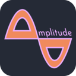
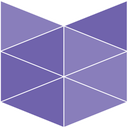
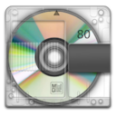
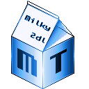
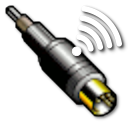
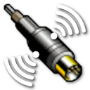
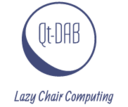
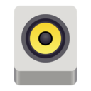

# AUDIO

| [Back to Home](index.md) | [Back to Applications](apps.md)
| --- | --- |

#### Here are listed **168** programs and **1** items for this category.

  <label for="app-search-input" style="font-weight: bold;">Search applications:</label>
  <input type="search" id="app-search-input" placeholder="Type a name or keyword..." autocomplete="off"
    style="width: 100%; max-width: 480px; padding: 0.5em 0.75em; margin-top: 0.25em; font-size: 1em; border: 1px solid #999; border-radius: 4px; box-sizing: border-box;">
  <select id="app-search-arch" aria-label="Filter by architecture"
    style="margin-top: 0.25em; padding: 0.5em; font-size: 1em; border: 1px solid #999; border-radius: 4px;">
    <option value="">Any architecture</option>
    <option value="x86_64">x86_64</option>
    <option value="aarch64">aarch64</option>
    <option value="i686">i686</option>
  </select>
  

#### *Categories*

  <a class="cat-pill" href="appimages.html">AppImages</a>
  •
  <a class="cat-pill" href="ai.html">ai</a>
  •
  <a class="cat-pill" href="am-utils.html">am-utils</a>
  •
  <a class="cat-pill" href="android.html">android</a>
  •
  <a class="cat-pill" href="appimage-on-the-fly.html">appimage-on-the-fly</a>
  •
  <a class="cat-pill cat-pill--all" href="audio.html">audio</a>
  •
  <a class="cat-pill" href="comic.html">comic</a>
  •
  <a class="cat-pill" href="command-line.html">command-line</a>
  •
  <a class="cat-pill" href="communication.html">communication</a>
  •
  <a class="cat-pill" href="disk.html">disk</a>
  •
  <a class="cat-pill" href="education.html">education</a>
  •
  <a class="cat-pill" href="emulator.html">emulator</a>
  •
  <a class="cat-pill" href="file-manager.html">file-manager</a>
  •
  <a class="cat-pill" href="finance.html">finance</a>
  •
  <a class="cat-pill" href="game.html">game</a>
  •
  <a class="cat-pill" href="gnome.html">gnome</a>
  •
  <a class="cat-pill" href="graphic.html">graphic</a>
  •
  <a class="cat-pill" href="internet.html">internet</a>
  •
  <a class="cat-pill" href="kde.html">kde</a>
  •
  <a class="cat-pill" href="metapackages.html">metapackages</a>
  •
  <a class="cat-pill" href="office.html">office</a>
  •
  <a class="cat-pill" href="password.html">password</a>
  •
  <a class="cat-pill" href="portable.html">Portable</a>
  •
  <a class="cat-pill" href="portable-cli.html">portable-cli</a>
  •
  <a class="cat-pill" href="portable-desktop.html">portable-desktop</a>
  •
  <a class="cat-pill" href="steam.html">steam</a>
  •
  <a class="cat-pill" href="system-monitor.html">system-monitor</a>
  •
  <a class="cat-pill" href="video.html">video</a>
  •
  <a class="cat-pill" href="virtual-machine.html">virtual-machine</a>
  •
  <a class="cat-pill" href="wallet.html">wallet</a>
  •
  <a class="cat-pill" href="web-app.html">web-app</a>
  •
  <a class="cat-pill" href="web-browser.html">web-browser</a>
  •
  <a class="cat-pill" href="wine.html">wine</a>
  •
  <a class="cat-pill" href="youtube.html">youtube</a>

-----------------

***NOTE, Installer scripts (blob/raw) are provided for reading only: do not run them manually! Use "[AM](https://github.com/ivan-hc/AM)" or "[AppMan](https://github.com/ivan-hc/AppMan)" instead.***

-----------------

| ICON | PACKAGE NAME | DESCRIPTION | INSTALLER |
| --- | --- | --- | --- |
|  | [***432hz-player***](apps/432hz-player.md) | *Because most music is recorded in 440hz, Audio Player.*..[ *read more* ](apps/432hz-player.md)*!* | [*blob*](https://github.com/ivan-hc/AM/blob/main/programs/x86_64/432hz-player) **/** [*raw*](https://raw.githubusercontent.com/ivan-hc/AM/main/programs/x86_64/432hz-player) |
|  | [***acestep-cpp-ui***](apps/acestep-cpp-ui.md) | *AceStep-cpp UI, 100% local and free Suno alternative powered by acestep-cpp. Native C++ bundle for local AI music generation with 0% python.*..[ *read more* ](apps/acestep-cpp-ui.md)*!* | [*blob*](https://github.com/ivan-hc/AM/blob/main/programs/x86_64/acestep-cpp-ui) **/** [*raw*](https://raw.githubusercontent.com/ivan-hc/AM/main/programs/x86_64/acestep-cpp-ui) |
|  | [***amarok***](apps/amarok.md) | *Unofficial, powerful music player that lets you rediscover your music.*..[ *read more* ](apps/amarok.md)*!* | [*blob*](https://github.com/ivan-hc/AM/blob/main/programs/x86_64/amarok) **/** [*raw*](https://raw.githubusercontent.com/ivan-hc/AM/main/programs/x86_64/amarok) |
|  | [***amplitude-soundboard***](apps/amplitude-soundboard.md) | *A sleek, cross-platform soundboard, available.*..[ *read more* ](apps/amplitude-soundboard.md)*!* | [*blob*](https://github.com/ivan-hc/AM/blob/main/programs/x86_64/amplitude-soundboard) **/** [*raw*](https://raw.githubusercontent.com/ivan-hc/AM/main/programs/x86_64/amplitude-soundboard) |
|  | [***amusiz***](apps/amusiz.md) | *Unofficial and unpretentious Amazon Music client.*..[ *read more* ](apps/amusiz.md)*!* | [*blob*](https://github.com/ivan-hc/AM/blob/main/programs/x86_64/amusiz) **/** [*raw*](https://raw.githubusercontent.com/ivan-hc/AM/main/programs/x86_64/amusiz) |
|  | [***anavis***](apps/anavis.md) | *Tool to visualize musical form.*..[ *read more* ](apps/anavis.md)*!* | [*blob*](https://github.com/ivan-hc/AM/blob/main/programs/x86_64/anavis) **/** [*raw*](https://raw.githubusercontent.com/ivan-hc/AM/main/programs/x86_64/anavis) |
|  | [***anklang***](apps/anklang.md) | *MIDI and Audio Synthesizer and Composer.*..[ *read more* ](apps/anklang.md)*!* | [*blob*](https://github.com/ivan-hc/AM/blob/main/programs/x86_64/anklang) **/** [*raw*](https://raw.githubusercontent.com/ivan-hc/AM/main/programs/x86_64/anklang) |
|  | [***antra***](apps/antra.md) | *A desktop music library builder. Resolves Spotify / Apple Music / Amazon Music URLs → get lossless audio → auto-tags, transcodes, and organizes. No subscriptions. No compromises.*..[ *read more* ](apps/antra.md)*!* | [*blob*](https://github.com/ivan-hc/AM/blob/main/programs/x86_64/antra) **/** [*raw*](https://raw.githubusercontent.com/ivan-hc/AM/main/programs/x86_64/antra) |
|  | [***arcdlp***](apps/arcdlp.md) | *Open-source desktop video downloader powered by yt-dlp and electron. Download videos and audio from YouTube, Vimeo, Twitter, and thousands of sites.*..[ *read more* ](apps/arcdlp.md)*!* | [*blob*](https://github.com/ivan-hc/AM/blob/main/programs/x86_64/arcdlp) **/** [*raw*](https://raw.githubusercontent.com/ivan-hc/AM/main/programs/x86_64/arcdlp) |
|  | [***astrofox***](apps/astrofox.md) | *Audio reactive motion graphics program.*..[ *read more* ](apps/astrofox.md)*!* | [*blob*](https://github.com/ivan-hc/AM/blob/main/programs/x86_64/astrofox) **/** [*raw*](https://raw.githubusercontent.com/ivan-hc/AM/main/programs/x86_64/astrofox) |
|  | [***asunder***](apps/asunder.md) | *Unofficial. Audio CD ripper and encoder, WAV, MP3, OGG, FLAC, Opus, AAC....*..[ *read more* ](apps/asunder.md)*!* | [*blob*](https://github.com/ivan-hc/AM/blob/main/programs/x86_64/asunder) **/** [*raw*](https://raw.githubusercontent.com/ivan-hc/AM/main/programs/x86_64/asunder) |
|  | [***audacious***](apps/audacious.md) | *Unofficial. An open source audio and music player, descendant of XMMS.*..[ *read more* ](apps/audacious.md)*!* | [*blob*](https://github.com/ivan-hc/AM/blob/main/programs/x86_64/audacious) **/** [*raw*](https://raw.githubusercontent.com/ivan-hc/AM/main/programs/x86_64/audacious) |
|  | [***audacity***](apps/audacity.md) | *Multiplatform Audio Editor.*..[ *read more* ](apps/audacity.md)*!* | [*blob*](https://github.com/ivan-hc/AM/blob/main/programs/x86_64/audacity) **/** [*raw*](https://raw.githubusercontent.com/ivan-hc/AM/main/programs/x86_64/audacity) |
|  | [***audacity-enhanced***](apps/audacity-enhanced.md) | *Unofficial, multiplatform Audio Editor.*..[ *read more* ](apps/audacity-enhanced.md)*!* | [*blob*](https://github.com/ivan-hc/AM/blob/main/programs/x86_64/audacity-enhanced) **/** [*raw*](https://raw.githubusercontent.com/ivan-hc/AM/main/programs/x86_64/audacity-enhanced) |
|  | [***audapolis***](apps/audapolis.md) | *An editor for spoken-word audio with automatic transcription.*..[ *read more* ](apps/audapolis.md)*!* | [*blob*](https://github.com/ivan-hc/AM/blob/main/programs/x86_64/audapolis) **/** [*raw*](https://raw.githubusercontent.com/ivan-hc/AM/main/programs/x86_64/audapolis) |
|  | [***audio-sharing***](apps/audio-sharing.md) | *Unofficial. Share audio from the desktop on local network using RTSP protocol.*..[ *read more* ](apps/audio-sharing.md)*!* | [*blob*](https://github.com/ivan-hc/AM/blob/main/programs/x86_64/audio-sharing) **/** [*raw*](https://raw.githubusercontent.com/ivan-hc/AM/main/programs/x86_64/audio-sharing) |
|  | [***audiomoth-configuration-app***](apps/audiomoth-configuration-app.md) | *An Electron-based application capable of configuring the functionality of the AudioMoth recording device and setting the onboard clock.*..[ *read more* ](apps/audiomoth-configuration-app.md)*!* | [*blob*](https://github.com/ivan-hc/AM/blob/main/programs/x86_64/audiomoth-configuration-app) **/** [*raw*](https://raw.githubusercontent.com/ivan-hc/AM/main/programs/x86_64/audiomoth-configuration-app) |
|  | [***audiomoth-flash-app***](apps/audiomoth-flash-app.md) | *An Electron-based application designed to flash the AudioMoth recording device with new firmware.*..[ *read more* ](apps/audiomoth-flash-app.md)*!* | [*blob*](https://github.com/ivan-hc/AM/blob/main/programs/x86_64/audiomoth-flash-app) **/** [*raw*](https://raw.githubusercontent.com/ivan-hc/AM/main/programs/x86_64/audiomoth-flash-app) |
|  | [***audiomoth-gps-sync-app***](apps/audiomoth-gps-sync-app.md) | *An Electron-based application to generate WAV files synchronised with GPS time from the files generated by the AudioMoth-GPS-Sync firmware.*..[ *read more* ](apps/audiomoth-gps-sync-app.md)*!* | [*blob*](https://github.com/ivan-hc/AM/blob/main/programs/x86_64/audiomoth-gps-sync-app) **/** [*raw*](https://raw.githubusercontent.com/ivan-hc/AM/main/programs/x86_64/audiomoth-gps-sync-app) |
|  | [***audiomoth-live-app***](apps/audiomoth-live-app.md) | *An Electron-based application for recording and analysing live audio from high sample rate microphones, including the AudioMoth USB Microphone.*..[ *read more* ](apps/audiomoth-live-app.md)*!* | [*blob*](https://github.com/ivan-hc/AM/blob/main/programs/x86_64/audiomoth-live-app) **/** [*raw*](https://raw.githubusercontent.com/ivan-hc/AM/main/programs/x86_64/audiomoth-live-app) |
|  | [***audiomoth-time-app***](apps/audiomoth-time-app.md) | *An Electron-based application capable of setting the on-board clock of the AudioMoth recording device.*..[ *read more* ](apps/audiomoth-time-app.md)*!* | [*blob*](https://github.com/ivan-hc/AM/blob/main/programs/x86_64/audiomoth-time-app) **/** [*raw*](https://raw.githubusercontent.com/ivan-hc/AM/main/programs/x86_64/audiomoth-time-app) |
|  | [***audiomoth-usb-microphone-app***](apps/audiomoth-usb-microphone-app.md) | *An Electron-based application capable of configuring the functionality of the AudioMoth-USB-Microphone firmware.*..[ *read more* ](apps/audiomoth-usb-microphone-app.md)*!* | [*blob*](https://github.com/ivan-hc/AM/blob/main/programs/x86_64/audiomoth-usb-microphone-app) **/** [*raw*](https://raw.githubusercontent.com/ivan-hc/AM/main/programs/x86_64/audiomoth-usb-microphone-app) |
|  | [***audiorelay***](apps/audiorelay.md) | *Stream audio between your devices. Turn your phone into a microphone or speakers for PC.*..[ *read more* ](apps/audiorelay.md)*!* | [*blob*](https://github.com/ivan-hc/AM/blob/main/programs/x86_64/audiorelay) **/** [*raw*](https://raw.githubusercontent.com/ivan-hc/AM/main/programs/x86_64/audiorelay) |
|  | [***auryo***](apps/auryo.md) | *An audio/music desktop client for SoundCloud.*..[ *read more* ](apps/auryo.md)*!* | [*blob*](https://github.com/ivan-hc/AM/blob/main/programs/x86_64/auryo) **/** [*raw*](https://raw.githubusercontent.com/ivan-hc/AM/main/programs/x86_64/auryo) |
|  | [***blob-dl***](apps/blob-dl.md) | *Blob-dl is a yt-dlp CLI interface used to download video and audio files from YouTube.*..[ *read more* ](apps/blob-dl.md)*!* | [*blob*](https://github.com/ivan-hc/AM/blob/main/programs/x86_64/blob-dl) **/** [*raw*](https://raw.githubusercontent.com/ivan-hc/AM/main/programs/x86_64/blob-dl) |
|  | [***bloomee***](apps/bloomee.md) | *Music app designed to bring you ad-free tunes from various sources.*..[ *read more* ](apps/bloomee.md)*!* | [*blob*](https://github.com/ivan-hc/AM/blob/main/programs/x86_64/bloomee) **/** [*raw*](https://raw.githubusercontent.com/ivan-hc/AM/main/programs/x86_64/bloomee) |
|  | [***bodacious***](apps/bodacious.md) | *A bodacious music player.*..[ *read more* ](apps/bodacious.md)*!* | [*blob*](https://github.com/ivan-hc/AM/blob/main/programs/x86_64/bodacious) **/** [*raw*](https://raw.githubusercontent.com/ivan-hc/AM/main/programs/x86_64/bodacious) |
|  | [***cadmus***](apps/cadmus.md) | *Pulse Audio real-time noise suppression plugin.*..[ *read more* ](apps/cadmus.md)*!* | [*blob*](https://github.com/ivan-hc/AM/blob/main/programs/x86_64/cadmus) **/** [*raw*](https://raw.githubusercontent.com/ivan-hc/AM/main/programs/x86_64/cadmus) |
|  | [***castersoundboard***](apps/castersoundboard.md) | *Soundboard for hot-keying and playing back sounds.*..[ *read more* ](apps/castersoundboard.md)*!* | [*blob*](https://github.com/ivan-hc/AM/blob/main/programs/x86_64/castersoundboard) **/** [*raw*](https://raw.githubusercontent.com/ivan-hc/AM/main/programs/x86_64/castersoundboard) |
|  | [***cinelerra***](apps/cinelerra.md) | *CINELERRA-GG is a software program NLE, Non-Linear Editor, that provides a way to edit, record, and play audio or video media. It can also be used to transcode media from one format to another or to correct and retouch photos.*..[ *read more* ](apps/cinelerra.md)*!* | [*blob*](https://github.com/ivan-hc/AM/blob/main/programs/x86_64/cinelerra) **/** [*raw*](https://raw.githubusercontent.com/ivan-hc/AM/main/programs/x86_64/cinelerra) |
|  | [***classipod***](apps/classipod.md) | *A local music player app designed to capture the nostalgic essence of the iconic iPod Classic.*..[ *read more* ](apps/classipod.md)*!* | [*blob*](https://github.com/ivan-hc/AM/blob/main/programs/x86_64/classipod) **/** [*raw*](https://raw.githubusercontent.com/ivan-hc/AM/main/programs/x86_64/classipod) |
|  | [***clementine***](apps/clementine.md) | *Unofficial AppImage of the Clementine music player.*..[ *read more* ](apps/clementine.md)*!* | [*blob*](https://github.com/ivan-hc/AM/blob/main/programs/x86_64/clementine) **/** [*raw*](https://raw.githubusercontent.com/ivan-hc/AM/main/programs/x86_64/clementine) |
|  | [***clementineremote***](apps/clementineremote.md) | *Remote for Clementine Music Player.*..[ *read more* ](apps/clementineremote.md)*!* | [*blob*](https://github.com/ivan-hc/AM/blob/main/programs/x86_64/clementineremote) **/** [*raw*](https://raw.githubusercontent.com/ivan-hc/AM/main/programs/x86_64/clementineremote) |
|  | [***code-radio***](apps/code-radio.md) | *A command line music radio client for coderadio.freecodecamp.org, written in Rust.*..[ *read more* ](apps/code-radio.md)*!* | [*blob*](https://github.com/ivan-hc/AM/blob/main/programs/x86_64/code-radio) **/** [*raw*](https://raw.githubusercontent.com/ivan-hc/AM/main/programs/x86_64/code-radio) |
|  | [***converter432hz***](apps/converter432hz.md) | *Converts and re-encodes music to 432hz.*..[ *read more* ](apps/converter432hz.md)*!* | [*blob*](https://github.com/ivan-hc/AM/blob/main/programs/x86_64/converter432hz) **/** [*raw*](https://raw.githubusercontent.com/ivan-hc/AM/main/programs/x86_64/converter432hz) |
|  | [***deadbeef***](apps/deadbeef.md) | *Unofficial AppImage of the DeaDBeeF music player (Stable version).*..[ *read more* ](apps/deadbeef.md)*!* | [*blob*](https://github.com/ivan-hc/AM/blob/main/programs/x86_64/deadbeef) **/** [*raw*](https://raw.githubusercontent.com/ivan-hc/AM/main/programs/x86_64/deadbeef) |
|  | [***deadbeef-nightly***](apps/deadbeef-nightly.md) | *Unofficial AppImage of the DeaDBeeF music player (Nightly version).*..[ *read more* ](apps/deadbeef-nightly.md)*!* | [*blob*](https://github.com/ivan-hc/AM/blob/main/programs/x86_64/deadbeef-nightly) **/** [*raw*](https://raw.githubusercontent.com/ivan-hc/AM/main/programs/x86_64/deadbeef-nightly) |
|  | [***deezer***](apps/deezer.md) | *A linux port of Deezer, allows downloading your songs, music.*..[ *read more* ](apps/deezer.md)*!* | [*blob*](https://github.com/ivan-hc/AM/blob/main/programs/x86_64/deezer) **/** [*raw*](https://raw.githubusercontent.com/ivan-hc/AM/main/programs/x86_64/deezer) |
|  | [***diffuse***](apps/diffuse.md) | *Music player, connects to your cloud/distributed storage.*..[ *read more* ](apps/diffuse.md)*!* | [*blob*](https://github.com/ivan-hc/AM/blob/main/programs/x86_64/diffuse) **/** [*raw*](https://raw.githubusercontent.com/ivan-hc/AM/main/programs/x86_64/diffuse) |
|  | [***dopamine-preview***](apps/dopamine-preview.md) | *The audio player that keeps it simple.*..[ *read more* ](apps/dopamine-preview.md)*!* | [*blob*](https://github.com/ivan-hc/AM/blob/main/programs/x86_64/dopamine-preview) **/** [*raw*](https://raw.githubusercontent.com/ivan-hc/AM/main/programs/x86_64/dopamine-preview) |
|  | [***downline***](apps/downline.md) | *A cross-platform video and audio downloader.*..[ *read more* ](apps/downline.md)*!* | [*blob*](https://github.com/ivan-hc/AM/blob/main/programs/x86_64/downline) **/** [*raw*](https://raw.githubusercontent.com/ivan-hc/AM/main/programs/x86_64/downline) |
|  | [***duskplayer***](apps/duskplayer.md) | *A minimal music player built on electron.*..[ *read more* ](apps/duskplayer.md)*!* | [*blob*](https://github.com/ivan-hc/AM/blob/main/programs/x86_64/duskplayer) **/** [*raw*](https://raw.githubusercontent.com/ivan-hc/AM/main/programs/x86_64/duskplayer) |
|  | [***electronwmd***](apps/electronwmd.md) | *Upload music to NetMD MiniDisc devices.*..[ *read more* ](apps/electronwmd.md)*!* | [*blob*](https://github.com/ivan-hc/AM/blob/main/programs/x86_64/electronwmd) **/** [*raw*](https://raw.githubusercontent.com/ivan-hc/AM/main/programs/x86_64/electronwmd) |
|  | [***feishin***](apps/feishin.md) | *Sonixd Rewrite, a desktop music player.*..[ *read more* ](apps/feishin.md)*!* | [*blob*](https://github.com/ivan-hc/AM/blob/main/programs/x86_64/feishin) **/** [*raw*](https://raw.githubusercontent.com/ivan-hc/AM/main/programs/x86_64/feishin) |
|  | [***ffmpeg***](apps/ffmpeg.md) | *Unofficial, A complete, cross-platform solution to record, convert and stream audio and video.*..[ *read more* ](apps/ffmpeg.md)*!* | [*blob*](https://github.com/ivan-hc/AM/blob/main/programs/x86_64/ffmpeg) **/** [*raw*](https://raw.githubusercontent.com/ivan-hc/AM/main/programs/x86_64/ffmpeg) |
|  | [***firetail***](apps/firetail.md) | *An open source music player.*..[ *read more* ](apps/firetail.md)*!* | [*blob*](https://github.com/ivan-hc/AM/blob/main/programs/x86_64/firetail) **/** [*raw*](https://raw.githubusercontent.com/ivan-hc/AM/main/programs/x86_64/firetail) |
|  | [***flacon***](apps/flacon.md) | *Audio File Encoder. Extracts audio tracks from audio CDs.*..[ *read more* ](apps/flacon.md)*!* | [*blob*](https://github.com/ivan-hc/AM/blob/main/programs/x86_64/flacon) **/** [*raw*](https://raw.githubusercontent.com/ivan-hc/AM/main/programs/x86_64/flacon) |
|  | [***flb***](apps/flb.md) | *A beautiful Feature Rich Music Player and Downloader,cross platform.*..[ *read more* ](apps/flb.md)*!* | [*blob*](https://github.com/ivan-hc/AM/blob/main/programs/x86_64/flb) **/** [*raw*](https://raw.githubusercontent.com/ivan-hc/AM/main/programs/x86_64/flb) |
|  | [***flippy-qualitative-testbench***](apps/flippy-qualitative-testbench.md) | *Music sheet reader.*..[ *read more* ](apps/flippy-qualitative-testbench.md)*!* | [*blob*](https://github.com/ivan-hc/AM/blob/main/programs/x86_64/flippy-qualitative-testbench) **/** [*raw*](https://raw.githubusercontent.com/ivan-hc/AM/main/programs/x86_64/flippy-qualitative-testbench) |
|  | [***focusatwill***](apps/focusatwill.md) | *Combines neuroscience and music to boost productivity.*..[ *read more* ](apps/focusatwill.md)*!* | [*blob*](https://github.com/ivan-hc/AM/blob/main/programs/x86_64/focusatwill) **/** [*raw*](https://raw.githubusercontent.com/ivan-hc/AM/main/programs/x86_64/focusatwill) |
|  | [***foobar2000***](apps/foobar2000.md) | *Unofficial, an advanced freeware audio player for Windows, includes WINE.*..[ *read more* ](apps/foobar2000.md)*!* | [*blob*](https://github.com/ivan-hc/AM/blob/main/programs/x86_64/foobar2000) **/** [*raw*](https://raw.githubusercontent.com/ivan-hc/AM/main/programs/x86_64/foobar2000) |
|  | [***fooyin***](apps/fooyin.md) | *Unofficial, a customisable music player.*..[ *read more* ](apps/fooyin.md)*!* | [*blob*](https://github.com/ivan-hc/AM/blob/main/programs/x86_64/fooyin) **/** [*raw*](https://raw.githubusercontent.com/ivan-hc/AM/main/programs/x86_64/fooyin) |
|  | [***freac***](apps/freac.md) | *fre:ac, free audio converter and CD ripper for various encoders.*..[ *read more* ](apps/freac.md)*!* | [*blob*](https://github.com/ivan-hc/AM/blob/main/programs/x86_64/freac) **/** [*raw*](https://raw.githubusercontent.com/ivan-hc/AM/main/programs/x86_64/freac) |
|  | [***friture***](apps/friture.md) | *Real-time audio visualizations, spectrum, spectrogram, etc..*..[ *read more* ](apps/friture.md)*!* | [*blob*](https://github.com/ivan-hc/AM/blob/main/programs/x86_64/friture) **/** [*raw*](https://raw.githubusercontent.com/ivan-hc/AM/main/programs/x86_64/friture) |
|  | [***gapless***](apps/gapless.md) | *Unofficial. Simple music player with blur and gapless playback.*..[ *read more* ](apps/gapless.md)*!* | [*blob*](https://github.com/ivan-hc/AM/blob/main/programs/x86_64/gapless) **/** [*raw*](https://raw.githubusercontent.com/ivan-hc/AM/main/programs/x86_64/gapless) |
|  | [***giada***](apps/giada.md) | *Hardcore audio music production tool and drum machine for DJs.*..[ *read more* ](apps/giada.md)*!* | [*blob*](https://github.com/ivan-hc/AM/blob/main/programs/x86_64/giada) **/** [*raw*](https://raw.githubusercontent.com/ivan-hc/AM/main/programs/x86_64/giada) |
|  | [***gsequencer***](apps/gsequencer.md) | *Tree based audio processing engine.*..[ *read more* ](apps/gsequencer.md)*!* | [*blob*](https://github.com/ivan-hc/AM/blob/main/programs/x86_64/gsequencer) **/** [*raw*](https://raw.githubusercontent.com/ivan-hc/AM/main/programs/x86_64/gsequencer) |
|  | [***harmonoid***](apps/harmonoid.md) | *Plays & manages your music library. Looks beautiful & juicy. Playlists, visuals, synced lyrics, pitch shift, volume boost & more.*..[ *read more* ](apps/harmonoid.md)*!* | [*blob*](https://github.com/ivan-hc/AM/blob/main/programs/x86_64/harmonoid) **/** [*raw*](https://raw.githubusercontent.com/ivan-hc/AM/main/programs/x86_64/harmonoid) |
|  | [***helio***](apps/helio.md) | *One music sequencer for all major platforms, desktop and mobile.*..[ *read more* ](apps/helio.md)*!* | [*blob*](https://github.com/ivan-hc/AM/blob/main/programs/x86_64/helio) **/** [*raw*](https://raw.githubusercontent.com/ivan-hc/AM/main/programs/x86_64/helio) |
|  | [***hydrogen-music***](apps/hydrogen-music.md) | *The advanced drum machine.*..[ *read more* ](apps/hydrogen-music.md)*!* | [*blob*](https://github.com/ivan-hc/AM/blob/main/programs/x86_64/hydrogen-music) **/** [*raw*](https://raw.githubusercontent.com/ivan-hc/AM/main/programs/x86_64/hydrogen-music) |
|  | [***impact***](apps/impact.md) | *Music Management and Playback.*..[ *read more* ](apps/impact.md)*!* | [*blob*](https://github.com/ivan-hc/AM/blob/main/programs/x86_64/impact) **/** [*raw*](https://raw.githubusercontent.com/ivan-hc/AM/main/programs/x86_64/impact) |
|  | [***jellyamp***](apps/jellyamp.md) | *A client for listening to music from a Jellyfin server.*..[ *read more* ](apps/jellyamp.md)*!* | [*blob*](https://github.com/ivan-hc/AM/blob/main/programs/x86_64/jellyamp) **/** [*raw*](https://raw.githubusercontent.com/ivan-hc/AM/main/programs/x86_64/jellyamp) |
|  | [***kid3***](apps/kid3.md) | *Unofficial, efficient audio tagger that supports a large variety of file formats.*..[ *read more* ](apps/kid3.md)*!* | [*blob*](https://github.com/ivan-hc/AM/blob/main/programs/x86_64/kid3) **/** [*raw*](https://raw.githubusercontent.com/ivan-hc/AM/main/programs/x86_64/kid3) |
|  | [***kiku***](apps/kiku.md) | *Play music from youtube on desktop. Supports local api, invidious and piped as source.*..[ *read more* ](apps/kiku.md)*!* | [*blob*](https://github.com/ivan-hc/AM/blob/main/programs/x86_64/kiku) **/** [*raw*](https://raw.githubusercontent.com/ivan-hc/AM/main/programs/x86_64/kiku) |
|  | [***krecorder***](apps/kdeutils.md) | *An audio recording application. This is part of "kdeutils".*..[ *read more* ](apps/kdeutils.md)*!* | [*blob*](https://github.com/ivan-hc/AM/blob/main/programs/x86_64/kdeutils) **/** [*raw*](https://raw.githubusercontent.com/ivan-hc/AM/main/programs/x86_64/kdeutils) |
|  | [***kwave***](apps/kwave.md) | *A sound & audio editor designed for the KDE Desktop Environment.*..[ *read more* ](apps/kwave.md)*!* | [*blob*](https://github.com/ivan-hc/AM/blob/main/programs/x86_64/kwave) **/** [*raw*](https://raw.githubusercontent.com/ivan-hc/AM/main/programs/x86_64/kwave) |
|  | [***libation***](apps/libation.md) | *Unofficial, application for downloading and managing your Audible audiobooks.*..[ *read more* ](apps/libation.md)*!* | [*blob*](https://github.com/ivan-hc/AM/blob/main/programs/x86_64/libation) **/** [*raw*](https://raw.githubusercontent.com/ivan-hc/AM/main/programs/x86_64/libation) |
|  | [***listen1-desktop***](apps/listen1-desktop.md) | *One for all free music in China.*..[ *read more* ](apps/listen1-desktop.md)*!* | [*blob*](https://github.com/ivan-hc/AM/blob/main/programs/x86_64/listen1-desktop) **/** [*raw*](https://raw.githubusercontent.com/ivan-hc/AM/main/programs/x86_64/listen1-desktop) |
|  | [***lmms***](apps/lmms.md) | *FL Studio® alternative that allows you to produce music with the PC.*..[ *read more* ](apps/lmms.md)*!* | [*blob*](https://github.com/ivan-hc/AM/blob/main/programs/x86_64/lmms) **/** [*raw*](https://raw.githubusercontent.com/ivan-hc/AM/main/programs/x86_64/lmms) |
|  | [***losslesscut***](apps/losslesscut.md) | *The swiss army knife of lossless video/audio editing.*..[ *read more* ](apps/losslesscut.md)*!* | [*blob*](https://github.com/ivan-hc/AM/blob/main/programs/x86_64/losslesscut) **/** [*raw*](https://raw.githubusercontent.com/ivan-hc/AM/main/programs/x86_64/losslesscut) |
|  | [***lovelive***](apps/lovelive.md) | *A LoveLiver Music Player.*..[ *read more* ](apps/lovelive.md)*!* | [*blob*](https://github.com/ivan-hc/AM/blob/main/programs/x86_64/lovelive) **/** [*raw*](https://raw.githubusercontent.com/ivan-hc/AM/main/programs/x86_64/lovelive) |
|  | [***lx-music-desktop***](apps/lx-music-desktop.md) | *一个基于electron的音乐软件.*..[ *read more* ](apps/lx-music-desktop.md)*!* | [*blob*](https://github.com/ivan-hc/AM/blob/main/programs/x86_64/lx-music-desktop) **/** [*raw*](https://raw.githubusercontent.com/ivan-hc/AM/main/programs/x86_64/lx-music-desktop) |
|  | [***mcpodcast***](apps/mcpodcast.md) | *Electron app for tasks around Podcast mp3 files.*..[ *read more* ](apps/mcpodcast.md)*!* | [*blob*](https://github.com/ivan-hc/AM/blob/main/programs/x86_64/mcpodcast) **/** [*raw*](https://raw.githubusercontent.com/ivan-hc/AM/main/programs/x86_64/mcpodcast) |
|  | [***media-downloader***](apps/media-downloader.md) | *Cross-platform audio/video downloader.*..[ *read more* ](apps/media-downloader.md)*!* | [*blob*](https://github.com/ivan-hc/AM/blob/main/programs/x86_64/media-downloader) **/** [*raw*](https://raw.githubusercontent.com/ivan-hc/AM/main/programs/x86_64/media-downloader) |
|  | [***mellowplayer***](apps/mellowplayer.md) | *Cloud music integration for your desktop.*..[ *read more* ](apps/mellowplayer.md)*!* | [*blob*](https://github.com/ivan-hc/AM/blob/main/programs/x86_64/mellowplayer) **/** [*raw*](https://raw.githubusercontent.com/ivan-hc/AM/main/programs/x86_64/mellowplayer) |
|  | [***melodie***](apps/melodie.md) | *Simple-as-pie music player.*..[ *read more* ](apps/melodie.md)*!* | [*blob*](https://github.com/ivan-hc/AM/blob/main/programs/x86_64/melodie) **/** [*raw*](https://raw.githubusercontent.com/ivan-hc/AM/main/programs/x86_64/melodie) |
|  | [***milkytracker***](apps/milkytracker.md) | *An FT2 compatible music tracker.*..[ *read more* ](apps/milkytracker.md)*!* | [*blob*](https://github.com/ivan-hc/AM/blob/main/programs/x86_64/milkytracker) **/** [*raw*](https://raw.githubusercontent.com/ivan-hc/AM/main/programs/x86_64/milkytracker) |
|  | [***mkvtoolnix***](apps/mkvtoolnix.md) | *Matroska files creator and tools.*..[ *read more* ](apps/mkvtoolnix.md)*!* | [*blob*](https://github.com/ivan-hc/AM/blob/main/programs/x86_64/mkvtoolnix) **/** [*raw*](https://raw.githubusercontent.com/ivan-hc/AM/main/programs/x86_64/mkvtoolnix) |
|  | [***mlv-app***](apps/mlv-app.md) | *All in one MLV processing app, audio/video.*..[ *read more* ](apps/mlv-app.md)*!* | [*blob*](https://github.com/ivan-hc/AM/blob/main/programs/x86_64/mlv-app) **/** [*raw*](https://raw.githubusercontent.com/ivan-hc/AM/main/programs/x86_64/mlv-app) |
|  | [***modv***](apps/modv.md) | *Modular audio visualisation powered by JavaScript.*..[ *read more* ](apps/modv.md)*!* | [*blob*](https://github.com/ivan-hc/AM/blob/main/programs/x86_64/modv) **/** [*raw*](https://raw.githubusercontent.com/ivan-hc/AM/main/programs/x86_64/modv) |
|  | [***moosync***](apps/moosync.md) | *Music player capable of playing local audio or from Youtube/Spotify.*..[ *read more* ](apps/moosync.md)*!* | [*blob*](https://github.com/ivan-hc/AM/blob/main/programs/x86_64/moosync) **/** [*raw*](https://raw.githubusercontent.com/ivan-hc/AM/main/programs/x86_64/moosync) |
|  | [***mp3-tagger***](apps/mp3-tagger.md) | *An Electron app to edit metadata of mp3 files.*..[ *read more* ](apps/mp3-tagger.md)*!* | [*blob*](https://github.com/ivan-hc/AM/blob/main/programs/x86_64/mp3-tagger) **/** [*raw*](https://raw.githubusercontent.com/ivan-hc/AM/main/programs/x86_64/mp3-tagger) |
|  | [***mp4grep***](apps/mp4grep.md) | *CLI for transcribing and searching audio/video files.*..[ *read more* ](apps/mp4grep.md)*!* | [*blob*](https://github.com/ivan-hc/AM/blob/main/programs/x86_64/mp4grep) **/** [*raw*](https://raw.githubusercontent.com/ivan-hc/AM/main/programs/x86_64/mp4grep) |
|  | [***muffon***](apps/muffon.md) | *Music streaming browser,retrieves audio, video and metadata.*..[ *read more* ](apps/muffon.md)*!* | [*blob*](https://github.com/ivan-hc/AM/blob/main/programs/x86_64/muffon) **/** [*raw*](https://raw.githubusercontent.com/ivan-hc/AM/main/programs/x86_64/muffon) |
|  | [***muse***](apps/muse.md) | *A digital audio workstation with support for both Audio and MIDI.*..[ *read more* ](apps/muse.md)*!* | [*blob*](https://github.com/ivan-hc/AM/blob/main/programs/x86_64/muse) **/** [*raw*](https://raw.githubusercontent.com/ivan-hc/AM/main/programs/x86_64/muse) |
|  | [***museeks***](apps/museeks.md) | *A simple, clean and cross-platform music player.*..[ *read more* ](apps/museeks.md)*!* | [*blob*](https://github.com/ivan-hc/AM/blob/main/programs/x86_64/museeks) **/** [*raw*](https://raw.githubusercontent.com/ivan-hc/AM/main/programs/x86_64/museeks) |
|  | [***musescore***](apps/musescore.md) | *An open source and free music notation software.*..[ *read more* ](apps/musescore.md)*!* | [*blob*](https://github.com/ivan-hc/AM/blob/main/programs/x86_64/musescore) **/** [*raw*](https://raw.githubusercontent.com/ivan-hc/AM/main/programs/x86_64/musescore) |
|  | [***music-assistant***](apps/music-assistant.md) | *The desktop companion app for Music Assistant.*..[ *read more* ](apps/music-assistant.md)*!* | [*blob*](https://github.com/ivan-hc/AM/blob/main/programs/x86_64/music-assistant) **/** [*raw*](https://raw.githubusercontent.com/ivan-hc/AM/main/programs/x86_64/music-assistant) |
|  | [***music-blocks***](apps/music-blocks.md) | *.Exploring Math, Music, and Programming.*..[ *read more* ](apps/music-blocks.md)*!* | [*blob*](https://github.com/ivan-hc/AM/blob/main/programs/x86_64/music-blocks) **/** [*raw*](https://raw.githubusercontent.com/ivan-hc/AM/main/programs/x86_64/music-blocks) |
|  | [***music-kitten***](apps/music-kitten.md) | *Use your own soundtrack in Counter-Strike.*..[ *read more* ](apps/music-kitten.md)*!* | [*blob*](https://github.com/ivan-hc/AM/blob/main/programs/x86_64/music-kitten) **/** [*raw*](https://raw.githubusercontent.com/ivan-hc/AM/main/programs/x86_64/music-kitten) |
|  | [***music-player***](apps/music-player.md) | *Desktop Electron app for playing and downloading music.*..[ *read more* ](apps/music-player.md)*!* | [*blob*](https://github.com/ivan-hc/AM/blob/main/programs/x86_64/music-player) **/** [*raw*](https://raw.githubusercontent.com/ivan-hc/AM/main/programs/x86_64/music-player) |
|  | [***music-quiz***](apps/music-quiz.md) | *Jepardy like game, guess as many songs as possible.*..[ *read more* ](apps/music-quiz.md)*!* | [*blob*](https://github.com/ivan-hc/AM/blob/main/programs/x86_64/music-quiz) **/** [*raw*](https://raw.githubusercontent.com/ivan-hc/AM/main/programs/x86_64/music-quiz) |
|  | [***musicalypse***](apps/musicalypse.md) | *Audio/Music player and server built with Web technologies.*..[ *read more* ](apps/musicalypse.md)*!* | [*blob*](https://github.com/ivan-hc/AM/blob/main/programs/x86_64/musicalypse) **/** [*raw*](https://raw.githubusercontent.com/ivan-hc/AM/main/programs/x86_64/musicalypse) |
|  | [***nautune***](apps/nautune.md) | *Poseidon's Music Player for Jellyfin.*..[ *read more* ](apps/nautune.md)*!* | [*blob*](https://github.com/ivan-hc/AM/blob/main/programs/x86_64/nautune) **/** [*raw*](https://raw.githubusercontent.com/ivan-hc/AM/main/programs/x86_64/nautune) |
|  | [***nootka***](apps/nootka.md) | *Application for learning musical score notation.*..[ *read more* ](apps/nootka.md)*!* | [*blob*](https://github.com/ivan-hc/AM/blob/main/programs/x86_64/nootka) **/** [*raw*](https://raw.githubusercontent.com/ivan-hc/AM/main/programs/x86_64/nootka) |
|  | [***nora***](apps/nora.md) | *An elegant music player built using Electron and React.*..[ *read more* ](apps/nora.md)*!* | [*blob*](https://github.com/ivan-hc/AM/blob/main/programs/x86_64/nora) **/** [*raw*](https://raw.githubusercontent.com/ivan-hc/AM/main/programs/x86_64/nora) |
|  | [***nuclear***](apps/nuclear.md) | *Streaming music player that finds free music for you.*..[ *read more* ](apps/nuclear.md)*!* | [*blob*](https://github.com/ivan-hc/AM/blob/main/programs/x86_64/nuclear) **/** [*raw*](https://raw.githubusercontent.com/ivan-hc/AM/main/programs/x86_64/nuclear) |
|  | [***ocenaudio***](apps/ocenaudio.md) | *Unofficial. Multiplatform Audio Editor.*..[ *read more* ](apps/ocenaudio.md)*!* | [*blob*](https://github.com/ivan-hc/AM/blob/main/programs/x86_64/ocenaudio) **/** [*raw*](https://raw.githubusercontent.com/ivan-hc/AM/main/programs/x86_64/ocenaudio) |
|  | [***onionmediax***](apps/onionmediax.md) | *OnionMedia X. Convert and download videos and music quickly and easily.*..[ *read more* ](apps/onionmediax.md)*!* | [*blob*](https://github.com/ivan-hc/AM/blob/main/programs/x86_64/onionmediax) **/** [*raw*](https://raw.githubusercontent.com/ivan-hc/AM/main/programs/x86_64/onionmediax) |
|  | [***onthespot***](apps/onthespot.md) | *A GUI music downloader for Apple Music, Bandcamp, Deezer, Qobuz, Spotify, Tidal, and More.*..[ *read more* ](apps/onthespot.md)*!* | [*blob*](https://github.com/ivan-hc/AM/blob/main/programs/x86_64/onthespot) **/** [*raw*](https://raw.githubusercontent.com/ivan-hc/AM/main/programs/x86_64/onthespot) |
|  | [***opal***](apps/opal.md) | *Plays relaxing music in the background.*..[ *read more* ](apps/opal.md)*!* | [*blob*](https://github.com/ivan-hc/AM/blob/main/programs/x86_64/opal) **/** [*raw*](https://raw.githubusercontent.com/ivan-hc/AM/main/programs/x86_64/opal) |
|  | [***openaudible***](apps/openaudible.md) | *Download and manage your Audible audiobooks.*..[ *read more* ](apps/openaudible.md)*!* | [*blob*](https://github.com/ivan-hc/AM/blob/main/programs/x86_64/openaudible) **/** [*raw*](https://raw.githubusercontent.com/ivan-hc/AM/main/programs/x86_64/openaudible) |
|  | [***openstream-music***](apps/openstream-music.md) | *The OpenStream Music source.*..[ *read more* ](apps/openstream-music.md)*!* | [*blob*](https://github.com/ivan-hc/AM/blob/main/programs/x86_64/openstream-music) **/** [*raw*](https://raw.githubusercontent.com/ivan-hc/AM/main/programs/x86_64/openstream-music) |
|  | [***ossia-score***](apps/ossia-score.md) | *Sequencer for audio-visual artists for interactive shows.*..[ *read more* ](apps/ossia-score.md)*!* | [*blob*](https://github.com/ivan-hc/AM/blob/main/programs/x86_64/ossia-score) **/** [*raw*](https://raw.githubusercontent.com/ivan-hc/AM/main/programs/x86_64/ossia-score) |
|  | [***pano-scrobbler***](apps/pano-scrobbler.md) | *Feature packed cross-platform music tracker for Last.fm, ListenBrainz, Libre.fm, Pleroma and other compatible services.*..[ *read more* ](apps/pano-scrobbler.md)*!* | [*blob*](https://github.com/ivan-hc/AM/blob/main/programs/x86_64/pano-scrobbler) **/** [*raw*](https://raw.githubusercontent.com/ivan-hc/AM/main/programs/x86_64/pano-scrobbler) |
|  | [***parabolic***](apps/parabolic.md) | *Unofficial, Download web video and audio.*..[ *read more* ](apps/parabolic.md)*!* | [*blob*](https://github.com/ivan-hc/AM/blob/main/programs/x86_64/parabolic) **/** [*raw*](https://raw.githubusercontent.com/ivan-hc/AM/main/programs/x86_64/parabolic) |
|  | [***pathephone***](apps/pathephone.md) | *Distributed audio player.*..[ *read more* ](apps/pathephone.md)*!* | [*blob*](https://github.com/ivan-hc/AM/blob/main/programs/x86_64/pathephone) **/** [*raw*](https://raw.githubusercontent.com/ivan-hc/AM/main/programs/x86_64/pathephone) |
|  | [***pavucontrol-qt***](apps/pavucontrol-qt.md) | *Qt port of pavucontrol Pulseaudio mixer, unofficial AppImage.*..[ *read more* ](apps/pavucontrol-qt.md)*!* | [*blob*](https://github.com/ivan-hc/AM/blob/main/programs/x86_64/pavucontrol-qt) **/** [*raw*](https://raw.githubusercontent.com/ivan-hc/AM/main/programs/x86_64/pavucontrol-qt) |
|  | [***pear-desktop***](apps/pear-desktop.md) | *An extension for music player.*..[ *read more* ](apps/pear-desktop.md)*!* | [*blob*](https://github.com/ivan-hc/AM/blob/main/programs/x86_64/pear-desktop) **/** [*raw*](https://raw.githubusercontent.com/ivan-hc/AM/main/programs/x86_64/pear-desktop) |
|  | [***pelusica***](apps/pelusica.md) | *Action game, control the blue dot with your keyboard/create music.*..[ *read more* ](apps/pelusica.md)*!* | [*blob*](https://github.com/ivan-hc/AM/blob/main/programs/x86_64/pelusica) **/** [*raw*](https://raw.githubusercontent.com/ivan-hc/AM/main/programs/x86_64/pelusica) |
|  | [***picard-daily***](apps/picard-daily.md) | *Inofficial daily development builds for MusicBrainz Picard.*..[ *read more* ](apps/picard-daily.md)*!* | [*blob*](https://github.com/ivan-hc/AM/blob/main/programs/x86_64/picard-daily) **/** [*raw*](https://raw.githubusercontent.com/ivan-hc/AM/main/programs/x86_64/picard-daily) |
|  | [***playbox***](apps/playbox.md) | *An audio playback system for the live production industry.*..[ *read more* ](apps/playbox.md)*!* | [*blob*](https://github.com/ivan-hc/AM/blob/main/programs/x86_64/playbox) **/** [*raw*](https://raw.githubusercontent.com/ivan-hc/AM/main/programs/x86_64/playbox) |
|  | [***playme***](apps/playme.md) | *Elegant YouTube Music desktop app.*..[ *read more* ](apps/playme.md)*!* | [*blob*](https://github.com/ivan-hc/AM/blob/main/programs/x86_64/playme) **/** [*raw*](https://raw.githubusercontent.com/ivan-hc/AM/main/programs/x86_64/playme) |
|  | [***plexamp***](apps/plexamp.md) | *The best little audio player on the planet.*..[ *read more* ](apps/plexamp.md)*!* | [*blob*](https://github.com/ivan-hc/AM/blob/main/programs/x86_64/plexamp) **/** [*raw*](https://raw.githubusercontent.com/ivan-hc/AM/main/programs/x86_64/plexamp) |
|  | [***powerliminals-player***](apps/powerliminals-player.md) | *Powerliminal audios in the background, Audio player.*..[ *read more* ](apps/powerliminals-player.md)*!* | [*blob*](https://github.com/ivan-hc/AM/blob/main/programs/x86_64/powerliminals-player) **/** [*raw*](https://raw.githubusercontent.com/ivan-hc/AM/main/programs/x86_64/powerliminals-player) |
|  | [***puddletag***](apps/puddletag.md) | *Unofficial, Powerful, simple, audio tag editor for GNU/Linux.*..[ *read more* ](apps/puddletag.md)*!* | [*blob*](https://github.com/ivan-hc/AM/blob/main/programs/x86_64/puddletag) **/** [*raw*](https://raw.githubusercontent.com/ivan-hc/AM/main/programs/x86_64/puddletag) |
|  | [***punes***](apps/punes.md) | *Qt-based Nintendo Entertaiment System emulator and NSF/NSF2/NSFe Music Player.*..[ *read more* ](apps/punes.md)*!* | [*blob*](https://github.com/ivan-hc/AM/blob/main/programs/x86_64/punes) **/** [*raw*](https://raw.githubusercontent.com/ivan-hc/AM/main/programs/x86_64/punes) |
|  | [***qmidictl***](apps/qmidictl.md) | *MIDI Remote Controller via UDP/IP Multicast.*..[ *read more* ](apps/qmidictl.md)*!* | [*blob*](https://github.com/ivan-hc/AM/blob/main/programs/x86_64/qmidictl) **/** [*raw*](https://raw.githubusercontent.com/ivan-hc/AM/main/programs/x86_64/qmidictl) |
|  | [***qmidinet***](apps/qmidinet.md) | *MIDI Network Gateway via UDP/IP Multicast.*..[ *read more* ](apps/qmidinet.md)*!* | [*blob*](https://github.com/ivan-hc/AM/blob/main/programs/x86_64/qmidinet) **/** [*raw*](https://raw.githubusercontent.com/ivan-hc/AM/main/programs/x86_64/qmidinet) |
|  | [***qmplay2***](apps/qmplay2.md) | *Video and audio player whit support of most formats and codecs.*..[ *read more* ](apps/qmplay2.md)*!* | [*blob*](https://github.com/ivan-hc/AM/blob/main/programs/x86_64/qmplay2) **/** [*raw*](https://raw.githubusercontent.com/ivan-hc/AM/main/programs/x86_64/qmplay2) |
|  | [***qmplay2-enhanced***](apps/qmplay2-enhanced.md) | *Unofficial, a video and audio player which can play most formats and codecs.*..[ *read more* ](apps/qmplay2-enhanced.md)*!* | [*blob*](https://github.com/ivan-hc/AM/blob/main/programs/x86_64/qmplay2-enhanced) **/** [*raw*](https://raw.githubusercontent.com/ivan-hc/AM/main/programs/x86_64/qmplay2-enhanced) |
|  | [***qt-dab***](apps/qt-dab.md) | *Listening to terrestrial Digital Audio Broadcasting.*..[ *read more* ](apps/qt-dab.md)*!* | [*blob*](https://github.com/ivan-hc/AM/blob/main/programs/x86_64/qt-dab) **/** [*raw*](https://raw.githubusercontent.com/ivan-hc/AM/main/programs/x86_64/qt-dab) |
|  | [***reaper***](apps/reaper.md) | *A complete digital audio production app, offering a full multitrack audio and MIDI recording, editing, processing, mixing and mastering toolset.*..[ *read more* ](apps/reaper.md)*!* | [*blob*](https://github.com/ivan-hc/AM/blob/main/programs/x86_64/reaper) **/** [*raw*](https://raw.githubusercontent.com/ivan-hc/AM/main/programs/x86_64/reaper) |
|  | [***reco***](apps/reco.md) | *Unofficial, An audio recorder focused on being concise and simple to use*..[ *read more* ](apps/reco.md)*!* | [*blob*](https://github.com/ivan-hc/AM/blob/main/programs/x86_64/reco) **/** [*raw*](https://raw.githubusercontent.com/ivan-hc/AM/main/programs/x86_64/reco) |
|  | [***rendertune***](apps/rendertune.md) | *Electron app that uses ffmpeg to combine audio.+image files into video files.*..[ *read more* ](apps/rendertune.md)*!* | [*blob*](https://github.com/ivan-hc/AM/blob/main/programs/x86_64/rendertune) **/** [*raw*](https://raw.githubusercontent.com/ivan-hc/AM/main/programs/x86_64/rendertune) |
|  | [***rhythmbox***](apps/rhythmbox.md) | *The popular Audio Player Rhythmbox.*..[ *read more* ](apps/rhythmbox.md)*!* | [*blob*](https://github.com/ivan-hc/AM/blob/main/programs/x86_64/rhythmbox) **/** [*raw*](https://raw.githubusercontent.com/ivan-hc/AM/main/programs/x86_64/rhythmbox) |
|  | [***saucedacity***](apps/saucedacity.md) | *Audio editor based on Audacity focusing on general improvements.*..[ *read more* ](apps/saucedacity.md)*!* | [*blob*](https://github.com/ivan-hc/AM/blob/main/programs/x86_64/saucedacity) **/** [*raw*](https://raw.githubusercontent.com/ivan-hc/AM/main/programs/x86_64/saucedacity) |
|  | [***sayonara***](apps/sayonara.md) | *Music player and music library admininstration.*..[ *read more* ](apps/sayonara.md)*!* | [*blob*](https://github.com/ivan-hc/AM/blob/main/programs/x86_64/sayonara) **/** [*raw*](https://raw.githubusercontent.com/ivan-hc/AM/main/programs/x86_64/sayonara) |
|  | [***sayonara-player-enhanced***](apps/sayonara-player-enhanced.md) | *Unofficial, a small, clear and fast audio player.*..[ *read more* ](apps/sayonara-player-enhanced.md)*!* | [*blob*](https://github.com/ivan-hc/AM/blob/main/programs/x86_64/sayonara-player-enhanced) **/** [*raw*](https://raw.githubusercontent.com/ivan-hc/AM/main/programs/x86_64/sayonara-player-enhanced) |
|  | [***sharp-tune***](apps/sharp-tune.md) | *Music player build upon the node using the electron.*..[ *read more* ](apps/sharp-tune.md)*!* | [*blob*](https://github.com/ivan-hc/AM/blob/main/programs/x86_64/sharp-tune) **/** [*raw*](https://raw.githubusercontent.com/ivan-hc/AM/main/programs/x86_64/sharp-tune) |
|  | [***smf-dsp***](apps/smf-dsp.md) | *Standard MIDI file player.*..[ *read more* ](apps/smf-dsp.md)*!* | [*blob*](https://github.com/ivan-hc/AM/blob/main/programs/x86_64/smf-dsp) **/** [*raw*](https://raw.githubusercontent.com/ivan-hc/AM/main/programs/x86_64/smf-dsp) |
|  | [***smplayer***](apps/smplayer.md) | *Media Player with built-in codecs for all audio and video formats.*..[ *read more* ](apps/smplayer.md)*!* | [*blob*](https://github.com/ivan-hc/AM/blob/main/programs/x86_64/smplayer) **/** [*raw*](https://raw.githubusercontent.com/ivan-hc/AM/main/programs/x86_64/smplayer) |
|  | [***sonicvisualiser***](apps/sonicvisualiser.md) | *Viewing and analysing the contents of music audio files.*..[ *read more* ](apps/sonicvisualiser.md)*!* | [*blob*](https://github.com/ivan-hc/AM/blob/main/programs/x86_64/sonicvisualiser) **/** [*raw*](https://raw.githubusercontent.com/ivan-hc/AM/main/programs/x86_64/sonicvisualiser) |
|  | [***sonixd***](apps/sonixd.md) | *A full-featured Subsonic/Jellyfin compatible desktop music player.*..[ *read more* ](apps/sonixd.md)*!* | [*blob*](https://github.com/ivan-hc/AM/blob/main/programs/x86_64/sonixd) **/** [*raw*](https://raw.githubusercontent.com/ivan-hc/AM/main/programs/x86_64/sonixd) |
|  | [***sonusmix***](apps/sonusmix.md) | *Next-gen Pipewire audio routing tool.*..[ *read more* ](apps/sonusmix.md)*!* | [*blob*](https://github.com/ivan-hc/AM/blob/main/programs/x86_64/sonusmix) **/** [*raw*](https://raw.githubusercontent.com/ivan-hc/AM/main/programs/x86_64/sonusmix) |
|  | [***splayer***](apps/splayer.md) | *A simple music player that supports word-by-word lyrics, song downloads, comment section display, music cloud storage and playlist management, music spectrum analysis, and basic mobile adaptation. NetEase Cloud Music.*..[ *read more* ](apps/splayer.md)*!* | [*blob*](https://github.com/ivan-hc/AM/blob/main/programs/x86_64/splayer) **/** [*raw*](https://raw.githubusercontent.com/ivan-hc/AM/main/programs/x86_64/splayer) |
|  | [***spmp***](apps/spmp.md) | *A YouTube Music client with a focus on customisation of colours and song metadata.*..[ *read more* ](apps/spmp.md)*!* | [*blob*](https://github.com/ivan-hc/AM/blob/main/programs/x86_64/spmp) **/** [*raw*](https://raw.githubusercontent.com/ivan-hc/AM/main/programs/x86_64/spmp) |
|  | [***spotify***](apps/spotify.md) | *Unofficial. A proprietary music streaming service.*..[ *read more* ](apps/spotify.md)*!* | [*blob*](https://github.com/ivan-hc/AM/blob/main/programs/x86_64/spotify) **/** [*raw*](https://raw.githubusercontent.com/ivan-hc/AM/main/programs/x86_64/spotify) |
|  | [***spotify-candidate***](apps/spotify-candidate.md) | *Unofficial. A proprietary music streaming service.*..[ *read more* ](apps/spotify-candidate.md)*!* | [*blob*](https://github.com/ivan-hc/AM/blob/main/programs/x86_64/spotify-candidate) **/** [*raw*](https://raw.githubusercontent.com/ivan-hc/AM/main/programs/x86_64/spotify-candidate) |
|  | [***spotify-edge***](apps/spotify-edge.md) | *Unofficial. A proprietary music streaming service.*..[ *read more* ](apps/spotify-edge.md)*!* | [*blob*](https://github.com/ivan-hc/AM/blob/main/programs/x86_64/spotify-edge) **/** [*raw*](https://raw.githubusercontent.com/ivan-hc/AM/main/programs/x86_64/spotify-edge) |
|  | [***strawberry***](apps/strawberry.md) | *Unofficial AppImage of the strawberry music player.*..[ *read more* ](apps/strawberry.md)*!* | [*blob*](https://github.com/ivan-hc/AM/blob/main/programs/x86_64/strawberry) **/** [*raw*](https://raw.githubusercontent.com/ivan-hc/AM/main/programs/x86_64/strawberry) |
|  | [***supersonic***](apps/supersonic.md) | *A lightweight and full-featured cross-platform desktop client for self-hosted music servers.*..[ *read more* ](apps/supersonic.md)*!* | [*blob*](https://github.com/ivan-hc/AM/blob/main/programs/x86_64/supersonic) **/** [*raw*](https://raw.githubusercontent.com/ivan-hc/AM/main/programs/x86_64/supersonic) |
|  | [***tag-editor***](apps/tag-editor.md) | *Tag Editor, supports MP4, ID3, Vorbis, Opus, FLAC and Matroska.*..[ *read more* ](apps/tag-editor.md)*!* | [*blob*](https://github.com/ivan-hc/AM/blob/main/programs/x86_64/tag-editor) **/** [*raw*](https://raw.githubusercontent.com/ivan-hc/AM/main/programs/x86_64/tag-editor) |
|  | [***tagger***](apps/tagger.md) | *Unofficial. Simple audio tagger with support for various audio formats.*..[ *read more* ](apps/tagger.md)*!* | [*blob*](https://github.com/ivan-hc/AM/blob/main/programs/x86_64/tagger) **/** [*raw*](https://raw.githubusercontent.com/ivan-hc/AM/main/programs/x86_64/tagger) |
|  | [***tauon***](apps/tauon.md) | *Unofficial, a music player for the desktop.*..[ *read more* ](apps/tauon.md)*!* | [*blob*](https://github.com/ivan-hc/AM/blob/main/programs/x86_64/tauon) **/** [*raw*](https://raw.githubusercontent.com/ivan-hc/AM/main/programs/x86_64/tauon) |
|  | [***tenacity***](apps/tenacity.md) | *An easy-to-use, cross-platform multi-track audio editor/recorder.*..[ *read more* ](apps/tenacity.md)*!* | [*blob*](https://github.com/ivan-hc/AM/blob/main/programs/x86_64/tenacity) **/** [*raw*](https://raw.githubusercontent.com/ivan-hc/AM/main/programs/x86_64/tenacity) |
|  | [***trackaudio***](apps/trackaudio.md) | *A next generation Audio-For-VATSIM ATC Client.*..[ *read more* ](apps/trackaudio.md)*!* | [*blob*](https://github.com/ivan-hc/AM/blob/main/programs/x86_64/trackaudio) **/** [*raw*](https://raw.githubusercontent.com/ivan-hc/AM/main/programs/x86_64/trackaudio) |
|  | [***tunepack***](apps/tunepack.md) | *Finding and download HQ audio files.*..[ *read more* ](apps/tunepack.md)*!* | [*blob*](https://github.com/ivan-hc/AM/blob/main/programs/x86_64/tunepack) **/** [*raw*](https://raw.githubusercontent.com/ivan-hc/AM/main/programs/x86_64/tunepack) |
|  | [***ultragrid***](apps/ultragrid.md) | *UltraGrid low-latency audio/video network transmission system.*..[ *read more* ](apps/ultragrid.md)*!* | [*blob*](https://github.com/ivan-hc/AM/blob/main/programs/x86_64/ultragrid) **/** [*raw*](https://raw.githubusercontent.com/ivan-hc/AM/main/programs/x86_64/ultragrid) |
|  | [***varia***](apps/varia.md) | *Unofficial. Aria2-based advanced download manager with support for downloading files, torrents, video and audio + support for Chromium and Firefox extension.*..[ *read more* ](apps/varia.md)*!* | [*blob*](https://github.com/ivan-hc/AM/blob/main/programs/x86_64/varia) **/** [*raw*](https://raw.githubusercontent.com/ivan-hc/AM/main/programs/x86_64/varia) |
|  | [***vgmtrans***](apps/vgmtrans.md) | *A tool to convert proprietary, sequenced videogame music.*..[ *read more* ](apps/vgmtrans.md)*!* | [*blob*](https://github.com/ivan-hc/AM/blob/main/programs/x86_64/vgmtrans) **/** [*raw*](https://raw.githubusercontent.com/ivan-hc/AM/main/programs/x86_64/vgmtrans) |
|  | [***vitomu***](apps/vitomu.md) | *Easy to use video to audio converter.*..[ *read more* ](apps/vitomu.md)*!* | [*blob*](https://github.com/ivan-hc/AM/blob/main/programs/x86_64/vitomu) **/** [*raw*](https://raw.githubusercontent.com/ivan-hc/AM/main/programs/x86_64/vitomu) |
|  | [***vk-music-fs***](apps/vk-music-fs.md) | *Listen to the music from VK.*..[ *read more* ](apps/vk-music-fs.md)*!* | [*blob*](https://github.com/ivan-hc/AM/blob/main/programs/x86_64/vk-music-fs) **/** [*raw*](https://raw.githubusercontent.com/ivan-hc/AM/main/programs/x86_64/vk-music-fs) |
|  | [***vlc***](apps/vlc.md) | *Unofficial. Free and Open Source Video & Media player for Audio, streaming and more.*..[ *read more* ](apps/vlc.md)*!* | [*blob*](https://github.com/ivan-hc/AM/blob/main/programs/x86_64/vlc) **/** [*raw*](https://raw.githubusercontent.com/ivan-hc/AM/main/programs/x86_64/vlc) |
|  | [***wooting-analog-midi***](apps/wooting-analog-midi.md) | *Virtual MIDI device for, Wooting analog keyboards.*..[ *read more* ](apps/wooting-analog-midi.md)*!* | [*blob*](https://github.com/ivan-hc/AM/blob/main/programs/x86_64/wooting-analog-midi) **/** [*raw*](https://raw.githubusercontent.com/ivan-hc/AM/main/programs/x86_64/wooting-analog-midi) |
|  | [***wora***](apps/wora.md) | *A beautiful player for audiophiles.*..[ *read more* ](apps/wora.md)*!* | [*blob*](https://github.com/ivan-hc/AM/blob/main/programs/x86_64/wora) **/** [*raw*](https://raw.githubusercontent.com/ivan-hc/AM/main/programs/x86_64/wora) |
|  | [***yangdownloader***](apps/yangdownloader.md) | *Downloads best-quality audio and video from YouTube.*..[ *read more* ](apps/yangdownloader.md)*!* | [*blob*](https://github.com/ivan-hc/AM/blob/main/programs/x86_64/yangdownloader) **/** [*raw*](https://raw.githubusercontent.com/ivan-hc/AM/main/programs/x86_64/yangdownloader) |
|  | [***yesplaymusic***](apps/yesplaymusic.md) | *A third party music player for Netease Music.*..[ *read more* ](apps/yesplaymusic.md)*!* | [*blob*](https://github.com/ivan-hc/AM/blob/main/programs/x86_64/yesplaymusic) **/** [*raw*](https://raw.githubusercontent.com/ivan-hc/AM/main/programs/x86_64/yesplaymusic) |
|  | [***ym-desktop***](apps/ym-desktop.md) | *The YouTube music desktop app.*..[ *read more* ](apps/ym-desktop.md)*!* | [*blob*](https://github.com/ivan-hc/AM/blob/main/programs/x86_64/ym-desktop) **/** [*raw*](https://raw.githubusercontent.com/ivan-hc/AM/main/programs/x86_64/ym-desktop) |
|  | [***youtube-download***](apps/youtube-download.md) | *GUI and CLI for downloading YouTube video/audio.*..[ *read more* ](apps/youtube-download.md)*!* | [*blob*](https://github.com/ivan-hc/AM/blob/main/programs/x86_64/youtube-download) **/** [*raw*](https://raw.githubusercontent.com/ivan-hc/AM/main/programs/x86_64/youtube-download) |
|  | [***youtube-downloader***](apps/youtube-downloader.md) | *Download video/audio from youtube (and instagram) videos.*..[ *read more* ](apps/youtube-downloader.md)*!* | [*blob*](https://github.com/ivan-hc/AM/blob/main/programs/x86_64/youtube-downloader) **/** [*raw*](https://raw.githubusercontent.com/ivan-hc/AM/main/programs/x86_64/youtube-downloader) |
|  | [***youtube-music***](apps/youtube-music.md) | *Unofficial. Amazing electron wrapper for YouTube Music featuring plugins.*..[ *read more* ](apps/youtube-music.md)*!* | [*blob*](https://github.com/ivan-hc/AM/blob/main/programs/x86_64/youtube-music) **/** [*raw*](https://raw.githubusercontent.com/ivan-hc/AM/main/programs/x86_64/youtube-music) |
|  | [***youtubeanddownloader***](apps/youtubeanddownloader.md) | *An app to use youtube and download videos as mp3s or mp4s.*..[ *read more* ](apps/youtubeanddownloader.md)*!* | [*blob*](https://github.com/ivan-hc/AM/blob/main/programs/x86_64/youtubeanddownloader) **/** [*raw*](https://raw.githubusercontent.com/ivan-hc/AM/main/programs/x86_64/youtubeanddownloader) |
|  | [***yt-dlp***](apps/yt-dlp.md) | *A feature-rich command-line audio/video downloader.*..[ *read more* ](apps/yt-dlp.md)*!* | [*blob*](https://github.com/ivan-hc/AM/blob/main/programs/x86_64/yt-dlp) **/** [*raw*](https://raw.githubusercontent.com/ivan-hc/AM/main/programs/x86_64/yt-dlp) |
|  | [***ytdownloader***](apps/ytdownloader.md) | *App for downloading Videos and Audios from hundreds of sites.*..[ *read more* ](apps/ytdownloader.md)*!* | [*blob*](https://github.com/ivan-hc/AM/blob/main/programs/x86_64/ytdownloader) **/** [*raw*](https://raw.githubusercontent.com/ivan-hc/AM/main/programs/x86_64/ytdownloader) |
|  | [***ytermusic***](apps/ytermusic.md) | *An in terminal youtube music client with focus on privacy, simplicity and performance.*..[ *read more* ](apps/ytermusic.md)*!* | [*blob*](https://github.com/ivan-hc/AM/blob/main/programs/x86_64/ytermusic) **/** [*raw*](https://raw.githubusercontent.com/ivan-hc/AM/main/programs/x86_64/ytermusic) |
|  | [***ytmdesktop***](apps/ytmdesktop.md) | *A Desktop App for YouTube Music.*..[ *read more* ](apps/ytmdesktop.md)*!* | [*blob*](https://github.com/ivan-hc/AM/blob/main/programs/x86_64/ytmdesktop) **/** [*raw*](https://raw.githubusercontent.com/ivan-hc/AM/main/programs/x86_64/ytmdesktop) |
|  | [***ytmdesktop2***](apps/ytmdesktop2.md) | *Unofficial Youtube Music Desktop App, with LastFM support.*..[ *read more* ](apps/ytmdesktop2.md)*!* | [*blob*](https://github.com/ivan-hc/AM/blob/main/programs/x86_64/ytmdesktop2) **/** [*raw*](https://raw.githubusercontent.com/ivan-hc/AM/main/programs/x86_64/ytmdesktop2) |
|  | [***ytsage***](apps/ytsage.md) | *Modern YouTube downloader with a clean PySide6 interface. Download videos in any quality, extract audio, fetch subtitles, sponsorBlock, and view video metadata. Built with yt-dlp for reliable performance.*..[ *read more* ](apps/ytsage.md)*!* | [*blob*](https://github.com/ivan-hc/AM/blob/main/programs/x86_64/ytsage) **/** [*raw*](https://raw.githubusercontent.com/ivan-hc/AM/main/programs/x86_64/ytsage) |

---

You can improve these pages via a [pull request](https://github.com/Portable-Linux-Apps/Portable-Linux-Apps.github.io/pulls) to this site's [GitHub repository](https://github.com/Portable-Linux-Apps/Portable-Linux-Apps.github.io), or report any problems related to the installation scripts in the '[issue](https://github.com/ivan-hc/AM/issues)' section of the main database, at [https://github.com/ivan-hc/AM](https://github.com/ivan-hc/AM).

***PORTABLE-LINUX-APPS.github.io is my gift to the Linux community and was made with love for GNU/Linux and the Open Source philosophy.***

---

| [Back to Home](index.md) | [Back to Applications](apps.md)
| --- | --- |

--------

# Contacts
- **Ivan-HC** *on* [**GitHub**](https://github.com/ivan-hc)
- **AM-Ivan** *on* [**Reddit**](https://www.reddit.com/u/am-ivan)

###### *You can support me and my work on [**ko-fi.com**](https://ko-fi.com/IvanAlexHC) and [**PayPal.me**](https://paypal.me/IvanAlexHC). Thank you!*

--------

*© 2020-present Ivan Alessandro Sala aka 'Ivan-HC'* - I'm here just for fun!

