# COMMAND-LINE

| [Home](index.md) |
| --- |

#### Here are listed **208** programs and **3** items for this category and managed by [AM](https://github.com/ivan-hc/AM) 	and [AppMan](https://github.com/ivan-hc/AppMan) for the x86_64 architecture.

*Use your browser's built-in search tool to easily navigate to this page or use the tags below.*

| [Back to Applications](apps.md) |
| --- |

#### *Categories*

***[AppImages](appimages.md)*** 		 - ***[android](android.md)*** - ***[audio](audio.md)*** - ***[comic](comic.md)*** - ***[command-line](command-line.md)*** - ***[communication](communication.md)*** - ***[disk](disk.md)*** - ***[education](education.md)*** - ***[file-manager](file-manager.md)*** - ***[finance](finance.md)*** - ***[game](game.md)*** - ***[gnome](gnome.md)*** - ***[graphic](graphic.md)*** - ***[internet](internet.md)*** - ***[kde](kde.md)*** - ***[office](office.md)*** - ***[password](password.md)*** - ***[steam](steam.md)*** - ***[system-monitor](system-monitor.md)*** - ***[video](video.md)*** - ***[web-app](web-app.md)*** - ***[web-browser](web-browser.md)*** - ***[wine](wine.md)***

-----------------

*NOTE, the installer scripts in the "INSTALLER" column are intended for use via "AM", and are therefore dedicated to a system-wide 	installation of applications (in /opt), and all that "AppMan" does is convert those scripts for local installation, changing the paths. 	**They are listed here for reading purposes only**!*

*Should you decide to run them manually, the only way to remove the application is to run 	the command "`sudo /opt/appname/remove`", where "appname" is the name of the application directory containing the "remove" script. 	Likewise, you can also update applications by running the "AM-updater" script in the same directory.*

*The "AM" project allow the autonomy of installed apps, regardless of the presence of "AM" itself in the system. However, it is strongly 	recommended to use "AM" and "AppMan" to take full advantage of all the benefits you could get from an application installed in this way.*

*If you are here just to download apps manually, click on the program name and check the URL(s) on the application page. This site does not 	provide direct links, for security reasons, but it does provide the exact sources and references where you can find them!*

*Transparency and credibility are the focus of this catalog. Happy exploring!*

-----------------

| ICON | PACKAGE NAME | DESCRIPTION | INSTALLER |
| --- | --- | --- | --- |
|  | [***adb***](apps/adb.md) | *Android Debug Bridge, a command line utility to handle Android devices. This script installs the full "platform-tools" suite.*..[ *read more* ](apps/adb.md)*!* | [*blob*](https://github.com/ivan-hc/AM/blob/main/programs/x86_64/adb) **/** [*raw*](https://raw.githubusercontent.com/ivan-hc/AM/main/programs/x86_64/adb) |
| 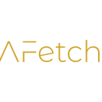 | [***afetch***](apps/afetch.md) | *A CLI system information tool written in Rust.*..[ *read more* ](apps/afetch.md)*!* | [*blob*](https://github.com/ivan-hc/AM/blob/main/programs/x86_64/afetch) **/** [*raw*](https://raw.githubusercontent.com/ivan-hc/AM/main/programs/x86_64/afetch) |
|  | [***aichat***](apps/aichat.md) | *AIO AI CLI tool integrating 20+ AI platforms, including OpenAI.*..[ *read more* ](apps/aichat.md)*!* | [*blob*](https://github.com/ivan-hc/AM/blob/main/programs/x86_64/aichat) **/** [*raw*](https://raw.githubusercontent.com/ivan-hc/AM/main/programs/x86_64/aichat) |
|  | [***aim***](apps/aim.md) | *A command line download/upload tool with resume.*..[ *read more* ](apps/aim.md)*!* | [*blob*](https://github.com/ivan-hc/AM/blob/main/programs/x86_64/aim) **/** [*raw*](https://raw.githubusercontent.com/ivan-hc/AM/main/programs/x86_64/aim) |
|  | [***alien-tec-ui***](apps/alien-tec-ui.md) | *Alien-Tec Tron Matrix Like Shell Terminal User Interface.*..[ *read more* ](apps/alien-tec-ui.md)*!* | [*blob*](https://github.com/ivan-hc/AM/blob/main/programs/x86_64/alien-tec-ui) **/** [*raw*](https://raw.githubusercontent.com/ivan-hc/AM/main/programs/x86_64/alien-tec-ui) |
|  | [***amfora***](apps/amfora.md) | *A fancy terminal browser for the Gemini protocol.*..[ *read more* ](apps/amfora.md)*!* | [*blob*](https://github.com/ivan-hc/AM/blob/main/programs/x86_64/amfora) **/** [*raw*](https://raw.githubusercontent.com/ivan-hc/AM/main/programs/x86_64/amfora) |
|  | [***android-tools***](apps/android-tools.md) | *Unofficial AppImage for the Android Platform tools, adb, fastboot, etc.*..[ *read more* ](apps/android-tools.md)*!* | [*blob*](https://github.com/ivan-hc/AM/blob/main/programs/x86_64/android-tools) **/** [*raw*](https://raw.githubusercontent.com/ivan-hc/AM/main/programs/x86_64/android-tools) |
| 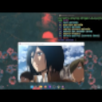 | [***ani-cli***](apps/ani-cli.md) | *A cli tool to browse and play anime.*..[ *read more* ](apps/ani-cli.md)*!* | [*blob*](https://github.com/ivan-hc/AM/blob/main/programs/x86_64/ani-cli) **/** [*raw*](https://raw.githubusercontent.com/ivan-hc/AM/main/programs/x86_64/ani-cli) |
|  | [***appimagelauncher***](apps/appimagelauncher.md) | *CLI helper for running and integrating AppImages.*..[ *read more* ](apps/appimagelauncher.md)*!* | [*blob*](https://github.com/ivan-hc/AM/blob/main/programs/x86_64/appimagelauncher) **/** [*raw*](https://raw.githubusercontent.com/ivan-hc/AM/main/programs/x86_64/appimagelauncher) |
|  | [***aptly***](apps/aptly.md) | *Debian repository management CLI tool.*..[ *read more* ](apps/aptly.md)*!* | [*blob*](https://github.com/ivan-hc/AM/blob/main/programs/x86_64/aptly) **/** [*raw*](https://raw.githubusercontent.com/ivan-hc/AM/main/programs/x86_64/aptly) |
|  | [***atuin***](apps/atuin.md) | *Magical shell history.*..[ *read more* ](apps/atuin.md)*!* | [*blob*](https://github.com/ivan-hc/AM/blob/main/programs/x86_64/atuin) **/** [*raw*](https://raw.githubusercontent.com/ivan-hc/AM/main/programs/x86_64/atuin) |
|  | [***bandwhich***](apps/bandwhich.md) | *Terminal bandwidth utilization tool.*..[ *read more* ](apps/bandwhich.md)*!* | [*blob*](https://github.com/ivan-hc/AM/blob/main/programs/x86_64/bandwhich) **/** [*raw*](https://raw.githubusercontent.com/ivan-hc/AM/main/programs/x86_64/bandwhich) |
|  | [***bat-extras***](apps/bat-extras.md) | *Bash scripts that integrate bat with various command line tools.*..[ *read more* ](apps/bat-extras.md)*!* | [*blob*](https://github.com/ivan-hc/AM/blob/main/programs/x86_64/bat-extras) **/** [*raw*](https://raw.githubusercontent.com/ivan-hc/AM/main/programs/x86_64/bat-extras) |
|  | [***bench-cli***](apps/bench-cli.md) | *CLI tool to benchmark commands, written in `Fortran`.*..[ *read more* ](apps/bench-cli.md)*!* | [*blob*](https://github.com/ivan-hc/AM/blob/main/programs/x86_64/bench-cli) **/** [*raw*](https://raw.githubusercontent.com/ivan-hc/AM/main/programs/x86_64/bench-cli) |
|  | [***bettersis***](apps/bettersis.md) | *Modern shell for SIS.*..[ *read more* ](apps/bettersis.md)*!* | [*blob*](https://github.com/ivan-hc/AM/blob/main/programs/x86_64/bettersis) **/** [*raw*](https://raw.githubusercontent.com/ivan-hc/AM/main/programs/x86_64/bettersis) |
|  | [***binclock***](apps/binclock.md) | *Binary clock in terminal.*..[ *read more* ](apps/binclock.md)*!* | [*blob*](https://github.com/ivan-hc/AM/blob/main/programs/x86_64/binclock) **/** [*raw*](https://raw.githubusercontent.com/ivan-hc/AM/main/programs/x86_64/binclock) |
|  | [***bk***](apps/bk.md) | *Terminal Epub reader.*..[ *read more* ](apps/bk.md)*!* | [*blob*](https://github.com/ivan-hc/AM/blob/main/programs/x86_64/bk) **/** [*raw*](https://raw.githubusercontent.com/ivan-hc/AM/main/programs/x86_64/bk) |
| 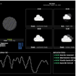 | [***blimp***](apps/blimp.md) | *Customizable terminal UI for monitoring weather information, application status, network latency, and more.*..[ *read more* ](apps/blimp.md)*!* | [*blob*](https://github.com/ivan-hc/AM/blob/main/programs/x86_64/blimp) **/** [*raw*](https://raw.githubusercontent.com/ivan-hc/AM/main/programs/x86_64/blimp) |
|  | [***blob-dl***](apps/blob-dl.md) | *Blob-dl is a yt-dlp CLI interface used to download video and audio files from YouTube.*..[ *read more* ](apps/blob-dl.md)*!* | [*blob*](https://github.com/ivan-hc/AM/blob/main/programs/x86_64/blob-dl) **/** [*raw*](https://raw.githubusercontent.com/ivan-hc/AM/main/programs/x86_64/blob-dl) |
|  | [***blobdrop***](apps/blobdrop.md) | *Drag and drop files directly out of the terminal.*..[ *read more* ](apps/blobdrop.md)*!* | [*blob*](https://github.com/ivan-hc/AM/blob/main/programs/x86_64/blobdrop) **/** [*raw*](https://raw.githubusercontent.com/ivan-hc/AM/main/programs/x86_64/blobdrop) |
|  | [***btop***](apps/btop.md) | *A command line utility to monitor system resources, like Htop.*..[ *read more* ](apps/btop.md)*!* | [*blob*](https://github.com/ivan-hc/AM/blob/main/programs/x86_64/btop) **/** [*raw*](https://raw.githubusercontent.com/ivan-hc/AM/main/programs/x86_64/btop) |
| 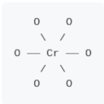 | [***carbonyl***](apps/carbonyl.md) | *Chromium running inside your terminal.*..[ *read more* ](apps/carbonyl.md)*!* | [*blob*](https://github.com/ivan-hc/AM/blob/main/programs/x86_64/carbonyl) **/** [*raw*](https://raw.githubusercontent.com/ivan-hc/AM/main/programs/x86_64/carbonyl) |
|  | [***celoterminal-bin***](apps/celoterminal-bin.md) | *Celo Terminal, AppImage version.*..[ *read more* ](apps/celoterminal-bin.md)*!* | [*blob*](https://github.com/ivan-hc/AM/blob/main/programs/x86_64/celoterminal-bin) **/** [*raw*](https://raw.githubusercontent.com/ivan-hc/AM/main/programs/x86_64/celoterminal-bin) |
|  | [***cheat***](apps/cheat.md) | *Create and view interactive cheatsheets on the command-line.*..[ *read more* ](apps/cheat.md)*!* | [*blob*](https://github.com/ivan-hc/AM/blob/main/programs/x86_64/cheat) **/** [*raw*](https://raw.githubusercontent.com/ivan-hc/AM/main/programs/x86_64/cheat) |
|  | [***cicada***](apps/cicada.md) | *An old-school bash-like Unix shell written in Rust.*..[ *read more* ](apps/cicada.md)*!* | [*blob*](https://github.com/ivan-hc/AM/blob/main/programs/x86_64/cicada) **/** [*raw*](https://raw.githubusercontent.com/ivan-hc/AM/main/programs/x86_64/cicada) |
|  | [***clifm***](apps/clifm.md) | *The shell-like, command line terminal file manager simple, fast, extensible, and lightweight as hell.*..[ *read more* ](apps/clifm.md)*!* | [*blob*](https://github.com/ivan-hc/AM/blob/main/programs/x86_64/clifm) **/** [*raw*](https://raw.githubusercontent.com/ivan-hc/AM/main/programs/x86_64/clifm) |
|  | [***code-radio***](apps/code-radio.md) | *A command line music radio client for coderadio.freecodecamp.org, written in Rust.*..[ *read more* ](apps/code-radio.md)*!* | [*blob*](https://github.com/ivan-hc/AM/blob/main/programs/x86_64/code-radio) **/** [*raw*](https://raw.githubusercontent.com/ivan-hc/AM/main/programs/x86_64/code-radio) |
|  | [***colorstatic-bash***](apps/colorstatic-bash.md) | *CLI to generate a random colorful "Static"/"Matrix".*..[ *read more* ](apps/colorstatic-bash.md)*!* | [*blob*](https://github.com/ivan-hc/AM/blob/main/programs/x86_64/colorstatic-bash) **/** [*raw*](https://raw.githubusercontent.com/ivan-hc/AM/main/programs/x86_64/colorstatic-bash) |
|  | [***contour***](apps/contour.md) | *Modern C++ Terminal Emulator.*..[ *read more* ](apps/contour.md)*!* | [*blob*](https://github.com/ivan-hc/AM/blob/main/programs/x86_64/contour) **/** [*raw*](https://raw.githubusercontent.com/ivan-hc/AM/main/programs/x86_64/contour) |
|  | [***cool-retro-term***](apps/cool-retro-term.md) | *Use the command line the old way.*..[ *read more* ](apps/cool-retro-term.md)*!* | [*blob*](https://github.com/ivan-hc/AM/blob/main/programs/x86_64/cool-retro-term) **/** [*raw*](https://raw.githubusercontent.com/ivan-hc/AM/main/programs/x86_64/cool-retro-term) |
|  | [***coreterminal***](apps/coreterminal.md) | *A terminal emulator for C Suite.*..[ *read more* ](apps/coreterminal.md)*!* | [*blob*](https://github.com/ivan-hc/AM/blob/main/programs/x86_64/coreterminal) **/** [*raw*](https://raw.githubusercontent.com/ivan-hc/AM/main/programs/x86_64/coreterminal) |
| 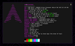 | [***crabfetch***](apps/crabfetch.md) | *Extremely fast, featureful and customizable command-line fetcher.*..[ *read more* ](apps/crabfetch.md)*!* | [*blob*](https://github.com/ivan-hc/AM/blob/main/programs/x86_64/crabfetch) **/** [*raw*](https://raw.githubusercontent.com/ivan-hc/AM/main/programs/x86_64/crabfetch) |
|  | [***cutechess***](apps/cutechess.md) | *Cute Chess is a GUI, a CLI and a library for playing chess.*..[ *read more* ](apps/cutechess.md)*!* | [*blob*](https://github.com/ivan-hc/AM/blob/main/programs/x86_64/cutechess) **/** [*raw*](https://raw.githubusercontent.com/ivan-hc/AM/main/programs/x86_64/cutechess) |
|  | [***devclean***](apps/devclean.md) | *A CLI and Desktop GUI app to clean dev dependencies (node_modules, cache) and more.*..[ *read more* ](apps/devclean.md)*!* | [*blob*](https://github.com/ivan-hc/AM/blob/main/programs/x86_64/devclean) **/** [*raw*](https://raw.githubusercontent.com/ivan-hc/AM/main/programs/x86_64/devclean) |
|  | [***didder***](apps/didder.md) | *An extensive, fast, and accurate command-line image dithering tool.*..[ *read more* ](apps/didder.md)*!* | [*blob*](https://github.com/ivan-hc/AM/blob/main/programs/x86_64/didder) **/** [*raw*](https://raw.githubusercontent.com/ivan-hc/AM/main/programs/x86_64/didder) |
|  | [***diskonaut***](apps/diskonaut.md) | *Terminal disk space navigator.*..[ *read more* ](apps/diskonaut.md)*!* | [*blob*](https://github.com/ivan-hc/AM/blob/main/programs/x86_64/diskonaut) **/** [*raw*](https://raw.githubusercontent.com/ivan-hc/AM/main/programs/x86_64/diskonaut) |
|  | [***doggo***](apps/doggo.md) | *Command-line DNS Client for Humans. Written in Golang*..[ *read more* ](apps/doggo.md)*!* | [*blob*](https://github.com/ivan-hc/AM/blob/main/programs/x86_64/doggo) **/** [*raw*](https://raw.githubusercontent.com/ivan-hc/AM/main/programs/x86_64/doggo) |
|  | [***domterm***](apps/domterm.md) | *DOM/JavaScript-based terminal-emulator/console.*..[ *read more* ](apps/domterm.md)*!* | [*blob*](https://github.com/ivan-hc/AM/blob/main/programs/x86_64/domterm) **/** [*raw*](https://raw.githubusercontent.com/ivan-hc/AM/main/programs/x86_64/domterm) |
|  | [***dra***](apps/dra.md) | *A command line tool to download release assets from GitHub.*..[ *read more* ](apps/dra.md)*!* | [*blob*](https://github.com/ivan-hc/AM/blob/main/programs/x86_64/dra) **/** [*raw*](https://raw.githubusercontent.com/ivan-hc/AM/main/programs/x86_64/dra) |
|  | [***dragdrop***](apps/dragdrop.md) | *Small drag-and-drop file source for the command line.*..[ *read more* ](apps/dragdrop.md)*!* | [*blob*](https://github.com/ivan-hc/AM/blob/main/programs/x86_64/dragdrop) **/** [*raw*](https://raw.githubusercontent.com/ivan-hc/AM/main/programs/x86_64/dragdrop) |
| 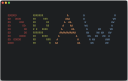 | [***draw***](apps/draw.md) | *Draw in your terminal.*..[ *read more* ](apps/draw.md)*!* | [*blob*](https://github.com/ivan-hc/AM/blob/main/programs/x86_64/draw) **/** [*raw*](https://raw.githubusercontent.com/ivan-hc/AM/main/programs/x86_64/draw) |
|  | [***dstask***](apps/dstask.md) | *Git powered terminal-based todo/note manager,  markdown note page per task.*..[ *read more* ](apps/dstask.md)*!* | [*blob*](https://github.com/ivan-hc/AM/blob/main/programs/x86_64/dstask) **/** [*raw*](https://raw.githubusercontent.com/ivan-hc/AM/main/programs/x86_64/dstask) |
|  | [***dtmate***](apps/dtmate.md) | *CLI to compute difference between date, time or duration.*..[ *read more* ](apps/dtmate.md)*!* | [*blob*](https://github.com/ivan-hc/AM/blob/main/programs/x86_64/dtmate) **/** [*raw*](https://raw.githubusercontent.com/ivan-hc/AM/main/programs/x86_64/dtmate) |
| 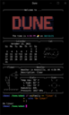 | [***dune***](apps/dune.md) | *A shell by the beach.*..[ *read more* ](apps/dune.md)*!* | [*blob*](https://github.com/ivan-hc/AM/blob/main/programs/x86_64/dune) **/** [*raw*](https://raw.githubusercontent.com/ivan-hc/AM/main/programs/x86_64/dune) |
|  | [***edex-ui***](apps/edex-ui.md) | *A cross-platform, customizable science fiction terminal emulator.*..[ *read more* ](apps/edex-ui.md)*!* | [*blob*](https://github.com/ivan-hc/AM/blob/main/programs/x86_64/edex-ui) **/** [*raw*](https://raw.githubusercontent.com/ivan-hc/AM/main/programs/x86_64/edex-ui) |
|  | [***effer***](apps/effer.md) | *Encrypted CLI Notepad written in Rust*..[ *read more* ](apps/effer.md)*!* | [*blob*](https://github.com/ivan-hc/AM/blob/main/programs/x86_64/effer) **/** [*raw*](https://raw.githubusercontent.com/ivan-hc/AM/main/programs/x86_64/effer) |
|  | [***elvish***](apps/elvish.md) | *Powerful modern shell scripting.*..[ *read more* ](apps/elvish.md)*!* | [*blob*](https://github.com/ivan-hc/AM/blob/main/programs/x86_64/elvish) **/** [*raw*](https://raw.githubusercontent.com/ivan-hc/AM/main/programs/x86_64/elvish) |
|  | [***extraterm***](apps/extraterm.md) | *The swiss army chainsaw of terminal emulators.*..[ *read more* ](apps/extraterm.md)*!* | [*blob*](https://github.com/ivan-hc/AM/blob/main/programs/x86_64/extraterm) **/** [*raw*](https://raw.githubusercontent.com/ivan-hc/AM/main/programs/x86_64/extraterm) |
|  | [***fakedata***](apps/fakedata.md) | *CLI utility for fake data generation.*..[ *read more* ](apps/fakedata.md)*!* | [*blob*](https://github.com/ivan-hc/AM/blob/main/programs/x86_64/fakedata) **/** [*raw*](https://raw.githubusercontent.com/ivan-hc/AM/main/programs/x86_64/fakedata) |
|  | [***fastboot***](apps/fastboot.md) | *Tool to flash Android devices. This script installs the full "platform-tools" suite.*..[ *read more* ](apps/fastboot.md)*!* | [*blob*](https://github.com/ivan-hc/AM/blob/main/programs/x86_64/fastboot) **/** [*raw*](https://raw.githubusercontent.com/ivan-hc/AM/main/programs/x86_64/fastboot) |
|  | [***ffsend***](apps/ffsend.md) | *Easily and securely share files from the command line. A fully featured Firefox Send client.*..[ *read more* ](apps/ffsend.md)*!* | [*blob*](https://github.com/ivan-hc/AM/blob/main/programs/x86_64/ffsend) **/** [*raw*](https://raw.githubusercontent.com/ivan-hc/AM/main/programs/x86_64/ffsend) |
|  | [***filen-cli***](apps/filen-cli.md) | *Filen CLI for Windows, macOS and Linux*..[ *read more* ](apps/filen-cli.md)*!* | [*blob*](https://github.com/ivan-hc/AM/blob/main/programs/x86_64/filen-cli) **/** [*raw*](https://raw.githubusercontent.com/ivan-hc/AM/main/programs/x86_64/filen-cli) |
|  | [***fishterm***](apps/fishterm.md) | *A open-soruce Terminal remote access.*..[ *read more* ](apps/fishterm.md)*!* | [*blob*](https://github.com/ivan-hc/AM/blob/main/programs/x86_64/fishterm) **/** [*raw*](https://raw.githubusercontent.com/ivan-hc/AM/main/programs/x86_64/fishterm) |
|  | [***flyctl***](apps/flyctl.md) | *Command line tools for fly.io services.*..[ *read more* ](apps/flyctl.md)*!* | [*blob*](https://github.com/ivan-hc/AM/blob/main/programs/x86_64/flyctl) **/** [*raw*](https://raw.githubusercontent.com/ivan-hc/AM/main/programs/x86_64/flyctl) |
|  | [***fman***](apps/fman.md) | *TUI CLI File Manager.*..[ *read more* ](apps/fman.md)*!* | [*blob*](https://github.com/ivan-hc/AM/blob/main/programs/x86_64/fman) **/** [*raw*](https://raw.githubusercontent.com/ivan-hc/AM/main/programs/x86_64/fman) |
|  | [***focus***](apps/focus.md) | *A fully featured productivity timer for the command line, based on the Pomodoro Technique.*..[ *read more* ](apps/focus.md)*!* | [*blob*](https://github.com/ivan-hc/AM/blob/main/programs/x86_64/focus) **/** [*raw*](https://raw.githubusercontent.com/ivan-hc/AM/main/programs/x86_64/focus) |
|  | [***freeze***](apps/freeze.md) | *Generate images of code and terminal output.*..[ *read more* ](apps/freeze.md)*!* | [*blob*](https://github.com/ivan-hc/AM/blob/main/programs/x86_64/freeze) **/** [*raw*](https://raw.githubusercontent.com/ivan-hc/AM/main/programs/x86_64/freeze) |
|  | [***funterm***](apps/funterm.md) | *A Linux Terminal Emulator.*..[ *read more* ](apps/funterm.md)*!* | [*blob*](https://github.com/ivan-hc/AM/blob/main/programs/x86_64/funterm) **/** [*raw*](https://raw.githubusercontent.com/ivan-hc/AM/main/programs/x86_64/funterm) |
|  | [***fx***](apps/fx.md) | *Terminal JSON viewer & processor.*..[ *read more* ](apps/fx.md)*!* | [*blob*](https://github.com/ivan-hc/AM/blob/main/programs/x86_64/fx) **/** [*raw*](https://raw.githubusercontent.com/ivan-hc/AM/main/programs/x86_64/fx) |
|  | [***fzf***](apps/fzf.md) | *A command-line fuzzy finder.*..[ *read more* ](apps/fzf.md)*!* | [*blob*](https://github.com/ivan-hc/AM/blob/main/programs/x86_64/fzf) **/** [*raw*](https://raw.githubusercontent.com/ivan-hc/AM/main/programs/x86_64/fzf) |
|  | [***gallery-dl***](apps/gallery-dl.md) | *Command-line program to download image galleries and collections.*..[ *read more* ](apps/gallery-dl.md)*!* | [*blob*](https://github.com/ivan-hc/AM/blob/main/programs/x86_64/gallery-dl) **/** [*raw*](https://raw.githubusercontent.com/ivan-hc/AM/main/programs/x86_64/gallery-dl) |
|  | [***gemget***](apps/gemget.md) | *Command line downloader for the Gemini protocol.*..[ *read more* ](apps/gemget.md)*!* | [*blob*](https://github.com/ivan-hc/AM/blob/main/programs/x86_64/gemget) **/** [*raw*](https://raw.githubusercontent.com/ivan-hc/AM/main/programs/x86_64/gemget) |
|  | [***gert***](apps/gert.md) | *A command line tool to download media from Reddit.*..[ *read more* ](apps/gert.md)*!* | [*blob*](https://github.com/ivan-hc/AM/blob/main/programs/x86_64/gert) **/** [*raw*](https://raw.githubusercontent.com/ivan-hc/AM/main/programs/x86_64/gert) |
|  | [***ghdl***](apps/ghdl.md) | *A much more convenient way to download GitHub release binaries on the command line.*..[ *read more* ](apps/ghdl.md)*!* | [*blob*](https://github.com/ivan-hc/AM/blob/main/programs/x86_64/ghdl) **/** [*raw*](https://raw.githubusercontent.com/ivan-hc/AM/main/programs/x86_64/ghdl) |
|  | [***ghostty***](apps/ghostty.md) | *Unofficial AppImage(s) of Ghostty terminal emulator.*..[ *read more* ](apps/ghostty.md)*!* | [*blob*](https://github.com/ivan-hc/AM/blob/main/programs/x86_64/ghostty) **/** [*raw*](https://raw.githubusercontent.com/ivan-hc/AM/main/programs/x86_64/ghostty) |
|  | [***gh-eco***](apps/gh-eco.md) | *gh cli extension to explore the ecosystem.*..[ *read more* ](apps/gh-eco.md)*!* | [*blob*](https://github.com/ivan-hc/AM/blob/main/programs/x86_64/gh-eco) **/** [*raw*](https://raw.githubusercontent.com/ivan-hc/AM/main/programs/x86_64/gh-eco) |
|  | [***gh***](apps/gh.md) | *GitHub’s official command line tool.*..[ *read more* ](apps/gh.md)*!* | [*blob*](https://github.com/ivan-hc/AM/blob/main/programs/x86_64/gh) **/** [*raw*](https://raw.githubusercontent.com/ivan-hc/AM/main/programs/x86_64/gh) |
|  | [***gitui***](apps/gitui.md) | *Blazing fast terminal-ui for git written in rust.*..[ *read more* ](apps/gitui.md)*!* | [*blob*](https://github.com/ivan-hc/AM/blob/main/programs/x86_64/gitui) **/** [*raw*](https://raw.githubusercontent.com/ivan-hc/AM/main/programs/x86_64/gitui) |
|  | [***glab***](apps/glab.md) | *A GitLab CLI tool bringing GitLab to your command line.*..[ *read more* ](apps/glab.md)*!* | [*blob*](https://github.com/ivan-hc/AM/blob/main/programs/x86_64/glab) **/** [*raw*](https://raw.githubusercontent.com/ivan-hc/AM/main/programs/x86_64/glab) |
| 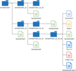 | [***goodls***](apps/goodls.md) | *This is a CLI tool to download shared files and folders from Google Drive.*..[ *read more* ](apps/goodls.md)*!* | [*blob*](https://github.com/ivan-hc/AM/blob/main/programs/x86_64/goodls) **/** [*raw*](https://raw.githubusercontent.com/ivan-hc/AM/main/programs/x86_64/goodls) |
| 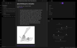 | [***gooseberry***](apps/gooseberry.md) | *A command line utility to generate a knowledge base from Hypothesis annotations.*..[ *read more* ](apps/gooseberry.md)*!* | [*blob*](https://github.com/ivan-hc/AM/blob/main/programs/x86_64/gooseberry) **/** [*raw*](https://raw.githubusercontent.com/ivan-hc/AM/main/programs/x86_64/gooseberry) |
|  | [***go-pd***](apps/go-pd.md) | *A free easy to use pixeldrain.com go client pkg and CLI upload tool.*..[ *read more* ](apps/go-pd.md)*!* | [*blob*](https://github.com/ivan-hc/AM/blob/main/programs/x86_64/go-pd) **/** [*raw*](https://raw.githubusercontent.com/ivan-hc/AM/main/programs/x86_64/go-pd) |
|  | [***go-spotify-cli***](apps/go-spotify-cli.md) | *Control Spotify with CLI commands.*..[ *read more* ](apps/go-spotify-cli.md)*!* | [*blob*](https://github.com/ivan-hc/AM/blob/main/programs/x86_64/go-spotify-cli) **/** [*raw*](https://raw.githubusercontent.com/ivan-hc/AM/main/programs/x86_64/go-spotify-cli) |
| 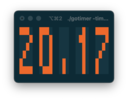 | [***gotimer***](apps/gotimer.md) | *A simple terminal based digital timer for Pomodoro.*..[ *read more* ](apps/gotimer.md)*!* | [*blob*](https://github.com/ivan-hc/AM/blob/main/programs/x86_64/gotimer) **/** [*raw*](https://raw.githubusercontent.com/ivan-hc/AM/main/programs/x86_64/gotimer) |
|  | [***goto***](apps/goto.md) | *A simple terminal SSH manager that lists favorite SSH servers.*..[ *read more* ](apps/goto.md)*!* | [*blob*](https://github.com/ivan-hc/AM/blob/main/programs/x86_64/goto) **/** [*raw*](https://raw.githubusercontent.com/ivan-hc/AM/main/programs/x86_64/goto) |
|  | [***got***](apps/got.md) | *Simple golang package and CLI tool to download large files faster than cURL and Wget!*..[ *read more* ](apps/got.md)*!* | [*blob*](https://github.com/ivan-hc/AM/blob/main/programs/x86_64/got) **/** [*raw*](https://raw.githubusercontent.com/ivan-hc/AM/main/programs/x86_64/got) |
|  | [***gum***](apps/gum.md) | *A tool for glamorous shell scripts.*..[ *read more* ](apps/gum.md)*!* | [*blob*](https://github.com/ivan-hc/AM/blob/main/programs/x86_64/gum) **/** [*raw*](https://raw.githubusercontent.com/ivan-hc/AM/main/programs/x86_64/gum) |
| 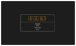 | [***hascard***](apps/hascard.md) | *Flashcard TUI CLI with markdown cards.*..[ *read more* ](apps/hascard.md)*!* | [*blob*](https://github.com/ivan-hc/AM/blob/main/programs/x86_64/hascard) **/** [*raw*](https://raw.githubusercontent.com/ivan-hc/AM/main/programs/x86_64/hascard) |
|  | [***hctl***](apps/hctl.md) | *A tool to control your Home Assistant devices from the command-line.*..[ *read more* ](apps/hctl.md)*!* | [*blob*](https://github.com/ivan-hc/AM/blob/main/programs/x86_64/hctl) **/** [*raw*](https://raw.githubusercontent.com/ivan-hc/AM/main/programs/x86_64/hctl) |
|  | [***hide.me***](apps/hide.me.md) | *Hide.me CLI VPN client for Linux.*..[ *read more* ](apps/hide.me.md)*!* | [*blob*](https://github.com/ivan-hc/AM/blob/main/programs/x86_64/hide.me) **/** [*raw*](https://raw.githubusercontent.com/ivan-hc/AM/main/programs/x86_64/hide.me) |
|  | [***hilbish***](apps/hilbish.md) | *The Moon-powered shell! A comfy and extensible shell for Lua fans!*..[ *read more* ](apps/hilbish.md)*!* | [*blob*](https://github.com/ivan-hc/AM/blob/main/programs/x86_64/hilbish) **/** [*raw*](https://raw.githubusercontent.com/ivan-hc/AM/main/programs/x86_64/hilbish) |
|  | [***himalaya***](apps/himalaya.md) | *CLI to manage emails.*..[ *read more* ](apps/himalaya.md)*!* | [*blob*](https://github.com/ivan-hc/AM/blob/main/programs/x86_64/himalaya) **/** [*raw*](https://raw.githubusercontent.com/ivan-hc/AM/main/programs/x86_64/himalaya) |
|  | [***htop***](apps/htop.md) | *Unofficial, CLI utility to monitor system resources.*..[ *read more* ](apps/htop.md)*!* | [*blob*](https://github.com/ivan-hc/AM/blob/main/programs/x86_64/htop) **/** [*raw*](https://raw.githubusercontent.com/ivan-hc/AM/main/programs/x86_64/htop) |
|  | [***hyper***](apps/hyper.md) | *A terminal built on web technologies.*..[ *read more* ](apps/hyper.md)*!* | [*blob*](https://github.com/ivan-hc/AM/blob/main/programs/x86_64/hyper) **/** [*raw*](https://raw.githubusercontent.com/ivan-hc/AM/main/programs/x86_64/hyper) |
|  | [***hyperfine***](apps/hyperfine.md) | *A command-line benchmarking tool.*..[ *read more* ](apps/hyperfine.md)*!* | [*blob*](https://github.com/ivan-hc/AM/blob/main/programs/x86_64/hyperfine) **/** [*raw*](https://raw.githubusercontent.com/ivan-hc/AM/main/programs/x86_64/hyperfine) |
|  | [***imagemagick-clang***](apps/imagemagick-clang.md) | *CLI to create, edit, compose, or convert digital images.*..[ *read more* ](apps/imagemagick-clang.md)*!* | [*blob*](https://github.com/ivan-hc/AM/blob/main/programs/x86_64/imagemagick-clang) **/** [*raw*](https://raw.githubusercontent.com/ivan-hc/AM/main/programs/x86_64/imagemagick-clang) |
|  | [***imagemagick-gcc***](apps/imagemagick-gcc.md) | *CLI to create, edit, compose, or convert digital images.*..[ *read more* ](apps/imagemagick-gcc.md)*!* | [*blob*](https://github.com/ivan-hc/AM/blob/main/programs/x86_64/imagemagick-gcc) **/** [*raw*](https://raw.githubusercontent.com/ivan-hc/AM/main/programs/x86_64/imagemagick-gcc) |
|  | [***imgcat***](apps/imgcat.md) | *Display images and gifs in your terminal.*..[ *read more* ](apps/imgcat.md)*!* | [*blob*](https://github.com/ivan-hc/AM/blob/main/programs/x86_64/imgcat) **/** [*raw*](https://raw.githubusercontent.com/ivan-hc/AM/main/programs/x86_64/imgcat) |
|  | [***jless***](apps/jless.md) | *CLI JSON viewer designed for reading, exploring, and searching.*..[ *read more* ](apps/jless.md)*!* | [*blob*](https://github.com/ivan-hc/AM/blob/main/programs/x86_64/jless) **/** [*raw*](https://raw.githubusercontent.com/ivan-hc/AM/main/programs/x86_64/jless) |
|  | [***jottem***](apps/jottem.md) | *A lean, low friction terminal app for managing markdown notes.*..[ *read more* ](apps/jottem.md)*!* | [*blob*](https://github.com/ivan-hc/AM/blob/main/programs/x86_64/jottem) **/** [*raw*](https://raw.githubusercontent.com/ivan-hc/AM/main/programs/x86_64/jottem) |
|  | [***jq***](apps/jq.md) | *Command-line JSON processor.*..[ *read more* ](apps/jq.md)*!* | [*blob*](https://github.com/ivan-hc/AM/blob/main/programs/x86_64/jq) **/** [*raw*](https://raw.githubusercontent.com/ivan-hc/AM/main/programs/x86_64/jq) |
|  | [***kalc***](apps/kalc.md) | *Complex numbers, 2d/3d graphing, arbitrary precision cli calculator.*..[ *read more* ](apps/kalc.md)*!* | [*blob*](https://github.com/ivan-hc/AM/blob/main/programs/x86_64/kalc) **/** [*raw*](https://raw.githubusercontent.com/ivan-hc/AM/main/programs/x86_64/kalc) |
|  | [***kboard***](apps/kboard.md) | *Terminal game to practice keyboard typing.*..[ *read more* ](apps/kboard.md)*!* | [*blob*](https://github.com/ivan-hc/AM/blob/main/programs/x86_64/kboard) **/** [*raw*](https://raw.githubusercontent.com/ivan-hc/AM/main/programs/x86_64/kboard) |
|  | [***kitty***](apps/kitty.md) | *Cross-platform, fast, feature-rich, GPU based terminal*..[ *read more* ](apps/kitty.md)*!* | [*blob*](https://github.com/ivan-hc/AM/blob/main/programs/x86_64/kitty) **/** [*raw*](https://raw.githubusercontent.com/ivan-hc/AM/main/programs/x86_64/kitty) |
|  | [***kure***](apps/kure.md) | *CLI password manager with sessions.*..[ *read more* ](apps/kure.md)*!* | [*blob*](https://github.com/ivan-hc/AM/blob/main/programs/x86_64/kure) **/** [*raw*](https://raw.githubusercontent.com/ivan-hc/AM/main/programs/x86_64/kure) |
|  | [***lexido***](apps/lexido.md) | *A terminal assistant, powered by Generative AI.*..[ *read more* ](apps/lexido.md)*!* | [*blob*](https://github.com/ivan-hc/AM/blob/main/programs/x86_64/lexido) **/** [*raw*](https://raw.githubusercontent.com/ivan-hc/AM/main/programs/x86_64/lexido) |
|  | [***lf***](apps/lf.md) | *lf, as in "list files" is a terminal file manager written in Go.*..[ *read more* ](apps/lf.md)*!* | [*blob*](https://github.com/ivan-hc/AM/blob/main/programs/x86_64/lf) **/** [*raw*](https://raw.githubusercontent.com/ivan-hc/AM/main/programs/x86_64/lf) |
|  | [***litime***](apps/litime.md) | *A terminal literature clock telling time with quotes from literature.*..[ *read more* ](apps/litime.md)*!* | [*blob*](https://github.com/ivan-hc/AM/blob/main/programs/x86_64/litime) **/** [*raw*](https://raw.githubusercontent.com/ivan-hc/AM/main/programs/x86_64/litime) |
|  | [***luna***](apps/luna.md) | *Manage npm dependencies through a modern UI.*..[ *read more* ](apps/luna.md)*!* | [*blob*](https://github.com/ivan-hc/AM/blob/main/programs/x86_64/luna) **/** [*raw*](https://raw.githubusercontent.com/ivan-hc/AM/main/programs/x86_64/luna) |
|  | [***mangadesk***](apps/mangadesk.md) | *Terminal client for MangaDex.*..[ *read more* ](apps/mangadesk.md)*!* | [*blob*](https://github.com/ivan-hc/AM/blob/main/programs/x86_64/mangadesk) **/** [*raw*](https://raw.githubusercontent.com/ivan-hc/AM/main/programs/x86_64/mangadesk) |
|  | [***mangal***](apps/mangal.md) | *Most advanced, yet simple CLI manga downloader in the universe!*..[ *read more* ](apps/mangal.md)*!* | [*blob*](https://github.com/ivan-hc/AM/blob/main/programs/x86_64/mangal) **/** [*raw*](https://raw.githubusercontent.com/ivan-hc/AM/main/programs/x86_64/mangal) |
|  | [***manga-tui***](apps/manga-tui.md) | *Terminal-based manga reader and downloader with image support.*..[ *read more* ](apps/manga-tui.md)*!* | [*blob*](https://github.com/ivan-hc/AM/blob/main/programs/x86_64/manga-tui) **/** [*raw*](https://raw.githubusercontent.com/ivan-hc/AM/main/programs/x86_64/manga-tui) |
| 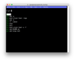 | [***mcfly***](apps/mcfly.md) | *Fly through your shell history. Great Scott!*..[ *read more* ](apps/mcfly.md)*!* | [*blob*](https://github.com/ivan-hc/AM/blob/main/programs/x86_64/mcfly) **/** [*raw*](https://raw.githubusercontent.com/ivan-hc/AM/main/programs/x86_64/mcfly) |
|  | [***mdcat***](apps/mdcat.md) | *Command line, "cat" for markdown.*..[ *read more* ](apps/mdcat.md)*!* | [*blob*](https://github.com/ivan-hc/AM/blob/main/programs/x86_64/mdcat) **/** [*raw*](https://raw.githubusercontent.com/ivan-hc/AM/main/programs/x86_64/mdcat) |
|  | [***menyoki***](apps/menyoki.md) | *Screen{shot,cast} and perform ImageOps on the command line.*..[ *read more* ](apps/menyoki.md)*!* | [*blob*](https://github.com/ivan-hc/AM/blob/main/programs/x86_64/menyoki) **/** [*raw*](https://raw.githubusercontent.com/ivan-hc/AM/main/programs/x86_64/menyoki) |
|  | [***mp4grep***](apps/mp4grep.md) | *CLI for transcribing and searching audio/video files.*..[ *read more* ](apps/mp4grep.md)*!* | [*blob*](https://github.com/ivan-hc/AM/blob/main/programs/x86_64/mp4grep) **/** [*raw*](https://raw.githubusercontent.com/ivan-hc/AM/main/programs/x86_64/mp4grep) |
|  | [***nap***](apps/nap.md) | *Code spippets in your terminal.*..[ *read more* ](apps/nap.md)*!* | [*blob*](https://github.com/ivan-hc/AM/blob/main/programs/x86_64/nap) **/** [*raw*](https://raw.githubusercontent.com/ivan-hc/AM/main/programs/x86_64/nap) |
|  | [***navi***](apps/navi.md) | *An interactive cheatsheet tool for the command-line.*..[ *read more* ](apps/navi.md)*!* | [*blob*](https://github.com/ivan-hc/AM/blob/main/programs/x86_64/navi) **/** [*raw*](https://raw.githubusercontent.com/ivan-hc/AM/main/programs/x86_64/navi) |
|  | [***nazuna***](apps/nazuna.md) | *Download Twitter videos using your terminal!*..[ *read more* ](apps/nazuna.md)*!* | [*blob*](https://github.com/ivan-hc/AM/blob/main/programs/x86_64/nazuna) **/** [*raw*](https://raw.githubusercontent.com/ivan-hc/AM/main/programs/x86_64/nazuna) |
|  | [***nnn***](apps/nnn.md) | *n³ The unorthodox terminal file manager*..[ *read more* ](apps/nnn.md)*!* | [*blob*](https://github.com/ivan-hc/AM/blob/main/programs/x86_64/nnn) **/** [*raw*](https://raw.githubusercontent.com/ivan-hc/AM/main/programs/x86_64/nnn) |
|  | [***noter***](apps/noter.md) | *Simple serial terminal application.*..[ *read more* ](apps/noter.md)*!* | [*blob*](https://github.com/ivan-hc/AM/blob/main/programs/x86_64/noter) **/** [*raw*](https://raw.githubusercontent.com/ivan-hc/AM/main/programs/x86_64/noter) |
|  | [***npm***](apps/npm.md) | *Package manager for Node.js. This script installs the full "node" suite.*..[ *read more* ](apps/npm.md)*!* | [*blob*](https://github.com/ivan-hc/AM/blob/main/programs/x86_64/npm) **/** [*raw*](https://raw.githubusercontent.com/ivan-hc/AM/main/programs/x86_64/npm) |
|  | [***nxshell***](apps/nxshell.md) | *An easy to use new terminal.*..[ *read more* ](apps/nxshell.md)*!* | [*blob*](https://github.com/ivan-hc/AM/blob/main/programs/x86_64/nxshell) **/** [*raw*](https://raw.githubusercontent.com/ivan-hc/AM/main/programs/x86_64/nxshell) |
|  | [***obsidian-cli***](apps/obsidian-cli.md) | *Interact with Obsidian in the terminal. Open, search, create, update, move and delete notes!*..[ *read more* ](apps/obsidian-cli.md)*!* | [*blob*](https://github.com/ivan-hc/AM/blob/main/programs/x86_64/obsidian-cli) **/** [*raw*](https://raw.githubusercontent.com/ivan-hc/AM/main/programs/x86_64/obsidian-cli) |
|  | [***omekasy***](apps/omekasy.md) | *Command line application that converts alphanumeric characters to various styles 𝚍𝚎𝚏𝚒𝚗𝚎𝚍 𝚒𝚗 𝚄𝚗𝚒𝚌𝚘𝚍𝚎.*..[ *read more* ](apps/omekasy.md)*!* | [*blob*](https://github.com/ivan-hc/AM/blob/main/programs/x86_64/omekasy) **/** [*raw*](https://raw.githubusercontent.com/ivan-hc/AM/main/programs/x86_64/omekasy) |
|  | [***onefetch***](apps/onefetch.md) | *Command-line Git information tool.*..[ *read more* ](apps/onefetch.md)*!* | [*blob*](https://github.com/ivan-hc/AM/blob/main/programs/x86_64/onefetch) **/** [*raw*](https://raw.githubusercontent.com/ivan-hc/AM/main/programs/x86_64/onefetch) |
|  | [***openapi-tui***](apps/openapi-tui.md) | *Terminal UI to list, browse and run APIs defined with openapi.*..[ *read more* ](apps/openapi-tui.md)*!* | [*blob*](https://github.com/ivan-hc/AM/blob/main/programs/x86_64/openapi-tui) **/** [*raw*](https://raw.githubusercontent.com/ivan-hc/AM/main/programs/x86_64/openapi-tui) |
|  | [***paket***](apps/paket.md) | *A simple and fast package manager for the Fish shell written in Rust.*..[ *read more* ](apps/paket.md)*!* | [*blob*](https://github.com/ivan-hc/AM/blob/main/programs/x86_64/paket) **/** [*raw*](https://raw.githubusercontent.com/ivan-hc/AM/main/programs/x86_64/paket) |
|  | [***paper***](apps/paper.md) | *A CLI Tool to set a random wallpaper from Unsplash.com.*..[ *read more* ](apps/paper.md)*!* | [*blob*](https://github.com/ivan-hc/AM/blob/main/programs/x86_64/paper) **/** [*raw*](https://raw.githubusercontent.com/ivan-hc/AM/main/programs/x86_64/paper) |
| 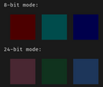 | [***pastel***](apps/pastel.md) | *A command-line tool to generate, analyze, convert and manipulate colors.*..[ *read more* ](apps/pastel.md)*!* | [*blob*](https://github.com/ivan-hc/AM/blob/main/programs/x86_64/pastel) **/** [*raw*](https://raw.githubusercontent.com/ivan-hc/AM/main/programs/x86_64/pastel) |
|  | [***pay-respects***](apps/pay-respects.md) | *Terminal command correction, alternative to thefuck written in Rust.*..[ *read more* ](apps/pay-respects.md)*!* | [*blob*](https://github.com/ivan-hc/AM/blob/main/programs/x86_64/pay-respects) **/** [*raw*](https://raw.githubusercontent.com/ivan-hc/AM/main/programs/x86_64/pay-respects) |
|  | [***pboy***](apps/pboy.md) | *A small .pdf management tool with a command-line UI.*..[ *read more* ](apps/pboy.md)*!* | [*blob*](https://github.com/ivan-hc/AM/blob/main/programs/x86_64/pboy) **/** [*raw*](https://raw.githubusercontent.com/ivan-hc/AM/main/programs/x86_64/pboy) |
|  | [***pdf-diff***](apps/pdf-diff.md) | *A CLI tool for visualizing differences between two pdf files.*..[ *read more* ](apps/pdf-diff.md)*!* | [*blob*](https://github.com/ivan-hc/AM/blob/main/programs/x86_64/pdf-diff) **/** [*raw*](https://raw.githubusercontent.com/ivan-hc/AM/main/programs/x86_64/pdf-diff) |
|  | [***peep***](apps/peep.md) | *The CLI text viewer tool that works like less command on small pane within the terminal window.*..[ *read more* ](apps/peep.md)*!* | [*blob*](https://github.com/ivan-hc/AM/blob/main/programs/x86_64/peep) **/** [*raw*](https://raw.githubusercontent.com/ivan-hc/AM/main/programs/x86_64/peep) |
|  | [***pet***](apps/pet.md) | *Simple command-line snippet manager.*..[ *read more* ](apps/pet.md)*!* | [*blob*](https://github.com/ivan-hc/AM/blob/main/programs/x86_64/pet) **/** [*raw*](https://raw.githubusercontent.com/ivan-hc/AM/main/programs/x86_64/pet) |
|  | [***pget***](apps/pget.md) | *The fastest, resumable file download CLI client.*..[ *read more* ](apps/pget.md)*!* | [*blob*](https://github.com/ivan-hc/AM/blob/main/programs/x86_64/pget) **/** [*raw*](https://raw.githubusercontent.com/ivan-hc/AM/main/programs/x86_64/pget) |
|  | [***pixfetch***](apps/pixfetch.md) | *Another CLI fetch program with pixelized images written in Rust.*..[ *read more* ](apps/pixfetch.md)*!* | [*blob*](https://github.com/ivan-hc/AM/blob/main/programs/x86_64/pixfetch) **/** [*raw*](https://raw.githubusercontent.com/ivan-hc/AM/main/programs/x86_64/pixfetch) |
|  | [***platform-tools***](apps/platform-tools.md) | *Official Suite of command line utilities to manage Android devices.*..[ *read more* ](apps/platform-tools.md)*!* | [*blob*](https://github.com/ivan-hc/AM/blob/main/programs/x86_64/platform-tools) **/** [*raw*](https://raw.githubusercontent.com/ivan-hc/AM/main/programs/x86_64/platform-tools) |
|  | [***playerctl***](apps/playerctl.md) | *Unofficial, MPRIS media player command-line controller.*..[ *read more* ](apps/playerctl.md)*!* | [*blob*](https://github.com/ivan-hc/AM/blob/main/programs/x86_64/playerctl) **/** [*raw*](https://raw.githubusercontent.com/ivan-hc/AM/main/programs/x86_64/playerctl) |
|  | [***plotly-orca***](apps/plotly-orca.md) | *CLI generating static images of interactive charts.*..[ *read more* ](apps/plotly-orca.md)*!* | [*blob*](https://github.com/ivan-hc/AM/blob/main/programs/x86_64/plotly-orca) **/** [*raw*](https://raw.githubusercontent.com/ivan-hc/AM/main/programs/x86_64/plotly-orca) |
|  | [***podman-desktop-companion***](apps/podman-desktop-companion.md) | *Podman command line interface.*..[ *read more* ](apps/podman-desktop-companion.md)*!* | [*blob*](https://github.com/ivan-hc/AM/blob/main/programs/x86_64/podman-desktop-companion) **/** [*raw*](https://raw.githubusercontent.com/ivan-hc/AM/main/programs/x86_64/podman-desktop-companion) |
|  | [***pokego***](apps/pokego.md) | *Command-line tool that lets you display Pokémon sprites in color directly in your terminal.*..[ *read more* ](apps/pokego.md)*!* | [*blob*](https://github.com/ivan-hc/AM/blob/main/programs/x86_64/pokego) **/** [*raw*](https://raw.githubusercontent.com/ivan-hc/AM/main/programs/x86_64/pokego) |
|  | [***pokete***](apps/pokete.md) | *A terminal based Pokemon like game.*..[ *read more* ](apps/pokete.md)*!* | [*blob*](https://github.com/ivan-hc/AM/blob/main/programs/x86_64/pokete) **/** [*raw*](https://raw.githubusercontent.com/ivan-hc/AM/main/programs/x86_64/pokete) |
|  | [***pop***](apps/pop.md) | *Send emails from your terminal.*..[ *read more* ](apps/pop.md)*!* | [*blob*](https://github.com/ivan-hc/AM/blob/main/programs/x86_64/pop) **/** [*raw*](https://raw.githubusercontent.com/ivan-hc/AM/main/programs/x86_64/pop) |
|  | [***procspin***](apps/procspin.md) | *CLI to create a process/progress animation with text.*..[ *read more* ](apps/procspin.md)*!* | [*blob*](https://github.com/ivan-hc/AM/blob/main/programs/x86_64/procspin) **/** [*raw*](https://raw.githubusercontent.com/ivan-hc/AM/main/programs/x86_64/procspin) |
|  | [***qpdf***](apps/qpdf.md) | *CLI tool to perform content-preserving transformations on PDF files.*..[ *read more* ](apps/qpdf.md)*!* | [*blob*](https://github.com/ivan-hc/AM/blob/main/programs/x86_64/qpdf) **/** [*raw*](https://raw.githubusercontent.com/ivan-hc/AM/main/programs/x86_64/qpdf) |
|  | [***qrscan***](apps/qrscan.md) | *Scan a QR code in the terminal using the system camera or an image.*..[ *read more* ](apps/qrscan.md)*!* | [*blob*](https://github.com/ivan-hc/AM/blob/main/programs/x86_64/qrscan) **/** [*raw*](https://raw.githubusercontent.com/ivan-hc/AM/main/programs/x86_64/qrscan) |
|  | [***rclone***](apps/rclone.md) | *"rsync for cloud storage", CLI that supports Google Drive, S3, Dropbox, Backblaze B2, One Drive, Swift, Hubic, Wasabi, Google Cloud Storage, Azure Blob, Azure Files, Yandex Files.*..[ *read more* ](apps/rclone.md)*!* | [*blob*](https://github.com/ivan-hc/AM/blob/main/programs/x86_64/rclone) **/** [*raw*](https://raw.githubusercontent.com/ivan-hc/AM/main/programs/x86_64/rclone) |
|  | [***rimage***](apps/rimage.md) | *This is CLI tool inspired by squoosh.*..[ *read more* ](apps/rimage.md)*!* | [*blob*](https://github.com/ivan-hc/AM/blob/main/programs/x86_64/rimage) **/** [*raw*](https://raw.githubusercontent.com/ivan-hc/AM/main/programs/x86_64/rimage) |
|  | [***rmw***](apps/rmw.md) | *A safe-remove utility for the command line.*..[ *read more* ](apps/rmw.md)*!* | [*blob*](https://github.com/ivan-hc/AM/blob/main/programs/x86_64/rmw) **/** [*raw*](https://raw.githubusercontent.com/ivan-hc/AM/main/programs/x86_64/rmw) |
|  | [***rocketfetch***](apps/rocketfetch.md) | *A WIP command line system information tool written with multithreading in rust for performance with toml file configuration.*..[ *read more* ](apps/rocketfetch.md)*!* | [*blob*](https://github.com/ivan-hc/AM/blob/main/programs/x86_64/rocketfetch) **/** [*raw*](https://raw.githubusercontent.com/ivan-hc/AM/main/programs/x86_64/rocketfetch) |
| 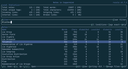 | [***rucola***](apps/rucola.md) | *Terminal-based markdown note manager.*..[ *read more* ](apps/rucola.md)*!* | [*blob*](https://github.com/ivan-hc/AM/blob/main/programs/x86_64/rucola) **/** [*raw*](https://raw.githubusercontent.com/ivan-hc/AM/main/programs/x86_64/rucola) |
|  | [***rustdict***](apps/rustdict.md) | *A dictionary CLI tool in Rust inspired by BetaPictoris's dict.*..[ *read more* ](apps/rustdict.md)*!* | [*blob*](https://github.com/ivan-hc/AM/blob/main/programs/x86_64/rustdict) **/** [*raw*](https://raw.githubusercontent.com/ivan-hc/AM/main/programs/x86_64/rustdict) |
|  | [***school-sections***](apps/school-sections.md) | *This project was generated with Angular CLI v1.7.4.*..[ *read more* ](apps/school-sections.md)*!* | [*blob*](https://github.com/ivan-hc/AM/blob/main/programs/x86_64/school-sections) **/** [*raw*](https://raw.githubusercontent.com/ivan-hc/AM/main/programs/x86_64/school-sections) |
|  | [***shell-assistant***](apps/shell-assistant.md) | *Ad free Terminal SSH & SFTP client File manager and Code editor.*..[ *read more* ](apps/shell-assistant.md)*!* | [*blob*](https://github.com/ivan-hc/AM/blob/main/programs/x86_64/shell-assistant) **/** [*raw*](https://raw.githubusercontent.com/ivan-hc/AM/main/programs/x86_64/shell-assistant) |
|  | [***shellcheck***](apps/shellcheck.md) | *ShellCheck, a static analysis tool for shell scripts.*..[ *read more* ](apps/shellcheck.md)*!* | [*blob*](https://github.com/ivan-hc/AM/blob/main/programs/x86_64/shellcheck) **/** [*raw*](https://raw.githubusercontent.com/ivan-hc/AM/main/programs/x86_64/shellcheck) |
|  | [***shellharden***](apps/shellharden.md) | *The corrective bash syntax highlighter.*..[ *read more* ](apps/shellharden.md)*!* | [*blob*](https://github.com/ivan-hc/AM/blob/main/programs/x86_64/shellharden) **/** [*raw*](https://raw.githubusercontent.com/ivan-hc/AM/main/programs/x86_64/shellharden) |
|  | [***sidenote***](apps/sidenote.md) | *A CLI tool that helps to manage plain text notes per working directory.*..[ *read more* ](apps/sidenote.md)*!* | [*blob*](https://github.com/ivan-hc/AM/blob/main/programs/x86_64/sidenote) **/** [*raw*](https://raw.githubusercontent.com/ivan-hc/AM/main/programs/x86_64/sidenote) |
|  | [***simplechroot***](apps/simplechroot.md) | *Simple command line chroot with ease.*..[ *read more* ](apps/simplechroot.md)*!* | [*blob*](https://github.com/ivan-hc/AM/blob/main/programs/x86_64/simplechroot) **/** [*raw*](https://raw.githubusercontent.com/ivan-hc/AM/main/programs/x86_64/simplechroot) |
|  | [***soft-serve***](apps/soft-serve.md) | *The mighty, self-hostable Git server for the command line.*..[ *read more* ](apps/soft-serve.md)*!* | [*blob*](https://github.com/ivan-hc/AM/blob/main/programs/x86_64/soft-serve) **/** [*raw*](https://raw.githubusercontent.com/ivan-hc/AM/main/programs/x86_64/soft-serve) |
|  | [***simdock***](apps/simdock.md) | *Small dock with pseudo-transparency and good window handling.*..[ *read more* ](apps/simdock.md)*!* | [*blob*](https://github.com/ivan-hc/AM/blob/main/programs/x86_64/simdock) **/** [*raw*](https://raw.githubusercontent.com/ivan-hc/AM/main/programs/x86_64/simdock) |
|  | [***simdsp***](apps/simdsp.md) | *DSP Simulator.*..[ *read more* ](apps/simdsp.md)*!* | [*blob*](https://github.com/ivan-hc/AM/blob/main/programs/x86_64/simdsp) **/** [*raw*](https://raw.githubusercontent.com/ivan-hc/AM/main/programs/x86_64/simdsp) |
|  | [***s***](apps/s.md) | *Open a web search in your terminal.*..[ *read more* ](apps/s.md)*!* | [*blob*](https://github.com/ivan-hc/AM/blob/main/programs/x86_64/s) **/** [*raw*](https://raw.githubusercontent.com/ivan-hc/AM/main/programs/x86_64/s) |
|  | [***spark.payments***](apps/spark.payments.md) | *Terminal app for processing DASH payments.*..[ *read more* ](apps/spark.payments.md)*!* | [*blob*](https://github.com/ivan-hc/AM/blob/main/programs/x86_64/spark.payments) **/** [*raw*](https://raw.githubusercontent.com/ivan-hc/AM/main/programs/x86_64/spark.payments) |
|  | [***spm***](apps/spm.md) | *A simple CLI package manager written in bash mainly for AppImages.*..[ *read more* ](apps/spm.md)*!* | [*blob*](https://github.com/ivan-hc/AM/blob/main/programs/x86_64/spm) **/** [*raw*](https://raw.githubusercontent.com/ivan-hc/AM/main/programs/x86_64/spm) |
| 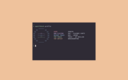 | [***spotifetch***](apps/spotifetch.md) | *A simple and beautiful CLI fetch tool for spotify, now rusty.*..[ *read more* ](apps/spotifetch.md)*!* | [*blob*](https://github.com/ivan-hc/AM/blob/main/programs/x86_64/spotifetch) **/** [*raw*](https://raw.githubusercontent.com/ivan-hc/AM/main/programs/x86_64/spotifetch) |
| 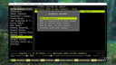 | [***spotify-dl***](apps/spotify-dl.md) | *A command-line utility to download songs and playlists directly from Spotify's servers.*..[ *read more* ](apps/spotify-dl.md)*!* | [*blob*](https://github.com/ivan-hc/AM/blob/main/programs/x86_64/spotify-dl) **/** [*raw*](https://raw.githubusercontent.com/ivan-hc/AM/main/programs/x86_64/spotify-dl) |
|  | [***spotify-player***](apps/spotify-player.md) | *A Spotify player in the terminal with full feature parity.*..[ *read more* ](apps/spotify-player.md)*!* | [*blob*](https://github.com/ivan-hc/AM/blob/main/programs/x86_64/spotify-player) **/** [*raw*](https://raw.githubusercontent.com/ivan-hc/AM/main/programs/x86_64/spotify-player) |
|  | [***spotify-tui***](apps/spotify-tui.md) | *Spotify for the terminal written in Rust.*..[ *read more* ](apps/spotify-tui.md)*!* | [*blob*](https://github.com/ivan-hc/AM/blob/main/programs/x86_64/spotify-tui) **/** [*raw*](https://raw.githubusercontent.com/ivan-hc/AM/main/programs/x86_64/spotify-tui) |
|  | [***sptlrx***](apps/sptlrx.md) | *Synchronized lyrics in your terminal.*..[ *read more* ](apps/sptlrx.md)*!* | [*blob*](https://github.com/ivan-hc/AM/blob/main/programs/x86_64/sptlrx) **/** [*raw*](https://raw.githubusercontent.com/ivan-hc/AM/main/programs/x86_64/sptlrx) |
|  | [***station-maui***](apps/station-maui.md) | *Terminal emulator with quick functions support for touch.*..[ *read more* ](apps/station-maui.md)*!* | [*blob*](https://github.com/ivan-hc/AM/blob/main/programs/x86_64/station-maui) **/** [*raw*](https://raw.githubusercontent.com/ivan-hc/AM/main/programs/x86_64/station-maui) |
|  | [***strans***](apps/strans.md) | *A powerful command-line utility.*..[ *read more* ](apps/strans.md)*!* | [*blob*](https://github.com/ivan-hc/AM/blob/main/programs/x86_64/strans) **/** [*raw*](https://raw.githubusercontent.com/ivan-hc/AM/main/programs/x86_64/strans) |
|  | [***streamlink***](apps/streamlink.md) | *Command-line which pipes video streams from various services.*..[ *read more* ](apps/streamlink.md)*!* | [*blob*](https://github.com/ivan-hc/AM/blob/main/programs/x86_64/streamlink) **/** [*raw*](https://raw.githubusercontent.com/ivan-hc/AM/main/programs/x86_64/streamlink) |
|  | [***superfile***](apps/superfile.md) | *Pretty fancy and modern terminal file manager.*..[ *read more* ](apps/superfile.md)*!* | [*blob*](https://github.com/ivan-hc/AM/blob/main/programs/x86_64/superfile) **/** [*raw*](https://raw.githubusercontent.com/ivan-hc/AM/main/programs/x86_64/superfile) |
|  | [***swish***](apps/swish.md) | *Command Line Interface for Swisstransfer Infomaniak's free service.*..[ *read more* ](apps/swish.md)*!* | [*blob*](https://github.com/ivan-hc/AM/blob/main/programs/x86_64/swish) **/** [*raw*](https://raw.githubusercontent.com/ivan-hc/AM/main/programs/x86_64/swish) |
|  | [***switchshuttle***](apps/switchshuttle.md) | *Run predefined commands in various terminal applications.*..[ *read more* ](apps/switchshuttle.md)*!* | [*blob*](https://github.com/ivan-hc/AM/blob/main/programs/x86_64/switchshuttle) **/** [*raw*](https://raw.githubusercontent.com/ivan-hc/AM/main/programs/x86_64/switchshuttle) |
|  | [***sysz***](apps/sysz.md) | *An fzf terminal UI for systemctl.*..[ *read more* ](apps/sysz.md)*!* | [*blob*](https://github.com/ivan-hc/AM/blob/main/programs/x86_64/sysz) **/** [*raw*](https://raw.githubusercontent.com/ivan-hc/AM/main/programs/x86_64/sysz) |
|  | [***tabby***](apps/tabby.md) | *A terminal for a more modern age*..[ *read more* ](apps/tabby.md)*!* | [*blob*](https://github.com/ivan-hc/AM/blob/main/programs/x86_64/tabby) **/** [*raw*](https://raw.githubusercontent.com/ivan-hc/AM/main/programs/x86_64/tabby) |
|  | [***taskell***](apps/taskell.md) | *Command-line Kanban board/task manager with support for Trello boards and GitHub projects.*..[ *read more* ](apps/taskell.md)*!* | [*blob*](https://github.com/ivan-hc/AM/blob/main/programs/x86_64/taskell) **/** [*raw*](https://raw.githubusercontent.com/ivan-hc/AM/main/programs/x86_64/taskell) |
|  | [***tb***](apps/tb.md) | *Tasks, boards & notes for the command-line habitat.*..[ *read more* ](apps/tb.md)*!* | [*blob*](https://github.com/ivan-hc/AM/blob/main/programs/x86_64/tb) **/** [*raw*](https://raw.githubusercontent.com/ivan-hc/AM/main/programs/x86_64/tb) |
|  | [***tere***](apps/tere.md) | *Terminal file explorer.*..[ *read more* ](apps/tere.md)*!* | [*blob*](https://github.com/ivan-hc/AM/blob/main/programs/x86_64/tere) **/** [*raw*](https://raw.githubusercontent.com/ivan-hc/AM/main/programs/x86_64/tere) |
|  | [***terminalos-sim***](apps/terminalos-sim.md) | *A terminalOS simulator.*..[ *read more* ](apps/terminalos-sim.md)*!* | [*blob*](https://github.com/ivan-hc/AM/blob/main/programs/x86_64/terminalos-sim) **/** [*raw*](https://raw.githubusercontent.com/ivan-hc/AM/main/programs/x86_64/terminalos-sim) |
|  | [***termshot***](apps/termshot.md) | *Creates screenshots based on terminal command output.*..[ *read more* ](apps/termshot.md)*!* | [*blob*](https://github.com/ivan-hc/AM/blob/main/programs/x86_64/termshot) **/** [*raw*](https://raw.githubusercontent.com/ivan-hc/AM/main/programs/x86_64/termshot) |
|  | [***tess***](apps/tess.md) | *A hackable, simple, rapid and beautiful terminal.*..[ *read more* ](apps/tess.md)*!* | [*blob*](https://github.com/ivan-hc/AM/blob/main/programs/x86_64/tess) **/** [*raw*](https://raw.githubusercontent.com/ivan-hc/AM/main/programs/x86_64/tess) |
|  | [***textnote***](apps/textnote.md) | *Simple tool for creating and organizing daily notes on the command line.*..[ *read more* ](apps/textnote.md)*!* | [*blob*](https://github.com/ivan-hc/AM/blob/main/programs/x86_64/textnote) **/** [*raw*](https://raw.githubusercontent.com/ivan-hc/AM/main/programs/x86_64/textnote) |
|  | [***tgpt***](apps/tgpt.md) | *AI Chatbots in terminal without needing API keys.*..[ *read more* ](apps/tgpt.md)*!* | [*blob*](https://github.com/ivan-hc/AM/blob/main/programs/x86_64/tgpt) **/** [*raw*](https://raw.githubusercontent.com/ivan-hc/AM/main/programs/x86_64/tgpt) |
|  | [***the-way***](apps/the-way.md) | *A code snippets manager for your terminal.*..[ *read more* ](apps/the-way.md)*!* | [*blob*](https://github.com/ivan-hc/AM/blob/main/programs/x86_64/the-way) **/** [*raw*](https://raw.githubusercontent.com/ivan-hc/AM/main/programs/x86_64/the-way) |
|  | [***ticker***](apps/ticker.md) | *Terminal stock ticker with live updates and position tracking.*..[ *read more* ](apps/ticker.md)*!* | [*blob*](https://github.com/ivan-hc/AM/blob/main/programs/x86_64/ticker) **/** [*raw*](https://raw.githubusercontent.com/ivan-hc/AM/main/programs/x86_64/ticker) |
|  | [***tlock***](apps/tlock.md) | *Two-Factor Authentication Tokens Manager in Terminal.*..[ *read more* ](apps/tlock.md)*!* | [*blob*](https://github.com/ivan-hc/AM/blob/main/programs/x86_64/tlock) **/** [*raw*](https://raw.githubusercontent.com/ivan-hc/AM/main/programs/x86_64/tlock) |
|  | [***tmon***](apps/tmon.md) | *A simple CLI tool for monitoring/reporting CPU temperatures.*..[ *read more* ](apps/tmon.md)*!* | [*blob*](https://github.com/ivan-hc/AM/blob/main/programs/x86_64/tmon) **/** [*raw*](https://raw.githubusercontent.com/ivan-hc/AM/main/programs/x86_64/tmon) |
|  | [***tod***](apps/tod.md) | *An unofficial Todoist command line client written in Rust.*..[ *read more* ](apps/tod.md)*!* | [*blob*](https://github.com/ivan-hc/AM/blob/main/programs/x86_64/tod) **/** [*raw*](https://raw.githubusercontent.com/ivan-hc/AM/main/programs/x86_64/tod) |
|  | [***todo-bash***](apps/todo-bash.md) | *  Todo list for the Bash command line.*..[ *read more* ](apps/todo-bash.md)*!* | [*blob*](https://github.com/ivan-hc/AM/blob/main/programs/x86_64/todo-bash) **/** [*raw*](https://raw.githubusercontent.com/ivan-hc/AM/main/programs/x86_64/todo-bash) |
|  | [***torrenttools***](apps/torrenttools.md) | *Cli tool to inspect/create/edit BitTorrent metafiles.*..[ *read more* ](apps/torrenttools.md)*!* | [*blob*](https://github.com/ivan-hc/AM/blob/main/programs/x86_64/torrenttools) **/** [*raw*](https://raw.githubusercontent.com/ivan-hc/AM/main/programs/x86_64/torrenttools) |
|  | [***toru***](apps/toru.md) | *Bittorrent streaming CLI tool. Stream anime torrents real-time.*..[ *read more* ](apps/toru.md)*!* | [*blob*](https://github.com/ivan-hc/AM/blob/main/programs/x86_64/toru) **/** [*raw*](https://raw.githubusercontent.com/ivan-hc/AM/main/programs/x86_64/toru) |
|  | [***trans***](apps/trans.md) | *CLI translator using Google/Bing/Yandex Translate, etc...*..[ *read more* ](apps/trans.md)*!* | [*blob*](https://github.com/ivan-hc/AM/blob/main/programs/x86_64/trans) **/** [*raw*](https://raw.githubusercontent.com/ivan-hc/AM/main/programs/x86_64/trans) |
|  | [***ttyper***](apps/ttyper.md) | *Terminal-based typing test.*..[ *read more* ](apps/ttyper.md)*!* | [*blob*](https://github.com/ivan-hc/AM/blob/main/programs/x86_64/ttyper) **/** [*raw*](https://raw.githubusercontent.com/ivan-hc/AM/main/programs/x86_64/ttyper) |
|  | [***tuxplorer***](apps/tuxplorer.md) | *Tuxplorer is a terminal based file explorer.*..[ *read more* ](apps/tuxplorer.md)*!* | [*blob*](https://github.com/ivan-hc/AM/blob/main/programs/x86_64/tuxplorer) **/** [*raw*](https://raw.githubusercontent.com/ivan-hc/AM/main/programs/x86_64/tuxplorer) |
|  | [***typioca***](apps/typioca.md) | *Cozy typing speed tester in terminal.*..[ *read more* ](apps/typioca.md)*!* | [*blob*](https://github.com/ivan-hc/AM/blob/main/programs/x86_64/typioca) **/** [*raw*](https://raw.githubusercontent.com/ivan-hc/AM/main/programs/x86_64/typioca) |
|  | [***upterm***](apps/upterm.md) | *A terminal emulator for the 21st century.*..[ *read more* ](apps/upterm.md)*!* | [*blob*](https://github.com/ivan-hc/AM/blob/main/programs/x86_64/upterm) **/** [*raw*](https://raw.githubusercontent.com/ivan-hc/AM/main/programs/x86_64/upterm) |
|  | [***vhs***](apps/vhs.md) | *Your CLI home video recorder.*..[ *read more* ](apps/vhs.md)*!* | [*blob*](https://github.com/ivan-hc/AM/blob/main/programs/x86_64/vhs) **/** [*raw*](https://raw.githubusercontent.com/ivan-hc/AM/main/programs/x86_64/vhs) |
|  | [***viddy***](apps/viddy.md) | *A modern watch command line utility. Time machine and pager etc.*..[ *read more* ](apps/viddy.md)*!* | [*blob*](https://github.com/ivan-hc/AM/blob/main/programs/x86_64/viddy) **/** [*raw*](https://raw.githubusercontent.com/ivan-hc/AM/main/programs/x86_64/viddy) |
|  | [***vimeo-dl***](apps/vimeo-dl.md) | *A cli tool to download private videos on vimeo. Written in golang.*..[ *read more* ](apps/vimeo-dl.md)*!* | [*blob*](https://github.com/ivan-hc/AM/blob/main/programs/x86_64/vimeo-dl) **/** [*raw*](https://raw.githubusercontent.com/ivan-hc/AM/main/programs/x86_64/vimeo-dl) |
|  | [***viu***](apps/viu.md) | *Terminal image viewer with native support for iTerm and Kitty.*..[ *read more* ](apps/viu.md)*!* | [*blob*](https://github.com/ivan-hc/AM/blob/main/programs/x86_64/viu) **/** [*raw*](https://raw.githubusercontent.com/ivan-hc/AM/main/programs/x86_64/viu) |
|  | [***vterm***](apps/vterm.md) | *Extensible terminal emulator.*..[ *read more* ](apps/vterm.md)*!* | [*blob*](https://github.com/ivan-hc/AM/blob/main/programs/x86_64/vterm) **/** [*raw*](https://raw.githubusercontent.com/ivan-hc/AM/main/programs/x86_64/vterm) |
|  | [***vt***](apps/vt.md) | *VirusTotal Command Line Interface.*..[ *read more* ](apps/vt.md)*!* | [*blob*](https://github.com/ivan-hc/AM/blob/main/programs/x86_64/vt) **/** [*raw*](https://raw.githubusercontent.com/ivan-hc/AM/main/programs/x86_64/vt) |
|  | [***walk***](apps/walk.md) | *Terminal file manager.*..[ *read more* ](apps/walk.md)*!* | [*blob*](https://github.com/ivan-hc/AM/blob/main/programs/x86_64/walk) **/** [*raw*](https://raw.githubusercontent.com/ivan-hc/AM/main/programs/x86_64/walk) |
|  | [***warp-terminal***](apps/warp-terminal.md) | *Terminal reimagined with AI and collaborative tools.*..[ *read more* ](apps/warp-terminal.md)*!* | [*blob*](https://github.com/ivan-hc/AM/blob/main/programs/x86_64/warp-terminal) **/** [*raw*](https://raw.githubusercontent.com/ivan-hc/AM/main/programs/x86_64/warp-terminal) |
| 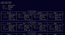 | [***wethr***](apps/wethr.md) | *Command line weather tool.*..[ *read more* ](apps/wethr.md)*!* | [*blob*](https://github.com/ivan-hc/AM/blob/main/programs/x86_64/wethr) **/** [*raw*](https://raw.githubusercontent.com/ivan-hc/AM/main/programs/x86_64/wethr) |
|  | [***wezterm***](apps/wezterm.md) | *A GPU-accelerated terminal emulator and multiplexer.*..[ *read more* ](apps/wezterm.md)*!* | [*blob*](https://github.com/ivan-hc/AM/blob/main/programs/x86_64/wezterm) **/** [*raw*](https://raw.githubusercontent.com/ivan-hc/AM/main/programs/x86_64/wezterm) |
|  | [***wives***](apps/wives.md) | *A beautiful, modern & feature-rich Terminal Emulator.*..[ *read more* ](apps/wives.md)*!* | [*blob*](https://github.com/ivan-hc/AM/blob/main/programs/x86_64/wives) **/** [*raw*](https://raw.githubusercontent.com/ivan-hc/AM/main/programs/x86_64/wives) |
|  | [***wkp***](apps/wkp.md) | *A CLI tool designed to fetch Wikipedia excerpts written in Rust.*..[ *read more* ](apps/wkp.md)*!* | [*blob*](https://github.com/ivan-hc/AM/blob/main/programs/x86_64/wkp) **/** [*raw*](https://raw.githubusercontent.com/ivan-hc/AM/main/programs/x86_64/wkp) |
|  | [***wtfutil***](apps/wtfutil.md) | *The personal information dashboard for your terminal.*..[ *read more* ](apps/wtfutil.md)*!* | [*blob*](https://github.com/ivan-hc/AM/blob/main/programs/x86_64/wtfutil) **/** [*raw*](https://raw.githubusercontent.com/ivan-hc/AM/main/programs/x86_64/wtfutil) |
|  | [***wthrr***](apps/wthrr.md) | *Weather companion for the terminal.*..[ *read more* ](apps/wthrr.md)*!* | [*blob*](https://github.com/ivan-hc/AM/blob/main/programs/x86_64/wthrr) **/** [*raw*](https://raw.githubusercontent.com/ivan-hc/AM/main/programs/x86_64/wthrr) |
|  | [***xxh***](apps/xxh.md) | *Bring your favorite shell wherever you go through the ssh.*..[ *read more* ](apps/xxh.md)*!* | [*blob*](https://github.com/ivan-hc/AM/blob/main/programs/x86_64/xxh) **/** [*raw*](https://raw.githubusercontent.com/ivan-hc/AM/main/programs/x86_64/xxh) |
| 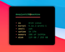 | [***yaf***](apps/yaf.md) | *Yet another system CLI fetch that is minimal and customizable.*..[ *read more* ](apps/yaf.md)*!* | [*blob*](https://github.com/ivan-hc/AM/blob/main/programs/x86_64/yaf) **/** [*raw*](https://raw.githubusercontent.com/ivan-hc/AM/main/programs/x86_64/yaf) |
|  | [***yazi***](apps/yazi.md) | *Blazing fast terminal file manager written in Rust.*..[ *read more* ](apps/yazi.md)*!* | [*blob*](https://github.com/ivan-hc/AM/blob/main/programs/x86_64/yazi) **/** [*raw*](https://raw.githubusercontent.com/ivan-hc/AM/main/programs/x86_64/yazi) |
|  | [***youtube-download***](apps/youtube-download.md) | *GUI and CLI for downloading YouTube video/audio.*..[ *read more* ](apps/youtube-download.md)*!* | [*blob*](https://github.com/ivan-hc/AM/blob/main/programs/x86_64/youtube-download) **/** [*raw*](https://raw.githubusercontent.com/ivan-hc/AM/main/programs/x86_64/youtube-download) |
|  | [***youtube-tui***](apps/youtube-tui.md) | *An aesthetically pleasing YouTube TUI CLI written in Rust.*..[ *read more* ](apps/youtube-tui.md)*!* | [*blob*](https://github.com/ivan-hc/AM/blob/main/programs/x86_64/youtube-tui) **/** [*raw*](https://raw.githubusercontent.com/ivan-hc/AM/main/programs/x86_64/youtube-tui) |
|  | [***yt-dlp***](apps/yt-dlp.md) | *A feature-rich command-line audio/video downloader.*..[ *read more* ](apps/yt-dlp.md)*!* | [*blob*](https://github.com/ivan-hc/AM/blob/main/programs/x86_64/yt-dlp) **/** [*raw*](https://raw.githubusercontent.com/ivan-hc/AM/main/programs/x86_64/yt-dlp) |
|  | [***ytermusic***](apps/ytermusic.md) | *An in terminal youtube music client with focus on privacy, simplicity and performance.*..[ *read more* ](apps/ytermusic.md)*!* | [*blob*](https://github.com/ivan-hc/AM/blob/main/programs/x86_64/ytermusic) **/** [*raw*](https://raw.githubusercontent.com/ivan-hc/AM/main/programs/x86_64/ytermusic) |
|  | [***zap***](apps/zap.md) | *Delightful command line AppImage package manager for appimage.github.io.*..[ *read more* ](apps/zap.md)*!* | [*blob*](https://github.com/ivan-hc/AM/blob/main/programs/x86_64/zap) **/** [*raw*](https://raw.githubusercontent.com/ivan-hc/AM/main/programs/x86_64/zap) |
|  | [***zellij***](apps/zellij.md) | *A terminal workspace with batteries included.*..[ *read more* ](apps/zellij.md)*!* | [*blob*](https://github.com/ivan-hc/AM/blob/main/programs/x86_64/zellij) **/** [*raw*](https://raw.githubusercontent.com/ivan-hc/AM/main/programs/x86_64/zellij) |
|  | [***zenity***](apps/zenity.md) | *Unofficial, A CLI utility that creates dialog boxes, GTK3 version.*..[ *read more* ](apps/zenity.md)*!* | [*blob*](https://github.com/ivan-hc/AM/blob/main/programs/x86_64/zenity) **/** [*raw*](https://raw.githubusercontent.com/ivan-hc/AM/main/programs/x86_64/zenity) |

---

You can improve these pages via a [pull request](https://github.com/Portable-Linux-Apps/Portable-Linux-Apps.github.io/pulls) 	to this site's [GitHub repository](https://github.com/Portable-Linux-Apps/Portable-Linux-Apps.github.io),  	or report any problems related to the installation scripts in the '[issue](https://github.com/ivan-hc/AM/issues)' 	section of the main database, at [https://github.com/ivan-hc/AM](https://github.com/ivan-hc/AM).

***PORTABLE-LINUX-APPS.github.io is my gift to the Linux community and was made with love for GNU/Linux and the Open Source philosophy.***

---

| [Back to Home](index.md) | [Back to Applications](apps.md)
| --- | --- |

--------

# Contacts
- **Ivan-HC** *on* [**GitHub**](https://github.com/ivan-hc)
- **AM-Ivan** *on* [**Reddit**](https://www.reddit.com/u/am-ivan)

###### *You can support me and my work on [**ko-fi.com**](https://ko-fi.com/IvanAlexHC) and 	[**PayPal.me**](https://paypal.me/IvanAlexHC). Thank you!*

--------

*© 2020-present Ivan Alessandro Sala aka 'Ivan-HC'* - I'm here just for fun!

