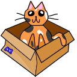
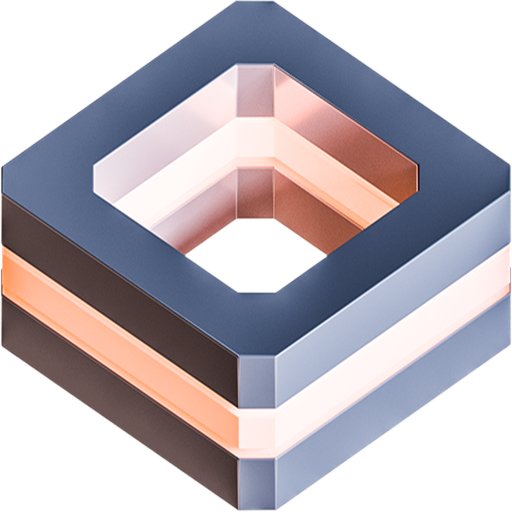

# COMMUNICATION

| [Back to Home](index.md) | [Back to Applications](apps.md)
| --- | --- |

#### Here are listed **86** programs for this category.

  <label for="app-search-input" style="font-weight: bold;">Search applications:</label>
  <input type="search" id="app-search-input" placeholder="Type a name or keyword..." autocomplete="off"
    style="width: 100%; max-width: 480px; padding: 0.5em 0.75em; margin-top: 0.25em; font-size: 1em; border: 1px solid #999; border-radius: 4px; box-sizing: border-box;">
  

#### *Categories*

  <a class="cat-pill" href="appimages.html">AppImages</a>
  •
  <a class="cat-pill" href="ai.html">ai</a>
  •
  <a class="cat-pill" href="am-utils.html">am-utils</a>
  •
  <a class="cat-pill" href="android.html">android</a>
  •
  <a class="cat-pill" href="appimage-on-the-fly.html">appimage-on-the-fly</a>
  •
  <a class="cat-pill" href="audio.html">audio</a>
  •
  <a class="cat-pill" href="comic.html">comic</a>
  •
  <a class="cat-pill" href="command-line.html">command-line</a>
  •
  <a class="cat-pill cat-pill--all" href="communication.html">communication</a>
  •
  <a class="cat-pill" href="disk.html">disk</a>
  •
  <a class="cat-pill" href="education.html">education</a>
  •
  <a class="cat-pill" href="emulator.html">emulator</a>
  •
  <a class="cat-pill" href="file-manager.html">file-manager</a>
  •
  <a class="cat-pill" href="finance.html">finance</a>
  •
  <a class="cat-pill" href="game.html">game</a>
  •
  <a class="cat-pill" href="gnome.html">gnome</a>
  •
  <a class="cat-pill" href="graphic.html">graphic</a>
  •
  <a class="cat-pill" href="internet.html">internet</a>
  •
  <a class="cat-pill" href="kde.html">kde</a>
  •
  <a class="cat-pill" href="metapackages.html">metapackages</a>
  •
  <a class="cat-pill" href="office.html">office</a>
  •
  <a class="cat-pill" href="password.html">password</a>
  •
  <a class="cat-pill" href="portable.html">Portable</a>
  •
  <a class="cat-pill" href="portable-cli.html">portable-cli</a>
  •
  <a class="cat-pill" href="portable-desktop.html">portable-desktop</a>
  •
  <a class="cat-pill" href="steam.html">steam</a>
  •
  <a class="cat-pill" href="system-monitor.html">system-monitor</a>
  •
  <a class="cat-pill" href="video.html">video</a>
  •
  <a class="cat-pill" href="virtual-machine.html">virtual-machine</a>
  •
  <a class="cat-pill" href="wallet.html">wallet</a>
  •
  <a class="cat-pill" href="web-app.html">web-app</a>
  •
  <a class="cat-pill" href="web-browser.html">web-browser</a>
  •
  <a class="cat-pill" href="wine.html">wine</a>
  •
  <a class="cat-pill" href="youtube.html">youtube</a>

-----------------

***NOTE, Installer scripts (blob/raw) are provided for reading only: do not run them manually! Use "[AM](https://github.com/ivan-hc/AM)" or "[AppMan](https://github.com/ivan-hc/AppMan)" instead.***

-----------------

| ICON | PACKAGE NAME | DESCRIPTION | INSTALLER |
| --- | --- | --- | --- |
|  | [***abaddon***](apps/abaddon.md) | *Unofficial, an alternative Discord client with voice support made with C++ and GTK 3.*..[ *read more* ](apps/abaddon.md)*!* | [*blob*](https://github.com/ivan-hc/AM/blob/main/programs/x86_64/abaddon) **/** [*raw*](https://raw.githubusercontent.com/ivan-hc/AM/main/programs/x86_64/abaddon) |
|  | [***altus***](apps/altus.md) | *Client for WhatsApp Web with themes & multiple account support.*..[ *read more* ](apps/altus.md)*!* | [*blob*](https://github.com/ivan-hc/AM/blob/main/programs/x86_64/altus) **/** [*raw*](https://raw.githubusercontent.com/ivan-hc/AM/main/programs/x86_64/altus) |
|  | [***armcord***](apps/armcord.md) | *Custom client designed to enhance your Discord experience.*..[ *read more* ](apps/armcord.md)*!* | [*blob*](https://github.com/ivan-hc/AM/blob/main/programs/x86_64/armcord) **/** [*raw*](https://raw.githubusercontent.com/ivan-hc/AM/main/programs/x86_64/armcord) |
|  | [***bastyon***](apps/bastyon.md) | *Decentralized social network based on the blockchain.*..[ *read more* ](apps/bastyon.md)*!* | [*blob*](https://github.com/ivan-hc/AM/blob/main/programs/x86_64/bastyon) **/** [*raw*](https://raw.githubusercontent.com/ivan-hc/AM/main/programs/x86_64/bastyon) |
|  | [***betterbird***](apps/betterbird.md) | *Unofficial, Betterbird is a fine-tuned version of Mozilla Thunderbird, a free and open-source email client.*..[ *read more* ](apps/betterbird.md)*!* | [*blob*](https://github.com/ivan-hc/AM/blob/main/programs/x86_64/betterbird) **/** [*raw*](https://raw.githubusercontent.com/ivan-hc/AM/main/programs/x86_64/betterbird) |
|  | [***botclient***](apps/botclient.md) | *A discord botclient built with Electron and React.*..[ *read more* ](apps/botclient.md)*!* | [*blob*](https://github.com/ivan-hc/AM/blob/main/programs/x86_64/botclient) **/** [*raw*](https://raw.githubusercontent.com/ivan-hc/AM/main/programs/x86_64/botclient) |
|  | [***bts-ce-lite***](apps/bts-ce-lite.md) | *Telecommunication network management application.*..[ *read more* ](apps/bts-ce-lite.md)*!* | [*blob*](https://github.com/ivan-hc/AM/blob/main/programs/x86_64/bts-ce-lite) **/** [*raw*](https://raw.githubusercontent.com/ivan-hc/AM/main/programs/x86_64/bts-ce-lite) |
|  | [***caprine***](apps/caprine.md) | *Unofficial, elegant privacy focused Facebook Messenger app.*..[ *read more* ](apps/caprine.md)*!* | [*blob*](https://github.com/ivan-hc/AM/blob/main/programs/x86_64/caprine) **/** [*raw*](https://raw.githubusercontent.com/ivan-hc/AM/main/programs/x86_64/caprine) |
|  | [***chatterino2***](apps/chatterino2.md) | *Second installment of the Twitch chat client.*..[ *read more* ](apps/chatterino2.md)*!* | [*blob*](https://github.com/ivan-hc/AM/blob/main/programs/x86_64/chatterino2) **/** [*raw*](https://raw.githubusercontent.com/ivan-hc/AM/main/programs/x86_64/chatterino2) |
|  | [***chatterino2-nightly***](apps/chatterino2-nightly.md) | *Second installment of the Twitch chat client.*..[ *read more* ](apps/chatterino2-nightly.md)*!* | [*blob*](https://github.com/ivan-hc/AM/blob/main/programs/x86_64/chatterino2-nightly) **/** [*raw*](https://raw.githubusercontent.com/ivan-hc/AM/main/programs/x86_64/chatterino2-nightly) |
|  | [***circle-z***](apps/circle-z.md) | *A chat client for online math courses.*..[ *read more* ](apps/circle-z.md)*!* | [*blob*](https://github.com/ivan-hc/AM/blob/main/programs/x86_64/circle-z) **/** [*raw*](https://raw.githubusercontent.com/ivan-hc/AM/main/programs/x86_64/circle-z) |
|  | [***datcord***](apps/datcord.md) | *Discord client.*..[ *read more* ](apps/datcord.md)*!* | [*blob*](https://github.com/ivan-hc/AM/blob/main/programs/x86_64/datcord) **/** [*raw*](https://raw.githubusercontent.com/ivan-hc/AM/main/programs/x86_64/datcord) |
|  | [***deskthing***](apps/deskthing.md) | *The Discord Thing, Trello Thing, The Weather Thing, The Macro Thing, just not The Car Thing anymore.*..[ *read more* ](apps/deskthing.md)*!* | [*blob*](https://github.com/ivan-hc/AM/blob/main/programs/x86_64/deskthing) **/** [*raw*](https://raw.githubusercontent.com/ivan-hc/AM/main/programs/x86_64/deskthing) |
|  | [***dinox***](apps/dinox.md) | *DinoX - Modern XMPP Chat Client with Video Calls, Voice Messages & OMEMO Encryption.*..[ *read more* ](apps/dinox.md)*!* | [*blob*](https://github.com/ivan-hc/AM/blob/main/programs/x86_64/dinox) **/** [*raw*](https://raw.githubusercontent.com/ivan-hc/AM/main/programs/x86_64/dinox) |
|  | [***discord***](apps/discord.md) | *Unofficial. All-in-one voice and text chat for gamers that's free, secure, and works on both your desktop and phone.*..[ *read more* ](apps/discord.md)*!* | [*blob*](https://github.com/ivan-hc/AM/blob/main/programs/x86_64/discord) **/** [*raw*](https://raw.githubusercontent.com/ivan-hc/AM/main/programs/x86_64/discord) |
|  | [***discord-bot-client***](apps/discord-bot-client.md) | *A patched version of discord, with bot login & Vencord support.*..[ *read more* ](apps/discord-bot-client.md)*!* | [*blob*](https://github.com/ivan-hc/AM/blob/main/programs/x86_64/discord-bot-client) **/** [*raw*](https://raw.githubusercontent.com/ivan-hc/AM/main/programs/x86_64/discord-bot-client) |
|  | [***discord-qt***](apps/discord-qt.md) | *Unofficial. Discord client powered by Node.JS and Qt Widgets.*..[ *read more* ](apps/discord-qt.md)*!* | [*blob*](https://github.com/ivan-hc/AM/blob/main/programs/x86_64/discord-qt) **/** [*raw*](https://raw.githubusercontent.com/ivan-hc/AM/main/programs/x86_64/discord-qt) |
|  | [***dissent***](apps/dissent.md) | *Tiny native Discord app.*..[ *read more* ](apps/dissent.md)*!* | [*blob*](https://github.com/ivan-hc/AM/blob/main/programs/x86_64/dissent) **/** [*raw*](https://raw.githubusercontent.com/ivan-hc/AM/main/programs/x86_64/dissent) |
|  | [***dorion***](apps/dorion.md) | *Tiny alternative Discord client with a smaller footprint, snappier startup, themes, plugins and more!*..[ *read more* ](apps/dorion.md)*!* | [*blob*](https://github.com/ivan-hc/AM/blob/main/programs/x86_64/dorion) **/** [*raw*](https://raw.githubusercontent.com/ivan-hc/AM/main/programs/x86_64/dorion) |
|  | [***elk***](apps/elk.md) | *Native version of Elk, a nimble Mastodon web.*..[ *read more* ](apps/elk.md)*!* | [*blob*](https://github.com/ivan-hc/AM/blob/main/programs/x86_64/elk) **/** [*raw*](https://raw.githubusercontent.com/ivan-hc/AM/main/programs/x86_64/elk) |
|  | [***equibop***](apps/equibop.md) | *Equibop is a custom Discord App aiming to give you better performance and improve linux support.*..[ *read more* ](apps/equibop.md)*!* | [*blob*](https://github.com/ivan-hc/AM/blob/main/programs/x86_64/equibop) **/** [*raw*](https://raw.githubusercontent.com/ivan-hc/AM/main/programs/x86_64/equibop) |
|  | [***fluffychat***](apps/fluffychat.md) | *The cutest instant messenger in the matrix.*..[ *read more* ](apps/fluffychat.md)*!* | [*blob*](https://github.com/ivan-hc/AM/blob/main/programs/x86_64/fluffychat) **/** [*raw*](https://raw.githubusercontent.com/ivan-hc/AM/main/programs/x86_64/fluffychat) |
|  | [***fluxer***](apps/fluxer.md) | *A free and open source instant messaging and VoIP platform built for friends, groups, and communities.*..[ *read more* ](apps/fluxer.md)*!* | [*blob*](https://github.com/ivan-hc/AM/blob/main/programs/x86_64/fluxer) **/** [*raw*](https://raw.githubusercontent.com/ivan-hc/AM/main/programs/x86_64/fluxer) |
|  | [***forkgram***](apps/forkgram.md) | *Fork of Telegram Desktop messaging app.*..[ *read more* ](apps/forkgram.md)*!* | [*blob*](https://github.com/ivan-hc/AM/blob/main/programs/x86_64/forkgram) **/** [*raw*](https://raw.githubusercontent.com/ivan-hc/AM/main/programs/x86_64/forkgram) |
|  | [***franz***](apps/franz.md) | *Messaging app for WhatsApp, Slack, Telegram, HipChat and much more.*..[ *read more* ](apps/franz.md)*!* | [*blob*](https://github.com/ivan-hc/AM/blob/main/programs/x86_64/franz) **/** [*raw*](https://raw.githubusercontent.com/ivan-hc/AM/main/programs/x86_64/franz) |
|  | [***goofcord***](apps/goofcord.md) | *Take control of your Discord experience with GoofCord.*..[ *read more* ](apps/goofcord.md)*!* | [*blob*](https://github.com/ivan-hc/AM/blob/main/programs/x86_64/goofcord) **/** [*raw*](https://raw.githubusercontent.com/ivan-hc/AM/main/programs/x86_64/goofcord) |
|  | [***hamsket***](apps/hamsket.md) | *Free and Open Source messaging and emailing app.*..[ *read more* ](apps/hamsket.md)*!* | [*blob*](https://github.com/ivan-hc/AM/blob/main/programs/x86_64/hamsket) **/** [*raw*](https://raw.githubusercontent.com/ivan-hc/AM/main/programs/x86_64/hamsket) |
|  | [***hermesmessenger***](apps/hermesmessenger.md) | *Desktop client version for Hermes Messenger.*..[ *read more* ](apps/hermesmessenger.md)*!* | [*blob*](https://github.com/ivan-hc/AM/blob/main/programs/x86_64/hermesmessenger) **/** [*raw*](https://raw.githubusercontent.com/ivan-hc/AM/main/programs/x86_64/hermesmessenger) |
|  | [***himalaya***](apps/himalaya.md) | *CLI to manage emails.*..[ *read more* ](apps/himalaya.md)*!* | [*blob*](https://github.com/ivan-hc/AM/blob/main/programs/x86_64/himalaya) **/** [*raw*](https://raw.githubusercontent.com/ivan-hc/AM/main/programs/x86_64/himalaya) |
|  | [***hyperspace***](apps/hyperspace.md) | *A fluffy client for Mastodon in React.*..[ *read more* ](apps/hyperspace.md)*!* | [*blob*](https://github.com/ivan-hc/AM/blob/main/programs/x86_64/hyperspace) **/** [*raw*](https://raw.githubusercontent.com/ivan-hc/AM/main/programs/x86_64/hyperspace) |
|  | [***jfcord***](apps/jfcord.md) | *An Jellyfin rich presence client for Discord.*..[ *read more* ](apps/jfcord.md)*!* | [*blob*](https://github.com/ivan-hc/AM/blob/main/programs/x86_64/jfcord) **/** [*raw*](https://raw.githubusercontent.com/ivan-hc/AM/main/programs/x86_64/jfcord) |
|  | [***legcord***](apps/legcord.md) | *Legcord is a custom client designed to enhance your Discord experience while keeping everything lightweight.*..[ *read more* ](apps/legcord.md)*!* | [*blob*](https://github.com/ivan-hc/AM/blob/main/programs/x86_64/legcord) **/** [*raw*](https://raw.githubusercontent.com/ivan-hc/AM/main/programs/x86_64/legcord) |
|  | [***mages***](apps/mages.md) | *Multiplatform Matrix chat client (experimental CMP+rust app).*..[ *read more* ](apps/mages.md)*!* | [*blob*](https://github.com/ivan-hc/AM/blob/main/programs/x86_64/mages) **/** [*raw*](https://raw.githubusercontent.com/ivan-hc/AM/main/programs/x86_64/mages) |
|  | [***mbcord***](apps/mbcord.md) | *An Emby/Jellyfin rich presence client for Discord.*..[ *read more* ](apps/mbcord.md)*!* | [*blob*](https://github.com/ivan-hc/AM/blob/main/programs/x86_64/mbcord) **/** [*raw*](https://raw.githubusercontent.com/ivan-hc/AM/main/programs/x86_64/mbcord) |
|  | [***mirage***](apps/mirage.md) | *Matrix chat client for encrypted and decentralized communication.*..[ *read more* ](apps/mirage.md)*!* | [*blob*](https://github.com/ivan-hc/AM/blob/main/programs/x86_64/mirage) **/** [*raw*](https://raw.githubusercontent.com/ivan-hc/AM/main/programs/x86_64/mirage) |
|  | [***overlayed***](apps/overlayed.md) | *A modern, open-source, and free voice chat overlay for Discord.*..[ *read more* ](apps/overlayed.md)*!* | [*blob*](https://github.com/ivan-hc/AM/blob/main/programs/x86_64/overlayed) **/** [*raw*](https://raw.githubusercontent.com/ivan-hc/AM/main/programs/x86_64/overlayed) |
|  | [***pop***](apps/pop.md) | *Send emails from your terminal.*..[ *read more* ](apps/pop.md)*!* | [*blob*](https://github.com/ivan-hc/AM/blob/main/programs/x86_64/pop) **/** [*raw*](https://raw.githubusercontent.com/ivan-hc/AM/main/programs/x86_64/pop) |
|  | [***qortal-ui***](apps/qortal-ui.md) | *Decentralize the world, data storage, communications.*..[ *read more* ](apps/qortal-ui.md)*!* | [*blob*](https://github.com/ivan-hc/AM/blob/main/programs/x86_64/qortal-ui) **/** [*raw*](https://raw.githubusercontent.com/ivan-hc/AM/main/programs/x86_64/qortal-ui) |
|  | [***qtox***](apps/qtox.md) | *Qt 5 based Tox instant messenger for secure communication.*..[ *read more* ](apps/qtox.md)*!* | [*blob*](https://github.com/ivan-hc/AM/blob/main/programs/x86_64/qtox) **/** [*raw*](https://raw.githubusercontent.com/ivan-hc/AM/main/programs/x86_64/qtox) |
|  | [***quiet***](apps/quiet.md) | *A private, p2p alternative to Slack and Discord built on Tor & IPFS*..[ *read more* ](apps/quiet.md)*!* | [*blob*](https://github.com/ivan-hc/AM/blob/main/programs/x86_64/quiet) **/** [*raw*](https://raw.githubusercontent.com/ivan-hc/AM/main/programs/x86_64/quiet) |
|  | [***rambox***](apps/rambox.md) | *Free and Open Source messaging and emailing app.*..[ *read more* ](apps/rambox.md)*!* | [*blob*](https://github.com/ivan-hc/AM/blob/main/programs/x86_64/rambox) **/** [*raw*](https://raw.githubusercontent.com/ivan-hc/AM/main/programs/x86_64/rambox) |
|  | [***ripcord***](apps/ripcord.md) | *Chat client for group-centric services like Slack and Discord.*..[ *read more* ](apps/ripcord.md)*!* | [*blob*](https://github.com/ivan-hc/AM/blob/main/programs/x86_64/ripcord) **/** [*raw*](https://raw.githubusercontent.com/ivan-hc/AM/main/programs/x86_64/ripcord) |
|  | [***robrix***](apps/robrix.md) | *A multi-platform Matrix chat client written in Rust, using the Makepad UI toolkit and the Robius app dev framework.*..[ *read more* ](apps/robrix.md)*!* | [*blob*](https://github.com/ivan-hc/AM/blob/main/programs/x86_64/robrix) **/** [*raw*](https://raw.githubusercontent.com/ivan-hc/AM/main/programs/x86_64/robrix) |
|  | [***root***](apps/root.md) | *Voice, video, and chat plus powerful apps that help your community organize, grow, and thrive. An alternative to Discord.*..[ *read more* ](apps/root.md)*!* | [*blob*](https://github.com/ivan-hc/AM/blob/main/programs/x86_64/root) **/** [*raw*](https://raw.githubusercontent.com/ivan-hc/AM/main/programs/x86_64/root) |
|  | [***sengi***](apps/sengi.md) | *A multi-account desktop client for Mastodon and Pleroma.*..[ *read more* ](apps/sengi.md)*!* | [*blob*](https://github.com/ivan-hc/AM/blob/main/programs/x86_64/sengi) **/** [*raw*](https://raw.githubusercontent.com/ivan-hc/AM/main/programs/x86_64/sengi) |
|  | [***session-desktop***](apps/session-desktop.md) | *Onion routing based messenger.*..[ *read more* ](apps/session-desktop.md)*!* | [*blob*](https://github.com/ivan-hc/AM/blob/main/programs/x86_64/session-desktop) **/** [*raw*](https://raw.githubusercontent.com/ivan-hc/AM/main/programs/x86_64/session-desktop) |
|  | [***signal***](apps/signal.md) | *Unofficial AppImage package for Signal (communication).*..[ *read more* ](apps/signal.md)*!* | [*blob*](https://github.com/ivan-hc/AM/blob/main/programs/x86_64/signal) **/** [*raw*](https://raw.githubusercontent.com/ivan-hc/AM/main/programs/x86_64/signal) |
|  | [***skype***](apps/skype.md) | *Unofficial. VoIP-based videoconferencing, voice calls and instant messaging app.*..[ *read more* ](apps/skype.md)*!* | [*blob*](https://github.com/ivan-hc/AM/blob/main/programs/x86_64/skype) **/** [*raw*](https://raw.githubusercontent.com/ivan-hc/AM/main/programs/x86_64/skype) |
|  | [***snapshot-slider***](apps/snapshot-slider.md) | *Present/print/email Snapshots of modern mathematics.*..[ *read more* ](apps/snapshot-slider.md)*!* | [*blob*](https://github.com/ivan-hc/AM/blob/main/programs/x86_64/snapshot-slider) **/** [*raw*](https://raw.githubusercontent.com/ivan-hc/AM/main/programs/x86_64/snapshot-slider) |
|  | [***socnetv***](apps/socnetv.md) | *Social Network Analysis and Visualization software.*..[ *read more* ](apps/socnetv.md)*!* | [*blob*](https://github.com/ivan-hc/AM/blob/main/programs/x86_64/socnetv) **/** [*raw*](https://raw.githubusercontent.com/ivan-hc/AM/main/programs/x86_64/socnetv) |
|  | [***soundcloud-rpc***](apps/soundcloud-rpc.md) | *A SoundCloud client with Discord Rich Presence and AdBlock.*..[ *read more* ](apps/soundcloud-rpc.md)*!* | [*blob*](https://github.com/ivan-hc/AM/blob/main/programs/x86_64/soundcloud-rpc) **/** [*raw*](https://raw.githubusercontent.com/ivan-hc/AM/main/programs/x86_64/soundcloud-rpc) |
|  | [***spacebar***](apps/spacebar.md) | *Themeable and extendable discord-compatible native Spacebar client.*..[ *read more* ](apps/spacebar.md)*!* | [*blob*](https://github.com/ivan-hc/AM/blob/main/programs/x86_64/spacebar) **/** [*raw*](https://raw.githubusercontent.com/ivan-hc/AM/main/programs/x86_64/spacebar) |
|  | [***spacebar-debug***](apps/spacebar-debug.md) | *Extendable discord-compatible native Spacebar client, debug.*..[ *read more* ](apps/spacebar-debug.md)*!* | [*blob*](https://github.com/ivan-hc/AM/blob/main/programs/x86_64/spacebar-debug) **/** [*raw*](https://raw.githubusercontent.com/ivan-hc/AM/main/programs/x86_64/spacebar-debug) |
|  | [***speek***](apps/speek.md) | *Privacy focused messenger.*..[ *read more* ](apps/speek.md)*!* | [*blob*](https://github.com/ivan-hc/AM/blob/main/programs/x86_64/speek) **/** [*raw*](https://raw.githubusercontent.com/ivan-hc/AM/main/programs/x86_64/speek) |
|  | [***steem-messenger***](apps/steem-messenger.md) | *Messer for Steem.*..[ *read more* ](apps/steem-messenger.md)*!* | [*blob*](https://github.com/ivan-hc/AM/blob/main/programs/x86_64/steem-messenger) **/** [*raw*](https://raw.githubusercontent.com/ivan-hc/AM/main/programs/x86_64/steem-messenger) |
|  | [***sup***](apps/sup.md) | *A Slack client with WhatsApp like UI.*..[ *read more* ](apps/sup.md)*!* | [*blob*](https://github.com/ivan-hc/AM/blob/main/programs/x86_64/sup) **/** [*raw*](https://raw.githubusercontent.com/ivan-hc/AM/main/programs/x86_64/sup) |
|  | [***tc***](apps/tc.md) | *A desktop chat client for Twitch.*..[ *read more* ](apps/tc.md)*!* | [*blob*](https://github.com/ivan-hc/AM/blob/main/programs/x86_64/tc) **/** [*raw*](https://raw.githubusercontent.com/ivan-hc/AM/main/programs/x86_64/tc) |
|  | [***tdlib-rs***](apps/tdlib-rs.md) | *Rust wrapper around the Telegram Database Library.*..[ *read more* ](apps/tdlib-rs.md)*!* | [*blob*](https://github.com/ivan-hc/AM/blob/main/programs/x86_64/tdlib-rs) **/** [*raw*](https://raw.githubusercontent.com/ivan-hc/AM/main/programs/x86_64/tdlib-rs) |
|  | [***teams***](apps/teams.md) | *Unofficial, Business communication platform developed by Microsoft.*..[ *read more* ](apps/teams.md)*!* | [*blob*](https://github.com/ivan-hc/AM/blob/main/programs/x86_64/teams) **/** [*raw*](https://raw.githubusercontent.com/ivan-hc/AM/main/programs/x86_64/teams) |
|  | [***teamviewer***](apps/teamviewer.md) | *Deliver remote IT support to your customers and colleagues, anytime, anywhere. Communication, network.*..[ *read more* ](apps/teamviewer.md)*!* | [*blob*](https://github.com/ivan-hc/AM/blob/main/programs/x86_64/teamviewer) **/** [*raw*](https://raw.githubusercontent.com/ivan-hc/AM/main/programs/x86_64/teamviewer) |
|  | [***teledrive***](apps/teledrive.md) | *Automatically backup Telegram Saved Messages.*..[ *read more* ](apps/teledrive.md)*!* | [*blob*](https://github.com/ivan-hc/AM/blob/main/programs/x86_64/teledrive) **/** [*raw*](https://raw.githubusercontent.com/ivan-hc/AM/main/programs/x86_64/teledrive) |
|  | [***telegram***](apps/telegram.md) | *Official desktop version of Telegram messaging app.*..[ *read more* ](apps/telegram.md)*!* | [*blob*](https://github.com/ivan-hc/AM/blob/main/programs/x86_64/telegram) **/** [*raw*](https://raw.githubusercontent.com/ivan-hc/AM/main/programs/x86_64/telegram) |
|  | [***thedesk***](apps/thedesk.md) | *Mastodon Client for PC.*..[ *read more* ](apps/thedesk.md)*!* | [*blob*](https://github.com/ivan-hc/AM/blob/main/programs/x86_64/thedesk) **/** [*raw*](https://raw.githubusercontent.com/ivan-hc/AM/main/programs/x86_64/thedesk) |
|  | [***thunderbird***](apps/thunderbird.md) | *Free and open source eMail client, Stable.*..[ *read more* ](apps/thunderbird.md)*!* | [*blob*](https://github.com/ivan-hc/AM/blob/main/programs/x86_64/thunderbird) **/** [*raw*](https://raw.githubusercontent.com/ivan-hc/AM/main/programs/x86_64/thunderbird) |
|  | [***thunderbird-beta***](apps/thunderbird-beta.md) | *Free and open source eMail client, Beta Edition.*..[ *read more* ](apps/thunderbird-beta.md)*!* | [*blob*](https://github.com/ivan-hc/AM/blob/main/programs/x86_64/thunderbird-beta) **/** [*raw*](https://raw.githubusercontent.com/ivan-hc/AM/main/programs/x86_64/thunderbird-beta) |
|  | [***thunderbird-nightly***](apps/thunderbird-nightly.md) | *Free and open source eMail client, Nightly Edition.*..[ *read more* ](apps/thunderbird-nightly.md)*!* | [*blob*](https://github.com/ivan-hc/AM/blob/main/programs/x86_64/thunderbird-nightly) **/** [*raw*](https://raw.githubusercontent.com/ivan-hc/AM/main/programs/x86_64/thunderbird-nightly) |
|  | [***tokodon***](apps/tokodon.md) | *Unofficial, a modern client for Mastodon and other decentralized servers that implement its API (such as Pixelfed).*..[ *read more* ](apps/tokodon.md)*!* | [*blob*](https://github.com/ivan-hc/AM/blob/main/programs/x86_64/tokodon) **/** [*raw*](https://raw.githubusercontent.com/ivan-hc/AM/main/programs/x86_64/tokodon) |
|  | [***tutanota***](apps/tutanota.md) | *Tuta is an email service with a strong focus on security and privacy that lets you encrypt emails, contacts and calendar entries on all your devices.*..[ *read more* ](apps/tutanota.md)*!* | [*blob*](https://github.com/ivan-hc/AM/blob/main/programs/x86_64/tutanota) **/** [*raw*](https://raw.githubusercontent.com/ivan-hc/AM/main/programs/x86_64/tutanota) |
|  | [***tutanota-enhanced***](apps/tutanota-enhanced.md) | *Unofficial AppImage for Tutanota, an email service with a strong focus on security and privacy that lets you encrypt emails, contacts and calendar entries on all your devices.*..[ *read more* ](apps/tutanota-enhanced.md)*!* | [*blob*](https://github.com/ivan-hc/AM/blob/main/programs/x86_64/tutanota-enhanced) **/** [*raw*](https://raw.githubusercontent.com/ivan-hc/AM/main/programs/x86_64/tutanota-enhanced) |
|  | [***vector***](apps/vector.md) | *Vector is a decentralized communication platform built on the Nostr Protocol.*..[ *read more* ](apps/vector.md)*!* | [*blob*](https://github.com/ivan-hc/AM/blob/main/programs/x86_64/vector) **/** [*raw*](https://raw.githubusercontent.com/ivan-hc/AM/main/programs/x86_64/vector) |
|  | [***vesktop***](apps/vesktop.md) | *Vesktop gives you the performance of web Discord.*..[ *read more* ](apps/vesktop.md)*!* | [*blob*](https://github.com/ivan-hc/AM/blob/main/programs/x86_64/vesktop) **/** [*raw*](https://raw.githubusercontent.com/ivan-hc/AM/main/programs/x86_64/vesktop) |
|  | [***viber***](apps/viber.md) | *Proprietary cross-platform IM and VoIP software.*..[ *read more* ](apps/viber.md)*!* | [*blob*](https://github.com/ivan-hc/AM/blob/main/programs/x86_64/viber) **/** [*raw*](https://raw.githubusercontent.com/ivan-hc/AM/main/programs/x86_64/viber) |
|  | [***viber-enhanced***](apps/viber-enhanced.md) | *Unofficial. Enhanced AppImage of proprietary cross-platform IM and VoIP software.*..[ *read more* ](apps/viber-enhanced.md)*!* | [*blob*](https://github.com/ivan-hc/AM/blob/main/programs/x86_64/viber-enhanced) **/** [*raw*](https://raw.githubusercontent.com/ivan-hc/AM/main/programs/x86_64/viber-enhanced) |
|  | [***walc***](apps/walc.md) | *WhatsApp Linux Client, Unofficial.*..[ *read more* ](apps/walc.md)*!* | [*blob*](https://github.com/ivan-hc/AM/blob/main/programs/x86_64/walc) **/** [*raw*](https://raw.githubusercontent.com/ivan-hc/AM/main/programs/x86_64/walc) |
|  | [***wasistlos***](apps/wasistlos.md) | *Unofficial, WhatsApp Linux Client, formerly known as "whatsapp-for-linux".*..[ *read more* ](apps/wasistlos.md)*!* | [*blob*](https://github.com/ivan-hc/AM/blob/main/programs/x86_64/wasistlos) **/** [*raw*](https://raw.githubusercontent.com/ivan-hc/AM/main/programs/x86_64/wasistlos) |
|  | [***wazo-desktop***](apps/wazo-desktop.md) | *Wazo desktop client for wazo VOIP server.*..[ *read more* ](apps/wazo-desktop.md)*!* | [*blob*](https://github.com/ivan-hc/AM/blob/main/programs/x86_64/wazo-desktop) **/** [*raw*](https://raw.githubusercontent.com/ivan-hc/AM/main/programs/x86_64/wazo-desktop) |
|  | [***webcord***](apps/webcord.md) | *A Discord and Fosscord client implemented without Discord API.*..[ *read more* ](apps/webcord.md)*!* | [*blob*](https://github.com/ivan-hc/AM/blob/main/programs/x86_64/webcord) **/** [*raw*](https://raw.githubusercontent.com/ivan-hc/AM/main/programs/x86_64/webcord) |
|  | [***webcord-enhanced***](apps/webcord-enhanced.md) | *Unofficial, A Discord and Fosscord client implemented without Discord API.*..[ *read more* ](apps/webcord-enhanced.md)*!* | [*blob*](https://github.com/ivan-hc/AM/blob/main/programs/x86_64/webcord-enhanced) **/** [*raw*](https://raw.githubusercontent.com/ivan-hc/AM/main/programs/x86_64/webcord-enhanced) |
|  | [***wewechat***](apps/wewechat.md) | *Unofficial WeChat client built with React, MobX and Electron.*..[ *read more* ](apps/wewechat.md)*!* | [*blob*](https://github.com/ivan-hc/AM/blob/main/programs/x86_64/wewechat) **/** [*raw*](https://raw.githubusercontent.com/ivan-hc/AM/main/programs/x86_64/wewechat) |
|  | [***whalebird***](apps/whalebird.md) | *An Electron based Mastodon client.*..[ *read more* ](apps/whalebird.md)*!* | [*blob*](https://github.com/ivan-hc/AM/blob/main/programs/x86_64/whalebird) **/** [*raw*](https://raw.githubusercontent.com/ivan-hc/AM/main/programs/x86_64/whalebird) |
|  | [***whatsdesk***](apps/whatsdesk.md) | *Unofficial, An unofficial client of WhatsApp.*..[ *read more* ](apps/whatsdesk.md)*!* | [*blob*](https://github.com/ivan-hc/AM/blob/main/programs/x86_64/whatsdesk) **/** [*raw*](https://raw.githubusercontent.com/ivan-hc/AM/main/programs/x86_64/whatsdesk) |
|  | [***whatsie***](apps/whatsie.md) | *Unofficial, feature rich WhatsApp web client based on Qt WebEngine.*..[ *read more* ](apps/whatsie.md)*!* | [*blob*](https://github.com/ivan-hc/AM/blob/main/programs/x86_64/whatsie) **/** [*raw*](https://raw.githubusercontent.com/ivan-hc/AM/main/programs/x86_64/whatsie) |
|  | [***whatstron***](apps/whatstron.md) | *Unofficial WhatsApp desktop client for Linux.*..[ *read more* ](apps/whatstron.md)*!* | [*blob*](https://github.com/ivan-hc/AM/blob/main/programs/x86_64/whatstron) **/** [*raw*](https://raw.githubusercontent.com/ivan-hc/AM/main/programs/x86_64/whatstron) |
|  | [***zapzap***](apps/zapzap.md) | *WhatsApp desktop application written in Pyqt6 + PyQt6-WebEngine.*..[ *read more* ](apps/zapzap.md)*!* | [*blob*](https://github.com/ivan-hc/AM/blob/main/programs/x86_64/zapzap) **/** [*raw*](https://raw.githubusercontent.com/ivan-hc/AM/main/programs/x86_64/zapzap) |
|  | [***zapzap-enhanced***](apps/zapzap-enhanced.md) | *Unofficial AppImage of ZapZap WhatsApp client.*..[ *read more* ](apps/zapzap-enhanced.md)*!* | [*blob*](https://github.com/ivan-hc/AM/blob/main/programs/x86_64/zapzap-enhanced) **/** [*raw*](https://raw.githubusercontent.com/ivan-hc/AM/main/programs/x86_64/zapzap-enhanced) |
|  | [***zoom***](apps/zoom.md) | *Unofficial. Video Conferencing and Web Conferencing Service.*..[ *read more* ](apps/zoom.md)*!* | [*blob*](https://github.com/ivan-hc/AM/blob/main/programs/x86_64/zoom) **/** [*raw*](https://raw.githubusercontent.com/ivan-hc/AM/main/programs/x86_64/zoom) |

---

You can improve these pages via a [pull request](https://github.com/Portable-Linux-Apps/Portable-Linux-Apps.github.io/pulls) to this site's [GitHub repository](https://github.com/Portable-Linux-Apps/Portable-Linux-Apps.github.io), or report any problems related to the installation scripts in the '[issue](https://github.com/ivan-hc/AM/issues)' section of the main database, at [https://github.com/ivan-hc/AM](https://github.com/ivan-hc/AM).

***PORTABLE-LINUX-APPS.github.io is my gift to the Linux community and was made with love for GNU/Linux and the Open Source philosophy.***

---

| [Back to Home](index.md) | [Back to Applications](apps.md)
| --- | --- |

--------

# Contacts
- **Ivan-HC** *on* [**GitHub**](https://github.com/ivan-hc)
- **AM-Ivan** *on* [**Reddit**](https://www.reddit.com/u/am-ivan)

###### *You can support me and my work on [**ko-fi.com**](https://ko-fi.com/IvanAlexHC) and [**PayPal.me**](https://paypal.me/IvanAlexHC). Thank you!*

--------

*© 2020-present Ivan Alessandro Sala aka 'Ivan-HC'* - I'm here just for fun!

