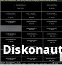
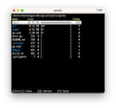

# DISK

| [Home](https://portable-linux-apps.github.io/) |
| --- |

#### Here are listed **18** programs and **3** items for this category and managed by [AM](https://github.com/ivan-hc/AM) 	and [AppMan](https://github.com/ivan-hc/AppMan) for the x86_64 architecture.

*Use your browser's built-in search tool to easily navigate to this page or use the tags below.*

| [Back to Applications](https://portable-linux-apps.github.io/apps.html) |
| --- |

#### *Categories*

***[AppImages](https://portable-linux-apps.github.io/appimages.html)*** 		 - ***[android](https://portable-linux-apps.github.io/android.html)*** - ***[audio](https://portable-linux-apps.github.io/audio.html)*** - ***[comic](https://portable-linux-apps.github.io/comic.html)*** - ***[command-line](https://portable-linux-apps.github.io/command-line.html)*** - ***[communication](https://portable-linux-apps.github.io/communication.html)*** - ***[disk](https://portable-linux-apps.github.io/disk.html)*** - ***[education](https://portable-linux-apps.github.io/education.html)*** - ***[file-manager](https://portable-linux-apps.github.io/file-manager.html)*** - ***[finance](https://portable-linux-apps.github.io/finance.html)*** - ***[game](https://portable-linux-apps.github.io/game.html)*** - ***[gnome](https://portable-linux-apps.github.io/gnome.html)*** - ***[graphic](https://portable-linux-apps.github.io/graphic.html)*** - ***[internet](https://portable-linux-apps.github.io/internet.html)*** - ***[kde](https://portable-linux-apps.github.io/kde.html)*** - ***[office](https://portable-linux-apps.github.io/office.html)*** - ***[password](https://portable-linux-apps.github.io/password.html)*** - ***[steam](https://portable-linux-apps.github.io/steam.html)*** - ***[system-monitor](https://portable-linux-apps.github.io/system-monitor.html)*** - ***[video](https://portable-linux-apps.github.io/video.html)*** - ***[web-app](https://portable-linux-apps.github.io/web-app.html)*** - ***[web-browser](https://portable-linux-apps.github.io/web-browser.html)*** - ***[wine](https://portable-linux-apps.github.io/wine.html)***

-----------------

*NOTE, the installer scripts in the "INSTALLER" column are intended for use via "AM", and are therefore dedicated to a system-wide 	installation of applications (in /opt), and all that "AppMan" does is convert those scripts for local installation, changing the paths. 	**They are listed here for reading purposes only**!*

*Should you decide to run them manually, the only way to remove the application is to run 	the command "`sudo /opt/appname/remove`", where "appname" is the name of the application directory containing the "remove" script. 	Likewise, you can also update applications by running the "AM-updater" script in the same directory.*

*The "AM" project allow the autonomy of installed apps, regardless of the presence of "AM" itself in the system. However, it is strongly 	recommended to use "AM" and "AppMan" to take full advantage of all the benefits you could get from an application installed in this way.*

-----------------

| ICON | PACKAGE NAME | DESCRIPTION | INSTALLER |
| --- | --- | --- | --- |
|  | [***baobab-gtk3***](apps/baobab-gtk3.md) | *Unofficial. Disk Usage Analyser, version 3.38, for all GNOME4+ haters.*..[ *read more* ](apps/baobab-gtk3.md)*!* | [*blob*](https://github.com/ivan-hc/AM/blob/main/programs/x86_64/baobab-gtk3) **/** [*raw*](https://raw.githubusercontent.com/ivan-hc/AM/main/programs/x86_64/baobab-gtk3) |
|  | [***diskonaut***](apps/diskonaut.md) | *Terminal disk space navigator.*..[ *read more* ](apps/diskonaut.md)*!* | [*blob*](https://github.com/ivan-hc/AM/blob/main/programs/x86_64/diskonaut) **/** [*raw*](https://raw.githubusercontent.com/ivan-hc/AM/main/programs/x86_64/diskonaut) |
|  | [***dua***](apps/dua.md) | *View disk space usage and delete unwanted data, fast.*..[ *read more* ](apps/dua.md)*!* | [*blob*](https://github.com/ivan-hc/AM/blob/main/programs/x86_64/dua) **/** [*raw*](https://raw.githubusercontent.com/ivan-hc/AM/main/programs/x86_64/dua) |
|  | [***duf***](apps/duf.md) | *Disk Usage/Free Utility, a better 'df' alternative.*..[ *read more* ](apps/duf.md)*!* | [*blob*](https://github.com/ivan-hc/AM/blob/main/programs/x86_64/duf) **/** [*raw*](https://raw.githubusercontent.com/ivan-hc/AM/main/programs/x86_64/duf) |
|  | [***etcher***](apps/etcher.md) | *Flash OS images to SD cards and USB drives, Balena Etcher.*..[ *read more* ](apps/etcher.md)*!* | [*blob*](https://github.com/ivan-hc/AM/blob/main/programs/x86_64/etcher) **/** [*raw*](https://raw.githubusercontent.com/ivan-hc/AM/main/programs/x86_64/etcher) |
|  | [***etcher-latest***](apps/etcher-latest.md) | *Flash OS images to SD cards and USB drives, Balena Etcher.*..[ *read more* ](apps/etcher-latest.md)*!* | [*blob*](https://github.com/ivan-hc/AM/blob/main/programs/x86_64/etcher-latest) **/** [*raw*](https://raw.githubusercontent.com/ivan-hc/AM/main/programs/x86_64/etcher-latest) |
|  | [***filelight***](apps/filelight.md) | *Unofficial. View disk usage information. This script installs the full "kdeutils" suite.*..[ *read more* ](apps/filelight.md)*!* | [*blob*](https://github.com/ivan-hc/AM/blob/main/programs/x86_64/filelight) **/** [*raw*](https://raw.githubusercontent.com/ivan-hc/AM/main/programs/x86_64/filelight) |
|  | [***gncdu***](apps/gncdu.md) | *Implements NCurses Disk Usage(ncdu) with golang.*..[ *read more* ](apps/gncdu.md)*!* | [*blob*](https://github.com/ivan-hc/AM/blob/main/programs/x86_64/gncdu) **/** [*raw*](https://raw.githubusercontent.com/ivan-hc/AM/main/programs/x86_64/gncdu) |
|  | [***isoimagewriter***](apps/isoimagewriter.md) | *Write an ISO Image to a USB Disk. This script installs the full "kdeutils" suite.*..[ *read more* ](apps/isoimagewriter.md)*!* | [*blob*](https://github.com/ivan-hc/AM/blob/main/programs/x86_64/isoimagewriter) **/** [*raw*](https://raw.githubusercontent.com/ivan-hc/AM/main/programs/x86_64/isoimagewriter) |
|  | [***itusb1-manager***](apps/itusb1-manager.md) | *Control the ITUSB1 USB Test Switch.*..[ *read more* ](apps/itusb1-manager.md)*!* | [*blob*](https://github.com/ivan-hc/AM/blob/main/programs/x86_64/itusb1-manager) **/** [*raw*](https://raw.githubusercontent.com/ivan-hc/AM/main/programs/x86_64/itusb1-manager) |
|  | [***kdf***](apps/kdf.md) | *Unofficial, view Disk Usage. This script installs the full "kdeutils" suite.*..[ *read more* ](apps/kdf.md)*!* | [*blob*](https://github.com/ivan-hc/AM/blob/main/programs/x86_64/kdf) **/** [*raw*](https://raw.githubusercontent.com/ivan-hc/AM/main/programs/x86_64/kdf) |
|  | [***kdiskmark***](apps/kdiskmark.md) | *A simple open-source disk benchmark tool for Linux distros.*..[ *read more* ](apps/kdiskmark.md)*!* | [*blob*](https://github.com/ivan-hc/AM/blob/main/programs/x86_64/kdiskmark) **/** [*raw*](https://raw.githubusercontent.com/ivan-hc/AM/main/programs/x86_64/kdiskmark) |
|  | [***liketaskmanager***](apps/liketaskmanager.md) | *Process/performances monitor, CPU, RAM, Disks and Network.*..[ *read more* ](apps/liketaskmanager.md)*!* | [*blob*](https://github.com/ivan-hc/AM/blob/main/programs/x86_64/liketaskmanager) **/** [*raw*](https://raw.githubusercontent.com/ivan-hc/AM/main/programs/x86_64/liketaskmanager) |
|  | [***mission-center***](apps/mission-center.md) | *Monitor your CPU, Memory, Disk, Network and GPU usage.*..[ *read more* ](apps/mission-center.md)*!* | [*blob*](https://github.com/ivan-hc/AM/blob/main/programs/x86_64/mission-center) **/** [*raw*](https://raw.githubusercontent.com/ivan-hc/AM/main/programs/x86_64/mission-center) |
|  | [***popsicle***](apps/popsicle.md) | *Multiple USB File Flasher.*..[ *read more* ](apps/popsicle.md)*!* | [*blob*](https://github.com/ivan-hc/AM/blob/main/programs/x86_64/popsicle) **/** [*raw*](https://raw.githubusercontent.com/ivan-hc/AM/main/programs/x86_64/popsicle) |
|  | [***squirrel-disk***](apps/squirrel-disk.md) | *Cross-Platform and Super Fast Disk Usage Analysis Tool.*..[ *read more* ](apps/squirrel-disk.md)*!* | [*blob*](https://github.com/ivan-hc/AM/blob/main/programs/x86_64/squirrel-disk) **/** [*raw*](https://raw.githubusercontent.com/ivan-hc/AM/main/programs/x86_64/squirrel-disk) |
|  | [***testdisk***](apps/testdisk.md) | *TestDisk & PhotoRec, tools to recover lost partitions and files.*..[ *read more* ](apps/testdisk.md)*!* | [*blob*](https://github.com/ivan-hc/AM/blob/main/programs/x86_64/testdisk) **/** [*raw*](https://raw.githubusercontent.com/ivan-hc/AM/main/programs/x86_64/testdisk) |
|  | [***unetbootin***](apps/unetbootin.md) | *Install Linux/BSD distributions to a partition or USB drive.*..[ *read more* ](apps/unetbootin.md)*!* | [*blob*](https://github.com/ivan-hc/AM/blob/main/programs/x86_64/unetbootin) **/** [*raw*](https://raw.githubusercontent.com/ivan-hc/AM/main/programs/x86_64/unetbootin) |
|  | [***ventoy***](apps/ventoy.md) | *Tool to create bootable USB drive for ISO/WIM/IMG/VHDx/EFI files.*..[ *read more* ](apps/ventoy.md)*!* | [*blob*](https://github.com/ivan-hc/AM/blob/main/programs/x86_64/ventoy) **/** [*raw*](https://raw.githubusercontent.com/ivan-hc/AM/main/programs/x86_64/ventoy) |
|  | [***windows2usb***](apps/windows2usb.md) | *Flash Drive burning utility, MBR/GPT, BIOS/UEFI, FAT32/NTFS.*..[ *read more* ](apps/windows2usb.md)*!* | [*blob*](https://github.com/ivan-hc/AM/blob/main/programs/x86_64/windows2usb) **/** [*raw*](https://raw.githubusercontent.com/ivan-hc/AM/main/programs/x86_64/windows2usb) |
|  | [***yubikey-manager***](apps/yubikey-manager.md) | *Configure your YubiKey over all USB transports.*..[ *read more* ](apps/yubikey-manager.md)*!* | [*blob*](https://github.com/ivan-hc/AM/blob/main/programs/x86_64/yubikey-manager) **/** [*raw*](https://raw.githubusercontent.com/ivan-hc/AM/main/programs/x86_64/yubikey-manager) |

---

You can improve these pages via a [pull request](https://github.com/Portable-Linux-Apps/Portable-Linux-Apps.github.io/pulls) 	to this site's [GitHub repository](https://github.com/Portable-Linux-Apps/Portable-Linux-Apps.github.io),  	or report any problems related to the installation scripts in the '[issue](https://github.com/ivan-hc/AM/issues)' 	section of the main database, at [https://github.com/ivan-hc/AM](https://github.com/ivan-hc/AM).

***PORTABLE-LINUX-APPS.github.io is my gift to the Linux community and was made with love for GNU/Linux and the Open Source philosophy.***

---

| [Back to Home](https://portable-linux-apps.github.io/) | [Back to Applications](https://portable-linux-apps.github.io/apps.html)
| --- | --- |

--------

# Contacts
- **Ivan-HC** *on* [**GitHub**](https://github.com/ivan-hc)
- **AM-Ivan** *on* [**Reddit**](https://www.reddit.com/u/am-ivan)

###### *You can support me and my work on [**ko-fi.com**](https://ko-fi.com/IvanAlexHC) and 	[**PayPal.me**](https://paypal.me/IvanAlexHC). Thank you!*

--------

*© 2020-present Ivan Alessandro Sala aka 'Ivan-HC'* - I'm here just for fun!

