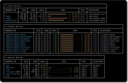
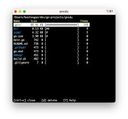

# DISK

| [Back to Home](index.md) | [Back to Applications](apps.md)
| --- | --- |

#### Here are listed **26** programs and **2** items for this category and managed by [AM](https://github.com/ivan-hc/AM) and [AppMan](https://github.com/ivan-hc/AppMan) for the x86_64 architecture.

  <label for="app-search-input" style="font-weight: bold;">Search applications:</label>
  <input type="search" id="app-search-input" placeholder="Type a name or keyword..." autocomplete="off"
    style="width: 100%; max-width: 480px; padding: 0.5em 0.75em; margin-top: 0.25em; font-size: 1em; border: 1px solid #999; border-radius: 4px; box-sizing: border-box;">
  

#### *Categories*

  <a class="cat-pill" href="appimages.html">AppImages</a>
  •
  <a class="cat-pill" href="am-utils.html">am-utils</a>
  •
  <a class="cat-pill" href="android.html">android</a>
  •
  <a class="cat-pill" href="audio.html">audio</a>
  •
  <a class="cat-pill" href="comic.html">comic</a>
  •
  <a class="cat-pill" href="command-line.html">command-line</a>
  •
  <a class="cat-pill" href="communication.html">communication</a>
  •
  <a class="cat-pill cat-pill--all" href="disk.html">disk</a>
  •
  <a class="cat-pill" href="education.html">education</a>
  •
  <a class="cat-pill" href="file-manager.html">file-manager</a>
  •
  <a class="cat-pill" href="finance.html">finance</a>
  •
  <a class="cat-pill" href="game.html">game</a>
  •
  <a class="cat-pill" href="gnome.html">gnome</a>
  •
  <a class="cat-pill" href="graphic.html">graphic</a>
  •
  <a class="cat-pill" href="internet.html">internet</a>
  •
  <a class="cat-pill" href="kde.html">kde</a>
  •
  <a class="cat-pill" href="office.html">office</a>
  •
  <a class="cat-pill" href="password.html">password</a>
  •
  <a class="cat-pill" href="steam.html">steam</a>
  •
  <a class="cat-pill" href="system-monitor.html">system-monitor</a>
  •
  <a class="cat-pill" href="video.html">video</a>
  •
  <a class="cat-pill" href="web-app.html">web-app</a>
  •
  <a class="cat-pill" href="web-browser.html">web-browser</a>
  •
  <a class="cat-pill" href="wine.html">wine</a>

-----------------

***NOTE, Installer scripts (blob/raw) are provided for reading only: do not run them manually! Use "[AM](https://github.com/ivan-hc/AM)" or "[AppMan](https://github.com/ivan-hc/AppMan)" instead.***

-----------------

| ICON | PACKAGE NAME | DESCRIPTION | INSTALLER |
| --- | --- | --- | --- |
|  | [***audiomoth-live-app***](apps/audiomoth-live-app.md) | *An Electron-based application for recording and analysing live audio from high sample rate microphones, including the AudioMoth USB Microphone.*..[ *read more* ](apps/audiomoth-live-app.md)*!* | [*blob*](https://github.com/ivan-hc/AM/blob/main/programs/x86_64/audiomoth-live-app) **/** [*raw*](https://raw.githubusercontent.com/ivan-hc/AM/main/programs/x86_64/audiomoth-live-app) |
|  | [***audiomoth-usb-microphone-app***](apps/audiomoth-usb-microphone-app.md) | *An Electron-based application capable of configuring the functionality of the AudioMoth-USB-Microphone firmware.*..[ *read more* ](apps/audiomoth-usb-microphone-app.md)*!* | [*blob*](https://github.com/ivan-hc/AM/blob/main/programs/x86_64/audiomoth-usb-microphone-app) **/** [*raw*](https://raw.githubusercontent.com/ivan-hc/AM/main/programs/x86_64/audiomoth-usb-microphone-app) |
|  | [***diskfmt***](apps/diskfmt.md) | *A disk formatting utility for linux that is similar to the windows format utility.*..[ *read more* ](apps/diskfmt.md)*!* | [*blob*](https://github.com/ivan-hc/AM/blob/main/programs/x86_64/diskfmt) **/** [*raw*](https://raw.githubusercontent.com/ivan-hc/AM/main/programs/x86_64/diskfmt) |
|  | [***diskonaut***](apps/diskonaut.md) | *Terminal disk space navigator.*..[ *read more* ](apps/diskonaut.md)*!* | [*blob*](https://github.com/ivan-hc/AM/blob/main/programs/x86_64/diskonaut) **/** [*raw*](https://raw.githubusercontent.com/ivan-hc/AM/main/programs/x86_64/diskonaut) |
|  | [***dua***](apps/dua.md) | *View disk space usage and delete unwanted data, fast.*..[ *read more* ](apps/dua.md)*!* | [*blob*](https://github.com/ivan-hc/AM/blob/main/programs/x86_64/dua) **/** [*raw*](https://raw.githubusercontent.com/ivan-hc/AM/main/programs/x86_64/dua) |
|  | [***duf***](apps/duf.md) | *Disk Usage/Free Utility, a better 'df' alternative.*..[ *read more* ](apps/duf.md)*!* | [*blob*](https://github.com/ivan-hc/AM/blob/main/programs/x86_64/duf) **/** [*raw*](https://raw.githubusercontent.com/ivan-hc/AM/main/programs/x86_64/duf) |
|  | [***etcher***](apps/etcher.md) | *Flash OS images to SD cards and USB drives, Balena Etcher.*..[ *read more* ](apps/etcher.md)*!* | [*blob*](https://github.com/ivan-hc/AM/blob/main/programs/x86_64/etcher) **/** [*raw*](https://raw.githubusercontent.com/ivan-hc/AM/main/programs/x86_64/etcher) |
|  | [***filelight***](apps/filelight.md) | *Unofficial. View disk usage information, by KDE.*..[ *read more* ](apps/filelight.md)*!* | [*blob*](https://github.com/ivan-hc/AM/blob/main/programs/x86_64/filelight) **/** [*raw*](https://raw.githubusercontent.com/ivan-hc/AM/main/programs/x86_64/filelight) |
|  | [***gncdu***](apps/gncdu.md) | *Implements NCurses Disk Usage(ncdu) with golang.*..[ *read more* ](apps/gncdu.md)*!* | [*blob*](https://github.com/ivan-hc/AM/blob/main/programs/x86_64/gncdu) **/** [*raw*](https://raw.githubusercontent.com/ivan-hc/AM/main/programs/x86_64/gncdu) |
|  | [***impression***](apps/impression.md) | *Unofficial. Simple USB image writer application.*..[ *read more* ](apps/impression.md)*!* | [*blob*](https://github.com/ivan-hc/AM/blob/main/programs/x86_64/impression) **/** [*raw*](https://raw.githubusercontent.com/ivan-hc/AM/main/programs/x86_64/impression) |
|  | [***isoimagewriter***](apps/isoimagewriter.md) | *Write an ISO Image to a USB Disk. This script installs the full "kdeutils" suite.*..[ *read more* ](apps/isoimagewriter.md)*!* | [*blob*](https://github.com/ivan-hc/AM/blob/main/programs/x86_64/isoimagewriter) **/** [*raw*](https://raw.githubusercontent.com/ivan-hc/AM/main/programs/x86_64/isoimagewriter) |
|  | [***itusb1-manager***](apps/itusb1-manager.md) | *Control the ITUSB1 USB Test Switch.*..[ *read more* ](apps/itusb1-manager.md)*!* | [*blob*](https://github.com/ivan-hc/AM/blob/main/programs/x86_64/itusb1-manager) **/** [*raw*](https://raw.githubusercontent.com/ivan-hc/AM/main/programs/x86_64/itusb1-manager) |
|  | [***kdf***](apps/kdf.md) | *Unofficial, view Disk Usage. This script installs the full "kdeutils" suite.*..[ *read more* ](apps/kdf.md)*!* | [*blob*](https://github.com/ivan-hc/AM/blob/main/programs/x86_64/kdf) **/** [*raw*](https://raw.githubusercontent.com/ivan-hc/AM/main/programs/x86_64/kdf) |
|  | [***kdiskmark***](apps/kdiskmark.md) | *A simple open-source disk benchmark tool for Linux distros.*..[ *read more* ](apps/kdiskmark.md)*!* | [*blob*](https://github.com/ivan-hc/AM/blob/main/programs/x86_64/kdiskmark) **/** [*raw*](https://raw.githubusercontent.com/ivan-hc/AM/main/programs/x86_64/kdiskmark) |
|  | [***liketaskmanager***](apps/liketaskmanager.md) | *Process/performances monitor, CPU, RAM, Disks and Network.*..[ *read more* ](apps/liketaskmanager.md)*!* | [*blob*](https://github.com/ivan-hc/AM/blob/main/programs/x86_64/liketaskmanager) **/** [*raw*](https://raw.githubusercontent.com/ivan-hc/AM/main/programs/x86_64/liketaskmanager) |
|  | [***mission-center***](apps/mission-center.md) | *Monitor your CPU, Memory, Disk, Network and GPU usage.*..[ *read more* ](apps/mission-center.md)*!* | [*blob*](https://github.com/ivan-hc/AM/blob/main/programs/x86_64/mission-center) **/** [*raw*](https://raw.githubusercontent.com/ivan-hc/AM/main/programs/x86_64/mission-center) |
|  | [***nanokvm-usb***](apps/nanokvm-usb.md) | *Finger-sized 4K USB KVM for Server/SBCs.*..[ *read more* ](apps/nanokvm-usb.md)*!* | [*blob*](https://github.com/ivan-hc/AM/blob/main/programs/x86_64/nanokvm-usb) **/** [*raw*](https://raw.githubusercontent.com/ivan-hc/AM/main/programs/x86_64/nanokvm-usb) |
|  | [***pika-backup***](apps/pika-backup.md) | *Doing backups the easy way. Plugin your USB drive and let the Pika do the rest for you.*..[ *read more* ](apps/pika-backup.md)*!* | [*blob*](https://github.com/ivan-hc/AM/blob/main/programs/x86_64/pika-backup) **/** [*raw*](https://raw.githubusercontent.com/ivan-hc/AM/main/programs/x86_64/pika-backup) |
|  | [***popsicle***](apps/popsicle.md) | *Multiple USB File Flasher.*..[ *read more* ](apps/popsicle.md)*!* | [*blob*](https://github.com/ivan-hc/AM/blob/main/programs/x86_64/popsicle) **/** [*raw*](https://raw.githubusercontent.com/ivan-hc/AM/main/programs/x86_64/popsicle) |
|  | [***qdiskinfo***](apps/qdiskinfo.md) | *QDiskInfo is a frontend for smartctl. It provides a user experience similar to CrystalDiskInfo.*..[ *read more* ](apps/qdiskinfo.md)*!* | [*blob*](https://github.com/ivan-hc/AM/blob/main/programs/x86_64/qdiskinfo) **/** [*raw*](https://raw.githubusercontent.com/ivan-hc/AM/main/programs/x86_64/qdiskinfo) |
|  | [***squirrel-disk***](apps/squirrel-disk.md) | *Cross-Platform and Super Fast Disk Usage Analysis Tool.*..[ *read more* ](apps/squirrel-disk.md)*!* | [*blob*](https://github.com/ivan-hc/AM/blob/main/programs/x86_64/squirrel-disk) **/** [*raw*](https://raw.githubusercontent.com/ivan-hc/AM/main/programs/x86_64/squirrel-disk) |
|  | [***testdisk***](apps/testdisk.md) | *TestDisk & PhotoRec, tools to recover lost partitions and files.*..[ *read more* ](apps/testdisk.md)*!* | [*blob*](https://github.com/ivan-hc/AM/blob/main/programs/x86_64/testdisk) **/** [*raw*](https://raw.githubusercontent.com/ivan-hc/AM/main/programs/x86_64/testdisk) |
|  | [***unetbootin***](apps/unetbootin.md) | *Install Linux/BSD distributions to a partition or USB drive.*..[ *read more* ](apps/unetbootin.md)*!* | [*blob*](https://github.com/ivan-hc/AM/blob/main/programs/x86_64/unetbootin) **/** [*raw*](https://raw.githubusercontent.com/ivan-hc/AM/main/programs/x86_64/unetbootin) |
|  | [***ventoy***](apps/ventoy.md) | *Tool to create bootable USB drive for ISO/WIM/IMG/VHDx/EFI files.*..[ *read more* ](apps/ventoy.md)*!* | [*blob*](https://github.com/ivan-hc/AM/blob/main/programs/x86_64/ventoy) **/** [*raw*](https://raw.githubusercontent.com/ivan-hc/AM/main/programs/x86_64/ventoy) |
|  | [***veracrypt***](apps/veracrypt.md) | *VeraCrypt is a free open source disk encryption software.*..[ *read more* ](apps/veracrypt.md)*!* | [*blob*](https://github.com/ivan-hc/AM/blob/main/programs/x86_64/veracrypt) **/** [*raw*](https://raw.githubusercontent.com/ivan-hc/AM/main/programs/x86_64/veracrypt) |
|  | [***windows2usb***](apps/windows2usb.md) | *Flash Drive burning utility, MBR/GPT, BIOS/UEFI, FAT32/NTFS.*..[ *read more* ](apps/windows2usb.md)*!* | [*blob*](https://github.com/ivan-hc/AM/blob/main/programs/x86_64/windows2usb) **/** [*raw*](https://raw.githubusercontent.com/ivan-hc/AM/main/programs/x86_64/windows2usb) |
|  | [***windusb-gui***](apps/windusb-gui.md) | *A modern, Rust-based graphical tool for creating bootable Windows USB installers on Linux.*..[ *read more* ](apps/windusb-gui.md)*!* | [*blob*](https://github.com/ivan-hc/AM/blob/main/programs/x86_64/windusb-gui) **/** [*raw*](https://raw.githubusercontent.com/ivan-hc/AM/main/programs/x86_64/windusb-gui) |
|  | [***yubikey-manager***](apps/yubikey-manager.md) | *Configure your YubiKey over all USB transports.*..[ *read more* ](apps/yubikey-manager.md)*!* | [*blob*](https://github.com/ivan-hc/AM/blob/main/programs/x86_64/yubikey-manager) **/** [*raw*](https://raw.githubusercontent.com/ivan-hc/AM/main/programs/x86_64/yubikey-manager) |

---

You can improve these pages via a [pull request](https://github.com/Portable-Linux-Apps/Portable-Linux-Apps.github.io/pulls) to this site's [GitHub repository](https://github.com/Portable-Linux-Apps/Portable-Linux-Apps.github.io), or report any problems related to the installation scripts in the '[issue](https://github.com/ivan-hc/AM/issues)' section of the main database, at [https://github.com/ivan-hc/AM](https://github.com/ivan-hc/AM).

***PORTABLE-LINUX-APPS.github.io is my gift to the Linux community and was made with love for GNU/Linux and the Open Source philosophy.***

---

| [Back to Home](index.md) | [Back to Applications](apps.md)
| --- | --- |

--------

# Contacts
- **Ivan-HC** *on* [**GitHub**](https://github.com/ivan-hc)
- **AM-Ivan** *on* [**Reddit**](https://www.reddit.com/u/am-ivan)

###### *You can support me and my work on [**ko-fi.com**](https://ko-fi.com/IvanAlexHC) and [**PayPal.me**](https://paypal.me/IvanAlexHC). Thank you!*

--------

*© 2020-present Ivan Alessandro Sala aka 'Ivan-HC'* - I'm here just for fun!

