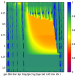
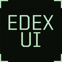
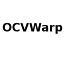
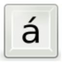

# EDUCATION

| [Back to Home](index.md) | [Back to Applications](apps.md)
| --- | --- |

#### Here are listed **85** programs and **2** items for this category.

  <label for="app-search-input" style="font-weight: bold;">Search applications:</label>
  <input type="search" id="app-search-input" placeholder="Type a name or keyword..." autocomplete="off"
    style="width: 100%; max-width: 480px; padding: 0.5em 0.75em; margin-top: 0.25em; font-size: 1em; border: 1px solid #999; border-radius: 4px; box-sizing: border-box;">
  

#### *Categories*

  <a class="cat-pill" href="appimages.html">AppImages</a>
  •
  <a class="cat-pill" href="ai.html">ai</a>
  •
  <a class="cat-pill" href="am-utils.html">am-utils</a>
  •
  <a class="cat-pill" href="appimage-on-the-fly.html">appimage-on-the-fly</a>
  •
  <a class="cat-pill" href="android.html">android</a>
  •
  <a class="cat-pill" href="audio.html">audio</a>
  •
  <a class="cat-pill" href="comic.html">comic</a>
  •
  <a class="cat-pill" href="command-line.html">command-line</a>
  •
  <a class="cat-pill" href="communication.html">communication</a>
  •
  <a class="cat-pill" href="disk.html">disk</a>
  •
  <a class="cat-pill cat-pill--all" href="education.html">education</a>
  •
  <a class="cat-pill" href="file-manager.html">file-manager</a>
  •
  <a class="cat-pill" href="finance.html">finance</a>
  •
  <a class="cat-pill" href="game.html">game</a>
  •
  <a class="cat-pill" href="gnome.html">gnome</a>
  •
  <a class="cat-pill" href="graphic.html">graphic</a>
  •
  <a class="cat-pill" href="internet.html">internet</a>
  •
  <a class="cat-pill" href="kde.html">kde</a>
  •
  <a class="cat-pill" href="metapackages.html">metapackages</a>
  •
  <a class="cat-pill" href="office.html">office</a>
  •
  <a class="cat-pill" href="password.html">password</a>
  •
  <a class="cat-pill" href="portable.html">Portable</a>
  •
  <a class="cat-pill" href="portable-cli.html">portable-cli</a>
  •
  <a class="cat-pill" href="portable-desktop.html">portable-desktop</a>
  •
  <a class="cat-pill" href="steam.html">steam</a>
  •
  <a class="cat-pill" href="system-monitor.html">system-monitor</a>
  •
  <a class="cat-pill" href="video.html">video</a>
  •
  <a class="cat-pill" href="web-app.html">web-app</a>
  •
  <a class="cat-pill" href="web-browser.html">web-browser</a>
  •
  <a class="cat-pill" href="wine.html">wine</a>

-----------------

***NOTE, Installer scripts (blob/raw) are provided for reading only: do not run them manually! Use "[AM](https://github.com/ivan-hc/AM)" or "[AppMan](https://github.com/ivan-hc/AppMan)" instead.***

-----------------

| ICON | PACKAGE NAME | DESCRIPTION | INSTALLER |
| --- | --- | --- | --- |
|  | [***alexandria***](apps/alexandria.md) | *eBook reader built with Tauri, Epub.js, and Typescript.*..[ *read more* ](apps/alexandria.md)*!* | [*blob*](https://github.com/ivan-hc/AM/blob/main/programs/x86_64/alexandria) **/** [*raw*](https://raw.githubusercontent.com/ivan-hc/AM/main/programs/x86_64/alexandria) |
|  | [***android-translation-layer***](apps/android-translation-layer.md) | *Unofficial, A translation layer that allows running Android apps on a Linux system.*..[ *read more* ](apps/android-translation-layer.md)*!* | [*blob*](https://github.com/ivan-hc/AM/blob/main/programs/x86_64/android-translation-layer) **/** [*raw*](https://raw.githubusercontent.com/ivan-hc/AM/main/programs/x86_64/android-translation-layer) |
|  | [***bibletime***](apps/bibletime.md) | *Unofficial, a Bible study application based on the Sword library and Qt toolkit.*..[ *read more* ](apps/bibletime.md)*!* | [*blob*](https://github.com/ivan-hc/AM/blob/main/programs/x86_64/bibletime) **/** [*raw*](https://raw.githubusercontent.com/ivan-hc/AM/main/programs/x86_64/bibletime) |
|  | [***book-manager***](apps/book-manager.md) | *Simple desktop app to manage personal library.*..[ *read more* ](apps/book-manager.md)*!* | [*blob*](https://github.com/ivan-hc/AM/blob/main/programs/x86_64/book-manager) **/** [*raw*](https://raw.githubusercontent.com/ivan-hc/AM/main/programs/x86_64/book-manager) |
|  | [***bookmarks-manager***](apps/bookmarks-manager.md) | *Edit bookmarks, check url.*..[ *read more* ](apps/bookmarks-manager.md)*!* | [*blob*](https://github.com/ivan-hc/AM/blob/main/programs/x86_64/bookmarks-manager) **/** [*raw*](https://raw.githubusercontent.com/ivan-hc/AM/main/programs/x86_64/bookmarks-manager) |
|  | [***brainverse***](apps/brainverse.md) | *Electronic Lab Notebook for Reproducible Neuro Imaging Research.*..[ *read more* ](apps/brainverse.md)*!* | [*blob*](https://github.com/ivan-hc/AM/blob/main/programs/x86_64/brainverse) **/** [*raw*](https://raw.githubusercontent.com/ivan-hc/AM/main/programs/x86_64/brainverse) |
|  | [***caprine***](apps/caprine.md) | *Unofficial, elegant privacy focused Facebook Messenger app.*..[ *read more* ](apps/caprine.md)*!* | [*blob*](https://github.com/ivan-hc/AM/blob/main/programs/x86_64/caprine) **/** [*raw*](https://raw.githubusercontent.com/ivan-hc/AM/main/programs/x86_64/caprine) |
|  | [***carta***](apps/carta.md) | *Cube Analysis and Rendering Tool for Astronomy.*..[ *read more* ](apps/carta.md)*!* | [*blob*](https://github.com/ivan-hc/AM/blob/main/programs/x86_64/carta) **/** [*raw*](https://raw.githubusercontent.com/ivan-hc/AM/main/programs/x86_64/carta) |
|  | [***celestia***](apps/celestia.md) | *Real time 3D space simulator.*..[ *read more* ](apps/celestia.md)*!* | [*blob*](https://github.com/ivan-hc/AM/blob/main/programs/x86_64/celestia) **/** [*raw*](https://raw.githubusercontent.com/ivan-hc/AM/main/programs/x86_64/celestia) |
|  | [***celestia-dev***](apps/celestia-dev.md) | *Real time 3D space simulator, developer edition.*..[ *read more* ](apps/celestia-dev.md)*!* | [*blob*](https://github.com/ivan-hc/AM/blob/main/programs/x86_64/celestia-dev) **/** [*raw*](https://raw.githubusercontent.com/ivan-hc/AM/main/programs/x86_64/celestia-dev) |
|  | [***celestia-enanched***](apps/celestia-enanched.md) | *Unofficial. Real-time 3D space simulator with extra detailed maps.*..[ *read more* ](apps/celestia-enanched.md)*!* | [*blob*](https://github.com/ivan-hc/AM/blob/main/programs/x86_64/celestia-enanched) **/** [*raw*](https://raw.githubusercontent.com/ivan-hc/AM/main/programs/x86_64/celestia-enanched) |
|  | [***codebook-lsp***](apps/codebook-lsp.md) | *Codebook, code-aware spell checker with language server implementation.*..[ *read more* ](apps/codebook-lsp.md)*!* | [*blob*](https://github.com/ivan-hc/AM/blob/main/programs/x86_64/codebook-lsp) **/** [*raw*](https://raw.githubusercontent.com/ivan-hc/AM/main/programs/x86_64/codebook-lsp) |
|  | [***copytranslator***](apps/copytranslator.md) | *Foreign language reading and translation assistant.*..[ *read more* ](apps/copytranslator.md)*!* | [*blob*](https://github.com/ivan-hc/AM/blob/main/programs/x86_64/copytranslator) **/** [*raw*](https://raw.githubusercontent.com/ivan-hc/AM/main/programs/x86_64/copytranslator) |
|  | [***corepins***](apps/corepins.md) | *A bookmarking app for CuboCore Application Suite.*..[ *read more* ](apps/corepins.md)*!* | [*blob*](https://github.com/ivan-hc/AM/blob/main/programs/x86_64/corepins) **/** [*raw*](https://raw.githubusercontent.com/ivan-hc/AM/main/programs/x86_64/corepins) |
|  | [***cosmonium***](apps/cosmonium.md) | *3D astronomy and space exploration program.*..[ *read more* ](apps/cosmonium.md)*!* | [*blob*](https://github.com/ivan-hc/AM/blob/main/programs/x86_64/cosmonium) **/** [*raw*](https://raw.githubusercontent.com/ivan-hc/AM/main/programs/x86_64/cosmonium) |
|  | [***criteria-geo***](apps/criteria-geo.md) | *A one-dimensional agro-hydrological model, GIS interface.*..[ *read more* ](apps/criteria-geo.md)*!* | [*blob*](https://github.com/ivan-hc/AM/blob/main/programs/x86_64/criteria-geo) **/** [*raw*](https://raw.githubusercontent.com/ivan-hc/AM/main/programs/x86_64/criteria-geo) |
|  | [***crow-translate***](apps/crow-translate.md) | *Translate and speak text using Google, Yandex, Bing and more.*..[ *read more* ](apps/crow-translate.md)*!* | [*blob*](https://github.com/ivan-hc/AM/blob/main/programs/x86_64/crow-translate) **/** [*raw*](https://raw.githubusercontent.com/ivan-hc/AM/main/programs/x86_64/crow-translate) |
|  | [***dana***](apps/dana.md) | *A desktop client for the Dana learning box.*..[ *read more* ](apps/dana.md)*!* | [*blob*](https://github.com/ivan-hc/AM/blob/main/programs/x86_64/dana) **/** [*raw*](https://raw.githubusercontent.com/ivan-hc/AM/main/programs/x86_64/dana) |
|  | [***deepl-linux-electron***](apps/deepl-linux-electron.md) | *DeepL Integration. Select & translate text in any app.*..[ *read more* ](apps/deepl-linux-electron.md)*!* | [*blob*](https://github.com/ivan-hc/AM/blob/main/programs/x86_64/deepl-linux-electron) **/** [*raw*](https://raw.githubusercontent.com/ivan-hc/AM/main/programs/x86_64/deepl-linux-electron) |
|  | [***dl-desktop***](apps/dl-desktop.md) | *Desktop client for the Duolingo language learning application.*..[ *read more* ](apps/dl-desktop.md)*!* | [*blob*](https://github.com/ivan-hc/AM/blob/main/programs/x86_64/dl-desktop) **/** [*raw*](https://raw.githubusercontent.com/ivan-hc/AM/main/programs/x86_64/dl-desktop) |
|  | [***edex-ui***](apps/edex-ui.md) | *A cross-platform, customizable science fiction terminal emulator.*..[ *read more* ](apps/edex-ui.md)*!* | [*blob*](https://github.com/ivan-hc/AM/blob/main/programs/x86_64/edex-ui) **/** [*raw*](https://raw.githubusercontent.com/ivan-hc/AM/main/programs/x86_64/edex-ui) |
|  | [***eduke32***](apps/eduke32.md) | *Unofficial, an advanced Duke Nukem 3D source port.*..[ *read more* ](apps/eduke32.md)*!* | [*blob*](https://github.com/ivan-hc/AM/blob/main/programs/x86_64/eduke32) **/** [*raw*](https://raw.githubusercontent.com/ivan-hc/AM/main/programs/x86_64/eduke32) |
|  | [***elements***](apps/elements.md) | *App which displays the periodic table, Education, Science.*..[ *read more* ](apps/elements.md)*!* | [*blob*](https://github.com/ivan-hc/AM/blob/main/programs/x86_64/elements) **/** [*raw*](https://raw.githubusercontent.com/ivan-hc/AM/main/programs/x86_64/elements) |
|  | [***esearch***](apps/esearch.md) | *Screenshot OCR search translate search for picture paste...*..[ *read more* ](apps/esearch.md)*!* | [*blob*](https://github.com/ivan-hc/AM/blob/main/programs/x86_64/esearch) **/** [*raw*](https://raw.githubusercontent.com/ivan-hc/AM/main/programs/x86_64/esearch) |
|  | [***exe***](apps/exe.md) | *A Elearning XHTML/HTML5 editor.*..[ *read more* ](apps/exe.md)*!* | [*blob*](https://github.com/ivan-hc/AM/blob/main/programs/x86_64/exe) **/** [*raw*](https://raw.githubusercontent.com/ivan-hc/AM/main/programs/x86_64/exe) |
|  | [***fbreader***](apps/fbreader.md) | *Your Favourite eBook Reader*..[ *read more* ](apps/fbreader.md)*!* | [*blob*](https://github.com/ivan-hc/AM/blob/main/programs/x86_64/fbreader) **/** [*raw*](https://raw.githubusercontent.com/ivan-hc/AM/main/programs/x86_64/fbreader) |
|  | [***focusatwill***](apps/focusatwill.md) | *Combines neuroscience and music to boost productivity.*..[ *read more* ](apps/focusatwill.md)*!* | [*blob*](https://github.com/ivan-hc/AM/blob/main/programs/x86_64/focusatwill) **/** [*raw*](https://raw.githubusercontent.com/ivan-hc/AM/main/programs/x86_64/focusatwill) |
|  | [***frappebooks***](apps/frappebooks.md) | *Book-keeping software for small-businesses and freelancers.*..[ *read more* ](apps/frappebooks.md)*!* | [*blob*](https://github.com/ivan-hc/AM/blob/main/programs/x86_64/frappebooks) **/** [*raw*](https://raw.githubusercontent.com/ivan-hc/AM/main/programs/x86_64/frappebooks) |
|  | [***gaiasky***](apps/gaiasky.md) | *Gaia Sky, a real-time 3D space simulator & astronomy visualisation.*..[ *read more* ](apps/gaiasky.md)*!* | [*blob*](https://github.com/ivan-hc/AM/blob/main/programs/x86_64/gaiasky) **/** [*raw*](https://raw.githubusercontent.com/ivan-hc/AM/main/programs/x86_64/gaiasky) |
|  | [***geofs***](apps/geofs.md) | *GeoFS flight sim as a desktop application.*..[ *read more* ](apps/geofs.md)*!* | [*blob*](https://github.com/ivan-hc/AM/blob/main/programs/x86_64/geofs) **/** [*raw*](https://raw.githubusercontent.com/ivan-hc/AM/main/programs/x86_64/geofs) |
|  | [***geometrize***](apps/geometrize.md) | *Images to shapes converter, graphics.*..[ *read more* ](apps/geometrize.md)*!* | [*blob*](https://github.com/ivan-hc/AM/blob/main/programs/x86_64/geometrize) **/** [*raw*](https://raw.githubusercontent.com/ivan-hc/AM/main/programs/x86_64/geometrize) |
|  | [***isle-editor***](apps/isle-editor.md) | *Editor for Integrated Statistics Learning Environment lessons.*..[ *read more* ](apps/isle-editor.md)*!* | [*blob*](https://github.com/ivan-hc/AM/blob/main/programs/x86_64/isle-editor) **/** [*raw*](https://raw.githubusercontent.com/ivan-hc/AM/main/programs/x86_64/isle-editor) |
|  | [***kalm***](apps/kdeutils.md) | *Teach you different breathing techniques. This is part of "kdeutils".*..[ *read more* ](apps/kdeutils.md)*!* | [*blob*](https://github.com/ivan-hc/AM/blob/main/programs/x86_64/kdeutils) **/** [*raw*](https://raw.githubusercontent.com/ivan-hc/AM/main/programs/x86_64/kdeutils) |
|  | [***keditbookmarks***](apps/kdeutils.md) | *Bookmarks editor. This is part of "kdeutils".*..[ *read more* ](apps/kdeutils.md)*!* | [*blob*](https://github.com/ivan-hc/AM/blob/main/programs/x86_64/kdeutils) **/** [*raw*](https://raw.githubusercontent.com/ivan-hc/AM/main/programs/x86_64/kdeutils) |
|  | [***keycombiner***](apps/keycombiner.md) | *Learn exactly the keyboard shortcuts you need.*..[ *read more* ](apps/keycombiner.md)*!* | [*blob*](https://github.com/ivan-hc/AM/blob/main/programs/x86_64/keycombiner) **/** [*raw*](https://raw.githubusercontent.com/ivan-hc/AM/main/programs/x86_64/keycombiner) |
|  | [***kindling-cli***](apps/kindling-cli.md) | *Kindle toolkit for dictionaries, books, comics.*..[ *read more* ](apps/kindling-cli.md)*!* | [*blob*](https://github.com/ivan-hc/AM/blob/main/programs/x86_64/kindling-cli) **/** [*raw*](https://raw.githubusercontent.com/ivan-hc/AM/main/programs/x86_64/kindling-cli) |
|  | [***kitsas***](apps/kitsas.md) | *Finnish bookkeeping software for small organizations.*..[ *read more* ](apps/kitsas.md)*!* | [*blob*](https://github.com/ivan-hc/AM/blob/main/programs/x86_64/kitsas) **/** [*raw*](https://raw.githubusercontent.com/ivan-hc/AM/main/programs/x86_64/kitsas) |
|  | [***kitupiikki***](apps/kitupiikki.md) | *Bookkeeping software for small organizations.*..[ *read more* ](apps/kitupiikki.md)*!* | [*blob*](https://github.com/ivan-hc/AM/blob/main/programs/x86_64/kitupiikki) **/** [*raw*](https://raw.githubusercontent.com/ivan-hc/AM/main/programs/x86_64/kitupiikki) |
|  | [***kmymoney***](apps/kmymoney.md) | *KMyMoney is a cross-platform personal finance manager build on KDE frameworks technologies for your desktop and notebook environment.*..[ *read more* ](apps/kmymoney.md)*!* | [*blob*](https://github.com/ivan-hc/AM/blob/main/programs/x86_64/kmymoney) **/** [*raw*](https://raw.githubusercontent.com/ivan-hc/AM/main/programs/x86_64/kmymoney) |
|  | [***koodo-reader***](apps/koodo-reader.md) | *Modern ebook manager and reader with sync & backup capacities.*..[ *read more* ](apps/koodo-reader.md)*!* | [*blob*](https://github.com/ivan-hc/AM/blob/main/programs/x86_64/koodo-reader) **/** [*raw*](https://raw.githubusercontent.com/ivan-hc/AM/main/programs/x86_64/koodo-reader) |
|  | [***lets-bend***](apps/lets-bend.md) | *Harmonica tuner for learning bending techniques with real-time visual feedback.*..[ *read more* ](apps/lets-bend.md)*!* | [*blob*](https://github.com/ivan-hc/AM/blob/main/programs/x86_64/lets-bend) **/** [*raw*](https://raw.githubusercontent.com/ivan-hc/AM/main/programs/x86_64/lets-bend) |
|  | [***lunatask***](apps/lunatask.md) | *All-in-one encrypted to-do list, notebook, habit and mood tracker.*..[ *read more* ](apps/lunatask.md)*!* | [*blob*](https://github.com/ivan-hc/AM/blob/main/programs/x86_64/lunatask) **/** [*raw*](https://raw.githubusercontent.com/ivan-hc/AM/main/programs/x86_64/lunatask) |
|  | [***mathcha-notebook***](apps/mathcha-notebook.md) | *Desktop version of Mathcha, built for your privacy.*..[ *read more* ](apps/mathcha-notebook.md)*!* | [*blob*](https://github.com/ivan-hc/AM/blob/main/programs/x86_64/mathcha-notebook) **/** [*raw*](https://raw.githubusercontent.com/ivan-hc/AM/main/programs/x86_64/mathcha-notebook) |
|  | [***memento***](apps/memento.md) | *A video player for studying Japanese.*..[ *read more* ](apps/memento.md)*!* | [*blob*](https://github.com/ivan-hc/AM/blob/main/programs/x86_64/memento) **/** [*raw*](https://raw.githubusercontent.com/ivan-hc/AM/main/programs/x86_64/memento) |
|  | [***menyoki***](apps/menyoki.md) | *Screen{shot,cast} and perform ImageOps on the command line.*..[ *read more* ](apps/menyoki.md)*!* | [*blob*](https://github.com/ivan-hc/AM/blob/main/programs/x86_64/menyoki) **/** [*raw*](https://raw.githubusercontent.com/ivan-hc/AM/main/programs/x86_64/menyoki) |
|  | [***miteiru***](apps/miteiru.md) | *An open source Electron video player to learn Japanese.*..[ *read more* ](apps/miteiru.md)*!* | [*blob*](https://github.com/ivan-hc/AM/blob/main/programs/x86_64/miteiru) **/** [*raw*](https://raw.githubusercontent.com/ivan-hc/AM/main/programs/x86_64/miteiru) |
|  | [***nblood***](apps/nblood.md) | *Unofficial, blood port based on EDuke32.*..[ *read more* ](apps/nblood.md)*!* | [*blob*](https://github.com/ivan-hc/AM/blob/main/programs/x86_64/nblood) **/** [*raw*](https://raw.githubusercontent.com/ivan-hc/AM/main/programs/x86_64/nblood) |
|  | [***nootka***](apps/nootka.md) | *Application for learning musical score notation.*..[ *read more* ](apps/nootka.md)*!* | [*blob*](https://github.com/ivan-hc/AM/blob/main/programs/x86_64/nootka) **/** [*raw*](https://raw.githubusercontent.com/ivan-hc/AM/main/programs/x86_64/nootka) |
|  | [***objcopy***](apps/objcopy.md) | *Translate object files. This is part of "am-utils" suite.*..[ *read more* ](apps/objcopy.md)*!* | [*blob*](https://github.com/ivan-hc/AM/blob/main/programs/x86_64/objcopy) **/** [*raw*](https://raw.githubusercontent.com/ivan-hc/AM/main/programs/x86_64/objcopy) |
|  | [***ocvwarp***](apps/ocvwarp.md) | *Warping images and videos for planetarium fulldome display.*..[ *read more* ](apps/ocvwarp.md)*!* | [*blob*](https://github.com/ivan-hc/AM/blob/main/programs/x86_64/ocvwarp) **/** [*raw*](https://raw.githubusercontent.com/ivan-hc/AM/main/programs/x86_64/ocvwarp) |
|  | [***onlyrefs***](apps/onlyrefs.md) | *Organize all of your references, notes, bookmarks and more.*..[ *read more* ](apps/onlyrefs.md)*!* | [*blob*](https://github.com/ivan-hc/AM/blob/main/programs/x86_64/onlyrefs) **/** [*raw*](https://raw.githubusercontent.com/ivan-hc/AM/main/programs/x86_64/onlyrefs) |
|  | [***open-ai-translator***](apps/open-ai-translator.md) | *Browser extension for translation based on ChatGPT API.*..[ *read more* ](apps/open-ai-translator.md)*!* | [*blob*](https://github.com/ivan-hc/AM/blob/main/programs/x86_64/open-ai-translator) **/** [*raw*](https://raw.githubusercontent.com/ivan-hc/AM/main/programs/x86_64/open-ai-translator) |
|  | [***openlibextended***](apps/openlibextended.md) | *An Open source app to download and read books from shadow library (Anna’s Archive).*..[ *read more* ](apps/openlibextended.md)*!* | [*blob*](https://github.com/ivan-hc/AM/blob/main/programs/x86_64/openlibextended) **/** [*raw*](https://raw.githubusercontent.com/ivan-hc/AM/main/programs/x86_64/openlibextended) |
|  | [***pcexhumed***](apps/pcexhumed.md) | *Unofficial, port of the PC version of Exhumed based on EDuke32.*..[ *read more* ](apps/pcexhumed.md)*!* | [*blob*](https://github.com/ivan-hc/AM/blob/main/programs/x86_64/pcexhumed) **/** [*raw*](https://raw.githubusercontent.com/ivan-hc/AM/main/programs/x86_64/pcexhumed) |
|  | [***plexamp***](apps/plexamp.md) | *The best little audio player on the planet.*..[ *read more* ](apps/plexamp.md)*!* | [*blob*](https://github.com/ivan-hc/AM/blob/main/programs/x86_64/plexamp) **/** [*raw*](https://raw.githubusercontent.com/ivan-hc/AM/main/programs/x86_64/plexamp) |
|  | [***plover***](apps/plover.md) | *Stenographic input and translation.*..[ *read more* ](apps/plover.md)*!* | [*blob*](https://github.com/ivan-hc/AM/blob/main/programs/x86_64/plover) **/** [*raw*](https://raw.githubusercontent.com/ivan-hc/AM/main/programs/x86_64/plover) |
|  | [***poedit***](apps/poedit.md) | *Unofficial. Powerful and intuitive translation editor.*..[ *read more* ](apps/poedit.md)*!* | [*blob*](https://github.com/ivan-hc/AM/blob/main/programs/x86_64/poedit) **/** [*raw*](https://raw.githubusercontent.com/ivan-hc/AM/main/programs/x86_64/poedit) |
|  | [***pot-desktop***](apps/pot-desktop.md) | *A cross-platform software for text translation and recognition.*..[ *read more* ](apps/pot-desktop.md)*!* | [*blob*](https://github.com/ivan-hc/AM/blob/main/programs/x86_64/pot-desktop) **/** [*raw*](https://raw.githubusercontent.com/ivan-hc/AM/main/programs/x86_64/pot-desktop) |
|  | [***readest***](apps/readest.md) | *Readest is a modern, feature-rich ebook reader designed for avid readers offering seamless cross-platform access, powerful tools, and an intuitive interface to elevate your reading experience.*..[ *read more* ](apps/readest.md)*!* | [*blob*](https://github.com/ivan-hc/AM/blob/main/programs/x86_64/readest) **/** [*raw*](https://raw.githubusercontent.com/ivan-hc/AM/main/programs/x86_64/readest) |
|  | [***readest-enhanced***](apps/readest-enhanced.md) | *Unofficial, an enhanced version of Readest, a modern, feature-rich ebook reader designed for avid readers offering seamless cross-platform access, powerful tools, and an intuitive interface to elevate your reading experience.*..[ *read more* ](apps/readest-enhanced.md)*!* | [*blob*](https://github.com/ivan-hc/AM/blob/main/programs/x86_64/readest-enhanced) **/** [*raw*](https://raw.githubusercontent.com/ivan-hc/AM/main/programs/x86_64/readest-enhanced) |
|  | [***remnote***](apps/remnote.md) | *Make flashcards in your notes. Cut study time in half. Use evidence-based memory techniques to create flashcards that resurface at the best time for retention.*..[ *read more* ](apps/remnote.md)*!* | [*blob*](https://github.com/ivan-hc/AM/blob/main/programs/x86_64/remnote) **/** [*raw*](https://raw.githubusercontent.com/ivan-hc/AM/main/programs/x86_64/remnote) |
|  | [***rtneuron***](apps/rtneuron.md) | *Framework for geometrically detailed neuron simulations.*..[ *read more* ](apps/rtneuron.md)*!* | [*blob*](https://github.com/ivan-hc/AM/blob/main/programs/x86_64/rtneuron) **/** [*raw*](https://raw.githubusercontent.com/ivan-hc/AM/main/programs/x86_64/rtneuron) |
|  | [***schildi-revenge***](apps/schildi-revenge.md) | *Matrix client for desktop written in Kotlin and using the Matrix Rust SDK.*..[ *read more* ](apps/schildi-revenge.md)*!* | [*blob*](https://github.com/ivan-hc/AM/blob/main/programs/x86_64/schildi-revenge) **/** [*raw*](https://raw.githubusercontent.com/ivan-hc/AM/main/programs/x86_64/schildi-revenge) |
|  | [***ser-player***](apps/ser-player.md) | *Video player for SER files used for astronomy-imaging.*..[ *read more* ](apps/ser-player.md)*!* | [*blob*](https://github.com/ivan-hc/AM/blob/main/programs/x86_64/ser-player) **/** [*raw*](https://raw.githubusercontent.com/ivan-hc/AM/main/programs/x86_64/ser-player) |
|  | [***sigil***](apps/sigil.md) | *Sigil is a multi-platform EPUB ebook editor.*..[ *read more* ](apps/sigil.md)*!* | [*blob*](https://github.com/ivan-hc/AM/blob/main/programs/x86_64/sigil) **/** [*raw*](https://raw.githubusercontent.com/ivan-hc/AM/main/programs/x86_64/sigil) |
|  | [***sioyek***](apps/sioyek.md) | *PDF viewer designed for reading research papers and technical books.*..[ *read more* ](apps/sioyek.md)*!* | [*blob*](https://github.com/ivan-hc/AM/blob/main/programs/x86_64/sioyek) **/** [*raw*](https://raw.githubusercontent.com/ivan-hc/AM/main/programs/x86_64/sioyek) |
|  | [***slang-ed***](apps/slang-ed.md) | *An Electron/Ionic app to edit i18n language translations files.*..[ *read more* ](apps/slang-ed.md)*!* | [*blob*](https://github.com/ivan-hc/AM/blob/main/programs/x86_64/slang-ed) **/** [*raw*](https://raw.githubusercontent.com/ivan-hc/AM/main/programs/x86_64/slang-ed) |
|  | [***smallbasic***](apps/smallbasic.md) | *A fast and easy to learn BASIC language interpreter.*..[ *read more* ](apps/smallbasic.md)*!* | [*blob*](https://github.com/ivan-hc/AM/blob/main/programs/x86_64/smallbasic) **/** [*raw*](https://raw.githubusercontent.com/ivan-hc/AM/main/programs/x86_64/smallbasic) |
|  | [***solars***](apps/solars.md) | *Visualize the planets of our solar system.*..[ *read more* ](apps/solars.md)*!* | [*blob*](https://github.com/ivan-hc/AM/blob/main/programs/x86_64/solars) **/** [*raw*](https://raw.githubusercontent.com/ivan-hc/AM/main/programs/x86_64/solars) |
|  | [***stellarium***](apps/stellarium.md) | *Planetarium that shows a realistic sky in 3D.*..[ *read more* ](apps/stellarium.md)*!* | [*blob*](https://github.com/ivan-hc/AM/blob/main/programs/x86_64/stellarium) **/** [*raw*](https://raw.githubusercontent.com/ivan-hc/AM/main/programs/x86_64/stellarium) |
|  | [***studymd***](apps/studymd.md) | *Flashcards from Markdown.*..[ *read more* ](apps/studymd.md)*!* | [*blob*](https://github.com/ivan-hc/AM/blob/main/programs/x86_64/studymd) **/** [*raw*](https://raw.githubusercontent.com/ivan-hc/AM/main/programs/x86_64/studymd) |
|  | [***sugarizer***](apps/sugarizer.md) | *Sugarizer is a free/libre learning platform. The Sugarizer UI use ergonomic principles from Sugar platform, developed for the One Laptop per Child project. Sugarizer is used every day by thousands of users around the world.*..[ *read more* ](apps/sugarizer.md)*!* | [*blob*](https://github.com/ivan-hc/AM/blob/main/programs/x86_64/sugarizer) **/** [*raw*](https://raw.githubusercontent.com/ivan-hc/AM/main/programs/x86_64/sugarizer) |
|  | [***sunny***](apps/sunny.md) | *Screenshot software that supports OCR and image translation features.*..[ *read more* ](apps/sunny.md)*!* | [*blob*](https://github.com/ivan-hc/AM/blob/main/programs/x86_64/sunny) **/** [*raw*](https://raw.githubusercontent.com/ivan-hc/AM/main/programs/x86_64/sunny) |
|  | [***symphonium***](apps/symphonium.md) | *A tool to help when learning to play the piano.*..[ *read more* ](apps/symphonium.md)*!* | [*blob*](https://github.com/ivan-hc/AM/blob/main/programs/x86_64/symphonium) **/** [*raw*](https://raw.githubusercontent.com/ivan-hc/AM/main/programs/x86_64/symphonium) |
|  | [***thorium-reader***](apps/thorium-reader.md) | *Desktop application to read ebooks.*..[ *read more* ](apps/thorium-reader.md)*!* | [*blob*](https://github.com/ivan-hc/AM/blob/main/programs/x86_64/thorium-reader) **/** [*raw*](https://raw.githubusercontent.com/ivan-hc/AM/main/programs/x86_64/thorium-reader) |
|  | [***tlum***](apps/tlum.md) | *Tlum - open-source cross-platform language learning application leverages the power of natural language processing to pinpoint pronunciation gaps and enhance articulation, machine learning to boost vocabulary proficiency.*..[ *read more* ](apps/tlum.md)*!* | [*blob*](https://github.com/ivan-hc/AM/blob/main/programs/x86_64/tlum) **/** [*raw*](https://raw.githubusercontent.com/ivan-hc/AM/main/programs/x86_64/tlum) |
|  | [***tnt***](apps/tnt.md) | *A computer-assisted translation tool.*..[ *read more* ](apps/tnt.md)*!* | [*blob*](https://github.com/ivan-hc/AM/blob/main/programs/x86_64/tnt) **/** [*raw*](https://raw.githubusercontent.com/ivan-hc/AM/main/programs/x86_64/tnt) |
|  | [***tr***](apps/tr.md) | *Translate or delete characters. This is part of "am-utils" suite.*..[ *read more* ](apps/tr.md)*!* | [*blob*](https://github.com/ivan-hc/AM/blob/main/programs/x86_64/tr) **/** [*raw*](https://raw.githubusercontent.com/ivan-hc/AM/main/programs/x86_64/tr) |
|  | [***trans***](apps/trans.md) | *CLI translator using Google/Bing/Yandex Translate, etc...*..[ *read more* ](apps/trans.md)*!* | [*blob*](https://github.com/ivan-hc/AM/blob/main/programs/x86_64/trans) **/** [*raw*](https://raw.githubusercontent.com/ivan-hc/AM/main/programs/x86_64/trans) |
|  | [***translatium***](apps/translatium.md) | *Translate Any Languages like a Pro.*..[ *read more* ](apps/translatium.md)*!* | [*blob*](https://github.com/ivan-hc/AM/blob/main/programs/x86_64/translatium) **/** [*raw*](https://raw.githubusercontent.com/ivan-hc/AM/main/programs/x86_64/translatium) |
|  | [***tweaksophia***](apps/tweaksophia.md) | *An app to automatically renew the books of the SophiA system.*..[ *read more* ](apps/tweaksophia.md)*!* | [*blob*](https://github.com/ivan-hc/AM/blob/main/programs/x86_64/tweaksophia) **/** [*raw*](https://raw.githubusercontent.com/ivan-hc/AM/main/programs/x86_64/tweaksophia) |
|  | [***ul***](apps/ul.md) | *Translate underline sequences for terminals. This is part of "am-utils" suite.*..[ *read more* ](apps/ul.md)*!* | [*blob*](https://github.com/ivan-hc/AM/blob/main/programs/x86_64/ul) **/** [*raw*](https://raw.githubusercontent.com/ivan-hc/AM/main/programs/x86_64/ul) |
|  | [***vocabsieve***](apps/vocabsieve.md) | *Simple sentence mining tool for language learning.*..[ *read more* ](apps/vocabsieve.md)*!* | [*blob*](https://github.com/ivan-hc/AM/blob/main/programs/x86_64/vocabsieve) **/** [*raw*](https://raw.githubusercontent.com/ivan-hc/AM/main/programs/x86_64/vocabsieve) |
|  | [***waydroid-helper***](apps/waydroid-helper.md) | *App that provides a user-friendly way to configure Waydroid and install extensions, including Magisk and ARM translation (android).*..[ *read more* ](apps/waydroid-helper.md)*!* | [*blob*](https://github.com/ivan-hc/AM/blob/main/programs/x86_64/waydroid-helper) **/** [*raw*](https://raw.githubusercontent.com/ivan-hc/AM/main/programs/x86_64/waydroid-helper) |
|  | [***x-loc***](apps/x-loc.md) | *Extra localizations/translations manager for Stardew Valley.*..[ *read more* ](apps/x-loc.md)*!* | [*blob*](https://github.com/ivan-hc/AM/blob/main/programs/x86_64/x-loc) **/** [*raw*](https://raw.githubusercontent.com/ivan-hc/AM/main/programs/x86_64/x-loc) |
|  | [***xgetter***](apps/xgetter.md) | *Download video on Youtube, Facebook, X(Twitter), Instagram, Tiktok, Bilibili, Douyin and more.*..[ *read more* ](apps/xgetter.md)*!* | [*blob*](https://github.com/ivan-hc/AM/blob/main/programs/x86_64/xgetter) **/** [*raw*](https://raw.githubusercontent.com/ivan-hc/AM/main/programs/x86_64/xgetter) |
|  | [***xiphos***](apps/xiphos.md) | *Unofficial, a Bible study tool using GTK.*..[ *read more* ](apps/xiphos.md)*!* | [*blob*](https://github.com/ivan-hc/AM/blob/main/programs/x86_64/xiphos) **/** [*raw*](https://raw.githubusercontent.com/ivan-hc/AM/main/programs/x86_64/xiphos) |

---

You can improve these pages via a [pull request](https://github.com/Portable-Linux-Apps/Portable-Linux-Apps.github.io/pulls) to this site's [GitHub repository](https://github.com/Portable-Linux-Apps/Portable-Linux-Apps.github.io), or report any problems related to the installation scripts in the '[issue](https://github.com/ivan-hc/AM/issues)' section of the main database, at [https://github.com/ivan-hc/AM](https://github.com/ivan-hc/AM).

***PORTABLE-LINUX-APPS.github.io is my gift to the Linux community and was made with love for GNU/Linux and the Open Source philosophy.***

---

| [Back to Home](index.md) | [Back to Applications](apps.md)
| --- | --- |

--------

# Contacts
- **Ivan-HC** *on* [**GitHub**](https://github.com/ivan-hc)
- **AM-Ivan** *on* [**Reddit**](https://www.reddit.com/u/am-ivan)

###### *You can support me and my work on [**ko-fi.com**](https://ko-fi.com/IvanAlexHC) and [**PayPal.me**](https://paypal.me/IvanAlexHC). Thank you!*

--------

*© 2020-present Ivan Alessandro Sala aka 'Ivan-HC'* - I'm here just for fun!

