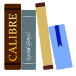
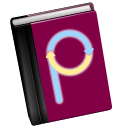

# EDUCATION

| [Back to Home](index.md) | [Back to Applications](apps.md)
| --- | --- |

#### Here are listed **62** programs for this category.

  <label for="app-search-input" style="font-weight: bold;">Search applications:</label>
  <input type="search" id="app-search-input" placeholder="Type a name or keyword..." autocomplete="off"
    style="width: 100%; max-width: 480px; padding: 0.5em 0.75em; margin-top: 0.25em; font-size: 1em; border: 1px solid #999; border-radius: 4px; box-sizing: border-box;">
  <select id="app-search-arch" aria-label="Filter by architecture"
    style="margin-top: 0.25em; padding: 0.5em; font-size: 1em; border: 1px solid #999; border-radius: 4px;">
    <option value="">Any architecture</option>
    <option value="x86_64">x86_64</option>
    <option value="aarch64">aarch64</option>
    <option value="i686">i686</option>
  </select>
  

#### *Categories*

  <a class="cat-pill" href="appimages.html">AppImages</a>
  •
  <a class="cat-pill" href="ai.html">ai</a>
  •
  <a class="cat-pill" href="am-utils.html">am-utils</a>
  •
  <a class="cat-pill" href="android.html">android</a>
  •
  <a class="cat-pill" href="appimage-on-the-fly.html">appimage-on-the-fly</a>
  •
  <a class="cat-pill" href="audio.html">audio</a>
  •
  <a class="cat-pill" href="comic.html">comic</a>
  •
  <a class="cat-pill" href="command-line.html">command-line</a>
  •
  <a class="cat-pill" href="communication.html">communication</a>
  •
  <a class="cat-pill" href="disk.html">disk</a>
  •
  <a class="cat-pill cat-pill--all" href="education.html">education</a>
  •
  <a class="cat-pill" href="emulator.html">emulator</a>
  •
  <a class="cat-pill" href="file-manager.html">file-manager</a>
  •
  <a class="cat-pill" href="finance.html">finance</a>
  •
  <a class="cat-pill" href="game.html">game</a>
  •
  <a class="cat-pill" href="gnome.html">gnome</a>
  •
  <a class="cat-pill" href="graphic.html">graphic</a>
  •
  <a class="cat-pill" href="internet.html">internet</a>
  •
  <a class="cat-pill" href="kde.html">kde</a>
  •
  <a class="cat-pill" href="metapackages.html">metapackages</a>
  •
  <a class="cat-pill" href="office.html">office</a>
  •
  <a class="cat-pill" href="password.html">password</a>
  •
  <a class="cat-pill" href="portable.html">Portable</a>
  •
  <a class="cat-pill" href="portable-cli.html">portable-cli</a>
  •
  <a class="cat-pill" href="portable-desktop.html">portable-desktop</a>
  •
  <a class="cat-pill" href="steam.html">steam</a>
  •
  <a class="cat-pill" href="system-monitor.html">system-monitor</a>
  •
  <a class="cat-pill" href="video.html">video</a>
  •
  <a class="cat-pill" href="virtual-machine.html">virtual-machine</a>
  •
  <a class="cat-pill" href="wallet.html">wallet</a>
  •
  <a class="cat-pill" href="web-app.html">web-app</a>
  •
  <a class="cat-pill" href="web-browser.html">web-browser</a>
  •
  <a class="cat-pill" href="wine.html">wine</a>
  •
  <a class="cat-pill" href="youtube.html">youtube</a>

-----------------

***NOTE, Installer scripts (blob/raw) are provided for reading only: do not run them manually! Use "[AM](https://github.com/ivan-hc/AM)" or "[AppMan](https://github.com/ivan-hc/AppMan)" instead.***

-----------------

| ICON | PACKAGE NAME | DESCRIPTION | INSTALLER |
| --- | --- | --- | --- |
|  | [***alexandria***](apps/alexandria.md) | *eBook reader built with Tauri, Epub.js, and Typescript.*..[ *read more* ](apps/alexandria.md)*!* | [*blob*](https://github.com/ivan-hc/AM/blob/main/programs/x86_64/alexandria) **/** [*raw*](https://raw.githubusercontent.com/ivan-hc/AM/main/programs/x86_64/alexandria) |
|  | [***ayandict***](apps/ayandict.md) | *Simple yet advanced multi-lingual cross-platform offline dictionary for desktop, using Qt and Go.*..[ *read more* ](apps/ayandict.md)*!* | [*blob*](https://github.com/ivan-hc/AM/blob/main/programs/x86_64/ayandict) **/** [*raw*](https://raw.githubusercontent.com/ivan-hc/AM/main/programs/x86_64/ayandict) |
|  | [***banban***](apps/banban.md) | *A productivity app inspired by GitHub Projects Kanban.*..[ *read more* ](apps/banban.md)*!* | [*blob*](https://github.com/ivan-hc/AM/blob/main/programs/x86_64/banban) **/** [*raw*](https://raw.githubusercontent.com/ivan-hc/AM/main/programs/x86_64/banban) |
|  | [***bibletime***](apps/bibletime.md) | *Unofficial, a Bible study application based on the Sword library and Qt toolkit.*..[ *read more* ](apps/bibletime.md)*!* | [*blob*](https://github.com/ivan-hc/AM/blob/main/programs/x86_64/bibletime) **/** [*raw*](https://raw.githubusercontent.com/ivan-hc/AM/main/programs/x86_64/bibletime) |
|  | [***book-manager***](apps/book-manager.md) | *Simple desktop app to manage personal library.*..[ *read more* ](apps/book-manager.md)*!* | [*blob*](https://github.com/ivan-hc/AM/blob/main/programs/x86_64/book-manager) **/** [*raw*](https://raw.githubusercontent.com/ivan-hc/AM/main/programs/x86_64/book-manager) |
|  | [***bookdb***](apps/bookdb.md) | *A book catalog database for personal collections. Can import data from Readerware 4.*..[ *read more* ](apps/bookdb.md)*!* | [*blob*](https://github.com/ivan-hc/AM/blob/main/programs/x86_64/bookdb) **/** [*raw*](https://raw.githubusercontent.com/ivan-hc/AM/main/programs/x86_64/bookdb) |
|  | [***brainverse***](apps/brainverse.md) | *Electronic Lab Notebook for Reproducible Neuro Imaging Research.*..[ *read more* ](apps/brainverse.md)*!* | [*blob*](https://github.com/ivan-hc/AM/blob/main/programs/x86_64/brainverse) **/** [*raw*](https://raw.githubusercontent.com/ivan-hc/AM/main/programs/x86_64/brainverse) |
|  | [***calibre***](apps/calibre.md) | *Unofficial. The one stop solution to all your e-book needs.*..[ *read more* ](apps/calibre.md)*!* | [*blob*](https://github.com/ivan-hc/AM/blob/main/programs/x86_64/calibre) **/** [*raw*](https://raw.githubusercontent.com/ivan-hc/AM/main/programs/x86_64/calibre) |
|  | [***calibre-beta***](apps/calibre-beta.md) | *Unofficial. The one stop solution to all your e-book needs. Beta version.*..[ *read more* ](apps/calibre-beta.md)*!* | [*blob*](https://github.com/ivan-hc/AM/blob/main/programs/x86_64/calibre-beta) **/** [*raw*](https://raw.githubusercontent.com/ivan-hc/AM/main/programs/x86_64/calibre-beta) |
|  | [***calibre-preview***](apps/calibre-preview.md) | *Unofficial. The one stop solution to all your e-book needs. Preview version.*..[ *read more* ](apps/calibre-preview.md)*!* | [*blob*](https://github.com/ivan-hc/AM/blob/main/programs/x86_64/calibre-preview) **/** [*raw*](https://raw.githubusercontent.com/ivan-hc/AM/main/programs/x86_64/calibre-preview) |
|  | [***caprine***](apps/caprine.md) | *Unofficial, elegant privacy focused Facebook Messenger app.*..[ *read more* ](apps/caprine.md)*!* | [*blob*](https://github.com/ivan-hc/AM/blob/main/programs/x86_64/caprine) **/** [*raw*](https://raw.githubusercontent.com/ivan-hc/AM/main/programs/x86_64/caprine) |
|  | [***carta***](apps/carta.md) | *Cube Analysis and Rendering Tool for Astronomy.*..[ *read more* ](apps/carta.md)*!* | [*blob*](https://github.com/ivan-hc/AM/blob/main/programs/x86_64/carta) **/** [*raw*](https://raw.githubusercontent.com/ivan-hc/AM/main/programs/x86_64/carta) |
|  | [***celestia***](apps/celestia.md) | *Real time 3D space simulator.*..[ *read more* ](apps/celestia.md)*!* | [*blob*](https://github.com/ivan-hc/AM/blob/main/programs/x86_64/celestia) **/** [*raw*](https://raw.githubusercontent.com/ivan-hc/AM/main/programs/x86_64/celestia) |
|  | [***celestia-dev***](apps/celestia-dev.md) | *Real time 3D space simulator, developer edition.*..[ *read more* ](apps/celestia-dev.md)*!* | [*blob*](https://github.com/ivan-hc/AM/blob/main/programs/x86_64/celestia-dev) **/** [*raw*](https://raw.githubusercontent.com/ivan-hc/AM/main/programs/x86_64/celestia-dev) |
|  | [***celestia-enanched***](apps/celestia-enanched.md) | *Unofficial. Real-time 3D space simulator with extra detailed maps.*..[ *read more* ](apps/celestia-enanched.md)*!* | [*blob*](https://github.com/ivan-hc/AM/blob/main/programs/x86_64/celestia-enanched) **/** [*raw*](https://raw.githubusercontent.com/ivan-hc/AM/main/programs/x86_64/celestia-enanched) |
|  | [***cerebro***](apps/cerebro.md) | *Open-source productivity booster with a brain.*..[ *read more* ](apps/cerebro.md)*!* | [*blob*](https://github.com/ivan-hc/AM/blob/main/programs/x86_64/cerebro) **/** [*raw*](https://raw.githubusercontent.com/ivan-hc/AM/main/programs/x86_64/cerebro) |
|  | [***circle-z***](apps/circle-z.md) | *A chat client for online math courses.*..[ *read more* ](apps/circle-z.md)*!* | [*blob*](https://github.com/ivan-hc/AM/blob/main/programs/x86_64/circle-z) **/** [*raw*](https://raw.githubusercontent.com/ivan-hc/AM/main/programs/x86_64/circle-z) |
|  | [***ciyue***](apps/ciyue.md) | *A simple mdict dictionary.*..[ *read more* ](apps/ciyue.md)*!* | [*blob*](https://github.com/ivan-hc/AM/blob/main/programs/x86_64/ciyue) **/** [*raw*](https://raw.githubusercontent.com/ivan-hc/AM/main/programs/x86_64/ciyue) |
|  | [***codebook-lsp***](apps/codebook-lsp.md) | *Codebook, code-aware spell checker with language server implementation.*..[ *read more* ](apps/codebook-lsp.md)*!* | [*blob*](https://github.com/ivan-hc/AM/blob/main/programs/x86_64/codebook-lsp) **/** [*raw*](https://raw.githubusercontent.com/ivan-hc/AM/main/programs/x86_64/codebook-lsp) |
|  | [***cosmonium***](apps/cosmonium.md) | *3D astronomy and space exploration program.*..[ *read more* ](apps/cosmonium.md)*!* | [*blob*](https://github.com/ivan-hc/AM/blob/main/programs/x86_64/cosmonium) **/** [*raw*](https://raw.githubusercontent.com/ivan-hc/AM/main/programs/x86_64/cosmonium) |
|  | [***elements***](apps/elements.md) | *App which displays the periodic table, Education, Science.*..[ *read more* ](apps/elements.md)*!* | [*blob*](https://github.com/ivan-hc/AM/blob/main/programs/x86_64/elements) **/** [*raw*](https://raw.githubusercontent.com/ivan-hc/AM/main/programs/x86_64/elements) |
|  | [***fbreader***](apps/fbreader.md) | *Your Favourite eBook Reader*..[ *read more* ](apps/fbreader.md)*!* | [*blob*](https://github.com/ivan-hc/AM/blob/main/programs/x86_64/fbreader) **/** [*raw*](https://raw.githubusercontent.com/ivan-hc/AM/main/programs/x86_64/fbreader) |
|  | [***flawesome***](apps/flawesome.md) | *Flawesome is a modern productivity tool.*..[ *read more* ](apps/flawesome.md)*!* | [*blob*](https://github.com/ivan-hc/AM/blob/main/programs/x86_64/flawesome) **/** [*raw*](https://raw.githubusercontent.com/ivan-hc/AM/main/programs/x86_64/flawesome) |
|  | [***focus***](apps/focus.md) | *A fully featured productivity timer for the command line, based on the Pomodoro Technique.*..[ *read more* ](apps/focus.md)*!* | [*blob*](https://github.com/ivan-hc/AM/blob/main/programs/x86_64/focus) **/** [*raw*](https://raw.githubusercontent.com/ivan-hc/AM/main/programs/x86_64/focus) |
|  | [***focusatwill***](apps/focusatwill.md) | *Combines neuroscience and music to boost productivity.*..[ *read more* ](apps/focusatwill.md)*!* | [*blob*](https://github.com/ivan-hc/AM/blob/main/programs/x86_64/focusatwill) **/** [*raw*](https://raw.githubusercontent.com/ivan-hc/AM/main/programs/x86_64/focusatwill) |
|  | [***frappebooks***](apps/frappebooks.md) | *Book-keeping software for small-businesses and freelancers.*..[ *read more* ](apps/frappebooks.md)*!* | [*blob*](https://github.com/ivan-hc/AM/blob/main/programs/x86_64/frappebooks) **/** [*raw*](https://raw.githubusercontent.com/ivan-hc/AM/main/programs/x86_64/frappebooks) |
|  | [***gaiasky***](apps/gaiasky.md) | *Gaia Sky, a real-time 3D space simulator & astronomy visualisation.*..[ *read more* ](apps/gaiasky.md)*!* | [*blob*](https://github.com/ivan-hc/AM/blob/main/programs/x86_64/gaiasky) **/** [*raw*](https://raw.githubusercontent.com/ivan-hc/AM/main/programs/x86_64/gaiasky) |
|  | [***gnome-pomodoro***](apps/gnome-pomodoro.md) | *A productivity tool designed to help you manage your time effectively using the Pomodoro Technique.*..[ *read more* ](apps/gnome-pomodoro.md)*!* | [*blob*](https://github.com/ivan-hc/AM/blob/main/programs/x86_64/gnome-pomodoro) **/** [*raw*](https://raw.githubusercontent.com/ivan-hc/AM/main/programs/x86_64/gnome-pomodoro) |
|  | [***goldendict***](apps/goldendict.md) | *A feature-rich dictionary lookup program.*..[ *read more* ](apps/goldendict.md)*!* | [*blob*](https://github.com/ivan-hc/AM/blob/main/programs/x86_64/goldendict) **/** [*raw*](https://raw.githubusercontent.com/ivan-hc/AM/main/programs/x86_64/goldendict) |
|  | [***goldendict-ng***](apps/goldendict-ng.md) | *Unofficial, an advanced dictionary lookup program, supporting many formats.*..[ *read more* ](apps/goldendict-ng.md)*!* | [*blob*](https://github.com/ivan-hc/AM/blob/main/programs/x86_64/goldendict-ng) **/** [*raw*](https://raw.githubusercontent.com/ivan-hc/AM/main/programs/x86_64/goldendict-ng) |
|  | [***hdict***](apps/hdict.md) | *Offline dictionary reader for StarDict, Slob, Mdict and Dictd dictionaries.*..[ *read more* ](apps/hdict.md)*!* | [*blob*](https://github.com/ivan-hc/AM/blob/main/programs/x86_64/hdict) **/** [*raw*](https://raw.githubusercontent.com/ivan-hc/AM/main/programs/x86_64/hdict) |
|  | [***kalker***](apps/kalker.md) | *Scientific calculator with math syntax for user-defined variables.*..[ *read more* ](apps/kalker.md)*!* | [*blob*](https://github.com/ivan-hc/AM/blob/main/programs/x86_64/kalker) **/** [*raw*](https://raw.githubusercontent.com/ivan-hc/AM/main/programs/x86_64/kalker) |
|  | [***kindling-cli***](apps/kindling-cli.md) | *Kindle toolkit for dictionaries, books, comics.*..[ *read more* ](apps/kindling-cli.md)*!* | [*blob*](https://github.com/ivan-hc/AM/blob/main/programs/x86_64/kindling-cli) **/** [*raw*](https://raw.githubusercontent.com/ivan-hc/AM/main/programs/x86_64/kindling-cli) |
|  | [***kmymoney***](apps/kmymoney.md) | *KMyMoney is a cross-platform personal finance manager build on KDE frameworks technologies for your desktop and notebook environment.*..[ *read more* ](apps/kmymoney.md)*!* | [*blob*](https://github.com/ivan-hc/AM/blob/main/programs/x86_64/kmymoney) **/** [*raw*](https://raw.githubusercontent.com/ivan-hc/AM/main/programs/x86_64/kmymoney) |
|  | [***koodo-reader***](apps/koodo-reader.md) | *Modern ebook manager and reader with sync & backup capacities.*..[ *read more* ](apps/koodo-reader.md)*!* | [*blob*](https://github.com/ivan-hc/AM/blob/main/programs/x86_64/koodo-reader) **/** [*raw*](https://raw.githubusercontent.com/ivan-hc/AM/main/programs/x86_64/koodo-reader) |
|  | [***lunatask***](apps/lunatask.md) | *All-in-one encrypted to-do list, notebook, habit and mood tracker.*..[ *read more* ](apps/lunatask.md)*!* | [*blob*](https://github.com/ivan-hc/AM/blob/main/programs/x86_64/lunatask) **/** [*raw*](https://raw.githubusercontent.com/ivan-hc/AM/main/programs/x86_64/lunatask) |
|  | [***mathcha-notebook***](apps/mathcha-notebook.md) | *Desktop version of Mathcha, built for your privacy.*..[ *read more* ](apps/mathcha-notebook.md)*!* | [*blob*](https://github.com/ivan-hc/AM/blob/main/programs/x86_64/mathcha-notebook) **/** [*raw*](https://raw.githubusercontent.com/ivan-hc/AM/main/programs/x86_64/mathcha-notebook) |
|  | [***memento***](apps/memento.md) | *A video player for studying Japanese.*..[ *read more* ](apps/memento.md)*!* | [*blob*](https://github.com/ivan-hc/AM/blob/main/programs/x86_64/memento) **/** [*raw*](https://raw.githubusercontent.com/ivan-hc/AM/main/programs/x86_64/memento) |
|  | [***mupdf***](apps/mupdf.md) | *Lightweight PDF, XPS, and E-book viewer.*..[ *read more* ](apps/mupdf.md)*!* | [*blob*](https://github.com/ivan-hc/AM/blob/main/programs/x86_64/mupdf) **/** [*raw*](https://raw.githubusercontent.com/ivan-hc/AM/main/programs/x86_64/mupdf) |
|  | [***music-blocks***](apps/music-blocks.md) | *.Exploring Math, Music, and Programming.*..[ *read more* ](apps/music-blocks.md)*!* | [*blob*](https://github.com/ivan-hc/AM/blob/main/programs/x86_64/music-blocks) **/** [*raw*](https://raw.githubusercontent.com/ivan-hc/AM/main/programs/x86_64/music-blocks) |
|  | [***notemaster***](apps/notemaster.md) | *Note-taking app to help boost productivity.*..[ *read more* ](apps/notemaster.md)*!* | [*blob*](https://github.com/ivan-hc/AM/blob/main/programs/x86_64/notemaster) **/** [*raw*](https://raw.githubusercontent.com/ivan-hc/AM/main/programs/x86_64/notemaster) |
|  | [***ocvwarp***](apps/ocvwarp.md) | *Warping images and videos for planetarium fulldome display.*..[ *read more* ](apps/ocvwarp.md)*!* | [*blob*](https://github.com/ivan-hc/AM/blob/main/programs/x86_64/ocvwarp) **/** [*raw*](https://raw.githubusercontent.com/ivan-hc/AM/main/programs/x86_64/ocvwarp) |
|  | [***odicto***](apps/odicto.md) | *An offline English dictionary app for desktop.*..[ *read more* ](apps/odicto.md)*!* | [*blob*](https://github.com/ivan-hc/AM/blob/main/programs/x86_64/odicto) **/** [*raw*](https://raw.githubusercontent.com/ivan-hc/AM/main/programs/x86_64/odicto) |
|  | [***openlibextended***](apps/openlibextended.md) | *An Open source app to download and read books from shadow library (Anna’s Archive).*..[ *read more* ](apps/openlibextended.md)*!* | [*blob*](https://github.com/ivan-hc/AM/blob/main/programs/x86_64/openlibextended) **/** [*raw*](https://raw.githubusercontent.com/ivan-hc/AM/main/programs/x86_64/openlibextended) |
|  | [***pyglossary***](apps/pyglossary.md) | *Unofficial, A tool for converting dictionary files aka glossaries.*..[ *read more* ](apps/pyglossary.md)*!* | [*blob*](https://github.com/ivan-hc/AM/blob/main/programs/x86_64/pyglossary) **/** [*raw*](https://raw.githubusercontent.com/ivan-hc/AM/main/programs/x86_64/pyglossary) |
|  | [***readest***](apps/readest.md) | *Readest is a modern, feature-rich ebook reader designed for avid readers offering seamless cross-platform access, powerful tools, and an intuitive interface to elevate your reading experience.*..[ *read more* ](apps/readest.md)*!* | [*blob*](https://github.com/ivan-hc/AM/blob/main/programs/x86_64/readest) **/** [*raw*](https://raw.githubusercontent.com/ivan-hc/AM/main/programs/x86_64/readest) |
|  | [***readest-enhanced***](apps/readest-enhanced.md) | *Unofficial, an enhanced version of Readest, a modern, feature-rich ebook reader designed for avid readers offering seamless cross-platform access, powerful tools, and an intuitive interface to elevate your reading experience.*..[ *read more* ](apps/readest-enhanced.md)*!* | [*blob*](https://github.com/ivan-hc/AM/blob/main/programs/x86_64/readest-enhanced) **/** [*raw*](https://raw.githubusercontent.com/ivan-hc/AM/main/programs/x86_64/readest-enhanced) |
|  | [***remnote***](apps/remnote.md) | *Make flashcards in your notes. Cut study time in half. Use evidence-based memory techniques to create flashcards that resurface at the best time for retention.*..[ *read more* ](apps/remnote.md)*!* | [*blob*](https://github.com/ivan-hc/AM/blob/main/programs/x86_64/remnote) **/** [*raw*](https://raw.githubusercontent.com/ivan-hc/AM/main/programs/x86_64/remnote) |
|  | [***rustdict***](apps/rustdict.md) | *A dictionary CLI tool in Rust inspired by BetaPictoris's dict.*..[ *read more* ](apps/rustdict.md)*!* | [*blob*](https://github.com/ivan-hc/AM/blob/main/programs/x86_64/rustdict) **/** [*raw*](https://raw.githubusercontent.com/ivan-hc/AM/main/programs/x86_64/rustdict) |
|  | [***ser-player***](apps/ser-player.md) | *Video player for SER files used for astronomy-imaging.*..[ *read more* ](apps/ser-player.md)*!* | [*blob*](https://github.com/ivan-hc/AM/blob/main/programs/x86_64/ser-player) **/** [*raw*](https://raw.githubusercontent.com/ivan-hc/AM/main/programs/x86_64/ser-player) |
|  | [***sigil***](apps/sigil.md) | *Sigil is a multi-platform EPUB ebook editor.*..[ *read more* ](apps/sigil.md)*!* | [*blob*](https://github.com/ivan-hc/AM/blob/main/programs/x86_64/sigil) **/** [*raw*](https://raw.githubusercontent.com/ivan-hc/AM/main/programs/x86_64/sigil) |
|  | [***smath-studio***](apps/smath-studio.md) | *Tiny, but powerful mathematical program with WYSIWYG editor.*..[ *read more* ](apps/smath-studio.md)*!* | [*blob*](https://github.com/ivan-hc/AM/blob/main/programs/x86_64/smath-studio) **/** [*raw*](https://raw.githubusercontent.com/ivan-hc/AM/main/programs/x86_64/smath-studio) |
|  | [***snapshot-slider***](apps/snapshot-slider.md) | *Present/print/email Snapshots of modern mathematics.*..[ *read more* ](apps/snapshot-slider.md)*!* | [*blob*](https://github.com/ivan-hc/AM/blob/main/programs/x86_64/snapshot-slider) **/** [*raw*](https://raw.githubusercontent.com/ivan-hc/AM/main/programs/x86_64/snapshot-slider) |
|  | [***stellarium***](apps/stellarium.md) | *Planetarium that shows a realistic sky in 3D.*..[ *read more* ](apps/stellarium.md)*!* | [*blob*](https://github.com/ivan-hc/AM/blob/main/programs/x86_64/stellarium) **/** [*raw*](https://raw.githubusercontent.com/ivan-hc/AM/main/programs/x86_64/stellarium) |
|  | [***studymd***](apps/studymd.md) | *Flashcards from Markdown.*..[ *read more* ](apps/studymd.md)*!* | [*blob*](https://github.com/ivan-hc/AM/blob/main/programs/x86_64/studymd) **/** [*raw*](https://raw.githubusercontent.com/ivan-hc/AM/main/programs/x86_64/studymd) |
|  | [***superproductivity***](apps/superproductivity.md) | *An advanced todo list app with integrated Timeboxing.*..[ *read more* ](apps/superproductivity.md)*!* | [*blob*](https://github.com/ivan-hc/AM/blob/main/programs/x86_64/superproductivity) **/** [*raw*](https://raw.githubusercontent.com/ivan-hc/AM/main/programs/x86_64/superproductivity) |
|  | [***thorium-reader***](apps/thorium-reader.md) | *Desktop application to read ebooks.*..[ *read more* ](apps/thorium-reader.md)*!* | [*blob*](https://github.com/ivan-hc/AM/blob/main/programs/x86_64/thorium-reader) **/** [*raw*](https://raw.githubusercontent.com/ivan-hc/AM/main/programs/x86_64/thorium-reader) |
|  | [***tweaksophia***](apps/tweaksophia.md) | *An app to automatically renew the books of the SophiA system.*..[ *read more* ](apps/tweaksophia.md)*!* | [*blob*](https://github.com/ivan-hc/AM/blob/main/programs/x86_64/tweaksophia) **/** [*raw*](https://raw.githubusercontent.com/ivan-hc/AM/main/programs/x86_64/tweaksophia) |
|  | [***whu-library-seat***](apps/whu-library-seat.md) | *Wuhan University Library Assistant, for Jinan University.*..[ *read more* ](apps/whu-library-seat.md)*!* | [*blob*](https://github.com/ivan-hc/AM/blob/main/programs/x86_64/whu-library-seat) **/** [*raw*](https://raw.githubusercontent.com/ivan-hc/AM/main/programs/x86_64/whu-library-seat) |
|  | [***xgetter***](apps/xgetter.md) | *Download video on Youtube, Facebook, X(Twitter), Instagram, Tiktok, Bilibili, Douyin and more.*..[ *read more* ](apps/xgetter.md)*!* | [*blob*](https://github.com/ivan-hc/AM/blob/main/programs/x86_64/xgetter) **/** [*raw*](https://raw.githubusercontent.com/ivan-hc/AM/main/programs/x86_64/xgetter) |
|  | [***xiphos***](apps/xiphos.md) | *Unofficial, a Bible study tool using GTK.*..[ *read more* ](apps/xiphos.md)*!* | [*blob*](https://github.com/ivan-hc/AM/blob/main/programs/x86_64/xiphos) **/** [*raw*](https://raw.githubusercontent.com/ivan-hc/AM/main/programs/x86_64/xiphos) |
|  | [***zegrapher***](apps/zegrapher.md) | *Math graphing software.*..[ *read more* ](apps/zegrapher.md)*!* | [*blob*](https://github.com/ivan-hc/AM/blob/main/programs/x86_64/zegrapher) **/** [*raw*](https://raw.githubusercontent.com/ivan-hc/AM/main/programs/x86_64/zegrapher) |

---

You can improve these pages via a [pull request](https://github.com/Portable-Linux-Apps/Portable-Linux-Apps.github.io/pulls) to this site's [GitHub repository](https://github.com/Portable-Linux-Apps/Portable-Linux-Apps.github.io), or report any problems related to the installation scripts in the '[issue](https://github.com/ivan-hc/AM/issues)' section of the main database, at [https://github.com/ivan-hc/AM](https://github.com/ivan-hc/AM).

***PORTABLE-LINUX-APPS.github.io is my gift to the Linux community and was made with love for GNU/Linux and the Open Source philosophy.***

---

| [Back to Home](index.md) | [Back to Applications](apps.md)
| --- | --- |

--------

# Contacts
- **Ivan-HC** *on* [**GitHub**](https://github.com/ivan-hc)
- **AM-Ivan** *on* [**Reddit**](https://www.reddit.com/u/am-ivan)

###### *You can support me and my work on [**ko-fi.com**](https://ko-fi.com/IvanAlexHC) and [**PayPal.me**](https://paypal.me/IvanAlexHC). Thank you!*

--------

*© 2020-present Ivan Alessandro Sala aka 'Ivan-HC'* - I'm here just for fun!

