# EMULATOR

| [Back to Home](index.md) | [Back to Applications](apps.md)
| --- | --- |

#### Here are listed **95** programs and **1** items for this category.

  <label for="app-search-input" style="font-weight: bold;">Search applications:</label>
  <input type="search" id="app-search-input" placeholder="Type a name or keyword..." autocomplete="off"
    style="width: 100%; max-width: 480px; padding: 0.5em 0.75em; margin-top: 0.25em; font-size: 1em; border: 1px solid #999; border-radius: 4px; box-sizing: border-box;">
  <select id="app-search-arch" aria-label="Filter by architecture"
    style="margin-top: 0.25em; padding: 0.5em; font-size: 1em; border: 1px solid #999; border-radius: 4px;">
    <option value="">Any architecture</option>
    <option value="x86_64">x86_64</option>
    <option value="aarch64">aarch64</option>
    <option value="i686">i686</option>
  </select>
  

#### *Categories*

  <a class="cat-pill" href="appimages.html">AppImages</a>
  •
  <a class="cat-pill" href="ai.html">ai</a>
  •
  <a class="cat-pill" href="am-utils.html">am-utils</a>
  •
  <a class="cat-pill" href="android.html">android</a>
  •
  <a class="cat-pill" href="appimage-on-the-fly.html">appimage-on-the-fly</a>
  •
  <a class="cat-pill" href="audio.html">audio</a>
  •
  <a class="cat-pill" href="comic.html">comic</a>
  •
  <a class="cat-pill" href="command-line.html">command-line</a>
  •
  <a class="cat-pill" href="communication.html">communication</a>
  •
  <a class="cat-pill" href="disk.html">disk</a>
  •
  <a class="cat-pill" href="education.html">education</a>
  •
  <a class="cat-pill cat-pill--all" href="emulator.html">emulator</a>
  •
  <a class="cat-pill" href="file-manager.html">file-manager</a>
  •
  <a class="cat-pill" href="finance.html">finance</a>
  •
  <a class="cat-pill" href="game.html">game</a>
  •
  <a class="cat-pill" href="gnome.html">gnome</a>
  •
  <a class="cat-pill" href="graphic.html">graphic</a>
  •
  <a class="cat-pill" href="internet.html">internet</a>
  •
  <a class="cat-pill" href="kde.html">kde</a>
  •
  <a class="cat-pill" href="metapackages.html">metapackages</a>
  •
  <a class="cat-pill" href="office.html">office</a>
  •
  <a class="cat-pill" href="password.html">password</a>
  •
  <a class="cat-pill" href="portable.html">Portable</a>
  •
  <a class="cat-pill" href="portable-cli.html">portable-cli</a>
  •
  <a class="cat-pill" href="portable-desktop.html">portable-desktop</a>
  •
  <a class="cat-pill" href="steam.html">steam</a>
  •
  <a class="cat-pill" href="system-monitor.html">system-monitor</a>
  •
  <a class="cat-pill" href="video.html">video</a>
  •
  <a class="cat-pill" href="virtual-machine.html">virtual-machine</a>
  •
  <a class="cat-pill" href="wallet.html">wallet</a>
  •
  <a class="cat-pill" href="web-app.html">web-app</a>
  •
  <a class="cat-pill" href="web-browser.html">web-browser</a>
  •
  <a class="cat-pill" href="wine.html">wine</a>
  •
  <a class="cat-pill" href="youtube.html">youtube</a>

-----------------

***NOTE, Installer scripts (blob/raw) are provided for reading only: do not run them manually! Use "[AM](https://github.com/ivan-hc/AM)" or "[AppMan](https://github.com/ivan-hc/AppMan)" instead.***

-----------------

| ICON | PACKAGE NAME | DESCRIPTION | INSTALLER |
| --- | --- | --- | --- |
| 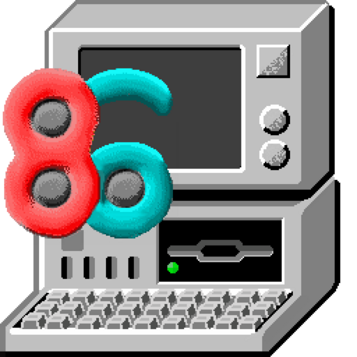 | [***86box***](apps/86box.md) | *Emulator of x86-based machines based on PCem.*..[ *read more* ](apps/86box.md)*!* | [*blob*](https://github.com/ivan-hc/AM/blob/main/programs/x86_64/86box) **/** [*raw*](https://raw.githubusercontent.com/ivan-hc/AM/main/programs/x86_64/86box) |
| 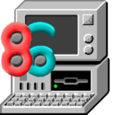 | [***86box-enhanced***](apps/86box-enhanced.md) | *Unofficial, emulator of x86-based machines based on PCem.*..[ *read more* ](apps/86box-enhanced.md)*!* | [*blob*](https://github.com/ivan-hc/AM/blob/main/programs/x86_64/86box-enhanced) **/** [*raw*](https://raw.githubusercontent.com/ivan-hc/AM/main/programs/x86_64/86box-enhanced) |
|  | [***adb***](apps/platform-tools.md) | *Command-line tool for communicating with Android devices or emulators. This is part of "platform-tools".*..[ *read more* ](apps/platform-tools.md)*!* | [*blob*](https://github.com/ivan-hc/AM/blob/main/programs/x86_64/platform-tools) **/** [*raw*](https://raw.githubusercontent.com/ivan-hc/AM/main/programs/x86_64/platform-tools) |
| 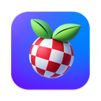 | [***amiberry***](apps/amiberry.md) | *Unofficial, optimized Amiga emulator.*..[ *read more* ](apps/amiberry.md)*!* | [*blob*](https://github.com/ivan-hc/AM/blob/main/programs/x86_64/amiberry) **/** [*raw*](https://raw.githubusercontent.com/ivan-hc/AM/main/programs/x86_64/amiberry) |
|  | [***ares***](apps/ares.md) | *AppImage for the ares emulator.*..[ *read more* ](apps/ares.md)*!* | [*blob*](https://github.com/ivan-hc/AM/blob/main/programs/x86_64/ares) **/** [*raw*](https://raw.githubusercontent.com/ivan-hc/AM/main/programs/x86_64/ares) |
|  | [***ares-emu***](apps/ares-emu.md) | *Unofficial AppImage of the ares emulator.*..[ *read more* ](apps/ares-emu.md)*!* | [*blob*](https://github.com/ivan-hc/AM/blob/main/programs/x86_64/ares-emu) **/** [*raw*](https://raw.githubusercontent.com/ivan-hc/AM/main/programs/x86_64/ares-emu) |
|  | [***azaharplus***](apps/azaharplus.md) | *A fork of the Azahar 3DS emulator with extra features an open-source 3DS emulator project based on Citra.*..[ *read more* ](apps/azaharplus.md)*!* | [*blob*](https://github.com/ivan-hc/AM/blob/main/programs/x86_64/azaharplus) **/** [*raw*](https://raw.githubusercontent.com/ivan-hc/AM/main/programs/x86_64/azaharplus) |
|  | [***azaharplus-pkg-extractor***](apps/azaharplus-pkg-extractor.md) | *Standalone PKG extractor CLI based on code that used to be in ShadPS4 PlayStation 4 emulator written in C++.*..[ *read more* ](apps/azaharplus-pkg-extractor.md)*!* | [*blob*](https://github.com/ivan-hc/AM/blob/main/programs/x86_64/azaharplus-pkg-extractor) **/** [*raw*](https://raw.githubusercontent.com/ivan-hc/AM/main/programs/x86_64/azaharplus-pkg-extractor) |
|  | [***basilisk2***](apps/basilisk2.md) | *Classic Macintosh emulator BasiliskII.*..[ *read more* ](apps/basilisk2.md)*!* | [*blob*](https://github.com/ivan-hc/AM/blob/main/programs/x86_64/basilisk2) **/** [*raw*](https://raw.githubusercontent.com/ivan-hc/AM/main/programs/x86_64/basilisk2) |
| 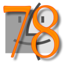 | [***basiliskii-enhanced***](apps/basiliskii-enhanced.md) | *Unofficial, classic Macintosh emulator BasiliskII.*..[ *read more* ](apps/basiliskii-enhanced.md)*!* | [*blob*](https://github.com/ivan-hc/AM/blob/main/programs/x86_64/basiliskii-enhanced) **/** [*raw*](https://raw.githubusercontent.com/ivan-hc/AM/main/programs/x86_64/basiliskii-enhanced) |
|  | [***blizzard-4***](apps/blizzard-4.md) | *Emulator & toolchain for the Blizzard 4 16-bit computer.*..[ *read more* ](apps/blizzard-4.md)*!* | [*blob*](https://github.com/ivan-hc/AM/blob/main/programs/x86_64/blizzard-4) **/** [*raw*](https://raw.githubusercontent.com/ivan-hc/AM/main/programs/x86_64/blizzard-4) |
|  | [***botframework-emulator***](apps/botframework-emulator.md) | *Test and debug chat bots built with Bot Framework SDK.*..[ *read more* ](apps/botframework-emulator.md)*!* | [*blob*](https://github.com/ivan-hc/AM/blob/main/programs/x86_64/botframework-emulator) **/** [*raw*](https://raw.githubusercontent.com/ivan-hc/AM/main/programs/x86_64/botframework-emulator) |
| 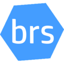 | [***brs-emu-app***](apps/brs-emu-app.md) | *BrightScript Emulator, runs on browsers and Electron apps.*..[ *read more* ](apps/brs-emu-app.md)*!* | [*blob*](https://github.com/ivan-hc/AM/blob/main/programs/x86_64/brs-emu-app) **/** [*raw*](https://raw.githubusercontent.com/ivan-hc/AM/main/programs/x86_64/brs-emu-app) |
| 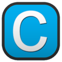 | [***cemu***](apps/cemu.md) | *A Nintendo Wii U emulator that is able to run most Wii U games.*..[ *read more* ](apps/cemu.md)*!* | [*blob*](https://github.com/ivan-hc/AM/blob/main/programs/x86_64/cemu) **/** [*raw*](https://raw.githubusercontent.com/ivan-hc/AM/main/programs/x86_64/cemu) |
|  | [***cemu-enhanced***](apps/cemu-enhanced.md) | *Unofficial AppImage of Cemu, Nintendo Wii U emulator that is able to run most Wii U games, which is able to work on any linux distro.*..[ *read more* ](apps/cemu-enhanced.md)*!* | [*blob*](https://github.com/ivan-hc/AM/blob/main/programs/x86_64/cemu-enhanced) **/** [*raw*](https://raw.githubusercontent.com/ivan-hc/AM/main/programs/x86_64/cemu-enhanced) |
| 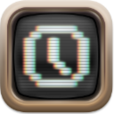 | [***clk***](apps/clk.md) | *Unofficial, a latency hating emulator for 8 and 16 bit platforms.*..[ *read more* ](apps/clk.md)*!* | [*blob*](https://github.com/ivan-hc/AM/blob/main/programs/x86_64/clk) **/** [*raw*](https://raw.githubusercontent.com/ivan-hc/AM/main/programs/x86_64/clk) |
| 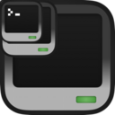 | [***craftos-pc***](apps/craftos-pc.md) | *Advanced ComputerCraft emulator written in C++.*..[ *read more* ](apps/craftos-pc.md)*!* | [*blob*](https://github.com/ivan-hc/AM/blob/main/programs/x86_64/craftos-pc) **/** [*raw*](https://raw.githubusercontent.com/ivan-hc/AM/main/programs/x86_64/craftos-pc) |
| 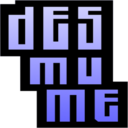 | [***desmume***](apps/desmume.md) | *Unofficial AppImage of the DeSmuME emulator.*..[ *read more* ](apps/desmume.md)*!* | [*blob*](https://github.com/ivan-hc/AM/blob/main/programs/x86_64/desmume) **/** [*raw*](https://raw.githubusercontent.com/ivan-hc/AM/main/programs/x86_64/desmume) |
|  | [***dolphin-emu***](apps/dolphin-emu.md) | *Unofficial, GameCube/Nintento Wii emulator with improvements.*..[ *read more* ](apps/dolphin-emu.md)*!* | [*blob*](https://github.com/ivan-hc/AM/blob/main/programs/x86_64/dolphin-emu) **/** [*raw*](https://raw.githubusercontent.com/ivan-hc/AM/main/programs/x86_64/dolphin-emu) |
|  | [***dolphin-emu-nightly***](apps/dolphin-emu-nightly.md) | *Unofficial nightly AppImage of the Dolphin emulator.*..[ *read more* ](apps/dolphin-emu-nightly.md)*!* | [*blob*](https://github.com/ivan-hc/AM/blob/main/programs/x86_64/dolphin-emu-nightly) **/** [*raw*](https://raw.githubusercontent.com/ivan-hc/AM/main/programs/x86_64/dolphin-emu-nightly) |
| 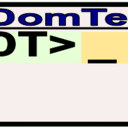 | [***domterm***](apps/domterm.md) | *DOM/JavaScript-based terminal-emulator/console.*..[ *read more* ](apps/domterm.md)*!* | [*blob*](https://github.com/ivan-hc/AM/blob/main/programs/x86_64/domterm) **/** [*raw*](https://raw.githubusercontent.com/ivan-hc/AM/main/programs/x86_64/domterm) |
| 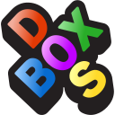 | [***dosbox-x***](apps/dosbox-x.md) | *Unofficial, DOSBox-X is a cross-platform DOS emulator for running many MS-DOS games.*..[ *read more* ](apps/dosbox-x.md)*!* | [*blob*](https://github.com/ivan-hc/AM/blob/main/programs/x86_64/dosbox-x) **/** [*raw*](https://raw.githubusercontent.com/ivan-hc/AM/main/programs/x86_64/dosbox-x) |
| 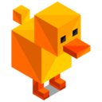 | [***duckstation***](apps/duckstation.md) | *PlayStation 1, aka PSX games Emulator.*..[ *read more* ](apps/duckstation.md)*!* | [*blob*](https://github.com/ivan-hc/AM/blob/main/programs/x86_64/duckstation) **/** [*raw*](https://raw.githubusercontent.com/ivan-hc/AM/main/programs/x86_64/duckstation) |
| 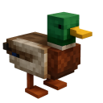 | [***duckstation-gpl-enhanced***](apps/duckstation-gpl-enhanced.md) | *Unofficial, fast PlayStation 1 emulator when it was still using GPLv3.*..[ *read more* ](apps/duckstation-gpl-enhanced.md)*!* | [*blob*](https://github.com/ivan-hc/AM/blob/main/programs/x86_64/duckstation-gpl-enhanced) **/** [*raw*](https://raw.githubusercontent.com/ivan-hc/AM/main/programs/x86_64/duckstation-gpl-enhanced) |
| 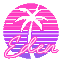 | [***eden***](apps/eden.md) | *An experimental open-source emulator for Nintendo Switch (yuzu fork).*..[ *read more* ](apps/eden.md)*!* | [*blob*](https://github.com/ivan-hc/AM/blob/main/programs/x86_64/eden) **/** [*raw*](https://raw.githubusercontent.com/ivan-hc/AM/main/programs/x86_64/eden) |
|  | [***eden-nightly***](apps/eden-nightly.md) | *An experimental open-source emulator for Nintendo Switch (yuzu fork, nightly builds).*..[ *read more* ](apps/eden-nightly.md)*!* | [*blob*](https://github.com/ivan-hc/AM/blob/main/programs/x86_64/eden-nightly) **/** [*raw*](https://raw.githubusercontent.com/ivan-hc/AM/main/programs/x86_64/eden-nightly) |
| 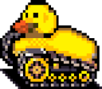 | [***eka2l1***](apps/eka2l1.md) | *A Symbian OS/N-Gage emulator*..[ *read more* ](apps/eka2l1.md)*!* | [*blob*](https://github.com/ivan-hc/AM/blob/main/programs/x86_64/eka2l1) **/** [*raw*](https://raw.githubusercontent.com/ivan-hc/AM/main/programs/x86_64/eka2l1) |
| 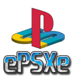 | [***epsxe***](apps/epsxe.md) | *Unofficial, enhanced PSX emulator.*..[ *read more* ](apps/epsxe.md)*!* | [*blob*](https://github.com/ivan-hc/AM/blob/main/programs/x86_64/epsxe) **/** [*raw*](https://raw.githubusercontent.com/ivan-hc/AM/main/programs/x86_64/epsxe) |
|  | [***flycast***](apps/flycast.md) | *A Sega Dreamcast, Naomi, Naomi 2 and Atomiswave emulator.*..[ *read more* ](apps/flycast.md)*!* | [*blob*](https://github.com/ivan-hc/AM/blob/main/programs/x86_64/flycast) **/** [*raw*](https://raw.githubusercontent.com/ivan-hc/AM/main/programs/x86_64/flycast) |
|  | [***flycast-dojo***](apps/flycast-dojo.md) | *Flycast fork, multiplatform Sega Dreamcast, Naomi and Atomiswave emulator for netplay, training & online tournament gameplay.*..[ *read more* ](apps/flycast-dojo.md)*!* | [*blob*](https://github.com/ivan-hc/AM/blob/main/programs/x86_64/flycast-dojo) **/** [*raw*](https://raw.githubusercontent.com/ivan-hc/AM/main/programs/x86_64/flycast-dojo) |
|  | [***flycast-enhanced***](apps/flycast-enhanced.md) | *Unofficial, A Sega Dreamcast, Naomi, Naomi 2 and Atomiswave emulator.*..[ *read more* ](apps/flycast-enhanced.md)*!* | [*blob*](https://github.com/ivan-hc/AM/blob/main/programs/x86_64/flycast-enhanced) **/** [*raw*](https://raw.githubusercontent.com/ivan-hc/AM/main/programs/x86_64/flycast-enhanced) |
|  | [***gameimage***](apps/gameimage.md) | *Pack a runner/emulator/game and it's configs in a single AppImage.*..[ *read more* ](apps/gameimage.md)*!* | [*blob*](https://github.com/ivan-hc/AM/blob/main/programs/x86_64/gameimage) **/** [*raw*](https://raw.githubusercontent.com/ivan-hc/AM/main/programs/x86_64/gameimage) |
|  | [***gearboy***](apps/gearboy.md) | *Unofficial, Game Boy / Gameboy Color emulator.*..[ *read more* ](apps/gearboy.md)*!* | [*blob*](https://github.com/ivan-hc/AM/blob/main/programs/x86_64/gearboy) **/** [*raw*](https://raw.githubusercontent.com/ivan-hc/AM/main/programs/x86_64/gearboy) |
|  | [***gearcoleco***](apps/gearcoleco.md) | *Unofficial, ColecoVision emulator.*..[ *read more* ](apps/gearcoleco.md)*!* | [*blob*](https://github.com/ivan-hc/AM/blob/main/programs/x86_64/gearcoleco) **/** [*raw*](https://raw.githubusercontent.com/ivan-hc/AM/main/programs/x86_64/gearcoleco) |
| 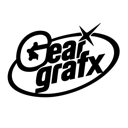 | [***geargrafx***](apps/geargrafx.md) | *Unofficial, PC Engine / TurboGrafx-16 / SuperGrafx / PCE CD-ROM² emulator.*..[ *read more* ](apps/geargrafx.md)*!* | [*blob*](https://github.com/ivan-hc/AM/blob/main/programs/x86_64/geargrafx) **/** [*raw*](https://raw.githubusercontent.com/ivan-hc/AM/main/programs/x86_64/geargrafx) |
|  | [***gearlynx***](apps/gearlynx.md) | *Unofficial, Atari Lynx emulator.*..[ *read more* ](apps/gearlynx.md)*!* | [*blob*](https://github.com/ivan-hc/AM/blob/main/programs/x86_64/gearlynx) **/** [*raw*](https://raw.githubusercontent.com/ivan-hc/AM/main/programs/x86_64/gearlynx) |
| 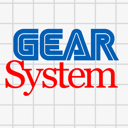 | [***gearsystem***](apps/gearsystem.md) | *Unofficial, Sega Master System / Game Gear / SG-1000 emulator.*..[ *read more* ](apps/gearsystem.md)*!* | [*blob*](https://github.com/ivan-hc/AM/blob/main/programs/x86_64/gearsystem) **/** [*raw*](https://raw.githubusercontent.com/ivan-hc/AM/main/programs/x86_64/gearsystem) |
| 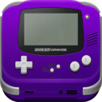 | [***hades-emu***](apps/hades-emu.md) | *A Nintendo Game Boy Advance Emulator.*..[ *read more* ](apps/hades-emu.md)*!* | [*blob*](https://github.com/ivan-hc/AM/blob/main/programs/x86_64/hades-emu) **/** [*raw*](https://raw.githubusercontent.com/ivan-hc/AM/main/programs/x86_64/hades-emu) |
|  | [***hatari***](apps/hatari.md) | *Unofficial, an Atari ST and STE emulator.*..[ *read more* ](apps/hatari.md)*!* | [*blob*](https://github.com/ivan-hc/AM/blob/main/programs/x86_64/hatari) **/** [*raw*](https://raw.githubusercontent.com/ivan-hc/AM/main/programs/x86_64/hatari) |
|  | [***iris***](apps/iris.md) | *Sony PlayStation 2 games emulator for Windows, Linux and macOS.*..[ *read more* ](apps/iris.md)*!* | [*blob*](https://github.com/ivan-hc/AM/blob/main/programs/x86_64/iris) **/** [*raw*](https://raw.githubusercontent.com/ivan-hc/AM/main/programs/x86_64/iris) |
|  | [***iris-enhanced***](apps/iris-enhanced.md) | *Unofficial, Sony PlayStation 2 emulator.*..[ *read more* ](apps/iris-enhanced.md)*!* | [*blob*](https://github.com/ivan-hc/AM/blob/main/programs/x86_64/iris-enhanced) **/** [*raw*](https://raw.githubusercontent.com/ivan-hc/AM/main/programs/x86_64/iris-enhanced) |
| 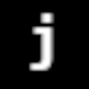 | [***jgenesis***](apps/jgenesis.md) | *Sega Genesis, Sega CD, SNES, Master System, Game Gear emulator (GUI).*..[ *read more* ](apps/jgenesis.md)*!* | [*blob*](https://github.com/ivan-hc/AM/blob/main/programs/x86_64/jgenesis) **/** [*raw*](https://raw.githubusercontent.com/ivan-hc/AM/main/programs/x86_64/jgenesis) |
|  | [***jgenesis-cli***](apps/jgenesis-cli.md) | *Sega Genesis, Sega CD, SNES, Master System, Game Gear emulator (CLI).*..[ *read more* ](apps/jgenesis-cli.md)*!* | [*blob*](https://github.com/ivan-hc/AM/blob/main/programs/x86_64/jgenesis-cli) **/** [*raw*](https://raw.githubusercontent.com/ivan-hc/AM/main/programs/x86_64/jgenesis-cli) |
|  | [***kega-fusion***](apps/kega-fusion.md) | *Unofficial, an emulator of classic Sega consoles, including SMS/GG, Genesis/Megadrive and add-ons.*..[ *read more* ](apps/kega-fusion.md)*!* | [*blob*](https://github.com/ivan-hc/AM/blob/main/programs/x86_64/kega-fusion) **/** [*raw*](https://raw.githubusercontent.com/ivan-hc/AM/main/programs/x86_64/kega-fusion) |
|  | [***kronos***](apps/kronos.md) | *Unofficial, Sega Saturn emulator.*..[ *read more* ](apps/kronos.md)*!* | [*blob*](https://github.com/ivan-hc/AM/blob/main/programs/x86_64/kronos) **/** [*raw*](https://raw.githubusercontent.com/ivan-hc/AM/main/programs/x86_64/kronos) |
|  | [***lutris***](apps/lutris.md) | *Unofficial. Install and play video games from all eras and from most gaming systems, by leveraging and combining existing emulators, WINE included.*..[ *read more* ](apps/lutris.md)*!* | [*blob*](https://github.com/ivan-hc/AM/blob/main/programs/x86_64/lutris) **/** [*raw*](https://raw.githubusercontent.com/ivan-hc/AM/main/programs/x86_64/lutris) |
|  | [***mame***](apps/mame.md) | *Unofficial AppImage of MAME emulator.*..[ *read more* ](apps/mame.md)*!* | [*blob*](https://github.com/ivan-hc/AM/blob/main/programs/x86_64/mame) **/** [*raw*](https://raw.githubusercontent.com/ivan-hc/AM/main/programs/x86_64/mame) |
|  | [***mednafen***](apps/mednafen.md) | *Unofficial AppImage. Mednafen is a portable, utilizing OpenGL and SDL, argument(command-line)-driven multi-system emulator.*..[ *read more* ](apps/mednafen.md)*!* | [*blob*](https://github.com/ivan-hc/AM/blob/main/programs/x86_64/mednafen) **/** [*raw*](https://raw.githubusercontent.com/ivan-hc/AM/main/programs/x86_64/mednafen) |
|  | [***meganimus***](apps/meganimus.md) | *A launcher for native and emulator games.*..[ *read more* ](apps/meganimus.md)*!* | [*blob*](https://github.com/ivan-hc/AM/blob/main/programs/x86_64/meganimus) **/** [*raw*](https://raw.githubusercontent.com/ivan-hc/AM/main/programs/x86_64/meganimus) |
| 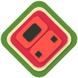 | [***melonds***](apps/melonds.md) | *DS emulator, sorta.*..[ *read more* ](apps/melonds.md)*!* | [*blob*](https://github.com/ivan-hc/AM/blob/main/programs/x86_64/melonds) **/** [*raw*](https://raw.githubusercontent.com/ivan-hc/AM/main/programs/x86_64/melonds) |
|  | [***melonmix***](apps/melonmix.md) | *KH Melon Mix (DS Emulator) DS emulator, sorta DS emulator, sorta.*..[ *read more* ](apps/melonmix.md)*!* | [*blob*](https://github.com/ivan-hc/AM/blob/main/programs/x86_64/melonmix) **/** [*raw*](https://raw.githubusercontent.com/ivan-hc/AM/main/programs/x86_64/melonmix) |
| 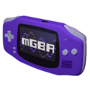 | [***mgba***](apps/mgba.md) | *Game Boy Advance Emulator.*..[ *read more* ](apps/mgba.md)*!* | [*blob*](https://github.com/ivan-hc/AM/blob/main/programs/x86_64/mgba) **/** [*raw*](https://raw.githubusercontent.com/ivan-hc/AM/main/programs/x86_64/mgba) |
| 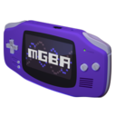 | [***mgba-enhanced***](apps/mgba-enhanced.md) | *Unofficial, Game Boy Advance Emulator.*..[ *read more* ](apps/mgba-enhanced.md)*!* | [*blob*](https://github.com/ivan-hc/AM/blob/main/programs/x86_64/mgba-enhanced) **/** [*raw*](https://raw.githubusercontent.com/ivan-hc/AM/main/programs/x86_64/mgba-enhanced) |
| 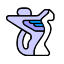 | [***mini-vmac***](apps/mini-vmac.md) | *Unofficial, a miniature Macintosh 68K emulator.*..[ *read more* ](apps/mini-vmac.md)*!* | [*blob*](https://github.com/ivan-hc/AM/blob/main/programs/x86_64/mini-vmac) **/** [*raw*](https://raw.githubusercontent.com/ivan-hc/AM/main/programs/x86_64/mini-vmac) |
| 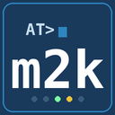 | [***modemu2k***](apps/modemu2k.md) | *A Hayes AT-command modem emulator that bridges a serial interface to TCP/Telnet.*..[ *read more* ](apps/modemu2k.md)*!* | [*blob*](https://github.com/ivan-hc/AM/blob/main/programs/x86_64/modemu2k) **/** [*raw*](https://raw.githubusercontent.com/ivan-hc/AM/main/programs/x86_64/modemu2k) |
|  | [***neko-project-ii-kai***](apps/neko-project-ii-kai.md) | *Unofficial, a PC-9801 series emulator.*..[ *read more* ](apps/neko-project-ii-kai.md)*!* | [*blob*](https://github.com/ivan-hc/AM/blob/main/programs/x86_64/neko-project-ii-kai) **/** [*raw*](https://raw.githubusercontent.com/ivan-hc/AM/main/programs/x86_64/neko-project-ii-kai) |
| 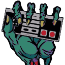 | [***nestopia***](apps/nestopia.md) | *Unofficial, Cross-platform Nestopia NES emulator core with a GUI.*..[ *read more* ](apps/nestopia.md)*!* | [*blob*](https://github.com/ivan-hc/AM/blob/main/programs/x86_64/nestopia) **/** [*raw*](https://raw.githubusercontent.com/ivan-hc/AM/main/programs/x86_64/nestopia) |
|  | [***nexen***](apps/nexen.md) | *Multi-system emulator (NES, SNES, GB, GBA, PCE, SMS/GG, WS).*..[ *read more* ](apps/nexen.md)*!* | [*blob*](https://github.com/ivan-hc/AM/blob/main/programs/x86_64/nexen) **/** [*raw*](https://raw.githubusercontent.com/ivan-hc/AM/main/programs/x86_64/nexen) |
|  | [***openmsx***](apps/openmsx.md) | *Unofficial, the MSX emulator that aims for perfection.*..[ *read more* ](apps/openmsx.md)*!* | [*blob*](https://github.com/ivan-hc/AM/blob/main/programs/x86_64/openmsx) **/** [*raw*](https://raw.githubusercontent.com/ivan-hc/AM/main/programs/x86_64/openmsx) |
|  | [***pcsx-redux-enhanced***](apps/pcsx-redux-enhanced.md) | *Unofficial, modern fork of the pcsxr PlayStation 1 emulator focused on reverse engineering and homebrew development.*..[ *read more* ](apps/pcsx-redux-enhanced.md)*!* | [*blob*](https://github.com/ivan-hc/AM/blob/main/programs/x86_64/pcsx-redux-enhanced) **/** [*raw*](https://raw.githubusercontent.com/ivan-hc/AM/main/programs/x86_64/pcsx-redux-enhanced) |
|  | [***pcsx2***](apps/pcsx2.md) | *PCSX2 is a free and open-source PlayStation 2 (PS2) emulator, using a combination of MIPS CPU Interpreters, Recompilers and a Virtual Machine which manages hardware states and PS2 system memory. This allows you to play PS2 games on your PC, with many additional features and benefits.*..[ *read more* ](apps/pcsx2.md)*!* | [*blob*](https://github.com/ivan-hc/AM/blob/main/programs/x86_64/pcsx2) **/** [*raw*](https://raw.githubusercontent.com/ivan-hc/AM/main/programs/x86_64/pcsx2) |
|  | [***pcsx2-nightly***](apps/pcsx2-nightly.md) | *PCSX2 is a free and open-source PlayStation 2 (PS2) emulator, using a combination of MIPS CPU Interpreters, Recompilers and a Virtual Machine which manages hardware states and PS2 system memory. This allows you to play PS2 games on your PC, with many additional features and benefits. This is the nightly version.*..[ *read more* ](apps/pcsx2-nightly.md)*!* | [*blob*](https://github.com/ivan-hc/AM/blob/main/programs/x86_64/pcsx2-nightly) **/** [*raw*](https://raw.githubusercontent.com/ivan-hc/AM/main/programs/x86_64/pcsx2-nightly) |
|  | [***play***](apps/play.md) | *Play! is a PlayStation2 games emulator.*..[ *read more* ](apps/play.md)*!* | [*blob*](https://github.com/ivan-hc/AM/blob/main/programs/x86_64/play) **/** [*raw*](https://raw.githubusercontent.com/ivan-hc/AM/main/programs/x86_64/play) |
|  | [***play-enhanced***](apps/play-enhanced.md) | *Unofficial, a PlayStation2 emulator.*..[ *read more* ](apps/play-enhanced.md)*!* | [*blob*](https://github.com/ivan-hc/AM/blob/main/programs/x86_64/play-enhanced) **/** [*raw*](https://raw.githubusercontent.com/ivan-hc/AM/main/programs/x86_64/play-enhanced) |
|  | [***ppsspp***](apps/ppsspp.md) | *PSP emulator written in C++.*..[ *read more* ](apps/ppsspp.md)*!* | [*blob*](https://github.com/ivan-hc/AM/blob/main/programs/x86_64/ppsspp) **/** [*raw*](https://raw.githubusercontent.com/ivan-hc/AM/main/programs/x86_64/ppsspp) |
|  | [***primehack***](apps/primehack.md) | *Unofficial AppImage of the PrimeHack emulator.*..[ *read more* ](apps/primehack.md)*!* | [*blob*](https://github.com/ivan-hc/AM/blob/main/programs/x86_64/primehack) **/** [*raw*](https://raw.githubusercontent.com/ivan-hc/AM/main/programs/x86_64/primehack) |
|  | [***punes***](apps/punes.md) | *Qt-based Nintendo Entertaiment System emulator and NSF/NSF2/NSFe Music Player.*..[ *read more* ](apps/punes.md)*!* | [*blob*](https://github.com/ivan-hc/AM/blob/main/programs/x86_64/punes) **/** [*raw*](https://raw.githubusercontent.com/ivan-hc/AM/main/programs/x86_64/punes) |
|  | [***qemu***](apps/qemu.md) | *Unofficial, a generic and open source machine & userspace emulator and virtualizer, to run a virtual machines.*..[ *read more* ](apps/qemu.md)*!* | [*blob*](https://github.com/ivan-hc/AM/blob/main/programs/x86_64/qemu) **/** [*raw*](https://raw.githubusercontent.com/ivan-hc/AM/main/programs/x86_64/qemu) |
|  | [***retroarch***](apps/retroarch.md) | *RetroArch is a free and open-source, cross-platform frontend for emulators, game engines, video games, media players and other applications.*..[ *read more* ](apps/retroarch.md)*!* | [*blob*](https://github.com/ivan-hc/AM/blob/main/programs/x86_64/retroarch) **/** [*raw*](https://raw.githubusercontent.com/ivan-hc/AM/main/programs/x86_64/retroarch) |
|  | [***retroarch-nightly***](apps/retroarch-nightly.md) | *RetroArch is a free and open-source, cross-platform frontend for emulators, game engines, video games, media players and other applications.*..[ *read more* ](apps/retroarch-nightly.md)*!* | [*blob*](https://github.com/ivan-hc/AM/blob/main/programs/x86_64/retroarch-nightly) **/** [*raw*](https://raw.githubusercontent.com/ivan-hc/AM/main/programs/x86_64/retroarch-nightly) |
|  | [***retroarch-qt***](apps/retroarch-qt.md) | *RetroArch is a free and open-source, cross-platform frontend for emulators, game engines, video games, media players and other applications.*..[ *read more* ](apps/retroarch-qt.md)*!* | [*blob*](https://github.com/ivan-hc/AM/blob/main/programs/x86_64/retroarch-qt) **/** [*raw*](https://raw.githubusercontent.com/ivan-hc/AM/main/programs/x86_64/retroarch-qt) |
|  | [***retroarch-qt-nightly***](apps/retroarch-qt-nightly.md) | *RetroArch is a free and open-source, cross-platform frontend for emulators, game engines, video games, media players and other applications.*..[ *read more* ](apps/retroarch-qt-nightly.md)*!* | [*blob*](https://github.com/ivan-hc/AM/blob/main/programs/x86_64/retroarch-qt-nightly) **/** [*raw*](https://raw.githubusercontent.com/ivan-hc/AM/main/programs/x86_64/retroarch-qt-nightly) |
|  | [***rmg-enhanced***](apps/rmg-enhanced.md) | *Unofficial AppImage of RMG N64 emulator wtih x86-64-v3 optimizations and smaller size.*..[ *read more* ](apps/rmg-enhanced.md)*!* | [*blob*](https://github.com/ivan-hc/AM/blob/main/programs/x86_64/rmg-enhanced) **/** [*raw*](https://raw.githubusercontent.com/ivan-hc/AM/main/programs/x86_64/rmg-enhanced) |
|  | [***rpcs3***](apps/rpcs3.md) | *An open-source PlayStation 3 emulator/debugger written in C++.*..[ *read more* ](apps/rpcs3.md)*!* | [*blob*](https://github.com/ivan-hc/AM/blob/main/programs/x86_64/rpcs3) **/** [*raw*](https://raw.githubusercontent.com/ivan-hc/AM/main/programs/x86_64/rpcs3) |
|  | [***ruffle***](apps/ruffle.md) | *A Flash Player emulator written in Rust.*..[ *read more* ](apps/ruffle.md)*!* | [*blob*](https://github.com/ivan-hc/AM/blob/main/programs/x86_64/ruffle) **/** [*raw*](https://raw.githubusercontent.com/ivan-hc/AM/main/programs/x86_64/ruffle) |
|  | [***ryujinx***](apps/ryujinx.md) | *An open-source Nintendo Switch emulator, originally created by gdkchan, written in C#.*..[ *read more* ](apps/ryujinx.md)*!* | [*blob*](https://github.com/ivan-hc/AM/blob/main/programs/x86_64/ryujinx) **/** [*raw*](https://raw.githubusercontent.com/ivan-hc/AM/main/programs/x86_64/ryujinx) |
|  | [***ryujinx-canary***](apps/ryujinx-canary.md) | *An open-source Nintendo Switch emulator, originally created by gdkchan, written in C# (Canary builds).*..[ *read more* ](apps/ryujinx-canary.md)*!* | [*blob*](https://github.com/ivan-hc/AM/blob/main/programs/x86_64/ryujinx-canary) **/** [*raw*](https://raw.githubusercontent.com/ivan-hc/AM/main/programs/x86_64/ryujinx-canary) |
| 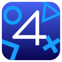 | [***shadps4***](apps/shadps4.md) | *An early PlayStation 4 emulator written in C++.*..[ *read more* ](apps/shadps4.md)*!* | [*blob*](https://github.com/ivan-hc/AM/blob/main/programs/x86_64/shadps4) **/** [*raw*](https://raw.githubusercontent.com/ivan-hc/AM/main/programs/x86_64/shadps4) |
| 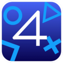 | [***shadps4-qtlauncher***](apps/shadps4-qtlauncher.md) | *The official Qt launcher for shadps4 PlayStation 4 emulator.*..[ *read more* ](apps/shadps4-qtlauncher.md)*!* | [*blob*](https://github.com/ivan-hc/AM/blob/main/programs/x86_64/shadps4-qtlauncher) **/** [*raw*](https://raw.githubusercontent.com/ivan-hc/AM/main/programs/x86_64/shadps4-qtlauncher) |
|  | [***sheepshaver***](apps/sheepshaver.md) | *Classic Macintosh emulator SheepShaver.*..[ *read more* ](apps/sheepshaver.md)*!* | [*blob*](https://github.com/ivan-hc/AM/blob/main/programs/x86_64/sheepshaver) **/** [*raw*](https://raw.githubusercontent.com/ivan-hc/AM/main/programs/x86_64/sheepshaver) |
|  | [***skyemu***](apps/skyemu.md) | *Game Boy Advance, Game Boy, Game Boy Color, and DS Emulator.*..[ *read more* ](apps/skyemu.md)*!* | [*blob*](https://github.com/ivan-hc/AM/blob/main/programs/x86_64/skyemu) **/** [*raw*](https://raw.githubusercontent.com/ivan-hc/AM/main/programs/x86_64/skyemu) |
| 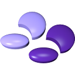 | [***snes9x***](apps/snes9x.md) | *Snes9x - Portable Super Nintendo Entertainment System TM emulator.*..[ *read more* ](apps/snes9x.md)*!* | [*blob*](https://github.com/ivan-hc/AM/blob/main/programs/x86_64/snes9x) **/** [*raw*](https://raw.githubusercontent.com/ivan-hc/AM/main/programs/x86_64/snes9x) |
| 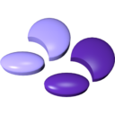 | [***snes9x-enhanced***](apps/snes9x-enhanced.md) | *Unofficial, Snes9x - Portable Super Nintendo Entertainment System TM emulator.*..[ *read more* ](apps/snes9x-enhanced.md)*!* | [*blob*](https://github.com/ivan-hc/AM/blob/main/programs/x86_64/snes9x-enhanced) **/** [*raw*](https://raw.githubusercontent.com/ivan-hc/AM/main/programs/x86_64/snes9x-enhanced) |
|  | [***stella***](apps/stella.md) | *Unofficial, A multi-platform Atari 2600 Emulator.*..[ *read more* ](apps/stella.md)*!* | [*blob*](https://github.com/ivan-hc/AM/blob/main/programs/x86_64/stella) **/** [*raw*](https://raw.githubusercontent.com/ivan-hc/AM/main/programs/x86_64/stella) |
|  | [***supermodel***](apps/supermodel.md) | *Unofficial, Sega Model 3 arcade emulator.*..[ *read more* ](apps/supermodel.md)*!* | [*blob*](https://github.com/ivan-hc/AM/blob/main/programs/x86_64/supermodel) **/** [*raw*](https://raw.githubusercontent.com/ivan-hc/AM/main/programs/x86_64/supermodel) |
|  | [***tetanes***](apps/tetanes.md) | *A cross-platform NES emulator written in Rust using wgpu.*..[ *read more* ](apps/tetanes.md)*!* | [*blob*](https://github.com/ivan-hc/AM/blob/main/programs/x86_64/tetanes) **/** [*raw*](https://raw.githubusercontent.com/ivan-hc/AM/main/programs/x86_64/tetanes) |
| 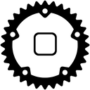 | [***touchhle***](apps/touchhle.md) | *Unofficial, High-level emulator for iPhone OS apps.*..[ *read more* ](apps/touchhle.md)*!* | [*blob*](https://github.com/ivan-hc/AM/blob/main/programs/x86_64/touchhle) **/** [*raw*](https://raw.githubusercontent.com/ivan-hc/AM/main/programs/x86_64/touchhle) |
|  | [***vita3k***](apps/vita3k.md) | *Experimental PlayStation Vita emulator.*..[ *read more* ](apps/vita3k.md)*!* | [*blob*](https://github.com/ivan-hc/AM/blob/main/programs/x86_64/vita3k) **/** [*raw*](https://raw.githubusercontent.com/ivan-hc/AM/main/programs/x86_64/vita3k) |
| 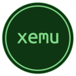 | [***xemu***](apps/xemu.md) | *Original Xbox Emulator.*..[ *read more* ](apps/xemu.md)*!* | [*blob*](https://github.com/ivan-hc/AM/blob/main/programs/x86_64/xemu) **/** [*raw*](https://raw.githubusercontent.com/ivan-hc/AM/main/programs/x86_64/xemu) |
|  | [***xemu-enhanced***](apps/xemu-enhanced.md) | *Unofficial, original Xbox Emulator for Windows, macOS, and Linux (Active Development).*..[ *read more* ](apps/xemu-enhanced.md)*!* | [*blob*](https://github.com/ivan-hc/AM/blob/main/programs/x86_64/xemu-enhanced) **/** [*raw*](https://raw.githubusercontent.com/ivan-hc/AM/main/programs/x86_64/xemu-enhanced) |
|  | [***xenia-canary***](apps/xenia-canary.md) | *Unofficial AppImage of xenia-canary Xbox360 emulator.*..[ *read more* ](apps/xenia-canary.md)*!* | [*blob*](https://github.com/ivan-hc/AM/blob/main/programs/x86_64/xenia-canary) **/** [*raw*](https://raw.githubusercontent.com/ivan-hc/AM/main/programs/x86_64/xenia-canary) |
|  | [***xenia-edge***](apps/xenia-edge.md) | *Xbox 360 Emulator Research Project, fork of the Xenia emulator, with the aim of quicker iteration and improvements to Vulkan backend.*..[ *read more* ](apps/xenia-edge.md)*!* | [*blob*](https://github.com/ivan-hc/AM/blob/main/programs/x86_64/xenia-edge) **/** [*raw*](https://raw.githubusercontent.com/ivan-hc/AM/main/programs/x86_64/xenia-edge) |
|  | [***xm8***](apps/xm8.md) | *PC-8801 emulator.*..[ *read more* ](apps/xm8.md)*!* | [*blob*](https://github.com/ivan-hc/AM/blob/main/programs/x86_64/xm8) **/** [*raw*](https://raw.githubusercontent.com/ivan-hc/AM/main/programs/x86_64/xm8) |
| 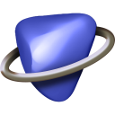 | [***ymir***](apps/ymir.md) | *Unofficial, Sega Saturn emulator.*..[ *read more* ](apps/ymir.md)*!* | [*blob*](https://github.com/ivan-hc/AM/blob/main/programs/x86_64/ymir) **/** [*raw*](https://raw.githubusercontent.com/ivan-hc/AM/main/programs/x86_64/ymir) |
|  | [***zsnes***](apps/zsnes.md) | *Unofficial, a Super Nintendo emulator.*..[ *read more* ](apps/zsnes.md)*!* | [*blob*](https://github.com/ivan-hc/AM/blob/main/programs/x86_64/zsnes) **/** [*raw*](https://raw.githubusercontent.com/ivan-hc/AM/main/programs/x86_64/zsnes) |
|  | [***zxinfo-file-browser***](apps/zxinfo-file-browser.md) | *Organize and manage your emulator files for ZX Spectrum.*..[ *read more* ](apps/zxinfo-file-browser.md)*!* | [*blob*](https://github.com/ivan-hc/AM/blob/main/programs/x86_64/zxinfo-file-browser) **/** [*raw*](https://raw.githubusercontent.com/ivan-hc/AM/main/programs/x86_64/zxinfo-file-browser) |

---

You can improve these pages via a [pull request](https://github.com/Portable-Linux-Apps/Portable-Linux-Apps.github.io/pulls) to this site's [GitHub repository](https://github.com/Portable-Linux-Apps/Portable-Linux-Apps.github.io), or report any problems related to the installation scripts in the '[issue](https://github.com/ivan-hc/AM/issues)' section of the main database, at [https://github.com/ivan-hc/AM](https://github.com/ivan-hc/AM).

***PORTABLE-LINUX-APPS.github.io is my gift to the Linux community and was made with love for GNU/Linux and the Open Source philosophy.***

---

| [Back to Home](index.md) | [Back to Applications](apps.md)
| --- | --- |

--------

# Contacts
- **Ivan-HC** *on* [**GitHub**](https://github.com/ivan-hc)
- **AM-Ivan** *on* [**Reddit**](https://www.reddit.com/u/am-ivan)

###### *You can support me and my work on [**ko-fi.com**](https://ko-fi.com/IvanAlexHC) and [**PayPal.me**](https://paypal.me/IvanAlexHC). Thank you!*

--------

*© 2020-present Ivan Alessandro Sala aka 'Ivan-HC'* - I'm here just for fun!

