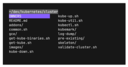

# FILE-MANAGER

| [Home](index.md) |
| --- |

#### Here are listed **25** programs and **0** items for this category and managed by [AM](https://github.com/ivan-hc/AM) 	and [AppMan](https://github.com/ivan-hc/AppMan) for the x86_64 architecture.

*Use your browser's built-in search tool to easily navigate to this page or use the tags below.*

| [Back to Applications](apps.md) |
| --- |

#### *Categories*

***[AppImages](appimages.md)*** 		 - ***[android](android.md)*** - ***[audio](audio.md)*** - ***[comic](comic.md)*** - ***[command-line](command-line.md)*** - ***[communication](communication.md)*** - ***[disk](disk.md)*** - ***[education](education.md)*** - ***[file-manager](file-manager.md)*** - ***[finance](finance.md)*** - ***[game](game.md)*** - ***[gnome](gnome.md)*** - ***[graphic](graphic.md)*** - ***[internet](internet.md)*** - ***[kde](kde.md)*** - ***[office](office.md)*** - ***[password](password.md)*** - ***[steam](steam.md)*** - ***[system-monitor](system-monitor.md)*** - ***[video](video.md)*** - ***[web-app](web-app.md)*** - ***[web-browser](web-browser.md)*** - ***[wine](wine.md)***

-----------------

*NOTE, the installer scripts in the "INSTALLER" column are intended for use via "AM", and are therefore dedicated to a system-wide 	installation of applications (in /opt), and all that "AppMan" does is convert those scripts for local installation, changing the paths. 	**They are listed here for reading purposes only**!*

*Should you decide to run them manually, the only way to remove the application is to run 	the command "`sudo /opt/appname/remove`", where "appname" is the name of the application directory containing the "remove" script. 	Likewise, you can also update applications by running the "AM-updater" script in the same directory.*

*The "AM" project allow the autonomy of installed apps, regardless of the presence of "AM" itself in the system. However, it is strongly 	recommended to use "AM" and "AppMan" to take full advantage of all the benefits you could get from an application installed in this way.*

*If you are here just to download apps manually, click on the program name and check the URL(s) on the application page. This site does not 	provide direct links, for security reasons, but it does provide the exact sources and references where you can find them!*

*Transparency and credibility are the focus of this catalog. Happy exploring!*

-----------------

| ICON | PACKAGE NAME | DESCRIPTION | INSTALLER |
| --- | --- | --- | --- |
|  | [***camelot***](apps/camelot.md) | *Camelot is cross-platform file manager written in C.*..[ *read more* ](apps/camelot.md)*!* | [*blob*](https://github.com/ivan-hc/AM/blob/main/programs/x86_64/camelot) **/** [*raw*](https://raw.githubusercontent.com/ivan-hc/AM/main/programs/x86_64/camelot) |
|  | [***cask***](apps/cask.md) | *A universal, distributed binary file manager.*..[ *read more* ](apps/cask.md)*!* | [*blob*](https://github.com/ivan-hc/AM/blob/main/programs/x86_64/cask) **/** [*raw*](https://raw.githubusercontent.com/ivan-hc/AM/main/programs/x86_64/cask) |
|  | [***clifm***](apps/clifm.md) | *The shell-like, command line terminal file manager simple, fast, extensible, and lightweight as hell.*..[ *read more* ](apps/clifm.md)*!* | [*blob*](https://github.com/ivan-hc/AM/blob/main/programs/x86_64/clifm) **/** [*raw*](https://raw.githubusercontent.com/ivan-hc/AM/main/programs/x86_64/clifm) |
|  | [***cloud-browser***](apps/cloud-browser.md) | *Access to files located in various cloud services.*..[ *read more* ](apps/cloud-browser.md)*!* | [*blob*](https://github.com/ivan-hc/AM/blob/main/programs/x86_64/cloud-browser) **/** [*raw*](https://raw.githubusercontent.com/ivan-hc/AM/main/programs/x86_64/cloud-browser) |
|  | [***corefm***](apps/corefm.md) | *A lightweight file-manager for C Suite.*..[ *read more* ](apps/corefm.md)*!* | [*blob*](https://github.com/ivan-hc/AM/blob/main/programs/x86_64/corefm) **/** [*raw*](https://raw.githubusercontent.com/ivan-hc/AM/main/programs/x86_64/corefm) |
|  | [***dfilemanager***](apps/dfilemanager.md) | *File manager written in Qt and C++.*..[ *read more* ](apps/dfilemanager.md)*!* | [*blob*](https://github.com/ivan-hc/AM/blob/main/programs/x86_64/dfilemanager) **/** [*raw*](https://raw.githubusercontent.com/ivan-hc/AM/main/programs/x86_64/dfilemanager) |
|  | [***doublecmd-gtk***](apps/doublecmd-gtk.md) | *Two-panel file manager, also known as Double Commander.*..[ *read more* ](apps/doublecmd-gtk.md)*!* | [*blob*](https://github.com/ivan-hc/AM/blob/main/programs/x86_64/doublecmd-gtk) **/** [*raw*](https://raw.githubusercontent.com/ivan-hc/AM/main/programs/x86_64/doublecmd-gtk) |
|  | [***doublecmd-qt***](apps/doublecmd-qt.md) | *Two-panel file manager, also known as Double Commander.*..[ *read more* ](apps/doublecmd-qt.md)*!* | [*blob*](https://github.com/ivan-hc/AM/blob/main/programs/x86_64/doublecmd-qt) **/** [*raw*](https://raw.githubusercontent.com/ivan-hc/AM/main/programs/x86_64/doublecmd-qt) |
|  | [***file-commander***](apps/file-commander.md) | *CLI, cross-platform Total Commander-like orthodox file manager.*..[ *read more* ](apps/file-commander.md)*!* | [*blob*](https://github.com/ivan-hc/AM/blob/main/programs/x86_64/file-commander) **/** [*raw*](https://raw.githubusercontent.com/ivan-hc/AM/main/programs/x86_64/file-commander) |
|  | [***filebrowser***](apps/filebrowser.md) | *Web File Browser.*..[ *read more* ](apps/filebrowser.md)*!* | [*blob*](https://github.com/ivan-hc/AM/blob/main/programs/x86_64/filebrowser) **/** [*raw*](https://raw.githubusercontent.com/ivan-hc/AM/main/programs/x86_64/filebrowser) |
|  | [***filebrowser-quantum***](apps/filebrowser-quantum.md) | *Web File Browser.*..[ *read more* ](apps/filebrowser-quantum.md)*!* | [*blob*](https://github.com/ivan-hc/AM/blob/main/programs/x86_64/filebrowser-quantum) **/** [*raw*](https://raw.githubusercontent.com/ivan-hc/AM/main/programs/x86_64/filebrowser-quantum) |
|  | [***fman***](apps/fman.md) | *TUI CLI File Manager.*..[ *read more* ](apps/fman.md)*!* | [*blob*](https://github.com/ivan-hc/AM/blob/main/programs/x86_64/fman) **/** [*raw*](https://raw.githubusercontent.com/ivan-hc/AM/main/programs/x86_64/fman) |
|  | [***freeman***](apps/freeman.md) | *A free, extensible, cross-platform file manager for power users.*..[ *read more* ](apps/freeman.md)*!* | [*blob*](https://github.com/ivan-hc/AM/blob/main/programs/x86_64/freeman) **/** [*raw*](https://raw.githubusercontent.com/ivan-hc/AM/main/programs/x86_64/freeman) |
|  | [***lf***](apps/lf.md) | *lf, as in "list files" is a terminal file manager written in Go.*..[ *read more* ](apps/lf.md)*!* | [*blob*](https://github.com/ivan-hc/AM/blob/main/programs/x86_64/lf) **/** [*raw*](https://raw.githubusercontent.com/ivan-hc/AM/main/programs/x86_64/lf) |
|  | [***nnn***](apps/nnn.md) | *n³ The unorthodox terminal file manager*..[ *read more* ](apps/nnn.md)*!* | [*blob*](https://github.com/ivan-hc/AM/blob/main/programs/x86_64/nnn) **/** [*raw*](https://raw.githubusercontent.com/ivan-hc/AM/main/programs/x86_64/nnn) |
|  | [***rcloneview***](apps/rcloneview.md) | *The ultimate GUI for Cloud Data Sync and File Management. Effortlessly browse, organize, transfer files across your cloud storages.*..[ *read more* ](apps/rcloneview.md)*!* | [*blob*](https://github.com/ivan-hc/AM/blob/main/programs/x86_64/rcloneview) **/** [*raw*](https://raw.githubusercontent.com/ivan-hc/AM/main/programs/x86_64/rcloneview) |
|  | [***sigma-file-manager***](apps/sigma-file-manager.md) | *A free, open-source, modern file manager.*..[ *read more* ](apps/sigma-file-manager.md)*!* | [*blob*](https://github.com/ivan-hc/AM/blob/main/programs/x86_64/sigma-file-manager) **/** [*raw*](https://raw.githubusercontent.com/ivan-hc/AM/main/programs/x86_64/sigma-file-manager) |
|  | [***superfile***](apps/superfile.md) | *Pretty fancy and modern terminal file manager.*..[ *read more* ](apps/superfile.md)*!* | [*blob*](https://github.com/ivan-hc/AM/blob/main/programs/x86_64/superfile) **/** [*raw*](https://raw.githubusercontent.com/ivan-hc/AM/main/programs/x86_64/superfile) |
|  | [***tere***](apps/tere.md) | *Terminal file explorer.*..[ *read more* ](apps/tere.md)*!* | [*blob*](https://github.com/ivan-hc/AM/blob/main/programs/x86_64/tere) **/** [*raw*](https://raw.githubusercontent.com/ivan-hc/AM/main/programs/x86_64/tere) |
|  | [***tuxplorer***](apps/tuxplorer.md) | *Tuxplorer is a terminal based file explorer.*..[ *read more* ](apps/tuxplorer.md)*!* | [*blob*](https://github.com/ivan-hc/AM/blob/main/programs/x86_64/tuxplorer) **/** [*raw*](https://raw.githubusercontent.com/ivan-hc/AM/main/programs/x86_64/tuxplorer) |
|  | [***vifm***](apps/vifm.md) | *File manager with curses interface providing Vim-like environment.*..[ *read more* ](apps/vifm.md)*!* | [*blob*](https://github.com/ivan-hc/AM/blob/main/programs/x86_64/vifm) **/** [*raw*](https://raw.githubusercontent.com/ivan-hc/AM/main/programs/x86_64/vifm) |
|  | [***walk***](apps/walk.md) | *Terminal file manager.*..[ *read more* ](apps/walk.md)*!* | [*blob*](https://github.com/ivan-hc/AM/blob/main/programs/x86_64/walk) **/** [*raw*](https://raw.githubusercontent.com/ivan-hc/AM/main/programs/x86_64/walk) |
|  | [***xplorer***](apps/xplorer.md) | *Xplorer, a customizable, modern file manager.*..[ *read more* ](apps/xplorer.md)*!* | [*blob*](https://github.com/ivan-hc/AM/blob/main/programs/x86_64/xplorer) **/** [*raw*](https://raw.githubusercontent.com/ivan-hc/AM/main/programs/x86_64/xplorer) |
|  | [***yazi***](apps/yazi.md) | *Blazing fast terminal file manager written in Rust.*..[ *read more* ](apps/yazi.md)*!* | [*blob*](https://github.com/ivan-hc/AM/blob/main/programs/x86_64/yazi) **/** [*raw*](https://raw.githubusercontent.com/ivan-hc/AM/main/programs/x86_64/yazi) |
|  | [***zxinfo-file-browser***](apps/zxinfo-file-browser.md) | *Organize and manage your emulator files for ZX Spectrum.*..[ *read more* ](apps/zxinfo-file-browser.md)*!* | [*blob*](https://github.com/ivan-hc/AM/blob/main/programs/x86_64/zxinfo-file-browser) **/** [*raw*](https://raw.githubusercontent.com/ivan-hc/AM/main/programs/x86_64/zxinfo-file-browser) |

---

You can improve these pages via a [pull request](https://github.com/Portable-Linux-Apps/Portable-Linux-Apps.github.io/pulls) 	to this site's [GitHub repository](https://github.com/Portable-Linux-Apps/Portable-Linux-Apps.github.io),  	or report any problems related to the installation scripts in the '[issue](https://github.com/ivan-hc/AM/issues)' 	section of the main database, at [https://github.com/ivan-hc/AM](https://github.com/ivan-hc/AM).

***PORTABLE-LINUX-APPS.github.io is my gift to the Linux community and was made with love for GNU/Linux and the Open Source philosophy.***

---

| [Back to Home](index.md) | [Back to Applications](apps.md)
| --- | --- |

--------

# Contacts
- **Ivan-HC** *on* [**GitHub**](https://github.com/ivan-hc)
- **AM-Ivan** *on* [**Reddit**](https://www.reddit.com/u/am-ivan)

###### *You can support me and my work on [**ko-fi.com**](https://ko-fi.com/IvanAlexHC) and 	[**PayPal.me**](https://paypal.me/IvanAlexHC). Thank you!*

--------

*© 2020-present Ivan Alessandro Sala aka 'Ivan-HC'* - I'm here just for fun!

