# GAME

| [Back to Home](index.md) | [Back to Applications](apps.md)
| --- | --- |

#### Here are listed **332** programs and **39** items for this category.

  <label for="app-search-input" style="font-weight: bold;">Search applications:</label>
  <input type="search" id="app-search-input" placeholder="Type a name or keyword..." autocomplete="off"
    style="width: 100%; max-width: 480px; padding: 0.5em 0.75em; margin-top: 0.25em; font-size: 1em; border: 1px solid #999; border-radius: 4px; box-sizing: border-box;">
  <select id="app-search-arch" aria-label="Filter by architecture"
    style="margin-top: 0.25em; padding: 0.5em; font-size: 1em; border: 1px solid #999; border-radius: 4px;">
    <option value="">Any architecture</option>
    <option value="x86_64">x86_64</option>
    <option value="aarch64">aarch64</option>
    <option value="i686">i686</option>
  </select>
  

#### *Categories*

  <a class="cat-pill" href="appimages.html">AppImages</a>
  •
  <a class="cat-pill" href="ai.html">ai</a>
  •
  <a class="cat-pill" href="am-utils.html">am-utils</a>
  •
  <a class="cat-pill" href="android.html">android</a>
  •
  <a class="cat-pill" href="appimage-on-the-fly.html">appimage-on-the-fly</a>
  •
  <a class="cat-pill" href="audio.html">audio</a>
  •
  <a class="cat-pill" href="comic.html">comic</a>
  •
  <a class="cat-pill" href="command-line.html">command-line</a>
  •
  <a class="cat-pill" href="communication.html">communication</a>
  •
  <a class="cat-pill" href="disk.html">disk</a>
  •
  <a class="cat-pill" href="education.html">education</a>
  •
  <a class="cat-pill" href="emulator.html">emulator</a>
  •
  <a class="cat-pill" href="file-manager.html">file-manager</a>
  •
  <a class="cat-pill" href="finance.html">finance</a>
  •
  <a class="cat-pill cat-pill--all" href="game.html">game</a>
  •
  <a class="cat-pill" href="gnome.html">gnome</a>
  •
  <a class="cat-pill" href="graphic.html">graphic</a>
  •
  <a class="cat-pill" href="internet.html">internet</a>
  •
  <a class="cat-pill" href="kde.html">kde</a>
  •
  <a class="cat-pill" href="metapackages.html">metapackages</a>
  •
  <a class="cat-pill" href="office.html">office</a>
  •
  <a class="cat-pill" href="password.html">password</a>
  •
  <a class="cat-pill" href="portable.html">Portable</a>
  •
  <a class="cat-pill" href="portable-cli.html">portable-cli</a>
  •
  <a class="cat-pill" href="portable-desktop.html">portable-desktop</a>
  •
  <a class="cat-pill" href="steam.html">steam</a>
  •
  <a class="cat-pill" href="system-monitor.html">system-monitor</a>
  •
  <a class="cat-pill" href="video.html">video</a>
  •
  <a class="cat-pill" href="virtual-machine.html">virtual-machine</a>
  •
  <a class="cat-pill" href="wallet.html">wallet</a>
  •
  <a class="cat-pill" href="web-app.html">web-app</a>
  •
  <a class="cat-pill" href="web-browser.html">web-browser</a>
  •
  <a class="cat-pill" href="wine.html">wine</a>
  •
  <a class="cat-pill" href="youtube.html">youtube</a>

-----------------

***NOTE, Installer scripts (blob/raw) are provided for reading only: do not run them manually! Use "[AM](https://github.com/ivan-hc/AM)" or "[AppMan](https://github.com/ivan-hc/AppMan)" instead.***

-----------------

| ICON | PACKAGE NAME | DESCRIPTION | INSTALLER |
| --- | --- | --- | --- |
|  | [***0ad***](apps/0ad.md) | *FOSS historical Real Time Strategy, RTS game of ancient warfare.*..[ *read more* ](apps/0ad.md)*!* | [*blob*](https://github.com/ivan-hc/AM/blob/main/programs/x86_64/0ad) **/** [*raw*](https://raw.githubusercontent.com/ivan-hc/AM/main/programs/x86_64/0ad) |
|  | [***0ad-prerelease***](apps/0ad-prerelease.md) | *FOSS historical Real Time Strategy, RTS game of ancient warfare (Pre-release).*..[ *read more* ](apps/0ad-prerelease.md)*!* | [*blob*](https://github.com/ivan-hc/AM/blob/main/programs/x86_64/0ad-prerelease) **/** [*raw*](https://raw.githubusercontent.com/ivan-hc/AM/main/programs/x86_64/0ad-prerelease) |
| 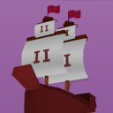 | [***2ship***](apps/2ship.md) | *2 Ship 2 Harkinian game.*..[ *read more* ](apps/2ship.md)*!* | [*blob*](https://github.com/ivan-hc/AM/blob/main/programs/x86_64/2ship) **/** [*raw*](https://raw.githubusercontent.com/ivan-hc/AM/main/programs/x86_64/2ship) |
|  | [***3d-puzzles***](apps/3d-puzzles.md) | *3D-Puzzles are Rubik, Dogic and Dogic12.*..[ *read more* ](apps/3d-puzzles.md)*!* | [*blob*](https://github.com/ivan-hc/AM/blob/main/programs/x86_64/3d-puzzles) **/** [*raw*](https://raw.githubusercontent.com/ivan-hc/AM/main/programs/x86_64/3d-puzzles) |
|  | [***aaaaxy***](apps/aaaaxy.md) | *A nonlinear puzzle platformer, game.*..[ *read more* ](apps/aaaaxy.md)*!* | [*blob*](https://github.com/ivan-hc/AM/blob/main/programs/x86_64/aaaaxy) **/** [*raw*](https://raw.githubusercontent.com/ivan-hc/AM/main/programs/x86_64/aaaaxy) |
|  | [***adobe-flash-player***](apps/adobe-flash-player.md) | *Unofficial port. Adobe Flash is a mostly discontinued multimedia software platform used for production of animations, rich internet applications, desktop applications, mobile apps, mobile games, and embedded web browser video players. Over 67 billion devices use adobe flash player!*..[ *read more* ](apps/adobe-flash-player.md)*!* | [*blob*](https://github.com/ivan-hc/AM/blob/main/programs/x86_64/adobe-flash-player) **/** [*raw*](https://raw.githubusercontent.com/ivan-hc/AM/main/programs/x86_64/adobe-flash-player) |
| 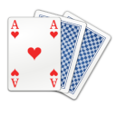 | [***aisleriot***](apps/aisleriot.md) | *Unofficial. A card game featuring over 80 different solitaire-type card games.*..[ *read more* ](apps/aisleriot.md)*!* | [*blob*](https://github.com/ivan-hc/AM/blob/main/programs/x86_64/aisleriot) **/** [*raw*](https://raw.githubusercontent.com/ivan-hc/AM/main/programs/x86_64/aisleriot) |
| 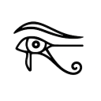 | [***akhenaten***](apps/akhenaten.md) | *Unofficial, open-source engine for Pharaoh (+Cleopatra) city-building game.*..[ *read more* ](apps/akhenaten.md)*!* | [*blob*](https://github.com/ivan-hc/AM/blob/main/programs/x86_64/akhenaten) **/** [*raw*](https://raw.githubusercontent.com/ivan-hc/AM/main/programs/x86_64/akhenaten) |
|  | [***alvr***](apps/alvr.md) | *Stream VR games from your PC to your headset via Wi-Fi.*..[ *read more* ](apps/alvr.md)*!* | [*blob*](https://github.com/ivan-hc/AM/blob/main/programs/x86_64/alvr) **/** [*raw*](https://raw.githubusercontent.com/ivan-hc/AM/main/programs/x86_64/alvr) |
|  | [***antimicrox***](apps/antimicrox.md) | *Use a gamepad to control a variety of programs.*..[ *read more* ](apps/antimicrox.md)*!* | [*blob*](https://github.com/ivan-hc/AM/blob/main/programs/x86_64/antimicrox) **/** [*raw*](https://raw.githubusercontent.com/ivan-hc/AM/main/programs/x86_64/antimicrox) |
|  | [***arcade-manager***](apps/arcade-manager.md) | *Manage your rom collection, Games/Retropie & Recalbox.*..[ *read more* ](apps/arcade-manager.md)*!* | [*blob*](https://github.com/ivan-hc/AM/blob/main/programs/x86_64/arcade-manager) **/** [*raw*](https://raw.githubusercontent.com/ivan-hc/AM/main/programs/x86_64/arcade-manager) |
|  | [***archipelago***](apps/archipelago.md) | *Archipelago Multi-Game Randomizer and Server.*..[ *read more* ](apps/archipelago.md)*!* | [*blob*](https://github.com/ivan-hc/AM/blob/main/programs/x86_64/archipelago) **/** [*raw*](https://raw.githubusercontent.com/ivan-hc/AM/main/programs/x86_64/archipelago) |
|  | [***archisteamfarm***](apps/archisteamfarm.md) | *C# application with primary purpose of farming Steam cards from multiple accounts simultaneously.*..[ *read more* ](apps/archisteamfarm.md)*!* | [*blob*](https://github.com/ivan-hc/AM/blob/main/programs/x86_64/archisteamfarm) **/** [*raw*](https://raw.githubusercontent.com/ivan-hc/AM/main/programs/x86_64/archisteamfarm) |
|  | [***arena-tracker***](apps/arena-tracker.md) | *Deck Tracker for Hearthstone game with arena in focus.*..[ *read more* ](apps/arena-tracker.md)*!* | [*blob*](https://github.com/ivan-hc/AM/blob/main/programs/x86_64/arena-tracker) **/** [*raw*](https://raw.githubusercontent.com/ivan-hc/AM/main/programs/x86_64/arena-tracker) |
|  | [***arma3-unix-launcher***](apps/arma3-unix-launcher.md) | *ArmA 3 Unix Launcher, game.*..[ *read more* ](apps/arma3-unix-launcher.md)*!* | [*blob*](https://github.com/ivan-hc/AM/blob/main/programs/x86_64/arma3-unix-launcher) **/** [*raw*](https://raw.githubusercontent.com/ivan-hc/AM/main/programs/x86_64/arma3-unix-launcher) |
|  | [***armagetronad***](apps/armagetronad.md) | *Multiplayer game in 3d that emulates the movie "Tron".*..[ *read more* ](apps/armagetronad.md)*!* | [*blob*](https://github.com/ivan-hc/AM/blob/main/programs/x86_64/armagetronad) **/** [*raw*](https://raw.githubusercontent.com/ivan-hc/AM/main/programs/x86_64/armagetronad) |
|  | [***artix***](apps/artix.md) | *One app. All your favorite Artix games.*..[ *read more* ](apps/artix.md)*!* | [*blob*](https://github.com/ivan-hc/AM/blob/main/programs/x86_64/artix) **/** [*raw*](https://raw.githubusercontent.com/ivan-hc/AM/main/programs/x86_64/artix) |
|  | [***augustus***](apps/augustus.md) | *An open source re-implementation of the game Caesar III.*..[ *read more* ](apps/augustus.md)*!* | [*blob*](https://github.com/ivan-hc/AM/blob/main/programs/x86_64/augustus) **/** [*raw*](https://raw.githubusercontent.com/ivan-hc/AM/main/programs/x86_64/augustus) |
|  | [***augustus-enhanced***](apps/augustus-enhanced.md) | *Unofficial, a fork of the Julius project that intends to incorporate gameplay changes.*..[ *read more* ](apps/augustus-enhanced.md)*!* | [*blob*](https://github.com/ivan-hc/AM/blob/main/programs/x86_64/augustus-enhanced) **/** [*raw*](https://raw.githubusercontent.com/ivan-hc/AM/main/programs/x86_64/augustus-enhanced) |
|  | [***azaharplus-pkg-extractor***](apps/azaharplus-pkg-extractor.md) | *Standalone PKG extractor CLI based on code that used to be in ShadPS4 PlayStation 4 emulator written in C++.*..[ *read more* ](apps/azaharplus-pkg-extractor.md)*!* | [*blob*](https://github.com/ivan-hc/AM/blob/main/programs/x86_64/azaharplus-pkg-extractor) **/** [*raw*](https://raw.githubusercontent.com/ivan-hc/AM/main/programs/x86_64/azaharplus-pkg-extractor) |
|  | [***badlion***](apps/badlion.md) | *Most Complete All-In-One Mod Library for Minecraft with 100+ Mods.*..[ *read more* ](apps/badlion.md)*!* | [*blob*](https://github.com/ivan-hc/AM/blob/main/programs/x86_64/badlion) **/** [*raw*](https://raw.githubusercontent.com/ivan-hc/AM/main/programs/x86_64/badlion) |
| 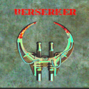 | [***berserkerquake2***](apps/berserkerquake2.md) | *Berserker@Quake2 game engine, ported to SDL2 library.*..[ *read more* ](apps/berserkerquake2.md)*!* | [*blob*](https://github.com/ivan-hc/AM/blob/main/programs/x86_64/berserkerquake2) **/** [*raw*](https://raw.githubusercontent.com/ivan-hc/AM/main/programs/x86_64/berserkerquake2) |
|  | [***beyond-all-reason***](apps/beyond-all-reason.md) | *3D Real-Time Strategy Total Annihilation Inspired, game.*..[ *read more* ](apps/beyond-all-reason.md)*!* | [*blob*](https://github.com/ivan-hc/AM/blob/main/programs/x86_64/beyond-all-reason) **/** [*raw*](https://raw.githubusercontent.com/ivan-hc/AM/main/programs/x86_64/beyond-all-reason) |
|  | [***bezique***](apps/bezique.md) | *Plays bezique game against the AI.*..[ *read more* ](apps/bezique.md)*!* | [*blob*](https://github.com/ivan-hc/AM/blob/main/programs/x86_64/bezique) **/** [*raw*](https://raw.githubusercontent.com/ivan-hc/AM/main/programs/x86_64/bezique) |
|  | [***billard-gl***](apps/billard-gl.md) | *Unofficial. 3D billiards game, play a game of 8-ball or 9-ball.*..[ *read more* ](apps/billard-gl.md)*!* | [*blob*](https://github.com/ivan-hc/AM/blob/main/programs/x86_64/billard-gl) **/** [*raw*](https://raw.githubusercontent.com/ivan-hc/AM/main/programs/x86_64/billard-gl) |
| 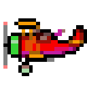 | [***biplanes-revival***](apps/biplanes-revival.md) | *An old cellphone arcade recreated for PC.*..[ *read more* ](apps/biplanes-revival.md)*!* | [*blob*](https://github.com/ivan-hc/AM/blob/main/programs/x86_64/biplanes-revival) **/** [*raw*](https://raw.githubusercontent.com/ivan-hc/AM/main/programs/x86_64/biplanes-revival) |
| 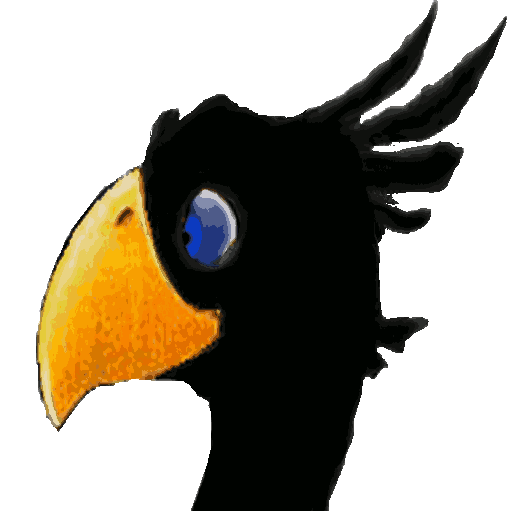 | [***black-chocobo***](apps/black-chocobo.md) | *FF7 Save Game Editor.*..[ *read more* ](apps/black-chocobo.md)*!* | [*blob*](https://github.com/ivan-hc/AM/blob/main/programs/x86_64/black-chocobo) **/** [*raw*](https://raw.githubusercontent.com/ivan-hc/AM/main/programs/x86_64/black-chocobo) |
|  | [***blockbench***](apps/blockbench.md) | *Editor for boxy models and pixel art textures like Minecraft.*..[ *read more* ](apps/blockbench.md)*!* | [*blob*](https://github.com/ivan-hc/AM/blob/main/programs/x86_64/blockbench) **/** [*raw*](https://raw.githubusercontent.com/ivan-hc/AM/main/programs/x86_64/blockbench) |
| 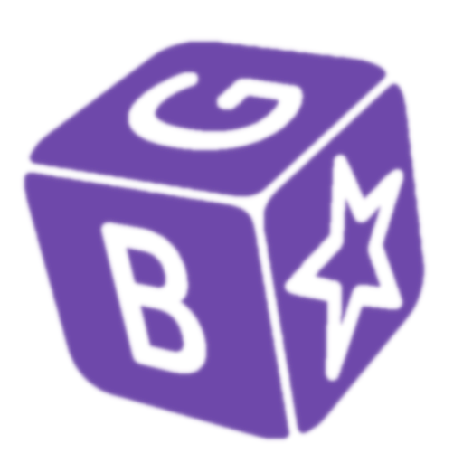 | [***boardgamestar***](apps/boardgamestar.md) | *A platform for playing digital boardgames.*..[ *read more* ](apps/boardgamestar.md)*!* | [*blob*](https://github.com/ivan-hc/AM/blob/main/programs/x86_64/boardgamestar) **/** [*raw*](https://raw.githubusercontent.com/ivan-hc/AM/main/programs/x86_64/boardgamestar) |
|  | [***boilr***](apps/boilr.md) | *Synchronize games from other platforms into your Steam library.*..[ *read more* ](apps/boilr.md)*!* | [*blob*](https://github.com/ivan-hc/AM/blob/main/programs/x86_64/boilr) **/** [*raw*](https://raw.githubusercontent.com/ivan-hc/AM/main/programs/x86_64/boilr) |
|  | [***bomber***](apps/kdegames.md) | *Arcade spaceship game. This is part of "kdegames".*..[ *read more* ](apps/kdegames.md)*!* | [*blob*](https://github.com/ivan-hc/AM/blob/main/programs/x86_64/kdegames) **/** [*raw*](https://raw.githubusercontent.com/ivan-hc/AM/main/programs/x86_64/kdegames) |
|  | [***bottles***](apps/bottles.md) | *Unofficial. Manage wine prefixes and run Windows software & games in a new way.*..[ *read more* ](apps/bottles.md)*!* | [*blob*](https://github.com/ivan-hc/AM/blob/main/programs/x86_64/bottles) **/** [*raw*](https://raw.githubusercontent.com/ivan-hc/AM/main/programs/x86_64/bottles) |
|  | [***bovo***](apps/kdegames.md) | *Five in a row game from. This is part of "kdegames".*..[ *read more* ](apps/kdegames.md)*!* | [*blob*](https://github.com/ivan-hc/AM/blob/main/programs/x86_64/kdegames) **/** [*raw*](https://raw.githubusercontent.com/ivan-hc/AM/main/programs/x86_64/kdegames) |
|  | [***bugdom***](apps/bugdom.md) | *Pangea Software's Bugdom game.*..[ *read more* ](apps/bugdom.md)*!* | [*blob*](https://github.com/ivan-hc/AM/blob/main/programs/x86_64/bugdom) **/** [*raw*](https://raw.githubusercontent.com/ivan-hc/AM/main/programs/x86_64/bugdom) |
|  | [***c-evo***](apps/c-evo.md) | *C-evo is an empire building game based on Civilization II, but with a different focus. It aims to be a pure game with all players playing to win.*..[ *read more* ](apps/c-evo.md)*!* | [*blob*](https://github.com/ivan-hc/AM/blob/main/programs/x86_64/c-evo) **/** [*raw*](https://raw.githubusercontent.com/ivan-hc/AM/main/programs/x86_64/c-evo) |
|  | [***cartridges***](apps/cartridges.md) | *Unofficial. Game launcher, which helps you visualize your game collection and easily launch games.*..[ *read more* ](apps/cartridges.md)*!* | [*blob*](https://github.com/ivan-hc/AM/blob/main/programs/x86_64/cartridges) **/** [*raw*](https://raw.githubusercontent.com/ivan-hc/AM/main/programs/x86_64/cartridges) |
|  | [***casterr***](apps/casterr.md) | *Screen recorder, easing recording and clipping in-game.*..[ *read more* ](apps/casterr.md)*!* | [*blob*](https://github.com/ivan-hc/AM/blob/main/programs/x86_64/casterr) **/** [*raw*](https://raw.githubusercontent.com/ivan-hc/AM/main/programs/x86_64/casterr) |
|  | [***cavoke***](apps/cavoke.md) | *Platform to create/host multiplayer turn-based board games.*..[ *read more* ](apps/cavoke.md)*!* | [*blob*](https://github.com/ivan-hc/AM/blob/main/programs/x86_64/cavoke) **/** [*raw*](https://raw.githubusercontent.com/ivan-hc/AM/main/programs/x86_64/cavoke) |
| 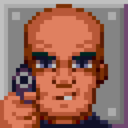 | [***cdogs-sdl***](apps/cdogs-sdl.md) | *Unofficial, classic overhead run-and-gun game.*..[ *read more* ](apps/cdogs-sdl.md)*!* | [*blob*](https://github.com/ivan-hc/AM/blob/main/programs/x86_64/cdogs-sdl) **/** [*raw*](https://raw.githubusercontent.com/ivan-hc/AM/main/programs/x86_64/cdogs-sdl) |
|  | [***celeste64***](apps/celeste64.md) | *A game made by the Celeste developers.*..[ *read more* ](apps/celeste64.md)*!* | [*blob*](https://github.com/ivan-hc/AM/blob/main/programs/x86_64/celeste64) **/** [*raw*](https://raw.githubusercontent.com/ivan-hc/AM/main/programs/x86_64/celeste64) |
|  | [***cemu***](apps/cemu.md) | *A Nintendo Wii U emulator that is able to run most Wii U games.*..[ *read more* ](apps/cemu.md)*!* | [*blob*](https://github.com/ivan-hc/AM/blob/main/programs/x86_64/cemu) **/** [*raw*](https://raw.githubusercontent.com/ivan-hc/AM/main/programs/x86_64/cemu) |
|  | [***cemu-enhanced***](apps/cemu-enhanced.md) | *Unofficial AppImage of Cemu, Nintendo Wii U emulator that is able to run most Wii U games, which is able to work on any linux distro.*..[ *read more* ](apps/cemu-enhanced.md)*!* | [*blob*](https://github.com/ivan-hc/AM/blob/main/programs/x86_64/cemu-enhanced) **/** [*raw*](https://raw.githubusercontent.com/ivan-hc/AM/main/programs/x86_64/cemu-enhanced) |
|  | [***cheatbreaker***](apps/cheatbreaker.md) | *The free FPS boosting modpack for Minecraft 1.7 & 1.8.*..[ *read more* ](apps/cheatbreaker.md)*!* | [*blob*](https://github.com/ivan-hc/AM/blob/main/programs/x86_64/cheatbreaker) **/** [*raw*](https://raw.githubusercontent.com/ivan-hc/AM/main/programs/x86_64/cheatbreaker) |
|  | [***chess-tui***](apps/chess-tui.md) | *Play chess from your terminal.*..[ *read more* ](apps/chess-tui.md)*!* | [*blob*](https://github.com/ivan-hc/AM/blob/main/programs/x86_64/chess-tui) **/** [*raw*](https://raw.githubusercontent.com/ivan-hc/AM/main/programs/x86_64/chess-tui) |
|  | [***chessmd***](apps/chessmd.md) | *Open source chess training software. Play against bots, analyze with engines, explore chess openings, and more.*..[ *read more* ](apps/chessmd.md)*!* | [*blob*](https://github.com/ivan-hc/AM/blob/main/programs/x86_64/chessmd) **/** [*raw*](https://raw.githubusercontent.com/ivan-hc/AM/main/programs/x86_64/chessmd) |
|  | [***chromium-bsu***](apps/chromium-bsu.md) | *Unofficial. Fast paced arcade style scrolling space shooter, game.*..[ *read more* ](apps/chromium-bsu.md)*!* | [*blob*](https://github.com/ivan-hc/AM/blob/main/programs/x86_64/chromium-bsu) **/** [*raw*](https://raw.githubusercontent.com/ivan-hc/AM/main/programs/x86_64/chromium-bsu) |
|  | [***classicube***](apps/classicube.md) | *Unofficial, Custom Minecraft Classic / ClassiCube client written in C from scratch*..[ *read more* ](apps/classicube.md)*!* | [*blob*](https://github.com/ivan-hc/AM/blob/main/programs/x86_64/classicube) **/** [*raw*](https://raw.githubusercontent.com/ivan-hc/AM/main/programs/x86_64/classicube) |
|  | [***cncra2yr***](apps/cncra2yr.md) | *C&C Red Alert 2, a real-time strategy game by Westwood Pacific.*..[ *read more* ](apps/cncra2yr.md)*!* | [*blob*](https://github.com/ivan-hc/AM/blob/main/programs/x86_64/cncra2yr) **/** [*raw*](https://raw.githubusercontent.com/ivan-hc/AM/main/programs/x86_64/cncra2yr) |
|  | [***coal-launcher***](apps/coal-launcher.md) | *A client to view and play games from the AB Coal website.*..[ *read more* ](apps/coal-launcher.md)*!* | [*blob*](https://github.com/ivan-hc/AM/blob/main/programs/x86_64/coal-launcher) **/** [*raw*](https://raw.githubusercontent.com/ivan-hc/AM/main/programs/x86_64/coal-launcher) |
|  | [***crawl-ncurses***](apps/crawl-ncurses.md) | *open-source, single-player, role-playing roguelike game of exploration and treasure-hunting - ncurses version (terminal)*..[ *read more* ](apps/crawl-ncurses.md)*!* | [*blob*](https://github.com/ivan-hc/AM/blob/main/programs/x86_64/crawl-ncurses) **/** [*raw*](https://raw.githubusercontent.com/ivan-hc/AM/main/programs/x86_64/crawl-ncurses) |
|  | [***crawl-tiles***](apps/crawl-tiles.md) | *open-source, single-player, role-playing roguelike game of exploration and treasure-hunting - graphical version (SDL)*..[ *read more* ](apps/crawl-tiles.md)*!* | [*blob*](https://github.com/ivan-hc/AM/blob/main/programs/x86_64/crawl-tiles) **/** [*raw*](https://raw.githubusercontent.com/ivan-hc/AM/main/programs/x86_64/crawl-tiles) |
| 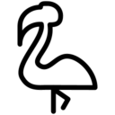 | [***crg-data-tool***](apps/crg-data-tool.md) | *A tool for working with Games Data files from CRG.*..[ *read more* ](apps/crg-data-tool.md)*!* | [*blob*](https://github.com/ivan-hc/AM/blob/main/programs/x86_64/crg-data-tool) **/** [*raw*](https://raw.githubusercontent.com/ivan-hc/AM/main/programs/x86_64/crg-data-tool) |
|  | [***crispy-doom***](apps/crispy-doom.md) | *Unofficial, a limit-removing enhanced-resolution Doom source port based on Chocolate Doom.*..[ *read more* ](apps/crispy-doom.md)*!* | [*blob*](https://github.com/ivan-hc/AM/blob/main/programs/x86_64/crispy-doom) **/** [*raw*](https://raw.githubusercontent.com/ivan-hc/AM/main/programs/x86_64/crispy-doom) |
|  | [***cromagrally***](apps/cromagrally.md) | *The wildest racing game since man invented the wheel!*..[ *read more* ](apps/cromagrally.md)*!* | [*blob*](https://github.com/ivan-hc/AM/blob/main/programs/x86_64/cromagrally) **/** [*raw*](https://raw.githubusercontent.com/ivan-hc/AM/main/programs/x86_64/cromagrally) |
| 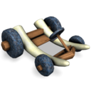 | [***cromagrally-enhanced***](apps/cromagrally-enhanced.md) | *Unofficial, the wildest racing game since man invented the wheel!*..[ *read more* ](apps/cromagrally-enhanced.md)*!* | [*blob*](https://github.com/ivan-hc/AM/blob/main/programs/x86_64/cromagrally-enhanced) **/** [*raw*](https://raw.githubusercontent.com/ivan-hc/AM/main/programs/x86_64/cromagrally-enhanced) |
|  | [***cuberite***](apps/cuberite.md) | *Unofficial, a lightweight, fast and extensible game server for Minecraft.*..[ *read more* ](apps/cuberite.md)*!* | [*blob*](https://github.com/ivan-hc/AM/blob/main/programs/x86_64/cuberite) **/** [*raw*](https://raw.githubusercontent.com/ivan-hc/AM/main/programs/x86_64/cuberite) |
|  | [***curseforge***](apps/curseforge.md) | *Discover endless mods for your favorite games, or forge your own and share them with millions.*..[ *read more* ](apps/curseforge.md)*!* | [*blob*](https://github.com/ivan-hc/AM/blob/main/programs/x86_64/curseforge) **/** [*raw*](https://raw.githubusercontent.com/ivan-hc/AM/main/programs/x86_64/curseforge) |
|  | [***cutechess***](apps/cutechess.md) | *Cute Chess is a GUI, a CLI and a library for playing chess.*..[ *read more* ](apps/cutechess.md)*!* | [*blob*](https://github.com/ivan-hc/AM/blob/main/programs/x86_64/cutechess) **/** [*raw*](https://raw.githubusercontent.com/ivan-hc/AM/main/programs/x86_64/cutechess) |
|  | [***deadgame-2048***](apps/deadgame-2048.md) | *GUI tool available for ALL platforms.*..[ *read more* ](apps/deadgame-2048.md)*!* | [*blob*](https://github.com/ivan-hc/AM/blob/main/programs/x86_64/deadgame-2048) **/** [*raw*](https://raw.githubusercontent.com/ivan-hc/AM/main/programs/x86_64/deadgame-2048) |
|  | [***dealers-choice***](apps/dealers-choice.md) | *A cross-platform, networked multiplayer poker game supporting draw, stud, and community-card variants, including Texas.*..[ *read more* ](apps/dealers-choice.md)*!* | [*blob*](https://github.com/ivan-hc/AM/blob/main/programs/x86_64/dealers-choice) **/** [*raw*](https://raw.githubusercontent.com/ivan-hc/AM/main/programs/x86_64/dealers-choice) |
| 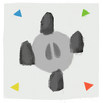 | [***deerportal***](apps/deerportal.md) | *Full of the diamonds board game.*..[ *read more* ](apps/deerportal.md)*!* | [*blob*](https://github.com/ivan-hc/AM/blob/main/programs/x86_64/deerportal) **/** [*raw*](https://raw.githubusercontent.com/ivan-hc/AM/main/programs/x86_64/deerportal) |
|  | [***defold***](apps/defold.md) | *Unofficial, Defold is a completely free to use game engine for development of games.*..[ *read more* ](apps/defold.md)*!* | [*blob*](https://github.com/ivan-hc/AM/blob/main/programs/x86_64/defold) **/** [*raw*](https://raw.githubusercontent.com/ivan-hc/AM/main/programs/x86_64/defold) |
| 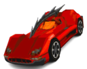 | [***dethrace***](apps/dethrace.md) | *Unofficial, reverse engineering the 1997 game "Carmageddon".*..[ *read more* ](apps/dethrace.md)*!* | [*blob*](https://github.com/ivan-hc/AM/blob/main/programs/x86_64/dethrace) **/** [*raw*](https://raw.githubusercontent.com/ivan-hc/AM/main/programs/x86_64/dethrace) |
|  | [***dhewm3***](apps/dhewm3.md) | *Unofficial, doom 3 GPL source port.*..[ *read more* ](apps/dhewm3.md)*!* | [*blob*](https://github.com/ivan-hc/AM/blob/main/programs/x86_64/dhewm3) **/** [*raw*](https://raw.githubusercontent.com/ivan-hc/AM/main/programs/x86_64/dhewm3) |
|  | [***dinosaurplanetrecompiled***](apps/dinosaurplanetrecompiled.md) | *A static recompilation/native port of the game Dinosaur Planet.*..[ *read more* ](apps/dinosaurplanetrecompiled.md)*!* | [*blob*](https://github.com/ivan-hc/AM/blob/main/programs/x86_64/dinosaurplanetrecompiled) **/** [*raw*](https://raw.githubusercontent.com/ivan-hc/AM/main/programs/x86_64/dinosaurplanetrecompiled) |
|  | [***discord***](apps/discord.md) | *Unofficial. All-in-one voice and text chat for gamers that's free, secure, and works on both your desktop and phone.*..[ *read more* ](apps/discord.md)*!* | [*blob*](https://github.com/ivan-hc/AM/blob/main/programs/x86_64/discord) **/** [*raw*](https://raw.githubusercontent.com/ivan-hc/AM/main/programs/x86_64/discord) |
|  | [***dolphin-emu***](apps/dolphin-emu.md) | *Unofficial, GameCube/Nintento Wii emulator with improvements.*..[ *read more* ](apps/dolphin-emu.md)*!* | [*blob*](https://github.com/ivan-hc/AM/blob/main/programs/x86_64/dolphin-emu) **/** [*raw*](https://raw.githubusercontent.com/ivan-hc/AM/main/programs/x86_64/dolphin-emu) |
|  | [***doom64exultra***](apps/doom64exultra.md) | *Unofficial, A fork of DOOM64EX+ with new stuff and fixes.*..[ *read more* ](apps/doom64exultra.md)*!* | [*blob*](https://github.com/ivan-hc/AM/blob/main/programs/x86_64/doom64exultra) **/** [*raw*](https://raw.githubusercontent.com/ivan-hc/AM/main/programs/x86_64/doom64exultra) |
|  | [***dosbox-x***](apps/dosbox-x.md) | *Unofficial, DOSBox-X is a cross-platform DOS emulator for running many MS-DOS games.*..[ *read more* ](apps/dosbox-x.md)*!* | [*blob*](https://github.com/ivan-hc/AM/blob/main/programs/x86_64/dosbox-x) **/** [*raw*](https://raw.githubusercontent.com/ivan-hc/AM/main/programs/x86_64/dosbox-x) |
|  | [***dr-robotniks-ring-racers***](apps/dr-robotniks-ring-racers.md) | *Unofficial, kart racing video game originally based on SRB2Kart.*..[ *read more* ](apps/dr-robotniks-ring-racers.md)*!* | [*blob*](https://github.com/ivan-hc/AM/blob/main/programs/x86_64/dr-robotniks-ring-racers) **/** [*raw*](https://raw.githubusercontent.com/ivan-hc/AM/main/programs/x86_64/dr-robotniks-ring-racers) |
|  | [***droidcam***](apps/droidcam.md) | *A DroidCam AppImage for the Steam Deck/SteamOS 3.0.*..[ *read more* ](apps/droidcam.md)*!* | [*blob*](https://github.com/ivan-hc/AM/blob/main/programs/x86_64/droidcam) **/** [*raw*](https://raw.githubusercontent.com/ivan-hc/AM/main/programs/x86_64/droidcam) |
| 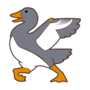 | [***dsda-doom***](apps/dsda-doom.md) | *This is a successor of prboom+ with extra tooling for demo recording and playback, with a focus on speedrunning and quality of life.*..[ *read more* ](apps/dsda-doom.md)*!* | [*blob*](https://github.com/ivan-hc/AM/blob/main/programs/x86_64/dsda-doom) **/** [*raw*](https://raw.githubusercontent.com/ivan-hc/AM/main/programs/x86_64/dsda-doom) |
|  | [***duckstation***](apps/duckstation.md) | *PlayStation 1, aka PSX games Emulator.*..[ *read more* ](apps/duckstation.md)*!* | [*blob*](https://github.com/ivan-hc/AM/blob/main/programs/x86_64/duckstation) **/** [*raw*](https://raw.githubusercontent.com/ivan-hc/AM/main/programs/x86_64/duckstation) |
|  | [***duckstation-gpl-enhanced***](apps/duckstation-gpl-enhanced.md) | *Unofficial, fast PlayStation 1 emulator when it was still using GPLv3.*..[ *read more* ](apps/duckstation-gpl-enhanced.md)*!* | [*blob*](https://github.com/ivan-hc/AM/blob/main/programs/x86_64/duckstation-gpl-enhanced) **/** [*raw*](https://raw.githubusercontent.com/ivan-hc/AM/main/programs/x86_64/duckstation-gpl-enhanced) |
|  | [***duelyst***](apps/duelyst.md) | *A digital collectible card game and turn-based strategy hybrid.*..[ *read more* ](apps/duelyst.md)*!* | [*blob*](https://github.com/ivan-hc/AM/blob/main/programs/x86_64/duelyst) **/** [*raw*](https://raw.githubusercontent.com/ivan-hc/AM/main/programs/x86_64/duelyst) |
|  | [***dusklight***](apps/dusklight.md) | *Dusklight brings a classic adventure to PC and mobile platforms with a variety of fixes and improvements.*..[ *read more* ](apps/dusklight.md)*!* | [*blob*](https://github.com/ivan-hc/AM/blob/main/programs/x86_64/dusklight) **/** [*raw*](https://raw.githubusercontent.com/ivan-hc/AM/main/programs/x86_64/dusklight) |
|  | [***dust3d***](apps/dust3d.md) | *3D modeling software for games, 3D printing, and so on.*..[ *read more* ](apps/dust3d.md)*!* | [*blob*](https://github.com/ivan-hc/AM/blob/main/programs/x86_64/dust3d) **/** [*raw*](https://raw.githubusercontent.com/ivan-hc/AM/main/programs/x86_64/dust3d) |
|  | [***dwarffortress***](apps/dwarffortress.md) | *A Dwarf Fortress game. Build a fortress and try to help your dwarves survive against a deeply generated world.*..[ *read more* ](apps/dwarffortress.md)*!* | [*blob*](https://github.com/ivan-hc/AM/blob/main/programs/x86_64/dwarffortress) **/** [*raw*](https://raw.githubusercontent.com/ivan-hc/AM/main/programs/x86_64/dwarffortress) |
|  | [***eden***](apps/eden.md) | *An experimental open-source emulator for Nintendo Switch (yuzu fork).*..[ *read more* ](apps/eden.md)*!* | [*blob*](https://github.com/ivan-hc/AM/blob/main/programs/x86_64/eden) **/** [*raw*](https://raw.githubusercontent.com/ivan-hc/AM/main/programs/x86_64/eden) |
|  | [***eden-nightly***](apps/eden-nightly.md) | *An experimental open-source emulator for Nintendo Switch (yuzu fork, nightly builds).*..[ *read more* ](apps/eden-nightly.md)*!* | [*blob*](https://github.com/ivan-hc/AM/blob/main/programs/x86_64/eden-nightly) **/** [*raw*](https://raw.githubusercontent.com/ivan-hc/AM/main/programs/x86_64/eden-nightly) |
| 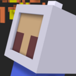 | [***eksplode.re***](apps/eksplode.re.md) | *Bomberman game made with Godot under BSD3.*..[ *read more* ](apps/eksplode.re.md)*!* | [*blob*](https://github.com/ivan-hc/AM/blob/main/programs/x86_64/eksplode.re) **/** [*raw*](https://raw.githubusercontent.com/ivan-hc/AM/main/programs/x86_64/eksplode.re) |
| 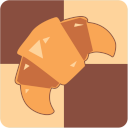 | [***en-croissant***](apps/en-croissant.md) | *The Ultimate Chess Toolkit.*..[ *read more* ](apps/en-croissant.md)*!* | [*blob*](https://github.com/ivan-hc/AM/blob/main/programs/x86_64/en-croissant) **/** [*raw*](https://raw.githubusercontent.com/ivan-hc/AM/main/programs/x86_64/en-croissant) |
| 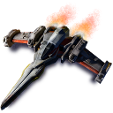 | [***endless-sky***](apps/endless-sky.md) | *Space exploration and combat game.*..[ *read more* ](apps/endless-sky.md)*!* | [*blob*](https://github.com/ivan-hc/AM/blob/main/programs/x86_64/endless-sky) **/** [*raw*](https://raw.githubusercontent.com/ivan-hc/AM/main/programs/x86_64/endless-sky) |
|  | [***eternal-lands***](apps/eternal-lands.md) | *3D fantasy multiplayer online role playing game.*..[ *read more* ](apps/eternal-lands.md)*!* | [*blob*](https://github.com/ivan-hc/AM/blob/main/programs/x86_64/eternal-lands) **/** [*raw*](https://raw.githubusercontent.com/ivan-hc/AM/main/programs/x86_64/eternal-lands) |
|  | [***eternalmodmanager***](apps/eternalmodmanager.md) | *A cross platform mod manager for DOOM Eternal.*..[ *read more* ](apps/eternalmodmanager.md)*!* | [*blob*](https://github.com/ivan-hc/AM/blob/main/programs/x86_64/eternalmodmanager) **/** [*raw*](https://raw.githubusercontent.com/ivan-hc/AM/main/programs/x86_64/eternalmodmanager) |
| 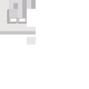 | [***exsplode.re***](apps/exsplode.re.md) | *A Bomberman game made with Godot under BSD3.*..[ *read more* ](apps/exsplode.re.md)*!* | [*blob*](https://github.com/ivan-hc/AM/blob/main/programs/x86_64/exsplode.re) **/** [*raw*](https://raw.githubusercontent.com/ivan-hc/AM/main/programs/x86_64/exsplode.re) |
| 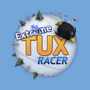 | [***extremetuxracer***](apps/extremetuxracer.md) | *Unofficial. 3D racing game with Tux, the Linux penguin.*..[ *read more* ](apps/extremetuxracer.md)*!* | [*blob*](https://github.com/ivan-hc/AM/blob/main/programs/x86_64/extremetuxracer) **/** [*raw*](https://raw.githubusercontent.com/ivan-hc/AM/main/programs/x86_64/extremetuxracer) |
|  | [***fafarunner***](apps/fafarunner.md) | *A game developed using flutter and flame.*..[ *read more* ](apps/fafarunner.md)*!* | [*blob*](https://github.com/ivan-hc/AM/blob/main/programs/x86_64/fafarunner) **/** [*raw*](https://raw.githubusercontent.com/ivan-hc/AM/main/programs/x86_64/fafarunner) |
|  | [***farmhand***](apps/farmhand.md) | *A resource management game that puts a farm in your hand.*..[ *read more* ](apps/farmhand.md)*!* | [*blob*](https://github.com/ivan-hc/AM/blob/main/programs/x86_64/farmhand) **/** [*raw*](https://raw.githubusercontent.com/ivan-hc/AM/main/programs/x86_64/farmhand) |
|  | [***flare***](apps/flare.md) | *Fantasy action RPG game using the FLARE engine.*..[ *read more* ](apps/flare.md)*!* | [*blob*](https://github.com/ivan-hc/AM/blob/main/programs/x86_64/flare) **/** [*raw*](https://raw.githubusercontent.com/ivan-hc/AM/main/programs/x86_64/flare) |
|  | [***flashpoint***](apps/flashpoint.md) | *Flashpoint Archive is a community effort to preserve games and animations from the web.*..[ *read more* ](apps/flashpoint.md)*!* | [*blob*](https://github.com/ivan-hc/AM/blob/main/programs/x86_64/flashpoint) **/** [*raw*](https://raw.githubusercontent.com/ivan-hc/AM/main/programs/x86_64/flashpoint) |
|  | [***flycast-dojo***](apps/flycast-dojo.md) | *Flycast fork, multiplatform Sega Dreamcast, Naomi and Atomiswave emulator for netplay, training & online tournament gameplay.*..[ *read more* ](apps/flycast-dojo.md)*!* | [*blob*](https://github.com/ivan-hc/AM/blob/main/programs/x86_64/flycast-dojo) **/** [*raw*](https://raw.githubusercontent.com/ivan-hc/AM/main/programs/x86_64/flycast-dojo) |
|  | [***foobar2000***](apps/foobar2000.md) | *Unofficial, an advanced freeware audio player for Windows, includes WINE.*..[ *read more* ](apps/foobar2000.md)*!* | [*blob*](https://github.com/ivan-hc/AM/blob/main/programs/x86_64/foobar2000) **/** [*raw*](https://raw.githubusercontent.com/ivan-hc/AM/main/programs/x86_64/foobar2000) |
| 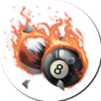 | [***foobillardpp***](apps/foobillardpp.md) | *Unofficial, an OpenGL Billard Game based on foobillard 3.0a with patches and new features.*..[ *read more* ](apps/foobillardpp.md)*!* | [*blob*](https://github.com/ivan-hc/AM/blob/main/programs/x86_64/foobillardpp) **/** [*raw*](https://raw.githubusercontent.com/ivan-hc/AM/main/programs/x86_64/foobillardpp) |
|  | [***freetexturepacker***](apps/freetexturepacker.md) | *Creates sprite sheets for you game or site, graphics.*..[ *read more* ](apps/freetexturepacker.md)*!* | [*blob*](https://github.com/ivan-hc/AM/blob/main/programs/x86_64/freetexturepacker) **/** [*raw*](https://raw.githubusercontent.com/ivan-hc/AM/main/programs/x86_64/freetexturepacker) |
|  | [***funkin***](apps/funkin.md) | *A rhythm game made with HaxeFlixel*..[ *read more* ](apps/funkin.md)*!* | [*blob*](https://github.com/ivan-hc/AM/blob/main/programs/x86_64/funkin) **/** [*raw*](https://raw.githubusercontent.com/ivan-hc/AM/main/programs/x86_64/funkin) |
|  | [***funkin-legacy***](apps/funkin-legacy.md) | *Legacy GLibC Linux support for Friday Night Funkin. A rhythm game made with HaxeFlixel.*..[ *read more* ](apps/funkin-legacy.md)*!* | [*blob*](https://github.com/ivan-hc/AM/blob/main/programs/x86_64/funkin-legacy) **/** [*raw*](https://raw.githubusercontent.com/ivan-hc/AM/main/programs/x86_64/funkin-legacy) |
|  | [***gameconqueror***](apps/gameconqueror.md) | *Unofficial. Memory scanner designed to isolate the adress of an arbitrary variable in an executing process (gtk GUI).*..[ *read more* ](apps/gameconqueror.md)*!* | [*blob*](https://github.com/ivan-hc/AM/blob/main/programs/x86_64/gameconqueror) **/** [*raw*](https://raw.githubusercontent.com/ivan-hc/AM/main/programs/x86_64/gameconqueror) |
|  | [***gamehub***](apps/gamehub.md) | *Unified library for all your games from different platforms.*..[ *read more* ](apps/gamehub.md)*!* | [*blob*](https://github.com/ivan-hc/AM/blob/main/programs/x86_64/gamehub) **/** [*raw*](https://raw.githubusercontent.com/ivan-hc/AM/main/programs/x86_64/gamehub) |
|  | [***gameimage***](apps/gameimage.md) | *Pack a runner/emulator/game and it's configs in a single AppImage.*..[ *read more* ](apps/gameimage.md)*!* | [*blob*](https://github.com/ivan-hc/AM/blob/main/programs/x86_64/gameimage) **/** [*raw*](https://raw.githubusercontent.com/ivan-hc/AM/main/programs/x86_64/gameimage) |
|  | [***gdevelop***](apps/gdevelop.md) | *Cross-platform game engine designed to be used by everyone.*..[ *read more* ](apps/gdevelop.md)*!* | [*blob*](https://github.com/ivan-hc/AM/blob/main/programs/x86_64/gdevelop) **/** [*raw*](https://raw.githubusercontent.com/ivan-hc/AM/main/programs/x86_64/gdevelop) |
|  | [***gdlauncher***](apps/gdlauncher.md) | *Simple, yet powerful Minecraft custom launcher.*..[ *read more* ](apps/gdlauncher.md)*!* | [*blob*](https://github.com/ivan-hc/AM/blob/main/programs/x86_64/gdlauncher) **/** [*raw*](https://raw.githubusercontent.com/ivan-hc/AM/main/programs/x86_64/gdlauncher) |
|  | [***gearboy***](apps/gearboy.md) | *Unofficial, Game Boy / Gameboy Color emulator.*..[ *read more* ](apps/gearboy.md)*!* | [*blob*](https://github.com/ivan-hc/AM/blob/main/programs/x86_64/gearboy) **/** [*raw*](https://raw.githubusercontent.com/ivan-hc/AM/main/programs/x86_64/gearboy) |
|  | [***gearsystem***](apps/gearsystem.md) | *Unofficial, Sega Master System / Game Gear / SG-1000 emulator.*..[ *read more* ](apps/gearsystem.md)*!* | [*blob*](https://github.com/ivan-hc/AM/blob/main/programs/x86_64/gearsystem) **/** [*raw*](https://raw.githubusercontent.com/ivan-hc/AM/main/programs/x86_64/gearsystem) |
|  | [***geforcenow-electron***](apps/geforcenow-electron.md) | *Desktop client for Nvidia GeForce NOW game streaming.*..[ *read more* ](apps/geforcenow-electron.md)*!* | [*blob*](https://github.com/ivan-hc/AM/blob/main/programs/x86_64/geforcenow-electron) **/** [*raw*](https://raw.githubusercontent.com/ivan-hc/AM/main/programs/x86_64/geforcenow-electron) |
| 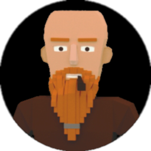 | [***gm-companion***](apps/gm-companion.md) | *A tool for rpg gamemasters.*..[ *read more* ](apps/gm-companion.md)*!* | [*blob*](https://github.com/ivan-hc/AM/blob/main/programs/x86_64/gm-companion) **/** [*raw*](https://raw.githubusercontent.com/ivan-hc/AM/main/programs/x86_64/gm-companion) |
| 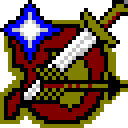 | [***gnu-freedink***](apps/gnu-freedink.md) | *Unofficial, a portable and enhanced version of the Dink Smallwood game engine.*..[ *read more* ](apps/gnu-freedink.md)*!* | [*blob*](https://github.com/ivan-hc/AM/blob/main/programs/x86_64/gnu-freedink) **/** [*raw*](https://raw.githubusercontent.com/ivan-hc/AM/main/programs/x86_64/gnu-freedink) |
|  | [***godot***](apps/godot.md) | *Multi-platform 2D and 3D game engine with a feature-rich editor.*..[ *read more* ](apps/godot.md)*!* | [*blob*](https://github.com/ivan-hc/AM/blob/main/programs/x86_64/godot) **/** [*raw*](https://raw.githubusercontent.com/ivan-hc/AM/main/programs/x86_64/godot) |
|  | [***granatier***](apps/kdegames.md) | *Bomberman clone. This is part of "kdegames".*..[ *read more* ](apps/kdegames.md)*!* | [*blob*](https://github.com/ivan-hc/AM/blob/main/programs/x86_64/kdegames) **/** [*raw*](https://raw.githubusercontent.com/ivan-hc/AM/main/programs/x86_64/kdegames) |
|  | [***greenlight***](apps/greenlight.md) | *Client for xCloud and Xbox home streaming made in Typescript.*..[ *read more* ](apps/greenlight.md)*!* | [*blob*](https://github.com/ivan-hc/AM/blob/main/programs/x86_64/greenlight) **/** [*raw*](https://raw.githubusercontent.com/ivan-hc/AM/main/programs/x86_64/greenlight) |
|  | [***hades-emu***](apps/hades-emu.md) | *A Nintendo Game Boy Advance Emulator.*..[ *read more* ](apps/hades-emu.md)*!* | [*blob*](https://github.com/ivan-hc/AM/blob/main/programs/x86_64/hades-emu) **/** [*raw*](https://raw.githubusercontent.com/ivan-hc/AM/main/programs/x86_64/hades-emu) |
| 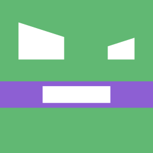 | [***hastyheroes***](apps/hastyheroes.md) | *An endless 2D jumping game.*..[ *read more* ](apps/hastyheroes.md)*!* | [*blob*](https://github.com/ivan-hc/AM/blob/main/programs/x86_64/hastyheroes) **/** [*raw*](https://raw.githubusercontent.com/ivan-hc/AM/main/programs/x86_64/hastyheroes) |
|  | [***helion***](apps/helion.md) | *A modern fast paced Doom FPS engine.*..[ *read more* ](apps/helion.md)*!* | [*blob*](https://github.com/ivan-hc/AM/blob/main/programs/x86_64/helion) **/** [*raw*](https://raw.githubusercontent.com/ivan-hc/AM/main/programs/x86_64/helion) |
|  | [***helioslauncher***](apps/helioslauncher.md) | *Custom launcher for modded minecraft written in Electron.*..[ *read more* ](apps/helioslauncher.md)*!* | [*blob*](https://github.com/ivan-hc/AM/blob/main/programs/x86_64/helioslauncher) **/** [*raw*](https://raw.githubusercontent.com/ivan-hc/AM/main/programs/x86_64/helioslauncher) |
|  | [***heroic-games-launcher***](apps/heroic-games-launcher.md) | *A Native GOG and Epic Games Launcher for Linux.*..[ *read more* ](apps/heroic-games-launcher.md)*!* | [*blob*](https://github.com/ivan-hc/AM/blob/main/programs/x86_64/heroic-games-launcher) **/** [*raw*](https://raw.githubusercontent.com/ivan-hc/AM/main/programs/x86_64/heroic-games-launcher) |
|  | [***highlite***](apps/highlite.md) | *A RuneLite-esque Client for the game High Spell.*..[ *read more* ](apps/highlite.md)*!* | [*blob*](https://github.com/ivan-hc/AM/blob/main/programs/x86_64/highlite) **/** [*raw*](https://raw.githubusercontent.com/ivan-hc/AM/main/programs/x86_64/highlite) |
| 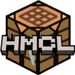 | [***hmcl***](apps/hmcl.md) | *A Minecraft Launcher which is multi-functional, cross-platform and popular.*..[ *read more* ](apps/hmcl.md)*!* | [*blob*](https://github.com/ivan-hc/AM/blob/main/programs/x86_64/hmcl) **/** [*raw*](https://raw.githubusercontent.com/ivan-hc/AM/main/programs/x86_64/hmcl) |
|  | [***hugor***](apps/hugor.md) | *A cross-platform, multimedia interpreter for Hugo adventure games.*..[ *read more* ](apps/hugor.md)*!* | [*blob*](https://github.com/ivan-hc/AM/blob/main/programs/x86_64/hugor) **/** [*raw*](https://raw.githubusercontent.com/ivan-hc/AM/main/programs/x86_64/hugor) |
|  | [***hydra***](apps/hydra.md) | *Game launcher with its own embedded bittorrent client.*..[ *read more* ](apps/hydra.md)*!* | [*blob*](https://github.com/ivan-hc/AM/blob/main/programs/x86_64/hydra) **/** [*raw*](https://raw.githubusercontent.com/ivan-hc/AM/main/programs/x86_64/hydra) |
| 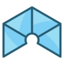 | [***icestudio***](apps/icestudio.md) | *A real gamechanger in the world of Open Source FPGAs.*..[ *read more* ](apps/icestudio.md)*!* | [*blob*](https://github.com/ivan-hc/AM/blob/main/programs/x86_64/icestudio) **/** [*raw*](https://raw.githubusercontent.com/ivan-hc/AM/main/programs/x86_64/icestudio) |
|  | [***instead***](apps/instead.md) | *Simple Text Adventures Interpreter.*..[ *read more* ](apps/instead.md)*!* | [*blob*](https://github.com/ivan-hc/AM/blob/main/programs/x86_64/instead) **/** [*raw*](https://raw.githubusercontent.com/ivan-hc/AM/main/programs/x86_64/instead) |
| 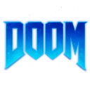 | [***international-doom***](apps/international-doom.md) | *Small, functional and simple source ports, created with help, efforts and bits of code from people around the world.*..[ *read more* ](apps/international-doom.md)*!* | [*blob*](https://github.com/ivan-hc/AM/blob/main/programs/x86_64/international-doom) **/** [*raw*](https://raw.githubusercontent.com/ivan-hc/AM/main/programs/x86_64/international-doom) |
| 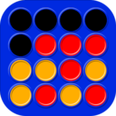 | [***ipuissance-4d***](apps/ipuissance-4d.md) | *Connect Four video game with a 3-Dimentional rendering.*..[ *read more* ](apps/ipuissance-4d.md)*!* | [*blob*](https://github.com/ivan-hc/AM/blob/main/programs/x86_64/ipuissance-4d) **/** [*raw*](https://raw.githubusercontent.com/ivan-hc/AM/main/programs/x86_64/ipuissance-4d) |
|  | [***iqpuzzle***](apps/iqpuzzle.md) | *A challenging pentomino puzzle.*..[ *read more* ](apps/iqpuzzle.md)*!* | [*blob*](https://github.com/ivan-hc/AM/blob/main/programs/x86_64/iqpuzzle) **/** [*raw*](https://raw.githubusercontent.com/ivan-hc/AM/main/programs/x86_64/iqpuzzle) |
|  | [***iris***](apps/iris.md) | *Sony PlayStation 2 games emulator for Windows, Linux and macOS.*..[ *read more* ](apps/iris.md)*!* | [*blob*](https://github.com/ivan-hc/AM/blob/main/programs/x86_64/iris) **/** [*raw*](https://raw.githubusercontent.com/ivan-hc/AM/main/programs/x86_64/iris) |
|  | [***iris-enhanced***](apps/iris-enhanced.md) | *Unofficial, Sony PlayStation 2 emulator.*..[ *read more* ](apps/iris-enhanced.md)*!* | [*blob*](https://github.com/ivan-hc/AM/blob/main/programs/x86_64/iris-enhanced) **/** [*raw*](https://raw.githubusercontent.com/ivan-hc/AM/main/programs/x86_64/iris-enhanced) |
| 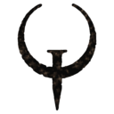 | [***ironwail***](apps/ironwail.md) | *High-performance QuakeSpasm fork QuakeSpasm. A modern, cross-platform Quake game engine based on FitzQuake.*..[ *read more* ](apps/ironwail.md)*!* | [*blob*](https://github.com/ivan-hc/AM/blob/main/programs/x86_64/ironwail) **/** [*raw*](https://raw.githubusercontent.com/ivan-hc/AM/main/programs/x86_64/ironwail) |
|  | [***itch.io***](apps/itch.io.md) | *A simple way to find and share indie games online for free.*..[ *read more* ](apps/itch.io.md)*!* | [*blob*](https://github.com/ivan-hc/AM/blob/main/programs/x86_64/itch.io) **/** [*raw*](https://raw.githubusercontent.com/ivan-hc/AM/main/programs/x86_64/itch.io) |
| 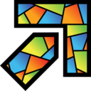 | [***itgmania***](apps/itgmania.md) | *Unofficial, a fork of StepMania 5.1, an advanced cross-platform rhythm game for home and arcade use.*..[ *read more* ](apps/itgmania.md)*!* | [*blob*](https://github.com/ivan-hc/AM/blob/main/programs/x86_64/itgmania) **/** [*raw*](https://raw.githubusercontent.com/ivan-hc/AM/main/programs/x86_64/itgmania) |
| 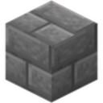 | [***jdminecraftlauncher***](apps/jdminecraftlauncher.md) | *Unofficial classic styled Minecraft Launcher.*..[ *read more* ](apps/jdminecraftlauncher.md)*!* | [*blob*](https://github.com/ivan-hc/AM/blob/main/programs/x86_64/jdminecraftlauncher) **/** [*raw*](https://raw.githubusercontent.com/ivan-hc/AM/main/programs/x86_64/jdminecraftlauncher) |
| 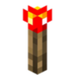 | [***jdnbtexplorer***](apps/jdnbtexplorer.md) | *A Editor for Minecraft NBT files.*..[ *read more* ](apps/jdnbtexplorer.md)*!* | [*blob*](https://github.com/ivan-hc/AM/blob/main/programs/x86_64/jdnbtexplorer) **/** [*raw*](https://raw.githubusercontent.com/ivan-hc/AM/main/programs/x86_64/jdnbtexplorer) |
|  | [***jgenesis***](apps/jgenesis.md) | *Sega Genesis, Sega CD, SNES, Master System, Game Gear emulator (GUI).*..[ *read more* ](apps/jgenesis.md)*!* | [*blob*](https://github.com/ivan-hc/AM/blob/main/programs/x86_64/jgenesis) **/** [*raw*](https://raw.githubusercontent.com/ivan-hc/AM/main/programs/x86_64/jgenesis) |
|  | [***jgenesis-cli***](apps/jgenesis-cli.md) | *Sega Genesis, Sega CD, SNES, Master System, Game Gear emulator (CLI).*..[ *read more* ](apps/jgenesis-cli.md)*!* | [*blob*](https://github.com/ivan-hc/AM/blob/main/programs/x86_64/jgenesis-cli) **/** [*raw*](https://raw.githubusercontent.com/ivan-hc/AM/main/programs/x86_64/jgenesis-cli) |
|  | [***jklubtv***](apps/jklubtv.md) | *Chess Round Robin Tournament Manager.*..[ *read more* ](apps/jklubtv.md)*!* | [*blob*](https://github.com/ivan-hc/AM/blob/main/programs/x86_64/jklubtv) **/** [*raw*](https://raw.githubusercontent.com/ivan-hc/AM/main/programs/x86_64/jklubtv) |
|  | [***joy2droidx***](apps/joy2droidx.md) | *Turn Android phones into virtual Xbox 360 controller.*..[ *read more* ](apps/joy2droidx.md)*!* | [*blob*](https://github.com/ivan-hc/AM/blob/main/programs/x86_64/joy2droidx) **/** [*raw*](https://raw.githubusercontent.com/ivan-hc/AM/main/programs/x86_64/joy2droidx) |
|  | [***julius***](apps/julius.md) | *An open source re-implementation of the Caesar III game.*..[ *read more* ](apps/julius.md)*!* | [*blob*](https://github.com/ivan-hc/AM/blob/main/programs/x86_64/julius) **/** [*raw*](https://raw.githubusercontent.com/ivan-hc/AM/main/programs/x86_64/julius) |
|  | [***kajongg***](apps/kdegames.md) | *An ancient Chinese board game for 4 players. This is part of "kdegames".*..[ *read more* ](apps/kdegames.md)*!* | [*blob*](https://github.com/ivan-hc/AM/blob/main/programs/x86_64/kdegames) **/** [*raw*](https://raw.githubusercontent.com/ivan-hc/AM/main/programs/x86_64/kdegames) |
|  | [***kapman***](apps/kdegames.md) | *Pac-Man clone. This is part of "kdegames".*..[ *read more* ](apps/kdegames.md)*!* | [*blob*](https://github.com/ivan-hc/AM/blob/main/programs/x86_64/kdegames) **/** [*raw*](https://raw.githubusercontent.com/ivan-hc/AM/main/programs/x86_64/kdegames) |
|  | [***katomic***](apps/kdegames.md) | *Edu. game based around molecular geometry. This is part of "kdegames".*..[ *read more* ](apps/kdegames.md)*!* | [*blob*](https://github.com/ivan-hc/AM/blob/main/programs/x86_64/kdegames) **/** [*raw*](https://raw.githubusercontent.com/ivan-hc/AM/main/programs/x86_64/kdegames) |
|  | [***kblackbox***](apps/kdegames.md) | *A game of hide and seek. This is part of "kdegames".*..[ *read more* ](apps/kdegames.md)*!* | [*blob*](https://github.com/ivan-hc/AM/blob/main/programs/x86_64/kdegames) **/** [*raw*](https://raw.githubusercontent.com/ivan-hc/AM/main/programs/x86_64/kdegames) |
|  | [***kblocks***](apps/kdegames.md) | *Classic Tetris / falling blocks game. This is part of "kdegames".*..[ *read more* ](apps/kdegames.md)*!* | [*blob*](https://github.com/ivan-hc/AM/blob/main/programs/x86_64/kdegames) **/** [*raw*](https://raw.githubusercontent.com/ivan-hc/AM/main/programs/x86_64/kdegames) |
|  | [***kboard***](apps/kboard.md) | *Terminal game to practice keyboard typing.*..[ *read more* ](apps/kboard.md)*!* | [*blob*](https://github.com/ivan-hc/AM/blob/main/programs/x86_64/kboard) **/** [*raw*](https://raw.githubusercontent.com/ivan-hc/AM/main/programs/x86_64/kboard) |
|  | [***kbounce***](apps/kdegames.md) | *Fill the field game. This is part of "kdegames".*..[ *read more* ](apps/kdegames.md)*!* | [*blob*](https://github.com/ivan-hc/AM/blob/main/programs/x86_64/kdegames) **/** [*raw*](https://raw.githubusercontent.com/ivan-hc/AM/main/programs/x86_64/kdegames) |
| 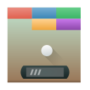 | [***kbreakout***](apps/kdegames.md) | *Destroy bricks without losing the ball. This is part of "kdegames".*..[ *read more* ](apps/kdegames.md)*!* | [*blob*](https://github.com/ivan-hc/AM/blob/main/programs/x86_64/kdegames) **/** [*raw*](https://raw.githubusercontent.com/ivan-hc/AM/main/programs/x86_64/kdegames) |
|  | [***kdegames***](apps/kdegames.md) | *Unofficial, Full & updatable KDE Games suite, metapackage.*..[ *read more* ](apps/kdegames.md)*!* | [*blob*](https://github.com/ivan-hc/AM/blob/main/programs/x86_64/kdegames) **/** [*raw*](https://raw.githubusercontent.com/ivan-hc/AM/main/programs/x86_64/kdegames) |
|  | [***kdiamond***](apps/kdegames.md) | *Diamond game. This is part of "kdegames".*..[ *read more* ](apps/kdegames.md)*!* | [*blob*](https://github.com/ivan-hc/AM/blob/main/programs/x86_64/kdegames) **/** [*raw*](https://raw.githubusercontent.com/ivan-hc/AM/main/programs/x86_64/kdegames) |
| 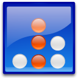 | [***kfourinline***](apps/kdegames.md) | *4 in row game. This is part of "kdegames".*..[ *read more* ](apps/kdegames.md)*!* | [*blob*](https://github.com/ivan-hc/AM/blob/main/programs/x86_64/kdegames) **/** [*raw*](https://raw.githubusercontent.com/ivan-hc/AM/main/programs/x86_64/kdegames) |
|  | [***kgoldrunner***](apps/kdegames.md) | *A game with a runner and gold. This is part of "kdegames".*..[ *read more* ](apps/kdegames.md)*!* | [*blob*](https://github.com/ivan-hc/AM/blob/main/programs/x86_64/kdegames) **/** [*raw*](https://raw.githubusercontent.com/ivan-hc/AM/main/programs/x86_64/kdegames) |
|  | [***kigo***](apps/kdegames.md) | *Go strategic board game for two players. This is part of "kdegames".*..[ *read more* ](apps/kdegames.md)*!* | [*blob*](https://github.com/ivan-hc/AM/blob/main/programs/x86_64/kdegames) **/** [*raw*](https://raw.githubusercontent.com/ivan-hc/AM/main/programs/x86_64/kdegames) |
| 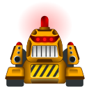 | [***killbots***](apps/kdegames.md) | *Port of the classic console game Robots. This is part of "kdegames".*..[ *read more* ](apps/kdegames.md)*!* | [*blob*](https://github.com/ivan-hc/AM/blob/main/programs/x86_64/kdegames) **/** [*raw*](https://raw.githubusercontent.com/ivan-hc/AM/main/programs/x86_64/kdegames) |
|  | [***kiriki***](apps/kdegames.md) | *A dice game. This is part of "kdegames".*..[ *read more* ](apps/kdegames.md)*!* | [*blob*](https://github.com/ivan-hc/AM/blob/main/programs/x86_64/kdegames) **/** [*raw*](https://raw.githubusercontent.com/ivan-hc/AM/main/programs/x86_64/kdegames) |
| 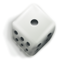 | [***kjumpingcube***](apps/kdegames.md) | *A game of dices on a board. This is part of "kdegames".*..[ *read more* ](apps/kdegames.md)*!* | [*blob*](https://github.com/ivan-hc/AM/blob/main/programs/x86_64/kdegames) **/** [*raw*](https://raw.githubusercontent.com/ivan-hc/AM/main/programs/x86_64/kdegames) |
|  | [***klickety***](apps/kdegames.md) | *Color matching like SameGame. This is part of "kdegames".*..[ *read more* ](apps/kdegames.md)*!* | [*blob*](https://github.com/ivan-hc/AM/blob/main/programs/x86_64/kdegames) **/** [*raw*](https://raw.githubusercontent.com/ivan-hc/AM/main/programs/x86_64/kdegames) |
| 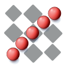 | [***klines***](apps/kdegames.md) | *Inspired by well known game of Color Lines. This is part of "kdegames".*..[ *read more* ](apps/kdegames.md)*!* | [*blob*](https://github.com/ivan-hc/AM/blob/main/programs/x86_64/kdegames) **/** [*raw*](https://raw.githubusercontent.com/ivan-hc/AM/main/programs/x86_64/kdegames) |
|  | [***kmahjongg***](apps/kdegames.md) | *Mahjongg game. This is part of "kdegames".*..[ *read more* ](apps/kdegames.md)*!* | [*blob*](https://github.com/ivan-hc/AM/blob/main/programs/x86_64/kdegames) **/** [*raw*](https://raw.githubusercontent.com/ivan-hc/AM/main/programs/x86_64/kdegames) |
| 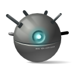 | [***kmines***](apps/kdegames.md) | *Classic mine game. This is part of "kdegames".*..[ *read more* ](apps/kdegames.md)*!* | [*blob*](https://github.com/ivan-hc/AM/blob/main/programs/x86_64/kdegames) **/** [*raw*](https://raw.githubusercontent.com/ivan-hc/AM/main/programs/x86_64/kdegames) |
| 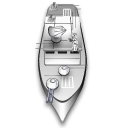 | [***knavalbattle***](apps/kdegames.md) | *Battle Ship game. This is part of "kdegames".*..[ *read more* ](apps/kdegames.md)*!* | [*blob*](https://github.com/ivan-hc/AM/blob/main/programs/x86_64/kdegames) **/** [*raw*](https://raw.githubusercontent.com/ivan-hc/AM/main/programs/x86_64/kdegames) |
|  | [***knetwalk***](apps/kdegames.md) | *Net constructing game. This is part of "kdegames".*..[ *read more* ](apps/kdegames.md)*!* | [*blob*](https://github.com/ivan-hc/AM/blob/main/programs/x86_64/kdegames) **/** [*raw*](https://raw.githubusercontent.com/ivan-hc/AM/main/programs/x86_64/kdegames) |
|  | [***knights***](apps/knights.md) | *Unofficial, KDE's chess game frontend.*..[ *read more* ](apps/knights.md)*!* | [*blob*](https://github.com/ivan-hc/AM/blob/main/programs/x86_64/knights) **/** [*raw*](https://raw.githubusercontent.com/ivan-hc/AM/main/programs/x86_64/knights) |
|  | [***kolf***](apps/kdegames.md) | *Mini Golf game. This is part of "kdegames".*..[ *read more* ](apps/kdegames.md)*!* | [*blob*](https://github.com/ivan-hc/AM/blob/main/programs/x86_64/kdegames) **/** [*raw*](https://raw.githubusercontent.com/ivan-hc/AM/main/programs/x86_64/kdegames) |
|  | [***kollision***](apps/kdegames.md) | *Dodge red balls in the field. This is part of "kdegames".*..[ *read more* ](apps/kdegames.md)*!* | [*blob*](https://github.com/ivan-hc/AM/blob/main/programs/x86_64/kdegames) **/** [*raw*](https://raw.githubusercontent.com/ivan-hc/AM/main/programs/x86_64/kdegames) |
|  | [***konquest***](apps/kdegames.md) | *Game of planets. This is part of "kdegames".*..[ *read more* ](apps/kdegames.md)*!* | [*blob*](https://github.com/ivan-hc/AM/blob/main/programs/x86_64/kdegames) **/** [*raw*](https://raw.githubusercontent.com/ivan-hc/AM/main/programs/x86_64/kdegames) |
|  | [***kpat***](apps/kdegames.md) | *Klondike, Spider, Free Cell and other Solitaire. This is part of "kdegames".*..[ *read more* ](apps/kdegames.md)*!* | [*blob*](https://github.com/ivan-hc/AM/blob/main/programs/x86_64/kdegames) **/** [*raw*](https://raw.githubusercontent.com/ivan-hc/AM/main/programs/x86_64/kdegames) |
|  | [***kreversi***](apps/kdegames.md) | *Reversi game. This is part of "kdegames".*..[ *read more* ](apps/kdegames.md)*!* | [*blob*](https://github.com/ivan-hc/AM/blob/main/programs/x86_64/kdegames) **/** [*raw*](https://raw.githubusercontent.com/ivan-hc/AM/main/programs/x86_64/kdegames) |
|  | [***krunker***](apps/krunker.md) | *Krunker (.io) is a fast-paced first-person shooter game with pixel graphics.*..[ *read more* ](apps/krunker.md)*!* | [*blob*](https://github.com/ivan-hc/AM/blob/main/programs/x86_64/krunker) **/** [*raw*](https://raw.githubusercontent.com/ivan-hc/AM/main/programs/x86_64/krunker) |
| 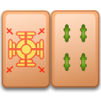 | [***kshisen***](apps/kdegames.md) | *A game similar to Mahjongg. This is part of "kdegames".*..[ *read more* ](apps/kdegames.md)*!* | [*blob*](https://github.com/ivan-hc/AM/blob/main/programs/x86_64/kdegames) **/** [*raw*](https://raw.githubusercontent.com/ivan-hc/AM/main/programs/x86_64/kdegames) |
| 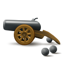 | [***ksirk***](apps/kdegames.md) | *A strategy board game. This is part of "kdegames".*..[ *read more* ](apps/kdegames.md)*!* | [*blob*](https://github.com/ivan-hc/AM/blob/main/programs/x86_64/kdegames) **/** [*raw*](https://raw.githubusercontent.com/ivan-hc/AM/main/programs/x86_64/kdegames) |
|  | [***ksnakeduel***](apps/kdegames.md) | *A snake race game. This is part of "kdegames".*..[ *read more* ](apps/kdegames.md)*!* | [*blob*](https://github.com/ivan-hc/AM/blob/main/programs/x86_64/kdegames) **/** [*raw*](https://raw.githubusercontent.com/ivan-hc/AM/main/programs/x86_64/kdegames) |
|  | [***kspaceduel***](apps/kdegames.md) | *Battleship with satellites in the space. This is part of "kdegames".*..[ *read more* ](apps/kdegames.md)*!* | [*blob*](https://github.com/ivan-hc/AM/blob/main/programs/x86_64/kdegames) **/** [*raw*](https://raw.githubusercontent.com/ivan-hc/AM/main/programs/x86_64/kdegames) |
|  | [***ksquares***](apps/kdegames.md) | *Win with most number of completed squares. This is part of "kdegames".*..[ *read more* ](apps/kdegames.md)*!* | [*blob*](https://github.com/ivan-hc/AM/blob/main/programs/x86_64/kdegames) **/** [*raw*](https://raw.githubusercontent.com/ivan-hc/AM/main/programs/x86_64/kdegames) |
| 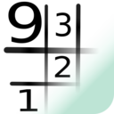 | [***ksudoku***](apps/kdegames.md) | *Sudoku game. This is part of "kdegames".*..[ *read more* ](apps/kdegames.md)*!* | [*blob*](https://github.com/ivan-hc/AM/blob/main/programs/x86_64/kdegames) **/** [*raw*](https://raw.githubusercontent.com/ivan-hc/AM/main/programs/x86_64/kdegames) |
|  | [***ktuberling***](apps/kdegames.md) | *Simple Mr. Potato game for children. This is part of "kdegames".*..[ *read more* ](apps/kdegames.md)*!* | [*blob*](https://github.com/ivan-hc/AM/blob/main/programs/x86_64/kdegames) **/** [*raw*](https://raw.githubusercontent.com/ivan-hc/AM/main/programs/x86_64/kdegames) |
|  | [***kubrick***](apps/kdegames.md) | *A logic game based on Rubik's Cube. This is part of "kdegames".*..[ *read more* ](apps/kdegames.md)*!* | [*blob*](https://github.com/ivan-hc/AM/blob/main/programs/x86_64/kdegames) **/** [*raw*](https://raw.githubusercontent.com/ivan-hc/AM/main/programs/x86_64/kdegames) |
| 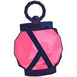 | [***lambda-lantern***](apps/lambda-lantern.md) | *A 3D game about functional programming patterns.*..[ *read more* ](apps/lambda-lantern.md)*!* | [*blob*](https://github.com/ivan-hc/AM/blob/main/programs/x86_64/lambda-lantern) **/** [*raw*](https://raw.githubusercontent.com/ivan-hc/AM/main/programs/x86_64/lambda-lantern) |
|  | [***legendary-kingdoms***](apps/legendary-kingdoms.md) | *Implementation of Legendary Kingdoms Gamebooks in C++.*..[ *read more* ](apps/legendary-kingdoms.md)*!* | [*blob*](https://github.com/ivan-hc/AM/blob/main/programs/x86_64/legendary-kingdoms) **/** [*raw*](https://raw.githubusercontent.com/ivan-hc/AM/main/programs/x86_64/legendary-kingdoms) |
| 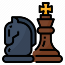 | [***liground***](apps/liground.md) | *A mordern Chess Variant Analysis GUI, game.*..[ *read more* ](apps/liground.md)*!* | [*blob*](https://github.com/ivan-hc/AM/blob/main/programs/x86_64/liground) **/** [*raw*](https://raw.githubusercontent.com/ivan-hc/AM/main/programs/x86_64/liground) |
| 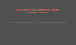 | [***linedancer***](apps/linedancer.md) | *Arcade game and entry for Ludum Dare 35.*..[ *read more* ](apps/linedancer.md)*!* | [*blob*](https://github.com/ivan-hc/AM/blob/main/programs/x86_64/linedancer) **/** [*raw*](https://raw.githubusercontent.com/ivan-hc/AM/main/programs/x86_64/linedancer) |
|  | [***linuxtoys***](apps/linuxtoys.md) | *Unofficial, a user-friendly collection of tools to make your life on Linux easier than ever. Useful scripts for gamers, developers and enthusiasts.*..[ *read more* ](apps/linuxtoys.md)*!* | [*blob*](https://github.com/ivan-hc/AM/blob/main/programs/x86_64/linuxtoys) **/** [*raw*](https://raw.githubusercontent.com/ivan-hc/AM/main/programs/x86_64/linuxtoys) |
|  | [***liquidlauncher***](apps/liquidlauncher.md) | *The official Minecraft launcher for LiquidBounce.*..[ *read more* ](apps/liquidlauncher.md)*!* | [*blob*](https://github.com/ivan-hc/AM/blob/main/programs/x86_64/liquidlauncher) **/** [*raw*](https://raw.githubusercontent.com/ivan-hc/AM/main/programs/x86_64/liquidlauncher) |
|  | [***love***](apps/love.md) | *The unquestionably awesome 2D game engine.*..[ *read more* ](apps/love.md)*!* | [*blob*](https://github.com/ivan-hc/AM/blob/main/programs/x86_64/love) **/** [*raw*](https://raw.githubusercontent.com/ivan-hc/AM/main/programs/x86_64/love) |
|  | [***lskat***](apps/kdegames.md) | *Fun and engaging card game for two players. This is part of "kdegames".*..[ *read more* ](apps/kdegames.md)*!* | [*blob*](https://github.com/ivan-hc/AM/blob/main/programs/x86_64/kdegames) **/** [*raw*](https://raw.githubusercontent.com/ivan-hc/AM/main/programs/x86_64/kdegames) |
|  | [***lunar-client***](apps/lunar-client.md) | *Free Minecraft Client, a modpack for all versions of Minecraft.*..[ *read more* ](apps/lunar-client.md)*!* | [*blob*](https://github.com/ivan-hc/AM/blob/main/programs/x86_64/lunar-client) **/** [*raw*](https://raw.githubusercontent.com/ivan-hc/AM/main/programs/x86_64/lunar-client) |
|  | [***lutris***](apps/lutris.md) | *Unofficial. Install and play video games from all eras and from most gaming systems, by leveraging and combining existing emulators, WINE included.*..[ *read more* ](apps/lutris.md)*!* | [*blob*](https://github.com/ivan-hc/AM/blob/main/programs/x86_64/lutris) **/** [*raw*](https://raw.githubusercontent.com/ivan-hc/AM/main/programs/x86_64/lutris) |
|  | [***lutris-gamepad-ui***](apps/lutris-gamepad-ui.md) | *A simple, TV-friendly, gamepad-navigable frontend for the Lutris game launcher on Linux.*..[ *read more* ](apps/lutris-gamepad-ui.md)*!* | [*blob*](https://github.com/ivan-hc/AM/blob/main/programs/x86_64/lutris-gamepad-ui) **/** [*raw*](https://raw.githubusercontent.com/ivan-hc/AM/main/programs/x86_64/lutris-gamepad-ui) |
| 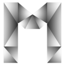 | [***m***](apps/m.md) | *Data oriented programming language for game developers.*..[ *read more* ](apps/m.md)*!* | [*blob*](https://github.com/ivan-hc/AM/blob/main/programs/x86_64/m) **/** [*raw*](https://raw.githubusercontent.com/ivan-hc/AM/main/programs/x86_64/m) |
| 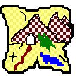 | [***mangbandclient***](apps/mangbandclient.md) | *A free online multi-player realtime roguelike game.*..[ *read more* ](apps/mangbandclient.md)*!* | [*blob*](https://github.com/ivan-hc/AM/blob/main/programs/x86_64/mangbandclient) **/** [*raw*](https://raw.githubusercontent.com/ivan-hc/AM/main/programs/x86_64/mangbandclient) |
|  | [***maniadrive***](apps/maniadrive.md) | *Unofficial, an open-source clone of the popular racing game TrackMania.*..[ *read more* ](apps/maniadrive.md)*!* | [*blob*](https://github.com/ivan-hc/AM/blob/main/programs/x86_64/maniadrive) **/** [*raw*](https://raw.githubusercontent.com/ivan-hc/AM/main/programs/x86_64/maniadrive) |
|  | [***mcpelauncher***](apps/mcpelauncher.md) | *The main repo for the Linux Bedrock edition Minecraft launcher.*..[ *read more* ](apps/mcpelauncher.md)*!* | [*blob*](https://github.com/ivan-hc/AM/blob/main/programs/x86_64/mcpelauncher) **/** [*raw*](https://raw.githubusercontent.com/ivan-hc/AM/main/programs/x86_64/mcpelauncher) |
|  | [***megaglest***](apps/megaglest.md) | *MegaGlest real-time strategy game engine (cross-platform, 3-d).*..[ *read more* ](apps/megaglest.md)*!* | [*blob*](https://github.com/ivan-hc/AM/blob/main/programs/x86_64/megaglest) **/** [*raw*](https://raw.githubusercontent.com/ivan-hc/AM/main/programs/x86_64/megaglest) |
|  | [***meganimus***](apps/meganimus.md) | *A launcher for native and emulator games.*..[ *read more* ](apps/meganimus.md)*!* | [*blob*](https://github.com/ivan-hc/AM/blob/main/programs/x86_64/meganimus) **/** [*raw*](https://raw.githubusercontent.com/ivan-hc/AM/main/programs/x86_64/meganimus) |
|  | [***mgba***](apps/mgba.md) | *Game Boy Advance Emulator.*..[ *read more* ](apps/mgba.md)*!* | [*blob*](https://github.com/ivan-hc/AM/blob/main/programs/x86_64/mgba) **/** [*raw*](https://raw.githubusercontent.com/ivan-hc/AM/main/programs/x86_64/mgba) |
|  | [***mgba-enhanced***](apps/mgba-enhanced.md) | *Unofficial, Game Boy Advance Emulator.*..[ *read more* ](apps/mgba-enhanced.md)*!* | [*blob*](https://github.com/ivan-hc/AM/blob/main/programs/x86_64/mgba-enhanced) **/** [*raw*](https://raw.githubusercontent.com/ivan-hc/AM/main/programs/x86_64/mgba-enhanced) |
|  | [***mine-craft.io***](apps/mine-craft.io.md) | *Minecraft and even more!*..[ *read more* ](apps/mine-craft.io.md)*!* | [*blob*](https://github.com/ivan-hc/AM/blob/main/programs/x86_64/mine-craft.io) **/** [*raw*](https://raw.githubusercontent.com/ivan-hc/AM/main/programs/x86_64/mine-craft.io) |
|  | [***minecraft-launcher***](apps/minecraft-launcher.md) | *Game downloader and launcher for Minecraft.*..[ *read more* ](apps/minecraft-launcher.md)*!* | [*blob*](https://github.com/ivan-hc/AM/blob/main/programs/x86_64/minecraft-launcher) **/** [*raw*](https://raw.githubusercontent.com/ivan-hc/AM/main/programs/x86_64/minecraft-launcher) |
| 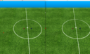 | [***minififa***](apps/minififa.md) | *OpenGL-powered third-person football, soccer game.*..[ *read more* ](apps/minififa.md)*!* | [*blob*](https://github.com/ivan-hc/AM/blob/main/programs/x86_64/minififa) **/** [*raw*](https://raw.githubusercontent.com/ivan-hc/AM/main/programs/x86_64/minififa) |
| 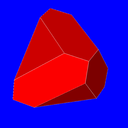 | [***mki3dgame***](apps/mki3dgame.md) | *A game of searching, in 3D stages.*..[ *read more* ](apps/mki3dgame.md)*!* | [*blob*](https://github.com/ivan-hc/AM/blob/main/programs/x86_64/mki3dgame) **/** [*raw*](https://raw.githubusercontent.com/ivan-hc/AM/main/programs/x86_64/mki3dgame) |
|  | [***mmapper***](apps/mmapper.md) | *Graphical MUD client for the game MUME.*..[ *read more* ](apps/mmapper.md)*!* | [*blob*](https://github.com/ivan-hc/AM/blob/main/programs/x86_64/mmapper) **/** [*raw*](https://raw.githubusercontent.com/ivan-hc/AM/main/programs/x86_64/mmapper) |
| 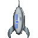 | [***moon-lander***](apps/moon-lander.md) | *Moon Lander is a 2D game of gravity.  Land your ship on the lading pad.*..[ *read more* ](apps/moon-lander.md)*!* | [*blob*](https://github.com/ivan-hc/AM/blob/main/programs/x86_64/moon-lander) **/** [*raw*](https://raw.githubusercontent.com/ivan-hc/AM/main/programs/x86_64/moon-lander) |
|  | [***moondeck-buddy***](apps/moondeck-buddy.md) | *A server-side part of the MoonDeck plugin for the SteamDeck.*..[ *read more* ](apps/moondeck-buddy.md)*!* | [*blob*](https://github.com/ivan-hc/AM/blob/main/programs/x86_64/moondeck-buddy) **/** [*raw*](https://raw.githubusercontent.com/ivan-hc/AM/main/programs/x86_64/moondeck-buddy) |
|  | [***moonlight***](apps/moonlight.md) | *Stream games from your NVIDIA GameStream-enabled PC.*..[ *read more* ](apps/moonlight.md)*!* | [*blob*](https://github.com/ivan-hc/AM/blob/main/programs/x86_64/moonlight) **/** [*raw*](https://raw.githubusercontent.com/ivan-hc/AM/main/programs/x86_64/moonlight) |
| 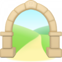 | [***mudlet***](apps/mudlet.md) | *Mudlet is a platform for gaming and enhancing game-play primarily with MUDs.*..[ *read more* ](apps/mudlet.md)*!* | [*blob*](https://github.com/ivan-hc/AM/blob/main/programs/x86_64/mudlet) **/** [*raw*](https://raw.githubusercontent.com/ivan-hc/AM/main/programs/x86_64/mudlet) |
|  | [***multimc***](apps/multimc.md) | *A Minecraft launcher.*..[ *read more* ](apps/multimc.md)*!* | [*blob*](https://github.com/ivan-hc/AM/blob/main/programs/x86_64/multimc) **/** [*raw*](https://raw.githubusercontent.com/ivan-hc/AM/main/programs/x86_64/multimc) |
|  | [***music-quiz***](apps/music-quiz.md) | *Jepardy like game, guess as many songs as possible.*..[ *read more* ](apps/music-quiz.md)*!* | [*blob*](https://github.com/ivan-hc/AM/blob/main/programs/x86_64/music-quiz) **/** [*raw*](https://raw.githubusercontent.com/ivan-hc/AM/main/programs/x86_64/music-quiz) |
| 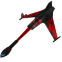 | [***naev***](apps/naev.md) | *A 2d action/rpg space game that combines elements from the action.*..[ *read more* ](apps/naev.md)*!* | [*blob*](https://github.com/ivan-hc/AM/blob/main/programs/x86_64/naev) **/** [*raw*](https://raw.githubusercontent.com/ivan-hc/AM/main/programs/x86_64/naev) |
| 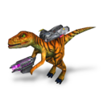 | [***nanosaur***](apps/nanosaur.md) | *Pangea Software’s game, adventure of a cybernetic dinosaur.*..[ *read more* ](apps/nanosaur.md)*!* | [*blob*](https://github.com/ivan-hc/AM/blob/main/programs/x86_64/nanosaur) **/** [*raw*](https://raw.githubusercontent.com/ivan-hc/AM/main/programs/x86_64/nanosaur) |
|  | [***naruto-arena***](apps/naruto-arena.md) | *Naruto-based online multiplayer strategy game.*..[ *read more* ](apps/naruto-arena.md)*!* | [*blob*](https://github.com/ivan-hc/AM/blob/main/programs/x86_64/naruto-arena) **/** [*raw*](https://raw.githubusercontent.com/ivan-hc/AM/main/programs/x86_64/naruto-arena) |
|  | [***netpanzer***](apps/netpanzer.md) | *Online multiplayer tactical warfare game for fast action combat.*..[ *read more* ](apps/netpanzer.md)*!* | [*blob*](https://github.com/ivan-hc/AM/blob/main/programs/x86_64/netpanzer) **/** [*raw*](https://raw.githubusercontent.com/ivan-hc/AM/main/programs/x86_64/netpanzer) |
|  | [***newton-adventure***](apps/newton-adventure.md) | *A 2D game with a twist, player can rotate gravity at 360°.*..[ *read more* ](apps/newton-adventure.md)*!* | [*blob*](https://github.com/ivan-hc/AM/blob/main/programs/x86_64/newton-adventure) **/** [*raw*](https://raw.githubusercontent.com/ivan-hc/AM/main/programs/x86_64/newton-adventure) |
| 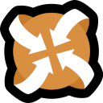 | [***nexus-mods***](apps/nexus-mods.md) | *A mod installer, creator and manager for all your popular games.*..[ *read more* ](apps/nexus-mods.md)*!* | [*blob*](https://github.com/ivan-hc/AM/blob/main/programs/x86_64/nexus-mods) **/** [*raw*](https://raw.githubusercontent.com/ivan-hc/AM/main/programs/x86_64/nexus-mods) |
|  | [***notepad++***](apps/notepad++.md) | *Unofficial Appimage of Notepad++, with WINE prefix.*..[ *read more* ](apps/notepad++.md)*!* | [*blob*](https://github.com/ivan-hc/AM/blob/main/programs/x86_64/notepad++) **/** [*raw*](https://raw.githubusercontent.com/ivan-hc/AM/main/programs/x86_64/notepad++) |
| 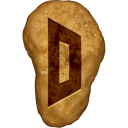 | [***nugget-doom***](apps/nugget-doom.md) | *Nugget Doom is a Doom game source port forked from Woof! with additional features.*..[ *read more* ](apps/nugget-doom.md)*!* | [*blob*](https://github.com/ivan-hc/AM/blob/main/programs/x86_64/nugget-doom) **/** [*raw*](https://raw.githubusercontent.com/ivan-hc/AM/main/programs/x86_64/nugget-doom) |
|  | [***nugget-doom-enhanced***](apps/nugget-doom-enhanced.md) | *Unofficial, a Doom source port forked from Woof! with additional features.*..[ *read more* ](apps/nugget-doom-enhanced.md)*!* | [*blob*](https://github.com/ivan-hc/AM/blob/main/programs/x86_64/nugget-doom-enhanced) **/** [*raw*](https://raw.githubusercontent.com/ivan-hc/AM/main/programs/x86_64/nugget-doom-enhanced) |
|  | [***nychess***](apps/nychess.md) | *A python Chess Engine and AI.*..[ *read more* ](apps/nychess.md)*!* | [*blob*](https://github.com/ivan-hc/AM/blob/main/programs/x86_64/nychess) **/** [*raw*](https://raw.githubusercontent.com/ivan-hc/AM/main/programs/x86_64/nychess) |
|  | [***nyrna***](apps/nyrna.md) | *Suspend games and applications.*..[ *read more* ](apps/nyrna.md)*!* | [*blob*](https://github.com/ivan-hc/AM/blob/main/programs/x86_64/nyrna) **/** [*raw*](https://raw.githubusercontent.com/ivan-hc/AM/main/programs/x86_64/nyrna) |
|  | [***obliqoro***](apps/obliqoro.md) | *A cross-platform tauri gui where Oblique Strategies meets Pomodoro.*..[ *read more* ](apps/obliqoro.md)*!* | [*blob*](https://github.com/ivan-hc/AM/blob/main/programs/x86_64/obliqoro) **/** [*raw*](https://raw.githubusercontent.com/ivan-hc/AM/main/programs/x86_64/obliqoro) |
|  | [***odamex***](apps/odamex.md) | *Unofficial, Online Multiplayer Doom port with a strong focus on the original gameplay while providing a breadth of enhancements.*..[ *read more* ](apps/odamex.md)*!* | [*blob*](https://github.com/ivan-hc/AM/blob/main/programs/x86_64/odamex) **/** [*raw*](https://raw.githubusercontent.com/ivan-hc/AM/main/programs/x86_64/odamex) |
|  | [***omikuji***](apps/omikuji.md) | *Qt/QML based game launcher for Linux.*..[ *read more* ](apps/omikuji.md)*!* | [*blob*](https://github.com/ivan-hc/AM/blob/main/programs/x86_64/omikuji) **/** [*raw*](https://raw.githubusercontent.com/ivan-hc/AM/main/programs/x86_64/omikuji) |
|  | [***openarena***](apps/openarena.md) | *Violent & sexy, multiplayer first person shooter game, ioquake3.*..[ *read more* ](apps/openarena.md)*!* | [*blob*](https://github.com/ivan-hc/AM/blob/main/programs/x86_64/openarena) **/** [*raw*](https://raw.githubusercontent.com/ivan-hc/AM/main/programs/x86_64/openarena) |
|  | [***openblok***](apps/openblok.md) | *A customizable falling block puzzle game like tetris.*..[ *read more* ](apps/openblok.md)*!* | [*blob*](https://github.com/ivan-hc/AM/blob/main/programs/x86_64/openblok) **/** [*raw*](https://raw.githubusercontent.com/ivan-hc/AM/main/programs/x86_64/openblok) |
| 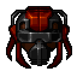 | [***openhv***](apps/openhv.md) | *A mod for OpenRA based on the Hard Vacuum, game.*..[ *read more* ](apps/openhv.md)*!* | [*blob*](https://github.com/ivan-hc/AM/blob/main/programs/x86_64/openhv) **/** [*raw*](https://raw.githubusercontent.com/ivan-hc/AM/main/programs/x86_64/openhv) |
|  | [***openjazz***](apps/openjazz.md) | *Unofficial, open-source version of the classic Jazz Jackrabbit™ games.*..[ *read more* ](apps/openjazz.md)*!* | [*blob*](https://github.com/ivan-hc/AM/blob/main/programs/x86_64/openjazz) **/** [*raw*](https://raw.githubusercontent.com/ivan-hc/AM/main/programs/x86_64/openjazz) |
|  | [***openmw***](apps/openmw.md) | *OpenMW is an open-source open-world RPG game engine that supports playing Morrowind.*..[ *read more* ](apps/openmw.md)*!* | [*blob*](https://github.com/ivan-hc/AM/blob/main/programs/x86_64/openmw) **/** [*raw*](https://raw.githubusercontent.com/ivan-hc/AM/main/programs/x86_64/openmw) |
|  | [***openop2***](apps/openop2.md) | *Re-implementation of the game Outpost 2, using the OpenRA engine.*..[ *read more* ](apps/openop2.md)*!* | [*blob*](https://github.com/ivan-hc/AM/blob/main/programs/x86_64/openop2) **/** [*raw*](https://raw.githubusercontent.com/ivan-hc/AM/main/programs/x86_64/openop2) |
| 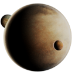 | [***openra-dune***](apps/openra-dune.md) | *Real-time strategy game engine, MOD Dune 2000.*..[ *read more* ](apps/openra-dune.md)*!* | [*blob*](https://github.com/ivan-hc/AM/blob/main/programs/x86_64/openra-dune) **/** [*raw*](https://raw.githubusercontent.com/ivan-hc/AM/main/programs/x86_64/openra-dune) |
|  | [***openra-red-alert***](apps/openra-red-alert.md) | *Real-time strategy game engine, MOD Red Alert.*..[ *read more* ](apps/openra-red-alert.md)*!* | [*blob*](https://github.com/ivan-hc/AM/blob/main/programs/x86_64/openra-red-alert) **/** [*raw*](https://raw.githubusercontent.com/ivan-hc/AM/main/programs/x86_64/openra-red-alert) |
|  | [***openra-tiberian-dawn***](apps/openra-tiberian-dawn.md) | *Real-time strategy game engine penGL, MOD TD.*..[ *read more* ](apps/openra-tiberian-dawn.md)*!* | [*blob*](https://github.com/ivan-hc/AM/blob/main/programs/x86_64/openra-tiberian-dawn) **/** [*raw*](https://raw.githubusercontent.com/ivan-hc/AM/main/programs/x86_64/openra-tiberian-dawn) |
|  | [***openramodsdk***](apps/openramodsdk.md) | *Dev Kit for building your own games using the OpenRA engine.*..[ *read more* ](apps/openramodsdk.md)*!* | [*blob*](https://github.com/ivan-hc/AM/blob/main/programs/x86_64/openramodsdk) **/** [*raw*](https://raw.githubusercontent.com/ivan-hc/AM/main/programs/x86_64/openramodsdk) |
|  | [***openrct2***](apps/openrct2.md) | *Re-implementation of RollerCoaster Tycoon 2 (RCT2), expanding the game with new features.*..[ *read more* ](apps/openrct2.md)*!* | [*blob*](https://github.com/ivan-hc/AM/blob/main/programs/x86_64/openrct2) **/** [*raw*](https://raw.githubusercontent.com/ivan-hc/AM/main/programs/x86_64/openrct2) |
|  | [***openrct2-enhanced***](apps/openrct2-enhanced.md) | *Unofficial, Re-implementation of RollerCoaster Tycoon 2 (RCT2), expanding the game with new features.*..[ *read more* ](apps/openrct2-enhanced.md)*!* | [*blob*](https://github.com/ivan-hc/AM/blob/main/programs/x86_64/openrct2-enhanced) **/** [*raw*](https://raw.githubusercontent.com/ivan-hc/AM/main/programs/x86_64/openrct2-enhanced) |
| 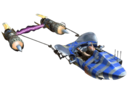 | [***openswe1r***](apps/openswe1r.md) | *Racer.*..[ *read more* ](apps/openswe1r.md)*!* | [*blob*](https://github.com/ivan-hc/AM/blob/main/programs/x86_64/openswe1r) **/** [*raw*](https://raw.githubusercontent.com/ivan-hc/AM/main/programs/x86_64/openswe1r) |
|  | [***openttd***](apps/openttd.md) | *Unofficial, an open source simulation game based upon Transport Tycoon Deluxe.*..[ *read more* ](apps/openttd.md)*!* | [*blob*](https://github.com/ivan-hc/AM/blob/main/programs/x86_64/openttd) **/** [*raw*](https://raw.githubusercontent.com/ivan-hc/AM/main/programs/x86_64/openttd) |
|  | [***openxcom-extended***](apps/openxcom-extended.md) | *OXCE, extended version of openXcom provide better mod support, QoL improvements, new game mechanics, improved and new GUIs.*..[ *read more* ](apps/openxcom-extended.md)*!* | [*blob*](https://github.com/ivan-hc/AM/blob/main/programs/x86_64/openxcom-extended) **/** [*raw*](https://raw.githubusercontent.com/ivan-hc/AM/main/programs/x86_64/openxcom-extended) |
|  | [***osu***](apps/osu.md) | *A free-to-win rhythm game. Rhythm is just a click away!*..[ *read more* ](apps/osu.md)*!* | [*blob*](https://github.com/ivan-hc/AM/blob/main/programs/x86_64/osu) **/** [*raw*](https://raw.githubusercontent.com/ivan-hc/AM/main/programs/x86_64/osu) |
|  | [***ottomatic***](apps/ottomatic.md) | *Pangea Software’s Otto Matic, a game of robots.*..[ *read more* ](apps/ottomatic.md)*!* | [*blob*](https://github.com/ivan-hc/AM/blob/main/programs/x86_64/ottomatic) **/** [*raw*](https://raw.githubusercontent.com/ivan-hc/AM/main/programs/x86_64/ottomatic) |
|  | [***overbind***](apps/overbind.md) | *A utility that allows binding keyboard buttons to virtual Xbox360 controller joystick outputs.*..[ *read more* ](apps/overbind.md)*!* | [*blob*](https://github.com/ivan-hc/AM/blob/main/programs/x86_64/overbind) **/** [*raw*](https://raw.githubusercontent.com/ivan-hc/AM/main/programs/x86_64/overbind) |
| 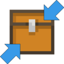 | [***packsquash***](apps/packsquash.md) | *A Minecraft Java Edition resource and data pack optimizer.*..[ *read more* ](apps/packsquash.md)*!* | [*blob*](https://github.com/ivan-hc/AM/blob/main/programs/x86_64/packsquash) **/** [*raw*](https://raw.githubusercontent.com/ivan-hc/AM/main/programs/x86_64/packsquash) |
|  | [***palapeli***](apps/kdegames.md) | *Jigsaw puzzle game. This is part of "kdegames".*..[ *read more* ](apps/kdegames.md)*!* | [*blob*](https://github.com/ivan-hc/AM/blob/main/programs/x86_64/kdegames) **/** [*raw*](https://raw.githubusercontent.com/ivan-hc/AM/main/programs/x86_64/kdegames) |
|  | [***pandoralauncher***](apps/pandoralauncher.md) | *Pandora is a modern Minecraft launcher that balances ease-of-use with powerful instance management features.*..[ *read more* ](apps/pandoralauncher.md)*!* | [*blob*](https://github.com/ivan-hc/AM/blob/main/programs/x86_64/pandoralauncher) **/** [*raw*](https://raw.githubusercontent.com/ivan-hc/AM/main/programs/x86_64/pandoralauncher) |
|  | [***pandoralaunchercrack***](apps/pandoralaunchercrack.md) | *Customized version of Pandora, a modern Minecraft launcher that balances ease-of-use with powerful instance management features.*..[ *read more* ](apps/pandoralaunchercrack.md)*!* | [*blob*](https://github.com/ivan-hc/AM/blob/main/programs/x86_64/pandoralaunchercrack) **/** [*raw*](https://raw.githubusercontent.com/ivan-hc/AM/main/programs/x86_64/pandoralaunchercrack) |
|  | [***parsec-linux***](apps/parsec-linux.md) | *Parsec game streaming client.*..[ *read more* ](apps/parsec-linux.md)*!* | [*blob*](https://github.com/ivan-hc/AM/blob/main/programs/x86_64/parsec-linux) **/** [*raw*](https://raw.githubusercontent.com/ivan-hc/AM/main/programs/x86_64/parsec-linux) |
|  | [***pcsx-redux-enhanced***](apps/pcsx-redux-enhanced.md) | *Unofficial, modern fork of the pcsxr PlayStation 1 emulator focused on reverse engineering and homebrew development.*..[ *read more* ](apps/pcsx-redux-enhanced.md)*!* | [*blob*](https://github.com/ivan-hc/AM/blob/main/programs/x86_64/pcsx-redux-enhanced) **/** [*raw*](https://raw.githubusercontent.com/ivan-hc/AM/main/programs/x86_64/pcsx-redux-enhanced) |
|  | [***pcsx2***](apps/pcsx2.md) | *PCSX2 is a free and open-source PlayStation 2 (PS2) emulator, using a combination of MIPS CPU Interpreters, Recompilers and a Virtual Machine which manages hardware states and PS2 system memory. This allows you to play PS2 games on your PC, with many additional features and benefits.*..[ *read more* ](apps/pcsx2.md)*!* | [*blob*](https://github.com/ivan-hc/AM/blob/main/programs/x86_64/pcsx2) **/** [*raw*](https://raw.githubusercontent.com/ivan-hc/AM/main/programs/x86_64/pcsx2) |
|  | [***pcsx2-nightly***](apps/pcsx2-nightly.md) | *PCSX2 is a free and open-source PlayStation 2 (PS2) emulator, using a combination of MIPS CPU Interpreters, Recompilers and a Virtual Machine which manages hardware states and PS2 system memory. This allows you to play PS2 games on your PC, with many additional features and benefits. This is the nightly version.*..[ *read more* ](apps/pcsx2-nightly.md)*!* | [*blob*](https://github.com/ivan-hc/AM/blob/main/programs/x86_64/pcsx2-nightly) **/** [*raw*](https://raw.githubusercontent.com/ivan-hc/AM/main/programs/x86_64/pcsx2-nightly) |
|  | [***pelusica***](apps/pelusica.md) | *Action game, control the blue dot with your keyboard/create music.*..[ *read more* ](apps/pelusica.md)*!* | [*blob*](https://github.com/ivan-hc/AM/blob/main/programs/x86_64/pelusica) **/** [*raw*](https://raw.githubusercontent.com/ivan-hc/AM/main/programs/x86_64/pelusica) |
|  | [***picmi***](apps/kdegames.md) | *Single player logic-based puzzle game. This is part of "kdegames".*..[ *read more* ](apps/kdegames.md)*!* | [*blob*](https://github.com/ivan-hc/AM/blob/main/programs/x86_64/kdegames) **/** [*raw*](https://raw.githubusercontent.com/ivan-hc/AM/main/programs/x86_64/kdegames) |
|  | [***pigs-n-cows***](apps/pigs-n-cows.md) | *A relaxing game for children and adults alike.*..[ *read more* ](apps/pigs-n-cows.md)*!* | [*blob*](https://github.com/ivan-hc/AM/blob/main/programs/x86_64/pigs-n-cows) **/** [*raw*](https://raw.githubusercontent.com/ivan-hc/AM/main/programs/x86_64/pigs-n-cows) |
|  | [***pince***](apps/pince.md) | *Reverse engineering tool for linux games.*..[ *read more* ](apps/pince.md)*!* | [*blob*](https://github.com/ivan-hc/AM/blob/main/programs/x86_64/pince) **/** [*raw*](https://raw.githubusercontent.com/ivan-hc/AM/main/programs/x86_64/pince) |
| 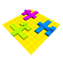 | [***planes***](apps/planes.md) | *Variant of battleships game.*..[ *read more* ](apps/planes.md)*!* | [*blob*](https://github.com/ivan-hc/AM/blob/main/programs/x86_64/planes) **/** [*raw*](https://raw.githubusercontent.com/ivan-hc/AM/main/programs/x86_64/planes) |
|  | [***planet-blupi***](apps/planet-blupi.md) | *A delirious spell-binding game.*..[ *read more* ](apps/planet-blupi.md)*!* | [*blob*](https://github.com/ivan-hc/AM/blob/main/programs/x86_64/planet-blupi) **/** [*raw*](https://raw.githubusercontent.com/ivan-hc/AM/main/programs/x86_64/planet-blupi) |
|  | [***play***](apps/play.md) | *Play! is a PlayStation2 games emulator.*..[ *read more* ](apps/play.md)*!* | [*blob*](https://github.com/ivan-hc/AM/blob/main/programs/x86_64/play) **/** [*raw*](https://raw.githubusercontent.com/ivan-hc/AM/main/programs/x86_64/play) |
| 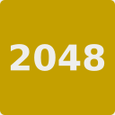 | [***play-2048***](apps/play-2048.md) | *Another implementation of the 2048 game.*..[ *read more* ](apps/play-2048.md)*!* | [*blob*](https://github.com/ivan-hc/AM/blob/main/programs/x86_64/play-2048) **/** [*raw*](https://raw.githubusercontent.com/ivan-hc/AM/main/programs/x86_64/play-2048) |
|  | [***play-enhanced***](apps/play-enhanced.md) | *Unofficial, a PlayStation2 emulator.*..[ *read more* ](apps/play-enhanced.md)*!* | [*blob*](https://github.com/ivan-hc/AM/blob/main/programs/x86_64/play-enhanced) **/** [*raw*](https://raw.githubusercontent.com/ivan-hc/AM/main/programs/x86_64/play-enhanced) |
|  | [***playback***](apps/playback.md) | *Play and manage your cartridges and replay your childhood games.*..[ *read more* ](apps/playback.md)*!* | [*blob*](https://github.com/ivan-hc/AM/blob/main/programs/x86_64/playback) **/** [*raw*](https://raw.githubusercontent.com/ivan-hc/AM/main/programs/x86_64/playback) |
| 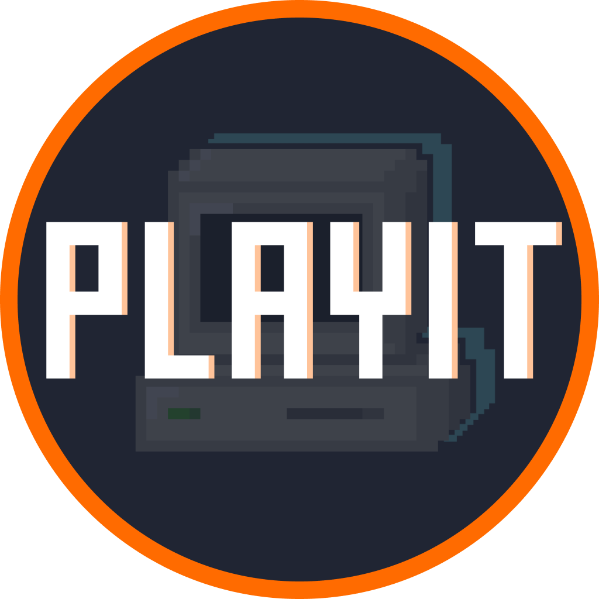 | [***playit***](apps/playit.md) | *Want to run an online game server? playit.gg is a global proxy that allows anyone to host a server without port forwarding.*..[ *read more* ](apps/playit.md)*!* | [*blob*](https://github.com/ivan-hc/AM/blob/main/programs/x86_64/playit) **/** [*raw*](https://raw.githubusercontent.com/ivan-hc/AM/main/programs/x86_64/playit) |
|  | [***pokete***](apps/pokete.md) | *A terminal based Pokemon like game.*..[ *read more* ](apps/pokete.md)*!* | [*blob*](https://github.com/ivan-hc/AM/blob/main/programs/x86_64/pokete) **/** [*raw*](https://raw.githubusercontent.com/ivan-hc/AM/main/programs/x86_64/pokete) |
| 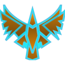 | [***prey2006***](apps/prey2006.md) | *Unofficial, Prey 2006 SDK integrated with Doom 3 GPL release.*..[ *read more* ](apps/prey2006.md)*!* | [*blob*](https://github.com/ivan-hc/AM/blob/main/programs/x86_64/prey2006) **/** [*raw*](https://raw.githubusercontent.com/ivan-hc/AM/main/programs/x86_64/prey2006) |
|  | [***prime-world-editor***](apps/prime-world-editor.md) | *Edit world assets from games by Retro Studios.*..[ *read more* ](apps/prime-world-editor.md)*!* | [*blob*](https://github.com/ivan-hc/AM/blob/main/programs/x86_64/prime-world-editor) **/** [*raw*](https://raw.githubusercontent.com/ivan-hc/AM/main/programs/x86_64/prime-world-editor) |
|  | [***principia***](apps/principia.md) | *Open source physics-based sandbox game.*..[ *read more* ](apps/principia.md)*!* | [*blob*](https://github.com/ivan-hc/AM/blob/main/programs/x86_64/principia) **/** [*raw*](https://raw.githubusercontent.com/ivan-hc/AM/main/programs/x86_64/principia) |
|  | [***prismlauncher***](apps/prismlauncher.md) | *Launcher for Minecraft, manage multiple installations.*..[ *read more* ](apps/prismlauncher.md)*!* | [*blob*](https://github.com/ivan-hc/AM/blob/main/programs/x86_64/prismlauncher) **/** [*raw*](https://raw.githubusercontent.com/ivan-hc/AM/main/programs/x86_64/prismlauncher) |
|  | [***prismlauncher-enhanced***](apps/prismlauncher-enhanced.md) | *Unofficial, a custom launcher for Minecraft that allows you to easily manage multiple installations of Minecraft at once (Fork of MultiMC).*..[ *read more* ](apps/prismlauncher-enhanced.md)*!* | [*blob*](https://github.com/ivan-hc/AM/blob/main/programs/x86_64/prismlauncher-enhanced) **/** [*raw*](https://raw.githubusercontent.com/ivan-hc/AM/main/programs/x86_64/prismlauncher-enhanced) |
|  | [***prismlauncher-qt5***](apps/prismlauncher-qt5.md) | *Launcher for Minecraft, manage multiple installations (Qt5 version).*..[ *read more* ](apps/prismlauncher-qt5.md)*!* | [*blob*](https://github.com/ivan-hc/AM/blob/main/programs/x86_64/prismlauncher-qt5) **/** [*raw*](https://raw.githubusercontent.com/ivan-hc/AM/main/programs/x86_64/prismlauncher-qt5) |
|  | [***protonup-qt***](apps/protonup-qt.md) | *Manage Proton-GE/Luxtorpeda for Steam/Wine-GE for Lutris.*..[ *read more* ](apps/protonup-qt.md)*!* | [*blob*](https://github.com/ivan-hc/AM/blob/main/programs/x86_64/protonup-qt) **/** [*raw*](https://raw.githubusercontent.com/ivan-hc/AM/main/programs/x86_64/protonup-qt) |
|  | [***psydoom***](apps/psydoom.md) | *A backport of PSX Doom to PC.*..[ *read more* ](apps/psydoom.md)*!* | [*blob*](https://github.com/ivan-hc/AM/blob/main/programs/x86_64/psydoom) **/** [*raw*](https://raw.githubusercontent.com/ivan-hc/AM/main/programs/x86_64/psydoom) |
|  | [***punes***](apps/punes.md) | *Qt-based Nintendo Entertaiment System emulator and NSF/NSF2/NSFe Music Player.*..[ *read more* ](apps/punes.md)*!* | [*blob*](https://github.com/ivan-hc/AM/blob/main/programs/x86_64/punes) **/** [*raw*](https://raw.githubusercontent.com/ivan-hc/AM/main/programs/x86_64/punes) |
|  | [***qtads***](apps/qtads.md) | *A cross-platform, multimedia interpreter for TADS adventure games.*..[ *read more* ](apps/qtads.md)*!* | [*blob*](https://github.com/ivan-hc/AM/blob/main/programs/x86_64/qtads) **/** [*raw*](https://raw.githubusercontent.com/ivan-hc/AM/main/programs/x86_64/qtads) |
|  | [***quantumlauncher-enhanced***](apps/quantumlauncher-enhanced.md) | *Unofficial, a simple, powerful Minecraft launcher.*..[ *read more* ](apps/quantumlauncher-enhanced.md)*!* | [*blob*](https://github.com/ivan-hc/AM/blob/main/programs/x86_64/quantumlauncher-enhanced) **/** [*raw*](https://raw.githubusercontent.com/ivan-hc/AM/main/programs/x86_64/quantumlauncher-enhanced) |
|  | [***r2modman***](apps/r2modman.md) | *Mod manager for several Unity games using Thunderstore.*..[ *read more* ](apps/r2modman.md)*!* | [*blob*](https://github.com/ivan-hc/AM/blob/main/programs/x86_64/r2modman) **/** [*raw*](https://raw.githubusercontent.com/ivan-hc/AM/main/programs/x86_64/r2modman) |
|  | [***rare***](apps/rare.md) | *GUI for legendary. An Epic Games Launcher open source alternative.*..[ *read more* ](apps/rare.md)*!* | [*blob*](https://github.com/ivan-hc/AM/blob/main/programs/x86_64/rare) **/** [*raw*](https://raw.githubusercontent.com/ivan-hc/AM/main/programs/x86_64/rare) |
| 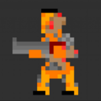 | [***rbdoom-3***](apps/rbdoom-3.md) | *Doom 3 BFG Edition source port with updated DX12/Vulkan renderer.*..[ *read more* ](apps/rbdoom-3.md)*!* | [*blob*](https://github.com/ivan-hc/AM/blob/main/programs/x86_64/rbdoom-3) **/** [*raw*](https://raw.githubusercontent.com/ivan-hc/AM/main/programs/x86_64/rbdoom-3) |
|  | [***redeclipse***](apps/redeclipse.md) | *A great first person 3D arena shooter with online support, game.*..[ *read more* ](apps/redeclipse.md)*!* | [*blob*](https://github.com/ivan-hc/AM/blob/main/programs/x86_64/redeclipse) **/** [*raw*](https://raw.githubusercontent.com/ivan-hc/AM/main/programs/x86_64/redeclipse) |
|  | [***rednukem***](apps/rednukem.md) | *Unofficial, a port of serveral BUILD Engine games based on EDuke32.*..[ *read more* ](apps/rednukem.md)*!* | [*blob*](https://github.com/ivan-hc/AM/blob/main/programs/x86_64/rednukem) **/** [*raw*](https://raw.githubusercontent.com/ivan-hc/AM/main/programs/x86_64/rednukem) |
| 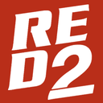 | [***redriver2***](apps/redriver2.md) | *Unofficial, Driver 2 Playstation game reverse engineering effort.*..[ *read more* ](apps/redriver2.md)*!* | [*blob*](https://github.com/ivan-hc/AM/blob/main/programs/x86_64/redriver2) **/** [*raw*](https://raw.githubusercontent.com/ivan-hc/AM/main/programs/x86_64/redriver2) |
|  | [***retroarch***](apps/retroarch.md) | *RetroArch is a free and open-source, cross-platform frontend for emulators, game engines, video games, media players and other applications.*..[ *read more* ](apps/retroarch.md)*!* | [*blob*](https://github.com/ivan-hc/AM/blob/main/programs/x86_64/retroarch) **/** [*raw*](https://raw.githubusercontent.com/ivan-hc/AM/main/programs/x86_64/retroarch) |
|  | [***retroarch-nightly***](apps/retroarch-nightly.md) | *RetroArch is a free and open-source, cross-platform frontend for emulators, game engines, video games, media players and other applications.*..[ *read more* ](apps/retroarch-nightly.md)*!* | [*blob*](https://github.com/ivan-hc/AM/blob/main/programs/x86_64/retroarch-nightly) **/** [*raw*](https://raw.githubusercontent.com/ivan-hc/AM/main/programs/x86_64/retroarch-nightly) |
|  | [***retroarch-qt***](apps/retroarch-qt.md) | *RetroArch is a free and open-source, cross-platform frontend for emulators, game engines, video games, media players and other applications.*..[ *read more* ](apps/retroarch-qt.md)*!* | [*blob*](https://github.com/ivan-hc/AM/blob/main/programs/x86_64/retroarch-qt) **/** [*raw*](https://raw.githubusercontent.com/ivan-hc/AM/main/programs/x86_64/retroarch-qt) |
|  | [***retroarch-qt-nightly***](apps/retroarch-qt-nightly.md) | *RetroArch is a free and open-source, cross-platform frontend for emulators, game engines, video games, media players and other applications.*..[ *read more* ](apps/retroarch-qt-nightly.md)*!* | [*blob*](https://github.com/ivan-hc/AM/blob/main/programs/x86_64/retroarch-qt-nightly) **/** [*raw*](https://raw.githubusercontent.com/ivan-hc/AM/main/programs/x86_64/retroarch-qt-nightly) |
|  | [***retrom***](apps/retrom.md) | *A centralized game library/collection management service with a focus on emulation.*..[ *read more* ](apps/retrom.md)*!* | [*blob*](https://github.com/ivan-hc/AM/blob/main/programs/x86_64/retrom) **/** [*raw*](https://raw.githubusercontent.com/ivan-hc/AM/main/programs/x86_64/retrom) |
| 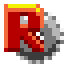 | [***rigelengine***](apps/rigelengine.md) | *Unofficial, modern re-implementation of DOS game Duke Nukem II.*..[ *read more* ](apps/rigelengine.md)*!* | [*blob*](https://github.com/ivan-hc/AM/blob/main/programs/x86_64/rigelengine) **/** [*raw*](https://raw.githubusercontent.com/ivan-hc/AM/main/programs/x86_64/rigelengine) |
|  | [***rocksndiamonds***](apps/rocksndiamonds.md) | *Unofficial, an open source arcade style game of Boulder Dash, Emerald Mine, and Sokoban.*..[ *read more* ](apps/rocksndiamonds.md)*!* | [*blob*](https://github.com/ivan-hc/AM/blob/main/programs/x86_64/rocksndiamonds) **/** [*raw*](https://raw.githubusercontent.com/ivan-hc/AM/main/programs/x86_64/rocksndiamonds) |
|  | [***roller***](apps/roller.md) | *Unofficial, reverse engineering the 1995 game Whiplash/Fatal Racing.*..[ *read more* ](apps/roller.md)*!* | [*blob*](https://github.com/ivan-hc/AM/blob/main/programs/x86_64/roller) **/** [*raw*](https://raw.githubusercontent.com/ivan-hc/AM/main/programs/x86_64/roller) |
|  | [***rpcs3***](apps/rpcs3.md) | *An open-source PlayStation 3 emulator/debugger written in C++.*..[ *read more* ](apps/rpcs3.md)*!* | [*blob*](https://github.com/ivan-hc/AM/blob/main/programs/x86_64/rpcs3) **/** [*raw*](https://raw.githubusercontent.com/ivan-hc/AM/main/programs/x86_64/rpcs3) |
|  | [***ryujinx***](apps/ryujinx.md) | *An open-source Nintendo Switch emulator, originally created by gdkchan, written in C#.*..[ *read more* ](apps/ryujinx.md)*!* | [*blob*](https://github.com/ivan-hc/AM/blob/main/programs/x86_64/ryujinx) **/** [*raw*](https://raw.githubusercontent.com/ivan-hc/AM/main/programs/x86_64/ryujinx) |
|  | [***ryujinx-canary***](apps/ryujinx-canary.md) | *An open-source Nintendo Switch emulator, originally created by gdkchan, written in C# (Canary builds).*..[ *read more* ](apps/ryujinx-canary.md)*!* | [*blob*](https://github.com/ivan-hc/AM/blob/main/programs/x86_64/ryujinx-canary) **/** [*raw*](https://raw.githubusercontent.com/ivan-hc/AM/main/programs/x86_64/ryujinx-canary) |
| 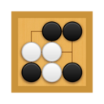 | [***sabaki***](apps/sabaki.md) | *Modern, elegant, cross-platform Go/Baduk/Weiqi game board.*..[ *read more* ](apps/sabaki.md)*!* | [*blob*](https://github.com/ivan-hc/AM/blob/main/programs/x86_64/sabaki) **/** [*raw*](https://raw.githubusercontent.com/ivan-hc/AM/main/programs/x86_64/sabaki) |
|  | [***samira***](apps/samira.md) | *Steam achievement manager for Linux written with Tauri and Rust.*..[ *read more* ](apps/samira.md)*!* | [*blob*](https://github.com/ivan-hc/AM/blob/main/programs/x86_64/samira) **/** [*raw*](https://raw.githubusercontent.com/ivan-hc/AM/main/programs/x86_64/samira) |
|  | [***samrewritten***](apps/samrewritten.md) | *Steam Achievement Manager For Linux. Rewritten in C++.*..[ *read more* ](apps/samrewritten.md)*!* | [*blob*](https://github.com/ivan-hc/AM/blob/main/programs/x86_64/samrewritten) **/** [*raw*](https://raw.githubusercontent.com/ivan-hc/AM/main/programs/x86_64/samrewritten) |
|  | [***sanicball***](apps/sanicball.md) | *Unofficial, an extraordinarily fast racing game.*..[ *read more* ](apps/sanicball.md)*!* | [*blob*](https://github.com/ivan-hc/AM/blob/main/programs/x86_64/sanicball) **/** [*raw*](https://raw.githubusercontent.com/ivan-hc/AM/main/programs/x86_64/sanicball) |
|  | [***sblauncher***](apps/sblauncher.md) | *Minecraft Launcher.*..[ *read more* ](apps/sblauncher.md)*!* | [*blob*](https://github.com/ivan-hc/AM/blob/main/programs/x86_64/sblauncher) **/** [*raw*](https://raw.githubusercontent.com/ivan-hc/AM/main/programs/x86_64/sblauncher) |
|  | [***sc-controller***](apps/sc-controller.md) | *User-mode driver and GTK3 based GUI for Steam Controller.*..[ *read more* ](apps/sc-controller.md)*!* | [*blob*](https://github.com/ivan-hc/AM/blob/main/programs/x86_64/sc-controller) **/** [*raw*](https://raw.githubusercontent.com/ivan-hc/AM/main/programs/x86_64/sc-controller) |
| 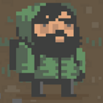 | [***scavengers***](apps/scavengers.md) | *Unity Roguelike tutorial, game.*..[ *read more* ](apps/scavengers.md)*!* | [*blob*](https://github.com/ivan-hc/AM/blob/main/programs/x86_64/scavengers) **/** [*raw*](https://raw.githubusercontent.com/ivan-hc/AM/main/programs/x86_64/scavengers) |
|  | [***scummvm***](apps/scummvm.md) | *Unofficial, A 'virtual machine' for several classic graphical point-and-click adventure games*..[ *read more* ](apps/scummvm.md)*!* | [*blob*](https://github.com/ivan-hc/AM/blob/main/programs/x86_64/scummvm) **/** [*raw*](https://raw.githubusercontent.com/ivan-hc/AM/main/programs/x86_64/scummvm) |
|  | [***serioussamtfe***](apps/serioussamtfe.md) | *Game engine for Serious Sam Classic, TFE.*..[ *read more* ](apps/serioussamtfe.md)*!* | [*blob*](https://github.com/ivan-hc/AM/blob/main/programs/x86_64/serioussamtfe) **/** [*raw*](https://raw.githubusercontent.com/ivan-hc/AM/main/programs/x86_64/serioussamtfe) |
|  | [***serioussamtfe-vk***](apps/serioussamtfe-vk.md) | *Game engine for Serious Sam Classic, Vulkan support, TFE.*..[ *read more* ](apps/serioussamtfe-vk.md)*!* | [*blob*](https://github.com/ivan-hc/AM/blob/main/programs/x86_64/serioussamtfe-vk) **/** [*raw*](https://raw.githubusercontent.com/ivan-hc/AM/main/programs/x86_64/serioussamtfe-vk) |
|  | [***serioussamtse***](apps/serioussamtse.md) | *Game engine for Serious Sam Classic, TSE.*..[ *read more* ](apps/serioussamtse.md)*!* | [*blob*](https://github.com/ivan-hc/AM/blob/main/programs/x86_64/serioussamtse) **/** [*raw*](https://raw.githubusercontent.com/ivan-hc/AM/main/programs/x86_64/serioussamtse) |
|  | [***serioussamtse-vk***](apps/serioussamtse-vk.md) | *Game engine for Serious Sam Classic, Vulkan support, TSE.*..[ *read more* ](apps/serioussamtse-vk.md)*!* | [*blob*](https://github.com/ivan-hc/AM/blob/main/programs/x86_64/serioussamtse-vk) **/** [*raw*](https://raw.githubusercontent.com/ivan-hc/AM/main/programs/x86_64/serioussamtse-vk) |
|  | [***sfp***](apps/sfp.md) | *This utility is designed to allow you to apply skins to the modern Steam client.*..[ *read more* ](apps/sfp.md)*!* | [*blob*](https://github.com/ivan-hc/AM/blob/main/programs/x86_64/sfp) **/** [*raw*](https://raw.githubusercontent.com/ivan-hc/AM/main/programs/x86_64/sfp) |
|  | [***shadps4***](apps/shadps4.md) | *An early PlayStation 4 emulator written in C++.*..[ *read more* ](apps/shadps4.md)*!* | [*blob*](https://github.com/ivan-hc/AM/blob/main/programs/x86_64/shadps4) **/** [*raw*](https://raw.githubusercontent.com/ivan-hc/AM/main/programs/x86_64/shadps4) |
|  | [***shadps4-qtlauncher***](apps/shadps4-qtlauncher.md) | *The official Qt launcher for shadps4 PlayStation 4 emulator.*..[ *read more* ](apps/shadps4-qtlauncher.md)*!* | [*blob*](https://github.com/ivan-hc/AM/blob/main/programs/x86_64/shadps4-qtlauncher) **/** [*raw*](https://raw.githubusercontent.com/ivan-hc/AM/main/programs/x86_64/shadps4-qtlauncher) |
|  | [***skyemu***](apps/skyemu.md) | *Game Boy Advance, Game Boy, Game Boy Color, and DS Emulator.*..[ *read more* ](apps/skyemu.md)*!* | [*blob*](https://github.com/ivan-hc/AM/blob/main/programs/x86_64/skyemu) **/** [*raw*](https://raw.githubusercontent.com/ivan-hc/AM/main/programs/x86_64/skyemu) |
| 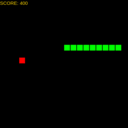 | [***snake-js***](apps/snake-js.md) | *Canvas/JavaScript based Snake Game with support for controllers.*..[ *read more* ](apps/snake-js.md)*!* | [*blob*](https://github.com/ivan-hc/AM/blob/main/programs/x86_64/snake-js) **/** [*raw*](https://raw.githubusercontent.com/ivan-hc/AM/main/programs/x86_64/snake-js) |
|  | [***snes9x***](apps/snes9x.md) | *Snes9x - Portable Super Nintendo Entertainment System TM emulator.*..[ *read more* ](apps/snes9x.md)*!* | [*blob*](https://github.com/ivan-hc/AM/blob/main/programs/x86_64/snes9x) **/** [*raw*](https://raw.githubusercontent.com/ivan-hc/AM/main/programs/x86_64/snes9x) |
|  | [***snes9x-enhanced***](apps/snes9x-enhanced.md) | *Unofficial, Snes9x - Portable Super Nintendo Entertainment System TM emulator.*..[ *read more* ](apps/snes9x-enhanced.md)*!* | [*blob*](https://github.com/ivan-hc/AM/blob/main/programs/x86_64/snes9x-enhanced) **/** [*raw*](https://raw.githubusercontent.com/ivan-hc/AM/main/programs/x86_64/snes9x-enhanced) |
|  | [***soul-arena***](apps/soul-arena.md) | *Bleach-based online multiplayer strategy game.*..[ *read more* ](apps/soul-arena.md)*!* | [*blob*](https://github.com/ivan-hc/AM/blob/main/programs/x86_64/soul-arena) **/** [*raw*](https://raw.githubusercontent.com/ivan-hc/AM/main/programs/x86_64/soul-arena) |
|  | [***sound-space-plus***](apps/sound-space-plus.md) | *Unofficial AppImage of sound-space-plus, Rhythm-based aim game.*..[ *read more* ](apps/sound-space-plus.md)*!* | [*blob*](https://github.com/ivan-hc/AM/blob/main/programs/x86_64/sound-space-plus) **/** [*raw*](https://raw.githubusercontent.com/ivan-hc/AM/main/programs/x86_64/sound-space-plus) |
|  | [***spacecadet***](apps/spacecadet.md) | *Unofficial. Reverse engineered port of 3D Pinball for Windows XP Space Cadet.*..[ *read more* ](apps/spacecadet.md)*!* | [*blob*](https://github.com/ivan-hc/AM/blob/main/programs/x86_64/spacecadet) **/** [*raw*](https://raw.githubusercontent.com/ivan-hc/AM/main/programs/x86_64/spacecadet) |
| 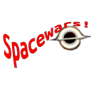 | [***spacewars***](apps/spacewars.md) | *A re-imagining of the classic game Spacewar using Amethyst engine.*..[ *read more* ](apps/spacewars.md)*!* | [*blob*](https://github.com/ivan-hc/AM/blob/main/programs/x86_64/spacewars) **/** [*raw*](https://raw.githubusercontent.com/ivan-hc/AM/main/programs/x86_64/spacewars) |
|  | [***spaghettikart***](apps/spaghettikart.md) | *Unofficial Mario Kart 64 PC game Port.*..[ *read more* ](apps/spaghettikart.md)*!* | [*blob*](https://github.com/ivan-hc/AM/blob/main/programs/x86_64/spaghettikart) **/** [*raw*](https://raw.githubusercontent.com/ivan-hc/AM/main/programs/x86_64/spaghettikart) |
| 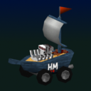 | [***spaghettikart-enhanced***](apps/spaghettikart-enhanced.md) | *Unofficial, Mario Kart 64 PC game Port.*..[ *read more* ](apps/spaghettikart-enhanced.md)*!* | [*blob*](https://github.com/ivan-hc/AM/blob/main/programs/x86_64/spaghettikart-enhanced) **/** [*raw*](https://raw.githubusercontent.com/ivan-hc/AM/main/programs/x86_64/spaghettikart-enhanced) |
|  | [***speed-dreams***](apps/speed-dreams.md) | *A Torcs fork, 3d motorsport simulation and race cars game.*..[ *read more* ](apps/speed-dreams.md)*!* | [*blob*](https://github.com/ivan-hc/AM/blob/main/programs/x86_64/speed-dreams) **/** [*raw*](https://raw.githubusercontent.com/ivan-hc/AM/main/programs/x86_64/speed-dreams) |
|  | [***spicy-launcher***](apps/spicy-launcher.md) | *Cross-platform launcher for Spicy Lobster games.*..[ *read more* ](apps/spicy-launcher.md)*!* | [*blob*](https://github.com/ivan-hc/AM/blob/main/programs/x86_64/spicy-launcher) **/** [*raw*](https://raw.githubusercontent.com/ivan-hc/AM/main/programs/x86_64/spicy-launcher) |
|  | [***srb2***](apps/srb2.md) | *Unofficial, a 3D Sonic the Hedgehog fangame based on a modified version of Doom Legacy.*..[ *read more* ](apps/srb2.md)*!* | [*blob*](https://github.com/ivan-hc/AM/blob/main/programs/x86_64/srb2) **/** [*raw*](https://raw.githubusercontent.com/ivan-hc/AM/main/programs/x86_64/srb2) |
|  | [***srb2k***](apps/srb2k.md) | *AppImage Package for Sonic Robo Blast 2 Kart, game.*..[ *read more* ](apps/srb2k.md)*!* | [*blob*](https://github.com/ivan-hc/AM/blob/main/programs/x86_64/srb2k) **/** [*raw*](https://raw.githubusercontent.com/ivan-hc/AM/main/programs/x86_64/srb2k) |
|  | [***stackandconquer***](apps/stackandconquer.md) | *A challenging tower conquest board game "Mixtour" inspired.*..[ *read more* ](apps/stackandconquer.md)*!* | [*blob*](https://github.com/ivan-hc/AM/blob/main/programs/x86_64/stackandconquer) **/** [*raw*](https://raw.githubusercontent.com/ivan-hc/AM/main/programs/x86_64/stackandconquer) |
|  | [***steam***](apps/steam.md) | *Unofficial. The ultimate destination for playing, discussing, and creating games.*..[ *read more* ](apps/steam.md)*!* | [*blob*](https://github.com/ivan-hc/AM/blob/main/programs/x86_64/steam) **/** [*raw*](https://raw.githubusercontent.com/ivan-hc/AM/main/programs/x86_64/steam) |
|  | [***steam-rom-manager***](apps/steam-rom-manager.md) | *An app for managing ROMs in Steam.*..[ *read more* ](apps/steam-rom-manager.md)*!* | [*blob*](https://github.com/ivan-hc/AM/blob/main/programs/x86_64/steam-rom-manager) **/** [*raw*](https://raw.githubusercontent.com/ivan-hc/AM/main/programs/x86_64/steam-rom-manager) |
|  | [***steam-tui***](apps/steam-tui.md) | *Rust TUI client for steamcmd.*..[ *read more* ](apps/steam-tui.md)*!* | [*blob*](https://github.com/ivan-hc/AM/blob/main/programs/x86_64/steam-tui) **/** [*raw*](https://raw.githubusercontent.com/ivan-hc/AM/main/programs/x86_64/steam-tui) |
|  | [***steamcad***](apps/steamcad.md) | *2D CAD especially designed to draw steam locomotives.*..[ *read more* ](apps/steamcad.md)*!* | [*blob*](https://github.com/ivan-hc/AM/blob/main/programs/x86_64/steamcad) **/** [*raw*](https://raw.githubusercontent.com/ivan-hc/AM/main/programs/x86_64/steamcad) |
|  | [***steamdepotdownloadergui***](apps/steamdepotdownloadergui.md) | *Easily download older versions of games from Steam.*..[ *read more* ](apps/steamdepotdownloadergui.md)*!* | [*blob*](https://github.com/ivan-hc/AM/blob/main/programs/x86_64/steamdepotdownloadergui) **/** [*raw*](https://raw.githubusercontent.com/ivan-hc/AM/main/programs/x86_64/steamdepotdownloadergui) |
| 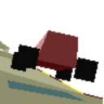 | [***stunt-car-remake***](apps/stunt-car-remake.md) | *Remake of the old game Stunt Car Racer.*..[ *read more* ](apps/stunt-car-remake.md)*!* | [*blob*](https://github.com/ivan-hc/AM/blob/main/programs/x86_64/stunt-car-remake) **/** [*raw*](https://raw.githubusercontent.com/ivan-hc/AM/main/programs/x86_64/stunt-car-remake) |
|  | [***sunshine***](apps/sunshine.md) | *Sunshine is a Gamestream host for Moonlight.*..[ *read more* ](apps/sunshine.md)*!* | [*blob*](https://github.com/ivan-hc/AM/blob/main/programs/x86_64/sunshine) **/** [*raw*](https://raw.githubusercontent.com/ivan-hc/AM/main/programs/x86_64/sunshine) |
|  | [***supermariowar***](apps/supermariowar.md) | *Unofficial, a fan-made multiplayer Super Mario Bros. style deathmatch game.*..[ *read more* ](apps/supermariowar.md)*!* | [*blob*](https://github.com/ivan-hc/AM/blob/main/programs/x86_64/supermariowar) **/** [*raw*](https://raw.githubusercontent.com/ivan-hc/AM/main/programs/x86_64/supermariowar) |
|  | [***supermodel***](apps/supermodel.md) | *Unofficial, Sega Model 3 arcade emulator.*..[ *read more* ](apps/supermodel.md)*!* | [*blob*](https://github.com/ivan-hc/AM/blob/main/programs/x86_64/supermodel) **/** [*raw*](https://raw.githubusercontent.com/ivan-hc/AM/main/programs/x86_64/supermodel) |
| 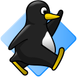 | [***supertux***](apps/supertux.md) | *Classic 2D jump'n run sidescroller game inspired to Super Mario.*..[ *read more* ](apps/supertux.md)*!* | [*blob*](https://github.com/ivan-hc/AM/blob/main/programs/x86_64/supertux) **/** [*raw*](https://raw.githubusercontent.com/ivan-hc/AM/main/programs/x86_64/supertux) |
| 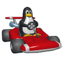 | [***supertuxkart***](apps/supertuxkart.md) | *Free kart racing game focused on Fun!*..[ *read more* ](apps/supertuxkart.md)*!* | [*blob*](https://github.com/ivan-hc/AM/blob/main/programs/x86_64/supertuxkart) **/** [*raw*](https://raw.githubusercontent.com/ivan-hc/AM/main/programs/x86_64/supertuxkart) |
|  | [***supertuxkart-dev***](apps/supertuxkart-dev.md) | *Free kart racing game focused on Fun! Pre-release.*..[ *read more* ](apps/supertuxkart-dev.md)*!* | [*blob*](https://github.com/ivan-hc/AM/blob/main/programs/x86_64/supertuxkart-dev) **/** [*raw*](https://raw.githubusercontent.com/ivan-hc/AM/main/programs/x86_64/supertuxkart-dev) |
| 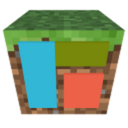 | [***swc-minecraft-launcher***](apps/swc-minecraft-launcher.md) | *SWC Minecraft Launcher.*..[ *read more* ](apps/swc-minecraft-launcher.md)*!* | [*blob*](https://github.com/ivan-hc/AM/blob/main/programs/x86_64/swc-minecraft-launcher) **/** [*raw*](https://raw.githubusercontent.com/ivan-hc/AM/main/programs/x86_64/swc-minecraft-launcher) |
|  | [***synthein***](apps/synthein.md) | *A space ship building and combat game.*..[ *read more* ](apps/synthein.md)*!* | [*blob*](https://github.com/ivan-hc/AM/blob/main/programs/x86_64/synthein) **/** [*raw*](https://raw.githubusercontent.com/ivan-hc/AM/main/programs/x86_64/synthein) |
|  | [***taisei-project***](apps/taisei-project.md) | *Unofficial, A free and open-source Touhou Project fangame.*..[ *read more* ](apps/taisei-project.md)*!* | [*blob*](https://github.com/ivan-hc/AM/blob/main/programs/x86_64/taisei-project) **/** [*raw*](https://raw.githubusercontent.com/ivan-hc/AM/main/programs/x86_64/taisei-project) |
|  | [***thlink***](apps/thlink.md) | *Touhou Project Game Netplay Tool.*..[ *read more* ](apps/thlink.md)*!* | [*blob*](https://github.com/ivan-hc/AM/blob/main/programs/x86_64/thlink) **/** [*raw*](https://raw.githubusercontent.com/ivan-hc/AM/main/programs/x86_64/thlink) |
|  | [***torcs***](apps/torcs.md) | *The 3D Open Racing Car Game and Simulator.*..[ *read more* ](apps/torcs.md)*!* | [*blob*](https://github.com/ivan-hc/AM/blob/main/programs/x86_64/torcs) **/** [*raw*](https://raw.githubusercontent.com/ivan-hc/AM/main/programs/x86_64/torcs) |
| 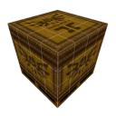 | [***trenchbroom***](apps/trenchbroom.md) | *A modern, cross-platform level editor for Quake engine based games.*..[ *read more* ](apps/trenchbroom.md)*!* | [*blob*](https://github.com/ivan-hc/AM/blob/main/programs/x86_64/trenchbroom) **/** [*raw*](https://raw.githubusercontent.com/ivan-hc/AM/main/programs/x86_64/trenchbroom) |
|  | [***tuxfootball***](apps/tuxfootball.md) | *Unofficial, is a great 2D football game for Windows and Linux.*..[ *read more* ](apps/tuxfootball.md)*!* | [*blob*](https://github.com/ivan-hc/AM/blob/main/programs/x86_64/tuxfootball) **/** [*raw*](https://raw.githubusercontent.com/ivan-hc/AM/main/programs/x86_64/tuxfootball) |
|  | [***tuxpuck***](apps/tuxpuck.md) | *Unofficial, hockey-like table game.*..[ *read more* ](apps/tuxpuck.md)*!* | [*blob*](https://github.com/ivan-hc/AM/blob/main/programs/x86_64/tuxpuck) **/** [*raw*](https://raw.githubusercontent.com/ivan-hc/AM/main/programs/x86_64/tuxpuck) |
|  | [***undertaker141***](apps/undertaker141.md) | *A free and open-source game-center for linux. Pre-configured Wine and Native Games for Linux.*..[ *read more* ](apps/undertaker141.md)*!* | [*blob*](https://github.com/ivan-hc/AM/blob/main/programs/x86_64/undertaker141) **/** [*raw*](https://raw.githubusercontent.com/ivan-hc/AM/main/programs/x86_64/undertaker141) |
|  | [***urbanterror***](apps/urbanterror.md) | *A team-based tactical game shooter based on the Quake 3 Engine.*..[ *read more* ](apps/urbanterror.md)*!* | [*blob*](https://github.com/ivan-hc/AM/blob/main/programs/x86_64/urbanterror) **/** [*raw*](https://raw.githubusercontent.com/ivan-hc/AM/main/programs/x86_64/urbanterror) |
|  | [***uzdoom***](apps/uzdoom.md) | *UZDoom is a feature centric port for all Doom engine games, based on GZDoom, adding an advanced renderer and powerful scripting capabilities.*..[ *read more* ](apps/uzdoom.md)*!* | [*blob*](https://github.com/ivan-hc/AM/blob/main/programs/x86_64/uzdoom) **/** [*raw*](https://raw.githubusercontent.com/ivan-hc/AM/main/programs/x86_64/uzdoom) |
|  | [***vapour***](apps/vapour.md) | *An alternative open source Steam client.*..[ *read more* ](apps/vapour.md)*!* | [*blob*](https://github.com/ivan-hc/AM/blob/main/programs/x86_64/vapour) **/** [*raw*](https://raw.githubusercontent.com/ivan-hc/AM/main/programs/x86_64/vapour) |
| 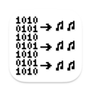 | [***vgmtrans***](apps/vgmtrans.md) | *A tool to convert proprietary, sequenced videogame music.*..[ *read more* ](apps/vgmtrans.md)*!* | [*blob*](https://github.com/ivan-hc/AM/blob/main/programs/x86_64/vgmtrans) **/** [*raw*](https://raw.githubusercontent.com/ivan-hc/AM/main/programs/x86_64/vgmtrans) |
|  | [***visipics***](apps/visipics.md) | *Windows software to find and remove duplicate pictures. Unofficial AppImage built using "wine32-deploy" and powered by "wine".*..[ *read more* ](apps/visipics.md)*!* | [*blob*](https://github.com/ivan-hc/AM/blob/main/programs/x86_64/visipics) **/** [*raw*](https://raw.githubusercontent.com/ivan-hc/AM/main/programs/x86_64/visipics) |
|  | [***vita3k***](apps/vita3k.md) | *Experimental PlayStation Vita emulator.*..[ *read more* ](apps/vita3k.md)*!* | [*blob*](https://github.com/ivan-hc/AM/blob/main/programs/x86_64/vita3k) **/** [*raw*](https://raw.githubusercontent.com/ivan-hc/AM/main/programs/x86_64/vita3k) |
| 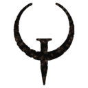 | [***vkquake***](apps/vkquake.md) | *Vulkan Quake game port based on QuakeSpasm.*..[ *read more* ](apps/vkquake.md)*!* | [*blob*](https://github.com/ivan-hc/AM/blob/main/programs/x86_64/vkquake) **/** [*raw*](https://raw.githubusercontent.com/ivan-hc/AM/main/programs/x86_64/vkquake) |
|  | [***westeroscraftlauncher***](apps/westeroscraftlauncher.md) | *Custom launcher for modded Minecraft, game.*..[ *read more* ](apps/westeroscraftlauncher.md)*!* | [*blob*](https://github.com/ivan-hc/AM/blob/main/programs/x86_64/westeroscraftlauncher) **/** [*raw*](https://raw.githubusercontent.com/ivan-hc/AM/main/programs/x86_64/westeroscraftlauncher) |
|  | [***wick-editor***](apps/wick-editor.md) | *A free and open-source tool for creating games, animations and everything in-between!*..[ *read more* ](apps/wick-editor.md)*!* | [*blob*](https://github.com/ivan-hc/AM/blob/main/programs/x86_64/wick-editor) **/** [*raw*](https://raw.githubusercontent.com/ivan-hc/AM/main/programs/x86_64/wick-editor) |
|  | [***widelands***](apps/widelands.md) | *Real-time strategy game with singleplayer campaigns.*..[ *read more* ](apps/widelands.md)*!* | [*blob*](https://github.com/ivan-hc/AM/blob/main/programs/x86_64/widelands) **/** [*raw*](https://raw.githubusercontent.com/ivan-hc/AM/main/programs/x86_64/widelands) |
|  | [***wiiu-downloader***](apps/wiiu-downloader.md) | *Allows to download encrypted wiiu files from nintendo's official servers.*..[ *read more* ](apps/wiiu-downloader.md)*!* | [*blob*](https://github.com/ivan-hc/AM/blob/main/programs/x86_64/wiiu-downloader) **/** [*raw*](https://raw.githubusercontent.com/ivan-hc/AM/main/programs/x86_64/wiiu-downloader) |
|  | [***wikilynx***](apps/wikilynx.md) | *A simple game browser made using Qt C++ for playing wikipedia speed-runs the right way.*..[ *read more* ](apps/wikilynx.md)*!* | [*blob*](https://github.com/ivan-hc/AM/blob/main/programs/x86_64/wikilynx) **/** [*raw*](https://raw.githubusercontent.com/ivan-hc/AM/main/programs/x86_64/wikilynx) |
|  | [***wine***](apps/wine.md) | *Unofficial. Run Windows programs, select a version from mmtrt/WINE_AppImage.*..[ *read more* ](apps/wine.md)*!* | [*blob*](https://github.com/ivan-hc/AM/blob/main/programs/x86_64/wine) **/** [*raw*](https://raw.githubusercontent.com/ivan-hc/AM/main/programs/x86_64/wine) |
|  | [***wine-devel***](apps/wine-devel.md) | *Unofficial. Compatibility layer to run x86_64 Windows programs, Dev Edition.*..[ *read more* ](apps/wine-devel.md)*!* | [*blob*](https://github.com/ivan-hc/AM/blob/main/programs/x86_64/wine-devel) **/** [*raw*](https://raw.githubusercontent.com/ivan-hc/AM/main/programs/x86_64/wine-devel) |
|  | [***wine-stable***](apps/wine-stable.md) | *Unofficial. Compatibility layer to run x86_64 Windows programs, Stable.*..[ *read more* ](apps/wine-stable.md)*!* | [*blob*](https://github.com/ivan-hc/AM/blob/main/programs/x86_64/wine-stable) **/** [*raw*](https://raw.githubusercontent.com/ivan-hc/AM/main/programs/x86_64/wine-stable) |
|  | [***wine-staging***](apps/wine-staging.md) | *Unofficial. Compatibility layer to run x86_64 Windows programs, Staging.*..[ *read more* ](apps/wine-staging.md)*!* | [*blob*](https://github.com/ivan-hc/AM/blob/main/programs/x86_64/wine-staging) **/** [*raw*](https://raw.githubusercontent.com/ivan-hc/AM/main/programs/x86_64/wine-staging) |
|  | [***wine-staging-ge-proton***](apps/wine-staging-ge-proton.md) | *Unofficial. Run x86_64 Windows programs, Staging GE Proton.*..[ *read more* ](apps/wine-staging-ge-proton.md)*!* | [*blob*](https://github.com/ivan-hc/AM/blob/main/programs/x86_64/wine-staging-ge-proton) **/** [*raw*](https://raw.githubusercontent.com/ivan-hc/AM/main/programs/x86_64/wine-staging-ge-proton) |
|  | [***wine32-deploy***](apps/wine32-deploy.md) | *Tool for creating AppImages for 32-bit Microsoft Windows apps.*..[ *read more* ](apps/wine32-deploy.md)*!* | [*blob*](https://github.com/ivan-hc/AM/blob/main/programs/x86_64/wine32-deploy) **/** [*raw*](https://raw.githubusercontent.com/ivan-hc/AM/main/programs/x86_64/wine32-deploy) |
|  | [***wipeout-rewrite***](apps/wipeout-rewrite.md) | *Unofficial, re-implementation of the 1995 PSX game wipEout.*..[ *read more* ](apps/wipeout-rewrite.md)*!* | [*blob*](https://github.com/ivan-hc/AM/blob/main/programs/x86_64/wipeout-rewrite) **/** [*raw*](https://raw.githubusercontent.com/ivan-hc/AM/main/programs/x86_64/wipeout-rewrite) |
|  | [***wlx-overlay-s***](apps/wlx-overlay-s.md) | *Access your Wayland/X11 desktop from Monado/WiVRn/SteamVR.*..[ *read more* ](apps/wlx-overlay-s.md)*!* | [*blob*](https://github.com/ivan-hc/AM/blob/main/programs/x86_64/wlx-overlay-s) **/** [*raw*](https://raw.githubusercontent.com/ivan-hc/AM/main/programs/x86_64/wlx-overlay-s) |
| 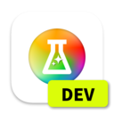 | [***wonderlab***](apps/wonderlab.md) | *A new generation Minecraft launcher.*..[ *read more* ](apps/wonderlab.md)*!* | [*blob*](https://github.com/ivan-hc/AM/blob/main/programs/x86_64/wonderlab) **/** [*raw*](https://raw.githubusercontent.com/ivan-hc/AM/main/programs/x86_64/wonderlab) |
|  | [***woof-doom***](apps/woof-doom.md) | *Woof! is a continuation of the Boom/MBF bloodline of Doom source ports.*..[ *read more* ](apps/woof-doom.md)*!* | [*blob*](https://github.com/ivan-hc/AM/blob/main/programs/x86_64/woof-doom) **/** [*raw*](https://raw.githubusercontent.com/ivan-hc/AM/main/programs/x86_64/woof-doom) |
|  | [***x-minecraft-launcher***](apps/x-minecraft-launcher.md) | *An Open Source Minecraft Launcher with Modern UX.*..[ *read more* ](apps/x-minecraft-launcher.md)*!* | [*blob*](https://github.com/ivan-hc/AM/blob/main/programs/x86_64/x-minecraft-launcher) **/** [*raw*](https://raw.githubusercontent.com/ivan-hc/AM/main/programs/x86_64/x-minecraft-launcher) |
|  | [***xash3d-fwgs***](apps/xash3d-fwgs.md) | *A game engine aimed to provide compatibility with Half-Life Engine and extend it.*..[ *read more* ](apps/xash3d-fwgs.md)*!* | [*blob*](https://github.com/ivan-hc/AM/blob/main/programs/x86_64/xash3d-fwgs) **/** [*raw*](https://raw.githubusercontent.com/ivan-hc/AM/main/programs/x86_64/xash3d-fwgs) |
|  | [***xash3d-fwgs-enhanced***](apps/xash3d-fwgs-enhanced.md) | *Unofficial, a game engine aimed to provide compatibility with Half-Life Engine and extend it.*..[ *read more* ](apps/xash3d-fwgs-enhanced.md)*!* | [*blob*](https://github.com/ivan-hc/AM/blob/main/programs/x86_64/xash3d-fwgs-enhanced) **/** [*raw*](https://raw.githubusercontent.com/ivan-hc/AM/main/programs/x86_64/xash3d-fwgs-enhanced) |
|  | [***xbooxp***](apps/xbooxp.md) | *A nifty software to upload homebrew apps into your Game Boy Advance (GBA) using an xboo cable.*..[ *read more* ](apps/xbooxp.md)*!* | [*blob*](https://github.com/ivan-hc/AM/blob/main/programs/x86_64/xbooxp) **/** [*raw*](https://raw.githubusercontent.com/ivan-hc/AM/main/programs/x86_64/xbooxp) |
|  | [***xemu***](apps/xemu.md) | *Original Xbox Emulator.*..[ *read more* ](apps/xemu.md)*!* | [*blob*](https://github.com/ivan-hc/AM/blob/main/programs/x86_64/xemu) **/** [*raw*](https://raw.githubusercontent.com/ivan-hc/AM/main/programs/x86_64/xemu) |
|  | [***xemu-enhanced***](apps/xemu-enhanced.md) | *Unofficial, original Xbox Emulator for Windows, macOS, and Linux (Active Development).*..[ *read more* ](apps/xemu-enhanced.md)*!* | [*blob*](https://github.com/ivan-hc/AM/blob/main/programs/x86_64/xemu-enhanced) **/** [*raw*](https://raw.githubusercontent.com/ivan-hc/AM/main/programs/x86_64/xemu-enhanced) |
|  | [***xenia-canary***](apps/xenia-canary.md) | *Unofficial AppImage of xenia-canary Xbox360 emulator.*..[ *read more* ](apps/xenia-canary.md)*!* | [*blob*](https://github.com/ivan-hc/AM/blob/main/programs/x86_64/xenia-canary) **/** [*raw*](https://raw.githubusercontent.com/ivan-hc/AM/main/programs/x86_64/xenia-canary) |
|  | [***xenia-edge***](apps/xenia-edge.md) | *Xbox 360 Emulator Research Project, fork of the Xenia emulator, with the aim of quicker iteration and improvements to Vulkan backend.*..[ *read more* ](apps/xenia-edge.md)*!* | [*blob*](https://github.com/ivan-hc/AM/blob/main/programs/x86_64/xenia-edge) **/** [*raw*](https://raw.githubusercontent.com/ivan-hc/AM/main/programs/x86_64/xenia-edge) |
|  | [***xmoto***](apps/xmoto.md) | *A challenging 2D motocross platform game, where physics play an important role.*..[ *read more* ](apps/xmoto.md)*!* | [*blob*](https://github.com/ivan-hc/AM/blob/main/programs/x86_64/xmoto) **/** [*raw*](https://raw.githubusercontent.com/ivan-hc/AM/main/programs/x86_64/xmoto) |
|  | [***yam***](apps/yam.md) | *Unofficial Game Updater for the F95Zone platform.*..[ *read more* ](apps/yam.md)*!* | [*blob*](https://github.com/ivan-hc/AM/blob/main/programs/x86_64/yam) **/** [*raw*](https://raw.githubusercontent.com/ivan-hc/AM/main/programs/x86_64/yam) |
|  | [***yamata-launcher***](apps/yamata-launcher.md) | *A multi-platform game launcher designed to unify game catalogs, downloads, and libraries from multiple ecosystems into a single, extensible application.*..[ *read more* ](apps/yamata-launcher.md)*!* | [*blob*](https://github.com/ivan-hc/AM/blob/main/programs/x86_64/yamata-launcher) **/** [*raw*](https://raw.githubusercontent.com/ivan-hc/AM/main/programs/x86_64/yamata-launcher) |
|  | [***zelda64-recompiled***](apps/zelda64-recompiled.md) | *Unofficial, a native port of the N64 Legend of Zelda games, statically recompiled.*..[ *read more* ](apps/zelda64-recompiled.md)*!* | [*blob*](https://github.com/ivan-hc/AM/blob/main/programs/x86_64/zelda64-recompiled) **/** [*raw*](https://raw.githubusercontent.com/ivan-hc/AM/main/programs/x86_64/zelda64-recompiled) |
|  | [***znax***](apps/znax.md) | *Znax is a cross platform puzzle / arcade game using SDL2 libraries.*..[ *read more* ](apps/znax.md)*!* | [*blob*](https://github.com/ivan-hc/AM/blob/main/programs/x86_64/znax) **/** [*raw*](https://raw.githubusercontent.com/ivan-hc/AM/main/programs/x86_64/znax) |
| 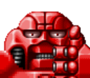 | [***zod-engine***](apps/zod-engine.md) | *Unofficial, an open source remake of the 1996 game Z by the Bitmap Brothers.*..[ *read more* ](apps/zod-engine.md)*!* | [*blob*](https://github.com/ivan-hc/AM/blob/main/programs/x86_64/zod-engine) **/** [*raw*](https://raw.githubusercontent.com/ivan-hc/AM/main/programs/x86_64/zod-engine) |
|  | [***zsnes***](apps/zsnes.md) | *Unofficial, a Super Nintendo emulator.*..[ *read more* ](apps/zsnes.md)*!* | [*blob*](https://github.com/ivan-hc/AM/blob/main/programs/x86_64/zsnes) **/** [*raw*](https://raw.githubusercontent.com/ivan-hc/AM/main/programs/x86_64/zsnes) |

---

You can improve these pages via a [pull request](https://github.com/Portable-Linux-Apps/Portable-Linux-Apps.github.io/pulls) to this site's [GitHub repository](https://github.com/Portable-Linux-Apps/Portable-Linux-Apps.github.io), or report any problems related to the installation scripts in the '[issue](https://github.com/ivan-hc/AM/issues)' section of the main database, at [https://github.com/ivan-hc/AM](https://github.com/ivan-hc/AM).

***PORTABLE-LINUX-APPS.github.io is my gift to the Linux community and was made with love for GNU/Linux and the Open Source philosophy.***

---

| [Back to Home](index.md) | [Back to Applications](apps.md)
| --- | --- |

--------

# Contacts
- **Ivan-HC** *on* [**GitHub**](https://github.com/ivan-hc)
- **AM-Ivan** *on* [**Reddit**](https://www.reddit.com/u/am-ivan)

###### *You can support me and my work on [**ko-fi.com**](https://ko-fi.com/IvanAlexHC) and [**PayPal.me**](https://paypal.me/IvanAlexHC). Thank you!*

--------

*© 2020-present Ivan Alessandro Sala aka 'Ivan-HC'* - I'm here just for fun!

