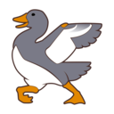
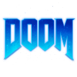
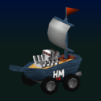
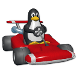
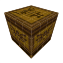
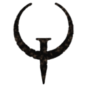

# GAME

| [Home](index.md) |
| --- |

#### Here are listed **241** programs and **40** items for this category and managed by [AM](https://github.com/ivan-hc/AM) 	and [AppMan](https://github.com/ivan-hc/AppMan) for the x86_64 architecture.

*Use your browser's built-in search tool to easily navigate to this page or use the tags below.*

| [Back to Applications](apps.md) |
| --- |

#### *Categories*

***[AppImages](appimages.md)*** 		 - ***[android](android.md)*** - ***[audio](audio.md)*** - ***[comic](comic.md)*** - ***[command-line](command-line.md)*** - ***[communication](communication.md)*** - ***[disk](disk.md)*** - ***[education](education.md)*** - ***[file-manager](file-manager.md)*** - ***[finance](finance.md)*** - ***[game](game.md)*** - ***[gnome](gnome.md)*** - ***[graphic](graphic.md)*** - ***[internet](internet.md)*** - ***[kde](kde.md)*** - ***[office](office.md)*** - ***[password](password.md)*** - ***[steam](steam.md)*** - ***[system-monitor](system-monitor.md)*** - ***[video](video.md)*** - ***[web-app](web-app.md)*** - ***[web-browser](web-browser.md)*** - ***[wine](wine.md)***

-----------------

*NOTE, the installer scripts in the "INSTALLER" column are intended for use via "AM", and are therefore dedicated to a system-wide 	installation of applications (in /opt), and all that "AppMan" does is convert those scripts for local installation, changing the paths. 	**They are listed here for reading purposes only**!*

*Should you decide to run them manually, the only way to remove the application is to run 	the command "`sudo /opt/appname/remove`", where "appname" is the name of the application directory containing the "remove" script. 	Likewise, you can also update applications by running the "AM-updater" script in the same directory.*

*The "AM" project allow the autonomy of installed apps, regardless of the presence of "AM" itself in the system. However, it is strongly 	recommended to use "AM" and "AppMan" to take full advantage of all the benefits you could get from an application installed in this way.*

*If you are here just to download apps manually, click on the program name and check the URL(s) on the application page. This site does not 	provide direct links, for security reasons, but it does provide the exact sources and references where you can find them!*

*Transparency and credibility are the focus of this catalog. Happy exploring!*

-----------------

| ICON | PACKAGE NAME | DESCRIPTION | INSTALLER |
| --- | --- | --- | --- |
|  | [***0ad***](apps/0ad.md) | *Unofficial. FOSS historical Real Time Strategy, RTS game of ancient warfare.*..[ *read more* ](apps/0ad.md)*!* | [*blob*](https://github.com/ivan-hc/AM/blob/main/programs/x86_64/0ad) **/** [*raw*](https://raw.githubusercontent.com/ivan-hc/AM/main/programs/x86_64/0ad) |
|  | [***0ad-prerelease***](apps/0ad-prerelease.md) | *Unofficial. FOSS historical Real Time Strategy, RTS game of ancient warfare (Pre-release).*..[ *read more* ](apps/0ad-prerelease.md)*!* | [*blob*](https://github.com/ivan-hc/AM/blob/main/programs/x86_64/0ad-prerelease) **/** [*raw*](https://raw.githubusercontent.com/ivan-hc/AM/main/programs/x86_64/0ad-prerelease) |
|  | [***2ship***](apps/2ship.md) | *2 Ship 2 Harkinian game.*..[ *read more* ](apps/2ship.md)*!* | [*blob*](https://github.com/ivan-hc/AM/blob/main/programs/x86_64/2ship) **/** [*raw*](https://raw.githubusercontent.com/ivan-hc/AM/main/programs/x86_64/2ship) |
|  | [***3d-puzzles***](apps/3d-puzzles.md) | *3D-Puzzles are Rubik, Dogic and Dogic12.*..[ *read more* ](apps/3d-puzzles.md)*!* | [*blob*](https://github.com/ivan-hc/AM/blob/main/programs/x86_64/3d-puzzles) **/** [*raw*](https://raw.githubusercontent.com/ivan-hc/AM/main/programs/x86_64/3d-puzzles) |
|  | [***aaaaxy***](apps/aaaaxy.md) | *A nonlinear puzzle platformer, game.*..[ *read more* ](apps/aaaaxy.md)*!* | [*blob*](https://github.com/ivan-hc/AM/blob/main/programs/x86_64/aaaaxy) **/** [*raw*](https://raw.githubusercontent.com/ivan-hc/AM/main/programs/x86_64/aaaaxy) |
|  | [***aisleriot***](apps/aisleriot.md) | *Unofficial. A card game featuring over 80 different solitaire-type card games.*..[ *read more* ](apps/aisleriot.md)*!* | [*blob*](https://github.com/ivan-hc/AM/blob/main/programs/x86_64/aisleriot) **/** [*raw*](https://raw.githubusercontent.com/ivan-hc/AM/main/programs/x86_64/aisleriot) |
|  | [***alvr***](apps/alvr.md) | *Stream VR games from your PC to your headset via Wi-Fi.*..[ *read more* ](apps/alvr.md)*!* | [*blob*](https://github.com/ivan-hc/AM/blob/main/programs/x86_64/alvr) **/** [*raw*](https://raw.githubusercontent.com/ivan-hc/AM/main/programs/x86_64/alvr) |
|  | [***antimicrox***](apps/antimicrox.md) | *Use a gamepad to control a variety of programs.*..[ *read more* ](apps/antimicrox.md)*!* | [*blob*](https://github.com/ivan-hc/AM/blob/main/programs/x86_64/antimicrox) **/** [*raw*](https://raw.githubusercontent.com/ivan-hc/AM/main/programs/x86_64/antimicrox) |
|  | [***arcade-manager***](apps/arcade-manager.md) | *Manage your rom collection, Games/Retropie & Recalbox.*..[ *read more* ](apps/arcade-manager.md)*!* | [*blob*](https://github.com/ivan-hc/AM/blob/main/programs/x86_64/arcade-manager) **/** [*raw*](https://raw.githubusercontent.com/ivan-hc/AM/main/programs/x86_64/arcade-manager) |
|  | [***archipelago***](apps/archipelago.md) | *Archipelago Multi-Game Randomizer and Server.*..[ *read more* ](apps/archipelago.md)*!* | [*blob*](https://github.com/ivan-hc/AM/blob/main/programs/x86_64/archipelago) **/** [*raw*](https://raw.githubusercontent.com/ivan-hc/AM/main/programs/x86_64/archipelago) |
|  | [***archisteamfarm***](apps/archisteamfarm.md) | *C# application with primary purpose of farming Steam cards from multiple accounts simultaneously.*..[ *read more* ](apps/archisteamfarm.md)*!* | [*blob*](https://github.com/ivan-hc/AM/blob/main/programs/x86_64/archisteamfarm) **/** [*raw*](https://raw.githubusercontent.com/ivan-hc/AM/main/programs/x86_64/archisteamfarm) |
|  | [***arena-tracker***](apps/arena-tracker.md) | *Deck Tracker for Hearthstone game with arena in focus.*..[ *read more* ](apps/arena-tracker.md)*!* | [*blob*](https://github.com/ivan-hc/AM/blob/main/programs/x86_64/arena-tracker) **/** [*raw*](https://raw.githubusercontent.com/ivan-hc/AM/main/programs/x86_64/arena-tracker) |
|  | [***arma3-unix-launcher***](apps/arma3-unix-launcher.md) | *ArmA 3 Unix Launcher, game.*..[ *read more* ](apps/arma3-unix-launcher.md)*!* | [*blob*](https://github.com/ivan-hc/AM/blob/main/programs/x86_64/arma3-unix-launcher) **/** [*raw*](https://raw.githubusercontent.com/ivan-hc/AM/main/programs/x86_64/arma3-unix-launcher) |
|  | [***armagetronad***](apps/armagetronad.md) | *Multiplayer game in 3d that emulates the movie "Tron".*..[ *read more* ](apps/armagetronad.md)*!* | [*blob*](https://github.com/ivan-hc/AM/blob/main/programs/x86_64/armagetronad) **/** [*raw*](https://raw.githubusercontent.com/ivan-hc/AM/main/programs/x86_64/armagetronad) |
|  | [***artifact***](apps/artifact.md) | *Win 40 levels of mayhem without getting destroyed, game.*..[ *read more* ](apps/artifact.md)*!* | [*blob*](https://github.com/ivan-hc/AM/blob/main/programs/x86_64/artifact) **/** [*raw*](https://raw.githubusercontent.com/ivan-hc/AM/main/programs/x86_64/artifact) |
|  | [***artix***](apps/artix.md) | *One app. All your favorite Artix games.*..[ *read more* ](apps/artix.md)*!* | [*blob*](https://github.com/ivan-hc/AM/blob/main/programs/x86_64/artix) **/** [*raw*](https://raw.githubusercontent.com/ivan-hc/AM/main/programs/x86_64/artix) |
|  | [***badlion***](apps/badlion.md) | *Most Complete All-In-One Mod Library for Minecraft with 100+ Mods.*..[ *read more* ](apps/badlion.md)*!* | [*blob*](https://github.com/ivan-hc/AM/blob/main/programs/x86_64/badlion) **/** [*raw*](https://raw.githubusercontent.com/ivan-hc/AM/main/programs/x86_64/badlion) |
|  | [***beyond-all-reason***](apps/beyond-all-reason.md) | *3D Real-Time Strategy Total Annihilation Inspired, game.*..[ *read more* ](apps/beyond-all-reason.md)*!* | [*blob*](https://github.com/ivan-hc/AM/blob/main/programs/x86_64/beyond-all-reason) **/** [*raw*](https://raw.githubusercontent.com/ivan-hc/AM/main/programs/x86_64/beyond-all-reason) |
|  | [***bezique***](apps/bezique.md) | *Plays bezique game against the AI.*..[ *read more* ](apps/bezique.md)*!* | [*blob*](https://github.com/ivan-hc/AM/blob/main/programs/x86_64/bezique) **/** [*raw*](https://raw.githubusercontent.com/ivan-hc/AM/main/programs/x86_64/bezique) |
|  | [***billard-gl***](apps/billard-gl.md) | *Unofficial. 3D billiards game, play a game of 8-ball or 9-ball.*..[ *read more* ](apps/billard-gl.md)*!* | [*blob*](https://github.com/ivan-hc/AM/blob/main/programs/x86_64/billard-gl) **/** [*raw*](https://raw.githubusercontent.com/ivan-hc/AM/main/programs/x86_64/billard-gl) |
|  | [***biplanes-revival***](apps/biplanes-revival.md) | *An old cellphone arcade recreated for PC.*..[ *read more* ](apps/biplanes-revival.md)*!* | [*blob*](https://github.com/ivan-hc/AM/blob/main/programs/x86_64/biplanes-revival) **/** [*raw*](https://raw.githubusercontent.com/ivan-hc/AM/main/programs/x86_64/biplanes-revival) |
|  | [***black-chocobo***](apps/black-chocobo.md) | *FF7 Save Game Editor.*..[ *read more* ](apps/black-chocobo.md)*!* | [*blob*](https://github.com/ivan-hc/AM/blob/main/programs/x86_64/black-chocobo) **/** [*raw*](https://raw.githubusercontent.com/ivan-hc/AM/main/programs/x86_64/black-chocobo) |
|  | [***blockbench***](apps/blockbench.md) | *Editor for boxy models and pixel art textures like Minecraft.*..[ *read more* ](apps/blockbench.md)*!* | [*blob*](https://github.com/ivan-hc/AM/blob/main/programs/x86_64/blockbench) **/** [*raw*](https://raw.githubusercontent.com/ivan-hc/AM/main/programs/x86_64/blockbench) |
|  | [***boardgamestar***](apps/boardgamestar.md) | *A platform for playing digital boardgames.*..[ *read more* ](apps/boardgamestar.md)*!* | [*blob*](https://github.com/ivan-hc/AM/blob/main/programs/x86_64/boardgamestar) **/** [*raw*](https://raw.githubusercontent.com/ivan-hc/AM/main/programs/x86_64/boardgamestar) |
|  | [***boilr***](apps/boilr.md) | *Synchronize games from other platforms into your Steam library.*..[ *read more* ](apps/boilr.md)*!* | [*blob*](https://github.com/ivan-hc/AM/blob/main/programs/x86_64/boilr) **/** [*raw*](https://raw.githubusercontent.com/ivan-hc/AM/main/programs/x86_64/boilr) |
|  | [***bomber***](apps/bomber.md) | *Unofficial. Arcade spaceship game. This script installs the full "kdegames" suite.*..[ *read more* ](apps/bomber.md)*!* | [*blob*](https://github.com/ivan-hc/AM/blob/main/programs/x86_64/bomber) **/** [*raw*](https://raw.githubusercontent.com/ivan-hc/AM/main/programs/x86_64/bomber) |
|  | [***bottles***](apps/bottles.md) | *Unofficial. Manage wine prefixes and run Windows software & games in a new way.*..[ *read more* ](apps/bottles.md)*!* | [*blob*](https://github.com/ivan-hc/AM/blob/main/programs/x86_64/bottles) **/** [*raw*](https://raw.githubusercontent.com/ivan-hc/AM/main/programs/x86_64/bottles) |
|  | [***bovo***](apps/bovo.md) | *Unofficial. Five in a row game from. This script installs the full "kdegames" suite.*..[ *read more* ](apps/bovo.md)*!* | [*blob*](https://github.com/ivan-hc/AM/blob/main/programs/x86_64/bovo) **/** [*raw*](https://raw.githubusercontent.com/ivan-hc/AM/main/programs/x86_64/bovo) |
|  | [***bugdom***](apps/bugdom.md) | *Pangea Software's Bugdom game.*..[ *read more* ](apps/bugdom.md)*!* | [*blob*](https://github.com/ivan-hc/AM/blob/main/programs/x86_64/bugdom) **/** [*raw*](https://raw.githubusercontent.com/ivan-hc/AM/main/programs/x86_64/bugdom) |
|  | [***capbattleship***](apps/capbattleship.md) | *Battleship game with a pirate theme.*..[ *read more* ](apps/capbattleship.md)*!* | [*blob*](https://github.com/ivan-hc/AM/blob/main/programs/x86_64/capbattleship) **/** [*raw*](https://raw.githubusercontent.com/ivan-hc/AM/main/programs/x86_64/capbattleship) |
|  | [***casterr***](apps/casterr.md) | *Screen recorder, easing recording and clipping in-game.*..[ *read more* ](apps/casterr.md)*!* | [*blob*](https://github.com/ivan-hc/AM/blob/main/programs/x86_64/casterr) **/** [*raw*](https://raw.githubusercontent.com/ivan-hc/AM/main/programs/x86_64/casterr) |
|  | [***cavoke***](apps/cavoke.md) | *Platform to create/host multiplayer turn-based board games.*..[ *read more* ](apps/cavoke.md)*!* | [*blob*](https://github.com/ivan-hc/AM/blob/main/programs/x86_64/cavoke) **/** [*raw*](https://raw.githubusercontent.com/ivan-hc/AM/main/programs/x86_64/cavoke) |
|  | [***celeste64***](apps/celeste64.md) | *A game made by the Celeste developers.*..[ *read more* ](apps/celeste64.md)*!* | [*blob*](https://github.com/ivan-hc/AM/blob/main/programs/x86_64/celeste64) **/** [*raw*](https://raw.githubusercontent.com/ivan-hc/AM/main/programs/x86_64/celeste64) |
|  | [***cemu***](apps/cemu.md) | *A Nintendo Wii U emulator that is able to run most Wii U games.*..[ *read more* ](apps/cemu.md)*!* | [*blob*](https://github.com/ivan-hc/AM/blob/main/programs/x86_64/cemu) **/** [*raw*](https://raw.githubusercontent.com/ivan-hc/AM/main/programs/x86_64/cemu) |
|  | [***cemu-enhanced***](apps/cemu-enhanced.md) | *Unofficial AppImage of Cemu, Nintendo Wii U emulator that is able to run most Wii U games, which is able to work on any linux distro.*..[ *read more* ](apps/cemu-enhanced.md)*!* | [*blob*](https://github.com/ivan-hc/AM/blob/main/programs/x86_64/cemu-enhanced) **/** [*raw*](https://raw.githubusercontent.com/ivan-hc/AM/main/programs/x86_64/cemu-enhanced) |
|  | [***cheatbreaker***](apps/cheatbreaker.md) | *The free FPS boosting modpack for Minecraft 1.7 & 1.8.*..[ *read more* ](apps/cheatbreaker.md)*!* | [*blob*](https://github.com/ivan-hc/AM/blob/main/programs/x86_64/cheatbreaker) **/** [*raw*](https://raw.githubusercontent.com/ivan-hc/AM/main/programs/x86_64/cheatbreaker) |
|  | [***chromium-bsu***](apps/chromium-bsu.md) | *Unofficial. Fast paced arcade style scrolling space shooter, game.*..[ *read more* ](apps/chromium-bsu.md)*!* | [*blob*](https://github.com/ivan-hc/AM/blob/main/programs/x86_64/chromium-bsu) **/** [*raw*](https://raw.githubusercontent.com/ivan-hc/AM/main/programs/x86_64/chromium-bsu) |
|  | [***cncra2yr***](apps/cncra2yr.md) | *C&C Red Alert 2, a real-time strategy game by Westwood Pacific.*..[ *read more* ](apps/cncra2yr.md)*!* | [*blob*](https://github.com/ivan-hc/AM/blob/main/programs/x86_64/cncra2yr) **/** [*raw*](https://raw.githubusercontent.com/ivan-hc/AM/main/programs/x86_64/cncra2yr) |
|  | [***coal-launcher***](apps/coal-launcher.md) | *A client to view and play games from the AB Coal website.*..[ *read more* ](apps/coal-launcher.md)*!* | [*blob*](https://github.com/ivan-hc/AM/blob/main/programs/x86_64/coal-launcher) **/** [*raw*](https://raw.githubusercontent.com/ivan-hc/AM/main/programs/x86_64/coal-launcher) |
|  | [***colobot***](apps/colobot.md) | *Colonize with bots, game.*..[ *read more* ](apps/colobot.md)*!* | [*blob*](https://github.com/ivan-hc/AM/blob/main/programs/x86_64/colobot) **/** [*raw*](https://raw.githubusercontent.com/ivan-hc/AM/main/programs/x86_64/colobot) |
|  | [***conty-wine***](apps/conty-wine.md) | *Easy to use unprivileged and portable Arch Linux container.*..[ *read more* ](apps/conty-wine.md)*!* | [*blob*](https://github.com/ivan-hc/AM/blob/main/programs/x86_64/conty-wine) **/** [*raw*](https://raw.githubusercontent.com/ivan-hc/AM/main/programs/x86_64/conty-wine) |
|  | [***crg-data-tool***](apps/crg-data-tool.md) | *A tool for working with Games Data files from CRG.*..[ *read more* ](apps/crg-data-tool.md)*!* | [*blob*](https://github.com/ivan-hc/AM/blob/main/programs/x86_64/crg-data-tool) **/** [*raw*](https://raw.githubusercontent.com/ivan-hc/AM/main/programs/x86_64/crg-data-tool) |
|  | [***cromagrally***](apps/cromagrally.md) | *The wildest racing game since man invented the wheel!*..[ *read more* ](apps/cromagrally.md)*!* | [*blob*](https://github.com/ivan-hc/AM/blob/main/programs/x86_64/cromagrally) **/** [*raw*](https://raw.githubusercontent.com/ivan-hc/AM/main/programs/x86_64/cromagrally) |
|  | [***cutechess***](apps/cutechess.md) | *Cute Chess is a GUI, a CLI and a library for playing chess.*..[ *read more* ](apps/cutechess.md)*!* | [*blob*](https://github.com/ivan-hc/AM/blob/main/programs/x86_64/cutechess) **/** [*raw*](https://raw.githubusercontent.com/ivan-hc/AM/main/programs/x86_64/cutechess) |
|  | [***deadgame-2048***](apps/deadgame-2048.md) | *GUI tool available for ALL platforms.*..[ *read more* ](apps/deadgame-2048.md)*!* | [*blob*](https://github.com/ivan-hc/AM/blob/main/programs/x86_64/deadgame-2048) **/** [*raw*](https://raw.githubusercontent.com/ivan-hc/AM/main/programs/x86_64/deadgame-2048) |
|  | [***dealers-choice***](apps/dealers-choice.md) | *Multiplayer Stud and Draw Poker game.*..[ *read more* ](apps/dealers-choice.md)*!* | [*blob*](https://github.com/ivan-hc/AM/blob/main/programs/x86_64/dealers-choice) **/** [*raw*](https://raw.githubusercontent.com/ivan-hc/AM/main/programs/x86_64/dealers-choice) |
|  | [***deerportal***](apps/deerportal.md) | *Full of the diamonds board game.*..[ *read more* ](apps/deerportal.md)*!* | [*blob*](https://github.com/ivan-hc/AM/blob/main/programs/x86_64/deerportal) **/** [*raw*](https://raw.githubusercontent.com/ivan-hc/AM/main/programs/x86_64/deerportal) |
|  | [***discord***](apps/discord.md) | *Unofficial. All-in-one voice and text chat for gamers.*..[ *read more* ](apps/discord.md)*!* | [*blob*](https://github.com/ivan-hc/AM/blob/main/programs/x86_64/discord) **/** [*raw*](https://raw.githubusercontent.com/ivan-hc/AM/main/programs/x86_64/discord) |
|  | [***dolphin-emu***](apps/dolphin-emu.md) | *Unofficial, GameCube/Nintento Wii emulator with improvements.*..[ *read more* ](apps/dolphin-emu.md)*!* | [*blob*](https://github.com/ivan-hc/AM/blob/main/programs/x86_64/dolphin-emu) **/** [*raw*](https://raw.githubusercontent.com/ivan-hc/AM/main/programs/x86_64/dolphin-emu) |
|  | [***droidcam***](apps/droidcam.md) | *A DroidCam AppImage for the Steam Deck/SteamOS 3.0.*..[ *read more* ](apps/droidcam.md)*!* | [*blob*](https://github.com/ivan-hc/AM/blob/main/programs/x86_64/droidcam) **/** [*raw*](https://raw.githubusercontent.com/ivan-hc/AM/main/programs/x86_64/droidcam) |
|  | [***dsda-doom***](apps/dsda-doom.md) | *This is a successor of prboom+ with extra tooling for demo recording and playback, with a focus on speedrunning and quality of life.*..[ *read more* ](apps/dsda-doom.md)*!* | [*blob*](https://github.com/ivan-hc/AM/blob/main/programs/x86_64/dsda-doom) **/** [*raw*](https://raw.githubusercontent.com/ivan-hc/AM/main/programs/x86_64/dsda-doom) |
|  | [***duckstation***](apps/duckstation.md) | *PlayStation 1, aka PSX games Emulator.*..[ *read more* ](apps/duckstation.md)*!* | [*blob*](https://github.com/ivan-hc/AM/blob/main/programs/x86_64/duckstation) **/** [*raw*](https://raw.githubusercontent.com/ivan-hc/AM/main/programs/x86_64/duckstation) |
|  | [***duelyst***](apps/duelyst.md) | *A digital collectible card game and turn-based strategy hybrid.*..[ *read more* ](apps/duelyst.md)*!* | [*blob*](https://github.com/ivan-hc/AM/blob/main/programs/x86_64/duelyst) **/** [*raw*](https://raw.githubusercontent.com/ivan-hc/AM/main/programs/x86_64/duelyst) |
|  | [***dust3d***](apps/dust3d.md) | *3D modeling software for games, 3D printing, and so on.*..[ *read more* ](apps/dust3d.md)*!* | [*blob*](https://github.com/ivan-hc/AM/blob/main/programs/x86_64/dust3d) **/** [*raw*](https://raw.githubusercontent.com/ivan-hc/AM/main/programs/x86_64/dust3d) |
|  | [***eden***](apps/eden.md) | *An experimental open-source emulator for Nintendo Switch (yuzu fork).*..[ *read more* ](apps/eden.md)*!* | [*blob*](https://github.com/ivan-hc/AM/blob/main/programs/x86_64/eden) **/** [*raw*](https://raw.githubusercontent.com/ivan-hc/AM/main/programs/x86_64/eden) |
|  | [***eden-nightly***](apps/eden-nightly.md) | *Unofficial, an experimental open-source emulator for Nintendo Switch (yuzu fork, nightly builds).*..[ *read more* ](apps/eden-nightly.md)*!* | [*blob*](https://github.com/ivan-hc/AM/blob/main/programs/x86_64/eden-nightly) **/** [*raw*](https://raw.githubusercontent.com/ivan-hc/AM/main/programs/x86_64/eden-nightly) |
|  | [***eksplode.re***](apps/eksplode.re.md) | *Bomberman game made with Godot under BSD3.*..[ *read more* ](apps/eksplode.re.md)*!* | [*blob*](https://github.com/ivan-hc/AM/blob/main/programs/x86_64/eksplode.re) **/** [*raw*](https://raw.githubusercontent.com/ivan-hc/AM/main/programs/x86_64/eksplode.re) |
|  | [***en-croissant***](apps/en-croissant.md) | *The Ultimate Chess Toolkit.*..[ *read more* ](apps/en-croissant.md)*!* | [*blob*](https://github.com/ivan-hc/AM/blob/main/programs/x86_64/en-croissant) **/** [*raw*](https://raw.githubusercontent.com/ivan-hc/AM/main/programs/x86_64/en-croissant) |
|  | [***endless-sky***](apps/endless-sky.md) | *Space exploration and combat game.*..[ *read more* ](apps/endless-sky.md)*!* | [*blob*](https://github.com/ivan-hc/AM/blob/main/programs/x86_64/endless-sky) **/** [*raw*](https://raw.githubusercontent.com/ivan-hc/AM/main/programs/x86_64/endless-sky) |
|  | [***eternal-lands***](apps/eternal-lands.md) | *3D fantasy multiplayer online role playing game.*..[ *read more* ](apps/eternal-lands.md)*!* | [*blob*](https://github.com/ivan-hc/AM/blob/main/programs/x86_64/eternal-lands) **/** [*raw*](https://raw.githubusercontent.com/ivan-hc/AM/main/programs/x86_64/eternal-lands) |
|  | [***eternalmodmanager***](apps/eternalmodmanager.md) | *A cross platform mod manager for DOOM Eternal.*..[ *read more* ](apps/eternalmodmanager.md)*!* | [*blob*](https://github.com/ivan-hc/AM/blob/main/programs/x86_64/eternalmodmanager) **/** [*raw*](https://raw.githubusercontent.com/ivan-hc/AM/main/programs/x86_64/eternalmodmanager) |
|  | [***exsplode.re***](apps/exsplode.re.md) | *A Bomberman game made with Godot under BSD3.*..[ *read more* ](apps/exsplode.re.md)*!* | [*blob*](https://github.com/ivan-hc/AM/blob/main/programs/x86_64/exsplode.re) **/** [*raw*](https://raw.githubusercontent.com/ivan-hc/AM/main/programs/x86_64/exsplode.re) |
|  | [***extremetuxracer***](apps/extremetuxracer.md) | *Unofficial. 3D racing game with Tux, the Linux penguin.*..[ *read more* ](apps/extremetuxracer.md)*!* | [*blob*](https://github.com/ivan-hc/AM/blob/main/programs/x86_64/extremetuxracer) **/** [*raw*](https://raw.githubusercontent.com/ivan-hc/AM/main/programs/x86_64/extremetuxracer) |
|  | [***fafarunner***](apps/fafarunner.md) | *A game developed using flutter and flame.*..[ *read more* ](apps/fafarunner.md)*!* | [*blob*](https://github.com/ivan-hc/AM/blob/main/programs/x86_64/fafarunner) **/** [*raw*](https://raw.githubusercontent.com/ivan-hc/AM/main/programs/x86_64/fafarunner) |
|  | [***farmhand***](apps/farmhand.md) | *A resource management game that puts a farm in your hand.*..[ *read more* ](apps/farmhand.md)*!* | [*blob*](https://github.com/ivan-hc/AM/blob/main/programs/x86_64/farmhand) **/** [*raw*](https://raw.githubusercontent.com/ivan-hc/AM/main/programs/x86_64/farmhand) |
|  | [***flare***](apps/flare.md) | *Fantasy action RPG game using the FLARE engine.*..[ *read more* ](apps/flare.md)*!* | [*blob*](https://github.com/ivan-hc/AM/blob/main/programs/x86_64/flare) **/** [*raw*](https://raw.githubusercontent.com/ivan-hc/AM/main/programs/x86_64/flare) |
|  | [***flashpoint***](apps/flashpoint.md) | *Flashpoint Archive is a community effort to preserve games and animations from the web.*..[ *read more* ](apps/flashpoint.md)*!* | [*blob*](https://github.com/ivan-hc/AM/blob/main/programs/x86_64/flashpoint) **/** [*raw*](https://raw.githubusercontent.com/ivan-hc/AM/main/programs/x86_64/flashpoint) |
|  | [***flycast-dojo***](apps/flycast-dojo.md) | *Flycast fork, multiplatform Sega Dreamcast, Naomi and Atomiswave emulator for netplay, training & online tournament gameplay.*..[ *read more* ](apps/flycast-dojo.md)*!* | [*blob*](https://github.com/ivan-hc/AM/blob/main/programs/x86_64/flycast-dojo) **/** [*raw*](https://raw.githubusercontent.com/ivan-hc/AM/main/programs/x86_64/flycast-dojo) |
|  | [***foobar2000***](apps/foobar2000.md) | *Unofficial, an advanced freeware audio player for Windows, includes WINE.*..[ *read more* ](apps/foobar2000.md)*!* | [*blob*](https://github.com/ivan-hc/AM/blob/main/programs/x86_64/foobar2000) **/** [*raw*](https://raw.githubusercontent.com/ivan-hc/AM/main/programs/x86_64/foobar2000) |
|  | [***freetexturepacker***](apps/freetexturepacker.md) | *Creates sprite sheets for you game or site, graphics.*..[ *read more* ](apps/freetexturepacker.md)*!* | [*blob*](https://github.com/ivan-hc/AM/blob/main/programs/x86_64/freetexturepacker) **/** [*raw*](https://raw.githubusercontent.com/ivan-hc/AM/main/programs/x86_64/freetexturepacker) |
|  | [***funkin***](apps/funkin.md) | *A rhythm game made with HaxeFlixel*..[ *read more* ](apps/funkin.md)*!* | [*blob*](https://github.com/ivan-hc/AM/blob/main/programs/x86_64/funkin) **/** [*raw*](https://raw.githubusercontent.com/ivan-hc/AM/main/programs/x86_64/funkin) |
|  | [***funkin-legacy***](apps/funkin-legacy.md) | *Legacy GLibC Linux support for Friday Night Funkin. A rhythm game made with HaxeFlixel.*..[ *read more* ](apps/funkin-legacy.md)*!* | [*blob*](https://github.com/ivan-hc/AM/blob/main/programs/x86_64/funkin-legacy) **/** [*raw*](https://raw.githubusercontent.com/ivan-hc/AM/main/programs/x86_64/funkin-legacy) |
|  | [***gameconqueror***](apps/gameconqueror.md) | *Unofficial. Memory scanner designed to isolate the adress of an arbitrary variable in an executing process (gtk GUI).*..[ *read more* ](apps/gameconqueror.md)*!* | [*blob*](https://github.com/ivan-hc/AM/blob/main/programs/x86_64/gameconqueror) **/** [*raw*](https://raw.githubusercontent.com/ivan-hc/AM/main/programs/x86_64/gameconqueror) |
|  | [***gamehub***](apps/gamehub.md) | *Unified library for all your games from different platforms.*..[ *read more* ](apps/gamehub.md)*!* | [*blob*](https://github.com/ivan-hc/AM/blob/main/programs/x86_64/gamehub) **/** [*raw*](https://raw.githubusercontent.com/ivan-hc/AM/main/programs/x86_64/gamehub) |
|  | [***gameimage***](apps/gameimage.md) | *Pack a runner/emulator/game and it's configs in a single AppImage.*..[ *read more* ](apps/gameimage.md)*!* | [*blob*](https://github.com/ivan-hc/AM/blob/main/programs/x86_64/gameimage) **/** [*raw*](https://raw.githubusercontent.com/ivan-hc/AM/main/programs/x86_64/gameimage) |
|  | [***gdevelop***](apps/gdevelop.md) | *Cross-platform game engine designed to be used by everyone.*..[ *read more* ](apps/gdevelop.md)*!* | [*blob*](https://github.com/ivan-hc/AM/blob/main/programs/x86_64/gdevelop) **/** [*raw*](https://raw.githubusercontent.com/ivan-hc/AM/main/programs/x86_64/gdevelop) |
|  | [***gdlauncher***](apps/gdlauncher.md) | *Simple, yet powerful Minecraft custom launcher.*..[ *read more* ](apps/gdlauncher.md)*!* | [*blob*](https://github.com/ivan-hc/AM/blob/main/programs/x86_64/gdlauncher) **/** [*raw*](https://raw.githubusercontent.com/ivan-hc/AM/main/programs/x86_64/gdlauncher) |
|  | [***geforcenow-electron***](apps/geforcenow-electron.md) | *Desktop client for Nvidia GeForce NOW game streaming.*..[ *read more* ](apps/geforcenow-electron.md)*!* | [*blob*](https://github.com/ivan-hc/AM/blob/main/programs/x86_64/geforcenow-electron) **/** [*raw*](https://raw.githubusercontent.com/ivan-hc/AM/main/programs/x86_64/geforcenow-electron) |
|  | [***gm-companion***](apps/gm-companion.md) | *A tool for rpg gamemasters.*..[ *read more* ](apps/gm-companion.md)*!* | [*blob*](https://github.com/ivan-hc/AM/blob/main/programs/x86_64/gm-companion) **/** [*raw*](https://raw.githubusercontent.com/ivan-hc/AM/main/programs/x86_64/gm-companion) |
|  | [***godot***](apps/godot.md) | *Multi-platform 2D and 3D game engine with a feature-rich editor.*..[ *read more* ](apps/godot.md)*!* | [*blob*](https://github.com/ivan-hc/AM/blob/main/programs/x86_64/godot) **/** [*raw*](https://raw.githubusercontent.com/ivan-hc/AM/main/programs/x86_64/godot) |
|  | [***granatier***](apps/granatier.md) | *Bomberman clone. This script installs the full "kdegames" suite.*..[ *read more* ](apps/granatier.md)*!* | [*blob*](https://github.com/ivan-hc/AM/blob/main/programs/x86_64/granatier) **/** [*raw*](https://raw.githubusercontent.com/ivan-hc/AM/main/programs/x86_64/granatier) |
|  | [***greenlight***](apps/greenlight.md) | *Client for xCloud and Xbox home streaming made in Typescript.*..[ *read more* ](apps/greenlight.md)*!* | [*blob*](https://github.com/ivan-hc/AM/blob/main/programs/x86_64/greenlight) **/** [*raw*](https://raw.githubusercontent.com/ivan-hc/AM/main/programs/x86_64/greenlight) |
|  | [***hades-emu***](apps/hades-emu.md) | *A Nintendo Game Boy Advance Emulator.*..[ *read more* ](apps/hades-emu.md)*!* | [*blob*](https://github.com/ivan-hc/AM/blob/main/programs/x86_64/hades-emu) **/** [*raw*](https://raw.githubusercontent.com/ivan-hc/AM/main/programs/x86_64/hades-emu) |
|  | [***hastyheroes***](apps/hastyheroes.md) | *An endless 2D jumping game.*..[ *read more* ](apps/hastyheroes.md)*!* | [*blob*](https://github.com/ivan-hc/AM/blob/main/programs/x86_64/hastyheroes) **/** [*raw*](https://raw.githubusercontent.com/ivan-hc/AM/main/programs/x86_64/hastyheroes) |
|  | [***helioslauncher***](apps/helioslauncher.md) | *Custom launcher for modded minecraft written in Electron.*..[ *read more* ](apps/helioslauncher.md)*!* | [*blob*](https://github.com/ivan-hc/AM/blob/main/programs/x86_64/helioslauncher) **/** [*raw*](https://raw.githubusercontent.com/ivan-hc/AM/main/programs/x86_64/helioslauncher) |
|  | [***heroic-games-launcher***](apps/heroic-games-launcher.md) | *A Native GOG and Epic Games Launcher for Linux.*..[ *read more* ](apps/heroic-games-launcher.md)*!* | [*blob*](https://github.com/ivan-hc/AM/blob/main/programs/x86_64/heroic-games-launcher) **/** [*raw*](https://raw.githubusercontent.com/ivan-hc/AM/main/programs/x86_64/heroic-games-launcher) |
|  | [***hmcl***](apps/hmcl.md) | *A Minecraft Launcher which is multi-functional, cross-platform and popular.*..[ *read more* ](apps/hmcl.md)*!* | [*blob*](https://github.com/ivan-hc/AM/blob/main/programs/x86_64/hmcl) **/** [*raw*](https://raw.githubusercontent.com/ivan-hc/AM/main/programs/x86_64/hmcl) |
|  | [***hugor***](apps/hugor.md) | *A cross-platform, multimedia interpreter for Hugo adventure games.*..[ *read more* ](apps/hugor.md)*!* | [*blob*](https://github.com/ivan-hc/AM/blob/main/programs/x86_64/hugor) **/** [*raw*](https://raw.githubusercontent.com/ivan-hc/AM/main/programs/x86_64/hugor) |
|  | [***hydra***](apps/hydra.md) | *Game launcher with its own embedded bittorrent client.*..[ *read more* ](apps/hydra.md)*!* | [*blob*](https://github.com/ivan-hc/AM/blob/main/programs/x86_64/hydra) **/** [*raw*](https://raw.githubusercontent.com/ivan-hc/AM/main/programs/x86_64/hydra) |
|  | [***icestudio***](apps/icestudio.md) | *A real gamechanger in the world of Open Source FPGAs.*..[ *read more* ](apps/icestudio.md)*!* | [*blob*](https://github.com/ivan-hc/AM/blob/main/programs/x86_64/icestudio) **/** [*raw*](https://raw.githubusercontent.com/ivan-hc/AM/main/programs/x86_64/icestudio) |
|  | [***instead***](apps/instead.md) | *Simple Text Adventures Interpreter.*..[ *read more* ](apps/instead.md)*!* | [*blob*](https://github.com/ivan-hc/AM/blob/main/programs/x86_64/instead) **/** [*raw*](https://raw.githubusercontent.com/ivan-hc/AM/main/programs/x86_64/instead) |
|  | [***international-doom***](apps/international-doom.md) | *Small, functional and simple source ports, created with help, efforts and bits of code from people around the world.*..[ *read more* ](apps/international-doom.md)*!* | [*blob*](https://github.com/ivan-hc/AM/blob/main/programs/x86_64/international-doom) **/** [*raw*](https://raw.githubusercontent.com/ivan-hc/AM/main/programs/x86_64/international-doom) |
|  | [***ipuissance-4d***](apps/ipuissance-4d.md) | *Connect Four video game with a 3-Dimentional rendering.*..[ *read more* ](apps/ipuissance-4d.md)*!* | [*blob*](https://github.com/ivan-hc/AM/blob/main/programs/x86_64/ipuissance-4d) **/** [*raw*](https://raw.githubusercontent.com/ivan-hc/AM/main/programs/x86_64/ipuissance-4d) |
|  | [***jdminecraftlauncher***](apps/jdminecraftlauncher.md) | *Unofficial classic styled Minecraft Launcher.*..[ *read more* ](apps/jdminecraftlauncher.md)*!* | [*blob*](https://github.com/ivan-hc/AM/blob/main/programs/x86_64/jdminecraftlauncher) **/** [*raw*](https://raw.githubusercontent.com/ivan-hc/AM/main/programs/x86_64/jdminecraftlauncher) |
|  | [***jdnbtexplorer***](apps/jdnbtexplorer.md) | *A Editor for Minecraft NBT files.*..[ *read more* ](apps/jdnbtexplorer.md)*!* | [*blob*](https://github.com/ivan-hc/AM/blob/main/programs/x86_64/jdnbtexplorer) **/** [*raw*](https://raw.githubusercontent.com/ivan-hc/AM/main/programs/x86_64/jdnbtexplorer) |
|  | [***jgenesis***](apps/jgenesis.md) | *Sega Genesis, Sega CD, SNES, Master System, Game Gear emulator (GUI).*..[ *read more* ](apps/jgenesis.md)*!* | [*blob*](https://github.com/ivan-hc/AM/blob/main/programs/x86_64/jgenesis) **/** [*raw*](https://raw.githubusercontent.com/ivan-hc/AM/main/programs/x86_64/jgenesis) |
|  | [***jgenesis-cli***](apps/jgenesis-cli.md) | *Sega Genesis, Sega CD, SNES, Master System, Game Gear emulator (CLI).*..[ *read more* ](apps/jgenesis-cli.md)*!* | [*blob*](https://github.com/ivan-hc/AM/blob/main/programs/x86_64/jgenesis-cli) **/** [*raw*](https://raw.githubusercontent.com/ivan-hc/AM/main/programs/x86_64/jgenesis-cli) |
|  | [***jklubtv***](apps/jklubtv.md) | *Chess Round Robin Tournament Manager.*..[ *read more* ](apps/jklubtv.md)*!* | [*blob*](https://github.com/ivan-hc/AM/blob/main/programs/x86_64/jklubtv) **/** [*raw*](https://raw.githubusercontent.com/ivan-hc/AM/main/programs/x86_64/jklubtv) |
|  | [***joy2droidx***](apps/joy2droidx.md) | *Turn Android phones into virtual Xbox 360 controller.*..[ *read more* ](apps/joy2droidx.md)*!* | [*blob*](https://github.com/ivan-hc/AM/blob/main/programs/x86_64/joy2droidx) **/** [*raw*](https://raw.githubusercontent.com/ivan-hc/AM/main/programs/x86_64/joy2droidx) |
|  | [***julius***](apps/julius.md) | *An open source re-implementation of the Caesar III game.*..[ *read more* ](apps/julius.md)*!* | [*blob*](https://github.com/ivan-hc/AM/blob/main/programs/x86_64/julius) **/** [*raw*](https://raw.githubusercontent.com/ivan-hc/AM/main/programs/x86_64/julius) |
|  | [***kajongg***](apps/kajongg.md) | *Unofficial, An ancient Chinese board game for 4 players. This script installs the full "kdegames" suite.*..[ *read more* ](apps/kajongg.md)*!* | [*blob*](https://github.com/ivan-hc/AM/blob/main/programs/x86_64/kajongg) **/** [*raw*](https://raw.githubusercontent.com/ivan-hc/AM/main/programs/x86_64/kajongg) |
|  | [***kapman***](apps/kapman.md) | *Pac-Man clone. This script installs the full "kdegames" suite.*..[ *read more* ](apps/kapman.md)*!* | [*blob*](https://github.com/ivan-hc/AM/blob/main/programs/x86_64/kapman) **/** [*raw*](https://raw.githubusercontent.com/ivan-hc/AM/main/programs/x86_64/kapman) |
|  | [***katomic***](apps/katomic.md) | *Edu. game based around molecular geometry. This script installs the full "kdegames" suite.*..[ *read more* ](apps/katomic.md)*!* | [*blob*](https://github.com/ivan-hc/AM/blob/main/programs/x86_64/katomic) **/** [*raw*](https://raw.githubusercontent.com/ivan-hc/AM/main/programs/x86_64/katomic) |
|  | [***kblackbox***](apps/kblackbox.md) | *Unofficial, A game of hide and seek. This script installs the full "kdegames" suite.*..[ *read more* ](apps/kblackbox.md)*!* | [*blob*](https://github.com/ivan-hc/AM/blob/main/programs/x86_64/kblackbox) **/** [*raw*](https://raw.githubusercontent.com/ivan-hc/AM/main/programs/x86_64/kblackbox) |
|  | [***kblocks***](apps/kblocks.md) | *Unofficial, Classic Tetris / falling blocks game. This script installs the full "kdegames" suite.*..[ *read more* ](apps/kblocks.md)*!* | [*blob*](https://github.com/ivan-hc/AM/blob/main/programs/x86_64/kblocks) **/** [*raw*](https://raw.githubusercontent.com/ivan-hc/AM/main/programs/x86_64/kblocks) |
|  | [***kboard***](apps/kboard.md) | *Terminal game to practice keyboard typing.*..[ *read more* ](apps/kboard.md)*!* | [*blob*](https://github.com/ivan-hc/AM/blob/main/programs/x86_64/kboard) **/** [*raw*](https://raw.githubusercontent.com/ivan-hc/AM/main/programs/x86_64/kboard) |
|  | [***kbounce***](apps/kbounce.md) | *Unofficial, Fill the field game. This script installs the full "kdegames" suite.*..[ *read more* ](apps/kbounce.md)*!* | [*blob*](https://github.com/ivan-hc/AM/blob/main/programs/x86_64/kbounce) **/** [*raw*](https://raw.githubusercontent.com/ivan-hc/AM/main/programs/x86_64/kbounce) |
|  | [***kbreakout***](apps/kbreakout.md) | *Unofficial, Destroy bricks without losing the ball. This script installs the full "kdegames" suite.*..[ *read more* ](apps/kbreakout.md)*!* | [*blob*](https://github.com/ivan-hc/AM/blob/main/programs/x86_64/kbreakout) **/** [*raw*](https://raw.githubusercontent.com/ivan-hc/AM/main/programs/x86_64/kbreakout) |
|  | [***kdegames***](apps/kdegames.md) | *Unofficial, Full & updatable KDE Games suite, metapackage.*..[ *read more* ](apps/kdegames.md)*!* | [*blob*](https://github.com/ivan-hc/AM/blob/main/programs/x86_64/kdegames) **/** [*raw*](https://raw.githubusercontent.com/ivan-hc/AM/main/programs/x86_64/kdegames) |
|  | [***kdiamond***](apps/kdiamond.md) | *Unofficial, Diamond game. This script installs the full "kdegames" suite.*..[ *read more* ](apps/kdiamond.md)*!* | [*blob*](https://github.com/ivan-hc/AM/blob/main/programs/x86_64/kdiamond) **/** [*raw*](https://raw.githubusercontent.com/ivan-hc/AM/main/programs/x86_64/kdiamond) |
|  | [***kfourinline***](apps/kfourinline.md) | *Unofficial, 4 in row game. This script installs the full "kdegames" suite.*..[ *read more* ](apps/kfourinline.md)*!* | [*blob*](https://github.com/ivan-hc/AM/blob/main/programs/x86_64/kfourinline) **/** [*raw*](https://raw.githubusercontent.com/ivan-hc/AM/main/programs/x86_64/kfourinline) |
|  | [***kgoldrunner***](apps/kgoldrunner.md) | *Unofficial, A game with a runner and gold. This script installs the full "kdegames" suite.*..[ *read more* ](apps/kgoldrunner.md)*!* | [*blob*](https://github.com/ivan-hc/AM/blob/main/programs/x86_64/kgoldrunner) **/** [*raw*](https://raw.githubusercontent.com/ivan-hc/AM/main/programs/x86_64/kgoldrunner) |
|  | [***kigo***](apps/kigo.md) | *Unofficial, Go strategic board game for two players. This script installs the full "kdegames" suite.*..[ *read more* ](apps/kigo.md)*!* | [*blob*](https://github.com/ivan-hc/AM/blob/main/programs/x86_64/kigo) **/** [*raw*](https://raw.githubusercontent.com/ivan-hc/AM/main/programs/x86_64/kigo) |
|  | [***killbots***](apps/killbots.md) | *Unofficial, Port of the classic console game Robots. This script installs the full "kdegames" suite.*..[ *read more* ](apps/killbots.md)*!* | [*blob*](https://github.com/ivan-hc/AM/blob/main/programs/x86_64/killbots) **/** [*raw*](https://raw.githubusercontent.com/ivan-hc/AM/main/programs/x86_64/killbots) |
|  | [***kiriki***](apps/kiriki.md) | *A dice game. This script installs the full "kdegames" suite.*..[ *read more* ](apps/kiriki.md)*!* | [*blob*](https://github.com/ivan-hc/AM/blob/main/programs/x86_64/kiriki) **/** [*raw*](https://raw.githubusercontent.com/ivan-hc/AM/main/programs/x86_64/kiriki) |
|  | [***kjumpingcube***](apps/kjumpingcube.md) | *A game of dices on a board. This script installs the full "kdegames" suite.*..[ *read more* ](apps/kjumpingcube.md)*!* | [*blob*](https://github.com/ivan-hc/AM/blob/main/programs/x86_64/kjumpingcube) **/** [*raw*](https://raw.githubusercontent.com/ivan-hc/AM/main/programs/x86_64/kjumpingcube) |
|  | [***klickety***](apps/klickety.md) | *Color matching like SameGame. This script installs the full "kdegames" suite.*..[ *read more* ](apps/klickety.md)*!* | [*blob*](https://github.com/ivan-hc/AM/blob/main/programs/x86_64/klickety) **/** [*raw*](https://raw.githubusercontent.com/ivan-hc/AM/main/programs/x86_64/klickety) |
|  | [***klines***](apps/klines.md) | *Inspired by well known game of Color Lines. This script installs the full "kdegames" suite.*..[ *read more* ](apps/klines.md)*!* | [*blob*](https://github.com/ivan-hc/AM/blob/main/programs/x86_64/klines) **/** [*raw*](https://raw.githubusercontent.com/ivan-hc/AM/main/programs/x86_64/klines) |
|  | [***kmahjongg***](apps/kmahjongg.md) | *Unofficial, Mahjongg game. This script installs the full "kdegames" suite.*..[ *read more* ](apps/kmahjongg.md)*!* | [*blob*](https://github.com/ivan-hc/AM/blob/main/programs/x86_64/kmahjongg) **/** [*raw*](https://raw.githubusercontent.com/ivan-hc/AM/main/programs/x86_64/kmahjongg) |
|  | [***kmines***](apps/kmines.md) | *Unofficial, Classic mine game. This script installs the full "kdegames" suite.*..[ *read more* ](apps/kmines.md)*!* | [*blob*](https://github.com/ivan-hc/AM/blob/main/programs/x86_64/kmines) **/** [*raw*](https://raw.githubusercontent.com/ivan-hc/AM/main/programs/x86_64/kmines) |
|  | [***knavalbattle***](apps/knavalbattle.md) | *Unofficial, Battle Ship game. This script installs the full "kdegames" suite.*..[ *read more* ](apps/knavalbattle.md)*!* | [*blob*](https://github.com/ivan-hc/AM/blob/main/programs/x86_64/knavalbattle) **/** [*raw*](https://raw.githubusercontent.com/ivan-hc/AM/main/programs/x86_64/knavalbattle) |
|  | [***knetwalk***](apps/knetwalk.md) | *Unofficial, Net constructing game. This script installs the full "kdegames" suite.*..[ *read more* ](apps/knetwalk.md)*!* | [*blob*](https://github.com/ivan-hc/AM/blob/main/programs/x86_64/knetwalk) **/** [*raw*](https://raw.githubusercontent.com/ivan-hc/AM/main/programs/x86_64/knetwalk) |
|  | [***knights***](apps/knights.md) | *Unofficial, Chess interface for the KDE Platform. This script installs the full "kdegames" suite.*..[ *read more* ](apps/knights.md)*!* | [*blob*](https://github.com/ivan-hc/AM/blob/main/programs/x86_64/knights) **/** [*raw*](https://raw.githubusercontent.com/ivan-hc/AM/main/programs/x86_64/knights) |
|  | [***kolf***](apps/kolf.md) | *Unofficial, Mini Golf game. This script installs the full "kdegames" suite.*..[ *read more* ](apps/kolf.md)*!* | [*blob*](https://github.com/ivan-hc/AM/blob/main/programs/x86_64/kolf) **/** [*raw*](https://raw.githubusercontent.com/ivan-hc/AM/main/programs/x86_64/kolf) |
|  | [***kollision***](apps/kollision.md) | *Unofficial, Dodge red balls in the field. This script installs the full "kdegames" suite.*..[ *read more* ](apps/kollision.md)*!* | [*blob*](https://github.com/ivan-hc/AM/blob/main/programs/x86_64/kollision) **/** [*raw*](https://raw.githubusercontent.com/ivan-hc/AM/main/programs/x86_64/kollision) |
|  | [***konquest***](apps/konquest.md) | *Game of planets. This script installs the full "kdegames" suite.*..[ *read more* ](apps/konquest.md)*!* | [*blob*](https://github.com/ivan-hc/AM/blob/main/programs/x86_64/konquest) **/** [*raw*](https://raw.githubusercontent.com/ivan-hc/AM/main/programs/x86_64/konquest) |
|  | [***kpat***](apps/kpat.md) | *Unofficial, Klondike, Spider, Free Cell and other Solitaire. This script installs the full "kdegames" suite.*..[ *read more* ](apps/kpat.md)*!* | [*blob*](https://github.com/ivan-hc/AM/blob/main/programs/x86_64/kpat) **/** [*raw*](https://raw.githubusercontent.com/ivan-hc/AM/main/programs/x86_64/kpat) |
|  | [***kreversi***](apps/kreversi.md) | *Reversi game. This script installs the full "kdegames" suite.*..[ *read more* ](apps/kreversi.md)*!* | [*blob*](https://github.com/ivan-hc/AM/blob/main/programs/x86_64/kreversi) **/** [*raw*](https://raw.githubusercontent.com/ivan-hc/AM/main/programs/x86_64/kreversi) |
|  | [***krunker***](apps/krunker.md) | *Krunker (.io) is a fast-paced first-person shooter game with pixel graphics.*..[ *read more* ](apps/krunker.md)*!* | [*blob*](https://github.com/ivan-hc/AM/blob/main/programs/x86_64/krunker) **/** [*raw*](https://raw.githubusercontent.com/ivan-hc/AM/main/programs/x86_64/krunker) |
|  | [***kshisen***](apps/kshisen.md) | *A game similar to Mahjongg. This script installs the full "kdegames" suite.*..[ *read more* ](apps/kshisen.md)*!* | [*blob*](https://github.com/ivan-hc/AM/blob/main/programs/x86_64/kshisen) **/** [*raw*](https://raw.githubusercontent.com/ivan-hc/AM/main/programs/x86_64/kshisen) |
|  | [***ksirk***](apps/ksirk.md) | *A strategy board game. This script installs the full "kdegames" suite.*..[ *read more* ](apps/ksirk.md)*!* | [*blob*](https://github.com/ivan-hc/AM/blob/main/programs/x86_64/ksirk) **/** [*raw*](https://raw.githubusercontent.com/ivan-hc/AM/main/programs/x86_64/ksirk) |
|  | [***ksnakeduel***](apps/ksnakeduel.md) | *A snake race game. This script installs the full "kdegames" suite.*..[ *read more* ](apps/ksnakeduel.md)*!* | [*blob*](https://github.com/ivan-hc/AM/blob/main/programs/x86_64/ksnakeduel) **/** [*raw*](https://raw.githubusercontent.com/ivan-hc/AM/main/programs/x86_64/ksnakeduel) |
|  | [***kspaceduel***](apps/kspaceduel.md) | *Unofficial, Battleship with satellites in the space. This script installs the full "kdegames" suite.*..[ *read more* ](apps/kspaceduel.md)*!* | [*blob*](https://github.com/ivan-hc/AM/blob/main/programs/x86_64/kspaceduel) **/** [*raw*](https://raw.githubusercontent.com/ivan-hc/AM/main/programs/x86_64/kspaceduel) |
|  | [***ksquares***](apps/ksquares.md) | *Unofficial, Win with most number of completed squares. This script installs the full "kdegames" suite.*..[ *read more* ](apps/ksquares.md)*!* | [*blob*](https://github.com/ivan-hc/AM/blob/main/programs/x86_64/ksquares) **/** [*raw*](https://raw.githubusercontent.com/ivan-hc/AM/main/programs/x86_64/ksquares) |
|  | [***ksudoku***](apps/ksudoku.md) | *Unofficial, Sudoku game. This script installs the full "kdegames" suite.*..[ *read more* ](apps/ksudoku.md)*!* | [*blob*](https://github.com/ivan-hc/AM/blob/main/programs/x86_64/ksudoku) **/** [*raw*](https://raw.githubusercontent.com/ivan-hc/AM/main/programs/x86_64/ksudoku) |
|  | [***ktuberling***](apps/ktuberling.md) | *Unofficial, Simple Mr. Potato game for children. This script installs the full "kdegames" suite.*..[ *read more* ](apps/ktuberling.md)*!* | [*blob*](https://github.com/ivan-hc/AM/blob/main/programs/x86_64/ktuberling) **/** [*raw*](https://raw.githubusercontent.com/ivan-hc/AM/main/programs/x86_64/ktuberling) |
|  | [***kubrick***](apps/kubrick.md) | *Unofficial, A logic game based on Rubik's Cube. This script installs the full "kdegames" suite.*..[ *read more* ](apps/kubrick.md)*!* | [*blob*](https://github.com/ivan-hc/AM/blob/main/programs/x86_64/kubrick) **/** [*raw*](https://raw.githubusercontent.com/ivan-hc/AM/main/programs/x86_64/kubrick) |
|  | [***lambda-lantern***](apps/lambda-lantern.md) | *A 3D game about functional programming patterns.*..[ *read more* ](apps/lambda-lantern.md)*!* | [*blob*](https://github.com/ivan-hc/AM/blob/main/programs/x86_64/lambda-lantern) **/** [*raw*](https://raw.githubusercontent.com/ivan-hc/AM/main/programs/x86_64/lambda-lantern) |
|  | [***legendary-kingdoms***](apps/legendary-kingdoms.md) | *Implementation of Legendary Kingdoms Gamebooks in C++.*..[ *read more* ](apps/legendary-kingdoms.md)*!* | [*blob*](https://github.com/ivan-hc/AM/blob/main/programs/x86_64/legendary-kingdoms) **/** [*raw*](https://raw.githubusercontent.com/ivan-hc/AM/main/programs/x86_64/legendary-kingdoms) |
|  | [***liground***](apps/liground.md) | *A mordern Chess Variant Analysis GUI, game.*..[ *read more* ](apps/liground.md)*!* | [*blob*](https://github.com/ivan-hc/AM/blob/main/programs/x86_64/liground) **/** [*raw*](https://raw.githubusercontent.com/ivan-hc/AM/main/programs/x86_64/liground) |
|  | [***linedancer***](apps/linedancer.md) | *Arcade game and entry for Ludum Dare 35.*..[ *read more* ](apps/linedancer.md)*!* | [*blob*](https://github.com/ivan-hc/AM/blob/main/programs/x86_64/linedancer) **/** [*raw*](https://raw.githubusercontent.com/ivan-hc/AM/main/programs/x86_64/linedancer) |
|  | [***love***](apps/love.md) | *The unquestionably awesome 2D game engine.*..[ *read more* ](apps/love.md)*!* | [*blob*](https://github.com/ivan-hc/AM/blob/main/programs/x86_64/love) **/** [*raw*](https://raw.githubusercontent.com/ivan-hc/AM/main/programs/x86_64/love) |
|  | [***lskat***](apps/lskat.md) | *Unofficial, Fun and engaging card game for two players. This script installs the full "kdegames" suite.*..[ *read more* ](apps/lskat.md)*!* | [*blob*](https://github.com/ivan-hc/AM/blob/main/programs/x86_64/lskat) **/** [*raw*](https://raw.githubusercontent.com/ivan-hc/AM/main/programs/x86_64/lskat) |
|  | [***lunar-client***](apps/lunar-client.md) | *Free Minecraft Client, a modpack for all versions of Minecraft.*..[ *read more* ](apps/lunar-client.md)*!* | [*blob*](https://github.com/ivan-hc/AM/blob/main/programs/x86_64/lunar-client) **/** [*raw*](https://raw.githubusercontent.com/ivan-hc/AM/main/programs/x86_64/lunar-client) |
|  | [***lutris***](apps/lutris.md) | *Unofficial. Install and play video games from all eras and from most gaming systems, by leveraging and combining existing emulators, WINE included.*..[ *read more* ](apps/lutris.md)*!* | [*blob*](https://github.com/ivan-hc/AM/blob/main/programs/x86_64/lutris) **/** [*raw*](https://raw.githubusercontent.com/ivan-hc/AM/main/programs/x86_64/lutris) |
|  | [***lutris-gamepad-ui***](apps/lutris-gamepad-ui.md) | *A simple, TV-friendly, gamepad-navigable frontend for the Lutris game launcher on Linux.*..[ *read more* ](apps/lutris-gamepad-ui.md)*!* | [*blob*](https://github.com/ivan-hc/AM/blob/main/programs/x86_64/lutris-gamepad-ui) **/** [*raw*](https://raw.githubusercontent.com/ivan-hc/AM/main/programs/x86_64/lutris-gamepad-ui) |
|  | [***m***](apps/m.md) | *Data oriented programming language for game developers.*..[ *read more* ](apps/m.md)*!* | [*blob*](https://github.com/ivan-hc/AM/blob/main/programs/x86_64/m) **/** [*raw*](https://raw.githubusercontent.com/ivan-hc/AM/main/programs/x86_64/m) |
|  | [***mangbandclient***](apps/mangbandclient.md) | *A free online multi-player realtime roguelike game.*..[ *read more* ](apps/mangbandclient.md)*!* | [*blob*](https://github.com/ivan-hc/AM/blob/main/programs/x86_64/mangbandclient) **/** [*raw*](https://raw.githubusercontent.com/ivan-hc/AM/main/programs/x86_64/mangbandclient) |
|  | [***mcpelauncher***](apps/mcpelauncher.md) | *The main repo for the Linux Bedrock edition Minecraft launcher.*..[ *read more* ](apps/mcpelauncher.md)*!* | [*blob*](https://github.com/ivan-hc/AM/blob/main/programs/x86_64/mcpelauncher) **/** [*raw*](https://raw.githubusercontent.com/ivan-hc/AM/main/programs/x86_64/mcpelauncher) |
|  | [***megaglest***](apps/megaglest.md) | *MegaGlest real-time strategy game engine (cross-platform, 3-d).*..[ *read more* ](apps/megaglest.md)*!* | [*blob*](https://github.com/ivan-hc/AM/blob/main/programs/x86_64/megaglest) **/** [*raw*](https://raw.githubusercontent.com/ivan-hc/AM/main/programs/x86_64/megaglest) |
|  | [***mgba***](apps/mgba.md) | *Game Boy Advance Emulator.*..[ *read more* ](apps/mgba.md)*!* | [*blob*](https://github.com/ivan-hc/AM/blob/main/programs/x86_64/mgba) **/** [*raw*](https://raw.githubusercontent.com/ivan-hc/AM/main/programs/x86_64/mgba) |
|  | [***mine-craft.io***](apps/mine-craft.io.md) | *Minecraft and even more!*..[ *read more* ](apps/mine-craft.io.md)*!* | [*blob*](https://github.com/ivan-hc/AM/blob/main/programs/x86_64/mine-craft.io) **/** [*raw*](https://raw.githubusercontent.com/ivan-hc/AM/main/programs/x86_64/mine-craft.io) |
|  | [***minecraft-launcher***](apps/minecraft-launcher.md) | *Game downloader and launcher for Minecraft.*..[ *read more* ](apps/minecraft-launcher.md)*!* | [*blob*](https://github.com/ivan-hc/AM/blob/main/programs/x86_64/minecraft-launcher) **/** [*raw*](https://raw.githubusercontent.com/ivan-hc/AM/main/programs/x86_64/minecraft-launcher) |
|  | [***minififa***](apps/minififa.md) | *OpenGL-powered third-person football, soccer game.*..[ *read more* ](apps/minififa.md)*!* | [*blob*](https://github.com/ivan-hc/AM/blob/main/programs/x86_64/minififa) **/** [*raw*](https://raw.githubusercontent.com/ivan-hc/AM/main/programs/x86_64/minififa) |
|  | [***mki3dgame***](apps/mki3dgame.md) | *A game of searching, in 3D stages.*..[ *read more* ](apps/mki3dgame.md)*!* | [*blob*](https://github.com/ivan-hc/AM/blob/main/programs/x86_64/mki3dgame) **/** [*raw*](https://raw.githubusercontent.com/ivan-hc/AM/main/programs/x86_64/mki3dgame) |
|  | [***mmapper***](apps/mmapper.md) | *Graphical MUD client for the game MUME.*..[ *read more* ](apps/mmapper.md)*!* | [*blob*](https://github.com/ivan-hc/AM/blob/main/programs/x86_64/mmapper) **/** [*raw*](https://raw.githubusercontent.com/ivan-hc/AM/main/programs/x86_64/mmapper) |
|  | [***moonlight***](apps/moonlight.md) | *Stream games from your NVIDIA GameStream-enabled PC.*..[ *read more* ](apps/moonlight.md)*!* | [*blob*](https://github.com/ivan-hc/AM/blob/main/programs/x86_64/moonlight) **/** [*raw*](https://raw.githubusercontent.com/ivan-hc/AM/main/programs/x86_64/moonlight) |
|  | [***mudlet***](apps/mudlet.md) | *Mudlet is a platform for gaming and enhancing game-play primarily with MUDs.*..[ *read more* ](apps/mudlet.md)*!* | [*blob*](https://github.com/ivan-hc/AM/blob/main/programs/x86_64/mudlet) **/** [*raw*](https://raw.githubusercontent.com/ivan-hc/AM/main/programs/x86_64/mudlet) |
|  | [***multimc***](apps/multimc.md) | *A Minecraft launcher.*..[ *read more* ](apps/multimc.md)*!* | [*blob*](https://github.com/ivan-hc/AM/blob/main/programs/x86_64/multimc) **/** [*raw*](https://raw.githubusercontent.com/ivan-hc/AM/main/programs/x86_64/multimc) |
|  | [***music-quiz***](apps/music-quiz.md) | *Jepardy like game, guess as many songs as possible.*..[ *read more* ](apps/music-quiz.md)*!* | [*blob*](https://github.com/ivan-hc/AM/blob/main/programs/x86_64/music-quiz) **/** [*raw*](https://raw.githubusercontent.com/ivan-hc/AM/main/programs/x86_64/music-quiz) |
|  | [***naev***](apps/naev.md) | *A 2d action/rpg space game that combines elements from the action.*..[ *read more* ](apps/naev.md)*!* | [*blob*](https://github.com/ivan-hc/AM/blob/main/programs/x86_64/naev) **/** [*raw*](https://raw.githubusercontent.com/ivan-hc/AM/main/programs/x86_64/naev) |
|  | [***nanosaur***](apps/nanosaur.md) | *Pangea Softwares game, adventure of a cybernetic dinosaur.*..[ *read more* ](apps/nanosaur.md)*!* | [*blob*](https://github.com/ivan-hc/AM/blob/main/programs/x86_64/nanosaur) **/** [*raw*](https://raw.githubusercontent.com/ivan-hc/AM/main/programs/x86_64/nanosaur) |
|  | [***naruto-arena***](apps/naruto-arena.md) | *Naruto-based online multiplayer strategy game.*..[ *read more* ](apps/naruto-arena.md)*!* | [*blob*](https://github.com/ivan-hc/AM/blob/main/programs/x86_64/naruto-arena) **/** [*raw*](https://raw.githubusercontent.com/ivan-hc/AM/main/programs/x86_64/naruto-arena) |
|  | [***netpanzer***](apps/netpanzer.md) | *Online multiplayer tactical warfare game for fast action combat.*..[ *read more* ](apps/netpanzer.md)*!* | [*blob*](https://github.com/ivan-hc/AM/blob/main/programs/x86_64/netpanzer) **/** [*raw*](https://raw.githubusercontent.com/ivan-hc/AM/main/programs/x86_64/netpanzer) |
|  | [***newton-adventure***](apps/newton-adventure.md) | *A 2D game with a twist, player can rotate gravity at 360.*..[ *read more* ](apps/newton-adventure.md)*!* | [*blob*](https://github.com/ivan-hc/AM/blob/main/programs/x86_64/newton-adventure) **/** [*raw*](https://raw.githubusercontent.com/ivan-hc/AM/main/programs/x86_64/newton-adventure) |
|  | [***nexus-mods***](apps/nexus-mods.md) | *A mod installer, creator and manager for all your popular games.*..[ *read more* ](apps/nexus-mods.md)*!* | [*blob*](https://github.com/ivan-hc/AM/blob/main/programs/x86_64/nexus-mods) **/** [*raw*](https://raw.githubusercontent.com/ivan-hc/AM/main/programs/x86_64/nexus-mods) |
|  | [***notepad++***](apps/notepad++.md) | *Unofficial Appimage of Notepad++, with WINE prefix.*..[ *read more* ](apps/notepad++.md)*!* | [*blob*](https://github.com/ivan-hc/AM/blob/main/programs/x86_64/notepad++) **/** [*raw*](https://raw.githubusercontent.com/ivan-hc/AM/main/programs/x86_64/notepad++) |
|  | [***nychess***](apps/nychess.md) | *A python Chess Engine and AI.*..[ *read more* ](apps/nychess.md)*!* | [*blob*](https://github.com/ivan-hc/AM/blob/main/programs/x86_64/nychess) **/** [*raw*](https://raw.githubusercontent.com/ivan-hc/AM/main/programs/x86_64/nychess) |
|  | [***nyrna***](apps/nyrna.md) | *Suspend games and applications.*..[ *read more* ](apps/nyrna.md)*!* | [*blob*](https://github.com/ivan-hc/AM/blob/main/programs/x86_64/nyrna) **/** [*raw*](https://raw.githubusercontent.com/ivan-hc/AM/main/programs/x86_64/nyrna) |
|  | [***obliqoro***](apps/obliqoro.md) | * A cross-platform tauri gui where Oblique Strategies meets Pomodoro.*..[ *read more* ](apps/obliqoro.md)*!* | [*blob*](https://github.com/ivan-hc/AM/blob/main/programs/x86_64/obliqoro) **/** [*raw*](https://raw.githubusercontent.com/ivan-hc/AM/main/programs/x86_64/obliqoro) |
|  | [***openarena***](apps/openarena.md) | *Violent & sexy, multiplayer first person shooter game, ioquake3.*..[ *read more* ](apps/openarena.md)*!* | [*blob*](https://github.com/ivan-hc/AM/blob/main/programs/x86_64/openarena) **/** [*raw*](https://raw.githubusercontent.com/ivan-hc/AM/main/programs/x86_64/openarena) |
|  | [***openblok***](apps/openblok.md) | *A customizable falling block puzzle game like tetris.*..[ *read more* ](apps/openblok.md)*!* | [*blob*](https://github.com/ivan-hc/AM/blob/main/programs/x86_64/openblok) **/** [*raw*](https://raw.githubusercontent.com/ivan-hc/AM/main/programs/x86_64/openblok) |
|  | [***openhv***](apps/openhv.md) | *A mod for OpenRA based on the Hard Vacuum, game.*..[ *read more* ](apps/openhv.md)*!* | [*blob*](https://github.com/ivan-hc/AM/blob/main/programs/x86_64/openhv) **/** [*raw*](https://raw.githubusercontent.com/ivan-hc/AM/main/programs/x86_64/openhv) |
|  | [***openmw***](apps/openmw.md) | *OpenMW is an open-source open-world RPG game engine that supports playing Morrowind.*..[ *read more* ](apps/openmw.md)*!* | [*blob*](https://github.com/ivan-hc/AM/blob/main/programs/x86_64/openmw) **/** [*raw*](https://raw.githubusercontent.com/ivan-hc/AM/main/programs/x86_64/openmw) |
|  | [***openop2***](apps/openop2.md) | *Re-implementation of the game Outpost 2, using the OpenRA engine.*..[ *read more* ](apps/openop2.md)*!* | [*blob*](https://github.com/ivan-hc/AM/blob/main/programs/x86_64/openop2) **/** [*raw*](https://raw.githubusercontent.com/ivan-hc/AM/main/programs/x86_64/openop2) |
|  | [***openra-dune***](apps/openra-dune.md) | *Real-time strategy game engine, MOD Dune 2000.*..[ *read more* ](apps/openra-dune.md)*!* | [*blob*](https://github.com/ivan-hc/AM/blob/main/programs/x86_64/openra-dune) **/** [*raw*](https://raw.githubusercontent.com/ivan-hc/AM/main/programs/x86_64/openra-dune) |
|  | [***openra-red-alert***](apps/openra-red-alert.md) | *Real-time strategy game engine, MOD Red Alert.*..[ *read more* ](apps/openra-red-alert.md)*!* | [*blob*](https://github.com/ivan-hc/AM/blob/main/programs/x86_64/openra-red-alert) **/** [*raw*](https://raw.githubusercontent.com/ivan-hc/AM/main/programs/x86_64/openra-red-alert) |
|  | [***openra-tiberian-dawn***](apps/openra-tiberian-dawn.md) | *Real-time strategy game engine penGL, MOD TD.*..[ *read more* ](apps/openra-tiberian-dawn.md)*!* | [*blob*](https://github.com/ivan-hc/AM/blob/main/programs/x86_64/openra-tiberian-dawn) **/** [*raw*](https://raw.githubusercontent.com/ivan-hc/AM/main/programs/x86_64/openra-tiberian-dawn) |
|  | [***openramodsdk***](apps/openramodsdk.md) | *Dev Kit for building your own games using the OpenRA engine.*..[ *read more* ](apps/openramodsdk.md)*!* | [*blob*](https://github.com/ivan-hc/AM/blob/main/programs/x86_64/openramodsdk) **/** [*raw*](https://raw.githubusercontent.com/ivan-hc/AM/main/programs/x86_64/openramodsdk) |
|  | [***openrct2***](apps/openrct2.md) | *Re-implementation of RollerCoaster Tycoon 2 (RCT2), expanding the game with new features.*..[ *read more* ](apps/openrct2.md)*!* | [*blob*](https://github.com/ivan-hc/AM/blob/main/programs/x86_64/openrct2) **/** [*raw*](https://raw.githubusercontent.com/ivan-hc/AM/main/programs/x86_64/openrct2) |
|  | [***osu***](apps/osu.md) | *A free-to-win rhythm game. Rhythm is just a click away!*..[ *read more* ](apps/osu.md)*!* | [*blob*](https://github.com/ivan-hc/AM/blob/main/programs/x86_64/osu) **/** [*raw*](https://raw.githubusercontent.com/ivan-hc/AM/main/programs/x86_64/osu) |
|  | [***ottomatic***](apps/ottomatic.md) | *Pangea Softwares Otto Matic, a game of robots.*..[ *read more* ](apps/ottomatic.md)*!* | [*blob*](https://github.com/ivan-hc/AM/blob/main/programs/x86_64/ottomatic) **/** [*raw*](https://raw.githubusercontent.com/ivan-hc/AM/main/programs/x86_64/ottomatic) |
|  | [***overbind***](apps/overbind.md) | *A utility that allows binding keyboard buttons to virtual Xbox360 controller joystick outputs.*..[ *read more* ](apps/overbind.md)*!* | [*blob*](https://github.com/ivan-hc/AM/blob/main/programs/x86_64/overbind) **/** [*raw*](https://raw.githubusercontent.com/ivan-hc/AM/main/programs/x86_64/overbind) |
|  | [***packsquash***](apps/packsquash.md) | *A Minecraft Java Edition resource and data pack optimizer.*..[ *read more* ](apps/packsquash.md)*!* | [*blob*](https://github.com/ivan-hc/AM/blob/main/programs/x86_64/packsquash) **/** [*raw*](https://raw.githubusercontent.com/ivan-hc/AM/main/programs/x86_64/packsquash) |
|  | [***palapeli***](apps/palapeli.md) | *Jigsaw puzzle game. This script installs the full "kdegames" suite.*..[ *read more* ](apps/palapeli.md)*!* | [*blob*](https://github.com/ivan-hc/AM/blob/main/programs/x86_64/palapeli) **/** [*raw*](https://raw.githubusercontent.com/ivan-hc/AM/main/programs/x86_64/palapeli) |
|  | [***parsec-linux***](apps/parsec-linux.md) | *Parsec game streaming client.*..[ *read more* ](apps/parsec-linux.md)*!* | [*blob*](https://github.com/ivan-hc/AM/blob/main/programs/x86_64/parsec-linux) **/** [*raw*](https://raw.githubusercontent.com/ivan-hc/AM/main/programs/x86_64/parsec-linux) |
|  | [***pcsx-redux***](apps/pcsx-redux.md) | *The PCSX-Redux project is a collection of tools, research, hardware design, and libraries aiming at development and reverse engineering on the PlayStation 1. The core product itself, PCSX-Redux, is yet another fork of the Playstation emulator, PCSX.*..[ *read more* ](apps/pcsx-redux.md)*!* | [*blob*](https://github.com/ivan-hc/AM/blob/main/programs/x86_64/pcsx-redux) **/** [*raw*](https://raw.githubusercontent.com/ivan-hc/AM/main/programs/x86_64/pcsx-redux) |
|  | [***pcsx2***](apps/pcsx2.md) | *The Playstation 2 Emulator.*..[ *read more* ](apps/pcsx2.md)*!* | [*blob*](https://github.com/ivan-hc/AM/blob/main/programs/x86_64/pcsx2) **/** [*raw*](https://raw.githubusercontent.com/ivan-hc/AM/main/programs/x86_64/pcsx2) |
|  | [***pelusica***](apps/pelusica.md) | *Action game, control the blue dot with your keyboard/create music.*..[ *read more* ](apps/pelusica.md)*!* | [*blob*](https://github.com/ivan-hc/AM/blob/main/programs/x86_64/pelusica) **/** [*raw*](https://raw.githubusercontent.com/ivan-hc/AM/main/programs/x86_64/pelusica) |
|  | [***picmi***](apps/picmi.md) | *Single player logic-based puzzle game. This script installs the full "kdegames" suite.*..[ *read more* ](apps/picmi.md)*!* | [*blob*](https://github.com/ivan-hc/AM/blob/main/programs/x86_64/picmi) **/** [*raw*](https://raw.githubusercontent.com/ivan-hc/AM/main/programs/x86_64/picmi) |
|  | [***pigs-n-cows***](apps/pigs-n-cows.md) | *A relaxing game for children and adults alike.*..[ *read more* ](apps/pigs-n-cows.md)*!* | [*blob*](https://github.com/ivan-hc/AM/blob/main/programs/x86_64/pigs-n-cows) **/** [*raw*](https://raw.githubusercontent.com/ivan-hc/AM/main/programs/x86_64/pigs-n-cows) |
|  | [***pince***](apps/pince.md) | *Reverse engineering tool for linux games.*..[ *read more* ](apps/pince.md)*!* | [*blob*](https://github.com/ivan-hc/AM/blob/main/programs/x86_64/pince) **/** [*raw*](https://raw.githubusercontent.com/ivan-hc/AM/main/programs/x86_64/pince) |
|  | [***planes***](apps/planes.md) | *Variant of battleships game.*..[ *read more* ](apps/planes.md)*!* | [*blob*](https://github.com/ivan-hc/AM/blob/main/programs/x86_64/planes) **/** [*raw*](https://raw.githubusercontent.com/ivan-hc/AM/main/programs/x86_64/planes) |
|  | [***planet-blupi***](apps/planet-blupi.md) | *A delirious spell-binding game.*..[ *read more* ](apps/planet-blupi.md)*!* | [*blob*](https://github.com/ivan-hc/AM/blob/main/programs/x86_64/planet-blupi) **/** [*raw*](https://raw.githubusercontent.com/ivan-hc/AM/main/programs/x86_64/planet-blupi) |
|  | [***play-2048***](apps/play-2048.md) | *Another implementation of the 2048 game.*..[ *read more* ](apps/play-2048.md)*!* | [*blob*](https://github.com/ivan-hc/AM/blob/main/programs/x86_64/play-2048) **/** [*raw*](https://raw.githubusercontent.com/ivan-hc/AM/main/programs/x86_64/play-2048) |
|  | [***playback***](apps/playback.md) | *Play and manage your cartridges and replay your childhood games.*..[ *read more* ](apps/playback.md)*!* | [*blob*](https://github.com/ivan-hc/AM/blob/main/programs/x86_64/playback) **/** [*raw*](https://raw.githubusercontent.com/ivan-hc/AM/main/programs/x86_64/playback) |
|  | [***playit***](apps/playit.md) | *Want to run an online game server? playit.gg is a global proxy that allows anyone to host a server without port forwarding.*..[ *read more* ](apps/playit.md)*!* | [*blob*](https://github.com/ivan-hc/AM/blob/main/programs/x86_64/playit) **/** [*raw*](https://raw.githubusercontent.com/ivan-hc/AM/main/programs/x86_64/playit) |
|  | [***pokete***](apps/pokete.md) | *A terminal based Pokemon like game.*..[ *read more* ](apps/pokete.md)*!* | [*blob*](https://github.com/ivan-hc/AM/blob/main/programs/x86_64/pokete) **/** [*raw*](https://raw.githubusercontent.com/ivan-hc/AM/main/programs/x86_64/pokete) |
|  | [***prime-world-editor***](apps/prime-world-editor.md) | *Edit world assets from games by Retro Studios.*..[ *read more* ](apps/prime-world-editor.md)*!* | [*blob*](https://github.com/ivan-hc/AM/blob/main/programs/x86_64/prime-world-editor) **/** [*raw*](https://raw.githubusercontent.com/ivan-hc/AM/main/programs/x86_64/prime-world-editor) |
|  | [***principia***](apps/principia.md) | *Open source physics-based sandbox game.*..[ *read more* ](apps/principia.md)*!* | [*blob*](https://github.com/ivan-hc/AM/blob/main/programs/x86_64/principia) **/** [*raw*](https://raw.githubusercontent.com/ivan-hc/AM/main/programs/x86_64/principia) |
|  | [***prismlauncher***](apps/prismlauncher.md) | *Launcher for Minecraft, manage multiple installations.*..[ *read more* ](apps/prismlauncher.md)*!* | [*blob*](https://github.com/ivan-hc/AM/blob/main/programs/x86_64/prismlauncher) **/** [*raw*](https://raw.githubusercontent.com/ivan-hc/AM/main/programs/x86_64/prismlauncher) |
|  | [***prismlauncher-qt5***](apps/prismlauncher-qt5.md) | *Launcher for Minecraft, manage multiple installations (Qt5 version).*..[ *read more* ](apps/prismlauncher-qt5.md)*!* | [*blob*](https://github.com/ivan-hc/AM/blob/main/programs/x86_64/prismlauncher-qt5) **/** [*raw*](https://raw.githubusercontent.com/ivan-hc/AM/main/programs/x86_64/prismlauncher-qt5) |
|  | [***protonup-qt***](apps/protonup-qt.md) | *Manage Proton-GE/Luxtorpeda for Steam/Wine-GE for Lutris.*..[ *read more* ](apps/protonup-qt.md)*!* | [*blob*](https://github.com/ivan-hc/AM/blob/main/programs/x86_64/protonup-qt) **/** [*raw*](https://raw.githubusercontent.com/ivan-hc/AM/main/programs/x86_64/protonup-qt) |
|  | [***psydoom***](apps/psydoom.md) | *A backport of PSX Doom to PC.*..[ *read more* ](apps/psydoom.md)*!* | [*blob*](https://github.com/ivan-hc/AM/blob/main/programs/x86_64/psydoom) **/** [*raw*](https://raw.githubusercontent.com/ivan-hc/AM/main/programs/x86_64/psydoom) |
|  | [***qtads***](apps/qtads.md) | *A cross-platform, multimedia interpreter for TADS adventure games.*..[ *read more* ](apps/qtads.md)*!* | [*blob*](https://github.com/ivan-hc/AM/blob/main/programs/x86_64/qtads) **/** [*raw*](https://raw.githubusercontent.com/ivan-hc/AM/main/programs/x86_64/qtads) |
|  | [***r2modman***](apps/r2modman.md) | *Mod manager for several Unity games using Thunderstore.*..[ *read more* ](apps/r2modman.md)*!* | [*blob*](https://github.com/ivan-hc/AM/blob/main/programs/x86_64/r2modman) **/** [*raw*](https://raw.githubusercontent.com/ivan-hc/AM/main/programs/x86_64/r2modman) |
|  | [***rare***](apps/rare.md) | *GUI for legendary. An Epic Games Launcher open source alternative.*..[ *read more* ](apps/rare.md)*!* | [*blob*](https://github.com/ivan-hc/AM/blob/main/programs/x86_64/rare) **/** [*raw*](https://raw.githubusercontent.com/ivan-hc/AM/main/programs/x86_64/rare) |
|  | [***rbdoom-3***](apps/rbdoom-3.md) | *Doom 3 BFG Edition source port with updated DX12/Vulkan renderer.*..[ *read more* ](apps/rbdoom-3.md)*!* | [*blob*](https://github.com/ivan-hc/AM/blob/main/programs/x86_64/rbdoom-3) **/** [*raw*](https://raw.githubusercontent.com/ivan-hc/AM/main/programs/x86_64/rbdoom-3) |
|  | [***redeclipse***](apps/redeclipse.md) | *A great first person 3D arena shooter with online support, game.*..[ *read more* ](apps/redeclipse.md)*!* | [*blob*](https://github.com/ivan-hc/AM/blob/main/programs/x86_64/redeclipse) **/** [*raw*](https://raw.githubusercontent.com/ivan-hc/AM/main/programs/x86_64/redeclipse) |
|  | [***retroarch***](apps/retroarch.md) | *Frontend for emulators, game engines and media players.*..[ *read more* ](apps/retroarch.md)*!* | [*blob*](https://github.com/ivan-hc/AM/blob/main/programs/x86_64/retroarch) **/** [*raw*](https://raw.githubusercontent.com/ivan-hc/AM/main/programs/x86_64/retroarch) |
|  | [***retrom***](apps/retrom.md) | *A centralized game library/collection management service with a focus on emulation.*..[ *read more* ](apps/retrom.md)*!* | [*blob*](https://github.com/ivan-hc/AM/blob/main/programs/x86_64/retrom) **/** [*raw*](https://raw.githubusercontent.com/ivan-hc/AM/main/programs/x86_64/retrom) |
|  | [***rpcs3***](apps/rpcs3.md) | *An open-source PlayStation 3 emulator/debugger written in C++.*..[ *read more* ](apps/rpcs3.md)*!* | [*blob*](https://github.com/ivan-hc/AM/blob/main/programs/x86_64/rpcs3) **/** [*raw*](https://raw.githubusercontent.com/ivan-hc/AM/main/programs/x86_64/rpcs3) |
|  | [***ryujinx***](apps/ryujinx.md) | *An open-source Nintendo Switch emulator, originally created by gdkchan, written in C#.*..[ *read more* ](apps/ryujinx.md)*!* | [*blob*](https://github.com/ivan-hc/AM/blob/main/programs/x86_64/ryujinx) **/** [*raw*](https://raw.githubusercontent.com/ivan-hc/AM/main/programs/x86_64/ryujinx) |
|  | [***sabaki***](apps/sabaki.md) | *Modern, elegant, cross-platform Go/Baduk/Weiqi game board.*..[ *read more* ](apps/sabaki.md)*!* | [*blob*](https://github.com/ivan-hc/AM/blob/main/programs/x86_64/sabaki) **/** [*raw*](https://raw.githubusercontent.com/ivan-hc/AM/main/programs/x86_64/sabaki) |
|  | [***samira***](apps/samira.md) | *Steam achievement manager for Linux written with Tauri and Rust.*..[ *read more* ](apps/samira.md)*!* | [*blob*](https://github.com/ivan-hc/AM/blob/main/programs/x86_64/samira) **/** [*raw*](https://raw.githubusercontent.com/ivan-hc/AM/main/programs/x86_64/samira) |
|  | [***samrewritten***](apps/samrewritten.md) | *Steam Achievement Manager For Linux. Rewritten in C++.*..[ *read more* ](apps/samrewritten.md)*!* | [*blob*](https://github.com/ivan-hc/AM/blob/main/programs/x86_64/samrewritten) **/** [*raw*](https://raw.githubusercontent.com/ivan-hc/AM/main/programs/x86_64/samrewritten) |
|  | [***sblauncher***](apps/sblauncher.md) | *Minecraft Launcher.*..[ *read more* ](apps/sblauncher.md)*!* | [*blob*](https://github.com/ivan-hc/AM/blob/main/programs/x86_64/sblauncher) **/** [*raw*](https://raw.githubusercontent.com/ivan-hc/AM/main/programs/x86_64/sblauncher) |
|  | [***sc-controller***](apps/sc-controller.md) | *User-mode driver and GTK3 based GUI for Steam Controller.*..[ *read more* ](apps/sc-controller.md)*!* | [*blob*](https://github.com/ivan-hc/AM/blob/main/programs/x86_64/sc-controller) **/** [*raw*](https://raw.githubusercontent.com/ivan-hc/AM/main/programs/x86_64/sc-controller) |
|  | [***scavengers***](apps/scavengers.md) | *Unity Roguelike tutorial, game.*..[ *read more* ](apps/scavengers.md)*!* | [*blob*](https://github.com/ivan-hc/AM/blob/main/programs/x86_64/scavengers) **/** [*raw*](https://raw.githubusercontent.com/ivan-hc/AM/main/programs/x86_64/scavengers) |
|  | [***serioussamtfe***](apps/serioussamtfe.md) | *Game engine for Serious Sam Classic, TFE.*..[ *read more* ](apps/serioussamtfe.md)*!* | [*blob*](https://github.com/ivan-hc/AM/blob/main/programs/x86_64/serioussamtfe) **/** [*raw*](https://raw.githubusercontent.com/ivan-hc/AM/main/programs/x86_64/serioussamtfe) |
|  | [***serioussamtfe-vk***](apps/serioussamtfe-vk.md) | *Game engine for Serious Sam Classic, Vulkan support, TFE.*..[ *read more* ](apps/serioussamtfe-vk.md)*!* | [*blob*](https://github.com/ivan-hc/AM/blob/main/programs/x86_64/serioussamtfe-vk) **/** [*raw*](https://raw.githubusercontent.com/ivan-hc/AM/main/programs/x86_64/serioussamtfe-vk) |
|  | [***serioussamtse***](apps/serioussamtse.md) | *Game engine for Serious Sam Classic, TSE.*..[ *read more* ](apps/serioussamtse.md)*!* | [*blob*](https://github.com/ivan-hc/AM/blob/main/programs/x86_64/serioussamtse) **/** [*raw*](https://raw.githubusercontent.com/ivan-hc/AM/main/programs/x86_64/serioussamtse) |
|  | [***serioussamtse-vk***](apps/serioussamtse-vk.md) | *Game engine for Serious Sam Classic, Vulkan support, TSE.*..[ *read more* ](apps/serioussamtse-vk.md)*!* | [*blob*](https://github.com/ivan-hc/AM/blob/main/programs/x86_64/serioussamtse-vk) **/** [*raw*](https://raw.githubusercontent.com/ivan-hc/AM/main/programs/x86_64/serioussamtse-vk) |
|  | [***sfp***](apps/sfp.md) | *This utility is designed to allow you to apply skins to the modern Steam client.*..[ *read more* ](apps/sfp.md)*!* | [*blob*](https://github.com/ivan-hc/AM/blob/main/programs/x86_64/sfp) **/** [*raw*](https://raw.githubusercontent.com/ivan-hc/AM/main/programs/x86_64/sfp) |
|  | [***shadps4***](apps/shadps4.md) | *An early PlayStation 4 emulator written in C++.*..[ *read more* ](apps/shadps4.md)*!* | [*blob*](https://github.com/ivan-hc/AM/blob/main/programs/x86_64/shadps4) **/** [*raw*](https://raw.githubusercontent.com/ivan-hc/AM/main/programs/x86_64/shadps4) |
|  | [***shadps4-nightly***](apps/shadps4-nightly.md) | *An early PlayStation 4 emulator written in C++.*..[ *read more* ](apps/shadps4-nightly.md)*!* | [*blob*](https://github.com/ivan-hc/AM/blob/main/programs/x86_64/shadps4-nightly) **/** [*raw*](https://raw.githubusercontent.com/ivan-hc/AM/main/programs/x86_64/shadps4-nightly) |
|  | [***skyemu***](apps/skyemu.md) | *Game Boy Advance, Game Boy, Game Boy Color, and DS Emulator.*..[ *read more* ](apps/skyemu.md)*!* | [*blob*](https://github.com/ivan-hc/AM/blob/main/programs/x86_64/skyemu) **/** [*raw*](https://raw.githubusercontent.com/ivan-hc/AM/main/programs/x86_64/skyemu) |
|  | [***snake-js***](apps/snake-js.md) | *Canvas/JavaScript based Snake Game with support for controllers.*..[ *read more* ](apps/snake-js.md)*!* | [*blob*](https://github.com/ivan-hc/AM/blob/main/programs/x86_64/snake-js) **/** [*raw*](https://raw.githubusercontent.com/ivan-hc/AM/main/programs/x86_64/snake-js) |
|  | [***snes9x***](apps/snes9x.md) | *Snes9x - Portable Super Nintendo Entertainment System TM emulator.*..[ *read more* ](apps/snes9x.md)*!* | [*blob*](https://github.com/ivan-hc/AM/blob/main/programs/x86_64/snes9x) **/** [*raw*](https://raw.githubusercontent.com/ivan-hc/AM/main/programs/x86_64/snes9x) |
|  | [***soul-arena***](apps/soul-arena.md) | *Bleach-based online multiplayer strategy game.*..[ *read more* ](apps/soul-arena.md)*!* | [*blob*](https://github.com/ivan-hc/AM/blob/main/programs/x86_64/soul-arena) **/** [*raw*](https://raw.githubusercontent.com/ivan-hc/AM/main/programs/x86_64/soul-arena) |
|  | [***sound-space-plus***](apps/sound-space-plus.md) | *Unofficial AppImage of sound-space-plus, Rhythm-based aim game.*..[ *read more* ](apps/sound-space-plus.md)*!* | [*blob*](https://github.com/ivan-hc/AM/blob/main/programs/x86_64/sound-space-plus) **/** [*raw*](https://raw.githubusercontent.com/ivan-hc/AM/main/programs/x86_64/sound-space-plus) |
|  | [***spacecadet***](apps/spacecadet.md) | *Unofficial. Reverse engineered port of 3D Pinball for Windows XP Space Cadet.*..[ *read more* ](apps/spacecadet.md)*!* | [*blob*](https://github.com/ivan-hc/AM/blob/main/programs/x86_64/spacecadet) **/** [*raw*](https://raw.githubusercontent.com/ivan-hc/AM/main/programs/x86_64/spacecadet) |
|  | [***spacewars***](apps/spacewars.md) | *A re-imagining of the classic game Spacewar using Amethyst engine.*..[ *read more* ](apps/spacewars.md)*!* | [*blob*](https://github.com/ivan-hc/AM/blob/main/programs/x86_64/spacewars) **/** [*raw*](https://raw.githubusercontent.com/ivan-hc/AM/main/programs/x86_64/spacewars) |
|  | [***spaghettikart***](apps/spaghettikart.md) | *Unofficial Mario Kart 64 PC game Port.*..[ *read more* ](apps/spaghettikart.md)*!* | [*blob*](https://github.com/ivan-hc/AM/blob/main/programs/x86_64/spaghettikart) **/** [*raw*](https://raw.githubusercontent.com/ivan-hc/AM/main/programs/x86_64/spaghettikart) |
|  | [***speed-dreams***](apps/speed-dreams.md) | *A Torcs fork, 3d motorsport simulation and race cars game.*..[ *read more* ](apps/speed-dreams.md)*!* | [*blob*](https://github.com/ivan-hc/AM/blob/main/programs/x86_64/speed-dreams) **/** [*raw*](https://raw.githubusercontent.com/ivan-hc/AM/main/programs/x86_64/speed-dreams) |
|  | [***spicy-launcher***](apps/spicy-launcher.md) | *Cross-platform launcher for Spicy Lobster games.*..[ *read more* ](apps/spicy-launcher.md)*!* | [*blob*](https://github.com/ivan-hc/AM/blob/main/programs/x86_64/spicy-launcher) **/** [*raw*](https://raw.githubusercontent.com/ivan-hc/AM/main/programs/x86_64/spicy-launcher) |
|  | [***srb2k***](apps/srb2k.md) | *AppImage Package for Sonic Robo Blast 2 Kart, game.*..[ *read more* ](apps/srb2k.md)*!* | [*blob*](https://github.com/ivan-hc/AM/blob/main/programs/x86_64/srb2k) **/** [*raw*](https://raw.githubusercontent.com/ivan-hc/AM/main/programs/x86_64/srb2k) |
|  | [***stackandconquer***](apps/stackandconquer.md) | *A challenging tower conquest board game "Mixtour" inspired.*..[ *read more* ](apps/stackandconquer.md)*!* | [*blob*](https://github.com/ivan-hc/AM/blob/main/programs/x86_64/stackandconquer) **/** [*raw*](https://raw.githubusercontent.com/ivan-hc/AM/main/programs/x86_64/stackandconquer) |
|  | [***steam***](apps/steam.md) | *Unofficial. The ultimate destination for playing, discussing, and creating games.*..[ *read more* ](apps/steam.md)*!* | [*blob*](https://github.com/ivan-hc/AM/blob/main/programs/x86_64/steam) **/** [*raw*](https://raw.githubusercontent.com/ivan-hc/AM/main/programs/x86_64/steam) |
|  | [***steam-rom-manager***](apps/steam-rom-manager.md) | *An app for managing ROMs in Steam.*..[ *read more* ](apps/steam-rom-manager.md)*!* | [*blob*](https://github.com/ivan-hc/AM/blob/main/programs/x86_64/steam-rom-manager) **/** [*raw*](https://raw.githubusercontent.com/ivan-hc/AM/main/programs/x86_64/steam-rom-manager) |
|  | [***steam-tui***](apps/steam-tui.md) | *Rust TUI client for steamcmd.*..[ *read more* ](apps/steam-tui.md)*!* | [*blob*](https://github.com/ivan-hc/AM/blob/main/programs/x86_64/steam-tui) **/** [*raw*](https://raw.githubusercontent.com/ivan-hc/AM/main/programs/x86_64/steam-tui) |
|  | [***steamcad***](apps/steamcad.md) | *2D CAD especially designed to draw steam locomotives.*..[ *read more* ](apps/steamcad.md)*!* | [*blob*](https://github.com/ivan-hc/AM/blob/main/programs/x86_64/steamcad) **/** [*raw*](https://raw.githubusercontent.com/ivan-hc/AM/main/programs/x86_64/steamcad) |
|  | [***steamdepotdownloadergui***](apps/steamdepotdownloadergui.md) | *Easily download older versions of games from Steam.*..[ *read more* ](apps/steamdepotdownloadergui.md)*!* | [*blob*](https://github.com/ivan-hc/AM/blob/main/programs/x86_64/steamdepotdownloadergui) **/** [*raw*](https://raw.githubusercontent.com/ivan-hc/AM/main/programs/x86_64/steamdepotdownloadergui) |
|  | [***stunt-car-remake***](apps/stunt-car-remake.md) | *Remake of the old game Stunt Car Racer.*..[ *read more* ](apps/stunt-car-remake.md)*!* | [*blob*](https://github.com/ivan-hc/AM/blob/main/programs/x86_64/stunt-car-remake) **/** [*raw*](https://raw.githubusercontent.com/ivan-hc/AM/main/programs/x86_64/stunt-car-remake) |
|  | [***sudachi***](apps/sudachi.md) | *Unofficial. Nintendo Switch emulator.*..[ *read more* ](apps/sudachi.md)*!* | [*blob*](https://github.com/ivan-hc/AM/blob/main/programs/x86_64/sudachi) **/** [*raw*](https://raw.githubusercontent.com/ivan-hc/AM/main/programs/x86_64/sudachi) |
|  | [***sunshine***](apps/sunshine.md) | *Sunshine is a Gamestream host for Moonlight.*..[ *read more* ](apps/sunshine.md)*!* | [*blob*](https://github.com/ivan-hc/AM/blob/main/programs/x86_64/sunshine) **/** [*raw*](https://raw.githubusercontent.com/ivan-hc/AM/main/programs/x86_64/sunshine) |
|  | [***supertux***](apps/supertux.md) | *Classic 2D jump'n run sidescroller game inspired to Super Mario.*..[ *read more* ](apps/supertux.md)*!* | [*blob*](https://github.com/ivan-hc/AM/blob/main/programs/x86_64/supertux) **/** [*raw*](https://raw.githubusercontent.com/ivan-hc/AM/main/programs/x86_64/supertux) |
|  | [***supertuxkart***](apps/supertuxkart.md) | *Free kart racing game focused on Fun!*..[ *read more* ](apps/supertuxkart.md)*!* | [*blob*](https://github.com/ivan-hc/AM/blob/main/programs/x86_64/supertuxkart) **/** [*raw*](https://raw.githubusercontent.com/ivan-hc/AM/main/programs/x86_64/supertuxkart) |
|  | [***supertuxkart-dev***](apps/supertuxkart-dev.md) | *Free kart racing game focused on Fun! Pre-release.*..[ *read more* ](apps/supertuxkart-dev.md)*!* | [*blob*](https://github.com/ivan-hc/AM/blob/main/programs/x86_64/supertuxkart-dev) **/** [*raw*](https://raw.githubusercontent.com/ivan-hc/AM/main/programs/x86_64/supertuxkart-dev) |
|  | [***suyu***](apps/suyu.md) | *Open-source, Nintendo Switch emulator, continuation of yuzu.*..[ *read more* ](apps/suyu.md)*!* | [*blob*](https://github.com/ivan-hc/AM/blob/main/programs/x86_64/suyu) **/** [*raw*](https://raw.githubusercontent.com/ivan-hc/AM/main/programs/x86_64/suyu) |
|  | [***swc-minecraft-launcher***](apps/swc-minecraft-launcher.md) | *SWC Minecraft Launcher.*..[ *read more* ](apps/swc-minecraft-launcher.md)*!* | [*blob*](https://github.com/ivan-hc/AM/blob/main/programs/x86_64/swc-minecraft-launcher) **/** [*raw*](https://raw.githubusercontent.com/ivan-hc/AM/main/programs/x86_64/swc-minecraft-launcher) |
|  | [***synthein***](apps/synthein.md) | *A space ship building and combat game.*..[ *read more* ](apps/synthein.md)*!* | [*blob*](https://github.com/ivan-hc/AM/blob/main/programs/x86_64/synthein) **/** [*raw*](https://raw.githubusercontent.com/ivan-hc/AM/main/programs/x86_64/synthein) |
|  | [***thlink***](apps/thlink.md) | *Touhou Project Game Netplay Tool.*..[ *read more* ](apps/thlink.md)*!* | [*blob*](https://github.com/ivan-hc/AM/blob/main/programs/x86_64/thlink) **/** [*raw*](https://raw.githubusercontent.com/ivan-hc/AM/main/programs/x86_64/thlink) |
|  | [***torcs***](apps/torcs.md) | *The 3D Open Racing Car Game and Simulator.*..[ *read more* ](apps/torcs.md)*!* | [*blob*](https://github.com/ivan-hc/AM/blob/main/programs/x86_64/torcs) **/** [*raw*](https://raw.githubusercontent.com/ivan-hc/AM/main/programs/x86_64/torcs) |
|  | [***trenchbroom***](apps/trenchbroom.md) | *A modern, cross-platform level editor for Quake engine based games.*..[ *read more* ](apps/trenchbroom.md)*!* | [*blob*](https://github.com/ivan-hc/AM/blob/main/programs/x86_64/trenchbroom) **/** [*raw*](https://raw.githubusercontent.com/ivan-hc/AM/main/programs/x86_64/trenchbroom) |
|  | [***ultimmc***](apps/ultimmc.md) | *Offline Minecraft launcher.*..[ *read more* ](apps/ultimmc.md)*!* | [*blob*](https://github.com/ivan-hc/AM/blob/main/programs/x86_64/ultimmc) **/** [*raw*](https://raw.githubusercontent.com/ivan-hc/AM/main/programs/x86_64/ultimmc) |
|  | [***urbanterror***](apps/urbanterror.md) | *A team-based tactical game shooter based on the Quake 3 Engine.*..[ *read more* ](apps/urbanterror.md)*!* | [*blob*](https://github.com/ivan-hc/AM/blob/main/programs/x86_64/urbanterror) **/** [*raw*](https://raw.githubusercontent.com/ivan-hc/AM/main/programs/x86_64/urbanterror) |
|  | [***vapour***](apps/vapour.md) | *An alternative open source Steam client.*..[ *read more* ](apps/vapour.md)*!* | [*blob*](https://github.com/ivan-hc/AM/blob/main/programs/x86_64/vapour) **/** [*raw*](https://raw.githubusercontent.com/ivan-hc/AM/main/programs/x86_64/vapour) |
|  | [***vgmtrans***](apps/vgmtrans.md) | *A tool to convert proprietary, sequenced videogame music.*..[ *read more* ](apps/vgmtrans.md)*!* | [*blob*](https://github.com/ivan-hc/AM/blob/main/programs/x86_64/vgmtrans) **/** [*raw*](https://raw.githubusercontent.com/ivan-hc/AM/main/programs/x86_64/vgmtrans) |
|  | [***visipics***](apps/visipics.md) | *Windows software to find and remove duplicate pictures. Unofficial AppImage built using "wine32-deploy" and powered by "wine".*..[ *read more* ](apps/visipics.md)*!* | [*blob*](https://github.com/ivan-hc/AM/blob/main/programs/x86_64/visipics) **/** [*raw*](https://raw.githubusercontent.com/ivan-hc/AM/main/programs/x86_64/visipics) |
|  | [***vita3k***](apps/vita3k.md) | *Experimental PlayStation Vita emulator.*..[ *read more* ](apps/vita3k.md)*!* | [*blob*](https://github.com/ivan-hc/AM/blob/main/programs/x86_64/vita3k) **/** [*raw*](https://raw.githubusercontent.com/ivan-hc/AM/main/programs/x86_64/vita3k) |
|  | [***vkquake***](apps/vkquake.md) | *Vulkan Quake game port based on QuakeSpasm.*..[ *read more* ](apps/vkquake.md)*!* | [*blob*](https://github.com/ivan-hc/AM/blob/main/programs/x86_64/vkquake) **/** [*raw*](https://raw.githubusercontent.com/ivan-hc/AM/main/programs/x86_64/vkquake) |
|  | [***westeroscraftlauncher***](apps/westeroscraftlauncher.md) | *Custom launcher for modded Minecraft, game.*..[ *read more* ](apps/westeroscraftlauncher.md)*!* | [*blob*](https://github.com/ivan-hc/AM/blob/main/programs/x86_64/westeroscraftlauncher) **/** [*raw*](https://raw.githubusercontent.com/ivan-hc/AM/main/programs/x86_64/westeroscraftlauncher) |
|  | [***wick-editor***](apps/wick-editor.md) | *A free and open-source tool for creating games, animations and everything in-between!*..[ *read more* ](apps/wick-editor.md)*!* | [*blob*](https://github.com/ivan-hc/AM/blob/main/programs/x86_64/wick-editor) **/** [*raw*](https://raw.githubusercontent.com/ivan-hc/AM/main/programs/x86_64/wick-editor) |
|  | [***widelands***](apps/widelands.md) | *Real-time strategy game with singleplayer campaigns.*..[ *read more* ](apps/widelands.md)*!* | [*blob*](https://github.com/ivan-hc/AM/blob/main/programs/x86_64/widelands) **/** [*raw*](https://raw.githubusercontent.com/ivan-hc/AM/main/programs/x86_64/widelands) |
|  | [***wiiu-downloader***](apps/wiiu-downloader.md) | *Allows to download encrypted wiiu files from nintendo's official servers.*..[ *read more* ](apps/wiiu-downloader.md)*!* | [*blob*](https://github.com/ivan-hc/AM/blob/main/programs/x86_64/wiiu-downloader) **/** [*raw*](https://raw.githubusercontent.com/ivan-hc/AM/main/programs/x86_64/wiiu-downloader) |
|  | [***wikilynx***](apps/wikilynx.md) | *A simple game browser made using Qt C++ for playing wikipedia speed-runs the right way.*..[ *read more* ](apps/wikilynx.md)*!* | [*blob*](https://github.com/ivan-hc/AM/blob/main/programs/x86_64/wikilynx) **/** [*raw*](https://raw.githubusercontent.com/ivan-hc/AM/main/programs/x86_64/wikilynx) |
|  | [***wine***](apps/wine.md) | *Unofficial. Run Windows programs, select a version from mmtrt/WINE_AppImage.*..[ *read more* ](apps/wine.md)*!* | [*blob*](https://github.com/ivan-hc/AM/blob/main/programs/x86_64/wine) **/** [*raw*](https://raw.githubusercontent.com/ivan-hc/AM/main/programs/x86_64/wine) |
|  | [***wine-devel***](apps/wine-devel.md) | *Unofficial. Compatibility layer to run x86_64 Windows programs, Dev Edition.*..[ *read more* ](apps/wine-devel.md)*!* | [*blob*](https://github.com/ivan-hc/AM/blob/main/programs/x86_64/wine-devel) **/** [*raw*](https://raw.githubusercontent.com/ivan-hc/AM/main/programs/x86_64/wine-devel) |
|  | [***wine-stable***](apps/wine-stable.md) | *Unofficial. Compatibility layer to run x86_64 Windows programs, Stable.*..[ *read more* ](apps/wine-stable.md)*!* | [*blob*](https://github.com/ivan-hc/AM/blob/main/programs/x86_64/wine-stable) **/** [*raw*](https://raw.githubusercontent.com/ivan-hc/AM/main/programs/x86_64/wine-stable) |
|  | [***wine-staging***](apps/wine-staging.md) | *Unofficial. Compatibility layer to run x86_64 Windows programs, Staging.*..[ *read more* ](apps/wine-staging.md)*!* | [*blob*](https://github.com/ivan-hc/AM/blob/main/programs/x86_64/wine-staging) **/** [*raw*](https://raw.githubusercontent.com/ivan-hc/AM/main/programs/x86_64/wine-staging) |
|  | [***wine-staging-ge-proton***](apps/wine-staging-ge-proton.md) | *Unofficial. Run x86_64 Windows programs, Staging GE Proton.*..[ *read more* ](apps/wine-staging-ge-proton.md)*!* | [*blob*](https://github.com/ivan-hc/AM/blob/main/programs/x86_64/wine-staging-ge-proton) **/** [*raw*](https://raw.githubusercontent.com/ivan-hc/AM/main/programs/x86_64/wine-staging-ge-proton) |
|  | [***wine32-deploy***](apps/wine32-deploy.md) | *Tool for creating AppImages for 32-bit Microsoft Windows apps.*..[ *read more* ](apps/wine32-deploy.md)*!* | [*blob*](https://github.com/ivan-hc/AM/blob/main/programs/x86_64/wine32-deploy) **/** [*raw*](https://raw.githubusercontent.com/ivan-hc/AM/main/programs/x86_64/wine32-deploy) |
|  | [***wlx-overlay-s***](apps/wlx-overlay-s.md) | *Access your Wayland/X11 desktop from Monado/WiVRn/SteamVR.*..[ *read more* ](apps/wlx-overlay-s.md)*!* | [*blob*](https://github.com/ivan-hc/AM/blob/main/programs/x86_64/wlx-overlay-s) **/** [*raw*](https://raw.githubusercontent.com/ivan-hc/AM/main/programs/x86_64/wlx-overlay-s) |
|  | [***woof-doom***](apps/woof-doom.md) | *Woof! is a continuation of the Boom/MBF bloodline of Doom source ports.*..[ *read more* ](apps/woof-doom.md)*!* | [*blob*](https://github.com/ivan-hc/AM/blob/main/programs/x86_64/woof-doom) **/** [*raw*](https://raw.githubusercontent.com/ivan-hc/AM/main/programs/x86_64/woof-doom) |
|  | [***x-minecraft-launcher***](apps/x-minecraft-launcher.md) | *An Open Source Minecraft Launcher with Modern UX.*..[ *read more* ](apps/x-minecraft-launcher.md)*!* | [*blob*](https://github.com/ivan-hc/AM/blob/main/programs/x86_64/x-minecraft-launcher) **/** [*raw*](https://raw.githubusercontent.com/ivan-hc/AM/main/programs/x86_64/x-minecraft-launcher) |
|  | [***xemu***](apps/xemu.md) | *Original Xbox Emulator.*..[ *read more* ](apps/xemu.md)*!* | [*blob*](https://github.com/ivan-hc/AM/blob/main/programs/x86_64/xemu) **/** [*raw*](https://raw.githubusercontent.com/ivan-hc/AM/main/programs/x86_64/xemu) |
|  | [***xenia-canary***](apps/xenia-canary.md) | *Unofficial AppImage of xenia-canary Xbox360 emulator.*..[ *read more* ](apps/xenia-canary.md)*!* | [*blob*](https://github.com/ivan-hc/AM/blob/main/programs/x86_64/xenia-canary) **/** [*raw*](https://raw.githubusercontent.com/ivan-hc/AM/main/programs/x86_64/xenia-canary) |
|  | [***xenia-edge***](apps/xenia-edge.md) | *Xbox 360 Emulator Research Project, fork of the Xenia emulator, with the aim of quicker iteration and improvements to Vulkan backend.*..[ *read more* ](apps/xenia-edge.md)*!* | [*blob*](https://github.com/ivan-hc/AM/blob/main/programs/x86_64/xenia-edge) **/** [*raw*](https://raw.githubusercontent.com/ivan-hc/AM/main/programs/x86_64/xenia-edge) |
|  | [***yam***](apps/yam.md) | *Unofficial Game Updater for the F95Zone platform.*..[ *read more* ](apps/yam.md)*!* | [*blob*](https://github.com/ivan-hc/AM/blob/main/programs/x86_64/yam) **/** [*raw*](https://raw.githubusercontent.com/ivan-hc/AM/main/programs/x86_64/yam) |
|  | [***znax***](apps/znax.md) | *Znax is a cross platform puzzle / arcade game using SDL2 libraries.*..[ *read more* ](apps/znax.md)*!* | [*blob*](https://github.com/ivan-hc/AM/blob/main/programs/x86_64/znax) **/** [*raw*](https://raw.githubusercontent.com/ivan-hc/AM/main/programs/x86_64/znax) |

---

You can improve these pages via a [pull request](https://github.com/Portable-Linux-Apps/Portable-Linux-Apps.github.io/pulls) 	to this site's [GitHub repository](https://github.com/Portable-Linux-Apps/Portable-Linux-Apps.github.io),  	or report any problems related to the installation scripts in the '[issue](https://github.com/ivan-hc/AM/issues)' 	section of the main database, at [https://github.com/ivan-hc/AM](https://github.com/ivan-hc/AM).

***PORTABLE-LINUX-APPS.github.io is my gift to the Linux community and was made with love for GNU/Linux and the Open Source philosophy.***

---

| [Back to Home](index.md) | [Back to Applications](apps.md)
| --- | --- |

--------

# Contacts
- **Ivan-HC** *on* [**GitHub**](https://github.com/ivan-hc)
- **AM-Ivan** *on* [**Reddit**](https://www.reddit.com/u/am-ivan)

###### *You can support me and my work on [**ko-fi.com**](https://ko-fi.com/IvanAlexHC) and 	[**PayPal.me**](https://paypal.me/IvanAlexHC). Thank you!*

--------

* 2020-present Ivan Alessandro Sala aka 'Ivan-HC'* - I'm here just for fun!

