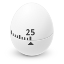
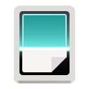

# GNOME

| [Back to Home](index.md) | [Back to Applications](apps.md)
| --- | --- |

#### Here are listed **17** programs for this category.

  <label for="app-search-input" style="font-weight: bold;">Search applications:</label>
  <input type="search" id="app-search-input" placeholder="Type a name or keyword..." autocomplete="off"
    style="width: 100%; max-width: 480px; padding: 0.5em 0.75em; margin-top: 0.25em; font-size: 1em; border: 1px solid #999; border-radius: 4px; box-sizing: border-box;">
  <select id="app-search-arch" aria-label="Filter by architecture"
    style="margin-top: 0.25em; padding: 0.5em; font-size: 1em; border: 1px solid #999; border-radius: 4px;">
    <option value="">Any architecture</option>
    <option value="x86_64">x86_64</option>
    <option value="aarch64">aarch64</option>
    <option value="i686">i686</option>
  </select>
  

#### *Categories*

  <a class="cat-pill" href="appimages.html">AppImages</a>
  •
  <a class="cat-pill" href="ai.html">ai</a>
  •
  <a class="cat-pill" href="am-utils.html">am-utils</a>
  •
  <a class="cat-pill" href="android.html">android</a>
  •
  <a class="cat-pill" href="appimage-on-the-fly.html">appimage-on-the-fly</a>
  •
  <a class="cat-pill" href="audio.html">audio</a>
  •
  <a class="cat-pill" href="comic.html">comic</a>
  •
  <a class="cat-pill" href="command-line.html">command-line</a>
  •
  <a class="cat-pill" href="communication.html">communication</a>
  •
  <a class="cat-pill" href="disk.html">disk</a>
  •
  <a class="cat-pill" href="education.html">education</a>
  •
  <a class="cat-pill" href="emulator.html">emulator</a>
  •
  <a class="cat-pill" href="file-manager.html">file-manager</a>
  •
  <a class="cat-pill" href="finance.html">finance</a>
  •
  <a class="cat-pill" href="game.html">game</a>
  •
  <a class="cat-pill cat-pill--all" href="gnome.html">gnome</a>
  •
  <a class="cat-pill" href="graphic.html">graphic</a>
  •
  <a class="cat-pill" href="internet.html">internet</a>
  •
  <a class="cat-pill" href="kde.html">kde</a>
  •
  <a class="cat-pill" href="metapackages.html">metapackages</a>
  •
  <a class="cat-pill" href="office.html">office</a>
  •
  <a class="cat-pill" href="password.html">password</a>
  •
  <a class="cat-pill" href="portable.html">Portable</a>
  •
  <a class="cat-pill" href="portable-cli.html">portable-cli</a>
  •
  <a class="cat-pill" href="portable-desktop.html">portable-desktop</a>
  •
  <a class="cat-pill" href="steam.html">steam</a>
  •
  <a class="cat-pill" href="system-monitor.html">system-monitor</a>
  •
  <a class="cat-pill" href="video.html">video</a>
  •
  <a class="cat-pill" href="virtual-machine.html">virtual-machine</a>
  •
  <a class="cat-pill" href="wallet.html">wallet</a>
  •
  <a class="cat-pill" href="web-app.html">web-app</a>
  •
  <a class="cat-pill" href="web-browser.html">web-browser</a>
  •
  <a class="cat-pill" href="wine.html">wine</a>
  •
  <a class="cat-pill" href="youtube.html">youtube</a>

-----------------

***NOTE, Installer scripts (blob/raw) are provided for reading only: do not run them manually! Use "[AM](https://github.com/ivan-hc/AM)" or "[AppMan](https://github.com/ivan-hc/AppMan)" instead.***

-----------------

| ICON | PACKAGE NAME | DESCRIPTION | INSTALLER |
| --- | --- | --- | --- |
|  | [***baobab***](apps/baobab.md) | *A graphical directory tree analyzer for the GNOME desktop environment, to keep your disk usage and available space under control.*..[ *read more* ](apps/baobab.md)*!* | [*blob*](https://github.com/ivan-hc/AM/blob/main/programs/x86_64/baobab) **/** [*raw*](https://raw.githubusercontent.com/ivan-hc/AM/main/programs/x86_64/baobab) |
|  | [***eog***](apps/eog.md) | *Eye of Gnome is an image viewing and cataloging program.*..[ *read more* ](apps/eog.md)*!* | [*blob*](https://github.com/ivan-hc/AM/blob/main/programs/x86_64/eog) **/** [*raw*](https://raw.githubusercontent.com/ivan-hc/AM/main/programs/x86_64/eog) |
|  | [***extension-manager***](apps/extension-manager.md) | *A native tool for browsing, installing, and managing GNOME Shell Extensions.*..[ *read more* ](apps/extension-manager.md)*!* | [*blob*](https://github.com/ivan-hc/AM/blob/main/programs/x86_64/extension-manager) **/** [*raw*](https://raw.githubusercontent.com/ivan-hc/AM/main/programs/x86_64/extension-manager) |
|  | [***file-roller***](apps/file-roller.md) | *File Roller is an archive manager for the GNOME desktop environment. Create and modify archives.*..[ *read more* ](apps/file-roller.md)*!* | [*blob*](https://github.com/ivan-hc/AM/blob/main/programs/x86_64/file-roller) **/** [*raw*](https://raw.githubusercontent.com/ivan-hc/AM/main/programs/x86_64/file-roller) |
|  | [***gdm-settings***](apps/gdm-settings.md) | *A settings app for GNOME's Login Manager, GDM.*..[ *read more* ](apps/gdm-settings.md)*!* | [*blob*](https://github.com/ivan-hc/AM/blob/main/programs/x86_64/gdm-settings) **/** [*raw*](https://raw.githubusercontent.com/ivan-hc/AM/main/programs/x86_64/gdm-settings) |
|  | [***gedit***](apps/gedit.md) | *An easy-to-use general-purpose text editor for the GNOME desktop environment.*..[ *read more* ](apps/gedit.md)*!* | [*blob*](https://github.com/ivan-hc/AM/blob/main/programs/x86_64/gedit) **/** [*raw*](https://raw.githubusercontent.com/ivan-hc/AM/main/programs/x86_64/gedit) |
|  | [***gnome-boxes***](apps/gnome-boxes.md) | *Unofficial, A simple GNOME application to access virtual machines.*..[ *read more* ](apps/gnome-boxes.md)*!* | [*blob*](https://github.com/ivan-hc/AM/blob/main/programs/x86_64/gnome-boxes) **/** [*raw*](https://raw.githubusercontent.com/ivan-hc/AM/main/programs/x86_64/gnome-boxes) |
|  | [***gnome-calculator***](apps/gnome-calculator.md) | *Unofficial, Perform arithmetic, scientific or financial calculations.*..[ *read more* ](apps/gnome-calculator.md)*!* | [*blob*](https://github.com/ivan-hc/AM/blob/main/programs/x86_64/gnome-calculator) **/** [*raw*](https://raw.githubusercontent.com/ivan-hc/AM/main/programs/x86_64/gnome-calculator) |
|  | [***gnome-pomodoro***](apps/gnome-pomodoro.md) | *A productivity tool designed to help you manage your time effectively using the Pomodoro Technique.*..[ *read more* ](apps/gnome-pomodoro.md)*!* | [*blob*](https://github.com/ivan-hc/AM/blob/main/programs/x86_64/gnome-pomodoro) **/** [*raw*](https://raw.githubusercontent.com/ivan-hc/AM/main/programs/x86_64/gnome-pomodoro) |
|  | [***gnome-system-monitor***](apps/gnome-system-monitor.md) | *System Monitor is a process viewer and system monitor with an attractive, easy-to-use interface for the GNOME desktop environment.*..[ *read more* ](apps/gnome-system-monitor.md)*!* | [*blob*](https://github.com/ivan-hc/AM/blob/main/programs/x86_64/gnome-system-monitor) **/** [*raw*](https://raw.githubusercontent.com/ivan-hc/AM/main/programs/x86_64/gnome-system-monitor) |
|  | [***gnome-text-editor***](apps/gnome-text-editor.md) | *Unofficial AppImage of the Gnome's Text Editor application.*..[ *read more* ](apps/gnome-text-editor.md)*!* | [*blob*](https://github.com/ivan-hc/AM/blob/main/programs/x86_64/gnome-text-editor) **/** [*raw*](https://raw.githubusercontent.com/ivan-hc/AM/main/programs/x86_64/gnome-text-editor) |
|  | [***gnome-tweaks***](apps/gnome-tweaks.md) | *Unofficial, Experimental AppImage port of advanced GNOME 3 settings GUI.*..[ *read more* ](apps/gnome-tweaks.md)*!* | [*blob*](https://github.com/ivan-hc/AM/blob/main/programs/x86_64/gnome-tweaks) **/** [*raw*](https://raw.githubusercontent.com/ivan-hc/AM/main/programs/x86_64/gnome-tweaks) |
|  | [***gnome-web***](apps/gnome-web.md) | *Unofficial AppImage of Gnome Web aka Epiphany..*..[ *read more* ](apps/gnome-web.md)*!* | [*blob*](https://github.com/ivan-hc/AM/blob/main/programs/x86_64/gnome-web) **/** [*raw*](https://raw.githubusercontent.com/ivan-hc/AM/main/programs/x86_64/gnome-web) |
|  | [***loginized***](apps/loginized.md) | *Loginized Gnome GDM Login Theme Manager.*..[ *read more* ](apps/loginized.md)*!* | [*blob*](https://github.com/ivan-hc/AM/blob/main/programs/x86_64/loginized) **/** [*raw*](https://raw.githubusercontent.com/ivan-hc/AM/main/programs/x86_64/loginized) |
|  | [***shotwell***](apps/shotwell.md) | *Unofficial, a digital photo organizer designed for the GNOME desktop environment.*..[ *read more* ](apps/shotwell.md)*!* | [*blob*](https://github.com/ivan-hc/AM/blob/main/programs/x86_64/shotwell) **/** [*raw*](https://raw.githubusercontent.com/ivan-hc/AM/main/programs/x86_64/shotwell) |
|  | [***simple-scan***](apps/simple-scan.md) | *Make a digital copy of your photos and documents. Simple scanning utility for the GNOME desktop environment.*..[ *read more* ](apps/simple-scan.md)*!* | [*blob*](https://github.com/ivan-hc/AM/blob/main/programs/x86_64/simple-scan) **/** [*raw*](https://raw.githubusercontent.com/ivan-hc/AM/main/programs/x86_64/simple-scan) |
|  | [***switchcraft***](apps/switchcraft.md) | *Switchcraft watches GNOME's light/dark preference and runs your shell commands when the theme changes.*..[ *read more* ](apps/switchcraft.md)*!* | [*blob*](https://github.com/ivan-hc/AM/blob/main/programs/x86_64/switchcraft) **/** [*raw*](https://raw.githubusercontent.com/ivan-hc/AM/main/programs/x86_64/switchcraft) |

---

You can improve these pages via a [pull request](https://github.com/Portable-Linux-Apps/Portable-Linux-Apps.github.io/pulls) to this site's [GitHub repository](https://github.com/Portable-Linux-Apps/Portable-Linux-Apps.github.io), or report any problems related to the installation scripts in the '[issue](https://github.com/ivan-hc/AM/issues)' section of the main database, at [https://github.com/ivan-hc/AM](https://github.com/ivan-hc/AM).

***PORTABLE-LINUX-APPS.github.io is my gift to the Linux community and was made with love for GNU/Linux and the Open Source philosophy.***

---

| [Back to Home](index.md) | [Back to Applications](apps.md)
| --- | --- |

--------

# Contacts
- **Ivan-HC** *on* [**GitHub**](https://github.com/ivan-hc)
- **AM-Ivan** *on* [**Reddit**](https://www.reddit.com/u/am-ivan)

###### *You can support me and my work on [**ko-fi.com**](https://ko-fi.com/IvanAlexHC) and [**PayPal.me**](https://paypal.me/IvanAlexHC). Thank you!*

--------

*© 2020-present Ivan Alessandro Sala aka 'Ivan-HC'* - I'm here just for fun!

