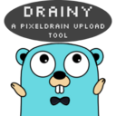
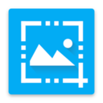

# GRAPHIC

| [Home](index.md) |
| --- |

#### Here are listed **115** programs and **0** items for this category and managed by [AM](https://github.com/ivan-hc/AM) 	and [AppMan](https://github.com/ivan-hc/AppMan) for the x86_64 architecture.

*Use your browser's built-in search tool to easily navigate to this page or use the tags below.*

| [Back to Applications](apps.md) |
| --- |

#### *Categories*

***[AppImages](appimages.md)*** 		 - ***[android](android.md)*** - ***[audio](audio.md)*** - ***[comic](comic.md)*** - ***[command-line](command-line.md)*** - ***[communication](communication.md)*** - ***[disk](disk.md)*** - ***[education](education.md)*** - ***[file-manager](file-manager.md)*** - ***[finance](finance.md)*** - ***[game](game.md)*** - ***[gnome](gnome.md)*** - ***[graphic](graphic.md)*** - ***[internet](internet.md)*** - ***[kde](kde.md)*** - ***[office](office.md)*** - ***[password](password.md)*** - ***[steam](steam.md)*** - ***[system-monitor](system-monitor.md)*** - ***[video](video.md)*** - ***[web-app](web-app.md)*** - ***[web-browser](web-browser.md)*** - ***[wine](wine.md)***

-----------------

*NOTE, the installer scripts in the "INSTALLER" column are intended for use via "AM", and are therefore dedicated to a system-wide 	installation of applications (in /opt), and all that "AppMan" does is convert those scripts for local installation, changing the paths. 	**They are listed here for reading purposes only**!*

*Should you decide to run them manually, the only way to remove the application is to run 	the command "`sudo /opt/appname/remove`", where "appname" is the name of the application directory containing the "remove" script. 	Likewise, you can also update applications by running the "AM-updater" script in the same directory.*

*The "AM" project allow the autonomy of installed apps, regardless of the presence of "AM" itself in the system. However, it is strongly 	recommended to use "AM" and "AppMan" to take full advantage of all the benefits you could get from an application installed in this way.*

*If you are here just to download apps manually, click on the program name and check the URL(s) on the application page. This site does not 	provide direct links, for security reasons, but it does provide the exact sources and references where you can find them!*

*Transparency and credibility are the focus of this catalog. Happy exploring!*

-----------------

| ICON | PACKAGE NAME | DESCRIPTION | INSTALLER |
| --- | --- | --- | --- |
|  | [***ansel***](apps/ansel.md) | *An open-source photo-editing software for digital artists, designed to help you achieve your own interpretation of raw digital photographs.*..[ *read more* ](apps/ansel.md)*!* | [*blob*](https://github.com/ivan-hc/AM/blob/main/programs/x86_64/ansel) **/** [*raw*](https://raw.githubusercontent.com/ivan-hc/AM/main/programs/x86_64/ansel) |
|  | [***aphototoollibre***](apps/aphototoollibre.md) | *Photo editing app for GNU/Linux.*..[ *read more* ](apps/aphototoollibre.md)*!* | [*blob*](https://github.com/ivan-hc/AM/blob/main/programs/x86_64/aphototoollibre) **/** [*raw*](https://raw.githubusercontent.com/ivan-hc/AM/main/programs/x86_64/aphototoollibre) |
|  | [***astrofox***](apps/astrofox.md) | *Audio reactive motion graphics program.*..[ *read more* ](apps/astrofox.md)*!* | [*blob*](https://github.com/ivan-hc/AM/blob/main/programs/x86_64/astrofox) **/** [*raw*](https://raw.githubusercontent.com/ivan-hc/AM/main/programs/x86_64/astrofox) |
|  | [***astroshutter***](apps/astroshutter.md) | *Ui to control your camera for astrophotography.*..[ *read more* ](apps/astroshutter.md)*!* | [*blob*](https://github.com/ivan-hc/AM/blob/main/programs/x86_64/astroshutter) **/** [*raw*](https://raw.githubusercontent.com/ivan-hc/AM/main/programs/x86_64/astroshutter) |
|  | [***bazecor***](apps/bazecor.md) | *Graphical configurator for Dygma Raise.*..[ *read more* ](apps/bazecor.md)*!* | [*blob*](https://github.com/ivan-hc/AM/blob/main/programs/x86_64/bazecor) **/** [*raw*](https://raw.githubusercontent.com/ivan-hc/AM/main/programs/x86_64/bazecor) |
|  | [***bforartists***](apps/bforartists.md) | *3D modeling, animation, rendering and post-production.*..[ *read more* ](apps/bforartists.md)*!* | [*blob*](https://github.com/ivan-hc/AM/blob/main/programs/x86_64/bforartists) **/** [*raw*](https://raw.githubusercontent.com/ivan-hc/AM/main/programs/x86_64/bforartists) |
|  | [***biying***](apps/biying.md) | *Biying Wallpaper for Linux.*..[ *read more* ](apps/biying.md)*!* | [*blob*](https://github.com/ivan-hc/AM/blob/main/programs/x86_64/biying) **/** [*raw*](https://raw.githubusercontent.com/ivan-hc/AM/main/programs/x86_64/biying) |
|  | [***blender-alpha***](apps/blender-alpha.md) | *Very fast and versatile 3D modeller/renderer, Alpha.*..[ *read more* ](apps/blender-alpha.md)*!* | [*blob*](https://github.com/ivan-hc/AM/blob/main/programs/x86_64/blender-alpha) **/** [*raw*](https://raw.githubusercontent.com/ivan-hc/AM/main/programs/x86_64/blender-alpha) |
|  | [***blender-beta***](apps/blender-beta.md) | *Very fast and versatile 3D modeller/renderer, Beta.*..[ *read more* ](apps/blender-beta.md)*!* | [*blob*](https://github.com/ivan-hc/AM/blob/main/programs/x86_64/blender-beta) **/** [*raw*](https://raw.githubusercontent.com/ivan-hc/AM/main/programs/x86_64/blender-beta) |
|  | [***blender-rc***](apps/blender-rc.md) | *Very fast and versatile 3D modeller/renderer, Release Candidate.*..[ *read more* ](apps/blender-rc.md)*!* | [*blob*](https://github.com/ivan-hc/AM/blob/main/programs/x86_64/blender-rc) **/** [*raw*](https://raw.githubusercontent.com/ivan-hc/AM/main/programs/x86_64/blender-rc) |
|  | [***blender***](apps/blender.md) | *Very fast and versatile 3D modeller/renderer, Stable.*..[ *read more* ](apps/blender.md)*!* | [*blob*](https://github.com/ivan-hc/AM/blob/main/programs/x86_64/blender) **/** [*raw*](https://raw.githubusercontent.com/ivan-hc/AM/main/programs/x86_64/blender) |
|  | [***blensor***](apps/blensor.md) | *3D modeling, animation, rendering and post-production.*..[ *read more* ](apps/blensor.md)*!* | [*blob*](https://github.com/ivan-hc/AM/blob/main/programs/x86_64/blensor) **/** [*raw*](https://raw.githubusercontent.com/ivan-hc/AM/main/programs/x86_64/blensor) |
|  | [***blockbench***](apps/blockbench.md) | *Editor for boxy models and pixel art textures like Minecraft.*..[ *read more* ](apps/blockbench.md)*!* | [*blob*](https://github.com/ivan-hc/AM/blob/main/programs/x86_64/blockbench) **/** [*raw*](https://raw.githubusercontent.com/ivan-hc/AM/main/programs/x86_64/blockbench) |
|  | [***bottom***](apps/bottom.md) | *Yet another cross-platform graphical process/system monitor.*..[ *read more* ](apps/bottom.md)*!* | [*blob*](https://github.com/ivan-hc/AM/blob/main/programs/x86_64/bottom) **/** [*raw*](https://raw.githubusercontent.com/ivan-hc/AM/main/programs/x86_64/bottom) |
|  | [***caesium***](apps/caesium.md) | *Image compression software that helps you store, send and share digital pictures, supporting JPG, PNG, WebP and TIFF formats.*..[ *read more* ](apps/caesium.md)*!* | [*blob*](https://github.com/ivan-hc/AM/blob/main/programs/x86_64/caesium) **/** [*raw*](https://raw.githubusercontent.com/ivan-hc/AM/main/programs/x86_64/caesium) |
|  | [***chrysalis-bin***](apps/chrysalis-bin.md) | *Graphical configurator for Kaleidoscope-powered keyboards.*..[ *read more* ](apps/chrysalis-bin.md)*!* | [*blob*](https://github.com/ivan-hc/AM/blob/main/programs/x86_64/chrysalis-bin) **/** [*raw*](https://raw.githubusercontent.com/ivan-hc/AM/main/programs/x86_64/chrysalis-bin) |
|  | [***corepaint***](apps/corepaint.md) | *A paint app for CuboCore Application Suite.*..[ *read more* ](apps/corepaint.md)*!* | [*blob*](https://github.com/ivan-hc/AM/blob/main/programs/x86_64/corepaint) **/** [*raw*](https://raw.githubusercontent.com/ivan-hc/AM/main/programs/x86_64/corepaint) |
|  | [***darktable-nightly***](apps/darktable-nightly.md) | *Photography workflow app and raw developer, nightly.*..[ *read more* ](apps/darktable-nightly.md)*!* | [*blob*](https://github.com/ivan-hc/AM/blob/main/programs/x86_64/darktable-nightly) **/** [*raw*](https://raw.githubusercontent.com/ivan-hc/AM/main/programs/x86_64/darktable-nightly) |
|  | [***darktable***](apps/darktable.md) | *Photography workflow app and raw developer.*..[ *read more* ](apps/darktable.md)*!* | [*blob*](https://github.com/ivan-hc/AM/blob/main/programs/x86_64/darktable) **/** [*raw*](https://raw.githubusercontent.com/ivan-hc/AM/main/programs/x86_64/darktable) |
|  | [***destiny***](apps/destiny.md) | *Cross-platform Magic Wormhole graphical client.*..[ *read more* ](apps/destiny.md)*!* | [*blob*](https://github.com/ivan-hc/AM/blob/main/programs/x86_64/destiny) **/** [*raw*](https://raw.githubusercontent.com/ivan-hc/AM/main/programs/x86_64/destiny) |
|  | [***digikam***](apps/digikam.md) | *Professional and advanced digital photo management application.*..[ *read more* ](apps/digikam.md)*!* | [*blob*](https://github.com/ivan-hc/AM/blob/main/programs/x86_64/digikam) **/** [*raw*](https://raw.githubusercontent.com/ivan-hc/AM/main/programs/x86_64/digikam) |
|  | [***dotto***](apps/dotto.md) | *A portable and modern pixelart editor, written from scratch.*..[ *read more* ](apps/dotto.md)*!* | [*blob*](https://github.com/ivan-hc/AM/blob/main/programs/x86_64/dotto) **/** [*raw*](https://raw.githubusercontent.com/ivan-hc/AM/main/programs/x86_64/dotto) |
|  | [***duplicate-image-finder***](apps/duplicate-image-finder.md) | *It is an application that can find duplicated images (jpg, png, bitmap, etc) in a collection.*..[ *read more* ](apps/duplicate-image-finder.md)*!* | [*blob*](https://github.com/ivan-hc/AM/blob/main/programs/x86_64/duplicate-image-finder) **/** [*raw*](https://raw.githubusercontent.com/ivan-hc/AM/main/programs/x86_64/duplicate-image-finder) |
|  | [***dust3d***](apps/dust3d.md) | *3D modeling software for games, 3D printing, and so on.*..[ *read more* ](apps/dust3d.md)*!* | [*blob*](https://github.com/ivan-hc/AM/blob/main/programs/x86_64/dust3d) **/** [*raw*](https://raw.githubusercontent.com/ivan-hc/AM/main/programs/x86_64/dust3d) |
|  | [***ente-auth***](apps/ente-auth.md) | *Fully open source, End to End Encrypted alternative to Google Photos and Apple Photos.*..[ *read more* ](apps/ente-auth.md)*!* | [*blob*](https://github.com/ivan-hc/AM/blob/main/programs/x86_64/ente-auth) **/** [*raw*](https://raw.githubusercontent.com/ivan-hc/AM/main/programs/x86_64/ente-auth) |
|  | [***ente-photos***](apps/ente-photos.md) | *Binary releases of the Ente Photos desktop app.*..[ *read more* ](apps/ente-photos.md)*!* | [*blob*](https://github.com/ivan-hc/AM/blob/main/programs/x86_64/ente-photos) **/** [*raw*](https://raw.githubusercontent.com/ivan-hc/AM/main/programs/x86_64/ente-photos) |
|  | [***escrcpy***](apps/escrcpy.md) | *Graphical Scrcpy to display and control Android, devices powered by Electron.*..[ *read more* ](apps/escrcpy.md)*!* | [*blob*](https://github.com/ivan-hc/AM/blob/main/programs/x86_64/escrcpy) **/** [*raw*](https://raw.githubusercontent.com/ivan-hc/AM/main/programs/x86_64/escrcpy) |
|  | [***esearch***](apps/esearch.md) | *Screenshot OCR search translate search for picture paste...*..[ *read more* ](apps/esearch.md)*!* | [*blob*](https://github.com/ivan-hc/AM/blob/main/programs/x86_64/esearch) **/** [*raw*](https://raw.githubusercontent.com/ivan-hc/AM/main/programs/x86_64/esearch) |
|  | [***evoplex***](apps/evoplex.md) | *Agent-based modeling.*..[ *read more* ](apps/evoplex.md)*!* | [*blob*](https://github.com/ivan-hc/AM/blob/main/programs/x86_64/evoplex) **/** [*raw*](https://raw.githubusercontent.com/ivan-hc/AM/main/programs/x86_64/evoplex) |
|  | [***fantascene-dynamic-wallpaper***](apps/fantascene-dynamic-wallpaper.md) | *Dynamic wallpaper software for Linux.*..[ *read more* ](apps/fantascene-dynamic-wallpaper.md)*!* | [*blob*](https://github.com/ivan-hc/AM/blob/main/programs/x86_64/fantascene-dynamic-wallpaper) **/** [*raw*](https://raw.githubusercontent.com/ivan-hc/AM/main/programs/x86_64/fantascene-dynamic-wallpaper) |
|  | [***feebas***](apps/feebas.md) | *Screenshot comparison tool for identifying visual regressions.*..[ *read more* ](apps/feebas.md)*!* | [*blob*](https://github.com/ivan-hc/AM/blob/main/programs/x86_64/feebas) **/** [*raw*](https://raw.githubusercontent.com/ivan-hc/AM/main/programs/x86_64/feebas) |
|  | [***figma-linux***](apps/figma-linux.md) | *First interface design tool based in the browser, graphics.*..[ *read more* ](apps/figma-linux.md)*!* | [*blob*](https://github.com/ivan-hc/AM/blob/main/programs/x86_64/figma-linux) **/** [*raw*](https://raw.githubusercontent.com/ivan-hc/AM/main/programs/x86_64/figma-linux) |
|  | [***filmulator-gui***](apps/filmulator-gui.md) | *Simplified raw editing with the power of film, graphics.*..[ *read more* ](apps/filmulator-gui.md)*!* | [*blob*](https://github.com/ivan-hc/AM/blob/main/programs/x86_64/filmulator-gui) **/** [*raw*](https://raw.githubusercontent.com/ivan-hc/AM/main/programs/x86_64/filmulator-gui) |
|  | [***firealpaca***](apps/firealpaca.md) | *A Free and Multiplatform Digital Painting Software.*..[ *read more* ](apps/firealpaca.md)*!* | [*blob*](https://github.com/ivan-hc/AM/blob/main/programs/x86_64/firealpaca) **/** [*raw*](https://raw.githubusercontent.com/ivan-hc/AM/main/programs/x86_64/firealpaca) |
|  | [***flameshot***](apps/flameshot.md) | *Tool to take screenshots with many built-in features, graphics.*..[ *read more* ](apps/flameshot.md)*!* | [*blob*](https://github.com/ivan-hc/AM/blob/main/programs/x86_64/flameshot) **/** [*raw*](https://raw.githubusercontent.com/ivan-hc/AM/main/programs/x86_64/flameshot) |
|  | [***fractale***](apps/fractale.md) | *2D modeling of the Von Koch fractal.*..[ *read more* ](apps/fractale.md)*!* | [*blob*](https://github.com/ivan-hc/AM/blob/main/programs/x86_64/fractale) **/** [*raw*](https://raw.githubusercontent.com/ivan-hc/AM/main/programs/x86_64/fractale) |
|  | [***freecad***](apps/freecad.md) | *Free and open source AutoCAD alternative.*..[ *read more* ](apps/freecad.md)*!* | [*blob*](https://github.com/ivan-hc/AM/blob/main/programs/x86_64/freecad) **/** [*raw*](https://raw.githubusercontent.com/ivan-hc/AM/main/programs/x86_64/freecad) |
|  | [***freetexturepacker***](apps/freetexturepacker.md) | *Creates sprite sheets for you game or site, graphics.*..[ *read more* ](apps/freetexturepacker.md)*!* | [*blob*](https://github.com/ivan-hc/AM/blob/main/programs/x86_64/freetexturepacker) **/** [*raw*](https://raw.githubusercontent.com/ivan-hc/AM/main/programs/x86_64/freetexturepacker) |
|  | [***gams-studio***](apps/gams-studio.md) | *Development environment of General Algebraic Modeling System.*..[ *read more* ](apps/gams-studio.md)*!* | [*blob*](https://github.com/ivan-hc/AM/blob/main/programs/x86_64/gams-studio) **/** [*raw*](https://raw.githubusercontent.com/ivan-hc/AM/main/programs/x86_64/gams-studio) |
|  | [***gaphor***](apps/gaphor.md) | *A UML and SysML modeling application written in Python.*..[ *read more* ](apps/gaphor.md)*!* | [*blob*](https://github.com/ivan-hc/AM/blob/main/programs/x86_64/gaphor) **/** [*raw*](https://raw.githubusercontent.com/ivan-hc/AM/main/programs/x86_64/gaphor) |
|  | [***geeqie***](apps/geeqie.md) | *Claiming to be the best image viewer and photo collection browser.*..[ *read more* ](apps/geeqie.md)*!* | [*blob*](https://github.com/ivan-hc/AM/blob/main/programs/x86_64/geeqie) **/** [*raw*](https://raw.githubusercontent.com/ivan-hc/AM/main/programs/x86_64/geeqie) |
|  | [***geometrize***](apps/geometrize.md) | *Images to shapes converter, graphics.*..[ *read more* ](apps/geometrize.md)*!* | [*blob*](https://github.com/ivan-hc/AM/blob/main/programs/x86_64/geometrize) **/** [*raw*](https://raw.githubusercontent.com/ivan-hc/AM/main/programs/x86_64/geometrize) |
|  | [***gimp-dev***](apps/gimp-dev.md) | *Unofficial, Cross-platform image and photo editor, Developer Edition.*..[ *read more* ](apps/gimp-dev.md)*!* | [*blob*](https://github.com/ivan-hc/AM/blob/main/programs/x86_64/gimp-dev) **/** [*raw*](https://raw.githubusercontent.com/ivan-hc/AM/main/programs/x86_64/gimp-dev) |
|  | [***gimp-git***](apps/gimp-git.md) | *Unofficial, Cross-platform image and photo editor, built from GIT.*..[ *read more* ](apps/gimp-git.md)*!* | [*blob*](https://github.com/ivan-hc/AM/blob/main/programs/x86_64/gimp-git) **/** [*raw*](https://raw.githubusercontent.com/ivan-hc/AM/main/programs/x86_64/gimp-git) |
|  | [***gimp***](apps/gimp.md) | *GNU Image Manipulation Program, cross-platform image and photo editor. Multiple-choices.*..[ *read more* ](apps/gimp.md)*!* | [*blob*](https://github.com/ivan-hc/AM/blob/main/programs/x86_64/gimp) **/** [*raw*](https://raw.githubusercontent.com/ivan-hc/AM/main/programs/x86_64/gimp) |
|  | [***gimp-hybrid***](apps/gimp-hybrid.md) | *Unofficial, GIMP including third-party plugins and python2 support.*..[ *read more* ](apps/gimp-hybrid.md)*!* | [*blob*](https://github.com/ivan-hc/AM/blob/main/programs/x86_64/gimp-hybrid) **/** [*raw*](https://raw.githubusercontent.com/ivan-hc/AM/main/programs/x86_64/gimp-hybrid) |
|  | [***glaxnimate***](apps/glaxnimate.md) | *A simple and fast vector graphics animation program.*..[ *read more* ](apps/glaxnimate.md)*!* | [*blob*](https://github.com/ivan-hc/AM/blob/main/programs/x86_64/glaxnimate) **/** [*raw*](https://raw.githubusercontent.com/ivan-hc/AM/main/programs/x86_64/glaxnimate) |
|  | [***go-pd***](apps/go-pd.md) | *A free easy to use pixeldrain.com go client pkg and CLI upload tool.*..[ *read more* ](apps/go-pd.md)*!* | [*blob*](https://github.com/ivan-hc/AM/blob/main/programs/x86_64/go-pd) **/** [*raw*](https://raw.githubusercontent.com/ivan-hc/AM/main/programs/x86_64/go-pd) |
|  | [***go-pd-gui***](apps/go-pd-gui.md) | *DRAINY is a free easy to use cross plattform upload tool for pixeldrain.com.*..[ *read more* ](apps/go-pd-gui.md)*!* | [*blob*](https://github.com/ivan-hc/AM/blob/main/programs/x86_64/go-pd-gui) **/** [*raw*](https://raw.githubusercontent.com/ivan-hc/AM/main/programs/x86_64/go-pd-gui) |
|  | [***goverlay***](apps/goverlay.md) | *An opensource project that aims to create a Graphical UI to help manage Linux overlays.*..[ *read more* ](apps/goverlay.md)*!* | [*blob*](https://github.com/ivan-hc/AM/blob/main/programs/x86_64/goverlay) **/** [*raw*](https://raw.githubusercontent.com/ivan-hc/AM/main/programs/x86_64/goverlay) |
|  | [***grabscr***](apps/grabscr.md) | *Yet another screenshot maker.*..[ *read more* ](apps/grabscr.md)*!* | [*blob*](https://github.com/ivan-hc/AM/blob/main/programs/x86_64/grabscr) **/** [*raw*](https://raw.githubusercontent.com/ivan-hc/AM/main/programs/x86_64/grabscr) |
|  | [***groot***](apps/groot.md) | *Graphical Editor to create BehaviorTrees.*..[ *read more* ](apps/groot.md)*!* | [*blob*](https://github.com/ivan-hc/AM/blob/main/programs/x86_64/groot) **/** [*raw*](https://raw.githubusercontent.com/ivan-hc/AM/main/programs/x86_64/groot) |
|  | [***guitar***](apps/guitar.md) | *Graphical git client.*..[ *read more* ](apps/guitar.md)*!* | [*blob*](https://github.com/ivan-hc/AM/blob/main/programs/x86_64/guitar) **/** [*raw*](https://raw.githubusercontent.com/ivan-hc/AM/main/programs/x86_64/guitar) |
|  | [***hugin***](apps/hugin.md) | *Stitch photographs together.*..[ *read more* ](apps/hugin.md)*!* | [*blob*](https://github.com/ivan-hc/AM/blob/main/programs/x86_64/hugin) **/** [*raw*](https://raw.githubusercontent.com/ivan-hc/AM/main/programs/x86_64/hugin) |
|  | [***imagine***](apps/imagine.md) | *PNG/JPEG optimization.*..[ *read more* ](apps/imagine.md)*!* | [*blob*](https://github.com/ivan-hc/AM/blob/main/programs/x86_64/imagine) **/** [*raw*](https://raw.githubusercontent.com/ivan-hc/AM/main/programs/x86_64/imagine) |
|  | [***inkscape***](apps/inkscape.md) | *Vector-based drawing program, SVG, PDF, AutoCAD..., Stable.*..[ *read more* ](apps/inkscape.md)*!* | [*blob*](https://github.com/ivan-hc/AM/blob/main/programs/x86_64/inkscape) **/** [*raw*](https://raw.githubusercontent.com/ivan-hc/AM/main/programs/x86_64/inkscape) |
|  | [***jabref***](apps/jabref.md) | *Graphical Java application for managing BibTeX and biblatex (.bib) databases.*..[ *read more* ](apps/jabref.md)*!* | [*blob*](https://github.com/ivan-hc/AM/blob/main/programs/x86_64/jabref) **/** [*raw*](https://raw.githubusercontent.com/ivan-hc/AM/main/programs/x86_64/jabref) |
|  | [***jdappstreamedit***](apps/jdappstreamedit.md) | *A graphical Program to create and edit AppStream files.*..[ *read more* ](apps/jdappstreamedit.md)*!* | [*blob*](https://github.com/ivan-hc/AM/blob/main/programs/x86_64/jdappstreamedit) **/** [*raw*](https://raw.githubusercontent.com/ivan-hc/AM/main/programs/x86_64/jdappstreamedit) |
|  | [***jddesktopentryedit***](apps/jddesktopentryedit.md) | *A graphical Program to create and edit Desktop Entries.*..[ *read more* ](apps/jddesktopentryedit.md)*!* | [*blob*](https://github.com/ivan-hc/AM/blob/main/programs/x86_64/jddesktopentryedit) **/** [*raw*](https://raw.githubusercontent.com/ivan-hc/AM/main/programs/x86_64/jddesktopentryedit) |
|  | [***jexiftoolgui***](apps/jexiftoolgui.md) | *Java/Swing graphical frontend for ExifTool.*..[ *read more* ](apps/jexiftoolgui.md)*!* | [*blob*](https://github.com/ivan-hc/AM/blob/main/programs/x86_64/jexiftoolgui) **/** [*raw*](https://raw.githubusercontent.com/ivan-hc/AM/main/programs/x86_64/jexiftoolgui) |
|  | [***krita***](apps/krita.md) | *A professional FREE and open source painting program, graphics.*..[ *read more* ](apps/krita.md)*!* | [*blob*](https://github.com/ivan-hc/AM/blob/main/programs/x86_64/krita) **/** [*raw*](https://raw.githubusercontent.com/ivan-hc/AM/main/programs/x86_64/krita) |
|  | [***krita-devel***](apps/krita-devel.md) | *A professional FREE open source painting program, dev-edition.*..[ *read more* ](apps/krita-devel.md)*!* | [*blob*](https://github.com/ivan-hc/AM/blob/main/programs/x86_64/krita-devel) **/** [*raw*](https://raw.githubusercontent.com/ivan-hc/AM/main/programs/x86_64/krita-devel) |
|  | [***krunker***](apps/krunker.md) | *Krunker (.io) is a fast-paced first-person shooter game with pixel graphics.*..[ *read more* ](apps/krunker.md)*!* | [*blob*](https://github.com/ivan-hc/AM/blob/main/programs/x86_64/krunker) **/** [*raw*](https://raw.githubusercontent.com/ivan-hc/AM/main/programs/x86_64/krunker) |
|  | [***ksnip***](apps/ksnip.md) | *Screenshot tool inspired by Windows Snipping Tool and made with Qt.*..[ *read more* ](apps/ksnip.md)*!* | [*blob*](https://github.com/ivan-hc/AM/blob/main/programs/x86_64/ksnip) **/** [*raw*](https://raw.githubusercontent.com/ivan-hc/AM/main/programs/x86_64/ksnip) |
|  | [***libertem***](apps/libertem.md) | *Pixelated scanning transmission electron microscopy.*..[ *read more* ](apps/libertem.md)*!* | [*blob*](https://github.com/ivan-hc/AM/blob/main/programs/x86_64/libertem) **/** [*raw*](https://raw.githubusercontent.com/ivan-hc/AM/main/programs/x86_64/libertem) |
|  | [***libresprite***](apps/libresprite.md) | *Animated sprite editor & pixel art tool. Fork of the last GPLv2 commit of Aseprite.*..[ *read more* ](apps/libresprite.md)*!* | [*blob*](https://github.com/ivan-hc/AM/blob/main/programs/x86_64/libresprite) **/** [*raw*](https://raw.githubusercontent.com/ivan-hc/AM/main/programs/x86_64/libresprite) |
|  | [***lisk-desktop***](apps/lisk-desktop.md) | *Lisk graphical user interface for desktop.*..[ *read more* ](apps/lisk-desktop.md)*!* | [*blob*](https://github.com/ivan-hc/AM/blob/main/programs/x86_64/lisk-desktop) **/** [*raw*](https://raw.githubusercontent.com/ivan-hc/AM/main/programs/x86_64/lisk-desktop) |
|  | [***mapollage***](apps/mapollage.md) | *Photo kml generator for Google Earth.*..[ *read more* ](apps/mapollage.md)*!* | [*blob*](https://github.com/ivan-hc/AM/blob/main/programs/x86_64/mapollage) **/** [*raw*](https://raw.githubusercontent.com/ivan-hc/AM/main/programs/x86_64/mapollage) |
|  | [***memoto***](apps/memoto.md) | *DevOps oriented modeling tool.*..[ *read more* ](apps/memoto.md)*!* | [*blob*](https://github.com/ivan-hc/AM/blob/main/programs/x86_64/memoto) **/** [*raw*](https://raw.githubusercontent.com/ivan-hc/AM/main/programs/x86_64/memoto) |
|  | [***minizinc-ide***](apps/minizinc-ide.md) | *A free and open-source constraint modeling language.*..[ *read more* ](apps/minizinc-ide.md)*!* | [*blob*](https://github.com/ivan-hc/AM/blob/main/programs/x86_64/minizinc-ide) **/** [*raw*](https://raw.githubusercontent.com/ivan-hc/AM/main/programs/x86_64/minizinc-ide) |
|  | [***mmapper***](apps/mmapper.md) | *Graphical MUD client for the game MUME.*..[ *read more* ](apps/mmapper.md)*!* | [*blob*](https://github.com/ivan-hc/AM/blob/main/programs/x86_64/mmapper) **/** [*raw*](https://raw.githubusercontent.com/ivan-hc/AM/main/programs/x86_64/mmapper) |
|  | [***mypaint***](apps/mypaint.md) | *Simple drawing and painting program, graphics.*..[ *read more* ](apps/mypaint.md)*!* | [*blob*](https://github.com/ivan-hc/AM/blob/main/programs/x86_64/mypaint) **/** [*raw*](https://raw.githubusercontent.com/ivan-hc/AM/main/programs/x86_64/mypaint) |
|  | [***ncsa-mosaic***](apps/ncsa-mosaic.md) | *One of the first graphical web browsers.*..[ *read more* ](apps/ncsa-mosaic.md)*!* | [*blob*](https://github.com/ivan-hc/AM/blob/main/programs/x86_64/ncsa-mosaic) **/** [*raw*](https://raw.githubusercontent.com/ivan-hc/AM/main/programs/x86_64/ncsa-mosaic) |
|  | [***paper***](apps/paper.md) | *A CLI Tool to set a random wallpaper from Unsplash.com.*..[ *read more* ](apps/paper.md)*!* | [*blob*](https://github.com/ivan-hc/AM/blob/main/programs/x86_64/paper) **/** [*raw*](https://raw.githubusercontent.com/ivan-hc/AM/main/programs/x86_64/paper) |
|  | [***pavo***](apps/pavo.md) | *A mini desktop wallpaper application.*..[ *read more* ](apps/pavo.md)*!* | [*blob*](https://github.com/ivan-hc/AM/blob/main/programs/x86_64/pavo) **/** [*raw*](https://raw.githubusercontent.com/ivan-hc/AM/main/programs/x86_64/pavo) |
|  | [***pdmaner***](apps/pdmaner.md) | *A relational database modeling tool.*..[ *read more* ](apps/pdmaner.md)*!* | [*blob*](https://github.com/ivan-hc/AM/blob/main/programs/x86_64/pdmaner) **/** [*raw*](https://raw.githubusercontent.com/ivan-hc/AM/main/programs/x86_64/pdmaner) |
|  | [***photocrea***](apps/photocrea.md) | *Unofficial Photopea wrapper, image editor that includes all the familiar features like layers, filters, magic wand selection, etc.*..[ *read more* ](apps/photocrea.md)*!* | [*blob*](https://github.com/ivan-hc/AM/blob/main/programs/x86_64/photocrea) **/** [*raw*](https://raw.githubusercontent.com/ivan-hc/AM/main/programs/x86_64/photocrea) |
|  | [***photoflare***](apps/photoflare.md) | *A simple but featureful image editor.*..[ *read more* ](apps/photoflare.md)*!* | [*blob*](https://github.com/ivan-hc/AM/blob/main/programs/x86_64/photoflare) **/** [*raw*](https://raw.githubusercontent.com/ivan-hc/AM/main/programs/x86_64/photoflare) |
|  | [***photoflow***](apps/photoflow.md) | *Edit images from digital cameras.*..[ *read more* ](apps/photoflow.md)*!* | [*blob*](https://github.com/ivan-hc/AM/blob/main/programs/x86_64/photoflow) **/** [*raw*](https://raw.githubusercontent.com/ivan-hc/AM/main/programs/x86_64/photoflow) |
|  | [***photogimp***](apps/photogimp.md) | *A patched version of GIMP for Adobe Photoshop users.*..[ *read more* ](apps/photogimp.md)*!* | [*blob*](https://github.com/ivan-hc/AM/blob/main/programs/x86_64/photogimp) **/** [*raw*](https://raw.githubusercontent.com/ivan-hc/AM/main/programs/x86_64/photogimp) |
|  | [***photoname***](apps/photoname.md) | *Rename photo image files based on EXIF shoot date.*..[ *read more* ](apps/photoname.md)*!* | [*blob*](https://github.com/ivan-hc/AM/blob/main/programs/x86_64/photoname) **/** [*raw*](https://raw.githubusercontent.com/ivan-hc/AM/main/programs/x86_64/photoname) |
|  | [***photon***](apps/photon.md) | *Cross-platform file-transfer application built using flutter. It uses http to transfer files between devices.*..[ *read more* ](apps/photon.md)*!* | [*blob*](https://github.com/ivan-hc/AM/blob/main/programs/x86_64/photon) **/** [*raw*](https://raw.githubusercontent.com/ivan-hc/AM/main/programs/x86_64/photon) |
|  | [***photopealoader***](apps/photopealoader.md) | *Photopea desktop app that loads local files and plugins.*..[ *read more* ](apps/photopealoader.md)*!* | [*blob*](https://github.com/ivan-hc/AM/blob/main/programs/x86_64/photopealoader) **/** [*raw*](https://raw.githubusercontent.com/ivan-hc/AM/main/programs/x86_64/photopealoader) |
|  | [***photoqt***](apps/photoqt.md) | *View and manage images.*..[ *read more* ](apps/photoqt.md)*!* | [*blob*](https://github.com/ivan-hc/AM/blob/main/programs/x86_64/photoqt) **/** [*raw*](https://raw.githubusercontent.com/ivan-hc/AM/main/programs/x86_64/photoqt) |
|  | [***photoquick***](apps/photoquick.md) | *Light-weight image viewer, resize, collage, filters....*..[ *read more* ](apps/photoquick.md)*!* | [*blob*](https://github.com/ivan-hc/AM/blob/main/programs/x86_64/photoquick) **/** [*raw*](https://raw.githubusercontent.com/ivan-hc/AM/main/programs/x86_64/photoquick) |
|  | [***phototeleport***](apps/phototeleport.md) | *Upload your photos to multiple services at once.*..[ *read more* ](apps/phototeleport.md)*!* | [*blob*](https://github.com/ivan-hc/AM/blob/main/programs/x86_64/phototeleport) **/** [*raw*](https://raw.githubusercontent.com/ivan-hc/AM/main/programs/x86_64/phototeleport) |
|  | [***pinta-dev***](apps/pinta-dev.md) | *Simple GTK Paint Program (developer edition).*..[ *read more* ](apps/pinta-dev.md)*!* | [*blob*](https://github.com/ivan-hc/AM/blob/main/programs/x86_64/pinta-dev) **/** [*raw*](https://raw.githubusercontent.com/ivan-hc/AM/main/programs/x86_64/pinta-dev) |
|  | [***pixelhopper***](apps/pixelhopper.md) | *Animated GIF player for Linux (X11).*..[ *read more* ](apps/pixelhopper.md)*!* | [*blob*](https://github.com/ivan-hc/AM/blob/main/programs/x86_64/pixelhopper) **/** [*raw*](https://raw.githubusercontent.com/ivan-hc/AM/main/programs/x86_64/pixelhopper) |
|  | [***pixelorama***](apps/pixelorama.md) | *A powerful and accessible open-source pixel art multitool. Whether you want to create sprites, tiles, animations, or just express yourself in the language of pixel art.*..[ *read more* ](apps/pixelorama.md)*!* | [*blob*](https://github.com/ivan-hc/AM/blob/main/programs/x86_64/pixelorama) **/** [*raw*](https://raw.githubusercontent.com/ivan-hc/AM/main/programs/x86_64/pixelorama) |
|  | [***pixfetch***](apps/pixfetch.md) | *Another CLI fetch program with pixelized images written in Rust.*..[ *read more* ](apps/pixfetch.md)*!* | [*blob*](https://github.com/ivan-hc/AM/blob/main/programs/x86_64/pixfetch) **/** [*raw*](https://raw.githubusercontent.com/ivan-hc/AM/main/programs/x86_64/pixfetch) |
|  | [***pixsrt***](apps/pixsrt.md) | *Pixel sorter.*..[ *read more* ](apps/pixsrt.md)*!* | [*blob*](https://github.com/ivan-hc/AM/blob/main/programs/x86_64/pixsrt) **/** [*raw*](https://raw.githubusercontent.com/ivan-hc/AM/main/programs/x86_64/pixsrt) |
|  | [***platinum-md***](apps/platinum-md.md) | *Graphical MiniDisc NetMD conversion and upload.*..[ *read more* ](apps/platinum-md.md)*!* | [*blob*](https://github.com/ivan-hc/AM/blob/main/programs/x86_64/platinum-md) **/** [*raw*](https://raw.githubusercontent.com/ivan-hc/AM/main/programs/x86_64/platinum-md) |
|  | [***plover***](apps/plover.md) | *Stenographic input and translation.*..[ *read more* ](apps/plover.md)*!* | [*blob*](https://github.com/ivan-hc/AM/blob/main/programs/x86_64/plover) **/** [*raw*](https://raw.githubusercontent.com/ivan-hc/AM/main/programs/x86_64/plover) |
|  | [***png2svg***](apps/png2svg.md) | *CLI, convert small PNG images to SVG Tiny 1.2.*..[ *read more* ](apps/png2svg.md)*!* | [*blob*](https://github.com/ivan-hc/AM/blob/main/programs/x86_64/png2svg) **/** [*raw*](https://raw.githubusercontent.com/ivan-hc/AM/main/programs/x86_64/png2svg) |
|  | [***qr-code-generator***](apps/qr-code-generator.md) | *Create custom QR Codes, resize, save them as PNG image.*..[ *read more* ](apps/qr-code-generator.md)*!* | [*blob*](https://github.com/ivan-hc/AM/blob/main/programs/x86_64/qr-code-generator) **/** [*raw*](https://raw.githubusercontent.com/ivan-hc/AM/main/programs/x86_64/qr-code-generator) |
|  | [***rawtherapee***](apps/rawtherapee.md) | *An advanced raw photo development program.*..[ *read more* ](apps/rawtherapee.md)*!* | [*blob*](https://github.com/ivan-hc/AM/blob/main/programs/x86_64/rawtherapee) **/** [*raw*](https://raw.githubusercontent.com/ivan-hc/AM/main/programs/x86_64/rawtherapee) |
|  | [***redis-gui***](apps/redis-gui.md) | *Modern graphical user interface to peek into redis DB.*..[ *read more* ](apps/redis-gui.md)*!* | [*blob*](https://github.com/ivan-hc/AM/blob/main/programs/x86_64/redis-gui) **/** [*raw*](https://raw.githubusercontent.com/ivan-hc/AM/main/programs/x86_64/redis-gui) |
|  | [***repath-studio***](apps/repath-studio.md) | *A cross-platform vector graphics editor.*..[ *read more* ](apps/repath-studio.md)*!* | [*blob*](https://github.com/ivan-hc/AM/blob/main/programs/x86_64/repath-studio) **/** [*raw*](https://raw.githubusercontent.com/ivan-hc/AM/main/programs/x86_64/repath-studio) |
|  | [***ripes***](apps/ripes.md) | *Graphical processor simulator and assembly editor for the RISC-V ISA.*..[ *read more* ](apps/ripes.md)*!* | [*blob*](https://github.com/ivan-hc/AM/blob/main/programs/x86_64/ripes) **/** [*raw*](https://raw.githubusercontent.com/ivan-hc/AM/main/programs/x86_64/ripes) |
|  | [***rnote***](apps/rnote.md) | *Unofficial, Rnote is a vector-based drawing app for sketching, handwritten notes and to annotate documents and pictures.*..[ *read more* ](apps/rnote.md)*!* | [*blob*](https://github.com/ivan-hc/AM/blob/main/programs/x86_64/rnote) **/** [*raw*](https://raw.githubusercontent.com/ivan-hc/AM/main/programs/x86_64/rnote) |
|  | [***rx-bin***](apps/rx-bin.md) | *A modern and extensible pixel editor implemented in Rust.*..[ *read more* ](apps/rx-bin.md)*!* | [*blob*](https://github.com/ivan-hc/AM/blob/main/programs/x86_64/rx-bin) **/** [*raw*](https://raw.githubusercontent.com/ivan-hc/AM/main/programs/x86_64/rx-bin) |
|  | [***satty***](apps/satty.md) | *Modern Screenshot Annotation.*..[ *read more* ](apps/satty.md)*!* | [*blob*](https://github.com/ivan-hc/AM/blob/main/programs/x86_64/satty) **/** [*raw*](https://raw.githubusercontent.com/ivan-hc/AM/main/programs/x86_64/satty) |
|  | [***screencloud***](apps/screencloud.md) | *Capture and share screenshots easily.*..[ *read more* ](apps/screencloud.md)*!* | [*blob*](https://github.com/ivan-hc/AM/blob/main/programs/x86_64/screencloud) **/** [*raw*](https://raw.githubusercontent.com/ivan-hc/AM/main/programs/x86_64/screencloud) |
|  | [***substrate-ide***](apps/substrate-ide.md) | *Graphic IDE for developing Substrate blockchains.*..[ *read more* ](apps/substrate-ide.md)*!* | [*blob*](https://github.com/ivan-hc/AM/blob/main/programs/x86_64/substrate-ide) **/** [*raw*](https://raw.githubusercontent.com/ivan-hc/AM/main/programs/x86_64/substrate-ide) |
|  | [***sunny***](apps/sunny.md) | *Screenshot software that supports OCR and image translation features.*..[ *read more* ](apps/sunny.md)*!* | [*blob*](https://github.com/ivan-hc/AM/blob/main/programs/x86_64/sunny) **/** [*raw*](https://raw.githubusercontent.com/ivan-hc/AM/main/programs/x86_64/sunny) |
|  | [***superpaper***](apps/superpaper.md) | *A cross-platform multi monitor wallpaper manager.*..[ *read more* ](apps/superpaper.md)*!* | [*blob*](https://github.com/ivan-hc/AM/blob/main/programs/x86_64/superpaper) **/** [*raw*](https://raw.githubusercontent.com/ivan-hc/AM/main/programs/x86_64/superpaper) |
|  | [***svgwall***](apps/svgwall.md) | *SVG Wallpaper Utility for Xorg.*..[ *read more* ](apps/svgwall.md)*!* | [*blob*](https://github.com/ivan-hc/AM/blob/main/programs/x86_64/svgwall) **/** [*raw*](https://raw.githubusercontent.com/ivan-hc/AM/main/programs/x86_64/svgwall) |
|  | [***termshot***](apps/termshot.md) | *Creates screenshots based on terminal command output.*..[ *read more* ](apps/termshot.md)*!* | [*blob*](https://github.com/ivan-hc/AM/blob/main/programs/x86_64/termshot) **/** [*raw*](https://raw.githubusercontent.com/ivan-hc/AM/main/programs/x86_64/termshot) |
|  | [***testdisk***](apps/testdisk.md) | *TestDisk & PhotoRec, tools to recover lost partitions and files.*..[ *read more* ](apps/testdisk.md)*!* | [*blob*](https://github.com/ivan-hc/AM/blob/main/programs/x86_64/testdisk) **/** [*raw*](https://raw.githubusercontent.com/ivan-hc/AM/main/programs/x86_64/testdisk) |
|  | [***tropy***](apps/tropy.md) | *Research photo management.*..[ *read more* ](apps/tropy.md)*!* | [*blob*](https://github.com/ivan-hc/AM/blob/main/programs/x86_64/tropy) **/** [*raw*](https://raw.githubusercontent.com/ivan-hc/AM/main/programs/x86_64/tropy) |
|  | [***visipics***](apps/visipics.md) | *Windows software to find and remove duplicate pictures. Unofficial AppImage built using "wine32-deploy" and powered by "wine".*..[ *read more* ](apps/visipics.md)*!* | [*blob*](https://github.com/ivan-hc/AM/blob/main/programs/x86_64/visipics) **/** [*raw*](https://raw.githubusercontent.com/ivan-hc/AM/main/programs/x86_64/visipics) |
|  | [***visualfamilytree***](apps/visualfamilytree.md) | *Create a family tree with information and pictures.*..[ *read more* ](apps/visualfamilytree.md)*!* | [*blob*](https://github.com/ivan-hc/AM/blob/main/programs/x86_64/visualfamilytree) **/** [*raw*](https://raw.githubusercontent.com/ivan-hc/AM/main/programs/x86_64/visualfamilytree) |
|  | [***vpaint***](apps/vpaint.md) | *Experimental vector graphics and 2D animation editor.*..[ *read more* ](apps/vpaint.md)*!* | [*blob*](https://github.com/ivan-hc/AM/blob/main/programs/x86_64/vpaint) **/** [*raw*](https://raw.githubusercontent.com/ivan-hc/AM/main/programs/x86_64/vpaint) |
|  | [***wonderwall***](apps/wonderwall.md) | *Wallpaper manager for Linux.*..[ *read more* ](apps/wonderwall.md)*!* | [*blob*](https://github.com/ivan-hc/AM/blob/main/programs/x86_64/wonderwall) **/** [*raw*](https://raw.githubusercontent.com/ivan-hc/AM/main/programs/x86_64/wonderwall) |
|  | [***xnviewmp***](apps/xnviewmp.md) | *Graphic viewer, browser, converter.*..[ *read more* ](apps/xnviewmp.md)*!* | [*blob*](https://github.com/ivan-hc/AM/blob/main/programs/x86_64/xnviewmp) **/** [*raw*](https://raw.githubusercontent.com/ivan-hc/AM/main/programs/x86_64/xnviewmp) |

---

You can improve these pages via a [pull request](https://github.com/Portable-Linux-Apps/Portable-Linux-Apps.github.io/pulls) 	to this site's [GitHub repository](https://github.com/Portable-Linux-Apps/Portable-Linux-Apps.github.io),  	or report any problems related to the installation scripts in the '[issue](https://github.com/ivan-hc/AM/issues)' 	section of the main database, at [https://github.com/ivan-hc/AM](https://github.com/ivan-hc/AM).

***PORTABLE-LINUX-APPS.github.io is my gift to the Linux community and was made with love for GNU/Linux and the Open Source philosophy.***

---

| [Back to Home](index.md) | [Back to Applications](apps.md)
| --- | --- |

--------

# Contacts
- **Ivan-HC** *on* [**GitHub**](https://github.com/ivan-hc)
- **AM-Ivan** *on* [**Reddit**](https://www.reddit.com/u/am-ivan)

###### *You can support me and my work on [**ko-fi.com**](https://ko-fi.com/IvanAlexHC) and 	[**PayPal.me**](https://paypal.me/IvanAlexHC). Thank you!*

--------

*© 2020-present Ivan Alessandro Sala aka 'Ivan-HC'* - I'm here just for fun!

