# GRAPHIC

| [Back to Home](index.md) | [Back to Applications](apps.md)
| --- | --- |

#### Here are listed **91** programs for this category.

  <label for="app-search-input" style="font-weight: bold;">Search applications:</label>
  <input type="search" id="app-search-input" placeholder="Type a name or keyword..." autocomplete="off"
    style="width: 100%; max-width: 480px; padding: 0.5em 0.75em; margin-top: 0.25em; font-size: 1em; border: 1px solid #999; border-radius: 4px; box-sizing: border-box;">
  <select id="app-search-arch" aria-label="Filter by architecture"
    style="margin-top: 0.25em; padding: 0.5em; font-size: 1em; border: 1px solid #999; border-radius: 4px;">
    <option value="">Any architecture</option>
    <option value="x86_64">x86_64</option>
    <option value="aarch64">aarch64</option>
    <option value="i686">i686</option>
  </select>
  

#### *Categories*

  <a class="cat-pill" href="appimages.html">AppImages</a>
  •
  <a class="cat-pill" href="ai.html">ai</a>
  •
  <a class="cat-pill" href="am-utils.html">am-utils</a>
  •
  <a class="cat-pill" href="android.html">android</a>
  •
  <a class="cat-pill" href="appimage-on-the-fly.html">appimage-on-the-fly</a>
  •
  <a class="cat-pill" href="audio.html">audio</a>
  •
  <a class="cat-pill" href="comic.html">comic</a>
  •
  <a class="cat-pill" href="command-line.html">command-line</a>
  •
  <a class="cat-pill" href="communication.html">communication</a>
  •
  <a class="cat-pill" href="disk.html">disk</a>
  •
  <a class="cat-pill" href="education.html">education</a>
  •
  <a class="cat-pill" href="emulator.html">emulator</a>
  •
  <a class="cat-pill" href="file-manager.html">file-manager</a>
  •
  <a class="cat-pill" href="finance.html">finance</a>
  •
  <a class="cat-pill" href="game.html">game</a>
  •
  <a class="cat-pill" href="gnome.html">gnome</a>
  •
  <a class="cat-pill cat-pill--all" href="graphic.html">graphic</a>
  •
  <a class="cat-pill" href="internet.html">internet</a>
  •
  <a class="cat-pill" href="kde.html">kde</a>
  •
  <a class="cat-pill" href="metapackages.html">metapackages</a>
  •
  <a class="cat-pill" href="office.html">office</a>
  •
  <a class="cat-pill" href="password.html">password</a>
  •
  <a class="cat-pill" href="portable.html">Portable</a>
  •
  <a class="cat-pill" href="portable-cli.html">portable-cli</a>
  •
  <a class="cat-pill" href="portable-desktop.html">portable-desktop</a>
  •
  <a class="cat-pill" href="steam.html">steam</a>
  •
  <a class="cat-pill" href="system-monitor.html">system-monitor</a>
  •
  <a class="cat-pill" href="video.html">video</a>
  •
  <a class="cat-pill" href="virtual-machine.html">virtual-machine</a>
  •
  <a class="cat-pill" href="wallet.html">wallet</a>
  •
  <a class="cat-pill" href="web-app.html">web-app</a>
  •
  <a class="cat-pill" href="web-browser.html">web-browser</a>
  •
  <a class="cat-pill" href="wine.html">wine</a>
  •
  <a class="cat-pill" href="youtube.html">youtube</a>

-----------------

***NOTE, Installer scripts (blob/raw) are provided for reading only: do not run them manually! Use "[AM](https://github.com/ivan-hc/AM)" or "[AppMan](https://github.com/ivan-hc/AppMan)" instead.***

-----------------

| ICON | PACKAGE NAME | DESCRIPTION | INSTALLER |
| --- | --- | --- | --- |
|  | [***affinity***](apps/affinity.md) | *Affinity is a suite of professional graphic design, photo editing, and desktop publishing software. It's a common alternative to software from the Adobe Suite such as for Adobe Photoshop, Adobe Illustrator, Adobe InDesign.*..[ *read more* ](apps/affinity.md)*!* | [*blob*](https://github.com/ivan-hc/AM/blob/main/programs/x86_64/affinity) **/** [*raw*](https://raw.githubusercontent.com/ivan-hc/AM/main/programs/x86_64/affinity) |
|  | [***ansel***](apps/ansel.md) | *An open-source photo-editing software for digital artists, designed to help you achieve your own interpretation of raw digital photographs.*..[ *read more* ](apps/ansel.md)*!* | [*blob*](https://github.com/ivan-hc/AM/blob/main/programs/x86_64/ansel) **/** [*raw*](https://raw.githubusercontent.com/ivan-hc/AM/main/programs/x86_64/ansel) |
| 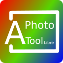 | [***aphototoollibre***](apps/aphototoollibre.md) | *Photo editing app for GNU/Linux.*..[ *read more* ](apps/aphototoollibre.md)*!* | [*blob*](https://github.com/ivan-hc/AM/blob/main/programs/x86_64/aphototoollibre) **/** [*raw*](https://raw.githubusercontent.com/ivan-hc/AM/main/programs/x86_64/aphototoollibre) |
|  | [***aspect***](apps/aspect.md) | *Photo organization application with support for peer-to-peer based synchronization across devices.*..[ *read more* ](apps/aspect.md)*!* | [*blob*](https://github.com/ivan-hc/AM/blob/main/programs/x86_64/aspect) **/** [*raw*](https://raw.githubusercontent.com/ivan-hc/AM/main/programs/x86_64/aspect) |
|  | [***bforartists***](apps/bforartists.md) | *3D modeling, animation, rendering and post-production.*..[ *read more* ](apps/bforartists.md)*!* | [*blob*](https://github.com/ivan-hc/AM/blob/main/programs/x86_64/bforartists) **/** [*raw*](https://raw.githubusercontent.com/ivan-hc/AM/main/programs/x86_64/bforartists) |
|  | [***biying***](apps/biying.md) | *Biying Wallpaper for Linux.*..[ *read more* ](apps/biying.md)*!* | [*blob*](https://github.com/ivan-hc/AM/blob/main/programs/x86_64/biying) **/** [*raw*](https://raw.githubusercontent.com/ivan-hc/AM/main/programs/x86_64/biying) |
|  | [***blender***](apps/blender.md) | *Very fast and versatile 3D modeller/renderer, Stable.*..[ *read more* ](apps/blender.md)*!* | [*blob*](https://github.com/ivan-hc/AM/blob/main/programs/x86_64/blender) **/** [*raw*](https://raw.githubusercontent.com/ivan-hc/AM/main/programs/x86_64/blender) |
|  | [***blender-alpha***](apps/blender-alpha.md) | *Very fast and versatile 3D modeller/renderer, Alpha.*..[ *read more* ](apps/blender-alpha.md)*!* | [*blob*](https://github.com/ivan-hc/AM/blob/main/programs/x86_64/blender-alpha) **/** [*raw*](https://raw.githubusercontent.com/ivan-hc/AM/main/programs/x86_64/blender-alpha) |
|  | [***blender-beta***](apps/blender-beta.md) | *Very fast and versatile 3D modeller/renderer, Beta.*..[ *read more* ](apps/blender-beta.md)*!* | [*blob*](https://github.com/ivan-hc/AM/blob/main/programs/x86_64/blender-beta) **/** [*raw*](https://raw.githubusercontent.com/ivan-hc/AM/main/programs/x86_64/blender-beta) |
|  | [***blender-rc***](apps/blender-rc.md) | *Very fast and versatile 3D modeller/renderer, Release Candidate.*..[ *read more* ](apps/blender-rc.md)*!* | [*blob*](https://github.com/ivan-hc/AM/blob/main/programs/x86_64/blender-rc) **/** [*raw*](https://raw.githubusercontent.com/ivan-hc/AM/main/programs/x86_64/blender-rc) |
|  | [***blensor***](apps/blensor.md) | *3D modeling, animation, rendering and post-production.*..[ *read more* ](apps/blensor.md)*!* | [*blob*](https://github.com/ivan-hc/AM/blob/main/programs/x86_64/blensor) **/** [*raw*](https://raw.githubusercontent.com/ivan-hc/AM/main/programs/x86_64/blensor) |
|  | [***blockbench***](apps/blockbench.md) | *Editor for boxy models and pixel art textures like Minecraft.*..[ *read more* ](apps/blockbench.md)*!* | [*blob*](https://github.com/ivan-hc/AM/blob/main/programs/x86_64/blockbench) **/** [*raw*](https://raw.githubusercontent.com/ivan-hc/AM/main/programs/x86_64/blockbench) |
|  | [***caesium***](apps/caesium.md) | *Image compression software that helps you store, send and share digital pictures, supporting JPG, PNG, WebP and TIFF formats.*..[ *read more* ](apps/caesium.md)*!* | [*blob*](https://github.com/ivan-hc/AM/blob/main/programs/x86_64/caesium) **/** [*raw*](https://raw.githubusercontent.com/ivan-hc/AM/main/programs/x86_64/caesium) |
|  | [***chemcanvas***](apps/chemcanvas.md) | *A very intuitive 2D chemical drawing tool.*..[ *read more* ](apps/chemcanvas.md)*!* | [*blob*](https://github.com/ivan-hc/AM/blob/main/programs/x86_64/chemcanvas) **/** [*raw*](https://raw.githubusercontent.com/ivan-hc/AM/main/programs/x86_64/chemcanvas) |
|  | [***cinelerra***](apps/cinelerra.md) | *CINELERRA-GG is a software program NLE, Non-Linear Editor, that provides a way to edit, record, and play audio or video media. It can also be used to transcode media from one format to another or to correct and retouch photos.*..[ *read more* ](apps/cinelerra.md)*!* | [*blob*](https://github.com/ivan-hc/AM/blob/main/programs/x86_64/cinelerra) **/** [*raw*](https://raw.githubusercontent.com/ivan-hc/AM/main/programs/x86_64/cinelerra) |
|  | [***converseen***](apps/converseen.md) | *A batch image converter and resizer.*..[ *read more* ](apps/converseen.md)*!* | [*blob*](https://github.com/ivan-hc/AM/blob/main/programs/x86_64/converseen) **/** [*raw*](https://raw.githubusercontent.com/ivan-hc/AM/main/programs/x86_64/converseen) |
|  | [***corepaint***](apps/corepaint.md) | *A paint app for CuboCore Application Suite.*..[ *read more* ](apps/corepaint.md)*!* | [*blob*](https://github.com/ivan-hc/AM/blob/main/programs/x86_64/corepaint) **/** [*raw*](https://raw.githubusercontent.com/ivan-hc/AM/main/programs/x86_64/corepaint) |
| 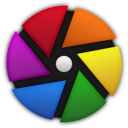 | [***darktable***](apps/darktable.md) | *Photography workflow app and raw developer.*..[ *read more* ](apps/darktable.md)*!* | [*blob*](https://github.com/ivan-hc/AM/blob/main/programs/x86_64/darktable) **/** [*raw*](https://raw.githubusercontent.com/ivan-hc/AM/main/programs/x86_64/darktable) |
|  | [***darktable-nightly***](apps/darktable-nightly.md) | *Photography workflow application and raw developer (nightly).*..[ *read more* ](apps/darktable-nightly.md)*!* | [*blob*](https://github.com/ivan-hc/AM/blob/main/programs/x86_64/darktable-nightly) **/** [*raw*](https://raw.githubusercontent.com/ivan-hc/AM/main/programs/x86_64/darktable-nightly) |
|  | [***digikam***](apps/digikam.md) | *Professional and advanced digital photo management application.*..[ *read more* ](apps/digikam.md)*!* | [*blob*](https://github.com/ivan-hc/AM/blob/main/programs/x86_64/digikam) **/** [*raw*](https://raw.githubusercontent.com/ivan-hc/AM/main/programs/x86_64/digikam) |
| 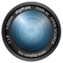 | [***digikam-dev***](apps/digikam-dev.md) | *Professional and advanced digital photo management application.*..[ *read more* ](apps/digikam-dev.md)*!* | [*blob*](https://github.com/ivan-hc/AM/blob/main/programs/x86_64/digikam-dev) **/** [*raw*](https://raw.githubusercontent.com/ivan-hc/AM/main/programs/x86_64/digikam-dev) |
|  | [***dotto***](apps/dotto.md) | *A portable and modern pixelart editor, written from scratch.*..[ *read more* ](apps/dotto.md)*!* | [*blob*](https://github.com/ivan-hc/AM/blob/main/programs/x86_64/dotto) **/** [*raw*](https://raw.githubusercontent.com/ivan-hc/AM/main/programs/x86_64/dotto) |
| 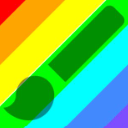 | [***drawish***](apps/drawish.md) | *Simple, yet complete drawing program.*..[ *read more* ](apps/drawish.md)*!* | [*blob*](https://github.com/ivan-hc/AM/blob/main/programs/x86_64/drawish) **/** [*raw*](https://raw.githubusercontent.com/ivan-hc/AM/main/programs/x86_64/drawish) |
|  | [***drawpile***](apps/drawpile.md) | *Drawing program to sketch on the same canvas simultaneously.*..[ *read more* ](apps/drawpile.md)*!* | [*blob*](https://github.com/ivan-hc/AM/blob/main/programs/x86_64/drawpile) **/** [*raw*](https://raw.githubusercontent.com/ivan-hc/AM/main/programs/x86_64/drawpile) |
|  | [***duplicate-image-finder***](apps/duplicate-image-finder.md) | *It is an application that can find duplicated images (jpg, png, bitmap, etc) in a collection.*..[ *read more* ](apps/duplicate-image-finder.md)*!* | [*blob*](https://github.com/ivan-hc/AM/blob/main/programs/x86_64/duplicate-image-finder) **/** [*raw*](https://raw.githubusercontent.com/ivan-hc/AM/main/programs/x86_64/duplicate-image-finder) |
|  | [***dust3d***](apps/dust3d.md) | *3D modeling software for games, 3D printing, and so on.*..[ *read more* ](apps/dust3d.md)*!* | [*blob*](https://github.com/ivan-hc/AM/blob/main/programs/x86_64/dust3d) **/** [*raw*](https://raw.githubusercontent.com/ivan-hc/AM/main/programs/x86_64/dust3d) |
|  | [***ente-auth***](apps/ente-auth.md) | *Fully open source, End to End Encrypted alternative to Google Photos and Apple Photos.*..[ *read more* ](apps/ente-auth.md)*!* | [*blob*](https://github.com/ivan-hc/AM/blob/main/programs/x86_64/ente-auth) **/** [*raw*](https://raw.githubusercontent.com/ivan-hc/AM/main/programs/x86_64/ente-auth) |
|  | [***ente-photos***](apps/ente-photos.md) | *Binary releases of the Ente Photos desktop app.*..[ *read more* ](apps/ente-photos.md)*!* | [*blob*](https://github.com/ivan-hc/AM/blob/main/programs/x86_64/ente-photos) **/** [*raw*](https://raw.githubusercontent.com/ivan-hc/AM/main/programs/x86_64/ente-photos) |
|  | [***fantascene-dynamic-wallpaper***](apps/fantascene-dynamic-wallpaper.md) | *Dynamic wallpaper software for Linux.*..[ *read more* ](apps/fantascene-dynamic-wallpaper.md)*!* | [*blob*](https://github.com/ivan-hc/AM/blob/main/programs/x86_64/fantascene-dynamic-wallpaper) **/** [*raw*](https://raw.githubusercontent.com/ivan-hc/AM/main/programs/x86_64/fantascene-dynamic-wallpaper) |
|  | [***firealpaca***](apps/firealpaca.md) | *A Free and Multiplatform Digital Painting Software.*..[ *read more* ](apps/firealpaca.md)*!* | [*blob*](https://github.com/ivan-hc/AM/blob/main/programs/x86_64/firealpaca) **/** [*raw*](https://raw.githubusercontent.com/ivan-hc/AM/main/programs/x86_64/firealpaca) |
|  | [***freecad***](apps/freecad.md) | *Free and open source AutoCAD alternative.*..[ *read more* ](apps/freecad.md)*!* | [*blob*](https://github.com/ivan-hc/AM/blob/main/programs/x86_64/freecad) **/** [*raw*](https://raw.githubusercontent.com/ivan-hc/AM/main/programs/x86_64/freecad) |
|  | [***geeqie***](apps/geeqie.md) | *Claiming to be the best image viewer and photo collection browser.*..[ *read more* ](apps/geeqie.md)*!* | [*blob*](https://github.com/ivan-hc/AM/blob/main/programs/x86_64/geeqie) **/** [*raw*](https://raw.githubusercontent.com/ivan-hc/AM/main/programs/x86_64/geeqie) |
|  | [***gimp***](apps/gimp.md) | *GNU Image Manipulation Program, cross-platform image and photo editor. Multiple-choices.*..[ *read more* ](apps/gimp.md)*!* | [*blob*](https://github.com/ivan-hc/AM/blob/main/programs/x86_64/gimp) **/** [*raw*](https://raw.githubusercontent.com/ivan-hc/AM/main/programs/x86_64/gimp) |
|  | [***gimp-git***](apps/gimp-git.md) | *Unofficial, Cross-platform image and photo editor, built from GIT.*..[ *read more* ](apps/gimp-git.md)*!* | [*blob*](https://github.com/ivan-hc/AM/blob/main/programs/x86_64/gimp-git) **/** [*raw*](https://raw.githubusercontent.com/ivan-hc/AM/main/programs/x86_64/gimp-git) |
|  | [***gimp-hybrid***](apps/gimp-hybrid.md) | *Unofficial, GIMP including third-party plugins and python2 support.*..[ *read more* ](apps/gimp-hybrid.md)*!* | [*blob*](https://github.com/ivan-hc/AM/blob/main/programs/x86_64/gimp-hybrid) **/** [*raw*](https://raw.githubusercontent.com/ivan-hc/AM/main/programs/x86_64/gimp-hybrid) |
|  | [***go-pd***](apps/go-pd.md) | *A free easy to use pixeldrain.com go client pkg and CLI upload tool.*..[ *read more* ](apps/go-pd.md)*!* | [*blob*](https://github.com/ivan-hc/AM/blob/main/programs/x86_64/go-pd) **/** [*raw*](https://raw.githubusercontent.com/ivan-hc/AM/main/programs/x86_64/go-pd) |
| 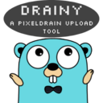 | [***go-pd-gui***](apps/go-pd-gui.md) | *DRAINY is a free easy to use cross plattform upload tool for pixeldrain.com.*..[ *read more* ](apps/go-pd-gui.md)*!* | [*blob*](https://github.com/ivan-hc/AM/blob/main/programs/x86_64/go-pd-gui) **/** [*raw*](https://raw.githubusercontent.com/ivan-hc/AM/main/programs/x86_64/go-pd-gui) |
|  | [***hugin***](apps/hugin.md) | *Stitch photographs together.*..[ *read more* ](apps/hugin.md)*!* | [*blob*](https://github.com/ivan-hc/AM/blob/main/programs/x86_64/hugin) **/** [*raw*](https://raw.githubusercontent.com/ivan-hc/AM/main/programs/x86_64/hugin) |
|  | [***imagemagick-clang***](apps/imagemagick-clang.md) | *CLI to create, edit, compose, or convert digital images.*..[ *read more* ](apps/imagemagick-clang.md)*!* | [*blob*](https://github.com/ivan-hc/AM/blob/main/programs/x86_64/imagemagick-clang) **/** [*raw*](https://raw.githubusercontent.com/ivan-hc/AM/main/programs/x86_64/imagemagick-clang) |
|  | [***imagemagick-gcc***](apps/imagemagick-gcc.md) | *CLI to create, edit, compose, or convert digital images.*..[ *read more* ](apps/imagemagick-gcc.md)*!* | [*blob*](https://github.com/ivan-hc/AM/blob/main/programs/x86_64/imagemagick-gcc) **/** [*raw*](https://raw.githubusercontent.com/ivan-hc/AM/main/programs/x86_64/imagemagick-gcc) |
|  | [***imagine***](apps/imagine.md) | *PNG/JPEG optimization.*..[ *read more* ](apps/imagine.md)*!* | [*blob*](https://github.com/ivan-hc/AM/blob/main/programs/x86_64/imagine) **/** [*raw*](https://raw.githubusercontent.com/ivan-hc/AM/main/programs/x86_64/imagine) |
|  | [***inkscape***](apps/inkscape.md) | *Unofficial. Vector-based drawing program and graphics editor for both artistic and technical illustrations. It can import and export various file formats, including SVG, AI, EPS, PDF, AutoCAD, PS and PNG.*..[ *read more* ](apps/inkscape.md)*!* | [*blob*](https://github.com/ivan-hc/AM/blob/main/programs/x86_64/inkscape) **/** [*raw*](https://raw.githubusercontent.com/ivan-hc/AM/main/programs/x86_64/inkscape) |
|  | [***jpg-glitch-electron***](apps/jpg-glitch-electron.md) | *Desktop app for glitching images.*..[ *read more* ](apps/jpg-glitch-electron.md)*!* | [*blob*](https://github.com/ivan-hc/AM/blob/main/programs/x86_64/jpg-glitch-electron) **/** [*raw*](https://raw.githubusercontent.com/ivan-hc/AM/main/programs/x86_64/jpg-glitch-electron) |
| 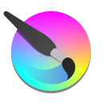 | [***krita***](apps/krita.md) | *A professional FREE and open source painting program, graphics.*..[ *read more* ](apps/krita.md)*!* | [*blob*](https://github.com/ivan-hc/AM/blob/main/programs/x86_64/krita) **/** [*raw*](https://raw.githubusercontent.com/ivan-hc/AM/main/programs/x86_64/krita) |
|  | [***krita-devel***](apps/krita-devel.md) | *A professional FREE open source painting program, dev-edition.*..[ *read more* ](apps/krita-devel.md)*!* | [*blob*](https://github.com/ivan-hc/AM/blob/main/programs/x86_64/krita-devel) **/** [*raw*](https://raw.githubusercontent.com/ivan-hc/AM/main/programs/x86_64/krita-devel) |
|  | [***krunker***](apps/krunker.md) | *Krunker (.io) is a fast-paced first-person shooter game with pixel graphics.*..[ *read more* ](apps/krunker.md)*!* | [*blob*](https://github.com/ivan-hc/AM/blob/main/programs/x86_64/krunker) **/** [*raw*](https://raw.githubusercontent.com/ivan-hc/AM/main/programs/x86_64/krunker) |
|  | [***lazpaint***](apps/lazpaint.md) | *Cross-platform image editor with raster and vector layers similar to Paint.Net written in Lazarus (Free Pascal).*..[ *read more* ](apps/lazpaint.md)*!* | [*blob*](https://github.com/ivan-hc/AM/blob/main/programs/x86_64/lazpaint) **/** [*raw*](https://raw.githubusercontent.com/ivan-hc/AM/main/programs/x86_64/lazpaint) |
| 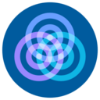 | [***libertem***](apps/libertem.md) | *Pixelated scanning transmission electron microscopy.*..[ *read more* ](apps/libertem.md)*!* | [*blob*](https://github.com/ivan-hc/AM/blob/main/programs/x86_64/libertem) **/** [*raw*](https://raw.githubusercontent.com/ivan-hc/AM/main/programs/x86_64/libertem) |
|  | [***libresprite***](apps/libresprite.md) | *Animated sprite editor & pixel art tool. Fork of the last GPLv2 commit of Aseprite.*..[ *read more* ](apps/libresprite.md)*!* | [*blob*](https://github.com/ivan-hc/AM/blob/main/programs/x86_64/libresprite) **/** [*raw*](https://raw.githubusercontent.com/ivan-hc/AM/main/programs/x86_64/libresprite) |
|  | [***linuxwallpaper***](apps/linuxwallpaper.md) | *Bing wallpaper of the day.*..[ *read more* ](apps/linuxwallpaper.md)*!* | [*blob*](https://github.com/ivan-hc/AM/blob/main/programs/x86_64/linuxwallpaper) **/** [*raw*](https://raw.githubusercontent.com/ivan-hc/AM/main/programs/x86_64/linuxwallpaper) |
|  | [***lorien***](apps/lorien.md) | *Infinite canvas drawing/whiteboarding app.*..[ *read more* ](apps/lorien.md)*!* | [*blob*](https://github.com/ivan-hc/AM/blob/main/programs/x86_64/lorien) **/** [*raw*](https://raw.githubusercontent.com/ivan-hc/AM/main/programs/x86_64/lorien) |
|  | [***mapollage***](apps/mapollage.md) | *Photo kml generator for Google Earth.*..[ *read more* ](apps/mapollage.md)*!* | [*blob*](https://github.com/ivan-hc/AM/blob/main/programs/x86_64/mapollage) **/** [*raw*](https://raw.githubusercontent.com/ivan-hc/AM/main/programs/x86_64/mapollage) |
|  | [***miesimulatorgui***](apps/miesimulatorgui.md) | *MieSimulatorGUI by Virtual Photonics.*..[ *read more* ](apps/miesimulatorgui.md)*!* | [*blob*](https://github.com/ivan-hc/AM/blob/main/programs/x86_64/miesimulatorgui) **/** [*raw*](https://raw.githubusercontent.com/ivan-hc/AM/main/programs/x86_64/miesimulatorgui) |
| 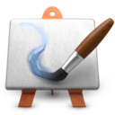 | [***mypaint***](apps/mypaint.md) | *Simple drawing and painting program, graphics.*..[ *read more* ](apps/mypaint.md)*!* | [*blob*](https://github.com/ivan-hc/AM/blob/main/programs/x86_64/mypaint) **/** [*raw*](https://raw.githubusercontent.com/ivan-hc/AM/main/programs/x86_64/mypaint) |
|  | [***optiimage***](apps/optiimage.md) | *Unofficial, optimize your images with OptiImage, a useful image compressor that supports PNG, JPEG, WebP and SVG file types.*..[ *read more* ](apps/optiimage.md)*!* | [*blob*](https://github.com/ivan-hc/AM/blob/main/programs/x86_64/optiimage) **/** [*raw*](https://raw.githubusercontent.com/ivan-hc/AM/main/programs/x86_64/optiimage) |
|  | [***paper***](apps/paper.md) | *A CLI Tool to set a random wallpaper from Unsplash.com.*..[ *read more* ](apps/paper.md)*!* | [*blob*](https://github.com/ivan-hc/AM/blob/main/programs/x86_64/paper) **/** [*raw*](https://raw.githubusercontent.com/ivan-hc/AM/main/programs/x86_64/paper) |
| 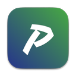 | [***pavo***](apps/pavo.md) | *A mini desktop wallpaper application.*..[ *read more* ](apps/pavo.md)*!* | [*blob*](https://github.com/ivan-hc/AM/blob/main/programs/x86_64/pavo) **/** [*raw*](https://raw.githubusercontent.com/ivan-hc/AM/main/programs/x86_64/pavo) |
|  | [***photocrea***](apps/photocrea.md) | *Unofficial Photopea wrapper, image editor that includes all the familiar features like layers, filters, magic wand selection, etc.*..[ *read more* ](apps/photocrea.md)*!* | [*blob*](https://github.com/ivan-hc/AM/blob/main/programs/x86_64/photocrea) **/** [*raw*](https://raw.githubusercontent.com/ivan-hc/AM/main/programs/x86_64/photocrea) |
|  | [***photoflare***](apps/photoflare.md) | *A simple but featureful image editor.*..[ *read more* ](apps/photoflare.md)*!* | [*blob*](https://github.com/ivan-hc/AM/blob/main/programs/x86_64/photoflare) **/** [*raw*](https://raw.githubusercontent.com/ivan-hc/AM/main/programs/x86_64/photoflare) |
| 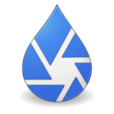 | [***photoflow***](apps/photoflow.md) | *Edit images from digital cameras.*..[ *read more* ](apps/photoflow.md)*!* | [*blob*](https://github.com/ivan-hc/AM/blob/main/programs/x86_64/photoflow) **/** [*raw*](https://raw.githubusercontent.com/ivan-hc/AM/main/programs/x86_64/photoflow) |
|  | [***photogimp***](apps/photogimp.md) | *A patched version of GIMP for Adobe Photoshop users.*..[ *read more* ](apps/photogimp.md)*!* | [*blob*](https://github.com/ivan-hc/AM/blob/main/programs/x86_64/photogimp) **/** [*raw*](https://raw.githubusercontent.com/ivan-hc/AM/main/programs/x86_64/photogimp) |
|  | [***photon***](apps/photon.md) | *Cross-platform file-transfer application built using flutter. It uses http to transfer files between devices.*..[ *read more* ](apps/photon.md)*!* | [*blob*](https://github.com/ivan-hc/AM/blob/main/programs/x86_64/photon) **/** [*raw*](https://raw.githubusercontent.com/ivan-hc/AM/main/programs/x86_64/photon) |
|  | [***photoname***](apps/photoname.md) | *Rename photo image files based on EXIF shoot date.*..[ *read more* ](apps/photoname.md)*!* | [*blob*](https://github.com/ivan-hc/AM/blob/main/programs/x86_64/photoname) **/** [*raw*](https://raw.githubusercontent.com/ivan-hc/AM/main/programs/x86_64/photoname) |
|  | [***photopealoader***](apps/photopealoader.md) | *Photopea desktop app that loads local files and plugins.*..[ *read more* ](apps/photopealoader.md)*!* | [*blob*](https://github.com/ivan-hc/AM/blob/main/programs/x86_64/photopealoader) **/** [*raw*](https://raw.githubusercontent.com/ivan-hc/AM/main/programs/x86_64/photopealoader) |
|  | [***photoqt***](apps/photoqt.md) | *View and manage images.*..[ *read more* ](apps/photoqt.md)*!* | [*blob*](https://github.com/ivan-hc/AM/blob/main/programs/x86_64/photoqt) **/** [*raw*](https://raw.githubusercontent.com/ivan-hc/AM/main/programs/x86_64/photoqt) |
| 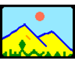 | [***photoquick***](apps/photoquick.md) | *Light-weight image viewer, resize, collage, filters....*..[ *read more* ](apps/photoquick.md)*!* | [*blob*](https://github.com/ivan-hc/AM/blob/main/programs/x86_64/photoquick) **/** [*raw*](https://raw.githubusercontent.com/ivan-hc/AM/main/programs/x86_64/photoquick) |
|  | [***pinta***](apps/pinta.md) | *Unofficial, Simple GTK Paint Program clone of Paint.Net 3.0.*..[ *read more* ](apps/pinta.md)*!* | [*blob*](https://github.com/ivan-hc/AM/blob/main/programs/x86_64/pinta) **/** [*raw*](https://raw.githubusercontent.com/ivan-hc/AM/main/programs/x86_64/pinta) |
|  | [***pinta-dev***](apps/pinta-dev.md) | *Simple GTK Paint Program (developer edition).*..[ *read more* ](apps/pinta-dev.md)*!* | [*blob*](https://github.com/ivan-hc/AM/blob/main/programs/x86_64/pinta-dev) **/** [*raw*](https://raw.githubusercontent.com/ivan-hc/AM/main/programs/x86_64/pinta-dev) |
|  | [***pixelhopper***](apps/pixelhopper.md) | *Animated GIF player for Linux (X11).*..[ *read more* ](apps/pixelhopper.md)*!* | [*blob*](https://github.com/ivan-hc/AM/blob/main/programs/x86_64/pixelhopper) **/** [*raw*](https://raw.githubusercontent.com/ivan-hc/AM/main/programs/x86_64/pixelhopper) |
| 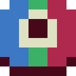 | [***pixelorama***](apps/pixelorama.md) | *A powerful and accessible open-source pixel art multitool. Whether you want to create sprites, tiles, animations, or just express yourself in the language of pixel art.*..[ *read more* ](apps/pixelorama.md)*!* | [*blob*](https://github.com/ivan-hc/AM/blob/main/programs/x86_64/pixelorama) **/** [*raw*](https://raw.githubusercontent.com/ivan-hc/AM/main/programs/x86_64/pixelorama) |
|  | [***pixfetch***](apps/pixfetch.md) | *Another CLI fetch program with pixelized images written in Rust.*..[ *read more* ](apps/pixfetch.md)*!* | [*blob*](https://github.com/ivan-hc/AM/blob/main/programs/x86_64/pixfetch) **/** [*raw*](https://raw.githubusercontent.com/ivan-hc/AM/main/programs/x86_64/pixfetch) |
|  | [***pixsrt***](apps/pixsrt.md) | *Pixel sorter.*..[ *read more* ](apps/pixsrt.md)*!* | [*blob*](https://github.com/ivan-hc/AM/blob/main/programs/x86_64/pixsrt) **/** [*raw*](https://raw.githubusercontent.com/ivan-hc/AM/main/programs/x86_64/pixsrt) |
|  | [***png2svg***](apps/png2svg.md) | *CLI, convert small PNG images to SVG Tiny 1.2.*..[ *read more* ](apps/png2svg.md)*!* | [*blob*](https://github.com/ivan-hc/AM/blob/main/programs/x86_64/png2svg) **/** [*raw*](https://raw.githubusercontent.com/ivan-hc/AM/main/programs/x86_64/png2svg) |
|  | [***pointless***](apps/pointless.md) | *An endless drawing canvas desktop app made with Tauri (Rust) and React.*..[ *read more* ](apps/pointless.md)*!* | [*blob*](https://github.com/ivan-hc/AM/blob/main/programs/x86_64/pointless) **/** [*raw*](https://raw.githubusercontent.com/ivan-hc/AM/main/programs/x86_64/pointless) |
|  | [***qr-code-generator***](apps/qr-code-generator.md) | *Create custom QR Codes, resize, save them as PNG image.*..[ *read more* ](apps/qr-code-generator.md)*!* | [*blob*](https://github.com/ivan-hc/AM/blob/main/programs/x86_64/qr-code-generator) **/** [*raw*](https://raw.githubusercontent.com/ivan-hc/AM/main/programs/x86_64/qr-code-generator) |
|  | [***rawtherapee***](apps/rawtherapee.md) | *An advanced raw photo development program.*..[ *read more* ](apps/rawtherapee.md)*!* | [*blob*](https://github.com/ivan-hc/AM/blob/main/programs/x86_64/rawtherapee) **/** [*raw*](https://raw.githubusercontent.com/ivan-hc/AM/main/programs/x86_64/rawtherapee) |
| 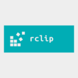 | [***rclip***](apps/rclip.md) | *AI-Powered Semantic Photo Search for the Command Line.*..[ *read more* ](apps/rclip.md)*!* | [*blob*](https://github.com/ivan-hc/AM/blob/main/programs/x86_64/rclip) **/** [*raw*](https://raw.githubusercontent.com/ivan-hc/AM/main/programs/x86_64/rclip) |
|  | [***rnote***](apps/rnote.md) | *Unofficial, Rnote is a vector-based drawing app for sketching, handwritten notes and to annotate documents and pictures.*..[ *read more* ](apps/rnote.md)*!* | [*blob*](https://github.com/ivan-hc/AM/blob/main/programs/x86_64/rnote) **/** [*raw*](https://raw.githubusercontent.com/ivan-hc/AM/main/programs/x86_64/rnote) |
| 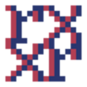 | [***rx-bin***](apps/rx-bin.md) | *A modern and extensible pixel editor implemented in Rust.*..[ *read more* ](apps/rx-bin.md)*!* | [*blob*](https://github.com/ivan-hc/AM/blob/main/programs/x86_64/rx-bin) **/** [*raw*](https://raw.githubusercontent.com/ivan-hc/AM/main/programs/x86_64/rx-bin) |
|  | [***shotwell***](apps/shotwell.md) | *Unofficial, a digital photo organizer designed for the GNOME desktop environment.*..[ *read more* ](apps/shotwell.md)*!* | [*blob*](https://github.com/ivan-hc/AM/blob/main/programs/x86_64/shotwell) **/** [*raw*](https://raw.githubusercontent.com/ivan-hc/AM/main/programs/x86_64/shotwell) |
|  | [***simple-scan***](apps/simple-scan.md) | *Make a digital copy of your photos and documents. Simple scanning utility for the GNOME desktop environment.*..[ *read more* ](apps/simple-scan.md)*!* | [*blob*](https://github.com/ivan-hc/AM/blob/main/programs/x86_64/simple-scan) **/** [*raw*](https://raw.githubusercontent.com/ivan-hc/AM/main/programs/x86_64/simple-scan) |
|  | [***superpaper***](apps/superpaper.md) | *A cross-platform multi monitor wallpaper manager.*..[ *read more* ](apps/superpaper.md)*!* | [*blob*](https://github.com/ivan-hc/AM/blob/main/programs/x86_64/superpaper) **/** [*raw*](https://raw.githubusercontent.com/ivan-hc/AM/main/programs/x86_64/superpaper) |
|  | [***svgwall***](apps/svgwall.md) | *SVG Wallpaper Utility for Xorg.*..[ *read more* ](apps/svgwall.md)*!* | [*blob*](https://github.com/ivan-hc/AM/blob/main/programs/x86_64/svgwall) **/** [*raw*](https://raw.githubusercontent.com/ivan-hc/AM/main/programs/x86_64/svgwall) |
|  | [***terabox***](apps/terabox.md) | *Terabox is the simplest way to send your files around the world. Back up and Share photos, videos, docs, and other files of any size to cloud storage.*..[ *read more* ](apps/terabox.md)*!* | [*blob*](https://github.com/ivan-hc/AM/blob/main/programs/x86_64/terabox) **/** [*raw*](https://raw.githubusercontent.com/ivan-hc/AM/main/programs/x86_64/terabox) |
|  | [***testdisk***](apps/testdisk.md) | *TestDisk & PhotoRec, tools to recover lost partitions and files.*..[ *read more* ](apps/testdisk.md)*!* | [*blob*](https://github.com/ivan-hc/AM/blob/main/programs/x86_64/testdisk) **/** [*raw*](https://raw.githubusercontent.com/ivan-hc/AM/main/programs/x86_64/testdisk) |
|  | [***tokodon***](apps/tokodon.md) | *Unofficial, a modern client for Mastodon and other decentralized servers that implement its API (such as Pixelfed).*..[ *read more* ](apps/tokodon.md)*!* | [*blob*](https://github.com/ivan-hc/AM/blob/main/programs/x86_64/tokodon) **/** [*raw*](https://raw.githubusercontent.com/ivan-hc/AM/main/programs/x86_64/tokodon) |
|  | [***tropy***](apps/tropy.md) | *Research photo management.*..[ *read more* ](apps/tropy.md)*!* | [*blob*](https://github.com/ivan-hc/AM/blob/main/programs/x86_64/tropy) **/** [*raw*](https://raw.githubusercontent.com/ivan-hc/AM/main/programs/x86_64/tropy) |
|  | [***visipics***](apps/visipics.md) | *Windows software to find and remove duplicate pictures. Unofficial AppImage built using "wine32-deploy" and powered by "wine".*..[ *read more* ](apps/visipics.md)*!* | [*blob*](https://github.com/ivan-hc/AM/blob/main/programs/x86_64/visipics) **/** [*raw*](https://raw.githubusercontent.com/ivan-hc/AM/main/programs/x86_64/visipics) |
|  | [***vkdt***](apps/vkdt.md) | *Raw photography workflow that sucks less, enabling real-time support for animations, timelapses, raw video, and heavy lifting algorithms like image alignment and better highlight inpainting.*..[ *read more* ](apps/vkdt.md)*!* | [*blob*](https://github.com/ivan-hc/AM/blob/main/programs/x86_64/vkdt) **/** [*raw*](https://raw.githubusercontent.com/ivan-hc/AM/main/programs/x86_64/vkdt) |
|  | [***vpaint***](apps/vpaint.md) | *Experimental vector graphics and 2D animation editor.*..[ *read more* ](apps/vpaint.md)*!* | [*blob*](https://github.com/ivan-hc/AM/blob/main/programs/x86_64/vpaint) **/** [*raw*](https://raw.githubusercontent.com/ivan-hc/AM/main/programs/x86_64/vpaint) |
|  | [***wonderwall***](apps/wonderwall.md) | *Wallpaper manager for Linux.*..[ *read more* ](apps/wonderwall.md)*!* | [*blob*](https://github.com/ivan-hc/AM/blob/main/programs/x86_64/wonderwall) **/** [*raw*](https://raw.githubusercontent.com/ivan-hc/AM/main/programs/x86_64/wonderwall) |

---

You can improve these pages via a [pull request](https://github.com/Portable-Linux-Apps/Portable-Linux-Apps.github.io/pulls) to this site's [GitHub repository](https://github.com/Portable-Linux-Apps/Portable-Linux-Apps.github.io), or report any problems related to the installation scripts in the '[issue](https://github.com/ivan-hc/AM/issues)' section of the main database, at [https://github.com/ivan-hc/AM](https://github.com/ivan-hc/AM).

***PORTABLE-LINUX-APPS.github.io is my gift to the Linux community and was made with love for GNU/Linux and the Open Source philosophy.***

---

| [Back to Home](index.md) | [Back to Applications](apps.md)
| --- | --- |

--------

# Contacts
- **Ivan-HC** *on* [**GitHub**](https://github.com/ivan-hc)
- **AM-Ivan** *on* [**Reddit**](https://www.reddit.com/u/am-ivan)

###### *You can support me and my work on [**ko-fi.com**](https://ko-fi.com/IvanAlexHC) and [**PayPal.me**](https://paypal.me/IvanAlexHC). Thank you!*

--------

*© 2020-present Ivan Alessandro Sala aka 'Ivan-HC'* - I'm here just for fun!

