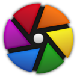

# GRAPHIC

| [Home](https://portable-linux-apps.github.io/) |
| --- |

#### Here are listed **82** applications for this category and managed by [AM](https://github.com/ivan-hc/AM) and [AppMan](https://github.com/ivan-hc/AppMan) for the x86_64 architecture.

*Use your browser's built-in search tool to easily navigate to this page.*

---

| [Back to Applications](https://portable-linux-apps.github.io/apps.html) |
| --- |

--------

| ICON | PACKAGE NAME | DESCRIPTION | INSTALLER |
| --- | --- | --- | --- |
|  | [***aphototoollibre***](apps/aphototoollibre.md) | *Photo editing app for GNU/Linux.*..[ *read more* ](apps/aphototoollibre.md)*!* | [*blob*](https://github.com/ivan-hc/AM/blob/main/programs/x86_64/aphototoollibre) **/** [*raw*](https://raw.githubusercontent.com/ivan-hc/AM/main/programs/x86_64/aphototoollibre) |
|  | [***appium-desktop***](apps/appium-desktop.md) | *Graphical interface for the Appium server.*..[ *read more* ](apps/appium-desktop.md)*!* | [*blob*](https://github.com/ivan-hc/AM/blob/main/programs/x86_64/appium-desktop) **/** [*raw*](https://raw.githubusercontent.com/ivan-hc/AM/main/programs/x86_64/appium-desktop) |
|  | [***astrofox***](apps/astrofox.md) | *Audio reactive motion graphics program.*..[ *read more* ](apps/astrofox.md)*!* | [*blob*](https://github.com/ivan-hc/AM/blob/main/programs/x86_64/astrofox) **/** [*raw*](https://raw.githubusercontent.com/ivan-hc/AM/main/programs/x86_64/astrofox) |
|  | [***astroshutter***](apps/astroshutter.md) | *Ui to control your camera for astrophotography.*..[ *read more* ](apps/astroshutter.md)*!* | [*blob*](https://github.com/ivan-hc/AM/blob/main/programs/x86_64/astroshutter) **/** [*raw*](https://raw.githubusercontent.com/ivan-hc/AM/main/programs/x86_64/astroshutter) |
|  | [***bazecor***](apps/bazecor.md) | *Graphical configurator for Dygma Raise.*..[ *read more* ](apps/bazecor.md)*!* | [*blob*](https://github.com/ivan-hc/AM/blob/main/programs/x86_64/bazecor) **/** [*raw*](https://raw.githubusercontent.com/ivan-hc/AM/main/programs/x86_64/bazecor) |
|  | [***bforartists***](apps/bforartists.md) | *3D modeling, animation, rendering and post-production.*..[ *read more* ](apps/bforartists.md)*!* | [*blob*](https://github.com/ivan-hc/AM/blob/main/programs/x86_64/bforartists) **/** [*raw*](https://raw.githubusercontent.com/ivan-hc/AM/main/programs/x86_64/bforartists) |
|  | [***blender-alpha***](apps/blender-alpha.md) | *Very fast and versatile 3D modeller/renderer (Alpha).*..[ *read more* ](apps/blender-alpha.md)*!* | [*blob*](https://github.com/ivan-hc/AM/blob/main/programs/x86_64/blender-alpha) **/** [*raw*](https://raw.githubusercontent.com/ivan-hc/AM/main/programs/x86_64/blender-alpha) |
|  | [***blender-beta***](apps/blender-beta.md) | *Very fast and versatile 3D modeller/renderer (Beta).*..[ *read more* ](apps/blender-beta.md)*!* | [*blob*](https://github.com/ivan-hc/AM/blob/main/programs/x86_64/blender-beta) **/** [*raw*](https://raw.githubusercontent.com/ivan-hc/AM/main/programs/x86_64/blender-beta) |
|  | [***blender-rc***](apps/blender-rc.md) | *Very fast and versatile 3D modeller/renderer (Release Candidate).*..[ *read more* ](apps/blender-rc.md)*!* | [*blob*](https://github.com/ivan-hc/AM/blob/main/programs/x86_64/blender-rc) **/** [*raw*](https://raw.githubusercontent.com/ivan-hc/AM/main/programs/x86_64/blender-rc) |
|  | [***blender***](apps/blender.md) | *Very fast and versatile 3D modeller/renderer (Stable).*..[ *read more* ](apps/blender.md)*!* | [*blob*](https://github.com/ivan-hc/AM/blob/main/programs/x86_64/blender) **/** [*raw*](https://raw.githubusercontent.com/ivan-hc/AM/main/programs/x86_64/blender) |
|  | [***blensor***](apps/blensor.md) | *3D modeling, animation, rendering and post-production.*..[ *read more* ](apps/blensor.md)*!* | [*blob*](https://github.com/ivan-hc/AM/blob/main/programs/x86_64/blensor) **/** [*raw*](https://raw.githubusercontent.com/ivan-hc/AM/main/programs/x86_64/blensor) |
|  | [***bottom***](apps/bottom.md) | *Yet another cross-platform graphical process/system monitor.*..[ *read more* ](apps/bottom.md)*!* | [*blob*](https://github.com/ivan-hc/AM/blob/main/programs/x86_64/bottom) **/** [*raw*](https://raw.githubusercontent.com/ivan-hc/AM/main/programs/x86_64/bottom) |
|  | [***chrysalis-bin***](apps/chrysalis-bin.md) | *Graphical configurator for Kaleidoscope-powered keyboards.*..[ *read more* ](apps/chrysalis-bin.md)*!* | [*blob*](https://github.com/ivan-hc/AM/blob/main/programs/x86_64/chrysalis-bin) **/** [*raw*](https://raw.githubusercontent.com/ivan-hc/AM/main/programs/x86_64/chrysalis-bin) |
|  | [***darktable-nightly***](apps/darktable-nightly.md) | *Photography workflow app and raw developer (nightly).*..[ *read more* ](apps/darktable-nightly.md)*!* | [*blob*](https://github.com/ivan-hc/AM/blob/main/programs/x86_64/darktable-nightly) **/** [*raw*](https://raw.githubusercontent.com/ivan-hc/AM/main/programs/x86_64/darktable-nightly) |
|  | [***darktable***](apps/darktable.md) | *Photography workflow app and raw developer.*..[ *read more* ](apps/darktable.md)*!* | [*blob*](https://github.com/ivan-hc/AM/blob/main/programs/x86_64/darktable) **/** [*raw*](https://raw.githubusercontent.com/ivan-hc/AM/main/programs/x86_64/darktable) |
|  | [***destiny***](apps/destiny.md) | *Cross-platform Magic Wormhole graphical client.*..[ *read more* ](apps/destiny.md)*!* | [*blob*](https://github.com/ivan-hc/AM/blob/main/programs/x86_64/destiny) **/** [*raw*](https://raw.githubusercontent.com/ivan-hc/AM/main/programs/x86_64/destiny) |
|  | [***digikam***](apps/digikam.md) | *Professional and advanced digital photo management application.*..[ *read more* ](apps/digikam.md)*!* | [*blob*](https://github.com/ivan-hc/AM/blob/main/programs/x86_64/digikam) **/** [*raw*](https://raw.githubusercontent.com/ivan-hc/AM/main/programs/x86_64/digikam) |
|  | [***dust3d***](apps/dust3d.md) | *3D modeling software for games, 3D printing, and so on.*..[ *read more* ](apps/dust3d.md)*!* | [*blob*](https://github.com/ivan-hc/AM/blob/main/programs/x86_64/dust3d) **/** [*raw*](https://raw.githubusercontent.com/ivan-hc/AM/main/programs/x86_64/dust3d) |
|  | [***esearch***](apps/esearch.md) | *Screenshot OCR search translate search for picture paste...*..[ *read more* ](apps/esearch.md)*!* | [*blob*](https://github.com/ivan-hc/AM/blob/main/programs/x86_64/esearch) **/** [*raw*](https://raw.githubusercontent.com/ivan-hc/AM/main/programs/x86_64/esearch) |
|  | [***evoplex***](apps/evoplex.md) | *Agent-based modeling.*..[ *read more* ](apps/evoplex.md)*!* | [*blob*](https://github.com/ivan-hc/AM/blob/main/programs/x86_64/evoplex) **/** [*raw*](https://raw.githubusercontent.com/ivan-hc/AM/main/programs/x86_64/evoplex) |
|  | [***feebas***](apps/feebas.md) | *Screenshot comparison tool for identifying visual regressions.*..[ *read more* ](apps/feebas.md)*!* | [*blob*](https://github.com/ivan-hc/AM/blob/main/programs/x86_64/feebas) **/** [*raw*](https://raw.githubusercontent.com/ivan-hc/AM/main/programs/x86_64/feebas) |
|  | [***figma-linux***](apps/figma-linux.md) | *First interface design tool based in the browser (graphics).*..[ *read more* ](apps/figma-linux.md)*!* | [*blob*](https://github.com/ivan-hc/AM/blob/main/programs/x86_64/figma-linux) **/** [*raw*](https://raw.githubusercontent.com/ivan-hc/AM/main/programs/x86_64/figma-linux) |
|  | [***filmulator-gui***](apps/filmulator-gui.md) | *Simplified raw editing with the power of film (graphics).*..[ *read more* ](apps/filmulator-gui.md)*!* | [*blob*](https://github.com/ivan-hc/AM/blob/main/programs/x86_64/filmulator-gui) **/** [*raw*](https://raw.githubusercontent.com/ivan-hc/AM/main/programs/x86_64/filmulator-gui) |
|  | [***flameshot***](apps/flameshot.md) | *Tool to take screenshots with many built-in features (graphics).*..[ *read more* ](apps/flameshot.md)*!* | [*blob*](https://github.com/ivan-hc/AM/blob/main/programs/x86_64/flameshot) **/** [*raw*](https://raw.githubusercontent.com/ivan-hc/AM/main/programs/x86_64/flameshot) |
|  | [***fractale***](apps/fractale.md) | *2D modeling of the Von Koch fractal.*..[ *read more* ](apps/fractale.md)*!* | [*blob*](https://github.com/ivan-hc/AM/blob/main/programs/x86_64/fractale) **/** [*raw*](https://raw.githubusercontent.com/ivan-hc/AM/main/programs/x86_64/fractale) |
|  | [***freecad***](apps/freecad.md) | *Free and open source AutoCAD alternative.*..[ *read more* ](apps/freecad.md)*!* | [*blob*](https://github.com/ivan-hc/AM/blob/main/programs/x86_64/freecad) **/** [*raw*](https://raw.githubusercontent.com/ivan-hc/AM/main/programs/x86_64/freecad) |
|  | [***freetexturepacker***](apps/freetexturepacker.md) | *Creates sprite sheets for you game or site (graphics).*..[ *read more* ](apps/freetexturepacker.md)*!* | [*blob*](https://github.com/ivan-hc/AM/blob/main/programs/x86_64/freetexturepacker) **/** [*raw*](https://raw.githubusercontent.com/ivan-hc/AM/main/programs/x86_64/freetexturepacker) |
|  | [***gams-studio***](apps/gams-studio.md) | *Development environment of General Algebraic Modeling System.*..[ *read more* ](apps/gams-studio.md)*!* | [*blob*](https://github.com/ivan-hc/AM/blob/main/programs/x86_64/gams-studio) **/** [*raw*](https://raw.githubusercontent.com/ivan-hc/AM/main/programs/x86_64/gams-studio) |
|  | [***gaphor***](apps/gaphor.md) | *A UML and SysML modeling application written in Python.*..[ *read more* ](apps/gaphor.md)*!* | [*blob*](https://github.com/ivan-hc/AM/blob/main/programs/x86_64/gaphor) **/** [*raw*](https://raw.githubusercontent.com/ivan-hc/AM/main/programs/x86_64/gaphor) |
|  | [***geometrize***](apps/geometrize.md) | *Images to shapes converter (graphics).*..[ *read more* ](apps/geometrize.md)*!* | [*blob*](https://github.com/ivan-hc/AM/blob/main/programs/x86_64/geometrize) **/** [*raw*](https://raw.githubusercontent.com/ivan-hc/AM/main/programs/x86_64/geometrize) |
|  | [***gimp-dev***](apps/gimp-dev.md) | *Cross-platform image and photo editor (Developer Edition).*..[ *read more* ](apps/gimp-dev.md)*!* | [*blob*](https://github.com/ivan-hc/AM/blob/main/programs/x86_64/gimp-dev) **/** [*raw*](https://raw.githubusercontent.com/ivan-hc/AM/main/programs/x86_64/gimp-dev) |
|  | [***gimp-git***](apps/gimp-git.md) | *Cross-platform image and photo editor (built from GIT).*..[ *read more* ](apps/gimp-git.md)*!* | [*blob*](https://github.com/ivan-hc/AM/blob/main/programs/x86_64/gimp-git) **/** [*raw*](https://raw.githubusercontent.com/ivan-hc/AM/main/programs/x86_64/gimp-git) |
|  | [***gimp***](apps/gimp.md) | *GNU Image Manipulation Program, cross-platform image and photo editor.*..[ *read more* ](apps/gimp.md)*!* | [*blob*](https://github.com/ivan-hc/AM/blob/main/programs/x86_64/gimp) **/** [*raw*](https://raw.githubusercontent.com/ivan-hc/AM/main/programs/x86_64/gimp) |
|  | [***gimp-hybrid***](apps/gimp-hybrid.md) | *GIMP including third-party plugins and python2 support.*..[ *read more* ](apps/gimp-hybrid.md)*!* | [*blob*](https://github.com/ivan-hc/AM/blob/main/programs/x86_64/gimp-hybrid) **/** [*raw*](https://raw.githubusercontent.com/ivan-hc/AM/main/programs/x86_64/gimp-hybrid) |
|  | [***glaxnimate***](apps/glaxnimate.md) | *A simple and fast vector graphics animation program.*..[ *read more* ](apps/glaxnimate.md)*!* | [*blob*](https://github.com/ivan-hc/AM/blob/main/programs/x86_64/glaxnimate) **/** [*raw*](https://raw.githubusercontent.com/ivan-hc/AM/main/programs/x86_64/glaxnimate) |
|  | [***gmappimager***](apps/gmappimager.md) | *Graphically Converts GameMaker Studio 2 Linux Games to AppImage.*..[ *read more* ](apps/gmappimager.md)*!* | [*blob*](https://github.com/ivan-hc/AM/blob/main/programs/x86_64/gmappimager) **/** [*raw*](https://raw.githubusercontent.com/ivan-hc/AM/main/programs/x86_64/gmappimager) |
|  | [***groot***](apps/groot.md) | *Graphical Editor to create BehaviorTrees.*..[ *read more* ](apps/groot.md)*!* | [*blob*](https://github.com/ivan-hc/AM/blob/main/programs/x86_64/groot) **/** [*raw*](https://raw.githubusercontent.com/ivan-hc/AM/main/programs/x86_64/groot) |
|  | [***guitar***](apps/guitar.md) | *Graphical git client.*..[ *read more* ](apps/guitar.md)*!* | [*blob*](https://github.com/ivan-hc/AM/blob/main/programs/x86_64/guitar) **/** [*raw*](https://raw.githubusercontent.com/ivan-hc/AM/main/programs/x86_64/guitar) |
|  | [***hugin***](apps/hugin.md) | *Stitch photographs together.*..[ *read more* ](apps/hugin.md)*!* | [*blob*](https://github.com/ivan-hc/AM/blob/main/programs/x86_64/hugin) **/** [*raw*](https://raw.githubusercontent.com/ivan-hc/AM/main/programs/x86_64/hugin) |
|  | [***imagine***](apps/imagine.md) | *PNG/JPEG optimization.*..[ *read more* ](apps/imagine.md)*!* | [*blob*](https://github.com/ivan-hc/AM/blob/main/programs/x86_64/imagine) **/** [*raw*](https://raw.githubusercontent.com/ivan-hc/AM/main/programs/x86_64/imagine) |
|  | [***inkscape-next***](apps/inkscape-next.md) | *Vector-based drawing program (SVG, PDF, AutoCAD...), Unstable.*..[ *read more* ](apps/inkscape-next.md)*!* | [*blob*](https://github.com/ivan-hc/AM/blob/main/programs/x86_64/inkscape-next) **/** [*raw*](https://raw.githubusercontent.com/ivan-hc/AM/main/programs/x86_64/inkscape-next) |
|  | [***inkscape***](apps/inkscape.md) | *Vector-based drawing program (SVG, PDF, AutoCAD...), Stable.*..[ *read more* ](apps/inkscape.md)*!* | [*blob*](https://github.com/ivan-hc/AM/blob/main/programs/x86_64/inkscape) **/** [*raw*](https://raw.githubusercontent.com/ivan-hc/AM/main/programs/x86_64/inkscape) |
|  | [***jdappstreamedit***](apps/jdappstreamedit.md) | *A graphical Program to create and edit AppStream files.*..[ *read more* ](apps/jdappstreamedit.md)*!* | [*blob*](https://github.com/ivan-hc/AM/blob/main/programs/x86_64/jdappstreamedit) **/** [*raw*](https://raw.githubusercontent.com/ivan-hc/AM/main/programs/x86_64/jdappstreamedit) |
|  | [***jddesktopentryedit***](apps/jddesktopentryedit.md) | *A graphical Program to create and edit Desktop Entries.*..[ *read more* ](apps/jddesktopentryedit.md)*!* | [*blob*](https://github.com/ivan-hc/AM/blob/main/programs/x86_64/jddesktopentryedit) **/** [*raw*](https://raw.githubusercontent.com/ivan-hc/AM/main/programs/x86_64/jddesktopentryedit) |
|  | [***jexiftoolgui***](apps/jexiftoolgui.md) | *Java/Swing graphical frontend for ExifTool.*..[ *read more* ](apps/jexiftoolgui.md)*!* | [*blob*](https://github.com/ivan-hc/AM/blob/main/programs/x86_64/jexiftoolgui) **/** [*raw*](https://raw.githubusercontent.com/ivan-hc/AM/main/programs/x86_64/jexiftoolgui) |
|  | [***krita***](apps/krita.md) | *A professional FREE and open source painting program (graphics).*..[ *read more* ](apps/krita.md)*!* | [*blob*](https://github.com/ivan-hc/AM/blob/main/programs/x86_64/krita) **/** [*raw*](https://raw.githubusercontent.com/ivan-hc/AM/main/programs/x86_64/krita) |
|  | [***ksnip***](apps/ksnip.md) | *Screenshot tool inspired by Windows Snipping Tool and made with Qt.*..[ *read more* ](apps/ksnip.md)*!* | [*blob*](https://github.com/ivan-hc/AM/blob/main/programs/x86_64/ksnip) **/** [*raw*](https://raw.githubusercontent.com/ivan-hc/AM/main/programs/x86_64/ksnip) |
|  | [***lisk-desktop***](apps/lisk-desktop.md) | *Lisk graphical user interface for desktop.*..[ *read more* ](apps/lisk-desktop.md)*!* | [*blob*](https://github.com/ivan-hc/AM/blob/main/programs/x86_64/lisk-desktop) **/** [*raw*](https://raw.githubusercontent.com/ivan-hc/AM/main/programs/x86_64/lisk-desktop) |
|  | [***mapollage***](apps/mapollage.md) | *Photo kml generator for Google Earth.*..[ *read more* ](apps/mapollage.md)*!* | [*blob*](https://github.com/ivan-hc/AM/blob/main/programs/x86_64/mapollage) **/** [*raw*](https://raw.githubusercontent.com/ivan-hc/AM/main/programs/x86_64/mapollage) |
|  | [***miesimulatorgui***](apps/miesimulatorgui.md) | *MieSimulatorGUI by Virtual Photonics.*..[ *read more* ](apps/miesimulatorgui.md)*!* | [*blob*](https://github.com/ivan-hc/AM/blob/main/programs/x86_64/miesimulatorgui) **/** [*raw*](https://raw.githubusercontent.com/ivan-hc/AM/main/programs/x86_64/miesimulatorgui) |
|  | [***minizinc-ide***](apps/minizinc-ide.md) | *A free and open-source constraint modeling language.*..[ *read more* ](apps/minizinc-ide.md)*!* | [*blob*](https://github.com/ivan-hc/AM/blob/main/programs/x86_64/minizinc-ide) **/** [*raw*](https://raw.githubusercontent.com/ivan-hc/AM/main/programs/x86_64/minizinc-ide) |
|  | [***mmapper***](apps/mmapper.md) | *Graphical MUD client for the game MUME.*..[ *read more* ](apps/mmapper.md)*!* | [*blob*](https://github.com/ivan-hc/AM/blob/main/programs/x86_64/mmapper) **/** [*raw*](https://raw.githubusercontent.com/ivan-hc/AM/main/programs/x86_64/mmapper) |
|  | [***mypaint***](apps/mypaint.md) | *Simple drawing and painting program (graphics).*..[ *read more* ](apps/mypaint.md)*!* | [*blob*](https://github.com/ivan-hc/AM/blob/main/programs/x86_64/mypaint) **/** [*raw*](https://raw.githubusercontent.com/ivan-hc/AM/main/programs/x86_64/mypaint) |
|  | [***ncsa-mosaic***](apps/ncsa-mosaic.md) | *One of the first graphical web browsers.*..[ *read more* ](apps/ncsa-mosaic.md)*!* | [*blob*](https://github.com/ivan-hc/AM/blob/main/programs/x86_64/ncsa-mosaic) **/** [*raw*](https://raw.githubusercontent.com/ivan-hc/AM/main/programs/x86_64/ncsa-mosaic) |
|  | [***patternpaint***](apps/patternpaint.md) | *Making beautiful light shows is as easy as drawing a picture.*..[ *read more* ](apps/patternpaint.md)*!* | [*blob*](https://github.com/ivan-hc/AM/blob/main/programs/x86_64/patternpaint) **/** [*raw*](https://raw.githubusercontent.com/ivan-hc/AM/main/programs/x86_64/patternpaint) |
|  | [***pdmaner***](apps/pdmaner.md) | *A relational database modeling tool.*..[ *read more* ](apps/pdmaner.md)*!* | [*blob*](https://github.com/ivan-hc/AM/blob/main/programs/x86_64/pdmaner) **/** [*raw*](https://raw.githubusercontent.com/ivan-hc/AM/main/programs/x86_64/pdmaner) |
|  | [***photoflare***](apps/photoflare.md) | *A simple but featureful image editor.*..[ *read more* ](apps/photoflare.md)*!* | [*blob*](https://github.com/ivan-hc/AM/blob/main/programs/x86_64/photoflare) **/** [*raw*](https://raw.githubusercontent.com/ivan-hc/AM/main/programs/x86_64/photoflare) |
|  | [***photoflow***](apps/photoflow.md) | *Edit images from digital cameras.*..[ *read more* ](apps/photoflow.md)*!* | [*blob*](https://github.com/ivan-hc/AM/blob/main/programs/x86_64/photoflow) **/** [*raw*](https://raw.githubusercontent.com/ivan-hc/AM/main/programs/x86_64/photoflow) |
|  | [***photogimp***](apps/photogimp.md) | *A patched version of GIMP for Adobe Photoshop users.*..[ *read more* ](apps/photogimp.md)*!* | [*blob*](https://github.com/ivan-hc/AM/blob/main/programs/x86_64/photogimp) **/** [*raw*](https://raw.githubusercontent.com/ivan-hc/AM/main/programs/x86_64/photogimp) |
|  | [***photoname***](apps/photoname.md) | *Rename photo image files based on EXIF shoot date.*..[ *read more* ](apps/photoname.md)*!* | [*blob*](https://github.com/ivan-hc/AM/blob/main/programs/x86_64/photoname) **/** [*raw*](https://raw.githubusercontent.com/ivan-hc/AM/main/programs/x86_64/photoname) |
|  | [***photopea***](apps/photopea.md) | *Advanced Photo Editor for professional use.*..[ *read more* ](apps/photopea.md)*!* | [*blob*](https://github.com/ivan-hc/AM/blob/main/programs/x86_64/photopea) **/** [*raw*](https://raw.githubusercontent.com/ivan-hc/AM/main/programs/x86_64/photopea) |
|  | [***photoqt***](apps/photoqt.md) | *View and manage images.*..[ *read more* ](apps/photoqt.md)*!* | [*blob*](https://github.com/ivan-hc/AM/blob/main/programs/x86_64/photoqt) **/** [*raw*](https://raw.githubusercontent.com/ivan-hc/AM/main/programs/x86_64/photoqt) |
|  | [***photoquick***](apps/photoquick.md) | *Light-weight image viewer (resize, collage, filters...).*..[ *read more* ](apps/photoquick.md)*!* | [*blob*](https://github.com/ivan-hc/AM/blob/main/programs/x86_64/photoquick) **/** [*raw*](https://raw.githubusercontent.com/ivan-hc/AM/main/programs/x86_64/photoquick) |
|  | [***phototeleport***](apps/phototeleport.md) | *Upload your photos to multiple services at once.*..[ *read more* ](apps/phototeleport.md)*!* | [*blob*](https://github.com/ivan-hc/AM/blob/main/programs/x86_64/phototeleport) **/** [*raw*](https://raw.githubusercontent.com/ivan-hc/AM/main/programs/x86_64/phototeleport) |
|  | [***platinum-md***](apps/platinum-md.md) | *Graphical MiniDisc NetMD conversion and upload.*..[ *read more* ](apps/platinum-md.md)*!* | [*blob*](https://github.com/ivan-hc/AM/blob/main/programs/x86_64/platinum-md) **/** [*raw*](https://raw.githubusercontent.com/ivan-hc/AM/main/programs/x86_64/platinum-md) |
|  | [***plover***](apps/plover.md) | *Stenographic input and translation.*..[ *read more* ](apps/plover.md)*!* | [*blob*](https://github.com/ivan-hc/AM/blob/main/programs/x86_64/plover) **/** [*raw*](https://raw.githubusercontent.com/ivan-hc/AM/main/programs/x86_64/plover) |
|  | [***qr-code-generator***](apps/qr-code-generator.md) | *Create custom QR Codes, resize, save them as PNG image.*..[ *read more* ](apps/qr-code-generator.md)*!* | [*blob*](https://github.com/ivan-hc/AM/blob/main/programs/x86_64/qr-code-generator) **/** [*raw*](https://raw.githubusercontent.com/ivan-hc/AM/main/programs/x86_64/qr-code-generator) |
|  | [***rawtherapee***](apps/rawtherapee.md) | *An advanced raw photo development program.*..[ *read more* ](apps/rawtherapee.md)*!* | [*blob*](https://github.com/ivan-hc/AM/blob/main/programs/x86_64/rawtherapee) **/** [*raw*](https://raw.githubusercontent.com/ivan-hc/AM/main/programs/x86_64/rawtherapee) |
|  | [***redis-gui***](apps/redis-gui.md) | *Modern graphical user interface to peek into redis DB.*..[ *read more* ](apps/redis-gui.md)*!* | [*blob*](https://github.com/ivan-hc/AM/blob/main/programs/x86_64/redis-gui) **/** [*raw*](https://raw.githubusercontent.com/ivan-hc/AM/main/programs/x86_64/redis-gui) |
|  | [***repath-studio***](apps/repath-studio.md) | *A cross-platform vector graphics editor.*..[ *read more* ](apps/repath-studio.md)*!* | [*blob*](https://github.com/ivan-hc/AM/blob/main/programs/x86_64/repath-studio) **/** [*raw*](https://raw.githubusercontent.com/ivan-hc/AM/main/programs/x86_64/repath-studio) |
|  | [***ripes***](apps/ripes.md) | *Graphical processor simulator and assembly editor for the RISC-V ISA.*..[ *read more* ](apps/ripes.md)*!* | [*blob*](https://github.com/ivan-hc/AM/blob/main/programs/x86_64/ripes) **/** [*raw*](https://raw.githubusercontent.com/ivan-hc/AM/main/programs/x86_64/ripes) |
|  | [***screencloud***](apps/screencloud.md) | *Capture and share screenshots easily.*..[ *read more* ](apps/screencloud.md)*!* | [*blob*](https://github.com/ivan-hc/AM/blob/main/programs/x86_64/screencloud) **/** [*raw*](https://raw.githubusercontent.com/ivan-hc/AM/main/programs/x86_64/screencloud) |
|  | [***stereophotoview***](apps/stereophotoview.md) | *3d stereoscopic photo/video viewer and editor.*..[ *read more* ](apps/stereophotoview.md)*!* | [*blob*](https://github.com/ivan-hc/AM/blob/main/programs/x86_64/stereophotoview) **/** [*raw*](https://raw.githubusercontent.com/ivan-hc/AM/main/programs/x86_64/stereophotoview) |
|  | [***substrate-ide***](apps/substrate-ide.md) | *Graphic IDE for developing Substrate blockchains.*..[ *read more* ](apps/substrate-ide.md)*!* | [*blob*](https://github.com/ivan-hc/AM/blob/main/programs/x86_64/substrate-ide) **/** [*raw*](https://raw.githubusercontent.com/ivan-hc/AM/main/programs/x86_64/substrate-ide) |
|  | [***svgwall***](apps/svgwall.md) | *SVG Wallpaper Utility for Xorg.*..[ *read more* ](apps/svgwall.md)*!* | [*blob*](https://github.com/ivan-hc/AM/blob/main/programs/x86_64/svgwall) **/** [*raw*](https://raw.githubusercontent.com/ivan-hc/AM/main/programs/x86_64/svgwall) |
|  | [***synfigstudio***](apps/synfigstudio.md) | *A free and open-source 2D animation software (graphics).*..[ *read more* ](apps/synfigstudio.md)*!* | [*blob*](https://github.com/ivan-hc/AM/blob/main/programs/x86_64/synfigstudio) **/** [*raw*](https://raw.githubusercontent.com/ivan-hc/AM/main/programs/x86_64/synfigstudio) |
|  | [***testdisk***](apps/testdisk.md) | *TestDisk & PhotoRec, tools to recover lost partitions and files.*..[ *read more* ](apps/testdisk.md)*!* | [*blob*](https://github.com/ivan-hc/AM/blob/main/programs/x86_64/testdisk) **/** [*raw*](https://raw.githubusercontent.com/ivan-hc/AM/main/programs/x86_64/testdisk) |
|  | [***tropy***](apps/tropy.md) | *Research photo management.*..[ *read more* ](apps/tropy.md)*!* | [*blob*](https://github.com/ivan-hc/AM/blob/main/programs/x86_64/tropy) **/** [*raw*](https://raw.githubusercontent.com/ivan-hc/AM/main/programs/x86_64/tropy) |
|  | [***violetbug***](apps/violetbug.md) | *Roku Debugger Graphical Interface.*..[ *read more* ](apps/violetbug.md)*!* | [*blob*](https://github.com/ivan-hc/AM/blob/main/programs/x86_64/violetbug) **/** [*raw*](https://raw.githubusercontent.com/ivan-hc/AM/main/programs/x86_64/violetbug) |
|  | [***visualfamilytree***](apps/visualfamilytree.md) | *Create a family tree with information and pictures.*..[ *read more* ](apps/visualfamilytree.md)*!* | [*blob*](https://github.com/ivan-hc/AM/blob/main/programs/x86_64/visualfamilytree) **/** [*raw*](https://raw.githubusercontent.com/ivan-hc/AM/main/programs/x86_64/visualfamilytree) |
|  | [***vpaint***](apps/vpaint.md) | *Experimental vector graphics and 2D animation editor.*..[ *read more* ](apps/vpaint.md)*!* | [*blob*](https://github.com/ivan-hc/AM/blob/main/programs/x86_64/vpaint) **/** [*raw*](https://raw.githubusercontent.com/ivan-hc/AM/main/programs/x86_64/vpaint) |
|  | [***xnviewmp***](apps/xnviewmp.md) | *Graphic viewer, browser, converter.*..[ *read more* ](apps/xnviewmp.md)*!* | [*blob*](https://github.com/ivan-hc/AM/blob/main/programs/x86_64/xnviewmp) **/** [*raw*](https://raw.githubusercontent.com/ivan-hc/AM/main/programs/x86_64/xnviewmp) |

---

You can improve these pages via a [pull request](https://github.com/Portable-Linux-Apps/Portable-Linux-Apps.github.io/pulls) to this site's [GitHub repository](https://github.com/Portable-Linux-Apps/Portable-Linux-Apps.github.io),  or report any problems related to the installation scripts in the '[issue](https://github.com/ivan-hc/AM/issues)' section of the main database, at [https://github.com/ivan-hc/AM](https://github.com/ivan-hc/AM).

***PORTABLE-LINUX-APPS.github.io is my gift to the Linux community and was made with love for GNU/Linux and the Open Source philosophy.***

---

| [Back to Home](https://portable-linux-apps.github.io/) | [Back to Applications](https://portable-linux-apps.github.io/apps.html)
| --- | --- |

--------

# Contacts
- **Ivan-HC** *on* [**GitHub**](https://github.com/ivan-hc)
- **AM-Ivan** *on* [**Reddit**](https://www.reddit.com/u/am-ivan)

###### *You can support me and my work on [**ko-fi.com**](https://ko-fi.com/IvanAlexHC) and [**PayPal.me**](https://paypal.me/IvanAlexHC). Thank you!*

--------

*© 2020-present Ivan Alessandro Sala aka 'Ivan-HC'* - I'm here just for fun!

