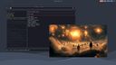
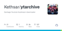

# INTERNET

| [Home](https://portable-linux-apps.github.io/) |
| --- |

#### Here are listed **158** programs and **9** items for this category and managed by [AM](https://github.com/ivan-hc/AM) 	and [AppMan](https://github.com/ivan-hc/AppMan) for the x86_64 architecture.

*Use your browser's built-in search tool to easily navigate to this page or use the tags below.*

| [Back to Applications](https://portable-linux-apps.github.io/apps.html) |
| --- |

#### *Categories*

***[AppImages](https://portable-linux-apps.github.io/appimages.html)*** 		 - ***[android](https://portable-linux-apps.github.io/android.html)*** - ***[audio](https://portable-linux-apps.github.io/audio.html)*** - ***[comic](https://portable-linux-apps.github.io/comic.html)*** - ***[command-line](https://portable-linux-apps.github.io/command-line.html)*** - ***[communication](https://portable-linux-apps.github.io/communication.html)*** - ***[disk](https://portable-linux-apps.github.io/disk.html)*** - ***[education](https://portable-linux-apps.github.io/education.html)*** - ***[file-manager](https://portable-linux-apps.github.io/file-manager.html)*** - ***[finance](https://portable-linux-apps.github.io/finance.html)*** - ***[game](https://portable-linux-apps.github.io/game.html)*** - ***[gnome](https://portable-linux-apps.github.io/gnome.html)*** - ***[graphic](https://portable-linux-apps.github.io/graphic.html)*** - ***[internet](https://portable-linux-apps.github.io/internet.html)*** - ***[kde](https://portable-linux-apps.github.io/kde.html)*** - ***[office](https://portable-linux-apps.github.io/office.html)*** - ***[password](https://portable-linux-apps.github.io/password.html)*** - ***[steam](https://portable-linux-apps.github.io/steam.html)*** - ***[system-monitor](https://portable-linux-apps.github.io/system-monitor.html)*** - ***[video](https://portable-linux-apps.github.io/video.html)*** - ***[web-app](https://portable-linux-apps.github.io/web-app.html)*** - ***[web-browser](https://portable-linux-apps.github.io/web-browser.html)*** - ***[wine](https://portable-linux-apps.github.io/wine.html)***

-----------------

*NOTE, the installer scripts in the "INSTALLER" column are intended for use via "AM", and are therefore dedicated to a system-wide 	installation of applications (in /opt), and all that "AppMan" does is convert those scripts for local installation, changing the paths. 	**They are listed here for reading purposes only**!*

*Should you decide to run them manually, the only way to remove the application is to run 	the command "`sudo /opt/appname/remove`", where "appname" is the name of the application directory containing the "remove" script. 	Likewise, you can also update applications by running the "AM-updater" script in the same directory.*

*The "AM" project allow the autonomy of installed apps, regardless of the presence of "AM" itself in the system. However, it is strongly 	recommended to use "AM" and "AppMan" to take full advantage of all the benefits you could get from an application installed in this way.*

*"AM"/"AppMan" makes it easy to find and integrate and install applications, quickly, from the command line.*

*If you are here just to download apps manually, click on the program name and check the URL(s) on the application page. This site does not 	provide direct links, for security reasons, but it does provide the exact sources and references where you can find them!*

*Transparency and credibility are the focus of this catalog. Happy exploring!*

-----------------

| ICON | PACKAGE NAME | DESCRIPTION | INSTALLER |
| --- | --- | --- | --- |
|  | [***aichat***](apps/aichat.md) | *AIO AI CLI tool integrating 20+ AI platforms, including OpenAI.*..[ *read more* ](apps/aichat.md)*!* | [*blob*](https://github.com/ivan-hc/AM/blob/main/programs/x86_64/aichat) **/** [*raw*](https://raw.githubusercontent.com/ivan-hc/AM/main/programs/x86_64/aichat) |
|  | [***altus***](apps/altus.md) | *Client for WhatsApp Web with themes & multiple account support.*..[ *read more* ](apps/altus.md)*!* | [*blob*](https://github.com/ivan-hc/AM/blob/main/programs/x86_64/altus) **/** [*raw*](https://raw.githubusercontent.com/ivan-hc/AM/main/programs/x86_64/altus) |
|  | [***ant-downloader***](apps/ant-downloader.md) | *BitTorrent Client developed by golang, angular, electron.*..[ *read more* ](apps/ant-downloader.md)*!* | [*blob*](https://github.com/ivan-hc/AM/blob/main/programs/x86_64/ant-downloader) **/** [*raw*](https://raw.githubusercontent.com/ivan-hc/AM/main/programs/x86_64/ant-downloader) |
|  | [***beeper***](apps/beeper.md) | *All your chats in one app.*..[ *read more* ](apps/beeper.md)*!* | [*blob*](https://github.com/ivan-hc/AM/blob/main/programs/x86_64/beeper) **/** [*raw*](https://raw.githubusercontent.com/ivan-hc/AM/main/programs/x86_64/beeper) |
|  | [***bettercrewlink***](apps/bettercrewlink.md) | *Free, open, Among Us proximity voice chat.*..[ *read more* ](apps/bettercrewlink.md)*!* | [*blob*](https://github.com/ivan-hc/AM/blob/main/programs/x86_64/bettercrewlink) **/** [*raw*](https://raw.githubusercontent.com/ivan-hc/AM/main/programs/x86_64/bettercrewlink) |
|  | [***binglite***](apps/binglite.md) | *A lightweight new Bing (AI chat) desktop application based on Tauri.*..[ *read more* ](apps/binglite.md)*!* | [*blob*](https://github.com/ivan-hc/AM/blob/main/programs/x86_64/binglite) **/** [*raw*](https://raw.githubusercontent.com/ivan-hc/AM/main/programs/x86_64/binglite) |
|  | [***blob-dl***](apps/blob-dl.md) | *Blob-dl is a yt-dlp CLI interface used to download video and audio files from YouTube.*..[ *read more* ](apps/blob-dl.md)*!* | [*blob*](https://github.com/ivan-hc/AM/blob/main/programs/x86_64/blob-dl) **/** [*raw*](https://raw.githubusercontent.com/ivan-hc/AM/main/programs/x86_64/blob-dl) |
|  | [***botframework-emulator***](apps/botframework-emulator.md) | *Test and debug chat bots built with Bot Framework SDK.*..[ *read more* ](apps/botframework-emulator.md)*!* | [*blob*](https://github.com/ivan-hc/AM/blob/main/programs/x86_64/botframework-emulator) **/** [*raw*](https://raw.githubusercontent.com/ivan-hc/AM/main/programs/x86_64/botframework-emulator) |
|  | [***brave-appimage***](apps/brave-appimage.md) | *Unofficial, a privacy oriented Web Browser based on Chromium, this is the "stable" release.*..[ *read more* ](apps/brave-appimage.md)*!* | [*blob*](https://github.com/ivan-hc/AM/blob/main/programs/x86_64/brave-appimage) **/** [*raw*](https://raw.githubusercontent.com/ivan-hc/AM/main/programs/x86_64/brave-appimage) |
|  | [***brave***](apps/brave.md) | *A privacy oriented Web Browser based on Chromium, this is the official "stable" release.*..[ *read more* ](apps/brave.md)*!* | [*blob*](https://github.com/ivan-hc/AM/blob/main/programs/x86_64/brave) **/** [*raw*](https://raw.githubusercontent.com/ivan-hc/AM/main/programs/x86_64/brave) |
|  | [***brave-beta-appimage***](apps/brave-beta-appimage.md) | *Unofficial, a privacy oriented Web Browser based on Chromium, this is the "beta" release.*..[ *read more* ](apps/brave-beta-appimage.md)*!* | [*blob*](https://github.com/ivan-hc/AM/blob/main/programs/x86_64/brave-beta-appimage) **/** [*raw*](https://raw.githubusercontent.com/ivan-hc/AM/main/programs/x86_64/brave-beta-appimage) |
|  | [***brave-beta***](apps/brave-beta.md) | *A privacy oriented Web Browser based on Chromium, this is the official "beta" release.*..[ *read more* ](apps/brave-beta.md)*!* | [*blob*](https://github.com/ivan-hc/AM/blob/main/programs/x86_64/brave-beta) **/** [*raw*](https://raw.githubusercontent.com/ivan-hc/AM/main/programs/x86_64/brave-beta) |
|  | [***brave-nightly-appimage***](apps/brave-nightly-appimage.md) | *Unofficial, a privacy oriented Web Browser based on Chromium, this is the "nightly" release.*..[ *read more* ](apps/brave-nightly-appimage.md)*!* | [*blob*](https://github.com/ivan-hc/AM/blob/main/programs/x86_64/brave-nightly-appimage) **/** [*raw*](https://raw.githubusercontent.com/ivan-hc/AM/main/programs/x86_64/brave-nightly-appimage) |
|  | [***brave-nightly***](apps/brave-nightly.md) | *A privacy oriented Web Browser based on Chromium, this is the official "nightly" release.*..[ *read more* ](apps/brave-nightly.md)*!* | [*blob*](https://github.com/ivan-hc/AM/blob/main/programs/x86_64/brave-nightly) **/** [*raw*](https://raw.githubusercontent.com/ivan-hc/AM/main/programs/x86_64/brave-nightly) |
|  | [***cabal-desktop***](apps/cabal-desktop.md) | *Cabal p2p offline-first desktop application.*..[ *read more* ](apps/cabal-desktop.md)*!* | [*blob*](https://github.com/ivan-hc/AM/blob/main/programs/x86_64/cabal-desktop) **/** [*raw*](https://raw.githubusercontent.com/ivan-hc/AM/main/programs/x86_64/cabal-desktop) |
|  | [***catalyst***](apps/catalyst.md) | *Catalyst web browser.*..[ *read more* ](apps/catalyst.md)*!* | [*blob*](https://github.com/ivan-hc/AM/blob/main/programs/x86_64/catalyst) **/** [*raw*](https://raw.githubusercontent.com/ivan-hc/AM/main/programs/x86_64/catalyst) |
|  | [***chatall***](apps/chatall.md) | *Concurrently chat with ChatGPT, Bing Chat, bard, Alpaca and more.*..[ *read more* ](apps/chatall.md)*!* | [*blob*](https://github.com/ivan-hc/AM/blob/main/programs/x86_64/chatall) **/** [*raw*](https://raw.githubusercontent.com/ivan-hc/AM/main/programs/x86_64/chatall) |
|  | [***chatbox***](apps/chatbox.md) | *Chatbox is a desktop app for GPT-4 / GPT-3.5, OpenAI API.*..[ *read more* ](apps/chatbox.md)*!* | [*blob*](https://github.com/ivan-hc/AM/blob/main/programs/x86_64/chatbox) **/** [*raw*](https://raw.githubusercontent.com/ivan-hc/AM/main/programs/x86_64/chatbox) |
|  | [***chatgpt-next-web***](apps/chatgpt-next-web.md) | *A cross-platform ChatGPT/Gemini UI.*..[ *read more* ](apps/chatgpt-next-web.md)*!* | [*blob*](https://github.com/ivan-hc/AM/blob/main/programs/x86_64/chatgpt-next-web) **/** [*raw*](https://raw.githubusercontent.com/ivan-hc/AM/main/programs/x86_64/chatgpt-next-web) |
|  | [***chat-gpt***](apps/chat-gpt.md) | *Unofficial. ChatGPT Desktop Application.*..[ *read more* ](apps/chat-gpt.md)*!* | [*blob*](https://github.com/ivan-hc/AM/blob/main/programs/x86_64/chat-gpt) **/** [*raw*](https://raw.githubusercontent.com/ivan-hc/AM/main/programs/x86_64/chat-gpt) |
|  | [***chatpad-ai***](apps/chatpad-ai.md) | *Not just another ChatGPT user-interface.*..[ *read more* ](apps/chatpad-ai.md)*!* | [*blob*](https://github.com/ivan-hc/AM/blob/main/programs/x86_64/chatpad-ai) **/** [*raw*](https://raw.githubusercontent.com/ivan-hc/AM/main/programs/x86_64/chatpad-ai) |
|  | [***chatterino2-nightly***](apps/chatterino2-nightly.md) | *Second installment of the Twitch chat client.*..[ *read more* ](apps/chatterino2-nightly.md)*!* | [*blob*](https://github.com/ivan-hc/AM/blob/main/programs/x86_64/chatterino2-nightly) **/** [*raw*](https://raw.githubusercontent.com/ivan-hc/AM/main/programs/x86_64/chatterino2-nightly) |
|  | [***chatterino2***](apps/chatterino2.md) | *Second installment of the Twitch chat client.*..[ *read more* ](apps/chatterino2.md)*!* | [*blob*](https://github.com/ivan-hc/AM/blob/main/programs/x86_64/chatterino2) **/** [*raw*](https://raw.githubusercontent.com/ivan-hc/AM/main/programs/x86_64/chatterino2) |
|  | [***chromium-beta***](apps/chromium-beta.md) | *Unofficial. FOSS Web Browser, base of Google Chrome, beta edition.*..[ *read more* ](apps/chromium-beta.md)*!* | [*blob*](https://github.com/ivan-hc/AM/blob/main/programs/x86_64/chromium-beta) **/** [*raw*](https://raw.githubusercontent.com/ivan-hc/AM/main/programs/x86_64/chromium-beta) |
|  | [***chromium-edge***](apps/chromium-edge.md) | *Unofficial. FOSS Web Browser, base of Google Chrome, edge edition.*..[ *read more* ](apps/chromium-edge.md)*!* | [*blob*](https://github.com/ivan-hc/AM/blob/main/programs/x86_64/chromium-edge) **/** [*raw*](https://raw.githubusercontent.com/ivan-hc/AM/main/programs/x86_64/chromium-edge) |
|  | [***chromium-latest***](apps/chromium-latest.md) | *FOSS Web Browser, base of Google Chrome, official unstable build.*..[ *read more* ](apps/chromium-latest.md)*!* | [*blob*](https://github.com/ivan-hc/AM/blob/main/programs/x86_64/chromium-latest) **/** [*raw*](https://raw.githubusercontent.com/ivan-hc/AM/main/programs/x86_64/chromium-latest) |
|  | [***chromium-rc***](apps/chromium-rc.md) | *Unofficial. FOSS Web Browser, base of Google Chrome, release candidate.*..[ *read more* ](apps/chromium-rc.md)*!* | [*blob*](https://github.com/ivan-hc/AM/blob/main/programs/x86_64/chromium-rc) **/** [*raw*](https://raw.githubusercontent.com/ivan-hc/AM/main/programs/x86_64/chromium-rc) |
|  | [***chromium***](apps/chromium.md) | *Unofficial. FOSS Web Browser, base of Google Chrome, Edge and Brave, stable.*..[ *read more* ](apps/chromium.md)*!* | [*blob*](https://github.com/ivan-hc/AM/blob/main/programs/x86_64/chromium) **/** [*raw*](https://raw.githubusercontent.com/ivan-hc/AM/main/programs/x86_64/chromium) |
|  | [***circle-z***](apps/circle-z.md) | *A chat client for online math courses.*..[ *read more* ](apps/circle-z.md)*!* | [*blob*](https://github.com/ivan-hc/AM/blob/main/programs/x86_64/circle-z) **/** [*raw*](https://raw.githubusercontent.com/ivan-hc/AM/main/programs/x86_64/circle-z) |
|  | [***cursor***](apps/cursor.md) | *Write, edit, and chat about your code with GPT-4.*..[ *read more* ](apps/cursor.md)*!* | [*blob*](https://github.com/ivan-hc/AM/blob/main/programs/x86_64/cursor) **/** [*raw*](https://raw.githubusercontent.com/ivan-hc/AM/main/programs/x86_64/cursor) |
|  | [***deltachat-desktop***](apps/deltachat-desktop.md) | *Desktop Application for delta.chat.*..[ *read more* ](apps/deltachat-desktop.md)*!* | [*blob*](https://github.com/ivan-hc/AM/blob/main/programs/x86_64/deltachat-desktop) **/** [*raw*](https://raw.githubusercontent.com/ivan-hc/AM/main/programs/x86_64/deltachat-desktop) |
|  | [***deskreen***](apps/deskreen.md) | *Turns any device with a web browser into a secondary screen.*..[ *read more* ](apps/deskreen.md)*!* | [*blob*](https://github.com/ivan-hc/AM/blob/main/programs/x86_64/deskreen) **/** [*raw*](https://raw.githubusercontent.com/ivan-hc/AM/main/programs/x86_64/deskreen) |
|  | [***dezor***](apps/dezor.md) | *The web browser including VPN and Adblocker.*..[ *read more* ](apps/dezor.md)*!* | [*blob*](https://github.com/ivan-hc/AM/blob/main/programs/x86_64/dezor) **/** [*raw*](https://raw.githubusercontent.com/ivan-hc/AM/main/programs/x86_64/dezor) |
|  | [***discord***](apps/discord.md) | *Unofficial. All-in-one voice and text chat for gamers.*..[ *read more* ](apps/discord.md)*!* | [*blob*](https://github.com/ivan-hc/AM/blob/main/programs/x86_64/discord) **/** [*raw*](https://raw.githubusercontent.com/ivan-hc/AM/main/programs/x86_64/discord) |
|  | [***dwyco-phoo***](apps/dwyco-phoo.md) | *Dwyco Phoo Chat and Video Calling.*..[ *read more* ](apps/dwyco-phoo.md)*!* | [*blob*](https://github.com/ivan-hc/AM/blob/main/programs/x86_64/dwyco-phoo) **/** [*raw*](https://raw.githubusercontent.com/ivan-hc/AM/main/programs/x86_64/dwyco-phoo) |
|  | [***electorrent***](apps/electorrent.md) | *A remote control Torrent client.*..[ *read more* ](apps/electorrent.md)*!* | [*blob*](https://github.com/ivan-hc/AM/blob/main/programs/x86_64/electorrent) **/** [*raw*](https://raw.githubusercontent.com/ivan-hc/AM/main/programs/x86_64/electorrent) |
|  | [***electron-wechat***](apps/electron-wechat.md) | *Wechat desktop application.*..[ *read more* ](apps/electron-wechat.md)*!* | [*blob*](https://github.com/ivan-hc/AM/blob/main/programs/x86_64/electron-wechat) **/** [*raw*](https://raw.githubusercontent.com/ivan-hc/AM/main/programs/x86_64/electron-wechat) |
|  | [***elk***](apps/elk.md) | *Native version of Elk, a nimble Mastodon web.*..[ *read more* ](apps/elk.md)*!* | [*blob*](https://github.com/ivan-hc/AM/blob/main/programs/x86_64/elk) **/** [*raw*](https://raw.githubusercontent.com/ivan-hc/AM/main/programs/x86_64/elk) |
|  | [***elzabrowser***](apps/elzabrowser.md) | *Elza incognito web browser.*..[ *read more* ](apps/elzabrowser.md)*!* | [*blob*](https://github.com/ivan-hc/AM/blob/main/programs/x86_64/elzabrowser) **/** [*raw*](https://raw.githubusercontent.com/ivan-hc/AM/main/programs/x86_64/elzabrowser) |
|  | [***fchat-rising***](apps/fchat-rising.md) | *A customized version of mainline F-Chat 3.0 client.*..[ *read more* ](apps/fchat-rising.md)*!* | [*blob*](https://github.com/ivan-hc/AM/blob/main/programs/x86_64/fchat-rising) **/** [*raw*](https://raw.githubusercontent.com/ivan-hc/AM/main/programs/x86_64/fchat-rising) |
|  | [***fchat***](apps/fchat.md) | *The F-Chat 3.0 client.*..[ *read more* ](apps/fchat.md)*!* | [*blob*](https://github.com/ivan-hc/AM/blob/main/programs/x86_64/fchat) **/** [*raw*](https://raw.githubusercontent.com/ivan-hc/AM/main/programs/x86_64/fchat) |
|  | [***ff-password-exporter***](apps/ff-password-exporter.md) | *Export your saved passwords from Firefox.*..[ *read more* ](apps/ff-password-exporter.md)*!* | [*blob*](https://github.com/ivan-hc/AM/blob/main/programs/x86_64/ff-password-exporter) **/** [*raw*](https://raw.githubusercontent.com/ivan-hc/AM/main/programs/x86_64/ff-password-exporter) |
|  | [***ffsend***](apps/ffsend.md) | *Easily and securely share files from the command line. A fully featured Firefox Send client.*..[ *read more* ](apps/ffsend.md)*!* | [*blob*](https://github.com/ivan-hc/AM/blob/main/programs/x86_64/ffsend) **/** [*raw*](https://raw.githubusercontent.com/ivan-hc/AM/main/programs/x86_64/ffsend) |
|  | [***ffwa-facebook***](apps/ffwa-facebook.md) | *WebApp & Firefox Profile for Facebook.*..[ *read more* ](apps/ffwa-facebook.md)*!* | [*blob*](https://github.com/ivan-hc/AM/blob/main/programs/x86_64/ffwa-facebook) **/** [*raw*](https://raw.githubusercontent.com/ivan-hc/AM/main/programs/x86_64/ffwa-facebook) |
|  | [***ffwa-github***](apps/ffwa-github.md) | *WebApp & Firefox Profile for GitHub.*..[ *read more* ](apps/ffwa-github.md)*!* | [*blob*](https://github.com/ivan-hc/AM/blob/main/programs/x86_64/ffwa-github) **/** [*raw*](https://raw.githubusercontent.com/ivan-hc/AM/main/programs/x86_64/ffwa-github) |
|  | [***ffwa-gmail***](apps/ffwa-gmail.md) | *WebApp & Firefox Profile for Gmail.*..[ *read more* ](apps/ffwa-gmail.md)*!* | [*blob*](https://github.com/ivan-hc/AM/blob/main/programs/x86_64/ffwa-gmail) **/** [*raw*](https://raw.githubusercontent.com/ivan-hc/AM/main/programs/x86_64/ffwa-gmail) |
|  | [***ffwa-netflix***](apps/ffwa-netflix.md) | *WebApp & Firefox Profile for Netflix.*..[ *read more* ](apps/ffwa-netflix.md)*!* | [*blob*](https://github.com/ivan-hc/AM/blob/main/programs/x86_64/ffwa-netflix) **/** [*raw*](https://raw.githubusercontent.com/ivan-hc/AM/main/programs/x86_64/ffwa-netflix) |
|  | [***ffwa-reddit***](apps/ffwa-reddit.md) | *WebApp & Firefox Profile for Reddit.*..[ *read more* ](apps/ffwa-reddit.md)*!* | [*blob*](https://github.com/ivan-hc/AM/blob/main/programs/x86_64/ffwa-reddit) **/** [*raw*](https://raw.githubusercontent.com/ivan-hc/AM/main/programs/x86_64/ffwa-reddit) |
|  | [***ffwa-twitter***](apps/ffwa-twitter.md) | *WebApp & Firefox Profile for Twitter.*..[ *read more* ](apps/ffwa-twitter.md)*!* | [*blob*](https://github.com/ivan-hc/AM/blob/main/programs/x86_64/ffwa-twitter) **/** [*raw*](https://raw.githubusercontent.com/ivan-hc/AM/main/programs/x86_64/ffwa-twitter) |
|  | [***ffwa-whatsapp***](apps/ffwa-whatsapp.md) | *WebApp & Firefox Profile for WhatsApp.*..[ *read more* ](apps/ffwa-whatsapp.md)*!* | [*blob*](https://github.com/ivan-hc/AM/blob/main/programs/x86_64/ffwa-whatsapp) **/** [*raw*](https://raw.githubusercontent.com/ivan-hc/AM/main/programs/x86_64/ffwa-whatsapp) |
|  | [***ffwa-wikipedia***](apps/ffwa-wikipedia.md) | *WebApp & Firefox Profile for Wikipedia.*..[ *read more* ](apps/ffwa-wikipedia.md)*!* | [*blob*](https://github.com/ivan-hc/AM/blob/main/programs/x86_64/ffwa-wikipedia) **/** [*raw*](https://raw.githubusercontent.com/ivan-hc/AM/main/programs/x86_64/ffwa-wikipedia) |
|  | [***ffwa-youtube***](apps/ffwa-youtube.md) | *WebApp & Firefox Profile for YouTube.*..[ *read more* ](apps/ffwa-youtube.md)*!* | [*blob*](https://github.com/ivan-hc/AM/blob/main/programs/x86_64/ffwa-youtube) **/** [*raw*](https://raw.githubusercontent.com/ivan-hc/AM/main/programs/x86_64/ffwa-youtube) |
|  | [***fiery-maui***](apps/fiery-maui.md) | *Web browser with integrated ad-blocker and split views.*..[ *read more* ](apps/fiery-maui.md)*!* | [*blob*](https://github.com/ivan-hc/AM/blob/main/programs/x86_64/fiery-maui) **/** [*raw*](https://raw.githubusercontent.com/ivan-hc/AM/main/programs/x86_64/fiery-maui) |
|  | [***fifo***](apps/fifo.md) | *A modern web browser, built on top of modern web technologies.*..[ *read more* ](apps/fifo.md)*!* | [*blob*](https://github.com/ivan-hc/AM/blob/main/programs/x86_64/fifo) **/** [*raw*](https://raw.githubusercontent.com/ivan-hc/AM/main/programs/x86_64/fifo) |
|  | [***firedragon***](apps/firedragon.md) | *A web browser based on Floorp (the Vivaldi of Firefox's) with many opiniated settings by default.*..[ *read more* ](apps/firedragon.md)*!* | [*blob*](https://github.com/ivan-hc/AM/blob/main/programs/x86_64/firedragon) **/** [*raw*](https://raw.githubusercontent.com/ivan-hc/AM/main/programs/x86_64/firedragon) |
|  | [***firefox-appimage***](apps/firefox-appimage.md) | *Unofficial, AppImage of the Web Browser, Stable.*..[ *read more* ](apps/firefox-appimage.md)*!* | [*blob*](https://github.com/ivan-hc/AM/blob/main/programs/x86_64/firefox-appimage) **/** [*raw*](https://raw.githubusercontent.com/ivan-hc/AM/main/programs/x86_64/firefox-appimage) |
|  | [***firefox-beta-appimage***](apps/firefox-beta-appimage.md) | *Unofficial, AppImage of the Web Browser, Beta.*..[ *read more* ](apps/firefox-beta-appimage.md)*!* | [*blob*](https://github.com/ivan-hc/AM/blob/main/programs/x86_64/firefox-beta-appimage) **/** [*raw*](https://raw.githubusercontent.com/ivan-hc/AM/main/programs/x86_64/firefox-beta-appimage) |
|  | [***firefox-beta***](apps/firefox-beta.md) | *Fast, powerful and extensible Web Browser, Beta Edition.*..[ *read more* ](apps/firefox-beta.md)*!* | [*blob*](https://github.com/ivan-hc/AM/blob/main/programs/x86_64/firefox-beta) **/** [*raw*](https://raw.githubusercontent.com/ivan-hc/AM/main/programs/x86_64/firefox-beta) |
|  | [***firefox-devedition-appimage***](apps/firefox-devedition-appimage.md) | *Unofficial AppImage of the Web Browser, Dev.*..[ *read more* ](apps/firefox-devedition-appimage.md)*!* | [*blob*](https://github.com/ivan-hc/AM/blob/main/programs/x86_64/firefox-devedition-appimage) **/** [*raw*](https://raw.githubusercontent.com/ivan-hc/AM/main/programs/x86_64/firefox-devedition-appimage) |
|  | [***firefox-dev***](apps/firefox-dev.md) | *Fast, powerful and extensible Web Browser, Developer Edition.*..[ *read more* ](apps/firefox-dev.md)*!* | [*blob*](https://github.com/ivan-hc/AM/blob/main/programs/x86_64/firefox-dev) **/** [*raw*](https://raw.githubusercontent.com/ivan-hc/AM/main/programs/x86_64/firefox-dev) |
|  | [***firefox-esr-appimage***](apps/firefox-esr-appimage.md) | *Unofficial AppImage of the Web Browser, ESR.*..[ *read more* ](apps/firefox-esr-appimage.md)*!* | [*blob*](https://github.com/ivan-hc/AM/blob/main/programs/x86_64/firefox-esr-appimage) **/** [*raw*](https://raw.githubusercontent.com/ivan-hc/AM/main/programs/x86_64/firefox-esr-appimage) |
|  | [***firefox-esr***](apps/firefox-esr.md) | *Fast, powerful and extensible Web Browser, ESR Edition.*..[ *read more* ](apps/firefox-esr.md)*!* | [*blob*](https://github.com/ivan-hc/AM/blob/main/programs/x86_64/firefox-esr) **/** [*raw*](https://raw.githubusercontent.com/ivan-hc/AM/main/programs/x86_64/firefox-esr) |
|  | [***firefox***](apps/firefox.md) | *Fast, powerful and extensible Web Browser, Stable.*..[ *read more* ](apps/firefox.md)*!* | [*blob*](https://github.com/ivan-hc/AM/blob/main/programs/x86_64/firefox) **/** [*raw*](https://raw.githubusercontent.com/ivan-hc/AM/main/programs/x86_64/firefox) |
|  | [***firefox-nightly-appimage***](apps/firefox-nightly-appimage.md) | *Unofficial AppImage of the Web Browser, Nightly.*..[ *read more* ](apps/firefox-nightly-appimage.md)*!* | [*blob*](https://github.com/ivan-hc/AM/blob/main/programs/x86_64/firefox-nightly-appimage) **/** [*raw*](https://raw.githubusercontent.com/ivan-hc/AM/main/programs/x86_64/firefox-nightly-appimage) |
|  | [***firefox-nightly***](apps/firefox-nightly.md) | *Fast, powerful and extensible Web Browser, Nightly Edition.*..[ *read more* ](apps/firefox-nightly.md)*!* | [*blob*](https://github.com/ivan-hc/AM/blob/main/programs/x86_64/firefox-nightly) **/** [*raw*](https://raw.githubusercontent.com/ivan-hc/AM/main/programs/x86_64/firefox-nightly) |
|  | [***floorp***](apps/floorp.md) | *Floorp Web Browser, the most Advanced and Fastest Firefox derivative.*..[ *read more* ](apps/floorp.md)*!* | [*blob*](https://github.com/ivan-hc/AM/blob/main/programs/x86_64/floorp) **/** [*raw*](https://raw.githubusercontent.com/ivan-hc/AM/main/programs/x86_64/floorp) |
|  | [***forkgram***](apps/forkgram.md) | *Fork of Telegram Desktop messaging app.*..[ *read more* ](apps/forkgram.md)*!* | [*blob*](https://github.com/ivan-hc/AM/blob/main/programs/x86_64/forkgram) **/** [*raw*](https://raw.githubusercontent.com/ivan-hc/AM/main/programs/x86_64/forkgram) |
|  | [***fraidycat***](apps/fraidycat.md) | *Follow blogs, wikis, YouTube, Twitter, Reddit, Instagram and more.*..[ *read more* ](apps/fraidycat.md)*!* | [*blob*](https://github.com/ivan-hc/AM/blob/main/programs/x86_64/fraidycat) **/** [*raw*](https://raw.githubusercontent.com/ivan-hc/AM/main/programs/x86_64/fraidycat) |
|  | [***franz***](apps/franz.md) | *Messaging app for WhatsApp, Slack, Telegram, HipChat and much more.*..[ *read more* ](apps/franz.md)*!* | [*blob*](https://github.com/ivan-hc/AM/blob/main/programs/x86_64/franz) **/** [*raw*](https://raw.githubusercontent.com/ivan-hc/AM/main/programs/x86_64/franz) |
|  | [***freetube***](apps/freetube.md) | *An Open Source YouTube app for privacy.*..[ *read more* ](apps/freetube.md)*!* | [*blob*](https://github.com/ivan-hc/AM/blob/main/programs/x86_64/freetube) **/** [*raw*](https://raw.githubusercontent.com/ivan-hc/AM/main/programs/x86_64/freetube) |
|  | [***google-chrome-beta***](apps/google-chrome-beta.md) | *Unofficial, Web Browser, Beta version.*..[ *read more* ](apps/google-chrome-beta.md)*!* | [*blob*](https://github.com/ivan-hc/AM/blob/main/programs/x86_64/google-chrome-beta) **/** [*raw*](https://raw.githubusercontent.com/ivan-hc/AM/main/programs/x86_64/google-chrome-beta) |
|  | [***google-chrome-dev***](apps/google-chrome-dev.md) | *Unofficial, Web Browser, Unstable version.*..[ *read more* ](apps/google-chrome-dev.md)*!* | [*blob*](https://github.com/ivan-hc/AM/blob/main/programs/x86_64/google-chrome-dev) **/** [*raw*](https://raw.githubusercontent.com/ivan-hc/AM/main/programs/x86_64/google-chrome-dev) |
|  | [***google-chrome***](apps/google-chrome.md) | *Unofficial, Web Browser, Stable version.*..[ *read more* ](apps/google-chrome.md)*!* | [*blob*](https://github.com/ivan-hc/AM/blob/main/programs/x86_64/google-chrome) **/** [*raw*](https://raw.githubusercontent.com/ivan-hc/AM/main/programs/x86_64/google-chrome) |
|  | [***hydra***](apps/hydra.md) | *Game launcher with its own embedded bittorrent client.*..[ *read more* ](apps/hydra.md)*!* | [*blob*](https://github.com/ivan-hc/AM/blob/main/programs/x86_64/hydra) **/** [*raw*](https://raw.githubusercontent.com/ivan-hc/AM/main/programs/x86_64/hydra) |
|  | [***hyperspace***](apps/hyperspace.md) | *A fluffy client for Mastodon in React.*..[ *read more* ](apps/hyperspace.md)*!* | [*blob*](https://github.com/ivan-hc/AM/blob/main/programs/x86_64/hyperspace) **/** [*raw*](https://raw.githubusercontent.com/ivan-hc/AM/main/programs/x86_64/hyperspace) |
|  | [***icecat***](apps/icecat.md) | *GNU IceCat is the GNU version of the Firefox web browser.*..[ *read more* ](apps/icecat.md)*!* | [*blob*](https://github.com/ivan-hc/AM/blob/main/programs/x86_64/icecat) **/** [*raw*](https://raw.githubusercontent.com/ivan-hc/AM/main/programs/x86_64/icecat) |
|  | [***jan***](apps/jan.md) | *FOSS Alternative to ChatGPT that runs 100% offline on your computer.*..[ *read more* ](apps/jan.md)*!* | [*blob*](https://github.com/ivan-hc/AM/blob/main/programs/x86_64/jan) **/** [*raw*](https://raw.githubusercontent.com/ivan-hc/AM/main/programs/x86_64/jan) |
|  | [***kadium***](apps/kadium.md) | *App for staying ontop of YouTube channels' uploads.*..[ *read more* ](apps/kadium.md)*!* | [*blob*](https://github.com/ivan-hc/AM/blob/main/programs/x86_64/kadium) **/** [*raw*](https://raw.githubusercontent.com/ivan-hc/AM/main/programs/x86_64/kadium) |
|  | [***kiku***](apps/kiku.md) | *Play music from youtube on desktop. Supports local api, invidious and piped as source.*..[ *read more* ](apps/kiku.md)*!* | [*blob*](https://github.com/ivan-hc/AM/blob/main/programs/x86_64/kiku) **/** [*raw*](https://raw.githubusercontent.com/ivan-hc/AM/main/programs/x86_64/kiku) |
|  | [***kristall***](apps/kristall.md) | *A web browser without support for css/js/wasm or graphical websites.*..[ *read more* ](apps/kristall.md)*!* | [*blob*](https://github.com/ivan-hc/AM/blob/main/programs/x86_64/kristall) **/** [*raw*](https://raw.githubusercontent.com/ivan-hc/AM/main/programs/x86_64/kristall) |
|  | [***librewolf***](apps/librewolf.md) | *Firefox-based Web Browser focused on privacy, security, freedom.*..[ *read more* ](apps/librewolf.md)*!* | [*blob*](https://github.com/ivan-hc/AM/blob/main/programs/x86_64/librewolf) **/** [*raw*](https://raw.githubusercontent.com/ivan-hc/AM/main/programs/x86_64/librewolf) |
|  | [***media-dupes***](apps/media-dupes.md) | *Content duplicator for common media services like YouTube.*..[ *read more* ](apps/media-dupes.md)*!* | [*blob*](https://github.com/ivan-hc/AM/blob/main/programs/x86_64/media-dupes) **/** [*raw*](https://raw.githubusercontent.com/ivan-hc/AM/main/programs/x86_64/media-dupes) |
|  | [***mercury-avx2***](apps/mercury-avx2.md) | *Firefox fork, with compiler optim. and patches from Librewolf.*..[ *read more* ](apps/mercury-avx2.md)*!* | [*blob*](https://github.com/ivan-hc/AM/blob/main/programs/x86_64/mercury-avx2) **/** [*raw*](https://raw.githubusercontent.com/ivan-hc/AM/main/programs/x86_64/mercury-avx2) |
|  | [***mercury***](apps/mercury.md) | *Firefox fork with compiler optimizations and patches from Librewolf.*..[ *read more* ](apps/mercury.md)*!* | [*blob*](https://github.com/ivan-hc/AM/blob/main/programs/x86_64/mercury) **/** [*raw*](https://raw.githubusercontent.com/ivan-hc/AM/main/programs/x86_64/mercury) |
|  | [***mercury-sse3***](apps/mercury-sse3.md) | *Firefox fork with compiler optim. and patches from Librewolf.*..[ *read more* ](apps/mercury-sse3.md)*!* | [*blob*](https://github.com/ivan-hc/AM/blob/main/programs/x86_64/mercury-sse3) **/** [*raw*](https://raw.githubusercontent.com/ivan-hc/AM/main/programs/x86_64/mercury-sse3) |
|  | [***mercury-sse4***](apps/mercury-sse4.md) | *Firefox fork with compiler optim. and patches from Librewolf.*..[ *read more* ](apps/mercury-sse4.md)*!* | [*blob*](https://github.com/ivan-hc/AM/blob/main/programs/x86_64/mercury-sse4) **/** [*raw*](https://raw.githubusercontent.com/ivan-hc/AM/main/programs/x86_64/mercury-sse4) |
|  | [***microsoft-edge-beta***](apps/microsoft-edge-beta.md) | *Web Browser provided by Microsoft, Beta Edition.*..[ *read more* ](apps/microsoft-edge-beta.md)*!* | [*blob*](https://github.com/ivan-hc/AM/blob/main/programs/x86_64/microsoft-edge-beta) **/** [*raw*](https://raw.githubusercontent.com/ivan-hc/AM/main/programs/x86_64/microsoft-edge-beta) |
|  | [***microsoft-edge-dev***](apps/microsoft-edge-dev.md) | *Web Browser provided by Microsoft, Developer Edition.*..[ *read more* ](apps/microsoft-edge-dev.md)*!* | [*blob*](https://github.com/ivan-hc/AM/blob/main/programs/x86_64/microsoft-edge-dev) **/** [*raw*](https://raw.githubusercontent.com/ivan-hc/AM/main/programs/x86_64/microsoft-edge-dev) |
|  | [***microsoft-edge***](apps/microsoft-edge.md) | *Web Browser provided by Microsoft, Stable Edition.*..[ *read more* ](apps/microsoft-edge.md)*!* | [*blob*](https://github.com/ivan-hc/AM/blob/main/programs/x86_64/microsoft-edge) **/** [*raw*](https://raw.githubusercontent.com/ivan-hc/AM/main/programs/x86_64/microsoft-edge) |
|  | [***mirage***](apps/mirage.md) | *Matrix chat client for encrypted and decentralized communication.*..[ *read more* ](apps/mirage.md)*!* | [*blob*](https://github.com/ivan-hc/AM/blob/main/programs/x86_64/mirage) **/** [*raw*](https://raw.githubusercontent.com/ivan-hc/AM/main/programs/x86_64/mirage) |
|  | [***miru***](apps/miru.md) | *Bittorrent streaming software for cats. Stream anime torrents.*..[ *read more* ](apps/miru.md)*!* | [*blob*](https://github.com/ivan-hc/AM/blob/main/programs/x86_64/miru) **/** [*raw*](https://raw.githubusercontent.com/ivan-hc/AM/main/programs/x86_64/miru) |
|  | [***moonplayer***](apps/moonplayer.md) | *AIO video player to play Youtube, Bilibili... and local videos.*..[ *read more* ](apps/moonplayer.md)*!* | [*blob*](https://github.com/ivan-hc/AM/blob/main/programs/x86_64/moonplayer) **/** [*raw*](https://raw.githubusercontent.com/ivan-hc/AM/main/programs/x86_64/moonplayer) |
|  | [***moose***](apps/moose.md) | *An application to stream, cast and download torrents.*..[ *read more* ](apps/moose.md)*!* | [*blob*](https://github.com/ivan-hc/AM/blob/main/programs/x86_64/moose) **/** [*raw*](https://raw.githubusercontent.com/ivan-hc/AM/main/programs/x86_64/moose) |
|  | [***moosync***](apps/moosync.md) | *Music player capable of playing local audio or from Youtube/Spotify.*..[ *read more* ](apps/moosync.md)*!* | [*blob*](https://github.com/ivan-hc/AM/blob/main/programs/x86_64/moosync) **/** [*raw*](https://raw.githubusercontent.com/ivan-hc/AM/main/programs/x86_64/moosync) |
|  | [***mullvad-browser***](apps/mullvad-browser.md) | *A Tor-based Web Browser.*..[ *read more* ](apps/mullvad-browser.md)*!* | [*blob*](https://github.com/ivan-hc/AM/blob/main/programs/x86_64/mullvad-browser) **/** [*raw*](https://raw.githubusercontent.com/ivan-hc/AM/main/programs/x86_64/mullvad-browser) |
|  | [***n3h***](apps/n3h.md) | *Nodejs implementation of holochain networking / p2p backend process.*..[ *read more* ](apps/n3h.md)*!* | [*blob*](https://github.com/ivan-hc/AM/blob/main/programs/x86_64/n3h) **/** [*raw*](https://raw.githubusercontent.com/ivan-hc/AM/main/programs/x86_64/n3h) |
|  | [***ncsa-mosaic***](apps/ncsa-mosaic.md) | *One of the first graphical web browsers.*..[ *read more* ](apps/ncsa-mosaic.md)*!* | [*blob*](https://github.com/ivan-hc/AM/blob/main/programs/x86_64/ncsa-mosaic) **/** [*raw*](https://raw.githubusercontent.com/ivan-hc/AM/main/programs/x86_64/ncsa-mosaic) |
|  | [***node***](apps/node.md) | *This is the official suite of Node.js tools, also known as "NodeJS", a JavaScript runtime built on Chrome's V8 JavaScript engine.*..[ *read more* ](apps/node.md)*!* | [*blob*](https://github.com/ivan-hc/AM/blob/main/programs/x86_64/node) **/** [*raw*](https://raw.githubusercontent.com/ivan-hc/AM/main/programs/x86_64/node) |
|  | [***nyaa***](apps/nyaa.md) | *A nyaa.si tui tool for browsing and downloading torrents.*..[ *read more* ](apps/nyaa.md)*!* | [*blob*](https://github.com/ivan-hc/AM/blob/main/programs/x86_64/nyaa) **/** [*raw*](https://raw.githubusercontent.com/ivan-hc/AM/main/programs/x86_64/nyaa) |
|  | [***one-gpt***](apps/one-gpt.md) | *Aggregate ChatGPT official version, Wenxin Yiyan, Poe, chatchat.*..[ *read more* ](apps/one-gpt.md)*!* | [*blob*](https://github.com/ivan-hc/AM/blob/main/programs/x86_64/one-gpt) **/** [*raw*](https://raw.githubusercontent.com/ivan-hc/AM/main/programs/x86_64/one-gpt) |
|  | [***open-ai-translator***](apps/open-ai-translator.md) | *Browser extension for translation based on ChatGPT API.*..[ *read more* ](apps/open-ai-translator.md)*!* | [*blob*](https://github.com/ivan-hc/AM/blob/main/programs/x86_64/open-ai-translator) **/** [*raw*](https://raw.githubusercontent.com/ivan-hc/AM/main/programs/x86_64/open-ai-translator) |
|  | [***open-video-downloader***](apps/open-video-downloader.md) | *A cross-platform GUI for youtube-dl made in Electron.*..[ *read more* ](apps/open-video-downloader.md)*!* | [*blob*](https://github.com/ivan-hc/AM/blob/main/programs/x86_64/open-video-downloader) **/** [*raw*](https://raw.githubusercontent.com/ivan-hc/AM/main/programs/x86_64/open-video-downloader) |
|  | [***opera-beta***](apps/opera-beta.md) | *Unofficial. Fast and secure web browser, Beta version.*..[ *read more* ](apps/opera-beta.md)*!* | [*blob*](https://github.com/ivan-hc/AM/blob/main/programs/x86_64/opera-beta) **/** [*raw*](https://raw.githubusercontent.com/ivan-hc/AM/main/programs/x86_64/opera-beta) |
|  | [***opera-dev***](apps/opera-dev.md) | *Unofficial. Fast and secure web browser, Developer version.*..[ *read more* ](apps/opera-dev.md)*!* | [*blob*](https://github.com/ivan-hc/AM/blob/main/programs/x86_64/opera-dev) **/** [*raw*](https://raw.githubusercontent.com/ivan-hc/AM/main/programs/x86_64/opera-dev) |
|  | [***opera***](apps/opera.md) | *Unofficial. Fast and secure web browser, Stable version.*..[ *read more* ](apps/opera.md)*!* | [*blob*](https://github.com/ivan-hc/AM/blob/main/programs/x86_64/opera) **/** [*raw*](https://raw.githubusercontent.com/ivan-hc/AM/main/programs/x86_64/opera) |
|  | [***p2p-chat***](apps/p2p-chat.md) | *P2P LAN chatting and file sharing tool.*..[ *read more* ](apps/p2p-chat.md)*!* | [*blob*](https://github.com/ivan-hc/AM/blob/main/programs/x86_64/p2p-chat) **/** [*raw*](https://raw.githubusercontent.com/ivan-hc/AM/main/programs/x86_64/p2p-chat) |
|  | [***p2pderivatives***](apps/p2pderivatives.md) | *Enables users to enter into Discreet Log Contracts.*..[ *read more* ](apps/p2pderivatives.md)*!* | [*blob*](https://github.com/ivan-hc/AM/blob/main/programs/x86_64/p2pderivatives) **/** [*raw*](https://raw.githubusercontent.com/ivan-hc/AM/main/programs/x86_64/p2pderivatives) |
|  | [***palemoon***](apps/palemoon.md) | *Web browser, a Firefox fork with a classic UI and modern APIs.*..[ *read more* ](apps/palemoon.md)*!* | [*blob*](https://github.com/ivan-hc/AM/blob/main/programs/x86_64/palemoon) **/** [*raw*](https://raw.githubusercontent.com/ivan-hc/AM/main/programs/x86_64/palemoon) |
|  | [***playme***](apps/playme.md) | *Elegant YouTube Music desktop app.*..[ *read more* ](apps/playme.md)*!* | [*blob*](https://github.com/ivan-hc/AM/blob/main/programs/x86_64/playme) **/** [*raw*](https://raw.githubusercontent.com/ivan-hc/AM/main/programs/x86_64/playme) |
|  | [***popcorn***](apps/popcorn.md) | *BitTorrent client with integrated media player.*..[ *read more* ](apps/popcorn.md)*!* | [*blob*](https://github.com/ivan-hc/AM/blob/main/programs/x86_64/popcorn) **/** [*raw*](https://raw.githubusercontent.com/ivan-hc/AM/main/programs/x86_64/popcorn) |
|  | [***promethium***](apps/promethium.md) | *Extensible and innovative web browser with built-in AdBlock.*..[ *read more* ](apps/promethium.md)*!* | [*blob*](https://github.com/ivan-hc/AM/blob/main/programs/x86_64/promethium) **/** [*raw*](https://raw.githubusercontent.com/ivan-hc/AM/main/programs/x86_64/promethium) |
|  | [***qbittorrent***](apps/qbittorrent.md) | *A powerful QT-based Bittorrent Client, official AppImage.*..[ *read more* ](apps/qbittorrent.md)*!* | [*blob*](https://github.com/ivan-hc/AM/blob/main/programs/x86_64/qbittorrent) **/** [*raw*](https://raw.githubusercontent.com/ivan-hc/AM/main/programs/x86_64/qbittorrent) |
|  | [***qbittorrent-enhanced***](apps/qbittorrent-enhanced.md) | *Unofficial qBittorrent Enhanced, based on qBittorrent.*..[ *read more* ](apps/qbittorrent-enhanced.md)*!* | [*blob*](https://github.com/ivan-hc/AM/blob/main/programs/x86_64/qbittorrent-enhanced) **/** [*raw*](https://raw.githubusercontent.com/ivan-hc/AM/main/programs/x86_64/qbittorrent-enhanced) |
|  | [***qbittorrent-lite***](apps/qbittorrent-lite.md) | *Unofficial. Bittorrent Client.*..[ *read more* ](apps/qbittorrent-lite.md)*!* | [*blob*](https://github.com/ivan-hc/AM/blob/main/programs/x86_64/qbittorrent-lite) **/** [*raw*](https://raw.githubusercontent.com/ivan-hc/AM/main/programs/x86_64/qbittorrent-lite) |
|  | [***rats-search***](apps/rats-search.md) | *P2P BitTorrent search engine.*..[ *read more* ](apps/rats-search.md)*!* | [*blob*](https://github.com/ivan-hc/AM/blob/main/programs/x86_64/rats-search) **/** [*raw*](https://raw.githubusercontent.com/ivan-hc/AM/main/programs/x86_64/rats-search) |
|  | [***ripcord***](apps/ripcord.md) | *Chat client for group-centric services like Slack and Discord.*..[ *read more* ](apps/ripcord.md)*!* | [*blob*](https://github.com/ivan-hc/AM/blob/main/programs/x86_64/ripcord) **/** [*raw*](https://raw.githubusercontent.com/ivan-hc/AM/main/programs/x86_64/ripcord) |
|  | [***schildichat***](apps/schildichat.md) | *A Matrix Client.*..[ *read more* ](apps/schildichat.md)*!* | [*blob*](https://github.com/ivan-hc/AM/blob/main/programs/x86_64/schildichat) **/** [*raw*](https://raw.githubusercontent.com/ivan-hc/AM/main/programs/x86_64/schildichat) |
|  | [***sengi***](apps/sengi.md) | *A multi-account desktop client for Mastodon and Pleroma.*..[ *read more* ](apps/sengi.md)*!* | [*blob*](https://github.com/ivan-hc/AM/blob/main/programs/x86_64/sengi) **/** [*raw*](https://raw.githubusercontent.com/ivan-hc/AM/main/programs/x86_64/sengi) |
|  | [***simplex-chat***](apps/simplex-chat.md) | *First messaging platform operating without user identifiers.*..[ *read more* ](apps/simplex-chat.md)*!* | [*blob*](https://github.com/ivan-hc/AM/blob/main/programs/x86_64/simplex-chat) **/** [*raw*](https://raw.githubusercontent.com/ivan-hc/AM/main/programs/x86_64/simplex-chat) |
|  | [***skype***](apps/skype.md) | *Unofficial. VoIP-based videoconferencing, voice calls and instant messaging app.*..[ *read more* ](apps/skype.md)*!* | [*blob*](https://github.com/ivan-hc/AM/blob/main/programs/x86_64/skype) **/** [*raw*](https://raw.githubusercontent.com/ivan-hc/AM/main/programs/x86_64/skype) |
|  | [***spmp***](apps/spmp.md) | *A YouTube Music client with a focus on customisation of colours and song metadata.*..[ *read more* ](apps/spmp.md)*!* | [*blob*](https://github.com/ivan-hc/AM/blob/main/programs/x86_64/spmp) **/** [*raw*](https://raw.githubusercontent.com/ivan-hc/AM/main/programs/x86_64/spmp) |
|  | [***sup***](apps/sup.md) | *A Slack client with WhatsApp like UI.*..[ *read more* ](apps/sup.md)*!* | [*blob*](https://github.com/ivan-hc/AM/blob/main/programs/x86_64/sup) **/** [*raw*](https://raw.githubusercontent.com/ivan-hc/AM/main/programs/x86_64/sup) |
|  | [***tc***](apps/tc.md) | *A desktop chat client for Twitch.*..[ *read more* ](apps/tc.md)*!* | [*blob*](https://github.com/ivan-hc/AM/blob/main/programs/x86_64/tc) **/** [*raw*](https://raw.githubusercontent.com/ivan-hc/AM/main/programs/x86_64/tc) |
|  | [***tdlib-rs***](apps/tdlib-rs.md) | *Rust wrapper around the Telegram Database Library.*..[ *read more* ](apps/tdlib-rs.md)*!* | [*blob*](https://github.com/ivan-hc/AM/blob/main/programs/x86_64/tdlib-rs) **/** [*raw*](https://raw.githubusercontent.com/ivan-hc/AM/main/programs/x86_64/tdlib-rs) |
|  | [***teledrive***](apps/teledrive.md) | *Automatically backup Telegram Saved Messages.*..[ *read more* ](apps/teledrive.md)*!* | [*blob*](https://github.com/ivan-hc/AM/blob/main/programs/x86_64/teledrive) **/** [*raw*](https://raw.githubusercontent.com/ivan-hc/AM/main/programs/x86_64/teledrive) |
|  | [***telegram***](apps/telegram.md) | *Official desktop version of Telegram messaging app.*..[ *read more* ](apps/telegram.md)*!* | [*blob*](https://github.com/ivan-hc/AM/blob/main/programs/x86_64/telegram) **/** [*raw*](https://raw.githubusercontent.com/ivan-hc/AM/main/programs/x86_64/telegram) |
|  | [***tgpt***](apps/tgpt.md) | *AI Chatbots in terminal without needing API keys.*..[ *read more* ](apps/tgpt.md)*!* | [*blob*](https://github.com/ivan-hc/AM/blob/main/programs/x86_64/tgpt) **/** [*raw*](https://raw.githubusercontent.com/ivan-hc/AM/main/programs/x86_64/tgpt) |
|  | [***thedesk***](apps/thedesk.md) | *Mastodon Client for PC.*..[ *read more* ](apps/thedesk.md)*!* | [*blob*](https://github.com/ivan-hc/AM/blob/main/programs/x86_64/thedesk) **/** [*raw*](https://raw.githubusercontent.com/ivan-hc/AM/main/programs/x86_64/thedesk) |
|  | [***theweb***](apps/theweb.md) | *Web Browser.*..[ *read more* ](apps/theweb.md)*!* | [*blob*](https://github.com/ivan-hc/AM/blob/main/programs/x86_64/theweb) **/** [*raw*](https://raw.githubusercontent.com/ivan-hc/AM/main/programs/x86_64/theweb) |
|  | [***thorium-sse3***](apps/thorium-sse3.md) | *Web Browser, Chromium fork with Widevine and FFmpeg support.*..[ *read more* ](apps/thorium-sse3.md)*!* | [*blob*](https://github.com/ivan-hc/AM/blob/main/programs/x86_64/thorium-sse3) **/** [*raw*](https://raw.githubusercontent.com/ivan-hc/AM/main/programs/x86_64/thorium-sse3) |
|  | [***thorium-sse4***](apps/thorium-sse4.md) | *Web Browser, Chromium fork with Widevine and FFmpeg support.*..[ *read more* ](apps/thorium-sse4.md)*!* | [*blob*](https://github.com/ivan-hc/AM/blob/main/programs/x86_64/thorium-sse4) **/** [*raw*](https://raw.githubusercontent.com/ivan-hc/AM/main/programs/x86_64/thorium-sse4) |
|  | [***thorium***](apps/thorium.md) | *Web Browser, a Chromium fork including Widevine and FFmpeg support.*..[ *read more* ](apps/thorium.md)*!* | [*blob*](https://github.com/ivan-hc/AM/blob/main/programs/x86_64/thorium) **/** [*raw*](https://raw.githubusercontent.com/ivan-hc/AM/main/programs/x86_64/thorium) |
|  | [***tor-browser***](apps/tor-browser.md) | *Privacy-oriented Web Browser for sites blocked in your country.*..[ *read more* ](apps/tor-browser.md)*!* | [*blob*](https://github.com/ivan-hc/AM/blob/main/programs/x86_64/tor-browser) **/** [*raw*](https://raw.githubusercontent.com/ivan-hc/AM/main/programs/x86_64/tor-browser) |
|  | [***torrenttools***](apps/torrenttools.md) | *Cli tool to inspect/create/edit BitTorrent metafiles.*..[ *read more* ](apps/torrenttools.md)*!* | [*blob*](https://github.com/ivan-hc/AM/blob/main/programs/x86_64/torrenttools) **/** [*raw*](https://raw.githubusercontent.com/ivan-hc/AM/main/programs/x86_64/torrenttools) |
|  | [***toru***](apps/toru.md) | *Bittorrent streaming CLI tool. Stream anime torrents real-time.*..[ *read more* ](apps/toru.md)*!* | [*blob*](https://github.com/ivan-hc/AM/blob/main/programs/x86_64/toru) **/** [*raw*](https://raw.githubusercontent.com/ivan-hc/AM/main/programs/x86_64/toru) |
|  | [***transmission-gtk***](apps/transmission-gtk.md) | *Unofficial. Fast, easy, and free BitTorrent client, GTK+ GUI.*..[ *read more* ](apps/transmission-gtk.md)*!* | [*blob*](https://github.com/ivan-hc/AM/blob/main/programs/x86_64/transmission-gtk) **/** [*raw*](https://raw.githubusercontent.com/ivan-hc/AM/main/programs/x86_64/transmission-gtk) |
|  | [***trgui-ng***](apps/trgui-ng.md) | *Remote GUI for Transmission torrent daemon.*..[ *read more* ](apps/trgui-ng.md)*!* | [*blob*](https://github.com/ivan-hc/AM/blob/main/programs/x86_64/trgui-ng) **/** [*raw*](https://raw.githubusercontent.com/ivan-hc/AM/main/programs/x86_64/trgui-ng) |
|  | [***turntable***](apps/turntable.md) | *Simple youtube DJ app made with Electron and Angular4.*..[ *read more* ](apps/turntable.md)*!* | [*blob*](https://github.com/ivan-hc/AM/blob/main/programs/x86_64/turntable) **/** [*raw*](https://raw.githubusercontent.com/ivan-hc/AM/main/programs/x86_64/turntable) |
|  | [***ungoogled-chromium***](apps/ungoogled-chromium.md) | *Chromium Web Browser without Google services.*..[ *read more* ](apps/ungoogled-chromium.md)*!* | [*blob*](https://github.com/ivan-hc/AM/blob/main/programs/x86_64/ungoogled-chromium) **/** [*raw*](https://raw.githubusercontent.com/ivan-hc/AM/main/programs/x86_64/ungoogled-chromium) |
|  | [***viper-browser***](apps/viper-browser.md) | *Fast and lightweight Qt web browser.*..[ *read more* ](apps/viper-browser.md)*!* | [*blob*](https://github.com/ivan-hc/AM/blob/main/programs/x86_64/viper-browser) **/** [*raw*](https://raw.githubusercontent.com/ivan-hc/AM/main/programs/x86_64/viper-browser) |
|  | [***vivaldi-snapshot***](apps/vivaldi-snapshot.md) | *Unofficial. Advanced Web Browser, Testing Version.*..[ *read more* ](apps/vivaldi-snapshot.md)*!* | [*blob*](https://github.com/ivan-hc/AM/blob/main/programs/x86_64/vivaldi-snapshot) **/** [*raw*](https://raw.githubusercontent.com/ivan-hc/AM/main/programs/x86_64/vivaldi-snapshot) |
|  | [***vivaldi-stable***](apps/vivaldi-stable.md) | *Unofficial. Advanced Web Browser, Stable Version.*..[ *read more* ](apps/vivaldi-stable.md)*!* | [*blob*](https://github.com/ivan-hc/AM/blob/main/programs/x86_64/vivaldi-stable) **/** [*raw*](https://raw.githubusercontent.com/ivan-hc/AM/main/programs/x86_64/vivaldi-stable) |
|  | [***walc***](apps/walc.md) | *WhatsApp Linux Client, Unofficial.*..[ *read more* ](apps/walc.md)*!* | [*blob*](https://github.com/ivan-hc/AM/blob/main/programs/x86_64/walc) **/** [*raw*](https://raw.githubusercontent.com/ivan-hc/AM/main/programs/x86_64/walc) |
|  | [***wewechat***](apps/wewechat.md) | *Unofficial WeChat client built with React, MobX and Electron.*..[ *read more* ](apps/wewechat.md)*!* | [*blob*](https://github.com/ivan-hc/AM/blob/main/programs/x86_64/wewechat) **/** [*raw*](https://raw.githubusercontent.com/ivan-hc/AM/main/programs/x86_64/wewechat) |
|  | [***wexond***](apps/wexond.md) | *Extensible, fast and innovative web browser with material UI.*..[ *read more* ](apps/wexond.md)*!* | [*blob*](https://github.com/ivan-hc/AM/blob/main/programs/x86_64/wexond) **/** [*raw*](https://raw.githubusercontent.com/ivan-hc/AM/main/programs/x86_64/wexond) |
|  | [***whalebird***](apps/whalebird.md) | *An Electron based Mastodon client.*..[ *read more* ](apps/whalebird.md)*!* | [*blob*](https://github.com/ivan-hc/AM/blob/main/programs/x86_64/whalebird) **/** [*raw*](https://raw.githubusercontent.com/ivan-hc/AM/main/programs/x86_64/whalebird) |
|  | [***whatsapp-for-linux***](apps/whatsapp-for-linux.md) | *Unofficial, WhatsApp Linux Client.*..[ *read more* ](apps/whatsapp-for-linux.md)*!* | [*blob*](https://github.com/ivan-hc/AM/blob/main/programs/x86_64/whatsapp-for-linux) **/** [*raw*](https://raw.githubusercontent.com/ivan-hc/AM/main/programs/x86_64/whatsapp-for-linux) |
|  | [***whatsapp-nativefier***](apps/whatsapp-nativefier.md) | *Unofficial, Electron-based WhatsApp Linux Client.*..[ *read more* ](apps/whatsapp-nativefier.md)*!* | [*blob*](https://github.com/ivan-hc/AM/blob/main/programs/x86_64/whatsapp-nativefier) **/** [*raw*](https://raw.githubusercontent.com/ivan-hc/AM/main/programs/x86_64/whatsapp-nativefier) |
|  | [***xchat***](apps/xchat.md) | *Chat with other people using Internet Relay Chat.*..[ *read more* ](apps/xchat.md)*!* | [*blob*](https://github.com/ivan-hc/AM/blob/main/programs/x86_64/xchat) **/** [*raw*](https://raw.githubusercontent.com/ivan-hc/AM/main/programs/x86_64/xchat) |
|  | [***xgetter***](apps/xgetter.md) | *Download video on Youtube, Facebook, X(Twitter), Instagram, Tiktok, Bilibili, Douyin and more.*..[ *read more* ](apps/xgetter.md)*!* | [*blob*](https://github.com/ivan-hc/AM/blob/main/programs/x86_64/xgetter) **/** [*raw*](https://raw.githubusercontent.com/ivan-hc/AM/main/programs/x86_64/xgetter) |
|  | [***xtuber***](apps/xtuber.md) | *Simple YouTube Downloader.*..[ *read more* ](apps/xtuber.md)*!* | [*blob*](https://github.com/ivan-hc/AM/blob/main/programs/x86_64/xtuber) **/** [*raw*](https://raw.githubusercontent.com/ivan-hc/AM/main/programs/x86_64/xtuber) |
|  | [***yangdownloader***](apps/yangdownloader.md) | *Downloads best-quality audio and video from YouTube.*..[ *read more* ](apps/yangdownloader.md)*!* | [*blob*](https://github.com/ivan-hc/AM/blob/main/programs/x86_64/yangdownloader) **/** [*raw*](https://raw.githubusercontent.com/ivan-hc/AM/main/programs/x86_64/yangdownloader) |
|  | [***ym-desktop***](apps/ym-desktop.md) | *The YouTube music desktop app.*..[ *read more* ](apps/ym-desktop.md)*!* | [*blob*](https://github.com/ivan-hc/AM/blob/main/programs/x86_64/ym-desktop) **/** [*raw*](https://raw.githubusercontent.com/ivan-hc/AM/main/programs/x86_64/ym-desktop) |
|  | [***youtubeanddownloader***](apps/youtubeanddownloader.md) | *An app to use youtube and download videos as mp3s or mp4s.*..[ *read more* ](apps/youtubeanddownloader.md)*!* | [*blob*](https://github.com/ivan-hc/AM/blob/main/programs/x86_64/youtubeanddownloader) **/** [*raw*](https://raw.githubusercontent.com/ivan-hc/AM/main/programs/x86_64/youtubeanddownloader) |
|  | [***youtube-downloader***](apps/youtube-downloader.md) | *Download video/audio from youtube (and instagram) videos.*..[ *read more* ](apps/youtube-downloader.md)*!* | [*blob*](https://github.com/ivan-hc/AM/blob/main/programs/x86_64/youtube-downloader) **/** [*raw*](https://raw.githubusercontent.com/ivan-hc/AM/main/programs/x86_64/youtube-downloader) |
|  | [***youtube-download***](apps/youtube-download.md) | *GUI and CLI for downloading YouTube video/audio.*..[ *read more* ](apps/youtube-download.md)*!* | [*blob*](https://github.com/ivan-hc/AM/blob/main/programs/x86_64/youtube-download) **/** [*raw*](https://raw.githubusercontent.com/ivan-hc/AM/main/programs/x86_64/youtube-download) |
|  | [***youtube-music***](apps/youtube-music.md) | *Unofficial. Amazing electron wrapper for YouTube Music featuring plugins.*..[ *read more* ](apps/youtube-music.md)*!* | [*blob*](https://github.com/ivan-hc/AM/blob/main/programs/x86_64/youtube-music) **/** [*raw*](https://raw.githubusercontent.com/ivan-hc/AM/main/programs/x86_64/youtube-music) |
|  | [***youtubesearchfilter***](apps/youtubesearchfilter.md) | *YouTube searches with/without a pre-filter from CLI.*..[ *read more* ](apps/youtubesearchfilter.md)*!* | [*blob*](https://github.com/ivan-hc/AM/blob/main/programs/x86_64/youtubesearchfilter) **/** [*raw*](https://raw.githubusercontent.com/ivan-hc/AM/main/programs/x86_64/youtubesearchfilter) |
|  | [***youtube-tui***](apps/youtube-tui.md) | *An aesthetically pleasing YouTube TUI CLI written in Rust.*..[ *read more* ](apps/youtube-tui.md)*!* | [*blob*](https://github.com/ivan-hc/AM/blob/main/programs/x86_64/youtube-tui) **/** [*raw*](https://raw.githubusercontent.com/ivan-hc/AM/main/programs/x86_64/youtube-tui) |
|  | [***ytarchive***](apps/ytarchive.md) | *Garbage Youtube livestream downloader CLI.*..[ *read more* ](apps/ytarchive.md)*!* | [*blob*](https://github.com/ivan-hc/AM/blob/main/programs/x86_64/ytarchive) **/** [*raw*](https://raw.githubusercontent.com/ivan-hc/AM/main/programs/x86_64/ytarchive) |
|  | [***yt-dlandcut***](apps/yt-dlandcut.md) | *Download and cut Youtube videos by providing url and time range.*..[ *read more* ](apps/yt-dlandcut.md)*!* | [*blob*](https://github.com/ivan-hc/AM/blob/main/programs/x86_64/yt-dlandcut) **/** [*raw*](https://raw.githubusercontent.com/ivan-hc/AM/main/programs/x86_64/yt-dlandcut) |
|  | [***yt-dlg***](apps/yt-dlg.md) | *A front-end GUI of the popular youtube-dl written in wxPython.*..[ *read more* ](apps/yt-dlg.md)*!* | [*blob*](https://github.com/ivan-hc/AM/blob/main/programs/x86_64/yt-dlg) **/** [*raw*](https://raw.githubusercontent.com/ivan-hc/AM/main/programs/x86_64/yt-dlg) |
|  | [***ytermusic***](apps/ytermusic.md) | *An in terminal youtube music client with focus on privacy, simplicity and performance.*..[ *read more* ](apps/ytermusic.md)*!* | [*blob*](https://github.com/ivan-hc/AM/blob/main/programs/x86_64/ytermusic) **/** [*raw*](https://raw.githubusercontent.com/ivan-hc/AM/main/programs/x86_64/ytermusic) |
|  | [***ytmdesktop2***](apps/ytmdesktop2.md) | *Unofficial Youtube Music Desktop App, with LastFM support.*..[ *read more* ](apps/ytmdesktop2.md)*!* | [*blob*](https://github.com/ivan-hc/AM/blob/main/programs/x86_64/ytmdesktop2) **/** [*raw*](https://raw.githubusercontent.com/ivan-hc/AM/main/programs/x86_64/ytmdesktop2) |
|  | [***ytmdesktop***](apps/ytmdesktop.md) | *A Desktop App for YouTube Music.*..[ *read more* ](apps/ytmdesktop.md)*!* | [*blob*](https://github.com/ivan-hc/AM/blob/main/programs/x86_64/ytmdesktop) **/** [*raw*](https://raw.githubusercontent.com/ivan-hc/AM/main/programs/x86_64/ytmdesktop) |
|  | [***yts-streaming***](apps/yts-streaming.md) | *Stream or play yts and torrent movies.*..[ *read more* ](apps/yts-streaming.md)*!* | [*blob*](https://github.com/ivan-hc/AM/blob/main/programs/x86_64/yts-streaming) **/** [*raw*](https://raw.githubusercontent.com/ivan-hc/AM/main/programs/x86_64/yts-streaming) |
|  | [***zapzap***](apps/zapzap.md) | *WhatsApp desktop application written in Pyqt6 + PyQt6-WebEngine.*..[ *read more* ](apps/zapzap.md)*!* | [*blob*](https://github.com/ivan-hc/AM/blob/main/programs/x86_64/zapzap) **/** [*raw*](https://raw.githubusercontent.com/ivan-hc/AM/main/programs/x86_64/zapzap) |

---

You can improve these pages via a [pull request](https://github.com/Portable-Linux-Apps/Portable-Linux-Apps.github.io/pulls) 	to this site's [GitHub repository](https://github.com/Portable-Linux-Apps/Portable-Linux-Apps.github.io),  	or report any problems related to the installation scripts in the '[issue](https://github.com/ivan-hc/AM/issues)' 	section of the main database, at [https://github.com/ivan-hc/AM](https://github.com/ivan-hc/AM).

***PORTABLE-LINUX-APPS.github.io is my gift to the Linux community and was made with love for GNU/Linux and the Open Source philosophy.***

---

| [Back to Home](https://portable-linux-apps.github.io/) | [Back to Applications](https://portable-linux-apps.github.io/apps.html)
| --- | --- |

--------

# Contacts
- **Ivan-HC** *on* [**GitHub**](https://github.com/ivan-hc)
- **AM-Ivan** *on* [**Reddit**](https://www.reddit.com/u/am-ivan)

###### *You can support me and my work on [**ko-fi.com**](https://ko-fi.com/IvanAlexHC) and 	[**PayPal.me**](https://paypal.me/IvanAlexHC). Thank you!*

--------

*© 2020-present Ivan Alessandro Sala aka 'Ivan-HC'* - I'm here just for fun!

