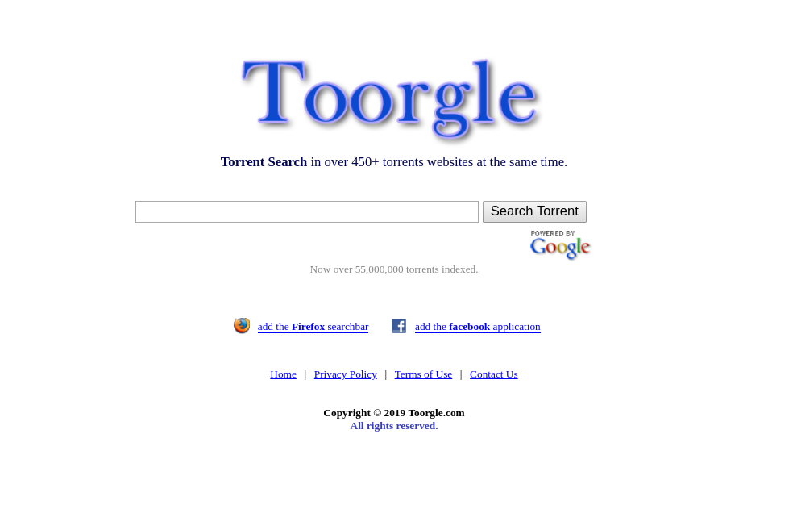

# INTERNET

| [Back to Home](index.md) | [Back to Applications](apps.md)
| --- | --- |

#### Here are listed **38** programs for this category.

  <label for="app-search-input" style="font-weight: bold;">Search applications:</label>
  <input type="search" id="app-search-input" placeholder="Type a name or keyword..." autocomplete="off"
    style="width: 100%; max-width: 480px; padding: 0.5em 0.75em; margin-top: 0.25em; font-size: 1em; border: 1px solid #999; border-radius: 4px; box-sizing: border-box;">
  

#### *Categories*

  <a class="cat-pill" href="appimages.html">AppImages</a>
  •
  <a class="cat-pill" href="ai.html">ai</a>
  •
  <a class="cat-pill" href="am-utils.html">am-utils</a>
  •
  <a class="cat-pill" href="android.html">android</a>
  •
  <a class="cat-pill" href="appimage-on-the-fly.html">appimage-on-the-fly</a>
  •
  <a class="cat-pill" href="audio.html">audio</a>
  •
  <a class="cat-pill" href="comic.html">comic</a>
  •
  <a class="cat-pill" href="command-line.html">command-line</a>
  •
  <a class="cat-pill" href="communication.html">communication</a>
  •
  <a class="cat-pill" href="disk.html">disk</a>
  •
  <a class="cat-pill" href="education.html">education</a>
  •
  <a class="cat-pill" href="emulator.html">emulator</a>
  •
  <a class="cat-pill" href="file-manager.html">file-manager</a>
  •
  <a class="cat-pill" href="finance.html">finance</a>
  •
  <a class="cat-pill" href="game.html">game</a>
  •
  <a class="cat-pill" href="gnome.html">gnome</a>
  •
  <a class="cat-pill" href="graphic.html">graphic</a>
  •
  <a class="cat-pill cat-pill--all" href="internet.html">internet</a>
  •
  <a class="cat-pill" href="kde.html">kde</a>
  •
  <a class="cat-pill" href="metapackages.html">metapackages</a>
  •
  <a class="cat-pill" href="office.html">office</a>
  •
  <a class="cat-pill" href="password.html">password</a>
  •
  <a class="cat-pill" href="portable.html">Portable</a>
  •
  <a class="cat-pill" href="portable-cli.html">portable-cli</a>
  •
  <a class="cat-pill" href="portable-desktop.html">portable-desktop</a>
  •
  <a class="cat-pill" href="steam.html">steam</a>
  •
  <a class="cat-pill" href="system-monitor.html">system-monitor</a>
  •
  <a class="cat-pill" href="video.html">video</a>
  •
  <a class="cat-pill" href="virtual-machine.html">virtual-machine</a>
  •
  <a class="cat-pill" href="wallet.html">wallet</a>
  •
  <a class="cat-pill" href="web-app.html">web-app</a>
  •
  <a class="cat-pill" href="web-browser.html">web-browser</a>
  •
  <a class="cat-pill" href="wine.html">wine</a>
  •
  <a class="cat-pill" href="youtube.html">youtube</a>

-----------------

***NOTE, Installer scripts (blob/raw) are provided for reading only: do not run them manually! Use "[AM](https://github.com/ivan-hc/AM)" or "[AppMan](https://github.com/ivan-hc/AppMan)" instead.***

-----------------

| ICON | PACKAGE NAME | DESCRIPTION | INSTALLER |
| --- | --- | --- | --- |
|  | [***adobe-flash-player***](apps/adobe-flash-player.md) | *Unofficial port. Adobe Flash is a mostly discontinued multimedia software platform used for production of animations, rich internet applications, desktop applications, mobile apps, mobile games, and embedded web browser video players. Over 67 billion devices use adobe flash player!*..[ *read more* ](apps/adobe-flash-player.md)*!* | [*blob*](https://github.com/ivan-hc/AM/blob/main/programs/x86_64/adobe-flash-player) **/** [*raw*](https://raw.githubusercontent.com/ivan-hc/AM/main/programs/x86_64/adobe-flash-player) |
|  | [***animecoin***](apps/animecoin.md) | *Animecoin is a free open source peer-to-peer electronic cash system that is completely decentralized, without the need for a central server or trusted parties. Users hold the crypto keys to their own money and transact directly with each other, with the help of a P2P network to check for double-spending.*..[ *read more* ](apps/animecoin.md)*!* | [*blob*](https://github.com/ivan-hc/AM/blob/main/programs/x86_64/animecoin) **/** [*raw*](https://raw.githubusercontent.com/ivan-hc/AM/main/programs/x86_64/animecoin) |
|  | [***animeko***](apps/animeko.md) | *A one-stop platform for finding, following, and watching anime, featuring danmaku (bullet comments) and cloud-based collection synchronization (Bangumi), offline caching, BitTorrent, and cloud-based danmaku filtering.*..[ *read more* ](apps/animeko.md)*!* | [*blob*](https://github.com/ivan-hc/AM/blob/main/programs/x86_64/animeko) **/** [*raw*](https://raw.githubusercontent.com/ivan-hc/AM/main/programs/x86_64/animeko) |
|  | [***ant-downloader***](apps/ant-downloader.md) | *BitTorrent Client developed by golang, angular, electron.*..[ *read more* ](apps/ant-downloader.md)*!* | [*blob*](https://github.com/ivan-hc/AM/blob/main/programs/x86_64/ant-downloader) **/** [*raw*](https://raw.githubusercontent.com/ivan-hc/AM/main/programs/x86_64/ant-downloader) |
|  | [***cabal-desktop***](apps/cabal-desktop.md) | *Cabal p2p offline-first desktop application.*..[ *read more* ](apps/cabal-desktop.md)*!* | [*blob*](https://github.com/ivan-hc/AM/blob/main/programs/x86_64/cabal-desktop) **/** [*raw*](https://raw.githubusercontent.com/ivan-hc/AM/main/programs/x86_64/cabal-desktop) |
|  | [***dezor***](apps/dezor.md) | *The web browser including VPN and Adblocker.*..[ *read more* ](apps/dezor.md)*!* | [*blob*](https://github.com/ivan-hc/AM/blob/main/programs/x86_64/dezor) **/** [*raw*](https://raw.githubusercontent.com/ivan-hc/AM/main/programs/x86_64/dezor) |
|  | [***electorrent***](apps/electorrent.md) | *A remote control Torrent client.*..[ *read more* ](apps/electorrent.md)*!* | [*blob*](https://github.com/ivan-hc/AM/blob/main/programs/x86_64/electorrent) **/** [*raw*](https://raw.githubusercontent.com/ivan-hc/AM/main/programs/x86_64/electorrent) |
|  | [***haveno-reto***](apps/haveno-reto.md) | *Decentralized P2P exchange built on Monero and Tor.*..[ *read more* ](apps/haveno-reto.md)*!* | [*blob*](https://github.com/ivan-hc/AM/blob/main/programs/x86_64/haveno-reto) **/** [*raw*](https://raw.githubusercontent.com/ivan-hc/AM/main/programs/x86_64/haveno-reto) |
|  | [***hide.me***](apps/hide.me.md) | *Hide.me CLI VPN client for Linux.*..[ *read more* ](apps/hide.me.md)*!* | [*blob*](https://github.com/ivan-hc/AM/blob/main/programs/x86_64/hide.me) **/** [*raw*](https://raw.githubusercontent.com/ivan-hc/AM/main/programs/x86_64/hide.me) |
|  | [***hydra***](apps/hydra.md) | *Game launcher with its own embedded bittorrent client.*..[ *read more* ](apps/hydra.md)*!* | [*blob*](https://github.com/ivan-hc/AM/blob/main/programs/x86_64/hydra) **/** [*raw*](https://raw.githubusercontent.com/ivan-hc/AM/main/programs/x86_64/hydra) |
|  | [***migu***](apps/migu.md) | *Stream anime torrents, real-time with no waiting for downloads.*..[ *read more* ](apps/migu.md)*!* | [*blob*](https://github.com/ivan-hc/AM/blob/main/programs/x86_64/migu) **/** [*raw*](https://raw.githubusercontent.com/ivan-hc/AM/main/programs/x86_64/migu) |
|  | [***moose***](apps/moose.md) | *An application to stream, cast and download torrents.*..[ *read more* ](apps/moose.md)*!* | [*blob*](https://github.com/ivan-hc/AM/blob/main/programs/x86_64/moose) **/** [*raw*](https://raw.githubusercontent.com/ivan-hc/AM/main/programs/x86_64/moose) |
|  | [***n3h***](apps/n3h.md) | *Nodejs implementation of holochain networking / p2p backend process.*..[ *read more* ](apps/n3h.md)*!* | [*blob*](https://github.com/ivan-hc/AM/blob/main/programs/x86_64/n3h) **/** [*raw*](https://raw.githubusercontent.com/ivan-hc/AM/main/programs/x86_64/n3h) |
|  | [***nyaa***](apps/nyaa.md) | *A nyaa.si tui tool for browsing and downloading torrents.*..[ *read more* ](apps/nyaa.md)*!* | [*blob*](https://github.com/ivan-hc/AM/blob/main/programs/x86_64/nyaa) **/** [*raw*](https://raw.githubusercontent.com/ivan-hc/AM/main/programs/x86_64/nyaa) |
|  | [***nym-vpn***](apps/nym-vpn.md) | *Cross-platform open source VPN client built in Rust, with mixnet anonymity and WireGuard speed. Protects metadata, not just IP addresses. Zero-knowledge payments for unlinkable online activities.*..[ *read more* ](apps/nym-vpn.md)*!* | [*blob*](https://github.com/ivan-hc/AM/blob/main/programs/x86_64/nym-vpn) **/** [*raw*](https://raw.githubusercontent.com/ivan-hc/AM/main/programs/x86_64/nym-vpn) |
|  | [***oblivion-desktop***](apps/oblivion-desktop.md) | *Unofficial Warp Client, Oblivion provides a secure, optimised internet access.*..[ *read more* ](apps/oblivion-desktop.md)*!* | [*blob*](https://github.com/ivan-hc/AM/blob/main/programs/x86_64/oblivion-desktop) **/** [*raw*](https://raw.githubusercontent.com/ivan-hc/AM/main/programs/x86_64/oblivion-desktop) |
|  | [***p2p-chat***](apps/p2p-chat.md) | *P2P LAN chatting and file sharing tool.*..[ *read more* ](apps/p2p-chat.md)*!* | [*blob*](https://github.com/ivan-hc/AM/blob/main/programs/x86_64/p2p-chat) **/** [*raw*](https://raw.githubusercontent.com/ivan-hc/AM/main/programs/x86_64/p2p-chat) |
|  | [***p2pderivatives***](apps/p2pderivatives.md) | *Enables users to enter into Discreet Log Contracts.*..[ *read more* ](apps/p2pderivatives.md)*!* | [*blob*](https://github.com/ivan-hc/AM/blob/main/programs/x86_64/p2pderivatives) **/** [*raw*](https://raw.githubusercontent.com/ivan-hc/AM/main/programs/x86_64/p2pderivatives) |
|  | [***qbittorrent***](apps/qbittorrent.md) | *A powerful QT-based Bittorrent Client, official AppImage.*..[ *read more* ](apps/qbittorrent.md)*!* | [*blob*](https://github.com/ivan-hc/AM/blob/main/programs/x86_64/qbittorrent) **/** [*raw*](https://raw.githubusercontent.com/ivan-hc/AM/main/programs/x86_64/qbittorrent) |
|  | [***qbittorrent-enhanced***](apps/qbittorrent-enhanced.md) | *Unofficial qBittorrent Enhanced, based on qBittorrent.*..[ *read more* ](apps/qbittorrent-enhanced.md)*!* | [*blob*](https://github.com/ivan-hc/AM/blob/main/programs/x86_64/qbittorrent-enhanced) **/** [*raw*](https://raw.githubusercontent.com/ivan-hc/AM/main/programs/x86_64/qbittorrent-enhanced) |
|  | [***quiet***](apps/quiet.md) | *A private, p2p alternative to Slack and Discord built on Tor & IPFS*..[ *read more* ](apps/quiet.md)*!* | [*blob*](https://github.com/ivan-hc/AM/blob/main/programs/x86_64/quiet) **/** [*raw*](https://raw.githubusercontent.com/ivan-hc/AM/main/programs/x86_64/quiet) |
|  | [***rats-search***](apps/rats-search.md) | *P2P BitTorrent search engine.*..[ *read more* ](apps/rats-search.md)*!* | [*blob*](https://github.com/ivan-hc/AM/blob/main/programs/x86_64/rats-search) **/** [*raw*](https://raw.githubusercontent.com/ivan-hc/AM/main/programs/x86_64/rats-search) |
|  | [***riseup-vpn***](apps/riseup-vpn.md) | *Unofficial, RiseupVPN is an easy, fast, and secure VPN service from riseup.net.*..[ *read more* ](apps/riseup-vpn.md)*!* | [*blob*](https://github.com/ivan-hc/AM/blob/main/programs/x86_64/riseup-vpn) **/** [*raw*](https://raw.githubusercontent.com/ivan-hc/AM/main/programs/x86_64/riseup-vpn) |
|  | [***sentinel***](apps/sentinel.md) | *An open-source decentralized VPN network application.*..[ *read more* ](apps/sentinel.md)*!* | [*blob*](https://github.com/ivan-hc/AM/blob/main/programs/x86_64/sentinel) **/** [*raw*](https://raw.githubusercontent.com/ivan-hc/AM/main/programs/x86_64/sentinel) |
|  | [***sniffnet***](apps/sniffnet.md) | *Sniffnet is a network monitoring tool to help you easily keep track of your Internet traffic. Whether you want to gather statistics, you’re curious to see who you are exchanging data with, or you need to inspect more in depth what's going on in your network, this app will get you covered.*..[ *read more* ](apps/sniffnet.md)*!* | [*blob*](https://github.com/ivan-hc/AM/blob/main/programs/x86_64/sniffnet) **/** [*raw*](https://raw.githubusercontent.com/ivan-hc/AM/main/programs/x86_64/sniffnet) |
|  | [***tixati***](apps/tixati.md) | *A New and Powerful P2P System 100% Free, Simple and Easy to Use Bittorrent Client.*..[ *read more* ](apps/tixati.md)*!* | [*blob*](https://github.com/ivan-hc/AM/blob/main/programs/x86_64/tixati) **/** [*raw*](https://raw.githubusercontent.com/ivan-hc/AM/main/programs/x86_64/tixati) |
|  | [***torrents_digger***](apps/torrents_digger.md) | *Torrents Digger searches already available torrents from internet.*..[ *read more* ](apps/torrents_digger.md)*!* | [*blob*](https://github.com/ivan-hc/AM/blob/main/programs/x86_64/torrents_digger) **/** [*raw*](https://raw.githubusercontent.com/ivan-hc/AM/main/programs/x86_64/torrents_digger) |
|  | [***torrenttools***](apps/torrenttools.md) | *Cli tool to inspect/create/edit BitTorrent metafiles.*..[ *read more* ](apps/torrenttools.md)*!* | [*blob*](https://github.com/ivan-hc/AM/blob/main/programs/x86_64/torrenttools) **/** [*raw*](https://raw.githubusercontent.com/ivan-hc/AM/main/programs/x86_64/torrenttools) |
|  | [***toru***](apps/toru.md) | *Bittorrent streaming CLI tool. Stream anime torrents real-time.*..[ *read more* ](apps/toru.md)*!* | [*blob*](https://github.com/ivan-hc/AM/blob/main/programs/x86_64/toru) **/** [*raw*](https://raw.githubusercontent.com/ivan-hc/AM/main/programs/x86_64/toru) |
|  | [***transmission-gtk***](apps/transmission-gtk.md) | *Unofficial. Fast, easy, and free BitTorrent client, GTK+ GUI.*..[ *read more* ](apps/transmission-gtk.md)*!* | [*blob*](https://github.com/ivan-hc/AM/blob/main/programs/x86_64/transmission-gtk) **/** [*raw*](https://raw.githubusercontent.com/ivan-hc/AM/main/programs/x86_64/transmission-gtk) |
|  | [***transmission-qt***](apps/transmission-qt.md) | *Unofficial, Fast, easy, and free BitTorrent client, Qt GUI.*..[ *read more* ](apps/transmission-qt.md)*!* | [*blob*](https://github.com/ivan-hc/AM/blob/main/programs/x86_64/transmission-qt) **/** [*raw*](https://raw.githubusercontent.com/ivan-hc/AM/main/programs/x86_64/transmission-qt) |
|  | [***trgui-ng***](apps/trgui-ng.md) | *Remote GUI for Transmission torrent daemon.*..[ *read more* ](apps/trgui-ng.md)*!* | [*blob*](https://github.com/ivan-hc/AM/blob/main/programs/x86_64/trgui-ng) **/** [*raw*](https://raw.githubusercontent.com/ivan-hc/AM/main/programs/x86_64/trgui-ng) |
|  | [***varia***](apps/varia.md) | *Unofficial. Aria2-based advanced download manager with support for downloading files, torrents, video and audio + support for Chromium and Firefox extension.*..[ *read more* ](apps/varia.md)*!* | [*blob*](https://github.com/ivan-hc/AM/blob/main/programs/x86_64/varia) **/** [*raw*](https://raw.githubusercontent.com/ivan-hc/AM/main/programs/x86_64/varia) |
|  | [***warp***](apps/warp.md) | *Unofficial. Fast and secure file transfer through internet or local network exchanging a word-based code.*..[ *read more* ](apps/warp.md)*!* | [*blob*](https://github.com/ivan-hc/AM/blob/main/programs/x86_64/warp) **/** [*raw*](https://raw.githubusercontent.com/ivan-hc/AM/main/programs/x86_64/warp) |
|  | [***waterfox***](apps/waterfox.md) | *A privacy-focused web browser engineered to give you speed, control, and peace of mind on the internet.*..[ *read more* ](apps/waterfox.md)*!* | [*blob*](https://github.com/ivan-hc/AM/blob/main/programs/x86_64/waterfox) **/** [*raw*](https://raw.githubusercontent.com/ivan-hc/AM/main/programs/x86_64/waterfox) |
|  | [***wyrmhole***](apps/wyrmhole.md) | *A cross-platform GUI wrapper for the p2p magic-wormhole.rs library.*..[ *read more* ](apps/wyrmhole.md)*!* | [*blob*](https://github.com/ivan-hc/AM/blob/main/programs/x86_64/wyrmhole) **/** [*raw*](https://raw.githubusercontent.com/ivan-hc/AM/main/programs/x86_64/wyrmhole) |
|  | [***xchat***](apps/xchat.md) | *Chat with other people using Internet Relay Chat.*..[ *read more* ](apps/xchat.md)*!* | [*blob*](https://github.com/ivan-hc/AM/blob/main/programs/x86_64/xchat) **/** [*raw*](https://raw.githubusercontent.com/ivan-hc/AM/main/programs/x86_64/xchat) |
|  | [***yts-streaming***](apps/yts-streaming.md) | *Stream or play yts and torrent movies.*..[ *read more* ](apps/yts-streaming.md)*!* | [*blob*](https://github.com/ivan-hc/AM/blob/main/programs/x86_64/yts-streaming) **/** [*raw*](https://raw.githubusercontent.com/ivan-hc/AM/main/programs/x86_64/yts-streaming) |

---

You can improve these pages via a [pull request](https://github.com/Portable-Linux-Apps/Portable-Linux-Apps.github.io/pulls) to this site's [GitHub repository](https://github.com/Portable-Linux-Apps/Portable-Linux-Apps.github.io), or report any problems related to the installation scripts in the '[issue](https://github.com/ivan-hc/AM/issues)' section of the main database, at [https://github.com/ivan-hc/AM](https://github.com/ivan-hc/AM).

***PORTABLE-LINUX-APPS.github.io is my gift to the Linux community and was made with love for GNU/Linux and the Open Source philosophy.***

---

| [Back to Home](index.md) | [Back to Applications](apps.md)
| --- | --- |

--------

# Contacts
- **Ivan-HC** *on* [**GitHub**](https://github.com/ivan-hc)
- **AM-Ivan** *on* [**Reddit**](https://www.reddit.com/u/am-ivan)

###### *You can support me and my work on [**ko-fi.com**](https://ko-fi.com/IvanAlexHC) and [**PayPal.me**](https://paypal.me/IvanAlexHC). Thank you!*

--------

*© 2020-present Ivan Alessandro Sala aka 'Ivan-HC'* - I'm here just for fun!

