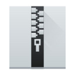
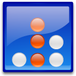
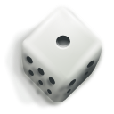
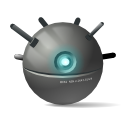
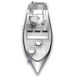
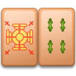
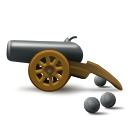

# KDE

| [Home](https://portable-linux-apps.github.io/) |
| --- |

#### Here are listed **6** programs and **67** items for this category and managed by [AM](https://github.com/ivan-hc/AM) 	and [AppMan](https://github.com/ivan-hc/AppMan) for the x86_64 architecture.

*Use your browser's built-in search tool to easily navigate to this page or use the tags below.*

| [Back to Applications](https://portable-linux-apps.github.io/apps.html) |
| --- |

#### *Categories*

***[AppImages](https://portable-linux-apps.github.io/appimages.html)*** 		 - ***[android](https://portable-linux-apps.github.io/android.html)*** - ***[audio](https://portable-linux-apps.github.io/audio.html)*** - ***[comic](https://portable-linux-apps.github.io/comic.html)*** - ***[command-line](https://portable-linux-apps.github.io/command-line.html)*** - ***[communication](https://portable-linux-apps.github.io/communication.html)*** - ***[disk](https://portable-linux-apps.github.io/disk.html)*** - ***[education](https://portable-linux-apps.github.io/education.html)*** - ***[file-manager](https://portable-linux-apps.github.io/file-manager.html)*** - ***[finance](https://portable-linux-apps.github.io/finance.html)*** - ***[game](https://portable-linux-apps.github.io/game.html)*** - ***[gnome](https://portable-linux-apps.github.io/gnome.html)*** - ***[graphic](https://portable-linux-apps.github.io/graphic.html)*** - ***[internet](https://portable-linux-apps.github.io/internet.html)*** - ***[kde](https://portable-linux-apps.github.io/kde.html)*** - ***[office](https://portable-linux-apps.github.io/office.html)*** - ***[password](https://portable-linux-apps.github.io/password.html)*** - ***[steam](https://portable-linux-apps.github.io/steam.html)*** - ***[system-monitor](https://portable-linux-apps.github.io/system-monitor.html)*** - ***[video](https://portable-linux-apps.github.io/video.html)*** - ***[web-app](https://portable-linux-apps.github.io/web-app.html)*** - ***[web-browser](https://portable-linux-apps.github.io/web-browser.html)*** - ***[wine](https://portable-linux-apps.github.io/wine.html)***

-----------------

*NOTE, the installer scripts in the "INSTALLER" column are intended for use via "AM", and are therefore dedicated to a system-wide 	installation of applications (in /opt), and all that "AppMan" does is convert those scripts for local installation, changing the paths. 	**They are listed here for reading purposes only**!*

*Should you decide to run them manually, the only way to remove the application is to run 	the command "`sudo /opt/appname/remove`", where "appname" is the name of the application directory containing the "remove" script. 	Likewise, you can also update applications by running the "AM-updater" script in the same directory.*

*The "AM" project allow the autonomy of installed apps, regardless of the presence of "AM" itself in the system. However, it is strongly 	recommended to use "AM" and "AppMan" to take full advantage of all the benefits you could get from an application installed in this way.*

*If you are here just to download apps manually, click on the program name and check the URL(s) on the application page. This site does not 	provide direct links, for security reasons, but it does provide the exact sources and references where you can find them!*

*Transparency and credibility are the focus of this catalog. Happy exploring!*

-----------------

| ICON | PACKAGE NAME | DESCRIPTION | INSTALLER |
| --- | --- | --- | --- |
|  | [***ark***](apps/ark.md) | *Unofficial. Archiving tool for .zip/.tar/.rar and more. This script installs the full "kdeutils" suite.*..[ *read more* ](apps/ark.md)*!* | [*blob*](https://github.com/ivan-hc/AM/blob/main/programs/x86_64/ark) **/** [*raw*](https://raw.githubusercontent.com/ivan-hc/AM/main/programs/x86_64/ark) |
|  | [***bomber***](apps/bomber.md) | *Unofficial. Arcade spaceship game. This script installs the full "kdegames" suite.*..[ *read more* ](apps/bomber.md)*!* | [*blob*](https://github.com/ivan-hc/AM/blob/main/programs/x86_64/bomber) **/** [*raw*](https://raw.githubusercontent.com/ivan-hc/AM/main/programs/x86_64/bomber) |
|  | [***bovo***](apps/bovo.md) | *Unofficial. Five in a row game from. This script installs the full "kdegames" suite.*..[ *read more* ](apps/bovo.md)*!* | [*blob*](https://github.com/ivan-hc/AM/blob/main/programs/x86_64/bovo) **/** [*raw*](https://raw.githubusercontent.com/ivan-hc/AM/main/programs/x86_64/bovo) |
|  | [***filelight***](apps/filelight.md) | *Unofficial. View disk usage information. This script installs the full "kdeutils" suite.*..[ *read more* ](apps/filelight.md)*!* | [*blob*](https://github.com/ivan-hc/AM/blob/main/programs/x86_64/filelight) **/** [*raw*](https://raw.githubusercontent.com/ivan-hc/AM/main/programs/x86_64/filelight) |
|  | [***francis***](apps/francis.md) | *Pomodoro technique, get more productive. This script installs the full "kdeutils" suite.*..[ *read more* ](apps/francis.md)*!* | [*blob*](https://github.com/ivan-hc/AM/blob/main/programs/x86_64/francis) **/** [*raw*](https://raw.githubusercontent.com/ivan-hc/AM/main/programs/x86_64/francis) |
|  | [***granatier***](apps/granatier.md) | *Bomberman clone. This script installs the full "kdegames" suite.*..[ *read more* ](apps/granatier.md)*!* | [*blob*](https://github.com/ivan-hc/AM/blob/main/programs/x86_64/granatier) **/** [*raw*](https://raw.githubusercontent.com/ivan-hc/AM/main/programs/x86_64/granatier) |
|  | [***isoimagewriter***](apps/isoimagewriter.md) | *Write an ISO Image to a USB Disk. This script installs the full "kdeutils" suite.*..[ *read more* ](apps/isoimagewriter.md)*!* | [*blob*](https://github.com/ivan-hc/AM/blob/main/programs/x86_64/isoimagewriter) **/** [*raw*](https://raw.githubusercontent.com/ivan-hc/AM/main/programs/x86_64/isoimagewriter) |
|  | [***kajongg***](apps/kajongg.md) | *Unofficial, An ancient Chinese board game for 4 players. This script installs the full "kdegames" suite.*..[ *read more* ](apps/kajongg.md)*!* | [*blob*](https://github.com/ivan-hc/AM/blob/main/programs/x86_64/kajongg) **/** [*raw*](https://raw.githubusercontent.com/ivan-hc/AM/main/programs/x86_64/kajongg) |
|  | [***kalm***](apps/kalm.md) | *Unofficial, Teach you different breathing techniques. This script installs the full "kdeutils" suite.*..[ *read more* ](apps/kalm.md)*!* | [*blob*](https://github.com/ivan-hc/AM/blob/main/programs/x86_64/kalm) **/** [*raw*](https://raw.githubusercontent.com/ivan-hc/AM/main/programs/x86_64/kalm) |
|  | [***kapman***](apps/kapman.md) | *Pac-Man clone. This script installs the full "kdegames" suite.*..[ *read more* ](apps/kapman.md)*!* | [*blob*](https://github.com/ivan-hc/AM/blob/main/programs/x86_64/kapman) **/** [*raw*](https://raw.githubusercontent.com/ivan-hc/AM/main/programs/x86_64/kapman) |
|  | [***kate***](apps/kate.md) | *Unofficial, A multi-document editor part of KDE. This script installs the full "kdeutils" suite.*..[ *read more* ](apps/kate.md)*!* | [*blob*](https://github.com/ivan-hc/AM/blob/main/programs/x86_64/kate) **/** [*raw*](https://raw.githubusercontent.com/ivan-hc/AM/main/programs/x86_64/kate) |
|  | [***katomic***](apps/katomic.md) | *Edu. game based around molecular geometry. This script installs the full "kdegames" suite.*..[ *read more* ](apps/katomic.md)*!* | [*blob*](https://github.com/ivan-hc/AM/blob/main/programs/x86_64/katomic) **/** [*raw*](https://raw.githubusercontent.com/ivan-hc/AM/main/programs/x86_64/katomic) |
|  | [***kbackup***](apps/kbackup.md) | *Back up your data. This script installs the full "kdeutils" suite.*..[ *read more* ](apps/kbackup.md)*!* | [*blob*](https://github.com/ivan-hc/AM/blob/main/programs/x86_64/kbackup) **/** [*raw*](https://raw.githubusercontent.com/ivan-hc/AM/main/programs/x86_64/kbackup) |
|  | [***kblackbox***](apps/kblackbox.md) | *Unofficial, A game of hide and seek. This script installs the full "kdegames" suite.*..[ *read more* ](apps/kblackbox.md)*!* | [*blob*](https://github.com/ivan-hc/AM/blob/main/programs/x86_64/kblackbox) **/** [*raw*](https://raw.githubusercontent.com/ivan-hc/AM/main/programs/x86_64/kblackbox) |
|  | [***kblocks***](apps/kblocks.md) | *Unofficial, Classic Tetris / falling blocks game. This script installs the full "kdegames" suite.*..[ *read more* ](apps/kblocks.md)*!* | [*blob*](https://github.com/ivan-hc/AM/blob/main/programs/x86_64/kblocks) **/** [*raw*](https://raw.githubusercontent.com/ivan-hc/AM/main/programs/x86_64/kblocks) |
|  | [***kbounce***](apps/kbounce.md) | *Unofficial, Fill the field game. This script installs the full "kdegames" suite.*..[ *read more* ](apps/kbounce.md)*!* | [*blob*](https://github.com/ivan-hc/AM/blob/main/programs/x86_64/kbounce) **/** [*raw*](https://raw.githubusercontent.com/ivan-hc/AM/main/programs/x86_64/kbounce) |
|  | [***kbreakout***](apps/kbreakout.md) | *Unofficial, Destroy bricks without losing the ball. This script installs the full "kdegames" suite.*..[ *read more* ](apps/kbreakout.md)*!* | [*blob*](https://github.com/ivan-hc/AM/blob/main/programs/x86_64/kbreakout) **/** [*raw*](https://raw.githubusercontent.com/ivan-hc/AM/main/programs/x86_64/kbreakout) |
|  | [***kcalc***](apps/kcalc.md) | *Unofficial, Scientific Calculator. This script installs the full "kdeutils" suite.*..[ *read more* ](apps/kcalc.md)*!* | [*blob*](https://github.com/ivan-hc/AM/blob/main/programs/x86_64/kcalc) **/** [*raw*](https://raw.githubusercontent.com/ivan-hc/AM/main/programs/x86_64/kcalc) |
|  | [***kcharselect***](apps/kcharselect.md) | *Unofficial, Character Selector. This script installs the full "kdeutils" suite.*..[ *read more* ](apps/kcharselect.md)*!* | [*blob*](https://github.com/ivan-hc/AM/blob/main/programs/x86_64/kcharselect) **/** [*raw*](https://raw.githubusercontent.com/ivan-hc/AM/main/programs/x86_64/kcharselect) |
|  | [***kclock***](apps/kclock.md) | *Unofficial, A universal clock application. This script installs the full "kdeutils" suite.*..[ *read more* ](apps/kclock.md)*!* | [*blob*](https://github.com/ivan-hc/AM/blob/main/programs/x86_64/kclock) **/** [*raw*](https://raw.githubusercontent.com/ivan-hc/AM/main/programs/x86_64/kclock) |
|  | [***kdebugsettings***](apps/kdebugsettings.md) | *Unofficial, Edits displayed QLoggingCategory. This script installs the full "kdeutils" suite.*..[ *read more* ](apps/kdebugsettings.md)*!* | [*blob*](https://github.com/ivan-hc/AM/blob/main/programs/x86_64/kdebugsettings) **/** [*raw*](https://raw.githubusercontent.com/ivan-hc/AM/main/programs/x86_64/kdebugsettings) |
|  | [***kdegames***](apps/kdegames.md) | *Unofficial, Full & updatable KDE Games suite, metapackage.*..[ *read more* ](apps/kdegames.md)*!* | [*blob*](https://github.com/ivan-hc/AM/blob/main/programs/x86_64/kdegames) **/** [*raw*](https://raw.githubusercontent.com/ivan-hc/AM/main/programs/x86_64/kdegames) |
|  | [***kdenlive***](apps/kdenlive.md) | *A powerful Video Editor provided by KDE.*..[ *read more* ](apps/kdenlive.md)*!* | [*blob*](https://github.com/ivan-hc/AM/blob/main/programs/x86_64/kdenlive) **/** [*raw*](https://raw.githubusercontent.com/ivan-hc/AM/main/programs/x86_64/kdenlive) |
|  | [***kdeutils***](apps/kdeutils.md) | *Unofficial, Full & updatable KDE Utils suite, metapackage.*..[ *read more* ](apps/kdeutils.md)*!* | [*blob*](https://github.com/ivan-hc/AM/blob/main/programs/x86_64/kdeutils) **/** [*raw*](https://raw.githubusercontent.com/ivan-hc/AM/main/programs/x86_64/kdeutils) |
|  | [***kdf***](apps/kdf.md) | *Unofficial, view Disk Usage. This script installs the full "kdeutils" suite.*..[ *read more* ](apps/kdf.md)*!* | [*blob*](https://github.com/ivan-hc/AM/blob/main/programs/x86_64/kdf) **/** [*raw*](https://raw.githubusercontent.com/ivan-hc/AM/main/programs/x86_64/kdf) |
|  | [***kdialog***](apps/kdialog.md) | *Unofficial, a dialog utility. This script installs the full "kdeutils" suite.*..[ *read more* ](apps/kdialog.md)*!* | [*blob*](https://github.com/ivan-hc/AM/blob/main/programs/x86_64/kdialog) **/** [*raw*](https://raw.githubusercontent.com/ivan-hc/AM/main/programs/x86_64/kdialog) |
|  | [***kdiamond***](apps/kdiamond.md) | *Unofficial, Diamond game. This script installs the full "kdegames" suite.*..[ *read more* ](apps/kdiamond.md)*!* | [*blob*](https://github.com/ivan-hc/AM/blob/main/programs/x86_64/kdiamond) **/** [*raw*](https://raw.githubusercontent.com/ivan-hc/AM/main/programs/x86_64/kdiamond) |
|  | [***keditbookmarks***](apps/keditbookmarks.md) | *Unofficial, Bookmarks editor. This script installs the full "kdeutils" suite.*..[ *read more* ](apps/keditbookmarks.md)*!* | [*blob*](https://github.com/ivan-hc/AM/blob/main/programs/x86_64/keditbookmarks) **/** [*raw*](https://raw.githubusercontent.com/ivan-hc/AM/main/programs/x86_64/keditbookmarks) |
|  | [***keysmith***](apps/keysmith.md) | *Generates tokens for your two-factor logins. This script installs the full "kdeutils" suite.*..[ *read more* ](apps/keysmith.md)*!* | [*blob*](https://github.com/ivan-hc/AM/blob/main/programs/x86_64/keysmith) **/** [*raw*](https://raw.githubusercontent.com/ivan-hc/AM/main/programs/x86_64/keysmith) |
|  | [***kfind***](apps/kfind.md) | *A search tool. This script installs the full "kdeutils" suite.*..[ *read more* ](apps/kfind.md)*!* | [*blob*](https://github.com/ivan-hc/AM/blob/main/programs/x86_64/kfind) **/** [*raw*](https://raw.githubusercontent.com/ivan-hc/AM/main/programs/x86_64/kfind) |
|  | [***kfourinline***](apps/kfourinline.md) | *Unofficial, 4 in row game. This script installs the full "kdegames" suite.*..[ *read more* ](apps/kfourinline.md)*!* | [*blob*](https://github.com/ivan-hc/AM/blob/main/programs/x86_64/kfourinline) **/** [*raw*](https://raw.githubusercontent.com/ivan-hc/AM/main/programs/x86_64/kfourinline) |
|  | [***kgoldrunner***](apps/kgoldrunner.md) | *Unofficial, A game with a runner and gold. This script installs the full "kdegames" suite.*..[ *read more* ](apps/kgoldrunner.md)*!* | [*blob*](https://github.com/ivan-hc/AM/blob/main/programs/x86_64/kgoldrunner) **/** [*raw*](https://raw.githubusercontent.com/ivan-hc/AM/main/programs/x86_64/kgoldrunner) |
|  | [***kgpg***](apps/kgpg.md) | *A GnuPG frontend. This script installs the full "kdeutils" suite.*..[ *read more* ](apps/kgpg.md)*!* | [*blob*](https://github.com/ivan-hc/AM/blob/main/programs/x86_64/kgpg) **/** [*raw*](https://raw.githubusercontent.com/ivan-hc/AM/main/programs/x86_64/kgpg) |
|  | [***kigo***](apps/kigo.md) | *Unofficial, Go strategic board game for two players. This script installs the full "kdegames" suite.*..[ *read more* ](apps/kigo.md)*!* | [*blob*](https://github.com/ivan-hc/AM/blob/main/programs/x86_64/kigo) **/** [*raw*](https://raw.githubusercontent.com/ivan-hc/AM/main/programs/x86_64/kigo) |
|  | [***killbots***](apps/killbots.md) | *Unofficial, Port of the classic console game Robots. This script installs the full "kdegames" suite.*..[ *read more* ](apps/killbots.md)*!* | [*blob*](https://github.com/ivan-hc/AM/blob/main/programs/x86_64/killbots) **/** [*raw*](https://raw.githubusercontent.com/ivan-hc/AM/main/programs/x86_64/killbots) |
|  | [***kiriki***](apps/kiriki.md) | *A dice game. This script installs the full "kdegames" suite.*..[ *read more* ](apps/kiriki.md)*!* | [*blob*](https://github.com/ivan-hc/AM/blob/main/programs/x86_64/kiriki) **/** [*raw*](https://raw.githubusercontent.com/ivan-hc/AM/main/programs/x86_64/kiriki) |
|  | [***kjumpingcube***](apps/kjumpingcube.md) | *A game of dices on a board. This script installs the full "kdegames" suite.*..[ *read more* ](apps/kjumpingcube.md)*!* | [*blob*](https://github.com/ivan-hc/AM/blob/main/programs/x86_64/kjumpingcube) **/** [*raw*](https://raw.githubusercontent.com/ivan-hc/AM/main/programs/x86_64/kjumpingcube) |
|  | [***klickety***](apps/klickety.md) | *Color matching like SameGame. This script installs the full "kdegames" suite.*..[ *read more* ](apps/klickety.md)*!* | [*blob*](https://github.com/ivan-hc/AM/blob/main/programs/x86_64/klickety) **/** [*raw*](https://raw.githubusercontent.com/ivan-hc/AM/main/programs/x86_64/klickety) |
|  | [***klines***](apps/klines.md) | *Inspired by well known game of Color Lines. This script installs the full "kdegames" suite.*..[ *read more* ](apps/klines.md)*!* | [*blob*](https://github.com/ivan-hc/AM/blob/main/programs/x86_64/klines) **/** [*raw*](https://raw.githubusercontent.com/ivan-hc/AM/main/programs/x86_64/klines) |
|  | [***kmahjongg***](apps/kmahjongg.md) | *Unofficial, Mahjongg game. This script installs the full "kdegames" suite.*..[ *read more* ](apps/kmahjongg.md)*!* | [*blob*](https://github.com/ivan-hc/AM/blob/main/programs/x86_64/kmahjongg) **/** [*raw*](https://raw.githubusercontent.com/ivan-hc/AM/main/programs/x86_64/kmahjongg) |
|  | [***kmines***](apps/kmines.md) | *Unofficial, Classic mine game. This script installs the full "kdegames" suite.*..[ *read more* ](apps/kmines.md)*!* | [*blob*](https://github.com/ivan-hc/AM/blob/main/programs/x86_64/kmines) **/** [*raw*](https://raw.githubusercontent.com/ivan-hc/AM/main/programs/x86_64/kmines) |
|  | [***knavalbattle***](apps/knavalbattle.md) | *Unofficial, Battle Ship game. This script installs the full "kdegames" suite.*..[ *read more* ](apps/knavalbattle.md)*!* | [*blob*](https://github.com/ivan-hc/AM/blob/main/programs/x86_64/knavalbattle) **/** [*raw*](https://raw.githubusercontent.com/ivan-hc/AM/main/programs/x86_64/knavalbattle) |
|  | [***knetwalk***](apps/knetwalk.md) | *Unofficial, Net constructing game. This script installs the full "kdegames" suite.*..[ *read more* ](apps/knetwalk.md)*!* | [*blob*](https://github.com/ivan-hc/AM/blob/main/programs/x86_64/knetwalk) **/** [*raw*](https://raw.githubusercontent.com/ivan-hc/AM/main/programs/x86_64/knetwalk) |
|  | [***knights***](apps/knights.md) | *Unofficial, Chess interface for the KDE Platform. This script installs the full "kdegames" suite.*..[ *read more* ](apps/knights.md)*!* | [*blob*](https://github.com/ivan-hc/AM/blob/main/programs/x86_64/knights) **/** [*raw*](https://raw.githubusercontent.com/ivan-hc/AM/main/programs/x86_64/knights) |
|  | [***kolf***](apps/kolf.md) | *Unofficial, Mini Golf game. This script installs the full "kdegames" suite.*..[ *read more* ](apps/kolf.md)*!* | [*blob*](https://github.com/ivan-hc/AM/blob/main/programs/x86_64/kolf) **/** [*raw*](https://raw.githubusercontent.com/ivan-hc/AM/main/programs/x86_64/kolf) |
|  | [***kollision***](apps/kollision.md) | *Unofficial, Dodge red balls in the field. This script installs the full "kdegames" suite.*..[ *read more* ](apps/kollision.md)*!* | [*blob*](https://github.com/ivan-hc/AM/blob/main/programs/x86_64/kollision) **/** [*raw*](https://raw.githubusercontent.com/ivan-hc/AM/main/programs/x86_64/kollision) |
|  | [***kongress***](apps/kongress.md) | *Unofficial, A companion application for conferences. This script installs the full "kdeutils" suite.*..[ *read more* ](apps/kongress.md)*!* | [*blob*](https://github.com/ivan-hc/AM/blob/main/programs/x86_64/kongress) **/** [*raw*](https://raw.githubusercontent.com/ivan-hc/AM/main/programs/x86_64/kongress) |
|  | [***konquest***](apps/konquest.md) | *Game of planets. This script installs the full "kdegames" suite.*..[ *read more* ](apps/konquest.md)*!* | [*blob*](https://github.com/ivan-hc/AM/blob/main/programs/x86_64/konquest) **/** [*raw*](https://raw.githubusercontent.com/ivan-hc/AM/main/programs/x86_64/konquest) |
|  | [***kpat***](apps/kpat.md) | *Unofficial, Klondike, Spider, Free Cell and other Solitaire. This script installs the full "kdegames" suite.*..[ *read more* ](apps/kpat.md)*!* | [*blob*](https://github.com/ivan-hc/AM/blob/main/programs/x86_64/kpat) **/** [*raw*](https://raw.githubusercontent.com/ivan-hc/AM/main/programs/x86_64/kpat) |
|  | [***krecorder***](apps/krecorder.md) | *Unofficial, An audio recording application. This script installs the full "kdeutils" suite.*..[ *read more* ](apps/krecorder.md)*!* | [*blob*](https://github.com/ivan-hc/AM/blob/main/programs/x86_64/krecorder) **/** [*raw*](https://raw.githubusercontent.com/ivan-hc/AM/main/programs/x86_64/krecorder) |
|  | [***kreversi***](apps/kreversi.md) | *Reversi game. This script installs the full "kdegames" suite.*..[ *read more* ](apps/kreversi.md)*!* | [*blob*](https://github.com/ivan-hc/AM/blob/main/programs/x86_64/kreversi) **/** [*raw*](https://raw.githubusercontent.com/ivan-hc/AM/main/programs/x86_64/kreversi) |
|  | [***kshisen***](apps/kshisen.md) | *A game similar to Mahjongg. This script installs the full "kdegames" suite.*..[ *read more* ](apps/kshisen.md)*!* | [*blob*](https://github.com/ivan-hc/AM/blob/main/programs/x86_64/kshisen) **/** [*raw*](https://raw.githubusercontent.com/ivan-hc/AM/main/programs/x86_64/kshisen) |
|  | [***ksirk***](apps/ksirk.md) | *A strategy board game. This script installs the full "kdegames" suite.*..[ *read more* ](apps/ksirk.md)*!* | [*blob*](https://github.com/ivan-hc/AM/blob/main/programs/x86_64/ksirk) **/** [*raw*](https://raw.githubusercontent.com/ivan-hc/AM/main/programs/x86_64/ksirk) |
|  | [***ksnakeduel***](apps/ksnakeduel.md) | *A snake race game. This script installs the full "kdegames" suite.*..[ *read more* ](apps/ksnakeduel.md)*!* | [*blob*](https://github.com/ivan-hc/AM/blob/main/programs/x86_64/ksnakeduel) **/** [*raw*](https://raw.githubusercontent.com/ivan-hc/AM/main/programs/x86_64/ksnakeduel) |
|  | [***kspaceduel***](apps/kspaceduel.md) | *Unofficial, Battleship with satellites in the space. This script installs the full "kdegames" suite.*..[ *read more* ](apps/kspaceduel.md)*!* | [*blob*](https://github.com/ivan-hc/AM/blob/main/programs/x86_64/kspaceduel) **/** [*raw*](https://raw.githubusercontent.com/ivan-hc/AM/main/programs/x86_64/kspaceduel) |
|  | [***ksquares***](apps/ksquares.md) | *Unofficial, Win with most number of completed squares. This script installs the full "kdegames" suite.*..[ *read more* ](apps/ksquares.md)*!* | [*blob*](https://github.com/ivan-hc/AM/blob/main/programs/x86_64/ksquares) **/** [*raw*](https://raw.githubusercontent.com/ivan-hc/AM/main/programs/x86_64/ksquares) |
|  | [***ksudoku***](apps/ksudoku.md) | *Unofficial, Sudoku game. This script installs the full "kdegames" suite.*..[ *read more* ](apps/ksudoku.md)*!* | [*blob*](https://github.com/ivan-hc/AM/blob/main/programs/x86_64/ksudoku) **/** [*raw*](https://raw.githubusercontent.com/ivan-hc/AM/main/programs/x86_64/ksudoku) |
|  | [***kteatime***](apps/kteatime.md) | *Unofficial, A handy timer for steeping tea. This script installs the full "kdeutils" suite.*..[ *read more* ](apps/kteatime.md)*!* | [*blob*](https://github.com/ivan-hc/AM/blob/main/programs/x86_64/kteatime) **/** [*raw*](https://raw.githubusercontent.com/ivan-hc/AM/main/programs/x86_64/kteatime) |
|  | [***ktimer***](apps/ktimer.md) | *Unofficial, Countdown Launcher. This script installs the full "kdeutils" suite.*..[ *read more* ](apps/ktimer.md)*!* | [*blob*](https://github.com/ivan-hc/AM/blob/main/programs/x86_64/ktimer) **/** [*raw*](https://raw.githubusercontent.com/ivan-hc/AM/main/programs/x86_64/ktimer) |
|  | [***ktrip***](apps/ktrip.md) | *Unofficial, KTrip helps you navigate in public transport. This script installs the full "kdeutils" suite.*..[ *read more* ](apps/ktrip.md)*!* | [*blob*](https://github.com/ivan-hc/AM/blob/main/programs/x86_64/ktrip) **/** [*raw*](https://raw.githubusercontent.com/ivan-hc/AM/main/programs/x86_64/ktrip) |
|  | [***ktuberling***](apps/ktuberling.md) | *Unofficial, Simple Mr. Potato game for children. This script installs the full "kdegames" suite.*..[ *read more* ](apps/ktuberling.md)*!* | [*blob*](https://github.com/ivan-hc/AM/blob/main/programs/x86_64/ktuberling) **/** [*raw*](https://raw.githubusercontent.com/ivan-hc/AM/main/programs/x86_64/ktuberling) |
|  | [***kubrick***](apps/kubrick.md) | *Unofficial, A logic game based on Rubik's Cube. This script installs the full "kdegames" suite.*..[ *read more* ](apps/kubrick.md)*!* | [*blob*](https://github.com/ivan-hc/AM/blob/main/programs/x86_64/kubrick) **/** [*raw*](https://raw.githubusercontent.com/ivan-hc/AM/main/programs/x86_64/kubrick) |
|  | [***kwave***](apps/kwave.md) | *A sound & audio editor designed for the KDE Desktop Environment.*..[ *read more* ](apps/kwave.md)*!* | [*blob*](https://github.com/ivan-hc/AM/blob/main/programs/x86_64/kwave) **/** [*raw*](https://raw.githubusercontent.com/ivan-hc/AM/main/programs/x86_64/kwave) |
|  | [***kweather***](apps/kweather.md) | *A convergent weather application. This script installs the full "kdeutils" suite.*..[ *read more* ](apps/kweather.md)*!* | [*blob*](https://github.com/ivan-hc/AM/blob/main/programs/x86_64/kweather) **/** [*raw*](https://raw.githubusercontent.com/ivan-hc/AM/main/programs/x86_64/kweather) |
|  | [***kwrite***](apps/kwrite.md) | *Unofficial, KWrite is a text editor by KDE. This script installs the full "kdeutils" suite.*..[ *read more* ](apps/kwrite.md)*!* | [*blob*](https://github.com/ivan-hc/AM/blob/main/programs/x86_64/kwrite) **/** [*raw*](https://raw.githubusercontent.com/ivan-hc/AM/main/programs/x86_64/kwrite) |
|  | [***lskat***](apps/lskat.md) | *Unofficial, Fun and engaging card game for two players. This script installs the full "kdegames" suite.*..[ *read more* ](apps/lskat.md)*!* | [*blob*](https://github.com/ivan-hc/AM/blob/main/programs/x86_64/lskat) **/** [*raw*](https://raw.githubusercontent.com/ivan-hc/AM/main/programs/x86_64/lskat) |
|  | [***palapeli***](apps/palapeli.md) | *Jigsaw puzzle game. This script installs the full "kdegames" suite.*..[ *read more* ](apps/palapeli.md)*!* | [*blob*](https://github.com/ivan-hc/AM/blob/main/programs/x86_64/palapeli) **/** [*raw*](https://raw.githubusercontent.com/ivan-hc/AM/main/programs/x86_64/palapeli) |
|  | [***picmi***](apps/picmi.md) | *Single player logic-based puzzle game. This script installs the full "kdegames" suite.*..[ *read more* ](apps/picmi.md)*!* | [*blob*](https://github.com/ivan-hc/AM/blob/main/programs/x86_64/picmi) **/** [*raw*](https://raw.githubusercontent.com/ivan-hc/AM/main/programs/x86_64/picmi) |
|  | [***skanpage***](apps/skanpage.md) | *A simple scanning application. This script installs the full "kdeutils" suite.*..[ *read more* ](apps/skanpage.md)*!* | [*blob*](https://github.com/ivan-hc/AM/blob/main/programs/x86_64/skanpage) **/** [*raw*](https://raw.githubusercontent.com/ivan-hc/AM/main/programs/x86_64/skanpage) |
|  | [***skrooge***](apps/skrooge.md) | *A personal finances manager, powered by KDE.*..[ *read more* ](apps/skrooge.md)*!* | [*blob*](https://github.com/ivan-hc/AM/blob/main/programs/x86_64/skrooge) **/** [*raw*](https://raw.githubusercontent.com/ivan-hc/AM/main/programs/x86_64/skrooge) |
|  | [***subtitle-composer***](apps/subtitle-composer.md) | *KF5/Qt Video Subtitle Editor for KDE.*..[ *read more* ](apps/subtitle-composer.md)*!* | [*blob*](https://github.com/ivan-hc/AM/blob/main/programs/x86_64/subtitle-composer) **/** [*raw*](https://raw.githubusercontent.com/ivan-hc/AM/main/programs/x86_64/subtitle-composer) |
|  | [***sweeper***](apps/sweeper.md) | *Unofficial. System Cleaner. This script installs the full "kdeutils" suite.*..[ *read more* ](apps/sweeper.md)*!* | [*blob*](https://github.com/ivan-hc/AM/blob/main/programs/x86_64/sweeper) **/** [*raw*](https://raw.githubusercontent.com/ivan-hc/AM/main/programs/x86_64/sweeper) |
|  | [***telly-skout***](apps/telly-skout.md) | *A convergent Kirigami TV guide. This script installs the full "kdeutils" suite.*..[ *read more* ](apps/telly-skout.md)*!* | [*blob*](https://github.com/ivan-hc/AM/blob/main/programs/x86_64/telly-skout) **/** [*raw*](https://raw.githubusercontent.com/ivan-hc/AM/main/programs/x86_64/telly-skout) |

---

You can improve these pages via a [pull request](https://github.com/Portable-Linux-Apps/Portable-Linux-Apps.github.io/pulls) 	to this site's [GitHub repository](https://github.com/Portable-Linux-Apps/Portable-Linux-Apps.github.io),  	or report any problems related to the installation scripts in the '[issue](https://github.com/ivan-hc/AM/issues)' 	section of the main database, at [https://github.com/ivan-hc/AM](https://github.com/ivan-hc/AM).

***PORTABLE-LINUX-APPS.github.io is my gift to the Linux community and was made with love for GNU/Linux and the Open Source philosophy.***

---

| [Back to Home](https://portable-linux-apps.github.io/) | [Back to Applications](https://portable-linux-apps.github.io/apps.html)
| --- | --- |

--------

# Contacts
- **Ivan-HC** *on* [**GitHub**](https://github.com/ivan-hc)
- **AM-Ivan** *on* [**Reddit**](https://www.reddit.com/u/am-ivan)

###### *You can support me and my work on [**ko-fi.com**](https://ko-fi.com/IvanAlexHC) and 	[**PayPal.me**](https://paypal.me/IvanAlexHC). Thank you!*

--------

*© 2020-present Ivan Alessandro Sala aka 'Ivan-HC'* - I'm here just for fun!

