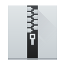
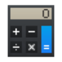
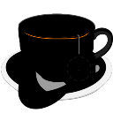
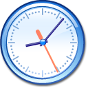
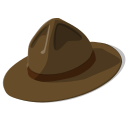

# KDE

| [Back to Home](index.md) | [Back to Applications](apps.md)
| --- | --- |

#### Here are listed **15** programs and **65** items for this category.

  <label for="app-search-input" style="font-weight: bold;">Search applications:</label>
  <input type="search" id="app-search-input" placeholder="Type a name or keyword..." autocomplete="off"
    style="width: 100%; max-width: 480px; padding: 0.5em 0.75em; margin-top: 0.25em; font-size: 1em; border: 1px solid #999; border-radius: 4px; box-sizing: border-box;">
  <select id="app-search-arch" aria-label="Filter by architecture"
    style="margin-top: 0.25em; padding: 0.5em; font-size: 1em; border: 1px solid #999; border-radius: 4px;">
    <option value="">Any architecture</option>
    <option value="x86_64">x86_64</option>
    <option value="aarch64">aarch64</option>
    <option value="i686">i686</option>
  </select>
  

#### *Categories*

  <a class="cat-pill" href="appimages.html">AppImages</a>
  •
  <a class="cat-pill" href="ai.html">ai</a>
  •
  <a class="cat-pill" href="am-utils.html">am-utils</a>
  •
  <a class="cat-pill" href="android.html">android</a>
  •
  <a class="cat-pill" href="appimage-on-the-fly.html">appimage-on-the-fly</a>
  •
  <a class="cat-pill" href="audio.html">audio</a>
  •
  <a class="cat-pill" href="comic.html">comic</a>
  •
  <a class="cat-pill" href="command-line.html">command-line</a>
  •
  <a class="cat-pill" href="communication.html">communication</a>
  •
  <a class="cat-pill" href="disk.html">disk</a>
  •
  <a class="cat-pill" href="education.html">education</a>
  •
  <a class="cat-pill" href="emulator.html">emulator</a>
  •
  <a class="cat-pill" href="file-manager.html">file-manager</a>
  •
  <a class="cat-pill" href="finance.html">finance</a>
  •
  <a class="cat-pill" href="game.html">game</a>
  •
  <a class="cat-pill" href="gnome.html">gnome</a>
  •
  <a class="cat-pill" href="graphic.html">graphic</a>
  •
  <a class="cat-pill" href="internet.html">internet</a>
  •
  <a class="cat-pill cat-pill--all" href="kde.html">kde</a>
  •
  <a class="cat-pill" href="metapackages.html">metapackages</a>
  •
  <a class="cat-pill" href="office.html">office</a>
  •
  <a class="cat-pill" href="password.html">password</a>
  •
  <a class="cat-pill" href="portable.html">Portable</a>
  •
  <a class="cat-pill" href="portable-cli.html">portable-cli</a>
  •
  <a class="cat-pill" href="portable-desktop.html">portable-desktop</a>
  •
  <a class="cat-pill" href="steam.html">steam</a>
  •
  <a class="cat-pill" href="system-monitor.html">system-monitor</a>
  •
  <a class="cat-pill" href="video.html">video</a>
  •
  <a class="cat-pill" href="virtual-machine.html">virtual-machine</a>
  •
  <a class="cat-pill" href="wallet.html">wallet</a>
  •
  <a class="cat-pill" href="web-app.html">web-app</a>
  •
  <a class="cat-pill" href="web-browser.html">web-browser</a>
  •
  <a class="cat-pill" href="wine.html">wine</a>
  •
  <a class="cat-pill" href="youtube.html">youtube</a>

-----------------

***NOTE, Installer scripts (blob/raw) are provided for reading only: do not run them manually! Use "[AM](https://github.com/ivan-hc/AM)" or "[AppMan](https://github.com/ivan-hc/AppMan)" instead.***

-----------------

| ICON | PACKAGE NAME | DESCRIPTION | INSTALLER |
| --- | --- | --- | --- |
|  | [***ark***](apps/kdeutils.md) | *Archiving tool for .zip/.tar/.rar and more. This is part of "kdeutils".*..[ *read more* ](apps/kdeutils.md)*!* | [*blob*](https://github.com/ivan-hc/AM/blob/main/programs/x86_64/kdeutils) **/** [*raw*](https://raw.githubusercontent.com/ivan-hc/AM/main/programs/x86_64/kdeutils) |
|  | [***bomber***](apps/kdegames.md) | *Arcade spaceship game. This is part of "kdegames".*..[ *read more* ](apps/kdegames.md)*!* | [*blob*](https://github.com/ivan-hc/AM/blob/main/programs/x86_64/kdegames) **/** [*raw*](https://raw.githubusercontent.com/ivan-hc/AM/main/programs/x86_64/kdegames) |
|  | [***bovo***](apps/kdegames.md) | *Five in a row game from. This is part of "kdegames".*..[ *read more* ](apps/kdegames.md)*!* | [*blob*](https://github.com/ivan-hc/AM/blob/main/programs/x86_64/kdegames) **/** [*raw*](https://raw.githubusercontent.com/ivan-hc/AM/main/programs/x86_64/kdegames) |
|  | [***calligra***](apps/calligra.md) | *Calligra Suite is an office and graphic art suite by KDE. It contains applications for word processing, spreadsheets, presentation, vector graphics, and editing databases.*..[ *read more* ](apps/calligra.md)*!* | [*blob*](https://github.com/ivan-hc/AM/blob/main/programs/x86_64/calligra) **/** [*raw*](https://raw.githubusercontent.com/ivan-hc/AM/main/programs/x86_64/calligra) |
|  | [***falkon***](apps/falkon.md) | *Unofficial. A fast Qt web browser from KDE.*..[ *read more* ](apps/falkon.md)*!* | [*blob*](https://github.com/ivan-hc/AM/blob/main/programs/x86_64/falkon) **/** [*raw*](https://raw.githubusercontent.com/ivan-hc/AM/main/programs/x86_64/falkon) |
|  | [***filelight***](apps/filelight.md) | *Unofficial. View disk usage information, by KDE.*..[ *read more* ](apps/filelight.md)*!* | [*blob*](https://github.com/ivan-hc/AM/blob/main/programs/x86_64/filelight) **/** [*raw*](https://raw.githubusercontent.com/ivan-hc/AM/main/programs/x86_64/filelight) |
|  | [***francis***](apps/kdeutils.md) | *Pomodoro technique, get more productive. This is part of "kdeutils".*..[ *read more* ](apps/kdeutils.md)*!* | [*blob*](https://github.com/ivan-hc/AM/blob/main/programs/x86_64/kdeutils) **/** [*raw*](https://raw.githubusercontent.com/ivan-hc/AM/main/programs/x86_64/kdeutils) |
|  | [***granatier***](apps/kdegames.md) | *Bomberman clone. This is part of "kdegames".*..[ *read more* ](apps/kdegames.md)*!* | [*blob*](https://github.com/ivan-hc/AM/blob/main/programs/x86_64/kdegames) **/** [*raw*](https://raw.githubusercontent.com/ivan-hc/AM/main/programs/x86_64/kdegames) |
|  | [***gwenview***](apps/gwenview.md) | *Unofficial. Fast and easy to use image viewer by KDE. ideal for displaying a collection of images.*..[ *read more* ](apps/gwenview.md)*!* | [*blob*](https://github.com/ivan-hc/AM/blob/main/programs/x86_64/gwenview) **/** [*raw*](https://raw.githubusercontent.com/ivan-hc/AM/main/programs/x86_64/gwenview) |
|  | [***isoimagewriter***](apps/kdeutils.md) | *Write an ISO Image to a USB Disk. This is part of "kdeutils".*..[ *read more* ](apps/kdeutils.md)*!* | [*blob*](https://github.com/ivan-hc/AM/blob/main/programs/x86_64/kdeutils) **/** [*raw*](https://raw.githubusercontent.com/ivan-hc/AM/main/programs/x86_64/kdeutils) |
|  | [***kajongg***](apps/kdegames.md) | *An ancient Chinese board game for 4 players. This is part of "kdegames".*..[ *read more* ](apps/kdegames.md)*!* | [*blob*](https://github.com/ivan-hc/AM/blob/main/programs/x86_64/kdegames) **/** [*raw*](https://raw.githubusercontent.com/ivan-hc/AM/main/programs/x86_64/kdegames) |
|  | [***kalm***](apps/kdeutils.md) | *Teach you different breathing techniques. This is part of "kdeutils".*..[ *read more* ](apps/kdeutils.md)*!* | [*blob*](https://github.com/ivan-hc/AM/blob/main/programs/x86_64/kdeutils) **/** [*raw*](https://raw.githubusercontent.com/ivan-hc/AM/main/programs/x86_64/kdeutils) |
|  | [***kapman***](apps/kdegames.md) | *Pac-Man clone. This is part of "kdegames".*..[ *read more* ](apps/kdegames.md)*!* | [*blob*](https://github.com/ivan-hc/AM/blob/main/programs/x86_64/kdegames) **/** [*raw*](https://raw.githubusercontent.com/ivan-hc/AM/main/programs/x86_64/kdegames) |
|  | [***kate***](apps/kdeutils.md) | *A multi-document editor part of KDE. This is part of "kdeutils".*..[ *read more* ](apps/kdeutils.md)*!* | [*blob*](https://github.com/ivan-hc/AM/blob/main/programs/x86_64/kdeutils) **/** [*raw*](https://raw.githubusercontent.com/ivan-hc/AM/main/programs/x86_64/kdeutils) |
|  | [***katomic***](apps/kdegames.md) | *Edu. game based around molecular geometry. This is part of "kdegames".*..[ *read more* ](apps/kdegames.md)*!* | [*blob*](https://github.com/ivan-hc/AM/blob/main/programs/x86_64/kdegames) **/** [*raw*](https://raw.githubusercontent.com/ivan-hc/AM/main/programs/x86_64/kdegames) |
|  | [***kbackup***](apps/kdeutils.md) | *Back up your data. This is part of "kdeutils".*..[ *read more* ](apps/kdeutils.md)*!* | [*blob*](https://github.com/ivan-hc/AM/blob/main/programs/x86_64/kdeutils) **/** [*raw*](https://raw.githubusercontent.com/ivan-hc/AM/main/programs/x86_64/kdeutils) |
|  | [***kblackbox***](apps/kdegames.md) | *A game of hide and seek. This is part of "kdegames".*..[ *read more* ](apps/kdegames.md)*!* | [*blob*](https://github.com/ivan-hc/AM/blob/main/programs/x86_64/kdegames) **/** [*raw*](https://raw.githubusercontent.com/ivan-hc/AM/main/programs/x86_64/kdegames) |
|  | [***kblocks***](apps/kdegames.md) | *Classic Tetris / falling blocks game. This is part of "kdegames".*..[ *read more* ](apps/kdegames.md)*!* | [*blob*](https://github.com/ivan-hc/AM/blob/main/programs/x86_64/kdegames) **/** [*raw*](https://raw.githubusercontent.com/ivan-hc/AM/main/programs/x86_64/kdegames) |
|  | [***kbounce***](apps/kdegames.md) | *Fill the field game. This is part of "kdegames".*..[ *read more* ](apps/kdegames.md)*!* | [*blob*](https://github.com/ivan-hc/AM/blob/main/programs/x86_64/kdegames) **/** [*raw*](https://raw.githubusercontent.com/ivan-hc/AM/main/programs/x86_64/kdegames) |
|  | [***kbreakout***](apps/kdegames.md) | *Destroy bricks without losing the ball. This is part of "kdegames".*..[ *read more* ](apps/kdegames.md)*!* | [*blob*](https://github.com/ivan-hc/AM/blob/main/programs/x86_64/kdegames) **/** [*raw*](https://raw.githubusercontent.com/ivan-hc/AM/main/programs/x86_64/kdegames) |
|  | [***kcalc***](apps/kdeutils.md) | *Scientific Calculator. This is part of "kdeutils".*..[ *read more* ](apps/kdeutils.md)*!* | [*blob*](https://github.com/ivan-hc/AM/blob/main/programs/x86_64/kdeutils) **/** [*raw*](https://raw.githubusercontent.com/ivan-hc/AM/main/programs/x86_64/kdeutils) |
|  | [***kcharselect***](apps/kdeutils.md) | *Character Selector. This is part of "kdeutils".*..[ *read more* ](apps/kdeutils.md)*!* | [*blob*](https://github.com/ivan-hc/AM/blob/main/programs/x86_64/kdeutils) **/** [*raw*](https://raw.githubusercontent.com/ivan-hc/AM/main/programs/x86_64/kdeutils) |
|  | [***kclock***](apps/kdeutils.md) | *A universal clock application. This is part of "kdeutils".*..[ *read more* ](apps/kdeutils.md)*!* | [*blob*](https://github.com/ivan-hc/AM/blob/main/programs/x86_64/kdeutils) **/** [*raw*](https://raw.githubusercontent.com/ivan-hc/AM/main/programs/x86_64/kdeutils) |
|  | [***kdebugsettings***](apps/kdeutils.md) | *Edits displayed QLoggingCategory. This is part of "kdeutils".*..[ *read more* ](apps/kdeutils.md)*!* | [*blob*](https://github.com/ivan-hc/AM/blob/main/programs/x86_64/kdeutils) **/** [*raw*](https://raw.githubusercontent.com/ivan-hc/AM/main/programs/x86_64/kdeutils) |
|  | [***kdeconnect***](apps/kdeconnect.md) | *Unofficial, A project that enables all your Android devices to communicate with each other.*..[ *read more* ](apps/kdeconnect.md)*!* | [*blob*](https://github.com/ivan-hc/AM/blob/main/programs/x86_64/kdeconnect) **/** [*raw*](https://raw.githubusercontent.com/ivan-hc/AM/main/programs/x86_64/kdeconnect) |
|  | [***kdegames***](apps/kdegames.md) | *Unofficial, Full & updatable KDE Games suite, metapackage.*..[ *read more* ](apps/kdegames.md)*!* | [*blob*](https://github.com/ivan-hc/AM/blob/main/programs/x86_64/kdegames) **/** [*raw*](https://raw.githubusercontent.com/ivan-hc/AM/main/programs/x86_64/kdegames) |
|  | [***kdenlive***](apps/kdenlive.md) | *A powerful Video Editor provided by KDE.*..[ *read more* ](apps/kdenlive.md)*!* | [*blob*](https://github.com/ivan-hc/AM/blob/main/programs/x86_64/kdenlive) **/** [*raw*](https://raw.githubusercontent.com/ivan-hc/AM/main/programs/x86_64/kdenlive) |
|  | [***kdenlive-daily***](apps/kdenlive-daily.md) | *A powerful Video Editor provided by KDE (daily builds).*..[ *read more* ](apps/kdenlive-daily.md)*!* | [*blob*](https://github.com/ivan-hc/AM/blob/main/programs/x86_64/kdenlive-daily) **/** [*raw*](https://raw.githubusercontent.com/ivan-hc/AM/main/programs/x86_64/kdenlive-daily) |
|  | [***kdenlive-enhanced***](apps/kdenlive-enhanced.md) | *Unofficial AppImage of Kdenlive Video Editor which is able to work on any linux distro.*..[ *read more* ](apps/kdenlive-enhanced.md)*!* | [*blob*](https://github.com/ivan-hc/AM/blob/main/programs/x86_64/kdenlive-enhanced) **/** [*raw*](https://raw.githubusercontent.com/ivan-hc/AM/main/programs/x86_64/kdenlive-enhanced) |
|  | [***kdeutils***](apps/kdeutils.md) | *Unofficial, Full & updatable KDE Utils suite, metapackage.*..[ *read more* ](apps/kdeutils.md)*!* | [*blob*](https://github.com/ivan-hc/AM/blob/main/programs/x86_64/kdeutils) **/** [*raw*](https://raw.githubusercontent.com/ivan-hc/AM/main/programs/x86_64/kdeutils) |
|  | [***kdf***](apps/kdeutils.md) | *view Disk Usage. This is part of "kdeutils".*..[ *read more* ](apps/kdeutils.md)*!* | [*blob*](https://github.com/ivan-hc/AM/blob/main/programs/x86_64/kdeutils) **/** [*raw*](https://raw.githubusercontent.com/ivan-hc/AM/main/programs/x86_64/kdeutils) |
|  | [***kdialog***](apps/kdeutils.md) | *a dialog utility. This is part of "kdeutils".*..[ *read more* ](apps/kdeutils.md)*!* | [*blob*](https://github.com/ivan-hc/AM/blob/main/programs/x86_64/kdeutils) **/** [*raw*](https://raw.githubusercontent.com/ivan-hc/AM/main/programs/x86_64/kdeutils) |
|  | [***kdiamond***](apps/kdegames.md) | *Diamond game. This is part of "kdegames".*..[ *read more* ](apps/kdegames.md)*!* | [*blob*](https://github.com/ivan-hc/AM/blob/main/programs/x86_64/kdegames) **/** [*raw*](https://raw.githubusercontent.com/ivan-hc/AM/main/programs/x86_64/kdegames) |
|  | [***keditbookmarks***](apps/kdeutils.md) | *Bookmarks editor. This is part of "kdeutils".*..[ *read more* ](apps/kdeutils.md)*!* | [*blob*](https://github.com/ivan-hc/AM/blob/main/programs/x86_64/kdeutils) **/** [*raw*](https://raw.githubusercontent.com/ivan-hc/AM/main/programs/x86_64/kdeutils) |
|  | [***keysmith***](apps/kdeutils.md) | *Generates tokens for your two-factor logins. This is part of "kdeutils".*..[ *read more* ](apps/kdeutils.md)*!* | [*blob*](https://github.com/ivan-hc/AM/blob/main/programs/x86_64/kdeutils) **/** [*raw*](https://raw.githubusercontent.com/ivan-hc/AM/main/programs/x86_64/kdeutils) |
|  | [***kfind***](apps/kdeutils.md) | *A search tool. This is part of "kdeutils".*..[ *read more* ](apps/kdeutils.md)*!* | [*blob*](https://github.com/ivan-hc/AM/blob/main/programs/x86_64/kdeutils) **/** [*raw*](https://raw.githubusercontent.com/ivan-hc/AM/main/programs/x86_64/kdeutils) |
|  | [***kfourinline***](apps/kdegames.md) | *4 in row game. This is part of "kdegames".*..[ *read more* ](apps/kdegames.md)*!* | [*blob*](https://github.com/ivan-hc/AM/blob/main/programs/x86_64/kdegames) **/** [*raw*](https://raw.githubusercontent.com/ivan-hc/AM/main/programs/x86_64/kdegames) |
|  | [***kgoldrunner***](apps/kdegames.md) | *A game with a runner and gold. This is part of "kdegames".*..[ *read more* ](apps/kdegames.md)*!* | [*blob*](https://github.com/ivan-hc/AM/blob/main/programs/x86_64/kdegames) **/** [*raw*](https://raw.githubusercontent.com/ivan-hc/AM/main/programs/x86_64/kdegames) |
|  | [***kgpg***](apps/kdeutils.md) | *A GnuPG frontend. This is part of "kdeutils".*..[ *read more* ](apps/kdeutils.md)*!* | [*blob*](https://github.com/ivan-hc/AM/blob/main/programs/x86_64/kdeutils) **/** [*raw*](https://raw.githubusercontent.com/ivan-hc/AM/main/programs/x86_64/kdeutils) |
|  | [***kigo***](apps/kdegames.md) | *Go strategic board game for two players. This is part of "kdegames".*..[ *read more* ](apps/kdegames.md)*!* | [*blob*](https://github.com/ivan-hc/AM/blob/main/programs/x86_64/kdegames) **/** [*raw*](https://raw.githubusercontent.com/ivan-hc/AM/main/programs/x86_64/kdegames) |
|  | [***killbots***](apps/kdegames.md) | *Port of the classic console game Robots. This is part of "kdegames".*..[ *read more* ](apps/kdegames.md)*!* | [*blob*](https://github.com/ivan-hc/AM/blob/main/programs/x86_64/kdegames) **/** [*raw*](https://raw.githubusercontent.com/ivan-hc/AM/main/programs/x86_64/kdegames) |
|  | [***kiriki***](apps/kdegames.md) | *A dice game. This is part of "kdegames".*..[ *read more* ](apps/kdegames.md)*!* | [*blob*](https://github.com/ivan-hc/AM/blob/main/programs/x86_64/kdegames) **/** [*raw*](https://raw.githubusercontent.com/ivan-hc/AM/main/programs/x86_64/kdegames) |
|  | [***kjumpingcube***](apps/kdegames.md) | *A game of dices on a board. This is part of "kdegames".*..[ *read more* ](apps/kdegames.md)*!* | [*blob*](https://github.com/ivan-hc/AM/blob/main/programs/x86_64/kdegames) **/** [*raw*](https://raw.githubusercontent.com/ivan-hc/AM/main/programs/x86_64/kdegames) |
|  | [***klickety***](apps/kdegames.md) | *Color matching like SameGame. This is part of "kdegames".*..[ *read more* ](apps/kdegames.md)*!* | [*blob*](https://github.com/ivan-hc/AM/blob/main/programs/x86_64/kdegames) **/** [*raw*](https://raw.githubusercontent.com/ivan-hc/AM/main/programs/x86_64/kdegames) |
|  | [***klines***](apps/kdegames.md) | *Inspired by well known game of Color Lines. This is part of "kdegames".*..[ *read more* ](apps/kdegames.md)*!* | [*blob*](https://github.com/ivan-hc/AM/blob/main/programs/x86_64/kdegames) **/** [*raw*](https://raw.githubusercontent.com/ivan-hc/AM/main/programs/x86_64/kdegames) |
|  | [***kmahjongg***](apps/kdegames.md) | *Mahjongg game. This is part of "kdegames".*..[ *read more* ](apps/kdegames.md)*!* | [*blob*](https://github.com/ivan-hc/AM/blob/main/programs/x86_64/kdegames) **/** [*raw*](https://raw.githubusercontent.com/ivan-hc/AM/main/programs/x86_64/kdegames) |
|  | [***kmines***](apps/kdegames.md) | *Classic mine game. This is part of "kdegames".*..[ *read more* ](apps/kdegames.md)*!* | [*blob*](https://github.com/ivan-hc/AM/blob/main/programs/x86_64/kdegames) **/** [*raw*](https://raw.githubusercontent.com/ivan-hc/AM/main/programs/x86_64/kdegames) |
|  | [***kmymoney***](apps/kmymoney.md) | *KMyMoney is a cross-platform personal finance manager build on KDE frameworks technologies for your desktop and notebook environment.*..[ *read more* ](apps/kmymoney.md)*!* | [*blob*](https://github.com/ivan-hc/AM/blob/main/programs/x86_64/kmymoney) **/** [*raw*](https://raw.githubusercontent.com/ivan-hc/AM/main/programs/x86_64/kmymoney) |
|  | [***knavalbattle***](apps/kdegames.md) | *Battle Ship game. This is part of "kdegames".*..[ *read more* ](apps/kdegames.md)*!* | [*blob*](https://github.com/ivan-hc/AM/blob/main/programs/x86_64/kdegames) **/** [*raw*](https://raw.githubusercontent.com/ivan-hc/AM/main/programs/x86_64/kdegames) |
|  | [***knetwalk***](apps/kdegames.md) | *Net constructing game. This is part of "kdegames".*..[ *read more* ](apps/kdegames.md)*!* | [*blob*](https://github.com/ivan-hc/AM/blob/main/programs/x86_64/kdegames) **/** [*raw*](https://raw.githubusercontent.com/ivan-hc/AM/main/programs/x86_64/kdegames) |
|  | [***knights***](apps/knights.md) | *Unofficial, KDE's chess game frontend.*..[ *read more* ](apps/knights.md)*!* | [*blob*](https://github.com/ivan-hc/AM/blob/main/programs/x86_64/knights) **/** [*raw*](https://raw.githubusercontent.com/ivan-hc/AM/main/programs/x86_64/knights) |
|  | [***kolf***](apps/kdegames.md) | *Mini Golf game. This is part of "kdegames".*..[ *read more* ](apps/kdegames.md)*!* | [*blob*](https://github.com/ivan-hc/AM/blob/main/programs/x86_64/kdegames) **/** [*raw*](https://raw.githubusercontent.com/ivan-hc/AM/main/programs/x86_64/kdegames) |
|  | [***kollision***](apps/kdegames.md) | *Dodge red balls in the field. This is part of "kdegames".*..[ *read more* ](apps/kdegames.md)*!* | [*blob*](https://github.com/ivan-hc/AM/blob/main/programs/x86_64/kdegames) **/** [*raw*](https://raw.githubusercontent.com/ivan-hc/AM/main/programs/x86_64/kdegames) |
|  | [***kongress***](apps/kdeutils.md) | *A companion application for conferences. This is part of "kdeutils".*..[ *read more* ](apps/kdeutils.md)*!* | [*blob*](https://github.com/ivan-hc/AM/blob/main/programs/x86_64/kdeutils) **/** [*raw*](https://raw.githubusercontent.com/ivan-hc/AM/main/programs/x86_64/kdeutils) |
|  | [***konquest***](apps/kdegames.md) | *Game of planets. This is part of "kdegames".*..[ *read more* ](apps/kdegames.md)*!* | [*blob*](https://github.com/ivan-hc/AM/blob/main/programs/x86_64/kdegames) **/** [*raw*](https://raw.githubusercontent.com/ivan-hc/AM/main/programs/x86_64/kdegames) |
|  | [***kpat***](apps/kdegames.md) | *Klondike, Spider, Free Cell and other Solitaire. This is part of "kdegames".*..[ *read more* ](apps/kdegames.md)*!* | [*blob*](https://github.com/ivan-hc/AM/blob/main/programs/x86_64/kdegames) **/** [*raw*](https://raw.githubusercontent.com/ivan-hc/AM/main/programs/x86_64/kdegames) |
|  | [***krecorder***](apps/kdeutils.md) | *An audio recording application. This is part of "kdeutils".*..[ *read more* ](apps/kdeutils.md)*!* | [*blob*](https://github.com/ivan-hc/AM/blob/main/programs/x86_64/kdeutils) **/** [*raw*](https://raw.githubusercontent.com/ivan-hc/AM/main/programs/x86_64/kdeutils) |
|  | [***kreversi***](apps/kdegames.md) | *Reversi game. This is part of "kdegames".*..[ *read more* ](apps/kdegames.md)*!* | [*blob*](https://github.com/ivan-hc/AM/blob/main/programs/x86_64/kdegames) **/** [*raw*](https://raw.githubusercontent.com/ivan-hc/AM/main/programs/x86_64/kdegames) |
|  | [***kshisen***](apps/kdegames.md) | *A game similar to Mahjongg. This is part of "kdegames".*..[ *read more* ](apps/kdegames.md)*!* | [*blob*](https://github.com/ivan-hc/AM/blob/main/programs/x86_64/kdegames) **/** [*raw*](https://raw.githubusercontent.com/ivan-hc/AM/main/programs/x86_64/kdegames) |
|  | [***ksirk***](apps/kdegames.md) | *A strategy board game. This is part of "kdegames".*..[ *read more* ](apps/kdegames.md)*!* | [*blob*](https://github.com/ivan-hc/AM/blob/main/programs/x86_64/kdegames) **/** [*raw*](https://raw.githubusercontent.com/ivan-hc/AM/main/programs/x86_64/kdegames) |
|  | [***ksnakeduel***](apps/kdegames.md) | *A snake race game. This is part of "kdegames".*..[ *read more* ](apps/kdegames.md)*!* | [*blob*](https://github.com/ivan-hc/AM/blob/main/programs/x86_64/kdegames) **/** [*raw*](https://raw.githubusercontent.com/ivan-hc/AM/main/programs/x86_64/kdegames) |
|  | [***kspaceduel***](apps/kdegames.md) | *Battleship with satellites in the space. This is part of "kdegames".*..[ *read more* ](apps/kdegames.md)*!* | [*blob*](https://github.com/ivan-hc/AM/blob/main/programs/x86_64/kdegames) **/** [*raw*](https://raw.githubusercontent.com/ivan-hc/AM/main/programs/x86_64/kdegames) |
|  | [***ksquares***](apps/kdegames.md) | *Win with most number of completed squares. This is part of "kdegames".*..[ *read more* ](apps/kdegames.md)*!* | [*blob*](https://github.com/ivan-hc/AM/blob/main/programs/x86_64/kdegames) **/** [*raw*](https://raw.githubusercontent.com/ivan-hc/AM/main/programs/x86_64/kdegames) |
|  | [***ksudoku***](apps/kdegames.md) | *Sudoku game. This is part of "kdegames".*..[ *read more* ](apps/kdegames.md)*!* | [*blob*](https://github.com/ivan-hc/AM/blob/main/programs/x86_64/kdegames) **/** [*raw*](https://raw.githubusercontent.com/ivan-hc/AM/main/programs/x86_64/kdegames) |
|  | [***kteatime***](apps/kdeutils.md) | *A handy timer for steeping tea. This is part of "kdeutils".*..[ *read more* ](apps/kdeutils.md)*!* | [*blob*](https://github.com/ivan-hc/AM/blob/main/programs/x86_64/kdeutils) **/** [*raw*](https://raw.githubusercontent.com/ivan-hc/AM/main/programs/x86_64/kdeutils) |
|  | [***ktimer***](apps/kdeutils.md) | *Countdown Launcher. This is part of "kdeutils".*..[ *read more* ](apps/kdeutils.md)*!* | [*blob*](https://github.com/ivan-hc/AM/blob/main/programs/x86_64/kdeutils) **/** [*raw*](https://raw.githubusercontent.com/ivan-hc/AM/main/programs/x86_64/kdeutils) |
|  | [***ktrip***](apps/kdeutils.md) | *KTrip helps you navigate in public transport. This is part of "kdeutils".*..[ *read more* ](apps/kdeutils.md)*!* | [*blob*](https://github.com/ivan-hc/AM/blob/main/programs/x86_64/kdeutils) **/** [*raw*](https://raw.githubusercontent.com/ivan-hc/AM/main/programs/x86_64/kdeutils) |
|  | [***ktuberling***](apps/kdegames.md) | *Simple Mr. Potato game for children. This is part of "kdegames".*..[ *read more* ](apps/kdegames.md)*!* | [*blob*](https://github.com/ivan-hc/AM/blob/main/programs/x86_64/kdegames) **/** [*raw*](https://raw.githubusercontent.com/ivan-hc/AM/main/programs/x86_64/kdegames) |
|  | [***kubrick***](apps/kdegames.md) | *A logic game based on Rubik's Cube. This is part of "kdegames".*..[ *read more* ](apps/kdegames.md)*!* | [*blob*](https://github.com/ivan-hc/AM/blob/main/programs/x86_64/kdegames) **/** [*raw*](https://raw.githubusercontent.com/ivan-hc/AM/main/programs/x86_64/kdegames) |
|  | [***kwave***](apps/kwave.md) | *A sound & audio editor designed for the KDE Desktop Environment.*..[ *read more* ](apps/kwave.md)*!* | [*blob*](https://github.com/ivan-hc/AM/blob/main/programs/x86_64/kwave) **/** [*raw*](https://raw.githubusercontent.com/ivan-hc/AM/main/programs/x86_64/kwave) |
|  | [***kweather***](apps/kdeutils.md) | *A convergent weather application. This is part of "kdeutils".*..[ *read more* ](apps/kdeutils.md)*!* | [*blob*](https://github.com/ivan-hc/AM/blob/main/programs/x86_64/kdeutils) **/** [*raw*](https://raw.githubusercontent.com/ivan-hc/AM/main/programs/x86_64/kdeutils) |
|  | [***kwrite***](apps/kdeutils.md) | *KWrite is a text editor by KDE. This is part of "kdeutils".*..[ *read more* ](apps/kdeutils.md)*!* | [*blob*](https://github.com/ivan-hc/AM/blob/main/programs/x86_64/kdeutils) **/** [*raw*](https://raw.githubusercontent.com/ivan-hc/AM/main/programs/x86_64/kdeutils) |
|  | [***lskat***](apps/kdegames.md) | *Fun and engaging card game for two players. This is part of "kdegames".*..[ *read more* ](apps/kdegames.md)*!* | [*blob*](https://github.com/ivan-hc/AM/blob/main/programs/x86_64/kdegames) **/** [*raw*](https://raw.githubusercontent.com/ivan-hc/AM/main/programs/x86_64/kdegames) |
|  | [***palapeli***](apps/kdegames.md) | *Jigsaw puzzle game. This is part of "kdegames".*..[ *read more* ](apps/kdegames.md)*!* | [*blob*](https://github.com/ivan-hc/AM/blob/main/programs/x86_64/kdegames) **/** [*raw*](https://raw.githubusercontent.com/ivan-hc/AM/main/programs/x86_64/kdegames) |
|  | [***picmi***](apps/kdegames.md) | *Single player logic-based puzzle game. This is part of "kdegames".*..[ *read more* ](apps/kdegames.md)*!* | [*blob*](https://github.com/ivan-hc/AM/blob/main/programs/x86_64/kdegames) **/** [*raw*](https://raw.githubusercontent.com/ivan-hc/AM/main/programs/x86_64/kdegames) |
|  | [***skanpage***](apps/kdeutils.md) | *A simple scanning application. This is part of "kdeutils".*..[ *read more* ](apps/kdeutils.md)*!* | [*blob*](https://github.com/ivan-hc/AM/blob/main/programs/x86_64/kdeutils) **/** [*raw*](https://raw.githubusercontent.com/ivan-hc/AM/main/programs/x86_64/kdeutils) |
|  | [***subtitle-composer***](apps/subtitle-composer.md) | *KF5/Qt Video Subtitle Editor for KDE.*..[ *read more* ](apps/subtitle-composer.md)*!* | [*blob*](https://github.com/ivan-hc/AM/blob/main/programs/x86_64/subtitle-composer) **/** [*raw*](https://raw.githubusercontent.com/ivan-hc/AM/main/programs/x86_64/subtitle-composer) |
|  | [***sweeper***](apps/kdeutils.md) | *System Cleaner. This is part of "kdeutils".*..[ *read more* ](apps/kdeutils.md)*!* | [*blob*](https://github.com/ivan-hc/AM/blob/main/programs/x86_64/kdeutils) **/** [*raw*](https://raw.githubusercontent.com/ivan-hc/AM/main/programs/x86_64/kdeutils) |
|  | [***telly-skout***](apps/kdeutils.md) | *A convergent Kirigami TV guide. This is part of "kdeutils".*..[ *read more* ](apps/kdeutils.md)*!* | [*blob*](https://github.com/ivan-hc/AM/blob/main/programs/x86_64/kdeutils) **/** [*raw*](https://raw.githubusercontent.com/ivan-hc/AM/main/programs/x86_64/kdeutils) |
|  | [***xapkdetector***](apps/xapkdetector.md) | *APK/DEX detector that shows an information about build tools, libraries and protection of APK/DEX files.*..[ *read more* ](apps/xapkdetector.md)*!* | [*blob*](https://github.com/ivan-hc/AM/blob/main/programs/x86_64/xapkdetector) **/** [*raw*](https://raw.githubusercontent.com/ivan-hc/AM/main/programs/x86_64/xapkdetector) |

---

You can improve these pages via a [pull request](https://github.com/Portable-Linux-Apps/Portable-Linux-Apps.github.io/pulls) to this site's [GitHub repository](https://github.com/Portable-Linux-Apps/Portable-Linux-Apps.github.io), or report any problems related to the installation scripts in the '[issue](https://github.com/ivan-hc/AM/issues)' section of the main database, at [https://github.com/ivan-hc/AM](https://github.com/ivan-hc/AM).

***PORTABLE-LINUX-APPS.github.io is my gift to the Linux community and was made with love for GNU/Linux and the Open Source philosophy.***

---

| [Back to Home](index.md) | [Back to Applications](apps.md)
| --- | --- |

--------

# Contacts
- **Ivan-HC** *on* [**GitHub**](https://github.com/ivan-hc)
- **AM-Ivan** *on* [**Reddit**](https://www.reddit.com/u/am-ivan)

###### *You can support me and my work on [**ko-fi.com**](https://ko-fi.com/IvanAlexHC) and [**PayPal.me**](https://paypal.me/IvanAlexHC). Thank you!*

--------

*© 2020-present Ivan Alessandro Sala aka 'Ivan-HC'* - I'm here just for fun!

