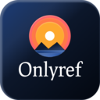
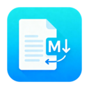

# OFFICE

| [Home](index.md) |
| --- |

#### Here are listed **98** programs and **3** items for this category and managed by [AM](https://github.com/ivan-hc/AM) 	and [AppMan](https://github.com/ivan-hc/AppMan) for the x86_64 architecture.

*Use your browser's built-in search tool to easily navigate to this page or use the tags below.*

| [Back to Applications](apps.md) |
| --- |

#### *Categories*

***[AppImages](appimages.md)*** 		 - ***[android](android.md)*** - ***[audio](audio.md)*** - ***[comic](comic.md)*** - ***[command-line](command-line.md)*** - ***[communication](communication.md)*** - ***[disk](disk.md)*** - ***[education](education.md)*** - ***[file-manager](file-manager.md)*** - ***[finance](finance.md)*** - ***[game](game.md)*** - ***[gnome](gnome.md)*** - ***[graphic](graphic.md)*** - ***[internet](internet.md)*** - ***[kde](kde.md)*** - ***[office](office.md)*** - ***[password](password.md)*** - ***[steam](steam.md)*** - ***[system-monitor](system-monitor.md)*** - ***[video](video.md)*** - ***[web-app](web-app.md)*** - ***[web-browser](web-browser.md)*** - ***[wine](wine.md)***

-----------------

*NOTE, the installer scripts in the "INSTALLER" column are intended for use via "AM", and are therefore dedicated to a system-wide 	installation of applications (in /opt), and all that "AppMan" does is convert those scripts for local installation, changing the paths. 	**They are listed here for reading purposes only**!*

*Should you decide to run them manually, the only way to remove the application is to run 	the command "`sudo /opt/appname/remove`", where "appname" is the name of the application directory containing the "remove" script. 	Likewise, you can also update applications by running the "AM-updater" script in the same directory.*

*The "AM" project allow the autonomy of installed apps, regardless of the presence of "AM" itself in the system. However, it is strongly 	recommended to use "AM" and "AppMan" to take full advantage of all the benefits you could get from an application installed in this way.*

*If you are here just to download apps manually, click on the program name and check the URL(s) on the application page. This site does not 	provide direct links, for security reasons, but it does provide the exact sources and references where you can find them!*

*Transparency and credibility are the focus of this catalog. Happy exploring!*

-----------------

| ICON | PACKAGE NAME | DESCRIPTION | INSTALLER |
| --- | --- | --- | --- |
|  | [***abiword***](apps/abiword.md) | *Unofficial. A light and free word processing software.*..[ *read more* ](apps/abiword.md)*!* | [*blob*](https://github.com/ivan-hc/AM/blob/main/programs/x86_64/abiword) **/** [*raw*](https://raw.githubusercontent.com/ivan-hc/AM/main/programs/x86_64/abiword) |
|  | [***alexandria***](apps/alexandria.md) | *eBook reader built with Tauri, Epub.js, and Typescript.*..[ *read more* ](apps/alexandria.md)*!* | [*blob*](https://github.com/ivan-hc/AM/blob/main/programs/x86_64/alexandria) **/** [*raw*](https://raw.githubusercontent.com/ivan-hc/AM/main/programs/x86_64/alexandria) |
|  | [***anything-llm***](apps/anything-llm.md) | *AI business intelligence tool. Any LLM, any document.*..[ *read more* ](apps/anything-llm.md)*!* | [*blob*](https://github.com/ivan-hc/AM/blob/main/programs/x86_64/anything-llm) **/** [*raw*](https://raw.githubusercontent.com/ivan-hc/AM/main/programs/x86_64/anything-llm) |
|  | [***bk***](apps/bk.md) | *Terminal Epub reader.*..[ *read more* ](apps/bk.md)*!* | [*blob*](https://github.com/ivan-hc/AM/blob/main/programs/x86_64/bk) **/** [*raw*](https://raw.githubusercontent.com/ivan-hc/AM/main/programs/x86_64/bk) |
|  | [***book-manager***](apps/book-manager.md) | *Simple desktop app to manage personal library.*..[ *read more* ](apps/book-manager.md)*!* | [*blob*](https://github.com/ivan-hc/AM/blob/main/programs/x86_64/book-manager) **/** [*raw*](https://raw.githubusercontent.com/ivan-hc/AM/main/programs/x86_64/book-manager) |
|  | [***bookmarks-manager***](apps/bookmarks-manager.md) | *Edit bookmarks, check url.*..[ *read more* ](apps/bookmarks-manager.md)*!* | [*blob*](https://github.com/ivan-hc/AM/blob/main/programs/x86_64/bookmarks-manager) **/** [*raw*](https://raw.githubusercontent.com/ivan-hc/AM/main/programs/x86_64/bookmarks-manager) |
|  | [***boost-note***](apps/boost-note.md) | *Document driven project management tool to speedup remote DevOps.*..[ *read more* ](apps/boost-note.md)*!* | [*blob*](https://github.com/ivan-hc/AM/blob/main/programs/x86_64/boost-note) **/** [*raw*](https://raw.githubusercontent.com/ivan-hc/AM/main/programs/x86_64/boost-note) |
|  | [***brainverse***](apps/brainverse.md) | *Electronic Lab Notebook for Reproducible Neuro Imaging Research.*..[ *read more* ](apps/brainverse.md)*!* | [*blob*](https://github.com/ivan-hc/AM/blob/main/programs/x86_64/brainverse) **/** [*raw*](https://raw.githubusercontent.com/ivan-hc/AM/main/programs/x86_64/brainverse) |
|  | [***calibre***](apps/calibre.md) | *Unofficial. The one stop solution to all your e-book needs*..[ *read more* ](apps/calibre.md)*!* | [*blob*](https://github.com/ivan-hc/AM/blob/main/programs/x86_64/calibre) **/** [*raw*](https://raw.githubusercontent.com/ivan-hc/AM/main/programs/x86_64/calibre) |
|  | [***calligra***](apps/calligra.md) | *Calligra Suite is an office and graphic art suite by KDE. It contains applications for word processing, spreadsheets, presentation, vector graphics, and editing databases.*..[ *read more* ](apps/calligra.md)*!* | [*blob*](https://github.com/ivan-hc/AM/blob/main/programs/x86_64/calligra) **/** [*raw*](https://raw.githubusercontent.com/ivan-hc/AM/main/programs/x86_64/calligra) |
|  | [***caprine***](apps/caprine.md) | *Unofficial, elegant privacy focused Facebook Messenger app.*..[ *read more* ](apps/caprine.md)*!* | [*blob*](https://github.com/ivan-hc/AM/blob/main/programs/x86_64/caprine) **/** [*raw*](https://raw.githubusercontent.com/ivan-hc/AM/main/programs/x86_64/caprine) |
|  | [***codebook-lsp***](apps/codebook-lsp.md) | *Codebook, code-aware spell checker with language server implementation.*..[ *read more* ](apps/codebook-lsp.md)*!* | [*blob*](https://github.com/ivan-hc/AM/blob/main/programs/x86_64/codebook-lsp) **/** [*raw*](https://raw.githubusercontent.com/ivan-hc/AM/main/programs/x86_64/codebook-lsp) |
|  | [***comic-book-reader***](apps/comic-book-reader.md) | *Reader and converter for cbz, cbr, epub and pdf files.*..[ *read more* ](apps/comic-book-reader.md)*!* | [*blob*](https://github.com/ivan-hc/AM/blob/main/programs/x86_64/comic-book-reader) **/** [*raw*](https://raw.githubusercontent.com/ivan-hc/AM/main/programs/x86_64/comic-book-reader) |
|  | [***comic-reader***](apps/comic-reader.md) | *Electron based comic reader.*..[ *read more* ](apps/comic-reader.md)*!* | [*blob*](https://github.com/ivan-hc/AM/blob/main/programs/x86_64/comic-reader) **/** [*raw*](https://raw.githubusercontent.com/ivan-hc/AM/main/programs/x86_64/comic-reader) |
|  | [***comics-downloader***](apps/comics-downloader.md) | *Tool to download comics and manga in pdf/epub/cbr/cbz from a website.*..[ *read more* ](apps/comics-downloader.md)*!* | [*blob*](https://github.com/ivan-hc/AM/blob/main/programs/x86_64/comics-downloader) **/** [*raw*](https://raw.githubusercontent.com/ivan-hc/AM/main/programs/x86_64/comics-downloader) |
|  | [***corepad***](apps/corepad.md) | *A document editor for CuboCore Application Suite.*..[ *read more* ](apps/corepad.md)*!* | [*blob*](https://github.com/ivan-hc/AM/blob/main/programs/x86_64/corepad) **/** [*raw*](https://raw.githubusercontent.com/ivan-hc/AM/main/programs/x86_64/corepad) |
|  | [***corepins***](apps/corepins.md) | *A bookmarking app for CuboCore Application Suite.*..[ *read more* ](apps/corepins.md)*!* | [*blob*](https://github.com/ivan-hc/AM/blob/main/programs/x86_64/corepins) **/** [*raw*](https://raw.githubusercontent.com/ivan-hc/AM/main/programs/x86_64/corepins) |
|  | [***densify***](apps/densify.md) | *A GTK+ GUI Application written in Python that simplifies compressing PDF files with Ghostscript.*..[ *read more* ](apps/densify.md)*!* | [*blob*](https://github.com/ivan-hc/AM/blob/main/programs/x86_64/densify) **/** [*raw*](https://raw.githubusercontent.com/ivan-hc/AM/main/programs/x86_64/densify) |
|  | [***eplee***](apps/eplee.md) | *Sweet, simple epub reader.*..[ *read more* ](apps/eplee.md)*!* | [*blob*](https://github.com/ivan-hc/AM/blob/main/programs/x86_64/eplee) **/** [*raw*](https://raw.githubusercontent.com/ivan-hc/AM/main/programs/x86_64/eplee) |
|  | [***evince***](apps/evince.md) | *Unofficial. Document viewer for popular document formats.*..[ *read more* ](apps/evince.md)*!* | [*blob*](https://github.com/ivan-hc/AM/blob/main/programs/x86_64/evince) **/** [*raw*](https://raw.githubusercontent.com/ivan-hc/AM/main/programs/x86_64/evince) |
|  | [***exifcleaner***](apps/exifcleaner.md) | *Clean exif metadata from images, videos, and PDFs.*..[ *read more* ](apps/exifcleaner.md)*!* | [*blob*](https://github.com/ivan-hc/AM/blob/main/programs/x86_64/exifcleaner) **/** [*raw*](https://raw.githubusercontent.com/ivan-hc/AM/main/programs/x86_64/exifcleaner) |
|  | [***fbreader***](apps/fbreader.md) | *Your Favourite eBook Reader*..[ *read more* ](apps/fbreader.md)*!* | [*blob*](https://github.com/ivan-hc/AM/blob/main/programs/x86_64/fbreader) **/** [*raw*](https://raw.githubusercontent.com/ivan-hc/AM/main/programs/x86_64/fbreader) |
|  | [***ffwa-facebook***](apps/ffwa-facebook.md) | *WebApp & Firefox Profile for Facebook.*..[ *read more* ](apps/ffwa-facebook.md)*!* | [*blob*](https://github.com/ivan-hc/AM/blob/main/programs/x86_64/ffwa-facebook) **/** [*raw*](https://raw.githubusercontent.com/ivan-hc/AM/main/programs/x86_64/ffwa-facebook) |
|  | [***ficus***](apps/ficus.md) | *A software for editing and managing markdown documents.*..[ *read more* ](apps/ficus.md)*!* | [*blob*](https://github.com/ivan-hc/AM/blob/main/programs/x86_64/ficus) **/** [*raw*](https://raw.githubusercontent.com/ivan-hc/AM/main/programs/x86_64/ficus) |
|  | [***flippy-qualitative-testbench***](apps/flippy-qualitative-testbench.md) | *Music sheet reader.*..[ *read more* ](apps/flippy-qualitative-testbench.md)*!* | [*blob*](https://github.com/ivan-hc/AM/blob/main/programs/x86_64/flippy-qualitative-testbench) **/** [*raw*](https://raw.githubusercontent.com/ivan-hc/AM/main/programs/x86_64/flippy-qualitative-testbench) |
|  | [***fluent-reader***](apps/fluent-reader.md) | *Modern desktop RSS reader.*..[ *read more* ](apps/fluent-reader.md)*!* | [*blob*](https://github.com/ivan-hc/AM/blob/main/programs/x86_64/fluent-reader) **/** [*raw*](https://raw.githubusercontent.com/ivan-hc/AM/main/programs/x86_64/fluent-reader) |
|  | [***focuswriter***](apps/focuswriter.md) | *Simple fullscreen word processor.*..[ *read more* ](apps/focuswriter.md)*!* | [*blob*](https://github.com/ivan-hc/AM/blob/main/programs/x86_64/focuswriter) **/** [*raw*](https://raw.githubusercontent.com/ivan-hc/AM/main/programs/x86_64/focuswriter) |
|  | [***frappebooks***](apps/frappebooks.md) | *Book-keeping software for small-businesses and freelancers.*..[ *read more* ](apps/frappebooks.md)*!* | [*blob*](https://github.com/ivan-hc/AM/blob/main/programs/x86_64/frappebooks) **/** [*raw*](https://raw.githubusercontent.com/ivan-hc/AM/main/programs/x86_64/frappebooks) |
|  | [***fukayo***](apps/fukayo.md) | *Manga reader.*..[ *read more* ](apps/fukayo.md)*!* | [*blob*](https://github.com/ivan-hc/AM/blob/main/programs/x86_64/fukayo) **/** [*raw*](https://raw.githubusercontent.com/ivan-hc/AM/main/programs/x86_64/fukayo) |
|  | [***gnumeric***](apps/gnumeric.md) | *Unofficial. An open-source spreadsheet program.*..[ *read more* ](apps/gnumeric.md)*!* | [*blob*](https://github.com/ivan-hc/AM/blob/main/programs/x86_64/gnumeric) **/** [*raw*](https://raw.githubusercontent.com/ivan-hc/AM/main/programs/x86_64/gnumeric) |
|  | [***gospel***](apps/gospel.md) | *Poppler based fast pdf viewer written in PyQt5.*..[ *read more* ](apps/gospel.md)*!* | [*blob*](https://github.com/ivan-hc/AM/blob/main/programs/x86_64/gospel) **/** [*raw*](https://raw.githubusercontent.com/ivan-hc/AM/main/programs/x86_64/gospel) |
|  | [***houdoku***](apps/houdoku.md) | *Manga reader and library manager for the desktop.*..[ *read more* ](apps/houdoku.md)*!* | [*blob*](https://github.com/ivan-hc/AM/blob/main/programs/x86_64/houdoku) **/** [*raw*](https://raw.githubusercontent.com/ivan-hc/AM/main/programs/x86_64/houdoku) |
|  | [***htmldoc***](apps/htmldoc.md) | *HTML & Markdown Conversion Software to output PostScript and PDF.*..[ *read more* ](apps/htmldoc.md)*!* | [*blob*](https://github.com/ivan-hc/AM/blob/main/programs/x86_64/htmldoc) **/** [*raw*](https://raw.githubusercontent.com/ivan-hc/AM/main/programs/x86_64/htmldoc) |
|  | [***inkscape***](apps/inkscape.md) | *Unofficial. Vector-based drawing program and graphics editor for both artistic and technical illustrations. It can import and export various file formats, including SVG, AI, EPS, PDF, AutoCAD, PS and PNG.*..[ *read more* ](apps/inkscape.md)*!* | [*blob*](https://github.com/ivan-hc/AM/blob/main/programs/x86_64/inkscape) **/** [*raw*](https://raw.githubusercontent.com/ivan-hc/AM/main/programs/x86_64/inkscape) |
|  | [***kate***](apps/kate.md) | *Unofficial, A multi-document editor part of KDE. This script installs the full "kdeutils" suite.*..[ *read more* ](apps/kate.md)*!* | [*blob*](https://github.com/ivan-hc/AM/blob/main/programs/x86_64/kate) **/** [*raw*](https://raw.githubusercontent.com/ivan-hc/AM/main/programs/x86_64/kate) |
|  | [***keditbookmarks***](apps/keditbookmarks.md) | *Unofficial, Bookmarks editor. This script installs the full "kdeutils" suite.*..[ *read more* ](apps/keditbookmarks.md)*!* | [*blob*](https://github.com/ivan-hc/AM/blob/main/programs/x86_64/keditbookmarks) **/** [*raw*](https://raw.githubusercontent.com/ivan-hc/AM/main/programs/x86_64/keditbookmarks) |
|  | [***kitupiikki***](apps/kitupiikki.md) | *Bookkeeping software for small organizations.*..[ *read more* ](apps/kitupiikki.md)*!* | [*blob*](https://github.com/ivan-hc/AM/blob/main/programs/x86_64/kitupiikki) **/** [*raw*](https://raw.githubusercontent.com/ivan-hc/AM/main/programs/x86_64/kitupiikki) |
|  | [***kiwix***](apps/kiwix.md) | *An offline reader for Web content, primarily designed to make Wikipedia available offline. It reads archives in the ZIM file format, a highly compressed open format with additional metadata.*..[ *read more* ](apps/kiwix.md)*!* | [*blob*](https://github.com/ivan-hc/AM/blob/main/programs/x86_64/kiwix) **/** [*raw*](https://raw.githubusercontent.com/ivan-hc/AM/main/programs/x86_64/kiwix) |
|  | [***koodo-reader***](apps/koodo-reader.md) | *Modern ebook manager and reader with sync & backup capacities.*..[ *read more* ](apps/koodo-reader.md)*!* | [*blob*](https://github.com/ivan-hc/AM/blob/main/programs/x86_64/koodo-reader) **/** [*raw*](https://raw.githubusercontent.com/ivan-hc/AM/main/programs/x86_64/koodo-reader) |
|  | [***koreader***](apps/koreader.md) | *A document viewer.*..[ *read more* ](apps/koreader.md)*!* | [*blob*](https://github.com/ivan-hc/AM/blob/main/programs/x86_64/koreader) **/** [*raw*](https://raw.githubusercontent.com/ivan-hc/AM/main/programs/x86_64/koreader) |
|  | [***legendary-kingdoms***](apps/legendary-kingdoms.md) | *Implementation of Legendary Kingdoms Gamebooks in C++.*..[ *read more* ](apps/legendary-kingdoms.md)*!* | [*blob*](https://github.com/ivan-hc/AM/blob/main/programs/x86_64/legendary-kingdoms) **/** [*raw*](https://raw.githubusercontent.com/ivan-hc/AM/main/programs/x86_64/legendary-kingdoms) |
|  | [***libreoffice***](apps/libreoffice.md) | *Free and powerful office suite, and a successor to OpenOffice.*..[ *read more* ](apps/libreoffice.md)*!* | [*blob*](https://github.com/ivan-hc/AM/blob/main/programs/x86_64/libreoffice) **/** [*raw*](https://raw.githubusercontent.com/ivan-hc/AM/main/programs/x86_64/libreoffice) |
|  | [***lockbook-cli***](apps/lockbook-cli.md) | *The private, polished note-taking platform, CLI.*..[ *read more* ](apps/lockbook-cli.md)*!* | [*blob*](https://github.com/ivan-hc/AM/blob/main/programs/x86_64/lockbook-cli) **/** [*raw*](https://raw.githubusercontent.com/ivan-hc/AM/main/programs/x86_64/lockbook-cli) |
|  | [***lockbook-desktop***](apps/lockbook-desktop.md) | *The private, polished note-taking platform.*..[ *read more* ](apps/lockbook-desktop.md)*!* | [*blob*](https://github.com/ivan-hc/AM/blob/main/programs/x86_64/lockbook-desktop) **/** [*raw*](https://raw.githubusercontent.com/ivan-hc/AM/main/programs/x86_64/lockbook-desktop) |
|  | [***lunatask***](apps/lunatask.md) | *All-in-one encrypted to-do list, notebook, habit and mood tracker.*..[ *read more* ](apps/lunatask.md)*!* | [*blob*](https://github.com/ivan-hc/AM/blob/main/programs/x86_64/lunatask) **/** [*raw*](https://raw.githubusercontent.com/ivan-hc/AM/main/programs/x86_64/lunatask) |
|  | [***makagiga***](apps/makagiga.md) | *To-do manager, notepad, RSS reader and much more.*..[ *read more* ](apps/makagiga.md)*!* | [*blob*](https://github.com/ivan-hc/AM/blob/main/programs/x86_64/makagiga) **/** [*raw*](https://raw.githubusercontent.com/ivan-hc/AM/main/programs/x86_64/makagiga) |
|  | [***manga-tui***](apps/manga-tui.md) | *Terminal-based manga reader and downloader with image support.*..[ *read more* ](apps/manga-tui.md)*!* | [*blob*](https://github.com/ivan-hc/AM/blob/main/programs/x86_64/manga-tui) **/** [*raw*](https://raw.githubusercontent.com/ivan-hc/AM/main/programs/x86_64/manga-tui) |
|  | [***master-pdf-editor***](apps/master-pdf-editor.md) | *Master PDF Editor allows you to create, edit, preview, encrypt, sign and print PDF documents.*..[ *read more* ](apps/master-pdf-editor.md)*!* | [*blob*](https://github.com/ivan-hc/AM/blob/main/programs/x86_64/master-pdf-editor) **/** [*raw*](https://raw.githubusercontent.com/ivan-hc/AM/main/programs/x86_64/master-pdf-editor) |
|  | [***mathcha-notebook***](apps/mathcha-notebook.md) | *Desktop version of Mathcha, built for your privacy.*..[ *read more* ](apps/mathcha-notebook.md)*!* | [*blob*](https://github.com/ivan-hc/AM/blob/main/programs/x86_64/mathcha-notebook) **/** [*raw*](https://raw.githubusercontent.com/ivan-hc/AM/main/programs/x86_64/mathcha-notebook) |
|  | [***mdsilo-app***](apps/mdsilo-app.md) | *Lightweight Knowledge Base and Feed Reader.*..[ *read more* ](apps/mdsilo-app.md)*!* | [*blob*](https://github.com/ivan-hc/AM/blob/main/programs/x86_64/mdsilo-app) **/** [*raw*](https://raw.githubusercontent.com/ivan-hc/AM/main/programs/x86_64/mdsilo-app) |
|  | [***mtcelledit***](apps/mtcelledit.md) | *Lightweight spreadsheet program.*..[ *read more* ](apps/mtcelledit.md)*!* | [*blob*](https://github.com/ivan-hc/AM/blob/main/programs/x86_64/mtcelledit) **/** [*raw*](https://raw.githubusercontent.com/ivan-hc/AM/main/programs/x86_64/mtcelledit) |
|  | [***mupdf***](apps/mupdf.md) | *Lightweight PDF, XPS, and E-book viewer.*..[ *read more* ](apps/mupdf.md)*!* | [*blob*](https://github.com/ivan-hc/AM/blob/main/programs/x86_64/mupdf) **/** [*raw*](https://raw.githubusercontent.com/ivan-hc/AM/main/programs/x86_64/mupdf) |
|  | [***mutool***](apps/mutool.md) | *All purpose tool for dealing with PDF files.*..[ *read more* ](apps/mutool.md)*!* | [*blob*](https://github.com/ivan-hc/AM/blob/main/programs/x86_64/mutool) **/** [*raw*](https://raw.githubusercontent.com/ivan-hc/AM/main/programs/x86_64/mutool) |
|  | [***newsflash***](apps/newsflash.md) | *Unofficial. RSS reader with support for local and web RSS feed.*..[ *read more* ](apps/newsflash.md)*!* | [*blob*](https://github.com/ivan-hc/AM/blob/main/programs/x86_64/newsflash) **/** [*raw*](https://raw.githubusercontent.com/ivan-hc/AM/main/programs/x86_64/newsflash) |
|  | [***nightpdf***](apps/nightpdf.md) | *Dark Mode PDF Reader built using Electron and PDF.js.*..[ *read more* ](apps/nightpdf.md)*!* | [*blob*](https://github.com/ivan-hc/AM/blob/main/programs/x86_64/nightpdf) **/** [*raw*](https://raw.githubusercontent.com/ivan-hc/AM/main/programs/x86_64/nightpdf) |
|  | [***onlyoffice***](apps/onlyoffice.md) | *Office Suite with full support for MS Windows formats and cloud.*..[ *read more* ](apps/onlyoffice.md)*!* | [*blob*](https://github.com/ivan-hc/AM/blob/main/programs/x86_64/onlyoffice) **/** [*raw*](https://raw.githubusercontent.com/ivan-hc/AM/main/programs/x86_64/onlyoffice) |
|  | [***onlyrefs***](apps/onlyrefs.md) | *Organize all of your references, notes, bookmarks and more.*..[ *read more* ](apps/onlyrefs.md)*!* | [*blob*](https://github.com/ivan-hc/AM/blob/main/programs/x86_64/onlyrefs) **/** [*raw*](https://raw.githubusercontent.com/ivan-hc/AM/main/programs/x86_64/onlyrefs) |
|  | [***openaudible***](apps/openaudible.md) | *Download and manage your Audible audiobooks.*..[ *read more* ](apps/openaudible.md)*!* | [*blob*](https://github.com/ivan-hc/AM/blob/main/programs/x86_64/openaudible) **/** [*raw*](https://raw.githubusercontent.com/ivan-hc/AM/main/programs/x86_64/openaudible) |
|  | [***opencomic***](apps/opencomic.md) | *Comic and Manga reader, written with Node.js and using Electron.*..[ *read more* ](apps/opencomic.md)*!* | [*blob*](https://github.com/ivan-hc/AM/blob/main/programs/x86_64/opencomic) **/** [*raw*](https://raw.githubusercontent.com/ivan-hc/AM/main/programs/x86_64/opencomic) |
|  | [***pboy***](apps/pboy.md) | *A small .pdf management tool with a command-line UI.*..[ *read more* ](apps/pboy.md)*!* | [*blob*](https://github.com/ivan-hc/AM/blob/main/programs/x86_64/pboy) **/** [*raw*](https://raw.githubusercontent.com/ivan-hc/AM/main/programs/x86_64/pboy) |
|  | [***pdf-diff***](apps/pdf-diff.md) | *A CLI tool for visualizing differences between two pdf files.*..[ *read more* ](apps/pdf-diff.md)*!* | [*blob*](https://github.com/ivan-hc/AM/blob/main/programs/x86_64/pdf-diff) **/** [*raw*](https://raw.githubusercontent.com/ivan-hc/AM/main/programs/x86_64/pdf-diff) |
|  | [***pdf-sync***](apps/pdf-sync.md) | *PDF Reader in JavaScript with Sync.*..[ *read more* ](apps/pdf-sync.md)*!* | [*blob*](https://github.com/ivan-hc/AM/blob/main/programs/x86_64/pdf-sync) **/** [*raw*](https://raw.githubusercontent.com/ivan-hc/AM/main/programs/x86_64/pdf-sync) |
|  | [***pdf2htmlex***](apps/pdf2htmlex.md) | *Convert PDF to HTML without losing text or format.*..[ *read more* ](apps/pdf2htmlex.md)*!* | [*blob*](https://github.com/ivan-hc/AM/blob/main/programs/x86_64/pdf2htmlex) **/** [*raw*](https://raw.githubusercontent.com/ivan-hc/AM/main/programs/x86_64/pdf2htmlex) |
|  | [***pdf4qt***](apps/pdf4qt.md) | *Open source PDF editor.*..[ *read more* ](apps/pdf4qt.md)*!* | [*blob*](https://github.com/ivan-hc/AM/blob/main/programs/x86_64/pdf4qt) **/** [*raw*](https://raw.githubusercontent.com/ivan-hc/AM/main/programs/x86_64/pdf4qt) |
|  | [***pdfcompress***](apps/pdfcompress.md) | *A utility to compress PDF documentas based on Ghostscript and YAD.*..[ *read more* ](apps/pdfcompress.md)*!* | [*blob*](https://github.com/ivan-hc/AM/blob/main/programs/x86_64/pdfcompress) **/** [*raw*](https://raw.githubusercontent.com/ivan-hc/AM/main/programs/x86_64/pdfcompress) |
|  | [***pdfcrackgui***](apps/pdfcrackgui.md) | *GUI overlay for the popular and highly regarded pdfcrack.*..[ *read more* ](apps/pdfcrackgui.md)*!* | [*blob*](https://github.com/ivan-hc/AM/blob/main/programs/x86_64/pdfcrackgui) **/** [*raw*](https://raw.githubusercontent.com/ivan-hc/AM/main/programs/x86_64/pdfcrackgui) |
|  | [***pdfquirk***](apps/pdfquirk.md) | *Creating PDFs from images or scanner made easy.*..[ *read more* ](apps/pdfquirk.md)*!* | [*blob*](https://github.com/ivan-hc/AM/blob/main/programs/x86_64/pdfquirk) **/** [*raw*](https://raw.githubusercontent.com/ivan-hc/AM/main/programs/x86_64/pdfquirk) |
|  | [***plagpatrol***](apps/plagpatrol.md) | *Detecting documents tampered to bypass plagiarism detectors.*..[ *read more* ](apps/plagpatrol.md)*!* | [*blob*](https://github.com/ivan-hc/AM/blob/main/programs/x86_64/plagpatrol) **/** [*raw*](https://raw.githubusercontent.com/ivan-hc/AM/main/programs/x86_64/plagpatrol) |
|  | [***polar-bookshelf***](apps/polar-bookshelf.md) | *Personal knowledge repository for PDF and web content.*..[ *read more* ](apps/polar-bookshelf.md)*!* | [*blob*](https://github.com/ivan-hc/AM/blob/main/programs/x86_64/polar-bookshelf) **/** [*raw*](https://raw.githubusercontent.com/ivan-hc/AM/main/programs/x86_64/polar-bookshelf) |
|  | [***potatopresenter***](apps/potatopresenter.md) | *Create presentation slides and exported as PDF.*..[ *read more* ](apps/potatopresenter.md)*!* | [*blob*](https://github.com/ivan-hc/AM/blob/main/programs/x86_64/potatopresenter) **/** [*raw*](https://raw.githubusercontent.com/ivan-hc/AM/main/programs/x86_64/potatopresenter) |
|  | [***qpdf***](apps/qpdf.md) | *CLI tool to perform content-preserving transformations on PDF files.*..[ *read more* ](apps/qpdf.md)*!* | [*blob*](https://github.com/ivan-hc/AM/blob/main/programs/x86_64/qpdf) **/** [*raw*](https://raw.githubusercontent.com/ivan-hc/AM/main/programs/x86_64/qpdf) |
|  | [***quark***](apps/quark.md) | *Sketchbook for rapid prototyping and development of your projects.*..[ *read more* ](apps/quark.md)*!* | [*blob*](https://github.com/ivan-hc/AM/blob/main/programs/x86_64/quark) **/** [*raw*](https://raw.githubusercontent.com/ivan-hc/AM/main/programs/x86_64/quark) |
|  | [***quran-companion***](apps/quran-companion.md) | *Free and open-source desktop Quran reader and player.*..[ *read more* ](apps/quran-companion.md)*!* | [*blob*](https://github.com/ivan-hc/AM/blob/main/programs/x86_64/quran-companion) **/** [*raw*](https://raw.githubusercontent.com/ivan-hc/AM/main/programs/x86_64/quran-companion) |
|  | [***raven-reader***](apps/raven-reader.md) | *Simple Desktop RSS Reader made using VueJS.*..[ *read more* ](apps/raven-reader.md)*!* | [*blob*](https://github.com/ivan-hc/AM/blob/main/programs/x86_64/raven-reader) **/** [*raw*](https://raw.githubusercontent.com/ivan-hc/AM/main/programs/x86_64/raven-reader) |
|  | [***readest***](apps/readest.md) | *Readest is a modern, feature-rich ebook reader designed for avid readers offering seamless cross-platform access, powerful tools, and an intuitive interface to elevate your reading experience.*..[ *read more* ](apps/readest.md)*!* | [*blob*](https://github.com/ivan-hc/AM/blob/main/programs/x86_64/readest) **/** [*raw*](https://raw.githubusercontent.com/ivan-hc/AM/main/programs/x86_64/readest) |
|  | [***ripgrep-all***](apps/ripgrep-all.md) | *A ripgrep version to also search in documents and archives.*..[ *read more* ](apps/ripgrep-all.md)*!* | [*blob*](https://github.com/ivan-hc/AM/blob/main/programs/x86_64/ripgrep-all) **/** [*raw*](https://raw.githubusercontent.com/ivan-hc/AM/main/programs/x86_64/ripgrep-all) |
|  | [***rnote***](apps/rnote.md) | *Unofficial, Rnote is a vector-based drawing app for sketching, handwritten notes and to annotate documents and pictures.*..[ *read more* ](apps/rnote.md)*!* | [*blob*](https://github.com/ivan-hc/AM/blob/main/programs/x86_64/rnote) **/** [*raw*](https://raw.githubusercontent.com/ivan-hc/AM/main/programs/x86_64/rnote) |
|  | [***rssguard***](apps/rssguard.md) | *Feed reader which supports RSS/ATOM/JSON, no-webengine version.*..[ *read more* ](apps/rssguard.md)*!* | [*blob*](https://github.com/ivan-hc/AM/blob/main/programs/x86_64/rssguard) **/** [*raw*](https://raw.githubusercontent.com/ivan-hc/AM/main/programs/x86_64/rssguard) |
|  | [***sigil***](apps/sigil.md) | *Sigil is a multi-platform EPUB ebook editor.*..[ *read more* ](apps/sigil.md)*!* | [*blob*](https://github.com/ivan-hc/AM/blob/main/programs/x86_64/sigil) **/** [*raw*](https://raw.githubusercontent.com/ivan-hc/AM/main/programs/x86_64/sigil) |
|  | [***simple-scan-gtk3***](apps/simple-scan-gtk3.md) | *Unofficial. A simple document scanner, version 3.38.1, for all GNOME4+ haters.*..[ *read more* ](apps/simple-scan-gtk3.md)*!* | [*blob*](https://github.com/ivan-hc/AM/blob/main/programs/x86_64/simple-scan-gtk3) **/** [*raw*](https://raw.githubusercontent.com/ivan-hc/AM/main/programs/x86_64/simple-scan-gtk3) |
|  | [***sioyek***](apps/sioyek.md) | *PDF viewer designed for reading research papers and technical books.*..[ *read more* ](apps/sioyek.md)*!* | [*blob*](https://github.com/ivan-hc/AM/blob/main/programs/x86_64/sioyek) **/** [*raw*](https://raw.githubusercontent.com/ivan-hc/AM/main/programs/x86_64/sioyek) |
|  | [***special-eureka***](apps/special-eureka.md) | *A desktop mangareader built in Tauri and React*..[ *read more* ](apps/special-eureka.md)*!* | [*blob*](https://github.com/ivan-hc/AM/blob/main/programs/x86_64/special-eureka) **/** [*raw*](https://raw.githubusercontent.com/ivan-hc/AM/main/programs/x86_64/special-eureka) |
|  | [***spyglass***](apps/spyglass.md) | *A personal search engine to create a searchable library from your personal documents, interests, and more.*..[ *read more* ](apps/spyglass.md)*!* | [*blob*](https://github.com/ivan-hc/AM/blob/main/programs/x86_64/spyglass) **/** [*raw*](https://raw.githubusercontent.com/ivan-hc/AM/main/programs/x86_64/spyglass) |
|  | [***statsbook-tool***](apps/statsbook-tool.md) | *A tool for error checking WFTDA Statsbooks.*..[ *read more* ](apps/statsbook-tool.md)*!* | [*blob*](https://github.com/ivan-hc/AM/blob/main/programs/x86_64/statsbook-tool) **/** [*raw*](https://raw.githubusercontent.com/ivan-hc/AM/main/programs/x86_64/statsbook-tool) |
|  | [***stirling-pdf***](apps/stirling-pdf.md) | *Unofficial. Powerful, open-source PDF editing platform.*..[ *read more* ](apps/stirling-pdf.md)*!* | [*blob*](https://github.com/ivan-hc/AM/blob/main/programs/x86_64/stirling-pdf) **/** [*raw*](https://raw.githubusercontent.com/ivan-hc/AM/main/programs/x86_64/stirling-pdf) |
|  | [***tagspaces***](apps/tagspaces.md) | *An offline, open source, document manager with tagging support.*..[ *read more* ](apps/tagspaces.md)*!* | [*blob*](https://github.com/ivan-hc/AM/blob/main/programs/x86_64/tagspaces) **/** [*raw*](https://raw.githubusercontent.com/ivan-hc/AM/main/programs/x86_64/tagspaces) |
|  | [***thorium-reader***](apps/thorium-reader.md) | *Desktop application to read ebooks.*..[ *read more* ](apps/thorium-reader.md)*!* | [*blob*](https://github.com/ivan-hc/AM/blob/main/programs/x86_64/thorium-reader) **/** [*raw*](https://raw.githubusercontent.com/ivan-hc/AM/main/programs/x86_64/thorium-reader) |
|  | [***tipitaka-pali-reader***](apps/tipitaka-pali-reader.md) | *A Pali Reading app made in Flutter.*..[ *read more* ](apps/tipitaka-pali-reader.md)*!* | [*blob*](https://github.com/ivan-hc/AM/blob/main/programs/x86_64/tipitaka-pali-reader) **/** [*raw*](https://raw.githubusercontent.com/ivan-hc/AM/main/programs/x86_64/tipitaka-pali-reader) |
|  | [***transfernow***](apps/transfernow.md) | *TransferNow is a simple, quick and secure free solution to send large files and big documents up to 250 GB per transfer. No registration required.*..[ *read more* ](apps/transfernow.md)*!* | [*blob*](https://github.com/ivan-hc/AM/blob/main/programs/x86_64/transfernow) **/** [*raw*](https://raw.githubusercontent.com/ivan-hc/AM/main/programs/x86_64/transfernow) |
|  | [***tweaksophia***](apps/tweaksophia.md) | *An app to automatically renew the books of the SophiA system.*..[ *read more* ](apps/tweaksophia.md)*!* | [*blob*](https://github.com/ivan-hc/AM/blob/main/programs/x86_64/tweaksophia) **/** [*raw*](https://raw.githubusercontent.com/ivan-hc/AM/main/programs/x86_64/tweaksophia) |
|  | [***unveil***](apps/unveil.md) | *Unveil Rs is a tool to create presentations from markdown inspired by reveal.js, mdbook and zola.*..[ *read more* ](apps/unveil.md)*!* | [*blob*](https://github.com/ivan-hc/AM/blob/main/programs/x86_64/unveil) **/** [*raw*](https://raw.githubusercontent.com/ivan-hc/AM/main/programs/x86_64/unveil) |
|  | [***unyo***](apps/unyo.md) | *Anime streaming and Manga reader desktop app without ads.*..[ *read more* ](apps/unyo.md)*!* | [*blob*](https://github.com/ivan-hc/AM/blob/main/programs/x86_64/unyo) **/** [*raw*](https://raw.githubusercontent.com/ivan-hc/AM/main/programs/x86_64/unyo) |
|  | [***wolai***](apps/wolai.md) | *A new form of document/note/information system, in chinese.*..[ *read more* ](apps/wolai.md)*!* | [*blob*](https://github.com/ivan-hc/AM/blob/main/programs/x86_64/wolai) **/** [*raw*](https://raw.githubusercontent.com/ivan-hc/AM/main/programs/x86_64/wolai) |
|  | [***wournal***](apps/wournal.md) | *Simple "digitial paper" for note taking and PDF annotation. Heavily inspired by Xournal.*..[ *read more* ](apps/wournal.md)*!* | [*blob*](https://github.com/ivan-hc/AM/blob/main/programs/x86_64/wournal) **/** [*raw*](https://raw.githubusercontent.com/ivan-hc/AM/main/programs/x86_64/wournal) |
|  | [***wps-office***](apps/wps-office.md) | *Unofficial, Office suite built from the official .deb package.*..[ *read more* ](apps/wps-office.md)*!* | [*blob*](https://github.com/ivan-hc/AM/blob/main/programs/x86_64/wps-office) **/** [*raw*](https://raw.githubusercontent.com/ivan-hc/AM/main/programs/x86_64/wps-office) |
|  | [***wxmaxima***](apps/wxmaxima.md) | *A document based interface for the computer algebra system Maxima.*..[ *read more* ](apps/wxmaxima.md)*!* | [*blob*](https://github.com/ivan-hc/AM/blob/main/programs/x86_64/wxmaxima) **/** [*raw*](https://raw.githubusercontent.com/ivan-hc/AM/main/programs/x86_64/wxmaxima) |
|  | [***xgetter***](apps/xgetter.md) | *Download video on Youtube, Facebook, X(Twitter), Instagram, Tiktok, Bilibili, Douyin and more.*..[ *read more* ](apps/xgetter.md)*!* | [*blob*](https://github.com/ivan-hc/AM/blob/main/programs/x86_64/xgetter) **/** [*raw*](https://raw.githubusercontent.com/ivan-hc/AM/main/programs/x86_64/xgetter) |
|  | [***xournal++***](apps/xournal++.md) | *A C++ handwriting notetaking software with PDF annotation support.*..[ *read more* ](apps/xournal++.md)*!* | [*blob*](https://github.com/ivan-hc/AM/blob/main/programs/x86_64/xournal++) **/** [*raw*](https://raw.githubusercontent.com/ivan-hc/AM/main/programs/x86_64/xournal++) |
|  | [***xournal++nightly***](apps/xournal++nightly.md) | *C++ notetaking software with PDF annotation support, DEV.*..[ *read more* ](apps/xournal++nightly.md)*!* | [*blob*](https://github.com/ivan-hc/AM/blob/main/programs/x86_64/xournal++nightly) **/** [*raw*](https://raw.githubusercontent.com/ivan-hc/AM/main/programs/x86_64/xournal++nightly) |
|  | [***xtomarkdown***](apps/xtomarkdown.md) | *A cross-platform GUI application for converting documents to Markdown.*..[ *read more* ](apps/xtomarkdown.md)*!* | [*blob*](https://github.com/ivan-hc/AM/blob/main/programs/x86_64/xtomarkdown) **/** [*raw*](https://raw.githubusercontent.com/ivan-hc/AM/main/programs/x86_64/xtomarkdown) |
|  | [***yana***](apps/yana.md) | *Note-taking app with nested documents, text search/editor, code...*..[ *read more* ](apps/yana.md)*!* | [*blob*](https://github.com/ivan-hc/AM/blob/main/programs/x86_64/yana) **/** [*raw*](https://raw.githubusercontent.com/ivan-hc/AM/main/programs/x86_64/yana) |

---

You can improve these pages via a [pull request](https://github.com/Portable-Linux-Apps/Portable-Linux-Apps.github.io/pulls) 	to this site's [GitHub repository](https://github.com/Portable-Linux-Apps/Portable-Linux-Apps.github.io),  	or report any problems related to the installation scripts in the '[issue](https://github.com/ivan-hc/AM/issues)' 	section of the main database, at [https://github.com/ivan-hc/AM](https://github.com/ivan-hc/AM).

***PORTABLE-LINUX-APPS.github.io is my gift to the Linux community and was made with love for GNU/Linux and the Open Source philosophy.***

---

| [Back to Home](index.md) | [Back to Applications](apps.md)
| --- | --- |

--------

# Contacts
- **Ivan-HC** *on* [**GitHub**](https://github.com/ivan-hc)
- **AM-Ivan** *on* [**Reddit**](https://www.reddit.com/u/am-ivan)

###### *You can support me and my work on [**ko-fi.com**](https://ko-fi.com/IvanAlexHC) and 	[**PayPal.me**](https://paypal.me/IvanAlexHC). Thank you!*

--------

*© 2020-present Ivan Alessandro Sala aka 'Ivan-HC'* - I'm here just for fun!

