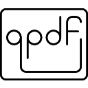
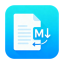

# OFFICE

| [Back to Home](index.md) | [Back to Applications](apps.md)
| --- | --- |

#### Here are listed **74** programs and **1** items for this category.

  <label for="app-search-input" style="font-weight: bold;">Search applications:</label>
  <input type="search" id="app-search-input" placeholder="Type a name or keyword..." autocomplete="off"
    style="width: 100%; max-width: 480px; padding: 0.5em 0.75em; margin-top: 0.25em; font-size: 1em; border: 1px solid #999; border-radius: 4px; box-sizing: border-box;">
  

#### *Categories*

  <a class="cat-pill" href="appimages.html">AppImages</a>
  •
  <a class="cat-pill" href="ai.html">ai</a>
  •
  <a class="cat-pill" href="am-utils.html">am-utils</a>
  •
  <a class="cat-pill" href="android.html">android</a>
  •
  <a class="cat-pill" href="appimage-on-the-fly.html">appimage-on-the-fly</a>
  •
  <a class="cat-pill" href="audio.html">audio</a>
  •
  <a class="cat-pill" href="comic.html">comic</a>
  •
  <a class="cat-pill" href="command-line.html">command-line</a>
  •
  <a class="cat-pill" href="communication.html">communication</a>
  •
  <a class="cat-pill" href="disk.html">disk</a>
  •
  <a class="cat-pill" href="education.html">education</a>
  •
  <a class="cat-pill" href="emulator.html">emulator</a>
  •
  <a class="cat-pill" href="file-manager.html">file-manager</a>
  •
  <a class="cat-pill" href="finance.html">finance</a>
  •
  <a class="cat-pill" href="game.html">game</a>
  •
  <a class="cat-pill" href="gnome.html">gnome</a>
  •
  <a class="cat-pill" href="graphic.html">graphic</a>
  •
  <a class="cat-pill" href="internet.html">internet</a>
  •
  <a class="cat-pill" href="kde.html">kde</a>
  •
  <a class="cat-pill" href="metapackages.html">metapackages</a>
  •
  <a class="cat-pill cat-pill--all" href="office.html">office</a>
  •
  <a class="cat-pill" href="password.html">password</a>
  •
  <a class="cat-pill" href="portable.html">Portable</a>
  •
  <a class="cat-pill" href="portable-cli.html">portable-cli</a>
  •
  <a class="cat-pill" href="portable-desktop.html">portable-desktop</a>
  •
  <a class="cat-pill" href="steam.html">steam</a>
  •
  <a class="cat-pill" href="system-monitor.html">system-monitor</a>
  •
  <a class="cat-pill" href="video.html">video</a>
  •
  <a class="cat-pill" href="virtual-machine.html">virtual-machine</a>
  •
  <a class="cat-pill" href="wallet.html">wallet</a>
  •
  <a class="cat-pill" href="web-app.html">web-app</a>
  •
  <a class="cat-pill" href="web-browser.html">web-browser</a>
  •
  <a class="cat-pill" href="wine.html">wine</a>
  •
  <a class="cat-pill" href="youtube.html">youtube</a>

-----------------

***NOTE, Installer scripts (blob/raw) are provided for reading only: do not run them manually! Use "[AM](https://github.com/ivan-hc/AM)" or "[AppMan](https://github.com/ivan-hc/AppMan)" instead.***

-----------------

| ICON | PACKAGE NAME | DESCRIPTION | INSTALLER |
| --- | --- | --- | --- |
|  | [***alexandria***](apps/alexandria.md) | *eBook reader built with Tauri, Epub.js, and Typescript.*..[ *read more* ](apps/alexandria.md)*!* | [*blob*](https://github.com/ivan-hc/AM/blob/main/programs/x86_64/alexandria) **/** [*raw*](https://raw.githubusercontent.com/ivan-hc/AM/main/programs/x86_64/alexandria) |
|  | [***anything-llm***](apps/anything-llm.md) | *AI business intelligence tool. Any LLM, any document.*..[ *read more* ](apps/anything-llm.md)*!* | [*blob*](https://github.com/ivan-hc/AM/blob/main/programs/x86_64/anything-llm) **/** [*raw*](https://raw.githubusercontent.com/ivan-hc/AM/main/programs/x86_64/anything-llm) |
|  | [***apiflow***](apps/apiflow.md) | *A modern API workspace that works both online and offlinecombining API documentation, testing, mock, and AI-powered automation in one lightweight tool.*..[ *read more* ](apps/apiflow.md)*!* | [*blob*](https://github.com/ivan-hc/AM/blob/main/programs/x86_64/apiflow) **/** [*raw*](https://raw.githubusercontent.com/ivan-hc/AM/main/programs/x86_64/apiflow) |
|  | [***bk***](apps/bk.md) | *Terminal Epub reader.*..[ *read more* ](apps/bk.md)*!* | [*blob*](https://github.com/ivan-hc/AM/blob/main/programs/x86_64/bk) **/** [*raw*](https://raw.githubusercontent.com/ivan-hc/AM/main/programs/x86_64/bk) |
|  | [***boost-note***](apps/boost-note.md) | *Document driven project management tool to speedup remote DevOps.*..[ *read more* ](apps/boost-note.md)*!* | [*blob*](https://github.com/ivan-hc/AM/blob/main/programs/x86_64/boost-note) **/** [*raw*](https://raw.githubusercontent.com/ivan-hc/AM/main/programs/x86_64/boost-note) |
|  | [***calligra***](apps/calligra.md) | *Calligra Suite is an office and graphic art suite by KDE. It contains applications for word processing, spreadsheets, presentation, vector graphics, and editing databases.*..[ *read more* ](apps/calligra.md)*!* | [*blob*](https://github.com/ivan-hc/AM/blob/main/programs/x86_64/calligra) **/** [*raw*](https://raw.githubusercontent.com/ivan-hc/AM/main/programs/x86_64/calligra) |
|  | [***collaboraoffice***](apps/collaboraoffice.md) | *Unofficial, a collaborative online office suite based on LibreOffice technology.*..[ *read more* ](apps/collaboraoffice.md)*!* | [*blob*](https://github.com/ivan-hc/AM/blob/main/programs/x86_64/collaboraoffice) **/** [*raw*](https://raw.githubusercontent.com/ivan-hc/AM/main/programs/x86_64/collaboraoffice) |
|  | [***corepad***](apps/corepad.md) | *A document editor for CuboCore Application Suite.*..[ *read more* ](apps/corepad.md)*!* | [*blob*](https://github.com/ivan-hc/AM/blob/main/programs/x86_64/corepad) **/** [*raw*](https://raw.githubusercontent.com/ivan-hc/AM/main/programs/x86_64/corepad) |
|  | [***densify***](apps/densify.md) | *A GTK+ GUI Application written in Python that simplifies compressing PDF files with Ghostscript.*..[ *read more* ](apps/densify.md)*!* | [*blob*](https://github.com/ivan-hc/AM/blob/main/programs/x86_64/densify) **/** [*raw*](https://raw.githubusercontent.com/ivan-hc/AM/main/programs/x86_64/densify) |
|  | [***eplee***](apps/eplee.md) | *Sweet, simple epub reader.*..[ *read more* ](apps/eplee.md)*!* | [*blob*](https://github.com/ivan-hc/AM/blob/main/programs/x86_64/eplee) **/** [*raw*](https://raw.githubusercontent.com/ivan-hc/AM/main/programs/x86_64/eplee) |
|  | [***evince***](apps/evince.md) | *Unofficial. Document viewer for popular document formats.*..[ *read more* ](apps/evince.md)*!* | [*blob*](https://github.com/ivan-hc/AM/blob/main/programs/x86_64/evince) **/** [*raw*](https://raw.githubusercontent.com/ivan-hc/AM/main/programs/x86_64/evince) |
|  | [***exifcleaner***](apps/exifcleaner.md) | *Clean exif metadata from images, videos, and PDFs.*..[ *read more* ](apps/exifcleaner.md)*!* | [*blob*](https://github.com/ivan-hc/AM/blob/main/programs/x86_64/exifcleaner) **/** [*raw*](https://raw.githubusercontent.com/ivan-hc/AM/main/programs/x86_64/exifcleaner) |
|  | [***fbreader***](apps/fbreader.md) | *Your Favourite eBook Reader*..[ *read more* ](apps/fbreader.md)*!* | [*blob*](https://github.com/ivan-hc/AM/blob/main/programs/x86_64/fbreader) **/** [*raw*](https://raw.githubusercontent.com/ivan-hc/AM/main/programs/x86_64/fbreader) |
|  | [***ficus***](apps/ficus.md) | *A software for editing and managing markdown documents.*..[ *read more* ](apps/ficus.md)*!* | [*blob*](https://github.com/ivan-hc/AM/blob/main/programs/x86_64/ficus) **/** [*raw*](https://raw.githubusercontent.com/ivan-hc/AM/main/programs/x86_64/ficus) |
|  | [***flippy-qualitative-testbench***](apps/flippy-qualitative-testbench.md) | *Music sheet reader.*..[ *read more* ](apps/flippy-qualitative-testbench.md)*!* | [*blob*](https://github.com/ivan-hc/AM/blob/main/programs/x86_64/flippy-qualitative-testbench) **/** [*raw*](https://raw.githubusercontent.com/ivan-hc/AM/main/programs/x86_64/flippy-qualitative-testbench) |
|  | [***fluent-reader***](apps/fluent-reader.md) | *Modern desktop RSS reader.*..[ *read more* ](apps/fluent-reader.md)*!* | [*blob*](https://github.com/ivan-hc/AM/blob/main/programs/x86_64/fluent-reader) **/** [*raw*](https://raw.githubusercontent.com/ivan-hc/AM/main/programs/x86_64/fluent-reader) |
|  | [***folo***](apps/folo.md) | *Folo is the AI Reader.*..[ *read more* ](apps/folo.md)*!* | [*blob*](https://github.com/ivan-hc/AM/blob/main/programs/x86_64/folo) **/** [*raw*](https://raw.githubusercontent.com/ivan-hc/AM/main/programs/x86_64/folo) |
|  | [***gnumeric***](apps/gnumeric.md) | *Unofficial. An open-source spreadsheet program.*..[ *read more* ](apps/gnumeric.md)*!* | [*blob*](https://github.com/ivan-hc/AM/blob/main/programs/x86_64/gnumeric) **/** [*raw*](https://raw.githubusercontent.com/ivan-hc/AM/main/programs/x86_64/gnumeric) |
|  | [***gospel***](apps/gospel.md) | *Poppler based fast pdf viewer written in PyQt5.*..[ *read more* ](apps/gospel.md)*!* | [*blob*](https://github.com/ivan-hc/AM/blob/main/programs/x86_64/gospel) **/** [*raw*](https://raw.githubusercontent.com/ivan-hc/AM/main/programs/x86_64/gospel) |
|  | [***hdict***](apps/hdict.md) | *Offline dictionary reader for StarDict, Slob, Mdict and Dictd dictionaries.*..[ *read more* ](apps/hdict.md)*!* | [*blob*](https://github.com/ivan-hc/AM/blob/main/programs/x86_64/hdict) **/** [*raw*](https://raw.githubusercontent.com/ivan-hc/AM/main/programs/x86_64/hdict) |
|  | [***htmldoc***](apps/htmldoc.md) | *HTML & Markdown Conversion Software to output PostScript and PDF.*..[ *read more* ](apps/htmldoc.md)*!* | [*blob*](https://github.com/ivan-hc/AM/blob/main/programs/x86_64/htmldoc) **/** [*raw*](https://raw.githubusercontent.com/ivan-hc/AM/main/programs/x86_64/htmldoc) |
|  | [***inkscape***](apps/inkscape.md) | *Unofficial. Vector-based drawing program and graphics editor for both artistic and technical illustrations. It can import and export various file formats, including SVG, AI, EPS, PDF, AutoCAD, PS and PNG.*..[ *read more* ](apps/inkscape.md)*!* | [*blob*](https://github.com/ivan-hc/AM/blob/main/programs/x86_64/inkscape) **/** [*raw*](https://raw.githubusercontent.com/ivan-hc/AM/main/programs/x86_64/inkscape) |
|  | [***ireader***](apps/ireader.md) | *Privacy-focused, open source novel reader app.*..[ *read more* ](apps/ireader.md)*!* | [*blob*](https://github.com/ivan-hc/AM/blob/main/programs/x86_64/ireader) **/** [*raw*](https://raw.githubusercontent.com/ivan-hc/AM/main/programs/x86_64/ireader) |
|  | [***kate***](apps/kdeutils.md) | *A multi-document editor part of KDE. This is part of "kdeutils".*..[ *read more* ](apps/kdeutils.md)*!* | [*blob*](https://github.com/ivan-hc/AM/blob/main/programs/x86_64/kdeutils) **/** [*raw*](https://raw.githubusercontent.com/ivan-hc/AM/main/programs/x86_64/kdeutils) |
|  | [***kiwix***](apps/kiwix.md) | *An offline reader for Web content, primarily designed to make Wikipedia available offline. It reads archives in the ZIM file format, a highly compressed open format with additional metadata.*..[ *read more* ](apps/kiwix.md)*!* | [*blob*](https://github.com/ivan-hc/AM/blob/main/programs/x86_64/kiwix) **/** [*raw*](https://raw.githubusercontent.com/ivan-hc/AM/main/programs/x86_64/kiwix) |
|  | [***koodo-reader***](apps/koodo-reader.md) | *Modern ebook manager and reader with sync & backup capacities.*..[ *read more* ](apps/koodo-reader.md)*!* | [*blob*](https://github.com/ivan-hc/AM/blob/main/programs/x86_64/koodo-reader) **/** [*raw*](https://raw.githubusercontent.com/ivan-hc/AM/main/programs/x86_64/koodo-reader) |
|  | [***koreader***](apps/koreader.md) | *A document viewer for E Ink devices. Supported fileformats include EPUB, PDF, DjVu, XPS, CBT, CBZ, FB2, PDB, TXT, HTML, RTF, CHM, DOC, MOBI and ZIP files. It’s available for Kindle, Kobo, PocketBook, Android and desktop Linux.*..[ *read more* ](apps/koreader.md)*!* | [*blob*](https://github.com/ivan-hc/AM/blob/main/programs/x86_64/koreader) **/** [*raw*](https://raw.githubusercontent.com/ivan-hc/AM/main/programs/x86_64/koreader) |
|  | [***koreader-nightly***](apps/koreader-nightly.md) | *A document viewer for E Ink devices. Supported fileformats include EPUB, PDF, DjVu, XPS, CBT, CBZ, FB2, PDB, TXT, HTML, RTF, CHM, DOC, MOBI and ZIP files. It’s available for Kindle, Kobo, PocketBook, Android and desktop Linux. Nightly build.*..[ *read more* ](apps/koreader-nightly.md)*!* | [*blob*](https://github.com/ivan-hc/AM/blob/main/programs/x86_64/koreader-nightly) **/** [*raw*](https://raw.githubusercontent.com/ivan-hc/AM/main/programs/x86_64/koreader-nightly) |
|  | [***libreoffice***](apps/libreoffice.md) | *Unofficial, LibreOffice is a private and powerful, free and open source office suite – the successor project to OpenOffice. It's compatible with Microsoft Office/365 files.*..[ *read more* ](apps/libreoffice.md)*!* | [*blob*](https://github.com/ivan-hc/AM/blob/main/programs/x86_64/libreoffice) **/** [*raw*](https://raw.githubusercontent.com/ivan-hc/AM/main/programs/x86_64/libreoffice) |
|  | [***makagiga***](apps/makagiga.md) | *To-do manager, notepad, RSS reader and much more.*..[ *read more* ](apps/makagiga.md)*!* | [*blob*](https://github.com/ivan-hc/AM/blob/main/programs/x86_64/makagiga) **/** [*raw*](https://raw.githubusercontent.com/ivan-hc/AM/main/programs/x86_64/makagiga) |
|  | [***mapic***](apps/mapic.md) | *MaPic is a Image Viewer with AI Metadata Reader.*..[ *read more* ](apps/mapic.md)*!* | [*blob*](https://github.com/ivan-hc/AM/blob/main/programs/x86_64/mapic) **/** [*raw*](https://raw.githubusercontent.com/ivan-hc/AM/main/programs/x86_64/mapic) |
|  | [***master-pdf-editor***](apps/master-pdf-editor.md) | *Master PDF Editor allows you to create, edit, preview, encrypt, sign and print PDF documents.*..[ *read more* ](apps/master-pdf-editor.md)*!* | [*blob*](https://github.com/ivan-hc/AM/blob/main/programs/x86_64/master-pdf-editor) **/** [*raw*](https://raw.githubusercontent.com/ivan-hc/AM/main/programs/x86_64/master-pdf-editor) |
|  | [***mdsilo-app***](apps/mdsilo-app.md) | *Lightweight Knowledge Base and Feed Reader.*..[ *read more* ](apps/mdsilo-app.md)*!* | [*blob*](https://github.com/ivan-hc/AM/blob/main/programs/x86_64/mdsilo-app) **/** [*raw*](https://raw.githubusercontent.com/ivan-hc/AM/main/programs/x86_64/mdsilo-app) |
|  | [***mrrss***](apps/mrrss.md) | *A modern, cross-platform, and free AI RSS reader.*..[ *read more* ](apps/mrrss.md)*!* | [*blob*](https://github.com/ivan-hc/AM/blob/main/programs/x86_64/mrrss) **/** [*raw*](https://raw.githubusercontent.com/ivan-hc/AM/main/programs/x86_64/mrrss) |
|  | [***mtcelledit***](apps/mtcelledit.md) | *Lightweight spreadsheet program.*..[ *read more* ](apps/mtcelledit.md)*!* | [*blob*](https://github.com/ivan-hc/AM/blob/main/programs/x86_64/mtcelledit) **/** [*raw*](https://raw.githubusercontent.com/ivan-hc/AM/main/programs/x86_64/mtcelledit) |
|  | [***mupdf***](apps/mupdf.md) | *Lightweight PDF, XPS, and E-book viewer.*..[ *read more* ](apps/mupdf.md)*!* | [*blob*](https://github.com/ivan-hc/AM/blob/main/programs/x86_64/mupdf) **/** [*raw*](https://raw.githubusercontent.com/ivan-hc/AM/main/programs/x86_64/mupdf) |
|  | [***mutool***](apps/mutool.md) | *All purpose tool for dealing with PDF files.*..[ *read more* ](apps/mutool.md)*!* | [*blob*](https://github.com/ivan-hc/AM/blob/main/programs/x86_64/mutool) **/** [*raw*](https://raw.githubusercontent.com/ivan-hc/AM/main/programs/x86_64/mutool) |
|  | [***newsflash***](apps/newsflash.md) | *Unofficial. RSS reader with support for local and web RSS feed.*..[ *read more* ](apps/newsflash.md)*!* | [*blob*](https://github.com/ivan-hc/AM/blob/main/programs/x86_64/newsflash) **/** [*raw*](https://raw.githubusercontent.com/ivan-hc/AM/main/programs/x86_64/newsflash) |
|  | [***nightpdf***](apps/nightpdf.md) | *Dark Mode PDF Reader built using Electron and PDF.js.*..[ *read more* ](apps/nightpdf.md)*!* | [*blob*](https://github.com/ivan-hc/AM/blob/main/programs/x86_64/nightpdf) **/** [*raw*](https://raw.githubusercontent.com/ivan-hc/AM/main/programs/x86_64/nightpdf) |
|  | [***onlyoffice***](apps/onlyoffice.md) | *Office Suite with full support for MS Windows formats and cloud.*..[ *read more* ](apps/onlyoffice.md)*!* | [*blob*](https://github.com/ivan-hc/AM/blob/main/programs/x86_64/onlyoffice) **/** [*raw*](https://raw.githubusercontent.com/ivan-hc/AM/main/programs/x86_64/onlyoffice) |
|  | [***pboy***](apps/pboy.md) | *A small .pdf management tool with a command-line UI.*..[ *read more* ](apps/pboy.md)*!* | [*blob*](https://github.com/ivan-hc/AM/blob/main/programs/x86_64/pboy) **/** [*raw*](https://raw.githubusercontent.com/ivan-hc/AM/main/programs/x86_64/pboy) |
|  | [***pdf-arranger***](apps/pdf-arranger.md) | *Unofficial, a small python-gtk application, which helps the user to merge or split PDF documents and rotate, crop and rearrange their pages.*..[ *read more* ](apps/pdf-arranger.md)*!* | [*blob*](https://github.com/ivan-hc/AM/blob/main/programs/x86_64/pdf-arranger) **/** [*raw*](https://raw.githubusercontent.com/ivan-hc/AM/main/programs/x86_64/pdf-arranger) |
|  | [***pdf-diff***](apps/pdf-diff.md) | *A CLI tool for visualizing differences between two pdf files.*..[ *read more* ](apps/pdf-diff.md)*!* | [*blob*](https://github.com/ivan-hc/AM/blob/main/programs/x86_64/pdf-diff) **/** [*raw*](https://raw.githubusercontent.com/ivan-hc/AM/main/programs/x86_64/pdf-diff) |
|  | [***pdf-sync***](apps/pdf-sync.md) | *PDF Reader in JavaScript with Sync.*..[ *read more* ](apps/pdf-sync.md)*!* | [*blob*](https://github.com/ivan-hc/AM/blob/main/programs/x86_64/pdf-sync) **/** [*raw*](https://raw.githubusercontent.com/ivan-hc/AM/main/programs/x86_64/pdf-sync) |
|  | [***pdf-tricks***](apps/pdf-tricks.md) | *Unofficial, a simple, efficient application for small manipulations in PDF files.*..[ *read more* ](apps/pdf-tricks.md)*!* | [*blob*](https://github.com/ivan-hc/AM/blob/main/programs/x86_64/pdf-tricks) **/** [*raw*](https://raw.githubusercontent.com/ivan-hc/AM/main/programs/x86_64/pdf-tricks) |
|  | [***pdf2htmlex***](apps/pdf2htmlex.md) | *Convert PDF to HTML without losing text or format.*..[ *read more* ](apps/pdf2htmlex.md)*!* | [*blob*](https://github.com/ivan-hc/AM/blob/main/programs/x86_64/pdf2htmlex) **/** [*raw*](https://raw.githubusercontent.com/ivan-hc/AM/main/programs/x86_64/pdf2htmlex) |
|  | [***pdf4qt***](apps/pdf4qt.md) | *Open source PDF editor.*..[ *read more* ](apps/pdf4qt.md)*!* | [*blob*](https://github.com/ivan-hc/AM/blob/main/programs/x86_64/pdf4qt) **/** [*raw*](https://raw.githubusercontent.com/ivan-hc/AM/main/programs/x86_64/pdf4qt) |
|  | [***pdfcompress***](apps/pdfcompress.md) | *A utility to compress PDF documentas based on Ghostscript and YAD.*..[ *read more* ](apps/pdfcompress.md)*!* | [*blob*](https://github.com/ivan-hc/AM/blob/main/programs/x86_64/pdfcompress) **/** [*raw*](https://raw.githubusercontent.com/ivan-hc/AM/main/programs/x86_64/pdfcompress) |
|  | [***pdfcrackgui***](apps/pdfcrackgui.md) | *GUI overlay for the popular and highly regarded pdfcrack.*..[ *read more* ](apps/pdfcrackgui.md)*!* | [*blob*](https://github.com/ivan-hc/AM/blob/main/programs/x86_64/pdfcrackgui) **/** [*raw*](https://raw.githubusercontent.com/ivan-hc/AM/main/programs/x86_64/pdfcrackgui) |
|  | [***pdfquirk***](apps/pdfquirk.md) | *Creating PDFs from images or scanner made easy.*..[ *read more* ](apps/pdfquirk.md)*!* | [*blob*](https://github.com/ivan-hc/AM/blob/main/programs/x86_64/pdfquirk) **/** [*raw*](https://raw.githubusercontent.com/ivan-hc/AM/main/programs/x86_64/pdfquirk) |
|  | [***plagpatrol***](apps/plagpatrol.md) | *Detecting documents tampered to bypass plagiarism detectors.*..[ *read more* ](apps/plagpatrol.md)*!* | [*blob*](https://github.com/ivan-hc/AM/blob/main/programs/x86_64/plagpatrol) **/** [*raw*](https://raw.githubusercontent.com/ivan-hc/AM/main/programs/x86_64/plagpatrol) |
|  | [***potatopresenter***](apps/potatopresenter.md) | *Create presentation slides and exported as PDF.*..[ *read more* ](apps/potatopresenter.md)*!* | [*blob*](https://github.com/ivan-hc/AM/blob/main/programs/x86_64/potatopresenter) **/** [*raw*](https://raw.githubusercontent.com/ivan-hc/AM/main/programs/x86_64/potatopresenter) |
|  | [***qpdf***](apps/qpdf.md) | *CLI tool to perform content-preserving transformations on PDF files.*..[ *read more* ](apps/qpdf.md)*!* | [*blob*](https://github.com/ivan-hc/AM/blob/main/programs/x86_64/qpdf) **/** [*raw*](https://raw.githubusercontent.com/ivan-hc/AM/main/programs/x86_64/qpdf) |
|  | [***quran-companion***](apps/quran-companion.md) | *Free and open-source desktop Quran reader and player.*..[ *read more* ](apps/quran-companion.md)*!* | [*blob*](https://github.com/ivan-hc/AM/blob/main/programs/x86_64/quran-companion) **/** [*raw*](https://raw.githubusercontent.com/ivan-hc/AM/main/programs/x86_64/quran-companion) |
|  | [***readest***](apps/readest.md) | *Readest is a modern, feature-rich ebook reader designed for avid readers offering seamless cross-platform access, powerful tools, and an intuitive interface to elevate your reading experience.*..[ *read more* ](apps/readest.md)*!* | [*blob*](https://github.com/ivan-hc/AM/blob/main/programs/x86_64/readest) **/** [*raw*](https://raw.githubusercontent.com/ivan-hc/AM/main/programs/x86_64/readest) |
|  | [***readest-enhanced***](apps/readest-enhanced.md) | *Unofficial, an enhanced version of Readest, a modern, feature-rich ebook reader designed for avid readers offering seamless cross-platform access, powerful tools, and an intuitive interface to elevate your reading experience.*..[ *read more* ](apps/readest-enhanced.md)*!* | [*blob*](https://github.com/ivan-hc/AM/blob/main/programs/x86_64/readest-enhanced) **/** [*raw*](https://raw.githubusercontent.com/ivan-hc/AM/main/programs/x86_64/readest-enhanced) |
|  | [***ripgrep-all***](apps/ripgrep-all.md) | *A ripgrep version to also search in documents and archives.*..[ *read more* ](apps/ripgrep-all.md)*!* | [*blob*](https://github.com/ivan-hc/AM/blob/main/programs/x86_64/ripgrep-all) **/** [*raw*](https://raw.githubusercontent.com/ivan-hc/AM/main/programs/x86_64/ripgrep-all) |
|  | [***rnote***](apps/rnote.md) | *Unofficial, Rnote is a vector-based drawing app for sketching, handwritten notes and to annotate documents and pictures.*..[ *read more* ](apps/rnote.md)*!* | [*blob*](https://github.com/ivan-hc/AM/blob/main/programs/x86_64/rnote) **/** [*raw*](https://raw.githubusercontent.com/ivan-hc/AM/main/programs/x86_64/rnote) |
|  | [***rssguard***](apps/rssguard.md) | *Feed reader which supports RSS/ATOM/JSON, no-webengine version.*..[ *read more* ](apps/rssguard.md)*!* | [*blob*](https://github.com/ivan-hc/AM/blob/main/programs/x86_64/rssguard) **/** [*raw*](https://raw.githubusercontent.com/ivan-hc/AM/main/programs/x86_64/rssguard) |
|  | [***sioyek***](apps/sioyek.md) | *PDF viewer designed for reading research papers and technical books.*..[ *read more* ](apps/sioyek.md)*!* | [*blob*](https://github.com/ivan-hc/AM/blob/main/programs/x86_64/sioyek) **/** [*raw*](https://raw.githubusercontent.com/ivan-hc/AM/main/programs/x86_64/sioyek) |
|  | [***spyglass***](apps/spyglass.md) | *A personal search engine to create a searchable library from your personal documents, interests, and more.*..[ *read more* ](apps/spyglass.md)*!* | [*blob*](https://github.com/ivan-hc/AM/blob/main/programs/x86_64/spyglass) **/** [*raw*](https://raw.githubusercontent.com/ivan-hc/AM/main/programs/x86_64/spyglass) |
|  | [***stirling-pdf***](apps/stirling-pdf.md) | *Unofficial. Powerful, open-source PDF editing platform.*..[ *read more* ](apps/stirling-pdf.md)*!* | [*blob*](https://github.com/ivan-hc/AM/blob/main/programs/x86_64/stirling-pdf) **/** [*raw*](https://raw.githubusercontent.com/ivan-hc/AM/main/programs/x86_64/stirling-pdf) |
|  | [***tagspaces***](apps/tagspaces.md) | *An offline, open source, document manager with tagging support.*..[ *read more* ](apps/tagspaces.md)*!* | [*blob*](https://github.com/ivan-hc/AM/blob/main/programs/x86_64/tagspaces) **/** [*raw*](https://raw.githubusercontent.com/ivan-hc/AM/main/programs/x86_64/tagspaces) |
|  | [***thorium-reader***](apps/thorium-reader.md) | *Desktop application to read ebooks.*..[ *read more* ](apps/thorium-reader.md)*!* | [*blob*](https://github.com/ivan-hc/AM/blob/main/programs/x86_64/thorium-reader) **/** [*raw*](https://raw.githubusercontent.com/ivan-hc/AM/main/programs/x86_64/thorium-reader) |
|  | [***tipitaka-pali-reader***](apps/tipitaka-pali-reader.md) | *A Pali Reading app made in Flutter.*..[ *read more* ](apps/tipitaka-pali-reader.md)*!* | [*blob*](https://github.com/ivan-hc/AM/blob/main/programs/x86_64/tipitaka-pali-reader) **/** [*raw*](https://raw.githubusercontent.com/ivan-hc/AM/main/programs/x86_64/tipitaka-pali-reader) |
|  | [***transfernow***](apps/transfernow.md) | *TransferNow is a simple, quick and secure free solution to send large files and big documents up to 250 GB per transfer. No registration required.*..[ *read more* ](apps/transfernow.md)*!* | [*blob*](https://github.com/ivan-hc/AM/blob/main/programs/x86_64/transfernow) **/** [*raw*](https://raw.githubusercontent.com/ivan-hc/AM/main/programs/x86_64/transfernow) |
|  | [***wolai***](apps/wolai.md) | *A new form of document/note/information system, in chinese.*..[ *read more* ](apps/wolai.md)*!* | [*blob*](https://github.com/ivan-hc/AM/blob/main/programs/x86_64/wolai) **/** [*raw*](https://raw.githubusercontent.com/ivan-hc/AM/main/programs/x86_64/wolai) |
|  | [***wournal***](apps/wournal.md) | *Simple "digitial paper" for note taking and PDF annotation. Heavily inspired by Xournal.*..[ *read more* ](apps/wournal.md)*!* | [*blob*](https://github.com/ivan-hc/AM/blob/main/programs/x86_64/wournal) **/** [*raw*](https://raw.githubusercontent.com/ivan-hc/AM/main/programs/x86_64/wournal) |
|  | [***wps-office***](apps/wps-office.md) | *Unofficial, Office suite built from the official .deb package.*..[ *read more* ](apps/wps-office.md)*!* | [*blob*](https://github.com/ivan-hc/AM/blob/main/programs/x86_64/wps-office) **/** [*raw*](https://raw.githubusercontent.com/ivan-hc/AM/main/programs/x86_64/wps-office) |
|  | [***wxmaxima***](apps/wxmaxima.md) | *A document based interface for the computer algebra system Maxima.*..[ *read more* ](apps/wxmaxima.md)*!* | [*blob*](https://github.com/ivan-hc/AM/blob/main/programs/x86_64/wxmaxima) **/** [*raw*](https://raw.githubusercontent.com/ivan-hc/AM/main/programs/x86_64/wxmaxima) |
|  | [***xournal++***](apps/xournal++.md) | *A C++ handwriting notetaking software with PDF annotation support.*..[ *read more* ](apps/xournal++.md)*!* | [*blob*](https://github.com/ivan-hc/AM/blob/main/programs/x86_64/xournal++) **/** [*raw*](https://raw.githubusercontent.com/ivan-hc/AM/main/programs/x86_64/xournal++) |
|  | [***xournal++nightly***](apps/xournal++nightly.md) | *C++ notetaking software with PDF annotation support, DEV.*..[ *read more* ](apps/xournal++nightly.md)*!* | [*blob*](https://github.com/ivan-hc/AM/blob/main/programs/x86_64/xournal++nightly) **/** [*raw*](https://raw.githubusercontent.com/ivan-hc/AM/main/programs/x86_64/xournal++nightly) |
|  | [***xournalpp***](apps/xournalpp.md) | *Unofficial. Handwriting notetaking software with PDF annotation support. Written in C++ with GTK3.*..[ *read more* ](apps/xournalpp.md)*!* | [*blob*](https://github.com/ivan-hc/AM/blob/main/programs/x86_64/xournalpp) **/** [*raw*](https://raw.githubusercontent.com/ivan-hc/AM/main/programs/x86_64/xournalpp) |
|  | [***xtomarkdown***](apps/xtomarkdown.md) | *A cross-platform GUI application for converting documents to Markdown.*..[ *read more* ](apps/xtomarkdown.md)*!* | [*blob*](https://github.com/ivan-hc/AM/blob/main/programs/x86_64/xtomarkdown) **/** [*raw*](https://raw.githubusercontent.com/ivan-hc/AM/main/programs/x86_64/xtomarkdown) |
|  | [***yana***](apps/yana.md) | *Note-taking app with nested documents, text search/editor, code...*..[ *read more* ](apps/yana.md)*!* | [*blob*](https://github.com/ivan-hc/AM/blob/main/programs/x86_64/yana) **/** [*raw*](https://raw.githubusercontent.com/ivan-hc/AM/main/programs/x86_64/yana) |

---

You can improve these pages via a [pull request](https://github.com/Portable-Linux-Apps/Portable-Linux-Apps.github.io/pulls) to this site's [GitHub repository](https://github.com/Portable-Linux-Apps/Portable-Linux-Apps.github.io), or report any problems related to the installation scripts in the '[issue](https://github.com/ivan-hc/AM/issues)' section of the main database, at [https://github.com/ivan-hc/AM](https://github.com/ivan-hc/AM).

***PORTABLE-LINUX-APPS.github.io is my gift to the Linux community and was made with love for GNU/Linux and the Open Source philosophy.***

---

| [Back to Home](index.md) | [Back to Applications](apps.md)
| --- | --- |

--------

# Contacts
- **Ivan-HC** *on* [**GitHub**](https://github.com/ivan-hc)
- **AM-Ivan** *on* [**Reddit**](https://www.reddit.com/u/am-ivan)

###### *You can support me and my work on [**ko-fi.com**](https://ko-fi.com/IvanAlexHC) and [**PayPal.me**](https://paypal.me/IvanAlexHC). Thank you!*

--------

*© 2020-present Ivan Alessandro Sala aka 'Ivan-HC'* - I'm here just for fun!

