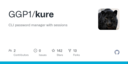
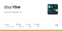

# PASSWORD

| [Home](https://portable-linux-apps.github.io/) |
| --- |

#### Here are listed **15** programs and **0** items for this category and managed by [AM](https://github.com/ivan-hc/AM) 	and [AppMan](https://github.com/ivan-hc/AppMan) for the x86_64 architecture.

*Use your browser's built-in search tool to easily navigate to this page or use the tags below.*

| [Back to Applications](https://portable-linux-apps.github.io/apps.html) |
| --- |

#### *Categories*

***[AppImages](https://portable-linux-apps.github.io/appimages.html)*** 		 - ***[android](https://portable-linux-apps.github.io/android.html)*** - ***[audio](https://portable-linux-apps.github.io/audio.html)*** - ***[comic](https://portable-linux-apps.github.io/comic.html)*** - ***[command-line](https://portable-linux-apps.github.io/command-line.html)*** - ***[communication](https://portable-linux-apps.github.io/communication.html)*** - ***[disk](https://portable-linux-apps.github.io/disk.html)*** - ***[education](https://portable-linux-apps.github.io/education.html)*** - ***[file-manager](https://portable-linux-apps.github.io/file-manager.html)*** - ***[finance](https://portable-linux-apps.github.io/finance.html)*** - ***[game](https://portable-linux-apps.github.io/game.html)*** - ***[gnome](https://portable-linux-apps.github.io/gnome.html)*** - ***[graphic](https://portable-linux-apps.github.io/graphic.html)*** - ***[internet](https://portable-linux-apps.github.io/internet.html)*** - ***[kde](https://portable-linux-apps.github.io/kde.html)*** - ***[office](https://portable-linux-apps.github.io/office.html)*** - ***[password](https://portable-linux-apps.github.io/password.html)*** - ***[steam](https://portable-linux-apps.github.io/steam.html)*** - ***[system-monitor](https://portable-linux-apps.github.io/system-monitor.html)*** - ***[video](https://portable-linux-apps.github.io/video.html)*** - ***[web-app](https://portable-linux-apps.github.io/web-app.html)*** - ***[web-browser](https://portable-linux-apps.github.io/web-browser.html)*** - ***[wine](https://portable-linux-apps.github.io/wine.html)***

-----------------

| ICON | PACKAGE NAME | DESCRIPTION | INSTALLER |
| --- | --- | --- | --- |
|  | [***advanced-passgen***](apps/advanced-passgen.md) | *Advanced Password Generator.*..[ *read more* ](apps/advanced-passgen.md)*!* | [*blob*](https://github.com/ivan-hc/AM/blob/main/programs/x86_64/advanced-passgen) **/** [*raw*](https://raw.githubusercontent.com/ivan-hc/AM/main/programs/x86_64/advanced-passgen) |
|  | [***bitwarden***](apps/bitwarden.md) | *Password manager for individuals, teams and business.*..[ *read more* ](apps/bitwarden.md)*!* | [*blob*](https://github.com/ivan-hc/AM/blob/main/programs/x86_64/bitwarden) **/** [*raw*](https://raw.githubusercontent.com/ivan-hc/AM/main/programs/x86_64/bitwarden) |
|  | [***buttercup***](apps/buttercup.md) | *Free and Open Source password vault.*..[ *read more* ](apps/buttercup.md)*!* | [*blob*](https://github.com/ivan-hc/AM/blob/main/programs/x86_64/buttercup) **/** [*raw*](https://raw.githubusercontent.com/ivan-hc/AM/main/programs/x86_64/buttercup) |
|  | [***encryptpad***](apps/encryptpad.md) | *Secure text editor and binary encryptor with passwords.*..[ *read more* ](apps/encryptpad.md)*!* | [*blob*](https://github.com/ivan-hc/AM/blob/main/programs/x86_64/encryptpad) **/** [*raw*](https://raw.githubusercontent.com/ivan-hc/AM/main/programs/x86_64/encryptpad) |
|  | [***ff-password-exporter***](apps/ff-password-exporter.md) | *Export your saved passwords from Firefox.*..[ *read more* ](apps/ff-password-exporter.md)*!* | [*blob*](https://github.com/ivan-hc/AM/blob/main/programs/x86_64/ff-password-exporter) **/** [*raw*](https://raw.githubusercontent.com/ivan-hc/AM/main/programs/x86_64/ff-password-exporter) |
|  | [***gokey***](apps/gokey.md) | *A simple vaultless password manager in Go.*..[ *read more* ](apps/gokey.md)*!* | [*blob*](https://github.com/ivan-hc/AM/blob/main/programs/x86_64/gokey) **/** [*raw*](https://raw.githubusercontent.com/ivan-hc/AM/main/programs/x86_64/gokey) |
|  | [***gopass***](apps/gopass.md) | *The slightly more awesome standard unix password manager for teams.*..[ *read more* ](apps/gopass.md)*!* | [*blob*](https://github.com/ivan-hc/AM/blob/main/programs/x86_64/gopass) **/** [*raw*](https://raw.githubusercontent.com/ivan-hc/AM/main/programs/x86_64/gopass) |
|  | [***keepassxc***](apps/keepassxc.md) | *Port of the Windows application “Keepass Password Safe”.*..[ *read more* ](apps/keepassxc.md)*!* | [*blob*](https://github.com/ivan-hc/AM/blob/main/programs/x86_64/keepassxc) **/** [*raw*](https://raw.githubusercontent.com/ivan-hc/AM/main/programs/x86_64/keepassxc) |
|  | [***keeweb***](apps/keeweb.md) | *Free cross-platform password manager compatible with KeePass.*..[ *read more* ](apps/keeweb.md)*!* | [*blob*](https://github.com/ivan-hc/AM/blob/main/programs/x86_64/keeweb) **/** [*raw*](https://raw.githubusercontent.com/ivan-hc/AM/main/programs/x86_64/keeweb) |
|  | [***kure***](apps/kure.md) | *CLI password manager with sessions.*..[ *read more* ](apps/kure.md)*!* | [*blob*](https://github.com/ivan-hc/AM/blob/main/programs/x86_64/kure) **/** [*raw*](https://raw.githubusercontent.com/ivan-hc/AM/main/programs/x86_64/kure) |
|  | [***passky***](apps/passky.md) | *Simple and secure password manager.*..[ *read more* ](apps/passky.md)*!* | [*blob*](https://github.com/ivan-hc/AM/blob/main/programs/x86_64/passky) **/** [*raw*](https://raw.githubusercontent.com/ivan-hc/AM/main/programs/x86_64/passky) |
|  | [***passphraser***](apps/passphraser.md) | *Phrase-based password generator that can use your own list of words.*..[ *read more* ](apps/passphraser.md)*!* | [*blob*](https://github.com/ivan-hc/AM/blob/main/programs/x86_64/passphraser) **/** [*raw*](https://raw.githubusercontent.com/ivan-hc/AM/main/programs/x86_64/passphraser) |
|  | [***qmasterpassword***](apps/qmasterpassword.md) | *A password manager based on Qt.*..[ *read more* ](apps/qmasterpassword.md)*!* | [*blob*](https://github.com/ivan-hc/AM/blob/main/programs/x86_64/qmasterpassword) **/** [*raw*](https://raw.githubusercontent.com/ivan-hc/AM/main/programs/x86_64/qmasterpassword) |
|  | [***rbw***](apps/rbw.md) | *Unofficial Bitwarden password manager cli.*..[ *read more* ](apps/rbw.md)*!* | [*blob*](https://github.com/ivan-hc/AM/blob/main/programs/x86_64/rbw) **/** [*raw*](https://raw.githubusercontent.com/ivan-hc/AM/main/programs/x86_64/rbw) |
|  | [***swifty***](apps/swifty.md) | *Free Offline-first Password Manager.*..[ *read more* ](apps/swifty.md)*!* | [*blob*](https://github.com/ivan-hc/AM/blob/main/programs/x86_64/swifty) **/** [*raw*](https://raw.githubusercontent.com/ivan-hc/AM/main/programs/x86_64/swifty) |

---

You can improve these pages via a [pull request](https://github.com/Portable-Linux-Apps/Portable-Linux-Apps.github.io/pulls) 	to this site's [GitHub repository](https://github.com/Portable-Linux-Apps/Portable-Linux-Apps.github.io),  	or report any problems related to the installation scripts in the '[issue](https://github.com/ivan-hc/AM/issues)' 	section of the main database, at [https://github.com/ivan-hc/AM](https://github.com/ivan-hc/AM).

***PORTABLE-LINUX-APPS.github.io is my gift to the Linux community and was made with love for GNU/Linux and the Open Source philosophy.***

---

| [Back to Home](https://portable-linux-apps.github.io/) | [Back to Applications](https://portable-linux-apps.github.io/apps.html)
| --- | --- |

--------

# Contacts
- **Ivan-HC** *on* [**GitHub**](https://github.com/ivan-hc)
- **AM-Ivan** *on* [**Reddit**](https://www.reddit.com/u/am-ivan)

###### *You can support me and my work on [**ko-fi.com**](https://ko-fi.com/IvanAlexHC) and 	[**PayPal.me**](https://paypal.me/IvanAlexHC). Thank you!*

--------

*© 2020-present Ivan Alessandro Sala aka 'Ivan-HC'* - I'm here just for fun!

