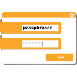

# PASSWORD

| [Home](index.md) |
| --- |

#### Here are listed **16** programs and **0** items for this category and managed by [AM](https://github.com/ivan-hc/AM) 	and [AppMan](https://github.com/ivan-hc/AppMan) for the x86_64 architecture.

*Use your browser's built-in search tool to easily navigate to this page or use the tags below.*

| [Back to Applications](apps.md) |
| --- |

#### *Categories*

***[AppImages](appimages.md)*** 		 - ***[android](android.md)*** - ***[audio](audio.md)*** - ***[comic](comic.md)*** - ***[command-line](command-line.md)*** - ***[communication](communication.md)*** - ***[disk](disk.md)*** - ***[education](education.md)*** - ***[file-manager](file-manager.md)*** - ***[finance](finance.md)*** - ***[game](game.md)*** - ***[gnome](gnome.md)*** - ***[graphic](graphic.md)*** - ***[internet](internet.md)*** - ***[kde](kde.md)*** - ***[office](office.md)*** - ***[password](password.md)*** - ***[steam](steam.md)*** - ***[system-monitor](system-monitor.md)*** - ***[video](video.md)*** - ***[web-app](web-app.md)*** - ***[web-browser](web-browser.md)*** - ***[wine](wine.md)***

-----------------

*NOTE, the installer scripts in the "INSTALLER" column are intended for use via "AM", and are therefore dedicated to a system-wide 	installation of applications (in /opt), and all that "AppMan" does is convert those scripts for local installation, changing the paths. 	**They are listed here for reading purposes only**!*

*Should you decide to run them manually, the only way to remove the application is to run 	the command "`sudo /opt/appname/remove`", where "appname" is the name of the application directory containing the "remove" script. 	Likewise, you can also update applications by running the "AM-updater" script in the same directory.*

*The "AM" project allow the autonomy of installed apps, regardless of the presence of "AM" itself in the system. However, it is strongly 	recommended to use "AM" and "AppMan" to take full advantage of all the benefits you could get from an application installed in this way.*

*If you are here just to download apps manually, click on the program name and check the URL(s) on the application page. This site does not 	provide direct links, for security reasons, but it does provide the exact sources and references where you can find them!*

*Transparency and credibility are the focus of this catalog. Happy exploring!*

-----------------

| ICON | PACKAGE NAME | DESCRIPTION | INSTALLER |
| --- | --- | --- | --- |
|  | [***advanced-passgen***](apps/advanced-passgen.md) | *Advanced Password Generator.*..[ *read more* ](apps/advanced-passgen.md)*!* | [*blob*](https://github.com/ivan-hc/AM/blob/main/programs/x86_64/advanced-passgen) **/** [*raw*](https://raw.githubusercontent.com/ivan-hc/AM/main/programs/x86_64/advanced-passgen) |
|  | [***bitwarden***](apps/bitwarden.md) | *Password manager for individuals, teams and business.*..[ *read more* ](apps/bitwarden.md)*!* | [*blob*](https://github.com/ivan-hc/AM/blob/main/programs/x86_64/bitwarden) **/** [*raw*](https://raw.githubusercontent.com/ivan-hc/AM/main/programs/x86_64/bitwarden) |
|  | [***buttercup***](apps/buttercup.md) | *Free and Open Source password vault.*..[ *read more* ](apps/buttercup.md)*!* | [*blob*](https://github.com/ivan-hc/AM/blob/main/programs/x86_64/buttercup) **/** [*raw*](https://raw.githubusercontent.com/ivan-hc/AM/main/programs/x86_64/buttercup) |
|  | [***encryptpad***](apps/encryptpad.md) | *Secure text editor and binary encryptor with passwords.*..[ *read more* ](apps/encryptpad.md)*!* | [*blob*](https://github.com/ivan-hc/AM/blob/main/programs/x86_64/encryptpad) **/** [*raw*](https://raw.githubusercontent.com/ivan-hc/AM/main/programs/x86_64/encryptpad) |
|  | [***ff-password-exporter***](apps/ff-password-exporter.md) | *Export your saved passwords from Firefox.*..[ *read more* ](apps/ff-password-exporter.md)*!* | [*blob*](https://github.com/ivan-hc/AM/blob/main/programs/x86_64/ff-password-exporter) **/** [*raw*](https://raw.githubusercontent.com/ivan-hc/AM/main/programs/x86_64/ff-password-exporter) |
|  | [***gokey***](apps/gokey.md) | *A simple vaultless password manager in Go.*..[ *read more* ](apps/gokey.md)*!* | [*blob*](https://github.com/ivan-hc/AM/blob/main/programs/x86_64/gokey) **/** [*raw*](https://raw.githubusercontent.com/ivan-hc/AM/main/programs/x86_64/gokey) |
|  | [***gopass***](apps/gopass.md) | *The slightly more awesome standard unix password manager for teams.*..[ *read more* ](apps/gopass.md)*!* | [*blob*](https://github.com/ivan-hc/AM/blob/main/programs/x86_64/gopass) **/** [*raw*](https://raw.githubusercontent.com/ivan-hc/AM/main/programs/x86_64/gopass) |
|  | [***keepassxc-devel***](apps/keepassxc-devel.md) | *Port of the Windows application “Keepass Password Safe”, dev-edition.*..[ *read more* ](apps/keepassxc-devel.md)*!* | [*blob*](https://github.com/ivan-hc/AM/blob/main/programs/x86_64/keepassxc-devel) **/** [*raw*](https://raw.githubusercontent.com/ivan-hc/AM/main/programs/x86_64/keepassxc-devel) |
|  | [***keepassxc***](apps/keepassxc.md) | *Port of the Windows application “Keepass Password Safe”.*..[ *read more* ](apps/keepassxc.md)*!* | [*blob*](https://github.com/ivan-hc/AM/blob/main/programs/x86_64/keepassxc) **/** [*raw*](https://raw.githubusercontent.com/ivan-hc/AM/main/programs/x86_64/keepassxc) |
|  | [***keeweb***](apps/keeweb.md) | *Free cross-platform password manager compatible with KeePass.*..[ *read more* ](apps/keeweb.md)*!* | [*blob*](https://github.com/ivan-hc/AM/blob/main/programs/x86_64/keeweb) **/** [*raw*](https://raw.githubusercontent.com/ivan-hc/AM/main/programs/x86_64/keeweb) |
|  | [***kure***](apps/kure.md) | *CLI password manager with sessions.*..[ *read more* ](apps/kure.md)*!* | [*blob*](https://github.com/ivan-hc/AM/blob/main/programs/x86_64/kure) **/** [*raw*](https://raw.githubusercontent.com/ivan-hc/AM/main/programs/x86_64/kure) |
|  | [***passky***](apps/passky.md) | *Simple and secure password manager.*..[ *read more* ](apps/passky.md)*!* | [*blob*](https://github.com/ivan-hc/AM/blob/main/programs/x86_64/passky) **/** [*raw*](https://raw.githubusercontent.com/ivan-hc/AM/main/programs/x86_64/passky) |
|  | [***passphraser***](apps/passphraser.md) | *Phrase-based password generator that can use your own list of words.*..[ *read more* ](apps/passphraser.md)*!* | [*blob*](https://github.com/ivan-hc/AM/blob/main/programs/x86_64/passphraser) **/** [*raw*](https://raw.githubusercontent.com/ivan-hc/AM/main/programs/x86_64/passphraser) |
|  | [***qmasterpassword***](apps/qmasterpassword.md) | *A password manager based on Qt.*..[ *read more* ](apps/qmasterpassword.md)*!* | [*blob*](https://github.com/ivan-hc/AM/blob/main/programs/x86_64/qmasterpassword) **/** [*raw*](https://raw.githubusercontent.com/ivan-hc/AM/main/programs/x86_64/qmasterpassword) |
|  | [***rbw***](apps/rbw.md) | *Unofficial Bitwarden password manager cli.*..[ *read more* ](apps/rbw.md)*!* | [*blob*](https://github.com/ivan-hc/AM/blob/main/programs/x86_64/rbw) **/** [*raw*](https://raw.githubusercontent.com/ivan-hc/AM/main/programs/x86_64/rbw) |
|  | [***swifty***](apps/swifty.md) | *Free Offline-first Password Manager.*..[ *read more* ](apps/swifty.md)*!* | [*blob*](https://github.com/ivan-hc/AM/blob/main/programs/x86_64/swifty) **/** [*raw*](https://raw.githubusercontent.com/ivan-hc/AM/main/programs/x86_64/swifty) |

---

You can improve these pages via a [pull request](https://github.com/Portable-Linux-Apps/Portable-Linux-Apps.github.io/pulls) 	to this site's [GitHub repository](https://github.com/Portable-Linux-Apps/Portable-Linux-Apps.github.io),  	or report any problems related to the installation scripts in the '[issue](https://github.com/ivan-hc/AM/issues)' 	section of the main database, at [https://github.com/ivan-hc/AM](https://github.com/ivan-hc/AM).

***PORTABLE-LINUX-APPS.github.io is my gift to the Linux community and was made with love for GNU/Linux and the Open Source philosophy.***

---

| [Back to Home](index.md) | [Back to Applications](apps.md)
| --- | --- |

--------

# Contacts
- **Ivan-HC** *on* [**GitHub**](https://github.com/ivan-hc)
- **AM-Ivan** *on* [**Reddit**](https://www.reddit.com/u/am-ivan)

###### *You can support me and my work on [**ko-fi.com**](https://ko-fi.com/IvanAlexHC) and 	[**PayPal.me**](https://paypal.me/IvanAlexHC). Thank you!*

--------

*© 2020-present Ivan Alessandro Sala aka 'Ivan-HC'* - I'm here just for fun!

