# PORTABLE CLI

| [Back to Home](index.md) | [Back to Applications](apps.md)
| --- | --- |

#### Here are listed **489** command line utilities: static and dynamic ELF binaries, or simple scripts.

  <label for="app-search-input" style="font-weight: bold;">Search applications:</label>
  <input type="search" id="app-search-input" placeholder="Type a name or keyword..." autocomplete="off"
    style="width: 100%; max-width: 480px; padding: 0.5em 0.75em; margin-top: 0.25em; font-size: 1em; border: 1px solid #999; border-radius: 4px; box-sizing: border-box;">
  <select id="app-search-arch" aria-label="Filter by architecture"
    style="margin-top: 0.25em; padding: 0.5em; font-size: 1em; border: 1px solid #999; border-radius: 4px;">
    <option value="">Any architecture</option>
    <option value="x86_64">x86_64</option>
    <option value="aarch64">aarch64</option>
    <option value="i686">i686</option>
  </select>
  

#### *Categories*

  <a class="cat-pill" href="appimages.html">AppImages</a>
  •
  <a class="cat-pill" href="ai.html">ai</a>
  •
  <a class="cat-pill" href="am-utils.html">am-utils</a>
  •
  <a class="cat-pill" href="android.html">android</a>
  •
  <a class="cat-pill" href="appimage-on-the-fly.html">appimage-on-the-fly</a>
  •
  <a class="cat-pill" href="audio.html">audio</a>
  •
  <a class="cat-pill" href="comic.html">comic</a>
  •
  <a class="cat-pill" href="command-line.html">command-line</a>
  •
  <a class="cat-pill" href="communication.html">communication</a>
  •
  <a class="cat-pill" href="disk.html">disk</a>
  •
  <a class="cat-pill" href="education.html">education</a>
  •
  <a class="cat-pill" href="emulator.html">emulator</a>
  •
  <a class="cat-pill" href="file-manager.html">file-manager</a>
  •
  <a class="cat-pill" href="finance.html">finance</a>
  •
  <a class="cat-pill" href="game.html">game</a>
  •
  <a class="cat-pill" href="gnome.html">gnome</a>
  •
  <a class="cat-pill" href="graphic.html">graphic</a>
  •
  <a class="cat-pill" href="internet.html">internet</a>
  •
  <a class="cat-pill" href="kde.html">kde</a>
  •
  <a class="cat-pill" href="metapackages.html">metapackages</a>
  •
  <a class="cat-pill" href="office.html">office</a>
  •
  <a class="cat-pill" href="password.html">password</a>
  •
  <a class="cat-pill" href="portable.html">Portable</a>
  •
  <a class="cat-pill cat-pill--all" href="portable-cli.html">portable-cli</a>
  •
  <a class="cat-pill" href="portable-desktop.html">portable-desktop</a>
  •
  <a class="cat-pill" href="steam.html">steam</a>
  •
  <a class="cat-pill" href="system-monitor.html">system-monitor</a>
  •
  <a class="cat-pill" href="video.html">video</a>
  •
  <a class="cat-pill" href="virtual-machine.html">virtual-machine</a>
  •
  <a class="cat-pill" href="wallet.html">wallet</a>
  •
  <a class="cat-pill" href="web-app.html">web-app</a>
  •
  <a class="cat-pill" href="web-browser.html">web-browser</a>
  •
  <a class="cat-pill" href="wine.html">wine</a>
  •
  <a class="cat-pill" href="youtube.html">youtube</a>

-----------------

***NOTE, Installer scripts (blob/raw) are provided for reading only: do not run them manually! Use "[AM](https://github.com/ivan-hc/AM)" or "[AppMan](https://github.com/ivan-hc/AppMan)" instead.***

-----------------

| ICON | PACKAGE NAME | DESCRIPTION | INSTALLER |
| --- | --- | --- | --- |
|  | [***7z***](apps/7z.md) | *Archiver with a high compression ratio. This is part of "am-utils" suite.*..[ *read more* ](apps/7z.md)*!* | [*blob*](https://github.com/ivan-hc/AM/blob/main/programs/x86_64/7z) **/** [*raw*](https://raw.githubusercontent.com/ivan-hc/AM/main/programs/x86_64/7z) |
|  | [***7zip***](apps/7zip.md) | *7-Zip is a file archiver with a high compression ratio.*..[ *read more* ](apps/7zip.md)*!* | [*blob*](https://github.com/ivan-hc/AM/blob/main/programs/x86_64/7zip) **/** [*raw*](https://raw.githubusercontent.com/ivan-hc/AM/main/programs/x86_64/7zip) |
|  | [***addr2line***](apps/addr2line.md) | *Or symbol+offset into file names and. This is part of "am-utils" suite.*..[ *read more* ](apps/addr2line.md)*!* | [*blob*](https://github.com/ivan-hc/AM/blob/main/programs/x86_64/addr2line) **/** [*raw*](https://raw.githubusercontent.com/ivan-hc/AM/main/programs/x86_64/addr2line) |
|  | [***afetch***](apps/afetch.md) | *A CLI system information tool written in Rust.*..[ *read more* ](apps/afetch.md)*!* | [*blob*](https://github.com/ivan-hc/AM/blob/main/programs/x86_64/afetch) **/** [*raw*](https://raw.githubusercontent.com/ivan-hc/AM/main/programs/x86_64/afetch) |
|  | [***aichat***](apps/aichat.md) | *AIO AI CLI tool integrating 20+ AI platforms, including OpenAI.*..[ *read more* ](apps/aichat.md)*!* | [*blob*](https://github.com/ivan-hc/AM/blob/main/programs/x86_64/aichat) **/** [*raw*](https://raw.githubusercontent.com/ivan-hc/AM/main/programs/x86_64/aichat) |
|  | [***aim***](apps/aim.md) | *A command line download/upload tool with resume.*..[ *read more* ](apps/aim.md)*!* | [*blob*](https://github.com/ivan-hc/AM/blob/main/programs/x86_64/aim) **/** [*raw*](https://raw.githubusercontent.com/ivan-hc/AM/main/programs/x86_64/aim) |
| 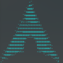 | [***albafetch***](apps/albafetch.md) | *CLI, faster neofetch alternative, written in C. Still improving.*..[ *read more* ](apps/albafetch.md)*!* | [*blob*](https://github.com/ivan-hc/AM/blob/main/programs/x86_64/albafetch) **/** [*raw*](https://raw.githubusercontent.com/ivan-hc/AM/main/programs/x86_64/albafetch) |
|  | [***alpine-flatimage***](apps/alpine-flatimage.md) | *A hybrid of Flatpak sandboxing with AppImage portability.*..[ *read more* ](apps/alpine-flatimage.md)*!* | [*blob*](https://github.com/ivan-hc/AM/blob/main/programs/x86_64/alpine-flatimage) **/** [*raw*](https://raw.githubusercontent.com/ivan-hc/AM/main/programs/x86_64/alpine-flatimage) |
|  | [***amfora***](apps/amfora.md) | *A fancy terminal browser for the Gemini protocol.*..[ *read more* ](apps/amfora.md)*!* | [*blob*](https://github.com/ivan-hc/AM/blob/main/programs/x86_64/amfora) **/** [*raw*](https://raw.githubusercontent.com/ivan-hc/AM/main/programs/x86_64/amfora) |
|  | [***ani-cli***](apps/ani-cli.md) | *A cli tool to browse and play anime.*..[ *read more* ](apps/ani-cli.md)*!* | [*blob*](https://github.com/ivan-hc/AM/blob/main/programs/x86_64/ani-cli) **/** [*raw*](https://raw.githubusercontent.com/ivan-hc/AM/main/programs/x86_64/ani-cli) |
|  | [***antidot***](apps/antidot.md) | *Cleans up your $HOME from those pesky dotfiles.*..[ *read more* ](apps/antidot.md)*!* | [*blob*](https://github.com/ivan-hc/AM/blob/main/programs/x86_64/antidot) **/** [*raw*](https://raw.githubusercontent.com/ivan-hc/AM/main/programs/x86_64/antidot) |
|  | [***appimagen***](apps/appimagen.md) | *A script that generates a custom AppImage from a PPA.*..[ *read more* ](apps/appimagen.md)*!* | [*blob*](https://github.com/ivan-hc/AM/blob/main/programs/x86_64/appimagen) **/** [*raw*](https://raw.githubusercontent.com/ivan-hc/AM/main/programs/x86_64/appimagen) |
|  | [***appimageupdate***](apps/appimageupdate.md) | *A Rust implementation of AppImageUpdate, a tool for updating AppImages using efficient delta updates using zsync.*..[ *read more* ](apps/appimageupdate.md)*!* | [*blob*](https://github.com/ivan-hc/AM/blob/main/programs/x86_64/appimageupdate) **/** [*raw*](https://raw.githubusercontent.com/ivan-hc/AM/main/programs/x86_64/appimageupdate) |
|  | [***appimg***](apps/appimg.md) | *Appimg is a lightweight command-line tool that helps you manage AppImage files on Linux.*..[ *read more* ](apps/appimg.md)*!* | [*blob*](https://github.com/ivan-hc/AM/blob/main/programs/x86_64/appimg) **/** [*raw*](https://raw.githubusercontent.com/ivan-hc/AM/main/programs/x86_64/appimg) |
|  | [***appinstall***](apps/appinstall.md) | *AppImage Installer, a tool integrate AppImages to a linux desktop environment.*..[ *read more* ](apps/appinstall.md)*!* | [*blob*](https://github.com/ivan-hc/AM/blob/main/programs/x86_64/appinstall) **/** [*raw*](https://raw.githubusercontent.com/ivan-hc/AM/main/programs/x86_64/appinstall) |
|  | [***aptly***](apps/aptly.md) | *Debian repository management CLI tool.*..[ *read more* ](apps/aptly.md)*!* | [*blob*](https://github.com/ivan-hc/AM/blob/main/programs/x86_64/aptly) **/** [*raw*](https://raw.githubusercontent.com/ivan-hc/AM/main/programs/x86_64/aptly) |
|  | [***ar***](apps/ar.md) | *Create, modify, and extract from .deb archives. This is part of "am-utils" suite.*..[ *read more* ](apps/ar.md)*!* | [*blob*](https://github.com/ivan-hc/AM/blob/main/programs/x86_64/ar) **/** [*raw*](https://raw.githubusercontent.com/ivan-hc/AM/main/programs/x86_64/ar) |
|  | [***arch***](apps/arch.md) | *Hardware name (same as uname -m). This is part of "am-utils" suite.*..[ *read more* ](apps/arch.md)*!* | [*blob*](https://github.com/ivan-hc/AM/blob/main/programs/x86_64/arch) **/** [*raw*](https://raw.githubusercontent.com/ivan-hc/AM/main/programs/x86_64/arch) |
| 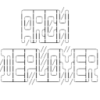 | [***arch-deployer***](apps/arch-deployer.md) | *A script to bulk download an Arch Linux package with all its dependencies to be converted in AppImage.*..[ *read more* ](apps/arch-deployer.md)*!* | [*blob*](https://github.com/ivan-hc/AM/blob/main/programs/x86_64/arch-deployer) **/** [*raw*](https://raw.githubusercontent.com/ivan-hc/AM/main/programs/x86_64/arch-deployer) |
| 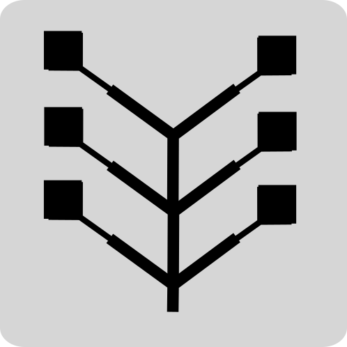 | [***arch-flatimage***](apps/arch-flatimage.md) | *A hybrid of Flatpak sandboxing with AppImage portability.*..[ *read more* ](apps/arch-flatimage.md)*!* | [*blob*](https://github.com/ivan-hc/AM/blob/main/programs/x86_64/arch-flatimage) **/** [*raw*](https://raw.githubusercontent.com/ivan-hc/AM/main/programs/x86_64/arch-flatimage) |
|  | [***archimage-cli***](apps/archimage-cli.md) | *Build AppImage packages using JuNest, Arch Linux.*..[ *read more* ](apps/archimage-cli.md)*!* | [*blob*](https://github.com/ivan-hc/AM/blob/main/programs/x86_64/archimage-cli) **/** [*raw*](https://raw.githubusercontent.com/ivan-hc/AM/main/programs/x86_64/archimage-cli) |
| 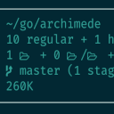 | [***archimede***](apps/archimede.md) | *Unobtrusive directory information fetcher.*..[ *read more* ](apps/archimede.md)*!* | [*blob*](https://github.com/ivan-hc/AM/blob/main/programs/x86_64/archimede) **/** [*raw*](https://raw.githubusercontent.com/ivan-hc/AM/main/programs/x86_64/archimede) |
|  | [***aretext***](apps/aretext.md) | *Minimalist text editor with vim-compatible key bindings.*..[ *read more* ](apps/aretext.md)*!* | [*blob*](https://github.com/ivan-hc/AM/blob/main/programs/x86_64/aretext) **/** [*raw*](https://raw.githubusercontent.com/ivan-hc/AM/main/programs/x86_64/aretext) |
|  | [***as***](apps/as.md) | *GNU assembler.. This is part of "am-utils" suite.*..[ *read more* ](apps/as.md)*!* | [*blob*](https://github.com/ivan-hc/AM/blob/main/programs/x86_64/as) **/** [*raw*](https://raw.githubusercontent.com/ivan-hc/AM/main/programs/x86_64/as) |
|  | [***atuin***](apps/atuin.md) | *Magical shell history.*..[ *read more* ](apps/atuin.md)*!* | [*blob*](https://github.com/ivan-hc/AM/blob/main/programs/x86_64/atuin) **/** [*raw*](https://raw.githubusercontent.com/ivan-hc/AM/main/programs/x86_64/atuin) |
|  | [***b2sum***](apps/b2sum.md) | *Check BLAKE2 message digest. This is part of "am-utils" suite.*..[ *read more* ](apps/b2sum.md)*!* | [*blob*](https://github.com/ivan-hc/AM/blob/main/programs/x86_64/b2sum) **/** [*raw*](https://raw.githubusercontent.com/ivan-hc/AM/main/programs/x86_64/b2sum) |
|  | [***bandwhich***](apps/bandwhich.md) | *Terminal bandwidth utilization tool.*..[ *read more* ](apps/bandwhich.md)*!* | [*blob*](https://github.com/ivan-hc/AM/blob/main/programs/x86_64/bandwhich) **/** [*raw*](https://raw.githubusercontent.com/ivan-hc/AM/main/programs/x86_64/bandwhich) |
|  | [***base32***](apps/base32.md) | *Base32 encode/decode data and print to standard. This is part of "am-utils" suite.*..[ *read more* ](apps/base32.md)*!* | [*blob*](https://github.com/ivan-hc/AM/blob/main/programs/x86_64/base32) **/** [*raw*](https://raw.githubusercontent.com/ivan-hc/AM/main/programs/x86_64/base32) |
|  | [***base64***](apps/base64.md) | *Base64 encode/decode data and print to standard. This is part of "am-utils" suite.*..[ *read more* ](apps/base64.md)*!* | [*blob*](https://github.com/ivan-hc/AM/blob/main/programs/x86_64/base64) **/** [*raw*](https://raw.githubusercontent.com/ivan-hc/AM/main/programs/x86_64/base64) |
|  | [***basename***](apps/basename.md) | *Strip directory and suffix from filenames. This is part of "am-utils" suite.*..[ *read more* ](apps/basename.md)*!* | [*blob*](https://github.com/ivan-hc/AM/blob/main/programs/x86_64/basename) **/** [*raw*](https://raw.githubusercontent.com/ivan-hc/AM/main/programs/x86_64/basename) |
|  | [***basenc***](apps/basenc.md) | *Encode and decode with multiple base encodings.. This is part of "am-utils" suite.*..[ *read more* ](apps/basenc.md)*!* | [*blob*](https://github.com/ivan-hc/AM/blob/main/programs/x86_64/basenc) **/** [*raw*](https://raw.githubusercontent.com/ivan-hc/AM/main/programs/x86_64/basenc) |
|  | [***bat***](apps/bat.md) | *A "cat" clone with wings.*..[ *read more* ](apps/bat.md)*!* | [*blob*](https://github.com/ivan-hc/AM/blob/main/programs/x86_64/bat) **/** [*raw*](https://raw.githubusercontent.com/ivan-hc/AM/main/programs/x86_64/bat) |
|  | [***bat-extras***](apps/bat-extras.md) | *Bash scripts that integrate bat with various command line tools.*..[ *read more* ](apps/bat-extras.md)*!* | [*blob*](https://github.com/ivan-hc/AM/blob/main/programs/x86_64/bat-extras) **/** [*raw*](https://raw.githubusercontent.com/ivan-hc/AM/main/programs/x86_64/bat-extras) |
| 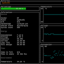 | [***battop***](apps/battop.md) | *CLI, interactive batteries viewer.*..[ *read more* ](apps/battop.md)*!* | [*blob*](https://github.com/ivan-hc/AM/blob/main/programs/x86_64/battop) **/** [*raw*](https://raw.githubusercontent.com/ivan-hc/AM/main/programs/x86_64/battop) |
|  | [***beatmapexporter***](apps/beatmapexporter.md) | *osu!lazer beatmap exporter utility. Allowing mass export of beatmaps from the new osu!lazer file storage back into .osz files.*..[ *read more* ](apps/beatmapexporter.md)*!* | [*blob*](https://github.com/ivan-hc/AM/blob/main/programs/x86_64/beatmapexporter) **/** [*raw*](https://raw.githubusercontent.com/ivan-hc/AM/main/programs/x86_64/beatmapexporter) |
|  | [***beatsaber-mod-manager***](apps/beatsaber-mod-manager.md) | *Yet another mod installer for Beat Saber, heavily inspired by ModAssistant.*..[ *read more* ](apps/beatsaber-mod-manager.md)*!* | [*blob*](https://github.com/ivan-hc/AM/blob/main/programs/x86_64/beatsaber-mod-manager) **/** [*raw*](https://raw.githubusercontent.com/ivan-hc/AM/main/programs/x86_64/beatsaber-mod-manager) |
| 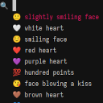 | [***bemoji***](apps/bemoji.md) | *Emoji picker for bemenu/wofi/rofi/dmenu, remembers your favorites.*..[ *read more* ](apps/bemoji.md)*!* | [*blob*](https://github.com/ivan-hc/AM/blob/main/programs/x86_64/bemoji) **/** [*raw*](https://raw.githubusercontent.com/ivan-hc/AM/main/programs/x86_64/bemoji) |
| 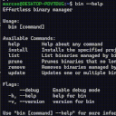 | [***bin***](apps/bin.md) | *Effortless binary manager.*..[ *read more* ](apps/bin.md)*!* | [*blob*](https://github.com/ivan-hc/AM/blob/main/programs/x86_64/bin) **/** [*raw*](https://raw.githubusercontent.com/ivan-hc/AM/main/programs/x86_64/bin) |
| 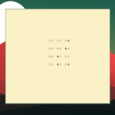 | [***binclock***](apps/binclock.md) | *Binary clock in terminal.*..[ *read more* ](apps/binclock.md)*!* | [*blob*](https://github.com/ivan-hc/AM/blob/main/programs/x86_64/binclock) **/** [*raw*](https://raw.githubusercontent.com/ivan-hc/AM/main/programs/x86_64/binclock) |
|  | [***binfinder***](apps/binfinder.md) | *Find binary files not installed through package manager.*..[ *read more* ](apps/binfinder.md)*!* | [*blob*](https://github.com/ivan-hc/AM/blob/main/programs/x86_64/binfinder) **/** [*raw*](https://raw.githubusercontent.com/ivan-hc/AM/main/programs/x86_64/binfinder) |
|  | [***bk***](apps/bk.md) | *Terminal Epub reader.*..[ *read more* ](apps/bk.md)*!* | [*blob*](https://github.com/ivan-hc/AM/blob/main/programs/x86_64/bk) **/** [*raw*](https://raw.githubusercontent.com/ivan-hc/AM/main/programs/x86_64/bk) |
| 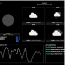 | [***blimp***](apps/blimp.md) | *Customizable terminal UI for monitoring weather information, application status, network latency, and more.*..[ *read more* ](apps/blimp.md)*!* | [*blob*](https://github.com/ivan-hc/AM/blob/main/programs/x86_64/blimp) **/** [*raw*](https://raw.githubusercontent.com/ivan-hc/AM/main/programs/x86_64/blimp) |
|  | [***blob-dl***](apps/blob-dl.md) | *Blob-dl is a yt-dlp CLI interface used to download video and audio files from YouTube.*..[ *read more* ](apps/blob-dl.md)*!* | [*blob*](https://github.com/ivan-hc/AM/blob/main/programs/x86_64/blob-dl) **/** [*raw*](https://raw.githubusercontent.com/ivan-hc/AM/main/programs/x86_64/blob-dl) |
| 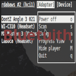 | [***bluetuith***](apps/bluetuith.md) | *A TUI bluetooth manager for Linux.*..[ *read more* ](apps/bluetuith.md)*!* | [*blob*](https://github.com/ivan-hc/AM/blob/main/programs/x86_64/bluetuith) **/** [*raw*](https://raw.githubusercontent.com/ivan-hc/AM/main/programs/x86_64/bluetuith) |
|  | [***bottom***](apps/bottom.md) | *Yet another cross-platform graphical process/system monitor.*..[ *read more* ](apps/bottom.md)*!* | [*blob*](https://github.com/ivan-hc/AM/blob/main/programs/x86_64/bottom) **/** [*raw*](https://raw.githubusercontent.com/ivan-hc/AM/main/programs/x86_64/bottom) |
| 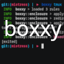 | [***boxxy***](apps/boxxy.md) | *Put bad Linux applications in a box with only their files.*..[ *read more* ](apps/boxxy.md)*!* | [*blob*](https://github.com/ivan-hc/AM/blob/main/programs/x86_64/boxxy) **/** [*raw*](https://raw.githubusercontent.com/ivan-hc/AM/main/programs/x86_64/boxxy) |
|  | [***brutespray***](apps/brutespray.md) | *Bruteforcing from various scanner output. Automatically attempts default creds on found services.*..[ *read more* ](apps/brutespray.md)*!* | [*blob*](https://github.com/ivan-hc/AM/blob/main/programs/x86_64/brutespray) **/** [*raw*](https://raw.githubusercontent.com/ivan-hc/AM/main/programs/x86_64/brutespray) |
|  | [***bunnyfetch***](apps/bunnyfetch.md) | *A small and fast tool for getting info about your system.*..[ *read more* ](apps/bunnyfetch.md)*!* | [*blob*](https://github.com/ivan-hc/AM/blob/main/programs/x86_64/bunnyfetch) **/** [*raw*](https://raw.githubusercontent.com/ivan-hc/AM/main/programs/x86_64/bunnyfetch) |
|  | [***bzip2***](apps/bzip2.md) | *A high-quality data compression program. This is part of "am-utils" suite.*..[ *read more* ](apps/bzip2.md)*!* | [*blob*](https://github.com/ivan-hc/AM/blob/main/programs/x86_64/bzip2) **/** [*raw*](https://raw.githubusercontent.com/ivan-hc/AM/main/programs/x86_64/bzip2) |
|  | [***c++filt***](apps/c++filt.md) | *And Java symbols. This is part of "am-utils" suite.*..[ *read more* ](apps/c++filt.md)*!* | [*blob*](https://github.com/ivan-hc/AM/blob/main/programs/x86_64/c++filt) **/** [*raw*](https://raw.githubusercontent.com/ivan-hc/AM/main/programs/x86_64/c++filt) |
|  | [***carbonyl***](apps/carbonyl.md) | *Chromium running inside your terminal.*..[ *read more* ](apps/carbonyl.md)*!* | [*blob*](https://github.com/ivan-hc/AM/blob/main/programs/x86_64/carbonyl) **/** [*raw*](https://raw.githubusercontent.com/ivan-hc/AM/main/programs/x86_64/carbonyl) |
|  | [***cask***](apps/cask.md) | *A universal, distributed binary file manager.*..[ *read more* ](apps/cask.md)*!* | [*blob*](https://github.com/ivan-hc/AM/blob/main/programs/x86_64/cask) **/** [*raw*](https://raw.githubusercontent.com/ivan-hc/AM/main/programs/x86_64/cask) |
|  | [***cat***](apps/cat.md) | *Concatenate files and print on the standard output. This is part of "am-utils" suite.*..[ *read more* ](apps/cat.md)*!* | [*blob*](https://github.com/ivan-hc/AM/blob/main/programs/x86_64/cat) **/** [*raw*](https://raw.githubusercontent.com/ivan-hc/AM/main/programs/x86_64/cat) |
|  | [***chcon***](apps/chcon.md) | *Security context. This is part of "am-utils" suite.*..[ *read more* ](apps/chcon.md)*!* | [*blob*](https://github.com/ivan-hc/AM/blob/main/programs/x86_64/chcon) **/** [*raw*](https://raw.githubusercontent.com/ivan-hc/AM/main/programs/x86_64/chcon) |
|  | [***cheat***](apps/cheat.md) | *Create and view interactive cheatsheets on the command-line.*..[ *read more* ](apps/cheat.md)*!* | [*blob*](https://github.com/ivan-hc/AM/blob/main/programs/x86_64/cheat) **/** [*raw*](https://raw.githubusercontent.com/ivan-hc/AM/main/programs/x86_64/cheat) |
|  | [***checkra1n***](apps/checkra1n.md) | *Jailbreak for iPhone 5s through iPhone X, iOS 12.0 and up*..[ *read more* ](apps/checkra1n.md)*!* | [*blob*](https://github.com/ivan-hc/AM/blob/main/programs/x86_64/checkra1n) **/** [*raw*](https://raw.githubusercontent.com/ivan-hc/AM/main/programs/x86_64/checkra1n) |
|  | [***chess-tui***](apps/chess-tui.md) | *Play chess from your terminal.*..[ *read more* ](apps/chess-tui.md)*!* | [*blob*](https://github.com/ivan-hc/AM/blob/main/programs/x86_64/chess-tui) **/** [*raw*](https://raw.githubusercontent.com/ivan-hc/AM/main/programs/x86_64/chess-tui) |
|  | [***chgrp***](apps/chgrp.md) | *Change group ownership. This is part of "am-utils" suite.*..[ *read more* ](apps/chgrp.md)*!* | [*blob*](https://github.com/ivan-hc/AM/blob/main/programs/x86_64/chgrp) **/** [*raw*](https://raw.githubusercontent.com/ivan-hc/AM/main/programs/x86_64/chgrp) |
|  | [***chmod***](apps/chmod.md) | *Change file mode bits. This is part of "am-utils" suite.*..[ *read more* ](apps/chmod.md)*!* | [*blob*](https://github.com/ivan-hc/AM/blob/main/programs/x86_64/chmod) **/** [*raw*](https://raw.githubusercontent.com/ivan-hc/AM/main/programs/x86_64/chmod) |
|  | [***chown***](apps/chown.md) | *Change file owner and group. This is part of "am-utils" suite.*..[ *read more* ](apps/chown.md)*!* | [*blob*](https://github.com/ivan-hc/AM/blob/main/programs/x86_64/chown) **/** [*raw*](https://raw.githubusercontent.com/ivan-hc/AM/main/programs/x86_64/chown) |
|  | [***chroot***](apps/chroot.md) | *Run command or interactive shell with special root. This is part of "am-utils" suite.*..[ *read more* ](apps/chroot.md)*!* | [*blob*](https://github.com/ivan-hc/AM/blob/main/programs/x86_64/chroot) **/** [*raw*](https://raw.githubusercontent.com/ivan-hc/AM/main/programs/x86_64/chroot) |
| 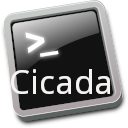 | [***cicada***](apps/cicada.md) | *An old-school bash-like Unix shell written in Rust.*..[ *read more* ](apps/cicada.md)*!* | [*blob*](https://github.com/ivan-hc/AM/blob/main/programs/x86_64/cicada) **/** [*raw*](https://raw.githubusercontent.com/ivan-hc/AM/main/programs/x86_64/cicada) |
|  | [***cksum***](apps/cksum.md) | *Compute and verify file checksums. This is part of "am-utils" suite.*..[ *read more* ](apps/cksum.md)*!* | [*blob*](https://github.com/ivan-hc/AM/blob/main/programs/x86_64/cksum) **/** [*raw*](https://raw.githubusercontent.com/ivan-hc/AM/main/programs/x86_64/cksum) |
|  | [***clear***](apps/clear.md) | *Clear the terminal screen. This is part of "am-utils" suite.*..[ *read more* ](apps/clear.md)*!* | [*blob*](https://github.com/ivan-hc/AM/blob/main/programs/x86_64/clear) **/** [*raw*](https://raw.githubusercontent.com/ivan-hc/AM/main/programs/x86_64/clear) |
| 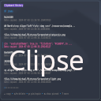 | [***clipse***](apps/clipse.md) | *Configurable TUI clipboard manager for Unix.*..[ *read more* ](apps/clipse.md)*!* | [*blob*](https://github.com/ivan-hc/AM/blob/main/programs/x86_64/clipse) **/** [*raw*](https://raw.githubusercontent.com/ivan-hc/AM/main/programs/x86_64/clipse) |
|  | [***code-radio***](apps/code-radio.md) | *A command line music radio client for coderadio.freecodecamp.org, written in Rust.*..[ *read more* ](apps/code-radio.md)*!* | [*blob*](https://github.com/ivan-hc/AM/blob/main/programs/x86_64/code-radio) **/** [*raw*](https://raw.githubusercontent.com/ivan-hc/AM/main/programs/x86_64/code-radio) |
|  | [***codebook-lsp***](apps/codebook-lsp.md) | *Codebook, code-aware spell checker with language server implementation.*..[ *read more* ](apps/codebook-lsp.md)*!* | [*blob*](https://github.com/ivan-hc/AM/blob/main/programs/x86_64/codebook-lsp) **/** [*raw*](https://raw.githubusercontent.com/ivan-hc/AM/main/programs/x86_64/codebook-lsp) |
|  | [***col***](apps/col.md) | *Line feeds from input. This is part of "am-utils" suite.*..[ *read more* ](apps/col.md)*!* | [*blob*](https://github.com/ivan-hc/AM/blob/main/programs/x86_64/col) **/** [*raw*](https://raw.githubusercontent.com/ivan-hc/AM/main/programs/x86_64/col) |
|  | [***colcrt***](apps/colcrt.md) | *Output for CRT previewing. This is part of "am-utils" suite.*..[ *read more* ](apps/colcrt.md)*!* | [*blob*](https://github.com/ivan-hc/AM/blob/main/programs/x86_64/colcrt) **/** [*raw*](https://raw.githubusercontent.com/ivan-hc/AM/main/programs/x86_64/colcrt) |
|  | [***colrm***](apps/colrm.md) | *From a file. This is part of "am-utils" suite.*..[ *read more* ](apps/colrm.md)*!* | [*blob*](https://github.com/ivan-hc/AM/blob/main/programs/x86_64/colrm) **/** [*raw*](https://raw.githubusercontent.com/ivan-hc/AM/main/programs/x86_64/colrm) |
|  | [***column***](apps/column.md) | *Columnate lists. This is part of "am-utils" suite.*..[ *read more* ](apps/column.md)*!* | [*blob*](https://github.com/ivan-hc/AM/blob/main/programs/x86_64/column) **/** [*raw*](https://raw.githubusercontent.com/ivan-hc/AM/main/programs/x86_64/column) |
|  | [***comics-downloader***](apps/comics-downloader.md) | *Tool to download comics and manga in pdf/epub/cbr/cbz from a website.*..[ *read more* ](apps/comics-downloader.md)*!* | [*blob*](https://github.com/ivan-hc/AM/blob/main/programs/x86_64/comics-downloader) **/** [*raw*](https://raw.githubusercontent.com/ivan-hc/AM/main/programs/x86_64/comics-downloader) |
|  | [***comm***](apps/comm.md) | *Compare two sorted files line by line. This is part of "am-utils" suite.*..[ *read more* ](apps/comm.md)*!* | [*blob*](https://github.com/ivan-hc/AM/blob/main/programs/x86_64/comm) **/** [*raw*](https://raw.githubusercontent.com/ivan-hc/AM/main/programs/x86_64/comm) |
|  | [***conty***](apps/conty.md) | *Easy to use unprivileged and portable Arch Linux container.*..[ *read more* ](apps/conty.md)*!* | [*blob*](https://github.com/ivan-hc/AM/blob/main/programs/x86_64/conty) **/** [*raw*](https://raw.githubusercontent.com/ivan-hc/AM/main/programs/x86_64/conty) |
|  | [***cowitness***](apps/cowitness.md) | *A powerful web app testing tool that enhances the accuracy and efficiency of your testing efforts.*..[ *read more* ](apps/cowitness.md)*!* | [*blob*](https://github.com/ivan-hc/AM/blob/main/programs/x86_64/cowitness) **/** [*raw*](https://raw.githubusercontent.com/ivan-hc/AM/main/programs/x86_64/cowitness) |
|  | [***cp***](apps/cp.md) | *Copy files and directories. This is part of "am-utils" suite.*..[ *read more* ](apps/cp.md)*!* | [*blob*](https://github.com/ivan-hc/AM/blob/main/programs/x86_64/cp) **/** [*raw*](https://raw.githubusercontent.com/ivan-hc/AM/main/programs/x86_64/cp) |
| 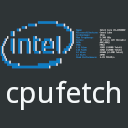 | [***cpufetch***](apps/cpufetch.md) | *Simple yet fancy CPU architecture fetching tool.*..[ *read more* ](apps/cpufetch.md)*!* | [*blob*](https://github.com/ivan-hc/AM/blob/main/programs/x86_64/cpufetch) **/** [*raw*](https://raw.githubusercontent.com/ivan-hc/AM/main/programs/x86_64/cpufetch) |
| 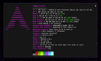 | [***crabfetch***](apps/crabfetch.md) | *Extremely fast, featureful and customizable command-line fetcher.*..[ *read more* ](apps/crabfetch.md)*!* | [*blob*](https://github.com/ivan-hc/AM/blob/main/programs/x86_64/crabfetch) **/** [*raw*](https://raw.githubusercontent.com/ivan-hc/AM/main/programs/x86_64/crabfetch) |
|  | [***croc***](apps/croc.md) | *Easily and securely send things from one computer to another.*..[ *read more* ](apps/croc.md)*!* | [*blob*](https://github.com/ivan-hc/AM/blob/main/programs/x86_64/croc) **/** [*raw*](https://raw.githubusercontent.com/ivan-hc/AM/main/programs/x86_64/croc) |
|  | [***crock***](apps/crock.md) | *Crock is rock clock.*..[ *read more* ](apps/crock.md)*!* | [*blob*](https://github.com/ivan-hc/AM/blob/main/programs/x86_64/crock) **/** [*raw*](https://raw.githubusercontent.com/ivan-hc/AM/main/programs/x86_64/crock) |
|  | [***csplit***](apps/csplit.md) | *File into sections determined by context. This is part of "am-utils" suite.*..[ *read more* ](apps/csplit.md)*!* | [*blob*](https://github.com/ivan-hc/AM/blob/main/programs/x86_64/csplit) **/** [*raw*](https://raw.githubusercontent.com/ivan-hc/AM/main/programs/x86_64/csplit) |
|  | [***ctop***](apps/ctop.md) | *Top-like interface for container metrics.*..[ *read more* ](apps/ctop.md)*!* | [*blob*](https://github.com/ivan-hc/AM/blob/main/programs/x86_64/ctop) **/** [*raw*](https://raw.githubusercontent.com/ivan-hc/AM/main/programs/x86_64/ctop) |
|  | [***curl***](apps/curl.md) | *Command line tool and library for transferring data with URLs. This is part of "am-utils" suite.*..[ *read more* ](apps/curl.md)*!* | [*blob*](https://github.com/ivan-hc/AM/blob/main/programs/x86_64/curl) **/** [*raw*](https://raw.githubusercontent.com/ivan-hc/AM/main/programs/x86_64/curl) |
|  | [***curlie***](apps/curlie.md) | *The power of curl, the ease of use of httpie.*..[ *read more* ](apps/curlie.md)*!* | [*blob*](https://github.com/ivan-hc/AM/blob/main/programs/x86_64/curlie) **/** [*raw*](https://raw.githubusercontent.com/ivan-hc/AM/main/programs/x86_64/curlie) |
|  | [***cut***](apps/cut.md) | *From each line of files. This is part of "am-utils" suite.*..[ *read more* ](apps/cut.md)*!* | [*blob*](https://github.com/ivan-hc/AM/blob/main/programs/x86_64/cut) **/** [*raw*](https://raw.githubusercontent.com/ivan-hc/AM/main/programs/x86_64/cut) |
|  | [***date***](apps/date.md) | *A header-only library which builds upon <chrono>. This is part of "am-utils" suite.*..[ *read more* ](apps/date.md)*!* | [*blob*](https://github.com/ivan-hc/AM/blob/main/programs/x86_64/date) **/** [*raw*](https://raw.githubusercontent.com/ivan-hc/AM/main/programs/x86_64/date) |
|  | [***dbee***](apps/dbee.md) | *Fast & Minimalistic Database Browser.*..[ *read more* ](apps/dbee.md)*!* | [*blob*](https://github.com/ivan-hc/AM/blob/main/programs/x86_64/dbee) **/** [*raw*](https://raw.githubusercontent.com/ivan-hc/AM/main/programs/x86_64/dbee) |
| 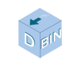 | [***dbin***](apps/dbin.md) | *Poor man's package manager. About 3000 statically linked binaries in the repos!*..[ *read more* ](apps/dbin.md)*!* | [*blob*](https://github.com/ivan-hc/AM/blob/main/programs/x86_64/dbin) **/** [*raw*](https://raw.githubusercontent.com/ivan-hc/AM/main/programs/x86_64/dbin) |
|  | [***dd***](apps/dd.md) | *Convert and copy a file. This is part of "am-utils" suite.*..[ *read more* ](apps/dd.md)*!* | [*blob*](https://github.com/ivan-hc/AM/blob/main/programs/x86_64/dd) **/** [*raw*](https://raw.githubusercontent.com/ivan-hc/AM/main/programs/x86_64/dd) |
|  | [***deeplx***](apps/deeplx.md) | *DeepL Free API, No TOKEN required.*..[ *read more* ](apps/deeplx.md)*!* | [*blob*](https://github.com/ivan-hc/AM/blob/main/programs/x86_64/deeplx) **/** [*raw*](https://raw.githubusercontent.com/ivan-hc/AM/main/programs/x86_64/deeplx) |
| 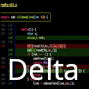 | [***delta***](apps/delta.md) | *A syntax-highlighting pager for git, diff, grep, and blame output.*..[ *read more* ](apps/delta.md)*!* | [*blob*](https://github.com/ivan-hc/AM/blob/main/programs/x86_64/delta) **/** [*raw*](https://raw.githubusercontent.com/ivan-hc/AM/main/programs/x86_64/delta) |
|  | [***devtoys***](apps/devtoys.md) | *A Swiss Army knife for developers.*..[ *read more* ](apps/devtoys.md)*!* | [*blob*](https://github.com/ivan-hc/AM/blob/main/programs/x86_64/devtoys) **/** [*raw*](https://raw.githubusercontent.com/ivan-hc/AM/main/programs/x86_64/devtoys) |
|  | [***df***](apps/df.md) | *Report file system space usage. This is part of "am-utils" suite.*..[ *read more* ](apps/df.md)*!* | [*blob*](https://github.com/ivan-hc/AM/blob/main/programs/x86_64/df) **/** [*raw*](https://raw.githubusercontent.com/ivan-hc/AM/main/programs/x86_64/df) |
|  | [***didder***](apps/didder.md) | *An extensive, fast, and accurate command-line image dithering tool.*..[ *read more* ](apps/didder.md)*!* | [*blob*](https://github.com/ivan-hc/AM/blob/main/programs/x86_64/didder) **/** [*raw*](https://raw.githubusercontent.com/ivan-hc/AM/main/programs/x86_64/didder) |
|  | [***diff***](apps/diff.md) | *Compare files line by line. This is part of "am-utils" suite.*..[ *read more* ](apps/diff.md)*!* | [*blob*](https://github.com/ivan-hc/AM/blob/main/programs/x86_64/diff) **/** [*raw*](https://raw.githubusercontent.com/ivan-hc/AM/main/programs/x86_64/diff) |
|  | [***dir***](apps/dir.md) | *List directory contents. This is part of "am-utils" suite.*..[ *read more* ](apps/dir.md)*!* | [*blob*](https://github.com/ivan-hc/AM/blob/main/programs/x86_64/dir) **/** [*raw*](https://raw.githubusercontent.com/ivan-hc/AM/main/programs/x86_64/dir) |
|  | [***dircolors***](apps/dircolors.md) | *For ls. This is part of "am-utils" suite.*..[ *read more* ](apps/dircolors.md)*!* | [*blob*](https://github.com/ivan-hc/AM/blob/main/programs/x86_64/dircolors) **/** [*raw*](https://raw.githubusercontent.com/ivan-hc/AM/main/programs/x86_64/dircolors) |
|  | [***dirname***](apps/dirname.md) | *Strip last component from file name. This is part of "am-utils" suite.*..[ *read more* ](apps/dirname.md)*!* | [*blob*](https://github.com/ivan-hc/AM/blob/main/programs/x86_64/dirname) **/** [*raw*](https://raw.githubusercontent.com/ivan-hc/AM/main/programs/x86_64/dirname) |
|  | [***diskonaut***](apps/diskonaut.md) | *Terminal disk space navigator.*..[ *read more* ](apps/diskonaut.md)*!* | [*blob*](https://github.com/ivan-hc/AM/blob/main/programs/x86_64/diskonaut) **/** [*raw*](https://raw.githubusercontent.com/ivan-hc/AM/main/programs/x86_64/diskonaut) |
| 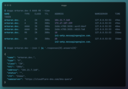 | [***doggo***](apps/doggo.md) | *Command-line DNS Client for Humans. Written in Golang*..[ *read more* ](apps/doggo.md)*!* | [*blob*](https://github.com/ivan-hc/AM/blob/main/programs/x86_64/doggo) **/** [*raw*](https://raw.githubusercontent.com/ivan-hc/AM/main/programs/x86_64/doggo) |
|  | [***dooit***](apps/dooit.md) | *An awesome TUI todo manager.*..[ *read more* ](apps/dooit.md)*!* | [*blob*](https://github.com/ivan-hc/AM/blob/main/programs/x86_64/dooit) **/** [*raw*](https://raw.githubusercontent.com/ivan-hc/AM/main/programs/x86_64/dooit) |
|  | [***dra***](apps/dra.md) | *A command line tool to download release assets from GitHub.*..[ *read more* ](apps/dra.md)*!* | [*blob*](https://github.com/ivan-hc/AM/blob/main/programs/x86_64/dra) **/** [*raw*](https://raw.githubusercontent.com/ivan-hc/AM/main/programs/x86_64/dra) |
| 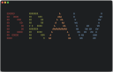 | [***draw***](apps/draw.md) | *Draw in your terminal.*..[ *read more* ](apps/draw.md)*!* | [*blob*](https://github.com/ivan-hc/AM/blob/main/programs/x86_64/draw) **/** [*raw*](https://raw.githubusercontent.com/ivan-hc/AM/main/programs/x86_64/draw) |
|  | [***dstask***](apps/dstask.md) | *Git powered terminal-based todo/note manager, markdown note page per task.*..[ *read more* ](apps/dstask.md)*!* | [*blob*](https://github.com/ivan-hc/AM/blob/main/programs/x86_64/dstask) **/** [*raw*](https://raw.githubusercontent.com/ivan-hc/AM/main/programs/x86_64/dstask) |
| 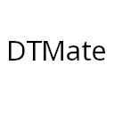 | [***dtmate***](apps/dtmate.md) | *CLI to compute difference between date, time or duration.*..[ *read more* ](apps/dtmate.md)*!* | [*blob*](https://github.com/ivan-hc/AM/blob/main/programs/x86_64/dtmate) **/** [*raw*](https://raw.githubusercontent.com/ivan-hc/AM/main/programs/x86_64/dtmate) |
|  | [***du***](apps/du.md) | *Estimate file space usage. This is part of "am-utils" suite.*..[ *read more* ](apps/du.md)*!* | [*blob*](https://github.com/ivan-hc/AM/blob/main/programs/x86_64/du) **/** [*raw*](https://raw.githubusercontent.com/ivan-hc/AM/main/programs/x86_64/du) |
|  | [***dua***](apps/dua.md) | *View disk space usage and delete unwanted data, fast.*..[ *read more* ](apps/dua.md)*!* | [*blob*](https://github.com/ivan-hc/AM/blob/main/programs/x86_64/dua) **/** [*raw*](https://raw.githubusercontent.com/ivan-hc/AM/main/programs/x86_64/dua) |
|  | [***duf***](apps/duf.md) | *Disk Usage/Free Utility, a better 'df' alternative.*..[ *read more* ](apps/duf.md)*!* | [*blob*](https://github.com/ivan-hc/AM/blob/main/programs/x86_64/duf) **/** [*raw*](https://raw.githubusercontent.com/ivan-hc/AM/main/programs/x86_64/duf) |
| 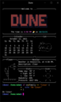 | [***dune***](apps/dune.md) | *A shell by the beach.*..[ *read more* ](apps/dune.md)*!* | [*blob*](https://github.com/ivan-hc/AM/blob/main/programs/x86_64/dune) **/** [*raw*](https://raw.githubusercontent.com/ivan-hc/AM/main/programs/x86_64/dune) |
| 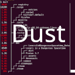 | [***dust***](apps/dust.md) | *A more intuitive version of du in rust.*..[ *read more* ](apps/dust.md)*!* | [*blob*](https://github.com/ivan-hc/AM/blob/main/programs/x86_64/dust) **/** [*raw*](https://raw.githubusercontent.com/ivan-hc/AM/main/programs/x86_64/dust) |
|  | [***dysk***](apps/dysk.md) | *A linux utility to get information on filesystems, like df but better.*..[ *read more* ](apps/dysk.md)*!* | [*blob*](https://github.com/ivan-hc/AM/blob/main/programs/x86_64/dysk) **/** [*raw*](https://raw.githubusercontent.com/ivan-hc/AM/main/programs/x86_64/dysk) |
|  | [***echo***](apps/echo.md) | *Display a line of text. This is part of "am-utils" suite.*..[ *read more* ](apps/echo.md)*!* | [*blob*](https://github.com/ivan-hc/AM/blob/main/programs/x86_64/echo) **/** [*raw*](https://raw.githubusercontent.com/ivan-hc/AM/main/programs/x86_64/echo) |
|  | [***eget***](apps/eget.md) | *Easily install prebuilt binaries from GitHub.*..[ *read more* ](apps/eget.md)*!* | [*blob*](https://github.com/ivan-hc/AM/blob/main/programs/x86_64/eget) **/** [*raw*](https://raw.githubusercontent.com/ivan-hc/AM/main/programs/x86_64/eget) |
|  | [***elfedit***](apps/elfedit.md) | *Header and program property of ELF files. This is part of "am-utils" suite.*..[ *read more* ](apps/elfedit.md)*!* | [*blob*](https://github.com/ivan-hc/AM/blob/main/programs/x86_64/elfedit) **/** [*raw*](https://raw.githubusercontent.com/ivan-hc/AM/main/programs/x86_64/elfedit) |
|  | [***elvish***](apps/elvish.md) | *Powerful modern shell scripting.*..[ *read more* ](apps/elvish.md)*!* | [*blob*](https://github.com/ivan-hc/AM/blob/main/programs/x86_64/elvish) **/** [*raw*](https://raw.githubusercontent.com/ivan-hc/AM/main/programs/x86_64/elvish) |
|  | [***env***](apps/env.md) | *Run a program in a modified environment. This is part of "am-utils" suite.*..[ *read more* ](apps/env.md)*!* | [*blob*](https://github.com/ivan-hc/AM/blob/main/programs/x86_64/env) **/** [*raw*](https://raw.githubusercontent.com/ivan-hc/AM/main/programs/x86_64/env) |
|  | [***expand***](apps/expand.md) | *Convert tabs to spaces. This is part of "am-utils" suite.*..[ *read more* ](apps/expand.md)*!* | [*blob*](https://github.com/ivan-hc/AM/blob/main/programs/x86_64/expand) **/** [*raw*](https://raw.githubusercontent.com/ivan-hc/AM/main/programs/x86_64/expand) |
|  | [***expr***](apps/expr.md) | *Evaluate expressions. This is part of "am-utils" suite.*..[ *read more* ](apps/expr.md)*!* | [*blob*](https://github.com/ivan-hc/AM/blob/main/programs/x86_64/expr) **/** [*raw*](https://raw.githubusercontent.com/ivan-hc/AM/main/programs/x86_64/expr) |
| 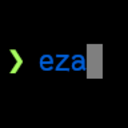 | [***eza***](apps/eza.md) | *A modern, maintained replacement for ls.*..[ *read more* ](apps/eza.md)*!* | [*blob*](https://github.com/ivan-hc/AM/blob/main/programs/x86_64/eza) **/** [*raw*](https://raw.githubusercontent.com/ivan-hc/AM/main/programs/x86_64/eza) |
|  | [***factor***](apps/factor.md) | *A general purpose, dynamically typed, stack-based programming language.. This is part of "am-utils" suite.*..[ *read more* ](apps/factor.md)*!* | [*blob*](https://github.com/ivan-hc/AM/blob/main/programs/x86_64/factor) **/** [*raw*](https://raw.githubusercontent.com/ivan-hc/AM/main/programs/x86_64/factor) |
|  | [***fakedata***](apps/fakedata.md) | *CLI utility for fake data generation.*..[ *read more* ](apps/fakedata.md)*!* | [*blob*](https://github.com/ivan-hc/AM/blob/main/programs/x86_64/fakedata) **/** [*raw*](https://raw.githubusercontent.com/ivan-hc/AM/main/programs/x86_64/fakedata) |
|  | [***false***](apps/false.md) | *Do nothing, unsuccessfully. This is part of "am-utils" suite.*..[ *read more* ](apps/false.md)*!* | [*blob*](https://github.com/ivan-hc/AM/blob/main/programs/x86_64/false) **/** [*raw*](https://raw.githubusercontent.com/ivan-hc/AM/main/programs/x86_64/false) |
|  | [***fastcompmgr***](apps/fastcompmgr.md) | *A fast compositor for X11.*..[ *read more* ](apps/fastcompmgr.md)*!* | [*blob*](https://github.com/ivan-hc/AM/blob/main/programs/x86_64/fastcompmgr) **/** [*raw*](https://raw.githubusercontent.com/ivan-hc/AM/main/programs/x86_64/fastcompmgr) |
| 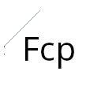 | [***fcp***](apps/fcp.md) | *CLI, a significantly faster alternative to the classic Unix cp(1) command, copying large files and directories in a fraction of the time.*..[ *read more* ](apps/fcp.md)*!* | [*blob*](https://github.com/ivan-hc/AM/blob/main/programs/x86_64/fcp) **/** [*raw*](https://raw.githubusercontent.com/ivan-hc/AM/main/programs/x86_64/fcp) |
|  | [***fd***](apps/fd.md) | *A simple, fast and user-friendly alternative to 'find'.*..[ *read more* ](apps/fd.md)*!* | [*blob*](https://github.com/ivan-hc/AM/blob/main/programs/x86_64/fd) **/** [*raw*](https://raw.githubusercontent.com/ivan-hc/AM/main/programs/x86_64/fd) |
| 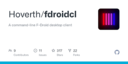 | [***fdroidcl***](apps/fdroidcl.md) | *A command-line F-Droid desktop client.*..[ *read more* ](apps/fdroidcl.md)*!* | [*blob*](https://github.com/ivan-hc/AM/blob/main/programs/x86_64/fdroidcl) **/** [*raw*](https://raw.githubusercontent.com/ivan-hc/AM/main/programs/x86_64/fdroidcl) |
| 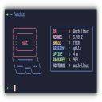 | [***fetchit***](apps/fetchit.md) | *A system fetch tool for Linux, written in Rust.*..[ *read more* ](apps/fetchit.md)*!* | [*blob*](https://github.com/ivan-hc/AM/blob/main/programs/x86_64/fetchit) **/** [*raw*](https://raw.githubusercontent.com/ivan-hc/AM/main/programs/x86_64/fetchit) |
|  | [***ffsend***](apps/ffsend.md) | *Easily and securely share files from the command line. A fully featured Firefox Send client.*..[ *read more* ](apps/ffsend.md)*!* | [*blob*](https://github.com/ivan-hc/AM/blob/main/programs/x86_64/ffsend) **/** [*raw*](https://raw.githubusercontent.com/ivan-hc/AM/main/programs/x86_64/ffsend) |
|  | [***file***](apps/file.md) | *Determine the type of a file from its contents. This is part of "am-utils" suite.*..[ *read more* ](apps/file.md)*!* | [*blob*](https://github.com/ivan-hc/AM/blob/main/programs/x86_64/file) **/** [*raw*](https://raw.githubusercontent.com/ivan-hc/AM/main/programs/x86_64/file) |
|  | [***filen-cli***](apps/filen-cli.md) | *Filen CLI for Windows, macOS and Linux*..[ *read more* ](apps/filen-cli.md)*!* | [*blob*](https://github.com/ivan-hc/AM/blob/main/programs/x86_64/filen-cli) **/** [*raw*](https://raw.githubusercontent.com/ivan-hc/AM/main/programs/x86_64/filen-cli) |
|  | [***find***](apps/find.md) | *Files in a directory hierarchy. This is part of "am-utils" suite.*..[ *read more* ](apps/find.md)*!* | [*blob*](https://github.com/ivan-hc/AM/blob/main/programs/x86_64/find) **/** [*raw*](https://raw.githubusercontent.com/ivan-hc/AM/main/programs/x86_64/find) |
|  | [***fish***](apps/fish.md) | *The user-friendly command line shell.*..[ *read more* ](apps/fish.md)*!* | [*blob*](https://github.com/ivan-hc/AM/blob/main/programs/x86_64/fish) **/** [*raw*](https://raw.githubusercontent.com/ivan-hc/AM/main/programs/x86_64/fish) |
| 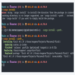 | [***fixit***](apps/fixit.md) | *A utility to fix mistakes in your commands.*..[ *read more* ](apps/fixit.md)*!* | [*blob*](https://github.com/ivan-hc/AM/blob/main/programs/x86_64/fixit) **/** [*raw*](https://raw.githubusercontent.com/ivan-hc/AM/main/programs/x86_64/fixit) |
|  | [***flyctl***](apps/flyctl.md) | *Command line tools for fly.io services.*..[ *read more* ](apps/flyctl.md)*!* | [*blob*](https://github.com/ivan-hc/AM/blob/main/programs/x86_64/flyctl) **/** [*raw*](https://raw.githubusercontent.com/ivan-hc/AM/main/programs/x86_64/flyctl) |
|  | [***fman***](apps/fman.md) | *TUI CLI File Manager.*..[ *read more* ](apps/fman.md)*!* | [*blob*](https://github.com/ivan-hc/AM/blob/main/programs/x86_64/fman) **/** [*raw*](https://raw.githubusercontent.com/ivan-hc/AM/main/programs/x86_64/fman) |
|  | [***fmt***](apps/fmt.md) | *Text formatter. This is part of "am-utils" suite.*..[ *read more* ](apps/fmt.md)*!* | [*blob*](https://github.com/ivan-hc/AM/blob/main/programs/x86_64/fmt) **/** [*raw*](https://raw.githubusercontent.com/ivan-hc/AM/main/programs/x86_64/fmt) |
|  | [***focus***](apps/focus.md) | *A fully featured productivity timer for the command line, based on the Pomodoro Technique.*..[ *read more* ](apps/focus.md)*!* | [*blob*](https://github.com/ivan-hc/AM/blob/main/programs/x86_64/focus) **/** [*raw*](https://raw.githubusercontent.com/ivan-hc/AM/main/programs/x86_64/focus) |
|  | [***fold***](apps/fold.md) | *Wrap each input line to fit in specified width. This is part of "am-utils" suite.*..[ *read more* ](apps/fold.md)*!* | [*blob*](https://github.com/ivan-hc/AM/blob/main/programs/x86_64/fold) **/** [*raw*](https://raw.githubusercontent.com/ivan-hc/AM/main/programs/x86_64/fold) |
|  | [***freefilesync***](apps/freefilesync.md) | *folder comparison and synchronization software.*..[ *read more* ](apps/freefilesync.md)*!* | [*blob*](https://github.com/ivan-hc/AM/blob/main/programs/x86_64/freefilesync) **/** [*raw*](https://raw.githubusercontent.com/ivan-hc/AM/main/programs/x86_64/freefilesync) |
|  | [***freeze***](apps/freeze.md) | *Generate images of code and terminal output.*..[ *read more* ](apps/freeze.md)*!* | [*blob*](https://github.com/ivan-hc/AM/blob/main/programs/x86_64/freeze) **/** [*raw*](https://raw.githubusercontent.com/ivan-hc/AM/main/programs/x86_64/freeze) |
| 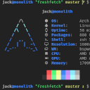 | [***freshfetch***](apps/freshfetch.md) | *An alternative to Neofetch in Rust with a focus on customization.*..[ *read more* ](apps/freshfetch.md)*!* | [*blob*](https://github.com/ivan-hc/AM/blob/main/programs/x86_64/freshfetch) **/** [*raw*](https://raw.githubusercontent.com/ivan-hc/AM/main/programs/x86_64/freshfetch) |
|  | [***fx***](apps/fx.md) | *Terminal JSON viewer & processor.*..[ *read more* ](apps/fx.md)*!* | [*blob*](https://github.com/ivan-hc/AM/blob/main/programs/x86_64/fx) **/** [*raw*](https://raw.githubusercontent.com/ivan-hc/AM/main/programs/x86_64/fx) |
|  | [***fzf***](apps/fzf.md) | *A command-line fuzzy finder.*..[ *read more* ](apps/fzf.md)*!* | [*blob*](https://github.com/ivan-hc/AM/blob/main/programs/x86_64/fzf) **/** [*raw*](https://raw.githubusercontent.com/ivan-hc/AM/main/programs/x86_64/fzf) |
|  | [***gallery-dl***](apps/gallery-dl.md) | *Command-line program to download image galleries and collections.*..[ *read more* ](apps/gallery-dl.md)*!* | [*blob*](https://github.com/ivan-hc/AM/blob/main/programs/x86_64/gallery-dl) **/** [*raw*](https://raw.githubusercontent.com/ivan-hc/AM/main/programs/x86_64/gallery-dl) |
|  | [***gawk***](apps/gawk.md) | *GNU version of awk. This is part of "am-utils" suite.*..[ *read more* ](apps/gawk.md)*!* | [*blob*](https://github.com/ivan-hc/AM/blob/main/programs/x86_64/gawk) **/** [*raw*](https://raw.githubusercontent.com/ivan-hc/AM/main/programs/x86_64/gawk) |
|  | [***gemget***](apps/gemget.md) | *Command line downloader for the Gemini protocol.*..[ *read more* ](apps/gemget.md)*!* | [*blob*](https://github.com/ivan-hc/AM/blob/main/programs/x86_64/gemget) **/** [*raw*](https://raw.githubusercontent.com/ivan-hc/AM/main/programs/x86_64/gemget) |
|  | [***genact***](apps/genact.md) | *A nonsense activity generator.*..[ *read more* ](apps/genact.md)*!* | [*blob*](https://github.com/ivan-hc/AM/blob/main/programs/x86_64/genact) **/** [*raw*](https://raw.githubusercontent.com/ivan-hc/AM/main/programs/x86_64/genact) |
| 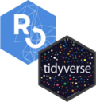 | [***gert***](apps/gert.md) | *A command line tool to download media from Reddit.*..[ *read more* ](apps/gert.md)*!* | [*blob*](https://github.com/ivan-hc/AM/blob/main/programs/x86_64/gert) **/** [*raw*](https://raw.githubusercontent.com/ivan-hc/AM/main/programs/x86_64/gert) |
|  | [***gh***](apps/gh.md) | *GitHub’s official command line tool.*..[ *read more* ](apps/gh.md)*!* | [*blob*](https://github.com/ivan-hc/AM/blob/main/programs/x86_64/gh) **/** [*raw*](https://raw.githubusercontent.com/ivan-hc/AM/main/programs/x86_64/gh) |
|  | [***gh-eco***](apps/gh-eco.md) | *gh cli extension to explore the ecosystem.*..[ *read more* ](apps/gh-eco.md)*!* | [*blob*](https://github.com/ivan-hc/AM/blob/main/programs/x86_64/gh-eco) **/** [*raw*](https://raw.githubusercontent.com/ivan-hc/AM/main/programs/x86_64/gh-eco) |
|  | [***ghdl***](apps/ghdl.md) | *A much more convenient way to download GitHub release binaries on the command line.*..[ *read more* ](apps/ghdl.md)*!* | [*blob*](https://github.com/ivan-hc/AM/blob/main/programs/x86_64/ghdl) **/** [*raw*](https://raw.githubusercontent.com/ivan-hc/AM/main/programs/x86_64/ghdl) |
|  | [***ghrel***](apps/ghrel.md) | *Download and verify GitHub release.*..[ *read more* ](apps/ghrel.md)*!* | [*blob*](https://github.com/ivan-hc/AM/blob/main/programs/x86_64/ghrel) **/** [*raw*](https://raw.githubusercontent.com/ivan-hc/AM/main/programs/x86_64/ghrel) |
|  | [***gickup***](apps/gickup.md) | *Backup your Git repositories with ease.*..[ *read more* ](apps/gickup.md)*!* | [*blob*](https://github.com/ivan-hc/AM/blob/main/programs/x86_64/gickup) **/** [*raw*](https://raw.githubusercontent.com/ivan-hc/AM/main/programs/x86_64/gickup) |
|  | [***git-cliff***](apps/git-cliff.md) | *A highly customizable Changelog Generator that follows Conventional Commit specifications.*..[ *read more* ](apps/git-cliff.md)*!* | [*blob*](https://github.com/ivan-hc/AM/blob/main/programs/x86_64/git-cliff) **/** [*raw*](https://raw.githubusercontent.com/ivan-hc/AM/main/programs/x86_64/git-cliff) |
|  | [***git-credential-oauth***](apps/git-credential-oauth.md) | *A Git credential helper that securely authenticates to GitHub, GitLab and BitBucket using OAuth.*..[ *read more* ](apps/git-credential-oauth.md)*!* | [*blob*](https://github.com/ivan-hc/AM/blob/main/programs/x86_64/git-credential-oauth) **/** [*raw*](https://raw.githubusercontent.com/ivan-hc/AM/main/programs/x86_64/git-credential-oauth) |
|  | [***git-side***](apps/git-side.md) | *A Git subcommand that versions files and directories that should not live in the main repository, using a per-project bare repository invisible to Git.*..[ *read more* ](apps/git-side.md)*!* | [*blob*](https://github.com/ivan-hc/AM/blob/main/programs/x86_64/git-side) **/** [*raw*](https://raw.githubusercontent.com/ivan-hc/AM/main/programs/x86_64/git-side) |
| 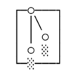 | [***gitleaks***](apps/gitleaks.md) | *Protect and discover secrets using Gitleaks.*..[ *read more* ](apps/gitleaks.md)*!* | [*blob*](https://github.com/ivan-hc/AM/blob/main/programs/x86_64/gitleaks) **/** [*raw*](https://raw.githubusercontent.com/ivan-hc/AM/main/programs/x86_64/gitleaks) |
|  | [***gitql***](apps/gitql.md) | *A git query language.*..[ *read more* ](apps/gitql.md)*!* | [*blob*](https://github.com/ivan-hc/AM/blob/main/programs/x86_64/gitql) **/** [*raw*](https://raw.githubusercontent.com/ivan-hc/AM/main/programs/x86_64/gitql) |
|  | [***gitui***](apps/gitui.md) | *Blazing fast terminal-ui for git written in rust.*..[ *read more* ](apps/gitui.md)*!* | [*blob*](https://github.com/ivan-hc/AM/blob/main/programs/x86_64/gitui) **/** [*raw*](https://raw.githubusercontent.com/ivan-hc/AM/main/programs/x86_64/gitui) |
|  | [***glab***](apps/glab.md) | *A GitLab CLI tool bringing GitLab to your command line.*..[ *read more* ](apps/glab.md)*!* | [*blob*](https://github.com/ivan-hc/AM/blob/main/programs/x86_64/glab) **/** [*raw*](https://raw.githubusercontent.com/ivan-hc/AM/main/programs/x86_64/glab) |
|  | [***glow***](apps/glow.md) | *Render markdown on the CLI, with pizzazz!*..[ *read more* ](apps/glow.md)*!* | [*blob*](https://github.com/ivan-hc/AM/blob/main/programs/x86_64/glow) **/** [*raw*](https://raw.githubusercontent.com/ivan-hc/AM/main/programs/x86_64/glow) |
|  | [***gncdu***](apps/gncdu.md) | *Implements NCurses Disk Usage(ncdu) with golang.*..[ *read more* ](apps/gncdu.md)*!* | [*blob*](https://github.com/ivan-hc/AM/blob/main/programs/x86_64/gncdu) **/** [*raw*](https://raw.githubusercontent.com/ivan-hc/AM/main/programs/x86_64/gncdu) |
|  | [***go-pd***](apps/go-pd.md) | *A free easy to use pixeldrain.com go client pkg and CLI upload tool.*..[ *read more* ](apps/go-pd.md)*!* | [*blob*](https://github.com/ivan-hc/AM/blob/main/programs/x86_64/go-pd) **/** [*raw*](https://raw.githubusercontent.com/ivan-hc/AM/main/programs/x86_64/go-pd) |
|  | [***go-spotify-cli***](apps/go-spotify-cli.md) | *Control Spotify with CLI commands.*..[ *read more* ](apps/go-spotify-cli.md)*!* | [*blob*](https://github.com/ivan-hc/AM/blob/main/programs/x86_64/go-spotify-cli) **/** [*raw*](https://raw.githubusercontent.com/ivan-hc/AM/main/programs/x86_64/go-spotify-cli) |
|  | [***goanime***](apps/goanime.md) | *A TUI tool to browse, stream, and download anime in English and Portuguese.*..[ *read more* ](apps/goanime.md)*!* | [*blob*](https://github.com/ivan-hc/AM/blob/main/programs/x86_64/goanime) **/** [*raw*](https://raw.githubusercontent.com/ivan-hc/AM/main/programs/x86_64/goanime) |
|  | [***gobuster***](apps/gobuster.md) | *A high-performance directory/file, DNS and virtual host brute-forcing tool written in Go. It's designed to be fast, reliable, and easy to use for security professionals and penetration testers.*..[ *read more* ](apps/gobuster.md)*!* | [*blob*](https://github.com/ivan-hc/AM/blob/main/programs/x86_64/gobuster) **/** [*raw*](https://raw.githubusercontent.com/ivan-hc/AM/main/programs/x86_64/gobuster) |
|  | [***gojq***](apps/gojq.md) | *Pure Go implementation of jq.*..[ *read more* ](apps/gojq.md)*!* | [*blob*](https://github.com/ivan-hc/AM/blob/main/programs/x86_64/gojq) **/** [*raw*](https://raw.githubusercontent.com/ivan-hc/AM/main/programs/x86_64/gojq) |
|  | [***gokey***](apps/gokey.md) | *A simple vaultless password manager in Go.*..[ *read more* ](apps/gokey.md)*!* | [*blob*](https://github.com/ivan-hc/AM/blob/main/programs/x86_64/gokey) **/** [*raw*](https://raw.githubusercontent.com/ivan-hc/AM/main/programs/x86_64/gokey) |
| 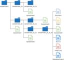 | [***goodls***](apps/goodls.md) | *This is a CLI tool to download shared files and folders from Google Drive.*..[ *read more* ](apps/goodls.md)*!* | [*blob*](https://github.com/ivan-hc/AM/blob/main/programs/x86_64/goodls) **/** [*raw*](https://raw.githubusercontent.com/ivan-hc/AM/main/programs/x86_64/goodls) |
| 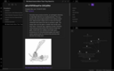 | [***gooseberry***](apps/gooseberry.md) | *A command line utility to generate a knowledge base from Hypothesis annotations.*..[ *read more* ](apps/gooseberry.md)*!* | [*blob*](https://github.com/ivan-hc/AM/blob/main/programs/x86_64/gooseberry) **/** [*raw*](https://raw.githubusercontent.com/ivan-hc/AM/main/programs/x86_64/gooseberry) |
|  | [***gopass***](apps/gopass.md) | *The slightly more awesome standard unix password manager for teams.*..[ *read more* ](apps/gopass.md)*!* | [*blob*](https://github.com/ivan-hc/AM/blob/main/programs/x86_64/gopass) **/** [*raw*](https://raw.githubusercontent.com/ivan-hc/AM/main/programs/x86_64/gopass) |
|  | [***gost-shred***](apps/gost-shred.md) | *GOST R 50739-95 Data Sanitization Method (2 passes).*..[ *read more* ](apps/gost-shred.md)*!* | [*blob*](https://github.com/ivan-hc/AM/blob/main/programs/x86_64/gost-shred) **/** [*raw*](https://raw.githubusercontent.com/ivan-hc/AM/main/programs/x86_64/gost-shred) |
|  | [***got***](apps/got.md) | *Simple golang package and CLI tool to download large files faster than cURL and Wget!*..[ *read more* ](apps/got.md)*!* | [*blob*](https://github.com/ivan-hc/AM/blob/main/programs/x86_64/got) **/** [*raw*](https://raw.githubusercontent.com/ivan-hc/AM/main/programs/x86_64/got) |
| 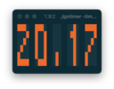 | [***gotimer***](apps/gotimer.md) | *A simple terminal based digital timer for Pomodoro.*..[ *read more* ](apps/gotimer.md)*!* | [*blob*](https://github.com/ivan-hc/AM/blob/main/programs/x86_64/gotimer) **/** [*raw*](https://raw.githubusercontent.com/ivan-hc/AM/main/programs/x86_64/gotimer) |
|  | [***goto***](apps/goto.md) | *A simple terminal SSH manager that lists favorite SSH servers.*..[ *read more* ](apps/goto.md)*!* | [*blob*](https://github.com/ivan-hc/AM/blob/main/programs/x86_64/goto) **/** [*raw*](https://raw.githubusercontent.com/ivan-hc/AM/main/programs/x86_64/goto) |
|  | [***gp-archive***](apps/gp-archive.md) | *Archive profiling experiment data. This is part of "am-utils" suite.*..[ *read more* ](apps/gp-archive.md)*!* | [*blob*](https://github.com/ivan-hc/AM/blob/main/programs/x86_64/gp-archive) **/** [*raw*](https://raw.githubusercontent.com/ivan-hc/AM/main/programs/x86_64/gp-archive) |
|  | [***gp-collect-app***](apps/gp-collect-app.md) | *Collect application performance profiling data. This is part of "am-utils" suite.*..[ *read more* ](apps/gp-collect-app.md)*!* | [*blob*](https://github.com/ivan-hc/AM/blob/main/programs/x86_64/gp-collect-app) **/** [*raw*](https://raw.githubusercontent.com/ivan-hc/AM/main/programs/x86_64/gp-collect-app) |
|  | [***gp-display-html***](apps/gp-display-html.md) | *Generate HTML reports from profiling data. This is part of "am-utils" suite.*..[ *read more* ](apps/gp-display-html.md)*!* | [*blob*](https://github.com/ivan-hc/AM/blob/main/programs/x86_64/gp-display-html) **/** [*raw*](https://raw.githubusercontent.com/ivan-hc/AM/main/programs/x86_64/gp-display-html) |
|  | [***gp-display-src***](apps/gp-display-src.md) | *Display source code annotated with profiling data. This is part of "am-utils" suite.*..[ *read more* ](apps/gp-display-src.md)*!* | [*blob*](https://github.com/ivan-hc/AM/blob/main/programs/x86_64/gp-display-src) **/** [*raw*](https://raw.githubusercontent.com/ivan-hc/AM/main/programs/x86_64/gp-display-src) |
|  | [***gp-display-text***](apps/gp-display-text.md) | *Display profiling data in plain text format. This is part of "am-utils" suite.*..[ *read more* ](apps/gp-display-text.md)*!* | [*blob*](https://github.com/ivan-hc/AM/blob/main/programs/x86_64/gp-display-text) **/** [*raw*](https://raw.githubusercontent.com/ivan-hc/AM/main/programs/x86_64/gp-display-text) |
|  | [***gpg-tui***](apps/gpg-tui.md) | *CLI, manage your GnuPG keys with ease!*..[ *read more* ](apps/gpg-tui.md)*!* | [*blob*](https://github.com/ivan-hc/AM/blob/main/programs/x86_64/gpg-tui) **/** [*raw*](https://raw.githubusercontent.com/ivan-hc/AM/main/programs/x86_64/gpg-tui) |
| 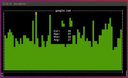 | [***gping***](apps/gping.md) | *Ping, but with a graph.*..[ *read more* ](apps/gping.md)*!* | [*blob*](https://github.com/ivan-hc/AM/blob/main/programs/x86_64/gping) **/** [*raw*](https://raw.githubusercontent.com/ivan-hc/AM/main/programs/x86_64/gping) |
|  | [***gprof***](apps/gprof.md) | *Graph profile data. This is part of "am-utils" suite.*..[ *read more* ](apps/gprof.md)*!* | [*blob*](https://github.com/ivan-hc/AM/blob/main/programs/x86_64/gprof) **/** [*raw*](https://raw.githubusercontent.com/ivan-hc/AM/main/programs/x86_64/gprof) |
|  | [***gprofng***](apps/gprofng.md) | *Generation GNU application profiling tool. This is part of "am-utils" suite.*..[ *read more* ](apps/gprofng.md)*!* | [*blob*](https://github.com/ivan-hc/AM/blob/main/programs/x86_64/gprofng) **/** [*raw*](https://raw.githubusercontent.com/ivan-hc/AM/main/programs/x86_64/gprofng) |
|  | [***gprofng-archive***](apps/gprofng-archive.md) | *Experiment data. This is part of "am-utils" suite.*..[ *read more* ](apps/gprofng-archive.md)*!* | [*blob*](https://github.com/ivan-hc/AM/blob/main/programs/x86_64/gprofng-archive) **/** [*raw*](https://raw.githubusercontent.com/ivan-hc/AM/main/programs/x86_64/gprofng-archive) |
|  | [***gprofng-collect-app***](apps/gprofng-collect-app.md) | *Data for the target. This is part of "am-utils" suite.*..[ *read more* ](apps/gprofng-collect-app.md)*!* | [*blob*](https://github.com/ivan-hc/AM/blob/main/programs/x86_64/gprofng-collect-app) **/** [*raw*](https://raw.githubusercontent.com/ivan-hc/AM/main/programs/x86_64/gprofng-collect-app) |
|  | [***gprofng-display-html***](apps/gprofng-display-html.md) | *HTML based directory structure. This is part of "am-utils" suite.*..[ *read more* ](apps/gprofng-display-html.md)*!* | [*blob*](https://github.com/ivan-hc/AM/blob/main/programs/x86_64/gprofng-display-html) **/** [*raw*](https://raw.githubusercontent.com/ivan-hc/AM/main/programs/x86_64/gprofng-display-html) |
|  | [***gprofng-display-src***](apps/gprofng-display-src.md) | *Code and optionally. This is part of "am-utils" suite.*..[ *read more* ](apps/gprofng-display-src.md)*!* | [*blob*](https://github.com/ivan-hc/AM/blob/main/programs/x86_64/gprofng-display-src) **/** [*raw*](https://raw.githubusercontent.com/ivan-hc/AM/main/programs/x86_64/gprofng-display-src) |
|  | [***gprofng-display-text***](apps/gprofng-display-text.md) | *Performance data in plain text. This is part of "am-utils" suite.*..[ *read more* ](apps/gprofng-display-text.md)*!* | [*blob*](https://github.com/ivan-hc/AM/blob/main/programs/x86_64/gprofng-display-text) **/** [*raw*](https://raw.githubusercontent.com/ivan-hc/AM/main/programs/x86_64/gprofng-display-text) |
|  | [***gprofng-gmon***](apps/gprofng-gmon.md) | *Display or convert GNU gmon profiling data. This is part of "am-utils" suite.*..[ *read more* ](apps/gprofng-gmon.md)*!* | [*blob*](https://github.com/ivan-hc/AM/blob/main/programs/x86_64/gprofng-gmon) **/** [*raw*](https://raw.githubusercontent.com/ivan-hc/AM/main/programs/x86_64/gprofng-gmon) |
|  | [***grep***](apps/grep.md) | *A string search utility. This is part of "am-utils" suite.*..[ *read more* ](apps/grep.md)*!* | [*blob*](https://github.com/ivan-hc/AM/blob/main/programs/x86_64/grep) **/** [*raw*](https://raw.githubusercontent.com/ivan-hc/AM/main/programs/x86_64/grep) |
|  | [***gron***](apps/gron.md) | *Make JSON greppable! Transform JSON into discrete assignments to grep.*..[ *read more* ](apps/gron.md)*!* | [*blob*](https://github.com/ivan-hc/AM/blob/main/programs/x86_64/gron) **/** [*raw*](https://raw.githubusercontent.com/ivan-hc/AM/main/programs/x86_64/gron) |
|  | [***gron.awk***](apps/gron.awk.md) | *True JSON parser in pure Awk. fast with Gawk/Mawk/GoAWK.*..[ *read more* ](apps/gron.awk.md)*!* | [*blob*](https://github.com/ivan-hc/AM/blob/main/programs/x86_64/gron.awk) **/** [*raw*](https://raw.githubusercontent.com/ivan-hc/AM/main/programs/x86_64/gron.awk) |
|  | [***groups***](apps/groups.md) | *Print the groups a user is in. This is part of "am-utils" suite.*..[ *read more* ](apps/groups.md)*!* | [*blob*](https://github.com/ivan-hc/AM/blob/main/programs/x86_64/groups) **/** [*raw*](https://raw.githubusercontent.com/ivan-hc/AM/main/programs/x86_64/groups) |
|  | [***gum***](apps/gum.md) | *A tool for glamorous shell scripts.*..[ *read more* ](apps/gum.md)*!* | [*blob*](https://github.com/ivan-hc/AM/blob/main/programs/x86_64/gum) **/** [*raw*](https://raw.githubusercontent.com/ivan-hc/AM/main/programs/x86_64/gum) |
| 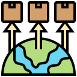 | [***handlr***](apps/handlr.md) | *fork of the original handlr, with support for regular expressions.*..[ *read more* ](apps/handlr.md)*!* | [*blob*](https://github.com/ivan-hc/AM/blob/main/programs/x86_64/handlr) **/** [*raw*](https://raw.githubusercontent.com/ivan-hc/AM/main/programs/x86_64/handlr) |
| 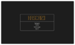 | [***hascard***](apps/hascard.md) | *Flashcard TUI CLI with markdown cards.*..[ *read more* ](apps/hascard.md)*!* | [*blob*](https://github.com/ivan-hc/AM/blob/main/programs/x86_64/hascard) **/** [*raw*](https://raw.githubusercontent.com/ivan-hc/AM/main/programs/x86_64/hascard) |
| 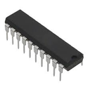 | [***hctl***](apps/hctl.md) | *A tool to control your Home Assistant devices from the command-line.*..[ *read more* ](apps/hctl.md)*!* | [*blob*](https://github.com/ivan-hc/AM/blob/main/programs/x86_64/hctl) **/** [*raw*](https://raw.githubusercontent.com/ivan-hc/AM/main/programs/x86_64/hctl) |
|  | [***hd***](apps/hd.md) | *Small hex dumper utility (with optional HexII output). This is part of "am-utils" suite.*..[ *read more* ](apps/hd.md)*!* | [*blob*](https://github.com/ivan-hc/AM/blob/main/programs/x86_64/hd) **/** [*raw*](https://raw.githubusercontent.com/ivan-hc/AM/main/programs/x86_64/hd) |
|  | [***head***](apps/head.md) | *Output the first part of files. This is part of "am-utils" suite.*..[ *read more* ](apps/head.md)*!* | [*blob*](https://github.com/ivan-hc/AM/blob/main/programs/x86_64/head) **/** [*raw*](https://raw.githubusercontent.com/ivan-hc/AM/main/programs/x86_64/head) |
|  | [***hexdump***](apps/hexdump.md) | *Display file contents in hexadecimal format. This is part of "am-utils" suite.*..[ *read more* ](apps/hexdump.md)*!* | [*blob*](https://github.com/ivan-hc/AM/blob/main/programs/x86_64/hexdump) **/** [*raw*](https://raw.githubusercontent.com/ivan-hc/AM/main/programs/x86_64/hexdump) |
|  | [***hide.me***](apps/hide.me.md) | *Hide.me CLI VPN client for Linux.*..[ *read more* ](apps/hide.me.md)*!* | [*blob*](https://github.com/ivan-hc/AM/blob/main/programs/x86_64/hide.me) **/** [*raw*](https://raw.githubusercontent.com/ivan-hc/AM/main/programs/x86_64/hide.me) |
|  | [***hilbish***](apps/hilbish.md) | *The Moon-powered shell! A comfy and extensible shell for Lua fans!*..[ *read more* ](apps/hilbish.md)*!* | [*blob*](https://github.com/ivan-hc/AM/blob/main/programs/x86_64/hilbish) **/** [*raw*](https://raw.githubusercontent.com/ivan-hc/AM/main/programs/x86_64/hilbish) |
|  | [***hostid***](apps/hostid.md) | *Print the numeric identifier for the current host. This is part of "am-utils" suite.*..[ *read more* ](apps/hostid.md)*!* | [*blob*](https://github.com/ivan-hc/AM/blob/main/programs/x86_64/hostid) **/** [*raw*](https://raw.githubusercontent.com/ivan-hc/AM/main/programs/x86_64/hostid) |
|  | [***humanlog***](apps/humanlog.md) | *Logs for humans to read.*..[ *read more* ](apps/humanlog.md)*!* | [*blob*](https://github.com/ivan-hc/AM/blob/main/programs/x86_64/humanlog) **/** [*raw*](https://raw.githubusercontent.com/ivan-hc/AM/main/programs/x86_64/humanlog) |
|  | [***hyperfine***](apps/hyperfine.md) | *A command-line benchmarking tool.*..[ *read more* ](apps/hyperfine.md)*!* | [*blob*](https://github.com/ivan-hc/AM/blob/main/programs/x86_64/hyperfine) **/** [*raw*](https://raw.githubusercontent.com/ivan-hc/AM/main/programs/x86_64/hyperfine) |
|  | [***i3-auto-layout***](apps/i3-auto-layout.md) | *Automatic, optimal tiling for i3wm. Fork of dead version.*..[ *read more* ](apps/i3-auto-layout.md)*!* | [*blob*](https://github.com/ivan-hc/AM/blob/main/programs/x86_64/i3-auto-layout) **/** [*raw*](https://raw.githubusercontent.com/ivan-hc/AM/main/programs/x86_64/i3-auto-layout) |
|  | [***i3lock-color***](apps/i3lock-color.md) | *The world's most popular non-default computer lockscreen.*..[ *read more* ](apps/i3lock-color.md)*!* | [*blob*](https://github.com/ivan-hc/AM/blob/main/programs/x86_64/i3lock-color) **/** [*raw*](https://raw.githubusercontent.com/ivan-hc/AM/main/programs/x86_64/i3lock-color) |
|  | [***id***](apps/id.md) | *Print real and effective user and group IDs. This is part of "am-utils" suite.*..[ *read more* ](apps/id.md)*!* | [*blob*](https://github.com/ivan-hc/AM/blob/main/programs/x86_64/id) **/** [*raw*](https://raw.githubusercontent.com/ivan-hc/AM/main/programs/x86_64/id) |
| 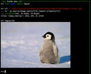 | [***imgcat***](apps/imgcat.md) | *Display images and gifs in your terminal.*..[ *read more* ](apps/imgcat.md)*!* | [*blob*](https://github.com/ivan-hc/AM/blob/main/programs/x86_64/imgcat) **/** [*raw*](https://raw.githubusercontent.com/ivan-hc/AM/main/programs/x86_64/imgcat) |
|  | [***install***](apps/install.md) | *Copy files and set attributes. This is part of "am-utils" suite.*..[ *read more* ](apps/install.md)*!* | [*blob*](https://github.com/ivan-hc/AM/blob/main/programs/x86_64/install) **/** [*raw*](https://raw.githubusercontent.com/ivan-hc/AM/main/programs/x86_64/install) |
|  | [***inxi***](apps/inxi.md) | *A full featured CLI system information tool.*..[ *read more* ](apps/inxi.md)*!* | [*blob*](https://github.com/ivan-hc/AM/blob/main/programs/x86_64/inxi) **/** [*raw*](https://raw.githubusercontent.com/ivan-hc/AM/main/programs/x86_64/inxi) |
|  | [***jless***](apps/jless.md) | *CLI JSON viewer designed for reading, exploring, and searching.*..[ *read more* ](apps/jless.md)*!* | [*blob*](https://github.com/ivan-hc/AM/blob/main/programs/x86_64/jless) **/** [*raw*](https://raw.githubusercontent.com/ivan-hc/AM/main/programs/x86_64/jless) |
|  | [***jnv***](apps/jnv.md) | *Interactive JSON filter using jq.*..[ *read more* ](apps/jnv.md)*!* | [*blob*](https://github.com/ivan-hc/AM/blob/main/programs/x86_64/jnv) **/** [*raw*](https://raw.githubusercontent.com/ivan-hc/AM/main/programs/x86_64/jnv) |
|  | [***join***](apps/join.md) | *Of two files on a common field. This is part of "am-utils" suite.*..[ *read more* ](apps/join.md)*!* | [*blob*](https://github.com/ivan-hc/AM/blob/main/programs/x86_64/join) **/** [*raw*](https://raw.githubusercontent.com/ivan-hc/AM/main/programs/x86_64/join) |
|  | [***jottem***](apps/jottem.md) | *A lean, low friction terminal app for managing markdown notes.*..[ *read more* ](apps/jottem.md)*!* | [*blob*](https://github.com/ivan-hc/AM/blob/main/programs/x86_64/jottem) **/** [*raw*](https://raw.githubusercontent.com/ivan-hc/AM/main/programs/x86_64/jottem) |
| 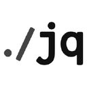 | [***jq***](apps/jq.md) | *Command-line JSON processor.*..[ *read more* ](apps/jq.md)*!* | [*blob*](https://github.com/ivan-hc/AM/blob/main/programs/x86_64/jq) **/** [*raw*](https://raw.githubusercontent.com/ivan-hc/AM/main/programs/x86_64/jq) |
|  | [***jqp***](apps/jqp.md) | *A TUI playground to experiment with jq.*..[ *read more* ](apps/jqp.md)*!* | [*blob*](https://github.com/ivan-hc/AM/blob/main/programs/x86_64/jqp) **/** [*raw*](https://raw.githubusercontent.com/ivan-hc/AM/main/programs/x86_64/jqp) |
|  | [***junest***](apps/junest.md) | *Arch Linux based distro that runs rootless on any other Linux distro.*..[ *read more* ](apps/junest.md)*!* | [*blob*](https://github.com/ivan-hc/AM/blob/main/programs/x86_64/junest) **/** [*raw*](https://raw.githubusercontent.com/ivan-hc/AM/main/programs/x86_64/junest) |
| 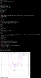 | [***kalc***](apps/kalc.md) | *Complex numbers, 2d/3d graphing, arbitrary precision cli calculator.*..[ *read more* ](apps/kalc.md)*!* | [*blob*](https://github.com/ivan-hc/AM/blob/main/programs/x86_64/kalc) **/** [*raw*](https://raw.githubusercontent.com/ivan-hc/AM/main/programs/x86_64/kalc) |
|  | [***kalker***](apps/kalker.md) | *Scientific calculator with math syntax for user-defined variables.*..[ *read more* ](apps/kalker.md)*!* | [*blob*](https://github.com/ivan-hc/AM/blob/main/programs/x86_64/kalker) **/** [*raw*](https://raw.githubusercontent.com/ivan-hc/AM/main/programs/x86_64/kalker) |
|  | [***kboard***](apps/kboard.md) | *Terminal game to practice keyboard typing.*..[ *read more* ](apps/kboard.md)*!* | [*blob*](https://github.com/ivan-hc/AM/blob/main/programs/x86_64/kboard) **/** [*raw*](https://raw.githubusercontent.com/ivan-hc/AM/main/programs/x86_64/kboard) |
|  | [***kibi***](apps/kibi.md) | *A text editor in ≤1024 lines of code, written in Rust.*..[ *read more* ](apps/kibi.md)*!* | [*blob*](https://github.com/ivan-hc/AM/blob/main/programs/x86_64/kibi) **/** [*raw*](https://raw.githubusercontent.com/ivan-hc/AM/main/programs/x86_64/kibi) |
|  | [***kill***](apps/kill.md) | *Terminate a process. This is part of "am-utils" suite.*..[ *read more* ](apps/kill.md)*!* | [*blob*](https://github.com/ivan-hc/AM/blob/main/programs/x86_64/kill) **/** [*raw*](https://raw.githubusercontent.com/ivan-hc/AM/main/programs/x86_64/kill) |
|  | [***killall***](apps/killall.md) | *Kill processes by name. This is part of "am-utils" suite.*..[ *read more* ](apps/killall.md)*!* | [*blob*](https://github.com/ivan-hc/AM/blob/main/programs/x86_64/killall) **/** [*raw*](https://raw.githubusercontent.com/ivan-hc/AM/main/programs/x86_64/killall) |
|  | [***kindling-cli***](apps/kindling-cli.md) | *Kindle toolkit for dictionaries, books, comics.*..[ *read more* ](apps/kindling-cli.md)*!* | [*blob*](https://github.com/ivan-hc/AM/blob/main/programs/x86_64/kindling-cli) **/** [*raw*](https://raw.githubusercontent.com/ivan-hc/AM/main/programs/x86_64/kindling-cli) |
|  | [***kmon***](apps/kmon.md) | *Linux Kernel Manager and Activity Monitor.*..[ *read more* ](apps/kmon.md)*!* | [*blob*](https://github.com/ivan-hc/AM/blob/main/programs/x86_64/kmon) **/** [*raw*](https://raw.githubusercontent.com/ivan-hc/AM/main/programs/x86_64/kmon) |
|  | [***kmonad***](apps/kmonad.md) | *An advanced keyboard manager.*..[ *read more* ](apps/kmonad.md)*!* | [*blob*](https://github.com/ivan-hc/AM/blob/main/programs/x86_64/kmonad) **/** [*raw*](https://raw.githubusercontent.com/ivan-hc/AM/main/programs/x86_64/kmonad) |
|  | [***koboldcpp***](apps/koboldcpp.md) | *Simple 1-file way to run GGML and GGUF models with KoboldAI's UI.*..[ *read more* ](apps/koboldcpp.md)*!* | [*blob*](https://github.com/ivan-hc/AM/blob/main/programs/x86_64/koboldcpp) **/** [*raw*](https://raw.githubusercontent.com/ivan-hc/AM/main/programs/x86_64/koboldcpp) |
| 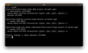 | [***kondo***](apps/kondo.md) | *Cleans dependencies and build artifacts from your projects.*..[ *read more* ](apps/kondo.md)*!* | [*blob*](https://github.com/ivan-hc/AM/blob/main/programs/x86_64/kondo) **/** [*raw*](https://raw.githubusercontent.com/ivan-hc/AM/main/programs/x86_64/kondo) |
|  | [***kure***](apps/kure.md) | *CLI password manager with sessions.*..[ *read more* ](apps/kure.md)*!* | [*blob*](https://github.com/ivan-hc/AM/blob/main/programs/x86_64/kure) **/** [*raw*](https://raw.githubusercontent.com/ivan-hc/AM/main/programs/x86_64/kure) |
|  | [***lan-mouse***](apps/lan-mouse.md) | *Mouse & keyboard sharing via LAN.*..[ *read more* ](apps/lan-mouse.md)*!* | [*blob*](https://github.com/ivan-hc/AM/blob/main/programs/x86_64/lan-mouse) **/** [*raw*](https://raw.githubusercontent.com/ivan-hc/AM/main/programs/x86_64/lan-mouse) |
|  | [***lazygit***](apps/lazygit.md) | *Simple terminal UI for git commands.*..[ *read more* ](apps/lazygit.md)*!* | [*blob*](https://github.com/ivan-hc/AM/blob/main/programs/x86_64/lazygit) **/** [*raw*](https://raw.githubusercontent.com/ivan-hc/AM/main/programs/x86_64/lazygit) |
|  | [***ld***](apps/ld.md) | *Standalone Linker Compiler. This is part of "am-utils" suite.*..[ *read more* ](apps/ld.md)*!* | [*blob*](https://github.com/ivan-hc/AM/blob/main/programs/x86_64/ld) **/** [*raw*](https://raw.githubusercontent.com/ivan-hc/AM/main/programs/x86_64/ld) |
|  | [***ld.bfd***](apps/ld.bfd.md) | *The GNU linker with BFD libraries. This is part of "am-utils" suite.*..[ *read more* ](apps/ld.bfd.md)*!* | [*blob*](https://github.com/ivan-hc/AM/blob/main/programs/x86_64/ld.bfd) **/** [*raw*](https://raw.githubusercontent.com/ivan-hc/AM/main/programs/x86_64/ld.bfd) |
|  | [***less***](apps/less.md) | *A terminal based program for viewing text files. This is part of "am-utils" suite.*..[ *read more* ](apps/less.md)*!* | [*blob*](https://github.com/ivan-hc/AM/blob/main/programs/x86_64/less) **/** [*raw*](https://raw.githubusercontent.com/ivan-hc/AM/main/programs/x86_64/less) |
|  | [***lexido***](apps/lexido.md) | *A terminal assistant, powered by Generative AI.*..[ *read more* ](apps/lexido.md)*!* | [*blob*](https://github.com/ivan-hc/AM/blob/main/programs/x86_64/lexido) **/** [*raw*](https://raw.githubusercontent.com/ivan-hc/AM/main/programs/x86_64/lexido) |
| 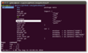 | [***lf***](apps/lf.md) | *lf, as in "list files" is a terminal file manager written in Go.*..[ *read more* ](apps/lf.md)*!* | [*blob*](https://github.com/ivan-hc/AM/blob/main/programs/x86_64/lf) **/** [*raw*](https://raw.githubusercontent.com/ivan-hc/AM/main/programs/x86_64/lf) |
|  | [***link***](apps/link.md) | *Call the link function to create a link to a file. This is part of "am-utils" suite.*..[ *read more* ](apps/link.md)*!* | [*blob*](https://github.com/ivan-hc/AM/blob/main/programs/x86_64/link) **/** [*raw*](https://raw.githubusercontent.com/ivan-hc/AM/main/programs/x86_64/link) |
|  | [***litime***](apps/litime.md) | *A terminal literature clock telling time with quotes from literature.*..[ *read more* ](apps/litime.md)*!* | [*blob*](https://github.com/ivan-hc/AM/blob/main/programs/x86_64/litime) **/** [*raw*](https://raw.githubusercontent.com/ivan-hc/AM/main/programs/x86_64/litime) |
|  | [***ln***](apps/ln.md) | *Make links between files. This is part of "am-utils" suite.*..[ *read more* ](apps/ln.md)*!* | [*blob*](https://github.com/ivan-hc/AM/blob/main/programs/x86_64/ln) **/** [*raw*](https://raw.githubusercontent.com/ivan-hc/AM/main/programs/x86_64/ln) |
|  | [***lockbook-cli***](apps/lockbook-cli.md) | *The private, polished note-taking platform, CLI.*..[ *read more* ](apps/lockbook-cli.md)*!* | [*blob*](https://github.com/ivan-hc/AM/blob/main/programs/x86_64/lockbook-cli) **/** [*raw*](https://raw.githubusercontent.com/ivan-hc/AM/main/programs/x86_64/lockbook-cli) |
|  | [***logname***](apps/logname.md) | *Print user's login name. This is part of "am-utils" suite.*..[ *read more* ](apps/logname.md)*!* | [*blob*](https://github.com/ivan-hc/AM/blob/main/programs/x86_64/logname) **/** [*raw*](https://raw.githubusercontent.com/ivan-hc/AM/main/programs/x86_64/logname) |
|  | [***look***](apps/look.md) | *Beginning with a given string. This is part of "am-utils" suite.*..[ *read more* ](apps/look.md)*!* | [*blob*](https://github.com/ivan-hc/AM/blob/main/programs/x86_64/look) **/** [*raw*](https://raw.githubusercontent.com/ivan-hc/AM/main/programs/x86_64/look) |
|  | [***lovesay***](apps/lovesay.md) | *Cowsay, but full of love and now a little rusty.*..[ *read more* ](apps/lovesay.md)*!* | [*blob*](https://github.com/ivan-hc/AM/blob/main/programs/x86_64/lovesay) **/** [*raw*](https://raw.githubusercontent.com/ivan-hc/AM/main/programs/x86_64/lovesay) |
| 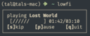 | [***lowfi***](apps/lowfi.md) | *An extremely simple lofi player. CLI.*..[ *read more* ](apps/lowfi.md)*!* | [*blob*](https://github.com/ivan-hc/AM/blob/main/programs/x86_64/lowfi) **/** [*raw*](https://raw.githubusercontent.com/ivan-hc/AM/main/programs/x86_64/lowfi) |
|  | [***ls***](apps/ls.md) | *List directory contents. This is part of "am-utils" suite.*..[ *read more* ](apps/ls.md)*!* | [*blob*](https://github.com/ivan-hc/AM/blob/main/programs/x86_64/ls) **/** [*raw*](https://raw.githubusercontent.com/ivan-hc/AM/main/programs/x86_64/ls) |
|  | [***lsd***](apps/lsd.md) | *The next gen ls command.*..[ *read more* ](apps/lsd.md)*!* | [*blob*](https://github.com/ivan-hc/AM/blob/main/programs/x86_64/lsd) **/** [*raw*](https://raw.githubusercontent.com/ivan-hc/AM/main/programs/x86_64/lsd) |
| 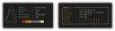 | [***macchina***](apps/macchina.md) | *A system information frontend with an emphasis on performance.*..[ *read more* ](apps/macchina.md)*!* | [*blob*](https://github.com/ivan-hc/AM/blob/main/programs/x86_64/macchina) **/** [*raw*](https://raw.githubusercontent.com/ivan-hc/AM/main/programs/x86_64/macchina) |
|  | [***manga-tui***](apps/manga-tui.md) | *Terminal-based manga reader and downloader with image support.*..[ *read more* ](apps/manga-tui.md)*!* | [*blob*](https://github.com/ivan-hc/AM/blob/main/programs/x86_64/manga-tui) **/** [*raw*](https://raw.githubusercontent.com/ivan-hc/AM/main/programs/x86_64/manga-tui) |
|  | [***mangadesk***](apps/mangadesk.md) | *Terminal client for MangaDex.*..[ *read more* ](apps/mangadesk.md)*!* | [*blob*](https://github.com/ivan-hc/AM/blob/main/programs/x86_64/mangadesk) **/** [*raw*](https://raw.githubusercontent.com/ivan-hc/AM/main/programs/x86_64/mangadesk) |
|  | [***mangal***](apps/mangal.md) | *Most advanced, yet simple CLI manga downloader in the universe!*..[ *read more* ](apps/mangal.md)*!* | [*blob*](https://github.com/ivan-hc/AM/blob/main/programs/x86_64/mangal) **/** [*raw*](https://raw.githubusercontent.com/ivan-hc/AM/main/programs/x86_64/mangal) |
|  | [***matm***](apps/matm.md) | *Watch anime, movies, tv shows and read manga from comfort of the cli.*..[ *read more* ](apps/matm.md)*!* | [*blob*](https://github.com/ivan-hc/AM/blob/main/programs/x86_64/matm) **/** [*raw*](https://raw.githubusercontent.com/ivan-hc/AM/main/programs/x86_64/matm) |
|  | [***mawk***](apps/mawk.md) | *And text processing language. This is part of "am-utils" suite.*..[ *read more* ](apps/mawk.md)*!* | [*blob*](https://github.com/ivan-hc/AM/blob/main/programs/x86_64/mawk) **/** [*raw*](https://raw.githubusercontent.com/ivan-hc/AM/main/programs/x86_64/mawk) |
| 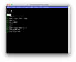 | [***mcfly***](apps/mcfly.md) | *Fly through your shell history. Great Scott!*..[ *read more* ](apps/mcfly.md)*!* | [*blob*](https://github.com/ivan-hc/AM/blob/main/programs/x86_64/mcfly) **/** [*raw*](https://raw.githubusercontent.com/ivan-hc/AM/main/programs/x86_64/mcfly) |
|  | [***md5sum***](apps/md5sum.md) | *Compute and check MD5 message digest. This is part of "am-utils" suite.*..[ *read more* ](apps/md5sum.md)*!* | [*blob*](https://github.com/ivan-hc/AM/blob/main/programs/x86_64/md5sum) **/** [*raw*](https://raw.githubusercontent.com/ivan-hc/AM/main/programs/x86_64/md5sum) |
|  | [***mdcat***](apps/mdcat.md) | *Command line, "cat" for markdown.*..[ *read more* ](apps/mdcat.md)*!* | [*blob*](https://github.com/ivan-hc/AM/blob/main/programs/x86_64/mdcat) **/** [*raw*](https://raw.githubusercontent.com/ivan-hc/AM/main/programs/x86_64/mdcat) |
|  | [***menyoki***](apps/menyoki.md) | *Screen{shot,cast} and perform ImageOps on the command line.*..[ *read more* ](apps/menyoki.md)*!* | [*blob*](https://github.com/ivan-hc/AM/blob/main/programs/x86_64/menyoki) **/** [*raw*](https://raw.githubusercontent.com/ivan-hc/AM/main/programs/x86_64/menyoki) |
|  | [***mk***](apps/mk.md) | *Interactive Task Runner for Makefile.*..[ *read more* ](apps/mk.md)*!* | [*blob*](https://github.com/ivan-hc/AM/blob/main/programs/x86_64/mk) **/** [*raw*](https://raw.githubusercontent.com/ivan-hc/AM/main/programs/x86_64/mk) |
|  | [***mkdir***](apps/mkdir.md) | *Make directories. This is part of "am-utils" suite.*..[ *read more* ](apps/mkdir.md)*!* | [*blob*](https://github.com/ivan-hc/AM/blob/main/programs/x86_64/mkdir) **/** [*raw*](https://raw.githubusercontent.com/ivan-hc/AM/main/programs/x86_64/mkdir) |
|  | [***mkfifo***](apps/mkfifo.md) | *Make FIFOs (named pipes). This is part of "am-utils" suite.*..[ *read more* ](apps/mkfifo.md)*!* | [*blob*](https://github.com/ivan-hc/AM/blob/main/programs/x86_64/mkfifo) **/** [*raw*](https://raw.githubusercontent.com/ivan-hc/AM/main/programs/x86_64/mkfifo) |
|  | [***mknod***](apps/mknod.md) | *Make block or character special files. This is part of "am-utils" suite.*..[ *read more* ](apps/mknod.md)*!* | [*blob*](https://github.com/ivan-hc/AM/blob/main/programs/x86_64/mknod) **/** [*raw*](https://raw.githubusercontent.com/ivan-hc/AM/main/programs/x86_64/mknod) |
|  | [***mktemp***](apps/mktemp.md) | *Create a temporary file or directory. This is part of "am-utils" suite.*..[ *read more* ](apps/mktemp.md)*!* | [*blob*](https://github.com/ivan-hc/AM/blob/main/programs/x86_64/mktemp) **/** [*raw*](https://raw.githubusercontent.com/ivan-hc/AM/main/programs/x86_64/mktemp) |
|  | [***more***](apps/more.md) | *Display the contents of a file in a terminal. This is part of "am-utils" suite.*..[ *read more* ](apps/more.md)*!* | [*blob*](https://github.com/ivan-hc/AM/blob/main/programs/x86_64/more) **/** [*raw*](https://raw.githubusercontent.com/ivan-hc/AM/main/programs/x86_64/more) |
|  | [***mount***](apps/mount.md) | *Mount a filesystem. This is part of "am-utils" suite.*..[ *read more* ](apps/mount.md)*!* | [*blob*](https://github.com/ivan-hc/AM/blob/main/programs/x86_64/mount) **/** [*raw*](https://raw.githubusercontent.com/ivan-hc/AM/main/programs/x86_64/mount) |
| 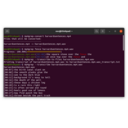 | [***mp4grep***](apps/mp4grep.md) | *CLI for transcribing and searching audio/video files.*..[ *read more* ](apps/mp4grep.md)*!* | [*blob*](https://github.com/ivan-hc/AM/blob/main/programs/x86_64/mp4grep) **/** [*raw*](https://raw.githubusercontent.com/ivan-hc/AM/main/programs/x86_64/mp4grep) |
|  | [***multimc***](apps/multimc.md) | *A Minecraft launcher.*..[ *read more* ](apps/multimc.md)*!* | [*blob*](https://github.com/ivan-hc/AM/blob/main/programs/x86_64/multimc) **/** [*raw*](https://raw.githubusercontent.com/ivan-hc/AM/main/programs/x86_64/multimc) |
|  | [***mv***](apps/mv.md) | *Move (rename) files. This is part of "am-utils" suite.*..[ *read more* ](apps/mv.md)*!* | [*blob*](https://github.com/ivan-hc/AM/blob/main/programs/x86_64/mv) **/** [*raw*](https://raw.githubusercontent.com/ivan-hc/AM/main/programs/x86_64/mv) |
|  | [***nami***](apps/nami.md) | *A clean and tidy decentralized package manager.*..[ *read more* ](apps/nami.md)*!* | [*blob*](https://github.com/ivan-hc/AM/blob/main/programs/x86_64/nami) **/** [*raw*](https://raw.githubusercontent.com/ivan-hc/AM/main/programs/x86_64/nami) |
|  | [***nap***](apps/nap.md) | *Code spippets in your terminal.*..[ *read more* ](apps/nap.md)*!* | [*blob*](https://github.com/ivan-hc/AM/blob/main/programs/x86_64/nap) **/** [*raw*](https://raw.githubusercontent.com/ivan-hc/AM/main/programs/x86_64/nap) |
|  | [***navi***](apps/navi.md) | *An interactive cheatsheet tool for the command-line.*..[ *read more* ](apps/navi.md)*!* | [*blob*](https://github.com/ivan-hc/AM/blob/main/programs/x86_64/navi) **/** [*raw*](https://raw.githubusercontent.com/ivan-hc/AM/main/programs/x86_64/navi) |
|  | [***nazuna***](apps/nazuna.md) | *Download Twitter videos using your terminal!*..[ *read more* ](apps/nazuna.md)*!* | [*blob*](https://github.com/ivan-hc/AM/blob/main/programs/x86_64/nazuna) **/** [*raw*](https://raw.githubusercontent.com/ivan-hc/AM/main/programs/x86_64/nazuna) |
|  | [***neko***](apps/neko.md) | *Neko is a cross-platform cursor-chasing cat.*..[ *read more* ](apps/neko.md)*!* | [*blob*](https://github.com/ivan-hc/AM/blob/main/programs/x86_64/neko) **/** [*raw*](https://raw.githubusercontent.com/ivan-hc/AM/main/programs/x86_64/neko) |
| 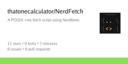 | [***nerdfetch***](apps/nerdfetch.md) | *A POSIX *nix fetch script using Nerdfonts.*..[ *read more* ](apps/nerdfetch.md)*!* | [*blob*](https://github.com/ivan-hc/AM/blob/main/programs/x86_64/nerdfetch) **/** [*raw*](https://raw.githubusercontent.com/ivan-hc/AM/main/programs/x86_64/nerdfetch) |
|  | [***nice***](apps/nice.md) | *Run a program with modified scheduling priority. This is part of "am-utils" suite.*..[ *read more* ](apps/nice.md)*!* | [*blob*](https://github.com/ivan-hc/AM/blob/main/programs/x86_64/nice) **/** [*raw*](https://raw.githubusercontent.com/ivan-hc/AM/main/programs/x86_64/nice) |
|  | [***nitch***](apps/nitch.md) | *Incredibly fast system fetch written in nim.*..[ *read more* ](apps/nitch.md)*!* | [*blob*](https://github.com/ivan-hc/AM/blob/main/programs/x86_64/nitch) **/** [*raw*](https://raw.githubusercontent.com/ivan-hc/AM/main/programs/x86_64/nitch) |
|  | [***nix-portable***](apps/nix-portable.md) | *Use nix on any linux system, rootless and configuration free.*..[ *read more* ](apps/nix-portable.md)*!* | [*blob*](https://github.com/ivan-hc/AM/blob/main/programs/x86_64/nix-portable) **/** [*raw*](https://raw.githubusercontent.com/ivan-hc/AM/main/programs/x86_64/nix-portable) |
|  | [***nl***](apps/nl.md) | *Number lines of files. This is part of "am-utils" suite.*..[ *read more* ](apps/nl.md)*!* | [*blob*](https://github.com/ivan-hc/AM/blob/main/programs/x86_64/nl) **/** [*raw*](https://raw.githubusercontent.com/ivan-hc/AM/main/programs/x86_64/nl) |
|  | [***nm***](apps/nm.md) | *From object files. This is part of "am-utils" suite.*..[ *read more* ](apps/nm.md)*!* | [*blob*](https://github.com/ivan-hc/AM/blob/main/programs/x86_64/nm) **/** [*raw*](https://raw.githubusercontent.com/ivan-hc/AM/main/programs/x86_64/nm) |
|  | [***nnn***](apps/nnn.md) | *n³ The unorthodox terminal file manager*..[ *read more* ](apps/nnn.md)*!* | [*blob*](https://github.com/ivan-hc/AM/blob/main/programs/x86_64/nnn) **/** [*raw*](https://raw.githubusercontent.com/ivan-hc/AM/main/programs/x86_64/nnn) |
|  | [***node***](apps/node.md) | *This is the official suite of Node.js tools, also known as "NodeJS", a JavaScript runtime built on Chrome's V8 JavaScript engine.*..[ *read more* ](apps/node.md)*!* | [*blob*](https://github.com/ivan-hc/AM/blob/main/programs/x86_64/node) **/** [*raw*](https://raw.githubusercontent.com/ivan-hc/AM/main/programs/x86_64/node) |
|  | [***nohup***](apps/nohup.md) | *Run a command immune to hangups, with output to a. This is part of "am-utils" suite.*..[ *read more* ](apps/nohup.md)*!* | [*blob*](https://github.com/ivan-hc/AM/blob/main/programs/x86_64/nohup) **/** [*raw*](https://raw.githubusercontent.com/ivan-hc/AM/main/programs/x86_64/nohup) |
|  | [***notify-send***](apps/notify-send.md) | *A program to send desktop notifications. This is part of "am-utils" suite.*..[ *read more* ](apps/notify-send.md)*!* | [*blob*](https://github.com/ivan-hc/AM/blob/main/programs/x86_64/notify-send) **/** [*raw*](https://raw.githubusercontent.com/ivan-hc/AM/main/programs/x86_64/notify-send) |
|  | [***nproc***](apps/nproc.md) | *Print the number of processing units available. This is part of "am-utils" suite.*..[ *read more* ](apps/nproc.md)*!* | [*blob*](https://github.com/ivan-hc/AM/blob/main/programs/x86_64/nproc) **/** [*raw*](https://raw.githubusercontent.com/ivan-hc/AM/main/programs/x86_64/nproc) |
|  | [***nu***](apps/nu.md) | *A new type of shell.*..[ *read more* ](apps/nu.md)*!* | [*blob*](https://github.com/ivan-hc/AM/blob/main/programs/x86_64/nu) **/** [*raw*](https://raw.githubusercontent.com/ivan-hc/AM/main/programs/x86_64/nu) |
|  | [***numfmt***](apps/numfmt.md) | *From/to human-readable strings. This is part of "am-utils" suite.*..[ *read more* ](apps/numfmt.md)*!* | [*blob*](https://github.com/ivan-hc/AM/blob/main/programs/x86_64/numfmt) **/** [*raw*](https://raw.githubusercontent.com/ivan-hc/AM/main/programs/x86_64/numfmt) |
|  | [***nyaa***](apps/nyaa.md) | *A nyaa.si tui tool for browsing and downloading torrents.*..[ *read more* ](apps/nyaa.md)*!* | [*blob*](https://github.com/ivan-hc/AM/blob/main/programs/x86_64/nyaa) **/** [*raw*](https://raw.githubusercontent.com/ivan-hc/AM/main/programs/x86_64/nyaa) |
|  | [***nyan***](apps/nyan.md) | *CLI, colored "cat" command.*..[ *read more* ](apps/nyan.md)*!* | [*blob*](https://github.com/ivan-hc/AM/blob/main/programs/x86_64/nyan) **/** [*raw*](https://raw.githubusercontent.com/ivan-hc/AM/main/programs/x86_64/nyan) |
|  | [***objcopy***](apps/objcopy.md) | *Translate object files. This is part of "am-utils" suite.*..[ *read more* ](apps/objcopy.md)*!* | [*blob*](https://github.com/ivan-hc/AM/blob/main/programs/x86_64/objcopy) **/** [*raw*](https://raw.githubusercontent.com/ivan-hc/AM/main/programs/x86_64/objcopy) |
|  | [***objdump***](apps/objdump.md) | *From object files. This is part of "am-utils" suite.*..[ *read more* ](apps/objdump.md)*!* | [*blob*](https://github.com/ivan-hc/AM/blob/main/programs/x86_64/objdump) **/** [*raw*](https://raw.githubusercontent.com/ivan-hc/AM/main/programs/x86_64/objdump) |
| 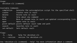 | [***obsidian-cli***](apps/obsidian-cli.md) | *Interact with Obsidian in the terminal. Open, search, create, update, move and delete notes!*..[ *read more* ](apps/obsidian-cli.md)*!* | [*blob*](https://github.com/ivan-hc/AM/blob/main/programs/x86_64/obsidian-cli) **/** [*raw*](https://raw.githubusercontent.com/ivan-hc/AM/main/programs/x86_64/obsidian-cli) |
|  | [***od***](apps/od.md) | *Dump files in octal and other formats. This is part of "am-utils" suite.*..[ *read more* ](apps/od.md)*!* | [*blob*](https://github.com/ivan-hc/AM/blob/main/programs/x86_64/od) **/** [*raw*](https://raw.githubusercontent.com/ivan-hc/AM/main/programs/x86_64/od) |
|  | [***oh***](apps/oh.md) | *A new Unix shell.*..[ *read more* ](apps/oh.md)*!* | [*blob*](https://github.com/ivan-hc/AM/blob/main/programs/x86_64/oh) **/** [*raw*](https://raw.githubusercontent.com/ivan-hc/AM/main/programs/x86_64/oh) |
|  | [***omekasy***](apps/omekasy.md) | *Command line application that converts alphanumeric characters to various styles 𝚍𝚎𝚏𝚒𝚗𝚎𝚍 𝚒𝚗 𝚄𝚗𝚒𝚌𝚘𝚍𝚎.*..[ *read more* ](apps/omekasy.md)*!* | [*blob*](https://github.com/ivan-hc/AM/blob/main/programs/x86_64/omekasy) **/** [*raw*](https://raw.githubusercontent.com/ivan-hc/AM/main/programs/x86_64/omekasy) |
|  | [***onefetch***](apps/onefetch.md) | *Command-line Git information tool.*..[ *read more* ](apps/onefetch.md)*!* | [*blob*](https://github.com/ivan-hc/AM/blob/main/programs/x86_64/onefetch) **/** [*raw*](https://raw.githubusercontent.com/ivan-hc/AM/main/programs/x86_64/onefetch) |
| 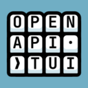 | [***openapi-tui***](apps/openapi-tui.md) | *Terminal UI to list, browse and run APIs defined with openapi.*..[ *read more* ](apps/openapi-tui.md)*!* | [*blob*](https://github.com/ivan-hc/AM/blob/main/programs/x86_64/openapi-tui) **/** [*raw*](https://raw.githubusercontent.com/ivan-hc/AM/main/programs/x86_64/openapi-tui) |
|  | [***opencode***](apps/opencode.md) | *The open source coding agent.*..[ *read more* ](apps/opencode.md)*!* | [*blob*](https://github.com/ivan-hc/AM/blob/main/programs/x86_64/opencode) **/** [*raw*](https://raw.githubusercontent.com/ivan-hc/AM/main/programs/x86_64/opencode) |
|  | [***oras***](apps/oras.md) | *OCI registry client managing content like artifacts, images, packages.*..[ *read more* ](apps/oras.md)*!* | [*blob*](https://github.com/ivan-hc/AM/blob/main/programs/x86_64/oras) **/** [*raw*](https://raw.githubusercontent.com/ivan-hc/AM/main/programs/x86_64/oras) |
|  | [***ots***](apps/ots.md) | *Share end-to-end encrypted secrets with others via a one-time URL.*..[ *read more* ](apps/ots.md)*!* | [*blob*](https://github.com/ivan-hc/AM/blob/main/programs/x86_64/ots) **/** [*raw*](https://raw.githubusercontent.com/ivan-hc/AM/main/programs/x86_64/ots) |
|  | [***paclear***](apps/paclear.md) | *CLI, paclear is a clear command with PAC-MAN animation.*..[ *read more* ](apps/paclear.md)*!* | [*blob*](https://github.com/ivan-hc/AM/blob/main/programs/x86_64/paclear) **/** [*raw*](https://raw.githubusercontent.com/ivan-hc/AM/main/programs/x86_64/paclear) |
|  | [***paket***](apps/paket.md) | *A simple and fast package manager for the Fish shell written in Rust.*..[ *read more* ](apps/paket.md)*!* | [*blob*](https://github.com/ivan-hc/AM/blob/main/programs/x86_64/paket) **/** [*raw*](https://raw.githubusercontent.com/ivan-hc/AM/main/programs/x86_64/paket) |
|  | [***paste***](apps/paste.md) | *Merge lines of files. This is part of "am-utils" suite.*..[ *read more* ](apps/paste.md)*!* | [*blob*](https://github.com/ivan-hc/AM/blob/main/programs/x86_64/paste) **/** [*raw*](https://raw.githubusercontent.com/ivan-hc/AM/main/programs/x86_64/paste) |
| 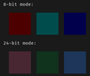 | [***pastel***](apps/pastel.md) | *A command-line tool to generate, analyze, convert and manipulate colors.*..[ *read more* ](apps/pastel.md)*!* | [*blob*](https://github.com/ivan-hc/AM/blob/main/programs/x86_64/pastel) **/** [*raw*](https://raw.githubusercontent.com/ivan-hc/AM/main/programs/x86_64/pastel) |
|  | [***pathchk***](apps/pathchk.md) | *File names are valid or portable. This is part of "am-utils" suite.*..[ *read more* ](apps/pathchk.md)*!* | [*blob*](https://github.com/ivan-hc/AM/blob/main/programs/x86_64/pathchk) **/** [*raw*](https://raw.githubusercontent.com/ivan-hc/AM/main/programs/x86_64/pathchk) |
|  | [***pay-respects***](apps/pay-respects.md) | *Terminal command correction, alternative to thefuck written in Rust.*..[ *read more* ](apps/pay-respects.md)*!* | [*blob*](https://github.com/ivan-hc/AM/blob/main/programs/x86_64/pay-respects) **/** [*raw*](https://raw.githubusercontent.com/ivan-hc/AM/main/programs/x86_64/pay-respects) |
|  | [***pboy***](apps/pboy.md) | *A small .pdf management tool with a command-line UI.*..[ *read more* ](apps/pboy.md)*!* | [*blob*](https://github.com/ivan-hc/AM/blob/main/programs/x86_64/pboy) **/** [*raw*](https://raw.githubusercontent.com/ivan-hc/AM/main/programs/x86_64/pboy) |
|  | [***pdf-diff***](apps/pdf-diff.md) | *A CLI tool for visualizing differences between two pdf files.*..[ *read more* ](apps/pdf-diff.md)*!* | [*blob*](https://github.com/ivan-hc/AM/blob/main/programs/x86_64/pdf-diff) **/** [*raw*](https://raw.githubusercontent.com/ivan-hc/AM/main/programs/x86_64/pdf-diff) |
|  | [***peep***](apps/peep.md) | *The CLI text viewer tool that works like less command on small pane within the terminal window.*..[ *read more* ](apps/peep.md)*!* | [*blob*](https://github.com/ivan-hc/AM/blob/main/programs/x86_64/peep) **/** [*raw*](https://raw.githubusercontent.com/ivan-hc/AM/main/programs/x86_64/peep) |
|  | [***pet***](apps/pet.md) | *Simple command-line snippet manager.*..[ *read more* ](apps/pet.md)*!* | [*blob*](https://github.com/ivan-hc/AM/blob/main/programs/x86_64/pet) **/** [*raw*](https://raw.githubusercontent.com/ivan-hc/AM/main/programs/x86_64/pet) |
|  | [***pfetch-rs***](apps/pfetch-rs.md) | *A rewrite of the pfetch system information tool in Rust.*..[ *read more* ](apps/pfetch-rs.md)*!* | [*blob*](https://github.com/ivan-hc/AM/blob/main/programs/x86_64/pfetch-rs) **/** [*raw*](https://raw.githubusercontent.com/ivan-hc/AM/main/programs/x86_64/pfetch-rs) |
|  | [***pget***](apps/pget.md) | *The fastest, resumable file download CLI client.*..[ *read more* ](apps/pget.md)*!* | [*blob*](https://github.com/ivan-hc/AM/blob/main/programs/x86_64/pget) **/** [*raw*](https://raw.githubusercontent.com/ivan-hc/AM/main/programs/x86_64/pget) |
|  | [***pho***](apps/pho.md) | *The AppImage Manager that Linux always deserved.*..[ *read more* ](apps/pho.md)*!* | [*blob*](https://github.com/ivan-hc/AM/blob/main/programs/x86_64/pho) **/** [*raw*](https://raw.githubusercontent.com/ivan-hc/AM/main/programs/x86_64/pho) |
|  | [***picterm***](apps/picterm.md) | *CLI, TUI image viewer.*..[ *read more* ](apps/picterm.md)*!* | [*blob*](https://github.com/ivan-hc/AM/blob/main/programs/x86_64/picterm) **/** [*raw*](https://raw.githubusercontent.com/ivan-hc/AM/main/programs/x86_64/picterm) |
|  | [***pingu***](apps/pingu.md) | *CLI, ping command but with pingu.*..[ *read more* ](apps/pingu.md)*!* | [*blob*](https://github.com/ivan-hc/AM/blob/main/programs/x86_64/pingu) **/** [*raw*](https://raw.githubusercontent.com/ivan-hc/AM/main/programs/x86_64/pingu) |
|  | [***pinky***](apps/pinky.md) | *Lightweight finger. This is part of "am-utils" suite.*..[ *read more* ](apps/pinky.md)*!* | [*blob*](https://github.com/ivan-hc/AM/blob/main/programs/x86_64/pinky) **/** [*raw*](https://raw.githubusercontent.com/ivan-hc/AM/main/programs/x86_64/pinky) |
|  | [***pipes-rs***](apps/pipes-rs.md) | *An over-engineered rewrite of pipes.sh in Rust. CLI.*..[ *read more* ](apps/pipes-rs.md)*!* | [*blob*](https://github.com/ivan-hc/AM/blob/main/programs/x86_64/pipes-rs) **/** [*raw*](https://raw.githubusercontent.com/ivan-hc/AM/main/programs/x86_64/pipes-rs) |
|  | [***pixfetch***](apps/pixfetch.md) | *Another CLI fetch program with pixelized images written in Rust.*..[ *read more* ](apps/pixfetch.md)*!* | [*blob*](https://github.com/ivan-hc/AM/blob/main/programs/x86_64/pixfetch) **/** [*raw*](https://raw.githubusercontent.com/ivan-hc/AM/main/programs/x86_64/pixfetch) |
|  | [***platform-tools***](apps/platform-tools.md) | *Official Suite of command line utilities to manage Android devices.*..[ *read more* ](apps/platform-tools.md)*!* | [*blob*](https://github.com/ivan-hc/AM/blob/main/programs/x86_64/platform-tools) **/** [*raw*](https://raw.githubusercontent.com/ivan-hc/AM/main/programs/x86_64/platform-tools) |
|  | [***png2svg***](apps/png2svg.md) | *CLI, convert small PNG images to SVG Tiny 1.2.*..[ *read more* ](apps/png2svg.md)*!* | [*blob*](https://github.com/ivan-hc/AM/blob/main/programs/x86_64/png2svg) **/** [*raw*](https://raw.githubusercontent.com/ivan-hc/AM/main/programs/x86_64/png2svg) |
|  | [***podman***](apps/podman.md) | *Free & open source tool to manage containers, pods, and images.*..[ *read more* ](apps/podman.md)*!* | [*blob*](https://github.com/ivan-hc/AM/blob/main/programs/x86_64/podman) **/** [*raw*](https://raw.githubusercontent.com/ivan-hc/AM/main/programs/x86_64/podman) |
|  | [***pokeget-rs***](apps/pokeget-rs.md) | *A better rust version of pokeget. CLI.*..[ *read more* ](apps/pokeget-rs.md)*!* | [*blob*](https://github.com/ivan-hc/AM/blob/main/programs/x86_64/pokeget-rs) **/** [*raw*](https://raw.githubusercontent.com/ivan-hc/AM/main/programs/x86_64/pokeget-rs) |
|  | [***pokego***](apps/pokego.md) | *Command-line tool that lets you display Pokémon sprites in color directly in your terminal.*..[ *read more* ](apps/pokego.md)*!* | [*blob*](https://github.com/ivan-hc/AM/blob/main/programs/x86_64/pokego) **/** [*raw*](https://raw.githubusercontent.com/ivan-hc/AM/main/programs/x86_64/pokego) |
|  | [***pop***](apps/pop.md) | *Send emails from your terminal.*..[ *read more* ](apps/pop.md)*!* | [*blob*](https://github.com/ivan-hc/AM/blob/main/programs/x86_64/pop) **/** [*raw*](https://raw.githubusercontent.com/ivan-hc/AM/main/programs/x86_64/pop) |
|  | [***pr***](apps/pr.md) | *Files for printing. This is part of "am-utils" suite.*..[ *read more* ](apps/pr.md)*!* | [*blob*](https://github.com/ivan-hc/AM/blob/main/programs/x86_64/pr) **/** [*raw*](https://raw.githubusercontent.com/ivan-hc/AM/main/programs/x86_64/pr) |
|  | [***printenv***](apps/printenv.md) | *Print all or part of environment. This is part of "am-utils" suite.*..[ *read more* ](apps/printenv.md)*!* | [*blob*](https://github.com/ivan-hc/AM/blob/main/programs/x86_64/printenv) **/** [*raw*](https://raw.githubusercontent.com/ivan-hc/AM/main/programs/x86_64/printenv) |
|  | [***printf***](apps/printf.md) | *Format and print data. This is part of "am-utils" suite.*..[ *read more* ](apps/printf.md)*!* | [*blob*](https://github.com/ivan-hc/AM/blob/main/programs/x86_64/printf) **/** [*raw*](https://raw.githubusercontent.com/ivan-hc/AM/main/programs/x86_64/printf) |
|  | [***procs***](apps/procs.md) | *A modern replacement for ps written in Rust.*..[ *read more* ](apps/procs.md)*!* | [*blob*](https://github.com/ivan-hc/AM/blob/main/programs/x86_64/procs) **/** [*raw*](https://raw.githubusercontent.com/ivan-hc/AM/main/programs/x86_64/procs) |
|  | [***ptx***](apps/ptx.md) | *Permuted index of file contents. This is part of "am-utils" suite.*..[ *read more* ](apps/ptx.md)*!* | [*blob*](https://github.com/ivan-hc/AM/blob/main/programs/x86_64/ptx) **/** [*raw*](https://raw.githubusercontent.com/ivan-hc/AM/main/programs/x86_64/ptx) |
|  | [***pwd***](apps/pwd.md) | *Print name of current/working directory. This is part of "am-utils" suite.*..[ *read more* ](apps/pwd.md)*!* | [*blob*](https://github.com/ivan-hc/AM/blob/main/programs/x86_64/pwd) **/** [*raw*](https://raw.githubusercontent.com/ivan-hc/AM/main/programs/x86_64/pwd) |
|  | [***qrscan***](apps/qrscan.md) | *Scan a QR code in the terminal using the system camera or an image.*..[ *read more* ](apps/qrscan.md)*!* | [*blob*](https://github.com/ivan-hc/AM/blob/main/programs/x86_64/qrscan) **/** [*raw*](https://raw.githubusercontent.com/ivan-hc/AM/main/programs/x86_64/qrscan) |
|  | [***quarto-cli***](apps/quarto-cli.md) | *Scientific and technical publishing system built on Pandoc.*..[ *read more* ](apps/quarto-cli.md)*!* | [*blob*](https://github.com/ivan-hc/AM/blob/main/programs/x86_64/quarto-cli) **/** [*raw*](https://raw.githubusercontent.com/ivan-hc/AM/main/programs/x86_64/quarto-cli) |
|  | [***ranlib***](apps/ranlib.md) | *Index to an archive. This is part of "am-utils" suite.*..[ *read more* ](apps/ranlib.md)*!* | [*blob*](https://github.com/ivan-hc/AM/blob/main/programs/x86_64/ranlib) **/** [*raw*](https://raw.githubusercontent.com/ivan-hc/AM/main/programs/x86_64/ranlib) |
|  | [***rbw***](apps/rbw.md) | *Unofficial Bitwarden password manager cli.*..[ *read more* ](apps/rbw.md)*!* | [*blob*](https://github.com/ivan-hc/AM/blob/main/programs/x86_64/rbw) **/** [*raw*](https://raw.githubusercontent.com/ivan-hc/AM/main/programs/x86_64/rbw) |
|  | [***rclone***](apps/rclone.md) | *"rsync for cloud storage", CLI that supports Google Drive, S3, Dropbox, Backblaze B2, One Drive, Swift, Hubic, Wasabi, Google Cloud Storage, Azure Blob, Azure Files, Yandex Files.*..[ *read more* ](apps/rclone.md)*!* | [*blob*](https://github.com/ivan-hc/AM/blob/main/programs/x86_64/rclone) **/** [*raw*](https://raw.githubusercontent.com/ivan-hc/AM/main/programs/x86_64/rclone) |
|  | [***readelf***](apps/readelf.md) | *About ELF files. This is part of "am-utils" suite.*..[ *read more* ](apps/readelf.md)*!* | [*blob*](https://github.com/ivan-hc/AM/blob/main/programs/x86_64/readelf) **/** [*raw*](https://raw.githubusercontent.com/ivan-hc/AM/main/programs/x86_64/readelf) |
|  | [***readlink***](apps/readlink.md) | *Print resolved symbolic links or canonical file. This is part of "am-utils" suite.*..[ *read more* ](apps/readlink.md)*!* | [*blob*](https://github.com/ivan-hc/AM/blob/main/programs/x86_64/readlink) **/** [*raw*](https://raw.githubusercontent.com/ivan-hc/AM/main/programs/x86_64/readlink) |
|  | [***realpath***](apps/realpath.md) | *Print the resolved path. This is part of "am-utils" suite.*..[ *read more* ](apps/realpath.md)*!* | [*blob*](https://github.com/ivan-hc/AM/blob/main/programs/x86_64/realpath) **/** [*raw*](https://raw.githubusercontent.com/ivan-hc/AM/main/programs/x86_64/realpath) |
|  | [***rebos***](apps/rebos.md) | *Rebos is a tool that aims at mimicking what NixOS does (repeatability), for any Linux distribution.*..[ *read more* ](apps/rebos.md)*!* | [*blob*](https://github.com/ivan-hc/AM/blob/main/programs/x86_64/rebos) **/** [*raw*](https://raw.githubusercontent.com/ivan-hc/AM/main/programs/x86_64/rebos) |
|  | [***rev***](apps/rev.md) | *Reverse lines characterwise. This is part of "am-utils" suite.*..[ *read more* ](apps/rev.md)*!* | [*blob*](https://github.com/ivan-hc/AM/blob/main/programs/x86_64/rev) **/** [*raw*](https://raw.githubusercontent.com/ivan-hc/AM/main/programs/x86_64/rev) |
|  | [***revealgo***](apps/revealgo.md) | *Markdown driven presentation tool written in Go!*..[ *read more* ](apps/revealgo.md)*!* | [*blob*](https://github.com/ivan-hc/AM/blob/main/programs/x86_64/revealgo) **/** [*raw*](https://raw.githubusercontent.com/ivan-hc/AM/main/programs/x86_64/revealgo) |
|  | [***rimage***](apps/rimage.md) | *This is CLI tool inspired by squoosh.*..[ *read more* ](apps/rimage.md)*!* | [*blob*](https://github.com/ivan-hc/AM/blob/main/programs/x86_64/rimage) **/** [*raw*](https://raw.githubusercontent.com/ivan-hc/AM/main/programs/x86_64/rimage) |
|  | [***ripgrep***](apps/ripgrep.md) | *Search directories for regex pattern while respecting gitignore.*..[ *read more* ](apps/ripgrep.md)*!* | [*blob*](https://github.com/ivan-hc/AM/blob/main/programs/x86_64/ripgrep) **/** [*raw*](https://raw.githubusercontent.com/ivan-hc/AM/main/programs/x86_64/ripgrep) |
|  | [***ripgrep-all***](apps/ripgrep-all.md) | *A ripgrep version to also search in documents and archives.*..[ *read more* ](apps/ripgrep-all.md)*!* | [*blob*](https://github.com/ivan-hc/AM/blob/main/programs/x86_64/ripgrep-all) **/** [*raw*](https://raw.githubusercontent.com/ivan-hc/AM/main/programs/x86_64/ripgrep-all) |
|  | [***rm***](apps/rm.md) | *Remove files or directories. This is part of "am-utils" suite.*..[ *read more* ](apps/rm.md)*!* | [*blob*](https://github.com/ivan-hc/AM/blob/main/programs/x86_64/rm) **/** [*raw*](https://raw.githubusercontent.com/ivan-hc/AM/main/programs/x86_64/rm) |
|  | [***rmdir***](apps/rmdir.md) | *Remove empty directories. This is part of "am-utils" suite.*..[ *read more* ](apps/rmdir.md)*!* | [*blob*](https://github.com/ivan-hc/AM/blob/main/programs/x86_64/rmdir) **/** [*raw*](https://raw.githubusercontent.com/ivan-hc/AM/main/programs/x86_64/rmdir) |
|  | [***rocketfetch***](apps/rocketfetch.md) | *A WIP command line system information tool written with multithreading in rust for performance with toml file configuration.*..[ *read more* ](apps/rocketfetch.md)*!* | [*blob*](https://github.com/ivan-hc/AM/blob/main/programs/x86_64/rocketfetch) **/** [*raw*](https://raw.githubusercontent.com/ivan-hc/AM/main/programs/x86_64/rocketfetch) |
|  | [***rrip***](apps/rrip.md) | *Bulk image downloader for reddit.*..[ *read more* ](apps/rrip.md)*!* | [*blob*](https://github.com/ivan-hc/AM/blob/main/programs/x86_64/rrip) **/** [*raw*](https://raw.githubusercontent.com/ivan-hc/AM/main/programs/x86_64/rrip) |
|  | [***rucola***](apps/rucola.md) | *Terminal-based markdown note manager.*..[ *read more* ](apps/rucola.md)*!* | [*blob*](https://github.com/ivan-hc/AM/blob/main/programs/x86_64/rucola) **/** [*raw*](https://raw.githubusercontent.com/ivan-hc/AM/main/programs/x86_64/rucola) |
|  | [***runcon***](apps/runcon.md) | *With specified security context. This is part of "am-utils" suite.*..[ *read more* ](apps/runcon.md)*!* | [*blob*](https://github.com/ivan-hc/AM/blob/main/programs/x86_64/runcon) **/** [*raw*](https://raw.githubusercontent.com/ivan-hc/AM/main/programs/x86_64/runcon) |
|  | [***rustdict***](apps/rustdict.md) | *A dictionary CLI tool in Rust inspired by BetaPictoris's dict.*..[ *read more* ](apps/rustdict.md)*!* | [*blob*](https://github.com/ivan-hc/AM/blob/main/programs/x86_64/rustdict) **/** [*raw*](https://raw.githubusercontent.com/ivan-hc/AM/main/programs/x86_64/rustdict) |
|  | [***rustypaste***](apps/rustypaste.md) | *A minimal file upload/pastebin service.*..[ *read more* ](apps/rustypaste.md)*!* | [*blob*](https://github.com/ivan-hc/AM/blob/main/programs/x86_64/rustypaste) **/** [*raw*](https://raw.githubusercontent.com/ivan-hc/AM/main/programs/x86_64/rustypaste) |
|  | [***s***](apps/s.md) | *Open a web search in your terminal.*..[ *read more* ](apps/s.md)*!* | [*blob*](https://github.com/ivan-hc/AM/blob/main/programs/x86_64/s) **/** [*raw*](https://raw.githubusercontent.com/ivan-hc/AM/main/programs/x86_64/s) |
|  | [***sd***](apps/sd.md) | *Intuitive find & replace CLI, sed alternative.*..[ *read more* ](apps/sd.md)*!* | [*blob*](https://github.com/ivan-hc/AM/blob/main/programs/x86_64/sd) **/** [*raw*](https://raw.githubusercontent.com/ivan-hc/AM/main/programs/x86_64/sd) |
|  | [***sed***](apps/sed.md) | *GNU stream editor for filtering and transforming text. This is part of "am-utils" suite.*..[ *read more* ](apps/sed.md)*!* | [*blob*](https://github.com/ivan-hc/AM/blob/main/programs/x86_64/sed) **/** [*raw*](https://raw.githubusercontent.com/ivan-hc/AM/main/programs/x86_64/sed) |
|  | [***seq***](apps/seq.md) | *Print a sequence of numbers. This is part of "am-utils" suite.*..[ *read more* ](apps/seq.md)*!* | [*blob*](https://github.com/ivan-hc/AM/blob/main/programs/x86_64/seq) **/** [*raw*](https://raw.githubusercontent.com/ivan-hc/AM/main/programs/x86_64/seq) |
|  | [***sh***](apps/sh.md) | *GNU Bourne-Again Shell, the de facto standard shell on Linux. This is part of "am-utils" suite.*..[ *read more* ](apps/sh.md)*!* | [*blob*](https://github.com/ivan-hc/AM/blob/main/programs/x86_64/sh) **/** [*raw*](https://raw.githubusercontent.com/ivan-hc/AM/main/programs/x86_64/sh) |
|  | [***sha1sum***](apps/sha1sum.md) | *Compute and check SHA1 message digest. This is part of "am-utils" suite.*..[ *read more* ](apps/sha1sum.md)*!* | [*blob*](https://github.com/ivan-hc/AM/blob/main/programs/x86_64/sha1sum) **/** [*raw*](https://raw.githubusercontent.com/ivan-hc/AM/main/programs/x86_64/sha1sum) |
|  | [***sha224sum***](apps/sha224sum.md) | *Check SHA224 message digest. This is part of "am-utils" suite.*..[ *read more* ](apps/sha224sum.md)*!* | [*blob*](https://github.com/ivan-hc/AM/blob/main/programs/x86_64/sha224sum) **/** [*raw*](https://raw.githubusercontent.com/ivan-hc/AM/main/programs/x86_64/sha224sum) |
|  | [***sha256sum***](apps/sha256sum.md) | *Compute and check SHA256 message digest. This is part of "am-utils" suite.*..[ *read more* ](apps/sha256sum.md)*!* | [*blob*](https://github.com/ivan-hc/AM/blob/main/programs/x86_64/sha256sum) **/** [*raw*](https://raw.githubusercontent.com/ivan-hc/AM/main/programs/x86_64/sha256sum) |
|  | [***sha384sum***](apps/sha384sum.md) | *Check SHA384 message digest. This is part of "am-utils" suite.*..[ *read more* ](apps/sha384sum.md)*!* | [*blob*](https://github.com/ivan-hc/AM/blob/main/programs/x86_64/sha384sum) **/** [*raw*](https://raw.githubusercontent.com/ivan-hc/AM/main/programs/x86_64/sha384sum) |
|  | [***sha512sum***](apps/sha512sum.md) | *Compute and check SHA512 message digest. This is part of "am-utils" suite.*..[ *read more* ](apps/sha512sum.md)*!* | [*blob*](https://github.com/ivan-hc/AM/blob/main/programs/x86_64/sha512sum) **/** [*raw*](https://raw.githubusercontent.com/ivan-hc/AM/main/programs/x86_64/sha512sum) |
|  | [***shellcheck***](apps/shellcheck.md) | *ShellCheck, a static analysis tool for shell scripts.*..[ *read more* ](apps/shellcheck.md)*!* | [*blob*](https://github.com/ivan-hc/AM/blob/main/programs/x86_64/shellcheck) **/** [*raw*](https://raw.githubusercontent.com/ivan-hc/AM/main/programs/x86_64/shellcheck) |
|  | [***shellharden***](apps/shellharden.md) | *The corrective bash syntax highlighter.*..[ *read more* ](apps/shellharden.md)*!* | [*blob*](https://github.com/ivan-hc/AM/blob/main/programs/x86_64/shellharden) **/** [*raw*](https://raw.githubusercontent.com/ivan-hc/AM/main/programs/x86_64/shellharden) |
|  | [***shradiko***](apps/shradiko.md) | *Make Portable AppImages from Distro Packages.*..[ *read more* ](apps/shradiko.md)*!* | [*blob*](https://github.com/ivan-hc/AM/blob/main/programs/x86_64/shradiko) **/** [*raw*](https://raw.githubusercontent.com/ivan-hc/AM/main/programs/x86_64/shradiko) |
|  | [***shred***](apps/shred.md) | *Overwrite a file to hide its contents, and optionally. This is part of "am-utils" suite.*..[ *read more* ](apps/shred.md)*!* | [*blob*](https://github.com/ivan-hc/AM/blob/main/programs/x86_64/shred) **/** [*raw*](https://raw.githubusercontent.com/ivan-hc/AM/main/programs/x86_64/shred) |
|  | [***shuf***](apps/shuf.md) | *Generate random permutations. This is part of "am-utils" suite.*..[ *read more* ](apps/shuf.md)*!* | [*blob*](https://github.com/ivan-hc/AM/blob/main/programs/x86_64/shuf) **/** [*raw*](https://raw.githubusercontent.com/ivan-hc/AM/main/programs/x86_64/shuf) |
|  | [***sidenote***](apps/sidenote.md) | *A CLI tool that helps to manage plain text notes per working directory.*..[ *read more* ](apps/sidenote.md)*!* | [*blob*](https://github.com/ivan-hc/AM/blob/main/programs/x86_64/sidenote) **/** [*raw*](https://raw.githubusercontent.com/ivan-hc/AM/main/programs/x86_64/sidenote) |
|  | [***size***](apps/size.md) | *Sizes and total size of binary files. This is part of "am-utils" suite.*..[ *read more* ](apps/size.md)*!* | [*blob*](https://github.com/ivan-hc/AM/blob/main/programs/x86_64/size) **/** [*raw*](https://raw.githubusercontent.com/ivan-hc/AM/main/programs/x86_64/size) |
|  | [***sleep***](apps/sleep.md) | *Delay for a specified amount of time. This is part of "am-utils" suite.*..[ *read more* ](apps/sleep.md)*!* | [*blob*](https://github.com/ivan-hc/AM/blob/main/programs/x86_64/sleep) **/** [*raw*](https://raw.githubusercontent.com/ivan-hc/AM/main/programs/x86_64/sleep) |
|  | [***smassh***](apps/smassh.md) | *Smassh your Keyboard, TUI Edition.*..[ *read more* ](apps/smassh.md)*!* | [*blob*](https://github.com/ivan-hc/AM/blob/main/programs/x86_64/smassh) **/** [*raw*](https://raw.githubusercontent.com/ivan-hc/AM/main/programs/x86_64/smassh) |
|  | [***soar***](apps/soar.md) | *A fast, modern package manager for Static Binaries, Portable Formats, AppImage, AppBundle, FlatImage, Runimage & More.*..[ *read more* ](apps/soar.md)*!* | [*blob*](https://github.com/ivan-hc/AM/blob/main/programs/x86_64/soar) **/** [*raw*](https://raw.githubusercontent.com/ivan-hc/AM/main/programs/x86_64/soar) |
|  | [***soft-serve***](apps/soft-serve.md) | *The mighty, self-hostable Git server for the command line.*..[ *read more* ](apps/soft-serve.md)*!* | [*blob*](https://github.com/ivan-hc/AM/blob/main/programs/x86_64/soft-serve) **/** [*raw*](https://raw.githubusercontent.com/ivan-hc/AM/main/programs/x86_64/soft-serve) |
|  | [***sort***](apps/sort.md) | *Sort lines of text files. This is part of "am-utils" suite.*..[ *read more* ](apps/sort.md)*!* | [*blob*](https://github.com/ivan-hc/AM/blob/main/programs/x86_64/sort) **/** [*raw*](https://raw.githubusercontent.com/ivan-hc/AM/main/programs/x86_64/sort) |
|  | [***split***](apps/split.md) | *Divide a file into multiple smaller files. This is part of "am-utils" suite.*..[ *read more* ](apps/split.md)*!* | [*blob*](https://github.com/ivan-hc/AM/blob/main/programs/x86_64/split) **/** [*raw*](https://raw.githubusercontent.com/ivan-hc/AM/main/programs/x86_64/split) |
|  | [***spotifetch***](apps/spotifetch.md) | *A simple and beautiful CLI fetch tool for spotify, now rusty.*..[ *read more* ](apps/spotifetch.md)*!* | [*blob*](https://github.com/ivan-hc/AM/blob/main/programs/x86_64/spotifetch) **/** [*raw*](https://raw.githubusercontent.com/ivan-hc/AM/main/programs/x86_64/spotifetch) |
|  | [***spotify-dl***](apps/spotify-dl.md) | *A command-line utility to download songs and playlists directly from Spotify's servers.*..[ *read more* ](apps/spotify-dl.md)*!* | [*blob*](https://github.com/ivan-hc/AM/blob/main/programs/x86_64/spotify-dl) **/** [*raw*](https://raw.githubusercontent.com/ivan-hc/AM/main/programs/x86_64/spotify-dl) |
|  | [***spotify-player***](apps/spotify-player.md) | *A Spotify player in the terminal with full feature parity.*..[ *read more* ](apps/spotify-player.md)*!* | [*blob*](https://github.com/ivan-hc/AM/blob/main/programs/x86_64/spotify-player) **/** [*raw*](https://raw.githubusercontent.com/ivan-hc/AM/main/programs/x86_64/spotify-player) |
|  | [***spotify-tui***](apps/spotify-tui.md) | *Spotify for the terminal written in Rust.*..[ *read more* ](apps/spotify-tui.md)*!* | [*blob*](https://github.com/ivan-hc/AM/blob/main/programs/x86_64/spotify-tui) **/** [*raw*](https://raw.githubusercontent.com/ivan-hc/AM/main/programs/x86_64/spotify-tui) |
|  | [***sptlrx***](apps/sptlrx.md) | *Synchronized lyrics in your terminal.*..[ *read more* ](apps/sptlrx.md)*!* | [*blob*](https://github.com/ivan-hc/AM/blob/main/programs/x86_64/sptlrx) **/** [*raw*](https://raw.githubusercontent.com/ivan-hc/AM/main/programs/x86_64/sptlrx) |
|  | [***starship***](apps/starship.md) | *The minimal, blazing-fast, and infinitely customizable prompt for any shell.*..[ *read more* ](apps/starship.md)*!* | [*blob*](https://github.com/ivan-hc/AM/blob/main/programs/x86_64/starship) **/** [*raw*](https://raw.githubusercontent.com/ivan-hc/AM/main/programs/x86_64/starship) |
|  | [***stat***](apps/stat.md) | *Display file or file system status. This is part of "am-utils" suite.*..[ *read more* ](apps/stat.md)*!* | [*blob*](https://github.com/ivan-hc/AM/blob/main/programs/x86_64/stat) **/** [*raw*](https://raw.githubusercontent.com/ivan-hc/AM/main/programs/x86_64/stat) |
|  | [***stdbuf***](apps/stdbuf.md) | *With modified buffering operations for its. This is part of "am-utils" suite.*..[ *read more* ](apps/stdbuf.md)*!* | [*blob*](https://github.com/ivan-hc/AM/blob/main/programs/x86_64/stdbuf) **/** [*raw*](https://raw.githubusercontent.com/ivan-hc/AM/main/programs/x86_64/stdbuf) |
|  | [***steam-tui***](apps/steam-tui.md) | *Rust TUI client for steamcmd.*..[ *read more* ](apps/steam-tui.md)*!* | [*blob*](https://github.com/ivan-hc/AM/blob/main/programs/x86_64/steam-tui) **/** [*raw*](https://raw.githubusercontent.com/ivan-hc/AM/main/programs/x86_64/steam-tui) |
|  | [***stew***](apps/stew.md) | *An independent package manager for compiled binaries.*..[ *read more* ](apps/stew.md)*!* | [*blob*](https://github.com/ivan-hc/AM/blob/main/programs/x86_64/stew) **/** [*raw*](https://raw.githubusercontent.com/ivan-hc/AM/main/programs/x86_64/stew) |
|  | [***strace***](apps/strace.md) | *Trace system calls and signals. This is part of "am-utils" suite.*..[ *read more* ](apps/strace.md)*!* | [*blob*](https://github.com/ivan-hc/AM/blob/main/programs/x86_64/strace) **/** [*raw*](https://raw.githubusercontent.com/ivan-hc/AM/main/programs/x86_64/strace) |
|  | [***strings***](apps/strings.md) | *Strings is another bad static string library, written in C. This is part of "am-utils" suite.*..[ *read more* ](apps/strings.md)*!* | [*blob*](https://github.com/ivan-hc/AM/blob/main/programs/x86_64/strings) **/** [*raw*](https://raw.githubusercontent.com/ivan-hc/AM/main/programs/x86_64/strings) |
|  | [***strip***](apps/strip.md) | *And other data from object files. This is part of "am-utils" suite.*..[ *read more* ](apps/strip.md)*!* | [*blob*](https://github.com/ivan-hc/AM/blob/main/programs/x86_64/strip) **/** [*raw*](https://raw.githubusercontent.com/ivan-hc/AM/main/programs/x86_64/strip) |
|  | [***stty***](apps/stty.md) | *Change and print terminal line settings. This is part of "am-utils" suite.*..[ *read more* ](apps/stty.md)*!* | [*blob*](https://github.com/ivan-hc/AM/blob/main/programs/x86_64/stty) **/** [*raw*](https://raw.githubusercontent.com/ivan-hc/AM/main/programs/x86_64/stty) |
|  | [***sum***](apps/sum.md) | *Checksum and count the blocks in a file. This is part of "am-utils" suite.*..[ *read more* ](apps/sum.md)*!* | [*blob*](https://github.com/ivan-hc/AM/blob/main/programs/x86_64/sum) **/** [*raw*](https://raw.githubusercontent.com/ivan-hc/AM/main/programs/x86_64/sum) |
|  | [***superfile***](apps/superfile.md) | *Pretty fancy and modern terminal file manager.*..[ *read more* ](apps/superfile.md)*!* | [*blob*](https://github.com/ivan-hc/AM/blob/main/programs/x86_64/superfile) **/** [*raw*](https://raw.githubusercontent.com/ivan-hc/AM/main/programs/x86_64/superfile) |
|  | [***swapoff***](apps/swapoff.md) | *Enable/disable devices and files for paging and. This is part of "am-utils" suite.*..[ *read more* ](apps/swapoff.md)*!* | [*blob*](https://github.com/ivan-hc/AM/blob/main/programs/x86_64/swapoff) **/** [*raw*](https://raw.githubusercontent.com/ivan-hc/AM/main/programs/x86_64/swapoff) |
|  | [***swapon***](apps/swapon.md) | *Enable/disable devices and files for paging and. This is part of "am-utils" suite.*..[ *read more* ](apps/swapon.md)*!* | [*blob*](https://github.com/ivan-hc/AM/blob/main/programs/x86_64/swapon) **/** [*raw*](https://raw.githubusercontent.com/ivan-hc/AM/main/programs/x86_64/swapon) |
|  | [***swish***](apps/swish.md) | *Command Line Interface for Swisstransfer Infomaniak's free service.*..[ *read more* ](apps/swish.md)*!* | [*blob*](https://github.com/ivan-hc/AM/blob/main/programs/x86_64/swish) **/** [*raw*](https://raw.githubusercontent.com/ivan-hc/AM/main/programs/x86_64/swish) |
|  | [***sync***](apps/sync.md) | *Backup and synchronization service. This is part of "am-utils" suite.*..[ *read more* ](apps/sync.md)*!* | [*blob*](https://github.com/ivan-hc/AM/blob/main/programs/x86_64/sync) **/** [*raw*](https://raw.githubusercontent.com/ivan-hc/AM/main/programs/x86_64/sync) |
|  | [***sysz***](apps/sysz.md) | *An fzf terminal UI for systemctl.*..[ *read more* ](apps/sysz.md)*!* | [*blob*](https://github.com/ivan-hc/AM/blob/main/programs/x86_64/sysz) **/** [*raw*](https://raw.githubusercontent.com/ivan-hc/AM/main/programs/x86_64/sysz) |
|  | [***tac***](apps/tac.md) | *Concatenate and print files in reverse. This is part of "am-utils" suite.*..[ *read more* ](apps/tac.md)*!* | [*blob*](https://github.com/ivan-hc/AM/blob/main/programs/x86_64/tac) **/** [*raw*](https://raw.githubusercontent.com/ivan-hc/AM/main/programs/x86_64/tac) |
|  | [***tail***](apps/tail.md) | *Output the last part of files. This is part of "am-utils" suite.*..[ *read more* ](apps/tail.md)*!* | [*blob*](https://github.com/ivan-hc/AM/blob/main/programs/x86_64/tail) **/** [*raw*](https://raw.githubusercontent.com/ivan-hc/AM/main/programs/x86_64/tail) |
|  | [***tar***](apps/tar.md) | *Utility used to store, backup, and transport files. This is part of "am-utils" suite.*..[ *read more* ](apps/tar.md)*!* | [*blob*](https://github.com/ivan-hc/AM/blob/main/programs/x86_64/tar) **/** [*raw*](https://raw.githubusercontent.com/ivan-hc/AM/main/programs/x86_64/tar) |
|  | [***taskell***](apps/taskell.md) | *Command-line Kanban board/task manager with support for Trello boards and GitHub projects.*..[ *read more* ](apps/taskell.md)*!* | [*blob*](https://github.com/ivan-hc/AM/blob/main/programs/x86_64/taskell) **/** [*raw*](https://raw.githubusercontent.com/ivan-hc/AM/main/programs/x86_64/taskell) |
|  | [***tb***](apps/tb.md) | *Tasks, boards & notes for the command-line habitat.*..[ *read more* ](apps/tb.md)*!* | [*blob*](https://github.com/ivan-hc/AM/blob/main/programs/x86_64/tb) **/** [*raw*](https://raw.githubusercontent.com/ivan-hc/AM/main/programs/x86_64/tb) |
|  | [***tdlib-rs***](apps/tdlib-rs.md) | *Rust wrapper around the Telegram Database Library.*..[ *read more* ](apps/tdlib-rs.md)*!* | [*blob*](https://github.com/ivan-hc/AM/blob/main/programs/x86_64/tdlib-rs) **/** [*raw*](https://raw.githubusercontent.com/ivan-hc/AM/main/programs/x86_64/tdlib-rs) |
|  | [***tee***](apps/tee.md) | *Read from standard input and write to standard output and. This is part of "am-utils" suite.*..[ *read more* ](apps/tee.md)*!* | [*blob*](https://github.com/ivan-hc/AM/blob/main/programs/x86_64/tee) **/** [*raw*](https://raw.githubusercontent.com/ivan-hc/AM/main/programs/x86_64/tee) |
|  | [***tere***](apps/tere.md) | *Terminal file explorer.*..[ *read more* ](apps/tere.md)*!* | [*blob*](https://github.com/ivan-hc/AM/blob/main/programs/x86_64/tere) **/** [*raw*](https://raw.githubusercontent.com/ivan-hc/AM/main/programs/x86_64/tere) |
|  | [***termshot***](apps/termshot.md) | *Creates screenshots based on terminal command output.*..[ *read more* ](apps/termshot.md)*!* | [*blob*](https://github.com/ivan-hc/AM/blob/main/programs/x86_64/termshot) **/** [*raw*](https://raw.githubusercontent.com/ivan-hc/AM/main/programs/x86_64/termshot) |
|  | [***tess***](apps/tess.md) | *A hackable, simple, rapid and beautiful terminal.*..[ *read more* ](apps/tess.md)*!* | [*blob*](https://github.com/ivan-hc/AM/blob/main/programs/x86_64/tess) **/** [*raw*](https://raw.githubusercontent.com/ivan-hc/AM/main/programs/x86_64/tess) |
|  | [***test***](apps/test.md) | *Check file types and compare values. This is part of "am-utils" suite.*..[ *read more* ](apps/test.md)*!* | [*blob*](https://github.com/ivan-hc/AM/blob/main/programs/x86_64/test) **/** [*raw*](https://raw.githubusercontent.com/ivan-hc/AM/main/programs/x86_64/test) |
|  | [***testdisk***](apps/testdisk.md) | *TestDisk & PhotoRec, tools to recover lost partitions and files.*..[ *read more* ](apps/testdisk.md)*!* | [*blob*](https://github.com/ivan-hc/AM/blob/main/programs/x86_64/testdisk) **/** [*raw*](https://raw.githubusercontent.com/ivan-hc/AM/main/programs/x86_64/testdisk) |
|  | [***textnote***](apps/textnote.md) | *Simple tool for creating and organizing daily notes on the command line.*..[ *read more* ](apps/textnote.md)*!* | [*blob*](https://github.com/ivan-hc/AM/blob/main/programs/x86_64/textnote) **/** [*raw*](https://raw.githubusercontent.com/ivan-hc/AM/main/programs/x86_64/textnote) |
|  | [***tgpt***](apps/tgpt.md) | *AI Chatbots in terminal without needing API keys.*..[ *read more* ](apps/tgpt.md)*!* | [*blob*](https://github.com/ivan-hc/AM/blob/main/programs/x86_64/tgpt) **/** [*raw*](https://raw.githubusercontent.com/ivan-hc/AM/main/programs/x86_64/tgpt) |
|  | [***the-way***](apps/the-way.md) | *A code snippets manager for your terminal.*..[ *read more* ](apps/the-way.md)*!* | [*blob*](https://github.com/ivan-hc/AM/blob/main/programs/x86_64/the-way) **/** [*raw*](https://raw.githubusercontent.com/ivan-hc/AM/main/programs/x86_64/the-way) |
|  | [***ticker***](apps/ticker.md) | *Terminal stock ticker with live updates and position tracking.*..[ *read more* ](apps/ticker.md)*!* | [*blob*](https://github.com/ivan-hc/AM/blob/main/programs/x86_64/ticker) **/** [*raw*](https://raw.githubusercontent.com/ivan-hc/AM/main/programs/x86_64/ticker) |
|  | [***timeout***](apps/timeout.md) | *Run a command with a time limit. This is part of "am-utils" suite.*..[ *read more* ](apps/timeout.md)*!* | [*blob*](https://github.com/ivan-hc/AM/blob/main/programs/x86_64/timeout) **/** [*raw*](https://raw.githubusercontent.com/ivan-hc/AM/main/programs/x86_64/timeout) |
|  | [***tlock***](apps/tlock.md) | *Two-Factor Authentication Tokens Manager in Terminal.*..[ *read more* ](apps/tlock.md)*!* | [*blob*](https://github.com/ivan-hc/AM/blob/main/programs/x86_64/tlock) **/** [*raw*](https://raw.githubusercontent.com/ivan-hc/AM/main/programs/x86_64/tlock) |
|  | [***tod***](apps/tod.md) | *An unofficial Todoist command line client written in Rust.*..[ *read more* ](apps/tod.md)*!* | [*blob*](https://github.com/ivan-hc/AM/blob/main/programs/x86_64/tod) **/** [*raw*](https://raw.githubusercontent.com/ivan-hc/AM/main/programs/x86_64/tod) |
|  | [***toipe***](apps/toipe.md) | *yet another typing test, but crab flavoured.*..[ *read more* ](apps/toipe.md)*!* | [*blob*](https://github.com/ivan-hc/AM/blob/main/programs/x86_64/toipe) **/** [*raw*](https://raw.githubusercontent.com/ivan-hc/AM/main/programs/x86_64/toipe) |
|  | [***top***](apps/top.md) | *Display Linux processes. This is part of "am-utils" suite.*..[ *read more* ](apps/top.md)*!* | [*blob*](https://github.com/ivan-hc/AM/blob/main/programs/x86_64/top) **/** [*raw*](https://raw.githubusercontent.com/ivan-hc/AM/main/programs/x86_64/top) |
|  | [***topgrade***](apps/topgrade.md) | *Upgrade all the things, this is the universal upgrade manager.*..[ *read more* ](apps/topgrade.md)*!* | [*blob*](https://github.com/ivan-hc/AM/blob/main/programs/x86_64/topgrade) **/** [*raw*](https://raw.githubusercontent.com/ivan-hc/AM/main/programs/x86_64/topgrade) |
|  | [***toru***](apps/toru.md) | *Bittorrent streaming CLI tool. Stream anime torrents real-time.*..[ *read more* ](apps/toru.md)*!* | [*blob*](https://github.com/ivan-hc/AM/blob/main/programs/x86_64/toru) **/** [*raw*](https://raw.githubusercontent.com/ivan-hc/AM/main/programs/x86_64/toru) |
|  | [***touch***](apps/touch.md) | *Change file timestamps. This is part of "am-utils" suite.*..[ *read more* ](apps/touch.md)*!* | [*blob*](https://github.com/ivan-hc/AM/blob/main/programs/x86_64/touch) **/** [*raw*](https://raw.githubusercontent.com/ivan-hc/AM/main/programs/x86_64/touch) |
|  | [***tput***](apps/tput.md) | *tput  - initialize a terminal, exercise its capabilities, or query terminfo database. This is part of "am-utils" suite.*..[ *read more* ](apps/tput.md)*!* | [*blob*](https://github.com/ivan-hc/AM/blob/main/programs/x86_64/tput) **/** [*raw*](https://raw.githubusercontent.com/ivan-hc/AM/main/programs/x86_64/tput) |
|  | [***tr***](apps/tr.md) | *Translate or delete characters. This is part of "am-utils" suite.*..[ *read more* ](apps/tr.md)*!* | [*blob*](https://github.com/ivan-hc/AM/blob/main/programs/x86_64/tr) **/** [*raw*](https://raw.githubusercontent.com/ivan-hc/AM/main/programs/x86_64/tr) |
|  | [***trans***](apps/trans.md) | *CLI translator using Google/Bing/Yandex Translate, etc...*..[ *read more* ](apps/trans.md)*!* | [*blob*](https://github.com/ivan-hc/AM/blob/main/programs/x86_64/trans) **/** [*raw*](https://raw.githubusercontent.com/ivan-hc/AM/main/programs/x86_64/trans) |
|  | [***transformer***](apps/transformer.md) | *A command-line utility for splitting large files into chunks/pieces and merging them back together.*..[ *read more* ](apps/transformer.md)*!* | [*blob*](https://github.com/ivan-hc/AM/blob/main/programs/x86_64/transformer) **/** [*raw*](https://raw.githubusercontent.com/ivan-hc/AM/main/programs/x86_64/transformer) |
|  | [***true***](apps/true.md) | *Do nothing, successfully. This is part of "am-utils" suite.*..[ *read more* ](apps/true.md)*!* | [*blob*](https://github.com/ivan-hc/AM/blob/main/programs/x86_64/true) **/** [*raw*](https://raw.githubusercontent.com/ivan-hc/AM/main/programs/x86_64/true) |
|  | [***truncate***](apps/truncate.md) | *Shrink or extend the size of a file to the specified. This is part of "am-utils" suite.*..[ *read more* ](apps/truncate.md)*!* | [*blob*](https://github.com/ivan-hc/AM/blob/main/programs/x86_64/truncate) **/** [*raw*](https://raw.githubusercontent.com/ivan-hc/AM/main/programs/x86_64/truncate) |
|  | [***tsort***](apps/tsort.md) | *Perform a topological sort. This is part of "am-utils" suite.*..[ *read more* ](apps/tsort.md)*!* | [*blob*](https://github.com/ivan-hc/AM/blob/main/programs/x86_64/tsort) **/** [*raw*](https://raw.githubusercontent.com/ivan-hc/AM/main/programs/x86_64/tsort) |
|  | [***tssh***](apps/tssh.md) | *trzsz-ssh is an alternative to ssh client, offers additional features.*..[ *read more* ](apps/tssh.md)*!* | [*blob*](https://github.com/ivan-hc/AM/blob/main/programs/x86_64/tssh) **/** [*raw*](https://raw.githubusercontent.com/ivan-hc/AM/main/programs/x86_64/tssh) |
|  | [***tty***](apps/tty.md) | *Print the file name of the terminal connected to standard. This is part of "am-utils" suite.*..[ *read more* ](apps/tty.md)*!* | [*blob*](https://github.com/ivan-hc/AM/blob/main/programs/x86_64/tty) **/** [*raw*](https://raw.githubusercontent.com/ivan-hc/AM/main/programs/x86_64/tty) |
|  | [***ttyper***](apps/ttyper.md) | *Terminal-based typing test.*..[ *read more* ](apps/ttyper.md)*!* | [*blob*](https://github.com/ivan-hc/AM/blob/main/programs/x86_64/ttyper) **/** [*raw*](https://raw.githubusercontent.com/ivan-hc/AM/main/programs/x86_64/ttyper) |
|  | [***tuxplorer***](apps/tuxplorer.md) | *Tuxplorer is a terminal based file explorer.*..[ *read more* ](apps/tuxplorer.md)*!* | [*blob*](https://github.com/ivan-hc/AM/blob/main/programs/x86_64/tuxplorer) **/** [*raw*](https://raw.githubusercontent.com/ivan-hc/AM/main/programs/x86_64/tuxplorer) |
|  | [***typioca***](apps/typioca.md) | *Cozy typing speed tester in terminal.*..[ *read more* ](apps/typioca.md)*!* | [*blob*](https://github.com/ivan-hc/AM/blob/main/programs/x86_64/typioca) **/** [*raw*](https://raw.githubusercontent.com/ivan-hc/AM/main/programs/x86_64/typioca) |
|  | [***ul***](apps/ul.md) | *Translate underline sequences for terminals. This is part of "am-utils" suite.*..[ *read more* ](apps/ul.md)*!* | [*blob*](https://github.com/ivan-hc/AM/blob/main/programs/x86_64/ul) **/** [*raw*](https://raw.githubusercontent.com/ivan-hc/AM/main/programs/x86_64/ul) |
|  | [***umount***](apps/umount.md) | *Unmount filesystems. This is part of "am-utils" suite.*..[ *read more* ](apps/umount.md)*!* | [*blob*](https://github.com/ivan-hc/AM/blob/main/programs/x86_64/umount) **/** [*raw*](https://raw.githubusercontent.com/ivan-hc/AM/main/programs/x86_64/umount) |
|  | [***uname***](apps/uname.md) | *Print system information. This is part of "am-utils" suite.*..[ *read more* ](apps/uname.md)*!* | [*blob*](https://github.com/ivan-hc/AM/blob/main/programs/x86_64/uname) **/** [*raw*](https://raw.githubusercontent.com/ivan-hc/AM/main/programs/x86_64/uname) |
|  | [***uncompress***](apps/uncompress.md) | *Zcat - compress and expand data. This is part of "am-utils" suite.*..[ *read more* ](apps/uncompress.md)*!* | [*blob*](https://github.com/ivan-hc/AM/blob/main/programs/x86_64/uncompress) **/** [*raw*](https://raw.githubusercontent.com/ivan-hc/AM/main/programs/x86_64/uncompress) |
|  | [***unexpand***](apps/unexpand.md) | *Convert spaces to tabs. This is part of "am-utils" suite.*..[ *read more* ](apps/unexpand.md)*!* | [*blob*](https://github.com/ivan-hc/AM/blob/main/programs/x86_64/unexpand) **/** [*raw*](https://raw.githubusercontent.com/ivan-hc/AM/main/programs/x86_64/unexpand) |
|  | [***uniq***](apps/uniq.md) | *Report or omit repeated lines. This is part of "am-utils" suite.*..[ *read more* ](apps/uniq.md)*!* | [*blob*](https://github.com/ivan-hc/AM/blob/main/programs/x86_64/uniq) **/** [*raw*](https://raw.githubusercontent.com/ivan-hc/AM/main/programs/x86_64/uniq) |
|  | [***unlink***](apps/unlink.md) | *Call the unlink function to remove the specified file. This is part of "am-utils" suite.*..[ *read more* ](apps/unlink.md)*!* | [*blob*](https://github.com/ivan-hc/AM/blob/main/programs/x86_64/unlink) **/** [*raw*](https://raw.githubusercontent.com/ivan-hc/AM/main/programs/x86_64/unlink) |
|  | [***unshare***](apps/unshare.md) | *Run program in new namespaces. This is part of "am-utils" suite.*..[ *read more* ](apps/unshare.md)*!* | [*blob*](https://github.com/ivan-hc/AM/blob/main/programs/x86_64/unshare) **/** [*raw*](https://raw.githubusercontent.com/ivan-hc/AM/main/programs/x86_64/unshare) |
|  | [***unveil***](apps/unveil.md) | *Unveil Rs is a tool to create presentations from markdown inspired by reveal.js, mdbook and zola.*..[ *read more* ](apps/unveil.md)*!* | [*blob*](https://github.com/ivan-hc/AM/blob/main/programs/x86_64/unveil) **/** [*raw*](https://raw.githubusercontent.com/ivan-hc/AM/main/programs/x86_64/unveil) |
|  | [***unxz***](apps/unxz.md) | *Xzcat, lzma, unlzma, lzcat - Compress or decompress .xz. This is part of "am-utils" suite.*..[ *read more* ](apps/unxz.md)*!* | [*blob*](https://github.com/ivan-hc/AM/blob/main/programs/x86_64/unxz) **/** [*raw*](https://raw.githubusercontent.com/ivan-hc/AM/main/programs/x86_64/unxz) |
|  | [***unzip***](apps/unzip.md) | *For extracting and viewing files in .zip archives. This is part of "am-utils" suite.*..[ *read more* ](apps/unzip.md)*!* | [*blob*](https://github.com/ivan-hc/AM/blob/main/programs/x86_64/unzip) **/** [*raw*](https://raw.githubusercontent.com/ivan-hc/AM/main/programs/x86_64/unzip) |
|  | [***upgit***](apps/upgit.md) | *CLI, another upload hub that supports clipboard. It works well with Typora, Snipaste, VSCode.*..[ *read more* ](apps/upgit.md)*!* | [*blob*](https://github.com/ivan-hc/AM/blob/main/programs/x86_64/upgit) **/** [*raw*](https://raw.githubusercontent.com/ivan-hc/AM/main/programs/x86_64/upgit) |
|  | [***uptime***](apps/uptime.md) | *Tell how long the system has been running.. This is part of "am-utils" suite.*..[ *read more* ](apps/uptime.md)*!* | [*blob*](https://github.com/ivan-hc/AM/blob/main/programs/x86_64/uptime) **/** [*raw*](https://raw.githubusercontent.com/ivan-hc/AM/main/programs/x86_64/uptime) |
|  | [***users***](apps/users.md) | *Print the user names of users currently logged in to the. This is part of "am-utils" suite.*..[ *read more* ](apps/users.md)*!* | [*blob*](https://github.com/ivan-hc/AM/blob/main/programs/x86_64/users) **/** [*raw*](https://raw.githubusercontent.com/ivan-hc/AM/main/programs/x86_64/users) |
|  | [***uv***](apps/uv.md) | *An extremely fast Python package and project manager, written in Rust.*..[ *read more* ](apps/uv.md)*!* | [*blob*](https://github.com/ivan-hc/AM/blob/main/programs/x86_64/uv) **/** [*raw*](https://raw.githubusercontent.com/ivan-hc/AM/main/programs/x86_64/uv) |
|  | [***uwufetch***](apps/uwufetch.md) | *A meme system info tool for Linux, based on nyan/uwu trend.*..[ *read more* ](apps/uwufetch.md)*!* | [*blob*](https://github.com/ivan-hc/AM/blob/main/programs/x86_64/uwufetch) **/** [*raw*](https://raw.githubusercontent.com/ivan-hc/AM/main/programs/x86_64/uwufetch) |
|  | [***vdir***](apps/vdir.md) | *List directory contents. This is part of "am-utils" suite.*..[ *read more* ](apps/vdir.md)*!* | [*blob*](https://github.com/ivan-hc/AM/blob/main/programs/x86_64/vdir) **/** [*raw*](https://raw.githubusercontent.com/ivan-hc/AM/main/programs/x86_64/vdir) |
|  | [***vegeta***](apps/vegeta.md) | *HTTP load testing tool and library. It's over 9000!*..[ *read more* ](apps/vegeta.md)*!* | [*blob*](https://github.com/ivan-hc/AM/blob/main/programs/x86_64/vegeta) **/** [*raw*](https://raw.githubusercontent.com/ivan-hc/AM/main/programs/x86_64/vegeta) |
|  | [***vhs***](apps/vhs.md) | *Your CLI home video recorder.*..[ *read more* ](apps/vhs.md)*!* | [*blob*](https://github.com/ivan-hc/AM/blob/main/programs/x86_64/vhs) **/** [*raw*](https://raw.githubusercontent.com/ivan-hc/AM/main/programs/x86_64/vhs) |
|  | [***vicut***](apps/vicut.md) | *A Vim-based, scriptable, headless text editor for the command line.*..[ *read more* ](apps/vicut.md)*!* | [*blob*](https://github.com/ivan-hc/AM/blob/main/programs/x86_64/vicut) **/** [*raw*](https://raw.githubusercontent.com/ivan-hc/AM/main/programs/x86_64/vicut) |
|  | [***viddy***](apps/viddy.md) | *A modern watch command line utility. Time machine and pager etc.*..[ *read more* ](apps/viddy.md)*!* | [*blob*](https://github.com/ivan-hc/AM/blob/main/programs/x86_64/viddy) **/** [*raw*](https://raw.githubusercontent.com/ivan-hc/AM/main/programs/x86_64/viddy) |
|  | [***vimeo-dl***](apps/vimeo-dl.md) | *A cli tool to download private videos on vimeo. Written in golang.*..[ *read more* ](apps/vimeo-dl.md)*!* | [*blob*](https://github.com/ivan-hc/AM/blob/main/programs/x86_64/vimeo-dl) **/** [*raw*](https://raw.githubusercontent.com/ivan-hc/AM/main/programs/x86_64/vimeo-dl) |
|  | [***viu***](apps/viu.md) | *Terminal image viewer with native support for iTerm and Kitty.*..[ *read more* ](apps/viu.md)*!* | [*blob*](https://github.com/ivan-hc/AM/blob/main/programs/x86_64/viu) **/** [*raw*](https://raw.githubusercontent.com/ivan-hc/AM/main/programs/x86_64/viu) |
|  | [***vt***](apps/vt.md) | *VirusTotal Command Line Interface.*..[ *read more* ](apps/vt.md)*!* | [*blob*](https://github.com/ivan-hc/AM/blob/main/programs/x86_64/vt) **/** [*raw*](https://raw.githubusercontent.com/ivan-hc/AM/main/programs/x86_64/vt) |
|  | [***vtm***](apps/vtm.md) | *Text-based desktop environment.*..[ *read more* ](apps/vtm.md)*!* | [*blob*](https://github.com/ivan-hc/AM/blob/main/programs/x86_64/vtm) **/** [*raw*](https://raw.githubusercontent.com/ivan-hc/AM/main/programs/x86_64/vtm) |
|  | [***w2vgrep***](apps/w2vgrep.md) | *semantic-grep for words with similar meaning to the query.*..[ *read more* ](apps/w2vgrep.md)*!* | [*blob*](https://github.com/ivan-hc/AM/blob/main/programs/x86_64/w2vgrep) **/** [*raw*](https://raw.githubusercontent.com/ivan-hc/AM/main/programs/x86_64/w2vgrep) |
|  | [***walk***](apps/walk.md) | *Terminal file manager.*..[ *read more* ](apps/walk.md)*!* | [*blob*](https://github.com/ivan-hc/AM/blob/main/programs/x86_64/walk) **/** [*raw*](https://raw.githubusercontent.com/ivan-hc/AM/main/programs/x86_64/walk) |
|  | [***watch***](apps/watch.md) | *Watches for changes in a directory tree and reruns a command in an acme win or just on the terminal. This is part of "am-utils" suite.*..[ *read more* ](apps/watch.md)*!* | [*blob*](https://github.com/ivan-hc/AM/blob/main/programs/x86_64/watch) **/** [*raw*](https://raw.githubusercontent.com/ivan-hc/AM/main/programs/x86_64/watch) |
|  | [***wc***](apps/wc.md) | *Print newline, word, and byte counts for each file. This is part of "am-utils" suite.*..[ *read more* ](apps/wc.md)*!* | [*blob*](https://github.com/ivan-hc/AM/blob/main/programs/x86_64/wc) **/** [*raw*](https://raw.githubusercontent.com/ivan-hc/AM/main/programs/x86_64/wc) |
|  | [***wethr***](apps/wethr.md) | *Command line weather tool.*..[ *read more* ](apps/wethr.md)*!* | [*blob*](https://github.com/ivan-hc/AM/blob/main/programs/x86_64/wethr) **/** [*raw*](https://raw.githubusercontent.com/ivan-hc/AM/main/programs/x86_64/wethr) |
|  | [***wget***](apps/wget.md) | *Network utility to retrieve files from the web. This is part of "am-utils" suite.*..[ *read more* ](apps/wget.md)*!* | [*blob*](https://github.com/ivan-hc/AM/blob/main/programs/x86_64/wget) **/** [*raw*](https://raw.githubusercontent.com/ivan-hc/AM/main/programs/x86_64/wget) |
|  | [***who***](apps/who.md) | *Show who is logged on. This is part of "am-utils" suite.*..[ *read more* ](apps/who.md)*!* | [*blob*](https://github.com/ivan-hc/AM/blob/main/programs/x86_64/who) **/** [*raw*](https://raw.githubusercontent.com/ivan-hc/AM/main/programs/x86_64/who) |
|  | [***whoami***](apps/whoami.md) | *Print effective user name. This is part of "am-utils" suite.*..[ *read more* ](apps/whoami.md)*!* | [*blob*](https://github.com/ivan-hc/AM/blob/main/programs/x86_64/whoami) **/** [*raw*](https://raw.githubusercontent.com/ivan-hc/AM/main/programs/x86_64/whoami) |
|  | [***wkp***](apps/wkp.md) | *A CLI tool designed to fetch Wikipedia excerpts written in Rust.*..[ *read more* ](apps/wkp.md)*!* | [*blob*](https://github.com/ivan-hc/AM/blob/main/programs/x86_64/wkp) **/** [*raw*](https://raw.githubusercontent.com/ivan-hc/AM/main/programs/x86_64/wkp) |
|  | [***wtfutil***](apps/wtfutil.md) | *The personal information dashboard for your terminal.*..[ *read more* ](apps/wtfutil.md)*!* | [*blob*](https://github.com/ivan-hc/AM/blob/main/programs/x86_64/wtfutil) **/** [*raw*](https://raw.githubusercontent.com/ivan-hc/AM/main/programs/x86_64/wtfutil) |
|  | [***x-pixiv***](apps/x-pixiv.md) | *CLI, pixiv downloader.*..[ *read more* ](apps/x-pixiv.md)*!* | [*blob*](https://github.com/ivan-hc/AM/blob/main/programs/x86_64/x-pixiv) **/** [*raw*](https://raw.githubusercontent.com/ivan-hc/AM/main/programs/x86_64/x-pixiv) |
|  | [***xargs***](apps/xargs.md) | *Build and execute command lines from standard input. This is part of "am-utils" suite.*..[ *read more* ](apps/xargs.md)*!* | [*blob*](https://github.com/ivan-hc/AM/blob/main/programs/x86_64/xargs) **/** [*raw*](https://raw.githubusercontent.com/ivan-hc/AM/main/programs/x86_64/xargs) |
|  | [***xbooxp***](apps/xbooxp.md) | *A nifty software to upload homebrew apps into your Game Boy Advance (GBA) using an xboo cable.*..[ *read more* ](apps/xbooxp.md)*!* | [*blob*](https://github.com/ivan-hc/AM/blob/main/programs/x86_64/xbooxp) **/** [*raw*](https://raw.githubusercontent.com/ivan-hc/AM/main/programs/x86_64/xbooxp) |
|  | [***xdg-ninja***](apps/xdg-ninja.md) | *Script that checks your $HOME for unwanted files and directories.*..[ *read more* ](apps/xdg-ninja.md)*!* | [*blob*](https://github.com/ivan-hc/AM/blob/main/programs/x86_64/xdg-ninja) **/** [*raw*](https://raw.githubusercontent.com/ivan-hc/AM/main/programs/x86_64/xdg-ninja) |
|  | [***xz***](apps/xz.md) | *Library and command line tools for XZ and LZMA compressed files. This is part of "am-utils" suite.*..[ *read more* ](apps/xz.md)*!* | [*blob*](https://github.com/ivan-hc/AM/blob/main/programs/x86_64/xz) **/** [*raw*](https://raw.githubusercontent.com/ivan-hc/AM/main/programs/x86_64/xz) |
|  | [***xzcat***](apps/xzcat.md) | *Xzcat, lzma, unlzma, lzcat - Compress or decompress .xz. This is part of "am-utils" suite.*..[ *read more* ](apps/xzcat.md)*!* | [*blob*](https://github.com/ivan-hc/AM/blob/main/programs/x86_64/xzcat) **/** [*raw*](https://raw.githubusercontent.com/ivan-hc/AM/main/programs/x86_64/xzcat) |
|  | [***yaf***](apps/yaf.md) | *Yet another system CLI fetch that is minimal and customizable.*..[ *read more* ](apps/yaf.md)*!* | [*blob*](https://github.com/ivan-hc/AM/blob/main/programs/x86_64/yaf) **/** [*raw*](https://raw.githubusercontent.com/ivan-hc/AM/main/programs/x86_64/yaf) |
|  | [***yazi***](apps/yazi.md) | *Blazing fast terminal file manager written in Rust.*..[ *read more* ](apps/yazi.md)*!* | [*blob*](https://github.com/ivan-hc/AM/blob/main/programs/x86_64/yazi) **/** [*raw*](https://raw.githubusercontent.com/ivan-hc/AM/main/programs/x86_64/yazi) |
|  | [***yes***](apps/yes.md) | *Output a string repeatedly until killed. This is part of "am-utils" suite.*..[ *read more* ](apps/yes.md)*!* | [*blob*](https://github.com/ivan-hc/AM/blob/main/programs/x86_64/yes) **/** [*raw*](https://raw.githubusercontent.com/ivan-hc/AM/main/programs/x86_64/yes) |
|  | [***youtube-tui***](apps/youtube-tui.md) | *An aesthetically pleasing YouTube TUI CLI written in Rust.*..[ *read more* ](apps/youtube-tui.md)*!* | [*blob*](https://github.com/ivan-hc/AM/blob/main/programs/x86_64/youtube-tui) **/** [*raw*](https://raw.githubusercontent.com/ivan-hc/AM/main/programs/x86_64/youtube-tui) |
|  | [***yt-dlp***](apps/yt-dlp.md) | *A feature-rich command-line audio/video downloader.*..[ *read more* ](apps/yt-dlp.md)*!* | [*blob*](https://github.com/ivan-hc/AM/blob/main/programs/x86_64/yt-dlp) **/** [*raw*](https://raw.githubusercontent.com/ivan-hc/AM/main/programs/x86_64/yt-dlp) |
|  | [***ytarchive***](apps/ytarchive.md) | *Garbage Youtube livestream downloader CLI.*..[ *read more* ](apps/ytarchive.md)*!* | [*blob*](https://github.com/ivan-hc/AM/blob/main/programs/x86_64/ytarchive) **/** [*raw*](https://raw.githubusercontent.com/ivan-hc/AM/main/programs/x86_64/ytarchive) |
|  | [***ytermusic***](apps/ytermusic.md) | *An in terminal youtube music client with focus on privacy, simplicity and performance.*..[ *read more* ](apps/ytermusic.md)*!* | [*blob*](https://github.com/ivan-hc/AM/blob/main/programs/x86_64/ytermusic) **/** [*raw*](https://raw.githubusercontent.com/ivan-hc/AM/main/programs/x86_64/ytermusic) |
|  | [***yup***](apps/yup.md) | *Arch Linux AUR Helper with ncurses functionality and better searching and sorting.*..[ *read more* ](apps/yup.md)*!* | [*blob*](https://github.com/ivan-hc/AM/blob/main/programs/x86_64/yup) **/** [*raw*](https://raw.githubusercontent.com/ivan-hc/AM/main/programs/x86_64/yup) |
|  | [***zap***](apps/zap.md) | *Delightful command line AppImage package manager for appimage.github.io.*..[ *read more* ](apps/zap.md)*!* | [*blob*](https://github.com/ivan-hc/AM/blob/main/programs/x86_64/zap) **/** [*raw*](https://raw.githubusercontent.com/ivan-hc/AM/main/programs/x86_64/zap) |
|  | [***zcat***](apps/zcat.md) | *Zcat - compress or expand files. This is part of "am-utils" suite.*..[ *read more* ](apps/zcat.md)*!* | [*blob*](https://github.com/ivan-hc/AM/blob/main/programs/x86_64/zcat) **/** [*raw*](https://raw.githubusercontent.com/ivan-hc/AM/main/programs/x86_64/zcat) |
|  | [***zellij***](apps/zellij.md) | *A terminal workspace with batteries included.*..[ *read more* ](apps/zellij.md)*!* | [*blob*](https://github.com/ivan-hc/AM/blob/main/programs/x86_64/zellij) **/** [*raw*](https://raw.githubusercontent.com/ivan-hc/AM/main/programs/x86_64/zellij) |
|  | [***zfind***](apps/zfind.md) | *Search files, even inside tar/zip/7z/rar using a SQL-WHERE filter.*..[ *read more* ](apps/zfind.md)*!* | [*blob*](https://github.com/ivan-hc/AM/blob/main/programs/x86_64/zfind) **/** [*raw*](https://raw.githubusercontent.com/ivan-hc/AM/main/programs/x86_64/zfind) |
|  | [***zfxtop***](apps/zfxtop.md) | *[WIP] fetch top for gen Z with X written by bubbletea enjoyer.*..[ *read more* ](apps/zfxtop.md)*!* | [*blob*](https://github.com/ivan-hc/AM/blob/main/programs/x86_64/zfxtop) **/** [*raw*](https://raw.githubusercontent.com/ivan-hc/AM/main/programs/x86_64/zfxtop) |
|  | [***zk***](apps/zk.md) | *A plain text note-taking assistant*..[ *read more* ](apps/zk.md)*!* | [*blob*](https://github.com/ivan-hc/AM/blob/main/programs/x86_64/zk) **/** [*raw*](https://raw.githubusercontent.com/ivan-hc/AM/main/programs/x86_64/zk) |
|  | [***zoxide***](apps/zoxide.md) | *A smarter cd command. Supports all major shells.*..[ *read more* ](apps/zoxide.md)*!* | [*blob*](https://github.com/ivan-hc/AM/blob/main/programs/x86_64/zoxide) **/** [*raw*](https://raw.githubusercontent.com/ivan-hc/AM/main/programs/x86_64/zoxide) |
|  | [***zramen***](apps/zramen.md) | *Manage zram swap space.*..[ *read more* ](apps/zramen.md)*!* | [*blob*](https://github.com/ivan-hc/AM/blob/main/programs/x86_64/zramen) **/** [*raw*](https://raw.githubusercontent.com/ivan-hc/AM/main/programs/x86_64/zramen) |
|  | [***zsync***](apps/zsync.md) | *Partial/differential file download client over HTTP. This is part of "am-utils" suite.*..[ *read more* ](apps/zsync.md)*!* | [*blob*](https://github.com/ivan-hc/AM/blob/main/programs/x86_64/zsync) **/** [*raw*](https://raw.githubusercontent.com/ivan-hc/AM/main/programs/x86_64/zsync) |

---

You can improve these pages via a [pull request](https://github.com/Portable-Linux-Apps/Portable-Linux-Apps.github.io/pulls) to this site's [GitHub repository](https://github.com/Portable-Linux-Apps/Portable-Linux-Apps.github.io), or report any problems related to the installation scripts in the '[issue](https://github.com/ivan-hc/AM/issues)' section of the main database, at [https://github.com/ivan-hc/AM](https://github.com/ivan-hc/AM).

***PORTABLE-LINUX-APPS.github.io is my gift to the Linux community and was made with love for GNU/Linux and the Open Source philosophy.***

---

| [Back to Home](index.md) | [Back to Applications](apps.md)
| --- | --- |

--------

# Contacts
- **Ivan-HC** *on* [**GitHub**](https://github.com/ivan-hc)
- **AM-Ivan** *on* [**Reddit**](https://www.reddit.com/u/am-ivan)

###### *You can support me and my work on [**ko-fi.com**](https://ko-fi.com/IvanAlexHC) and [**PayPal.me**](https://paypal.me/IvanAlexHC). Thank you!*

--------

*© 2020-present Ivan Alessandro Sala aka 'Ivan-HC'* - I'm here just for fun!

