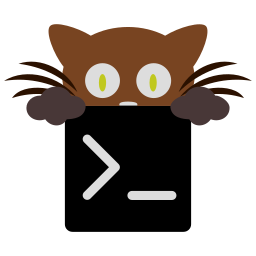
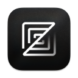

# PORTABLE DESKTOP

| [Back to Home](index.md) | [Back to Applications](apps.md)
| --- | --- |

#### Here are listed **90** desktop applications NOT in AppImage format. Launchers and icons are downloaded separately during the installation process (through [AM](https://github.com/ivan-hc/AM) and [AppMan](https://github.com/ivan-hc/AppMan)). Most of them already have [all the necessary requirements](https://github.com/ivan-hc/AppImage-tips) to be easily exported into AppImage packages... or they are waiting to be moved to another category (see "[AppImages on-the-fly](https://portable-linux-apps.github.io/appimage-on-the-fly.html)").

  <label for="app-search-input" style="font-weight: bold;">Search applications:</label>
  <input type="search" id="app-search-input" placeholder="Type a name or keyword..." autocomplete="off"
    style="width: 100%; max-width: 480px; padding: 0.5em 0.75em; margin-top: 0.25em; font-size: 1em; border: 1px solid #999; border-radius: 4px; box-sizing: border-box;">
  

#### *Categories*

  <a class="cat-pill" href="appimages.html">AppImages</a>
  •
  <a class="cat-pill" href="ai.html">ai</a>
  •
  <a class="cat-pill" href="am-utils.html">am-utils</a>
  •
  <a class="cat-pill" href="android.html">android</a>
  •
  <a class="cat-pill" href="appimage-on-the-fly.html">appimage-on-the-fly</a>
  •
  <a class="cat-pill" href="audio.html">audio</a>
  •
  <a class="cat-pill" href="comic.html">comic</a>
  •
  <a class="cat-pill" href="command-line.html">command-line</a>
  •
  <a class="cat-pill" href="communication.html">communication</a>
  •
  <a class="cat-pill" href="disk.html">disk</a>
  •
  <a class="cat-pill" href="education.html">education</a>
  •
  <a class="cat-pill" href="emulator.html">emulator</a>
  •
  <a class="cat-pill" href="file-manager.html">file-manager</a>
  •
  <a class="cat-pill" href="finance.html">finance</a>
  •
  <a class="cat-pill" href="game.html">game</a>
  •
  <a class="cat-pill" href="gnome.html">gnome</a>
  •
  <a class="cat-pill" href="graphic.html">graphic</a>
  •
  <a class="cat-pill" href="internet.html">internet</a>
  •
  <a class="cat-pill" href="kde.html">kde</a>
  •
  <a class="cat-pill" href="metapackages.html">metapackages</a>
  •
  <a class="cat-pill" href="office.html">office</a>
  •
  <a class="cat-pill" href="password.html">password</a>
  •
  <a class="cat-pill" href="portable.html">Portable</a>
  •
  <a class="cat-pill" href="portable-cli.html">portable-cli</a>
  •
  <a class="cat-pill cat-pill--all" href="portable-desktop.html">portable-desktop</a>
  •
  <a class="cat-pill" href="steam.html">steam</a>
  •
  <a class="cat-pill" href="system-monitor.html">system-monitor</a>
  •
  <a class="cat-pill" href="video.html">video</a>
  •
  <a class="cat-pill" href="virtual-machine.html">virtual-machine</a>
  •
  <a class="cat-pill" href="wallet.html">wallet</a>
  •
  <a class="cat-pill" href="web-app.html">web-app</a>
  •
  <a class="cat-pill" href="web-browser.html">web-browser</a>
  •
  <a class="cat-pill" href="wine.html">wine</a>
  •
  <a class="cat-pill" href="youtube.html">youtube</a>

-----------------

***NOTE, Installer scripts (blob/raw) are provided for reading only: do not run them manually! Use "[AM](https://github.com/ivan-hc/AM)" or "[AppMan](https://github.com/ivan-hc/AppMan)" instead.***

-----------------

| ICON | PACKAGE NAME | DESCRIPTION | INSTALLER |
| --- | --- | --- | --- |
|  | [***ab-download-manager***](apps/ab-download-manager.md) | *A Download Manager that speeds up your downloads.*..[ *read more* ](apps/ab-download-manager.md)*!* | [*blob*](https://github.com/ivan-hc/AM/blob/main/programs/x86_64/ab-download-manager) **/** [*raw*](https://raw.githubusercontent.com/ivan-hc/AM/main/programs/x86_64/ab-download-manager) |
|  | [***ambermoon.net***](apps/ambermoon.net.md) | *Ambermoon rewrite in C#.*..[ *read more* ](apps/ambermoon.net.md)*!* | [*blob*](https://github.com/ivan-hc/AM/blob/main/programs/x86_64/ambermoon.net) **/** [*raw*](https://raw.githubusercontent.com/ivan-hc/AM/main/programs/x86_64/ambermoon.net) |
|  | [***archisteamfarm***](apps/archisteamfarm.md) | *C# application with primary purpose of farming Steam cards from multiple accounts simultaneously.*..[ *read more* ](apps/archisteamfarm.md)*!* | [*blob*](https://github.com/ivan-hc/AM/blob/main/programs/x86_64/archisteamfarm) **/** [*raw*](https://raw.githubusercontent.com/ivan-hc/AM/main/programs/x86_64/archisteamfarm) |
|  | [***audiorelay***](apps/audiorelay.md) | *Stream audio between your devices. Turn your phone into a microphone or speakers for PC.*..[ *read more* ](apps/audiorelay.md)*!* | [*blob*](https://github.com/ivan-hc/AM/blob/main/programs/x86_64/audiorelay) **/** [*raw*](https://raw.githubusercontent.com/ivan-hc/AM/main/programs/x86_64/audiorelay) |
|  | [***ayandict***](apps/ayandict.md) | *Simple yet advanced multi-lingual cross-platform offline dictionary for desktop, using Qt and Go.*..[ *read more* ](apps/ayandict.md)*!* | [*blob*](https://github.com/ivan-hc/AM/blob/main/programs/x86_64/ayandict) **/** [*raw*](https://raw.githubusercontent.com/ivan-hc/AM/main/programs/x86_64/ayandict) |
|  | [***bloomee***](apps/bloomee.md) | *Music app designed to bring you ad-free tunes from various sources.*..[ *read more* ](apps/bloomee.md)*!* | [*blob*](https://github.com/ivan-hc/AM/blob/main/programs/x86_64/bloomee) **/** [*raw*](https://raw.githubusercontent.com/ivan-hc/AM/main/programs/x86_64/bloomee) |
|  | [***boilr***](apps/boilr.md) | *Synchronize games from other platforms into your Steam library.*..[ *read more* ](apps/boilr.md)*!* | [*blob*](https://github.com/ivan-hc/AM/blob/main/programs/x86_64/boilr) **/** [*raw*](https://raw.githubusercontent.com/ivan-hc/AM/main/programs/x86_64/boilr) |
|  | [***brisk***](apps/brisk.md) | *Ultra-fast, moden download manager for desktop.*..[ *read more* ](apps/brisk.md)*!* | [*blob*](https://github.com/ivan-hc/AM/blob/main/programs/x86_64/brisk) **/** [*raw*](https://raw.githubusercontent.com/ivan-hc/AM/main/programs/x86_64/brisk) |
|  | [***btop***](apps/btop.md) | *A command line utility to monitor system resources, like Htop.*..[ *read more* ](apps/btop.md)*!* | [*blob*](https://github.com/ivan-hc/AM/blob/main/programs/x86_64/btop) **/** [*raw*](https://raw.githubusercontent.com/ivan-hc/AM/main/programs/x86_64/btop) |
|  | [***cake-wallet***](apps/cake-wallet.md) | *Easily and safely store, send, receive, and exchange your cryptocurrency.*..[ *read more* ](apps/cake-wallet.md)*!* | [*blob*](https://github.com/ivan-hc/AM/blob/main/programs/x86_64/cake-wallet) **/** [*raw*](https://raw.githubusercontent.com/ivan-hc/AM/main/programs/x86_64/cake-wallet) |
|  | [***camelot***](apps/camelot.md) | *Camelot is cross-platform file manager written in C.*..[ *read more* ](apps/camelot.md)*!* | [*blob*](https://github.com/ivan-hc/AM/blob/main/programs/x86_64/camelot) **/** [*raw*](https://raw.githubusercontent.com/ivan-hc/AM/main/programs/x86_64/camelot) |
|  | [***catapult***](apps/catapult.md) | *A cross-platform launcher for Cataclysm DDA and BN.*..[ *read more* ](apps/catapult.md)*!* | [*blob*](https://github.com/ivan-hc/AM/blob/main/programs/x86_64/catapult) **/** [*raw*](https://raw.githubusercontent.com/ivan-hc/AM/main/programs/x86_64/catapult) |
|  | [***celeste64***](apps/celeste64.md) | *A game made by the Celeste developers.*..[ *read more* ](apps/celeste64.md)*!* | [*blob*](https://github.com/ivan-hc/AM/blob/main/programs/x86_64/celeste64) **/** [*raw*](https://raw.githubusercontent.com/ivan-hc/AM/main/programs/x86_64/celeste64) |
|  | [***chezmoi***](apps/chezmoi.md) | *Manage your dotfiles across multiple diverse machines, securely.*..[ *read more* ](apps/chezmoi.md)*!* | [*blob*](https://github.com/ivan-hc/AM/blob/main/programs/x86_64/chezmoi) **/** [*raw*](https://raw.githubusercontent.com/ivan-hc/AM/main/programs/x86_64/chezmoi) |
|  | [***clamtk***](apps/clamtk.md) | *An easy to use, light-weight, on-demand virus scanner for Linux systems*..[ *read more* ](apps/clamtk.md)*!* | [*blob*](https://github.com/ivan-hc/AM/blob/main/programs/x86_64/clamtk) **/** [*raw*](https://raw.githubusercontent.com/ivan-hc/AM/main/programs/x86_64/clamtk) |
|  | [***clifm***](apps/clifm.md) | *The shell-like, command line terminal file manager simple, fast, extensible, and lightweight as hell.*..[ *read more* ](apps/clifm.md)*!* | [*blob*](https://github.com/ivan-hc/AM/blob/main/programs/x86_64/clifm) **/** [*raw*](https://raw.githubusercontent.com/ivan-hc/AM/main/programs/x86_64/clifm) |
|  | [***code***](apps/code.md) | *Visual Studio, VSCode, Original Editor to build/debug web/cloud apps.*..[ *read more* ](apps/code.md)*!* | [*blob*](https://github.com/ivan-hc/AM/blob/main/programs/x86_64/code) **/** [*raw*](https://raw.githubusercontent.com/ivan-hc/AM/main/programs/x86_64/code) |
|  | [***cosmonium***](apps/cosmonium.md) | *3D astronomy and space exploration program.*..[ *read more* ](apps/cosmonium.md)*!* | [*blob*](https://github.com/ivan-hc/AM/blob/main/programs/x86_64/cosmonium) **/** [*raw*](https://raw.githubusercontent.com/ivan-hc/AM/main/programs/x86_64/cosmonium) |
|  | [***cudatext***](apps/cudatext.md) | *A cross-platform text editor, written in Object Pascal.*..[ *read more* ](apps/cudatext.md)*!* | [*blob*](https://github.com/ivan-hc/AM/blob/main/programs/x86_64/cudatext) **/** [*raw*](https://raw.githubusercontent.com/ivan-hc/AM/main/programs/x86_64/cudatext) |
|  | [***dissent***](apps/dissent.md) | *Tiny native Discord app.*..[ *read more* ](apps/dissent.md)*!* | [*blob*](https://github.com/ivan-hc/AM/blob/main/programs/x86_64/dissent) **/** [*raw*](https://raw.githubusercontent.com/ivan-hc/AM/main/programs/x86_64/dissent) |
|  | [***dl-desktop***](apps/dl-desktop.md) | *Desktop client for the Duolingo language learning application.*..[ *read more* ](apps/dl-desktop.md)*!* | [*blob*](https://github.com/ivan-hc/AM/blob/main/programs/x86_64/dl-desktop) **/** [*raw*](https://raw.githubusercontent.com/ivan-hc/AM/main/programs/x86_64/dl-desktop) |
|  | [***exodus***](apps/exodus.md) | *Send, receive & exchange cryptocurrency. Bitcoin wallet.*..[ *read more* ](apps/exodus.md)*!* | [*blob*](https://github.com/ivan-hc/AM/blob/main/programs/x86_64/exodus) **/** [*raw*](https://raw.githubusercontent.com/ivan-hc/AM/main/programs/x86_64/exodus) |
|  | [***ffdec***](apps/ffdec.md) | *JPEXS Free Flash Decompiler.*..[ *read more* ](apps/ffdec.md)*!* | [*blob*](https://github.com/ivan-hc/AM/blob/main/programs/x86_64/ffdec) **/** [*raw*](https://raw.githubusercontent.com/ivan-hc/AM/main/programs/x86_64/ffdec) |
|  | [***ffdec-nightly***](apps/ffdec-nightly.md) | *JPEXS Free Flash Decompiler.*..[ *read more* ](apps/ffdec-nightly.md)*!* | [*blob*](https://github.com/ivan-hc/AM/blob/main/programs/x86_64/ffdec-nightly) **/** [*raw*](https://raw.githubusercontent.com/ivan-hc/AM/main/programs/x86_64/ffdec-nightly) |
|  | [***filebrowser***](apps/filebrowser.md) | *Web File Browser.*..[ *read more* ](apps/filebrowser.md)*!* | [*blob*](https://github.com/ivan-hc/AM/blob/main/programs/x86_64/filebrowser) **/** [*raw*](https://raw.githubusercontent.com/ivan-hc/AM/main/programs/x86_64/filebrowser) |
|  | [***filebrowser-quantum***](apps/filebrowser-quantum.md) | *Web File Browser.*..[ *read more* ](apps/filebrowser-quantum.md)*!* | [*blob*](https://github.com/ivan-hc/AM/blob/main/programs/x86_64/filebrowser-quantum) **/** [*raw*](https://raw.githubusercontent.com/ivan-hc/AM/main/programs/x86_64/filebrowser-quantum) |
|  | [***firework***](apps/firework.md) | *Easiest way to turn web applications and sites into desktop applications.*..[ *read more* ](apps/firework.md)*!* | [*blob*](https://github.com/ivan-hc/AM/blob/main/programs/x86_64/firework) **/** [*raw*](https://raw.githubusercontent.com/ivan-hc/AM/main/programs/x86_64/firework) |
|  | [***flashpoint***](apps/flashpoint.md) | *Flashpoint Archive is a community effort to preserve games and animations from the web.*..[ *read more* ](apps/flashpoint.md)*!* | [*blob*](https://github.com/ivan-hc/AM/blob/main/programs/x86_64/flashpoint) **/** [*raw*](https://raw.githubusercontent.com/ivan-hc/AM/main/programs/x86_64/flashpoint) |
|  | [***flow***](apps/flow.md) | *a programmer's text editor.*..[ *read more* ](apps/flow.md)*!* | [*blob*](https://github.com/ivan-hc/AM/blob/main/programs/x86_64/flow) **/** [*raw*](https://raw.githubusercontent.com/ivan-hc/AM/main/programs/x86_64/flow) |
|  | [***fluffychat***](apps/fluffychat.md) | *The cutest instant messenger in the matrix.*..[ *read more* ](apps/fluffychat.md)*!* | [*blob*](https://github.com/ivan-hc/AM/blob/main/programs/x86_64/fluffychat) **/** [*raw*](https://raw.githubusercontent.com/ivan-hc/AM/main/programs/x86_64/fluffychat) |
|  | [***forkgram***](apps/forkgram.md) | *Fork of Telegram Desktop messaging app.*..[ *read more* ](apps/forkgram.md)*!* | [*blob*](https://github.com/ivan-hc/AM/blob/main/programs/x86_64/forkgram) **/** [*raw*](https://raw.githubusercontent.com/ivan-hc/AM/main/programs/x86_64/forkgram) |
|  | [***funkin***](apps/funkin.md) | *A rhythm game made with HaxeFlixel*..[ *read more* ](apps/funkin.md)*!* | [*blob*](https://github.com/ivan-hc/AM/blob/main/programs/x86_64/funkin) **/** [*raw*](https://raw.githubusercontent.com/ivan-hc/AM/main/programs/x86_64/funkin) |
|  | [***funkin-legacy***](apps/funkin-legacy.md) | *Legacy GLibC Linux support for Friday Night Funkin. A rhythm game made with HaxeFlixel.*..[ *read more* ](apps/funkin-legacy.md)*!* | [*blob*](https://github.com/ivan-hc/AM/blob/main/programs/x86_64/funkin-legacy) **/** [*raw*](https://raw.githubusercontent.com/ivan-hc/AM/main/programs/x86_64/funkin-legacy) |
|  | [***fynodoro***](apps/fynodoro.md) | *Fynodoro, the Pomodoro Widget.*..[ *read more* ](apps/fynodoro.md)*!* | [*blob*](https://github.com/ivan-hc/AM/blob/main/programs/x86_64/fynodoro) **/** [*raw*](https://raw.githubusercontent.com/ivan-hc/AM/main/programs/x86_64/fynodoro) |
|  | [***gameimage***](apps/gameimage.md) | *Pack a runner/emulator/game and it's configs in a single AppImage.*..[ *read more* ](apps/gameimage.md)*!* | [*blob*](https://github.com/ivan-hc/AM/blob/main/programs/x86_64/gameimage) **/** [*raw*](https://raw.githubusercontent.com/ivan-hc/AM/main/programs/x86_64/gameimage) |
|  | [***ghidra***](apps/ghidra.md) | *Ghidra is a software reverse engineering (SRE) framework.*..[ *read more* ](apps/ghidra.md)*!* | [*blob*](https://github.com/ivan-hc/AM/blob/main/programs/x86_64/ghidra) **/** [*raw*](https://raw.githubusercontent.com/ivan-hc/AM/main/programs/x86_64/ghidra) |
|  | [***go-pd-gui***](apps/go-pd-gui.md) | *DRAINY is a free easy to use cross plattform upload tool for pixeldrain.com.*..[ *read more* ](apps/go-pd-gui.md)*!* | [*blob*](https://github.com/ivan-hc/AM/blob/main/programs/x86_64/go-pd-gui) **/** [*raw*](https://raw.githubusercontent.com/ivan-hc/AM/main/programs/x86_64/go-pd-gui) |
|  | [***goland***](apps/goland.md) | *Capable and Ergonomic Go IDE.*..[ *read more* ](apps/goland.md)*!* | [*blob*](https://github.com/ivan-hc/AM/blob/main/programs/x86_64/goland) **/** [*raw*](https://raw.githubusercontent.com/ivan-hc/AM/main/programs/x86_64/goland) |
|  | [***harmonoid***](apps/harmonoid.md) | *Plays & manages your music library. Looks beautiful & juicy. Playlists, visuals, synced lyrics, pitch shift, volume boost & more.*..[ *read more* ](apps/harmonoid.md)*!* | [*blob*](https://github.com/ivan-hc/AM/blob/main/programs/x86_64/harmonoid) **/** [*raw*](https://raw.githubusercontent.com/ivan-hc/AM/main/programs/x86_64/harmonoid) |
|  | [***henson***](apps/henson.md) | *A puppet manager for NationStates.*..[ *read more* ](apps/henson.md)*!* | [*blob*](https://github.com/ivan-hc/AM/blob/main/programs/x86_64/henson) **/** [*raw*](https://raw.githubusercontent.com/ivan-hc/AM/main/programs/x86_64/henson) |
|  | [***himalaya***](apps/himalaya.md) | *CLI to manage emails.*..[ *read more* ](apps/himalaya.md)*!* | [*blob*](https://github.com/ivan-hc/AM/blob/main/programs/x86_64/himalaya) **/** [*raw*](https://raw.githubusercontent.com/ivan-hc/AM/main/programs/x86_64/himalaya) |
|  | [***hmcl***](apps/hmcl.md) | *A Minecraft Launcher which is multi-functional, cross-platform and popular.*..[ *read more* ](apps/hmcl.md)*!* | [*blob*](https://github.com/ivan-hc/AM/blob/main/programs/x86_64/hmcl) **/** [*raw*](https://raw.githubusercontent.com/ivan-hc/AM/main/programs/x86_64/hmcl) |
|  | [***ironwail***](apps/ironwail.md) | *High-performance QuakeSpasm fork QuakeSpasm. A modern, cross-platform Quake game engine based on FitzQuake.*..[ *read more* ](apps/ironwail.md)*!* | [*blob*](https://github.com/ivan-hc/AM/blob/main/programs/x86_64/ironwail) **/** [*raw*](https://raw.githubusercontent.com/ivan-hc/AM/main/programs/x86_64/ironwail) |
|  | [***jabref***](apps/jabref.md) | *Graphical Java application for managing BibTeX and biblatex (.bib) databases.*..[ *read more* ](apps/jabref.md)*!* | [*blob*](https://github.com/ivan-hc/AM/blob/main/programs/x86_64/jabref) **/** [*raw*](https://raw.githubusercontent.com/ivan-hc/AM/main/programs/x86_64/jabref) |
|  | [***jellyfin***](apps/jellyfin.md) | *Media player. Stream to any device from your own server.*..[ *read more* ](apps/jellyfin.md)*!* | [*blob*](https://github.com/ivan-hc/AM/blob/main/programs/x86_64/jellyfin) **/** [*raw*](https://raw.githubusercontent.com/ivan-hc/AM/main/programs/x86_64/jellyfin) |
|  | [***jgrasp***](apps/jgrasp.md) | *An IDE with Visualizations for Improving Software Comprehensibility.*..[ *read more* ](apps/jgrasp.md)*!* | [*blob*](https://github.com/ivan-hc/AM/blob/main/programs/x86_64/jgrasp) **/** [*raw*](https://raw.githubusercontent.com/ivan-hc/AM/main/programs/x86_64/jgrasp) |
|  | [***kitty***](apps/kitty.md) | *Cross-platform, fast, feature-rich, GPU based terminal (also provides "kitten" CLI utility).*..[ *read more* ](apps/kitty.md)*!* | [*blob*](https://github.com/ivan-hc/AM/blob/main/programs/x86_64/kitty) **/** [*raw*](https://raw.githubusercontent.com/ivan-hc/AM/main/programs/x86_64/kitty) |
|  | [***lichtblick***](apps/lichtblick.md) | *Lichtblick is an integrated visualization and diagnosis tool for robotics, available in your browser or as a desktop app on Linux, Windows, and macOS.*..[ *read more* ](apps/lichtblick.md)*!* | [*blob*](https://github.com/ivan-hc/AM/blob/main/programs/x86_64/lichtblick) **/** [*raw*](https://raw.githubusercontent.com/ivan-hc/AM/main/programs/x86_64/lichtblick) |
|  | [***lockbook-desktop***](apps/lockbook-desktop.md) | *The private, polished note-taking platform.*..[ *read more* ](apps/lockbook-desktop.md)*!* | [*blob*](https://github.com/ivan-hc/AM/blob/main/programs/x86_64/lockbook-desktop) **/** [*raw*](https://raw.githubusercontent.com/ivan-hc/AM/main/programs/x86_64/lockbook-desktop) |
|  | [***melonds***](apps/melonds.md) | *DS emulator, sorta.*..[ *read more* ](apps/melonds.md)*!* | [*blob*](https://github.com/ivan-hc/AM/blob/main/programs/x86_64/melonds) **/** [*raw*](https://raw.githubusercontent.com/ivan-hc/AM/main/programs/x86_64/melonds) |
|  | [***mercury***](apps/mercury.md) | *Firefox fork with compiler optimizations and patches from Librewolf.*..[ *read more* ](apps/mercury.md)*!* | [*blob*](https://github.com/ivan-hc/AM/blob/main/programs/x86_64/mercury) **/** [*raw*](https://raw.githubusercontent.com/ivan-hc/AM/main/programs/x86_64/mercury) |
|  | [***minecraft-launcher***](apps/minecraft-launcher.md) | *Game downloader and launcher for Minecraft.*..[ *read more* ](apps/minecraft-launcher.md)*!* | [*blob*](https://github.com/ivan-hc/AM/blob/main/programs/x86_64/minecraft-launcher) **/** [*raw*](https://raw.githubusercontent.com/ivan-hc/AM/main/programs/x86_64/minecraft-launcher) |
|  | [***naruto-arena***](apps/naruto-arena.md) | *Naruto-based online multiplayer strategy game.*..[ *read more* ](apps/naruto-arena.md)*!* | [*blob*](https://github.com/ivan-hc/AM/blob/main/programs/x86_64/naruto-arena) **/** [*raw*](https://raw.githubusercontent.com/ivan-hc/AM/main/programs/x86_64/naruto-arena) |
|  | [***ncspot***](apps/ncspot.md) | *Cross-platform ncurses Spotify client written in Rust, inspired by ncmpc and the likes.*..[ *read more* ](apps/ncspot.md)*!* | [*blob*](https://github.com/ivan-hc/AM/blob/main/programs/x86_64/ncspot) **/** [*raw*](https://raw.githubusercontent.com/ivan-hc/AM/main/programs/x86_64/ncspot) |
|  | [***ntfydesktop***](apps/ntfydesktop.md) | *A desktop client for ntfy. Allows you to subscribe to topics from any ntfy server and recieve notifications natively on the desktop.*..[ *read more* ](apps/ntfydesktop.md)*!* | [*blob*](https://github.com/ivan-hc/AM/blob/main/programs/x86_64/ntfydesktop) **/** [*raw*](https://raw.githubusercontent.com/ivan-hc/AM/main/programs/x86_64/ntfydesktop) |
|  | [***nyrna***](apps/nyrna.md) | *Suspend games and applications.*..[ *read more* ](apps/nyrna.md)*!* | [*blob*](https://github.com/ivan-hc/AM/blob/main/programs/x86_64/nyrna) **/** [*raw*](https://raw.githubusercontent.com/ivan-hc/AM/main/programs/x86_64/nyrna) |
|  | [***onionmediax***](apps/onionmediax.md) | *OnionMedia X. Convert and download videos and music quickly and easily.*..[ *read more* ](apps/onionmediax.md)*!* | [*blob*](https://github.com/ivan-hc/AM/blob/main/programs/x86_64/onionmediax) **/** [*raw*](https://raw.githubusercontent.com/ivan-hc/AM/main/programs/x86_64/onionmediax) |
|  | [***openarena***](apps/openarena.md) | *Violent & sexy, multiplayer first person shooter game, ioquake3.*..[ *read more* ](apps/openarena.md)*!* | [*blob*](https://github.com/ivan-hc/AM/blob/main/programs/x86_64/openarena) **/** [*raw*](https://raw.githubusercontent.com/ivan-hc/AM/main/programs/x86_64/openarena) |
|  | [***openmw***](apps/openmw.md) | *OpenMW is an open-source open-world RPG game engine that supports playing Morrowind.*..[ *read more* ](apps/openmw.md)*!* | [*blob*](https://github.com/ivan-hc/AM/blob/main/programs/x86_64/openmw) **/** [*raw*](https://raw.githubusercontent.com/ivan-hc/AM/main/programs/x86_64/openmw) |
|  | [***pdfcrackgui***](apps/pdfcrackgui.md) | *GUI overlay for the popular and highly regarded pdfcrack.*..[ *read more* ](apps/pdfcrackgui.md)*!* | [*blob*](https://github.com/ivan-hc/AM/blob/main/programs/x86_64/pdfcrackgui) **/** [*raw*](https://raw.githubusercontent.com/ivan-hc/AM/main/programs/x86_64/pdfcrackgui) |
|  | [***photocrea***](apps/photocrea.md) | *Unofficial Photopea wrapper, image editor that includes all the familiar features like layers, filters, magic wand selection, etc.*..[ *read more* ](apps/photocrea.md)*!* | [*blob*](https://github.com/ivan-hc/AM/blob/main/programs/x86_64/photocrea) **/** [*raw*](https://raw.githubusercontent.com/ivan-hc/AM/main/programs/x86_64/photocrea) |
|  | [***photon***](apps/photon.md) | *Cross-platform file-transfer application built using flutter. It uses http to transfer files between devices.*..[ *read more* ](apps/photon.md)*!* | [*blob*](https://github.com/ivan-hc/AM/blob/main/programs/x86_64/photon) **/** [*raw*](https://raw.githubusercontent.com/ivan-hc/AM/main/programs/x86_64/photon) |
|  | [***picocrypt-ng***](apps/picocrypt-ng.md) | *A very small, very simple, yet very secure encryption tool.*..[ *read more* ](apps/picocrypt-ng.md)*!* | [*blob*](https://github.com/ivan-hc/AM/blob/main/programs/x86_64/picocrypt-ng) **/** [*raw*](https://raw.githubusercontent.com/ivan-hc/AM/main/programs/x86_64/picocrypt-ng) |
|  | [***pinta-dev***](apps/pinta-dev.md) | *Simple GTK Paint Program (developer edition).*..[ *read more* ](apps/pinta-dev.md)*!* | [*blob*](https://github.com/ivan-hc/AM/blob/main/programs/x86_64/pinta-dev) **/** [*raw*](https://raw.githubusercontent.com/ivan-hc/AM/main/programs/x86_64/pinta-dev) |
|  | [***pixelorama***](apps/pixelorama.md) | *A powerful and accessible open-source pixel art multitool. Whether you want to create sprites, tiles, animations, or just express yourself in the language of pixel art.*..[ *read more* ](apps/pixelorama.md)*!* | [*blob*](https://github.com/ivan-hc/AM/blob/main/programs/x86_64/pixelorama) **/** [*raw*](https://raw.githubusercontent.com/ivan-hc/AM/main/programs/x86_64/pixelorama) |
|  | [***pizarra***](apps/pizarra.md) | *A digital, vectorial and infinite chalkboard.*..[ *read more* ](apps/pizarra.md)*!* | [*blob*](https://github.com/ivan-hc/AM/blob/main/programs/x86_64/pizarra) **/** [*raw*](https://raw.githubusercontent.com/ivan-hc/AM/main/programs/x86_64/pizarra) |
|  | [***playit***](apps/playit.md) | *Want to run an online game server? playit.gg is a global proxy that allows anyone to host a server without port forwarding.*..[ *read more* ](apps/playit.md)*!* | [*blob*](https://github.com/ivan-hc/AM/blob/main/programs/x86_64/playit) **/** [*raw*](https://raw.githubusercontent.com/ivan-hc/AM/main/programs/x86_64/playit) |
|  | [***prismlauncher-qt5***](apps/prismlauncher-qt5.md) | *Launcher for Minecraft, manage multiple installations (Qt5 version).*..[ *read more* ](apps/prismlauncher-qt5.md)*!* | [*blob*](https://github.com/ivan-hc/AM/blob/main/programs/x86_64/prismlauncher-qt5) **/** [*raw*](https://raw.githubusercontent.com/ivan-hc/AM/main/programs/x86_64/prismlauncher-qt5) |
|  | [***reaper***](apps/reaper.md) | *A complete digital audio production app, offering a full multitrack audio and MIDI recording, editing, processing, mixing and mastering toolset.*..[ *read more* ](apps/reaper.md)*!* | [*blob*](https://github.com/ivan-hc/AM/blob/main/programs/x86_64/reaper) **/** [*raw*](https://raw.githubusercontent.com/ivan-hc/AM/main/programs/x86_64/reaper) |
|  | [***rebaslight***](apps/rebaslight.md) | *An easy to use special effects video editor.*..[ *read more* ](apps/rebaslight.md)*!* | [*blob*](https://github.com/ivan-hc/AM/blob/main/programs/x86_64/rebaslight) **/** [*raw*](https://raw.githubusercontent.com/ivan-hc/AM/main/programs/x86_64/rebaslight) |
|  | [***sfp***](apps/sfp.md) | *This utility is designed to allow you to apply skins to the modern Steam client.*..[ *read more* ](apps/sfp.md)*!* | [*blob*](https://github.com/ivan-hc/AM/blob/main/programs/x86_64/sfp) **/** [*raw*](https://raw.githubusercontent.com/ivan-hc/AM/main/programs/x86_64/sfp) |
|  | [***skyemu***](apps/skyemu.md) | *Game Boy Advance, Game Boy, Game Boy Color, and DS Emulator.*..[ *read more* ](apps/skyemu.md)*!* | [*blob*](https://github.com/ivan-hc/AM/blob/main/programs/x86_64/skyemu) **/** [*raw*](https://raw.githubusercontent.com/ivan-hc/AM/main/programs/x86_64/skyemu) |
|  | [***soul-arena***](apps/soul-arena.md) | *Bleach-based online multiplayer strategy game.*..[ *read more* ](apps/soul-arena.md)*!* | [*blob*](https://github.com/ivan-hc/AM/blob/main/programs/x86_64/soul-arena) **/** [*raw*](https://raw.githubusercontent.com/ivan-hc/AM/main/programs/x86_64/soul-arena) |
|  | [***spritemate4electron***](apps/spritemate4electron.md) | *A simple Electron-wrapper for Esshahn's awesome Spritemate-webapp.*..[ *read more* ](apps/spritemate4electron.md)*!* | [*blob*](https://github.com/ivan-hc/AM/blob/main/programs/x86_64/spritemate4electron) **/** [*raw*](https://raw.githubusercontent.com/ivan-hc/AM/main/programs/x86_64/spritemate4electron) |
|  | [***sweethome3d***](apps/sweethome3d.md) | *An interior design app to draw house plans & arrange furniture.*..[ *read more* ](apps/sweethome3d.md)*!* | [*blob*](https://github.com/ivan-hc/AM/blob/main/programs/x86_64/sweethome3d) **/** [*raw*](https://raw.githubusercontent.com/ivan-hc/AM/main/programs/x86_64/sweethome3d) |
|  | [***teamviewer***](apps/teamviewer.md) | *Deliver remote IT support to your customers and colleagues, anytime, anywhere. Communication, network.*..[ *read more* ](apps/teamviewer.md)*!* | [*blob*](https://github.com/ivan-hc/AM/blob/main/programs/x86_64/teamviewer) **/** [*raw*](https://raw.githubusercontent.com/ivan-hc/AM/main/programs/x86_64/teamviewer) |
|  | [***teamviewer-host***](apps/teamviewer-host.md) | *Host utility for TeamViewer, if you want to set up unattended access to a device.*..[ *read more* ](apps/teamviewer-host.md)*!* | [*blob*](https://github.com/ivan-hc/AM/blob/main/programs/x86_64/teamviewer-host) **/** [*raw*](https://raw.githubusercontent.com/ivan-hc/AM/main/programs/x86_64/teamviewer-host) |
|  | [***teamviewer-qs***](apps/teamviewer-qs.md) | *QuickSupport utility for TeamViewer, if you want to receive support.*..[ *read more* ](apps/teamviewer-qs.md)*!* | [*blob*](https://github.com/ivan-hc/AM/blob/main/programs/x86_64/teamviewer-qs) **/** [*raw*](https://raw.githubusercontent.com/ivan-hc/AM/main/programs/x86_64/teamviewer-qs) |
|  | [***tor-browser***](apps/tor-browser.md) | *Privacy-oriented Web Browser for sites blocked in your country.*..[ *read more* ](apps/tor-browser.md)*!* | [*blob*](https://github.com/ivan-hc/AM/blob/main/programs/x86_64/tor-browser) **/** [*raw*](https://raw.githubusercontent.com/ivan-hc/AM/main/programs/x86_64/tor-browser) |
|  | [***tor-browser-alpha***](apps/tor-browser-alpha.md) | *Privacy-oriented Web Browser for sites blocked in your country.*..[ *read more* ](apps/tor-browser-alpha.md)*!* | [*blob*](https://github.com/ivan-hc/AM/blob/main/programs/x86_64/tor-browser-alpha) **/** [*raw*](https://raw.githubusercontent.com/ivan-hc/AM/main/programs/x86_64/tor-browser-alpha) |
|  | [***trilium***](apps/trilium.md) | *Build your personal knowledge base with Trilium Notes.*..[ *read more* ](apps/trilium.md)*!* | [*blob*](https://github.com/ivan-hc/AM/blob/main/programs/x86_64/trilium) **/** [*raw*](https://raw.githubusercontent.com/ivan-hc/AM/main/programs/x86_64/trilium) |
|  | [***unetbootin***](apps/unetbootin.md) | *Install Linux/BSD distributions to a partition or USB drive.*..[ *read more* ](apps/unetbootin.md)*!* | [*blob*](https://github.com/ivan-hc/AM/blob/main/programs/x86_64/unetbootin) **/** [*raw*](https://raw.githubusercontent.com/ivan-hc/AM/main/programs/x86_64/unetbootin) |
|  | [***ventoy***](apps/ventoy.md) | *Tool to create bootable USB drive for ISO/WIM/IMG/VHDx/EFI files.*..[ *read more* ](apps/ventoy.md)*!* | [*blob*](https://github.com/ivan-hc/AM/blob/main/programs/x86_64/ventoy) **/** [*raw*](https://raw.githubusercontent.com/ivan-hc/AM/main/programs/x86_64/ventoy) |
|  | [***via-desktop***](apps/via-desktop.md) | *VIA Desktop is an Electron application designed to provide an offline experience for VIA.*..[ *read more* ](apps/via-desktop.md)*!* | [*blob*](https://github.com/ivan-hc/AM/blob/main/programs/x86_64/via-desktop) **/** [*raw*](https://raw.githubusercontent.com/ivan-hc/AM/main/programs/x86_64/via-desktop) |
|  | [***walker***](apps/walker.md) | *Multi-Purpose Launcher with a lot of features. Highly Customizable and fast.*..[ *read more* ](apps/walker.md)*!* | [*blob*](https://github.com/ivan-hc/AM/blob/main/programs/x86_64/walker) **/** [*raw*](https://raw.githubusercontent.com/ivan-hc/AM/main/programs/x86_64/walker) |
|  | [***wireframesketcher***](apps/wireframesketcher.md) | *A wireframing tool that helps designers, developers and product managers. A desktop app and a plug-in for any Eclipse IDE.*..[ *read more* ](apps/wireframesketcher.md)*!* | [*blob*](https://github.com/ivan-hc/AM/blob/main/programs/x86_64/wireframesketcher) **/** [*raw*](https://raw.githubusercontent.com/ivan-hc/AM/main/programs/x86_64/wireframesketcher) |
|  | [***youtube-download***](apps/youtube-download.md) | *GUI and CLI for downloading YouTube video/audio.*..[ *read more* ](apps/youtube-download.md)*!* | [*blob*](https://github.com/ivan-hc/AM/blob/main/programs/x86_64/youtube-download) **/** [*raw*](https://raw.githubusercontent.com/ivan-hc/AM/main/programs/x86_64/youtube-download) |
|  | [***yt-dlg***](apps/yt-dlg.md) | *A front-end GUI of the popular youtube-dl written in wxPython.*..[ *read more* ](apps/yt-dlg.md)*!* | [*blob*](https://github.com/ivan-hc/AM/blob/main/programs/x86_64/yt-dlg) **/** [*raw*](https://raw.githubusercontent.com/ivan-hc/AM/main/programs/x86_64/yt-dlg) |
|  | [***zed***](apps/zed.md) | *High-performance, multiplayer code editor from the creators of Atom.*..[ *read more* ](apps/zed.md)*!* | [*blob*](https://github.com/ivan-hc/AM/blob/main/programs/x86_64/zed) **/** [*raw*](https://raw.githubusercontent.com/ivan-hc/AM/main/programs/x86_64/zed) |
|  | [***zotero***](apps/zotero.md) | *Collect, organize, cite, and share your research sources.*..[ *read more* ](apps/zotero.md)*!* | [*blob*](https://github.com/ivan-hc/AM/blob/main/programs/x86_64/zotero) **/** [*raw*](https://raw.githubusercontent.com/ivan-hc/AM/main/programs/x86_64/zotero) |

---

You can improve these pages via a [pull request](https://github.com/Portable-Linux-Apps/Portable-Linux-Apps.github.io/pulls) to this site's [GitHub repository](https://github.com/Portable-Linux-Apps/Portable-Linux-Apps.github.io), or report any problems related to the installation scripts in the '[issue](https://github.com/ivan-hc/AM/issues)' section of the main database, at [https://github.com/ivan-hc/AM](https://github.com/ivan-hc/AM).

***PORTABLE-LINUX-APPS.github.io is my gift to the Linux community and was made with love for GNU/Linux and the Open Source philosophy.***

---

| [Back to Home](index.md) | [Back to Applications](apps.md)
| --- | --- |

--------

# Contacts
- **Ivan-HC** *on* [**GitHub**](https://github.com/ivan-hc)
- **AM-Ivan** *on* [**Reddit**](https://www.reddit.com/u/am-ivan)

###### *You can support me and my work on [**ko-fi.com**](https://ko-fi.com/IvanAlexHC) and [**PayPal.me**](https://paypal.me/IvanAlexHC). Thank you!*

--------

*© 2020-present Ivan Alessandro Sala aka 'Ivan-HC'* - I'm here just for fun!

