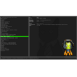

# STEAM

| [Back to Home](index.md) | [Back to Applications](apps.md)
| --- | --- |

#### Here are listed **16** programs and **0** items for this category and managed by [AM](https://github.com/ivan-hc/AM) 	and [AppMan](https://github.com/ivan-hc/AppMan) for the x86_64 architecture.

  <label for="app-search-input" style="font-weight: bold;">Search applications:</label>
  <input type="search" id="app-search-input" placeholder="Type a name or keyword..." autocomplete="off"
    style="width: 100%; max-width: 480px; padding: 0.5em 0.75em; margin-top: 0.25em; font-size: 1em; border: 1px solid #999; border-radius: 4px; box-sizing: border-box;">
  

#### *Categories:* ***[AppImages](appimages.md)*** - ***[am-utils](am-utils.md)*** - ***[android](android.md)*** - ***[audio](audio.md)*** - ***[comic](comic.md)*** - ***[command-line](command-line.md)*** - ***[communication](communication.md)*** - ***[disk](disk.md)*** - ***[education](education.md)*** - ***[file-manager](file-manager.md)*** - ***[finance](finance.md)*** - ***[game](game.md)*** - ***[gnome](gnome.md)*** - ***[graphic](graphic.md)*** - ***[internet](internet.md)*** - ***[kde](kde.md)*** - ***[office](office.md)*** - ***[password](password.md)*** - ***[steam](steam.md)*** - ***[system-monitor](system-monitor.md)*** - ***[video](video.md)*** - ***[web-app](web-app.md)*** - ***[web-browser](web-browser.md)*** - ***[wine](wine.md)***

-----------------

*NOTE, Installer scripts (blob/raw) are provided for reading only: do not run them manually! Use "AM" or "AppMan" instead.*

-----------------

| ICON | PACKAGE NAME | DESCRIPTION | INSTALLER |
| --- | --- | --- | --- |
|  | [***archisteamfarm***](apps/archisteamfarm.md) | *C# application with primary purpose of farming Steam cards from multiple accounts simultaneously.*..[ *read more* ](apps/archisteamfarm.md)*!* | [*blob*](https://github.com/ivan-hc/AM/blob/main/programs/x86_64/archisteamfarm) **/** [*raw*](https://raw.githubusercontent.com/ivan-hc/AM/main/programs/x86_64/archisteamfarm) |
|  | [***boilr***](apps/boilr.md) | *Synchronize games from other platforms into your Steam library.*..[ *read more* ](apps/boilr.md)*!* | [*blob*](https://github.com/ivan-hc/AM/blob/main/programs/x86_64/boilr) **/** [*raw*](https://raw.githubusercontent.com/ivan-hc/AM/main/programs/x86_64/boilr) |
|  | [***droidcam***](apps/droidcam.md) | *A DroidCam AppImage for the Steam Deck/SteamOS 3.0.*..[ *read more* ](apps/droidcam.md)*!* | [*blob*](https://github.com/ivan-hc/AM/blob/main/programs/x86_64/droidcam) **/** [*raw*](https://raw.githubusercontent.com/ivan-hc/AM/main/programs/x86_64/droidcam) |
|  | [***moondeck-buddy***](apps/moondeck-buddy.md) | *A server-side part of the MoonDeck plugin for the SteamDeck.*..[ *read more* ](apps/moondeck-buddy.md)*!* | [*blob*](https://github.com/ivan-hc/AM/blob/main/programs/x86_64/moondeck-buddy) **/** [*raw*](https://raw.githubusercontent.com/ivan-hc/AM/main/programs/x86_64/moondeck-buddy) |
|  | [***protonup-qt***](apps/protonup-qt.md) | *Manage Proton-GE/Luxtorpeda for Steam/Wine-GE for Lutris.*..[ *read more* ](apps/protonup-qt.md)*!* | [*blob*](https://github.com/ivan-hc/AM/blob/main/programs/x86_64/protonup-qt) **/** [*raw*](https://raw.githubusercontent.com/ivan-hc/AM/main/programs/x86_64/protonup-qt) |
|  | [***samira***](apps/samira.md) | *Steam achievement manager for Linux written with Tauri and Rust.*..[ *read more* ](apps/samira.md)*!* | [*blob*](https://github.com/ivan-hc/AM/blob/main/programs/x86_64/samira) **/** [*raw*](https://raw.githubusercontent.com/ivan-hc/AM/main/programs/x86_64/samira) |
|  | [***samrewritten***](apps/samrewritten.md) | *Steam Achievement Manager For Linux. Rewritten in C++.*..[ *read more* ](apps/samrewritten.md)*!* | [*blob*](https://github.com/ivan-hc/AM/blob/main/programs/x86_64/samrewritten) **/** [*raw*](https://raw.githubusercontent.com/ivan-hc/AM/main/programs/x86_64/samrewritten) |
|  | [***sc-controller***](apps/sc-controller.md) | *User-mode driver and GTK3 based GUI for Steam Controller.*..[ *read more* ](apps/sc-controller.md)*!* | [*blob*](https://github.com/ivan-hc/AM/blob/main/programs/x86_64/sc-controller) **/** [*raw*](https://raw.githubusercontent.com/ivan-hc/AM/main/programs/x86_64/sc-controller) |
|  | [***sfp***](apps/sfp.md) | *This utility is designed to allow you to apply skins to the modern Steam client.*..[ *read more* ](apps/sfp.md)*!* | [*blob*](https://github.com/ivan-hc/AM/blob/main/programs/x86_64/sfp) **/** [*raw*](https://raw.githubusercontent.com/ivan-hc/AM/main/programs/x86_64/sfp) |
|  | [***steam***](apps/steam.md) | *Unofficial. The ultimate destination for playing, discussing, and creating games.*..[ *read more* ](apps/steam.md)*!* | [*blob*](https://github.com/ivan-hc/AM/blob/main/programs/x86_64/steam) **/** [*raw*](https://raw.githubusercontent.com/ivan-hc/AM/main/programs/x86_64/steam) |
|  | [***steam-rom-manager***](apps/steam-rom-manager.md) | *An app for managing ROMs in Steam.*..[ *read more* ](apps/steam-rom-manager.md)*!* | [*blob*](https://github.com/ivan-hc/AM/blob/main/programs/x86_64/steam-rom-manager) **/** [*raw*](https://raw.githubusercontent.com/ivan-hc/AM/main/programs/x86_64/steam-rom-manager) |
|  | [***steam-tui***](apps/steam-tui.md) | *Rust TUI client for steamcmd.*..[ *read more* ](apps/steam-tui.md)*!* | [*blob*](https://github.com/ivan-hc/AM/blob/main/programs/x86_64/steam-tui) **/** [*raw*](https://raw.githubusercontent.com/ivan-hc/AM/main/programs/x86_64/steam-tui) |
|  | [***steamcad***](apps/steamcad.md) | *2D CAD especially designed to draw steam locomotives.*..[ *read more* ](apps/steamcad.md)*!* | [*blob*](https://github.com/ivan-hc/AM/blob/main/programs/x86_64/steamcad) **/** [*raw*](https://raw.githubusercontent.com/ivan-hc/AM/main/programs/x86_64/steamcad) |
|  | [***steamdepotdownloadergui***](apps/steamdepotdownloadergui.md) | *Easily download older versions of games from Steam.*..[ *read more* ](apps/steamdepotdownloadergui.md)*!* | [*blob*](https://github.com/ivan-hc/AM/blob/main/programs/x86_64/steamdepotdownloadergui) **/** [*raw*](https://raw.githubusercontent.com/ivan-hc/AM/main/programs/x86_64/steamdepotdownloadergui) |
|  | [***vapour***](apps/vapour.md) | *An alternative open source Steam client.*..[ *read more* ](apps/vapour.md)*!* | [*blob*](https://github.com/ivan-hc/AM/blob/main/programs/x86_64/vapour) **/** [*raw*](https://raw.githubusercontent.com/ivan-hc/AM/main/programs/x86_64/vapour) |
|  | [***wlx-overlay-s***](apps/wlx-overlay-s.md) | *Access your Wayland/X11 desktop from Monado/WiVRn/SteamVR.*..[ *read more* ](apps/wlx-overlay-s.md)*!* | [*blob*](https://github.com/ivan-hc/AM/blob/main/programs/x86_64/wlx-overlay-s) **/** [*raw*](https://raw.githubusercontent.com/ivan-hc/AM/main/programs/x86_64/wlx-overlay-s) |

---

You can improve these pages via a [pull request](https://github.com/Portable-Linux-Apps/Portable-Linux-Apps.github.io/pulls) 	to this site's [GitHub repository](https://github.com/Portable-Linux-Apps/Portable-Linux-Apps.github.io),  	or report any problems related to the installation scripts in the '[issue](https://github.com/ivan-hc/AM/issues)' 	section of the main database, at [https://github.com/ivan-hc/AM](https://github.com/ivan-hc/AM).

***PORTABLE-LINUX-APPS.github.io is my gift to the Linux community and was made with love for GNU/Linux and the Open Source philosophy.***

---

| [Back to Home](index.md) | [Back to Applications](apps.md)
| --- | --- |

--------

# Contacts
- **Ivan-HC** *on* [**GitHub**](https://github.com/ivan-hc)
- **AM-Ivan** *on* [**Reddit**](https://www.reddit.com/u/am-ivan)

###### *You can support me and my work on [**ko-fi.com**](https://ko-fi.com/IvanAlexHC) and 	[**PayPal.me**](https://paypal.me/IvanAlexHC). Thank you!*

--------

*© 2020-present Ivan Alessandro Sala aka 'Ivan-HC'* - I'm here just for fun!

