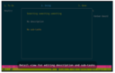

# SYSTEM-MONITOR

| [Home](index.md) |
| --- |

#### Here are listed **11** programs and **0** items for this category and managed by [AM](https://github.com/ivan-hc/AM) 	and [AppMan](https://github.com/ivan-hc/AppMan) for the x86_64 architecture.

*Use the search box at the top of the page to filter this category, or jump to another category using the tags below.*

| [Back to Applications](apps.md) |
| --- |

#### *Categories*

***[AppImages](appimages.md)*** 		 - ***[am-utils](am-utils.md)*** - ***[android](android.md)*** - ***[audio](audio.md)*** - ***[comic](comic.md)*** - ***[command-line](command-line.md)*** - ***[communication](communication.md)*** - ***[disk](disk.md)*** - ***[education](education.md)*** - ***[file-manager](file-manager.md)*** - ***[finance](finance.md)*** - ***[game](game.md)*** - ***[gnome](gnome.md)*** - ***[graphic](graphic.md)*** - ***[internet](internet.md)*** - ***[kde](kde.md)*** - ***[office](office.md)*** - ***[password](password.md)*** - ***[steam](steam.md)*** - ***[system-monitor](system-monitor.md)*** - ***[video](video.md)*** - ***[web-app](web-app.md)*** - ***[web-browser](web-browser.md)*** - ***[wine](wine.md)***

-----------------

*NOTE, the installer scripts in the "INSTALLER" column are intended for use via "AM", and are therefore dedicated to a system-wide 	installation of applications (in /opt), and all that "AppMan" does is convert those scripts for local installation, changing the paths. 	**They are listed here for reading purposes only**!*

*Should you decide to run them manually, the only way to remove the application is to run 	the command "`sudo /opt/appname/remove`", where "appname" is the name of the application directory containing the "remove" script. 	Likewise, you can also update applications by running the "AM-updater" script in the same directory.*

*The "AM" project allow the autonomy of installed apps, regardless of the presence of "AM" itself in the system. However, it is strongly 	recommended to use "AM" and "AppMan" to take full advantage of all the benefits you could get from an application installed in this way.*

*If you are here just to download apps manually, click on the program name and check the URL(s) on the application page. This site does not 	provide direct links, for security reasons, but it does provide the exact sources and references where you can find them!*

*Transparency and credibility are the focus of this catalog. Happy exploring!*

-----------------

| ICON | PACKAGE NAME | DESCRIPTION | INSTALLER |
| --- | --- | --- | --- |
|  | [***bottom***](apps/bottom.md) | *Yet another cross-platform graphical process/system monitor.*..[ *read more* ](apps/bottom.md)*!* | [*blob*](https://github.com/ivan-hc/AM/blob/main/programs/x86_64/bottom) **/** [*raw*](https://raw.githubusercontent.com/ivan-hc/AM/main/programs/x86_64/bottom) |
|  | [***btop***](apps/btop.md) | *A command line utility to monitor system resources, like Htop.*..[ *read more* ](apps/btop.md)*!* | [*blob*](https://github.com/ivan-hc/AM/blob/main/programs/x86_64/btop) **/** [*raw*](https://raw.githubusercontent.com/ivan-hc/AM/main/programs/x86_64/btop) |
|  | [***conky***](apps/conky.md) | *Light-weight system monitor for X.*..[ *read more* ](apps/conky.md)*!* | [*blob*](https://github.com/ivan-hc/AM/blob/main/programs/x86_64/conky) **/** [*raw*](https://raw.githubusercontent.com/ivan-hc/AM/main/programs/x86_64/conky) |
|  | [***corestats***](apps/corestats.md) | *A system resource viewer from the CoreApps family.*..[ *read more* ](apps/corestats.md)*!* | [*blob*](https://github.com/ivan-hc/AM/blob/main/programs/x86_64/corestats) **/** [*raw*](https://raw.githubusercontent.com/ivan-hc/AM/main/programs/x86_64/corestats) |
|  | [***coretime***](apps/coretime.md) | *A time related task manager for CuboCore Application Suite.*..[ *read more* ](apps/coretime.md)*!* | [*blob*](https://github.com/ivan-hc/AM/blob/main/programs/x86_64/coretime) **/** [*raw*](https://raw.githubusercontent.com/ivan-hc/AM/main/programs/x86_64/coretime) |
|  | [***gnome-system-monitor***](apps/gnome-system-monitor.md) | *Unofficial. View current processes and monitor system state.*..[ *read more* ](apps/gnome-system-monitor.md)*!* | [*blob*](https://github.com/ivan-hc/AM/blob/main/programs/x86_64/gnome-system-monitor) **/** [*raw*](https://raw.githubusercontent.com/ivan-hc/AM/main/programs/x86_64/gnome-system-monitor) |
|  | [***htop***](apps/htop.md) | *Unofficial, CLI utility to monitor system resources.*..[ *read more* ](apps/htop.md)*!* | [*blob*](https://github.com/ivan-hc/AM/blob/main/programs/x86_64/htop) **/** [*raw*](https://raw.githubusercontent.com/ivan-hc/AM/main/programs/x86_64/htop) |
|  | [***lxtask***](apps/lxtask.md) | *Unofficial. A lightweight and desktop-independent task manager.*..[ *read more* ](apps/lxtask.md)*!* | [*blob*](https://github.com/ivan-hc/AM/blob/main/programs/x86_64/lxtask) **/** [*raw*](https://raw.githubusercontent.com/ivan-hc/AM/main/programs/x86_64/lxtask) |
|  | [***mate-system-monitor***](apps/mate-system-monitor.md) | *Unofficial, Process viewer and system resource monitor, from MATE.*..[ *read more* ](apps/mate-system-monitor.md)*!* | [*blob*](https://github.com/ivan-hc/AM/blob/main/programs/x86_64/mate-system-monitor) **/** [*raw*](https://raw.githubusercontent.com/ivan-hc/AM/main/programs/x86_64/mate-system-monitor) |
|  | [***system-monitoring-center***](apps/system-monitoring-center.md) | *Unofficial. Multi-featured system monitor.*..[ *read more* ](apps/system-monitoring-center.md)*!* | [*blob*](https://github.com/ivan-hc/AM/blob/main/programs/x86_64/system-monitoring-center) **/** [*raw*](https://raw.githubusercontent.com/ivan-hc/AM/main/programs/x86_64/system-monitoring-center) |
|  | [***taskell***](apps/taskell.md) | *Command-line Kanban board/task manager with support for Trello boards and GitHub projects.*..[ *read more* ](apps/taskell.md)*!* | [*blob*](https://github.com/ivan-hc/AM/blob/main/programs/x86_64/taskell) **/** [*raw*](https://raw.githubusercontent.com/ivan-hc/AM/main/programs/x86_64/taskell) |
