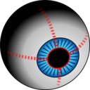
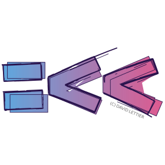
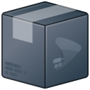
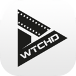

# VIDEO

| [Back to Home](index.md) | [Back to Applications](apps.md)
| --- | --- |

#### Here are listed **161** programs for this category.

  <label for="app-search-input" style="font-weight: bold;">Search applications:</label>
  <input type="search" id="app-search-input" placeholder="Type a name or keyword..." autocomplete="off"
    style="width: 100%; max-width: 480px; padding: 0.5em 0.75em; margin-top: 0.25em; font-size: 1em; border: 1px solid #999; border-radius: 4px; box-sizing: border-box;">
  <select id="app-search-arch" aria-label="Filter by architecture"
    style="margin-top: 0.25em; padding: 0.5em; font-size: 1em; border: 1px solid #999; border-radius: 4px;">
    <option value="">Any architecture</option>
    <option value="x86_64">x86_64</option>
    <option value="aarch64">aarch64</option>
    <option value="i686">i686</option>
  </select>
  

#### *Categories*

  <a class="cat-pill" href="appimages.html">AppImages</a>
  •
  <a class="cat-pill" href="ai.html">ai</a>
  •
  <a class="cat-pill" href="am-utils.html">am-utils</a>
  •
  <a class="cat-pill" href="android.html">android</a>
  •
  <a class="cat-pill" href="appimage-on-the-fly.html">appimage-on-the-fly</a>
  •
  <a class="cat-pill" href="audio.html">audio</a>
  •
  <a class="cat-pill" href="comic.html">comic</a>
  •
  <a class="cat-pill" href="command-line.html">command-line</a>
  •
  <a class="cat-pill" href="communication.html">communication</a>
  •
  <a class="cat-pill" href="disk.html">disk</a>
  •
  <a class="cat-pill" href="education.html">education</a>
  •
  <a class="cat-pill" href="emulator.html">emulator</a>
  •
  <a class="cat-pill" href="file-manager.html">file-manager</a>
  •
  <a class="cat-pill" href="finance.html">finance</a>
  •
  <a class="cat-pill" href="game.html">game</a>
  •
  <a class="cat-pill" href="gnome.html">gnome</a>
  •
  <a class="cat-pill" href="graphic.html">graphic</a>
  •
  <a class="cat-pill" href="internet.html">internet</a>
  •
  <a class="cat-pill" href="kde.html">kde</a>
  •
  <a class="cat-pill" href="metapackages.html">metapackages</a>
  •
  <a class="cat-pill" href="office.html">office</a>
  •
  <a class="cat-pill" href="password.html">password</a>
  •
  <a class="cat-pill" href="portable.html">Portable</a>
  •
  <a class="cat-pill" href="portable-cli.html">portable-cli</a>
  •
  <a class="cat-pill" href="portable-desktop.html">portable-desktop</a>
  •
  <a class="cat-pill" href="steam.html">steam</a>
  •
  <a class="cat-pill" href="system-monitor.html">system-monitor</a>
  •
  <a class="cat-pill cat-pill--all" href="video.html">video</a>
  •
  <a class="cat-pill" href="virtual-machine.html">virtual-machine</a>
  •
  <a class="cat-pill" href="wallet.html">wallet</a>
  •
  <a class="cat-pill" href="web-app.html">web-app</a>
  •
  <a class="cat-pill" href="web-browser.html">web-browser</a>
  •
  <a class="cat-pill" href="wine.html">wine</a>
  •
  <a class="cat-pill" href="youtube.html">youtube</a>

-----------------

***NOTE, Installer scripts (blob/raw) are provided for reading only: do not run them manually! Use "[AM](https://github.com/ivan-hc/AM)" or "[AppMan](https://github.com/ivan-hc/AppMan)" instead.***

-----------------

| ICON | PACKAGE NAME | DESCRIPTION | INSTALLER |
| --- | --- | --- | --- |
|  | [***acestream***](apps/acestream.md) | *Створення бінарника AppImage з AceStream Media.*..[ *read more* ](apps/acestream.md)*!* | [*blob*](https://github.com/ivan-hc/AM/blob/main/programs/x86_64/acestream) **/** [*raw*](https://raw.githubusercontent.com/ivan-hc/AM/main/programs/x86_64/acestream) |
|  | [***adobe-flash-player***](apps/adobe-flash-player.md) | *Unofficial port. Adobe Flash is a mostly discontinued multimedia software platform used for production of animations, rich internet applications, desktop applications, mobile apps, mobile games, and embedded web browser video players. Over 67 billion devices use adobe flash player!*..[ *read more* ](apps/adobe-flash-player.md)*!* | [*blob*](https://github.com/ivan-hc/AM/blob/main/programs/x86_64/adobe-flash-player) **/** [*raw*](https://raw.githubusercontent.com/ivan-hc/AM/main/programs/x86_64/adobe-flash-player) |
|  | [***akuse***](apps/akuse.md) | *Simple and easy to use anime streaming desktop app without ads.*..[ *read more* ](apps/akuse.md)*!* | [*blob*](https://github.com/ivan-hc/AM/blob/main/programs/x86_64/akuse) **/** [*raw*](https://raw.githubusercontent.com/ivan-hc/AM/main/programs/x86_64/akuse) |
|  | [***alvr***](apps/alvr.md) | *Stream VR games from your PC to your headset via Wi-Fi.*..[ *read more* ](apps/alvr.md)*!* | [*blob*](https://github.com/ivan-hc/AM/blob/main/programs/x86_64/alvr) **/** [*raw*](https://raw.githubusercontent.com/ivan-hc/AM/main/programs/x86_64/alvr) |
|  | [***animos***](apps/animos.md) | *Anime-streaming desktop application without any ads.*..[ *read more* ](apps/animos.md)*!* | [*blob*](https://github.com/ivan-hc/AM/blob/main/programs/x86_64/animos) **/** [*raw*](https://raw.githubusercontent.com/ivan-hc/AM/main/programs/x86_64/animos) |
|  | [***arcdlp***](apps/arcdlp.md) | *Open-source desktop video downloader powered by yt-dlp and electron. Download videos and audio from YouTube, Vimeo, Twitter, and thousands of sites.*..[ *read more* ](apps/arcdlp.md)*!* | [*blob*](https://github.com/ivan-hc/AM/blob/main/programs/x86_64/arcdlp) **/** [*raw*](https://raw.githubusercontent.com/ivan-hc/AM/main/programs/x86_64/arcdlp) |
|  | [***audiorelay***](apps/audiorelay.md) | *Stream audio between your devices. Turn your phone into a microphone or speakers for PC.*..[ *read more* ](apps/audiorelay.md)*!* | [*blob*](https://github.com/ivan-hc/AM/blob/main/programs/x86_64/audiorelay) **/** [*raw*](https://raw.githubusercontent.com/ivan-hc/AM/main/programs/x86_64/audiorelay) |
|  | [***avidemux***](apps/avidemux.md) | *Multiplatform Video Editor.*..[ *read more* ](apps/avidemux.md)*!* | [*blob*](https://github.com/ivan-hc/AM/blob/main/programs/x86_64/avidemux) **/** [*raw*](https://raw.githubusercontent.com/ivan-hc/AM/main/programs/x86_64/avidemux) |
|  | [***avidemux-qt***](apps/avidemux-qt.md) | *Unofficial, my custom Avidemux Video Editor built to use system themes.*..[ *read more* ](apps/avidemux-qt.md)*!* | [*blob*](https://github.com/ivan-hc/AM/blob/main/programs/x86_64/avidemux-qt) **/** [*raw*](https://raw.githubusercontent.com/ivan-hc/AM/main/programs/x86_64/avidemux-qt) |
|  | [***bili-liveluckdraw***](apps/bili-liveluckdraw.md) | *A Bilibili live stream lottery tool that draws winners based on keywords retrieved from the chat comments. It is built using Electron + React + Vite.*..[ *read more* ](apps/bili-liveluckdraw.md)*!* | [*blob*](https://github.com/ivan-hc/AM/blob/main/programs/x86_64/bili-liveluckdraw) **/** [*raw*](https://raw.githubusercontent.com/ivan-hc/AM/main/programs/x86_64/bili-liveluckdraw) |
|  | [***bilibilivideodownload***](apps/bilibilivideodownload.md) | *Bilibili video downloader.*..[ *read more* ](apps/bilibilivideodownload.md)*!* | [*blob*](https://github.com/ivan-hc/AM/blob/main/programs/x86_64/bilibilivideodownload) **/** [*raw*](https://raw.githubusercontent.com/ivan-hc/AM/main/programs/x86_64/bilibilivideodownload) |
|  | [***blob-dl***](apps/blob-dl.md) | *Blob-dl is a yt-dlp CLI interface used to download video and audio files from YouTube.*..[ *read more* ](apps/blob-dl.md)*!* | [*blob*](https://github.com/ivan-hc/AM/blob/main/programs/x86_64/blob-dl) **/** [*raw*](https://raw.githubusercontent.com/ivan-hc/AM/main/programs/x86_64/blob-dl) |
|  | [***blockstream-green***](apps/blockstream-green.md) | *Bitcoin wallet compatible with Blockstream Jade.*..[ *read more* ](apps/blockstream-green.md)*!* | [*blob*](https://github.com/ivan-hc/AM/blob/main/programs/x86_64/blockstream-green) **/** [*raw*](https://raw.githubusercontent.com/ivan-hc/AM/main/programs/x86_64/blockstream-green) |
|  | [***cbird***](apps/cbird.md) | *Command-line program for Content-Based Image Retrieval of images and videos. Includes tools for general search and de-duplication.*..[ *read more* ](apps/cbird.md)*!* | [*blob*](https://github.com/ivan-hc/AM/blob/main/programs/x86_64/cbird) **/** [*raw*](https://raw.githubusercontent.com/ivan-hc/AM/main/programs/x86_64/cbird) |
|  | [***cinelerra***](apps/cinelerra.md) | *CINELERRA-GG is a software program NLE, Non-Linear Editor, that provides a way to edit, record, and play audio or video media. It can also be used to transcode media from one format to another or to correct and retouch photos.*..[ *read more* ](apps/cinelerra.md)*!* | [*blob*](https://github.com/ivan-hc/AM/blob/main/programs/x86_64/cinelerra) **/** [*raw*](https://raw.githubusercontent.com/ivan-hc/AM/main/programs/x86_64/cinelerra) |
|  | [***clapper***](apps/clapper.md) | *Unofficial. A modern media player designed for simplicity and ease of use.*..[ *read more* ](apps/clapper.md)*!* | [*blob*](https://github.com/ivan-hc/AM/blob/main/programs/x86_64/clapper) **/** [*raw*](https://raw.githubusercontent.com/ivan-hc/AM/main/programs/x86_64/clapper) |
|  | [***clipgrab***](apps/clipgrab.md) | *Download and Convert Online Videos.*..[ *read more* ](apps/clipgrab.md)*!* | [*blob*](https://github.com/ivan-hc/AM/blob/main/programs/x86_64/clipgrab) **/** [*raw*](https://raw.githubusercontent.com/ivan-hc/AM/main/programs/x86_64/clipgrab) |
|  | [***compresso***](apps/compresso.md) | *Convert any video into a tiny size.*..[ *read more* ](apps/compresso.md)*!* | [*blob*](https://github.com/ivan-hc/AM/blob/main/programs/x86_64/compresso) **/** [*raw*](https://raw.githubusercontent.com/ivan-hc/AM/main/programs/x86_64/compresso) |
|  | [***cryptocam-companion***](apps/cryptocam-companion.md) | *GUI to decrypt videos taken by Cryptocam.*..[ *read more* ](apps/cryptocam-companion.md)*!* | [*blob*](https://github.com/ivan-hc/AM/blob/main/programs/x86_64/cryptocam-companion) **/** [*raw*](https://raw.githubusercontent.com/ivan-hc/AM/main/programs/x86_64/cryptocam-companion) |
|  | [***dinox***](apps/dinox.md) | *DinoX - Modern XMPP Chat Client with Video Calls, Voice Messages & OMEMO Encryption.*..[ *read more* ](apps/dinox.md)*!* | [*blob*](https://github.com/ivan-hc/AM/blob/main/programs/x86_64/dinox) **/** [*raw*](https://raw.githubusercontent.com/ivan-hc/AM/main/programs/x86_64/dinox) |
|  | [***downline***](apps/downline.md) | *A cross-platform video and audio downloader.*..[ *read more* ](apps/downline.md)*!* | [*blob*](https://github.com/ivan-hc/AM/blob/main/programs/x86_64/downline) **/** [*raw*](https://raw.githubusercontent.com/ivan-hc/AM/main/programs/x86_64/downline) |
|  | [***dr-robotniks-ring-racers***](apps/dr-robotniks-ring-racers.md) | *Unofficial, kart racing video game originally based on SRB2Kart.*..[ *read more* ](apps/dr-robotniks-ring-racers.md)*!* | [*blob*](https://github.com/ivan-hc/AM/blob/main/programs/x86_64/dr-robotniks-ring-racers) **/** [*raw*](https://raw.githubusercontent.com/ivan-hc/AM/main/programs/x86_64/dr-robotniks-ring-racers) |
|  | [***dwyco-phoo***](apps/dwyco-phoo.md) | *Dwyco Phoo Chat and Video Calling.*..[ *read more* ](apps/dwyco-phoo.md)*!* | [*blob*](https://github.com/ivan-hc/AM/blob/main/programs/x86_64/dwyco-phoo) **/** [*raw*](https://raw.githubusercontent.com/ivan-hc/AM/main/programs/x86_64/dwyco-phoo) |
|  | [***exifcleaner***](apps/exifcleaner.md) | *Clean exif metadata from images, videos, and PDFs.*..[ *read more* ](apps/exifcleaner.md)*!* | [*blob*](https://github.com/ivan-hc/AM/blob/main/programs/x86_64/exifcleaner) **/** [*raw*](https://raw.githubusercontent.com/ivan-hc/AM/main/programs/x86_64/exifcleaner) |
|  | [***eyestalker***](apps/eyestalker.md) | *Video-based eye tracking using recursive estimation of pupil.*..[ *read more* ](apps/eyestalker.md)*!* | [*blob*](https://github.com/ivan-hc/AM/blob/main/programs/x86_64/eyestalker) **/** [*raw*](https://raw.githubusercontent.com/ivan-hc/AM/main/programs/x86_64/eyestalker) |
|  | [***ffmpeg***](apps/ffmpeg.md) | *Unofficial, A complete, cross-platform solution to record, convert and stream audio and video.*..[ *read more* ](apps/ffmpeg.md)*!* | [*blob*](https://github.com/ivan-hc/AM/blob/main/programs/x86_64/ffmpeg) **/** [*raw*](https://raw.githubusercontent.com/ivan-hc/AM/main/programs/x86_64/ffmpeg) |
|  | [***filmulator-gui***](apps/filmulator-gui.md) | *Simplified raw editing with the power of film, graphics.*..[ *read more* ](apps/filmulator-gui.md)*!* | [*blob*](https://github.com/ivan-hc/AM/blob/main/programs/x86_64/filmulator-gui) **/** [*raw*](https://raw.githubusercontent.com/ivan-hc/AM/main/programs/x86_64/filmulator-gui) |
|  | [***geforcenow-electron***](apps/geforcenow-electron.md) | *Desktop client for Nvidia GeForce NOW game streaming.*..[ *read more* ](apps/geforcenow-electron.md)*!* | [*blob*](https://github.com/ivan-hc/AM/blob/main/programs/x86_64/geforcenow-electron) **/** [*raw*](https://raw.githubusercontent.com/ivan-hc/AM/main/programs/x86_64/geforcenow-electron) |
|  | [***gifcurry***](apps/gifcurry.md) | *The open-source, Haskell-built video editor for GIF makers.*..[ *read more* ](apps/gifcurry.md)*!* | [*blob*](https://github.com/ivan-hc/AM/blob/main/programs/x86_64/gifcurry) **/** [*raw*](https://raw.githubusercontent.com/ivan-hc/AM/main/programs/x86_64/gifcurry) |
|  | [***goanime***](apps/goanime.md) | *A TUI tool to browse, stream, and download anime in English and Portuguese.*..[ *read more* ](apps/goanime.md)*!* | [*blob*](https://github.com/ivan-hc/AM/blob/main/programs/x86_64/goanime) **/** [*raw*](https://raw.githubusercontent.com/ivan-hc/AM/main/programs/x86_64/goanime) |
|  | [***greenlight***](apps/greenlight.md) | *Client for xCloud and Xbox home streaming made in Typescript.*..[ *read more* ](apps/greenlight.md)*!* | [*blob*](https://github.com/ivan-hc/AM/blob/main/programs/x86_64/greenlight) **/** [*raw*](https://raw.githubusercontent.com/ivan-hc/AM/main/programs/x86_64/greenlight) |
|  | [***gridplayer***](apps/gridplayer.md) | *Play videos side-by-side.*..[ *read more* ](apps/gridplayer.md)*!* | [*blob*](https://github.com/ivan-hc/AM/blob/main/programs/x86_64/gridplayer) **/** [*raw*](https://raw.githubusercontent.com/ivan-hc/AM/main/programs/x86_64/gridplayer) |
|  | [***gyroflow***](apps/gyroflow.md) | *Video stabilization using gyroscope data.*..[ *read more* ](apps/gyroflow.md)*!* | [*blob*](https://github.com/ivan-hc/AM/blob/main/programs/x86_64/gyroflow) **/** [*raw*](https://raw.githubusercontent.com/ivan-hc/AM/main/programs/x86_64/gyroflow) |
|  | [***handbrake***](apps/handbrake.md) | *Unofficial, An open-source multiplatform video transcoder.*..[ *read more* ](apps/handbrake.md)*!* | [*blob*](https://github.com/ivan-hc/AM/blob/main/programs/x86_64/handbrake) **/** [*raw*](https://raw.githubusercontent.com/ivan-hc/AM/main/programs/x86_64/handbrake) |
|  | [***haruna***](apps/haruna.md) | *Unofficial, an open source media player built with Qt/QML and libmpv.*..[ *read more* ](apps/haruna.md)*!* | [*blob*](https://github.com/ivan-hc/AM/blob/main/programs/x86_64/haruna) **/** [*raw*](https://raw.githubusercontent.com/ivan-hc/AM/main/programs/x86_64/haruna) |
|  | [***hypnotix***](apps/hypnotix.md) | *Unofficial. An IPTV streaming application with support for live TV.*..[ *read more* ](apps/hypnotix.md)*!* | [*blob*](https://github.com/ivan-hc/AM/blob/main/programs/x86_64/hypnotix) **/** [*raw*](https://raw.githubusercontent.com/ivan-hc/AM/main/programs/x86_64/hypnotix) |
|  | [***identity***](apps/identity.md) | *Unofficial. Compare images and videos with one another to check for differences.*..[ *read more* ](apps/identity.md)*!* | [*blob*](https://github.com/ivan-hc/AM/blob/main/programs/x86_64/identity) **/** [*raw*](https://raw.githubusercontent.com/ivan-hc/AM/main/programs/x86_64/identity) |
|  | [***implay***](apps/implay.md) | *A Cross-Platform Desktop Media Player, built on top of mpv and ImGui.*..[ *read more* ](apps/implay.md)*!* | [*blob*](https://github.com/ivan-hc/AM/blob/main/programs/x86_64/implay) **/** [*raw*](https://raw.githubusercontent.com/ivan-hc/AM/main/programs/x86_64/implay) |
|  | [***iptvnator***](apps/iptvnator.md) | *IPTV player application.*..[ *read more* ](apps/iptvnator.md)*!* | [*blob*](https://github.com/ivan-hc/AM/blob/main/programs/x86_64/iptvnator) **/** [*raw*](https://raw.githubusercontent.com/ivan-hc/AM/main/programs/x86_64/iptvnator) |
|  | [***jdappstreamedit***](apps/jdappstreamedit.md) | *A graphical Program to create and edit AppStream files.*..[ *read more* ](apps/jdappstreamedit.md)*!* | [*blob*](https://github.com/ivan-hc/AM/blob/main/programs/x86_64/jdappstreamedit) **/** [*raw*](https://raw.githubusercontent.com/ivan-hc/AM/main/programs/x86_64/jdappstreamedit) |
|  | [***jellyfin***](apps/jellyfin.md) | *Media player. Stream to any device from your own server.*..[ *read more* ](apps/jellyfin.md)*!* | [*blob*](https://github.com/ivan-hc/AM/blob/main/programs/x86_64/jellyfin) **/** [*raw*](https://raw.githubusercontent.com/ivan-hc/AM/main/programs/x86_64/jellyfin) |
|  | [***kaffeine***](apps/kaffeine.md) | *Unofficial, Media player with support for digital television (DVB-C/S/S2/T, ATSC, CI/CAM).*..[ *read more* ](apps/kaffeine.md)*!* | [*blob*](https://github.com/ivan-hc/AM/blob/main/programs/x86_64/kaffeine) **/** [*raw*](https://raw.githubusercontent.com/ivan-hc/AM/main/programs/x86_64/kaffeine) |
|  | [***kdenlive***](apps/kdenlive.md) | *A powerful Video Editor provided by KDE.*..[ *read more* ](apps/kdenlive.md)*!* | [*blob*](https://github.com/ivan-hc/AM/blob/main/programs/x86_64/kdenlive) **/** [*raw*](https://raw.githubusercontent.com/ivan-hc/AM/main/programs/x86_64/kdenlive) |
|  | [***kdenlive-daily***](apps/kdenlive-daily.md) | *A powerful Video Editor provided by KDE (daily builds).*..[ *read more* ](apps/kdenlive-daily.md)*!* | [*blob*](https://github.com/ivan-hc/AM/blob/main/programs/x86_64/kdenlive-daily) **/** [*raw*](https://raw.githubusercontent.com/ivan-hc/AM/main/programs/x86_64/kdenlive-daily) |
|  | [***kdenlive-enhanced***](apps/kdenlive-enhanced.md) | *Unofficial AppImage of Kdenlive Video Editor which is able to work on any linux distro.*..[ *read more* ](apps/kdenlive-enhanced.md)*!* | [*blob*](https://github.com/ivan-hc/AM/blob/main/programs/x86_64/kdenlive-enhanced) **/** [*raw*](https://raw.githubusercontent.com/ivan-hc/AM/main/programs/x86_64/kdenlive-enhanced) |
|  | [***leonflix***](apps/leonflix.md) | *Multi-platform desktop application for watching movies & TV shows.*..[ *read more* ](apps/leonflix.md)*!* | [*blob*](https://github.com/ivan-hc/AM/blob/main/programs/x86_64/leonflix) **/** [*raw*](https://raw.githubusercontent.com/ivan-hc/AM/main/programs/x86_64/leonflix) |
|  | [***losslesscut***](apps/losslesscut.md) | *The swiss army knife of lossless video/audio editing.*..[ *read more* ](apps/losslesscut.md)*!* | [*blob*](https://github.com/ivan-hc/AM/blob/main/programs/x86_64/losslesscut) **/** [*raw*](https://raw.githubusercontent.com/ivan-hc/AM/main/programs/x86_64/losslesscut) |
|  | [***lutris***](apps/lutris.md) | *Unofficial. Install and play video games from all eras and from most gaming systems, by leveraging and combining existing emulators, WINE included.*..[ *read more* ](apps/lutris.md)*!* | [*blob*](https://github.com/ivan-hc/AM/blob/main/programs/x86_64/lutris) **/** [*raw*](https://raw.githubusercontent.com/ivan-hc/AM/main/programs/x86_64/lutris) |
|  | [***matm***](apps/matm.md) | *Watch anime, movies, tv shows and read manga from comfort of the cli.*..[ *read more* ](apps/matm.md)*!* | [*blob*](https://github.com/ivan-hc/AM/blob/main/programs/x86_64/matm) **/** [*raw*](https://raw.githubusercontent.com/ivan-hc/AM/main/programs/x86_64/matm) |
|  | [***media-downloader***](apps/media-downloader.md) | *Cross-platform audio/video downloader.*..[ *read more* ](apps/media-downloader.md)*!* | [*blob*](https://github.com/ivan-hc/AM/blob/main/programs/x86_64/media-downloader) **/** [*raw*](https://raw.githubusercontent.com/ivan-hc/AM/main/programs/x86_64/media-downloader) |
|  | [***mediachips***](apps/mediachips.md) | *Manage your videos, add any metadata to them and play them.*..[ *read more* ](apps/mediachips.md)*!* | [*blob*](https://github.com/ivan-hc/AM/blob/main/programs/x86_64/mediachips) **/** [*raw*](https://raw.githubusercontent.com/ivan-hc/AM/main/programs/x86_64/mediachips) |
|  | [***memento***](apps/memento.md) | *A video player for studying Japanese.*..[ *read more* ](apps/memento.md)*!* | [*blob*](https://github.com/ivan-hc/AM/blob/main/programs/x86_64/memento) **/** [*raw*](https://raw.githubusercontent.com/ivan-hc/AM/main/programs/x86_64/memento) |
|  | [***migu***](apps/migu.md) | *Stream anime torrents, real-time with no waiting for downloads.*..[ *read more* ](apps/migu.md)*!* | [*blob*](https://github.com/ivan-hc/AM/blob/main/programs/x86_64/migu) **/** [*raw*](https://raw.githubusercontent.com/ivan-hc/AM/main/programs/x86_64/migu) |
|  | [***miniter***](apps/miniter.md) | *Rust based non-linear video editor for basic tasks.*..[ *read more* ](apps/miniter.md)*!* | [*blob*](https://github.com/ivan-hc/AM/blob/main/programs/x86_64/miniter) **/** [*raw*](https://raw.githubusercontent.com/ivan-hc/AM/main/programs/x86_64/miniter) |
|  | [***miteiru***](apps/miteiru.md) | *An open source Electron video player to learn Japanese.*..[ *read more* ](apps/miteiru.md)*!* | [*blob*](https://github.com/ivan-hc/AM/blob/main/programs/x86_64/miteiru) **/** [*raw*](https://raw.githubusercontent.com/ivan-hc/AM/main/programs/x86_64/miteiru) |
|  | [***mlv-app***](apps/mlv-app.md) | *All in one MLV processing app, audio/video.*..[ *read more* ](apps/mlv-app.md)*!* | [*blob*](https://github.com/ivan-hc/AM/blob/main/programs/x86_64/mlv-app) **/** [*raw*](https://raw.githubusercontent.com/ivan-hc/AM/main/programs/x86_64/mlv-app) |
|  | [***mood-fi***](apps/mood-fi.md) | *App with 30+ lo-fi live streams between 8 different lo-fi types.*..[ *read more* ](apps/mood-fi.md)*!* | [*blob*](https://github.com/ivan-hc/AM/blob/main/programs/x86_64/mood-fi) **/** [*raw*](https://raw.githubusercontent.com/ivan-hc/AM/main/programs/x86_64/mood-fi) |
|  | [***moonlight***](apps/moonlight.md) | *Stream games from your NVIDIA GameStream-enabled PC.*..[ *read more* ](apps/moonlight.md)*!* | [*blob*](https://github.com/ivan-hc/AM/blob/main/programs/x86_64/moonlight) **/** [*raw*](https://raw.githubusercontent.com/ivan-hc/AM/main/programs/x86_64/moonlight) |
|  | [***moonplayer***](apps/moonplayer.md) | *AIO video player to play Youtube, Bilibili... and local videos.*..[ *read more* ](apps/moonplayer.md)*!* | [*blob*](https://github.com/ivan-hc/AM/blob/main/programs/x86_64/moonplayer) **/** [*raw*](https://raw.githubusercontent.com/ivan-hc/AM/main/programs/x86_64/moonplayer) |
|  | [***moose***](apps/moose.md) | *An application to stream, cast and download torrents.*..[ *read more* ](apps/moose.md)*!* | [*blob*](https://github.com/ivan-hc/AM/blob/main/programs/x86_64/moose) **/** [*raw*](https://raw.githubusercontent.com/ivan-hc/AM/main/programs/x86_64/moose) |
|  | [***movie-monad***](apps/movie-monad.md) | *Free and simple to use video player made with Haskell.*..[ *read more* ](apps/movie-monad.md)*!* | [*blob*](https://github.com/ivan-hc/AM/blob/main/programs/x86_64/movie-monad) **/** [*raw*](https://raw.githubusercontent.com/ivan-hc/AM/main/programs/x86_64/movie-monad) |
|  | [***mp4grep***](apps/mp4grep.md) | *CLI for transcribing and searching audio/video files.*..[ *read more* ](apps/mp4grep.md)*!* | [*blob*](https://github.com/ivan-hc/AM/blob/main/programs/x86_64/mp4grep) **/** [*raw*](https://raw.githubusercontent.com/ivan-hc/AM/main/programs/x86_64/mp4grep) |
|  | [***mpc-qt***](apps/mpc-qt.md) | *Media Player Classic Qute Theater.*..[ *read more* ](apps/mpc-qt.md)*!* | [*blob*](https://github.com/ivan-hc/AM/blob/main/programs/x86_64/mpc-qt) **/** [*raw*](https://raw.githubusercontent.com/ivan-hc/AM/main/programs/x86_64/mpc-qt) |
|  | [***mpv***](apps/mpv.md) | *Unofficial, A free, open source, and cross-platform media player, Multiple-choices.*..[ *read more* ](apps/mpv.md)*!* | [*blob*](https://github.com/ivan-hc/AM/blob/main/programs/x86_64/mpv) **/** [*raw*](https://raw.githubusercontent.com/ivan-hc/AM/main/programs/x86_64/mpv) |
|  | [***muffon***](apps/muffon.md) | *Music streaming browser,retrieves audio, video and metadata.*..[ *read more* ](apps/muffon.md)*!* | [*blob*](https://github.com/ivan-hc/AM/blob/main/programs/x86_64/muffon) **/** [*raw*](https://raw.githubusercontent.com/ivan-hc/AM/main/programs/x86_64/muffon) |
|  | [***nazuna***](apps/nazuna.md) | *Download Twitter videos using your terminal!*..[ *read more* ](apps/nazuna.md)*!* | [*blob*](https://github.com/ivan-hc/AM/blob/main/programs/x86_64/nazuna) **/** [*raw*](https://raw.githubusercontent.com/ivan-hc/AM/main/programs/x86_64/nazuna) |
|  | [***negpy***](apps/negpy.md) | *Tool for processing film negatives.*..[ *read more* ](apps/negpy.md)*!* | [*blob*](https://github.com/ivan-hc/AM/blob/main/programs/x86_64/negpy) **/** [*raw*](https://raw.githubusercontent.com/ivan-hc/AM/main/programs/x86_64/negpy) |
|  | [***noi***](apps/noi.md) | *🚀 an AI-enhanced, customizable browser designed to streamline your digital experience.*..[ *read more* ](apps/noi.md)*!* | [*blob*](https://github.com/ivan-hc/AM/blob/main/programs/x86_64/noi) **/** [*raw*](https://raw.githubusercontent.com/ivan-hc/AM/main/programs/x86_64/noi) |
|  | [***nuclear***](apps/nuclear.md) | *Streaming music player that finds free music for you.*..[ *read more* ](apps/nuclear.md)*!* | [*blob*](https://github.com/ivan-hc/AM/blob/main/programs/x86_64/nuclear) **/** [*raw*](https://raw.githubusercontent.com/ivan-hc/AM/main/programs/x86_64/nuclear) |
|  | [***obs-studio***](apps/obs-studio.md) | *Unofficial. Software for video recording and live streaming.*..[ *read more* ](apps/obs-studio.md)*!* | [*blob*](https://github.com/ivan-hc/AM/blob/main/programs/x86_64/obs-studio) **/** [*raw*](https://raw.githubusercontent.com/ivan-hc/AM/main/programs/x86_64/obs-studio) |
|  | [***ocvvid2fulldome***](apps/ocvvid2fulldome.md) | *Take flat videos, distort them to fit fulldome.*..[ *read more* ](apps/ocvvid2fulldome.md)*!* | [*blob*](https://github.com/ivan-hc/AM/blob/main/programs/x86_64/ocvvid2fulldome) **/** [*raw*](https://raw.githubusercontent.com/ivan-hc/AM/main/programs/x86_64/ocvvid2fulldome) |
|  | [***ocvwarp***](apps/ocvwarp.md) | *Warping images and videos for planetarium fulldome display.*..[ *read more* ](apps/ocvwarp.md)*!* | [*blob*](https://github.com/ivan-hc/AM/blob/main/programs/x86_64/ocvwarp) **/** [*raw*](https://raw.githubusercontent.com/ivan-hc/AM/main/programs/x86_64/ocvwarp) |
|  | [***olive***](apps/olive.md) | *Free open-source non-linear video editor, nightly build.*..[ *read more* ](apps/olive.md)*!* | [*blob*](https://github.com/ivan-hc/AM/blob/main/programs/x86_64/olive) **/** [*raw*](https://raw.githubusercontent.com/ivan-hc/AM/main/programs/x86_64/olive) |
|  | [***olive-legacy***](apps/olive-legacy.md) | *Free non-linear video editor, version 0.1.*..[ *read more* ](apps/olive-legacy.md)*!* | [*blob*](https://github.com/ivan-hc/AM/blob/main/programs/x86_64/olive-legacy) **/** [*raw*](https://raw.githubusercontent.com/ivan-hc/AM/main/programs/x86_64/olive-legacy) |
|  | [***onionmediax***](apps/onionmediax.md) | *OnionMedia X. Convert and download videos and music quickly and easily.*..[ *read more* ](apps/onionmediax.md)*!* | [*blob*](https://github.com/ivan-hc/AM/blob/main/programs/x86_64/onionmediax) **/** [*raw*](https://raw.githubusercontent.com/ivan-hc/AM/main/programs/x86_64/onionmediax) |
|  | [***open-video-downloader***](apps/open-video-downloader.md) | *A cross-platform GUI for youtube-dl made in Electron.*..[ *read more* ](apps/open-video-downloader.md)*!* | [*blob*](https://github.com/ivan-hc/AM/blob/main/programs/x86_64/open-video-downloader) **/** [*raw*](https://raw.githubusercontent.com/ivan-hc/AM/main/programs/x86_64/open-video-downloader) |
|  | [***openshot***](apps/openshot.md) | *A powerful Video Editor.*..[ *read more* ](apps/openshot.md)*!* | [*blob*](https://github.com/ivan-hc/AM/blob/main/programs/x86_64/openshot) **/** [*raw*](https://raw.githubusercontent.com/ivan-hc/AM/main/programs/x86_64/openshot) |
|  | [***openstream-music***](apps/openstream-music.md) | *The OpenStream Music source.*..[ *read more* ](apps/openstream-music.md)*!* | [*blob*](https://github.com/ivan-hc/AM/blob/main/programs/x86_64/openstream-music) **/** [*raw*](https://raw.githubusercontent.com/ivan-hc/AM/main/programs/x86_64/openstream-music) |
|  | [***ovideo***](apps/ovideo.md) | *Video Editor.*..[ *read more* ](apps/ovideo.md)*!* | [*blob*](https://github.com/ivan-hc/AM/blob/main/programs/x86_64/ovideo) **/** [*raw*](https://raw.githubusercontent.com/ivan-hc/AM/main/programs/x86_64/ovideo) |
|  | [***parabolic***](apps/parabolic.md) | *Unofficial, Download web video and audio.*..[ *read more* ](apps/parabolic.md)*!* | [*blob*](https://github.com/ivan-hc/AM/blob/main/programs/x86_64/parabolic) **/** [*raw*](https://raw.githubusercontent.com/ivan-hc/AM/main/programs/x86_64/parabolic) |
|  | [***parsec-linux***](apps/parsec-linux.md) | *Parsec game streaming client.*..[ *read more* ](apps/parsec-linux.md)*!* | [*blob*](https://github.com/ivan-hc/AM/blob/main/programs/x86_64/parsec-linux) **/** [*raw*](https://raw.githubusercontent.com/ivan-hc/AM/main/programs/x86_64/parsec-linux) |
|  | [***phreshplayer***](apps/phreshplayer.md) | *Electron based media player app.*..[ *read more* ](apps/phreshplayer.md)*!* | [*blob*](https://github.com/ivan-hc/AM/blob/main/programs/x86_64/phreshplayer) **/** [*raw*](https://raw.githubusercontent.com/ivan-hc/AM/main/programs/x86_64/phreshplayer) |
|  | [***playerctl***](apps/playerctl.md) | *Unofficial, MPRIS media player command-line controller.*..[ *read more* ](apps/playerctl.md)*!* | [*blob*](https://github.com/ivan-hc/AM/blob/main/programs/x86_64/playerctl) **/** [*raw*](https://raw.githubusercontent.com/ivan-hc/AM/main/programs/x86_64/playerctl) |
|  | [***pstube***](apps/pstube.md) | *Watch and download videos without ads.*..[ *read more* ](apps/pstube.md)*!* | [*blob*](https://github.com/ivan-hc/AM/blob/main/programs/x86_64/pstube) **/** [*raw*](https://raw.githubusercontent.com/ivan-hc/AM/main/programs/x86_64/pstube) |
|  | [***qimgv***](apps/qimgv.md) | *Unofficial, Image viewer. Fast, easy to use. Optional video support.*..[ *read more* ](apps/qimgv.md)*!* | [*blob*](https://github.com/ivan-hc/AM/blob/main/programs/x86_64/qimgv) **/** [*raw*](https://raw.githubusercontent.com/ivan-hc/AM/main/programs/x86_64/qimgv) |
|  | [***qmmp***](apps/qmmp.md) | *Unofficial, Qt-based multimedia player.*..[ *read more* ](apps/qmmp.md)*!* | [*blob*](https://github.com/ivan-hc/AM/blob/main/programs/x86_64/qmmp) **/** [*raw*](https://raw.githubusercontent.com/ivan-hc/AM/main/programs/x86_64/qmmp) |
|  | [***qmplay2***](apps/qmplay2.md) | *Video and audio player whit support of most formats and codecs.*..[ *read more* ](apps/qmplay2.md)*!* | [*blob*](https://github.com/ivan-hc/AM/blob/main/programs/x86_64/qmplay2) **/** [*raw*](https://raw.githubusercontent.com/ivan-hc/AM/main/programs/x86_64/qmplay2) |
|  | [***qmplay2-enhanced***](apps/qmplay2-enhanced.md) | *Unofficial, a video and audio player which can play most formats and codecs.*..[ *read more* ](apps/qmplay2-enhanced.md)*!* | [*blob*](https://github.com/ivan-hc/AM/blob/main/programs/x86_64/qmplay2-enhanced) **/** [*raw*](https://raw.githubusercontent.com/ivan-hc/AM/main/programs/x86_64/qmplay2-enhanced) |
|  | [***qprompt***](apps/qprompt.md) | *Personal teleprompter software for all video creators.*..[ *read more* ](apps/qprompt.md)*!* | [*blob*](https://github.com/ivan-hc/AM/blob/main/programs/x86_64/qprompt) **/** [*raw*](https://raw.githubusercontent.com/ivan-hc/AM/main/programs/x86_64/qprompt) |
|  | [***quark-player***](apps/quark-player.md) | *An Electron based Web Video Services Player.*..[ *read more* ](apps/quark-player.md)*!* | [*blob*](https://github.com/ivan-hc/AM/blob/main/programs/x86_64/quark-player) **/** [*raw*](https://raw.githubusercontent.com/ivan-hc/AM/main/programs/x86_64/quark-player) |
|  | [***real-video-enhancer***](apps/real-video-enhancer.md) | *Interpolate and Upscale easily.*..[ *read more* ](apps/real-video-enhancer.md)*!* | [*blob*](https://github.com/ivan-hc/AM/blob/main/programs/x86_64/real-video-enhancer) **/** [*raw*](https://raw.githubusercontent.com/ivan-hc/AM/main/programs/x86_64/real-video-enhancer) |
|  | [***rebaslight***](apps/rebaslight.md) | *An easy to use special effects video editor.*..[ *read more* ](apps/rebaslight.md)*!* | [*blob*](https://github.com/ivan-hc/AM/blob/main/programs/x86_64/rebaslight) **/** [*raw*](https://raw.githubusercontent.com/ivan-hc/AM/main/programs/x86_64/rebaslight) |
|  | [***rendertune***](apps/rendertune.md) | *Electron app that uses ffmpeg to combine audio.+image files into video files.*..[ *read more* ](apps/rendertune.md)*!* | [*blob*](https://github.com/ivan-hc/AM/blob/main/programs/x86_64/rendertune) **/** [*raw*](https://raw.githubusercontent.com/ivan-hc/AM/main/programs/x86_64/rendertune) |
|  | [***retroarch***](apps/retroarch.md) | *RetroArch is a free and open-source, cross-platform frontend for emulators, game engines, video games, media players and other applications.*..[ *read more* ](apps/retroarch.md)*!* | [*blob*](https://github.com/ivan-hc/AM/blob/main/programs/x86_64/retroarch) **/** [*raw*](https://raw.githubusercontent.com/ivan-hc/AM/main/programs/x86_64/retroarch) |
|  | [***retroarch-nightly***](apps/retroarch-nightly.md) | *RetroArch is a free and open-source, cross-platform frontend for emulators, game engines, video games, media players and other applications.*..[ *read more* ](apps/retroarch-nightly.md)*!* | [*blob*](https://github.com/ivan-hc/AM/blob/main/programs/x86_64/retroarch-nightly) **/** [*raw*](https://raw.githubusercontent.com/ivan-hc/AM/main/programs/x86_64/retroarch-nightly) |
|  | [***retroarch-qt***](apps/retroarch-qt.md) | *RetroArch is a free and open-source, cross-platform frontend for emulators, game engines, video games, media players and other applications.*..[ *read more* ](apps/retroarch-qt.md)*!* | [*blob*](https://github.com/ivan-hc/AM/blob/main/programs/x86_64/retroarch-qt) **/** [*raw*](https://raw.githubusercontent.com/ivan-hc/AM/main/programs/x86_64/retroarch-qt) |
|  | [***retroarch-qt-nightly***](apps/retroarch-qt-nightly.md) | *RetroArch is a free and open-source, cross-platform frontend for emulators, game engines, video games, media players and other applications.*..[ *read more* ](apps/retroarch-qt-nightly.md)*!* | [*blob*](https://github.com/ivan-hc/AM/blob/main/programs/x86_64/retroarch-qt-nightly) **/** [*raw*](https://raw.githubusercontent.com/ivan-hc/AM/main/programs/x86_64/retroarch-qt-nightly) |
|  | [***retrovibed***](apps/retrovibed.md) | *Personal Digital Archive and Media Player with at cost cloud storage backend.*..[ *read more* ](apps/retrovibed.md)*!* | [*blob*](https://github.com/ivan-hc/AM/blob/main/programs/x86_64/retrovibed) **/** [*raw*](https://raw.githubusercontent.com/ivan-hc/AM/main/programs/x86_64/retrovibed) |
|  | [***root***](apps/root.md) | *Voice, video, and chat plus powerful apps that help your community organize, grow, and thrive. An alternative to Discord.*..[ *read more* ](apps/root.md)*!* | [*blob*](https://github.com/ivan-hc/AM/blob/main/programs/x86_64/root) **/** [*raw*](https://raw.githubusercontent.com/ivan-hc/AM/main/programs/x86_64/root) |
|  | [***screenarc***](apps/screenarc.md) | *ScreenArc – Cross-platform screen recorder & editor with automatic cinematic zooms, mouse tracking, and effortless video creation.*..[ *read more* ](apps/screenarc.md)*!* | [*blob*](https://github.com/ivan-hc/AM/blob/main/programs/x86_64/screenarc) **/** [*raw*](https://raw.githubusercontent.com/ivan-hc/AM/main/programs/x86_64/screenarc) |
|  | [***sed***](apps/sed.md) | *GNU stream editor for filtering and transforming text. This is part of "am-utils" suite.*..[ *read more* ](apps/sed.md)*!* | [*blob*](https://github.com/ivan-hc/AM/blob/main/programs/x86_64/sed) **/** [*raw*](https://raw.githubusercontent.com/ivan-hc/AM/main/programs/x86_64/sed) |
|  | [***ser-player***](apps/ser-player.md) | *Video player for SER files used for astronomy-imaging.*..[ *read more* ](apps/ser-player.md)*!* | [*blob*](https://github.com/ivan-hc/AM/blob/main/programs/x86_64/ser-player) **/** [*raw*](https://raw.githubusercontent.com/ivan-hc/AM/main/programs/x86_64/ser-player) |
|  | [***sf-tube***](apps/sf-tube.md) | *Watch and download videos without ads.*..[ *read more* ](apps/sf-tube.md)*!* | [*blob*](https://github.com/ivan-hc/AM/blob/main/programs/x86_64/sf-tube) **/** [*raw*](https://raw.githubusercontent.com/ivan-hc/AM/main/programs/x86_64/sf-tube) |
|  | [***shotcut***](apps/shotcut.md) | *A powerful Video Editor.*..[ *read more* ](apps/shotcut.md)*!* | [*blob*](https://github.com/ivan-hc/AM/blob/main/programs/x86_64/shotcut) **/** [*raw*](https://raw.githubusercontent.com/ivan-hc/AM/main/programs/x86_64/shotcut) |
|  | [***shutter-encoder***](apps/shutter-encoder.md) | *Professional converter & compression tool designed by video editors.*..[ *read more* ](apps/shutter-encoder.md)*!* | [*blob*](https://github.com/ivan-hc/AM/blob/main/programs/x86_64/shutter-encoder) **/** [*raw*](https://raw.githubusercontent.com/ivan-hc/AM/main/programs/x86_64/shutter-encoder) |
|  | [***sinon***](apps/sinon.md) | *A handy video tool.*..[ *read more* ](apps/sinon.md)*!* | [*blob*](https://github.com/ivan-hc/AM/blob/main/programs/x86_64/sinon) **/** [*raw*](https://raw.githubusercontent.com/ivan-hc/AM/main/programs/x86_64/sinon) |
|  | [***skype***](apps/skype.md) | *Unofficial. VoIP-based videoconferencing, voice calls and instant messaging app.*..[ *read more* ](apps/skype.md)*!* | [*blob*](https://github.com/ivan-hc/AM/blob/main/programs/x86_64/skype) **/** [*raw*](https://raw.githubusercontent.com/ivan-hc/AM/main/programs/x86_64/skype) |
|  | [***smplayer***](apps/smplayer.md) | *Media Player with built-in codecs for all audio and video formats.*..[ *read more* ](apps/smplayer.md)*!* | [*blob*](https://github.com/ivan-hc/AM/blob/main/programs/x86_64/smplayer) **/** [*raw*](https://raw.githubusercontent.com/ivan-hc/AM/main/programs/x86_64/smplayer) |
|  | [***spivak***](apps/spivak.md) | *Karaoke player based on GStreamer and Qt5.*..[ *read more* ](apps/spivak.md)*!* | [*blob*](https://github.com/ivan-hc/AM/blob/main/programs/x86_64/spivak) **/** [*raw*](https://raw.githubusercontent.com/ivan-hc/AM/main/programs/x86_64/spivak) |
|  | [***spotify***](apps/spotify.md) | *Unofficial. A proprietary music streaming service.*..[ *read more* ](apps/spotify.md)*!* | [*blob*](https://github.com/ivan-hc/AM/blob/main/programs/x86_64/spotify) **/** [*raw*](https://raw.githubusercontent.com/ivan-hc/AM/main/programs/x86_64/spotify) |
|  | [***spotify-candidate***](apps/spotify-candidate.md) | *Unofficial. A proprietary music streaming service.*..[ *read more* ](apps/spotify-candidate.md)*!* | [*blob*](https://github.com/ivan-hc/AM/blob/main/programs/x86_64/spotify-candidate) **/** [*raw*](https://raw.githubusercontent.com/ivan-hc/AM/main/programs/x86_64/spotify-candidate) |
|  | [***spotify-edge***](apps/spotify-edge.md) | *Unofficial. A proprietary music streaming service.*..[ *read more* ](apps/spotify-edge.md)*!* | [*blob*](https://github.com/ivan-hc/AM/blob/main/programs/x86_64/spotify-edge) **/** [*raw*](https://raw.githubusercontent.com/ivan-hc/AM/main/programs/x86_64/spotify-edge) |
|  | [***streamdock***](apps/streamdock.md) | *Streaming service viewer.*..[ *read more* ](apps/streamdock.md)*!* | [*blob*](https://github.com/ivan-hc/AM/blob/main/programs/x86_64/streamdock) **/** [*raw*](https://raw.githubusercontent.com/ivan-hc/AM/main/programs/x86_64/streamdock) |
|  | [***streamlink***](apps/streamlink.md) | *Command-line which pipes video streams from various services.*..[ *read more* ](apps/streamlink.md)*!* | [*blob*](https://github.com/ivan-hc/AM/blob/main/programs/x86_64/streamlink) **/** [*raw*](https://raw.githubusercontent.com/ivan-hc/AM/main/programs/x86_64/streamlink) |
|  | [***streamlink-twitch-gui***](apps/streamlink-twitch-gui.md) | *A multi platform Twitch.tv browser for Streamlink.*..[ *read more* ](apps/streamlink-twitch-gui.md)*!* | [*blob*](https://github.com/ivan-hc/AM/blob/main/programs/x86_64/streamlink-twitch-gui) **/** [*raw*](https://raw.githubusercontent.com/ivan-hc/AM/main/programs/x86_64/streamlink-twitch-gui) |
|  | [***streamon***](apps/streamon.md) | *Create streaming links to instagram live.*..[ *read more* ](apps/streamon.md)*!* | [*blob*](https://github.com/ivan-hc/AM/blob/main/programs/x86_64/streamon) **/** [*raw*](https://raw.githubusercontent.com/ivan-hc/AM/main/programs/x86_64/streamon) |
|  | [***subsurface***](apps/subsurface.md) | *Official upstream of the Subsurface divelog program.*..[ *read more* ](apps/subsurface.md)*!* | [*blob*](https://github.com/ivan-hc/AM/blob/main/programs/x86_64/subsurface) **/** [*raw*](https://raw.githubusercontent.com/ivan-hc/AM/main/programs/x86_64/subsurface) |
|  | [***subtitld***](apps/subtitld.md) | *Transform your video content creation with Subtitld, the open source software that streamlines your video content creation process.*..[ *read more* ](apps/subtitld.md)*!* | [*blob*](https://github.com/ivan-hc/AM/blob/main/programs/x86_64/subtitld) **/** [*raw*](https://raw.githubusercontent.com/ivan-hc/AM/main/programs/x86_64/subtitld) |
|  | [***subtitle-composer***](apps/subtitle-composer.md) | *KF5/Qt Video Subtitle Editor for KDE.*..[ *read more* ](apps/subtitle-composer.md)*!* | [*blob*](https://github.com/ivan-hc/AM/blob/main/programs/x86_64/subtitle-composer) **/** [*raw*](https://raw.githubusercontent.com/ivan-hc/AM/main/programs/x86_64/subtitle-composer) |
|  | [***sunshine***](apps/sunshine.md) | *Sunshine is a Gamestream host for Moonlight.*..[ *read more* ](apps/sunshine.md)*!* | [*blob*](https://github.com/ivan-hc/AM/blob/main/programs/x86_64/sunshine) **/** [*raw*](https://raw.githubusercontent.com/ivan-hc/AM/main/programs/x86_64/sunshine) |
|  | [***sview***](apps/sview.md) | *3D Stereoscopic media player for videos and images.*..[ *read more* ](apps/sview.md)*!* | [*blob*](https://github.com/ivan-hc/AM/blob/main/programs/x86_64/sview) **/** [*raw*](https://raw.githubusercontent.com/ivan-hc/AM/main/programs/x86_64/sview) |
|  | [***swell***](apps/swell.md) | *Testing for streaming APIs, right at your desktop.*..[ *read more* ](apps/swell.md)*!* | [*blob*](https://github.com/ivan-hc/AM/blob/main/programs/x86_64/swell) **/** [*raw*](https://raw.githubusercontent.com/ivan-hc/AM/main/programs/x86_64/swell) |
|  | [***syncplay***](apps/syncplay.md) | *Synchronize video playback over network.*..[ *read more* ](apps/syncplay.md)*!* | [*blob*](https://github.com/ivan-hc/AM/blob/main/programs/x86_64/syncplay) **/** [*raw*](https://raw.githubusercontent.com/ivan-hc/AM/main/programs/x86_64/syncplay) |
|  | [***tbc-video-export***](apps/tbc-video-export.md) | *Tool for exporting S-Video and CVBS-type TBCs to video files.*..[ *read more* ](apps/tbc-video-export.md)*!* | [*blob*](https://github.com/ivan-hc/AM/blob/main/programs/x86_64/tbc-video-export) **/** [*raw*](https://raw.githubusercontent.com/ivan-hc/AM/main/programs/x86_64/tbc-video-export) |
|  | [***terabox***](apps/terabox.md) | *Terabox is the simplest way to send your files around the world. Back up and Share photos, videos, docs, and other files of any size to cloud storage.*..[ *read more* ](apps/terabox.md)*!* | [*blob*](https://github.com/ivan-hc/AM/blob/main/programs/x86_64/terabox) **/** [*raw*](https://raw.githubusercontent.com/ivan-hc/AM/main/programs/x86_64/terabox) |
|  | [***thoptv***](apps/thoptv.md) | *Enjoy Ultimate Movies, sports Matches, IPL and Latest Shows.*..[ *read more* ](apps/thoptv.md)*!* | [*blob*](https://github.com/ivan-hc/AM/blob/main/programs/x86_64/thoptv) **/** [*raw*](https://raw.githubusercontent.com/ivan-hc/AM/main/programs/x86_64/thoptv) |
|  | [***tomatox***](apps/tomatox.md) | *An online free VIP video analysis player, in chinese.*..[ *read more* ](apps/tomatox.md)*!* | [*blob*](https://github.com/ivan-hc/AM/blob/main/programs/x86_64/tomatox) **/** [*raw*](https://raw.githubusercontent.com/ivan-hc/AM/main/programs/x86_64/tomatox) |
|  | [***toru***](apps/toru.md) | *Bittorrent streaming CLI tool. Stream anime torrents real-time.*..[ *read more* ](apps/toru.md)*!* | [*blob*](https://github.com/ivan-hc/AM/blob/main/programs/x86_64/toru) **/** [*raw*](https://raw.githubusercontent.com/ivan-hc/AM/main/programs/x86_64/toru) |
|  | [***ultragrid***](apps/ultragrid.md) | *UltraGrid low-latency audio/video network transmission system.*..[ *read more* ](apps/ultragrid.md)*!* | [*blob*](https://github.com/ivan-hc/AM/blob/main/programs/x86_64/ultragrid) **/** [*raw*](https://raw.githubusercontent.com/ivan-hc/AM/main/programs/x86_64/ultragrid) |
|  | [***unyo***](apps/unyo.md) | *Anime streaming and Manga reader desktop app without ads.*..[ *read more* ](apps/unyo.md)*!* | [*blob*](https://github.com/ivan-hc/AM/blob/main/programs/x86_64/unyo) **/** [*raw*](https://raw.githubusercontent.com/ivan-hc/AM/main/programs/x86_64/unyo) |
|  | [***varia***](apps/varia.md) | *Unofficial. Aria2-based advanced download manager with support for downloading files, torrents, video and audio + support for Chromium and Firefox extension.*..[ *read more* ](apps/varia.md)*!* | [*blob*](https://github.com/ivan-hc/AM/blob/main/programs/x86_64/varia) **/** [*raw*](https://raw.githubusercontent.com/ivan-hc/AM/main/programs/x86_64/varia) |
|  | [***vgmtrans***](apps/vgmtrans.md) | *A tool to convert proprietary, sequenced videogame music.*..[ *read more* ](apps/vgmtrans.md)*!* | [*blob*](https://github.com/ivan-hc/AM/blob/main/programs/x86_64/vgmtrans) **/** [*raw*](https://raw.githubusercontent.com/ivan-hc/AM/main/programs/x86_64/vgmtrans) |
|  | [***vhs***](apps/vhs.md) | *Your CLI home video recorder.*..[ *read more* ](apps/vhs.md)*!* | [*blob*](https://github.com/ivan-hc/AM/blob/main/programs/x86_64/vhs) **/** [*raw*](https://raw.githubusercontent.com/ivan-hc/AM/main/programs/x86_64/vhs) |
|  | [***vidbee***](apps/vidbee.md) | *Download videos from almost any website worldwide.*..[ *read more* ](apps/vidbee.md)*!* | [*blob*](https://github.com/ivan-hc/AM/blob/main/programs/x86_64/vidbee) **/** [*raw*](https://raw.githubusercontent.com/ivan-hc/AM/main/programs/x86_64/vidbee) |
|  | [***vidcutter***](apps/vidcutter.md) | *Simple and fast video cutter and joiner.*..[ *read more* ](apps/vidcutter.md)*!* | [*blob*](https://github.com/ivan-hc/AM/blob/main/programs/x86_64/vidcutter) **/** [*raw*](https://raw.githubusercontent.com/ivan-hc/AM/main/programs/x86_64/vidcutter) |
|  | [***video-hub***](apps/video-hub.md) | *A fastest way to browse and search for videos on your computer.*..[ *read more* ](apps/video-hub.md)*!* | [*blob*](https://github.com/ivan-hc/AM/blob/main/programs/x86_64/video-hub) **/** [*raw*](https://raw.githubusercontent.com/ivan-hc/AM/main/programs/x86_64/video-hub) |
|  | [***video-trimmer***](apps/video-trimmer.md) | *Unofficial. Simple video trimming, with option to trim precisely or to trim without loosing video quality.*..[ *read more* ](apps/video-trimmer.md)*!* | [*blob*](https://github.com/ivan-hc/AM/blob/main/programs/x86_64/video-trimmer) **/** [*raw*](https://raw.githubusercontent.com/ivan-hc/AM/main/programs/x86_64/video-trimmer) |
|  | [***videomass***](apps/videomass.md) | *Free, open source and cross-platform GUI for FFmpeg.*..[ *read more* ](apps/videomass.md)*!* | [*blob*](https://github.com/ivan-hc/AM/blob/main/programs/x86_64/videomass) **/** [*raw*](https://raw.githubusercontent.com/ivan-hc/AM/main/programs/x86_64/videomass) |
|  | [***vimeo-dl***](apps/vimeo-dl.md) | *A cli tool to download private videos on vimeo. Written in golang.*..[ *read more* ](apps/vimeo-dl.md)*!* | [*blob*](https://github.com/ivan-hc/AM/blob/main/programs/x86_64/vimeo-dl) **/** [*raw*](https://raw.githubusercontent.com/ivan-hc/AM/main/programs/x86_64/vimeo-dl) |
|  | [***vitomu***](apps/vitomu.md) | *Easy to use video to audio converter.*..[ *read more* ](apps/vitomu.md)*!* | [*blob*](https://github.com/ivan-hc/AM/blob/main/programs/x86_64/vitomu) **/** [*raw*](https://raw.githubusercontent.com/ivan-hc/AM/main/programs/x86_64/vitomu) |
|  | [***vkdt***](apps/vkdt.md) | *Raw photography workflow that sucks less, enabling real-time support for animations, timelapses, raw video, and heavy lifting algorithms like image alignment and better highlight inpainting.*..[ *read more* ](apps/vkdt.md)*!* | [*blob*](https://github.com/ivan-hc/AM/blob/main/programs/x86_64/vkdt) **/** [*raw*](https://raw.githubusercontent.com/ivan-hc/AM/main/programs/x86_64/vkdt) |
|  | [***vlc***](apps/vlc.md) | *Unofficial. Free and Open Source Video & Media player for Audio, streaming and more.*..[ *read more* ](apps/vlc.md)*!* | [*blob*](https://github.com/ivan-hc/AM/blob/main/programs/x86_64/vlc) **/** [*raw*](https://raw.githubusercontent.com/ivan-hc/AM/main/programs/x86_64/vlc) |
|  | [***vlc-git***](apps/vlc-git.md) | *Unofficial. Free and Open Source Video & Media player, GIT version.*..[ *read more* ](apps/vlc-git.md)*!* | [*blob*](https://github.com/ivan-hc/AM/blob/main/programs/x86_64/vlc-git) **/** [*raw*](https://raw.githubusercontent.com/ivan-hc/AM/main/programs/x86_64/vlc-git) |
|  | [***vrew***](apps/vrew.md) | *Your first video editor, your easiest choice.*..[ *read more* ](apps/vrew.md)*!* | [*blob*](https://github.com/ivan-hc/AM/blob/main/programs/x86_64/vrew) **/** [*raw*](https://raw.githubusercontent.com/ivan-hc/AM/main/programs/x86_64/vrew) |
|  | [***watched***](apps/watched.md) | *A media player and a browser for Excellent entertainment.*..[ *read more* ](apps/watched.md)*!* | [*blob*](https://github.com/ivan-hc/AM/blob/main/programs/x86_64/watched) **/** [*raw*](https://raw.githubusercontent.com/ivan-hc/AM/main/programs/x86_64/watched) |
|  | [***watchit***](apps/watchit.md) | *Open movies everywhere.*..[ *read more* ](apps/watchit.md)*!* | [*blob*](https://github.com/ivan-hc/AM/blob/main/programs/x86_64/watchit) **/** [*raw*](https://raw.githubusercontent.com/ivan-hc/AM/main/programs/x86_64/watchit) |
|  | [***xgetter***](apps/xgetter.md) | *Download video on Youtube, Facebook, X(Twitter), Instagram, Tiktok, Bilibili, Douyin and more.*..[ *read more* ](apps/xgetter.md)*!* | [*blob*](https://github.com/ivan-hc/AM/blob/main/programs/x86_64/xgetter) **/** [*raw*](https://raw.githubusercontent.com/ivan-hc/AM/main/programs/x86_64/xgetter) |
|  | [***yangdownloader***](apps/yangdownloader.md) | *Downloads best-quality audio and video from YouTube.*..[ *read more* ](apps/yangdownloader.md)*!* | [*blob*](https://github.com/ivan-hc/AM/blob/main/programs/x86_64/yangdownloader) **/** [*raw*](https://raw.githubusercontent.com/ivan-hc/AM/main/programs/x86_64/yangdownloader) |
|  | [***yet-another-open-file-converter***](apps/yet-another-open-file-converter.md) | *Simple Open Source Video and Image Conventer.*..[ *read more* ](apps/yet-another-open-file-converter.md)*!* | [*blob*](https://github.com/ivan-hc/AM/blob/main/programs/x86_64/yet-another-open-file-converter) **/** [*raw*](https://raw.githubusercontent.com/ivan-hc/AM/main/programs/x86_64/yet-another-open-file-converter) |
|  | [***youtube-download***](apps/youtube-download.md) | *GUI and CLI for downloading YouTube video/audio.*..[ *read more* ](apps/youtube-download.md)*!* | [*blob*](https://github.com/ivan-hc/AM/blob/main/programs/x86_64/youtube-download) **/** [*raw*](https://raw.githubusercontent.com/ivan-hc/AM/main/programs/x86_64/youtube-download) |
|  | [***youtube-downloader***](apps/youtube-downloader.md) | *Download video/audio from youtube (and instagram) videos.*..[ *read more* ](apps/youtube-downloader.md)*!* | [*blob*](https://github.com/ivan-hc/AM/blob/main/programs/x86_64/youtube-downloader) **/** [*raw*](https://raw.githubusercontent.com/ivan-hc/AM/main/programs/x86_64/youtube-downloader) |
|  | [***youtubeanddownloader***](apps/youtubeanddownloader.md) | *An app to use youtube and download videos as mp3s or mp4s.*..[ *read more* ](apps/youtubeanddownloader.md)*!* | [*blob*](https://github.com/ivan-hc/AM/blob/main/programs/x86_64/youtubeanddownloader) **/** [*raw*](https://raw.githubusercontent.com/ivan-hc/AM/main/programs/x86_64/youtubeanddownloader) |
|  | [***yt-dlandcut***](apps/yt-dlandcut.md) | *Download and cut Youtube videos by providing url and time range.*..[ *read more* ](apps/yt-dlandcut.md)*!* | [*blob*](https://github.com/ivan-hc/AM/blob/main/programs/x86_64/yt-dlandcut) **/** [*raw*](https://raw.githubusercontent.com/ivan-hc/AM/main/programs/x86_64/yt-dlandcut) |
|  | [***yt-dlp***](apps/yt-dlp.md) | *A feature-rich command-line audio/video downloader.*..[ *read more* ](apps/yt-dlp.md)*!* | [*blob*](https://github.com/ivan-hc/AM/blob/main/programs/x86_64/yt-dlp) **/** [*raw*](https://raw.githubusercontent.com/ivan-hc/AM/main/programs/x86_64/yt-dlp) |
|  | [***ytarchive***](apps/ytarchive.md) | *Garbage Youtube livestream downloader CLI.*..[ *read more* ](apps/ytarchive.md)*!* | [*blob*](https://github.com/ivan-hc/AM/blob/main/programs/x86_64/ytarchive) **/** [*raw*](https://raw.githubusercontent.com/ivan-hc/AM/main/programs/x86_64/ytarchive) |
|  | [***ytdownloader***](apps/ytdownloader.md) | *App for downloading Videos and Audios from hundreds of sites.*..[ *read more* ](apps/ytdownloader.md)*!* | [*blob*](https://github.com/ivan-hc/AM/blob/main/programs/x86_64/ytdownloader) **/** [*raw*](https://raw.githubusercontent.com/ivan-hc/AM/main/programs/x86_64/ytdownloader) |
|  | [***yts-streaming***](apps/yts-streaming.md) | *Stream or play yts and torrent movies.*..[ *read more* ](apps/yts-streaming.md)*!* | [*blob*](https://github.com/ivan-hc/AM/blob/main/programs/x86_64/yts-streaming) **/** [*raw*](https://raw.githubusercontent.com/ivan-hc/AM/main/programs/x86_64/yts-streaming) |
|  | [***ytsage***](apps/ytsage.md) | *Modern YouTube downloader with a clean PySide6 interface. Download videos in any quality, extract audio, fetch subtitles, sponsorBlock, and view video metadata. Built with yt-dlp for reliable performance.*..[ *read more* ](apps/ytsage.md)*!* | [*blob*](https://github.com/ivan-hc/AM/blob/main/programs/x86_64/ytsage) **/** [*raw*](https://raw.githubusercontent.com/ivan-hc/AM/main/programs/x86_64/ytsage) |
|  | [***zoom***](apps/zoom.md) | *Unofficial. Video Conferencing and Web Conferencing Service.*..[ *read more* ](apps/zoom.md)*!* | [*blob*](https://github.com/ivan-hc/AM/blob/main/programs/x86_64/zoom) **/** [*raw*](https://raw.githubusercontent.com/ivan-hc/AM/main/programs/x86_64/zoom) |
|  | [***zy-player***](apps/zy-player.md) | *Video resource player, simple, ad-free and high-value.*..[ *read more* ](apps/zy-player.md)*!* | [*blob*](https://github.com/ivan-hc/AM/blob/main/programs/x86_64/zy-player) **/** [*raw*](https://raw.githubusercontent.com/ivan-hc/AM/main/programs/x86_64/zy-player) |
|  | [***zyfun***](apps/zyfun.md) | *ZyPlayer. Cross-platform desktop video player, free and visually appealing.*..[ *read more* ](apps/zyfun.md)*!* | [*blob*](https://github.com/ivan-hc/AM/blob/main/programs/x86_64/zyfun) **/** [*raw*](https://raw.githubusercontent.com/ivan-hc/AM/main/programs/x86_64/zyfun) |

---

You can improve these pages via a [pull request](https://github.com/Portable-Linux-Apps/Portable-Linux-Apps.github.io/pulls) to this site's [GitHub repository](https://github.com/Portable-Linux-Apps/Portable-Linux-Apps.github.io), or report any problems related to the installation scripts in the '[issue](https://github.com/ivan-hc/AM/issues)' section of the main database, at [https://github.com/ivan-hc/AM](https://github.com/ivan-hc/AM).

***PORTABLE-LINUX-APPS.github.io is my gift to the Linux community and was made with love for GNU/Linux and the Open Source philosophy.***

---

| [Back to Home](index.md) | [Back to Applications](apps.md)
| --- | --- |

--------

# Contacts
- **Ivan-HC** *on* [**GitHub**](https://github.com/ivan-hc)
- **AM-Ivan** *on* [**Reddit**](https://www.reddit.com/u/am-ivan)

###### *You can support me and my work on [**ko-fi.com**](https://ko-fi.com/IvanAlexHC) and [**PayPal.me**](https://paypal.me/IvanAlexHC). Thank you!*

--------

*© 2020-present Ivan Alessandro Sala aka 'Ivan-HC'* - I'm here just for fun!

