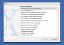

# VIRTUAL MACHINE

| [Back to Home](index.md) | [Back to Applications](apps.md)
| --- | --- |

#### Here are listed **10** programs for this category.

  <label for="app-search-input" style="font-weight: bold;">Search applications:</label>
  <input type="search" id="app-search-input" placeholder="Type a name or keyword..." autocomplete="off"
    style="width: 100%; max-width: 480px; padding: 0.5em 0.75em; margin-top: 0.25em; font-size: 1em; border: 1px solid #999; border-radius: 4px; box-sizing: border-box;">
  

#### *Categories*

  <a class="cat-pill" href="appimages.html">AppImages</a>
  •
  <a class="cat-pill" href="ai.html">ai</a>
  •
  <a class="cat-pill" href="am-utils.html">am-utils</a>
  •
  <a class="cat-pill" href="android.html">android</a>
  •
  <a class="cat-pill" href="appimage-on-the-fly.html">appimage-on-the-fly</a>
  •
  <a class="cat-pill" href="audio.html">audio</a>
  •
  <a class="cat-pill" href="comic.html">comic</a>
  •
  <a class="cat-pill" href="command-line.html">command-line</a>
  •
  <a class="cat-pill" href="communication.html">communication</a>
  •
  <a class="cat-pill" href="disk.html">disk</a>
  •
  <a class="cat-pill" href="education.html">education</a>
  •
  <a class="cat-pill" href="emulator.html">emulator</a>
  •
  <a class="cat-pill" href="file-manager.html">file-manager</a>
  •
  <a class="cat-pill" href="finance.html">finance</a>
  •
  <a class="cat-pill" href="game.html">game</a>
  •
  <a class="cat-pill" href="gnome.html">gnome</a>
  •
  <a class="cat-pill" href="graphic.html">graphic</a>
  •
  <a class="cat-pill" href="internet.html">internet</a>
  •
  <a class="cat-pill" href="kde.html">kde</a>
  •
  <a class="cat-pill" href="metapackages.html">metapackages</a>
  •
  <a class="cat-pill" href="office.html">office</a>
  •
  <a class="cat-pill" href="password.html">password</a>
  •
  <a class="cat-pill" href="portable.html">Portable</a>
  •
  <a class="cat-pill" href="portable-cli.html">portable-cli</a>
  •
  <a class="cat-pill" href="portable-desktop.html">portable-desktop</a>
  •
  <a class="cat-pill" href="steam.html">steam</a>
  •
  <a class="cat-pill" href="system-monitor.html">system-monitor</a>
  •
  <a class="cat-pill" href="video.html">video</a>
  •
  <a class="cat-pill cat-pill--all" href="virtual-machine.html">virtual-machine</a>
  •
  <a class="cat-pill" href="wallet.html">wallet</a>
  •
  <a class="cat-pill" href="web-app.html">web-app</a>
  •
  <a class="cat-pill" href="web-browser.html">web-browser</a>
  •
  <a class="cat-pill" href="wine.html">wine</a>
  •
  <a class="cat-pill" href="youtube.html">youtube</a>

-----------------

***NOTE, Installer scripts (blob/raw) are provided for reading only: do not run them manually! Use "[AM](https://github.com/ivan-hc/AM)" or "[AppMan](https://github.com/ivan-hc/AppMan)" instead.***

-----------------

| ICON | PACKAGE NAME | DESCRIPTION | INSTALLER |
| --- | --- | --- | --- |
|  | [***aranym***](apps/aranym.md) | *Virtual Machine for Atari 32-bit applications.*..[ *read more* ](apps/aranym.md)*!* | [*blob*](https://github.com/ivan-hc/AM/blob/main/programs/x86_64/aranym) **/** [*raw*](https://raw.githubusercontent.com/ivan-hc/AM/main/programs/x86_64/aranym) |
|  | [***gnome-boxes***](apps/gnome-boxes.md) | *Unofficial, A simple GNOME application to access virtual machines.*..[ *read more* ](apps/gnome-boxes.md)*!* | [*blob*](https://github.com/ivan-hc/AM/blob/main/programs/x86_64/gnome-boxes) **/** [*raw*](https://raw.githubusercontent.com/ivan-hc/AM/main/programs/x86_64/gnome-boxes) |
|  | [***pcsx2***](apps/pcsx2.md) | *PCSX2 is a free and open-source PlayStation 2 (PS2) emulator, using a combination of MIPS CPU Interpreters, Recompilers and a Virtual Machine which manages hardware states and PS2 system memory. This allows you to play PS2 games on your PC, with many additional features and benefits.*..[ *read more* ](apps/pcsx2.md)*!* | [*blob*](https://github.com/ivan-hc/AM/blob/main/programs/x86_64/pcsx2) **/** [*raw*](https://raw.githubusercontent.com/ivan-hc/AM/main/programs/x86_64/pcsx2) |
|  | [***pcsx2-nightly***](apps/pcsx2-nightly.md) | *PCSX2 is a free and open-source PlayStation 2 (PS2) emulator, using a combination of MIPS CPU Interpreters, Recompilers and a Virtual Machine which manages hardware states and PS2 system memory. This allows you to play PS2 games on your PC, with many additional features and benefits. This is the nightly version.*..[ *read more* ](apps/pcsx2-nightly.md)*!* | [*blob*](https://github.com/ivan-hc/AM/blob/main/programs/x86_64/pcsx2-nightly) **/** [*raw*](https://raw.githubusercontent.com/ivan-hc/AM/main/programs/x86_64/pcsx2-nightly) |
|  | [***qemu***](apps/qemu.md) | *Unofficial, a generic and open source machine & userspace emulator and virtualizer, to run a virtual machines.*..[ *read more* ](apps/qemu.md)*!* | [*blob*](https://github.com/ivan-hc/AM/blob/main/programs/x86_64/qemu) **/** [*raw*](https://raw.githubusercontent.com/ivan-hc/AM/main/programs/x86_64/qemu) |
|  | [***qemu-ppc***](apps/qemu-ppc.md) | *Run PowerPC operating systems on 64-bit Intel Linux hosts.*..[ *read more* ](apps/qemu-ppc.md)*!* | [*blob*](https://github.com/ivan-hc/AM/blob/main/programs/x86_64/qemu-ppc) **/** [*raw*](https://raw.githubusercontent.com/ivan-hc/AM/main/programs/x86_64/qemu-ppc) |
|  | [***quickgui***](apps/quickgui.md) | *An elegant virtual machine manager for the desktop.*..[ *read more* ](apps/quickgui.md)*!* | [*blob*](https://github.com/ivan-hc/AM/blob/main/programs/x86_64/quickgui) **/** [*raw*](https://raw.githubusercontent.com/ivan-hc/AM/main/programs/x86_64/quickgui) |
|  | [***scummvm***](apps/scummvm.md) | *Unofficial, A 'virtual machine' for several classic graphical point-and-click adventure games*..[ *read more* ](apps/scummvm.md)*!* | [*blob*](https://github.com/ivan-hc/AM/blob/main/programs/x86_64/scummvm) **/** [*raw*](https://raw.githubusercontent.com/ivan-hc/AM/main/programs/x86_64/scummvm) |
|  | [***virt-manager***](apps/virt-manager.md) | *Unofficial AppImage of virt-manager, interface for managing virtual machines.*..[ *read more* ](apps/virt-manager.md)*!* | [*blob*](https://github.com/ivan-hc/AM/blob/main/programs/x86_64/virt-manager) **/** [*raw*](https://raw.githubusercontent.com/ivan-hc/AM/main/programs/x86_64/virt-manager) |
|  | [***virtualbox***](apps/virtualbox.md) | *Powerful x86 virtualization for enterprise as well as home use.*..[ *read more* ](apps/virtualbox.md)*!* | [*blob*](https://github.com/ivan-hc/AM/blob/main/programs/x86_64/virtualbox) **/** [*raw*](https://raw.githubusercontent.com/ivan-hc/AM/main/programs/x86_64/virtualbox) |

---

You can improve these pages via a [pull request](https://github.com/Portable-Linux-Apps/Portable-Linux-Apps.github.io/pulls) to this site's [GitHub repository](https://github.com/Portable-Linux-Apps/Portable-Linux-Apps.github.io), or report any problems related to the installation scripts in the '[issue](https://github.com/ivan-hc/AM/issues)' section of the main database, at [https://github.com/ivan-hc/AM](https://github.com/ivan-hc/AM).

***PORTABLE-LINUX-APPS.github.io is my gift to the Linux community and was made with love for GNU/Linux and the Open Source philosophy.***

---

| [Back to Home](index.md) | [Back to Applications](apps.md)
| --- | --- |

--------

# Contacts
- **Ivan-HC** *on* [**GitHub**](https://github.com/ivan-hc)
- **AM-Ivan** *on* [**Reddit**](https://www.reddit.com/u/am-ivan)

###### *You can support me and my work on [**ko-fi.com**](https://ko-fi.com/IvanAlexHC) and [**PayPal.me**](https://paypal.me/IvanAlexHC). Thank you!*

--------

*© 2020-present Ivan Alessandro Sala aka 'Ivan-HC'* - I'm here just for fun!

