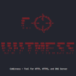
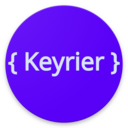

# WEB-APP

| [Back to Home](index.md) | [Back to Applications](apps.md)
| --- | --- |

#### Here are listed **12** programs and **0** items for this category and managed by [AM](https://github.com/ivan-hc/AM) and [AppMan](https://github.com/ivan-hc/AppMan) for the x86_64 architecture.

  <label for="app-search-input" style="font-weight: bold;">Search applications:</label>
  <input type="search" id="app-search-input" placeholder="Type a name or keyword..." autocomplete="off"
    style="width: 100%; max-width: 480px; padding: 0.5em 0.75em; margin-top: 0.25em; font-size: 1em; border: 1px solid #999; border-radius: 4px; box-sizing: border-box;">
  

#### *Categories*

  <a class="cat-pill" href="appimages.html">AppImages</a>
  •
  <a class="cat-pill" href="ai.html">ai</a>
  •
  <a class="cat-pill" href="am-utils.html">am-utils</a>
  •
  <a class="cat-pill" href="appimage-on-the-fly.html">appimage-on-the-fly</a>
  •
  <a class="cat-pill" href="android.html">android</a>
  •
  <a class="cat-pill" href="audio.html">audio</a>
  •
  <a class="cat-pill" href="comic.html">comic</a>
  •
  <a class="cat-pill" href="command-line.html">command-line</a>
  •
  <a class="cat-pill" href="communication.html">communication</a>
  •
  <a class="cat-pill" href="disk.html">disk</a>
  •
  <a class="cat-pill" href="education.html">education</a>
  •
  <a class="cat-pill" href="file-manager.html">file-manager</a>
  •
  <a class="cat-pill" href="finance.html">finance</a>
  •
  <a class="cat-pill" href="game.html">game</a>
  •
  <a class="cat-pill" href="gnome.html">gnome</a>
  •
  <a class="cat-pill" href="graphic.html">graphic</a>
  •
  <a class="cat-pill" href="internet.html">internet</a>
  •
  <a class="cat-pill" href="kde.html">kde</a>
  •
  <a class="cat-pill" href="metapackages.html">metapackages</a>
  •
  <a class="cat-pill" href="office.html">office</a>
  •
  <a class="cat-pill" href="password.html">password</a>
  •
  <a class="cat-pill" href="portable.html">Portable</a>
  •
  <a class="cat-pill" href="portable-cli.html">portable-cli</a>
  •
  <a class="cat-pill" href="portable-desktop.html">portable-desktop</a>
  •
  <a class="cat-pill" href="steam.html">steam</a>
  •
  <a class="cat-pill" href="system-monitor.html">system-monitor</a>
  •
  <a class="cat-pill" href="video.html">video</a>
  •
  <a class="cat-pill cat-pill--all" href="web-app.html">web-app</a>
  •
  <a class="cat-pill" href="web-browser.html">web-browser</a>
  •
  <a class="cat-pill" href="wine.html">wine</a>

-----------------

***NOTE, Installer scripts (blob/raw) are provided for reading only: do not run them manually! Use "[AM](https://github.com/ivan-hc/AM)" or "[AppMan](https://github.com/ivan-hc/AppMan)" instead.***

-----------------

| ICON | PACKAGE NAME | DESCRIPTION | INSTALLER |
| --- | --- | --- | --- |
|  | [***bauh***](apps/bauh.md) | *GUI for managing AppImage, Arch/AUR, DEBs, Flatpak, Snap and webapps.*..[ *read more* ](apps/bauh.md)*!* | [*blob*](https://github.com/ivan-hc/AM/blob/main/programs/x86_64/bauh) **/** [*raw*](https://raw.githubusercontent.com/ivan-hc/AM/main/programs/x86_64/bauh) |
|  | [***cowitness***](apps/cowitness.md) | *A powerful web app testing tool that enhances the accuracy and efficiency of your testing efforts.*..[ *read more* ](apps/cowitness.md)*!* | [*blob*](https://github.com/ivan-hc/AM/blob/main/programs/x86_64/cowitness) **/** [*raw*](https://raw.githubusercontent.com/ivan-hc/AM/main/programs/x86_64/cowitness) |
|  | [***firework***](apps/firework.md) | *Easiest way to turn web applications and sites into desktop applications.*..[ *read more* ](apps/firework.md)*!* | [*blob*](https://github.com/ivan-hc/AM/blob/main/programs/x86_64/firework) **/** [*raw*](https://raw.githubusercontent.com/ivan-hc/AM/main/programs/x86_64/firework) |
|  | [***godmode***](apps/godmode.md) | *AI Chat Browser fast, full webapp access to ChatGPT/Claude/Bard/Bing/Llama2.*..[ *read more* ](apps/godmode.md)*!* | [*blob*](https://github.com/ivan-hc/AM/blob/main/programs/x86_64/godmode) **/** [*raw*](https://raw.githubusercontent.com/ivan-hc/AM/main/programs/x86_64/godmode) |
|  | [***iheartradio-webapp***](apps/iheartradio-webapp.md) | *Election WebApp for iHeartRadio.*..[ *read more* ](apps/iheartradio-webapp.md)*!* | [*blob*](https://github.com/ivan-hc/AM/blob/main/programs/x86_64/iheartradio-webapp) **/** [*raw*](https://raw.githubusercontent.com/ivan-hc/AM/main/programs/x86_64/iheartradio-webapp) |
|  | [***kanon***](apps/kanon.md) | *Maturita GPJP designed for use with kanon web app.*..[ *read more* ](apps/kanon.md)*!* | [*blob*](https://github.com/ivan-hc/AM/blob/main/programs/x86_64/kanon) **/** [*raw*](https://raw.githubusercontent.com/ivan-hc/AM/main/programs/x86_64/kanon) |
|  | [***keyrier-json***](apps/keyrier-json.md) | *A CLI/library/webapp to perfom SQL queries on JSON & CSV.*..[ *read more* ](apps/keyrier-json.md)*!* | [*blob*](https://github.com/ivan-hc/AM/blob/main/programs/x86_64/keyrier-json) **/** [*raw*](https://raw.githubusercontent.com/ivan-hc/AM/main/programs/x86_64/keyrier-json) |
|  | [***onshape***](apps/onshape.md) | *Onshape desktop app, web application shell.*..[ *read more* ](apps/onshape.md)*!* | [*blob*](https://github.com/ivan-hc/AM/blob/main/programs/x86_64/onshape) **/** [*raw*](https://raw.githubusercontent.com/ivan-hc/AM/main/programs/x86_64/onshape) |
|  | [***responsively***](apps/responsively.md) | *A browser for developing responsive web apps.*..[ *read more* ](apps/responsively.md)*!* | [*blob*](https://github.com/ivan-hc/AM/blob/main/programs/x86_64/responsively) **/** [*raw*](https://raw.githubusercontent.com/ivan-hc/AM/main/programs/x86_64/responsively) |
|  | [***spritemate4electron***](apps/spritemate4electron.md) | *A simple Electron-wrapper for Esshahn's awesome Spritemate-webapp.*..[ *read more* ](apps/spritemate4electron.md)*!* | [*blob*](https://github.com/ivan-hc/AM/blob/main/programs/x86_64/spritemate4electron) **/** [*raw*](https://raw.githubusercontent.com/ivan-hc/AM/main/programs/x86_64/spritemate4electron) |
|  | [***station***](apps/station.md) | *A single place for all of your web applications.*..[ *read more* ](apps/station.md)*!* | [*blob*](https://github.com/ivan-hc/AM/blob/main/programs/x86_64/station) **/** [*raw*](https://raw.githubusercontent.com/ivan-hc/AM/main/programs/x86_64/station) |
|  | [***todesktop***](apps/todesktop.md) | *Take your web app codebase and transform it into a cross platform desktop app with native functionality.*..[ *read more* ](apps/todesktop.md)*!* | [*blob*](https://github.com/ivan-hc/AM/blob/main/programs/x86_64/todesktop) **/** [*raw*](https://raw.githubusercontent.com/ivan-hc/AM/main/programs/x86_64/todesktop) |

---

You can improve these pages via a [pull request](https://github.com/Portable-Linux-Apps/Portable-Linux-Apps.github.io/pulls) to this site's [GitHub repository](https://github.com/Portable-Linux-Apps/Portable-Linux-Apps.github.io), or report any problems related to the installation scripts in the '[issue](https://github.com/ivan-hc/AM/issues)' section of the main database, at [https://github.com/ivan-hc/AM](https://github.com/ivan-hc/AM).

***PORTABLE-LINUX-APPS.github.io is my gift to the Linux community and was made with love for GNU/Linux and the Open Source philosophy.***

---

| [Back to Home](index.md) | [Back to Applications](apps.md)
| --- | --- |

--------

# Contacts
- **Ivan-HC** *on* [**GitHub**](https://github.com/ivan-hc)
- **AM-Ivan** *on* [**Reddit**](https://www.reddit.com/u/am-ivan)

###### *You can support me and my work on [**ko-fi.com**](https://ko-fi.com/IvanAlexHC) and [**PayPal.me**](https://paypal.me/IvanAlexHC). Thank you!*

--------

*© 2020-present Ivan Alessandro Sala aka 'Ivan-HC'* - I'm here just for fun!

