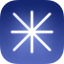

# WEB-BROWSER

| [Home](index.md) |
| --- |

#### Here are listed **65** programs and **0** items for this category and managed by [AM](https://github.com/ivan-hc/AM) 	and [AppMan](https://github.com/ivan-hc/AppMan) for the x86_64 architecture.

*Use your browser's built-in search tool to easily navigate to this page or use the tags below.*

| [Back to Applications](apps.md) |
| --- |

#### *Categories*

***[AppImages](appimages.md)*** 		 - ***[android](android.md)*** - ***[audio](audio.md)*** - ***[comic](comic.md)*** - ***[command-line](command-line.md)*** - ***[communication](communication.md)*** - ***[disk](disk.md)*** - ***[education](education.md)*** - ***[file-manager](file-manager.md)*** - ***[finance](finance.md)*** - ***[game](game.md)*** - ***[gnome](gnome.md)*** - ***[graphic](graphic.md)*** - ***[internet](internet.md)*** - ***[kde](kde.md)*** - ***[office](office.md)*** - ***[password](password.md)*** - ***[steam](steam.md)*** - ***[system-monitor](system-monitor.md)*** - ***[video](video.md)*** - ***[web-app](web-app.md)*** - ***[web-browser](web-browser.md)*** - ***[wine](wine.md)***

-----------------

*NOTE, the installer scripts in the "INSTALLER" column are intended for use via "AM", and are therefore dedicated to a system-wide 	installation of applications (in /opt), and all that "AppMan" does is convert those scripts for local installation, changing the paths. 	**They are listed here for reading purposes only**!*

*Should you decide to run them manually, the only way to remove the application is to run 	the command "`sudo /opt/appname/remove`", where "appname" is the name of the application directory containing the "remove" script. 	Likewise, you can also update applications by running the "AM-updater" script in the same directory.*

*The "AM" project allow the autonomy of installed apps, regardless of the presence of "AM" itself in the system. However, it is strongly 	recommended to use "AM" and "AppMan" to take full advantage of all the benefits you could get from an application installed in this way.*

*If you are here just to download apps manually, click on the program name and check the URL(s) on the application page. This site does not 	provide direct links, for security reasons, but it does provide the exact sources and references where you can find them!*

*Transparency and credibility are the focus of this catalog. Happy exploring!*

-----------------

| ICON | PACKAGE NAME | DESCRIPTION | INSTALLER |
| --- | --- | --- | --- |
|  | [***agregore***](apps/agregore.md) | *A minimal browser for the distributed web, Desktop version.*..[ *read more* ](apps/agregore.md)*!* | [*blob*](https://github.com/ivan-hc/AM/blob/main/programs/x86_64/agregore) **/** [*raw*](https://raw.githubusercontent.com/ivan-hc/AM/main/programs/x86_64/agregore) |
|  | [***archiveweb.page***](apps/archiveweb.page.md) | *A High-Fidelity Web Archiving Extension for Chrome and Chromium based browsers.*..[ *read more* ](apps/archiveweb.page.md)*!* | [*blob*](https://github.com/ivan-hc/AM/blob/main/programs/x86_64/archiveweb.page) **/** [*raw*](https://raw.githubusercontent.com/ivan-hc/AM/main/programs/x86_64/archiveweb.page) |
|  | [***brave***](apps/brave.md) | *Unofficial, a privacy oriented Web Browser based on Chromium, this is the "stable" release.*..[ *read more* ](apps/brave.md)*!* | [*blob*](https://github.com/ivan-hc/AM/blob/main/programs/x86_64/brave) **/** [*raw*](https://raw.githubusercontent.com/ivan-hc/AM/main/programs/x86_64/brave) |
|  | [***brave-beta***](apps/brave-beta.md) | *Unofficial, a privacy oriented Web Browser based on Chromium, this is the "beta" release.*..[ *read more* ](apps/brave-beta.md)*!* | [*blob*](https://github.com/ivan-hc/AM/blob/main/programs/x86_64/brave-beta) **/** [*raw*](https://raw.githubusercontent.com/ivan-hc/AM/main/programs/x86_64/brave-beta) |
|  | [***brave-nightly***](apps/brave-nightly.md) | *Unofficial, a privacy oriented Web Browser based on Chromium, this is the "nightly" release.*..[ *read more* ](apps/brave-nightly.md)*!* | [*blob*](https://github.com/ivan-hc/AM/blob/main/programs/x86_64/brave-nightly) **/** [*raw*](https://raw.githubusercontent.com/ivan-hc/AM/main/programs/x86_64/brave-nightly) |
|  | [***browservice***](apps/browservice.md) | *Browse the modern web on historical browsers.*..[ *read more* ](apps/browservice.md)*!* | [*blob*](https://github.com/ivan-hc/AM/blob/main/programs/x86_64/browservice) **/** [*raw*](https://raw.githubusercontent.com/ivan-hc/AM/main/programs/x86_64/browservice) |
|  | [***catalyst***](apps/catalyst.md) | *Catalyst web browser.*..[ *read more* ](apps/catalyst.md)*!* | [*blob*](https://github.com/ivan-hc/AM/blob/main/programs/x86_64/catalyst) **/** [*raw*](https://raw.githubusercontent.com/ivan-hc/AM/main/programs/x86_64/catalyst) |
|  | [***chromium***](apps/chromium.md) | *Unofficial. FOSS Web Browser, base of Google Chrome, Edge and Brave, stable.*..[ *read more* ](apps/chromium.md)*!* | [*blob*](https://github.com/ivan-hc/AM/blob/main/programs/x86_64/chromium) **/** [*raw*](https://raw.githubusercontent.com/ivan-hc/AM/main/programs/x86_64/chromium) |
|  | [***chromium-beta***](apps/chromium-beta.md) | *Unofficial. FOSS Web Browser, base of Google Chrome, beta edition.*..[ *read more* ](apps/chromium-beta.md)*!* | [*blob*](https://github.com/ivan-hc/AM/blob/main/programs/x86_64/chromium-beta) **/** [*raw*](https://raw.githubusercontent.com/ivan-hc/AM/main/programs/x86_64/chromium-beta) |
|  | [***chromium-edge***](apps/chromium-edge.md) | *Unofficial. FOSS Web Browser, base of Google Chrome, edge edition.*..[ *read more* ](apps/chromium-edge.md)*!* | [*blob*](https://github.com/ivan-hc/AM/blob/main/programs/x86_64/chromium-edge) **/** [*raw*](https://raw.githubusercontent.com/ivan-hc/AM/main/programs/x86_64/chromium-edge) |
|  | [***chromium-rc***](apps/chromium-rc.md) | *Unofficial. FOSS Web Browser, base of Google Chrome, release candidate.*..[ *read more* ](apps/chromium-rc.md)*!* | [*blob*](https://github.com/ivan-hc/AM/blob/main/programs/x86_64/chromium-rc) **/** [*raw*](https://raw.githubusercontent.com/ivan-hc/AM/main/programs/x86_64/chromium-rc) |
|  | [***cromite***](apps/cromite.md) | *Unofficial AppImage of the Cromite web browser.*..[ *read more* ](apps/cromite.md)*!* | [*blob*](https://github.com/ivan-hc/AM/blob/main/programs/x86_64/cromite) **/** [*raw*](https://raw.githubusercontent.com/ivan-hc/AM/main/programs/x86_64/cromite) |
|  | [***deskreen***](apps/deskreen.md) | *Turns any device with a web browser into a secondary screen.*..[ *read more* ](apps/deskreen.md)*!* | [*blob*](https://github.com/ivan-hc/AM/blob/main/programs/x86_64/deskreen) **/** [*raw*](https://raw.githubusercontent.com/ivan-hc/AM/main/programs/x86_64/deskreen) |
|  | [***dezor***](apps/dezor.md) | *The web browser including VPN and Adblocker.*..[ *read more* ](apps/dezor.md)*!* | [*blob*](https://github.com/ivan-hc/AM/blob/main/programs/x86_64/dezor) **/** [*raw*](https://raw.githubusercontent.com/ivan-hc/AM/main/programs/x86_64/dezor) |
|  | [***elzabrowser***](apps/elzabrowser.md) | *Elza incognito web browser.*..[ *read more* ](apps/elzabrowser.md)*!* | [*blob*](https://github.com/ivan-hc/AM/blob/main/programs/x86_64/elzabrowser) **/** [*raw*](https://raw.githubusercontent.com/ivan-hc/AM/main/programs/x86_64/elzabrowser) |
|  | [***falkon***](apps/falkon.md) | *Unofficial. A fast Qt web browser from KDE.*..[ *read more* ](apps/falkon.md)*!* | [*blob*](https://github.com/ivan-hc/AM/blob/main/programs/x86_64/falkon) **/** [*raw*](https://raw.githubusercontent.com/ivan-hc/AM/main/programs/x86_64/falkon) |
|  | [***fifo***](apps/fifo.md) | *A modern web browser, built on top of modern web technologies.*..[ *read more* ](apps/fifo.md)*!* | [*blob*](https://github.com/ivan-hc/AM/blob/main/programs/x86_64/fifo) **/** [*raw*](https://raw.githubusercontent.com/ivan-hc/AM/main/programs/x86_64/fifo) |
|  | [***filebrowser***](apps/filebrowser.md) | *Web File Browser.*..[ *read more* ](apps/filebrowser.md)*!* | [*blob*](https://github.com/ivan-hc/AM/blob/main/programs/x86_64/filebrowser) **/** [*raw*](https://raw.githubusercontent.com/ivan-hc/AM/main/programs/x86_64/filebrowser) |
|  | [***filebrowser-quantum***](apps/filebrowser-quantum.md) | *Web File Browser.*..[ *read more* ](apps/filebrowser-quantum.md)*!* | [*blob*](https://github.com/ivan-hc/AM/blob/main/programs/x86_64/filebrowser-quantum) **/** [*raw*](https://raw.githubusercontent.com/ivan-hc/AM/main/programs/x86_64/filebrowser-quantum) |
|  | [***firedragon***](apps/firedragon.md) | *A web browser based on Floorp (the Vivaldi of Firefox's) with many opiniated settings by default.*..[ *read more* ](apps/firedragon.md)*!* | [*blob*](https://github.com/ivan-hc/AM/blob/main/programs/x86_64/firedragon) **/** [*raw*](https://raw.githubusercontent.com/ivan-hc/AM/main/programs/x86_64/firedragon) |
|  | [***firefox***](apps/firefox.md) | *Fast, powerful and extensible Web Browser, Stable.*..[ *read more* ](apps/firefox.md)*!* | [*blob*](https://github.com/ivan-hc/AM/blob/main/programs/x86_64/firefox) **/** [*raw*](https://raw.githubusercontent.com/ivan-hc/AM/main/programs/x86_64/firefox) |
|  | [***firefox-appimage***](apps/firefox-appimage.md) | *Unofficial, AppImage of the Web Browser, Stable.*..[ *read more* ](apps/firefox-appimage.md)*!* | [*blob*](https://github.com/ivan-hc/AM/blob/main/programs/x86_64/firefox-appimage) **/** [*raw*](https://raw.githubusercontent.com/ivan-hc/AM/main/programs/x86_64/firefox-appimage) |
|  | [***firefox-beta***](apps/firefox-beta.md) | *Fast, powerful and extensible Web Browser, Beta Edition.*..[ *read more* ](apps/firefox-beta.md)*!* | [*blob*](https://github.com/ivan-hc/AM/blob/main/programs/x86_64/firefox-beta) **/** [*raw*](https://raw.githubusercontent.com/ivan-hc/AM/main/programs/x86_64/firefox-beta) |
|  | [***firefox-beta-appimage***](apps/firefox-beta-appimage.md) | *Unofficial, AppImage of the Web Browser, Beta.*..[ *read more* ](apps/firefox-beta-appimage.md)*!* | [*blob*](https://github.com/ivan-hc/AM/blob/main/programs/x86_64/firefox-beta-appimage) **/** [*raw*](https://raw.githubusercontent.com/ivan-hc/AM/main/programs/x86_64/firefox-beta-appimage) |
|  | [***firefox-dev***](apps/firefox-dev.md) | *Fast, powerful and extensible Web Browser, Developer Edition.*..[ *read more* ](apps/firefox-dev.md)*!* | [*blob*](https://github.com/ivan-hc/AM/blob/main/programs/x86_64/firefox-dev) **/** [*raw*](https://raw.githubusercontent.com/ivan-hc/AM/main/programs/x86_64/firefox-dev) |
|  | [***firefox-devedition-appimage***](apps/firefox-devedition-appimage.md) | *Unofficial AppImage of the Web Browser, Dev.*..[ *read more* ](apps/firefox-devedition-appimage.md)*!* | [*blob*](https://github.com/ivan-hc/AM/blob/main/programs/x86_64/firefox-devedition-appimage) **/** [*raw*](https://raw.githubusercontent.com/ivan-hc/AM/main/programs/x86_64/firefox-devedition-appimage) |
|  | [***firefox-esr***](apps/firefox-esr.md) | *Fast, powerful and extensible Web Browser, ESR Edition.*..[ *read more* ](apps/firefox-esr.md)*!* | [*blob*](https://github.com/ivan-hc/AM/blob/main/programs/x86_64/firefox-esr) **/** [*raw*](https://raw.githubusercontent.com/ivan-hc/AM/main/programs/x86_64/firefox-esr) |
|  | [***firefox-esr-appimage***](apps/firefox-esr-appimage.md) | *Unofficial AppImage of the Web Browser, ESR.*..[ *read more* ](apps/firefox-esr-appimage.md)*!* | [*blob*](https://github.com/ivan-hc/AM/blob/main/programs/x86_64/firefox-esr-appimage) **/** [*raw*](https://raw.githubusercontent.com/ivan-hc/AM/main/programs/x86_64/firefox-esr-appimage) |
|  | [***firefox-nightly***](apps/firefox-nightly.md) | *Fast, powerful and extensible Web Browser, Nightly Edition.*..[ *read more* ](apps/firefox-nightly.md)*!* | [*blob*](https://github.com/ivan-hc/AM/blob/main/programs/x86_64/firefox-nightly) **/** [*raw*](https://raw.githubusercontent.com/ivan-hc/AM/main/programs/x86_64/firefox-nightly) |
|  | [***firefox-nightly-appimage***](apps/firefox-nightly-appimage.md) | *Unofficial AppImage of the Web Browser, Nightly.*..[ *read more* ](apps/firefox-nightly-appimage.md)*!* | [*blob*](https://github.com/ivan-hc/AM/blob/main/programs/x86_64/firefox-nightly-appimage) **/** [*raw*](https://raw.githubusercontent.com/ivan-hc/AM/main/programs/x86_64/firefox-nightly-appimage) |
|  | [***floorp***](apps/floorp.md) | *Floorp Web Browser, the most Advanced and Fastest Firefox derivative.*..[ *read more* ](apps/floorp.md)*!* | [*blob*](https://github.com/ivan-hc/AM/blob/main/programs/x86_64/floorp) **/** [*raw*](https://raw.githubusercontent.com/ivan-hc/AM/main/programs/x86_64/floorp) |
|  | [***godmode***](apps/godmode.md) | *AI Chat Browser fast, full webapp access to ChatGPT/Claude/Bard/Bing/Llama2.*..[ *read more* ](apps/godmode.md)*!* | [*blob*](https://github.com/ivan-hc/AM/blob/main/programs/x86_64/godmode) **/** [*raw*](https://raw.githubusercontent.com/ivan-hc/AM/main/programs/x86_64/godmode) |
|  | [***google-chrome***](apps/google-chrome.md) | *Unofficial, Web Browser, Stable version.*..[ *read more* ](apps/google-chrome.md)*!* | [*blob*](https://github.com/ivan-hc/AM/blob/main/programs/x86_64/google-chrome) **/** [*raw*](https://raw.githubusercontent.com/ivan-hc/AM/main/programs/x86_64/google-chrome) |
|  | [***google-chrome-beta***](apps/google-chrome-beta.md) | *Unofficial, Web Browser, Beta version.*..[ *read more* ](apps/google-chrome-beta.md)*!* | [*blob*](https://github.com/ivan-hc/AM/blob/main/programs/x86_64/google-chrome-beta) **/** [*raw*](https://raw.githubusercontent.com/ivan-hc/AM/main/programs/x86_64/google-chrome-beta) |
|  | [***google-chrome-dev***](apps/google-chrome-dev.md) | *Unofficial, Web Browser, Unstable version.*..[ *read more* ](apps/google-chrome-dev.md)*!* | [*blob*](https://github.com/ivan-hc/AM/blob/main/programs/x86_64/google-chrome-dev) **/** [*raw*](https://raw.githubusercontent.com/ivan-hc/AM/main/programs/x86_64/google-chrome-dev) |
|  | [***helium***](apps/helium.md) | *The Chromium-based web browser made for people, with love. Best privacy by default, unbiased ad-blocking, no bloat and no noise.*..[ *read more* ](apps/helium.md)*!* | [*blob*](https://github.com/ivan-hc/AM/blob/main/programs/x86_64/helium) **/** [*raw*](https://raw.githubusercontent.com/ivan-hc/AM/main/programs/x86_64/helium) |
|  | [***icecat***](apps/icecat.md) | *GNU IceCat is the GNU version of the Firefox web browser.*..[ *read more* ](apps/icecat.md)*!* | [*blob*](https://github.com/ivan-hc/AM/blob/main/programs/x86_64/icecat) **/** [*raw*](https://raw.githubusercontent.com/ivan-hc/AM/main/programs/x86_64/icecat) |
|  | [***ladybird***](apps/ladybird.md) | *A truly independent web browser, using a novel engine based on web standards.*..[ *read more* ](apps/ladybird.md)*!* | [*blob*](https://github.com/ivan-hc/AM/blob/main/programs/x86_64/ladybird) **/** [*raw*](https://raw.githubusercontent.com/ivan-hc/AM/main/programs/x86_64/ladybird) |
|  | [***librewolf***](apps/librewolf.md) | *Firefox-based Web Browser focused on privacy, security, freedom.*..[ *read more* ](apps/librewolf.md)*!* | [*blob*](https://github.com/ivan-hc/AM/blob/main/programs/x86_64/librewolf) **/** [*raw*](https://raw.githubusercontent.com/ivan-hc/AM/main/programs/x86_64/librewolf) |
|  | [***mercury***](apps/mercury.md) | *Firefox fork with compiler optimizations and patches from Librewolf.*..[ *read more* ](apps/mercury.md)*!* | [*blob*](https://github.com/ivan-hc/AM/blob/main/programs/x86_64/mercury) **/** [*raw*](https://raw.githubusercontent.com/ivan-hc/AM/main/programs/x86_64/mercury) |
|  | [***microsoft-edge***](apps/microsoft-edge.md) | *Web Browser provided by Microsoft, Stable Edition.*..[ *read more* ](apps/microsoft-edge.md)*!* | [*blob*](https://github.com/ivan-hc/AM/blob/main/programs/x86_64/microsoft-edge) **/** [*raw*](https://raw.githubusercontent.com/ivan-hc/AM/main/programs/x86_64/microsoft-edge) |
|  | [***microsoft-edge-beta***](apps/microsoft-edge-beta.md) | *Web Browser provided by Microsoft, Beta Edition.*..[ *read more* ](apps/microsoft-edge-beta.md)*!* | [*blob*](https://github.com/ivan-hc/AM/blob/main/programs/x86_64/microsoft-edge-beta) **/** [*raw*](https://raw.githubusercontent.com/ivan-hc/AM/main/programs/x86_64/microsoft-edge-beta) |
|  | [***microsoft-edge-dev***](apps/microsoft-edge-dev.md) | *Web Browser provided by Microsoft, Developer Edition.*..[ *read more* ](apps/microsoft-edge-dev.md)*!* | [*blob*](https://github.com/ivan-hc/AM/blob/main/programs/x86_64/microsoft-edge-dev) **/** [*raw*](https://raw.githubusercontent.com/ivan-hc/AM/main/programs/x86_64/microsoft-edge-dev) |
|  | [***midori***](apps/midori.md) | *Surf lightly, quickly and safely with Midori Web Browser.*..[ *read more* ](apps/midori.md)*!* | [*blob*](https://github.com/ivan-hc/AM/blob/main/programs/x86_64/midori) **/** [*raw*](https://raw.githubusercontent.com/ivan-hc/AM/main/programs/x86_64/midori) |
|  | [***mullvad-browser***](apps/mullvad-browser.md) | *A Tor-based Web Browser.*..[ *read more* ](apps/mullvad-browser.md)*!* | [*blob*](https://github.com/ivan-hc/AM/blob/main/programs/x86_64/mullvad-browser) **/** [*raw*](https://raw.githubusercontent.com/ivan-hc/AM/main/programs/x86_64/mullvad-browser) |
|  | [***ncsa-mosaic***](apps/ncsa-mosaic.md) | *One of the first graphical web browsers.*..[ *read more* ](apps/ncsa-mosaic.md)*!* | [*blob*](https://github.com/ivan-hc/AM/blob/main/programs/x86_64/ncsa-mosaic) **/** [*raw*](https://raw.githubusercontent.com/ivan-hc/AM/main/programs/x86_64/ncsa-mosaic) |
|  | [***opera***](apps/opera.md) | *Unofficial. Fast and secure web browser, Stable version.*..[ *read more* ](apps/opera.md)*!* | [*blob*](https://github.com/ivan-hc/AM/blob/main/programs/x86_64/opera) **/** [*raw*](https://raw.githubusercontent.com/ivan-hc/AM/main/programs/x86_64/opera) |
|  | [***opera-beta***](apps/opera-beta.md) | *Unofficial. Fast and secure web browser, Beta version.*..[ *read more* ](apps/opera-beta.md)*!* | [*blob*](https://github.com/ivan-hc/AM/blob/main/programs/x86_64/opera-beta) **/** [*raw*](https://raw.githubusercontent.com/ivan-hc/AM/main/programs/x86_64/opera-beta) |
|  | [***opera-dev***](apps/opera-dev.md) | *Unofficial. Fast and secure web browser, Developer version.*..[ *read more* ](apps/opera-dev.md)*!* | [*blob*](https://github.com/ivan-hc/AM/blob/main/programs/x86_64/opera-dev) **/** [*raw*](https://raw.githubusercontent.com/ivan-hc/AM/main/programs/x86_64/opera-dev) |
|  | [***palemoon***](apps/palemoon.md) | *Web browser, a Firefox fork with a classic UI and modern APIs.*..[ *read more* ](apps/palemoon.md)*!* | [*blob*](https://github.com/ivan-hc/AM/blob/main/programs/x86_64/palemoon) **/** [*raw*](https://raw.githubusercontent.com/ivan-hc/AM/main/programs/x86_64/palemoon) |
|  | [***polypane***](apps/polypane.md) | *Browser for web developers.*..[ *read more* ](apps/polypane.md)*!* | [*blob*](https://github.com/ivan-hc/AM/blob/main/programs/x86_64/polypane) **/** [*raw*](https://raw.githubusercontent.com/ivan-hc/AM/main/programs/x86_64/polypane) |
|  | [***promethium***](apps/promethium.md) | *Extensible and innovative web browser with built-in AdBlock.*..[ *read more* ](apps/promethium.md)*!* | [*blob*](https://github.com/ivan-hc/AM/blob/main/programs/x86_64/promethium) **/** [*raw*](https://raw.githubusercontent.com/ivan-hc/AM/main/programs/x86_64/promethium) |
|  | [***responsively***](apps/responsively.md) | *A browser for developing responsive web apps.*..[ *read more* ](apps/responsively.md)*!* | [*blob*](https://github.com/ivan-hc/AM/blob/main/programs/x86_64/responsively) **/** [*raw*](https://raw.githubusercontent.com/ivan-hc/AM/main/programs/x86_64/responsively) |
|  | [***servo***](apps/servo.md) | *Unofficial AppImage builds of the Servo web browser engine.*..[ *read more* ](apps/servo.md)*!* | [*blob*](https://github.com/ivan-hc/AM/blob/main/programs/x86_64/servo) **/** [*raw*](https://raw.githubusercontent.com/ivan-hc/AM/main/programs/x86_64/servo) |
|  | [***theweb***](apps/theweb.md) | *Web Browser.*..[ *read more* ](apps/theweb.md)*!* | [*blob*](https://github.com/ivan-hc/AM/blob/main/programs/x86_64/theweb) **/** [*raw*](https://raw.githubusercontent.com/ivan-hc/AM/main/programs/x86_64/theweb) |
|  | [***thorium***](apps/thorium.md) | *Web Browser, a Chromium fork including Widevine and FFmpeg support.*..[ *read more* ](apps/thorium.md)*!* | [*blob*](https://github.com/ivan-hc/AM/blob/main/programs/x86_64/thorium) **/** [*raw*](https://raw.githubusercontent.com/ivan-hc/AM/main/programs/x86_64/thorium) |
|  | [***tor-browser***](apps/tor-browser.md) | *Privacy-oriented Web Browser for sites blocked in your country.*..[ *read more* ](apps/tor-browser.md)*!* | [*blob*](https://github.com/ivan-hc/AM/blob/main/programs/x86_64/tor-browser) **/** [*raw*](https://raw.githubusercontent.com/ivan-hc/AM/main/programs/x86_64/tor-browser) |
|  | [***tor-browser-alpha***](apps/tor-browser-alpha.md) | *Privacy-oriented Web Browser for sites blocked in your country.*..[ *read more* ](apps/tor-browser-alpha.md)*!* | [*blob*](https://github.com/ivan-hc/AM/blob/main/programs/x86_64/tor-browser-alpha) **/** [*raw*](https://raw.githubusercontent.com/ivan-hc/AM/main/programs/x86_64/tor-browser-alpha) |
|  | [***ungoogled-chromium***](apps/ungoogled-chromium.md) | *Chromium Web Browser without Google services.*..[ *read more* ](apps/ungoogled-chromium.md)*!* | [*blob*](https://github.com/ivan-hc/AM/blob/main/programs/x86_64/ungoogled-chromium) **/** [*raw*](https://raw.githubusercontent.com/ivan-hc/AM/main/programs/x86_64/ungoogled-chromium) |
|  | [***viper-browser***](apps/viper-browser.md) | *Fast and lightweight Qt web browser.*..[ *read more* ](apps/viper-browser.md)*!* | [*blob*](https://github.com/ivan-hc/AM/blob/main/programs/x86_64/viper-browser) **/** [*raw*](https://raw.githubusercontent.com/ivan-hc/AM/main/programs/x86_64/viper-browser) |
|  | [***vivaldi-snapshot***](apps/vivaldi-snapshot.md) | *Unofficial. Advanced Web Browser, Testing Version.*..[ *read more* ](apps/vivaldi-snapshot.md)*!* | [*blob*](https://github.com/ivan-hc/AM/blob/main/programs/x86_64/vivaldi-snapshot) **/** [*raw*](https://raw.githubusercontent.com/ivan-hc/AM/main/programs/x86_64/vivaldi-snapshot) |
|  | [***vivaldi-stable***](apps/vivaldi-stable.md) | *Unofficial. Advanced Web Browser, Stable Version.*..[ *read more* ](apps/vivaldi-stable.md)*!* | [*blob*](https://github.com/ivan-hc/AM/blob/main/programs/x86_64/vivaldi-stable) **/** [*raw*](https://raw.githubusercontent.com/ivan-hc/AM/main/programs/x86_64/vivaldi-stable) |
|  | [***waterfox***](apps/waterfox.md) | *A privacy-focused web browser engineered to give you speed, control, and peace of mind on the internet.*..[ *read more* ](apps/waterfox.md)*!* | [*blob*](https://github.com/ivan-hc/AM/blob/main/programs/x86_64/waterfox) **/** [*raw*](https://raw.githubusercontent.com/ivan-hc/AM/main/programs/x86_64/waterfox) |
|  | [***wexond***](apps/wexond.md) | *Extensible, fast and innovative web browser with material UI.*..[ *read more* ](apps/wexond.md)*!* | [*blob*](https://github.com/ivan-hc/AM/blob/main/programs/x86_64/wexond) **/** [*raw*](https://raw.githubusercontent.com/ivan-hc/AM/main/programs/x86_64/wexond) |
|  | [***zen-browser***](apps/zen-browser.md) | *Experience tranquillity while browsing the web without tracking.*..[ *read more* ](apps/zen-browser.md)*!* | [*blob*](https://github.com/ivan-hc/AM/blob/main/programs/x86_64/zen-browser) **/** [*raw*](https://raw.githubusercontent.com/ivan-hc/AM/main/programs/x86_64/zen-browser) |

---

You can improve these pages via a [pull request](https://github.com/Portable-Linux-Apps/Portable-Linux-Apps.github.io/pulls) 	to this site's [GitHub repository](https://github.com/Portable-Linux-Apps/Portable-Linux-Apps.github.io),  	or report any problems related to the installation scripts in the '[issue](https://github.com/ivan-hc/AM/issues)' 	section of the main database, at [https://github.com/ivan-hc/AM](https://github.com/ivan-hc/AM).

***PORTABLE-LINUX-APPS.github.io is my gift to the Linux community and was made with love for GNU/Linux and the Open Source philosophy.***

---

| [Back to Home](index.md) | [Back to Applications](apps.md)
| --- | --- |

--------

# Contacts
- **Ivan-HC** *on* [**GitHub**](https://github.com/ivan-hc)
- **AM-Ivan** *on* [**Reddit**](https://www.reddit.com/u/am-ivan)

###### *You can support me and my work on [**ko-fi.com**](https://ko-fi.com/IvanAlexHC) and 	[**PayPal.me**](https://paypal.me/IvanAlexHC). Thank you!*

--------

*© 2020-present Ivan Alessandro Sala aka 'Ivan-HC'* - I'm here just for fun!

